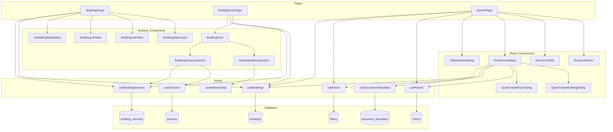
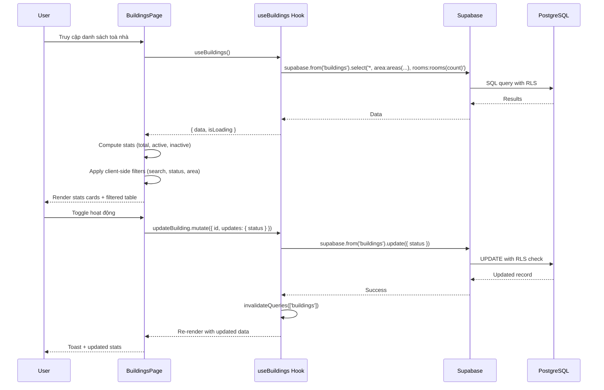
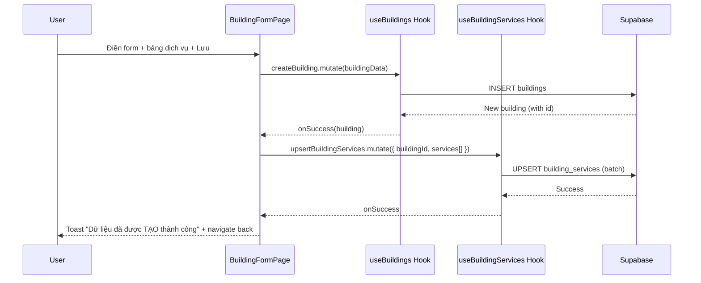

# Tài liệu Thiết kế - Tái triển khai Module Toà nhà & Căn hộ

## Tổng quan (Overview)

Module Toà nhà & Căn hộ được tái triển khai hoàn toàn để khớp với tài liệu nghiệp vụ Resident. Hệ thống hiện tại có database schema cơ bản (bảng `buildings` và `rooms` trong migration 002) và frontend components đơn giản. Tái triển khai bao gồm:

1. **Database migration**: Tạo bảng `building_services` (junction table liên kết buildings ↔ services với toggle sử dụng và đơn giá riêng), thêm cột `invoice_template_id` và `lease_template_id` vào bảng `rooms`.
2. **Frontend**: Tái triển khai BuildingsPage (3 thẻ thống kê, bộ lọc search/status/area, bảng với toggle hoạt động), BuildingFormPage (thông tin cơ bản + địa chỉ cascading + Dịch vụ toà nhà), RoomsPage (bộ lọc toà nhà/tầng/status, bảng với toggle), RoomFormDialog (dropdown toà nhà/tầng có quick-create, mẫu hoá đơn/hợp đồng).
3. **Hooks**: Tạo `useBuildingServices` mới, cập nhật `useBuildings` và `useRooms` với filters và toggle status.

### Quyết định thiết kế chính

| Quyết định | Lựa chọn | Lý do |
|---|---|---|
| Building form pattern | Full-page form (không dùng dialog) | Form phức tạp với nhiều section (thông tin cơ bản, địa chỉ cascading, bảng dịch vụ) cần không gian lớn |
| Room form pattern | Dialog | Form đơn giản hơn, phù hợp dialog |
| Building status | Chỉ dùng ACTIVE/INACTIVE (bỏ MAINTENANCE) | Theo yêu cầu nghiệp vụ Resident, toggle chỉ có bật/tắt |
| Room status toggle | AVAILABLE ↔ UNAVAILABLE | Toggle hoạt động map sang 2 giá trị này, giữ nguyên các status khác (OCCUPIED, RESERVED) |
| Building services | Junction table `building_services` | Cho phép mỗi toà nhà bật/tắt dịch vụ và override đơn giá riêng |
| Quick-create building/floor | Inline dialog trong room form | Không rời form, UX tốt hơn |
| Address cascading | Dùng hook `useAddressData` hiện có (provinces.open-api.vn) | Đã có sẵn, hoạt động tốt |
| Document templates | Dùng hook `useDocumentTemplatesByType` hiện có | Đã có sẵn cho invoice và lease_contract types |
| Stats cards | Computed từ filtered data client-side | Đơn giản, data set nhỏ (< 1000 buildings) |
| Navigation rooms from building | URL query param `?building_id=xxx` | Cho phép deep link và back navigation |

## Kiến trúc (Architecture)

### Tổng quan kiến trúc



### Luồng dữ liệu






## Components và Interfaces

### 1. Building Module

#### BuildingsPage (`src/pages/buildings/BuildingsPage.tsx`)
Trang chính quản lý toà nhà. Tái triển khai hoàn toàn theo layout Resident.

```typescript
interface BuildingsPageState {
  searchTerm: string;
  statusFilter: 'all' | 'ACTIVE' | 'INACTIVE';
  areaFilter: string;                    // area_id hoặc 'all'
  createDialogOpen: boolean;             // unused, navigate to form page
  deleteDialogOpen: boolean;
  selectedBuilding: BuildingWithRelations | null;
}
```

**Cấu trúc render:**
1. Breadcrumb "Danh mục dữ liệu > Toà nhà"
2. `BuildingStatsCards` - 3 thẻ: Tất cả toà nhà, Đang hoạt động (xanh), Ngừng hoạt động (đỏ)
3. `BuildingListFilters` - Search + Status dropdown + Area dropdown
4. Toolbar - Nút (+) Thêm toà nhà, Search icon, Refresh, Grid/List toggle
5. `BuildingListTable` - Bảng: Mã, Thao tác (sửa xanh, xoá đỏ, in), Tên toà nhà, Địa chỉ, Số căn hộ (link "Xem"), Ngày TT, Hoạt động (toggle)
6. `DeleteBuildingDialog` - Xác nhận xoá

#### BuildingStatsCards (`src/components/buildings/BuildingStatsCards.tsx`)

```typescript
interface BuildingStatsCardsProps {
  total: number;
  active: number;
  inactive: number;
}
```

3 thẻ Card hiển thị số liệu. Thẻ "Đang hoạt động" có icon/border màu xanh, "Ngừng hoạt động" có icon/border màu đỏ.

#### BuildingListFilters (`src/components/buildings/BuildingListFilters.tsx`)

```typescript
interface BuildingListFiltersProps {
  searchTerm: string;
  onSearchChange: (value: string) => void;
  statusFilter: string;
  onStatusChange: (value: string) => void;
  areaFilter: string;
  onAreaChange: (value: string) => void;
  areas: Area[];
}
```

#### BuildingListTable (`src/components/buildings/BuildingListTable.tsx`)

```typescript
interface BuildingListTableProps {
  buildings: BuildingWithRelations[];
  onEdit: (building: BuildingWithRelations) => void;
  onDelete: (building: BuildingWithRelations) => void;
  onToggleStatus: (id: string, newStatus: 'ACTIVE' | 'INACTIVE') => void;
  onViewRooms: (buildingId: string) => void;
}
```

Cột "Số căn hộ" hiển thị count + link "Xem" navigate tới `/rooms?building_id={id}`.
Cột "Hoạt động" dùng shadcn Switch component.

#### BuildingFormPage (`src/pages/buildings/BuildingFormPage.tsx`)
Full-page form thêm/sửa toà nhà. Route: `/buildings/new` và `/buildings/:id/edit`.

```typescript
interface BuildingFormPageProps {
  mode: 'create' | 'edit';
}
```

#### BuildingForm (`src/components/buildings/BuildingForm.tsx`)
Form chính với React Hook Form + Zod validation.

```typescript
interface BuildingFormProps {
  defaultValues?: Partial<BuildingFormData>;
  buildingId?: string;                    // for edit mode, load building_services
  onSubmit: (data: BuildingFormData, services: BuildingServiceFormData[]) => void;
  isSubmitting: boolean;
}
```

**Sections:**
1. Tiêu đề "TOÀ NHÀ"
2. Thông tin cơ bản: Tên toà nhà (*), Tên viết tắt/Mã toà
3. Thông tin địa chỉ: `BuildingAddressSection` (cascading dropdowns)
4. Toggle Hoạt động (mặc định BẬT)
5. Dịch vụ toà nhà: `BuildingServicesSection` (bảng toggle + đơn giá)
6. Nút Lưu + Huỷ bỏ

#### BuildingAddressSection (`src/components/buildings/BuildingAddressSection.tsx`)

```typescript
interface BuildingAddressSectionProps {
  control: Control<BuildingFormData>;
  setValue: UseFormSetValue<BuildingFormData>;
  watch: UseFormWatch<BuildingFormData>;
}
```

Sử dụng `useProvinces`, `useDistricts`, `useWards` từ `useAddressData.ts`.
Khi thay đổi Tỉnh → reset Quận + Phường.
Khi thay đổi Quận → reset Phường.

#### BuildingServicesSection (`src/components/buildings/BuildingServicesSection.tsx`)

```typescript
interface BuildingServiceFormData {
  service_id: string;
  service_name: string;
  is_active: boolean;
  unit_price_override: number | null;     // null = dùng giá mặc định
  default_unit_price: number;             // giá mặc định từ services table
}

interface BuildingServicesSectionProps {
  services: BuildingServiceFormData[];
  onChange: (services: BuildingServiceFormData[]) => void;
  onAddService?: () => void;              // quick-add service
}
```

Bảng với cột: Sử dụng (Switch toggle), Tên dịch vụ (text), Đơn giá (number input, placeholder = giá mặc định).
Nút (+) thêm dịch vụ mới nhanh.

#### DeleteBuildingDialog (`src/components/buildings/DeleteBuildingDialog.tsx`)

```typescript
interface DeleteBuildingDialogProps {
  open: boolean;
  onOpenChange: (open: boolean) => void;
  building: BuildingWithRelations;
}
```

Kiểm tra rooms count trước khi cho phép xoá. Nếu có rooms → hiển thị cảnh báo.

### 2. Room Module

#### RoomsPage (`src/pages/rooms/RoomsPage.tsx`)
Trang chính quản lý căn hộ. Tái triển khai hoàn toàn.

```typescript
interface RoomsPageState {
  searchTerm: string;
  buildingFilter: string;                 // building_id hoặc 'all'
  floorFilter: string;                    // floor_id hoặc 'all'
  statusFilter: string;                   // 'all' | room_status values
  createDialogOpen: boolean;
  editDialogOpen: boolean;
  deleteDialogOpen: boolean;
  selectedRoom: RoomWithRelations | null;
}
```

**Cấu trúc render:**
1. Breadcrumb "Danh mục dữ liệu > Căn hộ"
2. `RoomListFilters` - Search + Toà nhà dropdown + Tầng dropdown (cascading) + Status dropdown
3. Toolbar - Nút (+) Thêm căn hộ, Search, Refresh, Grid/List toggle
4. `RoomListTable` - Bảng: Tên phòng, Toà nhà, Tầng, Diện tích, Giá thuê, Tiền cọc, Số khách tối đa, Hoạt động (toggle)
5. `RoomFormDialog` - Thêm/Sửa căn hộ
6. `DeleteRoomDialog` - Xác nhận xoá

Hỗ trợ URL query param `?building_id=xxx` để pre-filter khi navigate từ BuildingsPage.

#### RoomListFilters (`src/components/rooms/RoomListFilters.tsx`)

```typescript
interface RoomListFiltersProps {
  searchTerm: string;
  onSearchChange: (value: string) => void;
  buildingFilter: string;
  onBuildingChange: (value: string) => void;
  floorFilter: string;
  onFloorChange: (value: string) => void;
  statusFilter: string;
  onStatusChange: (value: string) => void;
  buildings: BuildingWithRelations[];
  floors: Floor[];
}
```

#### RoomListTable (`src/components/rooms/RoomListTable.tsx`)

```typescript
interface RoomListTableProps {
  rooms: RoomWithRelations[];
  onEdit: (room: RoomWithRelations) => void;
  onDelete: (room: RoomWithRelations) => void;
  onToggleStatus: (id: string, isActive: boolean) => void;
}
```

#### RoomFormDialog (`src/components/rooms/RoomFormDialog.tsx`)
Dialog thêm/sửa căn hộ.

```typescript
interface RoomFormDialogProps {
  open: boolean;
  onOpenChange: (open: boolean) => void;
  room?: RoomWithRelations;               // undefined = create mode
  preselectedBuildingId?: string;         // from URL query param
}
```

**Fields:**
1. Toà nhà (*) - dropdown danh sách buildings ACTIVE, kèm option "Thêm toà nhà" → mở `QuickCreateBuildingDialog`
2. Tầng (*) - dropdown lọc theo toà nhà đã chọn, kèm option "Thêm tầng" → mở `QuickCreateFloorDialog`
3. Tên phòng (*)
4. Tiền thuê (*) - number input
5. Tiền cọc (*) - number input
6. Diện tích - number input (optional)
7. Số khách tối đa - number input (optional)
8. Toggle Hoạt động (mặc định BẬT)
9. Mẫu hoá đơn - dropdown từ `useDocumentTemplatesByType('invoice')`
10. Mẫu hợp đồng thuê - dropdown từ `useDocumentTemplatesByType('lease_contract')`

#### QuickCreateBuildingDialog (`src/components/rooms/QuickCreateBuildingDialog.tsx`)

```typescript
interface QuickCreateBuildingDialogProps {
  open: boolean;
  onOpenChange: (open: boolean) => void;
  onCreated: (building: Building) => void; // auto-select in parent dropdown
}
```

Dialog nhỏ: Tên toà nhà (*), Mã toà (optional). Tạo building với status ACTIVE, address mặc định.

#### QuickCreateFloorDialog (`src/components/rooms/QuickCreateFloorDialog.tsx`)

```typescript
interface QuickCreateFloorDialogProps {
  open: boolean;
  onOpenChange: (open: boolean) => void;
  buildingId: string;
  onCreated: (floor: Floor) => void;      // auto-select in parent dropdown
}
```

Dialog nhỏ: Số tầng (*), Tên tầng (optional).

#### DeleteRoomDialog (`src/components/rooms/DeleteRoomDialog.tsx`)

```typescript
interface DeleteRoomDialogProps {
  open: boolean;
  onOpenChange: (open: boolean) => void;
  room: RoomWithRelations;
}
```

### 3. Hooks

#### useBuildingServices (`src/hooks/useBuildingServices.ts`) - Mới

```typescript
// Query: load building services for a building
useBuildingServices(buildingId: string): UseQueryResult<BuildingServiceRow[]>

// Mutation: upsert building services (batch)
useUpsertBuildingServices(): UseMutationResult<void, Error, {
  buildingId: string;
  services: { service_id: string; is_active: boolean; unit_price_override: number | null }[];
}>
```

#### useBuildings (`src/hooks/useBuildings.ts`) - Cập nhật

Giữ nguyên API hiện tại, bổ sung:
- `useUpdateBuildingStatus` - mutation riêng cho toggle status (optimistic update)

#### useRooms (`src/hooks/useRooms.ts`) - Cập nhật

Giữ nguyên API hiện tại, bổ sung:
- Query rooms kèm `invoice_template_id`, `lease_template_id`
- `useUpdateRoomStatus` đã có sẵn

### 4. Validation Schemas

#### Building Validation (`src/lib/buildingValidation.ts`)

```typescript
import { z } from 'zod';

export const buildingSchema = z.object({
  name: z.string().min(1, 'Tên toà nhà không được để trống'),
  code: z.string().optional().or(z.literal('')),
  province: z.string().min(1, 'Tỉnh/Thành phố không được để trống'),
  district: z.string().min(1, 'Quận/Huyện không được để trống'),
  ward: z.string().min(1, 'Xã/Phường không được để trống'),
  street_address: z.string().min(1, 'Địa chỉ chi tiết không được để trống'),
  area_id: z.string().uuid().optional().or(z.literal('')),
  status: z.enum(['ACTIVE', 'INACTIVE']).default('ACTIVE'),
});

export const buildingServiceSchema = z.object({
  service_id: z.string().uuid(),
  is_active: z.boolean(),
  unit_price_override: z.number().min(0, 'Đơn giá không được âm').nullable(),
});

export type BuildingFormData = z.infer<typeof buildingSchema>;
```

#### Room Validation (`src/lib/roomValidation.ts`)

```typescript
import { z } from 'zod';

export const roomSchema = z.object({
  building_id: z.string().uuid('Vui lòng chọn toà nhà'),
  floor: z.number().int().positive('Vui lòng chọn tầng'),
  name: z.string().min(1, 'Tên phòng không được để trống'),
  rent_price: z.number().min(0, 'Tiền thuê không được âm'),
  deposit_amount: z.number().min(0, 'Tiền cọc không được âm'),
  area: z.number().positive('Diện tích phải là số dương').nullable().optional(),
  max_occupants: z.number().int().positive('Số khách tối đa phải là số nguyên dương').nullable().optional(),
  status: z.enum(['AVAILABLE', 'OCCUPIED', 'RESERVED', 'MAINTENANCE', 'UNAVAILABLE']).default('AVAILABLE'),
  invoice_template_id: z.string().uuid().nullable().optional(),
  lease_template_id: z.string().uuid().nullable().optional(),
});

export type RoomFormData = z.infer<typeof roomSchema>;
```


## Data Models

### Database Migration: `20250703000001_building_room_reimplementation.sql`

#### 1. Tạo bảng `building_services` (junction table)

```sql
-- =============================================
-- Building Services Junction Table
-- Links buildings to services with per-building toggle and price override
-- =============================================

CREATE TABLE building_services (
  id UUID PRIMARY KEY DEFAULT gen_random_uuid(),
  building_id UUID NOT NULL REFERENCES buildings(id) ON DELETE CASCADE,
  service_id UUID NOT NULL REFERENCES services(id) ON DELETE CASCADE,

  -- Configuration
  is_active BOOLEAN NOT NULL DEFAULT true,
  unit_price_override DECIMAL(15, 2),     -- NULL = use default from services table

  -- Timestamps
  created_at TIMESTAMPTZ NOT NULL DEFAULT NOW(),
  updated_at TIMESTAMPTZ NOT NULL DEFAULT NOW(),

  -- Unique constraint: one service per building
  CONSTRAINT building_services_unique UNIQUE (building_id, service_id),
  CONSTRAINT building_services_price_non_negative CHECK (unit_price_override IS NULL OR unit_price_override >= 0)
);

-- Indexes
CREATE INDEX idx_building_services_building_id ON building_services(building_id);
CREATE INDEX idx_building_services_service_id ON building_services(service_id);

-- RLS Policies
ALTER TABLE building_services ENABLE ROW LEVEL SECURITY;

CREATE POLICY "Users can view own building services"
  ON building_services FOR SELECT
  USING (
    EXISTS (
      SELECT 1 FROM buildings
      WHERE buildings.id = building_services.building_id
        AND buildings.user_id = auth.uid()
    )
  );

CREATE POLICY "Users can insert own building services"
  ON building_services FOR INSERT
  WITH CHECK (
    EXISTS (
      SELECT 1 FROM buildings
      WHERE buildings.id = building_services.building_id
        AND buildings.user_id = auth.uid()
    )
  );

CREATE POLICY "Users can update own building services"
  ON building_services FOR UPDATE
  USING (
    EXISTS (
      SELECT 1 FROM buildings
      WHERE buildings.id = building_services.building_id
        AND buildings.user_id = auth.uid()
    )
  );

CREATE POLICY "Users can delete own building services"
  ON building_services FOR DELETE
  USING (
    EXISTS (
      SELECT 1 FROM buildings
      WHERE buildings.id = building_services.building_id
        AND buildings.user_id = auth.uid()
    )
  );

-- Trigger updated_at
CREATE TRIGGER update_building_services_updated_at
  BEFORE UPDATE ON building_services
  FOR EACH ROW EXECUTE FUNCTION update_updated_at_column();

COMMENT ON TABLE building_services IS 'Junction table linking buildings to services with per-building toggle and price override';
```

#### 2. Thêm cột template vào bảng `rooms`

```sql
-- Add invoice and lease template references to rooms
ALTER TABLE rooms
  ADD COLUMN IF NOT EXISTS invoice_template_id UUID REFERENCES document_templates(id) ON DELETE SET NULL,
  ADD COLUMN IF NOT EXISTS lease_template_id UUID REFERENCES document_templates(id) ON DELETE SET NULL;

-- Indexes for template lookups
CREATE INDEX IF NOT EXISTS idx_rooms_invoice_template_id ON rooms(invoice_template_id);
CREATE INDEX IF NOT EXISTS idx_rooms_lease_template_id ON rooms(lease_template_id);
```

### TypeScript Types

#### `src/types/building.ts`

```typescript
export type BuildingStatus = 'ACTIVE' | 'INACTIVE';

export interface Building {
  id: string;
  user_id: string;
  area_id: string | null;
  name: string;
  code: string | null;
  type: string;
  status: BuildingStatus;
  province: string;
  district: string;
  ward: string;
  street_address: string | null;
  total_floors: number;
  total_rooms: number;
  description: string | null;
  images: any;
  amenities: any;
  created_at: string;
  updated_at: string;
  deleted_at: string | null;
}

export interface BuildingWithRelations extends Building {
  area?: { id: string; name: string; code: string | null } | null;
  rooms_count?: number;
}

export interface BuildingService {
  id: string;
  building_id: string;
  service_id: string;
  is_active: boolean;
  unit_price_override: number | null;
  created_at: string;
  updated_at: string;
}

export interface BuildingServiceWithDetails extends BuildingService {
  service: {
    id: string;
    name: string;
    unit_price: number;
    unit: string | null;
  };
}

export interface BuildingFormData {
  name: string;
  code?: string;
  province: string;
  district: string;
  ward: string;
  street_address: string;
  area_id?: string;
  status: BuildingStatus;
}

export interface BuildingServiceFormData {
  service_id: string;
  service_name: string;
  is_active: boolean;
  unit_price_override: number | null;
  default_unit_price: number;
}
```

#### `src/types/room.ts`

```typescript
export type RoomStatus = 'AVAILABLE' | 'OCCUPIED' | 'RESERVED' | 'MAINTENANCE' | 'UNAVAILABLE';

export interface Room {
  id: string;
  building_id: string;
  name: string;
  code: string | null;
  floor: number;
  status: RoomStatus;
  area: number | null;
  max_occupants: number | null;
  rent_price: number;
  deposit_amount: number;
  description: string | null;
  images: any;
  amenities: any;
  invoice_template_id: string | null;
  lease_template_id: string | null;
  created_at: string;
  updated_at: string;
  deleted_at: string | null;
}

export interface RoomWithRelations extends Room {
  building?: {
    id: string;
    name: string;
    code: string | null;
    area_id: string | null;
  } | null;
}

export interface RoomFormData {
  building_id: string;
  floor: number;
  name: string;
  rent_price: number;
  deposit_amount: number;
  area?: number | null;
  max_occupants?: number | null;
  status: RoomStatus;
  invoice_template_id?: string | null;
  lease_template_id?: string | null;
}
```


## Correctness Properties

*A property is a characteristic or behavior that should hold true across all valid executions of a system — essentially, a formal statement about what the system should do. Properties serve as the bridge between human-readable specifications and machine-verifiable correctness guarantees.*

### Property 1: Building stats consistency

*For any* list of buildings, the "Tất cả" count should equal the total number of non-deleted buildings, the "Đang hoạt động" count should equal the number of buildings with status ACTIVE, and the "Ngừng hoạt động" count should equal the number with status INACTIVE. Furthermore, total should always equal active + inactive.

**Validates: Requirements 1.2, 11.4**

### Property 2: Building filter correctness

*For any* list of buildings and any combination of filters (search term, status, area), the filtered list should contain only buildings that match ALL applied filters simultaneously. A building matches the search filter if its name, code, or street_address contains the search term (case-insensitive). A building matches the status filter if its status equals the selected value. A building matches the area filter if its area_id equals the selected value.

**Validates: Requirements 1.4**

### Property 3: Building status toggle round-trip

*For any* building with status ACTIVE, toggling should set status to INACTIVE. For any building with status INACTIVE, toggling should set status to ACTIVE. Toggling twice should return to the original status (idempotence).

**Validates: Requirements 1.7, 11.1, 11.2**

### Property 4: Building validation rejects invalid data

*For any* building form data where name is empty/whitespace, or province is empty, or district is empty, or ward is empty, or street_address is empty, the Zod validation schema should reject the data with appropriate error messages for each invalid field.

**Validates: Requirements 2.10, 3.3, 12.1, 12.2**

### Property 5: Building create-read round-trip

*For any* valid building data (non-empty name, valid address fields), creating a building then reading it back should produce data where all user-provided fields match the original input.

**Validates: Requirements 2.9, 3.1, 3.2, 12.9**

### Property 6: Building services loading and validation

*For any* set of user services, the building services section should display all services. For any building service with unit_price_override that is negative, validation should reject. For any building and service pair, only one building_service record should exist (uniqueness).

**Validates: Requirements 2.6, 9.5, 12.8**

### Property 7: Building soft-delete exclusion

*For any* building, after performing a soft-delete (setting deleted_at), the building should not appear in normal list queries (where deleted_at IS NULL).

**Validates: Requirements 4.2**

### Property 8: Building delete guard with active rooms

*For any* building that has one or more non-deleted rooms, attempting to delete the building should be rejected with an error message containing the room count.

**Validates: Requirements 4.3**

### Property 9: Room validation rejects invalid data

*For any* room form data where name is empty/whitespace, or building_id is missing, or floor is missing, or rent_price is negative, or deposit_amount is negative, or area (when provided) is not positive, or max_occupants (when provided) is not a positive integer, the Zod validation schema should reject the data with appropriate error messages.

**Validates: Requirements 6.9, 7.3, 12.3, 12.4, 12.5, 12.6, 12.7**

### Property 10: Room create-read round-trip

*For any* valid room data (valid building_id, floor, non-empty name, non-negative rent_price and deposit_amount), creating a room then reading it back should produce data where all user-provided fields match the original input, including invoice_template_id and lease_template_id.

**Validates: Requirements 6.8, 7.1, 7.2, 12.10**

### Property 11: Room name uniqueness per building

*For any* building, creating two rooms with the same name should fail on the second creation with a duplicate name error.

**Validates: Requirements 6.10**

### Property 12: Room status toggle

*For any* room, toggling "Hoạt động" on should set status to AVAILABLE, and toggling off should set status to UNAVAILABLE. Other statuses (OCCUPIED, RESERVED, MAINTENANCE) should not be affected by the toggle.

**Validates: Requirements 11.3**

### Property 13: Room soft-delete and count update

*For any* room, after performing a soft-delete, the room should not appear in normal list queries. Additionally, the parent building's rooms_count should decrease by 1 after the deletion.

**Validates: Requirements 8.2, 8.3**

### Property 14: Cascading address filtering

*For any* province selection, the districts dropdown should only contain districts belonging to that province. For any district selection, the wards dropdown should only contain wards belonging to that district.

**Validates: Requirements 13.2, 13.3**

### Property 15: Cascading address reset on parent change

*For any* change to the province value, the district and ward values should be reset to empty. For any change to the district value, the ward value should be reset to empty.

**Validates: Requirements 13.4, 13.5**

### Property 16: Floor dropdown cascading by building

*For any* building selection in the room form, the floor dropdown should only contain floors belonging to the selected building.

**Validates: Requirements 6.3**


## Error Handling

### Database Errors

| Error Code | Context | User Message |
|---|---|---|
| `23505` (unique violation) | Building code duplicate | "Mã tòa nhà đã tồn tại" |
| `23505` (unique violation) | Room name duplicate per building | "Tên phòng đã tồn tại trong toà nhà này" |
| `23505` (unique violation) | Building service duplicate | "Dịch vụ này đã được thêm cho toà nhà" |
| `23503` (FK violation) | Invalid area_id, building_id, template_id | "Dữ liệu liên kết không tồn tại" |
| RLS policy denial | Unauthorized access | "Không có quyền truy cập dữ liệu này" |
| Network error | Connection failure | "Lỗi kết nối, vui lòng thử lại" |

### Business Logic Errors

| Scenario | Handling |
|---|---|
| Delete building with rooms | Show "Không thể xóa tòa nhà đang có N căn hộ", reject delete |
| Add floor without selecting building | Show "Vui lòng chọn toà nhà trước" toast |
| Toggle status fails | Revert optimistic update, show error toast |
| Address API unavailable | Show empty dropdown with "Không tải được dữ liệu" message |

### Validation Errors

- Zod validation errors are displayed inline below each field using React Hook Form's `formState.errors`
- Toast notifications for server-side errors (duplicate, FK violations)
- All error messages in Vietnamese

### Optimistic Updates

- Toggle status uses optimistic update pattern: update UI immediately, revert on error
- List invalidation after mutations ensures data consistency

## Testing Strategy

### Unit Tests

Unit tests focus on specific examples, edge cases, and error conditions:

- Building form default values (status = ACTIVE, toggle = on)
- Room form default values (status = AVAILABLE, toggle = on)
- Building delete guard with 0 rooms (should allow)
- Building delete guard with N rooms (should reject)
- Quick-create building dialog creates minimal building
- Quick-create floor dialog requires building selection
- Navigation from building "Xem" link to rooms page with query param
- Breadcrumb rendering for both pages

### Property-Based Tests

Property-based tests verify universal properties across all inputs. Use `fast-check` library for TypeScript.

Each property test must:
- Run minimum 100 iterations
- Reference the design document property with a tag comment
- Use `fc.assert(fc.property(...))` pattern

**Tag format:** `Feature: building-room-reimplementation, Property {number}: {title}`

Property tests to implement:

1. **Property 1**: Generate random lists of buildings with ACTIVE/INACTIVE status, verify stats computation
2. **Property 2**: Generate random buildings + random filter combinations, verify filter correctness
3. **Property 3**: Generate random building status, verify toggle produces opposite status, double toggle returns original
4. **Property 4**: Generate random building form data with some required fields empty, verify Zod rejects
5. **Property 5**: Generate valid building data, mock Supabase create/read, verify round-trip
6. **Property 6**: Generate random services list, verify all appear in section; generate negative prices, verify rejection
7. **Property 7**: Generate random building, mock soft-delete, verify exclusion from queries
8. **Property 8**: Generate random building with N rooms (N > 0), verify delete rejection
9. **Property 9**: Generate random room form data with some fields invalid, verify Zod rejects
10. **Property 10**: Generate valid room data, mock Supabase create/read, verify round-trip
11. **Property 11**: Generate random building + room name, create twice, verify second fails
12. **Property 12**: Generate random room, verify toggle maps AVAILABLE ↔ UNAVAILABLE
13. **Property 13**: Generate random room, mock soft-delete, verify exclusion + count decrease
14. **Property 14**: Generate random province/district, verify child dropdown filtering
15. **Property 15**: Generate random address state, change parent, verify children reset
16. **Property 16**: Generate random building + floors, verify floor dropdown only shows matching floors

### Test File Structure

```
src/__tests__/
  buildings/
    buildingStats.test.ts          # Property 1
    buildingFilters.test.ts        # Property 2
    buildingToggle.test.ts         # Property 3
    buildingValidation.test.ts     # Property 4, 6
    buildingRoundTrip.test.ts      # Property 5
    buildingDelete.test.ts         # Property 7, 8
  rooms/
    roomValidation.test.ts         # Property 9
    roomRoundTrip.test.ts          # Property 10
    roomUniqueness.test.ts         # Property 11
    roomToggle.test.ts             # Property 12
    roomDelete.test.ts             # Property 13
  shared/
    addressCascading.test.ts       # Property 14, 15
    floorCascading.test.ts         # Property 16
```

### Test Configuration

```typescript
// vitest.config.ts - already configured in project
// fast-check configuration per test:
fc.assert(
  fc.property(
    fc.array(buildingArbitrary),
    (buildings) => {
      // property assertion
    }
  ),
  { numRuns: 100 }
);
```
