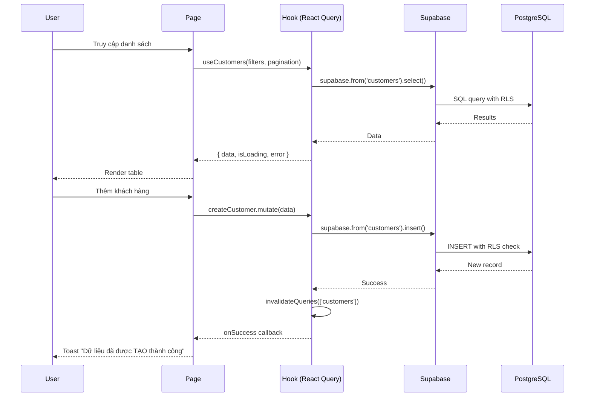

# Tài liệu Thiết kế - Tái triển khai Module Khách hàng & Phương tiện

## Tổng quan (Overview)

Module Khách hàng & Phương tiện được tái triển khai hoàn toàn để khớp với tài liệu nghiệp vụ Resident. Hệ thống hiện tại có database schema cơ bản (bảng `customers` migration 016, bảng `vehicles` migration 003 liên kết với `tenants`) và frontend components đơn giản. Tái triển khai bao gồm:

1. **Database migration**: Cập nhật `customer_status` enum (RENTING, MOVED_OUT, WALK_IN), thêm `ELECTRIC_BIKE` vào `vehicle_type`, thêm cột mới cho `vehicles` (customer_id thay tenant_id, vehicle_name, owner_name, ticket_number, building_id, room_id, image_url), tạo bảng `ct01_declarations`.
2. **Frontend**: Tái triển khai hoàn toàn CustomersPage (tabs trạng thái, thống kê, bộ lọc cascading, toolbar), CustomerForm (cá nhân/tổ chức toggle), CustomerDetailModal, CT01Form, VehiclesPage, VehicleFormDialog, Import/Export Excel.
3. **Types & Hooks**: Tạo `src/types/customer.ts`, `src/types/vehicle.ts` standalone types, cập nhật hooks với filters, pagination, search.

### Quyết định thiết kế chính

| Quyết định | Lựa chọn | Lý do |
|---|---|---|
| Migration strategy | ALTER TABLE vehicles, thêm customer_id, giữ tenant_id nullable | Backward compatibility, dữ liệu cũ không bị mất |
| Customer status enum | Tạo mới `customer_status_v2` (RENTING, MOVED_OUT, WALK_IN) | Enum cũ (PROSPECT, ACTIVE, INACTIVE, BLACKLIST) không khớp nghiệp vụ |
| Vehicle type enum | ALTER TYPE thêm ELECTRIC_BIKE | Yêu cầu mới từ tài liệu |
| Component pattern | Theo pattern invoice module (Page → Stats + Filters + Toolbar + Table) | Consistency với codebase hiện tại |
| Form pattern | Full-page form cho customer (nhiều section), Dialog cho vehicle | Customer form phức tạp cần full page, vehicle form đơn giản hơn |
| Type definitions | Standalone types trong `src/types/` | Theo pattern invoice module, không phụ thuộc auto-generated types |
| Address cascading | Province → District → Ward từ static JSON data | Không cần API bên ngoài, dữ liệu hành chính VN ổn định |
| CT01 print | CSS @media print + window.print() | Đơn giản, không cần thư viện PDF |
| Excel import/export | Sử dụng thư viện `xlsx` đã có trong project | Đã có pattern trong `src/lib/excelHelpers.ts` |
| Image upload | Supabase Storage bucket `customer-images` và `vehicle-images` | Theo pattern `src/lib/storage.ts` |

## Kiến trúc (Architecture)

### Tổng quan kiến trúc

```mermaid
graph TB
    subgraph Pages
        CP[CustomersPage]
        CFP[CustomerFormPage]
        CT01P[CT01FormPage]
        VP[VehiclesPage]
    end

    subgraph Components
        subgraph Customer Components
            CST[CustomerStatusTabs]
            CSS[CustomerStatsCards]
            CLF[CustomerListFilters]
            CLT[CustomerListToolbar]
            CLTB[CustomerListTable]
            CDM[CustomerDetailModal]
            CF[CustomerForm]
            CIF[CustomerIndividualFields]
            COF[CustomerOrganizationFields]
            CVS[CustomerVehiclesSection]
            CIE[CustomerImportExportDialog]
        end

        subgraph Vehicle Components
            VLT[VehicleListToolbar]
            VLTB[VehicleListTable]
            VFD[VehicleFormDialog]
            VIE[VehicleImportExportDialog]
        end

        subgraph CT01 Components
            CT01F[CT01Form]
            CT01P2[CT01PrintLayout]
            CT01FM[CT01FamilyMembersTable]
        end

        subgraph Shared
            ACD[AddressCascadingDropdowns]
            IUZ[ImageUploadZone]
        end
    end

    subgraph Hooks
        UC[useCustomers]
        UV[useVehicles]
        UCT[useCT01Declarations]
        UAD[useAddressData]
    end

    subgraph Lib
        CEH[customerExcelHelpers]
        VEH[vehicleExcelHelpers]
        CV[customerValidation]
        VV[vehicleValidation]
    end

    subgraph Types
        CTY[customer.ts]
        VTY[vehicle.ts]
    end

    CP --> CST & CSS & CLF & CLT & CLTB & CDM
    CFP --> CF --> CIF & COF & CVS & ACD & IUZ
    CT01P --> CT01F & CT01P2 & CT01FM
    VP --> VLT & VLTB & VFD

    CP & CFP & CDM --> UC
    VP & VFD --> UV
    CT01P --> UCT
    CF --> UAD

    UC & UV & UCT --> Supabase[(Supabase)]
    CEH & VEH --> xlsx[xlsx library]
    CF & VFD --> CV & VV
```



### Luồng dữ liệu



## Components và Interfaces

### 1. Customer Module

#### CustomersPage (`src/pages/customers/CustomersPage.tsx`)
Trang chính quản lý khách hàng. Theo pattern InvoicesPage.

```typescript
// State management
interface CustomersPageState {
  activeTab: CustomerStatus;           // RENTING | MOVED_OUT | WALK_IN
  activeStatFilter: StatFilterType;    // ALL | INDIVIDUAL | ORGANIZATION | FOREIGN
  filters: CustomerFilters;            // area, building, room, bed
  searchQuery: string;
  page: number;
  pageSize: number;
  selectedCustomer: Customer | null;
  detailModalOpen: boolean;
}
```

**Cấu trúc render:**
1. `CustomerStatusTabs` - 3 tabs: Đang thuê, Đã chuyển đi, Khách vãng lai
2. `CustomerStatsCards` - 4 thẻ: Tất cả, Cá nhân, Doanh nghiệp, Khách nước ngoài
3. `CustomerListFilters` - Cascading dropdowns: Khu vực → Toà nhà → Phòng → Giường
4. `CustomerListToolbar` - Search + Thêm/Export/Import/Print/View toggle
5. `CustomerListTable` - Bảng dữ liệu với pagination
6. `CustomerDetailModal` - Modal xem chi tiết

#### CustomerFormPage (`src/pages/customers/CustomerFormPage.tsx`)
Full-page form thêm/sửa khách hàng. Route: `/customers/new` và `/customers/:id/edit`.

```typescript
interface CustomerFormPageProps {
  mode: 'create' | 'edit';
}
```

#### CustomerForm (`src/components/customers/CustomerForm.tsx`)
Form chính với React Hook Form + Zod validation.

```typescript
interface CustomerFormProps {
  defaultValues?: Partial<CustomerFormData>;
  onSubmit: (data: CustomerFormData) => void;
  isSubmitting: boolean;
}
```

**Sections:**
1. Toggle Cá nhân / Tổ chức
2. Image upload zone (4 ảnh: avatar, CCCD trước, CCCD sau, hộ chiếu)
3. Thông tin chung (conditional fields based on customer_type)
4. Toggle Khách nước ngoài (hiện thêm fields khi bật)
5. Địa chỉ (cascading dropdowns)
6. Tài chính & Liên lạc
7. Nhóm khách hàng + Ghi chú
8. Thông tin xe (inline vehicle list)

#### CustomerDetailModal (`src/components/customers/CustomerDetailModal.tsx`)

```typescript
interface CustomerDetailModalProps {
  open: boolean;
  onOpenChange: (open: boolean) => void;
  customerId: string;
}
```

**Actions:** Sao chép, Sửa, Xoá, Link CT01.

### 2. Vehicle Module

#### VehiclesPage (`src/pages/vehicles/VehiclesPage.tsx`)
Trang chính quản lý phương tiện. Tái triển khai hoàn toàn.

```typescript
interface VehiclesPageState {
  searchQuery: string;
  page: number;
  pageSize: number;
  createDialogOpen: boolean;
  editDialogOpen: boolean;
  selectedVehicle: Vehicle | null;
}
```

**Cấu trúc render:**
1. Breadcrumb "Khách hàng > Phương tiện"
2. Search bar
3. `VehicleListToolbar` - Thêm/Export/Import/Print/View toggle
4. `VehicleListTable` - Bảng: Mã PT, Thao tác, Thông tin xe, Khách hàng, Vị trí
5. Pagination

#### VehicleFormDialog (`src/components/vehicles/VehicleFormDialog.tsx`)
Dialog thêm/sửa phương tiện.

```typescript
interface VehicleFormDialogProps {
  open: boolean;
  onOpenChange: (open: boolean) => void;
  vehicle?: Vehicle; // undefined = create mode
}
```

**Fields:** Image upload, Loại PT, Tên dòng xe, Màu xe, Biển số, Tên chủ xe, Số vé xe, Toà nhà (dropdown), Phòng (cascading), Khách hàng (dropdown).

### 3. CT01 Module

#### CT01FormPage (`src/pages/customers/CT01FormPage.tsx`)
Route: `/customers/:id/ct01`

#### CT01Form (`src/components/customers/CT01Form.tsx`)

```typescript
interface CT01FormProps {
  customerId: string;
  onSave: (data: CT01FormData) => void;
}
```

#### CT01PrintLayout (`src/components/customers/CT01PrintLayout.tsx`)
Layout in ấn khổ A4 theo mẫu quy định nhà nước.

```typescript
interface CT01PrintLayoutProps {
  data: CT01Declaration;
}
```

### 4. Shared Components

#### AddressCascadingDropdowns (`src/components/customers/AddressCascadingDropdowns.tsx`)

```typescript
interface AddressCascadingDropdownsProps {
  provinceValue?: string;
  districtValue?: string;
  wardValue?: string;
  onProvinceChange: (value: string) => void;
  onDistrictChange: (value: string) => void;
  onWardChange: (value: string) => void;
}
```

#### ImageUploadZone (`src/components/customers/ImageUploadZone.tsx`)

```typescript
interface ImageUploadZoneProps {
  label: string;
  value?: string;           // current image URL
  onChange: (url: string) => void;
  accept?: string;          // default: "image/png,image/jpeg"
  maxSizeMB?: number;       // default: 10
}
```

### 5. Hooks

#### useCustomers (`src/hooks/useCustomers.ts`) - Tái triển khai

```typescript
// Query hooks
useCustomers(filters?: CustomerFilters, pagination?: PaginationParams): UseQueryResult
useCustomer(id: string): UseQueryResult
useCustomerStats(filters?: CustomerFilters): UseQueryResult

// Mutation hooks
useCreateCustomer(): UseMutationResult
useUpdateCustomer(): UseMutationResult
useDeleteCustomer(): UseMutationResult  // soft-delete
```

#### useVehicles (`src/hooks/useVehicles.ts`) - Tái triển khai

```typescript
useVehicles(filters?: VehicleFilters, pagination?: PaginationParams): UseQueryResult
useVehicle(id: string): UseQueryResult
useCreateVehicle(): UseMutationResult
useUpdateVehicle(): UseMutationResult
useDeleteVehicle(): UseMutationResult  // soft-delete
```

#### useCT01Declarations (`src/hooks/useCT01Declarations.ts`) - Mới

```typescript
useCT01Declarations(customerId: string): UseQueryResult
useCreateCT01Declaration(): UseMutationResult
```

#### useAddressData (`src/hooks/useAddressData.ts`) - Mới

```typescript
useProvinces(): { provinces: Province[] }
useDistricts(provinceCode: string): { districts: District[] }
useWards(districtCode: string): { wards: Ward[] }
```

### 6. Lib utilities

#### customerExcelHelpers (`src/lib/customerExcelHelpers.ts`)

```typescript
exportCustomers(customers: Customer[], filters: CustomerFilters): void
downloadCustomerImportTemplate(): void
parseCustomerExcel(file: File): Promise<ImportResult<CustomerImportRow>>
```

#### vehicleExcelHelpers (`src/lib/vehicleExcelHelpers.ts`)

```typescript
exportVehicles(vehicles: Vehicle[]): void
downloadVehicleImportTemplate(): void
parseVehicleExcel(file: File): Promise<ImportResult<VehicleImportRow>>
```


## Data Models

### Database Migration: `20250701000001_customer_vehicle_reimplementation.sql`

#### 1. Cập nhật Enums

```sql
-- Thêm ELECTRIC_BIKE vào vehicle_type enum
ALTER TYPE vehicle_type ADD VALUE IF NOT EXISTS 'ELECTRIC_BIKE';

-- Tạo customer_status_v2 enum (thay thế customer_status cũ)
CREATE TYPE customer_status_v2 AS ENUM (
  'RENTING',     -- Đang thuê
  'MOVED_OUT',   -- Đã chuyển đi
  'WALK_IN'      -- Khách vãng lai
);
```

#### 2. Cập nhật bảng customers

```sql
-- Thêm cột status_v2 sử dụng enum mới
ALTER TABLE customers ADD COLUMN status_v2 customer_status_v2 DEFAULT 'RENTING';

-- Migrate dữ liệu cũ
UPDATE customers SET status_v2 = CASE
  WHEN status = 'ACTIVE' THEN 'RENTING'::customer_status_v2
  WHEN status = 'INACTIVE' THEN 'MOVED_OUT'::customer_status_v2
  ELSE 'WALK_IN'::customer_status_v2
END;

-- Thêm các cột mới cho tổ chức
ALTER TABLE customers
  ADD COLUMN IF NOT EXISTS company_name TEXT,
  ADD COLUMN IF NOT EXISTS tax_code TEXT,
  ADD COLUMN IF NOT EXISTS representative TEXT,
  ADD COLUMN IF NOT EXISTS business_registration_url TEXT,
  ADD COLUMN IF NOT EXISTS headquarters_address TEXT;
```

#### 3. Cập nhật bảng vehicles

```sql
-- Thêm customer_id FK (nullable ban đầu để backward compat)
ALTER TABLE vehicles
  ADD COLUMN IF NOT EXISTS customer_id UUID REFERENCES customers(id) ON DELETE SET NULL,
  ADD COLUMN IF NOT EXISTS vehicle_name TEXT,       -- Tên dòng xe
  ADD COLUMN IF NOT EXISTS owner_name TEXT,         -- Tên chủ xe theo đăng ký
  ADD COLUMN IF NOT EXISTS ticket_number TEXT,      -- Số vé xe
  ADD COLUMN IF NOT EXISTS building_id UUID REFERENCES buildings(id) ON DELETE SET NULL,
  ADD COLUMN IF NOT EXISTS room_id UUID REFERENCES rooms(id) ON DELETE SET NULL,
  ADD COLUMN IF NOT EXISTS image_url TEXT;          -- Ảnh phương tiện

-- Indexes mới
CREATE INDEX IF NOT EXISTS idx_vehicles_customer_id ON vehicles(customer_id);
CREATE INDEX IF NOT EXISTS idx_vehicles_building_id ON vehicles(building_id);
CREATE INDEX IF NOT EXISTS idx_vehicles_room_id ON vehicles(room_id);
CREATE INDEX IF NOT EXISTS idx_vehicles_vehicle_name ON vehicles(vehicle_name);
CREATE INDEX IF NOT EXISTS idx_vehicles_owner_name ON vehicles(owner_name);

-- Full-text search cho vehicles
CREATE INDEX IF NOT EXISTS idx_vehicles_search ON vehicles USING GIN (
  to_tsvector('simple',
    coalesce(license_plate, '') || ' ' ||
    coalesce(vehicle_name, '') || ' ' ||
    coalesce(owner_name, '')
  )
);
```

#### 4. Tạo bảng ct01_declarations

```sql
CREATE TABLE ct01_declarations (
  id UUID PRIMARY KEY DEFAULT gen_random_uuid(),
  user_id UUID NOT NULL REFERENCES auth.users(id) ON DELETE CASCADE,
  customer_id UUID NOT NULL REFERENCES customers(id) ON DELETE CASCADE,

  -- Thông tin người khai
  registration_authority TEXT NOT NULL,  -- Cơ quan đăng ký cư trú
  full_name TEXT NOT NULL,
  date_of_birth DATE NOT NULL,
  gender TEXT NOT NULL,
  id_number TEXT NOT NULL,
  phone TEXT,
  email TEXT,

  -- Địa chỉ
  permanent_address TEXT,
  temporary_address TEXT,
  current_address TEXT,

  -- Nghề nghiệp
  occupation_workplace TEXT,

  -- Thông tin chủ hộ
  household_head_name TEXT,
  household_head_relationship TEXT,
  household_head_id_number TEXT,

  -- Nội dung đề nghị
  request_content TEXT,

  -- Thành viên gia đình (JSONB array)
  family_members JSONB DEFAULT '[]'::jsonb,

  -- Timestamps
  created_at TIMESTAMPTZ NOT NULL DEFAULT NOW(),
  updated_at TIMESTAMPTZ NOT NULL DEFAULT NOW()
);

-- Indexes
CREATE INDEX idx_ct01_user_id ON ct01_declarations(user_id);
CREATE INDEX idx_ct01_customer_id ON ct01_declarations(customer_id);

-- RLS
ALTER TABLE ct01_declarations ENABLE ROW LEVEL SECURITY;

CREATE POLICY "Users can view own ct01" ON ct01_declarations
  FOR SELECT USING (auth.uid() = user_id);
CREATE POLICY "Users can insert own ct01" ON ct01_declarations
  FOR INSERT WITH CHECK (auth.uid() = user_id);
CREATE POLICY "Users can update own ct01" ON ct01_declarations
  FOR UPDATE USING (auth.uid() = user_id);
CREATE POLICY "Users can delete own ct01" ON ct01_declarations
  FOR DELETE USING (auth.uid() = user_id);

-- Trigger updated_at
CREATE TRIGGER update_ct01_updated_at
  BEFORE UPDATE ON ct01_declarations
  FOR EACH ROW EXECUTE FUNCTION update_updated_at_column();
```

### TypeScript Types

#### `src/types/customer.ts`

```typescript
// Enums
export type CustomerType = 'INDIVIDUAL' | 'ORGANIZATION';
export type CustomerStatus = 'RENTING' | 'MOVED_OUT' | 'WALK_IN';
export type StatFilterType = 'ALL' | 'INDIVIDUAL' | 'ORGANIZATION' | 'FOREIGN';

// Core entity
export interface Customer {
  id: string;
  user_id: string;
  customer_type: CustomerType;
  full_name: string;
  phone: string;
  email: string | null;
  date_of_birth: string | null;
  gender: string | null;
  id_number: string | null;
  id_issue_date: string | null;
  id_issue_place: string | null;
  province: string | null;
  district: string | null;
  ward: string | null;
  detailed_address: string | null;
  current_residence: string | null;
  permanent_address: string | null;
  bank_account_number: string | null;
  bank_name: string | null;
  occupation: string | null;
  workplace: string | null;
  contact_person: string | null;
  contact_person_phone: string | null;
  advisor: string | null;
  advisor_phone: string | null;
  fingerprint_code: string | null;
  customer_group: string | null;
  is_foreign: boolean;
  status_v2: CustomerStatus;
  notes: string | null;
  avatar_url: string | null;
  id_images: Record<string, string> | null; // { front, back, passport }
  // Organization fields
  company_name: string | null;
  tax_code: string | null;
  representative: string | null;
  business_registration_url: string | null;
  headquarters_address: string | null;
  // Timestamps
  created_at: string;
  updated_at: string;
  deleted_at: string | null;
}

// Filters
export interface CustomerFilters {
  status?: CustomerStatus;
  statFilter?: StatFilterType;
  area_id?: string;
  building_id?: string;
  room_id?: string;
  bed_id?: string;
  search?: string;
}

// Stats
export interface CustomerStats {
  total: number;
  individual: number;
  organization: number;
  foreign: number;
}

// Form data
export interface CustomerFormData {
  customer_type: CustomerType;
  full_name: string;
  phone: string;
  email?: string;
  date_of_birth?: string;
  gender?: string;
  id_number?: string;
  id_issue_date?: string;
  id_issue_place?: string;
  is_foreign: boolean;
  province?: string;
  district?: string;
  ward?: string;
  detailed_address?: string;
  current_residence?: string;
  permanent_address?: string;
  bank_account_number?: string;
  bank_name?: string;
  occupation?: string;
  workplace?: string;
  contact_person?: string;
  contact_person_phone?: string;
  advisor?: string;
  advisor_phone?: string;
  fingerprint_code?: string;
  customer_group?: string;
  notes?: string;
  avatar_url?: string;
  id_images?: Record<string, string>;
  // Organization
  company_name?: string;
  tax_code?: string;
  representative?: string;
  business_registration_url?: string;
  headquarters_address?: string;
  // Inline vehicles
  vehicles?: InlineVehicle[];
}

export interface InlineVehicle {
  vehicle_type: string;
  vehicle_name: string;
  license_plate: string;
}

// CT01
export interface CT01Declaration {
  id: string;
  user_id: string;
  customer_id: string;
  registration_authority: string;
  full_name: string;
  date_of_birth: string;
  gender: string;
  id_number: string;
  phone: string | null;
  email: string | null;
  permanent_address: string | null;
  temporary_address: string | null;
  current_address: string | null;
  occupation_workplace: string | null;
  household_head_name: string | null;
  household_head_relationship: string | null;
  household_head_id_number: string | null;
  request_content: string | null;
  family_members: CT01FamilyMember[];
  created_at: string;
  updated_at: string;
}

export interface CT01FamilyMember {
  full_name: string;
  date_of_birth: string;
  gender: string;
  id_number: string;
  occupation_workplace: string;
  relationship_to_declarant: string;
  relationship_to_household_head: string;
}

export interface CT01FormData {
  registration_authority: string;
  full_name: string;
  date_of_birth: string;
  gender: string;
  id_number: string;
  phone?: string;
  email?: string;
  permanent_address?: string;
  temporary_address?: string;
  current_address?: string;
  occupation_workplace?: string;
  household_head_name?: string;
  household_head_relationship?: string;
  household_head_id_number?: string;
  request_content?: string;
  family_members: CT01FamilyMember[];
}
```

#### `src/types/vehicle.ts`

```typescript
export type VehicleType = 'MOTORBIKE' | 'CAR' | 'BICYCLE' | 'ELECTRIC_BIKE' | 'OTHER';

export interface Vehicle {
  id: string;
  user_id: string;
  customer_id: string | null;
  tenant_id: string | null;  // legacy, kept for backward compat
  vehicle_type: VehicleType;
  vehicle_name: string | null;
  license_plate: string | null;
  color: string | null;
  owner_name: string | null;
  ticket_number: string | null;
  building_id: string | null;
  room_id: string | null;
  image_url: string | null;
  parking_fee: number | null;
  notes: string | null;
  created_at: string;
  updated_at: string;
  deleted_at: string | null;
}

export interface VehicleWithRelations extends Vehicle {
  customer?: {
    id: string;
    full_name: string;
    phone: string | null;
  } | null;
  building?: {
    id: string;
    name: string;
  } | null;
  room?: {
    id: string;
    name: string;
  } | null;
}

export interface VehicleFilters {
  search?: string;
  vehicle_type?: VehicleType;
  building_id?: string;
  customer_id?: string;
}

export interface VehicleFormData {
  vehicle_type: VehicleType;
  vehicle_name: string;
  color: string;
  license_plate: string;
  owner_name: string;
  ticket_number?: string;
  building_id?: string;
  room_id?: string;
  customer_id?: string;
  image_url?: string;
}

// Excel import
export interface VehicleImportRow {
  vehicle_type: string;
  vehicle_name: string;
  color: string;
  license_plate: string;
  owner_name: string;
  ticket_number?: string;
  building_name?: string;
  room_name?: string;
  customer_name?: string;
}
```

### Zod Validation Schemas

#### Customer Validation (`src/lib/customerValidation.ts`)

```typescript
import { z } from 'zod';

const phoneRegex = /^[0-9]{10,11}$/;

export const customerIndividualSchema = z.object({
  customer_type: z.literal('INDIVIDUAL'),
  full_name: z.string().min(1, 'Họ tên không được để trống'),
  phone: z.string().regex(phoneRegex, 'Số điện thoại phải có 10-11 chữ số'),
  email: z.string().email('Email không hợp lệ').optional().or(z.literal('')),
  id_number: z.string().optional(),
  id_issue_date: z.string().optional(),
  id_issue_place: z.string().optional(),
  date_of_birth: z.string().optional(),
  gender: z.string().optional(),
  is_foreign: z.boolean().default(false),
  // ... other optional fields
});

export const customerOrganizationSchema = z.object({
  customer_type: z.literal('ORGANIZATION'),
  company_name: z.string().min(1, 'Tên công ty không được để trống'),
  phone: z.string().regex(phoneRegex, 'Số điện thoại phải có 10-11 chữ số'),
  email: z.string().email('Email không hợp lệ').optional().or(z.literal('')),
  tax_code: z.string().optional(),
  representative: z.string().optional(),
  // ... other optional fields
});

export const customerSchema = z.discriminatedUnion('customer_type', [
  customerIndividualSchema,
  customerOrganizationSchema,
]);
```

#### Vehicle Validation (`src/lib/vehicleValidation.ts`)

```typescript
import { z } from 'zod';

export const vehicleSchema = z.object({
  vehicle_type: z.enum(['MOTORBIKE', 'CAR', 'BICYCLE', 'ELECTRIC_BIKE', 'OTHER']),
  vehicle_name: z.string().min(1, 'Tên dòng xe không được để trống'),
  color: z.string().min(1, 'Màu xe không được để trống'),
  license_plate: z.string().min(1, 'Biển số xe không được để trống'),
  owner_name: z.string().min(1, 'Tên chủ xe không được để trống'),
  ticket_number: z.string().optional(),
  building_id: z.string().uuid().optional(),
  room_id: z.string().uuid().optional(),
  customer_id: z.string().uuid().optional(),
  image_url: z.string().url().optional().or(z.literal('')),
});
```

#### CT01 Validation

```typescript
export const ct01Schema = z.object({
  registration_authority: z.string().min(1, 'Cơ quan đăng ký cư trú không được để trống'),
  full_name: z.string().min(1, 'Họ tên không được để trống'),
  date_of_birth: z.string().min(1, 'Ngày sinh không được để trống'),
  gender: z.string().min(1, 'Giới tính không được để trống'),
  id_number: z.string().min(1, 'Số CMND/CCCD không được để trống'),
  phone: z.string().optional(),
  email: z.string().email().optional().or(z.literal('')),
  permanent_address: z.string().optional(),
  temporary_address: z.string().optional(),
  current_address: z.string().optional(),
  occupation_workplace: z.string().optional(),
  household_head_name: z.string().optional(),
  household_head_relationship: z.string().optional(),
  household_head_id_number: z.string().optional(),
  request_content: z.string().optional(),
  family_members: z.array(z.object({
    full_name: z.string().min(1),
    date_of_birth: z.string().min(1),
    gender: z.string().min(1),
    id_number: z.string(),
    occupation_workplace: z.string(),
    relationship_to_declarant: z.string(),
    relationship_to_household_head: z.string(),
  })).default([]),
});
```

### Image Upload Validation

```typescript
export const imageValidation = {
  acceptedFormats: ['image/png', 'image/jpeg', 'image/jpg'],
  maxSizeMB: 10,
  maxSizeBytes: 10 * 1024 * 1024,

  validate(file: File): { valid: boolean; error?: string } {
    if (!this.acceptedFormats.includes(file.type)) {
      return { valid: false, error: 'Chỉ chấp nhận file PNG, JPG, JPEG' };
    }
    if (file.size > this.maxSizeBytes) {
      return { valid: false, error: 'Kích thước file tối đa 10MB' };
    }
    return { valid: true };
  }
};
```


## Correctness Properties

*A property is a characteristic or behavior that should hold true across all valid executions of a system — essentially, a formal statement about what the system should do. Properties serve as the bridge between human-readable specifications and machine-verifiable correctness guarantees.*

### Property 1: Customer stat filter consistency

*For any* list of customers and any stat filter type (ALL, INDIVIDUAL, ORGANIZATION, FOREIGN), the computed stats should equal the count of customers matching that filter, and when a stat filter is applied, the filtered list should contain only customers matching that type. Additionally, when a status tab is selected, only customers with that status should appear.

**Validates: Requirements 1.2, 1.3, 1.9**

### Property 2: Customer search returns matching results

*For any* search query string and any list of customers, the search function should return only customers whose full_name, phone, email, or id_number contains the search query (case-insensitive).

**Validates: Requirements 1.6**

### Property 3: Customer filter updates list and stats

*For any* combination of filters (area, building, room, bed) and any list of customers, the filtered list should contain only customers matching all applied filters, and the stats should reflect the filtered list counts.

**Validates: Requirements 1.5**

### Property 4: Customer validation rejects invalid data

*For any* customer form data where full_name is empty/whitespace, or phone does not match 10-11 digit format, or email (when provided) is not a valid email format, the Zod validation schema should reject the data with appropriate error messages.

**Validates: Requirements 2.11, 3.3, 11.7, 13.1, 13.2, 13.3**

### Property 5: Valid customer creation succeeds with correct type

*For any* valid customer form data (individual with full_name + phone, or organization with company_name + phone), the validation schema should accept the data, and the created customer should have the correct customer_type matching the form input.

**Validates: Requirements 2.10, 3.2**

### Property 6: Customer round-trip (create then read)

*For any* valid customer data, creating a customer then reading it back should produce data that matches the original input for all user-provided fields.

**Validates: Requirements 13.9**

### Property 7: Customer soft-delete excludes from queries

*For any* customer, after performing a soft-delete (setting deleted_at), the customer should not appear in normal list queries (where deleted_at IS NULL).

**Validates: Requirements 5.4**

### Property 8: CT01 auto-fill from customer data

*For any* customer with personal information (full_name, date_of_birth, gender, id_number, phone, email, address, occupation), the CT01 form auto-fill function should produce a CT01FormData where all corresponding fields match the customer's data.

**Validates: Requirements 6.3**

### Property 9: Customer Excel import validates rows correctly

*For any* set of Excel rows, rows with valid data (non-empty full_name, valid phone format) should be accepted, and rows with invalid data (empty required fields, invalid phone format) should be rejected with per-row error messages.

**Validates: Requirements 7.4, 7.6**

### Property 10: Vehicle search returns matching results

*For any* search query string and any list of vehicles with relations, the search function should return only vehicles whose license_plate, vehicle_name, or associated customer name contains the search query (case-insensitive).

**Validates: Requirements 8.2**

### Property 11: Vehicle validation rejects invalid data

*For any* vehicle form data where vehicle_name, color, license_plate, or owner_name is empty/whitespace, the Zod validation schema should reject the data with appropriate error messages.

**Validates: Requirements 9.6, 13.4, 13.5, 13.6, 13.7**

### Property 12: Vehicle round-trip (create then read)

*For any* valid vehicle data, creating a vehicle then reading it back should produce data that matches the original input for all user-provided fields.

**Validates: Requirements 13.10**

### Property 13: Vehicle soft-delete excludes from queries

*For any* vehicle, after performing a soft-delete (setting deleted_at), the vehicle should not appear in normal list queries (where deleted_at IS NULL).

**Validates: Requirements 12.2**

### Property 14: Room cascading filter by building

*For any* building, the rooms dropdown should return only rooms whose building_id matches the selected building.

**Validates: Requirements 9.4**

### Property 15: Image upload validation

*For any* file, the image validation function should accept only files with MIME type image/png, image/jpeg, or image/jpg AND file size ≤ 10MB. All other files should be rejected.

**Validates: Requirements 13.8**

### Property 16: Vehicle Excel import validates rows correctly

*For any* set of Excel rows, rows with valid data (non-empty vehicle_type, vehicle_name, color, license_plate, owner_name) should be accepted, and rows with invalid data should be rejected with per-row error messages.

**Validates: Requirements 10.3, 10.5**

### Property 17: Customer Excel export round-trip

*For any* list of customers, exporting to Excel then parsing the exported file should produce data that matches the original customer list for all exported fields.

**Validates: Requirements 7.1**

## Error Handling

### Client-side Errors

| Lỗi | Xử lý | Thông báo |
|---|---|---|
| Validation failed (Zod) | Hiển thị lỗi inline dưới mỗi field | Thông báo cụ thể cho từng field (VD: "Số điện thoại phải có 10-11 chữ số") |
| Duplicate phone/id_number (Supabase 23505) | Toast error | "Số điện thoại hoặc CCCD đã tồn tại" |
| Network error | Toast error + retry button | "Không thể kết nối. Vui lòng thử lại." |
| Image upload failed | Toast error | "Không thể tải ảnh lên. Vui lòng thử lại." |
| Image format invalid | Inline error dưới upload zone | "Chỉ chấp nhận file PNG, JPG, JPEG" |
| Image size exceeded | Inline error dưới upload zone | "Kích thước file tối đa 10MB" |
| Excel parse error | Dialog with error details | "File Excel không hợp lệ" |
| Excel row validation error | Dialog with per-row errors | "Dòng X: [chi tiết lỗi]" |
| Delete customer with active contract | Confirmation dialog with warning | "Khách hàng đang có hợp đồng hiệu lực. Bạn có chắc chắn muốn xoá?" |
| Unauthorized (RLS) | Redirect to login | "Phiên đăng nhập hết hạn" |

### Server-side Errors (Supabase)

| Error Code | Xử lý |
|---|---|
| 23505 (unique_violation) | "Số điện thoại hoặc CCCD đã tồn tại" |
| 23503 (foreign_key_violation) | "Dữ liệu liên quan không tồn tại" |
| 23514 (check_violation) | "Dữ liệu không hợp lệ" (phone format, name not empty) |
| 42501 (insufficient_privilege) | "Bạn không có quyền thực hiện thao tác này" |
| PGRST301 (JWT expired) | Redirect to login |

### React Query Error Handling Pattern

```typescript
// Trong mutation hooks
onError: (error: any) => {
  if (error?.code === '23505') {
    toast.error('Số điện thoại hoặc CCCD đã tồn tại');
  } else {
    toast.error('Có lỗi xảy ra. Vui lòng thử lại.');
  }
  console.error('Mutation error:', error);
}
```

## Testing Strategy

### Dual Testing Approach

Module này sử dụng kết hợp unit tests và property-based tests:

- **Unit tests**: Kiểm tra các ví dụ cụ thể, edge cases, và error conditions
- **Property tests**: Kiểm tra các thuộc tính phổ quát trên tất cả inputs hợp lệ

### Property-Based Testing

**Library**: `fast-check` (đã có trong project dependencies)

**Configuration**: Mỗi property test chạy tối thiểu 100 iterations.

**Tag format**: `Feature: customer-vehicle-reimplementation, Property {number}: {property_text}`

Mỗi correctness property ở trên PHẢI được implement bằng MỘT property-based test duy nhất.

### Test Files

| File | Nội dung |
|---|---|
| `src/lib/__tests__/customerValidation.test.ts` | Property tests cho customer validation (Properties 4, 5) |
| `src/lib/__tests__/vehicleValidation.test.ts` | Property tests cho vehicle validation (Properties 11, 15) |
| `src/lib/__tests__/customerExcelHelpers.test.ts` | Property tests cho customer Excel import/export (Properties 9, 17) |
| `src/lib/__tests__/vehicleExcelHelpers.test.ts` | Property tests cho vehicle Excel import (Property 16) |
| `src/lib/__tests__/customerFilters.test.ts` | Property tests cho customer filtering, search, stats (Properties 1, 2, 3) |
| `src/lib/__tests__/vehicleFilters.test.ts` | Property tests cho vehicle search (Property 10) |
| `src/hooks/__tests__/useCustomers.test.ts` | Property tests cho customer CRUD round-trip, soft-delete (Properties 6, 7) |
| `src/hooks/__tests__/useVehicles.test.ts` | Property tests cho vehicle CRUD round-trip, soft-delete (Properties 12, 13) |
| `src/lib/__tests__/ct01Helpers.test.ts` | Property tests cho CT01 auto-fill (Property 8) |
| `src/lib/__tests__/roomCascading.test.ts` | Property tests cho room cascading filter (Property 14) |

### Unit Test Focus Areas

- Specific examples: tạo khách hàng cá nhân với dữ liệu mẫu cụ thể
- Edge cases: duplicate phone/id_number, delete customer with active contract, empty Excel file
- Integration: Supabase RLS policies, trigger updated_at
- UI: Component rendering, dialog open/close, tab switching

### Property Test Examples

```typescript
// Property 4: Customer validation rejects invalid data
// Feature: customer-vehicle-reimplementation, Property 4: Customer validation rejects invalid data
test('invalid customer data is rejected by validation', () => {
  fc.assert(
    fc.property(
      fc.record({
        customer_type: fc.constant('INDIVIDUAL' as const),
        full_name: fc.oneof(fc.constant(''), fc.stringOf(fc.constant(' '))),
        phone: fc.string().filter(s => !/^[0-9]{10,11}$/.test(s)),
      }),
      (data) => {
        const result = customerSchema.safeParse(data);
        expect(result.success).toBe(false);
      }
    ),
    { numRuns: 100 }
  );
});

// Property 6: Customer round-trip
// Feature: customer-vehicle-reimplementation, Property 6: Customer round-trip (create then read)
test('creating then reading a customer preserves data', () => {
  fc.assert(
    fc.property(
      validCustomerArbitrary,
      async (customerData) => {
        const created = await createCustomer(customerData);
        const read = await getCustomer(created.id);
        expect(read.full_name).toBe(customerData.full_name);
        expect(read.phone).toBe(customerData.phone);
        expect(read.customer_type).toBe(customerData.customer_type);
      }
    ),
    { numRuns: 100 }
  );
});
```
