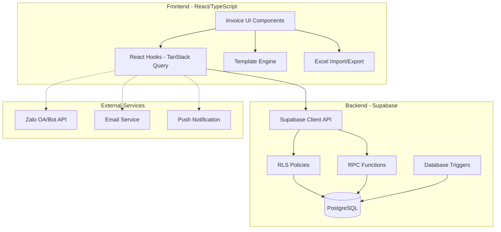
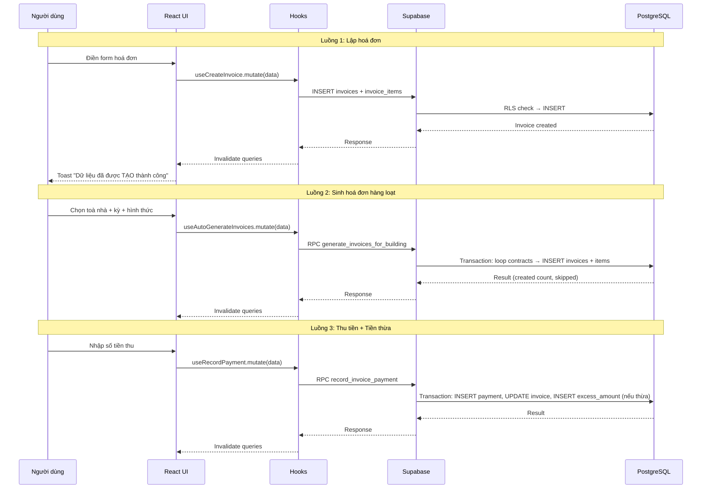
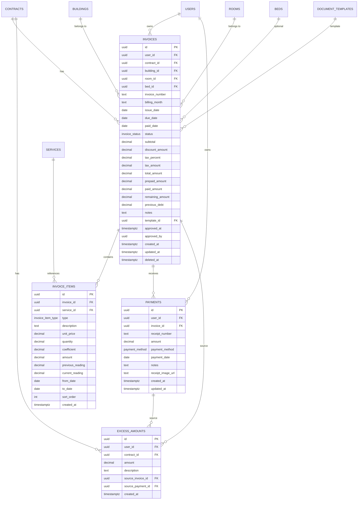

# Tài liệu Thiết kế - Tái triển khai Module Hoá đơn (Invoice)

## Tổng quan

Module Hoá đơn là thành phần cốt lõi trong mảng Tài chính của hệ thống quản lý bất động sản Resident. Tài liệu thiết kế này mô tả kiến trúc, các thành phần, mô hình dữ liệu, và chiến lược kiểm thử cho việc tái triển khai hoàn toàn module Hoá đơn.

### Phạm vi

Tái triển khai bao gồm:
- Database schema mới (migration) cho 4 bảng: `invoices`, `invoice_items`, `payments`, `excess_amounts`
- 3 RPC functions: `generate_invoices_for_building`, `record_invoice_payment`, `get_invoice_statistics`
- RLS policies, triggers, computed columns
- Template Engine render hoá đơn từ mẫu với placeholder và loop block
- React hooks (TanStack Query) cho CRUD, thanh toán, thống kê
- Giao diện React/TypeScript với shadcn/ui: danh sách, form tạo/sửa, thanh toán, thống kê, in/tải hoá đơn
- Tích hợp với các module hiện có: buildings, rooms, beds, contracts, services, meter_readings, document_templates, income_expenses, settings

### Quyết định thiết kế chính

1. **Soft-delete**: Sử dụng `deleted_at` thay vì xoá vật lý, nhất quán với toàn bộ hệ thống
2. **billing_month dạng TEXT (YYYY-MM)**: Thay vì `billing_period_start/end` hiện tại, dùng `billing_month` dạng `YYYY-MM` để khớp với nghiệp vụ "Kỳ thanh toán = tháng"
3. **remaining_amount computed**: Dùng generated column `total_amount - COALESCE(paid_amount, 0)` để luôn chính xác
4. **Tiền thừa (excess_amounts)**: Bảng riêng để theo dõi lịch sử tiền thừa theo hợp đồng, hỗ trợ trừ dần vào hoá đơn sau
5. **RPC functions cho logic phức tạp**: Sinh hoá đơn hàng loạt và ghi nhận thanh toán (bao gồm xử lý tiền thừa) được đặt trong Postgres functions để đảm bảo tính atomic
6. **Template Engine thuần client-side**: Render HTML từ template string + data, không cần server-side rendering
7. **fast-check**: Sử dụng thư viện fast-check (đã có trong project) cho property-based testing

## Kiến trúc

### High-Level Architecture



### Luồng dữ liệu chính



## Thành phần và Giao diện (Components & Interfaces)

### 1. Database Layer

#### Migration file: `supabase/migrations/20250601000001_invoice_reimplementation.sql`

Tạo lại schema hoàn chỉnh cho module hoá đơn:

- **DROP** các bảng cũ (payments, invoice_items, invoices) nếu tồn tại
- **CREATE** 4 bảng mới: `invoices`, `invoice_items`, `payments`, `excess_amounts`
- **CREATE** 3 RPC functions
- **CREATE** triggers cho auto-update status và remaining_amount
- **CREATE** RLS policies

#### RPC Functions

| Function | Params | Mô tả |
|---|---|---|
| `generate_invoices_for_building` | `p_user_id, p_building_id, p_billing_month, p_invoice_type` | Sinh hoá đơn cho tất cả hợp đồng hiệu lực trong toà nhà |
| `record_invoice_payment` | `p_user_id, p_invoice_id, p_amount, p_payment_method, p_payment_date, p_notes, p_receipt_image_url` | Ghi nhận thanh toán, cập nhật paid_amount, xử lý tiền thừa |
| `get_invoice_statistics` | `p_user_id, p_building_id, p_room_id, p_status, p_start_date, p_end_date` | Trả về tổng đã thu, tổng phải thu, tổng số hoá đơn |

### 2. React Hooks Layer

| Hook | Chức năng |
|---|---|
| `useInvoices(filters, pagination)` | Lấy danh sách hoá đơn có phân trang, lọc |
| `useInvoice(id)` | Lấy chi tiết 1 hoá đơn với relations |
| `useCreateInvoice()` | Tạo hoá đơn mới (invoice + items) |
| `useUpdateInvoice()` | Cập nhật hoá đơn |
| `useDeleteInvoice()` | Soft-delete hoá đơn |
| `useBulkDeleteInvoices()` | Soft-delete nhiều hoá đơn |
| `useApproveInvoice()` | Duyệt hoá đơn (DRAFT → APPROVED) |
| `useUnapproveInvoice()` | Bỏ duyệt (APPROVED → DRAFT) |
| `useBulkApproveInvoices()` | Duyệt hàng loạt |
| `useRecordPayment()` | Ghi nhận thanh toán (gọi RPC) |
| `useAutoGenerateInvoices()` | Sinh hoá đơn hàng loạt (gọi RPC) |
| `useInvoiceStatistics(filters)` | Lấy thống kê (gọi RPC) |
| `useExcessAmount(contractId)` | Lấy số tiền thừa hiện có của hợp đồng |
| `useImportInvoicesFromExcel()` | Parse Excel → tạo nhiều hoá đơn |

### 3. UI Components Layer

```
src/components/invoices/
├── InvoiceListPage.tsx          # Trang danh sách chính
├── InvoiceListToolbar.tsx       # Thanh công cụ (thêm, import, sinh, tải, duyệt, xoá)
├── InvoiceListFilters.tsx       # Bộ lọc (toà nhà, phòng, giường, hợp đồng, thời gian, trạng thái)
├── InvoiceListTable.tsx         # Bảng danh sách với checkbox, sort, pagination
├── InvoiceStatsSummary.tsx      # Thống kê phía trên bảng
├── InvoiceStatusBadge.tsx       # Badge màu theo trạng thái
├── InvoiceForm.tsx              # Form tạo/sửa hoá đơn (thông tin chung + dịch vụ & phí + tổng kết)
├── InvoiceItemsTable.tsx        # Bảng dịch vụ & phí trong form
├── InvoiceSummarySection.tsx    # Phần tổng kết (tạm tính, giảm giá, thuế, thành tiền, trả trước, còn lại)
├── AutoGenerateDialog.tsx       # Dialog sinh hoá đơn hàng loạt
├── ImportExcelDialog.tsx        # Dialog nhập từ Excel
├── RecordPaymentDialog.tsx      # Dialog thu tiền
├── ApproveConfirmDialog.tsx     # Dialog xác nhận duyệt
├── InvoiceDetailPage.tsx        # Trang chi tiết hoá đơn
├── InvoiceSendActions.tsx       # Các nút gửi hoá đơn (copy link, app, zalo, email)
├── InvoicePrintPreview.tsx      # Preview và in hoá đơn
├── MeterReadingSelector.tsx     # Chọn/tạo chỉ số công tơ
└── InvoiceActionMenu.tsx        # Dropdown menu thao tác (cập nhật, xoá, thu tiền, bỏ duyệt)
```

### 4. Template Engine (`src/lib/invoiceTemplateEngine.ts`)

```typescript
interface InvoiceTemplateData {
  APARTMENT_NAME: string;
  ROOM_NAME: string;
  CONTRACT_NAME: string;
  INVOICE_CODE: string;
  ISSUE_DATE: string;
  DUE_DATE: string;
  SUBTOTAL: string;
  DISCOUNT_WITH_PROMOTION: string;
  DEBT: string;
  TOTAL_WITH_DEBT: string;
  PAID: string;
  REMAIN: string;
  AMOUNT_IN_WORDS_WITH_DEBT: string;
  NOTE: string;
  FEES: InvoiceFeeItem[];
}

interface InvoiceFeeItem {
  index: number;
  name: string;
  price: string;
  quantity: string;
  coefficient: string;
  total: string;
}

function renderInvoiceTemplate(template: string, data: InvoiceTemplateData): string;
function formatCurrencyVND(amount: number): string;
function numberToVietnameseWords(amount: number): string;
```

**Quy tắc render:**
1. Thay thế tất cả `{PLACEHOLDER}` bằng giá trị tương ứng trong data
2. Xử lý block `{#FEES}...{/FEES}`: lặp qua `data.FEES`, thay thế `{index}`, `{name}`, `{price}`, `{quantity}`, `{coefficient}`, `{total}`
3. Thay thế `+++IMAGE LOGO()+++` bằng thẻ `` với URL logo
4. Placeholder không có trong data → thay bằng chuỗi rỗng
5. Format số tiền theo VNĐ (dấu chấm phân cách nghìn)

### 5. Excel Import/Export (`src/lib/invoiceExcelHelpers.ts`)

```typescript
function generateInvoiceTemplate(building: Building, rooms: Room[], services: Service[]): Blob;
function parseInvoiceExcel(file: File, buildingId: string, billingMonth: string): ParsedInvoiceRow[];
function validateParsedRows(rows: ParsedInvoiceRow[]): ValidationResult;
```

### 6. Utility Functions (`src/lib/invoiceUtils.ts`)

```typescript
function generateInvoiceNumber(userId: string): Promise<string>;
function calculateInvoiceTotals(items: InvoiceItem[], discount: number, taxPercent: number, prepaid: number): InvoiceTotals;
function canEditInvoice(status: InvoiceStatus): boolean;
function canDeleteInvoice(status: InvoiceStatus): boolean;
function canApproveInvoice(status: InvoiceStatus): boolean;
function getStatusColor(status: InvoiceStatus): string;
function isOverdue(dueDate: string, status: InvoiceStatus): boolean;
```

## Mô hình Dữ liệu (Data Models)

### Entity Relationship Diagram



### Chi tiết bảng `invoices`

| Cột | Kiểu | Mô tả |
|---|---|---|
| `id` | UUID PK | ID tự sinh |
| `user_id` | UUID FK → auth.users | Chủ sở hữu (RLS) |
| `contract_id` | UUID FK → contracts | Hợp đồng liên quan |
| `building_id` | UUID FK → buildings | Toà nhà |
| `room_id` | UUID FK → rooms | Phòng |
| `bed_id` | UUID FK → beds (nullable) | Giường (nếu có) |
| `invoice_number` | TEXT UNIQUE | Mã hoá đơn tự sinh |
| `billing_month` | TEXT | Kỳ thanh toán dạng YYYY-MM |
| `issue_date` | DATE | Ngày lập (mặc định: today) |
| `due_date` | DATE | Hạn thanh toán |
| `paid_date` | DATE (nullable) | Ngày thanh toán đủ |
| `status` | invoice_status | DRAFT, APPROVED, PAID, PARTIAL_PAID, OVERDUE, CANCELLED |
| `subtotal` | DECIMAL(15,2) | Tạm tính |
| `discount_amount` | DECIMAL(15,2) | Giảm giá |
| `tax_percent` | DECIMAL(5,2) | % thuế |
| `tax_amount` | DECIMAL(15,2) | Tiền thuế |
| `total_amount` | DECIMAL(15,2) | Thành tiền |
| `prepaid_amount` | DECIMAL(15,2) | Trả trước (từ tiền thừa) |
| `paid_amount` | DECIMAL(15,2) | Đã thanh toán |
| `remaining_amount` | DECIMAL(15,2) GENERATED | = total_amount - paid_amount |
| `previous_debt` | DECIMAL(15,2) | Nợ cũ |
| `notes` | TEXT | Ghi chú |
| `template_id` | UUID FK → document_templates | Mẫu in |
| `approved_at` | TIMESTAMPTZ | Thời điểm duyệt |
| `approved_by` | UUID | Người duyệt |
| `created_at` | TIMESTAMPTZ | Ngày tạo |
| `updated_at` | TIMESTAMPTZ | Ngày cập nhật |
| `deleted_at` | TIMESTAMPTZ | Soft-delete |

**Constraints:**
- `UNIQUE(contract_id, billing_month)` WHERE `deleted_at IS NULL` — Mỗi hợp đồng chỉ có 1 hoá đơn/kỳ
- `total_amount >= 0`
- `paid_amount >= 0`
- `issue_date <= due_date`

### Chi tiết bảng `invoice_items`

| Cột | Kiểu | Mô tả |
|---|---|---|
| `id` | UUID PK | ID tự sinh |
| `invoice_id` | UUID FK → invoices ON DELETE CASCADE | Hoá đơn cha |
| `service_id` | UUID FK → services (nullable) | Dịch vụ liên quan |
| `type` | invoice_item_type | RENT, SERVICE, PENALTY, DISCOUNT, OTHER |
| `description` | TEXT | Tên/mô tả dịch vụ |
| `unit_price` | DECIMAL(15,2) | Đơn giá |
| `quantity` | DECIMAL(10,2) | Số lượng |
| `coefficient` | DECIMAL(5,2) DEFAULT 1 | Hệ số |
| `amount` | DECIMAL(15,2) | = unit_price × quantity × coefficient |
| `previous_reading` | DECIMAL(10,2) | Chỉ số đầu (cho METER_READING) |
| `current_reading` | DECIMAL(10,2) | Chỉ số cuối |
| `from_date` | DATE | Từ ngày |
| `to_date` | DATE | Đến ngày |
| `sort_order` | INT | Thứ tự hiển thị |
| `created_at` | TIMESTAMPTZ | Ngày tạo |

### Chi tiết bảng `payments`

| Cột | Kiểu | Mô tả |
|---|---|---|
| `id` | UUID PK | ID tự sinh |
| `user_id` | UUID FK → auth.users | Chủ sở hữu |
| `invoice_id` | UUID FK → invoices | Hoá đơn |
| `receipt_number` | TEXT | Số biên lai |
| `amount` | DECIMAL(15,2) | Số tiền thu |
| `payment_method` | payment_method | CASH, BANK_TRANSFER, MOMO, VNPAY, ZALO_PAY, OTHER |
| `payment_date` | DATE | Ngày thu |
| `notes` | TEXT | Ghi chú |
| `receipt_image_url` | TEXT | Ảnh biên lai |
| `created_at` | TIMESTAMPTZ | Ngày tạo |
| `updated_at` | TIMESTAMPTZ | Ngày cập nhật |

### Chi tiết bảng `excess_amounts`

| Cột | Kiểu | Mô tả |
|---|---|---|
| `id` | UUID PK | ID tự sinh |
| `user_id` | UUID FK → auth.users | Chủ sở hữu |
| `contract_id` | UUID FK → contracts | Hợp đồng |
| `amount` | DECIMAL(15,2) | Số tiền (dương = thêm, âm = trừ) |
| `description` | TEXT | Mô tả (VD: "Tiền thừa từ HD-001", "Trả trước cho HD-002") |
| `source_invoice_id` | UUID FK → invoices (nullable) | Hoá đơn nguồn |
| `source_payment_id` | UUID FK → payments (nullable) | Thanh toán nguồn |
| `created_at` | TIMESTAMPTZ | Ngày tạo |

**Tiền thừa hiện có** = `SUM(amount)` WHERE `contract_id = ?` AND `user_id = ?`


## Correctness Properties

*Một property là một đặc tính hoặc hành vi phải luôn đúng trong mọi lần thực thi hợp lệ của hệ thống — về bản chất là một phát biểu hình thức về những gì hệ thống phải làm. Properties đóng vai trò cầu nối giữa đặc tả dễ đọc cho con người và đảm bảo tính đúng đắn có thể kiểm chứng bằng máy.*

### Property 1: Tính toán tổng hoá đơn chính xác

*Với bất kỳ* danh sách dòng dịch vụ (items), giảm giá (discount), phần trăm thuế (tax_percent), và tiền trả trước (prepaid), hệ thống phải tính:
- `subtotal` = tổng `unit_price × quantity × coefficient` của tất cả items
- `tax_amount` = `subtotal × tax_percent / 100`
- `total_amount` = `subtotal - discount + tax_amount`
- `remaining` = `total_amount - prepaid`

Và `total_amount >= 0`, `remaining >= 0`.

**Validates: Requirements 1.10**

### Property 2: Validation từ chối input thiếu trường bắt buộc

*Với bất kỳ* đối tượng hoá đơn input nào mà thiếu ít nhất một trường bắt buộc (building_id, room_id, contract_id, billing_month, issue_date, due_date) hoặc có danh sách items rỗng, validation schema phải từ chối và trả về lỗi tương ứng cho trường bị thiếu.

**Validates: Requirements 1.13**

### Property 3: Validation tiền trả trước

*Với bất kỳ* số tiền trả trước (prepaid) và số tiền thừa hiện có (excess_balance) và tổng hoá đơn (total_amount), nếu `prepaid > excess_balance` hoặc `prepaid > total_amount`, validation phải từ chối. Nếu `0 <= prepaid <= min(excess_balance, total_amount)`, validation phải chấp nhận.

**Validates: Requirements 1.11, 8.4**

### Property 4: Hoá đơn mới luôn có trạng thái DRAFT

*Với bất kỳ* hoá đơn hợp lệ được tạo mới, trạng thái ban đầu phải luôn là DRAFT.

**Validates: Requirements 1.12**

### Property 5: Tính toán số lượng từ chỉ số công tơ

*Với bất kỳ* dịch vụ loại METER_READING có chỉ số đầu (previous_reading) và chỉ số cuối (current_reading) với `current_reading >= previous_reading`, số lượng (quantity) phải bằng `current_reading - previous_reading`.

**Validates: Requirements 1.9**

### Property 6: Quyền sửa/xoá phụ thuộc trạng thái

*Với bất kỳ* hoá đơn, `canEditInvoice(status)` và `canDeleteInvoice(status)` phải trả về `true` khi và chỉ khi `status === 'DRAFT'`. Với tất cả trạng thái khác (APPROVED, PAID, PARTIAL_PAID, OVERDUE, CANCELLED), phải trả về `false`.

**Validates: Requirements 3.6, 4.4**

### Property 7: Duyệt/Bỏ duyệt là round-trip

*Với bất kỳ* hoá đơn có trạng thái DRAFT, thực hiện duyệt (→ APPROVED) rồi bỏ duyệt (→ DRAFT) phải đưa hoá đơn về trạng thái ban đầu DRAFT.

**Validates: Requirements 4.2, 4.3, 4.5**

### Property 8: Soft-delete đặt deleted_at

*Với bất kỳ* hoá đơn (đơn lẻ hoặc hàng loạt) khi thực hiện xoá, trường `deleted_at` phải được đặt giá trị (không null), và hoá đơn đó không được xuất hiện trong kết quả truy vấn danh sách thông thường.

**Validates: Requirements 3.4, 3.5**

### Property 9: Loại hình thức sinh hoá đơn quyết định loại dòng dịch vụ

*Với bất kỳ* lần sinh hoá đơn tự động:
- Nếu `invoice_type = 'rent_only'`, tất cả invoice_items phải có `type = 'RENT'`
- Nếu `invoice_type = 'service_only'`, tất cả invoice_items phải có `type = 'SERVICE'`
- Nếu `invoice_type = 'both'`, invoice_items phải chứa ít nhất một item `type = 'RENT'` và ít nhất một item `type = 'SERVICE'` (nếu hợp đồng có dịch vụ)

**Validates: Requirements 6.4, 6.5, 6.6**

### Property 10: Sinh hoá đơn không tạo trùng lặp (Idempotence)

*Với bất kỳ* toà nhà và kỳ thanh toán, nếu đã tồn tại hoá đơn cho một hợp đồng trong kỳ đó, việc sinh hoá đơn lần thứ hai phải bỏ qua hợp đồng đó. Số hoá đơn sau 2 lần sinh phải bằng số hoá đơn sau 1 lần sinh.

**Validates: Requirements 6.7**

### Property 11: Thanh toán cập nhật paid_amount chính xác

*Với bất kỳ* hoá đơn và khoản thanh toán hợp lệ, sau khi ghi nhận thanh toán, `paid_amount` mới phải bằng `paid_amount cũ + số tiền thanh toán`.

**Validates: Requirements 7.2**

### Property 12: Trạng thái hoá đơn phản ánh đúng tình trạng thanh toán

*Với bất kỳ* hoá đơn:
- Nếu `paid_amount = 0` và chưa quá hạn → trạng thái phải là DRAFT hoặc APPROVED
- Nếu `0 < paid_amount < total_amount` → trạng thái phải là PARTIAL_PAID
- Nếu `paid_amount >= total_amount` → trạng thái phải là PAID
- Nếu ngày hiện tại > due_date và `paid_amount < total_amount` và trạng thái không phải CANCELLED → trạng thái phải là OVERDUE

**Validates: Requirements 7.3, 7.4, 7.7**

### Property 13: Thanh toán vượt mức tạo tiền thừa

*Với bất kỳ* khoản thanh toán mà `số tiền > remaining_amount` của hoá đơn, hệ thống phải tạo bản ghi excess_amount với `amount = số tiền thanh toán - remaining_amount`, và hoá đơn phải có trạng thái PAID.

**Validates: Requirements 7.5, 8.1**

### Property 14: Số dư tiền thừa chính xác

*Với bất kỳ* hợp đồng, số tiền thừa hiện có phải bằng `SUM(amount)` của tất cả bản ghi trong bảng `excess_amounts` thuộc hợp đồng đó.

**Validates: Requirements 8.2**

### Property 15: remaining_amount luôn nhất quán

*Với bất kỳ* hoá đơn, `remaining_amount` phải luôn bằng `total_amount - COALESCE(paid_amount, 0)`. Đây là invariant được đảm bảo bởi generated column.

**Validates: Requirements 7.6, 11.9**

### Property 16: Template engine thay thế tất cả placeholder

*Với bất kỳ* template string và dữ liệu hoá đơn hợp lệ, sau khi render:
- Không còn bất kỳ placeholder nào dạng `{PLACEHOLDER_NAME}` trong output
- Mỗi placeholder đã biết được thay thế bằng giá trị tương ứng từ data
- Placeholder không có trong data được thay thế bằng chuỗi rỗng

**Validates: Requirements 9.2, 12.1, 12.2, 12.7**

### Property 17: Template engine render FEES loop chính xác

*Với bất kỳ* template chứa block `{#FEES}...{/FEES}` và danh sách N dòng dịch vụ, output phải chứa đúng N lần nội dung loop body, mỗi lần với `{index}`, `{name}`, `{price}`, `{quantity}`, `{coefficient}`, `{total}` được thay thế bằng giá trị tương ứng của dòng dịch vụ đó.

**Validates: Requirements 9.3, 12.3**

### Property 18: Format tiền VNĐ chính xác

*Với bất kỳ* số nguyên không âm, `formatCurrencyVND(n)` phải trả về chuỗi có dấu chấm phân cách hàng nghìn và hậu tố phù hợp. Ví dụ: 1000000 → "1.000.000". Và `parseCurrencyVND(formatCurrencyVND(n))` phải trả về `n` (round-trip).

**Validates: Requirements 12.4**

### Property 19: Chuyển đổi số tiền thành chữ tiếng Việt

*Với bất kỳ* số nguyên không âm trong phạm vi hợp lệ (0 đến 999.999.999.999), `numberToVietnameseWords(n)` phải trả về chuỗi không rỗng, và kết quả phải nhất quán (cùng input → cùng output).

**Validates: Requirements 12.5**

### Property 20: Template render round-trip

*Với bất kỳ* dữ liệu hoá đơn hợp lệ, render template rồi trích xuất các giá trị placeholder từ HTML đã render phải cho kết quả khớp với dữ liệu gốc (cho các trường text đơn giản).

**Validates: Requirements 12.6**

### Property 21: Thống kê hoá đơn chính xác

*Với bất kỳ* tập hoá đơn, `get_invoice_statistics` phải trả về:
- `total_paid` = tổng `paid_amount` của tất cả hoá đơn trong tập
- `total_remaining` = tổng `remaining_amount` của tất cả hoá đơn trong tập
- `total_count` = số lượng hoá đơn trong tập

**Validates: Requirements 10.1**

### Property 22: Excel parsing validation

*Với bất kỳ* dữ liệu Excel có dòng thiếu trường bắt buộc hoặc sai định dạng, hệ thống phải trả về lỗi chi tiết cho đúng dòng sai, và không tạo hoá đơn cho dòng đó. Các dòng hợp lệ vẫn được xử lý bình thường.

**Validates: Requirements 2.4, 2.6**

## Xử lý Lỗi (Error Handling)

### Validation Errors

| Lỗi | Xử lý |
|---|---|
| Thiếu trường bắt buộc | Zod schema validation → hiển thị lỗi inline tại trường tương ứng |
| Trả trước > Tiền thừa | Validation rule → toast error "Số tiền trả trước không được vượt quá tiền thừa hiện có" |
| Trả trước > Tổng hoá đơn | Validation rule → toast error |
| Chỉ số cuối < Chỉ số đầu | Validation rule → toast error "Chỉ số cuối phải lớn hơn hoặc bằng chỉ số đầu" |
| Sửa/Xoá hoá đơn đã duyệt | UI ẩn nút + backend check → toast error nếu bypass |
| Trùng hoá đơn (cùng hợp đồng + kỳ) | RPC check → bỏ qua và thông báo |

### Database Errors

| Lỗi | Xử lý |
|---|---|
| RLS violation | Supabase trả 403 → toast "Bạn không có quyền thực hiện thao tác này" |
| Foreign key violation | Toast "Dữ liệu liên quan không tồn tại" |
| Unique constraint violation | Toast "Hoá đơn đã tồn tại cho kỳ thanh toán này" |
| Network error | Toast "Lỗi kết nối, vui lòng thử lại" + retry logic trong TanStack Query |

### Excel Import Errors

| Lỗi | Xử lý |
|---|---|
| File không đúng định dạng | Toast "File không đúng định dạng Excel" |
| Dòng thiếu dữ liệu bắt buộc | Hiển thị danh sách lỗi chi tiết: "Dòng X: Thiếu trường Y" |
| Phòng không tồn tại | "Dòng X: Phòng 'Z' không tồn tại trong toà nhà" |
| Dữ liệu sai kiểu | "Dòng X: Giá trị 'Y' không phải số hợp lệ" |

### External Service Errors (Gửi hoá đơn)

| Lỗi | Xử lý |
|---|---|
| Zalo API lỗi | Toast "Gửi Zalo thất bại, vui lòng thử lại" |
| Email gửi thất bại | Toast "Gửi email thất bại" |
| Khách không có Zalo/Email | Toast "Khách thuê chưa có thông tin Zalo/Email" |

## Chiến lược Kiểm thử (Testing Strategy)

### Phương pháp kiểm thử kép

Module Hoá đơn sử dụng kết hợp **unit tests** và **property-based tests** để đảm bảo tính đúng đắn toàn diện:

- **Unit tests** (Vitest): Kiểm tra các ví dụ cụ thể, edge cases, và error conditions
- **Property-based tests** (fast-check + Vitest): Kiểm tra các thuộc tính phổ quát trên nhiều input ngẫu nhiên

Hai loại test bổ sung cho nhau: unit tests bắt lỗi cụ thể, property tests đảm bảo tính đúng đắn tổng quát.

### Cấu hình Property-Based Testing

- **Thư viện**: `fast-check` (đã có trong project)
- **Framework**: `vitest`
- **Số lần chạy tối thiểu**: 100 iterations mỗi property test
- **Tag format**: `Feature: invoice-reimplementation, Property {number}: {property_text}`
- **Mỗi correctness property** được triển khai bởi **MỘT** property-based test duy nhất

### Phân bổ test files

```
src/lib/__tests__/
├── invoiceCalculations.property.test.ts    # Properties 1, 5, 15, 18, 19
├── invoiceValidation.property.test.ts      # Properties 2, 3, 22
├── invoiceStatus.property.test.ts          # Properties 4, 6, 7, 8, 12
├── invoiceGeneration.property.test.ts      # Properties 9, 10
├── invoicePayment.property.test.ts         # Properties 11, 13, 14
├── invoiceTemplate.property.test.ts        # Properties 16, 17, 20
├── invoiceStatistics.property.test.ts      # Property 21
├── invoiceCalculations.test.ts             # Unit tests cho tính toán
├── invoiceTemplateEngine.test.ts           # Unit tests cho template engine
└── invoiceUtils.test.ts                    # Unit tests cho utility functions
```

### Unit tests (ví dụ cụ thể và edge cases)

- Tạo hoá đơn với dữ liệu mẫu cụ thể → kiểm tra kết quả
- Template engine với mẫu thực tế từ hệ thống → kiểm tra output HTML
- Format tiền: 0, 1, 999, 1000, 1000000, 999999999 → kiểm tra chuỗi
- Số thành chữ: 0 → "không đồng", 1000 → "một nghìn đồng"
- Edge cases: hoá đơn không có items, discount = 0, tax = 0, prepaid = 0
- Logo replacement: template có/không có `+++IMAGE LOGO()+++`
- Excel import: file rỗng, file sai format, file có dòng hợp lệ lẫn không hợp lệ

### Property tests (kiểm tra tổng quát)

Mỗi property test tương ứng với một Correctness Property ở trên, sử dụng fast-check generators để tạo input ngẫu nhiên và kiểm tra property holds cho tất cả inputs.

Ví dụ generator cho invoice items:
```typescript
const invoiceItemArb = fc.record({
  unit_price: fc.double({ min: 0, max: 100_000_000, noNaN: true, noDefaultInfinity: true }),
  quantity: fc.double({ min: 0.01, max: 1000, noNaN: true, noDefaultInfinity: true }),
  coefficient: fc.double({ min: 0.1, max: 10, noNaN: true, noDefaultInfinity: true }),
});
```

### Integration tests

- Tạo hoá đơn → thu tiền → kiểm tra trạng thái và số dư
- Sinh hoá đơn hàng loạt → kiểm tra số lượng tạo ra
- Import Excel → kiểm tra hoá đơn được tạo đúng
- Duyệt → thử sửa → kiểm tra bị chặn → bỏ duyệt → sửa thành công
