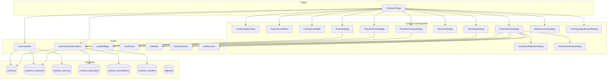
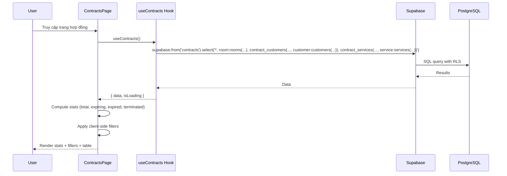
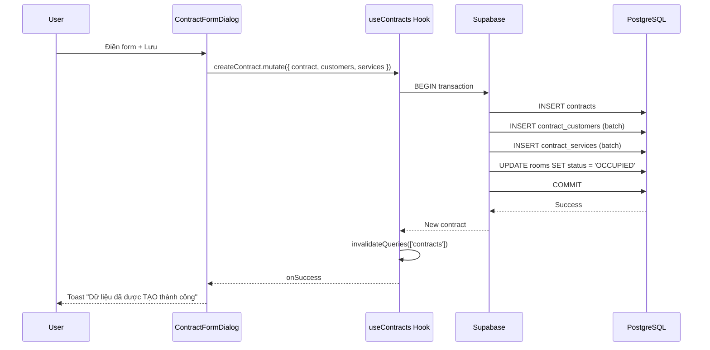
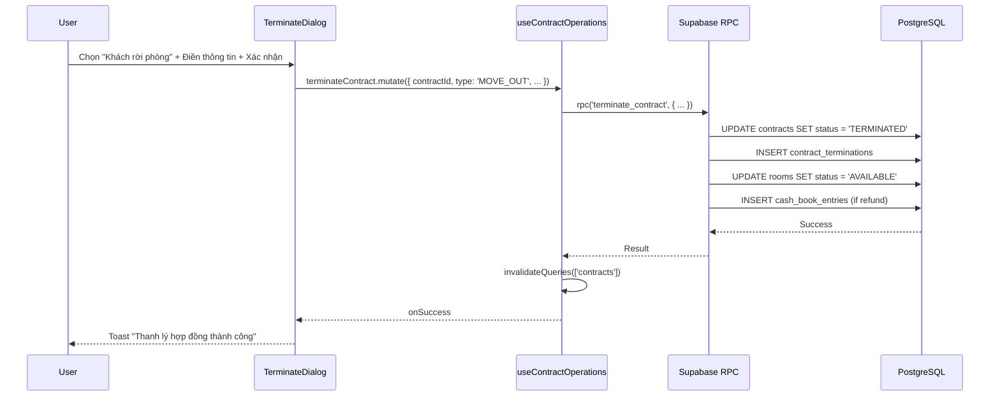

# Tài liệu Thiết kế - Quản lý Hợp đồng thuê (Lease Contract Management)

## Tổng quan (Overview)

Module Quản lý Hợp đồng thuê là phần cốt lõi trong hệ thống quản lý vận hành căn hộ/phòng trọ. Database schema đã có sẵn các bảng `contracts`, `contract_services`, `contract_extensions`, `contract_terminations`, `contract_transfers`. Module cần triển khai:

1. **Database migration**: Tạo bảng `contract_customers` (junction table liên kết contracts ↔ customers, hỗ trợ nhiều khách thuê/hợp đồng với 1 đại diện), thêm Supabase database functions cho các thao tác phức tạp (gia hạn, chuyển phòng, nhượng HĐ, thanh lý).
2. **Frontend**: Trang ContractsPage (4 thẻ thống kê, bộ lọc cascading 6 dropdown, bảng dữ liệu với 7 nút thao tác/hàng), ContractFormDialog (4 section: Thông tin chung, Khách hàng, Tiền thuê & Cọc, Dịch vụ), và 6 dialog thao tác (Gia hạn, Chuyển phòng, Đăng ký chuyển đi, Nhượng HĐ, Thanh lý, Xóa).
3. **Hooks**: `useContracts` (CRUD + stats + filters), `useContractOperations` (renew, transfer room, transfer contract, terminate, move-out registration).
4. **Import/Export Excel**: Nhập hàng loạt hợp đồng từ file Excel, xuất danh sách theo bộ lọc.

### Quyết định thiết kế chính

| Quyết định | Lựa chọn | Lý do |
|---|---|---|
| Contract form pattern | Full-screen dialog (DialogContent max-w-4xl) | Form phức tạp 4 section nhưng vẫn cần context bảng phía sau |
| Multi-tenant per contract | Junction table `contract_customers` | Hỗ trợ nhiều khách thuê/HĐ, 1 đại diện (is_representative) |
| Contract status computation | Client-side computed từ end_date + expected_move_out_date | Không cần cron job, tính toán realtime khi render |
| Complex operations | Supabase RPC functions (PostgreSQL) | Đảm bảo atomicity cho multi-table operations (terminate, transfer) |
| Stats cards | Computed từ full contract list client-side | Dataset nhỏ (< 5000 contracts), tránh thêm API calls |
| Filter cascading | Building → Room → Bed, client-side | Theo pattern RoomsPage đã có |
| Action buttons | 7 icon buttons inline trong cột Thao tác | Theo screenshot UI: Cập nhật, Gia hạn, Chuyển phòng, ĐK chuyển đi, Nhượng HĐ, Thanh lý, Xóa |
| Termination flow | 2-step dialog: chọn loại → form chi tiết | Khách bỏ cọc (đơn giản) vs Khách rời phòng (phức tạp với công nợ) |
| Contract number generation | Supabase function `generate_contract_number` | Sử dụng bảng `code_sequences` đã có |
| Deposit auto-populate | Query bảng `deposits` theo customer + room | Tự động tính "Đã đặt cọc" và "Tiền cọc phải đóng" |


## Kiến trúc (Architecture)

### Tổng quan kiến trúc



### Luồng dữ liệu chính








## Components và Interfaces

### 1. ContractsPage (`src/pages/contracts/ContractsPage.tsx`)

Trang chính quản lý hợp đồng. Layout theo pattern RoomsPage/CustomersPage.

```typescript
interface ContractsPageState {
  // Stats filter
  activeStatFilter: ContractStatFilter; // 'ALL' | 'EXPIRING' | 'EXPIRED' | 'TERMINATED'
  // Filters
  searchTerm: string;
  areaFilter: string;           // area_id hoặc 'all'
  buildingFilter: string;       // building_id hoặc 'all'
  roomFilter: string;           // room_id hoặc 'all'
  bedFilter: string;            // bed_id hoặc 'all'
  rentalTypeFilter: string;     // building_type hoặc 'all'
  monthFilter: string;          // 'YYYY-MM' hoặc ''
  // Pagination
  page: number;
  pageSize: number;             // 10 | 20 | 50 | 100
  // Dialogs
  formDialogOpen: boolean;
  renewDialogOpen: boolean;
  transferRoomDialogOpen: boolean;
  moveOutDialogOpen: boolean;
  transferContractDialogOpen: boolean;
  terminateDialogOpen: boolean;
  deleteDialogOpen: boolean;
  importDialogOpen: boolean;
  // Selection
  selectedContract: ContractWithRelations | null;
  selectedContractIds: string[];
}
```

**Cấu trúc render:**
1. Breadcrumb "Hợp đồng thuê"
2. `ContractStatsCards` — 4 thẻ: Tất cả, Sắp hết hạn, Quá hạn, Đã thanh lý
3. `ContractListFilters` — 6 dropdown cascading + search bar
4. Toolbar — Nút (+) Thêm, Import, Export, Filter toggle
5. `ContractListTable` — Bảng với checkbox, 7 action buttons/row, pagination
6. Các dialog thao tác

### 2. ContractStatsCards (`src/components/contracts/ContractStatsCards.tsx`)

```typescript
type ContractStatFilter = 'ALL' | 'EXPIRING' | 'EXPIRED' | 'TERMINATED';

interface ContractStats {
  total: number;
  expiring: number;   // end_date within 30 days, status ACTIVE
  expired: number;    // end_date passed, status ACTIVE
  terminated: number; // status TERMINATED
}

interface ContractStatsCardsProps {
  stats: ContractStats;
  activeFilter: ContractStatFilter;
  onFilterChange: (filter: ContractStatFilter) => void;
}
```

4 thẻ Card clickable. "Tất cả" (xanh lá), "Sắp hết hạn" (cam), "Quá hạn" (đỏ), "Đã thanh lý" (xám).

### 3. ContractListFilters (`src/components/contracts/ContractListFilters.tsx`)

```typescript
interface ContractListFiltersProps {
  searchTerm: string;
  onSearchChange: (value: string) => void;
  areaFilter: string;
  onAreaChange: (value: string) => void;
  buildingFilter: string;
  onBuildingChange: (value: string) => void;
  roomFilter: string;
  onRoomChange: (value: string) => void;
  bedFilter: string;
  onBedChange: (value: string) => void;
  rentalTypeFilter: string;
  onRentalTypeChange: (value: string) => void;
  monthFilter: string;
  onMonthChange: (value: string) => void;
  // Data for dropdowns
  areas: Area[];
  buildings: BuildingWithRelations[];
  rooms: RoomWithRelations[];
  beds: Bed[];
}
```

Cascading: Khu vực → Toà nhà (lọc theo area) → Phòng (lọc theo building) → Giường (lọc theo room).
Search bar tìm theo mã HĐ, tên khách, SĐT, tên phòng.

### 4. ContractListTable (`src/components/contracts/ContractListTable.tsx`)

```typescript
interface ContractListTableProps {
  contracts: ContractWithRelations[];
  selectedIds: string[];
  onSelectionChange: (ids: string[]) => void;
  onEdit: (contract: ContractWithRelations) => void;
  onRenew: (contract: ContractWithRelations) => void;
  onTransferRoom: (contract: ContractWithRelations) => void;
  onMoveOut: (contract: ContractWithRelations) => void;
  onTransferContract: (contract: ContractWithRelations) => void;
  onTerminate: (contract: ContractWithRelations) => void;
  onDelete: (contract: ContractWithRelations) => void;
  page: number;
  pageSize: number;
  totalCount: number;
  onPageChange: (page: number) => void;
  onPageSizeChange: (size: number) => void;
}
```

**Cột bảng:**
1. Checkbox (select row)
2. Mã hợp đồng (`contract_number`)
3. Trạng thái (color-coded badge)
4. Thao tác (7 icon buttons)
5. Vị trí (Toà nhà - Phòng - Giường)
6. Khách hàng (tên đại diện)
7. Giá thuê (formatted VND)
8. Tiền cọc (formatted VND)
9. Ngày bắt đầu
10. Ngày kết thúc
11. Người tạo

**Action buttons (cột Thao tác):**
- Cập nhật (Pencil, green) — disabled if TERMINATED
- Gia hạn (CalendarPlus, green) — only ACTIVE/EXPIRED
- Chuyển phòng (ArrowRightLeft, orange) — only ACTIVE
- ĐK chuyển đi (LogOut, blue) — only ACTIVE
- Nhượng HĐ (UserPlus, purple) — only ACTIVE
- Thanh lý (FileX, red) — only ACTIVE/EXPIRED
- Xóa (Trash2, red) — only DRAFT or no financial records

### 5. ContractFormDialog (`src/components/contracts/ContractFormDialog.tsx`)

```typescript
interface ContractFormDialogProps {
  open: boolean;
  onOpenChange: (open: boolean) => void;
  contract?: ContractWithRelations; // undefined = create mode
}
```

Full-screen dialog (max-w-4xl). 4 sections:

**Section 1: Thông tin chung**
- Toà nhà (required, dropdown)
- Phòng (required, cascading by building)
- Giường (optional, cascading by room)
- Ngày ký (date picker)
- Ngày bắt đầu (required, date picker)
- Hạn hợp đồng / Ngày kết thúc (required, date picker)
- Mẫu hợp đồng thuê (optional, dropdown)
- Mẫu in hoá đơn (optional, dropdown)
- Ghi chú (optional, textarea)

**Section 2: Khách hàng**
- Nút "Thêm khách hàng" → mở `CustomerSelectionDialog`
- Danh sách khách đã chọn (name, phone, ID) với nút xóa
- Radio/checkbox chọn đại diện (is_representative)

**Section 3: Tiền thuê & Tiền cọc**
- Tiền thuê (number input)
- Chu kỳ thanh toán (select: 1/3/6/12 tháng)
- Ngày bắt đầu tính tiền (date picker)
- Tiền cọc (number input)
- Đã đặt cọc (auto-populated, readonly)
- Tiền cọc phải đóng (calculated, readonly)
- Số tháng giảm (number input)
- Số tiền giảm mỗi tháng (number input)

**Section 4: Tiền phí dịch vụ**
- Nút "Thêm dịch vụ" → mở `ServiceSelectionDialog`
- Bảng dịch vụ đã chọn: Tên DV, Đồng hồ, Chỉ số đầu, Số lượng, Đơn giá, Xóa

### 6. CustomerSelectionDialog (`src/components/contracts/CustomerSelectionDialog.tsx`)

```typescript
interface CustomerSelectionDialogProps {
  open: boolean;
  onOpenChange: (open: boolean) => void;
  selectedCustomerIds: string[];
  onSelect: (customers: CustomerBasic[]) => void;
}

interface CustomerBasic {
  id: string;
  full_name: string;
  phone: string;
  id_number: string | null;
}
```

Dialog tìm kiếm và chọn khách hàng. Hỗ trợ search theo tên, SĐT, CCCD. Hiển thị danh sách với checkbox multi-select.

### 7. ServiceSelectionDialog (`src/components/contracts/ServiceSelectionDialog.tsx`)

```typescript
interface ServiceSelectionDialogProps {
  open: boolean;
  onOpenChange: (open: boolean) => void;
  selectedServiceIds: string[];
  onSelect: (services: ServiceBasic[]) => void;
  buildingId?: string; // to load building-specific services
}

interface ServiceBasic {
  id: string;
  name: string;
  unit_price: number;
  unit: string | null;
  type: string;
  pricing_type: string | null;
}
```

### 8. RenewDialog (`src/components/contracts/RenewDialog.tsx`)

```typescript
interface RenewDialogProps {
  open: boolean;
  onOpenChange: (open: boolean) => void;
  contract: ContractWithRelations;
}
```

Fields: Ngày kết thúc hiện tại (readonly), Ngày kết thúc mới (required), Giá thuê mới (optional, default current), Tiền cọc mới (optional, default current), Ghi chú.

### 9. TransferRoomDialog (`src/components/contracts/TransferRoomDialog.tsx`)

```typescript
interface TransferRoomDialogProps {
  open: boolean;
  onOpenChange: (open: boolean) => void;
  contract: ContractWithRelations;
}
```

Hiển thị thông tin HĐ hiện tại. Fields: Toà nhà mới, Phòng mới (required, chỉ AVAILABLE), Giường mới (optional), Giá thuê mới (optional), Ngày chuyển, Ghi chú.

### 10. MoveOutDialog (`src/components/contracts/MoveOutDialog.tsx`)

```typescript
interface MoveOutDialogProps {
  open: boolean;
  onOpenChange: (open: boolean) => void;
  contract: ContractWithRelations;
}
```

Fields: Ngày sẽ chuyển đi (required, date picker), Ghi chú (optional).

### 11. TransferContractDialog (`src/components/contracts/TransferContractDialog.tsx`)

```typescript
interface TransferContractDialogProps {
  open: boolean;
  onOpenChange: (open: boolean) => void;
  contract: ContractWithRelations;
}
```

Hiển thị thông tin HĐ hiện tại. Fields: Khách hàng mới (required, customer selection), Giá thuê mới (optional), Tiền cọc mới (optional), Ngày nhượng, Ghi chú.

### 12. TerminateDialog (`src/components/contracts/TerminateDialog.tsx`)

```typescript
interface TerminateDialogProps {
  open: boolean;
  onOpenChange: (open: boolean) => void;
  contract: ContractWithRelations;
}

type TerminationType = 'FORFEIT' | 'MOVE_OUT';
```

**Step 1:** Chọn loại thanh lý: "Khách bỏ cọc" hoặc "Khách rời phòng".

**Step 2a — Khách bỏ cọc:** Ngày khách bỏ cọc (required). Nút "Lập hoá đơn & thanh lý".

**Step 2b — Khách rời phòng:** 4 sections:
1. Thông tin hợp đồng: Mã HĐ, Khách hàng, Phòng, Ngày BĐ, Ngày KT, Ngày chuyển đi (required)
2. Công nợ khách hàng: Bảng hoá đơn chưa thanh toán (readonly)
3. Hoàn cọc và tiền thừa: Tiền cọc hoàn trả, Phí phạt, Tiền phòng thừa
4. Tổng hợp: Tổng công nợ, Tổng cọc, Tổng khấu trừ, Số tiền quyết toán (auto-calculated realtime)

### 13. DeleteContractDialog (`src/components/contracts/DeleteContractDialog.tsx`)

```typescript
interface DeleteContractDialogProps {
  open: boolean;
  onOpenChange: (open: boolean) => void;
  contract: ContractWithRelations;
}
```

Confirmation dialog. Kiểm tra có hoá đơn/termination records → hiển thị cảnh báo và chặn xóa.

### 14. ContractImportExportDialog (`src/components/contracts/ContractImportExportDialog.tsx`)

```typescript
interface ContractImportExportDialogProps {
  open: boolean;
  onOpenChange: (open: boolean) => void;
  mode: 'import' | 'export';
  currentFilters?: ContractFilters; // for export
}
```

Import: Building selector + file upload (.xlsx/.xls) + download template link.
Export: Download Excel matching current filters.


### 15. Hooks

#### useContracts (`src/hooks/useContracts.ts`)

```typescript
// Query: load all contracts with relations
useContracts(): UseQueryResult<ContractWithRelations[]>

// Query: load single contract
useContract(id: string): UseQueryResult<ContractWithRelations | null>

// Mutation: create contract (+ customers + services)
useCreateContract(): UseMutationResult<Contract, Error, CreateContractPayload>

// Mutation: update contract
useUpdateContract(): UseMutationResult<Contract, Error, { id: string; updates: UpdateContractPayload }>

// Mutation: delete contract (soft-delete)
useDeleteContract(): UseMutationResult<void, Error, string>
```

```typescript
interface CreateContractPayload {
  contract: {
    room_id: string;
    bed_id?: string;
    signed_date: string;
    start_date: string;
    end_date: string;
    rent_price: number;
    total_deposit: number;
    deposit_paid?: number;
    payment_cycle: PaymentCycle;
    start_billing_date?: string;
    contract_template_id?: string;
    invoice_template_id?: string;
    notes?: string;
    discounts?: { months: number; amount_per_month: number };
  };
  customers: { customer_id: string; is_representative: boolean }[];
  services: { service_id: string; unit_price: number; initial_reading?: number }[];
}
```

#### useContractOperations (`src/hooks/useContractOperations.ts`)

```typescript
// Gia hạn hợp đồng
useRenewContract(): UseMutationResult<void, Error, {
  contractId: string;
  newEndDate: string;
  newRentPrice?: number;
  newDeposit?: number;
  notes?: string;
}>

// Chuyển phòng
useTransferRoom(): UseMutationResult<void, Error, {
  contractId: string;
  newRoomId: string;
  newBedId?: string;
  newRentPrice?: number;
  transferDate: string;
  notes?: string;
}>

// Đăng ký chuyển đi
useRegisterMoveOut(): UseMutationResult<void, Error, {
  contractId: string;
  expectedMoveOutDate: string;
  notes?: string;
}>

// Nhượng hợp đồng
useTransferContract(): UseMutationResult<void, Error, {
  contractId: string;
  newCustomerId: string;
  newRentPrice?: number;
  newDeposit?: number;
  transferDate: string;
  notes?: string;
}>

// Thanh lý — Khách bỏ cọc
useTerminateForfeit(): UseMutationResult<void, Error, {
  contractId: string;
  forfeitDate: string;
}>

// Thanh lý — Khách rời phòng
useTerminateMoveOut(): UseMutationResult<void, Error, {
  contractId: string;
  moveOutDate: string;
  depositRefund: number;
  penaltyFee?: number;
  excessRent?: number;
  outstandingDebt?: number;
  notes?: string;
}>
```

### 16. Lib utilities

#### contractValidation (`src/lib/contractValidation.ts`)

```typescript
import { z } from 'zod';

export const contractFormSchema = z.object({
  room_id: z.string().uuid('Vui lòng chọn phòng'),
  bed_id: z.string().uuid().nullable().optional(),
  signed_date: z.string().min(1, 'Ngày ký không được để trống'),
  start_date: z.string().min(1, 'Ngày bắt đầu không được để trống'),
  end_date: z.string().min(1, 'Ngày kết thúc không được để trống'),
  rent_price: z.number().min(0, 'Tiền thuê không được âm'),
  total_deposit: z.number().min(0, 'Tiền cọc không được âm'),
  deposit_paid: z.number().min(0).optional(),
  payment_cycle: z.enum(['MONTHLY', 'QUARTERLY', 'SEMI_ANNUAL', 'ANNUAL']),
  start_billing_date: z.string().optional(),
  contract_template_id: z.string().uuid().nullable().optional(),
  invoice_template_id: z.string().uuid().nullable().optional(),
  notes: z.string().optional(),
  discount_months: z.number().int().min(0).optional(),
  discount_amount_per_month: z.number().min(0).optional(),
}).refine(
  (data) => new Date(data.end_date) > new Date(data.start_date),
  { message: 'Ngày kết thúc phải sau ngày bắt đầu', path: ['end_date'] }
);

export const renewFormSchema = z.object({
  new_end_date: z.string().min(1, 'Ngày kết thúc mới không được để trống'),
  new_rent_price: z.number().min(0, 'Tiền thuê không được âm').optional(),
  new_deposit: z.number().min(0, 'Tiền cọc không được âm').optional(),
  notes: z.string().optional(),
});

export const transferRoomFormSchema = z.object({
  new_room_id: z.string().uuid('Vui lòng chọn phòng mới'),
  new_bed_id: z.string().uuid().nullable().optional(),
  new_rent_price: z.number().min(0).optional(),
  transfer_date: z.string().min(1, 'Ngày chuyển không được để trống'),
  notes: z.string().optional(),
});

export const moveOutFormSchema = z.object({
  expected_move_out_date: z.string().min(1, 'Ngày chuyển đi không được để trống'),
  notes: z.string().optional(),
});

export const transferContractFormSchema = z.object({
  new_customer_id: z.string().uuid('Vui lòng chọn khách hàng mới'),
  new_rent_price: z.number().min(0).optional(),
  new_deposit: z.number().min(0).optional(),
  transfer_date: z.string().min(1, 'Ngày nhượng không được để trống'),
  notes: z.string().optional(),
});

export const terminateForfeitFormSchema = z.object({
  forfeit_date: z.string().min(1, 'Ngày bỏ cọc không được để trống'),
});

export const terminateMoveOutFormSchema = z.object({
  move_out_date: z.string().min(1, 'Ngày chuyển đi không được để trống'),
  deposit_refund: z.number().min(0, 'Tiền hoàn cọc không được âm'),
  penalty_fee: z.number().min(0).optional(),
  excess_rent: z.number().min(0).optional(),
  notes: z.string().optional(),
});

export type ContractFormData = z.infer<typeof contractFormSchema>;
export type RenewFormData = z.infer<typeof renewFormSchema>;
export type TransferRoomFormData = z.infer<typeof transferRoomFormSchema>;
export type MoveOutFormData = z.infer<typeof moveOutFormSchema>;
export type TransferContractFormData = z.infer<typeof transferContractFormSchema>;
export type TerminateForfeitFormData = z.infer<typeof terminateForfeitFormSchema>;
export type TerminateMoveOutFormData = z.infer<typeof terminateMoveOutFormSchema>;
```

#### contractExcelHelpers (`src/lib/contractExcelHelpers.ts`)

```typescript
// Export contracts to Excel
exportContracts(contracts: ContractWithRelations[], filters?: ContractFilters): void

// Download import template
downloadContractImportTemplate(): void

// Parse uploaded Excel file
parseContractExcel(file: File, buildingId: string): Promise<ImportResult<ContractImportRow>>

interface ContractImportRow {
  room_name: string;
  bed_name?: string;
  customer_name: string;
  customer_phone: string;
  customer_id_number?: string;
  signed_date: string;
  start_date: string;
  end_date: string;
  rent_price: number;
  payment_cycle: string;
  deposit: number;
  notes?: string;
}
```


## Data Models

### Database Migration: `20250710000001_lease_contract_management.sql`

#### 1. Tạo bảng `contract_customers` (junction table)

```sql
-- =============================================
-- Contract Customers Junction Table
-- Links contracts to multiple customers with representative flag
-- =============================================

CREATE TABLE IF NOT EXISTS contract_customers (
  id UUID PRIMARY KEY DEFAULT gen_random_uuid(),
  contract_id UUID NOT NULL REFERENCES contracts(id) ON DELETE CASCADE,
  customer_id UUID NOT NULL REFERENCES customers(id) ON DELETE CASCADE,
  is_representative BOOLEAN NOT NULL DEFAULT false,
  created_at TIMESTAMPTZ NOT NULL DEFAULT NOW(),
  updated_at TIMESTAMPTZ NOT NULL DEFAULT NOW(),

  CONSTRAINT contract_customers_unique UNIQUE (contract_id, customer_id)
);

-- Indexes
CREATE INDEX IF NOT EXISTS idx_contract_customers_contract_id ON contract_customers(contract_id);
CREATE INDEX IF NOT EXISTS idx_contract_customers_customer_id ON contract_customers(customer_id);

-- RLS Policies
ALTER TABLE contract_customers ENABLE ROW LEVEL SECURITY;

CREATE POLICY "Users can view own contract customers"
  ON contract_customers FOR SELECT
  USING (
    EXISTS (
      SELECT 1 FROM contracts
      WHERE contracts.id = contract_customers.contract_id
        AND contracts.user_id = auth.uid()
    )
  );

CREATE POLICY "Users can insert own contract customers"
  ON contract_customers FOR INSERT
  WITH CHECK (
    EXISTS (
      SELECT 1 FROM contracts
      WHERE contracts.id = contract_customers.contract_id
        AND contracts.user_id = auth.uid()
    )
  );

CREATE POLICY "Users can update own contract customers"
  ON contract_customers FOR UPDATE
  USING (
    EXISTS (
      SELECT 1 FROM contracts
      WHERE contracts.id = contract_customers.contract_id
        AND contracts.user_id = auth.uid()
    )
  );

CREATE POLICY "Users can delete own contract customers"
  ON contract_customers FOR DELETE
  USING (
    EXISTS (
      SELECT 1 FROM contracts
      WHERE contracts.id = contract_customers.contract_id
        AND contracts.user_id = auth.uid()
    )
  );

-- Trigger updated_at
CREATE TRIGGER update_contract_customers_updated_at
  BEFORE UPDATE ON contract_customers
  FOR EACH ROW EXECUTE FUNCTION update_updated_at_column();

-- Ensure exactly one representative per contract
CREATE OR REPLACE FUNCTION check_contract_representative()
RETURNS TRIGGER AS $$
BEGIN
  IF NEW.is_representative = true THEN
    UPDATE contract_customers
    SET is_representative = false
    WHERE contract_id = NEW.contract_id AND id != NEW.id AND is_representative = true;
  END IF;
  RETURN NEW;
END;
$$ LANGUAGE plpgsql;

CREATE TRIGGER ensure_single_representative
  BEFORE INSERT OR UPDATE ON contract_customers
  FOR EACH ROW EXECUTE FUNCTION check_contract_representative();
```

#### 2. Supabase RPC Functions

```sql
-- =============================================
-- Renew Contract
-- Updates end_date, optionally rent_price and deposit, records extension
-- =============================================
CREATE OR REPLACE FUNCTION renew_contract(
  p_contract_id UUID,
  p_new_end_date DATE,
  p_new_rent_price DECIMAL DEFAULT NULL,
  p_new_deposit DECIMAL DEFAULT NULL,
  p_notes TEXT DEFAULT NULL,
  p_user_id UUID DEFAULT auth.uid()
)
RETURNS JSON AS $$
DECLARE
  v_contract RECORD;
  v_extension_id UUID;
BEGIN
  SELECT * INTO v_contract FROM contracts WHERE id = p_contract_id AND user_id = p_user_id;
  IF NOT FOUND THEN
    RAISE EXCEPTION 'Contract not found';
  END IF;
  IF v_contract.status NOT IN ('ACTIVE', 'EXPIRED') THEN
    RAISE EXCEPTION 'Contract must be ACTIVE or EXPIRED to renew';
  END IF;

  -- Record extension
  INSERT INTO contract_extensions (
    contract_id, user_id, extension_type, extension_months,
    old_end_date, new_end_date, new_rent_price, new_deposit,
    rent_price_changed, deposit_changed, extension_date, notes, status
  ) VALUES (
    p_contract_id, p_user_id, 'RENEWAL',
    EXTRACT(MONTH FROM AGE(p_new_end_date, v_contract.end_date::date))::int,
    v_contract.end_date, p_new_end_date,
    COALESCE(p_new_rent_price, v_contract.rent_price),
    COALESCE(p_new_deposit, v_contract.total_deposit),
    p_new_rent_price IS NOT NULL AND p_new_rent_price != v_contract.rent_price,
    p_new_deposit IS NOT NULL AND p_new_deposit != v_contract.total_deposit,
    NOW(), p_notes, 'APPROVED'
  ) RETURNING id INTO v_extension_id;

  -- Update contract
  UPDATE contracts SET
    end_date = p_new_end_date,
    rent_price = COALESCE(p_new_rent_price, rent_price),
    total_deposit = COALESCE(p_new_deposit, total_deposit),
    status = 'ACTIVE',
    updated_at = NOW()
  WHERE id = p_contract_id;

  RETURN json_build_object('success', true, 'extension_id', v_extension_id);
END;
$$ LANGUAGE plpgsql SECURITY DEFINER;

-- =============================================
-- Transfer Room
-- Terminates old contract, creates new contract with new room
-- =============================================
CREATE OR REPLACE FUNCTION transfer_room(
  p_contract_id UUID,
  p_new_room_id UUID,
  p_new_bed_id UUID DEFAULT NULL,
  p_new_rent_price DECIMAL DEFAULT NULL,
  p_transfer_date DATE DEFAULT CURRENT_DATE,
  p_notes TEXT DEFAULT NULL,
  p_user_id UUID DEFAULT auth.uid()
)
RETURNS JSON AS $$
DECLARE
  v_contract RECORD;
  v_new_contract_id UUID;
  v_transfer_id UUID;
BEGIN
  SELECT * INTO v_contract FROM contracts WHERE id = p_contract_id AND user_id = p_user_id;
  IF NOT FOUND THEN RAISE EXCEPTION 'Contract not found'; END IF;
  IF v_contract.status != 'ACTIVE' THEN RAISE EXCEPTION 'Contract must be ACTIVE to transfer room'; END IF;

  -- Create new contract
  INSERT INTO contracts (
    user_id, room_id, bed_id, tenant_id, signed_date, start_date, end_date,
    rent_price, total_deposit, deposit_paid, payment_cycle, start_billing_date,
    contract_template_id, invoice_template_id, notes, parent_contract_id, status
  ) VALUES (
    p_user_id, p_new_room_id, p_new_bed_id, v_contract.tenant_id,
    v_contract.signed_date, p_transfer_date, v_contract.end_date,
    COALESCE(p_new_rent_price, v_contract.rent_price), v_contract.total_deposit,
    v_contract.deposit_paid, v_contract.payment_cycle, p_transfer_date,
    v_contract.contract_template_id, v_contract.invoice_template_id,
    p_notes, p_contract_id, 'ACTIVE'
  ) RETURNING id INTO v_new_contract_id;

  -- Copy contract_customers to new contract
  INSERT INTO contract_customers (contract_id, customer_id, is_representative)
  SELECT v_new_contract_id, customer_id, is_representative
  FROM contract_customers WHERE contract_id = p_contract_id;

  -- Copy contract_services to new contract
  INSERT INTO contract_services (contract_id, service_id, unit_price, initial_reading)
  SELECT v_new_contract_id, service_id, unit_price, initial_reading
  FROM contract_services WHERE contract_id = p_contract_id;

  -- Record transfer
  INSERT INTO contract_transfers (
    contract_id, user_id, transfer_type, transfer_date,
    old_room_id, old_bed_id, new_room_id, new_bed_id,
    new_rent_price, notes, status
  ) VALUES (
    p_contract_id, p_user_id, 'ROOM_TRANSFER', p_transfer_date,
    v_contract.room_id, v_contract.bed_id, p_new_room_id, p_new_bed_id,
    COALESCE(p_new_rent_price, v_contract.rent_price), p_notes, 'APPROVED'
  ) RETURNING id INTO v_transfer_id;

  -- Terminate old contract
  UPDATE contracts SET status = 'TERMINATED', actual_end_date = p_transfer_date, updated_at = NOW()
  WHERE id = p_contract_id;

  -- Update room statuses
  UPDATE rooms SET status = 'AVAILABLE' WHERE id = v_contract.room_id;
  UPDATE rooms SET status = 'OCCUPIED' WHERE id = p_new_room_id;

  -- Update bed statuses if applicable
  IF v_contract.bed_id IS NOT NULL THEN
    UPDATE beds SET status = 'AVAILABLE' WHERE id = v_contract.bed_id;
  END IF;
  IF p_new_bed_id IS NOT NULL THEN
    UPDATE beds SET status = 'OCCUPIED' WHERE id = p_new_bed_id;
  END IF;

  RETURN json_build_object('success', true, 'new_contract_id', v_new_contract_id, 'transfer_id', v_transfer_id);
END;
$$ LANGUAGE plpgsql SECURITY DEFINER;

-- =============================================
-- Transfer Contract (Nhượng HĐ)
-- Terminates old contract, creates new contract with new customer
-- =============================================
CREATE OR REPLACE FUNCTION transfer_contract(
  p_contract_id UUID,
  p_new_customer_id UUID,
  p_new_rent_price DECIMAL DEFAULT NULL,
  p_new_deposit DECIMAL DEFAULT NULL,
  p_transfer_date DATE DEFAULT CURRENT_DATE,
  p_notes TEXT DEFAULT NULL,
  p_user_id UUID DEFAULT auth.uid()
)
RETURNS JSON AS $$
DECLARE
  v_contract RECORD;
  v_new_contract_id UUID;
  v_transfer_id UUID;
BEGIN
  SELECT * INTO v_contract FROM contracts WHERE id = p_contract_id AND user_id = p_user_id;
  IF NOT FOUND THEN RAISE EXCEPTION 'Contract not found'; END IF;
  IF v_contract.status != 'ACTIVE' THEN RAISE EXCEPTION 'Contract must be ACTIVE to transfer'; END IF;

  -- Create new contract with same room but new customer
  INSERT INTO contracts (
    user_id, room_id, bed_id, tenant_id, signed_date, start_date, end_date,
    rent_price, total_deposit, payment_cycle, start_billing_date,
    contract_template_id, invoice_template_id, notes, parent_contract_id, status
  ) VALUES (
    p_user_id, v_contract.room_id, v_contract.bed_id, v_contract.tenant_id,
    p_transfer_date, p_transfer_date, v_contract.end_date,
    COALESCE(p_new_rent_price, v_contract.rent_price),
    COALESCE(p_new_deposit, v_contract.total_deposit),
    v_contract.payment_cycle, p_transfer_date,
    v_contract.contract_template_id, v_contract.invoice_template_id,
    p_notes, p_contract_id, 'ACTIVE'
  ) RETURNING id INTO v_new_contract_id;

  -- Add new customer as representative
  INSERT INTO contract_customers (contract_id, customer_id, is_representative)
  VALUES (v_new_contract_id, p_new_customer_id, true);

  -- Copy contract_services to new contract
  INSERT INTO contract_services (contract_id, service_id, unit_price, initial_reading)
  SELECT v_new_contract_id, service_id, unit_price, initial_reading
  FROM contract_services WHERE contract_id = p_contract_id;

  -- Record transfer
  INSERT INTO contract_transfers (
    contract_id, user_id, transfer_type, transfer_date,
    old_tenant_id, new_tenant_id, new_rent_price, new_deposit, notes, status
  ) VALUES (
    p_contract_id, p_user_id, 'CONTRACT_TRANSFER', p_transfer_date,
    v_contract.tenant_id, v_contract.tenant_id,
    COALESCE(p_new_rent_price, v_contract.rent_price),
    COALESCE(p_new_deposit, v_contract.total_deposit), p_notes, 'APPROVED'
  ) RETURNING id INTO v_transfer_id;

  -- Terminate old contract
  UPDATE contracts SET status = 'TRANSFERRED', actual_end_date = p_transfer_date, updated_at = NOW()
  WHERE id = p_contract_id;

  RETURN json_build_object('success', true, 'new_contract_id', v_new_contract_id, 'transfer_id', v_transfer_id);
END;
$$ LANGUAGE plpgsql SECURITY DEFINER;

-- =============================================
-- Terminate Contract — Forfeit Deposit
-- =============================================
CREATE OR REPLACE FUNCTION terminate_contract_forfeit(
  p_contract_id UUID,
  p_forfeit_date DATE,
  p_user_id UUID DEFAULT auth.uid()
)
RETURNS JSON AS $$
DECLARE
  v_contract RECORD;
  v_termination_id UUID;
BEGIN
  SELECT * INTO v_contract FROM contracts WHERE id = p_contract_id AND user_id = p_user_id;
  IF NOT FOUND THEN RAISE EXCEPTION 'Contract not found'; END IF;

  -- Create termination record
  INSERT INTO contract_terminations (
    contract_id, user_id, termination_type, termination_date,
    actual_move_out_date, total_deposit, status
  ) VALUES (
    p_contract_id, p_user_id, 'FORFEIT', p_forfeit_date,
    p_forfeit_date, v_contract.total_deposit, 'COMPLETED'
  ) RETURNING id INTO v_termination_id;

  -- Terminate contract
  UPDATE contracts SET status = 'TERMINATED', actual_end_date = p_forfeit_date, updated_at = NOW()
  WHERE id = p_contract_id;

  -- Free room/bed
  IF v_contract.room_id IS NOT NULL THEN
    UPDATE rooms SET status = 'AVAILABLE' WHERE id = v_contract.room_id;
  END IF;
  IF v_contract.bed_id IS NOT NULL THEN
    UPDATE beds SET status = 'AVAILABLE' WHERE id = v_contract.bed_id;
  END IF;

  RETURN json_build_object('success', true, 'termination_id', v_termination_id);
END;
$$ LANGUAGE plpgsql SECURITY DEFINER;

-- =============================================
-- Terminate Contract — Move Out
-- =============================================
CREATE OR REPLACE FUNCTION terminate_contract_move_out(
  p_contract_id UUID,
  p_move_out_date DATE,
  p_deposit_refund DECIMAL DEFAULT 0,
  p_penalty_fee DECIMAL DEFAULT 0,
  p_excess_rent DECIMAL DEFAULT 0,
  p_outstanding_debt DECIMAL DEFAULT 0,
  p_notes TEXT DEFAULT NULL,
  p_user_id UUID DEFAULT auth.uid()
)
RETURNS JSON AS $$
DECLARE
  v_contract RECORD;
  v_termination_id UUID;
  v_total_deductions DECIMAL;
  v_refund_amount DECIMAL;
BEGIN
  SELECT * INTO v_contract FROM contracts WHERE id = p_contract_id AND user_id = p_user_id;
  IF NOT FOUND THEN RAISE EXCEPTION 'Contract not found'; END IF;

  v_total_deductions := p_outstanding_debt + p_penalty_fee;
  v_refund_amount := p_deposit_refund + p_excess_rent - v_total_deductions;

  -- Create termination record
  INSERT INTO contract_terminations (
    contract_id, user_id, termination_type, termination_date,
    actual_move_out_date, total_deposit, outstanding_debt,
    early_termination_fee, other_fees, total_deductions,
    refund_amount, notes, status
  ) VALUES (
    p_contract_id, p_user_id, 'MOVE_OUT', p_move_out_date,
    p_move_out_date, v_contract.total_deposit, p_outstanding_debt,
    p_penalty_fee, p_excess_rent, v_total_deductions,
    v_refund_amount, p_notes, 'COMPLETED'
  ) RETURNING id INTO v_termination_id;

  -- Terminate contract
  UPDATE contracts SET status = 'TERMINATED', actual_end_date = p_move_out_date, updated_at = NOW()
  WHERE id = p_contract_id;

  -- Free room/bed
  IF v_contract.room_id IS NOT NULL THEN
    UPDATE rooms SET status = 'AVAILABLE' WHERE id = v_contract.room_id;
  END IF;
  IF v_contract.bed_id IS NOT NULL THEN
    UPDATE beds SET status = 'AVAILABLE' WHERE id = v_contract.bed_id;
  END IF;

  RETURN json_build_object(
    'success', true,
    'termination_id', v_termination_id,
    'refund_amount', v_refund_amount
  );
END;
$$ LANGUAGE plpgsql SECURITY DEFINER;
```

### TypeScript Types (`src/types/contract.ts`)

```typescript
// =============================================
// Contract Module Types
// =============================================

// Enums
export type ContractStatus = 'DRAFT' | 'ACTIVE' | 'EXTENDED' | 'TRANSFERRED' | 'TERMINATED' | 'EXPIRED';
export type PaymentCycle = 'MONTHLY' | 'QUARTERLY' | 'SEMI_ANNUAL' | 'ANNUAL';
export type ContractStatFilter = 'ALL' | 'EXPIRING' | 'EXPIRED' | 'TERMINATED';

// Computed display status (includes derived statuses)
export type ContractDisplayStatus =
  | 'ACTIVE'        // Còn hạn (green)
  | 'EXPIRING'      // Sắp hết hạn — within 30 days (orange)
  | 'EXPIRED'       // Quá hạn (red)
  | 'MOVING_OUT'    // Sắp chuyển đi — has expected_move_out_date (orange)
  | 'TERMINATED'    // Đã thanh lý (gray)
  | 'TRANSFERRED'   // Đã nhượng (gray)
  | 'DRAFT';        // Nháp (gray)

// Core entity
export interface Contract {
  id: string;
  user_id: string;
  room_id: string | null;
  bed_id: string | null;
  tenant_id: string;
  contract_number: string | null;
  signed_date: string;
  start_date: string;
  end_date: string;
  actual_end_date: string | null;
  expected_move_out_date: string | null;
  rent_price: number;
  total_deposit: number;
  deposit_paid: number | null;
  deposit_remaining: number | null;
  payment_cycle: PaymentCycle | null;
  start_billing_date: string | null;
  contract_template_id: string | null;
  invoice_template_id: string | null;
  contract_file_url: string | null;
  parent_contract_id: string | null;
  initial_electricity_reading: number | null;
  initial_water_reading: number | null;
  discounts: { months: number; amount_per_month: number } | null;
  notes: string | null;
  status: ContractStatus;
  created_at: string;
  updated_at: string;
  deleted_at: string | null;
}

// Contract with joined relations
export interface ContractWithRelations extends Contract {
  room?: {
    id: string;
    name: string;
    building_id: string;
    building?: {
      id: string;
      name: string;
      type: string;
      area_id: string | null;
    } | null;
  } | null;
  bed?: {
    id: string;
    name: string;
  } | null;
  contract_customers?: ContractCustomer[];
  contract_services?: ContractServiceWithDetails[];
}

// Junction table: contract ↔ customer
export interface ContractCustomer {
  id: string;
  contract_id: string;
  customer_id: string;
  is_representative: boolean;
  customer?: {
    id: string;
    full_name: string;
    phone: string;
    id_number: string | null;
  } | null;
  created_at: string;
  updated_at: string;
}

// Contract service with service details
export interface ContractServiceWithDetails {
  id: string;
  contract_id: string;
  service_id: string;
  unit_price: number;
  initial_reading: number | null;
  service?: {
    id: string;
    name: string;
    unit: string | null;
    type: string;
    pricing_type: string | null;
  } | null;
  created_at: string;
  updated_at: string;
}

// Stats
export interface ContractStats {
  total: number;
  expiring: number;
  expired: number;
  terminated: number;
}

// Filters
export interface ContractFilters {
  statFilter?: ContractStatFilter;
  search?: string;
  area_id?: string;
  building_id?: string;
  room_id?: string;
  bed_id?: string;
  rental_type?: string;  // building type
  month?: string;        // 'YYYY-MM'
}

// Form data
export interface ContractFormData {
  room_id: string;
  bed_id?: string | null;
  signed_date: string;
  start_date: string;
  end_date: string;
  rent_price: number;
  total_deposit: number;
  deposit_paid?: number;
  payment_cycle: PaymentCycle;
  start_billing_date?: string;
  contract_template_id?: string | null;
  invoice_template_id?: string | null;
  notes?: string;
  discount_months?: number;
  discount_amount_per_month?: number;
  customers: { customer_id: string; is_representative: boolean }[];
  services: { service_id: string; unit_price: number; initial_reading?: number }[];
}

// Helper: compute display status
export function getContractDisplayStatus(contract: Contract): ContractDisplayStatus {
  if (contract.status === 'TERMINATED') return 'TERMINATED';
  if (contract.status === 'TRANSFERRED') return 'TRANSFERRED';
  if (contract.status === 'DRAFT') return 'DRAFT';
  if (contract.expected_move_out_date) return 'MOVING_OUT';

  const now = new Date();
  const endDate = new Date(contract.end_date);
  const daysUntilEnd = Math.ceil((endDate.getTime() - now.getTime()) / (1000 * 60 * 60 * 24));

  if (daysUntilEnd < 0) return 'EXPIRED';
  if (daysUntilEnd <= 30) return 'EXPIRING';
  return 'ACTIVE';
}

// Helper: status badge config
export const CONTRACT_STATUS_CONFIG: Record<ContractDisplayStatus, { label: string; color: string }> = {
  ACTIVE: { label: 'Còn hạn', color: 'bg-green-100 text-green-800' },
  EXPIRING: { label: 'Sắp hết hạn', color: 'bg-orange-100 text-orange-800' },
  EXPIRED: { label: 'Quá hạn', color: 'bg-red-100 text-red-800' },
  MOVING_OUT: { label: 'Sắp chuyển đi', color: 'bg-orange-100 text-orange-800' },
  TERMINATED: { label: 'Đã thanh lý', color: 'bg-gray-100 text-gray-800' },
  TRANSFERRED: { label: 'Đã nhượng', color: 'bg-gray-100 text-gray-600' },
  DRAFT: { label: 'Nháp', color: 'bg-gray-100 text-gray-500' },
};

// Payment cycle labels
export const PAYMENT_CYCLE_LABELS: Record<PaymentCycle, string> = {
  MONTHLY: '1 tháng',
  QUARTERLY: '3 tháng',
  SEMI_ANNUAL: '6 tháng',
  ANNUAL: '12 tháng',
};
```


## Correctness Properties

*A property is a characteristic or behavior that should hold true across all valid executions of a system — essentially, a formal statement about what the system should do. Properties serve as the bridge between human-readable specifications and machine-verifiable correctness guarantees.*

### Property 1: Contract display status computation

*For any* contract, the `getContractDisplayStatus` function should return:
- `TERMINATED` if status is TERMINATED
- `TRANSFERRED` if status is TRANSFERRED
- `DRAFT` if status is DRAFT
- `MOVING_OUT` if expected_move_out_date is set (regardless of end_date)
- `EXPIRED` if end_date has passed and status is ACTIVE
- `EXPIRING` if end_date is within 30 days and status is ACTIVE
- `ACTIVE` otherwise

These cases are mutually exclusive and exhaustive for all valid contract states.

**Validates: Requirements 13.1, 13.2, 13.3, 13.4, 6.3**

### Property 2: Contract stats computation and filtering consistency

*For any* list of contracts, the computed stats should satisfy:
- `total` equals the count of all non-deleted contracts
- `expiring` equals the count of contracts with display status EXPIRING
- `expired` equals the count of contracts with display status EXPIRED
- `terminated` equals the count of contracts with display status TERMINATED

Furthermore, when a stat filter is applied, the filtered list should contain only contracts matching that category, and the filtered list length should equal the corresponding stat count.

**Validates: Requirements 1.1, 1.2**

### Property 3: Contract filter correctness

*For any* list of contracts and any combination of filters (search, area, building, room, bed, rental type, month), the filtered list should contain only contracts that match ALL applied filters simultaneously. Specifically:
- Search filter: contract_number, customer name, phone, or room name contains the query (case-insensitive)
- Area filter: contract's building area_id matches
- Building filter: contract's room building_id matches
- Room filter: contract's room_id matches
- Bed filter: contract's bed_id matches
- Rental type filter: contract's building type matches
- Month filter: contract's active period (start_date to end_date) overlaps with the selected month

When all filters are cleared, the full list should be returned.

**Validates: Requirements 1.4, 1.7, 15.2, 15.3, 15.4**

### Property 4: Cascading dropdown filtering

*For any* building selection, the rooms dropdown should only contain rooms belonging to that building. *For any* room selection, the beds dropdown should only contain beds belonging to that room. Changing a parent selection should reset child selections.

**Validates: Requirements 1.5, 1.6, 2.3**

### Property 5: Contract validation rejects invalid data

*For any* contract form data where room_id is missing, or start_date is empty, or end_date is empty, or end_date is before start_date, or rent_price is negative, or total_deposit is negative, the Zod validation schema should reject the data with appropriate error messages for each invalid field.

**Validates: Requirements 2.12**

### Property 6: Contract create-read round trip

*For any* valid contract data (valid room_id, dates, non-negative amounts, at least one customer, valid services), creating a contract then reading it back should produce data where all user-provided fields match the original input, including associated customers (with correct is_representative flags) and associated services (with correct unit_price and initial_reading).

**Validates: Requirements 2.11, 2.13, 3.3**

### Property 7: Contract representative uniqueness

*For any* contract with multiple customers, exactly one customer should be marked as is_representative = true. Setting a new representative should automatically unset the previous one.

**Validates: Requirements 2.6**

### Property 8: Deposit remaining calculation

*For any* contract with total_deposit and existing deposit records (deposit_paid), the "Tiền cọc phải đóng" should equal total_deposit minus deposit_paid. This value should never be negative (clamped to 0).

**Validates: Requirements 2.8**

### Property 9: Action button availability by contract status

*For any* contract, the action button availability should follow these rules:
- Cập nhật (Edit): enabled unless status is TERMINATED
- Gia hạn (Renew): enabled only when status is ACTIVE or EXPIRED
- Chuyển phòng (Transfer Room): enabled only when status is ACTIVE
- ĐK chuyển đi (Move Out): enabled only when status is ACTIVE
- Nhượng HĐ (Transfer Contract): enabled only when status is ACTIVE
- Thanh lý (Terminate): enabled only when status is ACTIVE or EXPIRED
- Xóa (Delete): enabled only when status is DRAFT or contract has no financial records

**Validates: Requirements 3.4, 4.4, 5.5, 6.4, 7.4, 10.4**

### Property 10: Renewal updates contract and records extension

*For any* ACTIVE or EXPIRED contract and valid renewal data (new end date after current end date), after renewal:
- The contract's end_date should equal the new end date
- The contract's rent_price should equal the new rent price (or unchanged if not provided)
- The contract's total_deposit should equal the new deposit (or unchanged if not provided)
- A contract_extensions record should exist linking to this contract with the old and new end dates
- The contract status should be ACTIVE

**Validates: Requirements 4.2**

### Property 11: Room transfer creates linked contracts and updates room statuses

*For any* ACTIVE contract and valid room transfer (new room is AVAILABLE), after transfer:
- The old contract status should be TERMINATED
- A new ACTIVE contract should exist with the new room_id and parent_contract_id pointing to the old contract
- The new contract should inherit customers and services from the old contract
- The old room status should be AVAILABLE
- The new room status should be OCCUPIED
- A contract_transfers record should exist with transfer_type = 'ROOM_TRANSFER'

**Validates: Requirements 5.2, 5.3**

### Property 12: Contract transfer creates linked contracts with new customer

*For any* ACTIVE contract and valid contract transfer (new customer exists), after transfer:
- The old contract status should be TRANSFERRED
- A new ACTIVE contract should exist with the same room but new customer, and parent_contract_id pointing to the old contract
- The new contract should inherit services from the old contract
- A contract_transfers record should exist with transfer_type = 'CONTRACT_TRANSFER'

**Validates: Requirements 7.2**

### Property 13: Termination settlement calculation

*For any* set of termination values (deposit_refund, penalty_fee, excess_rent, outstanding_debt), the settlement amount should equal: `deposit_refund + excess_rent - outstanding_debt - penalty_fee`. After termination (both FORFEIT and MOVE_OUT types):
- The contract status should be TERMINATED
- The room status should be AVAILABLE (and bed if applicable)
- A contract_terminations record should exist with the correct type and amounts

**Validates: Requirements 8.3, 9.5, 9.6, 9.7**

### Property 14: Contract delete guard

*For any* contract, deletion should succeed only if the contract has status DRAFT or has no associated invoices/termination records. For any contract with financial records, deletion should be rejected.

**Validates: Requirements 10.2, 10.3**

### Property 15: Excel import row validation

*For any* set of Excel import rows, rows with valid data (non-empty room name, customer name, phone, valid dates, positive rent) should be accepted and create contracts, while rows with missing required fields or invalid data should be rejected with per-row error messages. The import result should accurately report success count and failure details.

**Validates: Requirements 11.4, 11.5**

### Property 16: Available rooms filter for transfer

*For any* list of rooms shown in the Transfer_Room_Dialog, all rooms should have status AVAILABLE. No room with status OCCUPIED, RESERVED, MAINTENANCE, or UNAVAILABLE should appear.

**Validates: Requirements 5.4**


## Error Handling

### Database Errors

| Error Code | Context | User Message |
|---|---|---|
| `23505` (unique violation) | Duplicate contract_customer | "Khách hàng này đã được thêm vào hợp đồng" |
| `23503` (FK violation) | Invalid room_id, customer_id, service_id | "Dữ liệu liên kết không tồn tại" |
| RLS policy denial | Unauthorized access | "Không có quyền truy cập dữ liệu này" |
| Network error | Connection failure | "Lỗi kết nối, vui lòng thử lại" |
| RPC error | Function execution failure | "Thao tác thất bại, vui lòng thử lại" |

### Business Logic Errors

| Scenario | Handling |
|---|---|
| Renew non-ACTIVE/EXPIRED contract | RPC raises exception, toast "Hợp đồng phải ở trạng thái Còn hạn hoặc Quá hạn để gia hạn" |
| Transfer room to non-AVAILABLE room | RPC raises exception, toast "Phòng mới phải ở trạng thái Trống" |
| Transfer/terminate non-ACTIVE contract | RPC raises exception, toast "Hợp đồng phải ở trạng thái Còn hạn" |
| Delete contract with financial records | Client-side check, show warning dialog "Không thể xóa hợp đồng đã có hoá đơn hoặc bản ghi thanh lý" |
| Import Excel with invalid rows | Show result dialog with per-row errors, skip invalid rows |
| No customers selected in form | Zod validation error "Vui lòng chọn ít nhất một khách hàng" |
| End date before start date | Zod refine error "Ngày kết thúc phải sau ngày bắt đầu" |

### Validation Errors

- Zod validation errors displayed inline below each field via React Hook Form `formState.errors`
- Toast notifications (sonner) for server-side errors
- All error messages in Vietnamese
- Form-level errors (e.g., date range) displayed at the top of the form section

### Optimistic Updates

- Contract list uses `invalidateQueries` after mutations (no optimistic updates for complex operations)
- Stats cards recomputed from the refreshed data
- Dialog closes only after successful mutation

## Testing Strategy

### Unit Tests

Unit tests focus on specific examples, edge cases, and error conditions:

- `getContractDisplayStatus` with specific date scenarios (today, 15 days out, 31 days out, past date)
- Contract form default values (payment_cycle = MONTHLY, deposit = 0)
- Settlement calculation with zero values (all zeros → settlement = 0)
- Settlement calculation with only debt (negative settlement)
- Settlement calculation with only refund (positive settlement)
- Filter with empty search string returns all contracts
- Filter with all filters set to 'all' returns all contracts
- Cascading dropdown reset when parent changes
- Action button disabled states for each contract status
- Excel template column headers match expected format
- Import with empty file returns zero success, zero failures

### Property-Based Tests

Property-based tests verify universal properties across all inputs. Use `fast-check` library for TypeScript.

Each property test must:
- Run minimum 100 iterations
- Reference the design document property via comment tag
- Use `fc.assert` with `fc.property` pattern

**Configuration:**
```typescript
// vitest.config.ts — property tests in src/**/*.property.test.ts
// Library: fast-check (npm install -D fast-check)
// Min iterations: 100 per property
```

**Property test files:**

1. `src/lib/__tests__/contractStatus.property.test.ts`
   - **Feature: lease-contract-management, Property 1: Contract display status computation**
   - **Feature: lease-contract-management, Property 2: Contract stats computation and filtering consistency**

2. `src/lib/__tests__/contractFilters.property.test.ts`
   - **Feature: lease-contract-management, Property 3: Contract filter correctness**
   - **Feature: lease-contract-management, Property 4: Cascading dropdown filtering**

3. `src/lib/__tests__/contractValidation.property.test.ts`
   - **Feature: lease-contract-management, Property 5: Contract validation rejects invalid data**
   - **Feature: lease-contract-management, Property 7: Contract representative uniqueness**
   - **Feature: lease-contract-management, Property 8: Deposit remaining calculation**

4. `src/lib/__tests__/contractOperations.property.test.ts`
   - **Feature: lease-contract-management, Property 9: Action button availability by contract status**
   - **Feature: lease-contract-management, Property 13: Termination settlement calculation**

5. `src/lib/__tests__/contractImport.property.test.ts`
   - **Feature: lease-contract-management, Property 15: Excel import row validation**

6. `src/lib/__tests__/contractRoomFilter.property.test.ts`
   - **Feature: lease-contract-management, Property 16: Available rooms filter for transfer**

**Integration tests** (using Supabase test client):

7. `src/hooks/__tests__/useContracts.integration.test.ts`
   - **Feature: lease-contract-management, Property 6: Contract create-read round trip**

8. `src/hooks/__tests__/useContractOperations.integration.test.ts`
   - **Feature: lease-contract-management, Property 10: Renewal updates contract and records extension**
   - **Feature: lease-contract-management, Property 11: Room transfer creates linked contracts**
   - **Feature: lease-contract-management, Property 12: Contract transfer creates linked contracts**
   - **Feature: lease-contract-management, Property 14: Contract delete guard**

Each correctness property MUST be implemented by a SINGLE property-based test. Property tests use `fast-check` generators to create random contract data, and assertions verify the property holds for all generated inputs.

