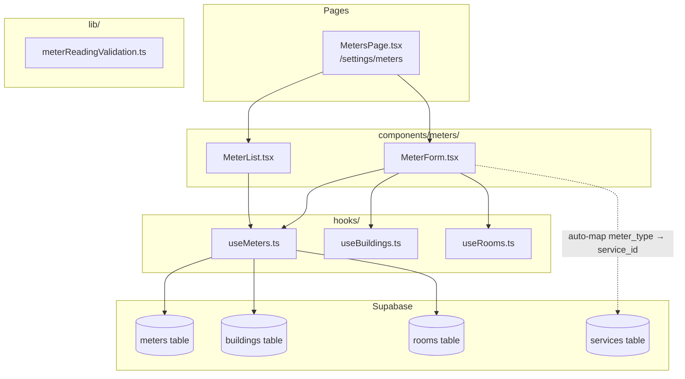
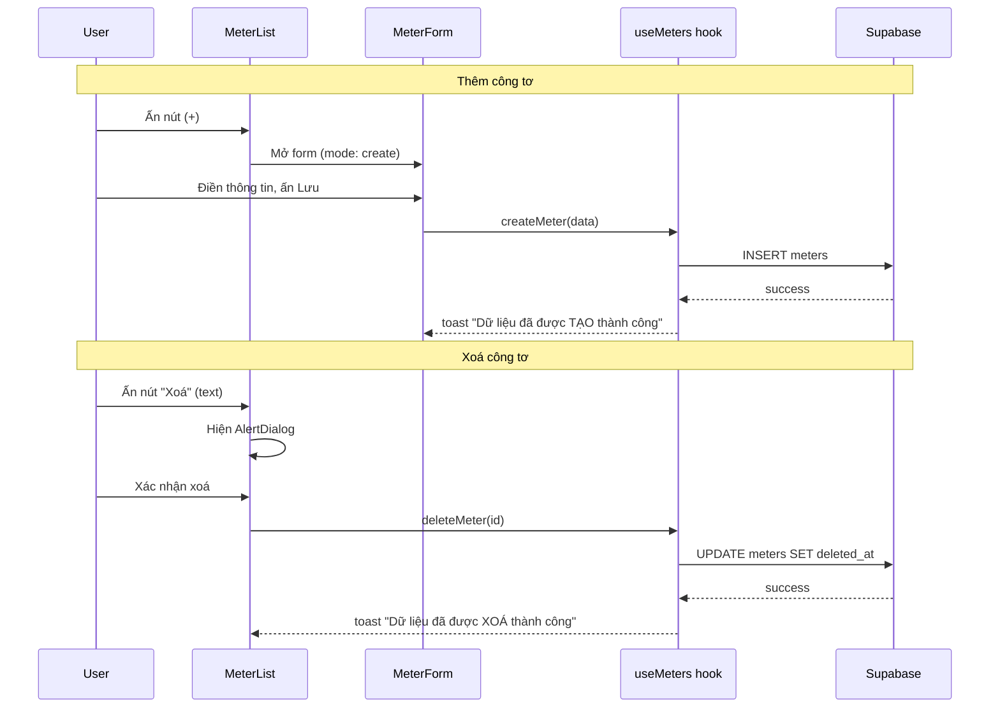

# Tài liệu Thiết kế - Căn chỉnh trang Quản lý Đồng hồ Công tơ

## Tổng quan

Tài liệu này mô tả thiết kế kỹ thuật cho việc căn chỉnh trang quản lý Đồng hồ Công tơ (Meters) để khớp 100% với tài liệu hướng dẫn Resident. Đây không phải tái triển khai mà là sửa đổi code hiện có để khớp với tài liệu.

### Phân tích Gap hiện tại

Sau khi phân tích code hiện có so với tài liệu `resident-docs/cai-dat-he-thong/danh-muc-khac/tai-chinh/dong-ho-cong-to.md`, các điểm cần sửa:

| # | Vấn đề | File ảnh hưởng |
|---|--------|----------------|
| 1 | Nút Sửa/Xoá dùng icon (`Pencil`/`Trash2`) thay vì text "Sửa"/"Xoá" | `MeterList.tsx` |
| 2 | Toast tạo: "Công tơ đã được tạo thành công" → phải là "Dữ liệu đã được TẠO thành công" | `useMeters.ts` |
| 3 | Toast xoá: "Công tơ đã được xóa thành công" → phải là "Dữ liệu đã được XOÁ thành công" | `useMeters.ts` |
| 4 | Form có trường `service_id` (Dịch vụ *) — không có trong tài liệu | `MeterForm.tsx`, `meterReadingValidation.ts` |
| 5 | Trang cũ `src/pages/settings/categories/MetersPage.tsx` vẫn tồn tại và có route `/settings/categories/meters` | `App.tsx`, `CategoriesPage.tsx`, `Breadcrumbs.tsx` |
| 6 | Navigation sidebar trỏ đến route cũ `/settings/categories/meters` thay vì `/settings/meters` | `CategoriesPage.tsx` |

### Quyết định thiết kế chính

1. **Sửa tại chỗ, không tái triển khai**: Code hiện có đã có cấu trúc tốt (CRUD, grouped by room, soft-delete). Chỉ cần sửa các điểm lệch.
2. **Giữ trường `service_id` trong database nhưng ẩn khỏi form**: Trường `service_id` là NOT NULL trong DB schema, nên cần auto-map từ `meter_type` → `service_id` thay vì hiển thị cho user chọn.
3. **Redirect route cũ → route mới**: Thay vì xoá route ngay, redirect `/settings/categories/meters` → `/settings/meters` để tránh broken links.
4. **Giữ nguyên pattern hiện tại**: React Query + Supabase + sonner toast + shadcn/ui + Zod validation.

## Kiến trúc

### Sơ đồ component



### Luồng xử lý chính



## Components và Interfaces

### 1. MeterList.tsx — Thay đổi cần thiết

**Hiện tại**: Nút Sửa/Xoá dùng icon buttons (`<Pencil>`, `<Trash2>`)
**Cần sửa**: Đổi thành text buttons "Sửa" / "Xoá"

```tsx
// TRƯỚC (icon buttons)
<Button variant="ghost" size="icon" onClick={() => onEdit(meter)} title="Sửa">
  <Pencil className="h-4 w-4" />
</Button>
<Button variant="ghost" size="icon" onClick={() => onDelete(meter.id)} title="Xoá">
  <Trash2 className="h-4 w-4 text-destructive" />
</Button>

// SAU (text buttons)
<Button variant="ghost" size="sm" onClick={() => onEdit(meter)}>
  Sửa
</Button>
<Button variant="ghost" size="sm" onClick={() => onDelete(meter.id)}
  className="text-destructive hover:text-destructive">
  Xoá
</Button>
```

Bỏ import `Pencil`, `Trash2` từ lucide-react (không còn dùng).

### 2. MeterForm.tsx — Thay đổi cần thiết

**Loại bỏ trường `service_id` khỏi UI**: Trường này không có trong tài liệu. Tuy nhiên, `service_id` là required trong DB schema. Giải pháp: auto-resolve `service_id` từ `meter_type` trong hook `useCreateMeter`/`useUpdateMeter`.

Thay đổi cụ thể:
- Xoá `FormField` cho `service_id` khỏi JSX
- Xoá `useServices` import
- Xoá `service_id` khỏi form defaultValues và reset logic
- Truyền `service_id` sẽ được resolve trong hook thay vì form

### 3. useMeters.ts — Thay đổi cần thiết

**Toast messages**:
```typescript
// useCreateMeter.onSuccess:
// TRƯỚC: toast.success("Công tơ đã được tạo thành công");
// SAU:
toast.success("Dữ liệu đã được TẠO thành công");

// useDeleteMeter.onSuccess:
// TRƯỚC: toast.success("Công tơ đã được xóa thành công");
// SAU:
toast.success("Dữ liệu đã được XOÁ thành công");
```

**Auto-resolve `service_id`**: Thêm logic lookup service_id từ meter_type trong `useCreateMeter` và `useUpdateMeter` mutationFn. Query bảng `services` để tìm service tương ứng với meter_type (ELECTRICITY → dịch vụ Điện, WATER → dịch vụ Nước, GAS → dịch vụ Gas).

### 4. meterReadingValidation.ts — Thay đổi cần thiết

**Loại bỏ `service_id` khỏi `meterFormSchema`**:
```typescript
// TRƯỚC:
service_id: z.string().min(1, 'Vui lòng chọn dịch vụ'),

// SAU: Xoá trường này khỏi schema
// service_id sẽ được resolve tự động trong hook
```

### 5. Dọn dẹp code trùng lặp

**Xoá file**: `src/pages/settings/categories/MetersPage.tsx`

**App.tsx**: Xoá import `MetersLegacyPage` và thay route `/settings/categories/meters` bằng redirect đến `/settings/meters`:
```tsx
// TRƯỚC:
<Route path="/settings/categories/meters" element={<ProtectedRoute><MetersLegacyPage /></ProtectedRoute>} />

// SAU:
<Route path="/settings/categories/meters" element={<Navigate to="/settings/meters" replace />} />
```

**CategoriesPage.tsx**: Cập nhật href từ `/settings/categories/meters` → `/settings/meters`

**Breadcrumbs.tsx**: Cập nhật mapping cho `/settings/meters` thay vì `/settings/categories/meters`

## Data Models

### Bảng `meters` (không thay đổi schema)

Schema hiện tại đã đầy đủ, không cần migration:

| Column | Type | Required | Ghi chú |
|--------|------|----------|---------|
| id | uuid | PK | Auto-generated |
| user_id | uuid | Yes | FK → auth.users, RLS |
| code | string | Yes | Unique per user, VD: CTD-201 |
| building_id | uuid | Yes | FK → buildings |
| room_id | uuid | No | FK → rooms |
| service_id | uuid | Yes | FK → services, auto-resolved từ meter_type |
| meter_type | enum | Yes | ELECTRICITY, WATER, GAS |
| name | string | No | Auto-generated: "{roomName} - {meterTypeLabel}" |
| installation_date | string | No | ISO date |
| initial_reading | number | No | Default 0 |
| current_reading | number | No | Updated by meter readings |
| status | string | Yes | Default 'ACTIVE' |
| location_note | string | No | |
| manufacturer | string | No | |
| model | string | No | |
| serial_number | string | No | |
| notes | string | No | |
| created_at | timestamp | Yes | Auto |
| updated_at | timestamp | Yes | Auto, trigger |
| deleted_at | timestamp | No | Soft delete |

### Mapping Form Fields → DB Columns

| Form field (UI) | DB column | Required (*) | Ghi chú |
|-----------------|-----------|-------------|---------|
| Tòa nhà | building_id | Yes (*) | Select dropdown |
| Phòng | room_id | Yes (*) | Cascade từ building_id |
| Loại công tơ | meter_type | Yes (*) | ELECTRICITY/WATER/GAS |
| Mã công tơ | code | Yes (*) | Text input, unique |
| ~~Dịch vụ~~ | service_id | ~~Ẩn~~ | Auto-resolved từ meter_type |
| Chỉ số ban đầu | initial_reading | No | Number, default 0 |
| Ngày lắp đặt | installation_date | No | Date picker |
| Ghi chú vị trí | location_note | No | Text input |
| Nhà sản xuất | manufacturer | No | Text input |
| Model | model | No | Text input |
| Số serial | serial_number | No | Text input |
| Ghi chú | notes | No | Textarea |


## Correctness Properties

*A property is a characteristic or behavior that should hold true across all valid executions of a system — essentially, a formal statement about what the system should do. Properties serve as the bridge between human-readable specifications and machine-verifiable correctness guarantees.*

### Các property đã tồn tại (từ meter-reading-reimplementation)

Các property sau đã được implement trong `src/hooks/__tests__/useMeters.property.test.ts` và vẫn áp dụng:
- Property 1 (existing): Nhóm công tơ theo phòng đúng — validates 1.1
- Property 2 (existing): Bộ lọc công tơ chỉ trả về kết quả phù hợp — validates 1.5
- Property 5 (existing): Soft-delete đảm bảo ẩn khỏi danh sách — validates 1.5, 4.4
- Property 6 (existing): Cập nhật công tơ round-trip — validates 3.1, 3.2

### Các property mới cho feature này

### Property 1: Validation schema chấp nhận form hợp lệ và từ chối form thiếu trường bắt buộc

*For any* form data object, if all 4 required fields (building_id, room_id, meter_type, code) are non-empty valid values, the Zod schema should pass validation regardless of whether optional fields are provided. Conversely, *for any* form data object missing any one of the 4 required fields, the schema should reject it.

**Validates: Requirements 2.2, 2.3, 2.7, 8.1, 8.2**

### Property 2: Form pre-population round-trip

*For any* valid meter object, when converting it to form values for editing and then converting back to update payload, the resulting payload should contain all the original field values (excluding auto-managed fields like updated_at, created_at, user_id).

**Validates: Requirements 3.1**

### Property 3: Room cascade filtering

*For any* list of rooms and any selected building_id, filtering rooms by building_id should return only rooms where room.building_id equals the selected building_id, and no matching room should be excluded.

**Validates: Requirements 8.4**

## Error Handling

### Lỗi validation form

| Trường thiếu | Thông báo lỗi |
|--------------|---------------|
| building_id | "Vui lòng chọn tòa nhà" |
| room_id | "Vui lòng chọn phòng" |
| meter_type | "Vui lòng chọn loại công tơ" |
| code | "Vui lòng nhập mã công tơ" |

### Lỗi từ database

| Error code | Nguyên nhân | Thông báo |
|-----------|-------------|-----------|
| 23505 | Unique constraint violation (mã công tơ trùng) | "Mã công tơ đã tồn tại" |
| Khác | Lỗi DB không xác định | "Không thể tạo công tơ" / "Không thể cập nhật công tơ" / "Không thể xóa công tơ" |

### Lỗi auto-resolve service_id

Nếu không tìm được service tương ứng với meter_type, hiển thị toast error và không cho submit form. Đây là trường hợp hiếm (chỉ xảy ra nếu bảng services chưa có dữ liệu seed).

## Testing Strategy

### Dual Testing Approach

**Unit tests** (ví dụ cụ thể, edge cases):
- Verify toast messages match exact text: "Dữ liệu đã được TẠO thành công", "Dữ liệu đã được XOÁ thành công"
- Verify delete confirmation dialog text: "Bạn đang thực hiện thao tác xoá công tơ. Bạn có chắc chắn muốn xoá không?"
- Verify form title: "Thêm công tơ" (create mode), "Sửa công tơ" (edit mode)
- Verify action buttons render as text "Sửa"/"Xoá" not icons
- Verify duplicate meter code error handling (23505 → "Mã công tơ đã tồn tại")

**Property-based tests** (universal properties, min 100 iterations):
- Sử dụng `fast-check` (đã có trong project)
- Mỗi test phải chạy tối thiểu 100 iterations (`{ numRuns: 100 }`)
- Mỗi test phải có comment tag: `Feature: meter-management-alignment, Property {number}: {title}`

### Property test implementation plan

**Property 1: Validation schema**
- File: `src/lib/__tests__/meterFormValidation.property.test.ts`
- Generator: random form data objects with valid/invalid required fields
- Assert: schema.safeParse returns success/failure correctly
- Tag: `Feature: meter-management-alignment, Property 1: Validation schema chấp nhận form hợp lệ và từ chối form thiếu trường bắt buộc`

**Property 2: Form pre-population round-trip**
- File: `src/components/meters/__tests__/meterFormPopulation.property.test.ts`
- Generator: random MeterWithRoom objects
- Assert: toFormValues(meter) → toUpdatePayload(formValues) preserves original values
- Tag: `Feature: meter-management-alignment, Property 2: Form pre-population round-trip`

**Property 3: Room cascade filtering**
- File: `src/hooks/__tests__/useMeters.property.test.ts` (append to existing)
- Generator: random list of rooms with random building_ids, random selected building_id
- Assert: filtered rooms all have matching building_id, no matching room excluded
- Tag: `Feature: meter-management-alignment, Property 3: Room cascade filtering`

### Existing property tests (giữ nguyên)

File `src/hooks/__tests__/useMeters.property.test.ts` đã có 4 property tests từ meter-reading-reimplementation vẫn áp dụng và không cần sửa.
