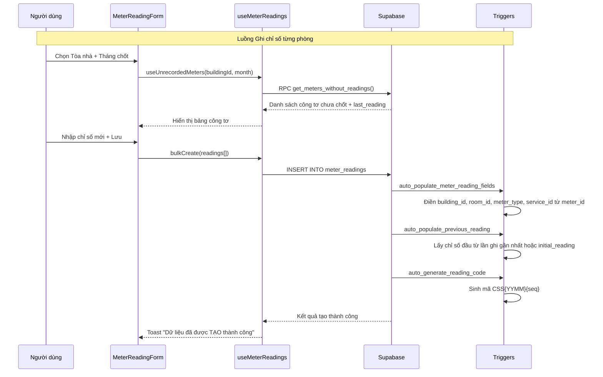
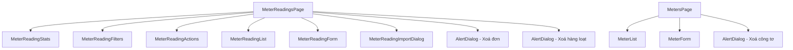
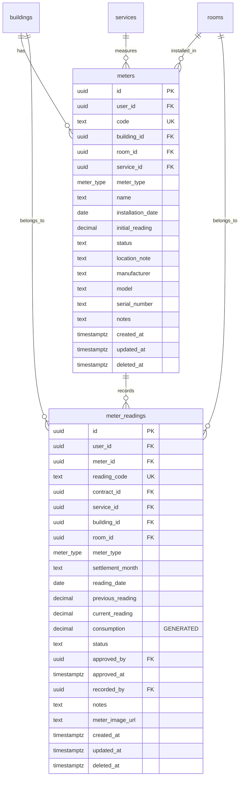

# Tài liệu Thiết kế - Tái hiện thực toàn bộ Ghi chỉ số (Meter Reading)

## Tổng quan

Tài liệu này mô tả thiết kế kỹ thuật cho việc tái hiện thực toàn bộ module Ghi chỉ số (Meter Reading) trong hệ thống quản lý bất động sản Resident. Module bao gồm 2 phần chính:

1. **Ghi chỉ số** (Meter Readings): CRUD, duyệt/bỏ duyệt, nhập hàng loạt từ Excel, danh sách, lọc, thống kê tại Tài chính → Ghi chỉ số
2. **Quản lý Công tơ** (Meters Management): CRUD tại Cài đặt hệ thống → Danh mục khác → Tài chính → Đồng hồ Công tơ

Hệ thống hiện có code frontend và database functions cơ bản nhưng còn lỗi logic (sai field mapping giữa RPC response và form, thiếu tính năng). Cần tái hiện thực lại toàn bộ code, logic, và database functions để khớp 100% với tài liệu hướng dẫn.

### Phạm vi

- Tái hiện thực 2 bảng hiện có: `meters`, `meter_readings`
- Tái hiện thực view `meter_readings_detailed`
- Tái hiện thực 9 database functions/triggers
- Tái hiện thực toàn bộ UI components (6 components cho Ghi chỉ số, 2 components cho Công tơ)
- Tái hiện thực 3 hooks: `useMeterReadings`, `useMeterReadingsHelpers`, `useMeters`
- Tái hiện thực validation schemas (Zod)
- Tích hợp với hóa đơn qua `MeterReadingSelector`
- Tích hợp Supabase Storage cho hình ảnh công tơ

### Quyết định thiết kế chính

1. **Giữ nguyên schema database hiện tại**: Bảng `meters` và `meter_readings` đã có đầy đủ cột cần thiết. Chỉ cần sửa lại logic trong functions/triggers.
2. **Sử dụng `meter_id` làm khóa chính liên kết**: Mọi meter reading đều liên kết với meter qua `meter_id`, trigger `auto_populate_meter_reading_fields` tự động điền `building_id`, `room_id`, `meter_type`, `service_id` từ `meter_id`.
3. **Mã chỉ số tự sinh qua trigger**: Format `CSS{YYMM}{5-digit-sequence}`, ví dụ: `CSS2507000001`.
4. **`consumption` là generated column**: `consumption = current_reading - previous_reading`, tính tự động bởi database.
5. **Giữ nguyên pattern hiện tại**: React Query + Supabase client + sonner toast + shadcn/ui + Zod validation + react-hook-form.
6. **Soft-delete**: Sử dụng `deleted_at` column, query luôn filter `deleted_at IS NULL`.
7. **RLS policy**: Mỗi user chỉ thấy dữ liệu của mình qua `user_id = auth.uid()`.
8. **SECURITY DEFINER cho functions cần quyền cao**: `approve_meter_reading`, `bulk_approve_meter_readings`, `bulk_create_meter_readings`.

## Kiến trúc

### Sơ đồ kiến trúc tổng quan

```mermaid
graph TB
    subgraph Frontend["Frontend (React + TypeScript)"]
        subgraph Pages["Pages"]
            MRP[MeterReadingsPage]
            MP[MetersPage]
        end
        subgraph MRComponents["components/meter-readings/"]
            MRL[MeterReadingList]
            MRF[MeterReadingForm]
            MRS[MeterReadingStats]
            MRFi[MeterReadingFilters]
            MRA[MeterReadingActions]
            MRI[MeterReadingImportDialog]
            MRFU[meterReadingFormUtils]
        end
        subgraph MComponents["components/meters/"]
            ML[MeterList]
            MF[MeterForm]
        end
        subgraph InvComponents["components/invoices/"]
            MRSEL[MeterReadingSelector]
        end
        subgraph Hooks["Hooks"]
            UMR[useMeterReadings]
            UMRH[useMeterReadingsHelpers]
            UM[useMeters]
        end
        subgraph Validation["Validation"]
            MRV[meterReadingValidation - Zod]
        end
    end

    subgraph Backend["Backend (Supabase)"]
        subgraph Tables["Tables"]
            MT[meters]
            MRT[meter_readings]
        end
        subgraph Views["Views"]
            MRD[meter_readings_detailed]
            MWLR[meters_with_latest_reading]
        end
        subgraph Functions["RPC Functions"]
            GMRS[get_meter_reading_stats]
            GMWR[get_meters_without_readings]
            AMR[approve_meter_reading]
            BAMR[bulk_approve_meter_readings]
            BCMR[bulk_create_meter_readings]
        end
        subgraph Triggers["Triggers"]
            APMRF[auto_populate_meter_reading_fields]
            APPR[auto_populate_previous_reading]
            AGRC[auto_generate_reading_code]
            AGMN[auto_generate_meter_name]
        end
        subgraph Storage["Supabase Storage"]
            BUCKET["meter-images bucket"]
        end
    end

    MRP --> MRL & MRF & MRS & MRFi & MRA & MRI
    MP --> ML & MF
    MRL & MRF & MRS & MRI --> UMR
    MRF --> MRFU
    ML & MF --> UM
    MRSEL --> UMR & UMRH
    UMR --> MRD & GMRS & AMR & BAMR & BCMR
    UM --> MT & GMWR
    MRF --> BUCKET
    MRT --> APMRF & APPR & AGRC
    MT --> AGMN
    MRV --> MRF & MRI
```



### Luồng dữ liệu chính




## Thành phần và Giao diện (Components & Interfaces)

### Cấu trúc file

```
src/
├── pages/
│   ├── meter-readings/
│   │   └── MeterReadingsPage.tsx          # Trang chính Ghi chỉ số
│   └── settings/
│       └── MetersPage.tsx                 # Trang quản lý Công tơ
├── components/
│   ├── meter-readings/
│   │   ├── MeterReadingForm.tsx           # Dialog thêm/sửa chỉ số
│   │   ├── MeterReadingList.tsx           # Bảng danh sách chỉ số
│   │   ├── MeterReadingFilters.tsx        # Thanh lọc
│   │   ├── MeterReadingStats.tsx          # Thẻ thống kê
│   │   ├── MeterReadingActions.tsx        # Thanh thao tác hàng loạt
│   │   ├── MeterReadingImportDialog.tsx   # Dialog nhập từ Excel
│   │   └── meterReadingFormUtils.ts       # Pure functions cho form
│   ├── meters/
│   │   ├── MeterForm.tsx                  # Dialog thêm/sửa công tơ
│   │   └── MeterList.tsx                  # Bảng danh sách công tơ
│   └── invoices/
│       └── MeterReadingSelector.tsx       # Chọn chỉ số cho hóa đơn
├── hooks/
│   ├── useMeterReadings.ts               # Hooks CRUD + RPC cho meter_readings
│   ├── useMeterReadingsHelpers.ts         # Pure helper functions (testable)
│   └── useMeters.ts                       # Hooks CRUD cho meters
├── lib/
│   └── meterReadingValidation.ts          # Zod schemas
└── supabase/
    └── migrations/
        ├── 016_meter_readings_enhancements.sql
        ├── 017_meters_table.sql
        └── 018_meter_readings_add_meter_link.sql
```

### Component Hierarchy



### Interfaces chính

#### MeterReadingsPage State

```typescript
interface MeterReadingsPageState {
  filters: MeterReadingFilters;
  selectedIds: string[];
  isFormOpen: boolean;
  isImportOpen: boolean;
  editingReading: MeterReadingDetailed | null;
  deleteTarget: string | null;
  isBulkDeleteOpen: boolean;
}
```

#### MeterReadingFilters

```typescript
interface MeterReadingFilters {
  building_id: string | null;
  room_id: string | null;
  meter_type: 'ELECTRICITY' | 'WATER' | 'GAS' | null;
  month: string; // YYYY-MM
  status: 'UNAPPROVED' | 'APPROVED' | null;
}
```

#### MeterReadingDetailed (từ view)

```typescript
interface MeterReadingDetailed {
  id: string;
  user_id: string;
  reading_code: string;
  meter_id: string;
  meter_code: string;
  meter_name: string;
  contract_id: string | null;
  service_id: string | null;
  service_name: string | null;
  building_id: string;
  building_name: string;
  room_id: string;
  room_name: string;
  meter_type: 'ELECTRICITY' | 'WATER' | 'GAS';
  settlement_month: string;
  reading_date: string;
  previous_reading: number;
  current_reading: number;
  consumption: number;
  status: 'UNAPPROVED' | 'APPROVED';
  approved_by: string | null;
  approver_email: string | null;
  approved_at: string | null;
  recorded_by: string;
  recorder_email: string;
  notes: string | null;
  meter_image_url: string | null;
  created_at: string;
  updated_at: string;
}
```

#### MeterReadingFormValues (Zod schema)

```typescript
interface MeterReadingFormValues {
  building_id: string;
  room_id: string;
  meter_type: 'ELECTRICITY' | 'WATER' | 'GAS' | null;
  settlement_month: string; // YYYY-MM
  reading_date: string;     // YYYY-MM-DD
  readings: Array<{
    meter_id: string;
    current_reading: number;
    notes?: string;
    meter_image_url?: string;
  }>;
}
```

#### UnrecordedMeter (từ RPC get_meters_without_readings)

```typescript
interface UnrecordedMeter {
  meter_id: string;
  meter_code: string;
  meter_name: string;
  room_name: string;
  meter_type_value: 'ELECTRICITY' | 'WATER' | 'GAS';
  last_reading: number;
  last_reading_date: string | null;
}
```

#### MeterWithRoom (cho MeterList)

```typescript
type MeterWithRoom = Meter & {
  building: { id: string; name: string } | null;
  room: { id: string; name: string } | null;
};
```

#### MeterFormValues (Zod schema)

```typescript
interface MeterFormValues {
  building_id: string;
  room_id: string;
  meter_type: 'ELECTRICITY' | 'WATER' | 'GAS';
  code: string;
  initial_reading?: number;
  installation_date?: string;
  location_note?: string;
  manufacturer?: string;
  model?: string;
  serial_number?: string;
  notes?: string;
}
```

#### MeterReadingSelectorProps (tích hợp hóa đơn)

```typescript
interface MeterReadingSelectorProps {
  roomId: string;
  month: string;
  meterType: 'ELECTRICITY' | 'WATER';
  unitPrice: number;
  selectedReadingId?: string;
  onSelect: (reading: {
    readingId: string;
    consumption: number;
    amount: number;
    description: string;
  }) => void;
}
```

### Hooks API

#### useMeterReadings.ts

| Hook | Mô tả | Input | Output |
|------|--------|-------|--------|
| `useMeterReadingsList` | Lấy danh sách chỉ số từ view | filters, pagination | `{ data, totalCount }` |
| `useMeterReadingStats` | Lấy thống kê | buildingId?, month? | `MeterReadingStats` |
| `useCreateMeterReading` | Tạo chỉ số đơn lẻ | `CreateMeterReadingInput` | mutation |
| `useBulkCreateMeterReadings` | Tạo chỉ số hàng loạt | `BulkCreateMeterReadingInput[]` | mutation |
| `useImportMeterReadings` | Import từ Excel | `ImportMeterReadingsInput` | mutation |
| `useUpdateMeterReading` | Cập nhật chỉ số | `UpdateMeterReadingInput` | mutation |
| `useDeleteMeterReading` | Xoá chỉ số (soft) | `id: string` | mutation |
| `useBulkDeleteMeterReadings` | Xoá hàng loạt | `ids: string[]` | mutation |
| `useApproveMeterReading` | Duyệt đơn lẻ (RPC) | `id: string` | mutation |
| `useBulkApproveMeterReadings` | Duyệt hàng loạt (RPC) | `ids: string[]` | mutation |
| `useUnapproveMeterReading` | Bỏ duyệt | `id: string` | mutation |

#### useMeters.ts

| Hook | Mô tả | Input | Output |
|------|--------|-------|--------|
| `useMeters` | Lấy danh sách công tơ | roomId?, meterType? | `Meter[]` |
| `useMetersGroupedByRoom` | Lấy công tơ nhóm theo phòng | buildingId?, meterType? | `MetersGroupedByRoom` |
| `useUnrecordedMeters` | Công tơ chưa chốt (RPC) | buildingId, roomId?, meterType?, month | `UnrecordedMeter[]` |
| `useCreateMeter` | Tạo công tơ | `MeterInsert` | mutation |
| `useUpdateMeter` | Cập nhật công tơ | `{ id, updates }` | mutation |
| `useDeleteMeter` | Xoá công tơ (soft) | `id: string` | mutation |


## Mô hình Dữ liệu (Data Models)

### ERD (Entity Relationship Diagram)



### Bảng `meters`

| Cột | Kiểu | Mô tả | Constraints |
|-----|------|--------|-------------|
| `id` | UUID | Primary key | PK, DEFAULT gen_random_uuid() |
| `user_id` | UUID | Chủ sở hữu | FK → auth.users, NOT NULL |
| `code` | TEXT | Mã công tơ (CTD-201) | NOT NULL, UNIQUE(user_id, code) |
| `building_id` | UUID | Tòa nhà | FK → buildings, NOT NULL |
| `room_id` | UUID | Phòng | FK → rooms, NULL = common meter |
| `service_id` | UUID | Dịch vụ liên kết | FK → services, NOT NULL |
| `meter_type` | meter_type | Loại: ELECTRICITY/WATER/GAS | NOT NULL |
| `name` | TEXT | Tên (auto-gen từ room + type) | Nullable |
| `initial_reading` | DECIMAL(10,2) | Chỉ số ban đầu | DEFAULT 0, >= 0 |
| `status` | TEXT | ACTIVE/INACTIVE/BROKEN/REMOVED | DEFAULT 'ACTIVE' |
| `installation_date` | DATE | Ngày lắp đặt | Nullable |
| `location_note` | TEXT | Ghi chú vị trí | Nullable |
| `manufacturer` | TEXT | Nhà sản xuất | Nullable |
| `model` | TEXT | Model | Nullable |
| `serial_number` | TEXT | Số serial | Nullable |
| `notes` | TEXT | Ghi chú | Nullable |
| `created_at` | TIMESTAMPTZ | Ngày tạo | DEFAULT NOW() |
| `updated_at` | TIMESTAMPTZ | Ngày cập nhật | DEFAULT NOW() |
| `deleted_at` | TIMESTAMPTZ | Soft delete | Nullable |

### Bảng `meter_readings`

| Cột | Kiểu | Mô tả | Constraints |
|-----|------|--------|-------------|
| `id` | UUID | Primary key | PK, DEFAULT gen_random_uuid() |
| `user_id` | UUID | Chủ sở hữu | FK → auth.users, NOT NULL |
| `meter_id` | UUID | Công tơ | FK → meters |
| `reading_code` | TEXT | Mã chỉ số (CSS2507000001) | UNIQUE |
| `contract_id` | UUID | Hợp đồng (legacy) | FK → contracts, Nullable |
| `service_id` | UUID | Dịch vụ | FK → services, Nullable |
| `building_id` | UUID | Tòa nhà (auto-fill) | FK → buildings |
| `room_id` | UUID | Phòng (auto-fill) | FK → rooms |
| `meter_type` | meter_type | Loại công tơ (auto-fill) | NOT NULL |
| `settlement_month` | TEXT | Tháng chốt YYYY-MM (auto-fill) | Nullable |
| `reading_date` | DATE | Ngày chốt | NOT NULL |
| `previous_reading` | DECIMAL(10,2) | Chỉ số đầu (auto-fill) | DEFAULT 0 |
| `current_reading` | DECIMAL(10,2) | Chỉ số mới | NOT NULL |
| `consumption` | DECIMAL(10,2) | Số tiêu thụ | GENERATED ALWAYS AS (current_reading - previous_reading) |
| `status` | TEXT | UNAPPROVED/APPROVED | DEFAULT 'UNAPPROVED' |
| `approved_by` | UUID | Người duyệt | FK → auth.users, Nullable |
| `approved_at` | TIMESTAMPTZ | Thời điểm duyệt | Nullable |
| `recorded_by` | UUID | Người ghi (auto-fill) | FK → auth.users |
| `notes` | TEXT | Ghi chú | Nullable |
| `meter_image_url` | TEXT | URL hình ảnh công tơ | Nullable |
| `created_at` | TIMESTAMPTZ | Ngày tạo | DEFAULT NOW() |
| `updated_at` | TIMESTAMPTZ | Ngày cập nhật | DEFAULT NOW() |
| `deleted_at` | TIMESTAMPTZ | Soft delete | Nullable |

**Constraint**: `meter_readings_current_gte_previous CHECK (current_reading >= previous_reading)`

### View `meter_readings_detailed`

JOIN `meter_readings` với `meters`, `buildings`, `rooms`, `services`, `auth.users` (approver + recorder). Filter `deleted_at IS NULL`. Cung cấp `meter_code`, `meter_name`, `building_name`, `room_name`, `service_name`, `approver_email`, `recorder_email`.

### View `meters_with_latest_reading`

JOIN `meters` với `buildings`, `rooms`, `services`. Subquery lấy `latest_reading`, `latest_reading_date`, `total_readings` từ `meter_readings`. Filter `deleted_at IS NULL`.

### Database Functions

| Function | Kiểu | Mô tả | Security |
|----------|------|--------|----------|
| `auto_populate_meter_reading_fields()` | TRIGGER (BEFORE INSERT) | Từ `meter_id` → điền `building_id`, `room_id`, `meter_type`, `service_id`, `settlement_month`, `recorded_by` | INVOKER |
| `auto_populate_previous_reading()` | TRIGGER (BEFORE INSERT) | Lấy `previous_reading` từ lần ghi gần nhất theo `meter_id`, hoặc `initial_reading` của meter | INVOKER |
| `auto_generate_reading_code()` | TRIGGER (BEFORE INSERT) | Sinh `reading_code` format `CSS{YYMM}{5-digit-seq}` | INVOKER |
| `auto_generate_meter_name()` | TRIGGER (BEFORE INSERT) | Sinh `name` từ room_name + meter_type label | INVOKER |
| `approve_meter_reading(p_reading_id)` | RPC | Duyệt đơn lẻ: status→APPROVED, ghi approved_by/at. RAISE EXCEPTION nếu không tìm thấy hoặc đã duyệt | SECURITY DEFINER |
| `bulk_approve_meter_readings(p_reading_ids)` | RPC | Duyệt hàng loạt, trả về số lượng đã duyệt | SECURITY DEFINER |
| `get_meter_reading_stats(p_building_id, p_month)` | RPC | Trả về thống kê: total, approved, unapproved, consumption theo loại | INVOKER |
| `get_meters_without_readings(p_user_id, p_building_id, p_room_id, p_meter_type, p_month)` | RPC | Danh sách công tơ chưa chốt trong tháng, kèm last_reading | INVOKER |
| `bulk_create_meter_readings(p_readings JSONB)` | RPC | Nhập hàng loạt từ JSONB array, trả về kết quả từng dòng | SECURITY DEFINER |

### Supabase Storage

- **Bucket**: `meter-images`
- **Path pattern**: `readings/{timestamp}_{filename}`
- **Upload**: Sử dụng `uploadFile()` từ `src/lib/storage.ts`
- **Liên kết**: URL lưu vào `meter_readings.meter_image_url`

### Validation Schemas (Zod)

#### meterFormSchema
```typescript
z.object({
  building_id: z.string().min(1, 'Vui lòng chọn tòa nhà'),
  room_id: z.string().min(1, 'Vui lòng chọn phòng'),
  meter_type: z.enum(['ELECTRICITY', 'WATER', 'GAS']),
  code: z.string().min(1, 'Vui lòng nhập mã công tơ'),
  initial_reading: z.number().min(0).optional().default(0),
  installation_date: z.string().optional(),
  location_note: z.string().optional(),
})
```

#### meterReadingFormSchema
```typescript
z.object({
  building_id: z.string().min(1, 'Vui lòng chọn tòa nhà'),
  room_id: z.string().min(1, 'Vui lòng chọn phòng'),
  meter_type: z.enum(['ELECTRICITY', 'WATER', 'GAS']).nullable(),
  settlement_month: z.string().regex(/^\d{4}-\d{2}$/, 'Định dạng: YYYY-MM'),
  reading_date: z.string().min(1, 'Vui lòng chọn ngày chốt'),
  readings: z.array(z.object({
    meter_id: z.string(),
    current_reading: z.number().min(0, 'Chỉ số phải >= 0'),
    notes: z.string().optional(),
    meter_image_url: z.string().optional(),
  })).min(1, 'Vui lòng nhập ít nhất 1 chỉ số'),
})
```

#### excelImportRowSchema
```typescript
z.object({
  meter_code: z.string().min(1, 'Mã công tơ không được trống'),
  reading_date: z.string().min(1, 'Ngày chốt không được trống'),
  current_reading: z.number().min(0, 'Chỉ số phải >= 0'),
  notes: z.string().optional(),
})
```

#### validateReadingValue (custom validation)
```typescript
function validateReadingValue(currentReading: number, previousReading: number): string | null
// Trả về lỗi nếu currentReading < previousReading
```


## Correctness Properties

*A property is a characteristic or behavior that should hold true across all valid executions of a system — essentially, a formal statement about what the system should do. Properties serve as the bridge between human-readable specifications and machine-verifiable correctness guarantees.*

### Property 1: Meter name generation follows pattern

*For any* room name and meter type (ELECTRICITY/WATER/GAS), `generateMeterName(roomName, meterType)` should produce a string in the format `"{roomName} - {typeLabel}"` where typeLabel is the Vietnamese label for the meter type (Điện/Nước/Gas).

**Validates: Requirements 1.3, 8.4**

### Property 2: Active meters filter excludes soft-deleted

*For any* list of meters (with varying `deleted_at` values), `filterActiveMeters(meters)` should return only meters where `deleted_at === null`, and the count of filtered meters plus the count of soft-deleted meters should equal the original list length.

**Validates: Requirements 1.6, 1.7**

### Property 3: Meter filter by building and type

*For any* list of MeterWithRoom objects and any filter combination of `building_id` and `meter_type`, `filterMeters(meters, filters)` should return only meters matching all specified filter criteria, and every meter in the result should satisfy each non-null filter condition.

**Validates: Requirements 1.7**

### Property 4: Load enabled requires building and month

*For any* filter state with `buildingId`, `roomId`, and `month`, `isLoadEnabled(filters)` should return `true` if and only if both `buildingId` and `month` are non-empty strings.

**Validates: Requirements 2.2**

### Property 5: Map meter to reading uses correct field

*For any* UnrecordedMeter object, `mapMeterToReading(meter)` should produce a ReadingFormEntry where `meter_id` equals `meter.meter_id`, `current_reading` is 0, and `notes` and `meter_image_url` are empty strings.

**Validates: Requirements 2.8, 8.1**

### Property 6: Previous reading from list

*For any* meter ID and list of UnrecordedMeter objects, `getPreviousReadingFromList(meterId, list)` should return the `last_reading` of the matching meter, or 0 if no meter matches.

**Validates: Requirements 2.3**

### Property 7: Previous reading from history

*For any* initial reading value and list of ReadingHistoryEntry objects (sorted by reading_date desc), `getPreviousReading(initialReading, entries)` should return the `current_reading` of the first entry if entries exist, or `initialReading` if the list is empty.

**Validates: Requirements 8.2**

### Property 8: Consumption calculation

*For any* two non-negative numbers `currentReading` and `previousReading` where `currentReading >= previousReading`, `calculateConsumption(currentReading, previousReading)` should equal `currentReading - previousReading`.

**Validates: Requirements 2.5**

### Property 9: Reading code generation and validation

*For any* valid yearMonth string (format "YYYY-MM") and positive integer sequence (1-99999), `generateReadingCode(yearMonth, sequence)` should produce a string that passes `isValidReadingCode()`, and the code should match the pattern `CSS{YY}{MM}{5-digit-padded-sequence}`.

**Validates: Requirements 2.6, 8.3**

### Property 10: Validation rejects current < previous

*For any* pair of numbers where `currentReading < previousReading`, `validateReadingValue(currentReading, previousReading)` should return a non-null error string. Conversely, for any pair where `currentReading >= previousReading`, it should return null.

**Validates: Requirements 2.7, 11.2**

### Property 11: New reading payload always UNAPPROVED

*For any* valid input to `createMeterReadingPayload()`, the resulting payload should have `status === "UNAPPROVED"`, `notes` and `meter_image_url` should be null when not provided, and `user_id`, `meter_id`, `reading_date`, `current_reading` should match the input values.

**Validates: Requirements 2.4, 8.10**

### Property 12: Import row validation partition invariant

*For any* array of raw import row objects, `validateImportRows(rows)` should produce `validRows` and `errors` where `validRows.length + errors.length === rows.length`, every valid row passes `excelImportRowSchema`, and every error has a `rowIndex` and non-empty `message`.

**Validates: Requirements 3.5, 3.6**

### Property 13: Approval round-trip

*For any* reading with status UNAPPROVED, applying `applyApproval(reading, approverId, approvedAt)` followed by `applyUnapproval(result)` should produce a state with `status === "UNAPPROVED"`, `approved_by === null`, and `approved_at === null`.

**Validates: Requirements 4.2, 4.4**

### Property 14: Permission based on approval status

*For any* reading status value, `canEditReading(status)` and `canDeleteReading(status)` should both return `true` when `status === "UNAPPROVED"` and both return `false` when `status === "APPROVED"`.

**Validates: Requirements 5.1, 5.2, 5.3**

### Property 15: Bulk delete only removes unapproved

*For any* list of readings (mix of APPROVED and UNAPPROVED) and any set of IDs to delete, `bulkDeleteUnapprovedOnly(readings, ids)` should return `remaining` and `deleted` where: all deleted readings have `status === "UNAPPROVED"` and their ID is in the delete set, all APPROVED readings remain in `remaining`, and `remaining.length + deleted.length === readings.length`.

**Validates: Requirements 5.5**

### Property 16: Filter readings by criteria

*For any* list of MeterReadingFilterable objects and any MeterReadingFilterParams, `applyMeterReadingFilters(readings, filters)` should return only readings matching all non-null filter fields, and every reading in the result should satisfy each specified filter condition.

**Validates: Requirements 6.2**

### Property 17: Pagination correctness

*For any* list of items, positive page number, and positive page size, `paginateList(items, page, pageSize)` should return `totalCount === items.length`, `data.length <= pageSize`, and `data` should be the correct slice of items starting at `(page - 1) * pageSize`.

**Validates: Requirements 6.3**

### Property 18: Stats computation

*For any* list of MeterReadingForStats objects, `computeStats(readings)` should produce: `total_readings === approved_count + unapproved_count`, `approved_count` equals the count of readings with `status === "APPROVED"`, `electricity_consumption` equals the sum of `consumption` for `meter_type === "ELECTRICITY"`, and `water_consumption` equals the sum for `meter_type === "WATER"`.

**Validates: Requirements 7.1, 7.2, 8.7**

### Property 19: Approved readings for invoice filter

*For any* list of MeterReadingForInvoice objects, room ID, and month, `getApprovedReadingsForInvoice(readings, roomId, month)` should return only readings where `status === "APPROVED"` AND `room_id === roomId` AND `settlement_month === month`.

**Validates: Requirements 9.1**

### Property 20: Invoice amount calculation

*For any* non-negative consumption and non-negative unit price, `calculateInvoiceAmount(consumption, unitPrice)` should equal `consumption * unitPrice`.

**Validates: Requirements 9.2**

### Property 21: Validation schema round-trip

*For any* valid MeterReadingFormValues object that passes `meterReadingFormSchema.parse()`, serializing to JSON and parsing back with the same schema should produce an equivalent object.

**Validates: Requirements 11.1, 11.5**

### Property 22: Meter name from list

*For any* meter ID and list of UnrecordedMeter objects, `getMeterNameFromList(meterId, list)` should return the `meter_name` of the matching meter (or `meter_code` if `meter_name` is empty), or empty string if no meter matches.

**Validates: Requirements 2.3**


## Xử lý Lỗi (Error Handling)

### Tầng Client (Frontend)

| Lỗi | Xử lý | Thông báo |
|-----|--------|-----------|
| Thiếu trường bắt buộc (Zod) | Form validation, hiển thị lỗi dưới trường | "Vui lòng chọn tòa nhà", "Vui lòng chọn phòng", etc. |
| Chỉ số mới < chỉ số đầu | `validateReadingValue()` trả về lỗi | "Chỉ số mới phải lớn hơn hoặc bằng chỉ số đầu" |
| Tháng chốt sai format | Zod regex validation | "Định dạng: YYYY-MM" |
| Không có công tơ chưa chốt | Toast info | "Không có công tơ chưa chốt cho bộ lọc đã chọn" |
| Chưa nhập chỉ số nào | Toast error | "Vui lòng nhập ít nhất 1 chỉ số" |
| File Excel sai định dạng | Toast error | "File không đúng định dạng. Vui lòng sử dụng file Excel (.xlsx, .xls)" |
| File Excel không đọc được | Toast error | "Không thể đọc file Excel. Vui lòng kiểm tra định dạng file." |
| Upload hình ảnh thất bại | Toast error | "Không thể tải lên hình ảnh" |

### Tầng Database (Backend)

| Lỗi | Xử lý | Thông báo Frontend |
|-----|--------|-------------------|
| Constraint violation (current < previous) | `meter_readings_current_gte_previous` CHECK | "Không thể tạo chỉ số" (toast error) |
| Mã công tơ trùng (UNIQUE) | PostgreSQL error code 23505 | "Mã công tơ đã tồn tại" |
| Duyệt chỉ số không tồn tại/đã duyệt | `approve_meter_reading` RAISE EXCEPTION | "Không thể duyệt chỉ số" |
| Cập nhật chỉ số đã duyệt | Query filter `status = 'UNAPPROVED'` trả về 0 rows | "Không thể cập nhật: chỉ số đã được duyệt hoặc không tồn tại" |
| RLS violation | Supabase trả về empty result | "Không thể [action] chỉ số" |
| Bulk import - meter not found | `bulk_create_meter_readings` trả về `success: false` | Chi tiết lỗi từng dòng |
| User not authenticated | `supabase.auth.getUser()` trả về null | Redirect to login |

### Chiến lược xử lý lỗi

1. **Validation trước**: Zod schema validate ở client trước khi gửi request
2. **Custom validation**: `validateReadingValue()` kiểm tra chỉ số mới >= chỉ số đầu
3. **Database constraint**: `meter_readings_current_gte_previous` là lớp bảo vệ cuối cùng
4. **Toast notifications**: Sử dụng `sonner` toast cho mọi thông báo lỗi/thành công
5. **Error boundary**: React Query `onError` callback xử lý lỗi mutation
6. **Graceful degradation**: Khi RPC trả về lỗi, hiển thị giá trị mặc định (0, empty array)

## Chiến lược Testing

### Dual Testing Approach

Module này sử dụng kết hợp unit tests và property-based tests:

- **Unit tests**: Kiểm tra các ví dụ cụ thể, edge cases, và error conditions
- **Property tests**: Kiểm tra các thuộc tính phổ quát trên mọi input hợp lệ

### Property-Based Testing

- **Library**: `fast-check` (đã có trong project)
- **Minimum iterations**: 100 per property test
- **Tag format**: `Feature: meter-reading-full-reimplementation, Property {number}: {property_text}`

### Test Files

| File | Mô tả | Loại |
|------|--------|------|
| `src/lib/__tests__/meterReadingValidation.property.test.ts` | Validation schemas, validateReadingValue, calculateConsumption | Property + Unit |
| `src/hooks/__tests__/useMeterReadings.property.test.ts` | Pure helpers: filters, pagination, stats, approval, bulk delete, invoice | Property + Unit |
| `src/hooks/__tests__/useMeters.property.test.ts` | Pure helpers: groupMetersByRoom, filterActiveMeters, filterMeters | Property + Unit |
| `src/components/meter-readings/__tests__/meterReadingFormUtils.property.test.ts` | mapMeterToReading, getPreviousReadingFromList, getMeterNameFromList, isLoadEnabled | Property + Unit |

### Mapping Properties → Tests

Mỗi correctness property (Property 1-22) sẽ được implement bằng MỘT property-based test duy nhất sử dụng `fast-check`. Mỗi test phải:

1. Chạy tối thiểu 100 iterations
2. Có comment tag tham chiếu đến property trong design document
3. Sử dụng `fc.assert(fc.property(...))` pattern
4. Generate random inputs phù hợp với domain

### Unit Tests (bổ sung)

Unit tests tập trung vào:
- Edge cases: empty arrays, null values, boundary values
- Specific examples: known input → expected output
- Error conditions: invalid inputs, constraint violations
- Integration points: component rendering, hook behavior

### Test Coverage Goals

- Tất cả 22 correctness properties phải có property-based test
- Tất cả pure helper functions phải có ít nhất 1 unit test
- Tất cả Zod schemas phải có validation tests (valid + invalid inputs)
- Edge cases cho: empty list, single item, max pagination, all approved/all unapproved

