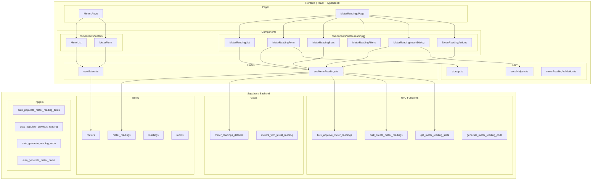
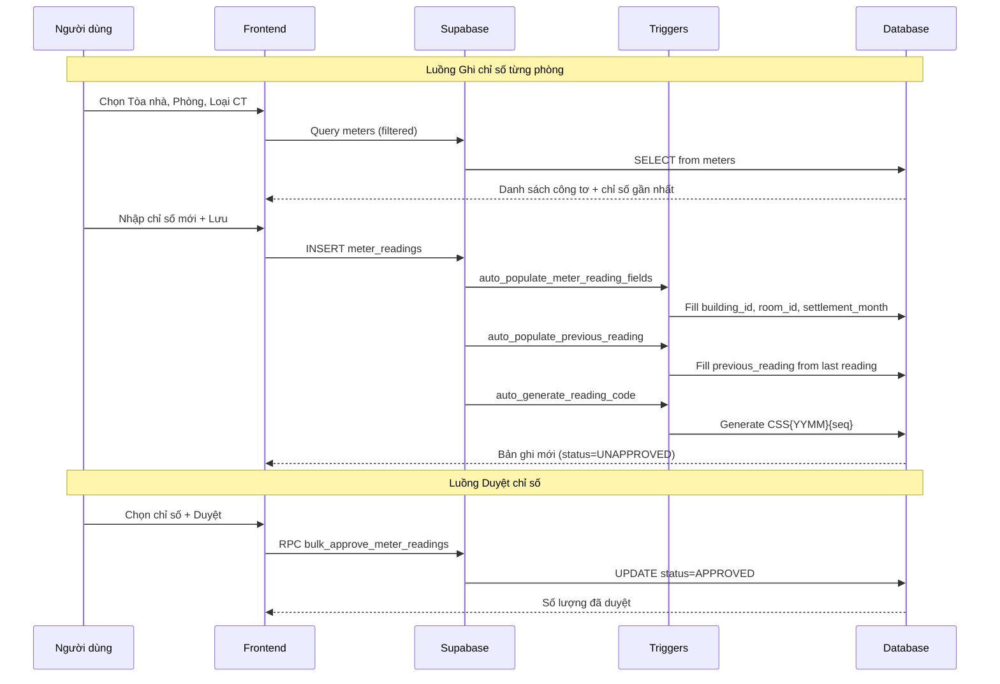
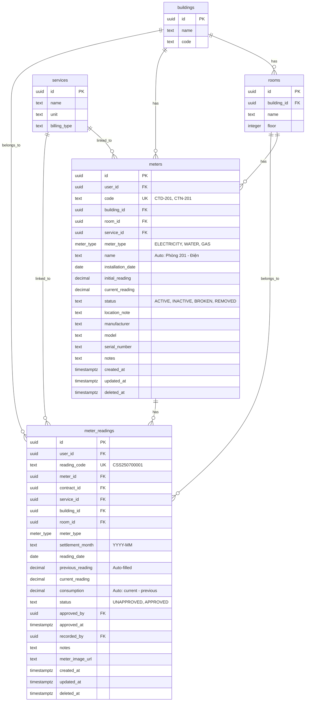

# Tài liệu Thiết kế - Tái triển khai Đồng hồ Công tơ & Ghi chỉ số

## Tổng quan

Tài liệu này mô tả thiết kế kỹ thuật cho việc tái triển khai hai module: **Quản lý Công tơ** (Meters) và **Ghi chỉ số** (Meter Readings) trong hệ thống quản lý bất động sản Resident. Hệ thống hiện tại đã có cơ sở dữ liệu (bảng `meters`, `meter_readings` với các migration 016, 017, 018 đã hoàn thành) và code frontend cơ bản nhưng chưa khớp với tài liệu hướng dẫn chính thức. Mục tiêu là tái triển khai lại giao diện và logic nghiệp vụ để đạt 100% khớp với tài liệu.

### Phạm vi

- **Module 1 - Quản lý Công tơ**: CRUD công tơ theo phòng, hiển thị danh sách nhóm theo phòng, lọc theo tòa nhà/loại công tơ
- **Module 2 - Ghi chỉ số**: Ghi chỉ số từng phòng, nhập hàng loạt qua Excel, sửa/xoá chỉ số, quy trình duyệt (đơn lẻ + hàng loạt + bỏ duyệt), hiển thị danh sách, thống kê, tích hợp hóa đơn, hình ảnh công tơ

### Quyết định thiết kế chính

1. **Tái sử dụng database schema hiện có**: Các migration 016-018 đã tạo đầy đủ bảng, trigger, function, view cần thiết. Không cần thay đổi schema.
2. **Tách hook riêng cho meter readings**: Tạo hook `useMeterReadings.ts` mới thay vì dùng chung trong `useInvoices.ts`, để tách biệt logic nghiệp vụ.
3. **Sử dụng view `meter_readings_detailed`**: Query từ view có sẵn thay vì join thủ công trong frontend.
4. **Sử dụng RPC function cho bulk operations**: Dùng `bulk_create_meter_readings()`, `bulk_approve_meter_readings()` đã có trong database.
5. **Giữ nguyên pattern hiện tại**: React Query + Supabase client + sonner toast + shadcn/ui + Zod validation.

## Kiến trúc

### Sơ đồ kiến trúc tổng quan



### Luồng dữ liệu chính



## Thành phần và Giao diện

### Cấu trúc thư mục

```
src/
├── pages/
│   ├── meter-readings/
│   │   └── MeterReadingsPage.tsx          # Trang chính Ghi chỉ số (tái triển khai)
│   └── settings/
│       └── MetersPage.tsx                 # Trang Quản lý Công tơ (mới)
├── components/
│   ├── meters/
│   │   ├── MeterList.tsx                  # Bảng danh sách công tơ nhóm theo phòng
│   │   └── MeterForm.tsx                  # Form thêm/sửa công tơ (Dialog)
│   └── meter-readings/
│       ├── MeterReadingList.tsx            # Bảng danh sách chỉ số với checkbox
│       ├── MeterReadingForm.tsx            # Form ghi chỉ số từng phòng (Dialog)
│       ├── MeterReadingStats.tsx           # Thẻ thống kê đầu trang
│       ├── MeterReadingFilters.tsx         # Bộ lọc (Tòa nhà, Phòng, Loại CT, Tháng, Trạng thái)
│       ├── MeterReadingImportDialog.tsx    # Dialog nhập hàng loạt từ Excel
│       ├── MeterReadingActions.tsx         # Nút thao tác hàng loạt (Duyệt, Xoá)
│       └── MeterReadingHistoryDialog.tsx   # Dialog lịch sử (giữ nguyên)
├── hooks/
│   ├── useMeters.ts                       # Hook CRUD công tơ (tái triển khai)
│   └── useMeterReadings.ts                # Hook mới cho ghi chỉ số
└── lib/
    └── meterReadingValidation.ts          # Zod schemas cho validation
```

### Giao diện chi tiết các Component

#### 1. MetersPage (Trang Quản lý Công tơ)

```typescript
// src/pages/settings/MetersPage.tsx
// Route: /settings/meters (Cài đặt → Danh mục khác → Tài chính → Đồng hồ Công tơ)

interface MetersPageProps {}

// State:
// - buildingFilter: string | null
// - meterTypeFilter: MeterType | null
// - isFormOpen: boolean
// - editingMeter: Meter | null

// Hooks sử dụng:
// - useMetersGroupedByRoom(buildingId, meterType) → danh sách công tơ nhóm theo phòng
// - useBuildings() → danh sách tòa nhà cho bộ lọc
// - useCreateMeter(), useUpdateMeter(), useDeleteMeter()
```

#### 2. MeterList (Bảng danh sách công tơ)

```typescript
// src/components/meters/MeterList.tsx

interface MeterListProps {
  buildingId?: string;
  meterType?: string;
  onEdit: (meter: Meter) => void;
  onDelete: (meterId: string) => void;
}

// Hiển thị công tơ nhóm theo phòng
// Mỗi nhóm phòng hiển thị: tên phòng, tòa nhà
// Mỗi công tơ hiển thị: Mã, Tên, Loại, Trạng thái, Chỉ số gần nhất
// Nút Sửa, Xoá cho mỗi công tơ
```

#### 3. MeterForm (Form thêm/sửa công tơ)

```typescript
// src/components/meters/MeterForm.tsx

interface MeterFormProps {
  open: boolean;
  onOpenChange: (open: boolean) => void;
  meter?: Meter | null; // null = thêm mới, có giá trị = sửa
}

// Zod schema cho form:
// - building_id: z.string().min(1) (*)
// - room_id: z.string().min(1) (*)
// - meter_type: z.enum(['ELECTRICITY', 'WATER', 'GAS']) (*)
// - code: z.string().min(1) (*)
// - initial_reading: z.number().optional()
// - installation_date: z.string().optional()
// - location_note: z.string().optional()
// - manufacturer: z.string().optional()
// - model: z.string().optional()
// - serial_number: z.string().optional()
// - notes: z.string().optional()
```

#### 4. MeterReadingsPage (Trang Ghi chỉ số - tái triển khai)

```typescript
// src/pages/meter-readings/MeterReadingsPage.tsx
// Route: /meter-readings (Tài chính → Ghi chỉ số)

interface MeterReadingsPageState {
  filters: MeterReadingFilters;
  selectedIds: string[];
  isFormOpen: boolean;
  isImportOpen: boolean;
  editingReading: MeterReading | null;
}

// Layout:
// 1. Header: Tiêu đề + nút (+) Thêm chỉ số + nút Import
// 2. MeterReadingStats: Thẻ thống kê
// 3. MeterReadingFilters: Bộ lọc
// 4. MeterReadingActions: Nút thao tác hàng loạt (khi có checkbox được chọn)
// 5. MeterReadingList: Bảng danh sách chỉ số
```

#### 5. MeterReadingForm (Form ghi chỉ số)

```typescript
// src/components/meter-readings/MeterReadingForm.tsx

interface MeterReadingFormProps {
  open: boolean;
  onOpenChange: (open: boolean) => void;
  reading?: MeterReadingDetailed | null; // null = thêm mới, có giá trị = sửa
}

// Bước 1: Chọn Tòa nhà (*), Phòng (*), Loại CT (*), Tháng chốt (*), Ngày chốt (*)
// Bước 2: Hiển thị bảng công tơ tương ứng
//   Cột: Tên công tơ | Chỉ số đầu (auto) | Chỉ số mới (input) | Ngày chốt | Hình ảnh
// Bước 3: Nhập chỉ số mới + Upload hình (optional) + Lưu
```

#### 6. MeterReadingStats (Thẻ thống kê)

```typescript
// src/components/meter-readings/MeterReadingStats.tsx

interface MeterReadingStatsProps {
  buildingId?: string;
  month: string; // YYYY-MM
}

// Hiển thị 5 thẻ:
// 1. Công tơ chưa chốt (số lượng, icon Gauge)
// 2. Chỉ số đã duyệt (số lượng, icon CheckCircle, màu xanh)
// 3. Chỉ số chưa duyệt (số lượng, icon Clock, màu vàng)
// 4. Tổng tiêu thụ điện (kWh, icon Zap)
// 5. Tổng tiêu thụ nước (m³, icon Droplet)
```

#### 7. MeterReadingFilters (Bộ lọc)

```typescript
// src/components/meter-readings/MeterReadingFilters.tsx

interface MeterReadingFilters {
  building_id: string | null;
  room_id: string | null;
  meter_type: MeterType | null;
  month: string; // YYYY-MM
  status: 'UNAPPROVED' | 'APPROVED' | null;
}

interface MeterReadingFiltersProps {
  filters: MeterReadingFilters;
  onChange: (filters: MeterReadingFilters) => void;
}
```

#### 8. MeterReadingList (Bảng danh sách chỉ số)

```typescript
// src/components/meter-readings/MeterReadingList.tsx

interface MeterReadingListProps {
  readings: MeterReadingDetailed[];
  isLoading: boolean;
  selectedIds: string[];
  onSelectionChange: (ids: string[]) => void;
  onEdit: (reading: MeterReadingDetailed) => void;
  onDelete: (id: string) => void;
  onApprove: (id: string) => void;
  onUnapprove: (id: string) => void;
  pagination: PaginationState;
  totalCount: number;
}

// Cột bảng:
// - Checkbox (chọn nhiều)
// - Mã (reading_code + badge trạng thái: xanh=Đã duyệt, vàng=Chưa duyệt)
// - Thao tác (Duyệt/Bỏ duyệt, Cập nhật, Xoá - disabled khi APPROVED)
// - Công tơ (meter_code / meter_name)
// - Chỉ số đầu (previous_reading)
// - Chỉ số cuối (current_reading)
// - Số tiêu thụ (consumption)
// - Ngày chốt (reading_date)
// - Người chốt (recorder_email)
```

#### 9. MeterReadingImportDialog (Dialog nhập hàng loạt)

```typescript
// src/components/meter-readings/MeterReadingImportDialog.tsx

interface MeterReadingImportDialogProps {
  open: boolean;
  onOpenChange: (open: boolean) => void;
}

// Luồng:
// 1. Hiển thị nút "Tải file mẫu tại đây" → download template Excel
// 2. Khu vực kéo thả / chọn file
// 3. Preview dữ liệu file đã tải lên
// 4. Nút "Nhập dữ liệu" → gọi RPC bulk_create_meter_readings
// 5. Hiển thị kết quả: số thành công, số lỗi, chi tiết lỗi từng dòng
```

#### 10. MeterReadingActions (Thao tác hàng loạt)

```typescript
// src/components/meter-readings/MeterReadingActions.tsx

interface MeterReadingActionsProps {
  selectedIds: string[];
  selectedReadings: MeterReadingDetailed[];
  onBulkApprove: () => void;
  onBulkDelete: () => void;
  onClearSelection: () => void;
}

// Hiển thị khi có ít nhất 1 checkbox được chọn
// Nút: Duyệt (N) | Xoá (N) | Bỏ chọn
// Chỉ cho phép xoá các chỉ số UNAPPROVED
```

### Hook Interfaces

#### useMeters.ts (tái triển khai)

```typescript
// Giữ nguyên các hook hiện có + thêm:

// Query công tơ nhóm theo phòng với thông tin building/room
export const useMetersGroupedByRoom = (buildingId?: string, meterType?: string) => {
  // SELECT *, building:buildings(id, name), room:rooms(id, name)
  // FROM meters WHERE deleted_at IS NULL
  // Nhóm kết quả theo room_id
};

// Query công tơ chưa chốt trong tháng
export const useUnrecordedMeters = (params: {
  buildingId?: string;
  roomId?: string;
  meterType?: string;
  month: string;
}) => {
  // Dùng RPC get_meters_without_readings hoặc query thủ công
  // LEFT JOIN meter_readings WHERE settlement_month = month
  // Trả về meters chưa có reading trong tháng
};
```

#### useMeterReadings.ts (hook mới)

```typescript
// src/hooks/useMeterReadings.ts

// Types
interface MeterReadingFilters {
  building_id?: string;
  room_id?: string;
  meter_type?: MeterType;
  month?: string;
  status?: 'UNAPPROVED' | 'APPROVED';
}

interface MeterReadingDetailed {
  id: string;
  reading_code: string;
  meter_id: string;
  meter_code: string;
  meter_name: string;
  building_id: string;
  building_name: string;
  room_id: string;
  room_name: string;
  meter_type: MeterType;
  settlement_month: string;
  reading_date: string;
  previous_reading: number;
  current_reading: number;
  consumption: number;
  status: 'UNAPPROVED' | 'APPROVED';
  approved_by: string | null;
  approver_email: string | null;
  approved_at: string | null;
  recorded_by: string;
  recorder_email: string;
  notes: string | null;
  meter_image_url: string | null;
}

// Query danh sách chỉ số từ view meter_readings_detailed
export const useMeterReadingsList = (
  filters: MeterReadingFilters,
  pagination: { page: number; pageSize: number }
) => useQuery({...});

// Query thống kê
export const useMeterReadingStats = (
  buildingId?: string,
  month?: string
) => useQuery({
  // Gọi RPC get_meter_reading_stats
});

// Tạo chỉ số mới (đơn lẻ)
export const useCreateMeterReading = () => useMutation({...});

// Tạo chỉ số hàng loạt (từ form ghi chỉ số)
export const useBulkCreateMeterReadings = () => useMutation({...});

// Import chỉ số từ Excel (gọi RPC bulk_create_meter_readings)
export const useImportMeterReadings = () => useMutation({...});

// Cập nhật chỉ số (chỉ khi UNAPPROVED)
export const useUpdateMeterReading = () => useMutation({...});

// Xoá chỉ số (soft delete, chỉ khi UNAPPROVED)
export const useDeleteMeterReading = () => useMutation({...});

// Xoá hàng loạt
export const useBulkDeleteMeterReadings = () => useMutation({...});

// Duyệt đơn lẻ (gọi RPC approve_meter_reading)
export const useApproveMeterReading = () => useMutation({...});

// Duyệt hàng loạt (gọi RPC bulk_approve_meter_readings)
export const useBulkApproveMeterReadings = () => useMutation({...});

// Bỏ duyệt
export const useUnapproveMeterReading = () => useMutation({...});
```


## Mô hình Dữ liệu

### Sơ đồ quan hệ (ERD)



### Bảng `meters` - Chi tiết

| Cột | Kiểu | Mô tả | Ghi chú |
|-----|------|--------|---------|
| id | UUID | Khóa chính | Auto-generated |
| user_id | UUID | Chủ sở hữu (RLS) | FK → auth.users |
| code | TEXT | Mã công tơ (VD: CTD-201) | UNIQUE(user_id, code) |
| building_id | UUID | Tòa nhà | FK → buildings, NOT NULL |
| room_id | UUID | Phòng | FK → rooms, nullable (công tơ chung) |
| service_id | UUID | Dịch vụ liên kết | FK → services |
| meter_type | ENUM | Loại: ELECTRICITY, WATER, GAS, OTHER | NOT NULL |
| name | TEXT | Tên tự sinh | Trigger: auto_generate_meter_name |
| installation_date | DATE | Ngày lắp đặt | Optional |
| initial_reading | DECIMAL(10,2) | Chỉ số ban đầu | Default 0 |
| current_reading | DECIMAL(10,2) | Chỉ số hiện tại | Updated by readings |
| status | TEXT | Trạng thái | ACTIVE, INACTIVE, BROKEN, REMOVED |
| location_note | TEXT | Ghi chú vị trí | Optional |
| manufacturer | TEXT | Nhà sản xuất | Optional |
| model | TEXT | Model | Optional |
| serial_number | TEXT | Số serial | Optional |
| notes | TEXT | Ghi chú | Optional |
| deleted_at | TIMESTAMPTZ | Soft delete | NULL = active |

### Bảng `meter_readings` - Chi tiết

| Cột | Kiểu | Mô tả | Ghi chú |
|-----|------|--------|---------|
| id | UUID | Khóa chính | Auto-generated |
| user_id | UUID | Chủ sở hữu (RLS) | FK → auth.users |
| reading_code | TEXT | Mã chỉ số (CSS250700001) | UNIQUE, auto-generated |
| meter_id | UUID | Công tơ | FK → meters |
| contract_id | UUID | Hợp đồng (legacy) | FK → contracts |
| service_id | UUID | Dịch vụ | FK → services |
| building_id | UUID | Tòa nhà | Auto-populated from meter |
| room_id | UUID | Phòng | Auto-populated from meter |
| meter_type | ENUM | Loại công tơ | Auto-populated from meter |
| settlement_month | TEXT | Tháng chốt (YYYY-MM) | Auto from reading_date |
| reading_date | DATE | Ngày chốt | NOT NULL |
| previous_reading | DECIMAL | Chỉ số đầu | Auto from last reading |
| current_reading | DECIMAL | Chỉ số mới | NOT NULL, input |
| consumption | DECIMAL | Số tiêu thụ | Auto: current - previous |
| status | TEXT | Trạng thái duyệt | UNAPPROVED (default), APPROVED |
| approved_by | UUID | Người duyệt | FK → auth.users |
| approved_at | TIMESTAMPTZ | Thời gian duyệt | |
| recorded_by | UUID | Người ghi | Auto from auth.uid() |
| notes | TEXT | Ghi chú | Optional |
| meter_image_url | TEXT | URL hình ảnh công tơ | Optional |
| deleted_at | TIMESTAMPTZ | Soft delete | NULL = active |

### Database Functions & Triggers đã có

| Function/Trigger | Mô tả | Sử dụng |
|-----------------|--------|---------|
| `auto_generate_meter_name()` | Tự sinh tên công tơ từ phòng + loại | Trigger ON INSERT meters |
| `auto_populate_meter_reading_fields()` | Tự điền building_id, room_id, settlement_month, recorded_by | Trigger ON INSERT meter_readings |
| `auto_populate_previous_reading()` | Tự điền chỉ số đầu từ lần ghi gần nhất hoặc initial_reading | Trigger ON INSERT meter_readings |
| `auto_generate_reading_code()` | Tự sinh mã CSS{YYMM}{seq} | Trigger ON INSERT meter_readings |
| `approve_meter_reading(id)` | Duyệt đơn lẻ | RPC call |
| `bulk_approve_meter_readings(ids[])` | Duyệt hàng loạt | RPC call |
| `get_meter_reading_stats(building_id, month)` | Thống kê | RPC call |
| `bulk_create_meter_readings(jsonb)` | Nhập hàng loạt | RPC call |
| `generate_meter_reading_code(user_id)` | Sinh mã chỉ số | Internal |

### Zod Validation Schemas

```typescript
// src/lib/meterReadingValidation.ts

import { z } from 'zod';

// Schema cho form Thêm/Sửa Công tơ
export const meterFormSchema = z.object({
  building_id: z.string().min(1, 'Vui lòng chọn tòa nhà'),
  room_id: z.string().min(1, 'Vui lòng chọn phòng'),
  meter_type: z.enum(['ELECTRICITY', 'WATER', 'GAS'], {
    required_error: 'Vui lòng chọn loại công tơ',
  }),
  code: z.string().min(1, 'Vui lòng nhập mã công tơ'),
  service_id: z.string().min(1, 'Vui lòng chọn dịch vụ'),
  initial_reading: z.number().min(0).optional().default(0),
  installation_date: z.string().optional(),
  location_note: z.string().optional(),
  manufacturer: z.string().optional(),
  model: z.string().optional(),
  serial_number: z.string().optional(),
  notes: z.string().optional(),
});

// Schema cho form Ghi chỉ số
export const meterReadingFormSchema = z.object({
  building_id: z.string().min(1, 'Vui lòng chọn tòa nhà'),
  room_id: z.string().min(1, 'Vui lòng chọn phòng'),
  meter_type: z.enum(['ELECTRICITY', 'WATER', 'GAS']).nullable(),
  settlement_month: z.string().regex(/^\d{4}-\d{2}$/, 'Định dạng: YYYY-MM'),
  reading_date: z.string().min(1, 'Vui lòng chọn ngày chốt'),
  readings: z.array(z.object({
    meter_id: z.string(),
    current_reading: z.number().min(0, 'Chỉ số phải >= 0'),
    notes: z.string().optional(),
    meter_image_url: z.string().optional(),
  })).min(1, 'Vui lòng nhập ít nhất 1 chỉ số'),
});

// Validation: chỉ số mới >= chỉ số đầu
export const validateReadingValue = (
  currentReading: number,
  previousReading: number
): string | null => {
  if (currentReading < previousReading) {
    return 'Chỉ số mới phải lớn hơn hoặc bằng chỉ số đầu';
  }
  return null;
};

// Schema cho dòng import Excel
export const excelImportRowSchema = z.object({
  meter_code: z.string().min(1, 'Mã công tơ không được trống'),
  reading_date: z.string().min(1, 'Ngày chốt không được trống'),
  current_reading: z.number().min(0, 'Chỉ số phải >= 0'),
  notes: z.string().optional(),
});
```


## Correctness Properties

*Một property (thuộc tính đúng đắn) là một đặc tính hoặc hành vi phải luôn đúng trong mọi lần thực thi hợp lệ của hệ thống — về bản chất, đó là một phát biểu hình thức về những gì hệ thống phải làm. Properties đóng vai trò cầu nối giữa đặc tả dễ đọc cho con người và đảm bảo tính đúng đắn có thể kiểm chứng bằng máy.*

### Property 1: Nhóm công tơ theo phòng đúng

*Với bất kỳ* danh sách công tơ nào, khi nhóm theo phòng, tất cả công tơ trong mỗi nhóm phải có cùng `room_id`, và tổng số công tơ trong tất cả các nhóm phải bằng tổng số công tơ ban đầu.

**Validates: Requirements 1.1**

### Property 2: Bộ lọc công tơ chỉ trả về kết quả phù hợp

*Với bất kỳ* danh sách công tơ và bất kỳ tổ hợp bộ lọc (building_id, meter_type) nào, tất cả công tơ trong kết quả lọc phải thỏa mãn mọi điều kiện lọc đã chọn.

**Validates: Requirements 1.4**

### Property 3: Validation từ chối input thiếu trường bắt buộc

*Với bất kỳ* đối tượng meter input nào mà thiếu ít nhất một trường bắt buộc (building_id, room_id, meter_type, code), Zod schema validation phải từ chối và trả về lỗi tương ứng cho trường bị thiếu.

**Validates: Requirements 2.6**

### Property 4: Tên công tơ tự sinh đúng định dạng

*Với bất kỳ* tên phòng và loại công tơ nào, tên công tơ tự sinh phải chứa tên phòng và tên loại công tơ tương ứng (VD: "Phòng 201 - Điện").

**Validates: Requirements 2.4**

### Property 5: Soft-delete đảm bảo ẩn khỏi danh sách

*Với bất kỳ* công tơ nào đã bị soft-delete (deleted_at != null), công tơ đó không được xuất hiện trong kết quả query danh sách công tơ (query có điều kiện `deleted_at IS NULL`).

**Validates: Requirements 4.2, 4.4**

### Property 6: Cập nhật công tơ round-trip

*Với bất kỳ* công tơ hiện có và bất kỳ bộ giá trị cập nhật hợp lệ nào, sau khi cập nhật và đọc lại, các trường đã cập nhật phải phản ánh giá trị mới, và `updated_at` phải mới hơn trước khi cập nhật.

**Validates: Requirements 3.1, 3.2, 3.3**

### Property 7: Chỉ số đầu tự động điền đúng

*Với bất kỳ* công tơ nào có lịch sử ghi chỉ số, khi tạo bản ghi mới, `previous_reading` phải bằng `current_reading` của lần ghi gần nhất. Nếu chưa có lần ghi nào, `previous_reading` phải bằng `initial_reading` của công tơ.

**Validates: Requirements 5.3**

### Property 8: Số tiêu thụ = Chỉ số mới - Chỉ số đầu

*Với bất kỳ* bản ghi chỉ số nào, `consumption` phải luôn bằng `current_reading - previous_reading`.

**Validates: Requirements 5.5**

### Property 9: Mã chỉ số đúng định dạng CSS{YYMM}{sequence}

*Với bất kỳ* bản ghi chỉ số nào được tạo, `reading_code` phải khớp với regex `^CSS\d{9}$` (CSS + 4 chữ số YYMM + 5 chữ số sequence).

**Validates: Requirements 5.6**

### Property 10: Validation từ chối chỉ số mới < chỉ số đầu

*Với bất kỳ* cặp giá trị (current_reading, previous_reading) nào mà current_reading < previous_reading, hàm validation phải trả về lỗi "Chỉ số mới phải lớn hơn hoặc bằng chỉ số đầu".

**Validates: Requirements 5.7**

### Property 11: Bản ghi mới luôn có trạng thái UNAPPROVED

*Với bất kỳ* bản ghi chỉ số nào vừa được tạo, trường `status` phải là `'UNAPPROVED'`.

**Validates: Requirements 5.4**

### Property 12: Quyền sửa/xoá phụ thuộc trạng thái duyệt

*Với bất kỳ* bản ghi chỉ số nào, nếu `status === 'UNAPPROVED'` thì cho phép sửa và xoá, nếu `status === 'APPROVED'` thì không cho phép sửa và xoá.

**Validates: Requirements 7.1, 7.2, 7.3**

### Property 13: Duyệt rồi bỏ duyệt là round-trip

*Với bất kỳ* bản ghi chỉ số UNAPPROVED nào, sau khi duyệt (approve) rồi bỏ duyệt (unapprove), trạng thái phải trở về UNAPPROVED, và `approved_by` cùng `approved_at` phải là null.

**Validates: Requirements 8.2, 8.3, 8.4**

### Property 14: Xoá hàng loạt chỉ xoá bản ghi chưa duyệt

*Với bất kỳ* tập hợp bản ghi chỉ số được chọn để xoá hàng loạt, chỉ các bản ghi có `status === 'UNAPPROVED'` mới bị xoá, các bản ghi APPROVED phải được giữ nguyên.

**Validates: Requirements 7.4**

### Property 15: Bộ lọc chỉ số trả về kết quả phù hợp

*Với bất kỳ* danh sách chỉ số và bất kỳ tổ hợp bộ lọc (building_id, room_id, meter_type, month, status) nào, tất cả bản ghi trong kết quả phải thỏa mãn mọi điều kiện lọc đã chọn.

**Validates: Requirements 9.2**

### Property 16: Phân trang đúng

*Với bất kỳ* danh sách chỉ số và kích thước trang (pageSize) nào, mỗi trang phải chứa tối đa pageSize bản ghi, và tổng số bản ghi qua tất cả các trang phải bằng tổng số bản ghi gốc.

**Validates: Requirements 9.3**

### Property 17: Thống kê đúng

*Với bất kỳ* tập hợp bản ghi chỉ số trong một tháng nào, tổng (approved_count + unapproved_count) phải bằng total_readings, và tổng tiêu thụ điện phải bằng tổng consumption của tất cả bản ghi có meter_type = ELECTRICITY.

**Validates: Requirements 10.1, 10.2**

### Property 18: Chỉ chỉ số đã duyệt mới được chọn cho hóa đơn

*Với bất kỳ* phòng và tháng chốt nào, danh sách chỉ số khả dụng cho hóa đơn chỉ bao gồm các bản ghi có `status === 'APPROVED'`.

**Validates: Requirements 11.1**

### Property 19: Tính tiền hóa đơn = Số tiêu thụ × Đơn giá

*Với bất kỳ* bản ghi chỉ số và đơn giá dịch vụ nào, thành tiền phải bằng `consumption * unit_price`.

**Validates: Requirements 11.2**

### Property 20: Import Excel - số bản ghi tạo + số lỗi = tổng dòng

*Với bất kỳ* file import nào, tổng (success_count + failed_count) phải bằng tổng số dòng dữ liệu trong file, và mỗi dòng lỗi phải có thông báo lỗi chi tiết.

**Validates: Requirements 6.4, 6.6**

### Property 21: Upload hình ảnh round-trip

*Với bất kỳ* bản ghi chỉ số nào có hình ảnh được tải lên, `meter_image_url` phải là URL hợp lệ, và khi truy xuất bản ghi đó, URL hình ảnh phải được trả về đúng.

**Validates: Requirements 12.2**

## Xử lý Lỗi

### Lỗi Validation (Frontend)

| Tình huống | Xử lý | Thông báo |
|-----------|--------|-----------|
| Thiếu trường bắt buộc khi tạo công tơ | Hiển thị lỗi inline dưới trường | "Vui lòng chọn/nhập [tên trường]" |
| Mã công tơ trùng | Toast error | "Mã công tơ đã tồn tại" |
| Chỉ số mới < Chỉ số đầu | Hiển thị lỗi inline + border đỏ | "Chỉ số mới phải lớn hơn hoặc bằng chỉ số đầu" |
| File import không đúng định dạng | Toast error | "File không đúng định dạng. Vui lòng sử dụng file mẫu" |
| File import có dòng lỗi | Hiển thị bảng chi tiết lỗi | "Dòng X: [mô tả lỗi]" |

### Lỗi Database (Backend)

| Mã lỗi | Tình huống | Xử lý |
|---------|-----------|--------|
| 23505 | Unique constraint violation (mã công tơ trùng) | Toast: "Mã công tơ đã tồn tại" |
| 23503 | Foreign key violation (tòa nhà/phòng không tồn tại) | Toast: "Dữ liệu liên kết không tồn tại" |
| PGRST116 | Row not found | Toast: "Không tìm thấy dữ liệu" |
| Auth error | User not authenticated | Redirect to login |

### Lỗi Nghiệp vụ

| Tình huống | Xử lý |
|-----------|--------|
| Sửa/Xoá chỉ số đã duyệt | Disable nút + tooltip "Vui lòng bỏ duyệt trước khi sửa/xoá" |
| Duyệt chỉ số đã duyệt | Bỏ qua (idempotent) |
| Xoá hàng loạt có chỉ số đã duyệt | Chỉ xoá các chỉ số chưa duyệt, thông báo số lượng bị bỏ qua |
| Import mã công tơ không tồn tại | Báo lỗi dòng tương ứng, tiếp tục xử lý các dòng khác |

## Chiến lược Kiểm thử

### Phương pháp kiểm thử kép

Sử dụng kết hợp **Unit Tests** và **Property-Based Tests** để đảm bảo coverage toàn diện:

- **Unit Tests**: Kiểm tra các ví dụ cụ thể, edge cases, và điều kiện lỗi
- **Property Tests**: Kiểm tra các thuộc tính phổ quát trên mọi input

### Thư viện sử dụng

- **Unit Tests**: Vitest (đã có trong dự án qua Vite)
- **Property-Based Tests**: fast-check (cần cài thêm: `npm install -D fast-check`)
- **Cấu hình**: Mỗi property test chạy tối thiểu 100 iterations

### Unit Tests

| Test | Mô tả | Loại |
|------|--------|------|
| Tạo công tơ với đầy đủ thông tin | Verify tạo thành công với toast message | Example |
| Tạo công tơ thiếu building_id | Verify validation error | Edge case |
| Mã công tơ trùng | Verify error 23505 handling | Edge case |
| Ghi chỉ số với hình ảnh | Verify meter_image_url được lưu | Example |
| Import file rỗng | Verify xử lý graceful | Edge case |
| Import file có header sai | Verify báo lỗi format | Edge case |
| Duyệt chỉ số đã duyệt | Verify idempotent | Edge case |
| Bỏ duyệt chỉ số chưa duyệt | Verify no-op | Edge case |
| Hiển thị nút "Chốt công tơ" khi chưa có chỉ số duyệt | Verify conditional render | Example (11.3) |
| Trang registry hiển thị search interface | Verify form fields present | Example (5.1, 6.1) |

### Property-Based Tests

Mỗi property test phải:
1. Chạy tối thiểu 100 iterations
2. Tham chiếu property trong design document bằng comment
3. Sử dụng format tag: **Feature: meter-reading-reimplementation, Property {N}: {title}**

| Property | Test | Generator |
|----------|------|-----------|
| P1: Nhóm theo phòng | Sinh danh sách meters ngẫu nhiên, verify nhóm đúng | `fc.array(fc.record({room_id: fc.uuid(), ...}))` |
| P2: Bộ lọc công tơ | Sinh meters + filters, verify kết quả match | `fc.record({building_id: fc.option(fc.uuid()), meter_type: fc.option(...)})` |
| P3: Validation bắt buộc | Sinh meter input thiếu random fields, verify reject | `fc.record({...}).map(omitRandomRequired)` |
| P4: Tên tự sinh | Sinh room name + meter type, verify format | `fc.tuple(fc.string(), fc.constantFrom('ELECTRICITY', 'WATER', 'GAS'))` |
| P5: Soft-delete ẩn | Sinh meters với random deleted_at, verify filter | `fc.array(fc.record({deleted_at: fc.option(fc.date())}))` |
| P8: Consumption | Sinh current/previous readings, verify consumption | `fc.tuple(fc.float({min:0}), fc.float({min:0}))` |
| P9: Mã chỉ số format | Sinh reading codes, verify regex | `fc.string()` → verify generated codes |
| P10: Validation chỉ số | Sinh cặp (current, previous), verify validation | `fc.tuple(fc.float(), fc.float())` |
| P12: Quyền theo status | Sinh readings với random status, verify permissions | `fc.record({status: fc.constantFrom('UNAPPROVED', 'APPROVED')})` |
| P13: Approve round-trip | Sinh reading, approve, unapprove, verify state | `fc.record({...})` |
| P15: Bộ lọc chỉ số | Sinh readings + filters, verify match | Similar to P2 |
| P16: Phân trang | Sinh list + pageSize, verify coverage | `fc.tuple(fc.array(...), fc.integer({min:1, max:100}))` |
| P17: Thống kê | Sinh readings, verify counts + sums | `fc.array(fc.record({status: ..., consumption: ..., meter_type: ...}))` |
| P19: Tính tiền | Sinh consumption + unit_price, verify amount | `fc.tuple(fc.float({min:0}), fc.float({min:0}))` |
| P20: Import completeness | Sinh import rows (valid + invalid), verify counts | `fc.array(fc.record({...}))` |

