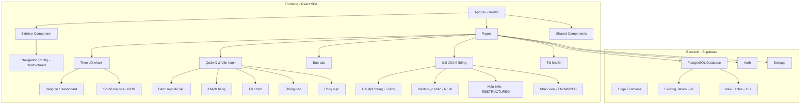
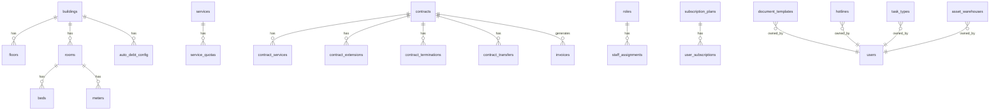

# Tài liệu Thiết kế - Đồng bộ Ứng dụng Web với Tài liệu Hướng dẫn Resident

## Tổng quan

Tài liệu thiết kế này mô tả kiến trúc và các thay đổi cần thiết để đồng bộ ứng dụng web CRM (Resident) với cấu trúc SUMMARY.md. Phạm vi bao gồm:

1. **Tái cấu trúc Sidebar** - Khớp 100% với SUMMARY.md, loại bỏ Khu vực, Trợ lý AI, Duyệt thanh lý
2. **Đổi thuật ngữ** - Phòng → Căn hộ, Sự cố → Công việc, Leads → Khách hẹn, Tổng quan → Bảng tin
3. **Bổ sung module thiếu** - Sơ đồ toà nhà (color-coded grid), Danh mục khác, Mẫu biểu, Tài khoản
4. **Bổ sung báo cáo** - 8 BĐS + 8 Tài chính + 3 Công việc theo đúng SUMMARY.md
5. **Cài đặt chung 5 tabs** - Cơ bản, Hợp đồng, Hóa đơn, Thu chi, Thông báo
6. **Database schema mới** - 10+ bảng mới (floors, hotlines, roles, permissions, v.v.)
7. **UX enhancements** - Tooltips, empty states, breadcrumbs, onboarding flow

### Quyết định thiết kế chính

| Quyết định | Lý do |
|---|---|
| Loại bỏ hoàn toàn AI Assistant | Không có trong tài liệu Resident gốc |
| Loại bỏ hoàn toàn Khu vực (Areas) | Không có trong SUMMARY.md |
| Tích hợp Duyệt thanh lý vào trang Hợp đồng | Giảm menu items, logic liên quan chặt |
| Loại bỏ Zalo OA & E-Invoice | Theo quyết định của user |
| Di chuyển Sổ quỹ từ Tài chính sang Báo cáo Tài chính | Khớp với SUMMARY.md |
| Tách Tỉ lệ lấp đầy thành 2 trang (cũ/mới) | Theo SUMMARY.md |
| Loại bỏ Price History & Contract Changes reports | Không có trong SUMMARY.md |

## Kiến trúc

### Kiến trúc tổng thể

Ứng dụng giữ nguyên kiến trúc SPA hiện tại với React + TypeScript + Vite. Các thay đổi chính tập trung vào:



### Cấu trúc Routing mới

```mermaid
graph LR
    subgraph "Public Routes"
        R1[/login]
        R2[/register]
        R3[/forgot-password]
        R4[/reset-password]
    end
    
    subgraph "Theo dõi nhanh"
        R5["/ (Bảng tin)"]
        R6[/building-map]
    end
    
    subgraph "Danh mục dữ liệu"
        R7[/buildings]
        R8["/apartments (was /rooms)"]
        R9[/beds]
        R10[/services]
        R11[/assets]
    end
    
    subgraph "Khách hàng"
        R12[/leads]
        R13[/deposits]
        R14[/contracts]
        R15["/customers (was /tenants)"]
        R16[/vehicles]
    end
    
    subgraph "Tài chính"
        R17[/meter-readings]
        R18[/invoices]
        R19["/income-expense (was /payments)"]
    end
    
    subgraph "Báo cáo"
        R20[/reports/real-estate/*]
        R21[/reports/finance/*]
        R22[/reports/tasks/*]
    end
    
    subgraph "Cài đặt"
        R23[/settings/general]
        R24["/settings/categories (NEW)"]
        R25[/settings/templates]
        R26[/settings/staff]
    end
    
    subgraph "Tài khoản"
        R27["/account/profile (NEW)"]
        R28["/account/subscription (NEW)"]
    end
```

## Thành phần và Giao diện

### 1. Sidebar Component - Tái cấu trúc hoàn toàn

**File:** `src/components/layout/Sidebar.tsx`

Cấu trúc navigation mới phải khớp 100% với SUMMARY.md:

```typescript
// Navigation configuration - khớp SUMMARY.md
const navigationSections: (NavItem | NavSection)[] = [
  // === THEO DÕI NHANH ===
  { title: 'Bảng tin', href: '/', icon: LayoutDashboard },          // was "Tổng quan"
  { title: 'Sơ đồ toà nhà', href: '/building-map', icon: Map },
  
  // === QUẢN LÝ & VẬN HÀNH ===
  {
    title: 'Danh mục dữ liệu',
    icon: Building2,
    items: [
      // REMOVED: Khu vực
      { title: 'Toà nhà', href: '/buildings', icon: Building2 },
      { title: 'Căn hộ', href: '/apartments', icon: Home },         // was "Phòng" → /rooms
      { title: 'Giường', href: '/beds', icon: Bed },
      { title: 'Dịch vụ', href: '/services', icon: Wrench },
      { title: 'Tài sản', href: '/assets', icon: Package },         // moved from "Tài sản & Sự cố"
    ],
  },
  {
    title: 'Khách hàng',
    icon: Users,
    items: [
      { title: 'Khách hẹn', href: '/leads', icon: UserPlus },
      { title: 'Đặt cọc', href: '/deposits', icon: DollarSign },
      { title: 'Hợp đồng', href: '/contracts', icon: FileText },    // Duyệt thanh lý tích hợp bên trong
      // REMOVED: Duyệt thanh lý (separate menu item)
      { title: 'Khách hàng', href: '/customers', icon: User },      // was "Khách thuê" → /tenants
      { title: 'Phương tiện', href: '/vehicles', icon: Car },
    ],
  },
  {
    title: 'Tài chính',
    icon: CreditCard,
    items: [
      { title: 'Ghi chỉ số', href: '/meter-readings', icon: Gauge },
      { title: 'Hoá đơn', href: '/invoices', icon: Receipt },
      { title: 'Thu chi', href: '/income-expense', icon: CreditCard }, // was "Thu chi" → /payments
      // REMOVED: Sổ quỹ (moved to Báo cáo Tài chính)
    ],
  },
  { title: 'Thông báo', href: '/notifications', icon: Bell },       // standalone item
  { title: 'Công việc', href: '/tasks', icon: ClipboardList },      // was "Sự cố" → /issues
  
  // === BÁO CÁO ===
  {
    title: 'Báo cáo',
    icon: BarChart3,
    items: [
      { title: 'Báo cáo BĐS', href: '/reports/real-estate', icon: Building2 },
      { title: 'Báo cáo Tài chính', href: '/reports/finance', icon: CreditCard },
      { title: 'Báo cáo Công việc', href: '/reports/tasks', icon: ClipboardList },
    ],
  },
  
  // === CÀI ĐẶT HỆ THỐNG ===
  {
    title: 'Cài đặt hệ thống',
    icon: Settings,
    items: [
      { title: 'Cài đặt chung', href: '/settings/general', icon: Settings },
      { title: 'Danh mục khác', href: '/settings/categories', icon: List },    // NEW
      { title: 'Mẫu biểu', href: '/settings/templates', icon: FileText },
      { title: 'Nhân viên', href: '/settings/staff', icon: UserCog },
      // REMOVED: Trợ lý AI
    ],
  },
  
  // === TÀI KHOẢN ===
  {
    title: 'Tài khoản',
    icon: UserCircle,
    items: [
      { title: 'Thông tin cá nhân', href: '/account/profile', icon: User },    // NEW
      { title: 'Gói cước', href: '/account/subscription', icon: CreditCard },  // NEW
    ],
  },
];
```

**Thay đổi so với hiện tại:**

| Hiện tại | Mới | Loại thay đổi |
|---|---|---|
| "Tổng quan" | "Bảng tin" | Đổi tên |
| "Phòng" (/rooms) | "Căn hộ" (/apartments) | Đổi tên + route |
| "Khách thuê" (/tenants) | "Khách hàng" (/customers) | Đổi tên + route |
| "Sự cố" (/issues) | "Công việc" (/tasks) | Đổi tên + route |
| "Thu chi" (/payments) | "Thu chi" (/income-expense) | Đổi route |
| "Sổ quỹ" (/cash-book) | Di chuyển sang Báo cáo TC | Di chuyển |
| "Khu vực" (/areas) | REMOVED | Xóa |
| "Trợ lý AI" | REMOVED | Xóa |
| "Duyệt thanh lý" | Tích hợp vào Hợp đồng | Tích hợp |
| "Tài sản & Sự cố" (group) | Tách: Tài sản → DMDL, Công việc → standalone | Tái cấu trúc |
| — | "Danh mục khác" | Thêm mới |
| — | "Tài khoản" (group) | Thêm mới |

### 2. Sơ đồ Toà nhà Component (Nâng cấp)

**File:** `src/pages/building-map/BuildingMapPage.tsx` (existing, cần nâng cấp)

```typescript
interface FloorMapProps {
  buildingId: string;
  floorNumber: number;
}

// Color-coded room status
const STATUS_COLORS = {
  occupied: '#22c55e',    // Xanh - Đang thuê
  deposited: '#f97316',   // Cam - Đã đặt cọc
  vacant: '#ef4444',      // Đỏ - Trống
  expiring: '#a855f7',    // Tím - Sắp trống
  inactive: '#6b7280',    // Xám - Ngừng hoạt động
};

// Room popup info
interface RoomPopupData {
  roomName: string;
  area: number;
  rentPrice: number;
  currentContract?: { tenantName: string; endDate: string };
  latestInvoice?: { amount: number; status: string };
}
```

### 3. Dashboard (Bảng tin) - Nâng cấp

**File:** `src/pages/Dashboard.tsx`

Bổ sung các thành phần theo tài liệu:
- Stats cards: Tổng phòng, Đang thuê, Trống, Doanh thu tháng, Công nợ tổng
- Line chart: Doanh thu theo tháng (Recharts)
- Pie chart: Tỷ lệ lấp đầy (Recharts)
- Alert list: Hóa đơn quá hạn, HĐ sắp hết hạn, Sự cố chưa xử lý
- Recent activities feed
- Building filter dropdown

### 4. Cài đặt chung - 5 Tabs

**File:** `src/pages/settings/GeneralSettingsPage.tsx`

```typescript
const SETTINGS_TABS = [
  { id: 'basic', label: 'Cài đặt cơ bản' },      // Logo upload
  { id: 'contract', label: 'Hợp đồng' },           // 7 toggles
  { id: 'invoice', label: 'Hóa đơn' },             // 10 toggles
  { id: 'payment', label: 'Thu chi' },              // 1 toggle
  { id: 'notification', label: 'Thông báo' },       // 2 toggles
];
```

Mỗi toggle/switch cần có tooltip mô tả chức năng (Yêu cầu 37.1).

### 5. Danh mục khác (NEW)

**File:** `src/pages/settings/CategoriesPage.tsx` (NEW)

Trang tổng hợp với sub-navigation:

```typescript
const CATEGORY_SECTIONS = [
  {
    title: 'Tài chính',
    items: [
      { title: 'Tài khoản ngân hàng', href: '/settings/categories/bank-accounts' },
      { title: 'Gạch nợ tự động', href: '/settings/categories/auto-debt' },
      { title: 'Loại thu chi', href: '/settings/categories/income-expense-types' },
      { title: 'Định mức dịch vụ', href: '/settings/categories/service-quotas' },
      { title: 'Đồng hồ công tơ', href: '/settings/categories/meters' },
    ],
  },
  {
    title: 'Tài sản',
    items: [
      { title: 'Nhà cung cấp', href: '/settings/categories/suppliers' },
      { title: 'Kho tài sản', href: '/settings/categories/warehouses' },
      { title: 'Loại tài sản', href: '/settings/categories/asset-types' },
      { title: 'Lịch sử di chuyển', href: '/settings/categories/asset-movements' },
      { title: 'Lịch sử sửa chữa', href: '/settings/categories/asset-maintenance' },
    ],
  },
  { title: 'Quản lý Hotline', href: '/settings/categories/hotlines' },
  { title: 'Loại công việc', href: '/settings/categories/task-types' },
  { title: 'Danh mục chung', href: '/settings/categories/general' },
  { title: 'Danh sách tầng', href: '/settings/categories/floors' },
];
```

### 6. Mẫu biểu (Restructured)

**File:** `src/pages/settings/TemplatesPage.tsx`

6 loại mẫu biểu theo SUMMARY.md:
1. Mẫu chữ ký
2. Hợp đồng đặt cọc (template)
3. Hợp đồng thuê (template)
4. Biên bản bàn giao (template)
5. Mẫu hóa đơn
6. Mẫu thu chi

### 7. Báo cáo BĐS - 8 loại

**Routes mới:**

| Route | Tên | Trạng thái |
|---|---|---|
| /reports/real-estate/vacant | Căn hộ trống | Existing (rename) |
| /reports/real-estate/expiring | Căn hộ sắp trống | Existing (rename) |
| /reports/real-estate/renewals-transfers | Phòng gia hạn, chuyển nhượng | NEW |
| /reports/real-estate/occupancy-old | Tỉ lệ lấp đầy (cũ) | Split from existing |
| /reports/real-estate/occupancy-new | Tỉ lệ lấp đầy (mới) | Split from existing |
| /reports/real-estate/promotions | Báo cáo khuyến mại | Existing |
| /reports/real-estate/new-leases | Báo cáo cho thuê | Existing |
| /reports/real-estate/terminations | Báo cáo bỏ trả | Existing |

**Loại bỏ:** Price History, Contract Changes (không có trong SUMMARY.md)

### 8. Báo cáo Tài chính - 8 loại

| Route | Tên | Trạng thái |
|---|---|---|
| /reports/finance/daily-cashbook | Sổ quỹ theo ngày | Moved from /cash-book |
| /reports/finance/cash-flow | Dòng tiền | Existing |
| /reports/finance/profit-distribution | Phân bổ lợi nhuận | Existing |
| /reports/finance/new-contract-debt | Công nợ hợp đồng mới | Existing (rename) |
| /reports/finance/customer-debt | Khách nợ tiền | Existing |
| /reports/finance/payment-schedule | Lịch thanh toán | Existing |
| /reports/finance/overpayment | Tiền thừa | Existing |
| /reports/finance/deposits | Danh sách tiền cọc | Existing |

### 9. Tài khoản Module (NEW)

**Files mới:**
- `src/pages/account/ProfilePage.tsx` - Thông tin cá nhân
- `src/pages/account/SubscriptionPage.tsx` - Gói cước

### 10. Breadcrumb Navigation

**File:** `src/components/layout/Breadcrumbs.tsx` (existing, cần cập nhật)

Breadcrumb phải phản ánh đúng cấu trúc SUMMARY.md:
```
Quản lý & Vận hành > Danh mục dữ liệu > Căn hộ
Cài đặt hệ thống > Danh mục khác > Tài chính > Tài khoản ngân hàng
Báo cáo > Báo cáo BĐS > Căn hộ trống
```

### 11. Empty States & Onboarding

Mỗi danh sách trống cần hiển thị:
```typescript
interface EmptyStateProps {
  icon: React.ComponentType;
  title: string;        // e.g. "Chưa có toà nhà nào"
  description: string;  // e.g. "Hãy thêm toà nhà đầu tiên"
  actionLabel: string;  // e.g. "Thêm toà nhà"
  onAction: () => void;
}
```

Onboarding flow cho người dùng mới (Yêu cầu 2.4, 37.4):
- Hiển thị wizard sau đăng ký thành công
- Steps: Tạo toà nhà → Thêm phòng → Thêm dịch vụ → Tạo hợp đồng

### 12. Ký hợp đồng điện tử

Tích hợp vào trang Hợp đồng, chỉ hiển thị khi setting `e_signing_enabled = true`:
- Flow chủ nhà: Tạo HĐ → Gửi link ký → Theo dõi trạng thái
- Flow khách thuê: Nhận link → Xem HĐ → Ký điện tử

### 13. Code Generation System

**File:** `src/lib/codeGenerator.ts` (existing, cần mở rộng)

Hỗ trợ 4 loại mã code:
- Đặt cọc: `DC-YYYYMM-001`
- Hợp đồng: `HD-YYYYMM-001`
- Hóa đơn: `INV-YYYYMM-001`
- Biên bản bàn giao: `BBBG-YYYYMM-001`

Cấu hình: Tiền tố, Dấu phân cách, Format ngày, Số thứ tự, Padding, Reset period.

## Mô hình Dữ liệu

### Bảng hiện có cần thay đổi

#### 1. `buildings` - Loại bỏ liên kết area_id
```sql
-- Xóa foreign key đến areas
ALTER TABLE buildings DROP CONSTRAINT IF EXISTS buildings_area_id_fkey;
ALTER TABLE buildings DROP COLUMN IF EXISTS area_id;
```

#### 2. `rooms` → Đổi tên UI thành "Căn hộ" (giữ nguyên tên bảng DB)
Bảng `rooms` giữ nguyên tên trong DB, chỉ đổi label UI thành "Căn hộ".

#### 3. `issues` → Đổi tên UI thành "Công việc" (giữ nguyên tên bảng DB)
Bảng `issues` giữ nguyên tên trong DB, chỉ đổi label UI thành "Công việc".

#### 4. `settings` - Bổ sung các key mới
```typescript
// Settings keys cần bổ sung
const NEW_SETTINGS_KEYS = [
  // Tab Hợp đồng
  'contract_auto_set_service_users',
  'contract_asset_inspection',
  'contract_auto_create_on_renewal',
  'contract_e_signing_enabled',
  'contract_payment_date_setting',
  'contract_show_expiring_status',
  'contract_overdue_notification',
  
  // Tab Hóa đơn
  'invoice_auto_approve_meter',
  'invoice_auto_approve',
  'invoice_use_coefficient',
  'invoice_auto_calc_coefficient',
  'invoice_service_cycle_type',      // 'monthly' | 'start_date' | 'cutoff_date'
  'invoice_prorate_method',          // 'actual_days' | 'fixed_30'
  'invoice_payment_deadline_days',
  'invoice_auto_create_deposit',
  'invoice_auto_generate_next',
  'invoice_allow_tenant_meter',
  
  // Tab Thu chi
  'payment_auto_approve',
  
  // Tab Thông báo
  'notification_invoice_reminder',
  'notification_payment_reminder',
];
```

### Bảng mới cần tạo

#### 1. `floors` - Danh sách tầng
```sql
CREATE TABLE floors (
  id UUID PRIMARY KEY DEFAULT gen_random_uuid(),
  building_id UUID NOT NULL REFERENCES buildings(id) ON DELETE CASCADE,
  floor_number INTEGER NOT NULL,
  name VARCHAR(100),
  description TEXT,
  status VARCHAR(20) DEFAULT 'active',
  user_id UUID NOT NULL REFERENCES auth.users(id),
  created_at TIMESTAMPTZ DEFAULT now(),
  updated_at TIMESTAMPTZ DEFAULT now(),
  UNIQUE(building_id, floor_number)
);
```

#### 2. `hotlines` - Quản lý Hotline
```sql
CREATE TABLE hotlines (
  id UUID PRIMARY KEY DEFAULT gen_random_uuid(),
  name VARCHAR(200) NOT NULL,
  phone_number VARCHAR(20) NOT NULL,
  description TEXT,
  is_active BOOLEAN DEFAULT true,
  user_id UUID NOT NULL REFERENCES auth.users(id),
  created_at TIMESTAMPTZ DEFAULT now(),
  updated_at TIMESTAMPTZ DEFAULT now()
);
```

#### 3. `income_expense_types` - Loại thu chi
```sql
CREATE TABLE income_expense_types (
  id UUID PRIMARY KEY DEFAULT gen_random_uuid(),
  name VARCHAR(200) NOT NULL,
  type VARCHAR(10) NOT NULL CHECK (type IN ('income', 'expense')),
  description TEXT,
  is_default BOOLEAN DEFAULT false,
  user_id UUID NOT NULL REFERENCES auth.users(id),
  created_at TIMESTAMPTZ DEFAULT now(),
  updated_at TIMESTAMPTZ DEFAULT now()
);
```

#### 4. `service_quotas` - Định mức dịch vụ
```sql
CREATE TABLE service_quotas (
  id UUID PRIMARY KEY DEFAULT gen_random_uuid(),
  service_id UUID NOT NULL REFERENCES services(id),
  building_id UUID REFERENCES buildings(id),
  quota_value NUMERIC NOT NULL,
  unit VARCHAR(50),
  description TEXT,
  user_id UUID NOT NULL REFERENCES auth.users(id),
  created_at TIMESTAMPTZ DEFAULT now(),
  updated_at TIMESTAMPTZ DEFAULT now()
);
```

#### 5. `meters` - Đồng hồ công tơ
```sql
CREATE TABLE meters (
  id UUID PRIMARY KEY DEFAULT gen_random_uuid(),
  room_id UUID NOT NULL REFERENCES rooms(id),
  meter_type VARCHAR(20) NOT NULL CHECK (meter_type IN ('electricity', 'water')),
  meter_code VARCHAR(100),
  initial_reading NUMERIC DEFAULT 0,
  current_reading NUMERIC DEFAULT 0,
  status VARCHAR(20) DEFAULT 'active',
  user_id UUID NOT NULL REFERENCES auth.users(id),
  created_at TIMESTAMPTZ DEFAULT now(),
  updated_at TIMESTAMPTZ DEFAULT now()
);
```

#### 6. `auto_debt_config` - Gạch nợ tự động
```sql
CREATE TABLE auto_debt_config (
  id UUID PRIMARY KEY DEFAULT gen_random_uuid(),
  building_id UUID REFERENCES buildings(id),
  is_enabled BOOLEAN DEFAULT false,
  bank_account VARCHAR(100),
  matching_rules JSONB,
  user_id UUID NOT NULL REFERENCES auth.users(id),
  created_at TIMESTAMPTZ DEFAULT now(),
  updated_at TIMESTAMPTZ DEFAULT now()
);
```

#### 7. `document_templates` - Mẫu biểu tổng hợp
```sql
CREATE TABLE document_templates (
  id UUID PRIMARY KEY DEFAULT gen_random_uuid(),
  type VARCHAR(50) NOT NULL CHECK (type IN (
    'signature', 'deposit_contract', 'rental_contract',
    'handover_report', 'invoice_template', 'payment_receipt'
  )),
  name VARCHAR(200) NOT NULL,
  content TEXT,
  is_default BOOLEAN DEFAULT false,
  variables JSONB,
  user_id UUID NOT NULL REFERENCES auth.users(id),
  created_at TIMESTAMPTZ DEFAULT now(),
  updated_at TIMESTAMPTZ DEFAULT now()
);
```

#### 8. `roles` - Loại tài khoản
```sql
CREATE TABLE roles (
  id UUID PRIMARY KEY DEFAULT gen_random_uuid(),
  name VARCHAR(100) NOT NULL,
  description TEXT,
  permissions JSONB NOT NULL DEFAULT '{}',
  user_id UUID NOT NULL REFERENCES auth.users(id),
  created_at TIMESTAMPTZ DEFAULT now(),
  updated_at TIMESTAMPTZ DEFAULT now()
);
```

#### 9. `staff_assignments` - Phân quyền nhân viên theo toà nhà
```sql
CREATE TABLE staff_assignments (
  id UUID PRIMARY KEY DEFAULT gen_random_uuid(),
  staff_id UUID NOT NULL REFERENCES auth.users(id),
  role_id UUID NOT NULL REFERENCES roles(id),
  building_id UUID REFERENCES buildings(id),
  user_id UUID NOT NULL REFERENCES auth.users(id),
  created_at TIMESTAMPTZ DEFAULT now(),
  updated_at TIMESTAMPTZ DEFAULT now(),
  UNIQUE(staff_id, building_id)
);
```

#### 10. `subscription_plans` - Gói cước
```sql
CREATE TABLE subscription_plans (
  id UUID PRIMARY KEY DEFAULT gen_random_uuid(),
  name VARCHAR(100) NOT NULL,
  description TEXT,
  price NUMERIC NOT NULL,
  duration_months INTEGER NOT NULL,
  max_rooms INTEGER,
  max_buildings INTEGER,
  features JSONB,
  is_active BOOLEAN DEFAULT true,
  created_at TIMESTAMPTZ DEFAULT now(),
  updated_at TIMESTAMPTZ DEFAULT now()
);
```

#### 11. `user_subscriptions` - Đăng ký gói cước
```sql
CREATE TABLE user_subscriptions (
  id UUID PRIMARY KEY DEFAULT gen_random_uuid(),
  user_id UUID NOT NULL REFERENCES auth.users(id),
  plan_id UUID NOT NULL REFERENCES subscription_plans(id),
  start_date TIMESTAMPTZ NOT NULL,
  end_date TIMESTAMPTZ NOT NULL,
  status VARCHAR(20) DEFAULT 'active',
  created_at TIMESTAMPTZ DEFAULT now(),
  updated_at TIMESTAMPTZ DEFAULT now()
);
```

#### 12. `task_types` - Loại công việc
```sql
CREATE TABLE task_types (
  id UUID PRIMARY KEY DEFAULT gen_random_uuid(),
  name VARCHAR(200) NOT NULL,
  description TEXT,
  color VARCHAR(7),
  user_id UUID NOT NULL REFERENCES auth.users(id),
  created_at TIMESTAMPTZ DEFAULT now(),
  updated_at TIMESTAMPTZ DEFAULT now()
);
```

#### 13. `asset_warehouses` - Kho tài sản
```sql
CREATE TABLE asset_warehouses (
  id UUID PRIMARY KEY DEFAULT gen_random_uuid(),
  name VARCHAR(200) NOT NULL,
  location TEXT,
  building_id UUID REFERENCES buildings(id),
  user_id UUID NOT NULL REFERENCES auth.users(id),
  created_at TIMESTAMPTZ DEFAULT now(),
  updated_at TIMESTAMPTZ DEFAULT now()
);
```

### Bảng cần xóa

#### `areas` - Khu vực
```sql
-- Xóa bảng areas và tất cả references
DROP TABLE IF EXISTS areas CASCADE;
```

### ERD - Quan hệ chính



### Files cần xóa/loại bỏ

| File/Folder | Lý do |
|---|---|
| `src/pages/areas/` | Loại bỏ Khu vực |
| `src/components/areas/` | Loại bỏ Khu vực |
| `src/hooks/useAreas.ts` | Loại bỏ Khu vực |
| `src/pages/settings/AIAssistantPage.tsx` | Loại bỏ Trợ lý AI |
| `src/components/ai/` | Loại bỏ Trợ lý AI |
| `src/hooks/useAIAssistant.ts` | Loại bỏ Trợ lý AI |
| `src/types/ai.ts` | Loại bỏ Trợ lý AI |
| `src/pages/contracts/TerminationApprovalsPage.tsx` | Tích hợp vào ContractsPage |
| `src/pages/reports/real-estate/PriceHistoryReport.tsx` | Không có trong SUMMARY.md |
| `src/pages/reports/real-estate/ContractChangesReport.tsx` | Không có trong SUMMARY.md |

### Files cần tạo mới

| File | Mô tả |
|---|---|
| `src/pages/account/ProfilePage.tsx` | Thông tin cá nhân |
| `src/pages/account/SubscriptionPage.tsx` | Gói cước |
| `src/pages/settings/CategoriesPage.tsx` | Danh mục khác (tổng hợp) |
| `src/pages/settings/categories/*.tsx` | Các trang con danh mục khác |
| `src/pages/reports/real-estate/RenewalsTransfersReport.tsx` | Báo cáo gia hạn/chuyển nhượng |
| `src/pages/reports/real-estate/OccupancyOldReport.tsx` | Tỉ lệ lấp đầy (cũ) |
| `src/pages/reports/real-estate/OccupancyNewReport.tsx` | Tỉ lệ lấp đầy (mới) |
| `src/hooks/useFloors.ts` | Hook quản lý tầng |
| `src/hooks/useHotlines.ts` | Hook quản lý hotline |
| `src/hooks/useRoles.ts` | Hook quản lý roles |
| `src/hooks/useSubscription.ts` | Hook quản lý gói cước |
| `src/hooks/useTaskTypes.ts` | Hook quản lý loại công việc |
