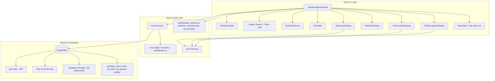
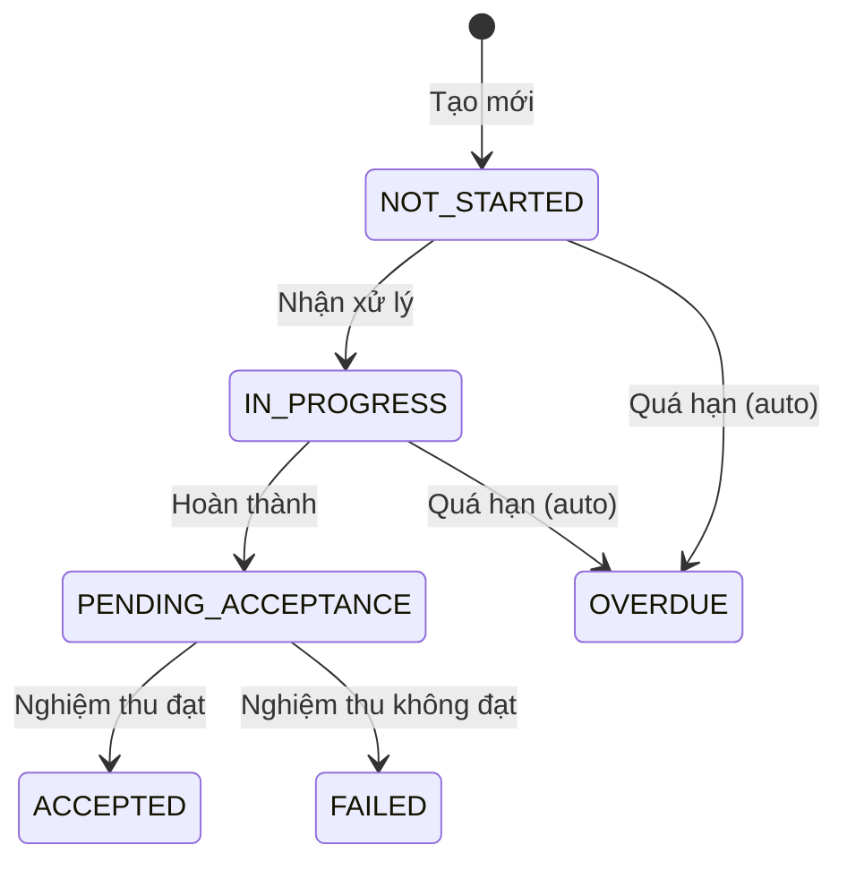
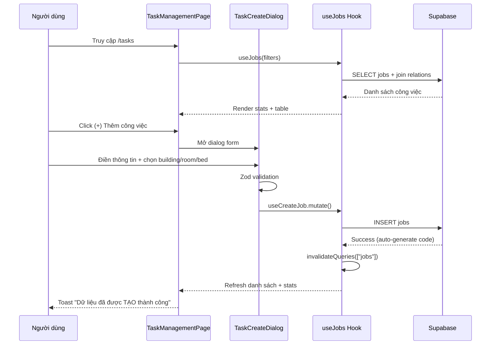
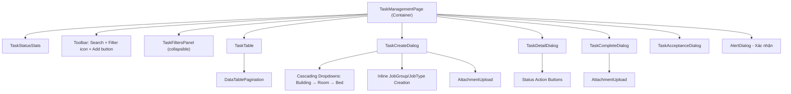
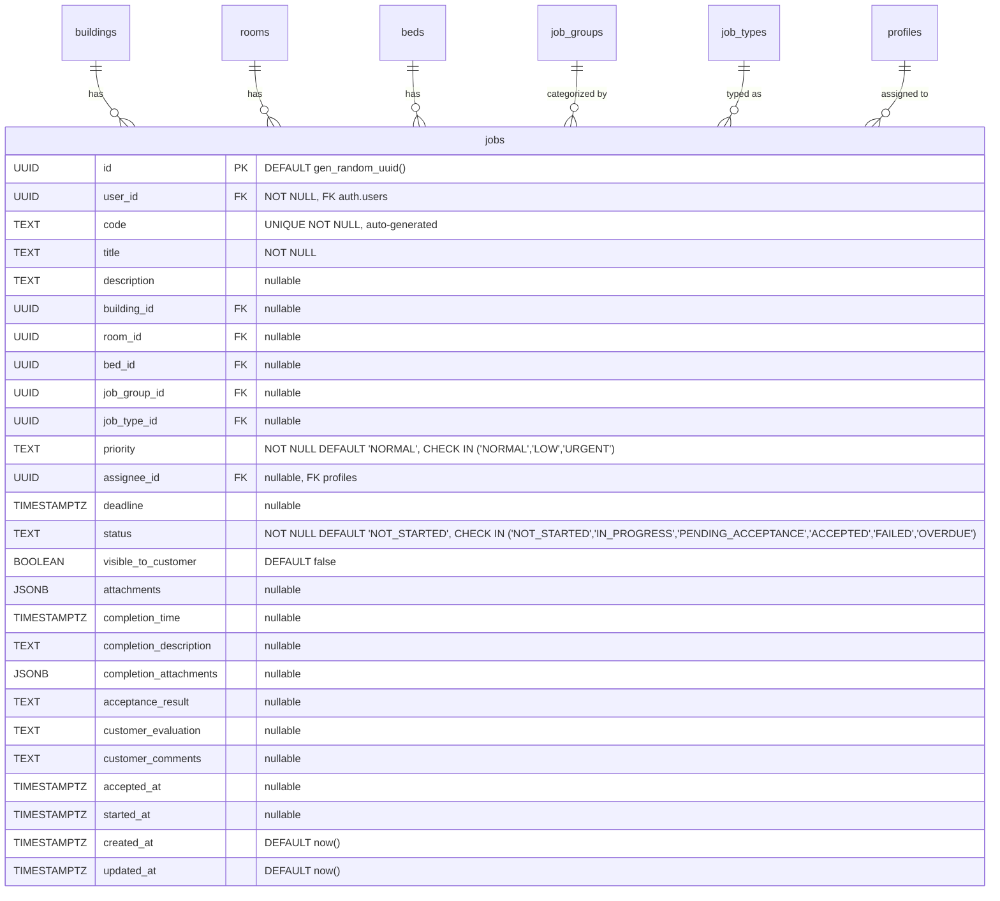

# Thiết kế - Quản lý Công việc (Task Management)

## Tổng quan

Module Công việc (Task Management) là trang quản lý công việc vận hành tại menu chính, cho phép tạo, theo dõi, và xử lý công việc liên quan đến vận hành căn hộ/dự án. Hệ thống hỗ trợ quy trình hoàn chỉnh: Tạo mới → Nhận xử lý → Hoàn thành → Nghiệm thu, kèm thống kê theo trạng thái và bộ lọc đa tiêu chí.

Module cần tạo bảng `jobs` mới trong database (khác với `job_types` đã có), tham chiếu đến `job_types`, `job_groups`, `buildings`, `rooms`, `beds`, `profiles`. Giao diện tuân thủ 100% ảnh tham chiếu và patterns hiện có (IncomeExpensePage, TaskTypesPage).

### Quyết định thiết kế chính

1. **Bảng `jobs` mới**: Cần SQL migration tạo bảng với RLS policies, CHECK constraints cho `priority` và `status`, auto-generate `code`.
2. **Tái sử dụng hooks hiện có**: `useBuildings`, `useRooms`, `useBeds`, `useJobGroups`, `useJobTypes`, `useCreateJobGroup` đã có sẵn. Chỉ cần tạo hook mới `useJobs` cho bảng `jobs`.
3. **Tái sử dụng AttachmentUpload component**: Component upload file đã có sẵn, chỉ cần tạo bucket mới `job-attachments` trên Supabase Storage.
4. **Tuân thủ patterns hiện có**: Sử dụng MainLayout, DataTablePagination, usePagination, TanStack Query hooks, React Hook Form + Zod, toast messages chuẩn ("Dữ liệu đã được TẠO thành công").
5. **Pure helper functions cho testability**: Tách validation (Zod schemas), status flow logic, statistics computation, filter logic vào `lib/jobValidation.ts` để test bằng property-based testing.
6. **Cascading dropdowns**: Building → Room → Bed sử dụng hooks `useRooms(buildingId)` và `useBeds(roomId)` đã có sẵn.
7. **Inline creation**: Nhóm công việc và Loại công việc có thể tạo mới ngay trong form, tái sử dụng pattern từ TaskTypeFormDialog.
8. **Status flow enforcement**: Logic chuyển trạng thái được tách thành pure function `isValidTransition(from, to)` để dễ test.

## Kiến trúc

### Kiến trúc tổng thể



### Luồng trạng thái công việc



### Luồng dữ liệu chính



## Components và Interfaces

### Cấu trúc thư mục

```
src/
├── pages/
│   └── TaskManagementPage.tsx                # Trang chính /tasks
├── components/tasks/
│   ├── TaskStatusStats.tsx                    # Thống kê 6 trạng thái (cards)
│   ├── TaskFiltersPanel.tsx                   # Panel bộ lọc (collapsible)
│   ├── TaskTable.tsx                          # Bảng danh sách công việc
│   ├── TaskCreateDialog.tsx                   # Dialog tạo mới công việc
│   ├── TaskDetailDialog.tsx                   # Dialog chi tiết + actions
│   ├── TaskCompleteDialog.tsx                 # Dialog hoàn thành công việc
│   └── TaskAcceptanceDialog.tsx               # Dialog nghiệm thu công việc
├── hooks/
│   └── useJobs.ts                             # Query + mutation hooks cho jobs
├── lib/
│   └── jobValidation.ts                       # Zod schemas + pure helpers
├── types/
│   └── jobs.ts                                # TypeScript types cho jobs
```

### Component Hierarchy



### Chi tiết từng Component

#### TaskManagementPage (Container)

Trang chính quản lý state và kết nối hooks. Route: `/tasks`.

```typescript
// State management
const [searchQuery, setSearchQuery] = useState('');
const [showFilters, setShowFilters] = useState(false);
const [filters, setFilters] = useState<TaskFilters>(defaultTaskFilters);
const [isCreateOpen, setIsCreateOpen] = useState(false);
const [selectedJob, setSelectedJob] = useState<JobWithRelations | null>(null);
const [isDetailOpen, setIsDetailOpen] = useState(false);
const [isCompleteOpen, setIsCompleteOpen] = useState(false);
const [isAcceptanceOpen, setIsAcceptanceOpen] = useState(false);
const [deleteTarget, setDeleteTarget] = useState<string | null>(null);
const pagination = usePagination(20);
```

Layout (theo ảnh tham chiếu):
1. MainLayout wrapper với title="Công việc", subtitle="Quản lý công việc vận hành", icon=ClipboardList
2. TaskStatusStats — 6 cards thống kê
3. Toolbar row: Search input (trái) + Filter icon button + Add button (phải)
4. TaskFiltersPanel — collapsible, hiển thị khi click filter icon
5. TaskTable — bảng danh sách + pagination

#### TaskStatusStats

Hiển thị 6 cards thống kê số lượng công việc theo trạng thái.

```typescript
interface TaskStatusStatsProps {
  jobs: JobWithRelations[];
}
```

Layout: 6 cards ngang hàng, mỗi card hiển thị:
- Icon + Tên trạng thái
- Số lượng (font lớn, bold)
- Màu sắc phân biệt

Màu sắc theo trạng thái:
| Trạng thái | Label | Màu | Icon |
|------------|-------|-----|------|
| NOT_STARTED | Chưa làm | `bg-gray-100 text-gray-700` | Circle |
| IN_PROGRESS | Đang làm | `bg-blue-100 text-blue-700` | Clock |
| PENDING_ACCEPTANCE | Chờ nghiệm thu | `bg-yellow-100 text-yellow-700` | AlertCircle |
| ACCEPTED | Đã nghiệm thu | `bg-green-100 text-green-700` | CheckCircle |
| FAILED | Không đạt | `bg-red-100 text-red-700` | XCircle |
| OVERDUE | Quá hạn | `bg-orange-100 text-orange-700` | AlertTriangle |

Pure helper: `computeTaskStats(jobs: JobWithRelations[]): Record<JobStatus, number>` — đếm số lượng theo từng trạng thái.

#### TaskFiltersPanel

Panel bộ lọc collapsible, hiển thị khi click nút filter icon (3 đường ngang).

```typescript
interface TaskFiltersPanelProps {
  filters: TaskFilters;
  onChange: (filters: TaskFilters) => void;
  onApply: () => void;
  onClear: () => void;
}
```

Các tiêu chí lọc (theo yêu cầu 3):
- Căn hộ (Select từ useBuildings)
- Phòng (Select từ useRooms, filtered by building)
- Nhóm công việc (Select từ useJobGroups)
- Loại công việc (Select từ useJobTypes)
- Mức độ ưu tiên (Select: Bình thường/Thấp/Gấp)
- Người thực hiện (Select từ profiles)
- Trạng thái (Select: 6 trạng thái)
- Khoảng thời gian (2 date inputs: từ ngày - đến ngày)

Buttons: "Áp dụng" (green) + "Xoá bộ lọc" (outline)

Pattern: Tương tự IncomeExpenseFiltersBar nhưng wrap trong collapsible panel.

#### TaskTable

Bảng hiển thị danh sách công việc.

```typescript
interface TaskTableProps {
  data: JobWithRelations[];
  isLoading: boolean;
  onViewDetail: (job: JobWithRelations) => void;
  onDelete: (id: string) => void;
  pagination: PaginationState;
  totalCount: number;
}
```

Các cột bảng (theo yêu cầu 1):
| Cột | Field | Mô tả |
|-----|-------|-------|
| Mã công việc | `code` | Link clickable → mở detail dialog |
| Tiêu đề | `title` | Text, max-width truncate |
| Căn hộ | `buildings.name` | Tên tòa nhà (join) |
| Phòng | `rooms.name` | Tên phòng (join) |
| Nhóm công việc | `job_groups.name` | Tên nhóm (join) |
| Loại công việc | `job_types.name` | Tên loại (join) |
| Mức độ ưu tiên | `priority` | Badge màu: NORMAL=gray, LOW=blue, URGENT=red |
| Người thực hiện | `profiles.full_name` | Tên người thực hiện (join) |
| Hạn hoàn thành | `deadline` | Format dd/MM/yyyy HH:mm |
| Trạng thái | `status` | Badge màu theo bảng trạng thái |
| Thao tác | — | Icon buttons: View (blue), Delete (red) |

Sắp xếp: `created_at` giảm dần (mới nhất trước).
Empty state: EmptyState component với icon ClipboardList và message "Chưa có công việc nào. Hãy thêm công việc đầu tiên."
Pagination: DataTablePagination component.

#### TaskCreateDialog

Dialog form tạo mới công việc.

```typescript
interface TaskCreateDialogProps {
  open: boolean;
  onOpenChange: (open: boolean) => void;
  onSuccess: () => void;
}
```

Layout form (theo yêu cầu 4):
1. **Căn hộ** — Select dropdown từ useBuildings
2. **Phòng** — Select dropdown từ useRooms(selectedBuildingId), disabled khi chưa chọn Căn hộ
3. **Giường** — Select dropdown từ useBeds(selectedRoomId), disabled khi chưa chọn Phòng
4. **Tiêu đề** (*) — Text input, required
5. **Mô tả** — Textarea
6. **Nhóm công việc** — Select + nút (+) inline create
7. **Loại công việc** — Select + nút (+) inline create
8. **Mức độ ưu tiên** — Select: Bình thường (default) / Thấp / Gấp
9. **Người thực hiện** — Select từ profiles
10. **Hạn hoàn thành** — Date/time picker
11. **Hiển thị với khách hàng** — Toggle switch, default off
12. **Đính kèm** — AttachmentUpload component (bucket: job-attachments)

Buttons: "Huỷ" (outline) | "Lưu" (green)
Title: "THÊM CÔNG VIỆC" (uppercase, text xanh)

Cascading dropdown logic:
- Chọn Căn hộ → reset Phòng, Giường → load rooms by building
- Chọn Phòng → reset Giường → load beds by room
- Clear Căn hộ → clear Phòng, Giường

Inline creation (Nhóm công việc):
- Dropdown có option "Thêm nhóm mới" hoặc nút (+)
- Click → hiển thị input nhập tên → tạo job_group → tự động chọn

Inline creation (Loại công việc):
- Tương tự, tạo job_type mới inline

#### TaskDetailDialog

Dialog hiển thị chi tiết công việc và các action buttons theo trạng thái.

```typescript
interface TaskDetailDialogProps {
  open: boolean;
  onOpenChange: (open: boolean) => void;
  job: JobWithRelations | null;
  onAcceptTask: () => void;      // NOT_STARTED → IN_PROGRESS
  onCompleteTask: () => void;    // Mở TaskCompleteDialog
  onReviewTask: () => void;      // Mở TaskAcceptanceDialog
}
```

Hiển thị tất cả thông tin công việc + attachments.
Action buttons theo trạng thái (pure function `getAvailableActions(status)`):
- NOT_STARTED: "Nhận xử lý" button
- IN_PROGRESS: "Hoàn thành" button
- PENDING_ACCEPTANCE: "Nghiệm thu công việc" button
- ACCEPTED/FAILED/OVERDUE: Không có action button

#### TaskCompleteDialog

Dialog form hoàn thành công việc (IN_PROGRESS → PENDING_ACCEPTANCE).

```typescript
interface TaskCompleteDialogProps {
  open: boolean;
  onOpenChange: (open: boolean) => void;
  jobId: string;
  onSuccess: () => void;
}
```

Form fields:
1. **Thời gian hoàn thành** (*) — Date/time picker, required
2. **Mô tả kết quả** — Textarea
3. **Đính kèm** — AttachmentUpload (tuỳ chọn)

#### TaskAcceptanceDialog

Dialog form nghiệm thu công việc (PENDING_ACCEPTANCE → ACCEPTED hoặc FAILED).

```typescript
interface TaskAcceptanceDialogProps {
  open: boolean;
  onOpenChange: (open: boolean) => void;
  jobId: string;
  onSuccess: () => void;
}
```

Form fields:
1. **Đánh giá kết quả** — Textarea
2. **Đánh giá khách hàng** — Textarea
3. **Ý kiến khách hàng** — Textarea

Buttons: "Không đạt" (red, → FAILED) | "Đạt" (green, → ACCEPTED)

### Hooks

#### useJobs (MỚI)

```typescript
// Fetch jobs with relations and filters
function useJobs(filters?: TaskFilters): UseQueryResult<JobWithRelations[]>

// CRUD mutations
function useCreateJob(): UseMutationResult
function useUpdateJobStatus(id: string, status: JobStatus, extraData?: Partial<Job>): UseMutationResult
function useDeleteJob(): UseMutationResult
```

Query pattern:
```typescript
const { data, error } = await supabase
  .from("jobs")
  .select(`
    *,
    buildings(id, name),
    rooms(id, name),
    beds(id, name),
    job_groups(id, name),
    job_types(id, name),
    profiles!jobs_assignee_id_fkey(id, full_name)
  `)
  .order("created_at", { ascending: false });
```

Filters applied via `.eq()`, `.gte()`, `.lte()` chaining trên Supabase query.

Toast messages:
- Create: "Dữ liệu đã được TẠO thành công"
- Status update: "Trạng thái đã được cập nhật thành công"
- Delete: "Dữ liệu đã được XOÁ thành công"

### Pure Helper Functions (jobValidation.ts)

| Hàm | Mô tả |
|-----|-------|
| `jobCreateSchema` | Zod schema validate form tạo mới |
| `jobCompleteSchema` | Zod schema validate form hoàn thành |
| `jobAcceptanceSchema` | Zod schema validate form nghiệm thu |
| `isValidTransition(from, to)` | Kiểm tra chuyển trạng thái hợp lệ |
| `getAvailableActions(status)` | Trả về danh sách actions khả dụng cho trạng thái |
| `computeTaskStats(jobs)` | Đếm số lượng theo từng trạng thái |
| `filterJobs(jobs, filters)` | Lọc danh sách theo filters |
| `paginateJobs(jobs, page, pageSize)` | Phân trang client-side |
| `isOverdue(job)` | Kiểm tra công việc quá hạn |
| `getStatusLabel(status)` | Trả về label tiếng Việt |
| `getStatusColor(status)` | Trả về CSS class cho badge |
| `getPriorityLabel(priority)` | Trả về label tiếng Việt cho priority |

## Data Models

### Database Schema — Bảng `jobs` (MỚI)



### SQL Migration

```sql
-- Create jobs table
CREATE TABLE public.jobs (
  id UUID PRIMARY KEY DEFAULT gen_random_uuid(),
  user_id UUID NOT NULL REFERENCES auth.users(id) ON DELETE CASCADE,
  code TEXT UNIQUE NOT NULL,
  title TEXT NOT NULL,
  description TEXT,
  building_id UUID REFERENCES public.buildings(id) ON DELETE SET NULL,
  room_id UUID REFERENCES public.rooms(id) ON DELETE SET NULL,
  bed_id UUID REFERENCES public.beds(id) ON DELETE SET NULL,
  job_group_id UUID REFERENCES public.job_groups(id) ON DELETE SET NULL,
  job_type_id UUID REFERENCES public.job_types(id) ON DELETE SET NULL,
  priority TEXT NOT NULL DEFAULT 'NORMAL' CHECK (priority IN ('NORMAL', 'LOW', 'URGENT')),
  assignee_id UUID REFERENCES public.profiles(id) ON DELETE SET NULL,
  deadline TIMESTAMPTZ,
  status TEXT NOT NULL DEFAULT 'NOT_STARTED' CHECK (status IN ('NOT_STARTED', 'IN_PROGRESS', 'PENDING_ACCEPTANCE', 'ACCEPTED', 'FAILED', 'OVERDUE')),
  visible_to_customer BOOLEAN DEFAULT false,
  attachments JSONB,
  completion_time TIMESTAMPTZ,
  completion_description TEXT,
  completion_attachments JSONB,
  acceptance_result TEXT,
  customer_evaluation TEXT,
  customer_comments TEXT,
  accepted_at TIMESTAMPTZ,
  started_at TIMESTAMPTZ,
  created_at TIMESTAMPTZ DEFAULT now(),
  updated_at TIMESTAMPTZ DEFAULT now()
);

-- RLS policies
ALTER TABLE public.jobs ENABLE ROW LEVEL SECURITY;

CREATE POLICY "Users can view own jobs"
  ON public.jobs FOR SELECT
  USING (auth.uid() = user_id);

CREATE POLICY "Users can create own jobs"
  ON public.jobs FOR INSERT
  WITH CHECK (auth.uid() = user_id);

CREATE POLICY "Users can update own jobs"
  ON public.jobs FOR UPDATE
  USING (auth.uid() = user_id)
  WITH CHECK (auth.uid() = user_id);

CREATE POLICY "Users can delete own jobs"
  ON public.jobs FOR DELETE
  USING (auth.uid() = user_id);

-- Auto-generate job code trigger
CREATE OR REPLACE FUNCTION public.generate_job_code()
RETURNS TRIGGER AS $$
BEGIN
  NEW.code := 'JOB-' || TO_CHAR(NOW(), 'YYYYMMDD') || '-' || LPAD(
    (SELECT COALESCE(MAX(CAST(SUBSTRING(code FROM 'JOB-\d{8}-(\d+)') AS INTEGER)), 0) + 1
     FROM public.jobs
     WHERE code LIKE 'JOB-' || TO_CHAR(NOW(), 'YYYYMMDD') || '-%')::TEXT,
    4, '0'
  );
  RETURN NEW;
END;
$$ LANGUAGE plpgsql;

CREATE TRIGGER trigger_generate_job_code
  BEFORE INSERT ON public.jobs
  FOR EACH ROW
  WHEN (NEW.code IS NULL OR NEW.code = '')
  EXECUTE FUNCTION public.generate_job_code();

-- Auto-update updated_at trigger
CREATE TRIGGER trigger_jobs_updated_at
  BEFORE UPDATE ON public.jobs
  FOR EACH ROW
  EXECUTE FUNCTION public.update_updated_at_column();

-- Indexes
CREATE INDEX idx_jobs_user_id ON public.jobs(user_id);
CREATE INDEX idx_jobs_status ON public.jobs(status);
CREATE INDEX idx_jobs_building_id ON public.jobs(building_id);
CREATE INDEX idx_jobs_assignee_id ON public.jobs(assignee_id);
CREATE INDEX idx_jobs_created_at ON public.jobs(created_at DESC);
```

### TypeScript Types (types/jobs.ts)

```typescript
// Job status enum
export const JOB_STATUSES = ['NOT_STARTED', 'IN_PROGRESS', 'PENDING_ACCEPTANCE', 'ACCEPTED', 'FAILED', 'OVERDUE'] as const;
export type JobStatus = typeof JOB_STATUSES[number];

// Job priority enum
export const JOB_PRIORITIES = ['NORMAL', 'LOW', 'URGENT'] as const;
export type JobPriority = typeof JOB_PRIORITIES[number];

// Status labels (Vietnamese)
export const STATUS_LABELS: Record<JobStatus, string> = {
  NOT_STARTED: 'Chưa làm',
  IN_PROGRESS: 'Đang làm',
  PENDING_ACCEPTANCE: 'Chờ nghiệm thu',
  ACCEPTED: 'Đã nghiệm thu',
  FAILED: 'Không đạt',
  OVERDUE: 'Quá hạn',
};

// Priority labels (Vietnamese)
export const PRIORITY_LABELS: Record<JobPriority, string> = {
  NORMAL: 'Bình thường',
  LOW: 'Thấp',
  URGENT: 'Gấp',
};

// Valid status transitions
export const VALID_TRANSITIONS: Record<JobStatus, JobStatus[]> = {
  NOT_STARTED: ['IN_PROGRESS'],
  IN_PROGRESS: ['PENDING_ACCEPTANCE'],
  PENDING_ACCEPTANCE: ['ACCEPTED', 'FAILED'],
  ACCEPTED: [],
  FAILED: [],
  OVERDUE: [],
};

// Job row from database
export interface Job {
  id: string;
  user_id: string;
  code: string;
  title: string;
  description: string | null;
  building_id: string | null;
  room_id: string | null;
  bed_id: string | null;
  job_group_id: string | null;
  job_type_id: string | null;
  priority: JobPriority;
  assignee_id: string | null;
  deadline: string | null;
  status: JobStatus;
  visible_to_customer: boolean;
  attachments: string[] | null;
  completion_time: string | null;
  completion_description: string | null;
  completion_attachments: string[] | null;
  acceptance_result: string | null;
  customer_evaluation: string | null;
  customer_comments: string | null;
  accepted_at: string | null;
  started_at: string | null;
  created_at: string;
  updated_at: string;
}

// Job with joined relations (for display)
export interface JobWithRelations extends Job {
  buildings: { id: string; name: string } | null;
  rooms: { id: string; name: string } | null;
  beds: { id: string; name: string } | null;
  job_groups: { id: string; name: string } | null;
  job_types: { id: string; name: string } | null;
  profiles: { id: string; full_name: string } | null;
}

// Filter state
export interface TaskFilters {
  building_id: string | null;
  room_id: string | null;
  job_group_id: string | null;
  job_type_id: string | null;
  priority: JobPriority | null;
  assignee_id: string | null;
  status: JobStatus | null;
  start_date: string | null;
  end_date: string | null;
}

export const defaultTaskFilters: TaskFilters = {
  building_id: null,
  room_id: null,
  job_group_id: null,
  job_type_id: null,
  priority: null,
  assignee_id: null,
  status: null,
  start_date: null,
  end_date: null,
};
```

### Zod Validation Schemas (lib/jobValidation.ts)

```typescript
import { z } from 'zod';

// Create job schema
export const jobCreateSchema = z.object({
  title: z.string().min(1, 'Tiêu đề không được để trống'),
  description: z.string().optional().nullable(),
  building_id: z.string().uuid().optional().nullable(),
  room_id: z.string().uuid().optional().nullable(),
  bed_id: z.string().uuid().optional().nullable(),
  job_group_id: z.string().uuid().optional().nullable(),
  job_type_id: z.string().uuid().optional().nullable(),
  priority: z.enum(['NORMAL', 'LOW', 'URGENT']).default('NORMAL'),
  assignee_id: z.string().uuid().optional().nullable(),
  deadline: z.string().datetime().optional().nullable(),
  visible_to_customer: z.boolean().default(false),
  attachments: z.array(z.string().url()).optional().nullable(),
});

export type JobCreateFormValues = z.infer<typeof jobCreateSchema>;

// Complete job schema
export const jobCompleteSchema = z.object({
  completion_time: z.string().min(1, 'Thời gian hoàn thành không được để trống'),
  completion_description: z.string().optional().nullable(),
  completion_attachments: z.array(z.string().url()).optional().nullable(),
});

export type JobCompleteFormValues = z.infer<typeof jobCompleteSchema>;

// Acceptance job schema
export const jobAcceptanceSchema = z.object({
  acceptance_result: z.string().optional().nullable(),
  customer_evaluation: z.string().optional().nullable(),
  customer_comments: z.string().optional().nullable(),
});

export type JobAcceptanceFormValues = z.infer<typeof jobAcceptanceSchema>;
```

## Correctness Properties

*A property is a characteristic or behavior that should hold true across all valid executions of a system — essentially, a formal statement about what the system should do. Properties serve as the bridge between human-readable specifications and machine-verifiable correctness guarantees.*

### Property 1: Status transition validity

*For any* pair of job statuses (from, to), `isValidTransition(from, to)` should return `true` if and only if the transition is in the allowed set: NOT_STARTED→IN_PROGRESS, IN_PROGRESS→PENDING_ACCEPTANCE, PENDING_ACCEPTANCE→ACCEPTED, PENDING_ACCEPTANCE→FAILED. All other combinations should return `false`.

**Validates: Requirements 5.3, 6.3, 7.3, 7.4, 8.1, 8.3**

### Property 2: Available actions per status

*For any* valid job status, `getAvailableActions(status)` should return exactly the actions permitted for that status: NOT_STARTED→["accept"], IN_PROGRESS→["complete"], PENDING_ACCEPTANCE→["review"], and empty arrays for ACCEPTED, FAILED, OVERDUE. The returned actions should be a subset of all defined actions.

**Validates: Requirements 5.1, 5.4, 6.1, 7.1**

### Property 3: Task statistics correctness

*For any* list of jobs, `computeTaskStats(jobs)` should return counts where the sum of all status counts equals the total number of jobs, and each individual count equals the number of jobs in the list with that specific status.

**Validates: Requirements 2.1**

### Property 4: Status color mapping distinctness

*For any* two distinct valid job statuses, `getStatusColor(status1)` should return a different CSS class string than `getStatusColor(status2)`. The mapping should be total (defined for all 6 statuses) and injective (no two statuses share the same color).

**Validates: Requirements 2.3**

### Property 5: Filter correctness

*For any* list of jobs and any filter criteria, `filterJobs(jobs, filters)` should return only jobs that match ALL specified filter criteria. When all filter values are null (default filters), all jobs should be returned.

**Validates: Requirements 3.2**

### Property 6: Overdue detection

*For any* job with a non-null deadline in the past and a status that is not ACCEPTED, `isOverdue(job)` should return `true`. For any job with no deadline, or a deadline in the future, or status ACCEPTED, `isOverdue(job)` should return `false`.

**Validates: Requirements 8.2**

### Property 7: Zod schema round-trip for valid job creation input

*For any* valid `JobCreateFormValues` object (with non-empty title, priority in {NORMAL, LOW, URGENT}, valid optional UUID fields, valid optional datetime deadline), parsing through `jobCreateSchema` should succeed and return an equivalent object.

**Validates: Requirements 11.5**

### Property 8: Zod schema rejects invalid job creation input

*For any* input object that has an empty title, or has a priority value not in {NORMAL, LOW, URGENT}, or has an invalid UUID for reference fields, `jobCreateSchema.safeParse` should return `success = false`.

**Validates: Requirements 11.1, 11.2, 11.3, 11.6, 8.4**

### Property 9: Pagination bounds

*For any* list of jobs and valid pagination parameters (page >= 1, pageSize >= 1), `paginateJobs(jobs, page, pageSize)` should return at most `pageSize` items, and the total count should equal the original list length. The returned items should be a contiguous slice of the original list.

**Validates: Requirements 1.2**

## Error Handling

### Client-side Validation Errors
- React Hook Form + Zod resolver hiển thị lỗi inline cho từng trường
- Lỗi validation hiển thị bằng text đỏ dưới trường input tương ứng
- Form không submit khi có lỗi validation
- Lỗi cụ thể:
  - Tiêu đề rỗng: "Tiêu đề không được để trống"
  - Thời gian hoàn thành rỗng: "Thời gian hoàn thành không được để trống"
  - Priority không hợp lệ: Zod enum error

### Status Transition Errors
- `isValidTransition` trả về `false` → hiển thị toast.error("Không thể chuyển trạng thái")
- UI chỉ hiển thị action buttons hợp lệ cho trạng thái hiện tại → ngăn chặn transition không hợp lệ từ phía UI

### Server-side Errors (Supabase)
- Mutation hooks catch errors từ Supabase và hiển thị qua `toast.error()`
- Lỗi RLS (unauthorized): toast "Không thể thực hiện thao tác"
- Lỗi FK constraint: hiển thị message từ Supabase
- Lỗi CHECK constraint (priority, status): handled by client-side validation trước

### Network Errors
- TanStack Query tự động retry (default 3 lần)
- Loading states hiển thị Skeleton components
- Empty states hiển thị EmptyState component

### File Upload Errors
- AttachmentUpload component xử lý lỗi upload (file quá lớn, loại file không hợp lệ)
- Toast error messages cho từng loại lỗi
- Retry logic cho upload failures

## Testing Strategy

### Dual Testing Approach

Module Công việc sử dụng kết hợp unit tests và property-based tests:

- **Property-based tests**: Verify 9 correctness properties trên nhiều input ngẫu nhiên, sử dụng thư viện `fast-check`. Mỗi property test chạy tối thiểu 100 iterations.
- **Unit tests**: Verify các ví dụ cụ thể, edge cases, và integration points.

### Property-Based Testing

**Thư viện**: `fast-check`

**Cấu hình**: Mỗi test chạy `{ numRuns: 100 }` tối thiểu.

**Tag format**: Mỗi test có comment header:
```
/**
 * Feature: task-management, Property {number}: {property_text}
 * Validates: Requirements X.Y
 */
```

**Mỗi correctness property được implement bởi MỘT property-based test duy nhất.**

### Test Files

| File | Nội dung |
|------|----------|
| `src/lib/__tests__/jobValidation.property.test.ts` | Properties 1-2 (status transitions + available actions) |
| `src/lib/__tests__/jobValidation.test.ts` | Unit tests: edge cases, specific examples |
| `src/lib/__tests__/jobStats.property.test.ts` | Properties 3-4 (stats + color mapping) |
| `src/lib/__tests__/jobFilter.property.test.ts` | Properties 5, 9 (filter + pagination) |
| `src/lib/__tests__/jobOverdue.property.test.ts` | Property 6 (overdue detection) |
| `src/lib/__tests__/jobSchema.property.test.ts` | Properties 7-8 (Zod validation round-trip) |

### Generators (fast-check Arbitraries)

```typescript
import fc from 'fast-check';

// Status generator
const jobStatusArb = fc.constantFrom(
  'NOT_STARTED' as const, 'IN_PROGRESS' as const, 'PENDING_ACCEPTANCE' as const,
  'ACCEPTED' as const, 'FAILED' as const, 'OVERDUE' as const
);

// Priority generator
const jobPriorityArb = fc.constantFrom('NORMAL' as const, 'LOW' as const, 'URGENT' as const);

// Valid job create form values generator
const validJobCreateFormArb = fc.record({
  title: fc.string({ minLength: 1, maxLength: 200 }).filter(s => s.trim().length > 0),
  description: fc.option(fc.string({ maxLength: 1000 }), { nil: null }),
  building_id: fc.option(fc.uuid(), { nil: null }),
  room_id: fc.option(fc.uuid(), { nil: null }),
  bed_id: fc.option(fc.uuid(), { nil: null }),
  job_group_id: fc.option(fc.uuid(), { nil: null }),
  job_type_id: fc.option(fc.uuid(), { nil: null }),
  priority: jobPriorityArb,
  assignee_id: fc.option(fc.uuid(), { nil: null }),
  deadline: fc.option(fc.date().map(d => d.toISOString()), { nil: null }),
  visible_to_customer: fc.boolean(),
  attachments: fc.option(fc.array(fc.webUrl(), { maxLength: 5 }), { nil: null }),
});

// Invalid job create form values generator
const invalidJobCreateFormArb = fc.oneof(
  // Empty title
  fc.record({
    title: fc.constant(''),
    priority: jobPriorityArb,
  }),
  // Whitespace-only title
  fc.record({
    title: fc.stringOf(fc.constant(' '), { minLength: 1, maxLength: 10 }),
    priority: jobPriorityArb,
  }),
);

// Job with relations generator (for stats/filter tests)
const jobWithRelationsArb = fc.record({
  id: fc.uuid(),
  code: fc.string({ minLength: 5, maxLength: 20 }),
  title: fc.string({ minLength: 1, maxLength: 200 }),
  status: jobStatusArb,
  priority: jobPriorityArb,
  building_id: fc.option(fc.uuid(), { nil: null }),
  room_id: fc.option(fc.uuid(), { nil: null }),
  job_group_id: fc.option(fc.uuid(), { nil: null }),
  job_type_id: fc.option(fc.uuid(), { nil: null }),
  assignee_id: fc.option(fc.uuid(), { nil: null }),
  deadline: fc.option(fc.date().map(d => d.toISOString()), { nil: null }),
  created_at: fc.date().map(d => d.toISOString()),
  buildings: fc.option(fc.record({ id: fc.uuid(), name: fc.string() }), { nil: null }),
  rooms: fc.option(fc.record({ id: fc.uuid(), name: fc.string() }), { nil: null }),
  job_groups: fc.option(fc.record({ id: fc.uuid(), name: fc.string() }), { nil: null }),
  job_types: fc.option(fc.record({ id: fc.uuid(), name: fc.string() }), { nil: null }),
  profiles: fc.option(fc.record({ id: fc.uuid(), full_name: fc.string() }), { nil: null }),
});

// Filter generator
const taskFiltersArb = fc.record({
  building_id: fc.option(fc.uuid(), { nil: null }),
  room_id: fc.option(fc.uuid(), { nil: null }),
  job_group_id: fc.option(fc.uuid(), { nil: null }),
  job_type_id: fc.option(fc.uuid(), { nil: null }),
  priority: fc.option(jobPriorityArb, { nil: null }),
  assignee_id: fc.option(fc.uuid(), { nil: null }),
  status: fc.option(jobStatusArb, { nil: null }),
  start_date: fc.option(fc.date().map(d => d.toISOString().split('T')[0]), { nil: null }),
  end_date: fc.option(fc.date().map(d => d.toISOString().split('T')[0]), { nil: null }),
});
```

### Unit Tests (Ví dụ cụ thể và Edge Cases)

- `isValidTransition('NOT_STARTED', 'IN_PROGRESS')` → `true`
- `isValidTransition('NOT_STARTED', 'ACCEPTED')` → `false`
- `isValidTransition('ACCEPTED', 'NOT_STARTED')` → `false`
- `getAvailableActions('NOT_STARTED')` → `['accept']`
- `getAvailableActions('ACCEPTED')` → `[]`
- `computeTaskStats([])` → all counts = 0
- `computeTaskStats` with single job → correct count
- `jobCreateSchema.safeParse({ title: '' })` → `success: false`
- `jobCreateSchema.safeParse({ title: 'Test', priority: 'INVALID' })` → `success: false`
- `jobCompleteSchema.safeParse({ completion_time: '' })` → `success: false`
- `filterJobs(jobs, defaultTaskFilters)` → returns all jobs
- `isOverdue` with no deadline → `false`
- `isOverdue` with future deadline → `false`
- `isOverdue` with past deadline and status ACCEPTED → `false`
- `getStatusLabel('NOT_STARTED')` → `'Chưa làm'`
- `getPriorityLabel('URGENT')` → `'Gấp'`
