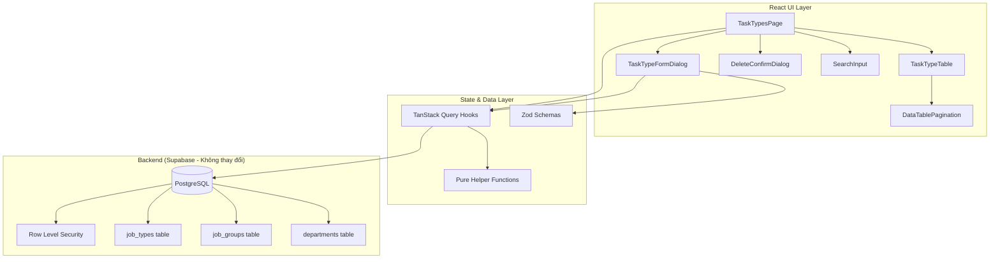
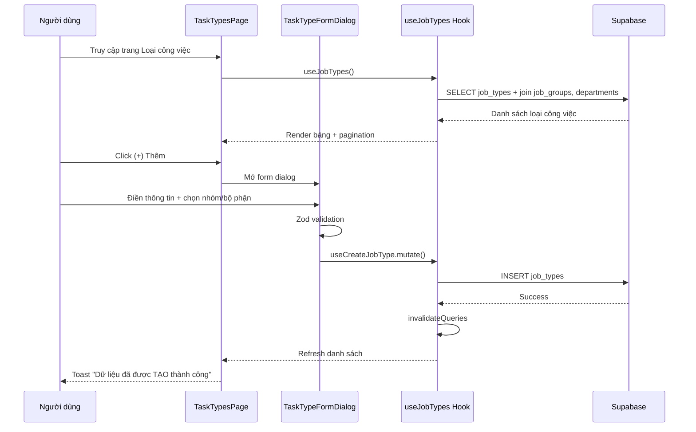
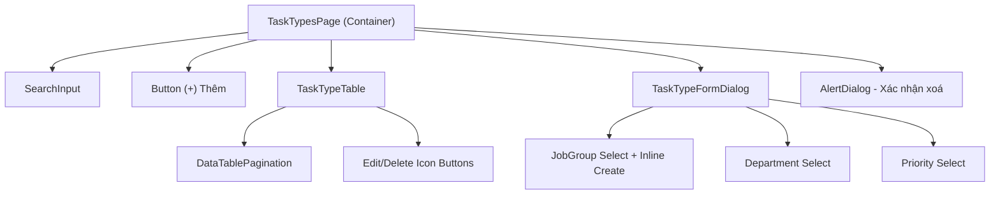
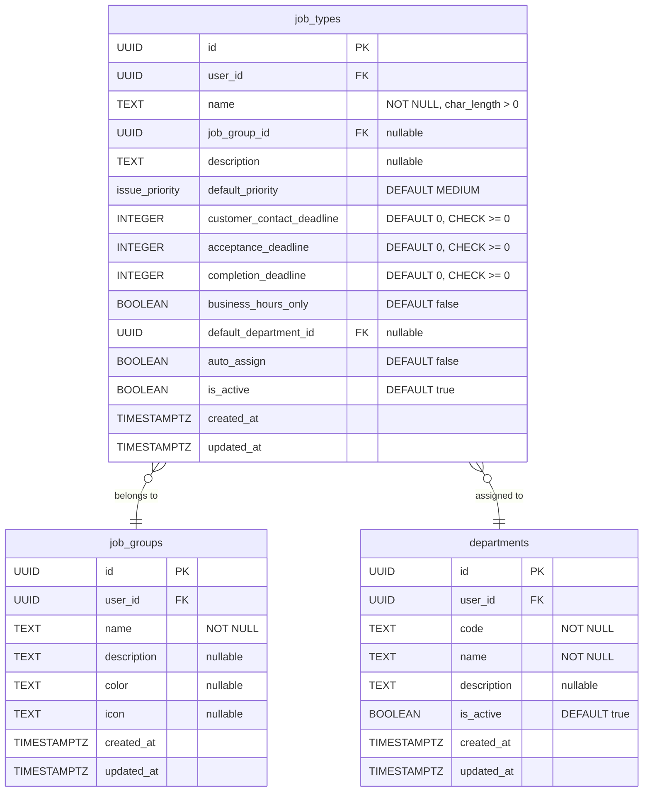

# Thiết kế - Quản lý Loại công việc (Task Type Management)

## Tổng quan

Module Loại công việc (Task Type Management) nằm trong Cài đặt hệ thống > Danh mục khác, cho phép quản lý danh mục loại công việc dùng trong vận hành và bảo trì tòa nhà. Mỗi loại công việc gắn với nhóm công việc, bộ phận thực hiện, mức ưu tiên, và các deadline (liên hệ KH, tiếp nhận, hoàn thành).

Trang này là custom page (không dùng `CategoryCrudPage`) vì UI yêu cầu: search bar, pagination kiểu "1-2 trên tổng số 2 bản ghi", nút Edit/Delete dạng icon màu xanh/đỏ, và form dialog phức tạp với inline job group creation.

### Quyết định thiết kế chính

1. **Custom page thay vì CategoryCrudPage**: UI screenshots cho thấy layout khác biệt so với CategoryCrudPage — có search, pagination text, icon buttons cho Edit/Delete, và form phức tạp hơn.
2. **Tái sử dụng database schema hiện có**: Bảng `job_types`, `job_groups`, `departments` đã tồn tại với RLS policies. Không cần migration mới.
3. **Cập nhật Supabase types**: File `types.ts` chưa có types cho `job_types`, `job_groups`, `departments` — cần regenerate hoặc thêm manual types.
4. **Tuân thủ patterns hiện có**: Sử dụng `usePagination` + `DataTablePagination`, TanStack Query hooks pattern (giống `useHotlines`), React Hook Form + Zod, toast messages chuẩn.
5. **Pure helper functions cho testability**: Tách validation logic (Zod schema), priority mapping, deadline validation vào helper functions để test bằng property-based testing.
6. **Inline job group creation**: Cho phép tạo nhóm công việc mới ngay trong dropdown select của form, không cần chuyển trang.

## Kiến trúc

### Kiến trúc tổng thể



### Luồng dữ liệu chính



## Components và Interfaces

### Cấu trúc thư mục

```
src/
├── pages/settings/categories/
│   └── TaskTypesPage.tsx              # Trang chính (custom, không dùng CategoryCrudPage)
├── components/task-types/
│   ├── TaskTypeTable.tsx              # Bảng danh sách + search + pagination
│   └── TaskTypeFormDialog.tsx         # Dialog form thêm/sửa loại công việc
├── hooks/
│   ├── useJobTypes.ts                 # Query + mutation hooks cho job_types
│   └── useJobGroups.ts               # Query + mutation hooks cho job_groups
├── lib/
│   └── jobTypeValidation.ts           # Zod schemas + pure helper functions
```

### Component Hierarchy



### Chi tiết từng Component

#### TaskTypesPage (Container)

Trang chính quản lý state và kết nối hooks:
- State: searchQuery, pagination, form open/close, editing job type, delete target
- Hooks: `useJobTypes`, `useJobGroups`, `useDepartments`, mutations
- Layout: MainLayout wrapper → Search + Add button → Table → Form Dialog → Delete Dialog

```typescript
// State management
const [searchQuery, setSearchQuery] = useState('');
const [isFormOpen, setIsFormOpen] = useState(false);
const [editingJobType, setEditingJobType] = useState<JobTypeWithRelations | null>(null);
const [deleteTarget, setDeleteTarget] = useState<string | null>(null);
const pagination = usePagination(20);
```

#### TaskTypeTable

Bảng hiển thị danh sách loại công việc.

```typescript
interface TaskTypeTableProps {
  data: JobTypeWithRelations[];
  isLoading: boolean;
  searchQuery: string;
  onSearchChange: (query: string) => void;
  onEdit: (jobType: JobTypeWithRelations) => void;
  onDelete: (id: string) => void;
  pagination: PaginationState;
  totalCount: number;
}
```

Các cột bảng (theo screenshot):
| Cột | Field | Mô tả |
|-----|-------|-------|
| Tên loại công việc | `name` | Text |
| Nhóm công việc | `job_group.name` | Tên nhóm (join) |
| Mức độ ưu tiên | `default_priority` | Hiển thị label tiếng Việt |
| Hạn gọi cho khách (phút) | `customer_contact_deadline` | Số phút |
| Hạn tiếp nhận công việc (phút) | `acceptance_deadline` | Số phút |
| Hạn hoàn thành (phút) | `completion_deadline` | Số phút |
| Tính giờ hành chính | `business_hours_only` | Có/Không |
| Bộ phận thực hiện | `department.name` | Tên bộ phận (join) |
| Thao tác | — | Nút Edit (xanh) + Delete (đỏ) icon buttons |

Nút Edit: `bg-green-500 text-white` icon Pencil, kích thước nhỏ.
Nút Delete: `bg-red-500 text-white` icon Trash2, kích thước nhỏ.

Search bar: Input ở góc trái trên bảng, filter client-side theo `name`.
Pagination: `DataTablePagination` component hiện có, hiển thị "X-Y trên tổng số Z bản ghi".

#### TaskTypeFormDialog

Dialog form thêm/sửa loại công việc.

```typescript
interface TaskTypeFormDialogProps {
  open: boolean;
  onOpenChange: (open: boolean) => void;
  jobType?: JobTypeWithRelations | null; // null = tạo mới
  jobGroups: JobGroup[];
  departments: Department[];
  onCreateJobGroup: (name: string) => Promise<JobGroup>;
}
```

Layout form (theo screenshot):
1. **Tên loại công việc** (*) — full width text input
2. **Nhóm công việc** (*) — half width select with clear (X) + option "Thêm nhóm mới" | **Mức độ ưu tiên** — half width select, default "Trung bình"
3. **Deadline liên hệ KH** — full width number input, default 0, ghi chú "(tính theo phút, để 0 nếu không áp dụng)"
4. **Deadline tiếp nhận công việc** — full width number input, default 0, ghi chú tương tự
5. **Deadline hoàn thành công việc** — full width number input, default 0, ghi chú tương tự
6. **Tính giờ hành chính (9h - 18h)** — toggle switch
7. **Bộ phận thực hiện** (*) — full width select with clear (X)
8. Buttons: **Huỷ** (outline) | **Lưu** (green filled)

Title dialog: "THÊM LOẠI CÔNG VIỆC" (tạo mới) hoặc "SỬA LOẠI CÔNG VIỆC" (chỉnh sửa), text xanh uppercase.

Inline job group creation: Khi chọn "Thêm nhóm mới" trong dropdown, hiển thị input nhập tên nhóm mới → tạo job_group → tự động chọn nhóm vừa tạo.

### Hooks

#### useJobTypes

```typescript
// Fetch all job types with relations
function useJobTypes(): UseQueryResult<JobTypeWithRelations[]>

// CRUD mutations
function useCreateJobType(): UseMutationResult
function useUpdateJobType(): UseMutationResult
function useDeleteJobType(): UseMutationResult
```

Query pattern (giống useHotlines):
```typescript
const { data, error } = await supabase
  .from("job_types")
  .select(`
    *,
    job_groups(id, name),
    departments(id, name)
  `)
  .order("created_at", { ascending: false });
```

Toast messages:
- Create: "Dữ liệu đã được TẠO thành công"
- Update: "Dữ liệu đã được CẬP NHẬT thành công"
- Delete: "Dữ liệu đã được XOÁ thành công"

#### useJobGroups

```typescript
function useJobGroups(): UseQueryResult<JobGroup[]>
function useCreateJobGroup(): UseMutationResult
```

Fetch job_groups cho dropdown select. Mutation tạo nhóm mới inline.

### Pure Helper Functions (jobTypeValidation.ts)

| Hàm | Mô tả |
|-----|-------|
| `jobTypeFormSchema` | Zod schema validate form input |
| `priorityOptions` | Mapping priority enum → label tiếng Việt |
| `getPriorityLabel(priority)` | Trả về label tiếng Việt cho priority |
| `filterJobTypesBySearch(jobTypes, query)` | Lọc danh sách theo tên (case-insensitive) |
| `paginateJobTypes(jobTypes, page, pageSize)` | Phân trang client-side |

## Data Models

### Database Schema (Hiện có — Không thay đổi)



### TypeScript Types

Vì Supabase types.ts chưa có types cho `job_types`, `job_groups`, `departments`, cần định nghĩa manual types:

```typescript
// Priority enum mapping
type IssuePriority = 'LOW' | 'MEDIUM' | 'HIGH' | 'URGENT';

const PRIORITY_LABELS: Record<IssuePriority, string> = {
  URGENT: 'Khẩn cấp',
  HIGH: 'Cao',
  MEDIUM: 'Trung bình',
  LOW: 'Thấp',
};

// Job Group
interface JobGroup {
  id: string;
  user_id: string;
  name: string;
  description: string | null;
  color: string | null;
  icon: string | null;
  created_at: string;
  updated_at: string;
}

// Department
interface Department {
  id: string;
  user_id: string;
  code: string;
  name: string;
  description: string | null;
  is_active: boolean;
  created_at: string;
  updated_at: string;
}

// Job Type (raw from DB)
interface JobType {
  id: string;
  user_id: string;
  name: string;
  job_group_id: string | null;
  description: string | null;
  default_priority: IssuePriority;
  customer_contact_deadline: number;
  acceptance_deadline: number;
  completion_deadline: number;
  business_hours_only: boolean;
  default_department_id: string | null;
  auto_assign: boolean;
  is_active: boolean;
  created_at: string;
  updated_at: string;
}

// Job Type with joined relations (for display)
interface JobTypeWithRelations extends JobType {
  job_groups: { id: string; name: string } | null;
  departments: { id: string; name: string } | null;
}
```

### Zod Validation Schema

```typescript
const jobTypeFormSchema = z.object({
  name: z.string().min(1, 'Tên loại công việc không được để trống'),
  job_group_id: z.string().min(1, 'Vui lòng chọn nhóm công việc'),
  default_priority: z.enum(['LOW', 'MEDIUM', 'HIGH', 'URGENT']).default('MEDIUM'),
  customer_contact_deadline: z.number().int().min(0, 'Giá trị phải >= 0').default(0),
  acceptance_deadline: z.number().int().min(0, 'Giá trị phải >= 0').default(0),
  completion_deadline: z.number().int().min(0, 'Giá trị phải >= 0').default(0),
  business_hours_only: z.boolean().default(false),
  default_department_id: z.string().min(1, 'Vui lòng chọn bộ phận thực hiện'),
});

type JobTypeFormValues = z.infer<typeof jobTypeFormSchema>;
```


## Correctness Properties

*A property is a characteristic or behavior that should hold true across all valid executions of a system — essentially, a formal statement about what the system should do. Properties serve as the bridge between human-readable specifications and machine-verifiable correctness guarantees.*

### Property 1: Zod schema round-trip for valid input

*For any* valid `JobTypeFormValues` object (with non-empty name, valid job_group_id, priority in {LOW, MEDIUM, HIGH, URGENT}, non-negative integer deadlines, boolean business_hours_only, and valid default_department_id), parsing through `jobTypeFormSchema` should succeed and return an equivalent object.

**Validates: Requirements 6.7**

### Property 2: Zod schema rejects invalid input

*For any* input object that is missing at least one required field (name, job_group_id, default_department_id) or has an empty name, or has a priority value not in {LOW, MEDIUM, HIGH, URGENT}, or has a negative deadline value, `jobTypeFormSchema.safeParse` should return `success = false`.

**Validates: Requirements 6.1, 6.2, 6.3, 6.4, 6.5, 6.6, 6.8**

### Property 3: Deadline fields accept non-negative integers and reject negative values

*For any* non-negative integer value, all three deadline fields (customer_contact_deadline, acceptance_deadline, completion_deadline) in the Zod schema should accept it. *For any* negative integer value, all three deadline fields should reject it.

**Validates: Requirements 6.3, 6.4, 6.5**

### Property 4: Priority label mapping is total and correct

*For any* valid `IssuePriority` value (LOW, MEDIUM, HIGH, URGENT), `getPriorityLabel` should return a non-empty Vietnamese string label. The mapping should be bijective — distinct priorities map to distinct labels.

**Validates: Requirements 6.2**

### Property 5: Search filter correctness

*For any* list of job types and any search query string, `filterJobTypesBySearch` should return only job types whose `name` contains the query (case-insensitive). When the query is empty, all job types should be returned.

**Validates: Requirements 1.3**

### Property 6: Pagination bounds

*For any* list of job types and valid pagination parameters (page >= 1, pageSize >= 1), `paginateJobTypes` should return at most `pageSize` items, and the total count should equal the original list length. The returned items should be a contiguous slice of the original list starting at offset `(page - 1) * pageSize`.

**Validates: Requirements 1.2**

## Error Handling

### Client-side Validation Errors
- React Hook Form + Zod resolver hiển thị lỗi inline cho từng trường
- Lỗi validation hiển thị bằng text đỏ dưới trường input tương ứng
- Form không submit khi có lỗi validation
- Lỗi cụ thể:
  - Tên rỗng: "Tên loại công việc không được để trống"
  - Chưa chọn nhóm: "Vui lòng chọn nhóm công việc"
  - Chưa chọn bộ phận: "Vui lòng chọn bộ phận thực hiện"
  - Deadline âm: "Giá trị phải >= 0"

### Server-side Errors (Supabase)
- Mutation hooks catch errors từ Supabase và hiển thị qua `toast.error()`
- Lỗi RLS (unauthorized): toast "Không thể thực hiện thao tác"
- Lỗi FK constraint (job_group/department không tồn tại): hiển thị message từ Supabase
- Lỗi CHECK constraint (name char_length > 0, deadline >= 0): handled by client-side validation trước

### Network Errors
- TanStack Query tự động retry (default 3 lần)
- Loading states hiển thị Skeleton components
- Empty states hiển thị EmptyState component với icon và message hướng dẫn thêm mới

## Testing Strategy

### Dual Testing Approach

Module Loại công việc sử dụng kết hợp unit tests và property-based tests:

- **Property-based tests**: Verify 6 correctness properties trên nhiều input ngẫu nhiên, sử dụng thư viện `fast-check`. Mỗi property test chạy tối thiểu 100 iterations.
- **Unit tests**: Verify các ví dụ cụ thể, edge cases, và integration points.

### Property-Based Testing

**Thư viện**: `fast-check`

**Cấu hình**: Mỗi test chạy `{ numRuns: 100 }` tối thiểu.

**Tag format**: Mỗi test có comment header:
```
/**
 * Feature: task-type-management, Property {number}: {property_text}
 * Validates: Requirements X.Y
 */
```

**Mỗi correctness property được implement bởi MỘT property-based test duy nhất.**

### Test Files

| File | Nội dung |
|------|----------|
| `src/lib/__tests__/jobTypeValidation.property.test.ts` | Properties 1-4 (Zod validation + priority mapping) |
| `src/lib/__tests__/jobTypeValidation.test.ts` | Unit tests: edge cases, specific examples |
| `src/lib/__tests__/jobTypeHelpers.property.test.ts` | Properties 5-6 (search filter + pagination) |

### Generators (fast-check Arbitraries)

```typescript
// Priority generator
const priorityArb = fc.constantFrom('LOW' as const, 'MEDIUM' as const, 'HIGH' as const, 'URGENT' as const);

// Valid form values generator
const validJobTypeFormArb = fc.record({
  name: fc.string({ minLength: 1, maxLength: 100 }).filter(s => s.trim().length > 0),
  job_group_id: fc.uuid(),
  default_priority: priorityArb,
  customer_contact_deadline: fc.integer({ min: 0, max: 100000 }),
  acceptance_deadline: fc.integer({ min: 0, max: 100000 }),
  completion_deadline: fc.integer({ min: 0, max: 100000 }),
  business_hours_only: fc.boolean(),
  default_department_id: fc.uuid(),
});

// Invalid form values generator (missing required fields)
const invalidJobTypeFormArb = fc.oneof(
  // Missing name
  fc.record({
    name: fc.constant(''),
    job_group_id: fc.uuid(),
    default_priority: priorityArb,
    customer_contact_deadline: fc.integer({ min: 0 }),
    acceptance_deadline: fc.integer({ min: 0 }),
    completion_deadline: fc.integer({ min: 0 }),
    business_hours_only: fc.boolean(),
    default_department_id: fc.uuid(),
  }),
  // Negative deadline
  fc.record({
    name: fc.string({ minLength: 1 }),
    job_group_id: fc.uuid(),
    default_priority: priorityArb,
    customer_contact_deadline: fc.integer({ min: -10000, max: -1 }),
    acceptance_deadline: fc.integer({ min: 0 }),
    completion_deadline: fc.integer({ min: 0 }),
    business_hours_only: fc.boolean(),
    default_department_id: fc.uuid(),
  }),
);

// Job type with relations (for search/pagination tests)
const jobTypeArb = fc.record({
  id: fc.uuid(),
  name: fc.string({ minLength: 1, maxLength: 100 }),
  default_priority: priorityArb,
  customer_contact_deadline: fc.integer({ min: 0 }),
  acceptance_deadline: fc.integer({ min: 0 }),
  completion_deadline: fc.integer({ min: 0 }),
  business_hours_only: fc.boolean(),
  created_at: fc.date().map(d => d.toISOString()),
});
```

### Unit Tests (Ví dụ cụ thể và Edge Cases)

- Validate form với name rỗng → expect error "Tên loại công việc không được để trống"
- Validate form với name chỉ có whitespace → expect rejection
- Validate form với deadline = 0 → expect success (0 = không áp dụng)
- Validate form với tất cả trường hợp lệ → expect success
- getPriorityLabel('MEDIUM') → 'Trung bình'
- getPriorityLabel('URGENT') → 'Khẩn cấp'
- filterJobTypesBySearch với query rỗng → return tất cả
- filterJobTypesBySearch với query không khớp → return mảng rỗng
- paginateJobTypes page vượt quá tổng → return mảng rỗng
