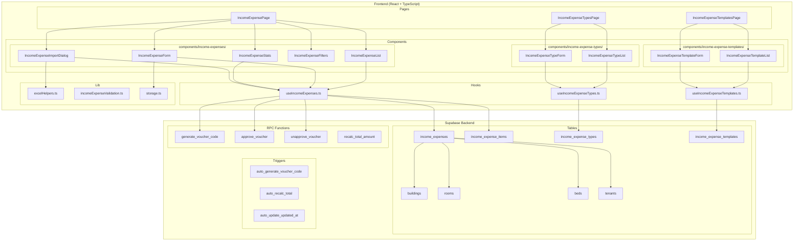
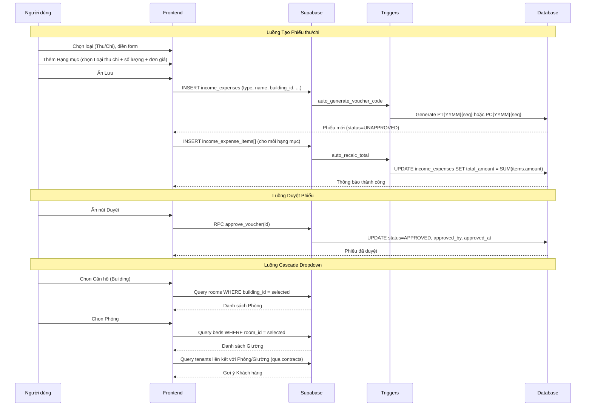
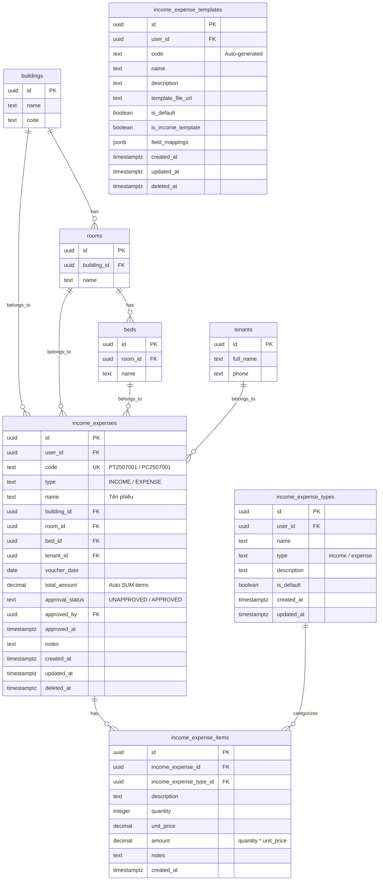

# Tài liệu Thiết kế - Tái triển khai Thu chi (Income/Expense)

## Tổng quan

Tài liệu này mô tả thiết kế kỹ thuật cho việc tái triển khai module Thu chi (Income/Expense) trong hệ thống quản lý bất động sản Resident. Module bao gồm 3 phần chính:

1. **Phiếu thu/chi** (Income/Expense Vouchers): CRUD, duyệt/bỏ duyệt, nhập hàng loạt, danh sách, lọc, thống kê tại Quản lý & Vận hành → Tài chính → Thu chi
2. **Loại thu chi** (Income/Expense Categories): CRUD tại Cài đặt hệ thống → Danh mục khác → Tài chính → Loại thu chi
3. **Mẫu in thu chi** (Receipt/Payment Templates): CRUD tại Cài đặt hệ thống → Mẫu biểu → Mẫu thu chi

Hệ thống hiện có code frontend cơ bản (`PaymentsPage`, `usePayments`, `useIncomeExpenseTypes`) nhưng chưa khớp 100% với tài liệu hướng dẫn. Cần tái triển khai lại toàn bộ giao diện, logic nghiệp vụ, database schema, và tích hợp với các module liên quan.

### Phạm vi

- Tạo 3 bảng mới: `income_expenses`, `income_expense_items`, `income_expense_templates`
- Cập nhật bảng `income_expense_types` (đã tồn tại)
- Tái triển khai `PaymentsPage` → `IncomeExpensePage` với đầy đủ tính năng
- Tạo trang Settings cho Loại thu chi và Mẫu in thu chi
- Tích hợp với Sổ quỹ (Cash Book) và Hoá đơn (Invoices)

### Quyết định thiết kế chính

1. **Tạo bảng mới thay vì dùng bảng `payments`/`expenses` cũ**: Bảng `income_expenses` mới hỗ trợ đầy đủ nghiệp vụ (duyệt, hạng mục, liên kết Building/Room/Bed/Tenant) mà bảng cũ không có.
2. **Mã phiếu tự sinh qua database trigger**: Sử dụng trigger tương tự `auto_generate_reading_code` cho meter readings. Format: `PT{YYMM}{seq}` (thu), `PC{YYMM}{seq}` (chi).
3. **Tổng tiền tự động tính từ hạng mục**: Trigger hoặc computed column tính `total_amount = SUM(income_expense_items.amount)`.
4. **Giữ nguyên pattern hiện tại**: React Query + Supabase client + sonner toast + shadcn/ui + Zod validation.
5. **Cascade dropdown Building → Room → Bed → Tenant**: Sử dụng hooks `useBuildings`, `useRooms`, `useBeds`, `useTenants` hiện có với filter theo parent.
6. **Soft-delete cho tất cả bảng mới**: Sử dụng `deleted_at` column, query luôn filter `deleted_at IS NULL`.
7. **RLS policy trên tất cả bảng mới**: Mỗi user chỉ thấy dữ liệu của mình qua `user_id = auth.uid()`.

## Kiến trúc

### Sơ đồ kiến trúc tổng quan



### Luồng dữ liệu chính



## Thành phần và Giao diện

### Cấu trúc thư mục

```
src/
├── pages/
│   ├── payments/
│   │   └── IncomeExpensePage.tsx              # Trang chính Thu chi (tái triển khai PaymentsPage)
│   └── settings/
│       ├── IncomeExpenseTypesPage.tsx          # Trang Loại thu chi
│       └── IncomeExpenseTemplatesPage.tsx      # Trang Mẫu in thu chi
├── components/
│   ├── income-expenses/
│   │   ├── IncomeExpenseList.tsx               # Bảng danh sách phiếu thu/chi
│   │   ├── IncomeExpenseForm.tsx               # Form thêm/sửa phiếu thu/chi (Dialog)
│   │   ├── IncomeExpenseStats.tsx              # Thẻ thống kê (Tổng thu, Tổng chi, Chênh lệch, Tổng GD)
│   │   ├── IncomeExpenseFilters.tsx            # Bộ lọc (Căn hộ, Phòng, Sổ quỹ, Loại, Thời gian, TT duyệt)
│   │   ├── IncomeExpenseImportDialog.tsx       # Dialog nhập hàng loạt từ Excel
│   │   └── IncomeExpenseItemSelector.tsx       # Dialog chọn hạng mục (Loại thu chi)
│   ├── income-expense-types/
│   │   ├── IncomeExpenseTypeList.tsx           # Bảng danh sách loại thu chi
│   │   └── IncomeExpenseTypeForm.tsx           # Form thêm/sửa loại thu chi (Dialog)
│   └── income-expense-templates/
│       ├── IncomeExpenseTemplateList.tsx        # Bảng danh sách mẫu in
│       └── IncomeExpenseTemplateForm.tsx        # Form thêm/sửa mẫu in (Dialog)
├── hooks/
│   ├── useIncomeExpenses.ts                    # Hook CRUD phiếu thu/chi + duyệt + thống kê
│   ├── useIncomeExpenseTypes.ts                # Hook CRUD loại thu chi (tái triển khai)
│   └── useIncomeExpenseTemplates.ts            # Hook CRUD mẫu in thu chi (mới)
└── lib/
    └── incomeExpenseValidation.ts              # Zod schemas cho validation
```

### Giao diện chi tiết các Component

#### 1. IncomeExpensePage (Trang chính Thu chi)

```typescript
// src/pages/payments/IncomeExpensePage.tsx
// Route: /payments (Quản lý & Vận hành → Tài chính → Thu chi)

interface IncomeExpensePageState {
  filters: IncomeExpenseFilters;
  isFormOpen: boolean;
  isImportOpen: boolean;
  editingVoucher: IncomeExpenseWithRelations | null;
  formType: 'INCOME' | 'EXPENSE';
  searchQuery: string;
}

// Layout:
// 1. Header: Tiêu đề + nút (+) Thêm phiếu + nút Import (mũi tên lên)
// 2. IncomeExpenseStats: 4 thẻ thống kê
// 3. Search bar + IncomeExpenseFilters: Tìm kiếm + Bộ lọc
// 4. IncomeExpenseList: Bảng danh sách phiếu
// Hooks: useIncomeExpenses, useIncomeExpenseStats, useBuildings
```

#### 2. IncomeExpenseForm (Form thêm/sửa phiếu thu/chi)

```typescript
// src/components/income-expenses/IncomeExpenseForm.tsx

interface IncomeExpenseFormProps {
  open: boolean;
  onOpenChange: (open: boolean) => void;
  voucher?: IncomeExpenseWithRelations | null; // null = thêm mới
  defaultType?: 'INCOME' | 'EXPENSE';
}

// Bước 1: Chọn loại phiếu (Phiếu thu / Phiếu chi) - 2 ô radio
// Bước 2: Điền thông tin:
//   - Căn hộ (*) - Select, cascade filter
//   - Phòng - Select, filtered by Căn hộ
//   - Giường - Select, filtered by Phòng
//   - Khách hàng - Select, gợi ý theo Phòng/Giường + cho phép chọn bất kỳ
//   - Tên phiếu (*) - Input text
//   - Ngày thu/chi (*) - Date picker
//   - Ghi chú - Textarea
// Bước 3: Thêm Hạng mục:
//   - Nút (+) mở IncomeExpenseItemSelector
//   - Mỗi hạng mục hiển thị: Tên loại, Số lượng (input), Đơn giá (input), Thành tiền (auto)
//   - Nút xoá hạng mục
// Bước 4: Ấn Lưu
```

#### 3. IncomeExpenseItemSelector (Dialog chọn hạng mục)

```typescript
// src/components/income-expenses/IncomeExpenseItemSelector.tsx

interface IncomeExpenseItemSelectorProps {
  open: boolean;
  onOpenChange: (open: boolean) => void;
  voucherType: 'INCOME' | 'EXPENSE';
  onSelect: (types: IncomeExpenseType[]) => void;
  selectedTypeIds: string[];
}

// Hiển thị danh sách Loại_thu_chi (filtered by voucherType: income/expense)
// Checkbox cho mỗi loại
// Nút "Thêm" để tạo Loại_thu_chi mới inline
// Nút "Xác nhận" để chọn
```

#### 4. IncomeExpenseList (Bảng danh sách phiếu)

```typescript
// src/components/income-expenses/IncomeExpenseList.tsx

interface IncomeExpenseListProps {
  vouchers: IncomeExpenseWithRelations[];
  isLoading: boolean;
  onEdit: (voucher: IncomeExpenseWithRelations) => void;
  onDelete: (id: string) => void;
  onApprove: (id: string) => void;
  onUnapprove: (id: string) => void;
  pagination: { page: number; pageSize: number };
  totalCount: number;
  onPageChange: (page: number) => void;
}

// Cột bảng:
// - Mã phiếu (code + badge trạng thái: xanh=Đã duyệt, vàng=Chưa duyệt)
// - Ngày (voucher_date)
// - Loại (Thu/Chi badge: xanh/đỏ)
// - Tên phiếu (name)
// - Căn hộ (building_name)
// - Phòng (room_name)
// - Khách hàng (tenant_name)
// - Tổng tiền (total_amount, xanh cho thu, đỏ cho chi)
// - Thao tác: Duyệt/Bỏ duyệt, Cập nhật (disabled khi APPROVED), Xoá (disabled khi APPROVED)
```

#### 5. IncomeExpenseStats (Thẻ thống kê)

```typescript
// src/components/income-expenses/IncomeExpenseStats.tsx

interface IncomeExpenseStatsProps {
  stats: {
    totalIncome: number;
    totalExpense: number;
    difference: number;
    totalTransactions: number;
  };
}

// 4 thẻ:
// 1. Tổng thu (màu xanh, icon ArrowUpCircle)
// 2. Tổng chi (màu đỏ, icon ArrowDownCircle)
// 3. Chênh lệch Thu - Chi (xanh nếu >= 0, đỏ nếu < 0)
// 4. Tổng số giao dịch (icon FileText)
```

#### 6. IncomeExpenseFilters (Bộ lọc)

```typescript
// src/components/income-expenses/IncomeExpenseFilters.tsx

interface IncomeExpenseFilters {
  building_id: string | null;
  room_id: string | null;
  cash_book_id: string | null;
  type: 'INCOME' | 'EXPENSE' | null;
  start_date: string | null;
  end_date: string | null;
  approval_status: 'UNAPPROVED' | 'APPROVED' | null;
}

interface IncomeExpenseFiltersProps {
  filters: IncomeExpenseFilters;
  onChange: (filters: IncomeExpenseFilters) => void;
}

// Hiển thị khi ấn nút Lọc (3 gạch)
// Cascade: Căn hộ → Phòng
// Select: Sổ quỹ, Loại phiếu, Trạng thái duyệt
// Date range: Từ ngày - Đến ngày
// Nút: Áp dụng, Xoá bộ lọc
```

#### 7. IncomeExpenseImportDialog (Dialog nhập hàng loạt)

```typescript
// src/components/income-expenses/IncomeExpenseImportDialog.tsx

interface IncomeExpenseImportDialogProps {
  open: boolean;
  onOpenChange: (open: boolean) => void;
}

// Luồng:
// 1. Nút "Tải file mẫu tại đây" → download template Excel
//    Template columns: Loại phiếu, Căn hộ, Phòng, Tên phiếu, Ngày, Hạng mục, Số tiền
// 2. Khu vực kéo thả / chọn file
// 3. Preview dữ liệu file
// 4. Nút "Nhập dữ liệu" → xử lý + tạo phiếu
// 5. Kết quả: số thành công, số lỗi, chi tiết lỗi từng dòng
```

#### 8. IncomeExpenseTypesPage (Trang Loại thu chi - Settings)

```typescript
// src/pages/settings/IncomeExpenseTypesPage.tsx
// Route: /settings/income-expense-types

// Layout:
// 1. Header: Tiêu đề + nút (+) Thêm loại
// 2. IncomeExpenseTypeList: Bảng danh sách
// 3. IncomeExpenseTypeForm: Dialog thêm/sửa
```

#### 9. IncomeExpenseTypeList & Form

```typescript
// src/components/income-expense-types/IncomeExpenseTypeList.tsx

interface IncomeExpenseTypeListProps {
  types: IncomeExpenseType[];
  isLoading: boolean;
  onEdit: (type: IncomeExpenseType) => void;
  onDelete: (id: string) => void;
}

// Cột: Tên loại, Loại (Thu/Chi badge), Mô tả, Mặc định (toggle), Thao tác (Sửa/Xoá)

// src/components/income-expense-types/IncomeExpenseTypeForm.tsx

interface IncomeExpenseTypeFormProps {
  open: boolean;
  onOpenChange: (open: boolean) => void;
  type?: IncomeExpenseType | null;
}

// Fields: Tên loại (*), Loại (Thu/Chi) (*), Mô tả, Mặc định (toggle)
```

#### 10. IncomeExpenseTemplatesPage (Trang Mẫu in thu chi - Settings)

```typescript
// src/pages/settings/IncomeExpenseTemplatesPage.tsx
// Route: /settings/income-expense-templates

// Layout:
// 1. Header: Tiêu đề + nút (+) Thêm mới
// 2. IncomeExpenseTemplateList: Bảng danh sách
// 3. IncomeExpenseTemplateForm: Dialog thêm/sửa
```

#### 11. IncomeExpenseTemplateList & Form

```typescript
// src/components/income-expense-templates/IncomeExpenseTemplateList.tsx

interface IncomeExpenseTemplateListProps {
  templates: IncomeExpenseTemplate[];
  isLoading: boolean;
  onEdit: (template: IncomeExpenseTemplate) => void;
  onDelete: (id: string) => void;
  onToggleDefault: (id: string, isDefault: boolean) => void;
}

// Cột: Mã, Tên mẫu, Xem mẫu PDF (link), Mặc định (toggle), Thao tác (Sửa/Xoá)

// src/components/income-expense-templates/IncomeExpenseTemplateForm.tsx

interface IncomeExpenseTemplateFormProps {
  open: boolean;
  onOpenChange: (open: boolean) => void;
  template?: IncomeExpenseTemplate | null;
}

// Fields:
// - Tên mẫu (*) - Input text
// - Mô tả - Textarea
// - File mẫu in - File upload (PDF)
// - Mặc định - Toggle
// - Là mẫu biên lai thu? - Toggle (bật = thu, tắt = chi)
// Field mappings: JSONB cho mã code trường (Họ tên KH, Số tiền, Ngày, Nội dung, Người lập)
```

### Hook Interfaces

#### useIncomeExpenses.ts (hook mới)

```typescript
// src/hooks/useIncomeExpenses.ts

// Types
interface IncomeExpenseWithRelations {
  id: string;
  user_id: string;
  code: string;
  type: 'INCOME' | 'EXPENSE';
  name: string;
  building_id: string;
  building_name: string;
  room_id: string | null;
  room_name: string | null;
  bed_id: string | null;
  bed_name: string | null;
  tenant_id: string | null;
  tenant_name: string | null;
  voucher_date: string;
  total_amount: number;
  approval_status: 'UNAPPROVED' | 'APPROVED';
  approved_by: string | null;
  approved_at: string | null;
  notes: string | null;
  items: IncomeExpenseItem[];
  created_at: string;
  updated_at: string;
}

interface IncomeExpenseItem {
  id: string;
  income_expense_id: string;
  income_expense_type_id: string;
  type_name: string;
  description: string | null;
  quantity: number;
  unit_price: number;
  amount: number;
  notes: string | null;
}

// Query danh sách phiếu thu/chi với relations
export const useIncomeExpenses = (
  filters: IncomeExpenseFilters,
  pagination: { page: number; pageSize: number },
  searchQuery?: string
) => useQuery({...});

// Query thống kê
export const useIncomeExpenseStats = (
  filters: IncomeExpenseFilters
) => useQuery({...});

// Tạo phiếu thu/chi mới (phiếu + items trong 1 transaction)
export const useCreateIncomeExpense = () => useMutation({...});

// Cập nhật phiếu (chỉ khi UNAPPROVED)
export const useUpdateIncomeExpense = () => useMutation({...});

// Xoá phiếu (soft delete, chỉ khi UNAPPROVED)
export const useDeleteIncomeExpense = () => useMutation({...});

// Duyệt phiếu
export const useApproveIncomeExpense = () => useMutation({...});

// Bỏ duyệt phiếu
export const useUnapproveIncomeExpense = () => useMutation({...});

// Import từ Excel
export const useImportIncomeExpenses = () => useMutation({...});
```

#### useIncomeExpenseTemplates.ts (hook mới)

```typescript
// src/hooks/useIncomeExpenseTemplates.ts

// Query danh sách mẫu in
export const useIncomeExpenseTemplates = (filterIsIncome?: boolean) => useQuery({...});

// Tạo mẫu in mới
export const useCreateIncomeExpenseTemplate = () => useMutation({...});

// Cập nhật mẫu in
export const useUpdateIncomeExpenseTemplate = () => useMutation({...});

// Xoá mẫu in (soft delete)
export const useDeleteIncomeExpenseTemplate = () => useMutation({...});

// Toggle mặc định
export const useToggleDefaultTemplate = () => useMutation({...});
```

## Mô hình Dữ liệu

### Sơ đồ quan hệ (ERD)



### Bảng `income_expenses` - Chi tiết

| Cột | Kiểu | Mô tả | Ghi chú |
|-----|------|--------|---------|
| id | UUID | Khóa chính | Auto-generated |
| user_id | UUID | Chủ sở hữu (RLS) | FK → auth.users, NOT NULL |
| code | TEXT | Mã phiếu (PT2507001 / PC2507001) | UNIQUE(user_id, code), auto-generated |
| type | TEXT | Loại: INCOME / EXPENSE | NOT NULL, CHECK IN ('INCOME','EXPENSE') |
| name | TEXT | Tên phiếu | NOT NULL |
| building_id | UUID | Căn hộ | FK → buildings, NOT NULL |
| room_id | UUID | Phòng | FK → rooms, nullable |
| bed_id | UUID | Giường | FK → beds, nullable |
| tenant_id | UUID | Khách hàng | FK → tenants, nullable |
| voucher_date | DATE | Ngày thu/chi | NOT NULL |
| total_amount | DECIMAL(15,2) | Tổng tiền | DEFAULT 0, CHECK >= 0, auto-calculated |
| approval_status | TEXT | Trạng thái duyệt | DEFAULT 'UNAPPROVED', CHECK IN ('UNAPPROVED','APPROVED') |
| approved_by | UUID | Người duyệt | FK → auth.users, nullable |
| approved_at | TIMESTAMPTZ | Thời gian duyệt | nullable |
| notes | TEXT | Ghi chú | nullable |
| created_at | TIMESTAMPTZ | Thời gian tạo | DEFAULT now() |
| updated_at | TIMESTAMPTZ | Thời gian cập nhật | DEFAULT now(), trigger auto-update |
| deleted_at | TIMESTAMPTZ | Soft delete | nullable, NULL = active |

### Bảng `income_expense_items` - Chi tiết

| Cột | Kiểu | Mô tả | Ghi chú |
|-----|------|--------|---------|
| id | UUID | Khóa chính | Auto-generated |
| income_expense_id | UUID | Phiếu thu/chi | FK → income_expenses, NOT NULL, ON DELETE CASCADE |
| income_expense_type_id | UUID | Loại thu chi | FK → income_expense_types, NOT NULL |
| description | TEXT | Mô tả chi tiết | nullable |
| quantity | INTEGER | Số lượng | DEFAULT 1, CHECK > 0 |
| unit_price | DECIMAL(15,2) | Đơn giá | DEFAULT 0, CHECK >= 0 |
| amount | DECIMAL(15,2) | Thành tiền | Auto: quantity * unit_price |
| notes | TEXT | Ghi chú | nullable |
| created_at | TIMESTAMPTZ | Thời gian tạo | DEFAULT now() |

### Bảng `income_expense_templates` - Chi tiết

| Cột | Kiểu | Mô tả | Ghi chú |
|-----|------|--------|---------|
| id | UUID | Khóa chính | Auto-generated |
| user_id | UUID | Chủ sở hữu (RLS) | FK → auth.users, NOT NULL |
| code | TEXT | Mã mẫu | UNIQUE(user_id, code), auto-generated |
| name | TEXT | Tên mẫu | NOT NULL |
| description | TEXT | Mô tả | nullable |
| template_file_url | TEXT | URL file mẫu in | nullable |
| is_default | BOOLEAN | Mặc định | DEFAULT false |
| is_income_template | BOOLEAN | Là mẫu biên lai thu? | DEFAULT false (false = mẫu chi) |
| field_mappings | JSONB | Mã code trường thông tin | nullable, VD: {"customer_name": "{{ho_ten}}", "amount": "{{so_tien}}"} |
| created_at | TIMESTAMPTZ | Thời gian tạo | DEFAULT now() |
| updated_at | TIMESTAMPTZ | Thời gian cập nhật | DEFAULT now(), trigger auto-update |
| deleted_at | TIMESTAMPTZ | Soft delete | nullable |

### Bảng `income_expense_types` - Cập nhật (đã tồn tại)

Bảng này đã tồn tại trong database. Không cần thay đổi schema, chỉ cần đảm bảo hook và UI khớp với cấu trúc hiện có:

| Cột | Kiểu | Mô tả |
|-----|------|--------|
| id | UUID | Khóa chính |
| user_id | UUID | Chủ sở hữu |
| name | TEXT | Tên loại |
| type | TEXT | "income" / "expense" |
| description | TEXT | Mô tả |
| is_default | BOOLEAN | Mặc định |
| created_at | TIMESTAMPTZ | Thời gian tạo |
| updated_at | TIMESTAMPTZ | Thời gian cập nhật |

### Database Functions & Triggers cần tạo

| Function/Trigger | Mô tả | Sử dụng |
|-----------------|--------|---------|
| `auto_generate_voucher_code()` | Tự sinh mã PT{YYMM}{seq} hoặc PC{YYMM}{seq} dựa trên type | Trigger ON INSERT income_expenses |
| `auto_recalc_total_amount()` | Tự tính lại total_amount = SUM(items.amount) | Trigger ON INSERT/UPDATE/DELETE income_expense_items |
| `auto_calc_item_amount()` | Tự tính amount = quantity * unit_price cho mỗi item | Trigger ON INSERT/UPDATE income_expense_items |
| `auto_update_updated_at()` | Tự cập nhật updated_at khi có thay đổi | Trigger ON UPDATE income_expenses, income_expense_templates |
| `approve_voucher(voucher_id)` | Duyệt phiếu: SET approval_status=APPROVED, approved_by, approved_at | RPC call |
| `unapprove_voucher(voucher_id)` | Bỏ duyệt: SET approval_status=UNAPPROVED, clear approved_by/at | RPC call |
| `generate_template_code()` | Tự sinh mã cho mẫu in | Trigger ON INSERT income_expense_templates |

### RLS Policies

```sql
-- income_expenses
CREATE POLICY "Users can view own income_expenses"
  ON income_expenses FOR SELECT
  USING (user_id = auth.uid() AND deleted_at IS NULL);

CREATE POLICY "Users can insert own income_expenses"
  ON income_expenses FOR INSERT
  WITH CHECK (user_id = auth.uid());

CREATE POLICY "Users can update own income_expenses"
  ON income_expenses FOR UPDATE
  USING (user_id = auth.uid());

-- income_expense_items (access through parent)
CREATE POLICY "Users can manage items of own vouchers"
  ON income_expense_items FOR ALL
  USING (
    income_expense_id IN (
      SELECT id FROM income_expenses WHERE user_id = auth.uid()
    )
  );

-- income_expense_templates
CREATE POLICY "Users can manage own templates"
  ON income_expense_templates FOR ALL
  USING (user_id = auth.uid());
```

### Zod Validation Schemas

```typescript
// src/lib/incomeExpenseValidation.ts

import { z } from 'zod';

// Schema cho form Phiếu thu/chi
export const incomeExpenseFormSchema = z.object({
  type: z.enum(['INCOME', 'EXPENSE'], {
    required_error: 'Vui lòng chọn loại phiếu',
  }),
  name: z.string().min(1, 'Vui lòng nhập tên phiếu'),
  building_id: z.string().min(1, 'Vui lòng chọn căn hộ'),
  room_id: z.string().nullable().optional(),
  bed_id: z.string().nullable().optional(),
  tenant_id: z.string().nullable().optional(),
  voucher_date: z.string().min(1, 'Vui lòng chọn ngày'),
  notes: z.string().nullable().optional(),
  items: z.array(z.object({
    income_expense_type_id: z.string().min(1),
    description: z.string().nullable().optional(),
    quantity: z.number().int().min(1, 'Số lượng phải >= 1'),
    unit_price: z.number().min(0, 'Đơn giá phải >= 0'),
  })).min(1, 'Vui lòng thêm ít nhất 1 hạng mục'),
});

// Schema cho Loại thu chi
export const incomeExpenseTypeFormSchema = z.object({
  name: z.string().min(1, 'Vui lòng nhập tên loại'),
  type: z.enum(['income', 'expense'], {
    required_error: 'Vui lòng chọn loại',
  }),
  description: z.string().nullable().optional(),
  is_default: z.boolean().optional().default(false),
});

// Schema cho Mẫu in thu chi
export const incomeExpenseTemplateFormSchema = z.object({
  name: z.string().min(1, 'Vui lòng nhập tên mẫu'),
  description: z.string().nullable().optional(),
  template_file_url: z.string().nullable().optional(),
  is_default: z.boolean().optional().default(false),
  is_income_template: z.boolean().optional().default(false),
  field_mappings: z.record(z.string()).nullable().optional(),
});

// Schema cho dòng import Excel
export const excelImportRowSchema = z.object({
  type: z.enum(['INCOME', 'EXPENSE']),
  building_name: z.string().min(1, 'Căn hộ không được trống'),
  room_name: z.string().optional(),
  name: z.string().min(1, 'Tên phiếu không được trống'),
  voucher_date: z.string().min(1, 'Ngày không được trống'),
  item_name: z.string().min(1, 'Hạng mục không được trống'),
  amount: z.number().min(0, 'Số tiền phải >= 0'),
});

// Validation: tổng tiền = tổng các hạng mục
export const validateTotalAmount = (
  items: Array<{ quantity: number; unit_price: number }>
): number => {
  return items.reduce((sum, item) => sum + item.quantity * item.unit_price, 0);
};

// Validation: chỉ cho phép sửa/xoá khi UNAPPROVED
export const canEditVoucher = (status: string): boolean => {
  return status === 'UNAPPROVED';
};
```

## Correctness Properties

*Một property (thuộc tính đúng đắn) là một đặc tính hoặc hành vi phải luôn đúng trong mọi lần thực thi hợp lệ của hệ thống — về bản chất, đó là một phát biểu hình thức về những gì hệ thống phải làm. Properties đóng vai trò cầu nối giữa đặc tả dễ đọc cho con người và đảm bảo tính đúng đắn có thể kiểm chứng bằng máy.*

### Property 1: Phiếu mới luôn có trạng thái UNAPPROVED và mã phiếu hợp lệ

*Với bất kỳ* phiếu thu/chi nào vừa được tạo, trường `approval_status` phải là `'UNAPPROVED'`, và trường `code` phải khớp với regex `^PT\d{7}$` (cho INCOME) hoặc `^PC\d{7}$` (cho EXPENSE) — tức là prefix PT/PC + 4 chữ số YYMM + 3 chữ số sequence.

**Validates: Requirements 1.6, 2.2**

### Property 2: Validation từ chối input thiếu trường bắt buộc

*Với bất kỳ* đối tượng phiếu thu/chi input nào mà thiếu ít nhất một trường bắt buộc (type, name, building_id, voucher_date) hoặc có danh sách items rỗng, Zod schema validation phải từ chối và trả về lỗi tương ứng cho trường bị thiếu.

**Validates: Requirements 1.7, 2.4**

### Property 3: Tổng tiền phiếu = Tổng thành tiền các hạng mục

*Với bất kỳ* phiếu thu/chi nào có N hạng mục, `total_amount` phải luôn bằng tổng `quantity * unit_price` của tất cả hạng mục thuộc phiếu đó. Thêm hoặc xoá hạng mục phải cập nhật lại `total_amount` tương ứng.

**Validates: Requirements 1.5, 11.8**

### Property 4: Quyền sửa/xoá phụ thuộc trạng thái duyệt

*Với bất kỳ* phiếu thu/chi nào, nếu `approval_status === 'UNAPPROVED'` thì cho phép sửa và xoá, nếu `approval_status === 'APPROVED'` thì không cho phép sửa và xoá.

**Validates: Requirements 3.1, 3.2**

### Property 5: Soft-delete ẩn khỏi danh sách

*Với bất kỳ* phiếu thu/chi nào đã bị soft-delete (`deleted_at != null`), phiếu đó không được xuất hiện trong kết quả query danh sách (query có điều kiện `deleted_at IS NULL`).

**Validates: Requirements 3.4, 6.4**

### Property 6: Cập nhật phiếu round-trip

*Với bất kỳ* phiếu thu/chi UNAPPROVED nào và bất kỳ bộ giá trị cập nhật hợp lệ nào, sau khi cập nhật và đọc lại, các trường đã cập nhật phải phản ánh giá trị mới, và `updated_at` phải mới hơn trước khi cập nhật.

**Validates: Requirements 3.6, 11.6**

### Property 7: Duyệt rồi bỏ duyệt là round-trip

*Với bất kỳ* phiếu thu/chi UNAPPROVED nào, sau khi duyệt (approve) thì `approval_status` phải là `'APPROVED'` và `approved_by`, `approved_at` phải được ghi nhận. Sau khi bỏ duyệt (unapprove), trạng thái phải trở về `'UNAPPROVED'` và `approved_by`, `approved_at` phải là null.

**Validates: Requirements 4.2, 4.3**

### Property 8: Import Excel - số bản ghi tạo + số lỗi = tổng dòng

*Với bất kỳ* file import nào, tổng `(success_count + failed_count)` phải bằng tổng số dòng dữ liệu trong file, và mỗi dòng lỗi phải có thông báo lỗi chi tiết.

**Validates: Requirements 5.4, 5.6**

### Property 9: Bộ lọc và tìm kiếm chỉ trả về kết quả phù hợp

*Với bất kỳ* danh sách phiếu thu/chi và bất kỳ tổ hợp bộ lọc (building_id, room_id, type, date range, approval_status) và/hoặc search query nào, tất cả phiếu trong kết quả phải thỏa mãn mọi điều kiện lọc đã chọn, và nếu có search query thì ít nhất một trong các trường (name, tenant_name, code) phải chứa search query.

**Validates: Requirements 7.2, 7.3**

### Property 10: Phân trang đúng

*Với bất kỳ* danh sách phiếu thu/chi và kích thước trang (pageSize) nào, mỗi trang phải chứa tối đa pageSize bản ghi, và tổng số bản ghi qua tất cả các trang phải bằng tổng số bản ghi gốc.

**Validates: Requirements 6.2**

### Property 11: Thống kê đúng

*Với bất kỳ* tập hợp phiếu thu/chi (có thể đã lọc) nào, `totalIncome` phải bằng tổng `total_amount` của tất cả phiếu INCOME, `totalExpense` phải bằng tổng `total_amount` của tất cả phiếu EXPENSE, `difference` phải bằng `totalIncome - totalExpense`, và `totalTransactions` phải bằng tổng số phiếu.

**Validates: Requirements 8.1, 8.2**

### Property 12: Cascade dropdown Building → Room → Bed đúng

*Với bất kỳ* building_id nào được chọn, tất cả rooms trong dropdown phải có `building_id` khớp. Tương tự, với bất kỳ room_id nào được chọn, tất cả beds trong dropdown phải có `room_id` khớp.

**Validates: Requirements 13.1, 13.2**

### Property 13: Gợi ý khách hàng theo phòng/giường đúng

*Với bất kỳ* room_id hoặc bed_id nào được chọn, danh sách khách hàng gợi ý phải chỉ bao gồm những khách hàng có hợp đồng đang hoạt động tại phòng/giường đó.

**Validates: Requirements 13.3**

### Property 14: Loại thu chi CRUD round-trip

*Với bất kỳ* loại thu chi hợp lệ nào, sau khi tạo và đọc lại, tất cả các trường phải khớp với giá trị đã nhập. Sau khi cập nhật và đọc lại, các trường đã cập nhật phải phản ánh giá trị mới.

**Validates: Requirements 9.3**

### Property 15: Mẫu in thu chi - chỉ một mẫu mặc định cho mỗi loại

*Với bất kỳ* user nào, tại mọi thời điểm, chỉ có tối đa một mẫu in có `is_default = true` cho mẫu biên lai thu (`is_income_template = true`) và tối đa một mẫu mặc định cho mẫu biên lai chi (`is_income_template = false`).

**Validates: Requirements 10.7**

### Property 16: Mẫu in thu chi có mã tự sinh

*Với bất kỳ* mẫu in thu chi nào vừa được tạo, trường `code` phải là chuỗi không rỗng và duy nhất trong phạm vi user.

**Validates: Requirements 10.2**

### Property 17: Phiếu thu/chi nhiều hạng mục

*Với bất kỳ* phiếu thu/chi nào có N hạng mục (N >= 1), khi query phiếu kèm items, số lượng items trả về phải bằng N, và mỗi item phải có `income_expense_id` khớp với phiếu.

**Validates: Requirements 2.3**

## Xử lý Lỗi

### Lỗi Validation (Frontend)

| Tình huống | Xử lý | Thông báo |
|-----------|--------|-----------|
| Thiếu trường bắt buộc khi tạo phiếu | Hiển thị lỗi inline dưới trường | "Vui lòng chọn/nhập [tên trường]" |
| Không có hạng mục nào | Hiển thị lỗi | "Vui lòng thêm ít nhất 1 hạng mục" |
| Số lượng hạng mục < 1 | Hiển thị lỗi inline | "Số lượng phải >= 1" |
| Đơn giá < 0 | Hiển thị lỗi inline | "Đơn giá phải >= 0" |
| Thiếu tên loại thu chi | Hiển thị lỗi inline | "Vui lòng nhập tên loại" |
| Thiếu tên mẫu in | Hiển thị lỗi inline | "Vui lòng nhập tên mẫu" |
| File import không đúng định dạng | Toast error | "File không đúng định dạng. Vui lòng sử dụng file mẫu" |
| File import có dòng lỗi | Hiển thị bảng chi tiết lỗi | "Dòng X: [mô tả lỗi]" |

### Lỗi Database (Backend)

| Mã lỗi | Tình huống | Xử lý |
|---------|-----------|--------|
| 23505 | Unique constraint violation (mã phiếu trùng) | Toast: "Mã phiếu đã tồn tại" |
| 23503 | Foreign key violation (căn hộ/phòng/giường không tồn tại) | Toast: "Dữ liệu liên kết không tồn tại" |
| 23514 | Check constraint violation (total_amount < 0) | Toast: "Tổng tiền không hợp lệ" |
| PGRST116 | Row not found | Toast: "Không tìm thấy dữ liệu" |
| Auth error | User not authenticated | Redirect to login |

### Lỗi Nghiệp vụ

| Tình huống | Xử lý |
|-----------|--------|
| Sửa/Xoá phiếu đã duyệt | Disable nút + tooltip "Vui lòng bỏ duyệt trước khi sửa/xoá" |
| Duyệt phiếu đã duyệt | Bỏ qua (idempotent) |
| Bỏ duyệt phiếu chưa duyệt | Bỏ qua (idempotent) |
| Import căn hộ không tồn tại | Báo lỗi dòng tương ứng, tiếp tục xử lý các dòng khác |
| Upload file mẫu in quá lớn | Toast: "File quá lớn. Vui lòng chọn file nhỏ hơn 10MB" |
| Xoá loại thu chi đang được sử dụng | Toast: "Không thể xoá loại thu chi đang được sử dụng bởi phiếu thu/chi" |

## Chiến lược Kiểm thử

### Phương pháp kiểm thử kép

Sử dụng kết hợp **Unit Tests** và **Property-Based Tests** để đảm bảo coverage toàn diện:

- **Unit Tests**: Kiểm tra các ví dụ cụ thể, edge cases, và điều kiện lỗi
- **Property Tests**: Kiểm tra các thuộc tính phổ quát trên mọi input

### Thư viện sử dụng

- **Unit Tests**: Vitest (đã có trong dự án qua Vite)
- **Property-Based Tests**: fast-check (đã cài trong dự án: `npm install -D fast-check`)
- **Cấu hình**: Mỗi property test chạy tối thiểu 100 iterations

### Unit Tests

| Test | Mô tả | Loại |
|------|--------|------|
| Tạo phiếu thu với đầy đủ thông tin | Verify tạo thành công với toast message | Example (1.6) |
| Tạo phiếu chi với đầy đủ thông tin | Verify tạo thành công | Example (2.2) |
| Form hiển thị 2 lựa chọn Thu/Chi | Verify radio buttons render | Example (1.1) |
| Form Phiếu thu hiển thị đúng trường | Verify form fields | Example (1.2) |
| Dialog chọn hạng mục hiển thị danh sách | Verify item selector | Example (1.4) |
| Xoá phiếu hiển thị dialog xác nhận | Verify confirmation dialog | Example (3.3) |
| Nút Duyệt hiển thị cho phiếu mới | Verify approve button render | Example (4.1) |
| Import dialog hiển thị nút tải mẫu | Verify import UI | Example (5.1) |
| Danh sách hiển thị đúng cột | Verify table columns | Example (6.1) |
| Bộ lọc hiển thị đúng tiêu chí | Verify filter UI | Example (7.1) |
| Trang Loại thu chi hiển thị danh sách | Verify types list page | Example (9.1) |
| Trang Mẫu in hiển thị danh sách | Verify templates list page | Example (10.1) |
| Form sửa pre-fill thông tin | Verify edit form pre-fill | Example (9.4) |
| Xoá loại thu chi đang sử dụng | Verify error handling | Edge case |
| Import file rỗng | Verify graceful handling | Edge case |
| Import file sai format | Verify error message | Edge case |

### Property-Based Tests

Mỗi property test phải:
1. Chạy tối thiểu 100 iterations
2. Tham chiếu property trong design document bằng comment
3. Sử dụng format tag: **Feature: thu-chi-reimplementation, Property {N}: {title}**

| Property | Test | Generator |
|----------|------|-----------|
| P1: Phiếu mới UNAPPROVED + mã hợp lệ | Sinh phiếu ngẫu nhiên, verify status + code format | `fc.record({type: fc.constantFrom('INCOME','EXPENSE'), name: fc.string({minLength:1}), ...})` |
| P2: Validation bắt buộc | Sinh input thiếu random required fields, verify reject | `fc.record({...}).map(omitRandomRequired)` |
| P3: Tổng tiền = SUM items | Sinh danh sách items ngẫu nhiên, verify total | `fc.array(fc.record({quantity: fc.integer({min:1}), unit_price: fc.float({min:0})}), {minLength:1})` |
| P4: Quyền theo status | Sinh vouchers với random status, verify permissions | `fc.record({approval_status: fc.constantFrom('UNAPPROVED','APPROVED')})` |
| P5: Soft-delete ẩn | Sinh vouchers với random deleted_at, verify filter | `fc.array(fc.record({deleted_at: fc.option(fc.date())}))` |
| P7: Approve round-trip | Sinh voucher, approve, unapprove, verify state | `fc.record({...})` |
| P8: Import completeness | Sinh import rows (valid + invalid), verify counts | `fc.array(fc.record({...}))` |
| P9: Bộ lọc đúng | Sinh vouchers + filters, verify match | `fc.record({building_id: fc.option(fc.uuid()), type: fc.option(...)})` |
| P10: Phân trang | Sinh list + pageSize, verify coverage | `fc.tuple(fc.array(...), fc.integer({min:1, max:100}))` |
| P11: Thống kê | Sinh vouchers, verify sums + counts | `fc.array(fc.record({type: fc.constantFrom('INCOME','EXPENSE'), total_amount: fc.float({min:0})}))` |
| P12: Cascade dropdown | Sinh rooms với building_ids, verify filter | `fc.array(fc.record({building_id: fc.uuid(), room_id: fc.uuid()}))` |
| P14: Loại thu chi round-trip | Sinh type, create, read back, verify match | `fc.record({name: fc.string({minLength:1}), type: fc.constantFrom('income','expense')})` |
| P15: Một mẫu mặc định mỗi loại | Sinh templates, toggle default, verify uniqueness | `fc.array(fc.record({is_default: fc.boolean(), is_income_template: fc.boolean()}))` |
| P17: Nhiều hạng mục | Sinh voucher + N items, verify count + FK | `fc.tuple(fc.uuid(), fc.array(fc.record({...}), {minLength:1, maxLength:10}))` |
