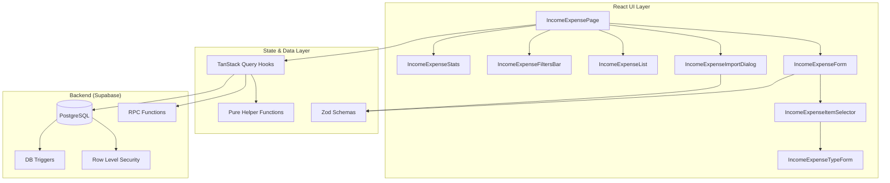
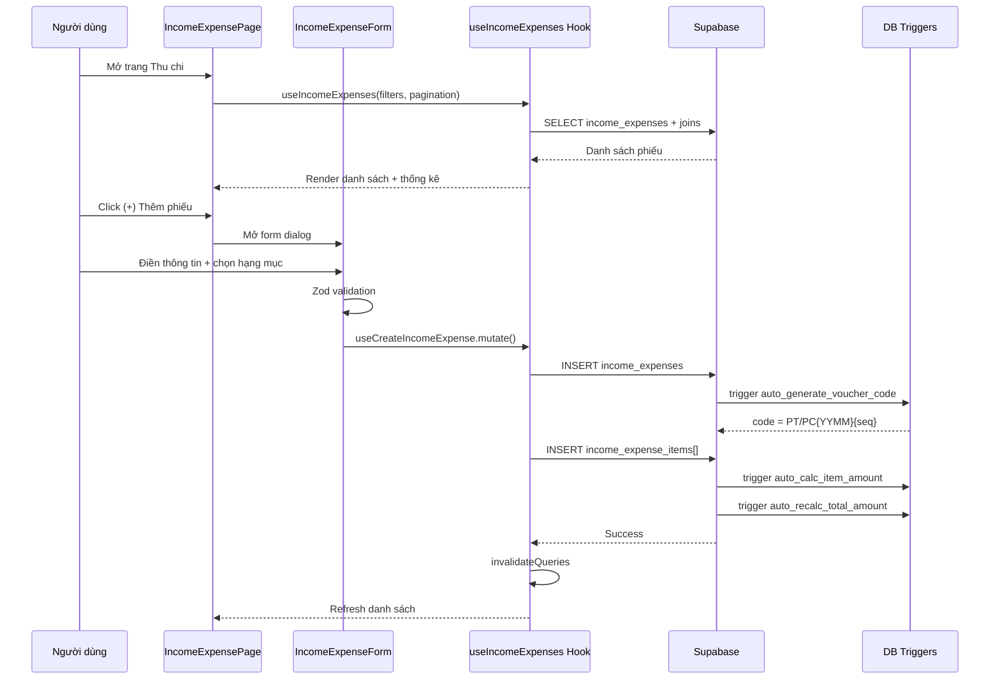
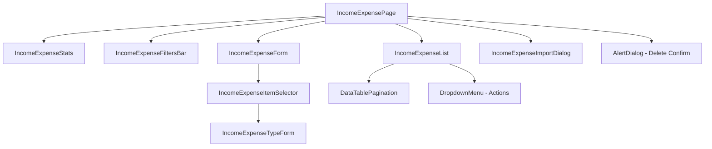
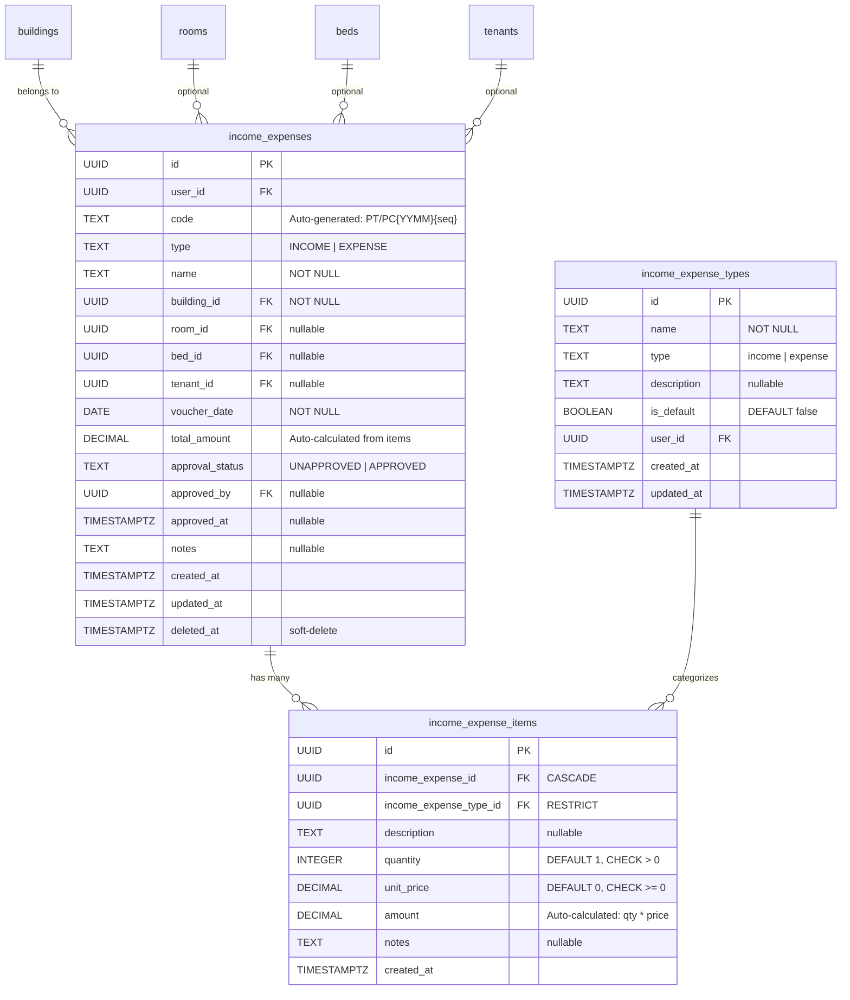

# Thiết kế - Tái triển khai Thu chi (Income/Expense)

## Tổng quan

Module Thu chi (Income/Expense) là một phần của hệ thống quản lý tài chính trong ứng dụng Resident. Module cho phép người dùng quản lý toàn bộ các khoản thu và chi tại Căn hộ, bao gồm lập phiếu thu/chi, quản lý hạng mục, duyệt/bỏ duyệt, lọc, thống kê, và nhập hàng loạt từ Excel.

Thiết kế này tái triển khai hoàn toàn giao diện React, hooks, validation, và logic nghiệp vụ dựa trên database schema hiện có (bảng `income_expenses`, `income_expense_items`, `income_expense_types`, `income_expense_templates`) với triggers tự động và RPC functions.

### Quyết định thiết kế chính

1. **Tái sử dụng database schema hiện có**: Không thay đổi migration files. Tất cả triggers (auto-generate code, auto-calc amount, auto-recalc total) và RPC (approve/unapprove) đã sẵn sàng.
2. **Tái sử dụng hooks và helpers hiện có**: `useIncomeExpenses.ts`, `useIncomeExpensesHelpers.ts`, `useIncomeExpenseTypes.ts`, `incomeExpenseValidation.ts` đã có đầy đủ logic. Thiết kế tập trung vào cải thiện components.
3. **Tuân thủ patterns hiện có**: Sử dụng cùng stack (shadcn/ui, TanStack Query, React Hook Form + Zod, Tailwind CSS) và cùng patterns với các module khác (vehicles, contracts).
4. **Pure helper functions cho testability**: Tách logic nghiệp vụ thuần (validation, filtering, stats computation, code generation) vào `useIncomeExpensesHelpers.ts` để dễ test bằng property-based testing.

## Kiến trúc

### Kiến trúc tổng thể



### Luồng dữ liệu




## Components và Interfaces

### Cấu trúc thư mục

```
src/
├── pages/payments/
│   └── IncomeExpensePage.tsx          # Trang chính Thu chi
├── components/income-expenses/
│   ├── IncomeExpenseStats.tsx         # Thẻ thống kê (Tổng thu/chi/chênh lệch)
│   ├── IncomeExpenseFilters.tsx       # Thanh bộ lọc (Căn hộ, Phòng, Loại, Ngày, Trạng thái)
│   ├── IncomeExpenseList.tsx          # Bảng danh sách phiếu + phân trang
│   ├── IncomeExpenseForm.tsx          # Dialog form tạo/sửa phiếu thu/chi
│   ├── IncomeExpenseItemSelector.tsx  # Dialog chọn hạng mục (checkbox list)
│   └── IncomeExpenseImportDialog.tsx  # Dialog nhập Excel hàng loạt
├── components/income-expense-types/
│   └── IncomeExpenseTypeForm.tsx      # Form tạo loại thu chi mới (inline)
├── hooks/
│   ├── useIncomeExpenses.ts           # Query + mutation hooks (CRUD, approve, import)
│   ├── useIncomeExpensesHelpers.ts    # Pure helper functions (testable)
│   └── useIncomeExpenseTypes.ts       # CRUD hooks cho loại thu chi
├── lib/
│   └── incomeExpenseValidation.ts     # Zod schemas + validation utilities
└── types/
    (types inline trong hooks - pattern hiện tại)
```

### Component Hierarchy



### Component Interfaces

#### IncomeExpensePage (Container)
- Quản lý state: filters, searchQuery, pagination, form open/close, editing voucher, delete target
- Kết nối hooks: `useIncomeExpenses`, `useIncomeExpenseStats`, mutations (delete, approve, unapprove)
- Render layout: Stats → Search + Filters → List → Form Dialog → Import Dialog → Delete Dialog

#### IncomeExpenseStats
```typescript
interface IncomeExpenseStatsProps {
  stats: {
    totalIncome: number;    // Tổng thu (xanh)
    totalExpense: number;   // Tổng chi (đỏ)
    difference: number;     // Chênh lệch
    totalTransactions: number; // Tổng số phiếu
  };
  isLoading?: boolean;
}
```
- 4 thẻ Card với icon và màu sắc phân biệt
- Format tiền VND: `toLocaleString('vi-VN') + ' đ'`

#### IncomeExpenseFiltersBar
```typescript
interface IncomeExpenseFiltersProps {
  filters: IncomeExpenseFilters;
  onChange: (filters: IncomeExpenseFilters) => void;
}

interface IncomeExpenseFilters {
  building_id?: string | null;
  room_id?: string | null;
  cash_book_id?: string | null;
  type?: 'INCOME' | 'EXPENSE' | null;
  start_date?: string | null;
  end_date?: string | null;
  approval_status?: 'UNAPPROVED' | 'APPROVED' | null;
}
```
- Toggle mở/đóng panel lọc
- Cascading: chọn Căn hộ → reset Phòng
- Nút "Áp dụng" và "Xoá bộ lọc"

#### IncomeExpenseList
```typescript
interface IncomeExpenseListProps {
  vouchers: IncomeExpenseWithRelations[];
  isLoading: boolean;
  onEdit: (voucher: IncomeExpenseWithRelations) => void;
  onDelete: (id: string) => void;
  onApprove: (id: string) => void;
  onUnapprove: (id: string) => void;
  pagination: PaginationState;
  totalCount: number;
}
```
- Bảng với các cột: Mã phiếu + Badge trạng thái, Ngày, Loại (Thu/Chi badge), Tên phiếu, Căn hộ, Phòng, Khách hàng, Tổng tiền, Thao tác
- DropdownMenu thao tác: Duyệt/Bỏ duyệt, Cập nhật (disabled khi APPROVED), Xoá (disabled khi APPROVED)
- Sắp xếp theo voucher_date giảm dần
- Phân trang với DataTablePagination

#### IncomeExpenseForm
```typescript
interface IncomeExpenseFormProps {
  open: boolean;
  onOpenChange: (open: boolean) => void;
  voucher: IncomeExpenseWithRelations | null; // null = tạo mới
  defaultType: 'INCOME' | 'EXPENSE';
}
```
- Dialog form với 2 tab chọn loại: Phiếu thu / Phiếu chi
- Cascading dropdowns: Căn hộ → Phòng → Giường
- Dropdown Khách hàng (searchable)
- Phần hạng mục: danh sách items + nút (+) mở ItemSelector
- Mỗi item hiển thị: Tên loại (readonly), Mô tả, Số lượng, Đơn giá, Thành tiền (auto-calc)
- Validation bằng Zod schema qua React Hook Form resolver

#### IncomeExpenseItemSelector
```typescript
interface IncomeExpenseItemSelectorProps {
  open: boolean;
  onOpenChange: (open: boolean) => void;
  voucherType: 'INCOME' | 'EXPENSE';
  onSelect: (types: IncomeExpenseType[]) => void;
  selectedTypeIds: string[];
}
```
- Danh sách checkbox các Loại_thu_chi, lọc theo voucherType (income/expense)
- Nút "Thêm" mở IncomeExpenseTypeForm inline
- Nút "Xác nhận" trả về danh sách types đã chọn

#### IncomeExpenseImportDialog
```typescript
interface IncomeExpenseImportDialogProps {
  open: boolean;
  onOpenChange: (open: boolean) => void;
}
```
- Link "Tải file mẫu tại đây" → download Excel template
- Vùng upload: click hoặc drag-drop, chấp nhận .xlsx/.xls
- Parse file → validate từng dòng → tạo phiếu → báo cáo kết quả

### Hooks

#### useIncomeExpenses (Query)
```typescript
function useIncomeExpenses(
  filters: IncomeExpenseFilters,
  pagination: { page: number; pageSize: number },
  searchQuery?: string
): UseQueryResult<{ data: IncomeExpenseWithRelations[]; totalCount: number }>
```
- Query Supabase với joins: buildings(name), rooms(name), beds(name), tenants(full_name)
- Apply filters: building_id, room_id, type, date range, approval_status
- Apply search: ilike trên name, code, tenant_name
- Sắp xếp: voucher_date desc
- Phân trang: range(from, to)

#### useIncomeExpenseStats (Query)
```typescript
function useIncomeExpenseStats(
  filters: IncomeExpenseFilters
): UseQueryResult<ComputedIncomeExpenseStats>
```
- Query tổng thu/chi theo filters hiện tại
- Trả về: totalIncome, totalExpense, difference, totalTransactions

#### Mutation Hooks
- `useCreateIncomeExpense()`: INSERT voucher → INSERT items
- `useUpdateIncomeExpense()`: UPDATE voucher → DELETE old items → INSERT new items
- `useDeleteIncomeExpense()`: UPDATE deleted_at (soft-delete)
- `useApproveIncomeExpense()`: RPC `approve_voucher(id)`
- `useUnapproveIncomeExpense()`: RPC `unapprove_voucher(id)`
- `useImportIncomeExpenses()`: Batch create từ parsed Excel rows

### Pure Helper Functions (useIncomeExpensesHelpers.ts)

Các hàm thuần không phụ thuộc Supabase, dễ test:

| Hàm | Mô tả |
|-----|-------|
| `createVoucherPayload(input)` | Tạo payload INSERT từ form data |
| `canEditVoucher(status)` | Trả về true nếu UNAPPROVED |
| `canDeleteVoucher(status)` | Trả về true nếu UNAPPROVED |
| `applyApproval(voucher)` | Trả về voucher với status=APPROVED |
| `applyUnapproval(voucher)` | Trả về voucher với status=UNAPPROVED |
| `filterNonDeleted(items)` | Lọc bỏ items có deleted_at |
| `applyVoucherUpdate(voucher, updates)` | Apply updates lên voucher |
| `applyVoucherFilters(vouchers, filters)` | Lọc danh sách theo filters |
| `paginateList(items, page, pageSize)` | Phân trang in-memory |
| `computeIncomeExpenseStats(vouchers)` | Tính tổng thu/chi/chênh lệch |
| `filterRoomsByBuilding(rooms, buildingId)` | Lọc phòng theo căn hộ |
| `filterBedsByRoom(beds, roomId)` | Lọc giường theo phòng |
| `generateVoucherCode(type, yearMonth, seq)` | Sinh mã phiếu PT/PC{YYMM}{seq} |
| `isValidVoucherCode(code)` | Validate format mã phiếu |
| `validateImportRows(rows)` | Validate dữ liệu import Excel |
| `calculateTotalFromItems(items)` | Tính tổng tiền từ items |


## Data Models

### Database Schema (Hiện có - Không thay đổi)



### TypeScript Types

```typescript
// Loại phiếu
type VoucherType = 'INCOME' | 'EXPENSE';

// Trạng thái duyệt
type ApprovalStatus = 'UNAPPROVED' | 'APPROVED';

// Loại thu chi (category)
type IncomeExpenseTypeCategory = 'income' | 'expense';

// Item trong phiếu
interface IncomeExpenseItem {
  id: string;
  income_expense_id: string;
  income_expense_type_id: string;
  type_name: string;          // joined from income_expense_types
  description: string | null;
  quantity: number;
  unit_price: number;
  amount: number;             // auto-calculated by trigger
}

// Phiếu thu/chi với relations
interface IncomeExpenseWithRelations {
  id: string;
  user_id: string;
  code: string;
  type: VoucherType;
  name: string;
  building_id: string;
  building_name: string;      // joined from buildings
  room_id: string | null;
  room_name: string | null;   // joined from rooms
  bed_id: string | null;
  bed_name: string | null;    // joined from beds
  tenant_id: string | null;
  tenant_name: string | null; // joined from tenants
  voucher_date: string;
  total_amount: number;
  approval_status: ApprovalStatus;
  approved_by: string | null;
  approved_at: string | null;
  notes: string | null;
  items: IncomeExpenseItem[];
  created_at: string;
  updated_at: string;
}

// Loại thu chi
interface IncomeExpenseType {
  id: string;
  user_id: string;
  name: string;
  type: IncomeExpenseTypeCategory;
  description: string | null;
  is_default: boolean;
  created_at: string;
  updated_at: string;
}

// Filters
interface IncomeExpenseFilters {
  building_id?: string | null;
  room_id?: string | null;
  cash_book_id?: string | null;
  type?: VoucherType | null;
  start_date?: string | null;
  end_date?: string | null;
  approval_status?: ApprovalStatus | null;
}
```

### Zod Validation Schemas

```typescript
// Schema cho hạng mục (item)
const itemSchema = z.object({
  income_expense_type_id: z.string().min(1, 'Vui lòng chọn loại hạng mục'),
  description: z.string().nullable().optional(),
  quantity: z.number().int().min(1, 'Số lượng phải >= 1'),
  unit_price: z.number().min(0, 'Đơn giá phải >= 0'),
});

// Schema cho form Phiếu thu/chi
const incomeExpenseFormSchema = z.object({
  type: z.enum(['INCOME', 'EXPENSE']),
  name: z.string().min(1, 'Vui lòng nhập tên phiếu'),
  building_id: z.string().min(1, 'Vui lòng chọn căn hộ'),
  room_id: z.string().nullable().optional(),
  bed_id: z.string().nullable().optional(),
  tenant_id: z.string().nullable().optional(),
  voucher_date: z.string().min(1, 'Vui lòng chọn ngày'),
  notes: z.string().nullable().optional(),
  items: z.array(itemSchema).min(1, 'Vui lòng thêm ít nhất 1 hạng mục'),
});

// Schema cho import Excel
const excelImportRowSchema = z.object({
  type: z.enum(['INCOME', 'EXPENSE']),
  building_name: z.string().min(1),
  room_name: z.string().optional(),
  name: z.string().min(1),
  voucher_date: z.string().min(1),
  item_name: z.string().min(1),
  amount: z.number().min(0),
});

// Schema cho loại thu chi
const incomeExpenseTypeFormSchema = z.object({
  name: z.string().min(1, 'Vui lòng nhập tên loại'),
  type: z.enum(['income', 'expense']),
  description: z.string().nullable().optional(),
  is_default: z.boolean().optional().default(false),
});
```

### Database Triggers (Hiện có)

| Trigger | Bảng | Sự kiện | Chức năng |
|---------|------|---------|-----------|
| `auto_generate_voucher_code` | income_expenses | BEFORE INSERT | Sinh mã PT/PC{YYMM}{seq} |
| `auto_calc_item_amount` | income_expense_items | BEFORE INSERT/UPDATE | amount = quantity × unit_price |
| `auto_recalc_total_amount` | income_expense_items | AFTER INSERT/UPDATE/DELETE | Cập nhật parent total_amount |
| `set_income_expenses_updated_at` | income_expenses | BEFORE UPDATE | Cập nhật updated_at |

### RPC Functions (Hiện có)

| Function | Tham số | Chức năng |
|----------|---------|-----------|
| `approve_voucher(voucher_id)` | UUID | Set APPROVED + approved_by + approved_at |
| `unapprove_voucher(voucher_id)` | UUID | Set UNAPPROVED + clear approved_by/at |


## Correctness Properties

*A property is a characteristic or behavior that should hold true across all valid executions of a system — essentially, a formal statement about what the system should do. Properties serve as the bridge between human-readable specifications and machine-verifiable correctness guarantees.*

### Property 1: Stats computation invariants

*For any* list of vouchers (each with type INCOME or EXPENSE and a non-negative total_amount), `computeIncomeExpenseStats` should return totalIncome equal to the sum of all INCOME voucher amounts, totalExpense equal to the sum of all EXPENSE voucher amounts, difference equal to totalIncome minus totalExpense, and totalTransactions equal to the list length.

**Validates: Requirements 1.2, 8.1, 8.2**

### Property 2: Pagination bounds

*For any* list of items and valid page/pageSize parameters (page >= 1, pageSize >= 1), `paginateList` should return at most pageSize items, totalCount equal to the original list length, and the returned items should be a contiguous slice of the original list.

**Validates: Requirements 1.6**

### Property 3: Cascading filter correctness

*For any* list of rooms and a buildingId, `filterRoomsByBuilding` should return only rooms whose building_id matches. Similarly, *for any* list of beds and a roomId, `filterBedsByRoom` should return only beds whose room_id matches.

**Validates: Requirements 2.4, 2.5, 13.2, 13.3**

### Property 4: Amount calculation invariants

*For any* item with quantity > 0 and unit_price >= 0, the item amount should equal quantity × unit_price. Furthermore, *for any* list of items, `calculateTotalFromItems` should return the sum of (quantity × unit_price) for all items, which equals the voucher's total_amount.

**Validates: Requirements 2.7, 11.5, 11.6, 11.8, 11.9**

### Property 5: New voucher always UNAPPROVED with valid code

*For any* valid voucher creation input, `createVoucherPayload` should produce a payload with approval_status = 'UNAPPROVED'. Additionally, *for any* type (INCOME/EXPENSE), yearMonth, and sequence, `generateVoucherCode` should produce a code matching the pattern PT{YYMM}{3-digit seq} for INCOME or PC{YYMM}{3-digit seq} for EXPENSE, and `isValidVoucherCode` should return true for that code.

**Validates: Requirements 2.9, 3.4, 11.4**

### Property 6: Zod validation round-trip

*For any* valid `IncomeExpenseFormValues` object (with valid type, non-empty name, non-empty building_id, non-empty voucher_date, and at least one item with valid type_id, quantity >= 1, unit_price >= 0), parsing through `incomeExpenseFormSchema` should succeed and return an equivalent object.

**Validates: Requirements 12.10**

### Property 7: Zod validation rejects invalid input

*For any* input object missing at least one required field (type, name, building_id, voucher_date) or with an empty items array, or with items having invalid quantity (< 1) or invalid unit_price (< 0) or missing income_expense_type_id, `incomeExpenseFormSchema.safeParse` should return success = false with appropriate error messages.

**Validates: Requirements 2.10, 2.11, 3.5, 12.1, 12.2, 12.3, 12.4, 12.5, 12.6, 12.7, 12.8, 12.11**

### Property 8: Edit/delete guard by approval status

*For any* approval status, `canEditVoucher` and `canDeleteVoucher` should return true if and only if the status is 'UNAPPROVED'. For 'APPROVED' status, both should return false.

**Validates: Requirements 4.5, 5.3, 12.9**

### Property 9: Approve/unapprove round-trip

*For any* voucher, applying `applyApproval` should set approval_status to 'APPROVED' and populate approved_by and approved_at. Subsequently applying `applyUnapproval` should reset approval_status to 'UNAPPROVED' and clear approved_by and approved_at to null, restoring the original unapproved state.

**Validates: Requirements 6.1, 6.2**

### Property 10: Soft-delete filtering

*For any* list of items where some have non-null deleted_at, `filterNonDeleted` should return only items with deleted_at === null, and the returned list length should equal the count of non-deleted items in the original list.

**Validates: Requirements 5.2**

### Property 11: Voucher filter correctness

*For any* list of vouchers and filter parameters (building_id, room_id, type, date range, approval_status), `applyVoucherFilters` should return only vouchers that match ALL specified filter criteria. When all filters are null/empty, all vouchers should be returned.

**Validates: Requirements 7.3, 7.4**

### Property 12: Import row validation partitioning

*For any* array of import rows (mix of valid and invalid), `validateImportRows` should partition them into validRows and errors such that: (1) validRows.length + errors.length equals the input length, (2) every validRow passes `excelImportRowSchema.safeParse`, and (3) every error row fails `excelImportRowSchema.safeParse`.

**Validates: Requirements 9.5, 9.7**


## Error Handling

### Client-side Validation Errors
- React Hook Form + Zod resolver hiển thị lỗi inline cho từng trường
- Lỗi validation hiển thị bằng text đỏ dưới trường input tương ứng
- Form không submit khi có lỗi validation

### Server-side Errors (Supabase)
- Mutation hooks catch errors từ Supabase và hiển thị qua `toast.error()`
- Lỗi RLS (unauthorized): "User not authenticated"
- Lỗi FK constraint (building/room/bed không tồn tại): hiển thị message từ Supabase
- Lỗi unique constraint (duplicate code): handled by trigger, hiếm khi xảy ra

### Approval Guard Errors
- UI disable nút Cập nhật/Xoá khi phiếu đã duyệt (APPROVED)
- Nếu user cố gắng sửa/xoá phiếu đã duyệt (edge case), server-side sẽ không cho phép

### Import Errors
- Từng dòng Excel được validate độc lập
- Dòng hợp lệ được tạo, dòng lỗi được bỏ qua
- Báo cáo kết quả hiển thị: số dòng thành công, số dòng lỗi, chi tiết lỗi từng dòng
- File không đúng format (.xlsx/.xls): hiển thị lỗi "File không hợp lệ"

### Network Errors
- TanStack Query tự động retry (default 3 lần)
- Loading states hiển thị Skeleton components
- Empty states hiển thị EmptyState component với icon và message

## Testing Strategy

### Dual Testing Approach

Module Thu chi sử dụng kết hợp unit tests và property-based tests:

- **Property-based tests**: Verify các correctness properties (12 properties) trên nhiều input ngẫu nhiên, sử dụng thư viện `fast-check` (đã có trong project). Mỗi property test chạy tối thiểu 100 iterations.
- **Unit tests**: Verify các ví dụ cụ thể, edge cases, và integration points.

### Property-Based Testing

**Thư viện**: `fast-check` (đã cài đặt trong project)

**Cấu hình**: Mỗi test chạy `{ numRuns: 100 }` tối thiểu.

**Tag format**: Mỗi test có comment header:
```
/**
 * Feature: thu-chi-reimplementation, Property {number}: {property_text}
 * **Validates: Requirements X.Y**
 */
```

**Mỗi correctness property được implement bởi MỘT property-based test duy nhất.**

### Test Files

| File | Nội dung |
|------|----------|
| `src/hooks/__tests__/useIncomeExpenses.property.test.ts` | Properties 1-5, 8-12 (helper functions) |
| `src/lib/__tests__/incomeExpenseValidation.property.test.ts` | Properties 6-7 (Zod validation) |

### Generators (fast-check Arbitraries)

Các generators cần thiết cho property tests:

```typescript
// Voucher type generator
const voucherTypeArb = fc.constantFrom('INCOME' as const, 'EXPENSE' as const);

// Approval status generator
const approvalStatusArb = fc.constantFrom('UNAPPROVED' as const, 'APPROVED' as const);

// Valid voucher date generator (YYYY-MM-DD format)
const voucherDateArb = fc.date({ min: new Date(2020, 0, 1), max: new Date(2030, 11, 31) })
  .map(d => d.toISOString().split('T')[0]);

// Valid item generator
const validItemArb = fc.record({
  income_expense_type_id: fc.uuid(),
  description: fc.option(fc.string({ maxLength: 200 }), { nil: null }),
  quantity: fc.integer({ min: 1, max: 10000 }),
  unit_price: fc.float({ min: 0, max: 1_000_000_000, noNaN: true }),
});

// Valid voucher form values generator
const validFormValuesArb = fc.record({
  type: voucherTypeArb,
  name: fc.string({ minLength: 1, maxLength: 100 }),
  building_id: fc.uuid(),
  room_id: fc.option(fc.uuid(), { nil: null }),
  bed_id: fc.option(fc.uuid(), { nil: null }),
  tenant_id: fc.option(fc.uuid(), { nil: null }),
  voucher_date: voucherDateArb,
  notes: fc.option(fc.string({ maxLength: 500 }), { nil: null }),
  items: fc.array(validItemArb, { minLength: 1, maxLength: 10 }),
});

// Voucher with relations generator (for filter/stats tests)
const voucherArb = fc.record({
  id: fc.uuid(),
  type: voucherTypeArb,
  total_amount: fc.float({ min: 0, max: 1_000_000_000, noNaN: true }),
  approval_status: approvalStatusArb,
  building_id: fc.uuid(),
  room_id: fc.option(fc.uuid(), { nil: null }),
  voucher_date: voucherDateArb,
  deleted_at: fc.option(fc.date().map(d => d.toISOString()), { nil: null }),
});
```

### Unit Tests (Ví dụ cụ thể và Edge Cases)

- Tạo phiếu thu với 1 hạng mục → verify code format PT{YYMM}{seq}
- Tạo phiếu chi với 3 hạng mục → verify total = sum of items
- Validate form với name rỗng → expect error "Vui lòng nhập tên phiếu"
- Validate form với items rỗng → expect error "Vui lòng thêm ít nhất 1 hạng mục"
- Import Excel với mix dòng hợp lệ/không hợp lệ → verify partitioning
- Format VND: 1000000 → "1.000.000 đ"
- canEditVoucher('APPROVED') → false
- canEditVoucher('UNAPPROVED') → true
