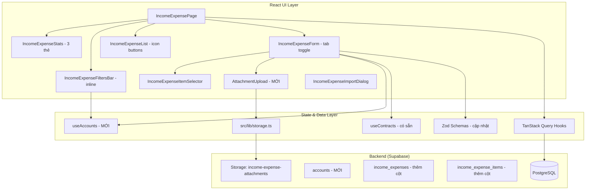
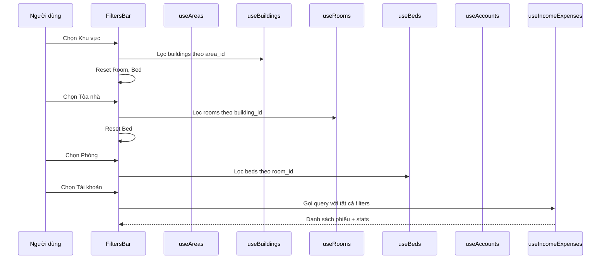

# Thiết kế - Căn chỉnh UI Thu chi theo ảnh tham chiếu

## Tổng quan

Tài liệu thiết kế này mô tả các thay đổi cần thực hiện trên module Thu chi (Income/Expense) đã triển khai, nhằm căn chỉnh giao diện và bổ sung tính năng theo ảnh tham chiếu. Các thay đổi bao gồm:

- **Thẻ thống kê**: Giảm từ 4 thẻ xuống 3 thẻ (Tổng Thu, Tổng Chi, Thu - Chi), đổi icon và màu sắc
- **Bảng danh sách**: Đổi cột Thao tác từ dropdown sang icon buttons, thêm cột Người nhận/trả và Tài khoản, sắp xếp lại thứ tự cột
- **Bộ lọc**: Chuyển từ toggle panel sang inline filter bar, thêm Khu vực, Giường, Tài khoản
- **Form tạo phiếu**: Chuyển radio buttons sang tab toggle, thêm trường Hợp đồng, Tên người nộp, Tài khoản
- **Hạng mục**: Thêm Ngày bắt đầu/Ngày kết thúc, toggle Hạch toán KQKD, đổi layout sang dạng hàng
- **Đính kèm**: Section upload ảnh mới với Supabase Storage
- **Database**: Thêm cột mới vào `income_expenses` và `income_expense_items`, tạo bảng `accounts`
- **Validation**: Cập nhật Zod schemas cho các trường mới

### Quyết định thiết kế chính

1. **Tái sử dụng tối đa code hiện có**: Chỉ sửa đổi các component cần thay đổi, không tái cấu trúc toàn bộ module.
2. **Tạo bảng `accounts` mới**: Bảng này chưa tồn tại, cần tạo migration mới với RLS policies.
3. **Sử dụng `src/lib/storage.ts` có sẵn**: Tận dụng utility upload/delete file đã có cho section Đính kèm.
4. **Cascade filter pattern**: Mở rộng pattern cascade dropdown đã có (Building → Room) thêm Area → Building và Room → Bed.
5. **Inline filters thay vì toggle panel**: Bộ lọc luôn hiển thị dạng hàng ngang, không cần nút toggle.
6. **Tab toggle dùng shadcn Tabs**: Sử dụng component Tabs có sẵn từ shadcn/ui thay vì tự build.

## Kiến trúc

### Kiến trúc tổng thể (sau thay đổi)



### Luồng dữ liệu - Cascade Filters



## Components và Interfaces

### 1. IncomeExpenseStats (Cập nhật)

**Thay đổi**: Giảm từ 4 thẻ xuống 3 thẻ, đổi icon và layout.

```typescript
// Interface giữ nguyên nhưng bỏ totalTransactions
interface IncomeExpenseStatsProps {
  stats: {
    totalIncome: number;
    totalExpense: number;
    difference: number;
  };
  isLoading?: boolean;
}
```

Layout 3 thẻ:
- **Tổng Thu**: icon `Plus` trong circle xanh lá, border-left xanh lá, số tiền xanh lá
- **Tổng Chi**: icon `Minus` trong circle đỏ/cam, border-left đỏ, số tiền đỏ
- **Thu - Chi**: icon `FileText` trong circle xanh dương, border-left xanh dương, số tiền theo dấu

Grid: `grid-cols-1 md:grid-cols-3`

### 2. IncomeExpenseList (Cập nhật)

**Thay đổi**: Đổi cột Thao tác, thêm cột, sắp xếp lại.

Thứ tự cột mới:
1. Mã (code + badge trạng thái)
2. Thao tác (3 icon buttons)
3. Tên (name)
4. Số tiền (total_amount, có màu + dấu)
5. Tòa nhà (building_name)
6. Ngày thu/chi (voucher_date)
7. Người nhận/trả (payer_name)
8. Tài khoản (account_name)

Cột Thao tác - 3 icon buttons:
```typescript
// Nút Duyệt/Bỏ duyệt (toggle theo trạng thái)
// - UNAPPROVED: CheckCircle màu xanh lá → onApprove(id)
// - APPROVED: XCircle màu cam → onUnapprove(id)
// Nút Chỉnh sửa: Pencil màu xanh dương → onEdit(voucher), disabled khi APPROVED
// Nút Xóa: Trash2 màu đỏ → onDelete(id), disabled khi APPROVED
```

Cột Số tiền:
```typescript
// INCOME: "+1.000.000 đ" màu xanh (text-green-600)
// EXPENSE: "-500.000 đ" màu đỏ (text-red-600)
```

Bỏ các cột: Loại (badge Phiếu thu/chi), Phòng, Khách hàng.

### 3. IncomeExpenseFiltersBar (Cập nhật)

**Thay đổi**: Chuyển từ toggle panel sang inline, thêm Khu vực, Giường, Tài khoản.

```typescript
interface IncomeExpenseFilters {
  area_id?: string | null;        // MỚI
  building_id?: string | null;
  room_id?: string | null;
  bed_id?: string | null;          // MỚI
  account_id?: string | null;      // MỚI
  type?: "INCOME" | "EXPENSE" | null;
  start_date?: string | null;
  end_date?: string | null;
  approval_status?: "UNAPPROVED" | "APPROVED" | null;
}
```

Layout inline: Một hàng ngang các dropdown, luôn hiển thị (không cần nút toggle).
Thứ tự: Khoảng thời gian (start/end date) | Khu vực | Tòa nhà | Phòng | Giường | Tài khoản

Cascade logic:
- Chọn Khu vực → lọc Tòa nhà theo `area_id`
- Chọn Tòa nhà → lọc Phòng theo `building_id`
- Chọn Phòng → lọc Giường theo `room_id`
- Thay đổi bất kỳ filter → gọi `onChange` ngay lập tức (không cần nút "Áp dụng")

### 4. IncomeExpenseForm (Cập nhật)

**Thay đổi**: Tab toggle, thêm trường, đổi layout hạng mục, thêm đính kèm.

```typescript
interface IncomeExpenseFormProps {
  open: boolean;
  onOpenChange: (open: boolean) => void;
  voucher?: IncomeExpenseWithRelations | null;
  defaultType?: 'INCOME' | 'EXPENSE';
}
```

#### Tab Toggle (thay thế RadioGroup)
- Sử dụng shadcn `Tabs` component
- 2 tab: "Phiếu thu" (ArrowUp icon) | "Phiếu chi" (ArrowDown icon)
- Tab active: nền primary, text trắng
- Tab inactive: nền xám, text muted
- Dialog title: "PHIẾU THU/CHI" (in hoa)

#### Layout form - Section "Thông tin chung"
```
Hàng 1: [Tòa nhà *] [Phòng] [Giường]
Hàng 2: [Hợp đồng] [Tên phiếu thu/chi *] [Tên người nộp *]
Hàng 3: [Tài khoản *] [Ngày thực thu/chi *]
Hàng 4: [Ghi chú (textarea)]
```

#### Layout hạng mục - Đổi từ card sang hàng
```
Toggle: [Hạch toán kết quả kinh doanh?] (Switch)
Mỗi dòng: [Hạng mục *] [Số tiền *] [Ngày bắt đầu *] [Ngày kết thúc *] [Xóa]
[+ Thêm hạng mục]
Tổng cộng: xxx đ
```

#### Section Đính kèm (mới)
```
Vùng upload (drag & drop hoặc click)
Thumbnails: [ảnh 1 x] [ảnh 2 x] ...
Giới hạn: 5MB/file, JPG/PNG/PDF
```

### 5. AttachmentUpload (Component mới)

```typescript
interface AttachmentUploadProps {
  attachments: string[];  // URLs
  onChange: (urls: string[]) => void;
  disabled?: boolean;
  userId: string;
}
```

Sử dụng `src/lib/storage.ts` (uploadFile, deleteFile, getPublicUrl) với bucket `income-expense-attachments`.

### 6. useAccounts Hook (Mới)

```typescript
interface Account {
  id: string;
  user_id: string;
  name: string;
  type: 'bank' | 'cash';
  bank_name: string | null;
  account_number: string | null;
  is_default: boolean;
  created_at: string;
  updated_at: string;
}

export const useAccounts = () => {
  // Query bảng accounts, filter by user_id (RLS tự xử lý)
  return useQuery({ queryKey: ['accounts'], ... });
};
```

## Data Models

### Bảng `accounts` (Mới)

| Cột | Kiểu | Ràng buộc |
|-----|------|-----------|
| id | UUID | PK, DEFAULT gen_random_uuid() |
| user_id | UUID | FK auth.users, NOT NULL |
| name | TEXT | NOT NULL |
| type | TEXT | CHECK ('bank', 'cash'), NOT NULL |
| bank_name | TEXT | nullable |
| account_number | TEXT | nullable |
| is_default | BOOLEAN | DEFAULT false |
| created_at | TIMESTAMPTZ | DEFAULT now() |
| updated_at | TIMESTAMPTZ | DEFAULT now() |
| deleted_at | TIMESTAMPTZ | nullable (soft delete) |

RLS: `user_id = auth.uid()` cho SELECT, INSERT, UPDATE, DELETE.

### Bảng `income_expenses` (Thêm cột)

| Cột mới | Kiểu | Ràng buộc |
|---------|------|-----------|
| payer_name | TEXT | nullable |
| account_id | UUID | FK accounts(id), nullable |
| contract_id | UUID | FK contracts(id), nullable |
| attachments | JSONB | DEFAULT '[]'::jsonb |
| business_result_accounting | BOOLEAN | DEFAULT false |

### Bảng `income_expense_items` (Thêm cột)

| Cột mới | Kiểu | Ràng buộc |
|---------|------|-----------|
| start_date | DATE | nullable |
| end_date | DATE | nullable |

### Zod Schemas (Cập nhật)

```typescript
// Item schema - thêm start_date, end_date
export const itemSchema = z.object({
  income_expense_type_id: z.string().min(1, 'Vui lòng chọn loại hạng mục'),
  description: z.string().nullable().optional(),
  quantity: z.number().int().min(1, 'Số lượng phải >= 1'),
  unit_price: z.number().min(0, 'Đơn giá phải >= 0'),
  start_date: z.string().min(1, 'Vui lòng chọn ngày bắt đầu'),
  end_date: z.string().min(1, 'Vui lòng chọn ngày kết thúc'),
}).refine(
  (data) => data.start_date <= data.end_date,
  { message: 'Ngày bắt đầu không được sau ngày kết thúc', path: ['end_date'] }
);

// Form schema - thêm trường mới
export const incomeExpenseFormSchema = z.object({
  type: z.enum(['INCOME', 'EXPENSE']),
  name: z.string().min(1, 'Vui lòng nhập tên phiếu'),
  building_id: z.string().min(1, 'Vui lòng chọn tòa nhà'),
  room_id: z.string().nullable().optional(),
  bed_id: z.string().nullable().optional(),
  tenant_id: z.string().nullable().optional(),
  contract_id: z.string().nullable().optional(),       // MỚI
  payer_name: z.string().min(1, 'Vui lòng nhập tên người nộp'),  // MỚI
  account_id: z.string().uuid('Vui lòng chọn tài khoản'),        // MỚI
  voucher_date: z.string().min(1, 'Vui lòng chọn ngày'),
  notes: z.string().nullable().optional(),
  business_result_accounting: z.boolean().default(false),  // MỚI
  attachments: z.array(z.string().url()).default([]),      // MỚI
  items: z.array(itemSchema).min(1, 'Vui lòng thêm ít nhất 1 hạng mục'),
});
```

### IncomeExpenseWithRelations (Cập nhật type)

```typescript
export interface IncomeExpenseWithRelations {
  // ... các trường hiện có ...
  payer_name: string | null;           // MỚI
  account_id: string | null;           // MỚI
  account_name: string | null;         // MỚI (join từ accounts)
  contract_id: string | null;          // MỚI
  attachments: string[];               // MỚI
  business_result_accounting: boolean; // MỚI
}

export interface IncomeExpenseItem {
  // ... các trường hiện có ...
  start_date: string | null;  // MỚI
  end_date: string | null;    // MỚI
}
```


## Correctness Properties

*Một property là một đặc tính hoặc hành vi phải đúng trong mọi lần thực thi hợp lệ của hệ thống — về cơ bản là một phát biểu hình thức về những gì hệ thống phải làm. Properties đóng vai trò cầu nối giữa đặc tả dễ đọc cho con người và đảm bảo tính đúng đắn có thể kiểm chứng bằng máy.*

### Property 1: Định dạng tiền tệ VND

*For any* số nguyên hoặc số thực `n`, hàm `formatVND(n)` phải trả về chuỗi kết thúc bằng " đ" và phần số phải sử dụng dấu chấm làm phân cách hàng nghìn (locale vi-VN).

**Validates: Requirements 1.3**

### Property 2: Trạng thái phiếu quyết định nút Duyệt/Bỏ duyệt

*For any* phiếu thu chi, nếu `approval_status === 'UNAPPROVED'` thì cột Thao tác phải hiển thị nút Duyệt (CheckCircle), và nếu `approval_status === 'APPROVED'` thì phải hiển thị nút Bỏ Duyệt (XCircle). Hai nút này không bao giờ hiển thị đồng thời.

**Validates: Requirements 2.3, 2.4**

### Property 3: Phiếu đã duyệt vô hiệu hóa Chỉnh sửa và Xóa

*For any* phiếu thu chi có `approval_status === 'APPROVED'`, nút Chỉnh sửa và nút Xóa phải ở trạng thái disabled.

**Validates: Requirements 2.5**

### Property 4: Số tiền hiển thị đúng dấu và màu theo loại phiếu

*For any* phiếu thu chi, nếu `type === 'INCOME'` thì số tiền phải có dấu "+" và class màu xanh (text-green-600), nếu `type === 'EXPENSE'` thì phải có dấu "-" và class màu đỏ (text-red-600).

**Validates: Requirements 3.5**

### Property 5: Cascade filter chỉ trả về items thuộc parent đã chọn

*For any* tập dữ liệu areas/buildings/rooms/beds, khi chọn một parent (area → buildings, building → rooms, room → beds), danh sách con trả về phải chỉ chứa các items có foreign key trỏ đến parent đã chọn. Không có item nào thuộc parent khác được hiển thị.

**Validates: Requirements 4.2, 4.3, 4.4**

### Property 6: Hợp đồng lọc theo phòng chỉ trả về hợp đồng ACTIVE

*For any* building_id và room_id đã chọn, dropdown Hợp đồng chỉ hiển thị các contracts có `status === 'ACTIVE'` và `room_id` khớp với phòng đã chọn.

**Validates: Requirements 6.6**

### Property 7: Validation trường bắt buộc mới

*For any* object input phiếu thu chi, nếu `payer_name` là chuỗi rỗng hoặc chỉ whitespace, HOẶC `account_id` là chuỗi rỗng hoặc không phải UUID hợp lệ, thì Zod schema phải reject và trả về lỗi validation tương ứng.

**Validates: Requirements 6.7, 6.8, 10.1, 10.2**

### Property 8: Validation ngày bắt đầu/kết thúc hạng mục

*For any* item trong phiếu thu chi, nếu `start_date` sau `end_date` (so sánh chuỗi ISO date), thì Zod schema phải reject item đó. Nếu `start_date <= end_date`, schema phải accept.

**Validates: Requirements 7.6, 10.6, 10.7, 10.8**

### Property 9: Validation file đính kèm

*For any* file, nếu file type không thuộc ['image/jpeg', 'image/png', 'application/pdf'] HOẶC file size > 5MB (5 * 1024 * 1024 bytes), thì hệ thống phải reject file đó. Ngược lại phải accept.

**Validates: Requirements 8.2, 8.7**

### Property 10: Zod schema round-trip cho phiếu thu chi

*For any* object phiếu thu chi hợp lệ (có đầy đủ các trường bắt buộc mới: payer_name, account_id, items với start_date/end_date hợp lệ), khi parse qua `incomeExpenseFormSchema`, kết quả phải thành công và object output phải tương đương với input.

**Validates: Requirements 10.9**

### Property 11: Zod schema reject khi thiếu trường bắt buộc

*For any* object phiếu thu chi hợp lệ, nếu xóa bỏ trường `payer_name` hoặc `account_id`, thì Zod schema phải reject và trả về lỗi chứa tên trường bị thiếu.

**Validates: Requirements 10.10**

## Error Handling

### Upload file đính kèm
- File type không hợp lệ → hiển thị toast "Chỉ chấp nhận file JPG, PNG, PDF"
- File size > 5MB → hiển thị toast "Kích thước file tối đa 5MB"
- Upload thất bại (network/storage error) → hiển thị toast "Không thể tải lên file đính kèm"
- Xóa file thất bại → hiển thị toast lỗi, giữ nguyên danh sách

### Form validation
- Trường bắt buộc trống → hiển thị FormMessage dưới trường tương ứng
- start_date > end_date → hiển thị lỗi dưới trường end_date
- Không có hạng mục → hiển thị lỗi "Vui lòng thêm ít nhất 1 hạng mục"

### Database operations
- Tạo/cập nhật phiếu thất bại → toast error từ mutation hook (đã có sẵn)
- Duyệt/bỏ duyệt thất bại → toast error từ mutation hook (đã có sẵn)
- Query accounts thất bại → trả về mảng rỗng, hiển thị dropdown trống

### Cascade filters
- Không có data cho dropdown con → hiển thị "Không có dữ liệu" trong SelectContent
- Reset cascade: khi thay đổi parent, tự động clear tất cả child selections

## Testing Strategy

### Phương pháp test kép

Sử dụng kết hợp **unit tests** (ví dụ cụ thể, edge cases) và **property-based tests** (kiểm tra tính đúng đắn trên mọi input).

### Unit Tests (Vitest)

Tập trung vào:
- Render đúng 3 thẻ thống kê (không còn thẻ "Tổng số phiếu")
- Render đúng 3 icon buttons trong cột Thao tác (không còn DropdownMenu)
- Thứ tự cột bảng đúng theo thiết kế
- Tab toggle chuyển đổi đúng giữa INCOME/EXPENSE
- Default values cho start_date/end_date là ngày hiện tại
- Section Đính kèm render đúng

### Property-Based Tests (fast-check)

Mỗi property test phải:
- Chạy tối thiểu **100 iterations**
- Có comment tag: `Feature: thu-chi-ui-alignment, Property {number}: {title}`
- Tham chiếu đến property trong design document
- Sử dụng `fc.assert` và `fc.property` từ fast-check

Danh sách property tests:
1. **Property 1**: `formatVND` output format validation
2. **Property 2**: Approval status → button visibility mapping
3. **Property 3**: Approved voucher → edit/delete disabled
4. **Property 4**: Voucher type → amount sign/color mapping
5. **Property 5**: Cascade filter parent-child relationship
6. **Property 6**: Contract filter by room + ACTIVE status
7. **Property 7**: Required fields validation (payer_name, account_id)
8. **Property 8**: Item date range validation (start_date <= end_date)
9. **Property 9**: File attachment validation (type + size)
10. **Property 10**: Zod schema round-trip
11. **Property 11**: Zod schema reject missing required fields

### Thư viện testing
- **Vitest**: Test runner
- **@testing-library/react**: Component testing
- **fast-check**: Property-based testing
- Mỗi correctness property được implement bằng **đúng 1** property-based test
