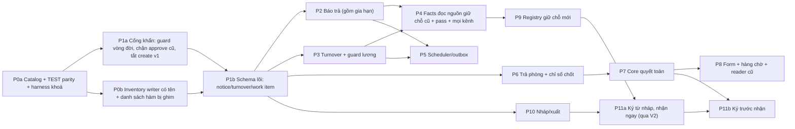

# Audit độc lập: plan hợp đồng, trả phòng, quyết toán, cọc và phòng sale

> **Bản công khai đã biên tập:** Đã bỏ định danh hàng, số tiền và ngày gắn với hợp đồng thật trong TEST clone. Kết quả thử và neo source giữ nguyên; SHA-256 bản gốc ở [publication-redaction-manifest.json](publication-redaction-manifest.json).

- **Ngày audit:** 27/09/2026 (giờ Việt Nam); hoàn tất lúc khoảng 20:10.
- **Người audit:** agent Claude. Tôi độc lập với người lập plan và không sửa plan gốc.
- **Đối tượng:**
  - `docs/superpowers/plans/2026-09-27-contract-lifecycle.md` (gọi tắt là **plan**, neo `plan:dòng`).
  - Ba evidence domain và `review-notes.md` trong thư mục này.
  - Sơ đồ `outputs/so-do-hop-dong-2026-09-27/so-do-hop-dong.html`.
- **Source được audit:** checkout gốc `C:\Users\Nguyen Tam\whiteboard-ihomecrm-main`.
  - HEAD `e498f10d49f3548e72074095c955371d0cee41ab`, trùng SHA nền lúc lập plan. Tôi không fetch lại.
  - Working tree có 1 file sửa nằm ngoài phạm vi (`docs/doi-chieu/so-quy-686tcb.md`) và nhiều file untracked (docs, outputs). Tôi giữ nguyên tất cả.
- **Catalog sống:** đọc production bằng `BEGIN READ ONLY … ROLLBACK`, lúc 12:33–13:00 UTC. Đọc thêm TEST (`ihomecrm-test`).
  - Ba phép thử **ghi rồi ROLLBACK** chỉ chạy trên TEST. Đã kiểm lại hai lần: không để lại dữ liệu.
- **Bằng chứng mới:** thư mục [`independent-verification/`](independent-verification/), mục lục ở §10.
- **Bản đề xuất sửa plan:** tách riêng ở [`independent-verification/de-xuat-sua-plan.md`](independent-verification/de-xuat-sua-plan.md). Plan gốc giữ nguyên.

---

## 1. Kết luận: `NEEDS_CHANGES`

Plan đi đúng hướng ở phần nguyên tắc:
- tách các trục trạng thái;
- nháp không giữ phòng;
- không mở writer tiền thứ hai;
- định tuyến theo danh tính đối tượng trước cờ;
- đòi test cạnh tranh, JWT và đột biến.

Tuy vậy, khi đối chiếu với source và catalog sống, plan **chưa đủ để triển khai bất kỳ phần nào có ghi dữ liệu**. Lý do chính:

1. **P0 – Đường duyệt thanh lý cũ vẫn tạo được phiếu hoàn thứ hai** cho hợp đồng đã kết thúc (IA-01). Đã tái hiện trên TEST.
   - Nhánh "trả phòng, quyết toán sau" của plan tạo đúng điều kiện cho lỗi này, vì hợp đồng sẽ không có hồ sơ `contract_terminations`.
   - Plan không nêu tên đường này.
2. **P1 – Không có cổng DB chặn đổi vòng đời hợp đồng trực tiếp** (IA-02, đã tái hiện). Kèm ít nhất 10 writer cũ còn sống mà plan không nêu tên (IA-03).
3. **P1 – Nhánh quyết toán sau làm mất chỉ số công tơ chốt.** Khách mới trả tiền điện của khách cũ (IA-04). Đây chính là ví dụ số 1 trong sơ đồ gửi quản lý.
4. **P1 – Thứ tự khoá đề xuất không phải thứ tự tổng.** Đã tái hiện deadlock `40P01` với writer cũ (IA-05).
5. **P1 – Mô hình giữ chỗ/cọc chưa phản ánh hiện trạng.**
   - Có ít nhất 4 cơ chế giữ chỗ đang chạy, và bảng `room_reservation_holds` không thể thành registry như plan mô tả (IA-06).
   - Pass phòng không có vòng đời và thắng mọi trạng thái (IA-07).
6. **P1 – Môi trường TEST thiếu toàn bộ bộ máy chi 26–27/09.** Nghiệm thu tiền trên TEST sẽ xanh giả (IA-08).

Phần có thể bắt đầu ngay:
- **P0 (catalog/harness):** sau khi thêm điều kiện đồng bộ TEST.
- **P1a:** sửa khẩn các cổng hiện hữu (IA-01/02/03). Phần này giảm rủi ro đang có trên production và cần chủ duyệt vì đổi hành vi.
- **P10 (lưu/xuất nháp):** sau khi chốt nơi lưu tài liệu (IA-23).

Phần chưa được bắt đầu:
- **P6–P8 (thanh lý hai nhánh):** chờ đóng IA-01…IA-05 và IA-10/11.
- **P11 (ký trước nhận):** vẫn `BLOCKED` bởi G-BILLING, và tiền đề của G-BILLING đang sai (IA-22).

**Không có kết luận sẵn sàng production.** Chưa có code, chưa chạy JWT thật qua PostgREST, chưa có E2E, và các gate G-* đều còn mở.

### 1.1 Đã kiểm

| Hạng mục | Cách kiểm |
|---|---|
| Plan, 3 evidence, review-notes, HTML | Đọc toàn văn; đối chiếu từng claim OBSERVED với source hiện tại |
| Source tại HEAD | Đọc trực tiếp các hàm chính và 7 lượt rà chỉ-đọc song song. Lượt rà gồm: tạo/ký, thanh lý/tiền, bộ máy chi/khoá, phòng sale/giữ chỗ, nhắc việc/lương/cron, quyền/Copilot/realtime, hoá đơn/công tơ/hoa hồng. Các neo dùng làm bằng chứng cho P0/P1 đều được đọc lại |
| Catalog production (chỉ đọc) | Enum, constraint, index, trigger, RLS (permissive/restrictive), grant bảng/cột, 125 hàm (ACL, volatility, md5), thân sống của 45 hàm, cron job và lượt chạy gần nhất, publication realtime, cờ server/Copilot, số đo tổng hợp theo org (không có dữ liệu cá nhân) |
| Catalog TEST (chỉ đọc) | pg_cron; so md5 8 hàm vòng đời với production; sự có mặt của bộ máy chi và cờ |
| Phép thử trên TEST (ghi rồi ROLLBACK) | (1) duyệt thanh lý cũ trên hợp đồng đã kết thúc; (2) PATCH `contracts.status` bằng quyền quản lý toà; (3) hai kết nối theo hai thứ tự khoá |
| Test hiện có | Baseline 20 file / 496 test; thêm 6 file / 259 test liên quan quyết toán, credit và Copilot |

### 1.2 Chưa kiểm

- **JWT thật qua PostgREST/GoTrue.** Các phép thử dùng `SET LOCAL ROLE authenticated` cộng `request.jwt.claims`. Cách này đúng cho RLS và grant, nhưng không đi qua HTTP.
- **E2E trình duyệt.** Chưa kiểm độ trễ polling 5 giây, push thật, render DOCX, ảnh xuất sale.
- **`gate:reconcile-money`/`-v2`.** Hai gate này mặc định trỏ production, v1 cần tài khoản test, và cả hai không khoanh được fixture (IA-32).
- **Typecheck, build, `gate:truoc-push`.** Không cần, vì không đổi code.
- **Đột biến bằng `dot-bien.mjs`.** Chưa có code mới để đột biến.
- **Deadlock ngoài cặp đã chạy.** Các cặp ở IA-05 ngoài cặp đã chạy mới là suy luận từ source, chưa chạy thật.
- **Trạng thái thật của Zalo worker.** Chưa kiểm. Cách cổng Copilot diễn giải cờ `enabled` kèm canary DEMO đã hết hạn cũng chưa kiểm.

---

## 2. Thang mức và cách đọc

| Mức | Nghĩa trong audit này |
|---|---|
| **P0** | Đã chứng minh (source, catalog hoặc phép thử) một đường làm sai tiền hoặc vượt quyền mà plan không chặn, và thiết kế của plan làm nó rộng thêm. Phải xử lý trước mọi task ghi. |
| **P1** | Phá chốt nghiệp vụ hoặc bất biến tiền/khoá/quyền trong luồng thường gặp nếu triển khai đúng như plan viết. Phải sửa plan trước task liên quan. |
| **P2** | Thiếu thiết kế hoặc thiếu kiểm chứng cục bộ, có kịch bản cụ thể. Sửa trước khi bật slice tương ứng. |
| **P3** | Sai neo, lệch tài liệu hoặc vệ sinh bằng chứng. |

**Cột "Loại":**
- **S** = sự thật source/catalog.
- **T** = thiết kế plan.
- **B** = thiếu bằng chứng.
- **Q** = cần chủ quyết.
- **PT** = đã có phép thử.

**Ký hiệu neo:**
- `M/` = `supabase/migrations/`.
- `B:` = `supabase/baseline/schema.sql`.
- `LIVE/` = `independent-verification/live-catalog-prod-20260927/`, là thân hàm sống đã lưu.
- Số dòng là điểm neo tại HEAD.

---

## 3. Bảng findings

| ID | Mức | Loại | Neo chính | Kịch bản phá | Tác động | Sửa cụ thể | Test để đóng |
|---|---|---|---|---|---|---|---|
| IA-01 | **P0** | S, PT | `M/20260915074638…:267-457` (approve không kiểm trạng thái hợp đồng; `:327` TERMINATED; `:406` phiếu UNAPPROVED). RLS `contract_terminations_insert_rbac` dùng `contracts.create` (`B:162283`). `LIVE/public__guard_contract_termination_settlement.sql:21-40` cho INSERT DRAFT. Copilot `M/20260903192634…:385` (cờ sống `enabled`, canary DEMO) | A đi nhánh "quyết toán sau", nên không có dòng `contract_terminations`. Quản lý toà INSERT hồ sơ DRAFT qua REST rồi gọi `approve_contract_termination_v1`. Kết quả: hồ sơ COMPLETED và một phiếu chi hoàn cọc mới. **Đã tái hiện trên TEST:** ca `legacy-approval-case` (hợp đồng TERMINATED) sinh phiếu EXPENSE UNAPPROVED có giá trị dương | Tiền có thể chi hai lần; trái quyết định của chủ ngày 23/09 và Global Constraint 6. Production hôm nay có 23 hợp đồng ở đúng điều kiện này (TERMINATED, không có hồ sơ); tôi không thử trên production, md5 hàm giống TEST | P1a, trước P6: (1) guard trên `contract_terminations` từ chối INSERT/UPDATE nếu hợp đồng không ACTIVE, đã có exit case hoặc đã enroll v2; (2) `approve_contract_termination_v1` trả `LEGACY_CLIENT_BLOCKED` cho các trường hợp đó; (3) sau khi map caller, thu INSERT của `authenticated`; (4) tắt `contract.duyet_thanh_ly` cho case v2. Báo chủ về rủi ro đang có | V26 mở rộng: JWT quản lý INSERT DRAFT rồi approve trên hợp đồng TERMINATED hoặc case PENDING phải ra 42501/`LEGACY_CLIENT_BLOCKED` và 0 phiếu. Đột biến bỏ guard phải làm test đỏ |
| IA-02 | P1 | S, PT, T | RLS `contracts_update_rbac` (`B:162558`). `authenticated` có UPDATE trên mọi cột (catalog). Guard cột duy nhất là `deposit_paid` (`B:140194`). Đường ghi từ client: `src/hooks/useContracts.ts:31-48,651-679`, `src/hooks/useContractOperations.ts:96-126`, `src/components/contracts/ContractImportExportDialog.tsx:201-240`. Plan: guard ở P6 (`plan:538`), "chặn cả DEFINER" (`plan:328`) | **Đã tái hiện trên TEST:** quản lý toà UPDATE `status='TERMINATED'`. Được 1 dòng; phòng chuyển OCCUPIED → AVAILABLE; không có case, turnover, work item hay quyết toán | Mọi bất biến của P2–P8 bị vòng qua (revision notice, exit case, `lifecycle_version`). P2/P4 dựa vào status và ngày báo trả trước khi guard có hiệu lực | Chuyển guard lên **P1, trước P2**. Trigger BEFORE INSERT/UPDATE chặn các cột vòng đời (status, room_id, các ngày, `expected_move_out_date`, `actual_end_date`, `deleted_at`) nếu giao dịch không có **write-token** (theo mẫu `contract_termination_writer_xids` / `begin_ie_flex_write_v1`). Writer DEFINER hợp lệ phải tự cấp token. Chuyển form sửa, báo trả và import sang RPC trước khi bật guard | PATCH từng cột bằng JWT phải ra 42501; writer hợp lệ vẫn chạy; đột biến bỏ trigger phải làm test đỏ |
| IA-03 | P1 | S | Catalog/cờ sống: `create_contract_v1` (cờ `contract.create.v1`=ON, cấp cho authenticated; không kiểm trạng thái phòng; nhận mọi hold PENDING: `LIVE/public__create_contract_v1.sql:65-113`). Bản trần `terminate_contract_move_out` và `terminate_contract_forfeit` (authenticated). `renew_contract`, `transfer_room`, `transfer_contract`, approve. Import client INSERT ACTIVE (`ContractImportExportDialog.tsx:214-218`). Copilot `contract.gia_han`, `contract.chuyen_nhuong`, `room.chuyen_phong`, `reservation_deposit.create` (cờ `enabled`, canary DEMO). `create_reservation_deposit_v1` (`deposit.hold.v1`=ON) | Sau khi B đã có claim hoặc SIGNED_WAITING trong registry mới, nhân viên dùng `create_contract_v1`, import hoặc `transfer_room` đưa khách C vào cùng phòng. Kết quả: thêm một ACTIVE, phòng OCCUPIED, bán trùng | Registry, claim và case chỉ an toàn khi **mọi** writer đi qua guard. Plan chỉ viết chung chung "legacy create, renew, transfer…" | P0/P12: lập inventory **có tên từng RPC và trigger**, mỗi dòng một quyết định: thu quyền (`create_contract_v1`, bản trần `terminate_*` nếu không còn caller), bọc guard claim/case (renew, `transfer_*`, approve, import, trigger đường B của `contract_extensions`/`contract_transfers`), hoặc chuyển về v2 | Ma trận writer × {hợp đồng có case, phòng có claim}: mọi ô phải bị từ chối rõ ràng, 0 dòng ghi |
| IA-04 | P1 | S, T | `M/20260627000001…:85-99` (`LIVE/public___termination_apply_extra_charges.sql:50-66`, `EXCEPTION WHEN OTHERS THEN NULL`). Trigger `auto_populate_previous_reading` (`B:47013-47048`). CHECK `meter_readings_current_gte_previous` (`B:46159`). Chỉ số đầu hoá đơn = bản APPROVED mới nhất của công tơ (`src/components/invoices/GenerateInvoiceDialog.tsx:206-216`, `src/hooks/invoices/useExcelInvoiceData.ts:80-89`). `plan:233-239,290,421`. Sơ đồ HTML, ví dụ "Tiền tính sau" | A trả phòng 27/09, "chưa đủ số điện nước", chọn quyết toán sau. B nhận phòng 28/09. Hoá đơn đầu của B tính từ chỉ số tháng trước của A, nên **B trả điện của A**. Ngày 30/09 nhập chỉ số chốt của A (ngày 27/09): trigger lấy số mới nhất của B làm previous, vi phạm CHECK 23514; ở đường thanh lý lỗi này bị nuốt | Sai tiền của khách mới (trái chốt số 5); quyết toán A sai; mọi thứ im lặng | P6: xác nhận trả phòng, **ở cả hai nhánh**, phải ghi chỉ số chốt (là dữ kiện, không phải tiền) cho mọi công tơ của phòng. Thêm `reading_kind` MOVE_OUT/MOVE_IN với `contract_id` bắt buộc. Trigger chọn previous theo `reading_date <= NEW.reading_date` trên cùng công tơ. Bỏ khối nuốt lỗi. Chưa có số thì không cho khách mới nhận phòng (cần chủ chốt, xem Q1) | V10 mở rộng có công tơ: hoá đơn đầu của B bắt đầu đúng số chốt của A; quyết toán A dùng đúng số đó; ghi muộn phải báo lỗi rõ, không im lặng |
| IA-05 | P1 | S, PT, T | `plan:282-306`. Trigger phòng chạy bên trong UPDATE contracts (`M/20260915144610…:38-96`), nên thứ tự là contract → room. `lock_org_for_decision_v1`: "take the org lock FIRST" (`M/20260731040000…:103-125`). `authorize_tenant_action_v3` giữ org FOR SHARE (`B:3300-3309`). `create_income_expense_v1` khoá org → room (`M/20260926160000…:973-977`). Collection v5 khoá invoice → org (`M/20260925083655…:228-265`). Move-out khoá contract → cashbook → org (`M/20260822093000…:423-515`). `transfer_room` dùng advisory lock (`M/20260731050000…:162-166`). `renew_contract_impl` không khoá (LIVE). UPDATE rooms kéo theo UPDATE buildings | **Đã tái hiện trên TEST** với hai kết nối: L khoá contract rồi UPDATE status (trigger cần room); song song N khoá room rồi contract. Sau 1,1 giây L nhận `40P01`. Các cặp khác, chưa chạy: finalize ∥ thu tiền hoá đơn; finalize ∥ chốt sổ; `transfer_room` ∥ confirm | 40P01 xuất hiện ngẫu nhiên. Chỗ nào client "fail-open" (`reservationHold.ts:53-58`) thì lỗi đó biến thành ghi thiếu khoá | G-LOCK phải chọn **một** thứ tự dựa trên giao thức có sẵn. Đề xuất: khoá org NKU ở câu lệnh đầu, trước mọi authorize → room(s) FOR UPDATE theo id → contract(s) → case/notice/claim → invoice → voucher → accounts → bucket. Thống nhất một loại khoá cho room (khoá dòng). Thêm prelock adapter vào mọi writer cũ | Harness chạy từng cặp trong bảng wait-for (ghi ở đề xuất sửa plan §C); phép thử lock-order trong bộ bằng chứng này giữ làm regression |
| IA-06 | P1 | S, T, Q | Catalog `room_reservation_holds`: `amount > 0`, EXCLUDE tính cả APPROVED (tức hold đã dùng), `expires_at` NOT NULL, không có cột khách, RLS chỉ super admin SELECT. `room_has_holding_deposit`/`recompute_room_reservation` (LIVE) lấy RESERVED từ phiếu cọc mồ côi. `reservation_hold_deadlines` (`M/20260822010000…:84-104`). Quyết định của chủ 22/08 "KHÔNG TỰ HUỶ, KHÔNG TỰ TỊCH THU" (`M/20260822120000…:25-28`). `deposits` qua ConvertLead (`src/hooks/useDeposits.ts:292-313`). `plan:68,203-207` | (a) `transfer_room` chuyển hợp đồng X vào phòng R đang có cọc giữ chỗ của C: R thành OCCUPIED và C mất phòng. (b) Sau cutover, phiếu cọc tạo bằng đường cũ (QuickDeposit, Copilot) vẫn đặt RESERVED trong khi registry nói phòng trống: hai nguồn sự thật | Bán trùng; D05 "24h" trái với `hold_until` do người dùng đặt và với quyết định không tự huỷ | P9 thiết kế lại: registry là **bảng mới** gắn reservation/khách, không phụ thuộc `amount`/`expires_at`. Adapter đọc cả phiếu cọc mồ côi lẫn `hold_until`. D05 ánh xạ theo `hold_until`. Mọi writer (create v1/v2, import, `transfer_room`) phải kiểm registry | V15, V16, V17 cộng mixed-writer ở từng checkpoint. `transfer_room` vào phòng có claim phải bị từ chối |
| IA-07 | P1 | S, T, Q | Bảng `room_pass_listings` (catalog: có `active`, `contact_*`, `contact_manager`, `avail_date`; không có `contract_id`, hạn, xác nhận). CASE public để pass đứng đầu (`M/20260731070000…:2705-2715`). Không writer nào tắt pass khi trả phòng hay có khách mới. `plan:71,336-342` | A đăng pass với liên hệ của chính A, trả phòng theo nhánh quyết toán sau, rồi B vào ở. Trang public vẫn hiện "pass" kèm tên và SĐT của A cho anon; sale bán lại phòng của B | Bán trùng; lộ dữ liệu cá nhân cho anon; không có cách kiểm "pass hợp lệ" của D08 | Pass cần thêm `contract_id`, nguồn, xác nhận và hạn. Confirm, activation và tạo hợp đồng mới tự tắt pass của hợp đồng đã kết thúc, trong cùng giao dịch. Facts chỉ nhận pass khi `contract_id` là hợp đồng đang ở và không có claim. Backfill dòng hiện có (1 dòng) phải có người xác nhận | V35 mở rộng: pass của A không còn trong payload sau khi A trả phòng; contact không lộ khi không nằm trong allowlist |
| IA-08 | P1 | S, B | Catalog TEST: không có `ie_spend_*`, bảng `spend_*`, cờ `spend.*`; phiếu mới nhất 25/09; md5 của 8 hàm vòng đời trùng production. Sync huỷ cron chỉ có trên TEST (`scripts/test-env/khoi-phuc.mjs:24-29`, `hau-ky.mjs:110-116`). `plan:592,758` | Test HOLD/DRAW, lỗi engine, tự duyệt trên TEST đều xanh vì TEST chưa có bộ máy chi. Production có cờ spend ON, và ở đó lỗi sổ tiêu làm abort mọi writer | Nghiệm thu tiền không có giá trị | Thêm tiền điều kiện cho P0: sync TEST đúng SHA và áp đủ các migration 26–27/09. Preflight so md5 các hàm liên quan TEST với production (tái dùng truy vấn trong bộ bằng chứng này). Đăng ký lại cron của TEST sau mỗi lần sync | Preflight phải đỏ khi md5 lệch hoặc thiếu object |
| IA-09 | P1 | S | Move-out impl chỉ chặn TERMINATED/EXPIRED (`M/20260915074638…:527`); forfeit tương tự (`M/20260731070000…:3874`). Approve không kiểm (`M/20260915074638…:300-327`). `create_invoice_v1` (`M/20260915074716…:611-613`). `create_commission_voucher` (`M/20260921085952…:1201-1206`). `get_period_commissions` (`M/20260710120200…:64-74`). `get_room_cash_lifecycle_v1` (`M/20260921085952…:505-513`). QR công khai chỉ ẩn TERMINATED (`M/20260808100000…:71-75`) | Một hợp đồng SIGNED_WAITING chưa từng ở bị "thanh lý" bằng writer cũ (ghi `actual_end_date`, sinh phiếu hoàn). Hoa hồng hoặc hoá đơn được lập cho hợp đồng đã huỷ trước khi nhận phòng. Cư trú "mở mãi" | Sai tiền và báo cáo ngay khi có dòng trạng thái mới | P11, **cùng đợt** với việc dùng enum: đổi mọi writer tiền sang allowlist `ACTIVE`, liệt kê tên đủ trong inventory. Các reader `_v1` bị ghim thì làm `_v2` (IA-14) | Mỗi writer nhận SIGNED_WAITING hoặc CANCELLED_BEFORE_CHECKIN phải báo lỗi rõ |
| IA-10 | P1 | S, Q | Forfeit huỷ mọi hoá đơn APPROVED/OVERDUE/PARTIAL_PAID **của mọi kỳ** (`M/20260731070000…:3918-3961`) và đốt toàn bộ credit khi route là CANONICAL (`B:92479`). `plan:317` ("không ngầm xoá nợ"; khoản giữ lại ≤ cọc khả dụng) | Khi chuyển sang core mới, bỏ cọc không còn xoá nợ các tháng trước. Doanh thu và công nợ khác với 37 hồ sơ FORFEIT lịch sử, và ngược lại | Đổi chính sách P&L/công nợ mà chưa có chốt nào của chủ | Chủ chốt trước P7 (Q2); ghi `policy_version` trong snapshot | Cặp test "bỏ cọc khi còn nợ tháng trước" theo policy đã chốt |
| IA-11 | P1 | S, T | `classify_termination_payment_v1` bắt `payment_date = context.move_out_date` (`B:5915-6010`). Khoá tháng lợi nhuận chỉ có trên `income_expenses` (`M/20260925073251…:141-239`); invoices và payments không có khoá kỳ. Kiểm tra "còn phiếu chờ thì không khoá tháng" không khoá dòng (`:339-391`). Phiếu hoàn có account NULL lọt qua kiểm closed-through (`B:68320-68378`). `plan:320` | A trả phòng 30/09, chốt 05/10 với `accounting_on` là 05/10: payment CT bị guard từ chối. Hoặc: một phiếu hoàn chờ rơi vào tháng vừa bị khoá cùng lúc, sau đó không duyệt và không huỷ được | Nhánh quyết toán sau không chạy được nếu dùng lại các cơ chế đang có | P7: định nghĩa lại writer context (`payment_date = accounting_on`), có review tiền. Finalize khoá dòng `profit_monthly` (toà, tháng). Quyết định cách xử lý phiếu chờ nằm trong tháng đã khoá | V30 cộng race "khoá tháng ∥ finalize" |
| IA-12 | P2 | S, Q | `create_income_expense_v1` sinh phiếu APPROVED khi người lập có `income_expenses.approve` (`M/20260926160000…:3307-3318`). Engine trả SELF_APPROVER cả khi đặt `force_approval` (`M/20260926150000…:679-684`). Phiếu hoàn thanh lý là TUNG_PHIEU, không có `fee_category`, nên không sinh HOLD/DRAW. Lỗi sổ tiêu dưới CANONICAL được re-raise, làm abort writer và không để lại dòng lỗi (`:951-956`) | Nếu core ghi phiếu hoàn qua `create_income_expense_v1` mà người chốt có quyền duyệt, phiếu **tự duyệt ngay**; trái `plan:321`. Test HOLD/DRAW trong P7 kỳ vọng sai | Tự duyệt hoàn khách ngoài ý plan; test xanh giả | Chủ chốt Q3. Plan ghi rõ core dùng đường ghi phiếu nào. Sửa kỳ vọng test: 0 draw, abort có kiểm soát | Test phiếu hoàn quyết toán với người chốt có hoặc không có quyền duyệt |
| IA-13 | P2 | S | `LIVE/public__renew_contract_impl.sql:13-37`: không FOR UPDATE, UPDATE không có điều kiện status. UI `src/hooks/useContractOperations.ts:30`. Copilot `contract.gia_han` | (a) Gia hạn song song với xác nhận trả phòng: hợp đồng TERMINATED nhưng `end_date`/giá vẫn đổi, kèm `contract_extensions` COMPLETED. (b) Gia hạn khi notice đang OPEN: nhắc quá hạn và nhãn "sắp trống" vẫn chạy | Sai dữ liệu vòng đời và sale | Renew đi qua guard: khoá theo thứ tự chung; từ chối khi đã có case hoặc hợp đồng không ACTIVE; xử lý notice OPEN (chặn, hoặc huỷ kèm lý do); tăng `lifecycle_version` | Race renew ∥ confirm; renew khi có notice OPEN |
| IA-14 | P2 | S | `supabase/migration-policy.json` → `idempotencyRetirements[0].witness.functions` ghim 14 hàm, trong đó có `get_room_residence_segments_v1`, `get_room_cash_lifecycle_v1`, `reservation_pay_refund_v1`, `reservation_create_leg_v1`, `create_commission_voucher`, `reverse_posted_income_expense_v2`, `create_termination_refund_voucher_v1`. Gate kiểm ở `scripts/check-forward-migration-idempotent.mjs:307-326`. `plan:422,618` | P12 sửa `get_room_residence_segments_v1` để loại SIGNED_WAITING: md5 lệch witness và gate đỏ **vĩnh viễn** | Chặn CI và phát hành | Làm hàm `_v2` rồi đổi caller. Ghi danh sách "không sửa tại chỗ" ngay từ P0 | Chạy gate idempotent trên catalog TEST sau migration |
| IA-15 | P2 | T | `plan:156-164,218,370`. Sơ đồ HTML: "Một danh sách việc còn chờ", "chỉ nhắc việc tiền" | Dời notice rev1 → rev2 khi sweep đang chạy: có hai item OPEN, vì partial UNIQUE có kèm revision. 5 việc quá hạn cho 5 thông báo/ngày, trái "một nhắc tổng". Hợp đồng hết `end_date` mà không báo trả thì không có loại việc nào. Chờ quyết toán/hoàn/khách trả không có hạn và không có nhắc, dù HTML đã hứa | Trùng việc, sót việc | Partial UNIQUE `(source_kind, source_id) WHERE status='OPEN'`. Digest theo người nhận và ngày. Thêm các kind CONTRACT_END_CHECK, SETTLEMENT_PENDING, REFUND_PENDING, CUSTOMER_OWES, HOLD_DUE, hoặc ghi ngoài phạm vi (Q8). Map membership ↔ user | V04 cộng test "một phase OPEN mỗi nguồn" |
| IA-16 | P2 | S | Push chỉ drain kèm digest 00:00 UTC (`vercel.json:81-90`, `supabase/functions/salary-v5-jobs/index.ts:206-270`), tối đa 100 dòng, không kiểm lại nguồn (`M/20260729170000…:111-204`). `notifications` người dùng xoá/sửa được (`M/20260729130000…:43-61`). `v5_cron_start` khoá cả ngày khi lượt đầu lỗi (`M/20260703000003…:10-17`). Sổ no-recipient chỉ nhận E1–E5 và nuốt lỗi (`M/20260729160000…:43-99`). `org_today_v1(NULL)` không có `auth.uid()` thì rơi về giờ VN (LIVE). Trigger E4 cần `auth.uid()` (catalog) | Nhắc tạo 08:00 ngày D, bị supersede lúc 10:00, vẫn push lúc 07:00 ngày D+1. Nếu chép `v5_cron_start`, lượt sweep lỗi đầu ngày chặn mọi lần chạy lại | Nhắc sai, thiếu hoặc trễ khoảng 23 giờ | Dùng bảng outbox/dedup riêng. Khi supersede thì đặt `push_state='SKIPPED'` hoặc xoá dòng. Resolve người nhận bằng `authorize_tenant_action_v3(recipient,…)`. Có `cron_runs` riêng với run_id/env/heartbeat. Truyền timezone của org tường minh | V02/V04/V28 cộng "enqueue → supersede → drain" |
| IA-17 | P2 | S | `LIVE/public__v5_tick_from_job.sql:13-22` không xét exclude; tick không có đường huỷ; `v5_lock_assert` không đối soát tick JOB (`M/20260703000005…:163-200`). `useToggleJobExcluded` PATCH thẳng (`src/hooks/useManagerSalary.ts:711-726`). Jobs không có trạng thái CANCELLED; `TaskEditDialog` đổi được toà/phòng | Job dọn/sửa TRACKING hoàn tất có ảnh vẫn được +1 ngày công. Người có `tasks.edit` gỡ được cờ exclude | Lương sai | Classification bất biến sau khi hoàn tất. Chặn tick và thưởng của TRACKING ở server. Xử lý tick đã ghi. BEFORE UPDATE guard cho job đã link. Có trạng thái đóng không lương | V34 phải kiểm cả SAD/`v5_month_money`, không chỉ ledger |
| IA-18 | P2 | S | Token = `owner_id`, không có scope/hạn (`M/20260731070000…:2669-2684`; catalog). Link nhân viên tạo cho payload rỗng → hiện SAMPLE (`src/pages/phong-trong/PhongTrongPage.tsx:43`). Token là từ thường, `demo` (`M/20260802235000…:14-26`). Lỗi mạng hiện "link hết hạn" (`PhongTrongPage.tsx:240-246`). `MANAGER` với SĐT giả (`supabaseData.ts:124-125`, `sampleData.ts:207`). `sale_bonus_note` trả cho anon (`M/20260731070000…:2701`). Không có rate limit | Token sai hiện toà mẫu với SĐT giả. Owner chưa khai hotline thì trang thật hiện SĐT giả. Không có scope nào để gắn `scopeEpoch` | Thông tin sai cho khách; lộ ghi chú thưởng sale; tải không kiểm soát | Bảng scope token (org, tập toà, version) làm nguồn `scopeEpoch`. Server trả INVALID khác EMPTY. Bỏ SAMPLE và MANAGER ở đường dữ liệu thật. Allowlist loại `sale_bonus_note`. Đặt ngân sách truy vấn trước khi bật 5 giây | V24, V35; REST trực tiếp |
| IA-19 | P2 | S, T | `create_income_expense_v1` abort 23514 nếu `rooms`/`contracts.updated_at` đổi ngoài khe cho phép (`M/20260926160000…:3657-3718`). `plan:349` | Nếu bump revision bằng cách chạm dòng rooms/contracts thì writer phiếu chuẩn bị lỗi. Danh sách nguồn bump thiếu phiếu cọc, `reservation_hold_deadlines`, pass, settings, token | Revision không nhảy, hoặc writer tiền vỡ | Revision là change-log append-only (sequence) theo scope; không UPDATE rooms/contracts; đủ nguồn; đo tải | Mỗi nguồn đổi đúng một lần làm revision nhảy; test tải |
| IA-20 | P2 | S, T | `copilot_available_rooms_v1` (`M/20260902203258…:630`, LIVE). `zalo_phong_trong_cho_worker_v1` (`M/20260830163815…:321-400`). `worker/lib/vacant-rooms.js`, `worker/lib/room-list-table.js`. `src/copilot/tools/registry.ts:1336-1341`. `src/lib/roomStatus.ts:23-41`. `plan:334,418`. `impact-inventory.csv` có 0 dòng `worker/` | Sau rollout, Zalo/Copilot vẫn dùng "sắp trống" theo `end_date` và pass thắng claim; mâu thuẫn trang public | Sale nhiều kênh nói khác nhau | P4 thay tất cả bằng facts, hoặc tắt kênh chưa chuyển | V25 cho mọi kênh |
| IA-21 | P2 | T | `plan:401,407,634-646,768` | Mọi lần ký đều sinh SIGNED_WAITING, nên ký và nhận ngay trong ngày (trường hợp phổ biến) cũng phải chờ G-BILLING. R12 không giao được trong V1 | Mục tiêu "chuẩn bị trước, không nhập lại" bị treo | Tách **P11a** "ký từ nháp – nhận ngay": nháp → adapter `create_contract_v2` (ACTIVE) + gắn document version; **P11b** là SIGNED_WAITING | V18–V20 cho P11a |
| IA-22 | P2 | S | Không có issuer/scheduler hoá đơn (catalog cron). Hai UI chỉ lấy ACTIVE (`GenerateInvoiceDialog.tsx:112-113`, `useExcelInvoiceData.ts:54`). `create_invoice_v1` không kiểm status (`M/20260915074716…:611-613`). Unique theo nhãn tháng (`M/20260709100000…:63-67`). `plan:403,407,636` | SIGNED_WAITING bị bỏ sót hoá đơn chứ không bị trùng. "Không còn hoá đơn sau ngày rời" chỉ nhờ bộ lọc UI | Decision record G-BILLING dựa trên tiền đề sai | Viết lại G-BILLING theo hiện trạng. Chặn ở server trong `create_invoice_v1` theo hợp đồng và khoảng ngày | V21, V33 viết lại |
| IA-23 | P2 | S, Q | `PrintContractDialog.tsx:48-66` bỏ qua `contract_template_id`. `contractTemplateEngine.ts:541`: placeholder thiếu thành chuỗi rỗng. `useDocumentTemplates.ts:452-470` xoá object cũ khi thay mẫu. Mẫu nằm ở Supabase Storage `document-templates`; R2 đang bị comment (`src/lib/storage/r2Config.ts:29`). `plan:385,630` | Thay mẫu chung thì bản đã gửi không tái dựng được. Giấy có ô trống mà không ai biết | Mất căn cứ giấy đã ký | P10: chốt nơi lưu (Q13); phiên bản mẫu bất biến, không xoá object còn được tham chiếu; báo placeholder thiếu | V19 |
| IA-24 | P2 | S, Q | Số hợp đồng không unique, 10 cặp trùng trên production (`M/20260915144507…:13-17`), cấp ở mọi INSERT | "SIGNED_WAITING có số duy nhất" (`plan:401`) không kiểm được | Trùng số | Chủ quyết xử lý dữ liệu cũ (Q11). Chỉ cấp số khi ký; thêm unique `(org, number)` | V20 |
| IA-25 | P2 | S | `LIVE/public__trg_contract_link_orphan_deposits.sql:12-45` không lọc khách/status. Form gửi mọi phiếu APPROVED của phòng (`useContractSubmit.ts:332-334`). Server chỉ kiểm org/phòng (`LIVE/public__create_contract_v2.sql:360-376`). `income_expenses` không có `customer_id`. Key QuickDeposit ngẫu nhiên (`src/hooks/income-expenses/mutations.ts:71-94`). `paidByRoom` gộp cả UNAPPROVED (`src/lib/depositWorkQueue.ts:187-203`) | Cọc của khách C bị gắn vào hợp đồng của D. Timeout rồi bấm lại sinh 2 phiếu cọc | Sai chủ tiền | P9: liên kết theo reservation/khách; giới hạn trigger mồ côi; giữ operationId qua retry | V16, V17 |
| IA-26 | P2 | S, Q | `transfer_contract_impl` (LIVE) giữ `contract_id`, chỉ đổi đại diện/giá. `customer_credit_lots.contract_id` NOT NULL. `contract_exit_cases.contract_id UNIQUE` (`plan:119`) | Nhượng hợp đồng A → A': tiền/cọc/credit của hai lượt khách nằm chung một hợp đồng, một case | R13 "gắn đúng lượt khách" không đạt | Chủ quyết (Q12): nhượng = kết thúc + hợp đồng mới, hoặc case theo lượt | Test nhượng rồi quyết toán |
| IA-27 | P2 | S | `src/components/assets/AssetHandoverDialog.tsx:36` chỉ nhận hợp đồng ACTIVE. `plan:268` (activation cần `handoverRef`) | Sau nhánh quyết toán sau không lập được biên bản trả; trước activation không lập được biên bản nhận | Vòng lặp chặn luồng | Gắn biên bản với case/activation | E2E bàn giao |
| IA-28 | P2 | S, Q | `get_public_latest_invoice_by_contract` trả NULL cho TERMINATED (`M/20260808100000…:71-85`). `TerminationsReport.tsx:41` đếm mọi TERMINATED là "thanh lý sớm". `realEstateReports.ts:182-208,909` | Khách đã trả phòng nhưng còn nợ hoặc chờ hoàn không xem được qua QR. Báo cáo gán lý do mặc định cho case v2 | Mất kênh đối chiếu với khách; báo cáo sai | P8/P12: reader cho case PENDING; chủ quyết QR (Q14) | V07, V14 |
| IA-29 | P2 | S | Số đo production 27/09: 23 hợp đồng TERMINATED không có hồ sơ; 11 hoá đơn APPROVED + 21 OVERDUE còn mở trên hợp đồng đã kết thúc; 1 hợp đồng ACTIVE có phòng AVAILABLE; 1 hold 1đ; 0 DRAFT/EXTENDED/EXPIRED/TRANSFERRED; 171/282 hợp đồng ACTIVE có `start_billing_date ≠ start_date` | Backfill "không có lineage thì chỉ đọc" nhưng queue v2 không hiện các khoản này | Sót tiền cũ | G-LEGACY có hàng "Cần đối chiếu dữ liệu cũ" từ các số đo này; reconcile trước và sau | V27 |
| IA-30 | P2 | T, Q | `plan:70,217`. HTML: "Phòng sau bàn giao: Bắt buộc…". `LIVE/public__create_contract_v2.sql:178-181` (nhận AVAILABLE/RESERVED, không biết turnover) | D07 chỉ áp cho `activate_signed_contract_v1`, nên đường chính (ký và nhận ngay bằng V2) không có guard. Không có đường "huỷ xác nhận trả phòng nhầm" | Guard vô hiệu; nhân viên bí đường sửa sai | Chủ quyết Q6/Q7 | Theo quyết định |
| IA-31 | P2 | S | Writer cũ tin `p_outstanding_debt`/`p_extra_charges` từ client nhưng vòng CT trả **mọi** hoá đơn còn nợ, kể cả DRAFT/PENDING (`M/20260915074638…:494,567,627-645`). Replay trả kết quả trước khi kiểm quyền (`M/20260822093000…:655-668`). Key credit sinh trong `mutationFn` (`useContractOperations.ts:195,256`) | Dialog cũ tính trên số liệu stale, có một lần thu xen giữa: cọc bị cấn vào nợ đã trả | Khách trả hai lần hoặc xoá nợ ngầm | P7: core tính ở server từ nguồn đã khoá; chỉ cấn đúng các hoá đơn đã liệt kê trong preview; authorize trước replay; key tạo lúc mở intent | V12, V13 |
| IA-32 | P2 | S, B | `scripts/reconcile-money.mjs:40,70,130-145`; `scripts/reconcile-money-v2.mjs:103-115` (thiếu schema thì exit 3); `scripts/dot-bien.mjs:25-26,111-143`. `gate:definer-body-authz` không nằm trong CI. `plan:591,712,732-736` | "Reconcile trên fixture scope" không làm được: gate bỏ DEMO, mặc định production. Gate authz tĩnh cho qua nếu thân hàm có `auth.uid()` | Bằng chứng tiền và quyền trống | Harness đối soát theo fixture/org trên TEST; đột biến kết hợp DB dùng một lần; bổ sung các gate còn thiếu | Harness đỏ khi cố tình làm lệch |
| IA-33 | P2 | S, Q | `contracts.terminate` có (ELEVATED, `M/20260713110100…:58`) nhưng **không SQL nào kiểm**; mọi writer vòng đời chỉ kiểm `contracts.edit`. `contracts.settle/sign/checkin` chưa tồn tại. `sale_phong.create_deposit` chỉ là cờ UI. RLS SELECT contracts theo `buildings.view` (`B:162532`). Hub realtime không lọc org, mount ngoài `OrganizationProvider` (`src/app/providers/AppProviders.tsx:58-70`). `plan:256-276` | Người chỉ có `contracts.edit` gọi thẳng `terminate_contract_move_out`, vượt qua `contracts.settle` mới | Key mới không bảo vệ gì nếu writer cũ còn mở; tiền trong `final_snapshot` đọc được theo `buildings.view` | G-AUTH: bảng mapping cộng migration grant cho cả hai vai chủ; re-gate hoặc đóng writer cũ; RLS bảng mới theo key module; RPC đọc dùng `can_v3`/`authorized_scope_v3` (không dùng `authorize_tenant_action_v3`, vì gây 25006) | V23 với JWT thật |
| IA-34 | P2 | T | `plan:150` (`room_turnovers.exit_case_id UNIQUE`), `plan:504` ("exitCaseId hoặc legacy ended contract") | Phòng trống do `transfer_room`, approve cũ, huỷ trước nhận hoặc legacy không có turnover, nên facts cho trường hợp "không cư trú, không turnover" chưa được định nghĩa | Nhãn sale không xác định | Turnover có nguồn đa hình (`source_kind`/`source_id`); định nghĩa facts mặc định khi thiếu | V05 |
| IA-35 | P3 | B | Vitest quét cả `outputs/…/source` (40 file/992 test so với 20/496; `vite.config.ts:82-94` không loại `outputs/**`). Graph phụ thuộc thiếu P4→P6 (test P6 dùng `saleFacts`) và P9→P7 (fixture reservation). `createAndActivateNextTenant` mơ hồ. P12 thiếu tài liệu 06/07/17/20/21. `src/lib/handover.ts` là bàn giao tiền, không phải tài sản. `read_at` không tồn tại. Evidence ghi E1–E5 (đã có E6). Reconcile v2 exit 3 (evidence ghi 0). Neo `lock_org :99` (thực tế `:103-125`). B0 là 20 cặp. `publicRoomsHoldingDepositMigration.test.ts` kiểm file đã bị thay. `MoveOutDialog` ghi đè notes | Chạy lệnh baseline ở checkout gốc ra 992 "PASS": đếm trùng | Bằng chứng nhiễu | Thêm `outputs/**` vào exclude, hoặc dọn snapshot; sửa neo và phụ thuộc | Chạy lại baseline phải ra 20/496 |

**Ngoài phạm vi, cần báo riêng:**
- `public._termination_pick_account(uuid,uuid)` là SECURITY DEFINER và cấp EXECUTE cho `anon`/PUBLIC (catalog `functions_inventory`).
- Bảng `contracts`, `rooms`, `jobs` có grant bảng ALL cho `anon`. Hiện RLS vẫn chặn, nhưng TRUNCATE không chịu RLS; hiện chưa có đường gọi TRUNCATE từ API.

---

## 4. Chi tiết bằng chứng cho P0/P1

### IA-01 — Đường duyệt thanh lý cũ (P0)

- **Thân hàm sống** (`LIVE/public__approve_contract_termination_v1.sql`):
  - Khoá hồ sơ rồi khoá hợp đồng. Chỉ kiểm `can_do_on_building('contracts','edit')`.
  - Chỉ dừng nếu hồ sơ đã COMPLETED; **không xét hợp đồng đã TERMINATED hay chưa**.
  - Sau đó đặt APPROVED → TERMINATED → COMPLETED, chèn phiếu `EXPENSE` UNAPPROVED với số tiền `refund_amount` (cột generated, kẹp theo cọc thực nhận), rồi trả phòng nếu không còn hợp đồng hiệu lực khác.
  - md5 thân hàm trên TEST trùng production (`ea776963…`).
- **Cửa vào:**
  - `contract_terminations_insert_rbac` cho INSERT với `contracts.create`.
  - Guard `guard_contract_termination_settlement` chỉ chặn INSERT ở trạng thái APPROVED/COMPLETED. DRAFT và PENDING_APPROVAL đi qua được; chỉ cần đặt `refund_method` để thoả CHECK.
- **Phép thử** (`independent-verification/test-probe-legacy-entrypoints.json`, TEST, ROLLBACK):
  - Tài khoản quản lý toà trên TEST có quyền `contracts.create`/`contracts.edit` ở 9 toà.
  - Ca `legacy-approval-case`: hợp đồng đã TERMINATED, có cọc đã thu và chưa có hồ sơ.
  - Kết quả: hồ sơ COMPLETED và phiếu `EXPENSE UNAPPROVED` có giá trị dương gắn đúng hợp đồng (`refund_capped=true`).
  - Hai lượt đọc lại xác nhận không còn dấu vết (`t-verify-rollback*.json`).
- **Vì sao là P0 với plan:**
  - Nhánh DEFERRED **không tạo** dòng `contract_terminations` (`plan:118-127`, `legacy_termination_id NULLABLE`), nên chỉ mục UNIQUE `idx_terminations_unique_contract` không còn chặn gì.
  - Mọi case quyết toán sau đều rơi vào đúng điều kiện của phép thử.
  - Plan nhắc "approve termination cũ" trong ngữ cảnh Copilot (`plan:328`) nhưng không nêu REST INSERT, không nêu RPC approve, không có test V26 cho đường này.
  - Production hôm nay có 23 hợp đồng TERMINATED không có hồ sơ, nên rủi ro này **đang tồn tại**.

### IA-02 — Không có cổng cột vòng đời (P1)

- **Grant và RLS sống:**
  - `authenticated` có UPDATE trên toàn bộ 35 cột của `contracts`.
  - Policy UPDATE chỉ kiểm toà của phòng thuộc `contracts.edit`; ranh giới org là policy RESTRICTIVE.
  - Trigger BEFORE UPDATE duy nhất có kiểm là `a00_guard_contract_deposit_paid`.
- **Phép thử 2:**
  - Cùng tài khoản quản lý, UPDATE `status='TERMINATED'` được 1 dòng.
  - Trigger `update_room_status_on_contract_change` chuyển phòng OCCUPIED → AVAILABLE.
  - Sau đó `recompute_room_reservation` có thể chuyển tiếp sang RESERVED nếu có cọc mồ côi.
- **Mâu thuẫn trong plan:**
  - Plan đòi cổng DB "must hold for cả SECURITY DEFINER" (`plan:328`).
  - Mẫu guard hiện hành là INVOKER kiểm `current_user`, cố ý cho writer DEFINER đi qua (bài học "guard trigger INVOKER + current_user"). Nếu chặn luôn DEFINER thì các writer cũ còn dùng (thanh lý, gia hạn, chuyển phòng) sẽ vỡ.
  - Cách làm được: **write-token trong giao dịch**. Đây là mẫu đã có ở `contract_termination_writer_xids` và `begin/end_ie_flex_write_v1`. Mỗi writer hợp lệ tự cấp token; guard từ chối mọi thay đổi vòng đời không có token, kể cả khi `current_user` là postgres.

### IA-03 — Writer cũ còn sống mà plan không nêu tên (P1)

Kiểm catalog production: cờ `contract.create.v1`=ON, `deposit.hold.v1`=ON; ACL cấp cho `authenticated`.

| Writer | Đang được gọi từ | Việc làm được hôm nay | Cần khi có claim/case |
|---|---|---|---|
| `create_contract_v1` | Không thấy caller trong UI; gọi được qua REST | Khoá org, **không kiểm trạng thái phòng**, INSERT ACTIVE, nhận **mọi** hold PENDING của phòng, đặt OCCUPIED | Thu quyền hoặc tắt cờ, sau khi xác nhận không còn caller |
| Import `ContractImportExportDialog.tsx:214-218` | UI (`ContractsPage.tsx:582`) | INSERT ACTIVE thẳng từ client | Chuyển sang RPC có guard, hoặc chặn bằng guard IA-02 |
| `terminate_contract_move_out` / `_forfeit` (bản trần) | Được cấp cho authenticated | Thanh lý toàn phần, không có key | Chặn cho case v2 và cho SIGNED_WAITING |
| `approve_contract_termination_v1` | Hook deprecated + Copilot | Xem IA-01 | `LEGACY_CLIENT_BLOCKED` |
| `renew_contract` | UI + Copilot | Không khoá, bỏ qua notice | IA-13 |
| `transfer_room` | UI + Copilot | Advisory lock; bỏ qua hold/cọc của phòng đích | Kiểm claim; khoá theo thứ tự chung |
| `transfer_contract` | UI + Copilot | Đổi đại diện, giữ `contract_id` | IA-26 |
| Trigger `trigger_apply_contract_extension_update` / `trigger_apply_contract_transfer` | Đường B, INVOKER | Đổi `end_date`, `room_id` | Guard IA-02 phải phủ |
| `create_reservation_deposit_v1` + Copilot `reservation_deposit.create` | UI QuickDeposit, CreateDeposit, Copilot | Hold 24h, không kiểm trạng thái phòng | Registry IA-06 |

### IA-04 — Chỉ số công tơ khi trả phòng (P1)

- **Chỉ số chốt chỉ được ghi ở một chỗ:** như tác dụng phụ của dòng ELECTRIC trong hoá đơn thanh lý.
  - `LIVE/public___termination_apply_extra_charges.sql:52-66`: `INSERT INTO meter_readings … EXCEPTION WHEN OTHERS THEN NULL`.
  - `meter_id` do client gửi, không kiểm có thuộc phòng hay không.
  - Nhánh DEFERRED cấm mọi ghi hoá đơn (`plan:290`), và `MoveOutCommand` không có trường chỉ số (`plan:233-239`). Vì vậy **không có chỗ nào ghi chỉ số chốt**.
- **Trigger `auto_populate_previous_reading`** (`B:47013-47048`) ghi đè `previous_reading` bằng bản mới nhất của công tơ (`ORDER BY reading_date DESC`). Nó không giới hạn theo ngày, không theo hợp đồng.
  - Kết hợp với CHECK `current_reading >= previous_reading`, chỉ số ghi lùi ngày sau khi B đã có số mới sẽ luôn lỗi.
  - `§7` của plan hứa "final reading gắn A dù B đang ở" (`plan:421`), nhưng điều này **không làm được** trên schema hiện tại.
- **Hoá đơn tháng:**
  - Giao diện lấy chỉ số đầu là bản APPROVED mới nhất của công tơ, không theo hợp đồng.
  - Excel ghi `reading_date` là cuối kỳ, có thể là ngày tương lai (`useExcelInvoiceData.ts:186-190`). Nên cả thứ tự "chốt A trước, B sau" cũng có thể lệch.
- **Sơ đồ HTML** (ví dụ 1) dùng đúng kịch bản "chưa đủ số điện nước → quyết toán sau → B nhận phòng ngày hôm sau".

### IA-05 — Thứ tự khoá (P1)

- **Phép thử** (`independent-verification/test-probe-lock-order.json`):
  - L khoá contract `lock-contract-case`, UPDATE status; trigger cần room `lock-room-case`.
  - N khoá room đó rồi xin contract.
  - Kết quả: `40P01 deadlock detected` sau 1.141 ms; N thắng, L bị huỷ. Cả hai đều ROLLBACK.
- **Bảng wait-for rút gọn.** Lấy từ source; chỉ cặp ✓ đã chạy thật.

| Writer | Thứ tự khoá (rút gọn) | Xung đột với §4.2 |
|---|---|---|
| Plan §4.2 | authorize → room → org → contract → case → invoice/voucher/credit → bucket | — |
| Thanh lý / bỏ cọc / approve cũ | contract → (cashbook S → org) → invoice/voucher → room (trigger) → building (trigger) | contract trước room ✓ (đã chạy) |
| `create_income_expense_v1` | org/building → room S → contract → account → type → bucket | org trước room |
| `record_invoice_collection_v5` | invoice → org S → org NKU (nâng khoá) | invoice trước org |
| `approve_income_expense_v2` | voucher → org S → account | voucher trước org |
| `lock_cashbook_period_v1` / chốt sổ | account FOR UPDATE → org | cashbook không có trong order của plan |
| `transfer_room` | advisory `room:` → contract → rooms | khác loại khoá |
| `create_contract_v2`, settle giữ chỗ | room → org → … | khớp |
| Bước "authorize" đầu của plan | `authorize_tenant_action_v3` giữ org FOR SHARE, rồi `lock_org` NKU | lặp lại lỗi nâng khoá 31/07 |

### IA-06 và IA-07 — Giữ chỗ và pass (P1)

- **Các nguồn "đang giữ phòng" hôm nay:**
  1. `room_reservation_holds`: hold thao tác 24h, không có khách, RLS chỉ super admin đọc.
  2. Phiếu cọc mồ côi: `room_has_holding_deposit` → `recompute_room_reservation` → RESERVED.
  3. `reservation_hold_deadlines`: hạn làm hợp đồng, bổ sung cọc, mục tiêu cọc; chủ đã quyết không tự huỷ.
  4. `deposits` legacy: bảng rỗng, nhưng đường ConvertLead vẫn ghi được.
  5. Pass listing, đứng đầu CASE.
- Plan chỉ tính (1) khi chọn registry.
- Số liệu production: holds có 1 dòng THẬT (1đ, đã hết hạn) và 2 dòng DEMO; pass có 1 dòng active (contact_manager=true); token public có 3 cái, của 1 chủ.

### IA-08 — TEST lệch production (P1)

| Đối tượng | Production | TEST |
|---|---|---|
| md5 8 hàm vòng đời (`create_contract_v2`, trigger phòng, public rooms, approve, move-out, renew, `transfer_room`, `v5_tick`) | — | **trùng** |
| `ie_spend_gate_v1`, `ie_spend_decide_v1`, bảng `spend_*` | có | **không có** |
| Cờ `spend.engine.v1` / `spend.cashbook_chi.v1` | ON | không có dòng |
| pg_cron | 1.6.4, 6 job, chạy bình thường | 1.6.4, 4 job |
| Phiếu mới nhất | 26/09 | 25/09 |

---

## 5. Độ phủ R01–R13

| R | Task trong plan | Trạng thái | Chỗ hở chính |
|---|---|---|---|
| R01 | P2, P4 | Chưa đủ | PATCH trực tiếp (IA-02), gia hạn không xử lý notice (IA-13), 4 bộ tính phòng (IA-20), nguồn revision (IA-19) |
| R02 | P5 | Chưa đủ | Uniqueness và digest (IA-15), push/scheduler thực tế (IA-16); `end_date` không có kind |
| R03 | P6, P8 | Thiết kế đủ, cổng chưa đủ | Writer cũ kết thúc hợp đồng mà không có loại (IA-01/02/03) |
| R04 | P6, P7, P8 | Chưa đủ | Chỉ số công tơ (IA-04), khoá (IA-05), ngày ghi sổ (IA-11) |
| R05 | P6 | Chưa đủ | Chỉ số là dữ kiện vật lý, không thể "NULL chờ bổ sung" (IA-04); khách mất kênh xem nợ/hoàn (IA-28) |
| R06 | P7 | Thiết kế đủ, cần test | Hồ sơ legacy có thể bị tạo song song (IA-01) |
| R07 | P7, P8 | Chưa đủ | Tự duyệt (IA-12), ngày ghi sổ (IA-11), CT trả nhầm hoá đơn (IA-31) |
| R08 | P7 (V10) | Chưa đủ | Công tơ (IA-04), nhượng hợp đồng (IA-26), phiếu có `room_id` kéo `recompute_room_reservation` |
| R09 | P3, P4 | Chưa đủ | Pass (IA-07), kênh khác (IA-20), phòng không có turnover (IA-34) |
| R10 | P3, P5 | Chưa đủ | IA-15, IA-16; giữ chỗ khách kế tiếp phụ thuộc IA-06 |
| R11 | P10 | Gần đủ | Nơi lưu và phiên bản mẫu (IA-23) |
| R12 | P11 | **Bị chặn** | Nằm sau G-BILLING dù phần ký rồi nhận ngay không cần (IA-21) |
| R13 | P9, P8 | Chưa đủ | IA-06, IA-25, IA-26, IA-29; hàng việc tiền (IA-15) |

## 6. Tám gate G-*

| Gate | Trạng thái | Bằng chứng hôm nay | Còn thiếu |
|---|---|---|---|
| G-CATALOG | **Mở** (đo một phần) | Catalog production chỉ đọc: 45 thân hàm, trigger, RLS, grant, cron, cờ; md5 TEST và production khớp cho 8 hàm | Toàn bộ callgraph tiền, ACL mọi overload, TEST parity (IA-08) |
| G-LOCK | **Mở**; order đề xuất đã bị phủ định | Deadlock `40P01` đã tái hiện | Chọn order tổng; harness cho mọi cặp (IA-05) |
| G-AUTH | **Mở** | Writer cũ chỉ kiểm `contracts.edit`; key mới chưa tồn tại | Chủ duyệt matrix (Q10), migration grant, JWT thật qua PostgREST |
| G-BILLING | **Mở**; tiền đề sai | Không có issuer; lập hoá đơn thủ công, chỉ lấy ACTIVE | Decision record viết lại (IA-22, Q9) |
| G-LEGACY | **Mở** | Số đo legacy (IA-29); các đường legacy vào tiền (IA-01/03) | Hàng đọc "cần đối chiếu"; guard |
| G-CRON | **Mở** | pg_cron sống trên cả hai môi trường; chưa có job; push chỉ 1 lần/ngày | Job riêng từng môi trường, heartbeat, cảnh báo; tránh sync TEST xoá job |
| G-PUBLIC | **Mở** | Token không có scope; không rate limit; SAMPLE và SĐT giả; pass | D02/D08 (Q4/Q5), scope token, đo p95 |
| G-ACCEPT | **Mở** | Chưa có code; TEST lệch production | Mọi mục ở trên |

## 7. Quyết định cần chủ chốt và việc agent tự làm được

**Cần chủ chốt.** Không hỏi lại 7 chốt đã có. Mỗi câu kèm đề xuất mặc định:

| # | Câu hỏi | Đề xuất mặc định |
|---|---|---|
| Q1 | Chỉ số công tơ lúc bàn giao (IA-04) | Bắt buộc chốt chỉ số lúc xác nhận trả phòng nếu phòng có công tơ. Chưa có số thì chưa cho khách mới nhận phòng, và chỉ số đầu của khách mới lấy đúng số chốt này |
| Q2 | Chính sách tiền khi bỏ cọc (IA-10) | Giữ hành vi hiện hành cho tới khi có quyết định riêng, ghi `policy_version`. Không lặng lẽ đổi |
| Q3 | Phiếu hoàn lúc quyết toán có được tự duyệt khi người chốt có quyền duyệt không (IA-12, liên quan chốt 25/07 và chốt số 05 ngày 26/09) | Luôn "chờ duyệt", tách người chốt với người duyệt chi |
| Q4 | D05 so với `hold_until` và quyết định "không tự huỷ" ngày 22/08 (IA-06) | Giữ chỗ **có tiền** theo `hold_until`, không tự huỷ. Chỉ giữ chỗ **không tiền** mới có hạn tự hết |
| Q5 | D08: pass hợp lệ và liên hệ công khai (IA-07) | Pass gắn với hợp đồng, tự tắt khi trả phòng; liên hệ chỉ lấy theo hotline hoặc cấu hình |
| Q6 | D07: guard sẵn sàng khi nhận phòng có áp cho luồng ký rồi nhận ngay (V2) không; khi "cần dọn/sửa" có bắt buộc ngày dự kiến xong không (IA-30) | Có áp; ngày dự kiến là bắt buộc (khớp HTML và chốt số 7) |
| Q7 | Có cho "huỷ xác nhận trả phòng nhầm" không (điều kiện: trước quyết toán, chưa có khách mới hay claim) (IA-30) | Cho, có lý do và event |
| Q8 | D01: giờ nhắc, người nhận; nhắc tiền cho chờ quyết toán/chờ hoàn (IA-15/16) | Nhắc trong app theo sweep; push theo lịch hiện có; thêm nhắc tiền |
| Q9 | G-BILLING theo hiện trạng lập hoá đơn thủ công (IA-22) | Lập theo `billing_start`; server chặn hoá đơn ngoài khoảng hiệu lực |
| Q10 | G-AUTH: ai có `contracts.settle/sign/checkin`; thu hẹp `contracts.edit` với writer cũ (IA-33) | Chủ công ty và kế toán có settle; quản lý chỉ có terminate (bàn giao) |
| Q11 | 10 cặp số hợp đồng trùng (IA-24) | Cấp số mới khi ký; xử lý số trùng cũ bằng hậu tố có lưu dấu |
| Q12 | Nhượng hợp đồng = kết thúc + hợp đồng mới? (IA-26) | Có, để quyết toán được riêng từng lượt khách |
| Q13 | Nơi lưu giấy và mẫu (Supabase Storage hay R2) (IA-23) | Giữ Supabase Storage private cho V1, phiên bản bất biến |
| Q14 | Khách đã trả phòng còn xem được khoản nợ/hoàn qua QR không (IA-28) | Có, tới khi case FINALIZED và hết khoản mở |
| Q15 | Có đóng khẩn IA-01/IA-02 như một bản vá độc lập với plan không | Có; đây là rủi ro đang tồn tại trên production |
| Q16 | Token công khai theo org/toà thay vì theo chủ (IA-18) | Theo org và tập toà |

**Agent tự làm được, không cần chủ quyết** (vẫn review độc lập và draft PR theo Contract §3):
- Guard vòng đời và write-token (IA-02).
- Inventory writer có tên (IA-03).
- Harness khoá và order tổng (IA-05).
- TEST parity và preflight md5 (IA-08).
- Allowlist cho writer tiền (IA-09).
- Sửa guard ngày trong context thanh lý (IA-11, sau khi chốt Q3).
- Guard cho gia hạn (IA-13); tạo hàm `_v2` cho các hàm bị ghim (IA-14).
- Ràng buộc work item (IA-15); scheduler/outbox (IA-16); guard lương TRACKING (IA-17, chính sách đã có trong plan).
- Revision dạng change-log (IA-19); gom các bộ tính phòng (IA-20); tách P11a (IA-21).
- Phiên bản mẫu (IA-23, sau Q13); danh tính cọc (IA-25); core tính ở server (IA-31).
- Harness đối soát (IA-32); turnover nguồn đa hình (IA-34); vệ sinh (IA-35).

## 8. Thứ tự task điều chỉnh

**Slice và điều kiện phát hành riêng:**

| Slice | Gồm | Điều kiện phát hành |
|---|---|---|
| Vá khẩn | P1a | Chủ duyệt Q15; chuyển form báo trả/sửa sang RPC tạm trước khi bật guard; review tiền và quyền |
| A — báo trả, sale, nhắc | P1b → P2 → P3 → P4 → P5 | **Không cần P9** nếu facts đọc đủ 4 nguồn giữ chỗ cũ và pass (IA-06/07). Bật khi G-PUBLIC (Q4/Q5) và G-CRON đạt |
| B — thanh lý hai nhánh | P6 → P7 → P8 | Cần P1a, chỉ số chốt (Q1), G-LOCK, Q2/Q3, IA-11, G-AUTH, G-LEGACY |
| C — nháp | P10 | Cần Q13. Làm song song với A |
| D — registry giữ chỗ | P9 | Sau A. Cutover mọi writer cùng lúc (IA-03) |
| E — ký rồi nhận ngay | P11a | Sau C và D |
| F — ký trước ngày nhận | P11b | Sau G-BILLING (Q9), IA-09, P12 slice |

Plan hiện đặt P9 → P4 và P11 là một khối. Điều chỉnh trên làm phần quản lý cần sớm nhất (báo trả, sale, nhắc) không còn phụ thuộc vào đợt viết lại tiền cọc, và tách "ký từ nháp" khỏi G-BILLING.

## 9. Lệnh đã chạy

Môi trường: Node `v22.20.0`, Vitest `4.0.18`, SHA `e498f10d49f3548e72074095c955371d0cee41ab`. Giờ UTC.

| # | Lệnh / thao tác | Đích | Kết quả | Thời gian | Log |
|---|---|---|---|---|---|
| 1 | `git rev-parse HEAD`; `git status --short`; `git diff --stat`; `git worktree list` | Checkout gốc | HEAD = base; 1 file sửa ngoài phạm vi; không fetch | — | Phần đầu báo cáo |
| 2 | `npx --no-install vitest run <20 file baseline>` | Local | **PASS nhưng sai phạm vi**: 40 file / 992 test (quét cả `outputs/…/source`) | 12:32:30–12:32:40, 8,56 s | `baseline-vitest-rerun.txt` |
| 3 | Như #2, thêm `--exclude "outputs/**"` | Local | **PASS** 20 file / 496 test, exit 0 | 12:33:29, 8,01 s | `baseline-vitest-rerun-excl-outputs.txt` |
| 4 | `npx --no-install vitest run --exclude "outputs/**"` với terminationSettlement, customerCreditRpc, cocThanhLyCapHoanCocMigration, useContractSettlement, copilotActionsL5Migration, reservationHold* | Local | **PASS** 6 file / 259 test | 12:47:26, 7,59 s | `extra-vitest-settlement.txt` |
| 5 | `node ro-query.cjs cat1…cat7.sql` (`BEGIN READ ONLY … ROLLBACK`) | Production | 7 lượt đọc; 45 thân hàm; số đo tổng hợp | 12:33–13:00 | `live-catalog-prod-20260927/` |
| 6 | `node ro-query-test.cjs cat-test*.sql`, `t-find.sql` | TEST (chỉ đọc) | md5 khớp 8/8; thiếu bộ máy chi; pg_cron có | 12:40–12:45 | `live-catalog-prod-20260927/cat-test*.json` |
| 7 | `node t-probe-legacy.cjs <uid quản lý TEST>` | TEST, ROLLBACK | Hai lượt đầu **fail** vì kịch bản của tôi: `permission denied for schema app_private`, rồi CHECK `refund_method`; đã sửa kịch bản. Lượt ba: p1 sinh phiếu EXPENSE UNAPPROVED có giá trị dương, p2 phòng AVAILABLE | 12:45:42–12:46:02 | `test-probe-legacy-entrypoints.json`, `t-probe-legacy.cjs` |
| 8 | `node t-probe-lock-order.cjs` | TEST, ROLLBACK | `40P01` sau 1.141 ms | 12:46:48 | `test-probe-lock-order.json` |
| 9 | Đọc lại sau thử (2 lần) | TEST | 0 phiếu, 0 hồ sơ, hợp đồng vẫn ACTIVE/OCCUPIED | 12:46, 12:47 | `t-verify-rollback*.json` |
| 10 | Đọc source bằng `rg`/`sed` và 7 lượt rà chỉ-đọc song song | Checkout gốc | Neo ở §3–4 | — | — |
| 11 | `node scripts/check-docs.mjs` (sau khi ghi báo cáo) | Local | exit 1: 348 file Markdown, 28 lỗi, **cả 28 ở tài liệu cũ 21–23/09**; 0 lỗi ở thư mục này | ~13:10 | `independent-verification/README.md` |

**Không chạy, kèm lý do:**
- `typecheck:baseline`, `build`, `gate:truoc-push`: không đổi code.
- E2E: chưa có tính năng; E2E mặc định trỏ production.
- `gate:reconcile-money*`: mặc định production, cần tài khoản test, không khoanh được fixture.
- `dot-bien.mjs`: chưa có code mới để đột biến.

**Baseline 496 test chỉ chứng minh baseline cũ còn chạy**, không chứng minh tính năng mới. Phần lớn là test chuỗi SQL hoặc unit, nên không thay được test hành vi.

### 9.1 Kiểm tài liệu

`node scripts/check-docs.mjs` trả exit 1 với 348 file Markdown và 28 lỗi.
- Cả 28 lỗi là lỗi có sẵn ở tài liệu cũ ngày 21–23/09, trùng với tập lỗi đã ghi trong `verification/root-handoff.md`.
- Báo cáo này, bản đề xuất sửa plan và README bằng chứng không phát sinh lỗi nào.
- Tôi không sửa tài liệu cũ nằm ngoài phạm vi.

## 10. Mục lục bằng chứng mới (`independent-verification/`)

| File | Nội dung |
|---|---|
| `live-catalog-prod-20260927/*.sql` (45 file) | Thân hàm sống trên production, mỗi file có md5 `prosrc`; `INDEX.json` |
| `live-catalog-prod-20260927/catalog-and-aggregates.json` | Enum, constraint, index, trigger, RLS, grant, danh mục hàm, cron, publication, cờ, số đo theo org |
| `live-catalog-prod-20260927/flags-copilot-and-routes.json` | Cờ Copilot vòng đời, cờ route server |
| `live-catalog-prod-20260927/cat*.sql`, `ro-query*.cjs` | Truy vấn đã chạy. Script tự đọc mật khẩu từ vault lúc chạy, **không chứa secret** |
| `live-catalog-prod-20260927/cat-test*.json` | Catalog TEST |
| `test-probe-legacy-entrypoints.json`, `t-probe-legacy.cjs` | Phép thử IA-01/IA-02 |
| `test-probe-lock-order.json`, `t-probe-lock-order.cjs` | Phép thử IA-05 |
| `t-verify-rollback*.{sql,json}` | Xác nhận không còn dấu vết |
| `baseline-vitest-rerun*.txt`, `extra-vitest-settlement.txt` | Log test |
| `de-xuat-sua-plan.md` | Đề xuất sửa plan, tách khỏi bản gốc |

## 11. Tóm tắt

Plan có khung đúng, nhưng dựa trên một số giả định về hệ thống không còn đúng. Audit tìm ra 1 lỗi P0, 10 lỗi P1, 23 lỗi P2 và 1 nhóm P3.

**Lỗi nặng nhất:**
- **P0:** một cửa cũ (duyệt thanh lý qua hồ sơ nháp) vẫn tạo được phiếu hoàn thứ hai cho hợp đồng đã trả phòng. Đây đúng là trạng thái mà nhánh "quyết toán sau" sẽ tạo ra hàng loạt. Rủi ro này đang tồn tại trên production.
- **P1:**
  - Không có cổng chặn sửa trạng thái hợp đồng trực tiếp.
  - Chỉ số công tơ chốt bị mất khi quyết toán sau, khiến khách mới trả tiền điện của khách cũ.
  - Thứ tự khoá gây deadlock với các writer cũ.
  - Mô hình giữ chỗ và pass chưa khớp hiện trạng.
  - TEST thiếu bộ máy chi.

**Kết luận: `NEEDS_CHANGES`.**
- Nên làm trước: vá khẩn cổng cũ, TEST parity, harness khoá.
- Sau đó tách slice "báo trả, sale, nhắc" chạy độc lập với phần tiền cọc.
- "Ký trước nhận" vẫn bị chặn tới khi G-BILLING được viết lại theo hiện trạng.
