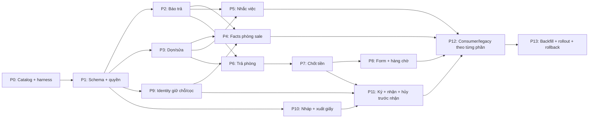

# Hợp đồng, trả phòng, cọc và phòng sale — Implementation Plan

> **For agentic workers:** REQUIRED SUB-SKILL: Use superpowers:subagent-driven-development (recommended) or superpowers:executing-plans to implement this plan task-by-task. Steps use checkbox (`- [ ]`) syntax for tracking.
>
> **Trạng thái: DỰ THẢO ĐỂ AUDIT, CHƯA THI HÀNH.** Yêu cầu hiện tại chỉ là điều tra và lập plan. Không chạy migration, ghi dữ liệu thật, bật cờ hay triển khai app từ tài liệu này trước khi các điều kiện chặn được giải quyết.

**Goal:** Quản lý cập nhật tình trạng phòng ngay, chuẩn bị hợp đồng trước khi ký, và có thể trả phòng trước rồi quyết toán khách cũ sau mà không mất kiểm soát tiền hoặc ảnh hưởng khách mới.

**Architecture:** Tách lịch báo trả, cư trú thực tế, công việc dọn/sửa, cam kết giữ phòng, hồ sơ nháp và quyết toán thành các trạng thái có quan hệ rõ ràng. Dùng RPC giao dịch cho chuyển trạng thái, tái sử dụng bộ máy chứng từ/posting hiện có; giữ `contracts` là hợp đồng chính thức. Trang công khai đọc một phép tính phòng sale thống nhất qua token, còn nhắc việc chạy ở máy chủ.

**Tech Stack:** React/Vite, TypeScript, React Query, RHF/Zod, shadcn/ui, Supabase/PostgreSQL, pg_cron, hệ thống notification/jobs và R2 hiện có. Runtime theo `tooling/runtime-matrix.json`; không nâng dependency chỉ để thực hiện plan.

## 0. Nền bằng chứng và cách đọc

> **Bản dùng để audit trực tiếp:** tài liệu và ba báo cáo domain đã được đặt trong checkout gốc `C:/Users/Nguyen Tam/whiteboard-ihomecrm-main` theo yêu cầu chủ. Đọc mã nguồn hiện tại ngay tại checkout này; worktree/SHA bên dưới là lịch sử lập plan. Hướng dẫn vào việc: `AUDIT-HOP-DONG-2026-09-27.md` ở gốc dự án.

- Source gốc: `e498f10d49f3548e72074095c955371d0cee41ab`; đã fetch và đối chiếu `HEAD...origin/main = 0/0` lúc bắt đầu.
- Worktree lập plan: `C:/Users/Nguyen Tam/codex-worktrees/contract-lifecycle-plan-20260927`, nhánh `codex/contract-lifecycle-plan-20260927`. Tạo đúng vị trí do AGENTS yêu cầu; API worktree trong phiên không có tham số chọn thư mục đích.
- Worktree vừa checkout đã báo dirty `supabase/migrations/20260528000007_drop_beds_fix_rpcs.sql` do biểu diễn newline. Giữ nguyên, không stage. Source đóng gói lấy **Git blob của SHA**, không lấy file dirty này.
- Đầu vào nghiệp vụ: các chốt của chủ trong cuộc trao đổi và sơ đồ HTML bản 03. Bản HTML là tài liệu đề xuất, không phải screenshot chức năng đang chạy.
- `OBSERVED`: đã đọc source hoặc chạy kiểm tra trong lần này. `PROPOSED`: hợp đồng kỹ thuật đề xuất. `VERIFY-LIVE`: cần kiểm catalog/đích thực khi bắt đầu thực hiện; file migration có trong Git không chứng minh đã deploy.
- **Master §3–4 sở hữu tên và phạm vi thiết kế.** Ba báo cáo domain giữ bằng chứng điều tra; các tên schema/RPC nghiên cứu trong đó không phải bộ API thứ hai. Nếu phát hiện khác biệt chưa ghi trong bảng ánh xạ của bộ audit, ghi finding, không tự triển khai cả hai phương án.
- Bằng chứng riêng: `docs/audits/2026-09-27-contract-lifecycle/{settlement-evidence,drafts-reservations-evidence,availability-reminders-evidence}.md`.
- Baseline local: **20 file / 496 test Vitest PASS**, Node `v22.20.0`, tại checkout chính cùng SHA có sẵn dependencies. CI ghim Node khác theo runtime-matrix; baseline này không thay CI, test JWT/RLS, PostgREST hoặc tiền trên TEST. Log: `docs/audits/2026-09-27-contract-lifecycle/verification/baseline-vitest.txt`.
- Đã kiểm HTML ở desktop/mobile 320–1440 px, 5 tab ví dụ, print media, không lỗi console. Chưa chạy E2E ghi dữ liệu hay đọc live catalog cho plan này; không có bằng chứng production mới.

## Global Constraints

1. Đọc `docs/engineering/PROJECT_CONTRACT.md`; manifest là nguồn luật, nếu có xung đột thì Contract và chốt mới nhất của chủ thắng.
2. Mọi thử nghiệm ghi: project TEST riêng hoặc fixture DEMO được phép; org THẬT chỉ đọc. Không coi org TEST cũ `cccc…` là môi trường thử.
3. Không sửa migration đã merge/deploy, không replay lịch sử legacy, không `supabase db push`. Cấp tên mới bằng `scripts/tao-ten-migration.mjs`; migration additive/idempotent, provenance + backup + forward lane.
4. Không đọc hoặc chép vault/secret vào bộ audit. Runtime credentials chỉ nạp vào process của người thực hiện theo Contract.
5. Không thay giao diện Thu chi/sổ quỹ ngoài phần hiển thị liên kết nguồn và tương thích bắt buộc đã kê dưới đây. **Plan có thay writer và reader tiền dùng chung**: phải audit riêng phần này, không gắn nhãn “chỉ sửa frontend”.
6. Không tạo đường ghi tiền thứ hai, khôi phục RPC hoàn đã thu quyền, tự duyệt phiếu, hay suy “đã trả tiền” từ thao tác chốt số.
7. Không thêm `any` RPC mới, không chỉnh generated types bằng tay, không tăng TS baseline; RPC wrapper phải validate input/output.
8. UI chỉ gọi hook/domain service; scope org/toà và authorization được xác minh ở server, kể cả SECURITY DEFINER.
9. Test migration/tiền/quyền phải có ca âm, cạnh tranh, idempotency, mutation test. Test đọc chuỗi SQL không thay test hành vi.
10. Review độc lập + draft PR trước tích hợp thay đổi tiền/quyền/schema; production chỉ qua lane/phát hành được Contract cho phép. Plan này không phải quyết định deploy.

## 1. Yêu cầu đã chốt và quyết định kỹ thuật cần audit

### 1.1 Chốt nghiệp vụ — không được âm thầm đổi

| ID | Yêu cầu / ví dụ chấp nhận |
|---|---|
| R01 | Báo ngày dự kiến trả nhanh; đổi/hủy được, sale cập nhật theo thông tin mới. Ngày dự kiến không tự kết thúc hợp đồng. |
| R02 | Đến/quá ngày chưa xác nhận phải có nhắc việc và hàng quá hạn; không mất việc chỉ vì đã đọc notification. |
| R03 | Thanh lý bắt buộc **ngày bàn giao thực tế + loại thanh lý** ngay ban đầu: hết hạn / trả trước hạn / bỏ cọc. |
| R04 | Hai nhánh trong cùng form: **trả phòng, quyết toán sau** hoặc **thanh lý và quyết toán ngay**. |
| R05 | Nhánh sau: kết thúc lượt ở, phòng dùng được cho lượt mới; tiền/nợ/cọc còn nguyên để xử lý. Chưa biết là NULL/chờ bổ sung, không phải 0. |
| R06 | Quyết toán được chọn lại hình thức thanh lý; giữ loại ban đầu, loại cuối, lý do, người và thời điểm đổi. |
| R07 | Chốt số khác thực thu/chi. Kết quả: hoàn tất / chờ hoàn / chờ khách trả; theo tiền đã ghi sổ và các reversal. |
| R08 | Quyết toán A sau khi B vào phòng không đổi phòng/cọc/hợp đồng B. |
| R09 | **Phòng đã trả đang dọn/sửa vẫn lên sale là trống**, kèm ngày dự kiến nhận. Đây là dữ kiện theo dõi công việc, không phải khoá chào phòng. |
| R10 | Dọn/sửa trễ phải nhắc và cập nhật ngày; chưa có ngày mới thì sale ghi cần xác nhận ngày nhận. Không ẩn phòng chỉ vì dọn/sửa trễ. Giữ nguyên giữ chỗ khách kế tiếp. |
| R11 | Nháp lưu/sửa/tải gửi xem trước; **nháp không giữ phòng**, không sinh thu tiền hoặc hoá đơn. Giữ chỗ/cọc riêng. |
| R12 | Xác nhận đã ký từ đúng bản nháp; tái sử dụng dữ liệu, không tạo trùng khi bấm lại. |
| R13 | Giữ chỗ/cọc/hoàn/bỏ cọc và hồ sơ tồn đọng phải dễ theo dõi, gắn đúng lượt khách. |

### 1.2 Đề xuất thiết kế, chưa được trình bày như chốt của chủ

| ID | Phương án dùng để audit | Điều kiện trước bật |
|---|---|---|
| D01 | Nhắc trước 1 ngày, ngày hẹn, mỗi ngày quá hạn; 08:00 theo timezone org; sweep 15 phút, bắt kịp khi bỏ lỡ lượt chạy. | Chủ duyệt tần suất/người nhận; không tự đăng ký automation bên ngoài CRM. |
| D02 | Quá ngày **chưa xác nhận khách rời**: public tạm không chào theo lịch cũ, nội bộ giữ hàng “chờ xác nhận”. Đã nhận bàn giao nhưng dọn/sửa: vẫn chào trống. | Audit ưu tiên trạng thái và chủ xác nhận cách thể hiện public; không nhầm hai tình huống. |
| D03 | Ký trước ngày nhận có `SIGNED_WAITING`; nhận phòng mới đổi cư trú. | Chốt chính sách invoice trước/sau nhận ở G-BILLING; không được tự đổi ngày tính tiền. |
| D04 | Public v1 dùng revision polling 5s khi visible; in-app dùng realtime hub. Mục tiêu TEST p95 thay đổi xuất hiện ≤10s, focus/reconnect tải ngay. | Đây là gần thời gian thực, **không phải push realtime**. Đo chi phí và độ trễ; không đánh tráo polling thành subscription. |
| D05 | Giữ chỗ không tiền mặc định có hạn, tái sử dụng hạn 24h hiện có; cọc đã thực nhận không tự hết hiệu lực chỉ vì hold tới hạn. | Chủ duyệt thời hạn; mọi gia hạn/hủy phải lưu dấu. |
| D06 | Chỉ chốt/đổi phân loại khi case chưa final; sau final cần luồng điều chỉnh tài chính được audit riêng. | Không âm thầm sửa quyết toán đã ghi sổ. V1 không có nút mở lại tuỳ ý. |
| D07 | Nhận phòng thực tế cần xác nhận sẵn sàng; nếu dọn/sửa trễ thì quản lý xử lý lịch bàn giao. | Đây là guard bàn giao đề xuất, không phải guard chào sale; chủ xác nhận trước bật. |
| D08 | Giữ nghiệp vụ pass đang có khách: pass hợp lệ, chưa có next claim vẫn được chào; lịch trả đã quá hạn cần xác nhận lại trước chào theo ngày đó. | Chủ/reviewer duyệt priority và public contact allowlist; không vô tình xoá toàn bộ pass ACTIVE hiện có. |

**Không có quyền suy diễn:** ký trong app là xác nhận đã ký nghiệp vụ, không tự tuyên bố chữ ký số có giá trị pháp lý. Tài liệu này không bổ sung nhà cung cấp ký điện tử.

## 2. Source hiện tại và các điểm không thể sửa bằng đổi nhãn

| Hiện trạng OBSERVED | Neo source | Tác động thiết kế |
|---|---|---|
| Public và in-app poll 5 phút; public fallback SAMPLE khi payload NULL/rỗng | `src/pages/phong-trong/usePhongTrong.ts:15`, `PhongTrongPage.tsx:40`, `supabaseData.ts:120`, `src/hooks/useMyAvailableRooms.ts` | Sửa phân biệt invalid token / empty / error trước nâng tốc độ. |
| Hai form báo chuyển đi ghi cùng cột theo hai cách; invalidation thiếu public keys | `MoveOutDialog.tsx`, `RegisterMoveOutDialog.tsx`, `useContractOperations.ts:96` | Một RPC notice có revision/audit, cột cũ chỉ là projection tương thích. |
| Nhắc theo client được mount từ Dashboard | `src/hooks/useScheduledNotifications.ts`, `src/pages/Dashboard.tsx` | Scheduler máy chủ + persisted work item, không dùng setInterval UI làm nguồn lịch. |
| Create V2 luôn INSERT ACTIVE, tạo invoice/phiếu, cập nhật OCCUPIED | `supabase/migrations/20260721090000_contract_create_v2.sql:691`, `:979`, `:1042` | Không thể thêm nút “Lưu nháp” gọi nguyên writer này. |
| DRAFT hiện là enum/display; trigger link cọc/đánh số/lịch sử giá không đồng loạt bỏ qua | `20260731140000_orphan_deposit_trigger_flex.sql`, `20260728180000_room_price_history.sql`, `20260915144507_so_hop_dong_chong_dua.sql` | Tách kho lưu nháp. SIGNED_WAITING vẫn phải audit toàn bộ trigger/reader. |
| Helper ép hold tối thiểu 1đ/fail-open; QuickDeposit còn dùng `unitPrice=1` khi trống tiền để tạo IE | `src/lib/reservationHold.ts:24`, `:35`, `:56`; `src/pages/phong-trong/QuickDepositModal.tsx:110`, `:145`, `:160` | Một reservation chính thức, nguồn tiền độc lập; không fallback khi mất khoá. |
| Move-out tính/cấn tiền rồi mới TERM, audit COMPLETED | `20260915074638_coc_thanh_ly_va_cap_hoan_coc.sql:525`, `:598`, `:746` | Tách writer vận hành và writer quyết toán; bỏ guard TERMINATED đơn lẻ sẽ cho chạy lại tiền. |
| Giải phóng phòng khi contract rời ACTIVE/EXTENDED | `20260915144610_trang_thai_phong_theo_hop_dong_definer.sql:58` | Dùng actual_end_date + TERM cho kết thúc cư trú, giữ room_id lịch sử. |
| Writer ký mới khóa room, kiểm AVAILABLE/RESERVED và ACTIVE khác | `20260721090000_contract_create_v2.sql:498`, `:549` | Mọi writer vòng đời phải có cùng thứ tự khoá; legacy scheduled không có interval model. |
| Restore 21/9 gỡ một số settlement RPC; 23/9 đóng đường hoàn thứ hai | `20260921085952_restore_before_contract_settlement.sql`, `20260923161122_bo_duong_hoan_khach_thu_hai.sql` | Không coi CREATE lịch sử là API tồn tại, không phục hồi đường hoàn song song. |
| Thu chi vừa áp bộ máy cam kết | các migration `20260926*`, `docs/plans/PLAN-CO-MAY-CHI-THEO-CAM-KET-2026-09-26.md` | Preview/commit quyết toán phải đi đúng admission/posting hiện hành; không copy SQL cũ để tự duyệt. |

Đọc các evidence domain để có call-chain và neo bổ sung. Neo dòng là tại SHA nền; khi rebase, tìm symbol và đọc lại thân hàm sau các patch `pg_get_functiondef`, không chọn file có timestamp cao nhất bằng mắt.

## 3. Mô hình trạng thái đề xuất

### 3.1 Tách các trục

| Trục | Trạng thái / dữ liệu | Quy tắc |
|---|---|---|
| Hợp đồng chính thức | SIGNED_WAITING → ACTIVE → TERMINATED; SIGNED_WAITING → CANCELLED_BEFORE_CHECKIN | Hai status mới là đề xuất. EXTENDED legacy chỉ đọc tương thích, không phát sinh mới; giữ TRANSFERRED/EXPIRED và DRAFT legacy. |
| Nháp riêng | EDITABLE → SIGNED hoặc CANCELLED | SIGNED trỏ contract_id duy nhất, không có đường sửa im lặng vào bản đã ký. |
| Lịch báo trả | OPEN(expected_on, revision) → FULFILLED / CANCELLED | Dời ngày tăng revision; quá hạn là trạng thái tính từ ngày org và chưa fulfilled. |
| Quyết toán | PENDING → FINALIZED | Trạng thái tiền được suy từ obligation + posting; không tạo `COMPLETED` giả lúc chỉ trả phòng. |
| Dọn/sửa sau bàn giao | PENDING / READY, expected_ready_on, jobs | PENDING vẫn chào sale trống; không đổi `rooms.status` sang MAINTENANCE vì lý do này. |
| Giữ phòng | HELD / DEPOSITED / CONVERTED / CANCELLED / EXPIRED | Phải có identity của lượt khách; cọc pending/confirmed và tiền posted được phân biệt. |
| Sale | free / soon / reserved / unknown-arrival / rented | Nhãn từ phép tính server; “free” không đồng nghĩa “nhận ngay”. |

### 3.2 Schema additive — PROPOSED, tên là hợp đồng giữa các task

Không tạo tiền bảng mới. Các trường số tiền chỉ tồn tại khi final hoặc là snapshot hiển thị có nguồn; ledger cũ vẫn sở hữu tiền.

```text
contract_moveout_notices
  id, organization_id, building_id, contract_id, room_id, expected_on DATE,
  status OPEN|FULFILLED|CANCELLED, revision BIGINT, responsible_membership_id,
  created_by, created_at, updated_at, resolved_at
  UNIQUE active notice per contract; composite scope FKs

contract_exit_cases
  id, organization_id, building_id, contract_id UNIQUE, room_id,
  actual_move_out_on DATE, initial_kind, current_kind,
  settlement_mode DEFERRED|IMMEDIATE, settlement_state PENDING|FINALIZED, version BIGINT,
  legacy_termination_id NULLABLE UNIQUE, finalized_at NULLABLE,
  financial_source_ids JSONB NULLABLE, final_snapshot JSONB NULLABLE,
  finalized_actor NULLABLE, accounting_on DATE NULLABLE, created_by, created_at
  initial_kind immutable; current_kind changes only with audit before final
  FINALIZED requires immutable snapshot + actor + time + accounting_on
  snapshot = obligations, allocations, source versions, policy, effect IDs;
  current net posted money is derived separately after refunds/reversals

app_private.contract_exit_previews
  id, organization_id, building_id, actor_membership_id, contract_id,
  subject_kind EXIT|SIGNED_CANCELLATION,
  exit_case_id NULLABLE, sign_cancellation_id NULLABLE, expected_subject_version,
  mode, kind, intent_hash, facts_hash, policy_version, expires_at,
  facts JSONB, calculated_lines JSONB, consumed_operation_id NULLABLE
  opaque random preview ID; private store, no public SELECT/grants
  EXIT allows only exit_case_id; SIGNED_CANCELLATION only sign_cancellation_id;
  before case creation both nullable, bound instead to exact contract version + intent

contract_lifecycle_events
  id, organization_id, building_id, contract_id NULLABLE, draft_id NULLABLE,
  reservation_id NULLABLE, event_type, entity_version,
  before JSONB, after JSONB, reason NULLABLE, actor_membership_id,
  occurred_at, operation_id
  append-only; no secrets/doc bytes; server records actor, scope and timestamps

room_turnovers
  id, organization_id, building_id, room_id, exit_case_id UNIQUE,
  status PENDING|READY, expected_ready_on DATE NULLABLE,
  responsible_membership_id, version, completed_at NULLABLE
room_turnover_jobs
  turnover_id, job_id UNIQUE, organization_id, classification TRACKING|APPROVED_PAID_JOB;
  composite scope checks; classification changes require payroll policy permission + audit
  jobs table remains owner of task assignee/deadline/completion evidence

lifecycle_work_items
  id, organization_id, building_id, source_kind, source_id, source_revision,
  kind NOTICE_TOMORROW|NOTICE_DUE|NOTICE_OVERDUE|TURNOVER_DUE|TURNOVER_OVERDUE,
  due_on, status OPEN|RESOLVED|SUPERSEDED, responsible_membership_id,
  snoozed_until NULLABLE, resolved_at NULLABLE, last_notified_on NULLABLE
  UNIQUE(source_kind, source_id, source_revision, kind)
  partial UNIQUE(source_kind, source_id, source_revision) WHERE status=OPEN
  phase advances by superseding old item before opening current phase
  notification outbox UNIQUE(work_item_id, recipient_membership_id, local_day)

contract_drafts
  id, organization_id, building_id, room_id NULLABLE, reservation_id NULLABLE,
  schema_version, version BIGINT, payload JSONB, status EDITABLE|SIGNED|CANCELLED,
  template_version_id NULLABLE, contract_id NULLABLE UNIQUE,
  created_by, updated_by, created_at, updated_at
contract_document_versions
  id, organization_id, draft_id NULLABLE, contract_id NULLABLE,
  draft_version, template_id, template_digest, payload_digest,
  immutable_payload JSONB, template_storage_key, template_version,
  renderer_version, rendering_options JSONB,
  storage_key, content_digest, document_kind DRAFT|SIGNED_RECORD, created_by, created_at
  pin immutable template bytes and payload, not only mutable draft/template IDs

room_reservations
  id, organization_id, building_id, room_id, customer_id,
  expected_arrival_on DATE NULLABLE, hold_expires_at TIMESTAMPTZ NULLABLE,
  state, version, converted_contract_id NULLABLE UNIQUE,
  created_by, created_at
reservation_receipts
  reservation_id, voucher_id, source_amount; exact source lineage, unique ownership
  source_amount derived/validated from deposit lines; no freehand rewrite of paid totals

app_private.availability_scope_versions
  scope_id, revision BIGINT; private key, never return scope/org identifiers to anon

contract_sign_cancellations (only needed with SIGNED_WAITING phase)
  id, organization_id, building_id, contract_id UNIQUE, reason,
  version, state PENDING|FINALIZED, cancelled_by, cancelled_at,
  final_snapshot NULLABLE, financial_source_ids NULLABLE,
  finalized_actor NULLABLE, finalized_at NULLABLE, accounting_on NULLABLE
  no actual_move_out date, no residence interval; same finance core and preview rules
```

Thêm `contracts.actual_move_in_date` để phân biệt cư trú với ngày hợp đồng; `start_billing_date` vẫn là mốc thỏa thuận hiện có. `SIGNED_WAITING` và `CANCELLED_BEFORE_CHECKIN` **chưa có trong enum source hiện tại**, cần enum addition + constraint + reader updates; enum addition và use phải chia migration/transaction đúng PostgreSQL nếu catalog yêu cầu. RLS và generated types ở cùng milestone, không để bảng mới mở mặc định cho anon.

Thêm `contracts.lifecycle_version BIGINT NOT NULL DEFAULT 1` cho CAS cư trú/notice/sign/check-in. Trigger tăng khi room, status, ngày thuê/nhận/trả hoặc dữ kiện ảnh hưởng lifecycle đổi, kể cả qua legacy writer; không tăng hai lần khi RPC đã ghi. `expectedVersion` là version của entity đích: contract khi chưa có case/notice, notice revision khi dời/hủy, case version khi finalize, draft/reservation version cho thao tác tương ứng. Request phải chỉ rõ subject; không dùng literal `1` ngoài fixture mới. Contract legacy ACTIVE chưa có actual_move_in_date giữ lịch sử chưa xác minh/nguồn cũ, không backfill bằng một ngày đoán rồi coi là đã bàn giao thật.

**Tránh mô hình giữ phòng thứ ba:** `room_reservation_holds` hiện có vẫn làm khoá ngắn hạn. Thêm exact `reservation_id` và trạng thái consume/release; `room_reservations` là hồ sơ nghiệp vụ, không phải số dư tiền. Khi ký, claim chuyển atomically từ reservation sang contract. Chỉ một helper tính claim dùng cho reserve/sign/checkin/renew/transfer/public.

P1/P9 phải chọn **một** bảng registry có UNIQUE claim khách kế tiếp theo `(organization_id, room_id)` khi còn hiệu lực, được mọi writer tham chiếu. Phương án V1: mở rộng `room_reservation_holds` bằng `reservation_id`, `signed_contract_id`, `claim_state`, `claim_kind`, đúng một subject; giữ row khi chuyển reservation→signed và chỉ giải phóng lúc nhận/hủy. Không để hold đã consume biến mất trong khi SIGNED_WAITING chưa có constraint bảo vệ. Nếu catalog/exclusion legacy không thể nâng an toàn, thay bằng registry mới trong cùng migration cutover và biến bảng cũ thành adapter; không duy trì hai nguồn khoá độc lập. G-LOCK/G-LEGACY phải duyệt quyết định vật lý này trước P9.

Cutover registry phải atomic theo checkpoint có chứng cứ: phân loại/backfill mọi live hold cũ; ép `claim_state NOT NULL` và map mọi INSERT/UPDATE legacy qua guard **theo room có live claim**, kể cả enrollment OFF. HELD/PENDING_RECEIPT_REVIEW/DEPOSITED/SIGNED_WAITING giữ slot; ACTIVE nhận phòng, CANCELLED hoặc EXPIRED không tiền giải phóng slot đúng subject. Chuyển reservation→signed không nhả slot giữa chừng. Map status APPROVED/PENDING_APPROVAL cũ và thay exclusion 24h sau validation để row đã consume không còn chặn người kế tiếp; không để NULL lọt predicate UNIQUE hoặc writer cũ bỏ qua signed claim quá 24h. Test mixed writers ở từng checkpoint. Trạng thái paid source mơ hồ phải vào đối soát và giữ claim cần bảo vệ; không đoán expiry chỉ từ giờ.

P1 tạo schema theo dependency: core case/notice/turnover trước; draft/reservation/document ở P9/P10; FK tùy chọn của event chỉ thêm khi bảng đích có. Mọi row nghiệp vụ dùng composite org/building/subject FK hoặc trigger constraint tương đương có test; preview/registry/outbox private không trở thành cửa đọc tránh RLS. Idempotency tái dùng `app_private.canonical_write_operations` (source wrapper 22/08 dòng 644; xác minh catalog P0), keyed org+action+subject+actor+operationId và request hash; không dựng ledger thao tác tài chính thứ hai.

Để V1 không mở rộng booking khách sạn: một room chỉ có tối đa một cam kết khách kế tiếp chưa nhận phòng. Cho chuẩn bị nhiều nháp, nhưng chỉ một sign/hold thắng. Cho cam kết kế tiếp khi cư trú hiện tại có báo trả đã xác nhận, ngày nhận ≥ ngày dự kiến trả và ≥ ngày dự kiến dọn/sửa xong. Chưa có ngày đủ tin cậy thì chỉ lưu nháp. Không tự cấp hợp đồng thứ ba sau cam kết đã ký; muốn hỗ trợ nhiều khoảng tương lai phải là phase riêng có exclusion theo range.

### 3.3 Cùng ngày và ngày không chắc chắn

- Dùng DATE theo timezone org cho ngày dự kiến/trả; log actor/transition dùng timestamptz. Cho trả và nhận cùng ngày **sau khi** trả phòng được xác nhận, không cho hai ACTIVE cùng lúc.
- Ngày trả thực tế không sau hôm nay, không trước đầu lượt cư trú liên quan. Trường hợp backdate phải kiểm lịch sử transfer/next contract; không tự biến ngày cuối hợp đồng thành ngày rời.
- Ngày nhận dự kiến không phải bảo đảm đã có thể bàn giao. Ready date chưa biết vẫn chào phòng đã trống với nhãn liên hệ; chưa cho xác nhận nhận phòng khi turnover chưa READY.
- Hủy báo trả không được rơi lại nhánh public “soon vì end_date sắp tới”. End_date tự hết chỉ tạo việc kiểm tra/gia hạn nội bộ; muốn public chào “sắp trống” cần nguồn xác nhận riêng.
- Khách cũ lùi ngày hoặc dọn/sửa trễ sau khi khách mới ký/đặt cọc: giữ claim mới, phát conflict công việc cho quản lý; không tự sửa ngày ký/ngày tính tiền/hoàn cọc của bất kỳ khách nào.

## 4. API, quyền, giao dịch và tương thích

### 4.1 Envelope thống nhất

```ts
type ExitKind = 'NATURAL_EXPIRY' | 'EARLY_RETURN' | 'FORFEIT';
type DateISO = string; // parse strict YYYY-MM-DD + calendar validity at boundary
type MoneyVnd = string; // canonical decimal string, scale <= 2 như money engine hiện có; DB numeric validates
type Command = {
  operationId: string; // UUID generated once on user intent; same payload on retry
  expectedVersion: string; // BIGINT as decimal string
};
type MoveOutCommand = Command & {
  contractId: string; actualMoveOutOn: DateISO; kind: ExitKind;
  turnover: { ready: boolean; expectedReadyOn: DateISO | null; assigneeMembershipId: string | null };
} & (
  | { mode: 'DEFERRED'; accountingOn?: never; settlementPreviewToken?: never }
  | { mode: 'IMMEDIATE'; accountingOn: DateISO; settlementPreviewToken: string }
);
type PreviewSubject =
  | { kind: 'EXIT'; contractId: string; exitCaseId?: string; expectedVersion: string }
  | { kind: 'SIGNED_CANCELLATION'; contractId: string; signCancellationId?: string; expectedVersion: string };
// Preview intent is a discriminated union: EXIT has moveout inputs;
// SIGNED_CANCELLATION has reason/cancellation date, never a fabricated moveout date.
// Both financial intents carry accountingOn and typed adjustment inputs.
type CommandResult = {
  operationId: string; entityId: string; version: string; replayed: boolean;
  caseState?: 'PENDING' | 'FINALIZED'; contractId?: string;
};
// Errors: VALIDATION, FORBIDDEN, NOT_FOUND, VERSION_CONFLICT,
// ROOM_CONFLICT, PREVIEW_STALE, LEGACY_CLIENT_BLOCKED, INTERNAL.
```

RPC JSONB input + operation_id, output validated bằng Zod tại `src/lib/contract-lifecycle/rpc.ts`; không truyền actor/org tin cậy từ client. Server resolve room/contract→org/toà, so active membership và `can_access_building()`; từ chối request sửa ID thuộc org/toà khác. Replay vẫn kiểm quyền hiện tại, không trả payload cũ cho người bị thu quyền.

| RPC mới (PROPOSED) | Contract input/output | Quyền đề xuất |
|---|---|---|
| `set_contract_moveout_notice_v1(p_input jsonb)` | contractId, expectedOn, expectedVersion, reason, operationId → noticeId/revision | `contracts.edit` + toà |
| `cancel_contract_moveout_notice_v1(p_input jsonb)` | noticeId, reason, version, operationId → revision/CANCELLED | như trên |
| `confirm_contract_moveout_v1(p_input jsonb)` | MoveOutCommand → exitCaseId/version/state | `contracts.terminate`; IMMEDIATE thêm quyền chốt |
| `preview_contract_exit_settlement_v1(p_input jsonb)` | PreviewSubject EXIT hoặc SIGNED_CANCELLATION, intent đúng loại, accountingOn, typed charge/refund drafts → canonical preview/hash/token/version | `contracts.settle` mới + scope + quyền đọc tiền |
| `finalize_contract_exit_settlement_v1(p_input jsonb)` | caseId, currentKind, changeReason nếu đổi, accountingOn, previewToken, version, operationId → linked sources + FINALIZED | `contracts.settle`; giữ guard finance trên từng nguồn |
| `get_contract_exit_cases_v1(p_input jsonb)` | cursor/filter/scope → case, initial/current kind, pending fields, net financial status, action capabilities; totals server | `contracts.view` và quyền đọc tiền tương ứng, không trả số tiền khi không được phép |
| `update_room_turnover_v1(p_input jsonb)` | turnoverId, status, expectedReadyOn, assignee, reason, version, operationId → version | `rooms.edit` và quyền jobs tương ứng |
| `save_contract_draft_v1(p_input jsonb)` | draftId nullable, version, schemaVersion, typed payload, operationId → draftId/version | create=`contracts.create`, edit=`contracts.edit` |
| `cancel_contract_draft_v1(p_input jsonb)` | draftId, reason, version, operationId → CANCELLED | `contracts.delete` hoặc action hủy nháp audit tại G-AUTH |
| `sign_contract_draft_v1(p_input jsonb)` | draftId/version, documentVersionId, signedOn, reservationId nullable, operationId → contractId/SIGNED_WAITING | `contracts.sign` mới + create + scope |
| `activate_signed_contract_v1(p_input jsonb)` | contractId/version, actualMoveInOn, handoverRef, operationId → ACTIVE | `contracts.checkin` mới + scope |
| `cancel_signed_contract_before_checkin_v1(p_input jsonb)` | contractId/version, reason, DEFERRED/IMMEDIATE, previewToken nếu chốt ngay, operationId → cancellationCaseId, cancelled official contract, exact claim released | `contracts.terminate`; chốt/thu/chi thêm quyền tương ứng |
| `finalize_signed_contract_cancellation_v1(p_input jsonb)` | cancellationCaseId/version, accountingOn, previewToken, operationId → immutable snapshot + source IDs | `contracts.settle` + quyền finance từng nguồn |
| `create_room_reservation_v1(p_input jsonb)` | room/customer, arrivalOn, expiresAt, version, operationId → reservationId | `deposits.create` hoặc `sale_phong.create_deposit` đã cấp |
| `record_reservation_receipt_v1(p_input jsonb)` | reservationId/version, amount, account, receipt date/evidence, operationId → canonical voucherId | quyền giữ chỗ + quyền finance hiện hành |
| `cancel_room_reservation_v1(p_input jsonb)` | reservationId/version, reason, operationId → claim released, financial status unchanged | `deposits.refund` khi có tiền; quản lý giữ chỗ khi không tiền, G-AUTH |
| `get_available_rooms_revision_v1(p_token text)` | token valid → opaque scopeEpoch + revision string + orgToday + nextTransitionAt + serverNow; invalid/revoked → explicit invalid result | anon token validation, không SELECT private tables |

Quyền `contracts.settle/sign/checkin` là mới, phải đưa vào permission catalog/migration/types/UI. Không tự cấp mọi manager quyền chi tiền chỉ vì được trả phòng. Owner/nhân sự nào nhận quyền mới phải có bảng mapping có duyệt; vai cũ giữ được công việc nào được kiểm bằng JWT thật. Không dùng `is_super_admin() OR ...` để bypass toà.

### 4.2 Ranh giới giao dịch

```text
confirm moveout(DEFERRED):
  authorize → resolve scope → lock room → lock org financial serialization (nếu dùng chung)
  → lock contract → lock existing exit case/notice/claim in deterministic id order
  → replay operation or reject changed request hash
  → recheck version, active occupancy, actual date and actor scope
  → INSERT exit case(initial_kind=current_kind, PENDING, amounts absent)
  → UPDATE contract TERMINATED + actual_end_date; preserve room_id/customer history
  → resolve notice; INSERT turnover + salary-excluded task links when needed
  → recompute room respecting next claim; append audit; bump availability revision
  → commit. NO invoice/payment/credit/voucher/posting writes.

confirm moveout(IMMEDIATE):
  same operation transaction + canonical settlement core before final commit
  → preview recalculated on server under locks; mismatch rejects entire transaction
  → post/apply through existing canonical finance chain once
  → finalize case + lifecycle in same transaction; finance failure rolls back both
  → user can explicitly choose DEFERRED in a new intent, never silent downgrade.

finalize deferred(case):
  resolve exact case.contract_id → same lock order → recheck sources/preview/version
  → final amount/kind + append kind-change event if changed
  → canonical finance core for old contract only
  → mark case FINALIZED and persist source lineage; NO room/current-customer writes.
```

**Thứ tự khóa là điều kiện phải chứng minh**, không phải claim source đã đúng: đọc room_id không khoá để resolve, lấy room → org mutex → contract(s) theo UUID → case/draft/reservation → invoice/voucher/credit theo canonical finance order. Sau khoá đọc lại room_id/scope; đã chuyển phòng thì trả VERSION_CONFLICT. Rà và sửa toàn bộ writer có thể giao nhau (legacy create, renew, transfer, forfeit, invoice payment, refund) trước cutover. Nếu canonical finance có thứ tự khác, G-LOCK phải xác lập một order tổng mới và chạy deadlock harness, không áp order trên một nửa writer.

Không gọi API mạng trong transaction. Audit insert lỗi làm rollback; notification delivery dùng outbox giao dịch để retry độc lập. Replay cùng operation trả cùng ID; đổi payload cùng key lỗi conflict. Client chỉ retry intent đã có operationId, không tự sinh key mới sau timeout.

Preview dùng private store §3.2, TTL đề xuất 10 phút (audit được thay). Bind actor/membership, org/toà, contract, subject-kind EXIT/SIGNED_CANCELLATION, case nếu đã có, expected version, mode/kind, full intent gồm ngày bàn giao hoặc ngày huỷ và ngày ghi sổ, facts/policy và expiry. Token không tự là quyền; execute kiểm membership, quyền tiền, kỳ/sổ/cờ hiện tại sau khoá. Chỉ operation đã commit được consume preview; cùng key replay thành công kiểm quyền rồi trả result cũ kể cả preview đã hết hạn, key khác không dùng lại. Preview IMMEDIATE chưa có case bind contract+intent; deferred finalize bind exact case/version. Test token EXIT bị từ chối cho SIGNED_CANCELLATION và ngược lại. Không lưu token có PII ở URL/log.

### 4.3 Quyết toán: không copy writer cũ nguyên khối

- Tách `app_private.finalize_contract_exit_core_v1` từ logic đang có thành core **không đổi lifecycle/phòng**. Public mới giữ quyền, khóa, idempotency; không GRANT core cho anon/authenticated.
- Phần giữ nguyên: phân loại khoản tiền, reconcile posting/credit, liên kết hóa đơn, phiếu hoàn, approval/admission/cashbook custody hiện hành. Phần thay: snapshot server, source dedup, lifecycle tách khỏi tiền, dòng audit phân loại.
- Không tin `outstandingDebt` hay `depositPaid` client. Snapshot gồm source IDs, posting generation/reversal, outstanding từng invoice, credit lots, khoản chỉnh có lý do, kind/current version và rule version. Canonical JSON sort key+stable source order, hash trên server; commit đọc lại dưới khoá.
- `initial_kind` không đổi. `current_kind` chỉ thay trước final có nonblank reason; final facts giữ cả hai. FORFEIT không ngầm xóa nợ; khoản giữ lại không vượt cọc khả dụng sau cấn/hoàn đã ghi.
- Nhánh thiếu tiền mặc định **chưa thu/ghi nợ**, không dùng mặc định PAID của form cũ. Chỉ tạo payment thực thu khi có thao tác/nguồn tiền đúng quyền; chốt không tự tạo khoản thu giả.
- Dùng case→financial sources để truy vết. Số còn phải hoàn = obligation - net valid refund postings; đảo phiếu phải làm hàng chờ xuất hiện lại. Không dựa riêng approval_status hay tên phiếu.
- Phân biệt `actual_move_out_on` (cắt cư trú/dịch vụ), `finalized_at` (quyết định chốt) và `accounting_on`/ngày thu chi (kỳ ghi sổ). Preview/finalize nhận ngày ghi sổ riêng, server xác minh kỳ/sổ mở; không backdate phiếu vào kỳ đã khoá hay sửa ngày bàn giao để đi qua guard. Test trả tháng trước, chốt tháng sau và reversal ở kỳ tiếp theo.
- Bộ máy chi 26–27/9: `termination.refund` **không thuộc allowlist B0**; chốt không tự approve hay đổi source/type để né admission. Test phiếu hoàn chờ, HOLD/DRAW/reversal, bucket locks, engine error log và org chưa có system type bằng manager thật. Tham chiếu bằng chứng §2 của `settlement-evidence.md`.
- Hồ sơ LEGACY COMPLETED không được tự mở lại; đối chiếu nguồn trước khi bridge. Không gọi lại đường hoàn bị đóng 23/9. Thiếu lineage thì “Cần đối chiếu dữ liệu cũ”, chỉ đọc, không bấm tạo tiếp.

### 4.4 Legacy, Copilot và thao tác cũ

Routing kiểm identity/version của đối tượng **trước feature flag**: đối tượng đã có case/draft chuyển đổi/claim v2 luôn qua guard và writer v2, kể cả rollback. Flag OFF chỉ ngăn enrollment mới và giữ đường cũ cho đối tượng legacy đủ điều kiện. Khi ON, mọi entrypoint UI/Copilot/import/direct RPC phải đi qua guard chung. Old moveout API thiếu loại ban đầu không được đoán NATURAL/EARLY theo ngày; trả `LEGACY_CLIENT_BLOCKED` yêu cầu nâng client. FORFEIT cũ cũng không được đi vòng tạo nguồn tiền trùng.

Giữ adapter đủ cho hồ sơ legacy có lineage; không REVOKE bừa endpoint còn đang dùng trước khi map callers. Copilot phase đầu chỉ đọc trạng thái và mở form mới; các action tiền/approve termination cũ phải deny case mới cho tới khi adapter có test replay. `useUpdateContract` và direct DML không được đổi lifecycle hoặc expected date vòng qua RPC/version/audit. Gateway DB must hold for cả SECURITY DEFINER, không chỉ client role.

## 5. Phòng sale, dọn sửa và nhắc việc

### 5.1 Một phép tính server, hai cửa đọc

`app_private.room_sale_facts_v1(room_id, as_of timestamptz)` (PROPOSED) trả facts tình trạng phòng, không có dữ liệu khách/tiền nội bộ; public và in-app dùng chung logic, khác scope. Contact công khai do wrapper allowlist riêng. Giữ nguyên scope được phép của token, quyền toà và settings. Token thu hồi không còn được đọc dù client còn cache.

Ưu tiên bắt buộc:

1. Room/building bị xóa, virtual, ngoài scope/token → loại.
2. Claim reservation/cọc/cam kết đã ký của khách kế tiếp → không chào như còn nhận khách, kể cả overlay pass.
3. Pass listing hợp lệ theo D08 có thể chào khi hợp đồng vẫn ACTIVE, nhưng không vượt claim hay dùng lại ngày trả đã quá hạn. Pass có source/date/confirmation riêng; nếu notice quá hạn chưa rõ thực tế thì yêu cầu cập nhật trước chào theo ngày đó. Không tự biến mọi pass ACTIVE thành rented.
4. Không có pass hợp lệ: còn cư trú thực tế và notice hợp lệ → `soon` ngày dự kiến; không hợp lệ/quá hạn chưa xác nhận → `rented` hoặc `unknown` nội bộ, theo D02.
5. Không cư trú, turnover PENDING → `free`, `arrivalStatus=ESTIMATED` với ngày còn hợp lệ, hoặc `NEEDS_CONFIRMATION`; **vẫn chào sale**. Badge pass nếu có không được đổi fact “đã trống” thành “đang ở”.
6. Không cư trú, turnover READY → `free`, `arrivalStatus=READY`, “Nhận ngay”. End_date tự hết không thay notice xác nhận.

`rooms.status` là projection tương thích, không phải nguồn duy nhất. Trả phòng giữ `AVAILABLE`/`RESERVED` theo claim; không set MAINTENANCE chỉ vì turnover. Phòng MAINTENANCE lịch sử vì lý do khác không được tự backfill thành free.

Public payload giữ các trường cũ **đã thuộc public allowlist**, thêm `arrival_status`, `estimated_ready_on`, `availability_updated_at`; không lộ khách cư trú, cọc tiền, nợ, loại thanh lý hoặc lý do dời. Allowlist: thông tin đăng phòng/toà, giá/dịch vụ/hình được phép, trạng thái/ngày nhận và contact đăng tin được cấu hình công khai. Existing `pass_contact_name/phone` chỉ tiếp tục trả khi cấu hình/chấp thuận public hiện hành cho phép; không lấy danh bạ/contract tenant làm fallback contact. Audit REST trực tiếp cả contact_manager true/false. Public revoked/invalid rõ; payload rỗng hợp lệ hiển thị “Chưa có phòng”; lỗi mạng có retry và last-success stale, không hiện SAMPLE hoặc nói token sai khi chỉ timeout.

Revision thuộc đúng scope public, chỉ trả qua RPC kiểm token; không dùng counter toàn database hay toàn org rộng hơn scope token. Bump cùng transaction khi source facts thay đổi: rooms/buildings/settings/pass/notice/turnover/reservation/official commitment/contracts và giá/ảnh liên quan. `orgToday` từ server bắt chuyển ngày dù scheduler trễ. `nextTransitionAt` là mốc hết hiệu lực sớm nhất của snapshot trong scope (ví dụ hold hết hạn giữa ngày), đi cùng `serverNow`; đến/vượt mốc phải refetch dù revision/day không đổi. Không trả ID/nội dung giữ chỗ. `revision` bigint truyền string. Probe visible mỗi 5s; refetch khi revision/day/mốc hiệu lực đổi hoặc tới hạn, dedup inflight, reconnect/focus refetch, tab hidden dừng interval. Thu hồi token trả invalid trên probe kế tiếp; polling hỏng hiện “Dữ liệu chưa được cập nhật”, không dùng giờ render làm giờ cập nhật. Cần rate limit/no-store và đo tải theo số token/tab; không gọi endpoint nặng mỗi 5s.

Đổi scope của cùng token phải thay `scopeEpoch` opaque; client xoá payload/cache scope cũ trước refetch, response cũ tới muộn bị bỏ. Revision RPC tính time boundary theo server; client clock lệch không được kéo dài snapshot. Public payload cũ có thể bao gồm phòng rented trong toà: “tạm rút” theo D02 nghĩa là loại khỏi **nhóm chào trống/sắp trống và không đưa ngày nhận cũ vào copy/ảnh xuất**; nếu vẫn hiện ô rented trong sơ đồ toà thì không gọi ô đó là còn nhận khách.

### 5.2 Scheduler độc lập UI

```text
every 15 min (DB scheduler, riêng từng environment):
  insert cron_run(start, environment, run_id)
  select current OPEN notices / PENDING turnovers by org local date
  plus unresolved work items whose source is now changed/resolved/missing
  for bounded batch in deterministic order:
    reread source revision + actor scope
    upsert work item for TOMORROW / DUE / OVERDUE
    resolve/supersede items when source fulfilled/cancelled/revised
    enqueue daily notification per recipient + revision + kind + local_day (unique)
  record processed/scanned/error/finished and durable failures; retry next run
```

- Task sống độc lập notification: `read_at` không resolve task; snooze không xóa badge overdue. Quản lý nghỉ/thu quyền thì reassign theo owner/toà và giữ dấu, không gửi tiếp cho role mất scope.
- Writer dời/hủy/trả phòng/READY phải supersede/resolve work item và invalid outbox của revision cũ cùng transaction; sweep đối soát lại cả item mở có nguồn đã đóng, không chỉ quét nguồn OPEN. Dispatcher đọc lại revision/quyền trước gửi; không phát reminder đã lỗi thời đang nằm trong outbox.
- Lượt trễ không gửi bù hàng chục thông báo quá khứ; tạo trạng thái hiện tại và một nhắc tổng trong ngày. Giới hạn batch + pagination; không cap1000 silently.
- Đóng notice fulfilled ngay khi xác nhận trả phòng, dù chưa quyết toán. Quá hạn trả phòng và chờ quyết toán là hai hàng việc khác nhau.
- Turnover jobs tái dùng jobs; bridge thêm source link. Job sinh từ tiện ích theo dõi mặc định `exclude_from_salary=true`, không tự tạo quyền hưởng lương/thưởng. Thay đổi chính sách chi trả phải qua luồng công việc/lương hiện có.
- DB bảo vệ classification TRACKING của job nguồn lifecycle; generic job patch hoặc nút bật lại lương không được bypass. Liên kết job trả công hiện hữu chỉ với classification APPROVED_PAID_JOB đã có quyền/policy; không tự đổi job đó thành không lương. Test hoàn tất/mở lại/sửa job, patch trực tiếp và salary snapshot trước/sau.
- Guard phải phủ **cả** `v5_tick_from_job` và `award_job_bonus`, không chỉ cột exclude: source `20260720190000_v5_date_hardening.sql:134` và `20260720181000_jobs_completion_time_integrity.sql:368` còn có đường attendance/bonus riêng; `TaskCompleteDialog.tsx:121` gọi các đường này. TRACKING không tạo attendance JOB, popup thưởng hay SALARY_BONUS; APPROVED_PAID_JOB giữ chính sách đã duyệt. Kiểm cả direct RPC lẫn completion UI.
- Hoàn tất job đơn lẻ không đồng nghĩa toàn bộ turnover READY: người có quyền xác nhận đủ điều kiện bàn giao; job bị mở lại làm cảnh báo, không âm thầm chiếm lại phòng có khách mới.
- In-app notifications là phạm vi v1. Push dùng opt-in/transport đang có, không phụ thuộc push để task tồn tại. TEST không có VAPID theo README; không tuyên bố đã kiểm push thật bằng TEST.

## 6. Nháp, giữ chỗ, ký và nhận phòng

### 6.1 Nháp và tài liệu

- Kho nháp JSON có schemaVersion; validate từng trường hiện có, cho thiếu các trường chưa cần lúc save. Export yêu cầu bộ trường để tài liệu đọc được, hiển thị chỗ còn thiếu thay vì lặng lẽ làm rỗng; sign bắt buộc complete + fresh source.
- Dùng form hiện tại với mode DRAFT/FINAL, tách submit. `save_contract_draft_v1` không INSERT contracts, link cọc, đánh số chính thức, tạo price history, invoice, resident stay hoặc commission.
- Mỗi export gắn draftVersion+template digest+payload digest+content digest. Chọn đúng `contract_template_id`, không tự rơi về template mặc định khác. Khoá snapshot template lúc export; thay template chung không làm bản đã gửi đổi nội dung.
- Tái dùng DOCX engine, watermark “BẢN NHÁP — CHƯA KÝ”, mã nháp riêng. File private R2/download authorized theo org/toà; không biến giấy nháp chứa PII thành public token QR. Export/sign retry không upload/file orphan không giới hạn; cleanup chỉ file nháp chưa được tham chiếu, không xóa bản đã gửi/ký.
- Snapshot lưu payload bất biến, template bytes/object version bất biến, renderer version và options; chỉ lưu hash của dữ liệu có thể bị ghi đè là chưa đủ tái dựng giấy đã gửi. Bản SIGNED_RECORD giữ bản nháp nguồn và phần thay đổi số/ngày/nhãn đã xác nhận.
- Sign đọc đúng draft/document version đã chọn; nếu form/template/source price/cọc đổi thì preview lại, không ký âm thầm nội dung khác bản đã gửi. Văn bản ký cuối chỉ thêm số/ngày ký và thay nhãn bằng thay đổi có thể review.

### 6.2 Giữ chỗ và cọc

- Hold không tiền không tạo IE 1đ. Ghi receipt qua writer tiền hiện tại và exact reservation link trong một transaction; fail hold/permission/network không được tiếp tục thu cọc như thành công.
- Link explicit voucher phải kiểm customer/reservation/org/room/remaining source; legacy không có identity → yêu cầu đối soát và chọn nguồn, không tự gom mọi phiếu cùng phòng.
- Reservation CONVERTED không còn sở hữu claim: cancel reservation cũ không được nhả claim của signed contract. Hủy contract phải dùng endpoint cancellation riêng; revoke/reversal receipt sau conversion cập nhật nghĩa vụ đúng contract, không tự đổi occupant.
- `DEPOSITED` ở nghiệp vụ không đồng nghĩa phiếu đã POSTED: read model trả riêng pending verification/posted amount/refundable. Queue không tính UNAPPROVED là tiền đã xác minh, không `paidByRoom` trộn hai lượt khách.
- Hold hết hạn dùng scheduler có recompute + event; claim tiền thật chỉ kết thúc bởi chuyển HĐ/hủy/xử lý theo quyền, không tự thả vì đồng hồ 24h.
- Phiếu cọc đang chờ xác minh vẫn phải có claim `PENDING_RECEIPT_REVIEW`, không tự expire thành phòng trống khi còn việc xác minh tiền. Khi hủy claim có phiếu chờ: phải atomically huỷ yêu cầu duyệt hoặc chuyển nghĩa vụ sang hàng xử lý tiền đã nhận; writer approve kiểm reservation revision/state dưới cùng khoá. Approve đến muộn sau EXPIRED/CANCELLED bị từ chối hoặc vào hàng đối soát, **không tự tái chiếm phòng** đã cho khách khác. Tiền thực nhận phát hiện muộn là nghĩa vụ hoàn/đối soát của đúng khách, không mất khỏi sổ.
- Hủy giữ chỗ giải phóng đúng claim, hoàn tiền có thể còn chờ ở reservation settlement hiện hành; không bỏ hold của người khác. Case `UNRELATED_HOLD` phải giải thích và đối chiếu exact link, không cưỡng bức xóa mọi hold của room.

### 6.3 Ký/nhận và G-BILLING (chặn phase ký tương lai)

Nháp nhiều khách được phép. Khi sign dưới room lock chỉ một claim kế tiếp được tạo. Contract chính thức `SIGNED_WAITING` có số duy nhất, customer links, rent/deposit agreement và signed document. Nó giữ lịch nhận nhưng chưa tạo cư trú thực tế. Activation kiểm room đã trả, turnover READY, đúng claim/customer và ngày nhận; chuyển ACTIVE một lần.

**Ngày tính tiền độc lập ngày nhận thực tế.** Không tự dời `start_billing_date` theo activation, không cho signed-waiting né nợ khi khách trì hoãn. Phương án audit mặc định: phát hành invoice theo billing_start đã thỏa thuận kể cả chưa nhận phòng, còn occupancy chỉ theo actual_move_in_date. Phải audit issuer/billing scheduler để không generate trùng và xác nhận với chủ. Nếu chủ chọn phát hành ở activation thì phải giữ toàn bộ nghĩa vụ tích lũy từ billing_start, có catch-up và hiển thị khoản phải thu; không tự chọn chính sách này trong code.

Giữ invariant thiếu cọc `DEBT`/`FIRST_INVOICE` của create V2: reason/due-date/amount còn thiếu phải có disposition rõ. Nếu ký rồi mới phát hành invoice, issuer phải khoá và recompute nguồn cọc, trừ nghĩa vụ cọc đã lập/thu, tạo unique obligation/source line. Ví dụ thiếu 2 triệu lúc ký nhưng nộp bù trước ngày xuất invoice thì không đòi thêm 2 triệu. Test top-up ∥ invoice issue ∥ activation, retries và reversal; không đóng băng số thiếu ở bản nháp làm số nợ thực tế.

G-BILLING chỉ đóng khi có decision record được duyệt: issuance policy, kỳ đầu, prorata, delayed/no-show, cancellation before check-in, thu trước/cọc và refund, commission recognition. V1 không bật `SIGNED_WAITING` khi gate này mở; nháp lưu/tải vẫn triển khai độc lập. Cancel signed agreement chưa nhận phải đi financial disposition nếu đã có invoice/cọc, không đổi về nháp hoặc xóa hợp đồng.

P11 phải có luồng hủy trước nhận riêng: RPC cancel §4.1 chuyển official contract sang status mới `CANCELLED_BEFORE_CHECKIN`, tạo `contract_sign_cancellations`, giữ giấy đã ký/lý do, nhả đúng next claim và không tạo actual move-out/turnover giả. Chọn quyết toán sau hoặc ngay; case hủy dùng chung preview/core tiền với subject kind riêng, không ghép vào case trả phòng bắt buộc ngày bàn giao. Reader tài chính phải cho thấy hóa đơn/cọc chưa xử lý dù contract đã huỷ trước nhận. Finalize cancellation không chạm room/khách mới. Các endpoint/reader/test này là điều kiện bắt buộc để bật ký trước nhận, không để “sẽ bổ sung sau”.

## 7. Bản đồ phần phải rà / sửa khi triển khai

| Nhóm | Source hiện có cần đối chiếu | Thay đổi cụ thể |
|---|---|---|
| Form và list hợp đồng | `src/components/contracts/{ContractFormDialog,ContractListTable,TerminateDialog,MoveOutDialog,RegisterMoveOutDialog,PrintContractDialog}.tsx`, `contract-form/*`, `detail/*` | Nháp, hai nhánh, loại bắt buộc, cảnh báo notice, trạng thái case/waiting; không mặc định PAID. |
| Hooks/contracts | `src/hooks/{useContracts,useContractOperations,useContractLifecycle,useContractSettlement,useContractMovements}.ts`, `src/hooks/contracts/useContractDetailData.ts` | Chuyển sang wrappers; remove direct lifecycle DML; read đúng pending/final/legacy. |
| Tiện ích | `src/lib/{contractCreateRpc,contractLifecycle,contractSettlement,contractSettlementReads,contractValidation,contractTemplateEngine,customerCreditRpc,reservationHold,depositWorkQueue}.ts` | DTO mới, source identity, amounts unknown, status filters và materialized history. |
| Phòng sale | `src/pages/phong-trong/*`, `src/hooks/useMyAvailableRooms.ts`, `usePublicRoomSettings.ts`, `src/components/sale-phong/*` | Public pair cùng facts, no SAMPLE, readiness label, revisions. |
| Nhắc việc/jobs | `src/hooks/{useJobs,useNotifications,useScheduledNotifications}.ts`, `src/lib/notificationRoutes.ts`, `src/pages/Dashboard.tsx` | Máy chủ nguồn task; UI chỉ đọc/resolve, đồng bộ badge; bridge turnover. |
| Tiền | `src/hooks/income-expenses/*`, `useInvoices.ts`, `useDepositDashboard.ts`, `useDeposits.ts`, existing settlement receipt/refund writers | Không thêm writer thứ hai; queue dựa posted truth, respect commitment/custody, lineage. |
| Billing/meter/assets | generator invoice SQL, `src/components/invoices/GenerateInvoiceDialog.tsx`, `src/components/meter-readings/*`, `src/components/assets/AssetHandoverDialog.tsx`, `src/lib/handover.ts` | Không còn invoice định kỳ sau actual exit; final reading gắn A dù B đang ở; check-in asset state. |
| Báo cáo/cư trú/lương | `src/hooks/reports/realEstateReports.ts`, `src/lib/contractLifecycle.ts`, `src/hooks/salary-v5/*`, residence segments/cash lifecycle SQL | Pending không giả completed; lịch sử đóng đúng, exclude signed waiting khỏi occupied; turnover tracking không tự tăng lương. |
| Realtime | `src/hooks/realtime/*`, `useRealtimeDataSync.ts`, `src/lib/realtime/syncTables.ts`, `contracts/surfaces/realtime-surface.json` | Keys đang dùng, event nguồn mới, org-switch cleanup; public không subscribe private tables. |
| Quyền/AI | `src/lib/{permissions,permissionPages}.ts`, `src/copilot/plan/actionCatalog.ts`, `src/copilot/tools/registry.ts`, SQL Copilot handlers | Action mới và deny legacy writes khi flag ON; docs current chỉ sau rollout. |

Path trong bảng là scope điều tra; trước sửa phải dùng `rg --files` xác nhận tên hiện có tại rebase. File mới chính xác nằm ở từng task dưới. Không đổi toàn bộ cây chỉ vì được liệt kê. Báo cáo impact inventory phải liệt kê mọi reader/writer match, phân loại `CHANGE / VERIFIED_UNCHANGED / BLOCKED` có người review; không dùng số match làm bằng chứng đầy đủ runtime.

## 8. Chuỗi task thực hiện và bàn giao giữa các task

Mỗi task có vòng đỏ → xanh → review. Các code dưới mô tả test/contract phải tạo, không phải lệnh được chạy trong lượt lập plan. Commit chỉ file của task với trailer Codex; không stage migration dirty hoặc thay đổi của phiên khác. Phân quyền org-toà áp dụng ngầm mọi task.

### Thứ tự và phần có thể làm song song



Đây là dependency để **bật đầy đủ**, không yêu cầu chờ P11 mới được phát hành P2/P8/P10. P12/P13 làm theo từng phần: nháp lưu/xuất có thể ra riêng; thanh lý chỉ bật khi P6–P8 và readers/legacy slice hoàn tất; notice/sale/reminder chỉ bật khi facts đọc được cả cọc legacy lẫn registry mới. P4 có thể phát triển bằng fixture/legacy adapter trước P9, nhưng không cutover registry/signed claim nửa chừng. Lập inventory P12 từ P0 rồi cập nhật xuyên suốt, không dồn việc tìm callers đến cuối. Các task tiền đụng cùng core/writer/schema phải tuần tự hoặc phối hợp cùng owner; không để agent song song sửa cùng thân RPC.

### P0 — Chụp trạng thái thật và tạo harness an toàn

**Files:** Create `scripts/contract-lifecycle/preflight.mjs`, `scripts/tests/contract-lifecycle/helpers.mjs`, `scripts/tests/contract-lifecycle/preflight.test.mjs`; Modify `tooling/test-matrix.json` khi đăng ký suite; evidence vào thư mục có SHA/run-id.

**Interfaces:** `withScenario(options, async s => ...)` dựng org A/B và actors có/quyền thiếu, cleanup finally; `s.rpcAs(actor,name,input)`, `s.snapshotMoney(contractId)`, `s.snapshotRoom(roomId)`, `s.withConcurrent(actions)` dùng connection độc lập. Chỉ loopback disposable hoặc TEST ref explicit; từ chối production host và không để DB URL ra log.

Harness contract cần tạo trước các test ví dụ: `oldContract`, `room`, `manager`, `today` là fixture có source/version thật; `newOperation()` sinh UUID; `plusDays(n)` dùng clock org fixture; `contract(id)`, `saleFacts(id)`, `kinds(caseId)` đọc theo API kiểm quyền. `confirmDeferred(kind)`, `previewExit`, `finalizeExit` gọi typed wrapper với ngày ghi sổ tường minh; `createAndActivateNextTenant(options)` tạo B với posted deposit/invoices/credit/reservation/meter riêng. `snapshotContractDomain(id)` trả rows đã sort, amounts dạng decimal, gồm contract/residence/room/claim/receipt/invoice/payment/credit/posting/meter, items/allocations/source links và assert từng nhóm fixture bắt buộc không rỗng; không bắt tổng sổ dùng chung phải bất biến khi A thay đổi tiền hợp lệ. `snapshotMoney(id)` gồm mọi nguồn của A và sổ liên quan, không bỏ rơi source chưa link; `countFinancialSourceSets(caseId)` đếm canonical provenance, không đếm chỉ row case. Snapshot loại đúng metadata được phép đổi có whitelist; không loại cột nghiệp vụ để test xanh.

- [ ] Viết test harness từ chối production URL và thiếu target, không nuốt fixture failure; thực thi dưới role/JWT thật khi kiểm RPC, không chỉ set subject với superuser.
- [ ] Viết preflight **read-only** chụp pg_get_functiondef/ACL/owner/search_path/volatility, enum, triggers/constraints/indexes/RLS/publication/flags/cron; danh sách functions lấy từ ba evidence domain và callgraph money hiện hành.
- [ ] Đối chiếu baseline/provenance/catalog; xuất diff object và SHA256 đã bỏ secrets. Kiểm counts per org, không gộp THẬT+DEMO. Scope counts: active/extended overlaps, legacy DRAFT, terminated without actual_end, source-less holds, multiple receipts/reservations, pending refund lineage.
- [ ] Chạy `node --test scripts/tests/contract-lifecycle/preflight.test.mjs`; expected: production target denied, drift ⇒ nonzero; không biến unknown thành PASS.
- [ ] Chốt evidence catalog và bản đề xuất lock graph/quyền hoặc ghi rõ blockers; G-LOCK/G-AUTH chỉ đóng sau khi có tests thực thi tương ứng, không đóng chỉ bằng đọc source. Commit harness/evidence đã redacted; chưa thay DB production.

### P1 — Schema lifecycle và invariants quyền

**Files:** Create migration bằng `node scripts/tao-ten-migration.mjs contract_lifecycle_state_v1`; Create `src/lib/contract-lifecycle/types.ts`, `schemas.ts`, `errors.ts`, `src/lib/contract-lifecycle/__tests__/schemas.test.ts`, `scripts/tests/contract-lifecycle/schema.test.mjs`.

**Interfaces:** các bảng §3.2 và enums text/check tương ứng; DTO §4.1. Chưa expose writer cho UI; feature flags OFF.

- [ ] Viết red test `initial_kind` không đổi bằng UPDATE, cross-org composite FK thất bại, RLS ngăn đọc/ghi/subscribe chéo toà, amount absent khác zero.
- [ ] Tạo bảng/FK/index/audit guards, no anon grants; autofill_org_strict và hide_sandbox_admin theo Contract, permission mapping proposed phải được duyệt.
- [ ] Chạy migration trên disposable baseline + forward lane, apply hai lần; SQL tests chứng minh NOT NULL/UNIQUE/RLS qua request thật.
- [ ] Chạy `npx vitest run src/lib/contract-lifecycle/__tests__/schemas.test.ts`; lỗi API phải map ổn định, không dùng error message DB làm UI.
- [ ] Sinh types bằng lane TEST/cấu hình đã xác minh; không overwrite production canonical types bằng schema chưa deploy mà không ghi rõ branch target. Stage migration rồi provenance, gate; commit task.

### P2 — Lịch báo trả có revision, audit và giải quyết

**Files:** Create `src/lib/contract-lifecycle/notices.ts`, `src/hooks/contracts/useMoveOutNotices.ts`, `src/components/contracts/MoveOutNoticeDialog.tsx`, `src/lib/contract-lifecycle/__tests__/notices.test.ts`, `scripts/tests/contract-lifecycle/notices.test.mjs`; Modify hai form cũ và `useContractOperations.ts`; migration slug `contract_moveout_notices_v1`.

**Consumes/produces:** P1 tables → RPC set/cancel §4.1; trả notice version và resolved flag dùng P4/P5/P6. `contracts.expected_move_out_date` cập nhật cùng transaction cho client cũ, direct writes phải bridge hoặc bị guard.

- [ ] Red test create→rev1, revise reason→rev2, cancel→CANCELLED, stale rev rejected; renew/transfer không để notice gắn sai room/khách.
- [ ] Implement atomic set/cancel và immutable event, permission/actual date checks; giữ nguyên notes gốc thay vì ghi đè bằng ghi chú báo trả.
- [ ] Hợp nhất hai form vào dialog mới, nút mở từ room/list/detail; hủy có reason; lỗi stale giữ dữ liệu nhập để quản lý rà lại.
- [ ] Chạy `npx vitest run src/lib/contract-lifecycle/__tests__/notices.test.ts` và `node --test scripts/tests/contract-lifecycle/notices.test.mjs`; kỳ vọng changed expected date làm version/facts đổi đúng một lần.
- [ ] Commit; chưa bật public mới nếu P4 chưa sẵn sàng.

### P3 — Theo dõi dọn/sửa vẫn giữ sale

**Files:** Create `src/hooks/rooms/useRoomTurnover.ts`, `src/components/rooms/RoomTurnoverPanel.tsx`, `src/lib/contract-lifecycle/turnover.ts`, `src/lib/contract-lifecycle/__tests__/turnover.test.ts`, `scripts/tests/contract-lifecycle/turnover.test.mjs`; Modify `src/hooks/useJobs.ts`; migration slug `room_turnover_jobs_v1`.

**Consumes/produces:** exitCaseId hoặc legacy ended contract đã kiểm → turnover + jobs; `update_room_turnover_v1` §4.1; facts cho P4, deadlines cho P5.

- [ ] Red test PENDING turnover giữ saleable free; overdue unknown arrival vẫn free; room RESERVED không bị override; TRACKING completion/generic patch không tự tạo salary, APPROVED_PAID_JOB vẫn theo chính sách lương đã duyệt.
- [ ] Bridge jobs assignee/deadline/IN_PROGRESS-COMPLETED, default exclude_from_salary; explicit finalize READY + version; ngày đổi có reason và event.
- [ ] Chặn turnover A sửa occupancy/turnover B; hoàn tất muộn job A không đổi room hiện tại, chỉ đóng job cũ.
- [ ] Chạy `npx vitest run src/lib/contract-lifecycle/__tests__/turnover.test.ts` và SQL suite cùng tên; kiểm projected rooms.status không MAINTENANCE do turnover.
- [ ] Commit task; backfill không suy mọi MAINTENANCE thành cần dọn/sửa.

### P4 — Phòng sale thống nhất và freshness có thật

**Files:** Create `src/lib/roomSaleFacts.ts`, `src/pages/phong-trong/useAvailabilityRevision.ts`, `src/lib/__tests__/roomSaleFacts.test.ts`, `src/pages/phong-trong/availability.test.tsx`, `scripts/tests/contract-lifecycle/availability.test.mjs`; Modify `usePhongTrong.ts`, `PhongTrongPage.tsx`, `supabaseData.ts`, `sampleData.ts` (types only), `useMyAvailableRooms.ts`, realtime descriptors; migration slug `room_sale_facts_revision_v1`.

**Consumes/produces:** notices/turnover/claims/contracts → private facts, public pair and version probe §5.1; keep tokens/columns backward compatible until deployment sequence complete.

- [ ] Red tests NULL token ≠ valid empty ≠ network fail; no SAMPLE on production path; due clock boundary, reserved+pass precedence, ACTIVE+pass hợp lệ vẫn chào, repair overdue still free, canceled notice no end_date fallback. Public contact allowlist/scopeEpoch phải kiểm REST.
- [ ] Implement shared SQL facts and mirror projections; add indexes/explain with production-shaped cardinality on TEST. No query should expose private exit/receipt data.
- [ ] Implement visible-only revision probe + orgDay + nextTransitionAt/serverNow + last successful fetch display; revoked token purges previous data, slow responses can't overwrite newer revision or another org/token. Test hold hết hạn giữa ngày không DML/cron vẫn cập nhật.
- [ ] Unit `npx vitest run src/lib/__tests__/roomSaleFacts.test.ts src/pages/phong-trong/availability.test.tsx`; SQL suite; two browser contexts change A and observe anon B p95≤10s under measured network.
- [ ] Run realtime key/descriptor/surface gates; commit, flag shadow compare old/new on TEST, no direct production fixture mutation.

### P5 — Scheduler và hàng việc đến/quá hạn

**Files:** Create migration slug `contract_lifecycle_reminder_sweep_v1`; Create `src/hooks/contracts/useLifecycleWorkItems.ts`, `src/components/contracts/LifecycleWorkQueue.tsx`, `src/lib/contract-lifecycle/reminders.ts`, `src/lib/contract-lifecycle/__tests__/reminders.test.ts`, `scripts/tests/contract-lifecycle/reminders.test.mjs`; Modify `useScheduledNotifications.ts`, `useNotifications.ts`, `notificationRoutes.ts`, Dashboard.

**Interfaces:** private `app_private.sweep_contract_lifecycle_work_v1(p_as_of timestamptz)` callable only scheduler role; `p_as_of` test clock cannot be caller-controlled production public RPC. UI reader scope returns IDs, source revision, assignee and due state; acknowledgements update notification only.

- [ ] Red tests duplicate runs one notification/day/recipient; notice revised while worker runs emits no stale reminder; no UI session still work item created; handover resolved stops notice reminders but keeps finance pending.
- [ ] Implement bounded sweep/upsert/outbox, catch-up current state, cron_runs failure visibility and stale-job monitoring. Register job per environment, prevent TEST from dispatching production push.
- [ ] UI reads server queue, badge due/overdue not derived from localStorage. Remove duplicate legacy emitters only for lifecycle categories being replaced.
- [ ] Run unit + SQL suites; use fake clocks midnight VN/month-end/timezone org, two scheduler connections, rollback failure then retry; verify enqueue→revise/cancel/revoke→drain không gửi item cũ, mỗi source/revision chỉ một OPEN phase. Verify notification body/route doesn't leak unauthorised customer data.
- [ ] Commit; G-CRON must include actual installed job, last successful run and failure alert evidence before production enable.

### P6 — Xác nhận trả phòng không đổi tiền

**Files:** migration slug `confirm_contract_moveout_v1`; Create `src/lib/contract-lifecycle/rpc.ts`, `src/hooks/contracts/useConfirmMoveOut.ts`, `scripts/tests/contract-lifecycle/moveout.test.mjs`; Modify `useContractOperations.ts`, room status trigger adapter, direct lifecycle guards.

**Consumes/produces:** P1/P2/P3 tables → confirm(DEFERRED) §4.2; finalization core P7 injected for IMMEDIATE. Feature hidden until P7/P8 supports completion.

- [ ] Test below must fail before implementing writer; create fixtures with real posted cọc/invoice/credit, not zero-valued empty contract.

```js
await withScenario({ paidDeposit: 4000000, invoiceDebt: 900000 }, async s => {
  const before = await s.snapshotMoney(s.oldContract.id);
  const out = await s.rpcAs(s.manager, 'confirm_contract_moveout_v1', {
    contractId: s.oldContract.id, kind: 'EARLY_RETURN', mode: 'DEFERRED',
    actualMoveOutOn: s.today, expectedVersion: '1', operationId: s.newOperation(),
    turnover: { ready: false, expectedReadyOn: s.plusDays(2), assigneeMembershipId: s.manager.membershipId }
  });
  assert.equal(out.caseState, 'PENDING');
  assert.deepEqual(await s.snapshotMoney(s.oldContract.id), before);
  assert.equal((await s.contract(s.oldContract.id)).status, 'TERMINATED');
  assert.equal((await s.saleFacts(s.room.id)).arrivalStatus, 'ESTIMATED');
});
```

- [ ] Implement transaction §4.2 incl immutable initial kind, strict actual date, notice resolution and lineage; no money DML even via status triggers (measure snapshots, not source grep only).
- [ ] Race moveout/renew/transfer/new sign; two confirms same/different key; audit insertion failure rollback. Case/turnover/persisted work item/outbox phải lưu cùng giao dịch; job materialization/delivery chạy từ outbox, lỗi job vẫn có hàng việc và retry rõ. Không bắt đủ assignee hay mapping tiền để xác nhận bàn giao.
- [ ] Run `node --test scripts/tests/contract-lifecycle/moveout.test.mjs`; mutation bật một effect tiền trong nhánh DEFERRED (hoặc trigger thử ghi tiền) phải làm snapshot invariant đỏ. Chỉ bỏ guard mà không phát sinh effect không phải mutation có giá trị.
- [ ] Commit; don't expose “quyết toán sau” before follow-up writer and queue are available.

### P7 — Core quyết toán một lần và nhánh ngay

**Files:** migration slug `contract_exit_settlement_core_v1`; Create `src/lib/contract-lifecycle/settlement.ts`, `src/hooks/contracts/useExitSettlement.ts`, `src/lib/contract-lifecycle/__tests__/settlement.test.ts`, `scripts/tests/contract-lifecycle/settlement.test.mjs`; Modify `TerminateDialog.tsx` calculation adapter, `customerCreditRpc.ts`, current authorized finance wrappers as audited.

**Interfaces:** preview/finalize §4.1 plus private core §4.3; output financial IDs anchored case+contract, never room lookup for current tenant. IMMEDIATE delegates same core once in confirm transaction.

- [ ] Red test full after-new-tenant scenario:

```js
await withScenario({ paidDeposit: 4000000, invoiceDebt: 900000 }, async s => {
  const caseA = await s.confirmDeferred('FORFEIT');
  const contractB = await s.createAndActivateNextTenant({ paidDeposit: 5000000, invoiceDebt: 700000, credit: 200000, ownReservation: true, ownMeterReading: true });
  const beforeB = await s.snapshotContractDomain(contractB.id);
  const preview = await s.previewExit(caseA.entityId, { kind: 'EARLY_RETURN', accountingOn: s.today });
  const result = await s.finalizeExit(caseA.entityId, preview, {
    kind: 'EARLY_RETURN', reason: 'Đã thống nhất lại với khách', accountingOn: s.today, operationId: s.newOperation()
  });
  assert.equal(result.caseState, 'FINALIZED');
  assert.deepEqual(await s.snapshotContractDomain(contractB.id), beforeB);
  assert.deepEqual(await s.kinds(caseA.entityId), { initial: 'FORFEIT', current: 'EARLY_RETURN' });
  assert.equal(await s.countFinancialSourceSets(caseA.entityId), 1);
});
```

- [ ] Implement server preview+token, canonical source locking/admission and finalization; same operation replay returns identical source IDs, different key second final rejects/replays already-final without new writes.
- [ ] Test receipt/credit/reversal changes after preview → PREVIEW_STALE; direct account forged/cross-org/privilege revoked denied; same room new customer remains untouched.
- [ ] Test IMMEDIATE finance failure: no exit/room mutation committed. DEFERRED remains usable without refund-account knowledge. FORFEIT unpaid invoices stay outstanding unless explicit valid financial action settles them.
- [ ] Test actual refund partial/full/reversal queue truth, extra refundable items, excess rent, previous refunds and caps >1000 records; run reconcile v1+v2 on fixture scope.
- [ ] Test accounting month locked after handover, finalize in open month and later reversal; preview actor/subject/kind/expiry spoof denied. Inspect HOLD/DRAW/engine errors; no refund B0 bypass, manager without existing system type succeeds only via authorized helper.
- [ ] Test fractional legacy amounts/canonical scale 2; preserve established rounding rules and remainder allocations, no implicit integer truncation or float-based authority.
- [ ] Run `node --test scripts/tests/contract-lifecycle/settlement.test.mjs`; mutate source dedup, snapshot validation and case-contract predicate one at a time, prove suite fails and file restored.
- [ ] Commit with independent money review; do not re-enable decommissioned refund/Copilot functions.

### P8 — Một form thanh lý, queue và báo cáo hiểu pending

**Files:** Create `src/components/contracts/termination/{TerminateFlowDialog,ExitSettlementStep,ExitKindHistory,ExitCaseStatus}.tsx`, `src/hooks/contracts/useExitCases.ts`, `src/components/contracts/termination/__tests__/TerminateFlowDialog.test.tsx`, `.e2e-fleet/specs/contract-moveout-deferred.spec.ts`; Modify old TerminateDialog adapter, list/detail, report/deposit/lifecycle readers.

**Interfaces:** P6/P7 hooks; data reader returns actual exit / initial and final kind / NULL unresolved amounts / exact money status. Form keeps operation ID across retry and resets only new intent.

- [ ] Red component tests initial kind required in BOTH modes, DEFERRED hides money required fields, IMMEDIATE cannot mark paid by default; changed kind requires reason, original still visible.
- [ ] Build progressive form; existing buttons open it; receipt/refund routes deep-link existing finance actions with case lineage and permissions.
- [ ] Update reports to count departed occupancy vs pending settlement separately; deposit liability of departed case remains until posted disposition; no status=TERMINATED → refunded assumption.
- [ ] E2E manager cannot settle/chi beyond own permission; accountant can continue A sau khi B nhận phòng, user-friendly stale/conflict; desktop/mobile with console capture.
- [ ] Commands: `npx vitest run src/components/contracts/termination/__tests__/TerminateFlowDialog.test.tsx`; in `.e2e-fleet`, `npx playwright test specs/contract-moveout-deferred.spec.ts --workers=2` with explicit TEST base/credentials. Commit task.

### P9 — Reservation identity và hold/receipt atomic

**Files:** migration slug `reservation_identity_and_receipts_v1`; Create `src/lib/reservationIdentityRpc.ts`, `src/hooks/useRoomReservations.ts`, `scripts/tests/contract-lifecycle/reservations.test.mjs`, `src/lib/__tests__/reservationIdentityRpc.test.ts`; Modify `reservationHold.ts`, QuickDepositModal, reservation creators, queue, current reservation settlement adapters.

**Interfaces:** reservation APIs §4.1; exact reservation_id on hold/receipts; public facts consumes claims. Legacy source without reservation has MANUAL_REVIEW state in projection, no guessed customer link.

- [ ] Red test amount omitted → no voucher, hold only; denied/timeout/exclusion/23505 mismatch cannot continue create receipt; same room two staff only one claim.
- [ ] Server atomic hold + real receipt linkage, stable operation key not room/day shortcut; extend via revision/reason, expiry clear only exact noncash claim.
- [ ] Correct queue totals from posted deposits per reservation and approved status shown separately; validate existing explicitly selected vouchers belong same customer/reservation.
- [ ] Hủy claim does not mark refund paid; amount/refund through existing `settle_reservation_deposit_v1` / `pay_reservation_refund_v1` adapters once. Source-less UNRELATED_HOLD stays visible for review.
- [ ] Run new suite + existing `reservationSettlementRpc.test.ts`, `reservationSettlementForm.test.ts`, `depositWorkQueue.test.ts`; local isolated `node --test scripts/test-reservation-deposit-settlement.mjs` only with required fixtures/loopback DB.
- [ ] Commit, money and concurrency review. Cutover public quick-deposit only after this task, no mixed clients ignoring reservation guards.

### P10 — Lưu/sửa/xuất nháp độc lập

**Files:** migration slug `contract_drafts_and_document_versions_v1`; Create `src/hooks/contracts/useContractDrafts.ts`, `src/lib/contractDraftRpc.ts`, `src/components/contracts/ContractDraftList.tsx`, `src/lib/__tests__/contractDraftRpc.test.ts`, `.e2e-fleet/specs/contract-draft-export.spec.ts`; Modify contract form mode, footer, PrintContractDialog and DOCX engine.

**Interfaces:** draft save/cancel §4.1, document snapshots §6.1. Consumers P11 require versioned complete payload and documentVersionId; no direct contract INSERT.

- [ ] Red tests save/export leaves rooms/contracts/invoices/payments/holds/price-history/commission unchanged; two editor version conflict; different template produces different digest and prior download unchanged.
- [ ] Save partial schema payload privately, auto-load same form; clear “Nháp chưa giữ phòng”; separate reserve action with P9 identity.
- [ ] Export marked draft, correct chosen template, required/missing-field visibility; immutable R2 source metadata, authorized fetch, failed upload cleanup not lose saved draft.
- [ ] Open generated DOCX in renderer/Word-compatible tool; compare placeholders, dates, watermark and Unicode; TEST missing production blob bytes is expected, use freshly uploaded synthetic template.
- [ ] Run `npx vitest run src/lib/__tests__/contractDraftRpc.test.ts`; E2E `npx playwright test specs/contract-draft-export.spec.ts`; commit. Phase này được review/deploy riêng trước ký tương lai nếu không lộ nút chưa hoạt động.

### P11 — Ký chính thức và nhận phòng

**Files:** migration slugs `contract_signed_waiting_enum_v1`, `contract_sign_and_checkin_v1`; Create `src/hooks/contracts/useContractSigning.ts`, `src/components/contracts/ConfirmContractSigningDialog.tsx`, `scripts/tests/contract-lifecycle/signing.test.mjs`, `.e2e-fleet/specs/contract-sign-checkin.spec.ts`; Modify create V2 adapters/trigger/index, billing issuer, status/schema/filtres/readers.

**Consumes/produces:** P9/P10 → SIGNED_WAITING claim + immutable signed document → activation ACTIVE and actual_move_in_date. Depends on G-BILLING and consumer audit P12.

- [ ] Red tests two drafts same room, sign vs reserve vs renew race only one claim; duplicate request one contract/number/invoice set; identity changed or cọc disposed after draft rejects and keeps editable draft.
- [ ] Refactor construction into private official-contract core with explicit initial lifecycle and approved billing policy; legacy create V2 uses compatible adapter, not second independent finance algorithm.
- [ ] On sign persist agreed dates, number and customer/reservation links; no active residence. Billing_start can't change silently. On check-in verify prior actual departure/READY/claim/date and atomically ACTIVATE exactly once.
- [ ] Implement cancellation table/preview/cancel/finalize APIs §3–4 and queue for signed-before-checkin; test cancellation immediate/deferred, prior deposit/invoice, late receipt approval, no false residence/moveout, finance pending visible after CANCELLED_BEFORE_CHECKIN and no impact next guest.
- [ ] Test billing due while SIGNED_WAITING under chosen policy, activation catch-up/idempotency, no-show/cancel signed with money obligation, room unavailable despite expected date, deposit transfer correctness and commission nonduplication.
- [ ] Audit every consumer matching contract status predicates, QR/public/doc/residence/asset handover/salary/billing; skip this work only means flag stays OFF, not task complete.
- [ ] Run signing SQL suite + `contractCreateRpc.test.ts`, status/operations/property tests and E2E sign-checkin; commit after independent review.

### P12 — Readers, compatibility, docs và phép đo không sai

**Files:** all current readers in §7 actually affected; `src/copilot/plan/actionCatalog.ts`, permission registry, realtime descriptors; docs `04-coc-giu-cho.md`, `05-hop-dong.md`, `15-kenh-cong-khai-sale-thu-tien.md`, `16-thanh-ly-hop-dong.md`, `11-cong-viec-su-co.md`, `13-bao-cao-dashboard-thong-bao.md`, manifest; `scripts/tests/contract-lifecycle/compatibility.test.mjs`.

**Produces:** inventory CHANGE/VERIFIED_UNCHANGED with reviewer and test ID; legacy guards + versioned API usage manifest. P8/P11 cannot enable without corresponding inventory slice complete.

- [ ] Scan `ACTIVE/EXTENDED/TERMINATED/DRAFT`, expected/actual dates, room.status, contract_id/room_id finance selectors via rg; include SQL patches, direct `.from('contracts').update`, RPC handlers, imports and Copilot.
- [ ] Test old client attempts after flag ON reject clearly, not partial write; readers distinguish departed-pending vs finalized, waiting vs occupied. Legacy COMPLETED row cannot get second refund.
- [ ] Close old financial action surfaces for new cases; keep legacy read supported. Source lineage visible through existing Thu chi detail, no whole page redesign.
- [ ] Regenerate types/surfaces only from the verified environment; update docs and permission gates; run typecheck/build/bundle and relevant unit suites.
- [ ] Commit inventory + docs, no claims from skipped suites or runtime outside selected environment.

### P13 — Migration, backfill, rollout, rollback và acceptance

**Files:** additive migrations from tasks; Create `scripts/contract-lifecycle/backfill.mjs`, `scripts/tests/contract-lifecycle/backfill.test.mjs`, `.e2e-fleet/specs/contract-lifecycle-acceptance.spec.ts`, evidence manifest; flags explicitly namespaced `contract.lifecycle.exit.v1`, `contract.drafts.v1`, `contract.signed_waiting.v1`, `room.sale_facts.v1`, `room.lifecycle.reminders.v1`, `reservation.identity.v1`.

- [ ] Backfill dry-run per org, bounded cursor/checkpoint, exact source hashes. Existing completed settlements map only proven lineage; unknown not converted to pending; source-less holds/ambiguous dates manual-review. No changes to posted money.
- [ ] Backfill tests rerun no duplicates and rollback txn on conflict; registry trigger/RLS matches fresh inserts. No transform based only on current room status.
- [ ] Deploy schema expansion first flags OFF, then app supporting old/new; run TEST scenarios at same SHA, finish independent money/authz/migration review, create draft PR with evidence.
- [ ] Enable notice/sale/reminder slice together only after full data loop works. Enable exit only when P6–P8 completion path ready. Draft save/export can enable alone; signing waits P9/P11/P12/G-BILLING.
- [ ] Production migration only reviewed SHA + clean intended tree + provenance + lane backup. App promote only CI of exact commit, Contract command. No direct push production or raw Management API writes.
- [ ] Rollback stops *new entry* into feature, keeps readers/writers to finish already-created cases/drafts/signed commitments. Do not fall back to old writer on new case; do not drop new tables or revert enum. Reconcile before/after and rerun public token scopes.
- [ ] Finish with same-room A→B→late-settle-A acceptance, due notice missed-run, repair delay, duplicate sign/refund races, role/cross-tenant. Record status per test not just green job total.

## 9. Ma trận kiểm chứng bắt buộc

| ID | Scenario | Invariant / expected | Tầng |
|---|---|---|---|
| V01 | Báo trả ngày N, update→N+2, cancel | revision/audit, public day and tasks same source | RPC+E2E |
| V02 | Không mở UI qua ngày N | job tạo overdue, cron evidence; public không dùng ngày cũ | DB scheduler+2 browser |
| V03 | Read notification / snooze | overdue vẫn tồn tại | unit+RPC |
| V04 | Revise trong lúc sweep | không notification theo revision cũ | concurrency |
| V05 | Dọn sửa future/overdue/unknown ready | sale free vẫn visible, label đúng; no auto READY | SQL+E2E |
| V06 | Job old tenant hoàn tất sau B vào | B/room/current turnover unchanged; no salary bump | integration |
| V07 | Deferred with real deposits/invoice debt/credit | money snapshot bitwise-equivalent, pending amounts absent | DB+reconcile |
| V08 | Deferred missing kind/date | rejects before any mutation | Zod+RPC |
| V09 | Immediate finalize fails admission/audit | whole moveout rollback | DB fault injection |
| V10 | Exit A → activate B có cọc/invoice/credit/meter → settle A | B, room, claims và toàn bộ nguồn tiền B unchanged; exact A sources | DB+E2E |
| V11 | Change FORFEIT→EARLY_RETURN | initial kept, actor/time/reason event; cannot change after final | DB+UI |
| V12 | Source receipt/reversal/payment between preview/commit | stale preview rejected; recalc required | concurrency |
| V13 | Same op retry + different op duplicate finalize | one financial source set | concurrency+mutation |
| V14 | Refund partial/full/reverse | state derived from net postings, reversal reopens money work | SQL+reconcile |
| V15 | Holds expiry with actual paid deposit | no automatic release of paid claim | scheduler+DB |
| V16 | Old hold unrelated or cọc another customer same room | no force unlink/autolink; manual review | SQL+UI |
| V17 | No amount hold; unauthorized/timeout/23505 | no fake1đ, no receipt after failed claim | unit+RPC |
| V18 | Draft save/export cancel | no room/money/official number effects | DB+DOCX |
| V19 | Template/draft edited after export | prior document digest stable; sign requires explicit revision | RPC+E2E |
| V20 | Two drafts sign concurrently / claim expires | one official contract, no duplicate number/receipt | concurrency |
| V21 | SIGNED_WAITING billing date before checkin | billing per approved policy; occupancy not yet true | billing integration |
| V22 | Arrival same date actual moveout | atomic state order, no two ACTIVE | DB+E2E |
| V23 | Owner/manager/accountant/sale/denied/orgB | scoped reads/actions; cached/realtime data purged on org switch | JWT+E2E |
| V24 | Anon token revoked/invalid/empty/network error | no SAMPLE; no old token data; no PII from revision | PostgREST+browser |
| V25 | Public vs in-app + pass+hold + >1000 rooms | same eligible facts, correct scope/pagination | SQL+browser |
| V26 | Old UI/Copilot/direct DML bypass new lifecycle | blocked/adapter, never duplicate money or missing kind | permission harness |
| V27 | Restore/reapply/backfill/flag rollback | data preserved and pending can complete | disposable+TEST |
| V28 | Noon/00:00VN/month end/missing cron | serverday policy, no client timezone drift, catchup one task | clock harness |
| V29 | Hold hết hạn giữa ngày, không DML/cron | nextTransitionAt làm refresh đúng; không chào trùng paid/pending claim | RPC+browser clock |
| V30 | Trả tháng trước, kỳ đã khoá, chốt/reverse tháng sau | cutoff cư trú giữ nguyên, ngày ghi sổ hợp lệ, immutable snapshot | DB+finance |
| V31 | Pending receipt approve sau hủy/expiry/khách B | không chiếm lại phòng, tiền đúng nguồn còn trong đối soát | concurrency+reconcile |
| V32 | Hủy SIGNED_WAITING có invoice/cọc, quyết toán muộn | giữ signed record, không fake moveout, pending hiện đủ, B không đổi | DB+E2E |
| V33 | Thiếu cọc lúc ký, top-up trước/cạnh tranh invoice issuer | FIRST_INVOICE/DEBT không đòi cọc hai lần, source allocation đúng | billing concurrency |
| V34 | Tracking job bị patch/direct tick/award hoặc completion UI để vào payroll | server từ chối; không attendance JOB/bonus; job trả công đã duyệt giữ policy | JWT+salary snapshot+UI |
| V35 | ACTIVE+pass và public contacts/scope change | giữ pass hợp lệ, claim vẫn thắng, contact allowlist/epoch đúng | REST+browser |

Mutation plan: bỏ predicate exact contract source (V10); bỏ version/preview guard (V12); bỏ UNIQUE/dedup guard (V13); cho draft gọi official writer (V18); loại org scope trong actual authorizer (V23); suppress scheduler errors (V02/V28). Mỗi mutation qua `scripts/dot-bien.mjs`, hash changed, suite đỏ đúng assertion, finally restored, exit=0 của mutation tool mới là đạt. Không mutate production/live catalog; dùng code/DB dùng một lần.

## 10. Gate thực thi và bằng chứng bàn giao

Lệnh có sẵn đã đối chiếu `package.json`; thứ tự migration/environment theo Contract, không copy chạy hàng loạt vào production:

```powershell
npm run typecheck:baseline
npm run build
npm run gate:bundle
npm run gate:rpc-cast
npm run gate:rpc-in-view
npm run gate:permission-catalog
npm run gate:definer-acl
npm run gate:definer-body-authz
npm run gate:view-invoker
npm run gate:stable-fn-locks
npm run gate:realtime-query-keys
npm run gate:realtime-descriptors
npm run gate:realtime-key-ownership
npm run gate:reconcile-money
npm run gate:reconcile-money-v2
npm run gate:migration-provenance
npm run catalog:check
npm run gate:test-matrix
npm run gate:copilot-docs
npm run docs:check
```

**Các gate nào đọc production phải được chạy đúng mục đích read-only, scope môi trường và credential riêng; test mới chỉ TEST/disposable.** Không thay đích của gate bằng fallback key nếu thiếu quyền. Không coi gate thiếu credential/skip là pass. Nếu gate tĩnh match comment cần bỏ comment bằng helper Contract.

Types: `npm run gen:types`, `npm run types:normalize`, `npm run types:check`; stage đúng migration/source trước generator provenance và `npm run gate:truoc-push`. Run on intended worktree, không stage artefact ngoài allowlist. Source hiện tại của E2E mặc định production; đặt `FLEET_BASE_URL` explicit TEST, dùng TEST credentials tương ứng, assert org/host trong fixture và cleanup finally trước mọi test ghi.

Evidence cho mỗi PR: base+head SHA, changed files, target ref/env/org without secret, object hashes before/after, migrated file digest/provenance/backup receipt, tests pass/fail/skipped, mutation anchors/hashes, concurrency transcript, source snapshots/reconcile totals, console errors, runtime versions, reviewer findings+resolution và rollback rehearsal. Screenshot đơn lẻ không chứng minh race/RLS/tiền.

## 11. Điều kiện chặn cần audit, không được giấu dưới chữ “sẽ làm”

| Gate | Bằng chứng để đóng | Nếu chưa đóng |
|---|---|---|
| G-CATALOG | P0 function/ACL/trigger/enum/index/flags catalog xác minh match source; danh sách legacy patch đầy đủ | Chỉ viết/tést trên disposable, chưa apply schema production. |
| G-LOCK | Order tổng và concurrent tests cho create/exit/settle/pay/renew/transfer/hold; không deadlock hoặc split source | Không bật writer mới. |
| G-AUTH | Chủ xác nhận matrix action mới; JWT case allow/deny/toà/org/revoked pass | Không cấp tự động quyền mới cho tất cả staff. |
| G-BILLING | Quyết định issuance/ngày tính tiền/no-show/cancel/commission khi ký trước nhận + tests | Không bật SIGNED_WAITING; draft export vẫn độc lập. |
| G-LEGACY | Backfill/source lineage cho case cũ; caller inventory có guard và read compatibility | Không cho legacy/no-lineage tự sinh refund tiếp. |
| G-CRON | Environment-specific job installed, actual run+catchup+failure visibility+dedup; recipients approved | Không nói đã có nhắc tự động đáng tin. |
| G-PUBLIC | Policy D02/D08, token contact allowlist/scopeEpoch/privacy/cost/p95/revoke/empty/error/parity verified | Không gắn nhãn realtime push; không chạy anon SELECT bảng private. |
| G-ACCEPT | Reviewer ngoài audit không còn P0/P1; TEST end-to-end matrix đạt và reconcile both lanes | Không promote. |

## 12. Phạm vi không làm trong lượt này

Không thay dữ liệu production/TEST; không chạy migration; không deploy; không đổi mã ứng dụng; không tự bật reminder trong tài khoản người dùng. Chưa chứng minh live ACL, jobs/cron đã cài, số dư hoặc latency hiện tại. Các tên bảng/RPC mới trong plan đều là **đề xuất để reviewer phản biện**, không phải API đang tồn tại.

Không tự gom plan 21/9 đã rollback hay plan thu chi cũ thành yêu cầu mới. Không sửa màn Thu chi ngoài impact đã kê. Không xây e-sign pháp lý, nhiều booking tương lai cho cùng phòng, tự động sửa số tiền lịch sử hoặc tự kết luận nợ/hoàn từ snapshot cũ.

## 13. Checklist tự rà trước gửi agent khác

- [x] R01–R13 có task nhận trách nhiệm: R01 P2/P4; R02 P5; R03–R08 P6/P7/P8; R09–R10 P3/P4/P5; R11 P10; R12 P11; R13 P9/P8.
- [x] Các quyết định D01–D08 được tách khỏi chốt của chủ; G-BILLING/G-PUBLIC không bị coi đã duyệt.
- [x] Trường initial_kind bất biến, current_kind có lịch sử; không đồng nhất chốt với thu/chi.
- [x] Dọn/sửa vẫn sale, quá ngày báo trả chưa xác nhận khác phòng thực tế đã trống.
- [x] Không tự hạ kiểm soát tài chính bằng đổi status, bỏ guard hoặc tái bật RPC hoàn cũ.
- [x] Task writer nguy hiểm có tests giá trị thật, race, role, replay và migration/rollout/rollback.
- [ ] Reviewer ngoài kiểm tính đủ của proposed schema/API và tradeoff trước authorisation thi hành.

**Đầu ra reviewer cần trả:** kết luận AUDIT_PASS / NEEDS_CHANGES / BLOCKED; findings P0–P3 có source:line + scenario phá invariant + task phải sửa; phân biệt lỗi sự thật source, lỗi thiết kế và thông tin cần đo thêm. Không thực hiện plan khi chỉ được yêu cầu audit.
