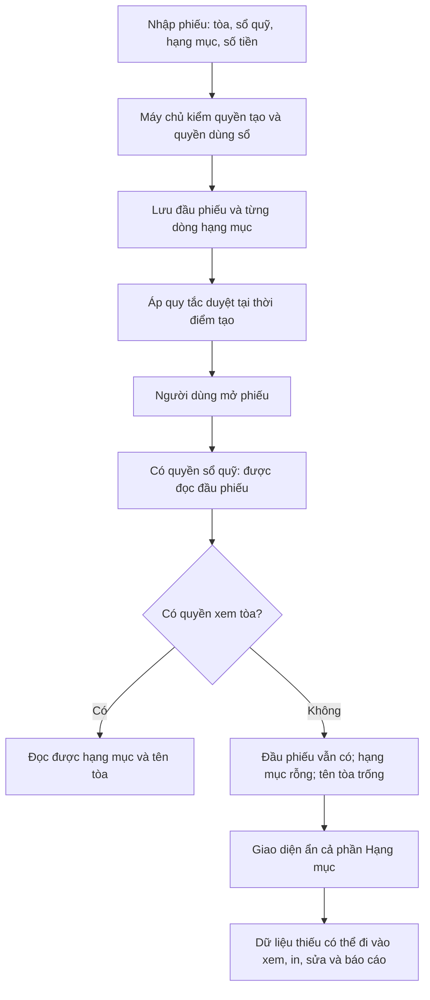

# Kiểm tra luồng phiếu hiện được nhưng hạng mục bị ẩn

Ngày kiểm tra: 28/09/2026, khoảng 15:40 giờ Việt Nam. Mã nguồn đối chiếu: `e498f10d` trên checkout hiện tại. Đây là báo cáo chỉ đọc; chưa sửa quyền, dữ liệu nghiệp vụ hay phát hành phần mềm.

Kế hoạch xử lý nằm tại [plan chi tiết](../superpowers/plans/2026-09-28-quyen-doc-chi-tiet-phieu.md).

Quyết định người dùng trong phiên: giữ quyền xem mọi phiếu thuộc sổ đã cấp, kể cả người khác tạo; phiếu đã được phép xem phải hiện đủ hạng mục và tên tòa, không mở dữ liệu khác của tòa.

## 1. Kết luận dễ hiểu

Hãy coi phiếu là một tờ hóa đơn: đầu tờ ghi tổng tiền, phần bên dưới ghi từng món. Hiện hệ thống cho một số người đọc đầu tờ theo quyền sổ quỹ, nhưng lại đòi quyền quản lý tòa để đọc từng món. Vì vậy người dùng thấy phiếu và số tiền, còn hạng mục biến mất.

Đây là sự không đồng nhất giữa các cửa kiểm quyền. Dữ liệu của phiếu được báo lỗi vẫn còn nguyên. Chưa có bằng chứng trong lần kiểm tra này rằng tiền, số dư hoặc hạng mục đã bị sửa mất.

## 2. Bằng chứng của phiếu trong ảnh

| Trường | Giá trị đã kiểm tra trên production |
|---|---|
| ID chính xác | `5af4bc29-6111-4d49-865b-b6894a4d9131` |
| Mã / tên | PC2609103 / mua tinh dầu 950NK |
| Tổ chức | `aaaa0000-0000-4000-8000-000000000001` |
| Tổng tiền / trạng thái | 941.040 đ / Chờ duyệt |
| Sổ quỹ / tòa | TKHIEP / 950NK |
| Người tạo / thời gian | NATHAN / 22/09/2026 16:32 |
| Hạng mục thực tế | Thu chi khác, số lượng 1, đơn giá 941.040 đ |
| Phạm vi dữ liệu | Phiếu, dòng hạng mục và danh mục cùng tổ chức; không phải hạng mục hạn chế |
| Chứng từ bổ sung | Không có bản ghi bổ sung; ảnh gốc vẫn thuộc phiếu |

Có một phiếu khác cũng mang mã PC2609103. Vì vậy mọi kiểm chứng và thao tác về sau phải dùng ID cùng tổ chức, không dùng riêng mã hiển thị.

Kết quả dưới role `authenticated`, đặt định danh NATHAN trong transaction chỉ đọc:

| Điều kiện | Kết quả |
|---|---:|
| Là admin / super admin | Không / Không |
| Có quyền đọc sổ TKHIEP | Có |
| Có quyền đọc tòa 950NK | Không |
| Số phiếu đọc được theo ID | 1 |
| Số dòng hạng mục đọc được | 0 |
| Số dòng tòa nhà đọc được | 0 |

### Vì sao NATHAN thấy được phiếu chi của tòa khác?

Catalog live xác nhận policy `income_expenses_select_fund_member` cho đọc phiếu chưa xóa khi một trong ba sổ (`account_id`, `change_account_id`, `rounding_account_id`) nằm trong `accessible_account_ids()`. Hàm này hợp nhất sổ có `accounts.user_id = auth.uid()` và sổ được phân công possession. Không có điều kiện bắt buộc người xem phải là người tạo phiếu.

Kiểm riêng TKHIEP cho thấy **NATHAN là user sở hữu sổ theo trường `accounts.user_id`**, đồng thời có binding **CUSTODIAN** đang hiệu lực từ 23/07/2026; membership ACTIVE và binding chưa có ngày kết thúc. Vì thế phiếu do người khác tạo nhưng gắn TKHIEP vẫn có thể được NATHAN đọc, sau các chốt tổ chức/hạn chế. Tên sổ TKHIEP không quyết định chủ thể có quyền; các trường phân quyền mới quyết định.

“Quản lý” không phải một giấy phép chung để xem mọi phiếu của mọi tòa. Trường hợp này đi qua sổ được cấp. “Người tạo” cũng không phải một policy SELECT độc lập; ngoại lệ cho người tạo ở chốt hạng mục hạn chế không thay thế yêu cầu có đường đọc cha.

Lưu ý cho kiểm thử thu hồi: chỉ đóng binding CUSTODIAN **chưa thu hồi được quyền đọc** nếu user vẫn ở trường chủ sổ. Phải kiểm riêng cả hai đường. Lần audit không thay chủ sổ, binding hoặc quy tắc này.

Trình duyệt CRM đang mở đăng nhập NG TÂM. Khi mở đúng ID bằng tab riêng, giao diện hiển thị **950NK**, **Thu chi khác**, **941.040 đ**, kỳ **09/2026**. Đây là kiểm tra chỉ đọc của phiên hiện tại; không chứng minh tài khoản trong ảnh ban đầu là NG TÂM hay NATHAN.

## 3. Phạm vi ảnh hưởng đã đo

Phạm vi phép đo: **NATHAN**, tổ chức thật, mọi ngày, `deleted_at IS NULL`. Đọc danh sách dưới RLS rồi đối chiếu số hạng mục thật bằng truy vấn quản trị chỉ đọc, chia nhóm ID. Không dùng trang đầu PostgREST làm tổng.

| Chỉ tiêu | Số lượng |
|---|---:|
| Phiếu NATHAN đọc được | 3.009 |
| Phiếu trả về không có hạng mục | 774 |
| Trong đó dữ liệu thật vẫn có hạng mục | **769** |
| Trong đó dữ liệu thật không có dòng hạng mục | 5 |
| Phiếu bị ẩn tên tòa | 769 |
| Phiếu thiếu hạng mục trong tháng 09/2026 | **133** |
| Phiếu thiếu hạng mục đã duyệt | 721 |
| Phiếu thiếu hạng mục chờ duyệt | 10 |
| Phiếu thiếu hạng mục đã hủy | 38 |

Các con số là ảnh chụp tại thời điểm kiểm tra, không phải thống kê cho mọi tài khoản. Chưa đo toàn bộ người dùng. Không diễn giải tổng tiền của các phiếu này thành thiệt hại hay chênh lệch sổ sách.

Cần phân biệt **không đọc được dòng** với **thật sự không có dòng**. Production còn có chứng từ hệ thống `adjustment.close_coc` không có item nhưng tổng tiền khác 0, và các phiếu cũ tổng 0. Không được tự điền hạng mục, sửa tổng hoặc dùng quy tắc “mọi phiếu phải có ít nhất một dòng” để chữa dữ liệu hàng loạt.

## 4. Luồng hiện tại

### Tạo phiếu và chờ duyệt

- Quyền **tạo cho tòa** và quyền **xem tòa** là hai quyền khác nhau. Writer canonical kiểm quyền tạo, phạm vi tổ chức/tòa, quyền dùng sổ, hạng mục và payload; không thể kết luận chỉ cần có sổ là tạo được mọi phiếu.
- Một số đường batch/import dùng lớp tương thích, cần kiểm cùng ma trận nhưng không đồng nhất máy móc với canonical.
- Nhật ký phiếu này ghi `CREATED_DRAFT`, lý do chung “hạng mục đặc biệt hoặc chi vượt ngưỡng”. Hạng mục hiện tại có `force_approval=false`; chưa tái dựng cấu hình lịch sử ngày 22/09 nên chưa kết luận chính xác nhánh nào đã đưa phiếu vào chờ duyệt.
- Bộ máy chi theo cam kết/trần mới được bật sau ngày tạo phiếu. Không dùng cấu hình bật 27/09 để giải thích ngược trạng thái sinh 22/09. Thay đổi quyền đọc không được đổi quy tắc duyệt.

### Đọc phiếu và hạng mục

- `income_expenses` cho phép nhiều đường đọc: quyền tòa, quyền sổ nguồn/sổ tiền thối/sổ làm tròn, người nhận lương, quản lý lợi nhuận, cổ đông; sau đó còn các chốt tổ chức và hạng mục hạn chế.
- `income_expense_items` lại đòi admin/super admin hoặc `can_access_building()` ngoài điều kiện thấy phiếu cha. Các đường đọc theo sổ/người nhận không được kế thừa đầy đủ.
- Danh mục tên hạng mục có quyền riêng. Mở được dòng hạng mục chưa chắc đọc được tên danh mục; đây là ca cần kiểm thêm, không phải nguyên nhân của dòng bị mất hoàn toàn trong ảnh.
- Nhật ký thao tác đã có mẫu đúng trong repo: dòng lịch sử đọc theo phiếu cha được nhìn thấy. Có thể theo tiền lệ này cho nội dung phiếu, giữ nguyên chốt tổ chức/nhạy cảm.

## 5. Bề mặt và rủi ro liền kề

| Bề mặt | Phát hiện | Mức bằng chứng |
|---|---|---|
| Danh sách / popup / mobile / trang riêng | `items=[]` làm phần hạng mục biến mất | Source + RLS thực tế |
| Tên tòa | Join tòa trả rỗng dù phiếu có `building_id` | Source + RLS thực tế |
| Lỗi tải dữ liệu | List log lỗi item rồi tiếp tục; trang riêng bỏ qua lỗi item | Source, chưa gây lỗi mạng trên phiên thật |
| In phiếu | Tải dữ liệu riêng; tự gọi in khi có phiếu, chưa kiểm đủ dòng | Source, chưa xuất bản in |
| Form sửa / sao chép | Lấy `src.items` làm dữ liệu gốc; nếu gốc thiếu thì bản sao cũng thiếu | Source |
| Sửa hạng mục | Khi gửi mảng mới, máy chủ có đường thay toàn bộ items. Có nguy cơ thay dữ liệu từ bản đọc thiếu nếu actor đủ quyền sửa | Source; **chưa có bằng chứng đã xảy ra** |
| Sửa metadata với items rỗng | Schema form yêu cầu ít nhất một dòng, nên có thể chặn lưu; không phải cứ mở form là dữ liệu bị xóa | Source |
| Duyệt phiếu | Nút/route legacy và V2 kiểm quyền khác nhau; cần kiểm theo writer thật và feature route | Source; chưa kết luận có vượt quyền |
| Chứng từ bổ sung / lịch sử sửa | Hàm đọc bổ sung đòi quyền tòa; revisions dùng cùng hàm | Source + catalog live; phiếu đích không có supplement |
| File bổ sung | Storage dùng hàm đọc bổ sung; sửa helper có thể ảnh hưởng quyền tải file | Source |
| Báo cáo | Một số nhánh fallback tổng tiền khi thiếu items, mất nhóm hoặc kỳ; `items!inner` có thể loại phiếu khỏi tập đọc | Source; chưa đo sai số báo cáo thực tế |
| Cache / realtime | Popup giữ object được chọn; refetch list chưa chắc cập nhật popup. Realtime item chưa phủ mọi key in/batch | Source; chưa E2E thu hồi quyền |
| Phân trang | List item và trang riêng có đường chưa phân trang; batch list đã dùng fetchAllRows | Source; chưa đo cap gây thiếu cho phiếu này |

Việc `items` bị ẩn không làm DB tự xóa dòng hoặc tự sửa số dư. Sai báo cáo cần chứng minh bằng cùng người dùng, cùng bộ lọc, cùng kỳ và cùng chính sách đọc; không suy ra từ 769 phiếu.

## 6. Neo mã nguồn phục vụ triển khai

Các đường dẫn và số dòng thuộc checkout đã kiểm; phải đọc lại sau rebase.

| Nội dung | Neo |
|---|---|
| Quyền đọc theo sổ | `supabase/migrations/20260703161000_ie_select_policies_setbased.sql:61` |
| Sổ theo chủ sổ / possession | `supabase/migrations/20260802200000_retire_legacy_account_sharing.sql:22` |
| Quyền đọc item thừa điều kiện tòa | `supabase/migrations/20260710140000_rls_initplan_wrap_remaining.sql:108` |
| Tiền lệ lịch sử kế thừa phiếu cha | `supabase/migrations/20260710130000_security_cross_tenant_hotfix.sql:31` |
| List tải item / fallback rỗng | `src/hooks/income-expenses/queries.ts:427`, `:524` |
| Trang riêng bỏ qua lỗi item | `src/hooks/useVoucherDetail.ts:36` |
| Popup ẩn hạng mục | `src/components/income-expenses/IncomeExpenseDetailDialog.tsx:503` |
| Trang riêng ẩn hạng mục | `src/pages/payments/VoucherDetailPage.tsx:210` |
| Form dùng item gốc | `src/components/income-expenses/IncomeExpenseForm.tsx:406` |
| Form bắt ít nhất một dòng | `src/lib/incomeExpenseValidation.ts:50` |
| Đọc/ghi bổ sung dùng chung helper | `supabase/migrations/20260910042229_income_expense_supplements_v1.sql:120`, `:232` |
| Mẫu thiết kế lịch sử reader không bypass RLS | `supabase/migrations/20260920192452_shared_income_expense_action_snapshot.sql:19` |
| Mẫu lịch sử kiểm đủ item bằng số dòng thật | `supabase/migrations/20260920205323_contract_settlement_financial_context.sql:68` |

Hai mẫu reader cuối bảng đã bị migration `20260921085952_restore_before_contract_settlement.sql` gỡ sau đó. Chúng chỉ là tham khảo thiết kế; không được giả định RPC/role đó đang tồn tại hoặc gọi được. Giải pháp cần role/RPC mới với catalog/ACL và test riêng.

Review còn phát hiện cần tránh siết membership chỉ ở reader con: các resolver quyền cha hiện kiểm `status='ACTIVE'`, không đồng nhất mọi điều kiện `valid_to`/`revoked_at`. Phải giữ parity với RLS cha trong hạng mục này và đo riêng; nếu muốn hardening thời hạn, sửa thống nhất quyền cha sau một quyết định riêng.

## 7. Giới hạn xác minh

- Đã đọc source, so catalog production, đo RLS dưới `authenticated` trong transaction READ ONLY và ROLLBACK, và mở đúng phiếu trên trình duyệt phiên NG TÂM.
- Kiểm RLS bằng đặt claims không thay thế đăng nhập JWT thật của NATHAN qua PostgREST. Chưa có E2E cho vai NATHAN, in, sửa, duyệt hoặc thu hồi quyền.
- Chưa xác nhận tài khoản của ảnh ban đầu; chưa đo mọi người dùng; chưa xác minh số tiền sai trên báo cáo; chưa tái dựng quyền/cấu hình duyệt tại thời điểm phiếu được tạo.
- Chưa thay dữ liệu hoặc quyền production. Những đề xuất phía dưới là kế hoạch để review và thử trên TEST/DEMO trước.
