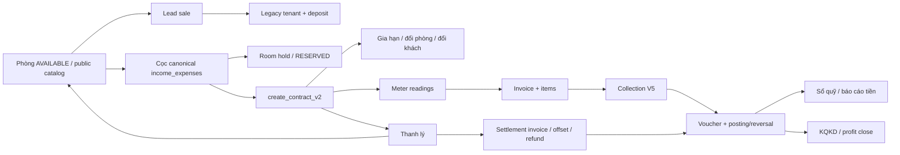

# Audit vòng đời khách hàng và dòng tiền

**Ngày chốt:** 2026-08-13

**Commit đọc cuối:** `931eb9e78ceed2f7ffd5513d67fc7e4c14bafd7e`

**Phạm vi:** phòng trống -> sale/lead -> cọc -> hợp đồng -> chỉ số -> hóa đơn -> thu tiền -> sổ quỹ -> báo cáo/lợi nhuận -> thanh lý.

**Ngoài phạm vi:** thu/chi vận hành độc lập; audit này chỉ theo dòng tiền và trạng thái phát sinh từ khách thuê.

**Tính chất:** snapshot read-only; không sửa code, migration hay dữ liệu production.

> **TÁI KIỂM 2026-09-01 (HEAD `485577a2`, 128 commit sau audit):** toàn bộ 26 finding đã được kiểm chứng lại
> đối chiếu code hiện tại + đo lại production. Kết quả và **plan cập nhật** nằm ở **§0** ngay dưới đây.
> Nội dung §1-§12 giữ nguyên làm snapshot lịch sử 13/08; con số nào đã đổi thì §0.3 là bản đúng.

## 0. Tái kiểm 2026-09-01 và plan cập nhật

**Phương pháp tái kiểm:** 5 luồng kiểm chứng code độc lập (mỗi finding tra `git log 931eb9e7..HEAD` từng file
+ đọc bản hiện hành trong working tree/migration), cộng đo lại production read-only qua Management API trên
org thật `aaaa0000-0000-4000-8000-000000000001`. Browser/E2E không chạy trong đợt tái kiểm này.

### 0.1 Kết luận điều hành của đợt tái kiểm

- **22/26 finding CÒN NGUYÊN, 4 finding ĐÃ SỬA MỘT PHẦN (P1-02, P1-08, P1-16, P2-01), 0 finding đóng hẳn.**
  128 commit sau audit tập trung vào lương V5.1, network-center, copilot, hoàn cọc/bỏ cọc, chốt lợi nhuận
  theo nhà — **không commit nào chạm vào các writer/reader bị nêu tên**, trừ vùng hoàn cọc và deposits.
- **Xấu đi rõ nhất: chỉ số trùng (P1-04).** Từ 8 nhóm lên **57 nhóm** (55 nhóm khác chỉ số cuối), trong đó
  **50 nhóm phát sinh ngay trong kỳ 08/2026**. Đây không còn là tồn kho lịch sử mà là lỗi đang chảy máu theo
  từng kỳ lập hóa đơn; 1.208 reading vẫn 100% APPROVED (auto-approve cứng trong hook).
- **Xấu đi thứ hai: cọc chưa gắn hợp đồng** từ 2 phiếu/7tr lên **13 phiếu/48,55tr**, trong khi bảng
  `reservation_hold_deadlines` (tính năng "hạn làm hợp đồng" ship 22/08 để quản đúng loại phiếu này) đang có
  **0 dòng** — công cụ đã có nhưng vận hành chưa dùng.
- **Cải thiện thật: kỷ luật hồ sơ thanh lý.** 46 hợp đồng thanh lý mới (64→110 TERMINATED) **đều có hồ sơ**
  (41→87); nhóm thiếu hồ sơ đứng nguyên ở 23 ca legacy, 8 phiếu hoàn POSTED 23.737.100đ không đổi. Nhưng đây
  là cải thiện nhờ vận hành/đường đi mới — hai block `EXCEPTION WHEN OTHERS` nuốt lỗi trong code **vẫn còn nguyên**.
- **Cải thiện: công nợ kỳ cũ** (≤08/2026) từ 57 hóa đơn/161,7tr xuống 43/108,1tr. Kỳ 09/2026 đã lập 210 hóa
  đơn ngay 01/09 (1,07 tỷ phải thu mới — bình thường đầu kỳ), còn 35 hợp đồng chưa lập kỳ 09 cần theo dõi.
- **Hoàn cọc V2 (Plan 2) đã ship phần writer** (đợt 1/2/3/5/6 ngày 28/08: unique thật theo termination,
  dedupe xuyên version, chỉ hồ sơ APPROVED/COMPLETED mới sinh phiếu, khóa FOR UPDATE trước preview, chu trình
  phòng 6A) nhưng **obligation V2 vẫn 0/0 — chưa ai dùng**; writer legacy `termination.refund` vẫn sống và đẻ
  thêm phiếu (13→19 phiếu, 37,7tr→55,5tr). Đợt 4 (khóa đường cũ) đang TẠM DỪNG theo quyết định chủ — chừng
  nào chưa nối lại thì rủi ro hoàn-hai-lần của P1-08 chỉ giảm, không hết.

### 0.2 Bảng trạng thái 26 finding (tái kiểm 01/09)

| Finding | Trạng thái 01/09 | Ghi chú kiểm chứng |
|---|---|---|
| P1-01 Lead 3 request rời, model legacy | **CÒN NGUYÊN** | `ConvertLeadDialog.tsx` 0 commit từ audit; vẫn tenant→deposit legacy→status, không RPC `convert_lead*`; thêm lỗi phụ: nút submit không disable khi đang tạo tenant |
| P1-02 Cọc giữ chỗ không atomic, hold fail-open | **SỬA MỘT PHẦN** | `hold_until` nay có bảng `reservation_hold_deadlines` + `set_reservation_hold_terms_v1` (22/08). Nhưng orchestration giờ **6 request rời** (thêm ảnh/sổ quỹ/hạn), `tryPlaceRoomHold` fail-open y nguyên, hold kỹ thuật vẫn cứng 24h |
| P1-03 Cọc khách cũ gắn được HĐ khách mới | **CÒN NGUYÊN** | `useDeposits.ts` + `create_contract_v2` + trigger auto-link đều 0 đổi; không migration nào thêm kiểm identity |
| P1-04 Chỉ số không single writer | **CÒN NGUYÊN — XẤU ĐI MẠNH** | Code y nguyên (raw insert APPROVED cứng, không unique meter+kỳ, check-then-insert 2 nơi). Production: 8→**57 nhóm trùng**, 50 nhóm mới trong kỳ 08/2026 |
| P1-05 Raw invoice fallback | **CÒN NGUYÊN** | `useInvoices.ts:706-770` vẫn raw insert header rồi items 2 request khi gặp fallback signal; đi vòng qua mọi guard của `create_invoice_v1` |
| P1-06 Công nợ thanh lý client quyết | **CÒN NGUYÊN** | Bản mới nhất của impl (`20260822093000`, Plan 2) vẫn `v_debt := COALESCE(p_outstanding_debt,0)`; TerminateDialog vẫn bỏ isLoading/isError |
| P1-07 Writer thanh lý nuốt lỗi hồ sơ | **CÒN NGUYÊN (code)** | Hai block `EXCEPTION WHEN OTHERS THEN RAISE WARNING` vẫn còn (move-out bản 20260822093000:381, forfeit bản 20260731070000:4105). Vận hành đã tốt: 46 thanh lý mới đều có hồ sơ; 23 ca legacy đứng nguyên |
| P1-08 Hai refund writer song song | **SỬA MỘT PHẦN** | Hardening 28/08 (`20260828090000`): unique `ux_tro_phieu_song` theo termination, dedupe xuyên version, gỡ link phiếu hủy, gate APPROVED/COMPLETED, khóa trước preview. **Chưa đóng:** move-out vẫn tự đẻ phiếu legacy; writer V2 không nhận diện phiếu legacy; V2 chưa ai dùng (0 obligation); đợt 4 tạm dừng |
| P1-09 Hoàn tiền hóa đơn sai nghĩa vụ | **CÒN NGUYÊN** | Cap vẫn toàn bộ `paid_amount`; hook vẫn drop ngày/sổ; mismatch `refundVoucherId` vs `voucher_id` vẫn làm reason không ghi, client nhận null. Thêm lệch mới: luồng "quyền duyệt = duyệt+chi luôn" (26/08) không phủ phiếu hoàn |
| P1-10 BC tiền cọc đọc bảng legacy rỗng | **CÒN NGUYÊN** | Vẫn `.from("deposits")` + RPC summary đọc `public.deposits`; chỉ thêm fetchAllRows (phân trang bảng rỗng). Canonical hiện 384 phiếu/1,486 tỷ vs báo cáo 0đ |
| P1-11 Tiền thừa không đọc credit ledger | **CÒN NGUYÊN** | Vẫn `paid_amount > total_amount` trên invoices; 0 hit `customer_credit_lots` trong hooks/pages báo cáo. Ledger hiện 11 lot/9.302.666đ |
| P1-12 Đổi phương thức legacy 2 write | **CÒN NGUYÊN** | Hook vẫn `ie_compat_update_pending_v2` + raw update `payments`; RPC atomic `update_invoice_payment_method_v1` vẫn 0 caller |
| P1-13 Transfer thiếu chốt org, không quyết toán | **CÒN NGUYÊN** | `transfer_contract_impl` vẫn chỉ kiểm UUID tồn tại, không so `organization_id` (SECURITY DEFINER nên RLS không cứu); không đụng deposit/công nợ/credit |
| P1-14 Gia hạn không term hiệu lực, không lock | **CÒN NGUYÊN** | Vẫn không `FOR UPDATE`, update tại chỗ; không có bảng `contract_terms` ở đâu cả |
| P1-15 Không có billing scheduler | **CÒN NGUYÊN** | vercel.json vẫn chỉ 2 cron lương; `invoice_auto_generate_next` vẫn 0 consumer; FAQ vẫn hứa tự sinh; flow thật vẫn lặp client từng phòng. Thiếu kỳ 06-08 tăng nhẹ: 18 HĐ/40 kỳ/163,7tr |
| P1-16 `create_invoice_v1` thiếu guard lifecycle | **SỬA MỘT PHẦN** | Đã có: parity tổng server-side, partial-unique (contract,month) active, status theo `organization_invoice_settings`, idempotency. Vẫn thiếu: kiểm contract ACTIVE, `p_room_id = c.room_id`, billing_month trong thời hạn, dates/debt vẫn client gửi. Fallback P1-05 đi vòng qua tất cả |
| P2-01 Queue hoàn cọc stale realtime | **SỬA MỘT PHẦN** | `tt-termination-queue` đã vào descriptor `income_expenses` (c75ba445) + test. Còn thiếu ở descriptor `contract_terminations` — hồ sơ mới từ máy khác vẫn không đẩy queue |
| P2-02 Public phòng trống trả sample khi rỗng | **CÒN NGUYÊN** | `PhongTrongPage.tsx:43` y nguyên |
| P2-03 Hai nghĩa "lợi nhuận" | **CÒN NGUYÊN** | `ProfitVerificationBar.tsx` 0 đổi; chốt-theo-nhà (27/08) giữ nguyên semantics, không đổi label |
| P2-04 Lịch thanh toán đọc hủy/xóa + cap 1000 | **CÒN NGUYÊN — XẤU ĐI** | Hook duy nhất trong file chưa được vá fetchAllRows; filter phòng vẫn chết. Nguồn giờ 1.421 hóa đơn (84 hủy/xóa), **421 dòng sau cap** (trước: 143) |
| P2-05 Attribution cộng payment reversal | **CÒN NGUYÊN** | `useInvoiceCollectors.ts` vẫn không kiểm `reversed_at`; c75ba445 không chạm file này. Hiện 16 payment đã reversal trong hệ |
| P2-06 BP cộng settlement CANCELLED | **CÒN NGUYÊN** | CTE `settlement_aggregate` vẫn không lọc status; vẫn 4 settlement CANCELLED trong aggregate |
| P2-07 BC transfer đọc `status='TRANSFERRED'` | **CÒN NGUYÊN — LỆCH THÊM** | Vẫn đọc contracts; trong khi `apply_contract_transfer` đã NGƯNG set TRANSFERRED cho ROOM_CHANGE → nguồn cũ ngày càng mù |
| P2-08 MoveOut xóa notes | **CÒN NGUYÊN** | 2 file 0 đổi |
| P2-09 `deposit_paid` giữ giá trị cũ khi hết voucher | **CÒN NGUYÊN — XẤU NHẸ** | Nhánh `RETURN` sớm khi count=0 vẫn còn; số hợp đồng dính tăng 3→5 |
| P2-10 Toggle tự duyệt không nối writer | **CÒN NGUYÊN** | Hai nguồn vẫn lệch (UI default false, writer đọc bảng khác default true); mẫu sửa đã có sẵn ở `utility_ceiling` (28/08) nhưng chưa lan sang invoice |

### 0.3 Số liệu production đo lại 01/09 (so 13/08)

| Chỉ tiêu | 13/08 | 01/09 | Diễn giải |
|---|---:|---:|---|
| Hợp đồng ACTIVE | 269 | 260 | — |
| TERMINATED / có hồ sơ thanh lý | 64 / 41 | 110 / 87 | 46 thanh lý mới đều có hồ sơ; thiếu vẫn đúng 23 ca legacy |
| Refund POSTED trên HĐ thiếu hồ sơ | 8 / 23.737.100đ | 8 / 23.737.100đ | Không đổi (thêm 3 phiếu APPROVED chưa posted, tổng nhóm 11/33,25tr) |
| Refund legacy `termination.refund` active | 13 / 37.722.600đ | 19 / 55.489.234đ | Writer legacy vẫn đẻ phiếu |
| Obligation/refund V2 | 0 / 0 | 0 / 0 | Đường mới ship 28/08 nhưng chưa ai dùng |
| Cọc canonical active (item DEPOSIT, APPROVED) | 331 / 1.288.836.521đ | 384 / 1.486.086.521đ | Báo cáo cọc legacy vẫn 0đ |
| Cọc chưa gắn hợp đồng | 2 / 7.000.000đ | **13 / 48.550.000đ** | Xấu đi; `reservation_hold_deadlines` 0 dòng — công cụ có, chưa dùng |
| Chỉ số active / APPROVED | 979 / 100% | 1.208 / 100% | Auto-approve cứng vẫn nguyên |
| Nhóm trùng (meter, kỳ) / khác chỉ số cuối | 8 / 6 | **57 / 55** | 06: 1, 07: 6, **08: 50 nhóm** — bùng phát trong kỳ |
| Công nợ mở kỳ ≤ 08/2026 | 57 / 161.699.900đ | 43 / 108.063.300đ | Cải thiện nhờ thu |
| Công nợ mở tổng (gồm kỳ 09 vừa lập 01/09) | — | 253 / 1.178.251.300đ | 210 hóa đơn kỳ 09 = 1,07 tỷ, bình thường đầu kỳ |
| HĐ active thiếu kỳ 06-08/2026 | 15 HĐ / 39 kỳ / 152,3tr | 18 HĐ / 40 kỳ / 163,7tr | Chưa xử lý, nhích thêm; kỳ 09 còn 35 HĐ chưa lập (đầu tháng) |
| Hóa đơn âm | 5 | 4 | — |
| Thu thừa: liability UI / trần server | 51 / 2.028.161đ / 283.585.995đ | 51 / 2.028.161đ / 283.585.995đ | Y nguyên |
| Credit lot active / còn lại | 14 / 5.588.666đ | 11 / 9.302.666đ | BC Tiền thừa vẫn không đọc nguồn này |
| Settlement trùng (contract, tháng) active | 1 nhóm | 2 nhóm | Xấu nhẹ |
| Settlement CANCELLED vào Business Performance | 4 / 4.232.500đ | 4 | Y nguyên |
| Nguồn Lịch thanh toán 365 ngày / hủy-xóa / sau cap 1.000 | 1.143 / 73 / 143 | 1.421 / 84 / **421** | Cap ngày càng cắt sâu |
| `deposit_paid > total_deposit` | 5 / 7,8tr | 3 / 5,8tr | 2 ca đã xử lý |
| `deposit_paid > 0` không còn item DEPOSIT | 3 | 5 | Xấu nhẹ |
| TERMINATED còn công nợ mở | 14 / 58,6tr | 17 HĐ | — |
| Room drift | 0 | 1 phòng active contract, status ≠ OCCUPIED | Ca lẻ, cần soi tay |

Ghi chú so sánh: số 01/09 đo trực tiếp SQL service-role (Management API, read-only); vài dòng audit cũ đo qua
PostgREST/JWT theo shape UI nên tiêu chí có thể lệch nhẹ (đã ghi rõ tiêu chí trong từng dòng ở trên khi lệch).

### 0.4 Plan cập nhật (thay §9 cho đợt tới)

Thứ tự ưu tiên xếp lại theo dữ liệu 01/09 — cái gì đang chảy máu xếp trước:

**Ngay (tuần này):**

1. **P1-04 chỉ số trùng — khẩn cấp số 1.** 50 nhóm mới chỉ trong kỳ 08 nghĩa là mỗi kỳ lập hóa đơn đang tự đẻ
   duplicate. Làm theo đúng khuyến nghị gốc: unique partial active `(organization_id, meter_id,
   settlement_month)` sau khi repair, RPC meter+invoice một transaction. Repair trước 57 nhóm (phân loại
   cùng số/khác số, hóa đơn nào đã ăn số nào).
2. **Billing gap:** xác nhận từng kỳ trong 40 kỳ 06-08 thiếu (lập bù/miễn/đóng băng) + rà 35 HĐ chưa có kỳ 09
   trước hạn thu. Bỏ hoặc disable toggle automation giả (P1-15) nếu chưa xây scheduler.
3. **Nối lại đợt 4 hoàn cọc (cần quyết định của chủ):** writer legacy vẫn đẻ phiếu (19 phiếu active) trong khi
   V2 đã hardening nhưng 0 người dùng. Chừng nào hai writer song song, P1-08 chưa đóng. Tối thiểu: resolver V2
   phải nhận diện phiếu legacy theo contract trước khi cho tạo.
4. **Đưa 13 phiếu cọc chưa gắn vào nề nếp:** review từng phiếu (link/cancel), bật dùng
   `reservation_hold_deadlines` trong vận hành — bảng đang 0 dòng.
5. **P1-06 + P1-07:** server recompute công nợ thanh lý sau khi khóa contract; bỏ 2 block nuốt lỗi hồ sơ.
   Kỷ luật vận hành hiện tốt nhưng code vẫn fail-open — sửa lúc đang yên là rẻ nhất.

**Kế tiếp (2-4 tuần) — giữ nguyên các mục §9 chưa làm, nhấn thêm:**

6. Hai báo cáo liability (P1-10 đọc item DEPOSIT canonical; P1-11 đọc `customer_credit_lots`) — lệch giờ đã
   1,486 tỷ vs 0đ.
7. Refund hóa đơn (P1-09): resolver nghĩa vụ theo nguồn (hóa đơn âm / credit lot), sửa mismatch response key,
   và quyết định phiếu hoàn có đi luồng "duyệt = chi luôn" (26/08) hay không — hiện lệch semantics.
8. P1-12: chuyển hook sang `update_invoice_payment_method_v1` (RPC có sẵn, 0 caller).
9. P2-04 Lịch thanh toán: giờ mất 421 dòng sau cap — thay bằng read model server-side.
10. P1-16 phần còn thiếu: kiểm contract ACTIVE + room khớp contract + billing_month trong thời hạn; rồi bỏ raw
    fallback P1-05 (fail closed).
11. P2-10: nối toggle vào `organization_invoice_settings` theo đúng mẫu utility-ceiling 28/08.
12. P1-13/P1-14: same-org check cho transfer (một dòng WHERE), lock + expected version cho renew; bảng
    `contract_terms` đi sau.
13. Các mục nhỏ chắc chắn: P2-02 (bỏ sample), P2-05 (lọc reversed_at), P2-06 (lọc status settlement),
    P2-01 phần còn lại (key vào descriptor `contract_terminations`), P2-08 (preserve notes), P2-09 (recompute
    về 0 + tách opening balance), P2-07 (đọc `contract_transfers`), P2-03 (đổi label).

**Data repair (§10 vẫn đúng, cập nhật quy mô):** 57 nhóm meter (không còn 8), 23 hồ sơ thanh lý legacy,
13 cọc chưa gắn (không còn 2), 5 contract `deposit_paid` không chứng từ (không còn 3), 2 nhóm settlement
trùng, 40 kỳ billing thiếu.

---

Hệ thống hiện **đủ nền tảng để vận hành khách thuê thật**, nhưng chưa phải một quy trình khép kín đồng nhất từ sale đến thanh lý. Hai đoạn mạnh nhất là:

1. `create_contract_v2`: tạo hợp đồng, khách, dịch vụ, nhận/gắn cọc và hóa đơn đầu trong một transaction có khóa, quyền, idempotency và hậu kiểm;
2. `record_invoice_collection_v5` + posting/reversal: thu tiền, phân bổ, tiền thừa/thối/làm tròn, phiếu và bút toán nằm trong một writer atomic có hoàn tác có lineage.

Các lỗ hổng lớn nằm ở **mối nối giữa các đoạn**, không nằm ở hai lõi trên:

- Sale/lead vẫn chuyển sang mô hình `tenants + deposits` legacy, trong khi cọc/hợp đồng thật dùng `customers + income_expenses + contract_customers`.
- Cọc giữ chỗ đặt hold và ghi tiền bằng các request rời; hold fail-open và thời hạn khách thỏa thuận không phải thời hạn khóa kỹ thuật.
- Chỉ số và hóa đơn không có single writer; production đã có 8 nhóm chỉ số trùng, trong đó 6 nhóm khác chỉ số cuối.
- Không có billing scheduler thật dù Settings/FAQ nói có tự sinh kỳ tiếp. Snapshot có 15 hợp đồng active thiếu tổng 39 kỳ hóa đơn tháng 06-08/2026, nominal rent chưa lập hóa đơn `152.300.000đ`.
- Nhượng hợp đồng chỉ thay khách đại diện nhưng không quyết toán cọc, công nợ, credit và hóa đơn của khách cũ; đường SECURITY DEFINER cũng không kiểm khách mới cùng tổ chức.
- Gia hạn cập nhật giá thuê/cọc ngay trên cùng một row, không có hiệu lực theo kỳ và không khóa đồng thời; invoice lập muộn có thể đọc điều khoản của kỳ mới cho kỳ cũ.
- Ngay cả `create_invoice_v1` canonical cũng chưa ràng buộc contract status, phòng đúng của hợp đồng và kỳ nằm trong thời hạn billing; người gọi vẫn quyết định period, dates, debt sources và item amounts.
- Thanh lý tin số công nợ do client gửi lên, đồng thời nuốt lỗi ghi hồ sơ thanh lý. Production có 64 hợp đồng `TERMINATED` nhưng chỉ 41 hồ sơ thanh lý; 23 hợp đồng thiếu hồ sơ, trong đó 8 phiếu hoàn đã POSTED tổng `23.737.100đ`.
- Flow hoàn cọc mới có cơ chế đối chiếu cọc thật tốt, nhưng đang tồn tại song song với phiếu hoàn legacy do chính writer thanh lý sinh; chưa có khóa duy nhất theo termination/contract nên có khả năng sinh lần hai.
- Kênh public phòng trống biến phản hồi thành công nhưng rỗng thành dữ liệu mẫu, có thể khiến sale chào phòng không có thật.
- Báo cáo Lịch thanh toán đọc cả hóa đơn hủy/xóa và không phân trang: nguồn production hiện vượt cap mặc định 1.000 dòng, làm 141/275 phòng hiển thị mốc lập hóa đơn cũ hơn thực tế.
- Màn Hoàn tiền hóa đơn đang sai cả bất biến số tiền lẫn hợp đồng UI/server: hóa đơn âm cần hoàn luôn bị server từ chối, còn 51 hóa đơn thu thừa lại có trần server cho phép cao hơn nghĩa vụ thật `281.557.834đ`.
- Hai báo cáo nghĩa vụ khách đọc sai nguồn: Danh sách tiền cọc trả `0đ` từ bảng legacy trong khi ledger canonical đang giữ `1.288.836.521đ`; Tiền thừa lấy chênh lệch trên hóa đơn thay vì credit còn hiệu lực.
- Đường đổi phương thức thanh toán legacy vẫn là hai write client-side, trong khi 945/985 dòng đang hiển thị có phiếu đã POSTED; RPC atomic đã có nhưng không được caller nào dùng.

### Verdict nghiệp vụ

- **Vận hành thường ngày:** dùng được, đặc biệt từ hợp đồng đã ký đến thu tiền và sổ quỹ.
- **Kiểm soát ngoại lệ:** yếu ở cọc giữ chỗ, chỉ số trùng, hoàn tiền hóa đơn, thanh lý và hoàn cọc.
- **Tính liên tục chu kỳ thu:** chưa đáng tin nếu nhân viên tin toggle tự sinh hóa đơn; hiện phải có checklist/queue thủ công để không bỏ kỳ.
- **Khả năng audit:** tốt ở collection/posting/profit close; chưa kín ở lịch sử lead và hồ sơ thanh lý.
- **Mức ưu tiên:** chưa cần viết lại toàn hệ thống. Cần khóa các writer/refund/report P1 trước, rồi hợp nhất mô hình sale/customer theo lộ trình.

## 2. Phương pháp, nguồn bằng chứng và giới hạn

Thứ tự tin cậy dùng trong audit:

1. baseline/migration SQL, contract manifest và runtime aggregate production read-only;
2. code UI/hook đang được route/caller thật gọi;
3. GitNexus để xác nhận caller/callee TypeScript;
4. UA chỉ dùng như ngữ cảnh lịch sử, **không dùng làm bằng chứng kết luận**.

`gate:graph-freshness -- --nhiem-vu medium-risk` tại HEAD cuối cho kết quả GitNexus `FRESH`, khớp đúng HEAD (`0` commit, `0` file chưa index). UA vẫn stale `217` commit, `596` file đổi, `201` file mới, thiếu `42` migration và thiếu tiểu hệ `services/openclaw-media-gateway`. Vì vậy audit này tự dựng flow từ code/SQL/runtime thay vì tin domain graph.

GitNexus xác nhận caller thật:

- `LeadsPage -> ConvertLeadDialog`;
- `DepositsPage -> CreateDepositDialog`;
- `ContractDetailView` và `ContractsDesktopPage -> TerminateDialog`.

Snapshot production chỉ đọc aggregate của org thật `aaaa0000-0000-4000-8000-000000000001`, không đưa PII vào báo cáo. Browser/E2E chưa chạy; do đó báo cáo không tuyên bố production-ready và không đo được tần suất người dùng thực tế đi qua từng nhánh UI.

## 3. Flow thực tế và nguồn sự thật

| Chặng | Entry/UI thật | Writer chính | Nguồn sự thật | Reversal/đóng trạng thái | Đánh giá |
|---|---|---|---|---|---|
| Phòng trống | `/r/:token`, trang Sale Phòng | RPC catalog + room triggers | `rooms`, active contracts, holding deposit | reconcile phòng | Tốt nội bộ; public empty-state lỗi |
| Lead | `LeadsPage` | nhiều mutation client | `leads`, `tenants`, legacy `deposits` | đổi status lead | Tách khỏi core V2 |
| Cọc giữ chỗ | `DepositsPage`, Quick Deposit | hold RPC rồi IE writer | item `DEPOSIT` trong `income_expenses` | cancel/reconcile | Truth tốt, orchestration yếu |
| Hợp đồng | form hợp đồng | `create_contract_v2` | `contracts`, `contract_customers`, services, deposit links | renew/transfer/terminate RPC | Tạo mới mạnh; renew/tenant transfer yếu |
| Chỉ số | meter screens, tạo hóa đơn | raw DML + RPC lẫn nhau | `meter_readings` | approve/unapprove/delete | Yếu, nhiều writer |
| Hóa đơn | generate invoice | thao tác thủ công theo toà/phòng, RPC canonical có raw fallback | `invoices`, `invoice_items` | cancel/recompute | Khá từng hóa đơn; không có scheduler/backlog control |
| Thu tiền | collect dialogs/batch | `record_invoice_collection_v5` | collection/tender/payment/allocation | `reverse_invoice_collection_v5` | Mạnh nhất |
| Sổ quỹ | phiếu/posting | approval + posting chain | active posting lines | reversal, lock, handover | Mạnh; xem audit tiền riêng |
| Báo cáo/lợi nhuận | Finance reports, Profit Distribution | aggregate + close V2 | `fa_*`, credit/deposit ledgers, profit snapshots/revisions | unlock/reclose/reset | Close mạnh; nhiều reader nghĩa vụ khách sai source/semantics |
| Thanh lý | `TerminateDialog` | move-out/forfeit RPC | contract + invoices + IE + `contract_terminations` | hiện chưa có một aggregate hoàn chỉnh | Rủi ro cao nhất |

## 4. Số liệu production chốt tại thời điểm audit

| Chỉ tiêu | Kết quả |
|---|---:|
| Lead active / legacy deposit active | `0 / 0` |
| Hợp đồng `ACTIVE` đầy đủ customer đại diện/phòng/kỳ hạn/có ít nhất một hóa đơn lịch sử | `269 / 269`; không có phòng mang nhiều active contract, không có nhóm monthly invoice active trùng |
| Hợp đồng active thiếu kỳ hóa đơn tháng 06-08/2026 | `15` hợp đồng / `39` kỳ; `12` hợp đồng thiếu cả ba tháng; riêng 08/2026 thiếu `14` hợp đồng; nominal rent exposure `152.300.000đ`, riêng tháng 08 `54.500.000đ` |
| Gia hạn / chuyển nhượng đã hoàn tất | `48` gia hạn `UPDATE_EXISTING`, chưa có lần đổi giá/cọc; `3` chuyển phòng, `0` chuyển khách |
| Hợp đồng có `deposit_paid > total_deposit` | `5` hợp đồng, tổng phần âm `7.800.000đ`; chưa đủ lineage để quy nguyên nhân cho gia hạn/chuyển nhượng |
| Hợp đồng có `deposit_paid > 0` nhưng không còn item DEPOSIT liên kết | `3`; recompute hiện giữ nguyên giá trị cũ khi không còn item |
| Phiếu cọc canonical active | `331` phiếu, `1.288.836.521đ` |
| Cọc canonical chưa gắn hợp đồng | `2` phiếu, `7.000.000đ` |
| Báo cáo Danh sách tiền cọc legacy / nguồn canonical | `0 phiếu / 0đ` so với `348 phiếu / 1.322.648.633đ` lịch sử canonical |
| Chỉ số active | `979`, toàn bộ `APPROVED` |
| Chỉ số không có `contract_id` | `714` — chưa đủ cơ sở gọi là orphan vì meter/room vẫn có thể xác định scope |
| Nhóm trùng `(meter_id, settlement_month)` | `8`, trong đó `6` nhóm có `current_reading` khác nhau |
| Hóa đơn đang còn phải thu | `57`, tổng `161.699.900đ` |
| Chi tiết công nợ | `APPROVED 10 / 45.663.000đ`; `OVERDUE 42 / 107.383.900đ`; `PARTIAL_PAID 5 / 8.653.000đ` |
| Hoàn tiền hóa đơn | `5` hóa đơn âm; `1` ca actionable `3.662.500đ` luôn bị cap server `0`; `51` hóa đơn thu thừa có liability UI `2.028.161đ` nhưng cap server `283.585.995đ` |
| Báo cáo Tiền thừa / credit ledger | `51` invoice, `44` hợp đồng, `2.028.161đ` so với `14` credit lot, `5.588.666đ`; `41/47` hợp đồng lệch, tổng lệch tuyệt đối `5.827.495đ` |
| Payment legacy đang hiện trên UI | `985` dòng, `3.890.992.597đ`; `945` có voucher POSTED, `39` không có voucher; tất cả vẫn được UI cho đổi phương thức |
| Collector đã reversal vẫn bị cộng | `3` dòng trên `1` hóa đơn, tổng `2.580.000đ` |
| Nguồn Lịch thanh toán 365 ngày | `1.143` hóa đơn; `73` hủy hoặc xóa, tổng `255.683.829đ`; `143` dòng nằm sau cap 1.000 |
| Phòng bị cap làm mốc “đã lên hóa đơn đến ngày” cũ hơn thực tế | `141 / 275` phòng; thêm `1` phòng chỉ có invoice hủy/xóa và `2` phòng bị invoice hủy/xóa đẩy mốc ra xa hơn |
| Hợp đồng có công nợ mở | `40`; `26 ACTIVE / 103.107.700đ`, `14 TERMINATED / 58.592.200đ` |
| Nhóm settlement active trùng hợp đồng + tháng | `1`: `PAID 6.000.000đ` và `OVERDUE 959.500đ` |
| Settlement `CANCELLED` vẫn vào Business Performance | `4` hóa đơn, net `4.232.500đ` (05-07/2026) |
| Hợp đồng `TERMINATED` / có hồ sơ thanh lý | `64 / 41` |
| Hợp đồng terminated thiếu hồ sơ | `23`; `11` có refund active, `12` không có refund active |
| Refund POSTED trên hợp đồng thiếu hồ sơ | `8` phiếu, `23.737.100đ` |
| Refund legacy `termination.refund` | `27` dòng lịch sử; `13` POSTED active, `37.722.600đ` |
| Obligation/refund V2 | `0 / 0` |
| Contract có nhiều refund active | `0` hiện tại |
| Room drift | `0` phòng có active contract sai status; `0` phòng OCCUPIED không active contract |

## 5. Findings ưu tiên

### P1-01 - Lead/sale và cọc thật đang dùng hai mô hình khách hàng khác nhau

**Trạng thái:** code sống; latent trên dữ liệu hiện tại vì production không có lead/deposit legacy active.

`ConvertLeadDialog` lấy toàn bộ phòng bằng `useRooms()` mà không lọc `AVAILABLE`, rồi lần lượt tạo `tenant`, tạo legacy `deposit`, cuối cùng đổi trạng thái lead bằng ba request riêng tại `src/components/leads/ConvertLeadDialog.tsx:65`, `:88`, `:102`, `:117`.

Core hợp đồng V2 lại cố ý để `contracts.tenant_id=NULL` và dùng `customers + contract_customers`; cọc thật dùng item `DEPOSIT` trong `income_expenses`. Vì vậy chuyển lead không tạo ra đúng đối tượng mà form hợp đồng/cọc canonical đang coi là nguồn sự thật.

**Tác động:** mất lineage sale -> customer -> cọc -> hợp đồng; có thể chọn phòng không còn trống; lỗi ở bước cuối để lại tenant/cọc nhưng lead chưa converted; KPI funnel không khớp tiền thật.

**Khuyến nghị:** thay `ConvertLeadDialog` bằng một RPC `convert_lead_to_reservation_v1` atomic, tạo/resolve `customer`, gọi cùng canonical deposit writer, đặt hold và cập nhật lead bằng ID cọc canonical. Đóng DML mới vào bảng `deposits` legacy.

### P1-02 - Cọc giữ chỗ không atomic và room hold fail-open

**Trạng thái:** code sống; chưa thấy double-hold active trong snapshot nhưng lỗi thiết kế chắc chắn.

`CreateDepositDialog` đặt hold trước, sau đó tạo tenant, resolve type/account, tạo phiếu cọc và tùy chọn tạo thưởng sale bằng nhiều request tại `src/components/deposits/CreateDepositDialog.tsx:140`, `:145`, `:167`, `:196`, `:229`.

`tryPlaceRoomHold` coi mọi lỗi `23505` là hold của chính người gọi và cho qua; mọi lỗi khác như writer chưa bật, permission, network hoặc RLS cũng cho qua tại `src/lib/reservationHold.ts:24`, `:34`, `:53`, `:55`. Form chỉ ghi `hold_until` nghiệp vụ vào mô tả phiếu, trong khi khóa kỹ thuật luôn 24 giờ.

**Tác động:** có thể giữ phòng nhưng không có phiếu, có tenant nhưng không có cọc, hoặc thu cọc dù hold writer lỗi. Hai nhân viên vẫn có cửa thu cọc đè khi tín hiệu lỗi không đúng mẫu.

**Khuyến nghị:** một RPC canonical duy nhất tạo customer/tenant bridge nếu cần, hold đúng `hold_until`, phiếu cọc, item, account/posting intent và optional sale-bonus reservation. Chỉ conflict “hold của chính actor với cùng operation” mới replay; lỗi khác fail closed.

### P1-03 - Cọc của khách/phòng cũ có thể bị gắn vào hợp đồng khách mới

**Trạng thái:** latent; production có 2 phiếu chưa link nhưng audit không chứng minh đã có mislink.

Danh sách cọc mồ côi trong UI chỉ lọc theo phòng và `voucher_date <= start_date + 7`, không có lower bound và không kiểm payer/customer tại `src/hooks/useDeposits.ts:43-66`. Trigger legacy lại dùng cửa `start_date - 30` đến `start_date + 7` tại `supabase/baseline/schema.sql:93448` và `:93468`.

`create_contract_v2` kiểm org, phòng, trạng thái, item `DEPOSIT` và voucher chưa dùng, nhưng không kiểm `tenant_id`, `payer_name` hoặc một customer identity thuộc danh sách khách hợp đồng tại `supabase/migrations/20260721090000_contract_create_v2.sql:729`.

**Tác động:** cọc còn treo của khách A có thể được chọn/gắn cho hợp đồng khách B cùng phòng; công nợ cọc và hoàn cọc về cuối vòng đời sẽ sai chủ thể.

**Khuyến nghị:** reservation deposit cần `customer_id` canonical bắt buộc; link RPC phải kiểm customer thuộc hợp đồng. Thống nhất một cửa thời gian server-side và bỏ auto-link legacy theo heuristic sau khi backfill/review 2 phiếu đang treo.

### P1-04 - Chỉ số không có single writer; duplicate đã hiện hữu

**Trạng thái:** hiện hữu trên production.

Hooks tạo đơn/lô raw insert và đánh thẳng `APPROVED`; update/delete raw DML không lọc status tại `src/hooks/useMeterReadings.ts:284`, `:331`, `:448`, `:482`, `:512`. Database chỉ unique `reading_code`, không unique active `(meter_id, settlement_month)`.

`GenerateInvoiceDialog` kiểm tồn tại rồi insert reading trước khi tạo hóa đơn ở request sau tại `src/components/invoices/GenerateInvoiceDialog.tsx:477-518` và `:639`. Đây là check-then-insert có race; nếu hóa đơn fail thì reading vẫn còn, nếu reading fail hóa đơn vẫn có item điện và UI chỉ cảnh báo.

Production đã có 8 nhóm trùng, 6 nhóm khác chỉ số cuối. Toàn bộ 979 reading đều `APPROVED`, cho thấy approval hiện không còn là một control thực tế.

**Khuyến nghị:** RPC `generate_invoice_with_meter_reading_v1` khóa meter + contract, unique partial active `(organization_id,meter_id,settlement_month)`, upsert có expected version và tạo reading + invoice + items trong một transaction. Repair 8 nhóm bằng đối chiếu ảnh/chứng từ trước khi thêm unique constraint.

### P1-05 - Hóa đơn vẫn có raw fallback và đã có settlement duplicate active

**Trạng thái:** code sống; duplicate hiện hữu.

`useInvoices` ưu tiên RPC canonical, nhưng với một số “fallback signal” ở invoice không dùng credit sẽ raw insert header rồi raw insert items trong request thứ hai tại `src/hooks/useInvoices.ts:701-774`.

Nếu insert item lỗi, header hóa đơn đã tồn tại; fallback cũng không cùng transaction với meter reading. Production có một hợp đồng/tháng settlement cùng active: một hóa đơn `PAID 6.000.000đ`, một hóa đơn `OVERDUE 959.500đ`.

**Khuyến nghị:** bỏ raw fallback sau khi xác nhận RPC surface đã deploy; mọi lỗi canonical phải fail closed. Thêm uniqueness nghiệp vụ cho settlement theo một operation/termination thay vì chỉ `(contract, month)`, vì cùng tháng có thể cần nhiều loại settlement hợp lệ nhưng không được trùng cùng mục đích.

### P1-06 - Công nợ thanh lý do client quyết định, server không recompute

**Trạng thái:** blocker nghiệp vụ trên đường đang sống.

`TerminateDialog` chỉ lấy `data` từ `useUnpaidInvoices`, bỏ `isLoading/isError`, rồi truyền `unpaidInvoices || []` tại `src/components/contracts/TerminateDialog.tsx:99`, `:163`, `:176`. Nếu query lỗi hoặc chưa có data, UI có thể coi công nợ bằng 0.

Client cộng `total_amount - paid_amount` rồi gửi `outstandingDebt` lên RPC tại `src/components/contracts/TerminateDialog.tsx:588-615`. Wrapper dùng trực tiếp parameter để tính shortfall tại `supabase/baseline/schema.sql:92609`, rồi impl gán `v_debt := p_outstanding_debt` tại `:92744`; server không recompute canonical sau khi đã khóa contract.

Production đang có 57 invoice còn phải thu `161.699.900đ`; 14 hợp đồng đã terminated vẫn có `58.592.200đ` công nợ mở. Không thể quy toàn bộ số này cho bug, nhưng nó chứng minh thanh lý/công nợ là vùng đang có tác động tiền thật.

**Khuyến nghị:** server sau khi khóa contract phải tự tính nợ từ invoice active, payments/collections/reversal canonical; client chỉ hiển thị preview và gửi expected debt/version để bắt concurrency. UI phải chặn submit khi query loading/error.

### P1-07 - Writer thanh lý nuốt lỗi hồ sơ audit, làm lifecycle kết thúc không có hồ sơ

**Trạng thái:** hiện hữu, tác động production lớn.

Forfeit và move-out đều cập nhật tiền/hóa đơn/hợp đồng trước, sau đó bọc insert `contract_terminations` trong `EXCEPTION WHEN OTHERS THEN RAISE WARNING` tại `supabase/baseline/schema.sql:92356-92378` và `:92951-92966`.

Production có 64 hợp đồng `TERMINATED`, nhưng chỉ 41 hồ sơ; 23 thiếu hồ sơ. Trong 23 ca này, 11 có refund active và 8 refund đã POSTED tổng `23.737.100đ`.

**Tác động:** queue thanh lý/hoàn cọc mất nguồn cha; không thể tái dựng chắc chắn ai duyệt, cơ sở cấn trừ và số hoàn; báo cáo lifecycle có thể coi hợp đồng đã xong nhưng sổ hoàn không nối được hồ sơ.

**Khuyến nghị:** insert hoặc lock/update `contract_terminations` phải là bước bắt buộc đầu transaction; conflict/constraint nào cũng rollback toàn bộ. Backfill 23 hồ sơ từ contract notes, settlement invoices, vouchers và posting lineage, gắn confidence/review status thay vì bịa dữ liệu.

### P1-08 - Hai refund writer song song có thể tạo phiếu hoàn lần hai

**Trạng thái:** latent; production chưa có contract nhiều refund active và V2 obligation hiện bằng 0.

Move-out tự tạo phiếu `system_source='termination.refund'` tại `supabase/baseline/schema.sql:92903-92909`. Sau đó UI refund có thể gọi `record_termination_refund_obligation_v1` rồi `create_termination_refund_voucher_v1` tại `src/components/contracts/TerminationRefundDialog.tsx:53-58`.

Mỗi lần record obligation luôn tăng version tại `supabase/baseline/schema.sql:86607-86620`. Voucher writer chỉ dedupe nếu **chính obligation đó** đã có `voucher_id` tại `:59602-59613`; unique hiện chỉ theo `(termination, version)` và voucher trên obligation, không unique active refund theo termination/contract và không nhận diện phiếu legacy.

**Khuyến nghị:** một refund aggregate duy nhất theo `termination_id`, unique active obligation/refund intent; writer thanh lý chỉ tạo obligation, không tự tạo voucher legacy. Trong transition, resolver phải tìm và nhận phiếu `termination.refund` hiện hữu trước khi cho tạo V2.

### P1-09 - Hoàn tiền hóa đơn dùng sai nghĩa vụ hoàn và làm rơi trường UI/server

**Trạng thái:** code sống; chưa có reservation `invoice.refund` trên production nên chưa chứng minh mất tiền, nhưng cả nhánh âm và nhánh thu thừa đều có thể đi tới lỗi.

`RecordRefundDialog` tính số cần hoàn bằng `max(0, paid_amount - total_amount)`, bắt ngày hoàn và sổ quỹ, rồi mô tả nút là “Lập phiếu chi” tại `src/components/invoices/RecordRefundDialog.tsx:37`, `:58`, `:103`, `:169`, `:179`, `:200`, `:220`. Hook lại bỏ `payment_date` và `account_id`, chỉ gọi RPC với invoice, amount và reason tại `src/hooks/useInvoicePayments.ts:113`.

Core cố ý chỉ sinh nghĩa vụ `UNAPPROVED/UNPOSTED`, `account_id=NULL`, ngày server hiện tại; đây không phải phiếu đã chi khỏi sổ. Nghiêm trọng hơn, trần refundable dùng toàn bộ `paid_amount`, không dùng nghĩa vụ hoàn thực tế tại `supabase/baseline/schema.sql:36581`. Core trả `refundVoucherId`, nhưng wrapper và hook kiểm `voucher_id`; vì vậy reason không được ghi và client luôn nhận `null` tại `supabase/baseline/schema.sql:36639`, `:58286` và `src/hooks/useInvoicePayments.ts:124`. Tài liệu vận hành cũng mô tả sai là ghi tiền thật ngay tại `docs/huong-dan-su-dung/03-quan-ly-van-hanh/hoa-don-chi-tiet/index.md:59`.

Production có một hóa đơn âm actionable cần hoàn `3.662.500đ` nhưng `paid_amount=0`, nên UI mở đúng số còn server luôn từ chối. Ngược lại, 51 hóa đơn thu thừa chỉ có liability `2.028.161đ`, nhưng server cho reserve tới `283.585.995đ`; cả 51 dòng đều có cửa reserve vượt excess thật. Chưa có reservation/voucher `invoice.refund` nào đang sống, nên đây là defect reachable chưa có loss xác nhận.

**Khuyến nghị:** định nghĩa một resolver nghĩa vụ hoàn server-side theo loại nguồn: hóa đơn âm dùng `abs(total_amount) - already_refunded`, thu thừa dùng customer-credit/refundable balance còn hiệu lực; trừ reservation live và khóa invoice/credit lot trong cùng transaction. Form chỉ nên chọn ngày/sổ khi bước hiện tại thật sự chi tiền; nếu chỉ tạo obligation thì đổi nhãn và bỏ field giả. Chuẩn hóa response key, reason và idempotency.

### P1-10 - Báo cáo Danh sách tiền cọc đọc nguồn legacy rỗng thay vì liability canonical

**Trạng thái:** hiện hữu trên production; báo cáo tài chính trả `0` trong khi tiền cọc khách còn hiệu lực vượt `1,288` tỷ đồng.

`useDepositsReport` đọc thẳng `public.deposits` tại `src/hooks/reports/financeReports.ts:132`; RPC summary cũng đọc bảng này tại `supabase/baseline/schema.sql:63848`. Trong khi đó nguồn cọc thật là item `is_deposit=true` của `income_expenses`, và trang Cọc chính đã dùng predicate canonical tại `src/hooks/useDeposits.ts:108` cùng `src/pages/deposits/DepositsPage.tsx:118`. Tài liệu người dùng thậm chí cảnh báo báo cáo có thể rỗng dù có cọc thật tại `docs/huong-dan-su-dung/04-bao-cao/danh-sach-coc/index.md:58` và `:93`.

Đo production: bảng legacy có `0` dòng/`0đ`; nguồn canonical có `348` phiếu cọc, `1.322.648.633đ`; trong đó `331` phiếu APPROVED còn hiệu lực, `1.288.836.521đ`, và `2` phiếu chưa link hợp đồng, `7.000.000đ`.

**Tác động:** quản lý có thể kết luận công ty không giữ cọc nào, bỏ qua một liability khách hàng rất lớn; filter/status và tổng trên cùng màn cùng sai nguồn nên không có tín hiệu tự phát hiện.

**Khuyến nghị:** thay cả list và summary bằng một read model canonical chung với trang Cọc, tổng theo item DEPOSIT chứ không mặc định `total_amount`; trả rõ trạng thái holding/linked/refunded/forfeited, contract/customer lineage và `as_of`.

### P1-11 - Báo cáo Tiền thừa không phải ledger credit khách hàng

**Trạng thái:** hiện hữu trên production; danh sách và tổng đang mô tả một phép tính invoice, không phải nghĩa vụ credit còn phải trả/cấn cho khách.

List lọc `paid_amount > total_amount` và tính `paid_amount - total_amount` tại `src/hooks/reports/financeReports.ts:61`; summary lặp lại đúng phép tính tại `supabase/baseline/schema.sql:65449`. Nguồn canonical của credit còn hiệu lực là `customer_credit_lots.remaining_amount` và resolver public tại `supabase/baseline/schema.sql:6217`, `:63496`. Tài liệu `docs/huong-dan-su-dung/03-quan-ly-van-hanh/tien-thua/index.md` lại nói báo cáo chính là số dư credit khách còn lại.

Đo trên các hóa đơn tổng không âm để loại settlement refund: UI có 51 invoice/44 hợp đồng, `2.028.161đ`; ledger có 14 lot, `5.588.666đ`. Trong 47 hợp đồng có một trong hai nguồn, chỉ 6 hợp đồng khớp, 41 hợp đồng lệch; tổng lệch tuyệt đối `5.827.495đ`, chênh lớn nhất `4.200.000đ`.

**Tác động:** có thể hoàn/cấn thiếu cho khách, hoặc gọi một overpaid invoice lịch sử là liability dù credit đã được áp dụng/hoàn. Đây là sai source-of-truth trên nghĩa vụ khách hàng, không phải chỉ sai label.

**Khuyến nghị:** list và summary đọc active credit lots, group theo customer/contract và hiển thị nguồn, số đã áp dụng, số còn lại, expiry/disposition. Invoice arithmetic chỉ giữ làm cột reconciliation để phát hiện anomaly, không làm số authoritative.

### P1-12 - Đổi phương thức thanh toán legacy là hai write không atomic và đang đụng phiếu POSTED

**Trạng thái:** code sống, route thật đang gọi; production có phạm vi tác động lớn.

`PaymentsSummaryDialog` cho mọi receipt legacy có `payment_id` mở dropdown đổi phương thức tại `src/components/invoices/PaymentsSummaryDialog.tsx:360`, `:386`, `:408`. Hook gọi `ie_compat_update_pending_v2` để đổi sổ quỹ trước, sau đó raw update `payments.payment_method` bằng request thứ hai tại `src/hooks/useUpdatePaymentMethod.ts:123`, `:148`. Nếu write sau lỗi thì payment và cashbook lệch; nếu voucher đã duyệt/POSTED, write đầu bị compat guard từ chối nên chức năng gần như hỏng trên dữ liệu lịch sử.

Repo đã có RPC atomic `update_invoice_payment_method_v1`, khóa payment, kiểm reversal/collection/org/quyền, resolve account và cập nhật voucher + payment trong một transaction tại `supabase/baseline/schema.sql:94886`, nhưng không có frontend caller.

Production đang hiển thị `985` receipt legacy, tổng `3.890.992.597đ`; `946` có voucher, `945` voucher đã POSTED, `39` không có voucher. UI vẫn cho cả 985 dòng đổi; thêm 33 dòng phương thức `CT` cũng hiện dropdown dù RPC canonical chỉ nhận TM/TT/TK.

**Khuyến nghị:** thay hook bằng RPC atomic; UI chỉ hiện action nếu eligibility server trả mode rõ ràng. Với phiếu đã POSTED, nghiệp vụ đúng là reversal/reclassification có lineage chứ không sửa account/payment in-place. Xử lý 39 payment thiếu voucher bằng exception queue, không toast “đã đổi” nửa vời.

### P1-13 - Nhượng hợp đồng chuyển luôn nghĩa vụ khách cũ sang khách mới và thiếu chốt org

**Trạng thái:** reachable nhưng chưa phát sinh trên production; hiện có `0` tenant transfer, `3` room transfer.

UI chỉ chọn khách mới, giá/cọc mới, ngày và ghi chú tại `src/components/contracts/TransferContractDialog.tsx:34`. `transfer_contract_impl` chỉ kiểm UUID customer tồn tại, rồi hạ đại diện cũ, nâng đại diện mới và cập nhật `rent_price/total_deposit` tại `supabase/baseline/schema.sql:93163`. Hàm không kiểm customer cùng `organization_id` với contract. Schema `contract_customers` chỉ có các FK đơn; trigger autofill lấy org từ contract trước customer, nên một customer cross-org biết UUID vẫn có thể được gắn nhãn org của hợp đồng. Wrapper chỉ authorize theo phòng/toà của contract.

Đường này cũng không tạo settlement/reassignment cho `deposit_paid`, voucher/link cọc, invoice/công nợ cũ, credit lot/application hay refund. `customer_credit_lots` chỉ gắn `contract_id`, không có `customer_id`; các màn hóa đơn lại resolve tên khách từ **đại diện hiện tại** tại `src/components/invoices/InvoiceDetailView.tsx:192` và `src/components/invoices/BulkRecordPaymentDialog.tsx:263`. Sau transfer, hóa đơn lịch sử và liability contract-scoped vì vậy có thể được trình bày như của khách mới dù phát sinh với khách cũ.

**Tác động:** sai chủ thể phải thu/phải trả và lịch sử hóa đơn; có thể hoàn cọc/credit của khách cũ cho khách mới; lỗ cross-org phá ranh giới khách hàng nếu biết UUID. Đây là lỗi invariant P1 dù production hiện chưa có tenant transfer hoặc mismatch.

**Khuyến nghị:** RPC phải lock contract + representative + customer, kiểm cùng org và bắt một settlement decision rõ cho từng liability: `RETAIN_OLD_CUSTOMER`, `TRANSFER_WITH_CONSENT`, `REFUND/SETTLE_NOW`. Lưu customer snapshot/party ID trên invoice, deposit lot và credit lot; không dùng representative hiện tại để viết lại ý nghĩa lịch sử.

### P1-14 - Gia hạn không có term hiệu lực và không khóa đồng thời

**Trạng thái:** lỗi thiết kế đang sống; production có 48 gia hạn hoàn tất nhưng chưa có lần đổi giá/cọc, nên tác động giá tiền hiện còn latent.

`renew_contract_impl` đọc contract không `FOR UPDATE`/advisory lock, sau đó cập nhật tại chỗ `end_date`, `rent_price`, `total_deposit` và mới insert audit row tại `supabase/baseline/schema.sql:86868`. Hai request đồng thời có thể cùng pass trên cùng end date, last-write-wins nhưng để lại hai event hoàn tất. `RenewDialog` luôn gửi lại giá/cọc hiện tại thay vì biểu diễn “không đổi” tại `src/components/contracts/RenewDialog.tsx:32`.

Quan trọng hơn, không có bảng term/effective date: invoice writer và các màn generate đọc trực tiếp `contracts.rent_price`. Giá được khai là “giá kỳ mới” có hiệu lực ngay, nên hóa đơn kỳ hiện tại/cũ lập muộn có thể dùng giá mới. Cả renew và transfer chỉ cấm cọc âm, không cấm `total_deposit < deposit_paid`. Production hiện có 5 hợp đồng ở trạng thái này, tổng phần chênh âm `7.800.000đ`; audit không gán nguyên nhân cho renew vì 5 hợp đồng không có lineage gia hạn tương ứng.

**Khuyến nghị:** lock row + expected version/end date; tạo `contract_terms` với `effective_from/to`, giá, cọc và payment cycle. Invoice resolve term theo billing/service period. Nếu hạ nghĩa vụ cọc dưới số đã thu, bắt buộc sinh disposition `refund/credit/transfer`, không chỉ đổi số hợp đồng.

### P1-15 - Toggle tự sinh hóa đơn không có scheduler thật; backlog kỳ thu đã hiện hữu

**Trạng thái:** hiện hữu trên production và tác động trực tiếp đến thu tiền.

Settings chỉ ghi key `invoice_auto_generate_next` tại `src/pages/settings/GeneralSettingsPage.tsx:178`; không có consumer/cron billing, và `vercel.json` chỉ có hai cron lương. FAQ vẫn hướng dẫn bật tự sinh tại `src/pages/FaqPage.tsx:33`. Bảng `invoice_generation_settings` có `0` row production và `generate_invoices_for_building_v2` không có caller trong `src/`.

RPC batch cũ cũng chưa thể làm scheduler canonical: default wrapper là `'RENT'` nhưng impl chỉ nhận `rent_only/service_only/both`; nó bỏ qua `start_billing_date`, payment cycle, meter, previous debt và credit tại `supabase/baseline/schema.sql:62274`. Flow thật là người dùng tải từng toà và client lặp từng phòng; raw insert meter rồi gọi `useCreateInvoice`, lỗi phòng này không dừng phòng sau tại `src/hooks/invoices/useExcelInvoiceData.ts:160`.

Snapshot 269 active contract (tất cả MONTHLY) cho thấy 15 hợp đồng thiếu tổng 39 kỳ active trong 06-08/2026; 12 thiếu cả ba tháng, tháng 08 thiếu 14. Tổng `rent_price` danh nghĩa của các kỳ chưa lập là `152.300.000đ`, riêng tháng 08 `54.500.000đ`. Đây là **nominal rent chưa lập hóa đơn**, chưa phải tiền đã mất và chưa gồm dịch vụ.

**Khuyến nghị:** hoặc bỏ ngay cam kết “tự động” và dựng billing due/missing-period queue có owner/SLA, hoặc triển khai scheduler idempotent theo org timezone với preview, term resolver, meter readiness, credit/debt và per-contract result. Gate vận hành phải cảnh báo trước ngày thu khi còn missing period.

### P1-16 - Canonical invoice writer vẫn cho lập hóa đơn sai trạng thái, sai phòng và sai kỳ

**Trạng thái:** latent trên implementation chuẩn; audit chưa đo live feature route `invoice.create.v1` và chưa gán một invoice production cụ thể cho lỗi này. Evidence rollout tháng 07 từng ghi route OFF, nên không khẳng định mọi caller hiện đang đi qua RPC này.

`create_invoice_v1` kiểm building/org, contract cùng org và `p_room_id` thuộc building/org, nhưng không kiểm contract đang `ACTIVE`, không kiểm `p_room_id = contracts.room_id`, không validate format/range của `p_billing_month`, và không đối chiếu `start_billing_date`, `end_billing_date`, `actual_end_date` hay `payment_cycle` tại `supabase/baseline/schema.sql:58305`. `issue_date`, `due_date`, `previous_debt`, `previous_debt_sources`, subtotal và item amounts đều do caller gửi; server chỉ kiểm công thức tổng dựa trên chính subtotal/debt client đưa. Unique active chủ yếu chặn trùng contract/month, không chứng minh tháng đó hợp lệ.

Nhánh credit canonical `create_invoice_with_credit_v1` mạnh hơn: FIFO credit kiểm contract/invoice cùng org, route canonical và đối chiếu lot với compatibility ledger. Nhưng dialog/Excel không-credit vẫn tự đọc debt/credit compatibility và có thể tạo hóa đơn không qua các kiểm tra lifecycle này.

**Tác động:** có thể lập hóa đơn cho contract đã kết thúc/chuyển trạng thái, gắn room hiển thị sai so với contract, backdate/future-date ngoài kỳ thuê, hoặc đưa previous debt/item source không thuộc cùng kỳ. Sau đó collection V5 có thể thu đúng một hóa đơn vốn được lập sai nghiệp vụ.

**Khuyến nghị:** invoice RPC phải lock contract và resolve authoritative building/room từ contract; reject status/date ngoài billing term; derive billing period, payment-cycle boundaries, previous debt và credit server-side. Client gửi meter/service facts + expected preview hash, không gửi các tổng authoritative. Thêm unique theo canonical period key và source operation.

### P2-01 - Hàng đợi hoàn cọc có thể stale giữa nhiều phiên

**Trạng thái:** code sống.

`contract_terminations` đã có publication và realtime descriptor, nhưng query thật là `['tt-termination-queue', period]` tại `src/hooks/useThanhToanLedgers.ts:44`; key này không nằm trong descriptor contracts. `income_expenses` cũng không invalidate key này, và mutation tạo refund chỉ invalidate preview + `income-expenses`.

**Tác động:** nhân viên A tạo/duyệt hồ sơ hoặc phiếu hoàn, nhân viên B vẫn thấy queue cũ và có thể thao tác lặp hoặc bỏ sót.

**Khuyến nghị:** thêm key thật vào cả descriptor `contract_terminations` và `income_expenses`, rồi đưa vào gate ownership query-key.

### P2-02 - Public phòng trống hiển thị dữ liệu mẫu khi kết quả thật rỗng

**Trạng thái:** lỗi code chắc chắn; chưa đo tần suất runtime bằng browser.

RPC token hợp lệ có thể trả `buildings: []` khi không có phòng `free/soon/pass`, vì `bld_ids` chỉ lấy ba status rồi `COALESCE` aggregate thành mảng rỗng tại `supabase/migrations/20260731070000_current_date_to_org_today.sql:2766` và `:2832`.

Trang public lại dùng `SAMPLE_BUILDINGS` cho mọi `sourced` rỗng khi không embedded tại `src/pages/phong-trong/PhongTrongPage.tsx:40-43`. Error/token sai đã có nhánh riêng, nên đây đúng là successful-empty bị biến thành sample.

**Tác động:** tổ chức hết phòng vẫn có thể gửi khách danh sách giả, làm sale tư vấn sai và giảm niềm tin.

**Khuyến nghị:** chỉ dùng sample ở route demo/flag development rõ ràng; token hợp lệ trả rỗng phải hiện “Hiện chưa có phòng trống”. Thêm test valid-token-empty.

### P2-03 - Hai nghĩa “lợi nhuận” dễ gây quyết định vận hành sai

**Trạng thái:** semantics có chủ đích nhưng giao tiếp vận hành chưa đủ rõ.

Màn Profit Distribution tính cả phiếu `UNAPPROVED` vào “KQKD phát sinh”, đồng thời `ProfitVerificationBar` trừ pending trước khi tie-out với engine chỉ dùng `APPROVED` tại `src/components/reports/ProfitVerificationBar.tsx:15-20`, `:88-92`, `:180-188`.

Profit Close V2 lại là điểm mạnh: client bắt `expectedSourceHash`, reason/reclose, residual disposition; server có idempotency, advisory lock, source conflict, snapshot/revision audit và lock/unlock/reclose tại `src/hooks/useShareholderProfit.ts:752-815` và `supabase/baseline/schema.sql:42609`.

**Tác động:** quản lý có thể đọc “lợi nhuận” trên màn phát sinh như con số đã đủ điều kiện chốt/chia, dù pending vẫn nằm trong đó.

**Khuyến nghị:** đổi nhãn thành “KQKD phát sinh (gồm chờ duyệt)” và “Lợi nhuận đã chốt/đủ điều kiện chia”; KPI/exports phải mang trường `basis`, `approval_scope`, `recognition_mode`, `close_status`.

### P2-04 - Lịch thanh toán đọc hóa đơn hủy/xóa và bị cắt ở 1.000 dòng

**Trạng thái:** code sống, route đang hoạt động và production đã vượt cap.

`usePaymentScheduleReport` chỉ lọc `due_date <= futureDate`, không lọc `deleted_at IS NULL`, không loại `CANCELLED`, cũng không dùng `fetchAllRows`/RPC phân trang tại `src/hooks/reports/financeReports.ts:19-34`. Caller thật lấy cửa sổ 365 ngày tại `src/pages/reports/finance/PaymentScheduleReport.tsx:31`, rồi group theo phòng và lấy `due_date` lớn nhất tại `:33-56`; route sống tại `src/app/routes/financeReportRoutes.tsx:50`.

Ngay trên UI, bộ lọc phòng cũng chỉ dựng option “Tất cả phòng” và `roomId` không tham gia `useMemo` lọc dữ liệu tại `src/pages/reports/finance/PaymentScheduleReport.tsx:25`, `:67`, `:94-102`. Vì vậy người vận hành không thể thu hẹp nhanh tới một phòng dù control vẫn hiện như đã hỗ trợ.

Đo read-only đúng org thật và cửa sổ UI hiện tại cho thấy nguồn có 1.143 invoice: 54 `CANCELLED` tổng `160.328.166đ`, 22 soft-delete tổng `104.355.663đ`; hợp nhất là 73 invoice hủy hoặc xóa tổng `255.683.829đ`. Truy vấn PostgREST thật của đúng tài khoản/shape UI trả đúng 1.000/1.143 dòng, xác nhận cap đã chạm. Do query sắp `due_date ASC`, 143 dòng kỳ muộn bị bỏ: không làm biến mất phòng nào, nhưng làm 141/275 phòng có mốc “đã lên hóa đơn đến ngày” cũ hơn dữ liệu đầy đủ. Sau khi loại hủy/xóa, còn 1 phòng chỉ tồn tại vì dữ liệu không hợp lệ và 2 phòng bị invoice hủy/xóa đẩy mốc xa hơn invoice active.

**Tác động:** màn hình được dùng để quyết định phòng nào đã được lập hóa đơn tới kỳ nào, nhưng hiện có thể vừa báo thiếu kỳ do cap, vừa báo thừa kỳ do invoice hủy/xóa. Đây là sai lệch vận hành trực tiếp, không chỉ là vấn đề hiệu năng.

**Khuyến nghị:** thay reader bằng RPC/read model server-side trả đúng một dòng/phòng, lọc `deleted_at IS NULL` và allowlist trạng thái nghiệp vụ; nếu vẫn đọc rows thì bắt buộc phân trang toàn bộ trước khi group. Thêm test cho dataset >1.000 và phòng có active invoice + cancelled invoice ngày muộn hơn.

### P2-05 - Attribution “Ai thu bao nhiêu” vẫn cộng các payment đã reversal

**Trạng thái:** hiện hữu trên production; công nợ invoice đúng nhưng attribution và tổng hiển thị sai.

`useInvoiceCollectors` đọc phiếu thu APPROVED có `payment_id` nhưng không join/check `payments.reversed_at` hoặc active receipt semantics tại `src/hooks/useInvoiceCollectors.ts:43`. Caller thật nằm ở `src/pages/ThuTien.tsx:82`; drawer hiển thị từng người và cộng thành “Tổng đã thu” tại `src/components/thu-tien/InvoiceDetailCard.tsx:40`.

Production có 3 phiếu thu đã reversal trên cùng một hóa đơn, tổng `2.580.000đ`, nhưng hook vẫn đưa cả ba vào attribution.

**Khuyến nghị:** đọc `active_payment_receipts` hoặc một view attribution active thống nhất; reversal phải tự rớt khỏi danh sách, còn lịch sử cần hiện riêng nhãn “đã hoàn tác” thay vì cộng vào tổng.

### P2-06 - Business Performance cộng settlement đã CANCELLED

**Trạng thái:** hiện hữu trên production; chỉ cohort settlement bị ảnh hưởng, cohort current-charge chính vẫn tách riêng.

CTE `settlement_aggregate` lọc org, kỳ, `deleted_at` và `kind='SETTLEMENT'`, nhưng không lọc status tại `supabase/baseline/schema.sql:48819`. Production có 4 settlement CANCELLED vẫn vào aggregate: tháng 05 net `-639.000đ`, tháng 06 `1.071.500đ`, tháng 07 `3.800.000đ`, tổng net `4.232.500đ`.

**Khuyến nghị:** allowlist status có hiệu lực nghiệp vụ thay vì chỉ loại soft-delete; thêm test cohort có active + cancelled settlement cùng tháng và ghi rõ settlement basis trong response.

### P2-07 - Báo cáo gia hạn/chuyển nhượng bỏ sót event chuyển nhượng thật

**Trạng thái:** code sống; tenant transfer chưa phát sinh nên hiện là reporting gap chắc chắn khi feature được dùng.

`useRenewalsTransfersReport` đọc transfer từ `contracts.status='TRANSFERRED'`, lọc theo `start_date` và dùng `updated_at` làm ngày sự kiện tại `src/hooks/reports/realEstateReports.ts:410`. RPC tenant transfer giữ contract `ACTIVE/EXTENDED` và ghi `contract_transfers`; room transfer cũng giữ status. Vì vậy mọi transfer qua RPC hiện tại sẽ vô hình trên báo cáo, và tên khách nếu đọc lại từ contract cũng chỉ là đại diện hiện tại.

**Khuyến nghị:** đọc `contract_transfers` status completed/approved, dùng `transfer_date`, `transfer_type`, old/new party và old/new room snapshot; tách báo cáo renewal với tenant/room transfer nếu mục đích vận hành khác nhau.

### P2-08 - Đăng ký chuyển đi từ danh sách có thể xóa ghi chú hợp đồng

**Trạng thái:** lỗi data-loss nhỏ nhưng chắc chắn trên một entry path.

`MoveOutDialog` mặc định `notes=''` và luôn truyền field; `useRegisterMoveOut` ghi notes khi khác `undefined`, nên submit không nhập ghi chú sẽ set `contracts.notes=''` tại `src/components/contracts/MoveOutDialog.tsx:38` và `src/hooks/useContractOperations.ts:96`. Entry ở trang chi tiết dùng `RegisterMoveOutDialog` lại bảo toàn notes nếu trống tại `src/components/contracts/RegisterMoveOutDialog.tsx:53`.

**Khuyến nghị:** một writer/register RPC chung; input trống nghĩa là preserve, input có nội dung thì append event note thay vì overwrite free-text history.

### P2-09 - `deposit_paid` có thể giữ giá trị dẫn xuất cũ khi voucher cọc cuối cùng biến mất

**Trạng thái:** observable trên production; cần phân loại legacy trước repair.

`recompute_contract_deposit_paid` đếm item DEPOSIT đã link và `RETURN` ngay nếu count bằng 0 tại `supabase/baseline/schema.sql:84612`. Do đó xóa/unlink/cancel voucher cuối không đưa `deposit_paid` về 0. Production có 3 contract `deposit_paid > 0` nhưng không còn item DEPOSIT liên kết; một contract active đồng thời có `5.000.000đ` paid trên nghĩa vụ `3.000.000đ`.

**Tác động:** dashboard cọc, forfeit/refund và term transfer có thể dùng liability cũ không còn chứng từ canonical. Chưa thể tự động sửa vì một phần có thể là opening balance/legacy được chủ ý giữ.

**Khuyến nghị:** tách `deposit_opening_balance` có provenance khỏi derived voucher balance; recompute luôn cho ra 0 khi không có item nếu không có opening source. Đưa 3 contract vào exception queue để xác minh chứng từ trước backfill.

### P2-10 - Toggle “Tự động duyệt hóa đơn” không điều khiển writer canonical

**Trạng thái:** xung đột cấu hình chắc chắn trong code; chưa đo hành vi người dùng bằng browser.

General Settings ghi `settings.invoice_auto_approve` với default `false` tại `src/pages/settings/GeneralSettingsPage.tsx:124` và `src/hooks/useSettings.ts:406`. `create_invoice_v1` lại quyết định `DRAFT/APPROVED` từ bảng khác `organization_invoice_settings.auto_approve_invoice`, có default `true`, tại `supabase/baseline/schema.sql:58358` và `:113962`. Không có bridge đồng bộ hai nguồn trong flow đã đọc.

**Tác động:** nhân viên tắt tự duyệt trên UI nhưng hóa đơn canonical vẫn có thể được duyệt ngay, hoặc thay đổi toggle không có hiệu lực. Với meter raw path đang hard-code `APPROVED`, cùng một nhãn cài đặt hiện còn mang nhiều semantics khác nhau.

**Khuyến nghị:** một setting org-scoped authoritative cho invoice approval; UI đọc/ghi đúng bảng/RPC có expected version. Xóa key scalar inert sau migration và thêm integration test create invoice bật/tắt.

## 6. Điểm mạnh nghiệp vụ và vận hành

### 6.1 Hợp đồng V2 đã gần đúng mô hình aggregate

`create_contract_v2` khóa phòng, khóa org, authorize theo tenant/building, kiểm active contract và hold, khóa customer/service/template/account, rồi ghi contract, customers, services, deposit links/receipts và first invoice trong một transaction. Nó có idempotency payload hash, recompute `deposit_paid`, kiểm shortfall và cuối cùng chuyển hold + room status tại `supabase/migrations/20260721090000_contract_create_v2.sql:371-568`, `:587-610`, `:683-843`, `:979-1064`.

Đây là mẫu nên nhân rộng cho cọc, meter+invoice và termination.

### 6.2 Thu tiền V5 và reversal là phần trưởng thành nhất

Client mới fail closed sau đúng một RPC tại `src/lib/paymentRecordRpc.ts:121-154`. Server khóa invoice, kiểm org/quyền/possession, optimistic expected paid amount, idempotency payload, multi-tender, change/credit/rounding và semantic allocation trong cùng transaction tại `supabase/baseline/schema.sql:85126`.

Reversal phân biệt collection và legacy source, đòi ngày/lý do/idempotency; V5 reversal tạo lineage và recompute invoice tại `src/lib/paymentRecordRpc.ts:372-406` và `supabase/baseline/schema.sql:87869`.

### 6.3 Sổ quỹ có đối soát và phân biệt tiền thật với bút toán nội bộ

Collection/posting tách cash movement khỏi non-cash offset; refund/cọc dùng accounting class `DEPOSIT`, không thổi P&L. Hai gate tiền độc lập kiểm list/RLS/aggregate và posting ledger. Audit này không lặp lại toàn bộ findings thu/chi vận hành; xem `docs/audits/AUDIT-TIEN-HOA-DON-THU-CHI-THANH-TOAN-2026-08-13.md`.

### 6.4 Room status hiện reconcile tốt

`room_has_holding_deposit` và reconcile đưa phòng về `RESERVED`, `OCCUPIED` hoặc `AVAILABLE` theo cọc/hợp đồng. Snapshot không có room drift. Đây là bằng chứng tốt rằng vấn đề public sample nằm ở presentation, không phải room-state core.

`transfer_room` cũng là mẫu tốt cho state transition: khóa hai phòng theo thứ tự, đọc lại contract `FOR UPDATE`, kiểm cùng toà/occupancy sau lock, ghi audit fail closed và reconcile trạng thái. Ba room transfer production đều `COMPLETED`, contract vẫn active và trỏ đúng phòng đích.

### 6.5 Profit Close V2 có control phù hợp với tiền thật

Source hash chống chốt trên dữ liệu đã đổi; idempotency chống double close; revision lưu before/after; reclose/unlock đòi reason; residual chưa phân bổ phải có disposition. Đây là một control plane tốt hơn nhiều so với việc client tự cộng và ghi allocation.

### 6.6 Aggregate hợp đồng active hiện sạch về identity/phòng, nhưng không đồng nghĩa đủ kỳ billing

Snapshot production có 269 hợp đồng `ACTIVE`; toàn bộ đều có customer đại diện, phòng, ngày bắt đầu/kết thúc và ít nhất một invoice active. Không có phòng mang nhiều active contract, không có hợp đồng nhiều customer đại diện và không có nhóm monthly invoice active trùng `(contract, billing_month)`. Tuy nhiên 15 hợp đồng vẫn thiếu kỳ 06-08/2026: completeness cấu trúc của aggregate không chứng minh completeness chu kỳ thu.

## 7. Chấm điểm từng chặng

Thang điểm: `5` = canonical, atomic, có audit/reversal và vận hành rõ; `1` = phân mảnh, fail-open hoặc thiếu source of truth.

| Chặng | Điểm | Nhận định |
|---|---:|---|
| Phòng trống/status nội bộ | 4.0/5 | Core status tốt; public empty-state sai |
| Sale/lead | 2.0/5 | Có funnel UI nhưng tách model core, multi-write |
| Cọc giữ chỗ | 2.5/5 | Nguồn tiền canonical tốt; hold/orchestration và identity yếu |
| Hợp đồng | 3.6/5 | Tạo mới mạnh; tenant transfer/renew term, org boundary và deposit disposition còn hở |
| Chỉ số | 1.5/5 | Nhiều writer, auto-approved, duplicate thật |
| Hóa đơn | 2.0/5 | Canonical RPC chưa khóa lifecycle/period/room; còn raw fallback, meter tách transaction và không scheduler |
| Thu tiền | 4.2/5 | Writer V5/reversal mạnh; refund hóa đơn và attribution legacy còn sai hợp đồng |
| Sổ quỹ/posting | 4.2/5 | Có lineage/reconcile; còn legacy data debt ngoài phạm vi này |
| Báo cáo/lợi nhuận | 2.1/5 | Close V2 mạnh nhưng cọc, credit, payment schedule, transfer và settlement cohort có reader sai source/semantics |
| Thanh lý/hoàn cọc | 1.5/5 | Client-trusted debt, audit fail-open, dual refund writer |
| **Toàn flow** | **2.7/5** | Core tạo hợp đồng/collection mạnh, nhưng billing continuity, term/transfer, refund, report liability và thanh lý chưa kín |

## 8. Đánh giá vận hành thực tế

### Điểm mạnh

- Nhân viên có thể đi từ hợp đồng đến hóa đơn/thu tiền/sổ mà không cần Excel làm nguồn sự thật chính.
- 269 hợp đồng active hiện sạch về customer đại diện, phòng và collision; collection/posting có lineage tốt.
- Hệ thống đã nhận thức rõ các bản chất tiền: doanh thu, cọc, credit khách, internal/non-cash, posting/reversal.
- Các writer mới có tenant authorization, idempotency và concurrency control; nền kiến trúc đủ tốt để sửa theo hướng thu hẹp, không cần rewrite.
- Dữ liệu room status sạch và gate đối soát tiền cho phép phát hiện drift thay vì chỉ tin UI.

### Điểm yếu

- Một giao dịch khách hàng vẫn có thể đi qua 3 thế hệ model: lead/tenant/deposit legacy, customer/contract V2, income-expense/payment V5.
- Nhân viên phải tự hiểu “phiếu đã tạo”, “đã duyệt”, “đã POSTED”, “đã thu/chi thật” và “đã vào KQKD”; label chưa luôn phản ánh đúng trạng thái.
- Lỗi mạng/RLS ở cọc và thanh lý có thể biến thành trạng thái rỗng hoặc partial success thay vì fail closed.
- Report liability khách chưa dùng cùng source với writer: cọc báo `0đ`, tiền thừa không theo credit lot, refund invoice dùng trần `paid_amount` và đổi phương thức legacy sửa hai nơi rời nhau.
- Ngoại lệ cũ không được gom thành work queue canonical: cọc treo, meter duplicate, terminated thiếu hồ sơ, refund orphan và debt sau termination đang nằm ở các màn khác nhau.
- Toggle “tự sinh hóa đơn” tạo cảm giác đã có automation trong khi vận hành thực tế vẫn phụ thuộc người lập từng toà/phòng; 15 hợp đồng đang chứng minh queue thủ công có thể lọt.
- Toggle tự duyệt hóa đơn cũng không nối với setting mà canonical writer thật sự đọc.
- Gia hạn/nhượng hợp đồng sửa trực tiếp aggregate hiện tại, nên thiếu ranh giới “điều khoản nào áp cho kỳ nào” và “nghĩa vụ thuộc khách nào”.

### Rủi ro vận hành ưu tiên

1. Thiếu kỳ hóa đơn nhưng người dùng tin automation đã bật, làm trễ/không phát sinh công nợ phải thu.
2. Hóa đơn canonical vẫn có thể sai contract status/phòng/kỳ, sau đó thu tiền hoàn toàn hợp lệ trên một receivable sai.
3. Nhượng khách chuyển nhầm cọc/credit/công nợ hoặc gắn customer cross-org.
4. Hoàn tiền hóa đơn có thể bị chặn sai ở hóa đơn âm hoặc reserve vượt nghĩa vụ thật ở hóa đơn thu thừa.
5. Thanh lý sai công nợ hoặc thiếu hồ sơ nhưng vẫn hoàn/thu tiền.
6. Báo cáo cọc/credit làm quản lý đọc sai nghĩa vụ khách hàng đang giữ.
7. Chỉ số trùng làm tiền điện/hóa đơn và tranh chấp với khách.
8. Gia hạn áp giá/cọc mới sai kỳ hoặc chạy đồng thời tạo history mâu thuẫn.
9. Cọc gắn sai khách dẫn đến hoàn sai người ở cuối vòng đời.
10. Đổi phương thức receipt legacy sửa payment/cashbook không atomic; public/report khác tiếp tục sai source/mốc/cohort.

## 9. Roadmap chỉnh sửa

> **Lỗi thời một phần từ 2026-09-01** — dùng **§0.4** làm plan hiện hành; phần dưới giữ làm bối cảnh gốc.

### 0-7 ngày: khóa rủi ro tiền và trạng thái

1. **Thanh lý recompute server-side:** bỏ quyền quyết định của `p_outstanding_debt`; client gửi expected snapshot/version, server khóa contract+invoice rồi tính lại.
2. **Hồ sơ thanh lý fail closed:** insert/lock `contract_terminations` đầu transaction; bỏ hai block nuốt lỗi.
3. **Chống refund lần hai:** resolver nhận diện legacy refund; unique active refund intent theo termination/contract; tạm ẩn nút V2 nếu đã có phiếu legacy.
4. **Sửa public successful-empty:** không fallback sample ngoài route demo.
5. **Realtime queue:** thêm `tt-termination-queue` vào descriptor của termination và income-expense.
6. **Khoanh dữ liệu:** đóng băng sửa/xóa 8 nhóm meter duplicate và 23 termination thiếu hồ sơ cho tới khi có repair decision.
7. **Payment Schedule read model:** lọc hủy/xóa và aggregate/paginate server-side; regression test vượt 1.000 invoice.
8. **Khóa refund hóa đơn:** server tính liability đúng theo invoice âm/credit lot, trừ reservation live; UI không giả vờ đã chọn ngày/sổ cho một obligation chưa chi.
9. **Đổi hai báo cáo liability:** Danh sách tiền cọc đọc item DEPOSIT canonical; Tiền thừa đọc `customer_credit_lots.remaining_amount`.
10. **Chuyển payment-method edit sang RPC atomic:** ẩn action với phiếu POSTED/CT hoặc buộc đi reversal/reclassification.
11. **Lọc reversal/cancelled khỏi reader:** attribution collector chỉ lấy receipt active; Business Performance loại settlement CANCELLED.
12. **Billing gap control:** bỏ/disable toggle automation giả; dựng missing-period query/alert và xử lý 15 contract trước kỳ thu kế tiếp.
13. **Khóa tenant transfer:** same-org validation và không cho đổi representative nếu chưa chọn disposition cho cọc/công nợ/credit.
14. **Chặn cọc âm:** không cho hạ `total_deposit` dưới paid balance nếu không sinh refund/credit disposition; review 5 contract hiện hữu.
15. **Khóa invoice lifecycle:** server derive room/status/term/period/debt; tạm chặn tạo invoice cho contract không active hoặc kỳ ngoài billing dates.
16. **Hợp nhất invoice settings:** nối UI auto-approve vào `organization_invoice_settings`, bỏ key inert và đo lại status create trên role thật.

### 2-4 tuần: hợp nhất writer

1. Tạo `generate_invoice_with_meter_reading_v1`; thêm unique active meter-period sau repair.
2. Bỏ raw invoice fallback và fail closed trên canonical RPC.
3. Tạo `create_reservation_deposit_v1` hoàn chỉnh: hold + customer + voucher + item + account + optional bonus trong một transaction.
4. Bắt buộc `customer_id` trên cọc giữ chỗ; contract V2 chỉ link cọc của customer thuộc hợp đồng.
5. Writer thanh lý chỉ tạo termination aggregate + settlement intents; refund, extra receipt và non-cash offset đi qua các child writer có idempotency chung.
6. Hợp nhất refund invoice/termination/customer-credit vào một obligation vocabulary có `source_kind`, `liability_basis`, `reserved_amount`, `paid_amount` và lineage tới voucher/posting.
7. Tạo `contract_terms` effective-dated và chuyển renew/invoice resolver sang term theo kỳ; thêm expected-version lock.
8. Xây scheduler hoặc billing work queue idempotent theo timezone, meter readiness và payment cycle; không dùng `generate_invoices_for_building_v2` hiện tại như canonical engine.
9. Chuyển transfer report sang event source và hợp nhất hai đường register move-out.

### Dài hạn: một lifecycle model và một exception cockpit

1. Chuyển lead trực tiếp sang `customer` canonical; ngừng tạo mới `tenants/deposits` legacy.
2. Mỗi lifecycle có một aggregate ID xuyên suốt: lead -> reservation -> contract -> termination; mọi voucher/invoice/meter/refund có lineage tới aggregate.
3. Dựng work queue thống nhất: cọc chưa link, meter conflict, invoice duplicate, debt sau termination, termination thiếu hồ sơ, refund orphan.
4. Chuẩn hóa report metadata `basis/status/as_of/source_hash` để người vận hành biết con số phát sinh, liability, cash, posted hay locked.

## 10. Data repair tách khỏi code fix

Không backfill hoặc sửa production hàng loạt chỉ vì code mới đã tồn tại. Thứ tự an toàn:

1. snapshot row IDs + source evidence, không đưa PII vào artifact;
2. phân loại 8 meter duplicate: cùng số/khác số, invoice nào đã sử dụng, ảnh nào là chứng cứ;
3. phân loại 23 terminated thiếu hồ sơ: move-out/forfeit, invoice settlement, offset, extra receipt, refund, posting;
4. nối 8 refund POSTED orphan vào hồ sơ đã tái dựng nếu evidence đủ; nếu không, ghi exception có disposition thay vì tạo hồ sơ giả;
5. review 2 cọc chưa link theo customer/payer, phòng và thời gian trước khi link/cancel;
6. xử lý settlement duplicate theo business purpose, không xóa chỉ vì cùng tháng;
7. sau repair mới thêm unique/NOT NULL và gate định kỳ;
8. review 5 contract `deposit_paid > total_deposit` và 3 contract không còn item DEPOSIT; phân biệt opening balance hợp lệ với derived value stale trước khi sửa.
9. xác nhận từng trong 39 missing periods: thực sự phải lập, miễn/đóng băng, kỳ bắt đầu khác, hay invoice bị hủy; chỉ sau đó mới tạo bù.

## 11. Definition of Done đề xuất cho đợt remediation

- Thanh lý không nhận con số nợ authoritative từ client và không commit nếu thiếu hồ sơ.
- Mỗi termination có tối đa một refund intent active; retry trả cùng kết quả.
- Không thể có hai active meter readings cho cùng meter/kỳ; meter+invoice atomic.
- Reservation deposit có customer canonical và không thể link sang hợp đồng customer khác.
- Token public hợp lệ nhưng hết phòng hiển thị empty state, không sample.
- Realtime queue đổi ngay khi termination/refund đổi ở phiên khác.
- Hoàn tiền hóa đơn không thể reserve vượt liability; hóa đơn âm có thể tạo đúng obligation; form và docs phân biệt rõ obligation với tiền đã chi.
- Danh sách cọc khớp tổng item DEPOSIT canonical; Tiền thừa khớp tổng active credit lots theo cùng filter và `as_of`.
- Đổi phương thức payment legacy là một transaction hoặc một reversal/reclassification; không sửa in-place phiếu POSTED.
- Collector attribution không cộng payment reversal; Business Performance không cộng settlement CANCELLED.
- Lịch thanh toán không đọc invoice hủy/xóa, không bị cap 1.000 và trả đúng mốc mới nhất cho từng phòng.
- Mỗi active contract có billing expectation theo term/payment cycle; missing period có owner/disposition và scheduler retry idempotent.
- Invoice writer không nhận room/period/debt authoritative từ client; không thể tạo ngoài lifecycle term hoặc cho contract không hiệu lực.
- Tenant transfer không thể cross-org; mọi cọc, credit, invoice và debt có party ownership/snapshot cùng settlement decision.
- Renew/transfer không thể last-write-wins âm thầm, không áp điều khoản mới cho kỳ cũ và không tạo `deposit_paid > total_deposit` thiếu disposition.
- Transfer report đọc event source; đăng ký chuyển đi không xóa notes.
- Toggle auto-approve tạo đúng status server-side trên cùng một nguồn cấu hình org-scoped.
- `deposit_paid` reconcile về canonical voucher/opening-balance source, kể cả khi voucher cuối cùng không còn.
- Repair queue về 0 hoặc mỗi exception có owner, evidence, disposition và expiry.
- Focused tests, SQL harness, browser E2E role-real, reconcile-money và reconcile-money-v2 đều xanh.

## 12. Verification của audit

| Kiểm tra | Kết quả |
|---|---|
| `gate:graph-freshness -- --nhiem-vu medium-risk` | PASS theo policy: GitNexus FRESH, khớp HEAD (`0` commit/`0` file chưa index); UA cảnh báo stale `217` commit/`596` file/`201` file mới/thiếu `42` migration |
| GitNexus caller/context bổ sung | Xác nhận `RenewDialog -> useRenewContract`, `TransferContractDialog -> useTransferContract`, `GenerateInvoiceDialog -> useCreateInvoice`; semantic FTS không khả dụng nên không dùng kết quả rỗng làm bằng chứng |
| Focused Vitest contract, deposit, meter, invoice collection, payment semantics, termination, report, profit | PASS `15` file / `276` test |
| `gate:reconcile-money` | PASS: SQL/RPC/RLS/FE cùng `4.997.453.537đ`; dataset thực sự vượt cap 1.000 |
| `gate:reconcile-money-v2` | PASS: `19` sổ thật khớp `<0,01đ`; `2.722` posting lines tổng `2.053.098.327đ` |
| Production aggregate + catalog/PostgREST org thật | Hoàn tất read-only: gồm billing gaps, transfer/renew, cọc âm/stale, termination/refund, credit và Lịch thanh toán; SQL có `1.143` invoice, đúng query JWT/RLS trả `1.000`; không ghi dữ liệu |
| `gate:copilot-docs` | PASS: manifest khớp `25/29` tài liệu, `7` file gác quyền |
| `docs:check:links` | PASS: `237` file Markdown, `0` lỗi |
| `git diff --check` + change-set review | PASS cho đúng file audit; không stage/sửa file section khác |

Browser/E2E không được chạy trong audit read-only này. Khoảng trống đó phải được đóng khi triển khai remediation, đặc biệt với public empty-state, lead conversion, concurrent cọc, meter+invoice và termination loading/error.
