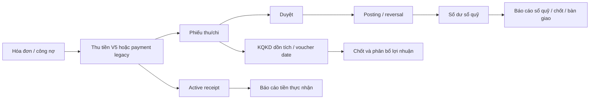

# Audit tiền - hóa đơn - thu chi - thanh toán

> **Chuỗi audit:** audit MỚI NHẤT của chủ đề thanh toán là `AUDIT-THANH-TOAN-2026-08-31.md` — 13/13 finding đã vá 01/09/2026 (commit `b8b3fe83`). File dưới đây là bằng chứng bất biến, không cập nhật nội dung.

**Ngày chốt:** 2026-08-13

**Commit dữ liệu/runtime đã đo:** `b2ebf32256ba197c8cf0d945546c663b75add2c9`

**HEAD kiểm lại khi chốt tài liệu:** `931eb9e78ceed2f7ffd5513d67fc7e4c14bafd7e`; commit mới chỉ đổi Chat Zalo/docs và không chạm flow tiền trong phạm vi này.

**Phạm vi:** hóa đơn -> thu tiền/thanh toán -> phiếu thu/chi -> duyệt/posting -> sổ quỹ -> báo cáo/lợi nhuận.

**Tính chất:** snapshot audit read-only; không sửa code, migration hay dữ liệu production.

## 1. Kết luận điều hành

Hệ thống hiện **không có dấu hiệu lệch số dư sổ quỹ diện rộng**. Nền writer thu tiền V5, posting ledger và cơ chế đối soát là phần mạnh nhất: 19 sổ thật khớp legacy/V2 dưới `0,01đ`; 2.719 posting lines cộng đủ `2.041.721.327đ`; writer V5 khóa invoice, kiểm optimistic concurrency, idempotency, tenant/sổ/quyền và ghi collection, tender, payment, voucher, allocation trong một transaction.

Tuy nhiên, khâu tiền hiện **chưa đạt trạng thái vận hành tài chính thống nhất end-to-end**. Vấn đề gốc không phải một công thức tổng duy nhất sai, mà là còn nhiều nguồn sự thật song song:

1. `invoices.paid_amount` cho trạng thái công nợ và tương thích legacy;
2. `active_payment_receipts` cho dòng thu còn hiệu lực;
3. posting lines `POSTING/REVERSAL` cho tiền thật trong sổ quỹ;
4. `fa_monthly_pnl*` cho KQKD hiện hành;
5. `effective_profit_contributions_v2` cho mô hình Finance V2, hiện chưa cutover sạch.
6. `contracts.deposit_paid` và signed deposit basis cho cọc/thanh lý, hiện chưa cùng một định nghĩa.

Do đó cùng một giao dịch có thể đúng ở sổ quỹ nhưng hiển thị sai hoặc mang nghĩa khác ở màn báo cáo. Các lỗi cần ưu tiên nhất là:

- 5 hóa đơn tháng có `paid_amount` lưu cao hơn recompute chuẩn tổng `4.382.100đ`;
- báo cáo Lịch thanh toán đang đọc cả hóa đơn hủy/xóa; trong cửa sổ 365 ngày hiện có 54 hóa đơn hủy `160.328.166đ` và 22 hóa đơn xóa `104.355.663đ` có thể đi vào nguồn;
- báo cáo Tỷ lệ chi phí dùng gross voucher/item theo `APPROVED + voucher_date`, không dùng cùng KQKD canonical; trong cửa sổ mặc định 6 tháng, gross revenue cao hơn `kqkd_amount` `2.199.914.835đ` và gross expense item cao hơn KQKD `1.054.631.754đ`;
- 39 payment legacy đang active, tổng `55.420.239đ`, không còn voucher nguồn active; cùng 13 reversal org thật thiếu lineage/collection ở các mức khác nhau;
- đổi phương thức payment legacy vẫn là hai write không atomic dù RPC atomic đã tồn tại;
- flow hoàn tiền hóa đơn có contract UI/client/server lệch nhau, gồm cả sai response key `refundVoucherId`/`voucher_id`;
- trang Thu tiền theo ngày/phương thức đang cộng raw `payments.amount`, nên kỳ hóa đơn 07-08/2026 có thể gọi `2.583.880.380đ` là “Đã thu/Thu được” trong khi active non-CT cash receipt chỉ `2.494.401.141đ`, lệch nghĩa `89.479.239đ`; nguồn raw gồm 12 payment đã reversal `36.217.000đ` và 22 payment `CT` cấn trừ nội bộ `52.675.039đ`;
- riêng “Ai thu bao nhiêu/Tổng đã thu” còn cộng 3 payment đã reversal, tổng `2.580.000đ`; flow bàn giao tiền cũng chỉ kiểm APPROVED, chưa kiểm posting truth.
- thanh lý/hoàn cọc đang có hai đường không cùng guard: writer trả phòng/bỏ cọc dùng `contracts.deposit_paid`, còn preview obligation dùng signed basis; 13 phiếu hoàn legacy đã POSTED `37.722.600đ` không có obligation linkage. Bản thân signed resolver vừa cộng toàn bộ voucher hỗn hợp, vừa bỏ sót 4 phiếu DEPOSIT đã POSTED `11.143.239đ` do nhận diện theo tên loại;
- obligation hoàn cọc lưu fingerprint nhưng không kiểm lại, cho phép nhiều version cùng một termination và index chống trùng hiện không chặn nhiều voucher sống giữa các version.
- báo cáo Dòng tiền/Tài khoản theo ngày trộn tiền thật với sổ ảo và chuyển sổ nội bộ: riêng năm 2026 sổ ảo góp `2.005.110.562đ` vào “thu” và `1.995.626.000đ` vào “chi”; một lần chuyển sổ `860.000đ` làm cả tổng thu lẫn tổng chi consolidated cùng tăng dù net bằng 0. Cùng nguồn posting còn bị đổi nhãn thành “Doanh thu/Chi phí/Lợi nhuận”.
- reader số dư đầu ngày bỏ `accounts.initial_amount`, dù writer cho nhập số dư đầu kỳ và canonical balance dùng khi chốt sổ có cộng trường này. Dữ liệu hiện tại chưa phát sinh lệch vì 16 sổ thật trong probe đều có số dư đầu bằng 0, nhưng lỗi reachable ngay khi tạo sổ với số dư đầu khác 0.

Audit chốt **23 finding: 10 P1, 10 P2 và 3 P3**. **Đánh giá tổng thể:** nền kế toán giao dịch và kiểm soát sổ quỹ ở mức **khá mạnh**, nhưng lớp compatibility legacy, một số báo cáo và công tác cutover/hygiene ở mức **trung bình - cần chỉnh trước khi xem là một hệ tài chính thống nhất**. Không nên tuyên bố production-ready cho toàn chuỗi báo cáo/lợi nhuận cho đến khi các P1/P2 dưới đây được xử lý và đối soát lại.

## 2. Phạm vi, phương pháp và mức tin cậy

### 2.1. Nguồn đã dùng

- GitNexus ở lần truy vết ban đầu báo `FRESH` nhưng index cũ 2 commit/thiếu 12 file; khi chốt lại tại HEAD `931eb9e7`, gate báo `FRESH`, cũ 0 commit/0 file mới. Dùng graph để định hướng caller/callee TypeScript, không dùng kết quả trống để kết luận không có ảnh hưởng. FTS extension không khả dụng trong lần truy vấn chi tiết.
- UA: artifact chính thức stale; lần đầu đo `216 commit / 555 file / 178 file mới / thiếu 42 migration`, khi chốt là `217 commit / 596 file / 201 file mới / thiếu 42 migration`, vẫn thiếu tiểu hệ media gateway. Vì vậy không dùng UA làm bằng chứng runtime hay kiến trúc hiện tại; lightweight domain scan chỉ dùng dựng bản đồ 5 domain, 10 flow, 40 step.
- Code TypeScript, baseline SQL, migration SQL và contract/plan của repo.
- Query production qua Management API, tất cả bọc transaction `READ ONLY`.
- Gate/harness và Vitest tập trung cho payment, refund, cashbook, report/profit.

Theo `PROJECT_CONTRACT.md`, thứ tự tin cậy khi có mâu thuẫn là: **contract manifest + SQL harness/runtime > GitNexus > UA**.

### 2.2. Mức phân loại finding

- **Hiện hữu:** có code path đang nối màn hình/route và/hoặc dữ liệu production chứng minh tác động.
- **Latent:** logic có thể sai khi trạng thái hợp lệ xuất hiện, nhưng dữ liệu hiện tại chưa chạm điều kiện.
- **Legacy hợp lệ nhưng rủi ro:** khác biệt do hai mô hình cùng tồn tại; không được gọi toàn bộ là corruption, nhưng có thể làm các màn báo cáo lệch nghĩa.
- **DEMO hygiene:** làm gate/integrity đỏ nhưng không phải tiền thật org vận hành.

## 3. Flow và invariant thực tế

Các invariant đúng cần giữ:

1. `Duyệt != tiền đã di chuyển`; chỉ posting active mới đổi sổ quỹ.
2. Receipt chỉ còn hiệu lực khi collection active hoặc payment legacy chưa reversed.
3. `paid_amount` phải khớp recompute canonical của invoice, nhưng không bắt buộc bằng `active_payment_receipts.applied_amount` trong mọi dữ liệu legacy.
4. Báo cáo “đã thu/đã chi” phải dùng receipt/posting truth; báo cáo KQKD phải dùng cùng một accounting-class và recognition policy.
5. Hóa đơn `CANCELLED`/xóa không được lọt KPI phải thu, tiền thừa hoặc cohort vận hành, trừ khi report nói rõ là lịch sử hủy.
6. Mọi thay đổi đồng thời payment + voucher/sổ phải atomic và tenant-scoped.
7. Cọc dùng để hoàn, cấn hoặc chuyển doanh thu phải là đúng phần `DEPOSIT` còn giữ trên posting active; preview, submit, posting và reversal phải dùng cùng resolver và cùng fingerprint/version.
8. Báo cáo cash consolidated phải tách tiền bên ngoài, chuyển sổ nội bộ và bút toán sổ ảo; dòng tiền không được đổi nhãn thành doanh thu/chi phí/lợi nhuận nếu không đọc P&L canonical.
9. Số dư đầu ngày phải dùng cùng công thức as-of canonical, gồm `initial_amount` theo hiệu lực `initial_date`; không được chỉ cộng posting phát sinh.

## 4. Findings theo mức ưu tiên

### P1-01 - 5 hóa đơn tháng có `paid_amount` drift thật `4.382.100đ`

**Trạng thái:** hiện hữu, org thật.

Trong 100 invoice có `paid_amount` khác active receipt, phần lớn được giải thích bởi legacy change/credit/settlement. Sau khi áp đúng công thức của `public.recompute_invoice_for_id`, còn 5 hóa đơn `MONTHLY/PAID` thực sự lệch: stored paid `25.196.100đ`, recompute/active payment `20.814.000đ`, chênh `4.382.100đ`.

`recompute_invoice_for_id` cộng payment chưa reverse, trừ legacy “Tiền thối”, trừ settlement refund và cộng carry có chặn trần tại `supabase/baseline/schema.sql:84810`.

**Tác động nghiệp vụ:** công nợ, trạng thái PAID, tiền thừa và báo cáo dựa `paid_amount` có thể sai; nhân viên có thể không tiếp tục thu khoản còn thiếu hoặc báo thừa giả.

**Khuyến nghị:** snapshot 5 invoice, chạy recompute có kiểm soát trong lane migration/repair, lưu before/after + source payments/refunds/carry; sau đó thêm gate định kỳ `stored paid_amount == recompute expected` cho invoice active.

### P1-02 - Báo cáo Lịch thanh toán không loại hóa đơn hủy/xóa

**Trạng thái:** hiện hữu, route đang hoạt động.

`usePaymentScheduleReport` chỉ lọc `due_date <= futureDate`, không lọc `deleted_at IS NULL`, không loại `CANCELLED`, tại `src/hooks/reports/financeReports.ts:19`. Caller thật là `src/pages/reports/finance/PaymentScheduleReport.tsx:31`; route có permission tại `src/app/routes/financeReportRoutes.tsx:50`.

Với đúng cửa sổ UI 365 ngày, nguồn production org thật chứa:

- 54 hóa đơn `CANCELLED`, tổng `160.328.166đ`;
- 22 hóa đơn đã soft-delete, tổng `104.355.663đ`.

Trang còn group theo phòng và lấy ngày “đã lên hóa đơn đến ngày” lớn nhất, nên một hóa đơn hủy/xóa có ngày xa hơn có thể làm cả phòng trông như đã được lập hóa đơn tới kỳ đó.

**Tác động nghiệp vụ:** lịch nhắc thu/lập hóa đơn và theo dõi phòng có thể sai; vận hành bỏ sót kỳ cần lập hoặc liên hệ khách không còn nghĩa vụ.

**Khuyến nghị:** chuyển sang RPC/read model server-side với allowlist trạng thái nghiệp vụ; loại deleted/cancelled; test một phòng có invoice active + cancelled ngày muộn hơn.

### P1-03 - Báo cáo Tỷ lệ chi phí không cùng semantics với KQKD canonical

**Trạng thái:** hiện hữu, route đang hoạt động và có dữ liệu chạm điều kiện.

`useExpenseRatioReport` cộng revenue/expense từ `income_expenses` theo `approval_status='APPROVED'` và `voucher_date`, tại `src/hooks/reports/realEstateReports.ts:562` và `src/hooks/reports/realEstateReports.ts:588`. Revenue lấy toàn bộ `total_amount`; expense cộng các `item.amount` có expense type. Reader này không dùng `kqkd_amount`, `business_result_accounting`, accounting class hay recognition/accrual allocation; cũng không tính cùng cách với no-item voucher của P&L.

Đối chiếu exact trên cửa sổ mặc định 6 tháng của org thật:

- revenue mà reader cộng: `7.474.479.757đ`; tổng `kqkd_amount` INCOME cùng scope: `5.274.564.922đ`; lệch `2.199.914.835đ`;
- expense item mà reader cộng: `5.418.503.426đ`; tổng `kqkd_amount` EXPENSE cùng scope: `4.363.871.672đ`; lệch `1.054.631.754đ`.

Đây không tự động có nghĩa từng đồng chênh là corruption: phần lớn là cọc, credit, internal/non-P&L, voucher không item hoặc khác thời điểm ghi nhận. Nhưng nó chứng minh trang mang tên “Tỷ lệ chi phí/doanh thu” đang đo một định nghĩa khác đáng kể với báo cáo KQKD và chốt lợi nhuận.

Caller và route thật: `src/pages/reports/real-estate/ExpenseRatioReport.tsx:67`, `src/app/routes/realEstateReportRoutes.tsx:38`.

**Tác động nghiệp vụ:** tỷ lệ chi phí/doanh thu không reconcile với Báo cáo doanh thu - chi phí và chốt lợi nhuận; quản lý có thể tối ưu sai hạng mục.

**Khuyến nghị:** không vá thêm filter client. Tạo một RPC ratio dựa trực tiếp `fa_type_breakdown[_accrual]` và `fa_monthly_pnl[_accrual]`, trả cả basis/definition; thêm invariant `sum breakdown == P&L`.

### P1-04 - Payment legacy active không còn voucher nguồn: 39 dòng / `55.420.239đ`

**Trạng thái:** hiện hữu, org thật.

Production có 39 payment legacy active, tổng `55.420.239đ`, invoice còn tồn tại, không có voucher active hoặc tombstone gắn `payment_id`; mỗi payment vẫn có receipt event. Có 11 dòng đã xuất hiện trong repair/exception audit. Ngoài ra có 1 payment reversed `1.071.500đ` cũng không có voucher nguồn.

Đây không phải tình trạng “voucher bị ẩn do soft-delete”. Nó là khoảng trống lineage giữa receipt/công nợ và sổ chứng từ.

**Tác động nghiệp vụ:** drill-down từ thu tiền sang phiếu/sổ có thể thiếu; sửa phương thức, reversal, audit evidence và giải trình giao dịch khó chắc chắn; không thể tự động kết luận toàn bộ 39 dòng là đã hạch toán đúng chỉ vì balance tổng đang khớp.

**Khuyến nghị:** phân loại từng payment theo repair code/source event/account/posting; backfill linkage hoặc ghi exception có disposition rõ. Không tạo voucher mới hàng loạt nếu chưa chứng minh không double-post.

### P1-05 - 13 reversal org thật không đạt integrity lineage

**Trạng thái:** hiện hữu, org thật.

Ngoài 6 dòng DEMO mất original payment, production org thật còn:

- 9 `MISSING_SOURCE_VOUCHER`, original payment tổng `33.637.000đ`;
- 2 `NO_REVERSAL_COLLECTION`, tổng `1.931.500đ`;
- 2 nhóm `OTHER`, tổng `1.720.000đ`.

Predicate integrity được định nghĩa trong `supabase/migrations/20260721140500_accounting_rollout_gate_v1.sql:6`. `scripts/audit-accounting-rollout.mjs` hiện fail; top-level counter chỉ báo 6 vì 6 DEMO dangling, trong khi diagnostic legacy thấy thêm các lỗi lineage.

**Tác động nghiệp vụ:** số dư hiện vẫn reconcile, nhưng chứng cứ “đảo giao dịch nào, từ voucher nào, collection nào” chưa kín. Đây là rủi ro kiểm toán và sửa dữ liệu về sau.

**Khuyến nghị:** mở repair ledger cho 13 dòng thật, ưu tiên 9 missing source; mỗi repair phải đối chiếu original amount, source item classes, reversal voucher, account và collection status. Sau repair, gate phải phân tách `REAL blocking` và `DEMO hygiene` thay vì một số tổng khó diễn giải.

### P1-06 - Đổi phương thức payment legacy gồm hai write không atomic

**Trạng thái:** đường đang sống; chưa thấy corruption hiện tại.

Caller exact: `PaymentsSummaryDialog -> useUpdatePaymentMethod`. Hook hiện:

1. resolve sổ ở client;
2. cập nhật `income_expenses.account_id` qua `ie_compat_update_pending_v2`;
3. raw update `payments.payment_method` trong request thứ hai.

Ref: `src/hooks/useUpdatePaymentMethod.ts:63`, `src/hooks/useUpdatePaymentMethod.ts:123`, `src/hooks/useUpdatePaymentMethod.ts:148`, caller tại `src/components/invoices/PaymentsSummaryDialog.tsx:203`.

Nếu bước 2 thành công và bước 3 lỗi, voucher/sổ đã đổi nhưng payment method chưa đổi. Các fallback lookup account còn thiếu filter `organization_id`, ví dụ `src/hooks/useUpdatePaymentMethod.ts:80` và `src/hooks/useUpdatePaymentMethod.ts:104`.

Trong khi đó RPC server atomic đã tồn tại, khóa payment/invoice và scope org tại `supabase/migrations/20260721150500_accounting_scope_narrowing.sql:1006`.

**Dữ liệu hiện tại:** 985 payment legacy active nên đường này vẫn có phạm vi lớn; query chưa thấy method/account mismatch đang tồn tại.

**Khuyến nghị:** thay toàn bộ hook bằng `update_invoice_payment_method_v1`; xóa resolver client; thêm test failure atomicity và cross-org duplicate account name.

### P1-07 - Contract hoàn tiền hóa đơn lệch UI/client/server và sai response key

**Trạng thái:** bug code chắc chắn; org thật hiện chưa có refund reservation nên chưa phát sinh tiền thật từ đường này.

Ba xung đột cùng nằm trong một flow:

1. Form bắt `payment_date` và `account_id`, truyền vào hook tại `src/components/invoices/RecordRefundDialog.tsx:37` và `src/components/invoices/RecordRefundDialog.tsx:103`.
2. Hook không gửi hai trường đó; RPC chỉ nhận invoice, amount, reason, key tại `src/hooks/useInvoicePayments.ts:113`.
3. Server cố ý tạo nghĩa vụ `UNAPPROVED + UNPOSTED`, `account_id=NULL`, ngày `org_today`, tại `supabase/baseline/schema.sql:36605`; đúng thiết kế nghiệp vụ là chọn ngày/sổ ở bước posting, không ở bước reserve.

Ngoài ra private RPC trả `refundVoucherId` tại `supabase/baseline/schema.sql:36639`, nhưng wrapper kiểm `voucher_id` tại `supabase/migrations/20260723130000_finance_v2_drain_compat_rpcs.sql:242`, và hook cũng đọc `voucher_id` tại `src/hooks/useInvoicePayments.ts:124`. Hệ quả:

- reason không được append vào voucher;
- hook luôn trả `voucher_id=null`;
- label nút “Lập phiếu chi” khiến người dùng tưởng tiền đã được lập vào sổ, trong khi chỉ có obligation chờ duyệt.

**Khuyến nghị:** sửa một contract duy nhất: source form chỉ amount + reason; normalize response key typed; success hiển thị “Đã tạo nghĩa vụ hoàn - Chờ duyệt”; ngày/sổ/evidence chỉ nhập trong posting dialog. Thêm integration test response key và state `HELD/UNAPPROVED/UNPOSTED`.

### P1-08 - Thanh lý/hoàn cọc có hai nguồn sự thật; cả đường trực tiếp và signed resolver đều còn lỗ hổng

**Trạng thái:** hiện hữu, đường UI đang sống và production đã có giao dịch chạm điều kiện.

Flow thanh lý hiện không có một invariant cọc duy nhất:

1. `contract_deposit_paid_derived` cộng item `accounting_class='DEPOSIT'` trên phiếu `APPROVED`, không yêu cầu tiền thật đã `POSTED`, tại `supabase/baseline/schema.sql:53024`.
2. Signed resolver chỉ nhận phiếu `POSTED` trên sổ thật để tính `netHeld`, nhưng `contract_deposit_sources_v1` nhận diện theo tên loại có chữ “cọc” rồi lấy **toàn bộ `income_expenses.total_amount`**, tại `supabase/baseline/schema.sql:6283`, `supabase/baseline/schema.sql:6307` và `supabase/baseline/schema.sql:6328`. Hệ quả hai chiều: voucher hỗn hợp cọc + tiền thuê/phí bị cộng thừa, còn item `accounting_class='DEPOSIT'` có tên loại không chứa “cọc” bị bỏ sót hoàn toàn.
3. UI trả phòng mặc định “Đã thu” từ `contract.deposit_paid` tại `src/components/contracts/TerminateDialog.tsx:536`; hook gọi đường `_with_credit_v1` tại `src/hooks/useContractOperations.ts:258`. Wrapper sau đó delegate về `terminate_contract_move_out`, và writer trực tiếp kẹp số hoàn theo `contracts.deposit_paid` tại `supabase/baseline/schema.sql:92538` và `supabase/baseline/schema.sql:92795`.
4. Đường bỏ cọc cũng hiển thị/chuyển doanh thu theo `deposit_paid` tại `src/components/contracts/TerminateDialog.tsx:264` và `supabase/baseline/schema.sql:92161`.
5. Writer trả phòng tự tạo cặp cấn cọc/doanh thu và phiếu `termination.refund` tại `supabase/baseline/schema.sql:92878` và `supabase/baseline/schema.sql:92903`; nó không đi qua obligation, không lưu/recheck signed fingerprint.
6. Đường an toàn hơn chỉ tồn tại song song: preview gọi signed resolver và trả fingerprint tại `supabase/baseline/schema.sql:83806`; record lưu snapshot/fingerprint tại `supabase/baseline/schema.sql:86591`; `create_termination_refund_voucher_v1` chặn cảnh báo bằng owner-force tại `supabase/baseline/schema.sql:59585`. Tuy vậy writer tạo phiếu không re-resolve fingerprint trước khi tạo, và approve/post generic cũng không kiểm deposit basis/obligation linkage.

Đo production org thật:

- 13 phiếu `termination.refund` đã `APPROVED/POSTED`, tổng `37.722.600đ`; bảng obligation hiện 0 dòng, nên không phiếu nào có obligation linkage;
- retrospective signed-basis tại ngay trước `created_at` cho thấy 11/13 phiếu, tổng `31.080.600đ`, có `realHeld_before <= 0` và vượt số cọc thật cùng giá trị; đây là bằng chứng control gap đã được thực thi, nhưng chưa đủ để quy kết toàn bộ là chi sai vì lịch sử trạng thái approval/posting/deleted/account không được snapshot đầy đủ;
- 14 hợp đồng active có 36 voucher nguồn mà tổng voucher cao hơn tổng item cọc `33.441.469đ`; cả 14 đều có voucher hỗn hợp, gồm 20 dòng mixed và 16 dòng deposit-only. Đây là bằng chứng resolver đang overstate phần cọc trên đúng dữ liệu hiện hành;
- resolver bỏ sót 4 voucher `APPROVED/POSTED` có item `DEPOSIT`, tổng `11.143.239đ`, trên 4 hợp đồng. Ba dòng là `termination.refund`, tổng `9.244.400đ`, dùng tên loại “Hoàn trả thanh lý”; do không chứa chữ “cọc”, các khoản OUT này không được trừ khỏi `netHeld`. Dòng còn lại `1.898.839đ` là phiếu thu hóa đơn có `accounting_class='DEPOSIT'` nhưng loại không đánh dấu deposit, cần phân loại lại trước khi coi là cọc thật;
- 11 `contract_deposit_links` production hiện đều đồng bộ với `income_expenses.contract_id`; chưa có mismatch từ link table. Khoảng hở nằm ở resolver không hỗ trợ link-only và predicate tên loại, dù writer derived đã hỗ trợ cả hai đường tại `supabase/baseline/schema.sql:53042`;
- một hợp đồng active reachable có `deposit_paid=5.000.000đ` nhưng signed `netHeld=0/NO_SOURCE`;
- 6 phiếu `termination.revenue` tổng `2.735.000đ` và 1 phiếu `termination.offset` `354.000đ` cũng có basis trước giao dịch bằng 0 theo cùng phép đo retrospective.

**Tác động nghiệp vụ:** hệ thống có thể hoàn/cấn/chuyển doanh thu từ số cọc chưa hề vào két, chưa POSTED, không còn giữ, hoặc gồm cả tiền thuê/phí trong voucher hỗn hợp. Ngược lại, resolver có thể không trừ khoản hoàn đã POSTED nên tiếp tục báo còn giữ cọc sau khi tiền đã ra. Hệ quả không chỉ là chi tiền: công nợ thanh lý, doanh thu phạt, KQKD, nghĩa vụ với khách và giải trình sổ cọc có thể cùng lệch nhưng theo các hướng khác nhau.

**Khuyến nghị:** chọn một canonical item-sliced signed resolver: tổng item `DEPOSIT` trên posting active của sổ thật, trừ release/reversal theo lineage. Bắt buộc mọi preview/submit/forfeit/move-out/refund/approve-post dùng cùng basis và fingerprint/version; thay writer trực tiếp bằng obligation/authorization bất biến hoặc ít nhất fail-closed khi fingerprint trôi. Thêm uniqueness theo `(organization_id, termination_id)` cho mọi voucher sống, không chỉ theo từng obligation version. Trước cutover, reconcile toàn bộ hợp đồng và 13 phiếu posted bằng evidence/audit event; tuyệt đối không auto-repair hay gọi `31.080.600đ` là thất thoát nếu chưa đối chiếu chứng từ.

### P1-09 - Trang Thu tiền dùng raw payment cho “Đã thu”, cộng cả reversal và cấn trừ không phải tiền

**Trạng thái:** hiện hữu, org thật; ảnh hưởng trực tiếp trang vận hành `/thu-tien` và báo cáo mở từ trang này.

Nguồn query duy nhất của trang có mang `reversed_at` nhưng vẫn trả toàn bộ relation `payments` tại `src/hooks/useCollectionReport.ts:38`. Tuy nhiên:

1. `paymentsInRange`, `paidUpTo`, `paidAsOf` và `remainingAsOf` đều cộng/kiểm mọi payment, không loại `reversed_at` và không loại `payment_method='CT'`, tại `src/lib/collect.ts:162` và `src/lib/collect.ts:202`.
2. Thanh tổng chính dùng các helper này cho “Đã thu”, số phòng đã thu, snapshot ngày và “Thu được” tại `src/pages/ThuTien.tsx:152`, `src/pages/ThuTien.tsx:170` và `src/pages/ThuTien.tsx:188`.
3. `ManagePanel` cũng dùng raw payment cho ngày được chọn tại `src/components/thu-tien/ManagePanel.tsx:65`.
4. `CollectionReport` cộng raw payment theo ngày/phương thức và chọn timestamp từ cả payment đã đảo tại `src/components/thu-tien/CollectionReport.tsx:79` và `src/components/thu-tien/CollectionReport.tsx:100`. Khi chọn “Cả kỳ/Tất cả”, nó lại đổi sang `paid_amount`, nên cùng nhãn “Đã thu” còn thay đổi định nghĩa theo bộ lọc.

Trong khi đó hệ thống đã có hai read model đúng theo mục đích:

- `active_payment_receipts` loại collection/payment đã reversal tại `supabase/baseline/schema.sql:103353` và `supabase/baseline/schema.sql:103399`; các KPI cash ở `usePayments` đã loại thêm `CT` tại `src/hooks/usePayments.ts:272`;
- `payment_receipt_events` biểu diễn reversal thành event âm theo ngày kinh tế tại `supabase/baseline/schema.sql:114116` và `supabase/baseline/schema.sql:114162`; báo cáo chu kỳ Thu -> Bàn giao đã loại `CT` trước khi cộng tại `supabase/baseline/schema.sql:71206`.

`CT` là bút toán cấn trừ công nợ, không phải tiền mặt; chính tài liệu domain ghi rõ tại `docs/he-thong/08-thu-chi-so-quy.md:122`.

Đo production read-only trên hóa đơn active, chưa xóa/hủy của hai kỳ 07-08/2026:

- raw payment mà các helper có thể cộng khi phạm vi ngày bao trùm kỳ: `2.583.880.380đ`;
- active cash receipt không phải `CT`: `2.494.401.141đ`; chênh `89.479.239đ`;
- trong nguồn raw có 12 payment đã đảo, tổng `36.217.000đ`, trên 8 ngày; các khoản này vẫn được cộng dương ở ngày thu gốc nhưng không có event âm ở ngày đảo;
- còn 22 payment `CT` active, tổng raw `52.675.039đ`; đây là cấn trừ công nợ nhưng bị gọi là “Thu được/Đã thu” khi chọn tất cả phương thức;
- ở chế độ cả kỳ, tổng `paid_amount` của hai kỳ cao hơn active non-CT cash `53.303.239đ`. Đây không phải corruption tự thân: nó chứng minh nhãn cash đang hiển thị một đại lượng AR settlement gồm cả non-cash/legacy semantics.

Test helper hiện vẫn xanh 26/26 nhưng fixture chỉ có payment sống, không có `reversed_at` hoặc `CT`, tại `src/lib/__tests__/collect.test.ts:185` và `src/lib/__tests__/collect.test.ts:205`; vì vậy test đang xác nhận phép cộng raw, chưa xác nhận nghiệp vụ cash.

**Tác động nghiệp vụ:** quản lý có thể đọc sai số tiền thực nhận theo ngày, đánh giá sai hiệu suất thu, đối chiếu lệch với dashboard/sổ quỹ và coi một khoản cấn trừ hay đã hoàn tác là tiền đã vào két. Snapshot ngày quá khứ cũng không phải event ledger: nó giữ receipt dương ở ngày gốc nhưng không phản ánh reversal âm ở ngày đảo.

**Khuyến nghị:** chốt hai semantics riêng. “Tiền thực nhận còn hiệu lực” đọc `active_payment_receipts`, lọc `CT`, cộng `collected_amount`; “dòng sự kiện theo ngày” đọc `payment_receipt_events`, lọc `CT`, cộng signed `collected_amount`. Không tái dựng từ relation `payments`. Trả server-side theo invoice/building/date/method, để main summary, ManagePanel và CollectionReport dùng cùng một payload. Thêm test reversal sau ngày thu, reversal cùng ngày, `CT`, tiền thối/credit và đối soát `sum daily signed events == active cash tại ngày cuối`.

### P1-10 - Báo cáo Dòng tiền trộn sổ ảo, chuyển sổ nội bộ và nhãn P&L

**Trạng thái:** hiện hữu, org thật; posting ledger và net balance vẫn đúng, nhưng read-model có thể làm sai quyết định vận hành.

GitNexus xác nhận `useCashFlowByDay` chỉ có hai consumer sống là `src/pages/reports/finance/CashFlowReport.tsx` và `src/pages/reports/finance/DailyCashbookReport.tsx`; tìm kiếm source tại HEAD cho cùng kết quả. Hook gọi RPC `cashflow_by_day` tại `src/hooks/useCashBook.ts:111`. Wrapper đang deploy delegate thẳng sang V2 tại `supabase/baseline/schema.sql:52120`; V2 cộng mọi posting line `POSTING/REVERSAL`, rồi phân “income/expense” thuần theo dấu tại `supabase/baseline/schema.sql:52136` và `supabase/baseline/schema.sql:52146`.

Reader này có hai xung đột semantics độc lập:

1. Helper phạm vi nhìn chỉ lọc sổ còn sống/quyền sở hữu, không loại `accounts.is_virtual` tại `supabase/baseline/schema.sql:15307`. Trong khi type contract đã nói rõ sổ ảo “không có két tiền thật” và thống kê tiền thật phải lọc false tại `src/hooks/useAccounts.ts:26`.
2. Đổi sổ quỹ cố ý để trigger đảo posting ở sổ cũ và ghi generation mới ở sổ mới tại `supabase/baseline/schema.sql:71824`; hậu điều kiện còn chứng minh tiền rời sổ cũ và vào sổ mới tại `supabase/baseline/schema.sql:71838`. Theo từng tài khoản, hai dòng vào/ra là đúng. Nhưng khi chọn “Tất cả tài khoản”, reader vẫn cộng một vế vào gross thu và một vế vào gross chi thay vì triệt cặp hoặc tách “Chuyển nội bộ”.

UI gọi nguồn này là “dòng tiền thu chi thực tế”, “Thu vào/Chi ra” tại `src/pages/reports/finance/CashFlowReport.tsx:117` và `src/pages/reports/finance/CashFlowReport.tsx:124`, rồi ngay cùng trang đổi nhãn thành “Doanh thu/Chi phí/Lợi nhuận” tại `src/pages/reports/finance/CashFlowReport.tsx:170`. Daily report cho chọn “Tất cả tài khoản” và gọi cùng số là “Tổng thu/Tổng chi” tại `src/pages/reports/finance/DailyCashbookReport.tsx:114` và `src/pages/reports/finance/DailyCashbookReport.tsx:129`.

Đo production read-only:

- năm 2026 reader trả gross income `9.462.307.916đ`, gross expense `7.409.209.589đ`, net `2.053.098.327đ`;
- sổ ảo đóng góp income `2.005.110.562đ` (`21,1905%`), expense `1.995.626.000đ` (`26,9344%`), net `9.484.562đ`, trên 270 posting lines;
- ngày 11/08/2026 có một event `CASHBOOK_MOVED`: sổ cũ `-860.000đ`, sổ mới `+860.000đ`. Net consolidated của chuyển sổ bằng `0đ`, nhưng gross “Tổng thu” và “Tổng chi” cùng tăng `860.000đ`;
- tổng ngày gồm sổ ảo là income `295.806.000đ`, expense `294.449.491đ`, net `1.356.509đ`; riêng sổ thật là income `295.588.000đ`, expense `294.449.491đ`, net `1.138.509đ`. Phần chuyển sổ chiếm `0,2909%` gross thu và `0,2921%` gross chi của sổ thật ngày đó.

**Tác động nghiệp vụ:** số dư từng sổ và tổng net vẫn giải trình được, nên đây không phải bằng chứng corruption hay thất thoát. Tuy nhiên CFO/owner có thể đọc sổ ảo là tiền thật, đọc luân chuyển nội bộ là quy mô thu/chi bên ngoài và đọc cash movement là doanh thu/chi phí/lợi nhuận. Sai nghĩa này ảnh hưởng trực tiếp đánh giá doanh số, burn, biên lợi nhuận và nhu cầu vốn dù ledger đang cân.

**Khuyến nghị:** trả ba series rõ ràng từ server: `external_cash`, `internal_transfer`, `virtual_accounting`. View theo từng tài khoản vẫn được hiển thị gross chuyển vào/ra; view consolidated phải triệt cặp chuyển nội bộ khỏi external gross và net vẫn bằng 0. Mặc định “tiền thực tế” loại sổ ảo. Nếu `CashFlowReport` muốn hiển thị doanh thu/lợi nhuận thì phải đọc P&L canonical; nếu giữ posting source thì đổi nhãn thành “Dòng vào/Dòng ra/Thay đổi ròng”. Thêm test move sổ `-X/+X`, consolidated external gross `0`, net `0`; test sổ ảo không lọt actual cash. Test hiện tại tại `src/lib/__tests__/financeV2ReadModelsMigration.test.ts:43` mới kiểm tên RPC và `posted_on`, chưa kiểm semantics này.

### P2-01 - Báo cáo Tiền thừa dùng stored `paid_amount`, còn list/summary có thể cùng sai nghĩa

**Trạng thái:** hiện hữu; route đang hoạt động.

List lọc `paid_amount > total_amount` ở `src/hooks/reports/financeReports.ts:61`; summary RPC cũng dùng cùng công thức tại `supabase/baseline/schema.sql:65449`. Cả hai không loại `CANCELLED` và không dùng active receipt/credit lot.

Org thật hiện có 53 dòng, excess stored `9.829.661đ`; trong đó 1 hóa đơn `CANCELLED` góp `4.139.000đ`. Loại cancelled còn 52 dòng `5.690.661đ`. Nhưng 51 monthly over-total `2.028.161đ` đã được giải thích phần lớn bởi legacy credit/change normalization, nên `paid_amount-total_amount` không đồng nghĩa toàn bộ là tiền khách đang còn được hưởng.

**Khuyến nghị:** định nghĩa lại “tiền thừa” từ open customer-credit lots + refundable retained cash, không từ invoice arithmetic. List và summary phải dùng cùng một RPC/read model.

### P2-02 - Dual read model invoice/receipt gây 100 mismatch nhưng không phải 100 lỗi

**Trạng thái:** legacy compatibility risk.

Phân rã 100 invoice lệch:

- 5 monthly drift thật: `4.382.100đ` - P1-01;
- 16 monthly stored paid khớp raw payment nhưng active receipt thấp hơn do legacy change/credit;
- 23 settlement `PAID` có `53.516.239đ` paid nhưng không active receipt; recompute legacy vẫn khớp;
- 51 monthly `paid > total`, phần active receipt đã tách credit/change;
- 3 settlement âm, total `-9.244.400đ`, trạng thái PAID nhưng không có payment/receipt.

Không được báo “73 triệu sai”. Vấn đề thật là các reader không biết lúc nào dùng công nợ, cash receipt, customer credit hay settlement offset.

**Khuyến nghị:** lập data contract theo mục đích: invoice balance, actual cash received, credit liability, non-cash settlement; cấm report mới đọc trực tiếp `paid_amount` nếu mục tiêu là cash.

### P2-03 - Finance V2 chưa cutover sạch

**Trạng thái:** nợ rollout hiện hữu.

Audit production:

- 2.709 voucher active org thật;
- 16 thiếu `posting_mode`, 13 thiếu `posting_status`;
- 8 backfill exception chưa disposition;
- 13.721 change-log row chưa applied;
- 45 voucher `UNAPPROVED`, tổng `719.775.300đ`;
- feature workflow/posting/read/cashbook-access đang ON, nhưng profit close V2 vẫn OFF + force-freeze; profit distribution ở `SHADOW`.

`node scripts/audit-finance-v2-rollout.mjs` kết luận `NOT READY`.

**Tác động:** hệ thống phải duy trì bridge và semantics kép lâu hơn; bất kỳ report đọc thẳng bảng base đều dễ lệch khỏi posting truth.

**Khuyến nghị:** phân loại tuổi/source của 45 pending và 8 exception, drain change-log theo watermark có hash, hoàn thành coverage fields rồi mới cân nhắc profit close/cutover. Không bật thêm feature key chỉ để làm gate xanh.

### P2-04 - Chính sách P&L hiện có hai canonical candidate khác nhau

**Trạng thái:** latent architecture conflict, chưa route thành một runtime duy nhất.

`fa_accrual_allocations/fa_monthly_pnl_accrual` chỉ lấy voucher `APPROVED` tại `supabase/migrations/20260702120000_kqkd_item_level.sql:277`. Ngược lại `effective_profit_contributions_v2` cố ý gồm cả `UNAPPROVED` và chỉ loại `CANCELLED`, tại `supabase/migrations/20260723100000_finance_v2_read_models.sql:70`.

Production hiện có 40 voucher pending tạo contribution V2 signed `-700.386.000đ`. Đây là chênh lệch policy có quy mô lớn, dù flow close V2 đang OFF/frozen nên chưa được gọi là sai báo cáo hiện tại.

**Khuyến nghị:** chủ doanh nghiệp/kế toán phải chốt rõ:

- báo cáo vận hành dự kiến có bao pending hay không;
- báo cáo chính thức/chốt lợi nhuận chỉ APPROVED hay bao accrual obligation pending;
- UI phải gắn nhãn “dự kiến/chưa duyệt” nếu bao pending.

Không để hai engine cùng được gọi là “KQKD canonical”.

### P2-05 - Một số màn vẫn gọi APPROVED là “đã chi/đã trả”

**Trạng thái:** latent trên org thật hiện tại; semantic bug chắc chắn.

- `useShareholderDistributions` và `useManagerSalaryPayouts` lọc APPROVED, không lọc POSTED tại `src/hooks/useShareholderProfit.ts:300` và `src/hooks/useShareholderProfit.ts:367`.
- `PeriodFeeVoucherList` cộng APPROVED thành “đã chi” tại `src/components/thu-tien/PeriodFeeVoucherList.tsx:38`.
- Một số RPC utility/fixed-fee/commission legacy cũng map APPROVED sang paid.

Finance V2 định nghĩa rõ approve-only không đổi balance, tại `src/hooks/income-expenses/financeV2Mutations.ts:51`.

Org thật hiện không có shareholder/manager payout `APPROVED + UNPOSTED`, và 84 utility/fixed-fee APPROVED kiểm tra được đều đã POSTED. Vì vậy chưa có số tiền hiển thị sai tại thời điểm audit, nhưng trạng thái hợp lệ mới sẽ làm sai ngay.

**Khuyến nghị:** mọi label “đã trả/đã chi” dùng `posting_status=POSTED && active_posting_id_v2 != null`; APPROVED+UNPOSTED phải hiện “Đã duyệt - Chưa chi”.

### P2-06 - Cohort settlement cộng cả invoice CANCELLED

**Trạng thái:** hiện hữu.

Settlement aggregate chỉ lọc org, deleted, kind, billing month, không lọc status tại `supabase/migrations/20260728030000_business_performance_invoice_cohort_and_categories.sql:802`. Org thật có 4 settlement `CANCELLED`, tổng `4.232.500đ`, có thể lọt cohort settlement.

**Khuyến nghị:** status allowlist hoặc trả cancelled riêng; thêm reconciliation `active settlement + cancelled = all settlement`, không trộn vào KPI chính.

### P2-07 - “Ai thu bao nhiêu” vẫn cộng payment đã reversal

**Trạng thái:** hiện hữu, org thật; route Thu tiền đang hoạt động.

`useInvoiceCollectors` đọc voucher INCOME `APPROVED + deleted_at IS NULL + payment_id IS NOT NULL`, nhưng không loại payment đã `reversed_at`, không join collection active và không dùng `active_payment_receipts`, tại `src/hooks/useInvoiceCollectors.ts:43`. Caller thật là trang Thu tiền tại `src/pages/ThuTien.tsx:90`; drawer hiển thị từng dòng “Ai thu bao nhiêu” và tự cộng “Tổng đã thu” tại `src/components/thu-tien/InvoiceDetailCard.tsx:40`.

Đo production read-only:

- 3 payment đã đảo kiểu `COUNTER_VOUCHER`, tổng voucher nguồn `2.580.000đ`, vẫn lọt reader;
- cả 3 thuộc cùng một hóa đơn MONTHLY tháng 07/2026 đang PAID;
- reader hiển thị 4 dòng, tổng `3.440.000đ`, trong khi active receipt của hóa đơn chỉ còn 1 dòng `860.000đ`; `paid_amount` canonical cũng là `860.000đ`.

Vì invoice vẫn PAID nên ô phòng có thể gắn attribution nhiều người và drawer báo tổng đã thu gấp 4 lần tiền còn hiệu lực, dù công nợ/sổ quỹ của hóa đơn hiện đúng.

**Tác động nghiệp vụ:** sai KPI/người thu, sai giải trình với nhân viên và sai lịch sử thao tác trên đúng màn vận hành thu tiền; có thể quy trách nhiệm hoặc thưởng doanh số cho giao dịch đã hoàn tác.

**Khuyến nghị:** thay reader bằng RPC/view bắt đầu từ `active_payment_receipts`, resolve `creator_name` từ voucher active theo `voucher_id`, và trả amount semantic rõ (`collected_amount` hay `applied_amount`). Thêm test một invoice có 3 payment reversed + 1 active: UI phải chỉ hiện 1 dòng `860.000đ`.

### P2-08 - Bàn giao tiền chấp nhận APPROVED mà không bắt buộc POSTED

**Trạng thái:** latent nhưng reachable trên org thật; production hiện chưa có phiên đã nuốt phiếu chưa posting.

Client `useUnhandedVouchers` đưa mọi phiếu `APPROVED` có sổ, chưa bàn giao vào danh sách tại `src/hooks/useCashHandovers.ts:58`. Server `create_cash_handover` cũng chỉ kiểm `approval_status='APPROVED'`, rồi cộng trực tiếp `total_amount` để chốt gross/expense/net tại `supabase/migrations/20260807140000_ie_guard_handover_scope.sql:329`. Body đang deploy không tham chiếu `posting_status` hoặc `active_posting_id_v2`.

Đây xung đột trực tiếp với Finance V2: `approve_income_expense_v2` cố ý là approve-only, balance không đổi tại `supabase/baseline/schema.sql:45778`, và màn Phê duyệt cho phép bấm riêng “Duyệt” trước “Duyệt và Thu/Chi” tại `src/pages/approvals/ApprovalsPage.tsx:114`. Vì CASHBOOK voucher sinh sẵn `account_id` và `posting_status='UNPOSTED'`, một phiếu APPROVED+UNPOSTED là trạng thái hợp lệ và có thể lọt flow bàn giao.

Snapshot hiện tại chỉ có 5 phiếu non-POSTED thỏa phần lớn bộ lọc, đều `NOT_APPLICABLE/0đ`; chưa có tiền thật bị bàn giao trước posting. Lịch sử `cash_handover_items` org thật cũng chưa chứa source voucher non-POSTED. Đây là containment do dữ liệu hiện tại, không phải guard.

**Tác động nghiệp vụ:** khi xuất hiện APPROVED+UNPOSTED có tiền, hệ thống có thể tạo phiên bàn giao “tiền trên giấy”; sau đó posting phiếu gốc hoặc xác nhận bàn giao sẽ làm possession/evidence không còn cùng nghĩa với số dư ledger.

**Khuyến nghị:** cả client và RPC phải yêu cầu `posting_status='POSTED'`, `active_posting_id_v2 IS NOT NULL`, account không virtual và active posting chưa bị reversal. Tốt hơn, bàn giao nên snapshot/sum trực tiếp posting lines active thay vì `income_expenses.total_amount`; thêm test từ chối APPROVED+UNPOSTED dù có `account_id`.

### P2-09 - Obligation hoàn cọc có TOCTOU, stale fingerprint và duplicate voucher giữa các version

**Trạng thái:** latent, code path chắc chắn; production hiện chưa có obligation nên chưa có duplicate hiện hữu.

Thiết kế nói nghĩa vụ là snapshot bất biến có fingerprint, nhưng enforcement chưa khép vòng:

1. `record_termination_refund_obligation_v1` gọi preview trước, rồi mới khóa hồ sơ thanh lý tại `supabase/migrations/20260731110000_refund_preview_accept_contract.sql:96` và `supabase/migrations/20260731110000_refund_preview_accept_contract.sql:101`. Vì vậy comment “khóa trước khi chụp cơ sở” không khớp code; nguồn cọc có thể đổi giữa preview và lock.
2. Mỗi lần bấm UI đều record một version mới rồi create voucher tại `src/components/contracts/TerminationRefundDialog.tsx:53`. Unique `(organization_id, termination_id, version)` tại `supabase/baseline/schema.sql:139361` cố ý cho phép nhiều version.
3. `create_termination_refund_voucher_v1` chỉ khóa/check `voucher_id` của obligation được truyền vào tại `supabase/baseline/schema.sql:59602`; không yêu cầu version mới nhất, không tìm voucher ở version khác, không re-resolve và không so `basis_fingerprint`.
4. Index `ux_tro_voucher` unique `(organization_id, id)` tại `supabase/baseline/schema.sql:139374` không thêm bảo vệ thực tế vì `id` đã là primary key; nó không unique `voucher_id`, `termination_id` hay “một voucher sống cho termination”.

Do đó chuỗi hợp lệ `record v1 -> create voucher A -> record v2 -> create voucher B` có thể sinh hai phiếu hoàn sống cho cùng một hồ sơ. Tương tự, obligation cũ vẫn có thể phát hành voucher sau khi thu/hoàn/đảo cọc làm fingerprint thay đổi.

**Tác động nghiệp vụ:** duplicate hoặc stale voucher có thể đi tiếp qua duyệt/posting generic và chi lặp nghĩa vụ; operator không thấy đây là replay vì mỗi obligation/version đều có ID khác nhau.

**Khuyến nghị:** khóa termination trước preview và resolve basis trong cùng transaction; create phải re-resolve fingerprint, yêu cầu obligation latest/active và dùng CAS. Thêm invariant database “một live refund authorization/voucher mỗi `(organization_id, termination_id)`”, với trạng thái release/cancel rõ để cho phép tái tạo có kiểm soát. Idempotency key phải gắn termination + basis fingerprint, không gắn obligation ID ngẫu nhiên.

### P2-10 - Số dư đầu ngày của Daily Cashbook bỏ `initial_amount`

**Trạng thái:** latent nhưng reachable; production chưa lệch hiện hữu vì mọi sổ thật trong probe có `initial_amount=0`.

`cashbook_opening_balance_v2` chỉ SUM posting line trước ngày bắt đầu tại `supabase/baseline/schema.sql:51885` và `supabase/baseline/schema.sql:51894`; comment triển khai còn ghi rõ “no initial_amount” tại `supabase/baseline/schema.sql:51923`. Trong khi đó canonical balance dùng cho chốt sổ cộng `accounts.initial_amount` trước posting tại `supabase/baseline/schema.sql:5456` và `supabase/baseline/schema.sql:5463`.

Đây không phải trường dữ liệu chết: writer `create_cashbook_v1` nhận và validate `p_initial_amount/p_initial_date` tại `supabase/baseline/schema.sql:53209` và lưu thẳng vào account tại `supabase/baseline/schema.sql:53306`; UI cho nhập “Số dư đầu kỳ” tại `src/components/cashbooks/CashbookForm.tsx:486`. Daily report lấy RPC thiếu này làm `opening`, rồi chạy lũy kế thành “Số dư đầu ngày/Tồn cuối ngày” tại `src/pages/reports/finance/DailyCashbookReport.tsx:69` và `src/pages/reports/finance/DailyCashbookReport.tsx:128`.

Probe deployed read-only xác nhận opening V2 không có `initial_amount`, canonical as-of có và create writer nhận số dư đầu. Snapshot hiện tại thấy 16 sổ thật trong tập probe, tất cả `initial_amount=0`, nên chưa có sai số production đang tồn tại. Nhưng chỉ cần tạo sổ hợp lệ với số dư đầu khác 0 thì Daily Cashbook sẽ lệch đúng số đó khỏi màn Sổ quỹ/chốt sổ.

**Tác động nghiệp vụ:** người giữ quỹ có thể thấy tồn đầu/cuối ngày sai trong báo cáo theo ngày trong khi màn số dư hiện tại và biên bản chốt sổ đúng. Đây là dạng xung đột nguy hiểm khi đối chiếu vì hai màn đều mang nhãn số dư nhưng không cùng công thức.

**Khuyến nghị:** thống nhất opening reader với canonical as-of và định nghĩa rõ hiệu lực `initial_date` — số dư đầu chỉ tham gia từ ngày chốt phù hợp, không được cộng mù cho ngày trước khi mở sổ. Thêm test sổ có `initial_amount != 0`, ngày trước/bằng/sau `initial_date`, chọn một sổ và tất cả sổ; assert `opening + movement = closing` và parity với `cashbook_balance_as_of_v1`.

### P3-01 - Gate reconcile V1 pass dù count SQL/RLS khác

**Trạng thái:** khoảng mù gate.

Gate V1 thấy SQL 1.014 dòng, JWT/FE 1.010 dòng nhưng cùng SUM `4.986.076.537đ`; 4 dòng chênh là DEMO giá trị 0 nên không có money drift. Tuy nhiên gate chỉ fail theo tổng tiền, nên một lần khác có thể bỏ lọt scope/count mismatch bù trừ nhau.

**Khuyến nghị:** assert thêm row count, org distribution và hash/bucket; zero-amount rows phải được giải thích rõ chứ không làm PASS im lặng.

### P3-02 - DEMO tombstone làm gate integrity đỏ

**Trạng thái:** DEMO hygiene, không phải tiền thật.

- 6 reversal mất original payment đều org DEMO: 4 `COUNTER_VOUCHER`, 2 `IN_PLACE_CANCEL`.
- 1 refund reservation orphan `RELEASED/DEPOSIT/7.000đ`, org DEMO, có dấu cleanup `VERIFY-7ac`.

**Khuyến nghị:** cleanup fixture hoặc formalize tombstone; gate tách real blocking khỏi DEMO hygiene nhưng không bỏ kiểm tra integrity.

### P3-03 - Profit snapshots stale và lợi nhuận còn unallocated

**Trạng thái:** hiện hữu nhưng được containment bằng SHADOW/freeze.

Accounting rollout audit ghi:

- 19 profit row stale;
- 18 locked;
- unallocated `238.400.702đ`;
- 18 locked persisted stale trên org thật;
- 0 active unsafe locked row;
- profit distribution mode `SHADOW`.

**Ý nghĩa:** guard an toàn đang làm đúng việc - hệ thống chưa đưa snapshot stale thành truth active. Nhưng vận hành chưa thể coi phân bổ lợi nhuận đã sạch.

**Khuyến nghị:** reconcile/reclose theo source hash, xử lý unallocated, rồi mới nâng khỏi SHADOW; không sửa số snapshot thủ công.

## 5. Điểm mạnh nghiệp vụ và vận hành

1. **Writer thu tiền V5 tốt:** atomic, idempotent, multi-tender, expected-paid concurrency, overpay action rõ, change chỉ từ TM, allocation PNL/DEPOSIT/CREDIT/INTERNAL.
2. **Receipt normalization tốt:** `active_payment_receipts` loại collection reversed/payment reversed, tách gross/retained/applied/credit/change.
3. **Sổ quỹ có posting truth:** balance chỉ từ `POSTING/REVERSAL`, không còn equate APPROVED với cash ở core balance.
4. **Kiểm soát sổ và kỳ mạnh:** possession CUSTODIAN/KNOWER, close hai bên, counted-vs-system balance, cashbook/handover/profit locks.
5. **Reversal có containment:** LIFO, credit-used, period/cashbook/profit lock; V5 khóa đổi method/sổ và đảo nguyên collection.
6. **Chốt lợi nhuận có hash/CAS:** preview/current source và stale flag làm giảm nguy cơ chốt trên dữ liệu đổi ngầm.
7. **Pagination được chứng minh thực tế:** 2.719 posting lines; lấy 1.000 dòng đầu sẽ sai `3.450.479.428đ`, nhưng aggregate/pagination hiện lấy đủ.
8. **Test contract khá sâu:** payment/refund/cashbook/profit/report migration tests bắt nhiều invariant nguy hiểm.
9. **Thiết kế obligation hoàn cọc đi đúng hướng:** có preview cọc thật, snapshot/fingerprint, owner-force và phiếu DEPOSIT chờ duyệt; vấn đề là đường này chưa được hợp nhất thành cửa bắt buộc và fingerprint chưa được enforcement.
10. **Chuyển sổ giữ đúng ledger:** writer đảo dòng ở sổ cũ, ghi lại ở sổ mới và kiểm hậu điều kiện; finding dòng tiền nằm ở cách tổng hợp/đặt nhãn, không phải writer làm mất hoặc nhân tiền.

## 6. Điểm yếu nghiệp vụ và vận hành

1. **Tên trạng thái chưa nhất quán:** ở core đã tách duyệt/posting, nhưng nhiều UI/report vẫn dùng APPROVED như đã thu/chi.
2. **Legacy compatibility chưa có exit rõ:** 985 payment legacy active, 39 thiếu voucher, dual semantics invoice/receipt, nhiều repair code đặc thù.
3. **Báo cáo phân tán:** có report dùng active receipt, report dùng paid_amount, report dùng APPROVED voucher, report dùng posting, report dùng accrual.
4. **Cutover Finance V2 kéo dài:** field coverage chưa đủ, exception/change-log backlog lớn, feature mode pha trộn ON/OFF/SHADOW.
5. **Data-quality gate chưa tập trung:** accounting rollout fail nhưng summary headline chưa tách lỗi DEMO với lineage thật; reconcile V1 chưa assert count.
6. **Flow hoàn tiền chưa phản ánh đúng quy trình doanh nghiệp:** nghĩa vụ, duyệt và chi tiền bị gom trong câu chữ “Lập phiếu chi”, trong khi backend đã tách ba giai đoạn.
7. **Attribution người thu chưa reversal-aware:** công nợ có thể đúng nhưng màn “Ai thu bao nhiêu” vẫn giữ và cộng các giao dịch đã đảo.
8. **Trang Thu tiền chưa phân biệt cash với AR settlement:** cả kỳ dùng `paid_amount`, theo ngày dùng raw payment; reversal và `CT` có thể bị cộng vào nhãn “Thu được”.
9. **Bàn giao chưa neo vào posting truth:** bộ chọn và writer đang dùng APPROVED voucher total, chưa dùng active posting lines.
10. **Báo cáo vận hành có thể đưa quyết định sai dù balance đúng:** đây là rủi ro lớn nhất hiện tại vì người dùng thường tin màn hình hơn lineage kỹ thuật.
11. **Cọc/thanh lý chưa có single writer:** UI, direct termination writer, derived column và signed resolver dùng các basis khác nhau; resolver an toàn hơn chưa item-slice voucher hỗn hợp và còn bỏ sót DEPOSIT item theo tên loại.
12. **Control mới chưa thành thói quen vận hành:** obligation/fingerprint đã tồn tại nhưng production hiện 0 obligation, trong khi refund legacy vẫn được tạo/post qua đường cũ.
13. **Idempotency hoàn cọc chưa theo business key:** version mới tạo ID mới; index hiện tại không chặn nhiều voucher cho cùng termination và stale basis không bị phát hiện khi create.
14. **Dòng tiền consolidated chưa phân loại bản chất:** sổ ảo và chuyển sổ nội bộ cùng lọt gross thu/chi; cùng một posting source còn bị gắn nhãn P&L.
15. **Opening balance không cùng canonical:** Daily Cashbook bỏ số dư đầu kỳ, tạo nguy cơ hai màn số dư lệch nhau ngay khi doanh nghiệp mở sổ với tồn đầu khác 0.

## 7. Đánh giá theo năng lực doanh nghiệp

| Năng lực | Đánh giá | Nhận định |
|---|---|---|
| Ghi nhận thu tiền mới | Mạnh | V5 có kiểm soát tốt, ít nguy cơ double-write/double-count |
| Số dư và chốt sổ quỹ | Mạnh | Posting truth, locks, possession, reconciliation tốt |
| Hoàn tác/reversal mới | Khá | Guard mạnh; lịch sử legacy còn thiếu lineage |
| Công nợ hóa đơn | Trung bình-khá | Recompute tốt nhưng có drift và dual read model |
| Phiếu thu/chi V2 | Trung bình | Workflow đúng, rollout/backfill chưa sạch |
| Hoàn tiền hóa đơn | Yếu | UX/API contract chưa khớp; chưa có integration coverage đủ |
| Cọc và thanh lý hợp đồng | Yếu | Hai basis song song; direct writer bypass obligation; resolver vừa cộng thừa mixed vừa bỏ sót DEPOSIT OUT |
| Báo cáo thu/chi và công nợ | Trung bình-yếu | Một số report đang dùng nguồn không canonical |
| Attribution người thu | Yếu | Reader hiện cộng cả payment đã reversal; có thể sai người và tổng |
| Báo cáo Thu tiền theo ngày | Yếu | Raw payment trộn receipt đã đảo và cấn trừ `CT`; semantics đổi khi chuyển bộ lọc |
| Dòng tiền/sổ quỹ theo ngày | Yếu | Trộn sổ ảo, chuyển nội bộ và cash movement; nhãn còn biến thành P&L |
| Số dư đầu kỳ theo ngày | Trung bình-yếu | Canonical close đúng nhưng Daily Cashbook bỏ `initial_amount`; lỗi hiện latent |
| Bàn giao tiền mặt | Trung bình | Quy trình hai bên/chain tốt nhưng eligibility chưa bắt buộc POSTED |
| KQKD/chốt lợi nhuận | Trung bình | Engine/locks tốt nhưng policy kép, SHADOW và stale backlog |
| Khả năng kiểm toán/giải trình | Trung bình | Evidence/core tốt; legacy lineage và report definitions còn hở |

## 8. Roadmap đề xuất

### 0-7 ngày: chặn sai quyết định và sửa contract rõ ràng

1. Fail-closed P1-08: tạm chặn/owner-only các lệnh move-out/forfeit khi `deposit_paid != signed item-sliced held`, có voucher mixed, `NO_SOURCE/NEGATIVE_HELD/RECOGNIZED_ONLY`, hoặc fingerprint thay đổi.
2. Sửa canonical deposit resolver theo item `DEPOSIT` + active posting/reversal lineage; test voucher mixed, tên loại không có chữ “cọc”, link-only, sổ ảo, approved-unposted, reversed và release out.
3. Buộc move-out/forfeit/refund dùng cùng preview + obligation/fingerprint; lock-before-preview, recheck fingerprint/CAS và không cho direct writer tự tạo `termination.refund` ngoài linkage.
4. Lập case file read-only cho 13 refund posted, 7 termination revenue/offset và các contract mismatch; đối chiếu chứng từ trước mọi repair.
5. Sửa P1-02 Lịch thanh toán: loại deleted/cancelled, test room grouping.
6. Sửa P1-03 Tỷ lệ chi phí bằng RPC P&L canonical; tạm gắn cảnh báo “không dùng cho chốt lợi nhuận” nếu chưa thay kịp.
7. Sửa P1-07 refund UI/response key; chuyển P1-06 đổi payment method sang RPC atomic.
8. Snapshot/repair 5 invoice drift; lập owner/disposition cho 39 payment no-voucher và 13 real reversal issues, chưa backfill mù.
9. Sửa toàn bộ summary/report theo ngày của trang Thu tiền sang active/signed receipt contract; tách cash khỏi `CT`, sửa collector attribution sang active receipt và chặn bàn giao APPROVED+UNPOSTED ở cả client/RPC.
10. Sửa P1-10: mặc định loại sổ ảo khỏi “tiền thực tế”, tách/triệt chuyển sổ nội bộ ở consolidated view và bỏ nhãn P&L khỏi posting source; nếu chưa sửa kịp phải gắn cảnh báo rõ trên hai report.

### Trong 30 ngày: thống nhất read model

1. Xuất một `money_reporting_contract`/RPC family:
   - invoice balance;
   - active cash receipt;
   - open customer credit;
   - posted cash movement;
   - external cash/internal transfer/virtual accounting;
   - canonical opening and as-of balance;
   - accrual P&L.
2. Chuyển Payment Schedule, Overpayment, Expense Ratio, trang Thu tiền/collector attribution, handover eligibility, Cash Flow/Daily Cashbook và các label paid/spent sang contract này.
3. Chốt policy pending KQKD; đổi tên report nếu gồm dự kiến.
4. Drain 8 backfill exception, 13.721 change-log; điền 16/13 field thiếu.
5. Bổ sung gate count/hash cho reconcile V1 và gate real-vs-DEMO cho reversal integrity.
6. Thêm `deposit_reconciliation` định kỳ: derived item amount, signed real held, stored `deposit_paid`, refund/offset/revenue lineage, omitted DEPOSIT items và open obligation phải reconcile theo hợp đồng.

### 60-90 ngày: kết thúc compatibility và đóng vòng kiểm toán

1. Phân loại/chuyển hết 985 payment legacy hoặc đóng băng mọi mutation legacy.
2. Đưa các báo cáo còn tự cộng client về render-only trên SQL RPC; chỉ còn một accounting-class/recognition resolver.
3. Reconcile/reclose profit snapshots, xử lý `238.400.702đ` unallocated trước khi rời SHADOW.
4. Thiết lập daily/weekly controls:
   - invoice recompute drift count/SUM;
   - active payment không voucher;
   - reversal lineage invalid;
   - approved-unposted aging;
   - posting balance parity;
   - report cross-reconciliation;
   - external/internal/virtual cashflow parity và consolidated transfer net/gross;
   - opening balance parity với canonical as-of cho sổ có `initial_amount`;
   - deposit basis mismatch, mixed-voucher delta, DEPOSIT item bị resolver bỏ sót, refund without obligation, duplicate live termination refund và stale fingerprint.

## 9. Verification đã chạy

| Kiểm tra | Kết quả |
|---|---|
| `gate:graph-freshness -- --nhiem-vu high-risk` | Chốt tại HEAD `931eb9e7`: GitNexus FRESH, cũ 0 commit/0 file mới; UA stale 217 commit/596 file/201 file mới/thiếu 42 migration |
| `gate:ie-guard-gates` | PASS, đủ guard money operations |
| `gate:reconcile-money` | PASS SUM SQL/RLS/FE `4.986.076.537đ`; count 1.014 vs 1.010 đã phân tích là 4 DEMO 0đ |
| `gate:reconcile-money-v2` | PASS 19 sổ thật; total posting `2.041.721.327đ`; pagination đủ |
| `audit-finance-v2-rollout` | NOT READY: 8 exception, 13.721 unapplied change-log |
| `audit-accounting-rollout` | FAIL: reversal integrity; profit SHADOW/stale |
| Focused payment/refund/cashbook tests | 9 file, 103 test PASS |
| Focused profit/business-performance tests | 6 file, 84 test PASS |
| Production read-only classification queries | Hoàn tất; không ghi dữ liệu |
| Follow-up reader/handover query | 3 reversed collector rows `2.580.000đ`; 0 handover source tiền thật non-POSTED hiện hữu; deployed writer không kiểm posting truth |
| Follow-up Thu tiền daily/cash query | Kỳ 07-08/2026: raw payment `2.583.880.380đ` vs active non-CT cash `2.494.401.141đ`; 12 reversed `36.217.000đ`; 22 CT `52.675.039đ` |
| `src/lib/__tests__/collect.test.ts` | 26/26 PASS; không có case reversal/CT nên chưa cover finding P1-09 |
| Follow-up deposit/termination query | 13 refund POSTED `37.722.600đ`; 11 retrospective held<=0 `31.080.600đ`; mixed delta `33.441.469đ`; 4 DEPOSIT POSTED bị bỏ sót `11.143.239đ`; obligation hiện 0 |
| Follow-up cashflow semantics query | Năm 2026: total `9.462.307.916đ` vào / `7.409.209.589đ` ra; sổ ảo góp `2.005.110.562đ` / `1.995.626.000đ`; move `860.000đ` làm tăng cả hai gross nhưng net 0 |
| Follow-up opening-balance probe | Deployed opening V2 bỏ `initial_amount`; canonical as-of và writer có dùng; 16 sổ thật trong probe hiện đều initial 0 nên finding còn latent |
| `src/lib/__tests__/financeV2ReadModelsMigration.test.ts` | PASS nhưng chỉ kiểm RPC/`posted_on`; chưa test sổ ảo, chuyển nội bộ hoặc `initial_amount` |
| `docs:check:links`, `gate:copilot-docs`, `gate:agent-contract` | PASS sau cập nhật cuối |
| `gate:doc-counts` | FAIL 7 drift ngoài phạm vi: migration 667->671, Playwright spec 45->46, test inventory 517->519; audit không sửa/revert các section đó |

## 10. Giới hạn xác minh

- Không thực hiện browser/E2E thao tác người dùng vì phạm vi audit là read-only và không seed/ghi production.
- Không tự repair dữ liệu, không chạy recompute write, không bật/tắt feature flag.
- Worktree/HEAD có migration Zalo, E2E và test inventory từ luồng khác; audit giữ nguyên, nên `gate:doc-counts` hiện đỏ 7 drift (migration 667->671, Playwright spec 45->46, test inventory 517->519).
- UA official graph stale nên không được dùng làm chứng cứ line-level/runtime; GitNexus đã fresh tại HEAD khi chốt nhưng FTS unavailable trong lần truy vấn chi tiết và bản thân graph không chứng minh deployed SQL.
- Các số liệu là snapshot tại ngày/commit nêu đầu tài liệu; phải chạy lại gate/query trước khi dùng cho quyết định triển khai sau này.
- Một số dữ liệu settlement legacy cần đối chiếu chứng từ kế toán ngoài hệ thống để kết luận bản chất cash/non-cash; báo cáo này không gọi toàn bộ `53.516.239đ` settlement no-active-receipt là tiền thất thoát.
- Phép đo refund/termination gọi resolver tại `created_at - 1 microsecond` nhưng đọc approval/posting/deleted/account theo trạng thái hiện tại; cần audit/event history để chứng minh chính xác trạng thái tại ngày giao dịch. Vì vậy báo cáo không gọi `31.080.600đ` là thất thoát hay chi sai đã kết luận.
- Phép đo dòng tiền phân loại theo trạng thái account/posting hiện tại; nó đủ chứng minh reader trộn semantics ở snapshot này nhưng không thay thế cash reconciliation với sao kê/két vật lý. Finding opening balance là latent vì production hiện chưa có sổ thật trong probe mang số dư đầu khác 0.

## 11. Kết luận cuối

Hệ thống đã có **lõi kiểm soát tiền tốt hơn đáng kể so với một CRM thông thường**: writer V5, posting ledger, khóa sổ, possession, idempotency và reconciliation đều là nền đúng. Điểm yếu hiện tại nằm ở lớp chuyển tiếp và vận hành: dữ liệu legacy chưa khép lineage, báo cáo còn đọc nhiều nguồn khác nhau, UI chưa luôn diễn đạt đúng khác biệt giữa “nghĩa vụ - đã duyệt - đã thu/chi”, dòng tiền consolidated chưa tách tiền thật/chuyển nội bộ/sổ ảo, và riêng cọc/thanh lý vẫn chưa đi qua một nguồn sự thật bắt buộc.

Ưu tiên đúng không phải viết lại sổ quỹ. Cần giữ nguyên lõi posting đang khớp, khóa ngay các thanh lý có basis cọc mâu thuẫn, hợp nhất cọc vào item-sliced posting truth, sửa các reader/report và contract flow đang nói sai nghĩa, đưa opening balance về cùng canonical, repair có provenance các drift/lineage thật, rồi mới hoàn tất Finance V2/profit cutover. Nếu làm theo thứ tự này, rủi ro giảm nhanh mà không phá phần đang mạnh nhất của hệ thống.
