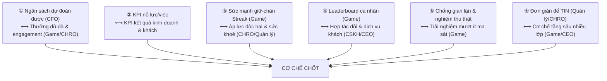

# Bàn tròn 6 vai — Xây cơ chế Lương · Thưởng · KPI · Chuyên cần · Streak

> Biên bản một **bàn tròn phản biện** giữa 6 vai: **Giám đốc Tài chính (CFO)**, **Giám đốc Nhân sự (CHRO)**, **CEO**, **Chuyên viên CSKH** (đại diện tiếng nói khách thuê), **Quản lý trực tiếp phòng trọ** (người dùng thật) và **Nhà thiết kế trò chơi (Game Designer)**.
>
> Mỗi vai nêu lập trường **độc lập** (không thấy ý người khác → tránh groupthink), rồi tranh luận **6 điểm căng**, cuối cùng tổng hợp thành **một cơ chế thống nhất sẵn sàng triển khai**.
>
> Đọc kèm [THIET-KE-BANG-LUONG-KPI-GAMING.md](THIET-KE-BANG-LUONG-KPI-GAMING.md) — tài liệu kỹ thuật mô tả hệ thống hiện tại + schema/RPC/điểm chèn code. File này là tầng **quyết định nghiệp vụ** nằm trên tài liệu kỹ thuật đó.
>
> Cập nhật: 2026-07-01.

---

## Cách đọc tài liệu

```
PHẦN A — Lập trường 6 vai          → mỗi vai muốn gì, lằn ranh đỏ, chất vấn
PHẦN B — 6 cuộc tranh luận         → đối đáp thật, mỗi cuộc kết bằng ➤ ĐỒNG THUẬN + ➤ CÒN MỞ
PHẦN C — CƠ CHẾ CHỐT (synthesis)   → bản hợp nhất, con số rõ, sẵn build
PHẦN D — Điểm còn mở + Phase 0     → thứ phải ĐO trước khi gắn tiền
```

**Bản đồ 6 điểm căng:**



---

# PHẦN A — LẬP TRƯỜNG 6 VAI

| Vai | Triết lý một câu | Lằn ranh đỏ chính |
|---|---|---|
| **CFO** | Mỗi đồng thưởng phải MUA được kết quả KD; quỹ ĐÓNG có trần theo % doanh thu/toà; tiền chốt khi LOCK. | Phủ quyết thưởng open-ended không trần; chi trên doanh thu chưa thực thu; chốt từ số realtime. |
| **CHRO** | Lương phải BỀN & CÔNG BẰNG trước khi VUI; lương cứng là quyền, gaming chỉ khuếch đại — không biến thu nhập thành canh bạc. | Phủ quyết lương cứng < đủ sống; phạt/hồi tố khi nghỉ ốm-phép; sửa-giảm rule giữa tháng; KPI cliff. |
| **CEO** | Lương-thưởng là vốn đầu tư có ROI; thưởng KẾT QUẢ không thưởng HOẠT ĐỘNG; đơn giản đủ hiểu trong 5 phút. | Cơ chế nào sau 2 tháng không chứng minh ROI thì cắt; tối đa 3 KPI tiền-thật + 1 lớp gaming. |
| **CSKH** | Đo "khách ở lại & hài lòng", không chỉ "việc đã đóng"; việc chỉ xong khi khách xác nhận. | Không để khách IM LẶNG phạt nhân viên (48h = OK); ≥40% quỹ biến đổi gắn kết-quả-khách. |
| **Quản lý phòng trọ** | Lương phải DỄ tới mức nhẩm được; chỉ chịu trách nhiệm cái TRONG TAY; thưởng đứa làm THẬT, không thưởng đứa giỏi diễn ảnh. | Không trừ vào base; không phạt vì thị trường/khách quan; geofence việc-lẻ chỉ audit (GPS bê tông lệch). |
| **Game Designer** | Engagement tốt KHUẾCH ĐẠI động lực nội tại, không thay bằng tiền (overjustification); mọi con số mục tiêu sẽ bị Goodhart. | Cấm random-hoá TIỀN (loot-box = dark pattern); đừng đụng khoảnh khắc cảm xúc lúc hoàn thành. |

### A.1 — CFO (Giám đốc Tài chính)
- **Ưu tiên:** (1) Trần quỹ biến đổi = **7% doanh thu thực thu/toà**; (2) dồn tiền từ thưởng-theo-việc (open-ended) sang **KPI kết quả** (occupancy/ontime/retention); (3) mọi đồng qua cổng chống rò rỉ (geofence ok + dedup); (4) đối soát ngược P&L toà, loại cọc + bàn giao nội bộ; (5) streak/chuyên cần dùng **quỹ đóng**, mỗi cơ chế phải khai trần trước khi bật.
- **Đề xuất ký tên:** RPC `salary_pool_forecast(period_month)` cho CFO thấy bonus inflation **trước** khi LOCK; alert >80% trần; chặn LOCK nếu vượt trần chưa override.
- **Chất vấn sắc:** "Toà occupancy 98% sẵn do thị trường — trả 1.5M là ROI hay quà cho may mắn?"

### A.2 — CHRO (Giám đốc Nhân sự)
- **Ưu tiên:** (1) **Lương cố định ≥ 65% thực nhận** TB 3 tháng — gaming chỉ là phần "nổi"; (2) công bằng giữa vai **sửa-chữa vs chăm-khách** (hiện thưởng nghiêng nặng số-việc-sửa, 3 KPI giá trị cao vẫn preview chết); (3) streak/chuyên cần **không phạt nghỉ chính đáng** (khiên + ngày phép); (4) khoá rule trước ngày 1 + đường khiếu nại "Báo sai số"; (5) giữ tín hiệu phi-tiền tách bạch với tiền.
- **Chất vấn sắc:** "Khiên 2 ngày/tháng có đủ khi nhân viên ốm 4 ngày không?"

### A.3 — CEO
- **Ưu tiên:** (1) **Wire 3 KPI thật** (đòn bẩy lớn nhất); (2) trần tổng lương/doanh thu **18–22%/toà** để scale; (3) dồn trọng số sang **outcome**, giảm activity; (4) **cổng chất lượng** (khiếu nại khách) mở khoá KPI; (5) đơn giản tối đa 3 KPI + 1 lớp gaming, hiểu trong 5 phút.
- **Nguyên tắc cắt-tỉa:** mỗi lớp gaming-có-tiền tự biện minh ROI sau 2 tháng, nếu không thì cắt.

### A.4 — CSKH (đại diện khách thuê)
- **Ưu tiên:** (1) **CSAT 1 chạm qua Zalo** + **escrow 30%** thưởng việc sửa + **clawback reopen**; (2) **≥40%** quỹ biến đổi gắn KPI kết-quả-khách (retention + CSAT + ontime); (3) việc **thầm lặng** (giữ khách, gỡ rối) phải được công nhận; (4) cổng chất lượng **vô hiệu** KPI nếu có khiếu nại xác minh được.
- **Lằn ranh:** khách không phản hồi 48h = **mặc định OK, không trừ một xu** — chỉ chặn nhân viên bịt miệng sự cố, không phạt vì khách lười.

### A.5 — Quản lý trực tiếp phòng trọ
- **Ưu tiên:** (1) Lương cứng vững, **không trừ vào base**; (2) KPI phải có **lối-thoát-công-bằng** (loại phòng sửa lớn >7 ngày, HĐ khách-báo-trễ); (3) **geofence việc-lẻ chỉ audit** (GPS nhà bê tông lệch 100–200m), override có chữ ký cho ngày-công; (4) **4 khối bề mặt + bấm-xổ lý do** từng dòng; (5) thưởng người làm thật.
- **Đóng góp vô giá:** chỉ ra các mánh — ảnh chụp lại up nhiều việc, job rác giữ chuỗi, hai người trùng tên "Hùng" làm loạn heuristic HH Sale.

### A.6 — Game Designer
- **Ưu tiên:** (1) **Tách cứng 2 lớp** — Cảm xúc realtime (popup/hạng/streak/season) vs Tiền LOCK; (2) streak **nhỏ + nghiêng phi-tiền** + **khiên trước khi gắn tiền**; (3) đếm **ngày-qua-cổng-ảnh** không đếm số việc (chống Goodhart); (4) mở rộng **season + level đặc quyền thật + peer recognition**; (5) **cấm random-hoá tiền** (loot-box).
- **Tự phê bình:** "Mọi con số tôi đặt làm mục tiêu đều sẽ bị tối ưu méo mó — kể cả streak của chính tôi → vì thế phải rút TIỀN ra khỏi gaming, dồn vào phi-tiền."

---

# PHẦN B — 6 CUỘC TRANH LUẬN

## ① Ngân sách dự đoán được ⟷ Thưởng đủ-đã & engagement

**CFO:** Tôi mở màn bằng con số cứng. Trần quỹ thưởng biến đổi của tôi là **7% doanh thu THỰC THU mỗi toà** — đã loại cọc, loại bàn giao nội bộ. Trong trần đó phải nhét đủ: thưởng-việc + DAY_BONUS + streak + chuyên cần + KPI. Tôi cộng nhanh kịch bản xấu nhất một người đạt-trần: KPI 3.3M + chuyên cần 600K + streak 600K. Hơn 4.5M biến đổi/người/tháng. Nhân 3 nhân viên một toà là 13.5M. Một toà 20 phòng giá 3.5M, lấp đầy 90%, thực thu ~63M → 7% là **4.4M**. Các anh vừa xài gấp ba lần trần. Toà đó lỗ. Ai trả?

**Game Designer:** Khoan — anh cộng dồn như thể mọi người đều chạm mọi mốc mọi tháng. Mốc streak của tôi THƯA DẦN phi tuyến: 3 ngày 30K, 7 ngày 80K, 14 ngày 200K, 30 ngày 600K — và chỉ trả **một lần mỗi mốc mỗi tháng**, dedup `(staff_id, milestone_days, YYYY-MM)`. Người chạm 30 ngày liên tục có việc-qua-cổng-ảnh là người làm thật cả tháng. Đó là tín hiệu, không phải lạm phát.

**CFO:** "Một lần mỗi mốc" không cứu tôi nếu tổng vẫn không có trần TOÀ. Anh đặt trần per-person, tôi cần trần per-building.

**CHRO:** Tôi đứng giữa — đồng ý với CFO về *trần*, nhưng phản đối *cách* gộp. Anh nhét KPI vào chung trần 7% → tôi phủ quyết. KPI gắn trực tiếp dòng tiền: occupancy cao, thu đúng hạn, giữ khách. Đó là tiền công ty NÊN tiêu vì nó tự sinh doanh thu. Nhốt chung rọ với streak rồi haircut cả cụm là cắt đúng cái đẻ ra tiền.

**CFO:** Nếu KPI tách ngoài trần thì phải có trần RIÊNG cứng. Tôi chấp nhận **KPI cap 3.3M/người ngoài 7%** — nhưng chỉ khi tính trên tiền ĐÃ VÀO SỔ THẬT, không trên hoá đơn phát hành.

**Game Designer:** Và đây là chỗ tôi tách hẳn lập trường. Tôi KHÔNG muốn dồn nhiều tiền vào streak/chuyên cần. Overjustification — trả tiền cho "có mặt đều" thì nhân viên định giá lại công việc theo tiền, chất lượng nội tại tụt. Tôi muốn streak/chuyên cần **NHỎ và nghiêng phi-tiền**: vương miện "Nhân viên tháng", badge mùa giải vĩnh viễn, một ngày nghỉ-có-lương. Anh và tôi cùng phe: tôi giải bonus inflation bằng cách rút tiền RA khỏi gaming, anh giải bằng cách bọc trần quanh tiền.

**CFO:** ...Đó là điều hợp lý nhất tôi nghe nãy giờ. Nếu phần "vui" là badge và quyền chọn ca thay vì tiền mặt, trần 7% thở được ngay. Chốt: gaming pool tiền = phần DƯ trong 7% sau khi trừ thưởng-việc, **trần cứng 2M/toà/tháng**.

**CHRO:** Đồng ý có trần, nhưng "chia theo điểm hạng từ quỹ đóng" có mặt độc hại: nó biến streak thành trò tổng-bằng-không. Người này chạm mốc thì miếng bánh người kia nhỏ đi → giấu mánh, tranh việc. Tôi muốn mốc streak là **số tiền XÁC ĐỊNH** — chạm 7 ngày là 80K, chấm hết — NHƯNG có trần per-person VÀ một van an toàn cấp toà.

**CHRO:** Van an toàn: haircut chỉ áp lên **streak + chuyên cần**, KHÔNG áp KPI, KHÔNG áp thưởng-việc đã hoàn thành qua cổng ảnh — vì cắt tiền của việc người ta ĐÃ làm là lằn ranh đỏ của tôi, anh em nghỉ việc hàng loạt. Vượt 2M → haircut tuyến tính riêng phần streak/chuyên cần, **công bố TRƯỚC tháng**. Người ta chấp nhận phần "nổi" co lại; KHÔNG chấp nhận phần "đã làm" bị moi lại.

**Quản lý trực tiếp** *(chen vào)*: Khoan. "Doanh thu thấp → thưởng tự co" nghe gọn trên slide, nhưng toà tôi tháng này ế vì **thị trường**, không phải anh em tôi lười. Cùng mức làm việc, tháng trước đủ trần, tháng nay vỡ trần bị haircut. Anh em hỏi "sao thưởng hụt", tôi trả lời sao? Họ đâu gây ra cái ế. **Đừng nhét CHUYÊN CẦN và STREAK vào cái trần co theo doanh thu** — hai cái đó đo công sức tôi bỏ ra. Tôi lội đi 26 ngày dù toà ế hay không. Cột KPI/occupancy vào doanh thu thì hợp lý; cột công-chuyên-cần vào doanh thu là phạt tôi vì cái tôi không điều khiển được.

**CHRO:** Trúng. Tôi đề xuất tách: **chuyên cần mức Bạc (200K) là bậc cố định, không haircut**; chỉ mức Vàng và perfectMonth mới nằm trong quỹ-co.

**CFO:** Tôi nhượng bộ có điều kiện. Chuyên cần Bạc cố định — nhưng phải nằm trong trần sàn riêng tôi tính được trước. Và mọi đồng phải qua cổng: việc CÓ thưởng và ngày-công chuyên cần phải có **geofence ok ≤70m**, hết audit-only.

**Quản lý trực tiếp:** Geofence cứng tôi cảnh báo: nhà bê tông GPS lệch 100–200m là thường. Bật cứng phải cho quản lý **override thủ công có audit**, không thì anh em mất ngày công OAN → mất luôn chuyên cần cố định. Cho tôi override, tôi chịu trách nhiệm chữ ký.

**CFO:** Override có audit log thì tôi chấp nhận. Rò rỉ kiểm soát bằng truy vết, không bằng chặn mù.

**➤ ĐỒNG THUẬN:**
1. **Hai trần tách biệt:** Trần biến đổi/toà = **7% doanh thu thực thu** (gồm thưởng-việc + DAY_BONUS + phần "nổi" streak/chuyên cần). **KPI tách RA NGOÀI**, trần riêng **3.3M/người**, tính trên tiền đã vào sổ, bậc thang nội suy (không cliff).
2. **Rút tiền khỏi gaming, dồn vào phi-tiền** (Nhân viên tháng, badge mùa vĩnh viễn, ngày nghỉ-có-lương, quyền chọn ca) — không vào `salary_monthly`, không LOCK, không méo P&L.
3. **Tầng đáy cố định / tầng đỉnh co:** Chuyên cần **Bạc 200K cố định không haircut**; Vàng + perfectMonth + **toàn bộ streak** trong quỹ-co cấp toà (**2M/toà/tháng**), haircut tuyến tính khi vượt.
4. **Haircut chỉ chạm phần "nổi":** KHÔNG haircut KPI, thưởng-việc đã làm, chuyên cần Bạc. **Lương cứng bất khả xâm phạm.**
5. **Cổng tiền + lối thoát con người:** geofence **ok ≤70m bắt buộc** cho việc-có-thưởng + ngày-công, NHƯNG **override quản lý kèm audit log** chống false-negative GPS.
6. **Rủi ro tháng-ế phân chia rõ:** thưởng-KẾT-QUẢ co theo doanh thu (nhân viên & cổ đông cùng chịu); thưởng-CÔNG-SỨC tầng đáy KHÔNG co (công ty chịu, vì nhân viên điều khiển được).
7. **`salary_pool_forecast`** per-toà; alert >80%; chặn LOCK nếu vượt trần chưa override owner (audit). Rule chốt trước ngày 1, chỉ sửa-tăng.

**➤ CÒN MỞ:** Trần gaming 2M/toà chưa kiểm chứng (chạy forecast ngược T4–T6/2026); chuẩn hoá KPI theo độ khó toà chưa có công thức; % geofence-ok thực tế chưa đo.

---

## ② KPI nỗ lực/việc ⟷ KPI kết quả kinh doanh & khách

**CFO:** Hiện 100% thưởng chảy về ACTIVITY — `job_types.bonus_amount`, sửa chữa 30K/việc, đếm được, bắn popup. Còn 3 KPI giá trị cao nhất — occupancy 1.5M, ontime 1M, retention 800K — vẫn preview chết trong `SalaryConfig.tsx`. Sai địa chỉ tiền cơ bản. Sửa chữa nhiều = CHI PHÍ nhiều, không phải doanh thu.

**CEO:** Đồng ý hướng. Nhưng cảnh báo cái bẫy của chính ta: wire KPI mà giữ cliff "95% mới có 1.5M" thì người ở 90% và 94% buông tay như nhau. Tệ hơn — Goodhart: đặt occupancy làm mục tiêu tiền → nhân viên nhồi khách rác để vọt mốc. Phải tuyến tính + đo trung bình ngày-phòng, không snapshot.

**Quản lý trực tiếp:** Khoan. Hai anh nói về occupancy và thu-đúng-hạn như thể tôi điều khiển được. Tôi PHỦ QUYẾT KPI occupancy tính trên tổng phòng thô. Phòng ế vì thị trường ế. Khách chậm trả vì khách chậm — tôi gí súng vào đầu họ à? Còn thứ TRONG tay tôi — đi làm đủ ngày, sửa xong, chụp ảnh tại chỗ — các anh lại bảo "activity rác".

**CFO:** Nếu occupancy hoàn toàn ngoài tầm bạn, thì vai trò quản lý vận hành để làm gì?

**Quản lý trực tiếp:** Nó ảnh hưởng MỘT PHẦN. Tôi dọn phòng nhanh, trả lời khách lịch sự, sửa vòi trước khi khách dọn vào — cái đó tôi làm được. Nhưng giá thuê, vị trí, đối thủ mở cạnh bên — không. KPI nào không có **LỐI THOÁT CÔNG BẰNG** tôi phủ quyết: loại phòng đang sửa lớn >7 ngày khỏi mẫu số, loại HĐ khách-đã-báo-trễ-có-ghi-nhận.

**CSKH:** Tôi bênh "outcome" nhưng theo hướng khác CFO. Một job "đã đóng" KHÔNG đồng nghĩa "khách hài lòng". Nghiệm thu bằng ảnh tự chụp của chính người làm là lỗ hổng. Goodhart không chỉ tạo việc ảo — nó tạo **SỬA ẨU**: đóng job ngay khi chụp được tấm ảnh đẹp, sự cố chưa hết, khách gọi lại. Thưởng theo tốc độ + số việc = cỗ máy sản xuất sửa ẩu.

**Game Designer:** Goodhart kinh điển, và tôi — người thiết kế lớp gaming — phải nói thẳng để bảo vệ chính nó: **mọi con số mục tiêu đều bị tối ưu méo.** Đó là lý do tôi KHÔNG đếm số việc. Tôi đếm **NGÀY-CÓ-VIỆC-QUA-CỔNG-ẢNH**. Một ngày >8 việc is_repair cùng phút, cùng toạ độ → cờ nghi vấn.

**CSKH:** Cổng ảnh chưa đủ. Ảnh chứng minh "có làm", không chứng minh "làm ĐÚNG". Tôi muốn **CSAT 1 chạm qua Zalo**: "Sự cố xử lý xong chưa? [Đã xong 👍 / Chưa ổn 👎]". Và **escrow 30%** thưởng job sửa — giữ tới LOCK, giải toả nếu không có "Chưa ổn". Cộng **clawback**: cùng phòng + cùng loại sự cố reopen trong 10 ngày → trừ 50% thưởng lần trước.

**Quản lý trực tiếp:** Khoan! Escrow nghe hay nhưng tôi sợ khách IM LẶNG. Trừ tiền nhân viên vì khách không bấm nút thì tôi mất người.

**CSKH:** Đúng, và lằn ranh đỏ của tôi chính xác chỗ đó: **không phản hồi sau 48h = mặc định OK, không trừ.** Tôi chỉ giữ khi có 👎 RÕ RÀNG. Tôi không phạt vì khách lười — chỉ chặn nhân viên bịt miệng sự cố.

**CHRO** *(nhập cuộc)*: Phanh ở đây. CFO và CEO dồn tiền sang outcome — đúng — nhưng quên độ KHÓ KHÁC NHAU giữa các toà. Không chuẩn hoá baseline từng toà → thưởng OAN người nhận toà đầy sẵn, phạt OAN người nhận toà ế. Người giỏi nhận toà khó sẽ bỏ việc.

**Game Designer:** Câu trả lời: thưởng theo CẢI THIỆN, không theo mức tuyệt đối. Hoặc — KPI trả theo **TOÀ/QUÝ chia cho NHÓM** phụ trách. Đo occupancy trung bình 3 tháng, sàn chất lượng: chỉ đếm HĐ ≥3 tháng hiệu lực để chặn nhồi khách rác.

**Quản lý trực tiếp:** Tôi chấp nhận đo theo quý + theo nhóm — nhưng giữ cho tôi BẬC THANG: ≥85%→500K, ≥90%→1M, ≥95%→1.5M, đo trung bình cuối mỗi tuần, không chốt 1 ngày.

**CFO:** Bậc thang OK. Nhưng tôi cắm cọc: tất cả — KPI + thưởng-việc + streak + chuyên cần — nằm trong **TRẦN 7% doanh thu THỰC THU/toà** (`counts_in_business_result`, loại cọc + bàn giao nội bộ ~363tr đang bóp méo P&L). Vượt → haircut phần biến đổi khi LOCK, giữ base.

**CSKH:** Tôi chốt: tối thiểu **40%** quỹ thưởng biến đổi gắn KPI kết-quả-khách (retention + CSAT + on-time).

**➤ ĐỒNG THUẬN:**
1. **Wire 3 KPI thật, BẬC THANG mượt, đo QUÝ + theo NHÓM:**
   - Occupancy: ≥85%→500K, ≥90%→1M, ≥95%→1.5M; TB ngày-phòng/tuần trong quý; **loại khỏi mẫu số** phòng sửa mở >7 ngày, phòng chủ giữ, phòng mới chưa khai thác.
   - Thu đúng hạn: ≥80%→400–500K, ≥90%→1M; tính theo **SỐ HĐ**, scope `staff_assignments`, ân hạn +3 ngày, loại HĐ `defer_acknowledged` (lý do+audit, trần 15%). VÔ HIỆU nếu có khiếu nại "ép thu".
   - Retention: **TỈ LỆ** gia hạn/HĐ đáo hạn (từ `contract_extensions`), theo quý, sàn HĐ ≥3 tháng; ≥2 khiếu nại nghiêm trọng → retention=0.
   - Trần KPI 3–3.3M/người, NGOÀI trần thưởng-việc.
2. **Chống Goodhart bằng cổng CHẤT LƯỢNG:** đếm ngày-qua-cổng-ảnh không đếm việc; CSAT Zalo + escrow 30% (khách im lặng 48h = OK); clawback reopen 10 ngày.
3. **Trần đóng:** tổng biến đổi ≤ 7% doanh thu thực thu/toà; vỡ → haircut phần biến đổi, KHÔNG đụng base (≥65% thực nhận).
4. **Cân bằng leading/lagging:** streak/chuyên cần (leading) = lớp cảm xúc NHỎ + phi-tiền; KPI (lagging) = nơi dồn tiền, đo QUÝ/NHÓM + lối-thoát-công-bằng. ≥40% quỹ biến đổi gắn kết-quả-khách.
5. Rule chốt trước ngày 1; tiền chốt khi LOCK; sửa `award_job_bonus` nuốt lỗi → `salary_award_errors`.

**➤ CÒN MỞ:** Công thức baseline độ-khó-toà; cá nhân vs nhóm khi đổi người phụ trách giữa kỳ; quy trình kháng nghị CSAT 2 chiều; ngưỡng `defer_acknowledged` 15% đủ chặn lạm dụng chưa.

---

## ③ Sức mạnh giữ-chân Streak ⟷ Áp lực độc hại & sức khoẻ

**Game Designer:** Lõi: streak là vũ khí giữ-chân mạnh nhất, gần như miễn phí. Nhân viên mở `/finance/my-salary` mỗi ngày để giữ chuỗi — đó là D7/D30 retention không tốn quảng cáo. Mốc thưa dần: 3=30K, 7=80K, 14=200K, 30=600K. **2 khiên/tháng**, CN không tính, ngày phép không phá chuỗi và không tốn khiên. Tôi gắn khiên TRƯỚC khi gắn tiền — điều kiện tiên quyết của chính tôi.

**Quản lý trực tiếp:** Khoan. Toà tôi có tháng cả toà êm ru, 4–5 ngày không hỏng gì. "Ngày công hợp lệ = có ≥1 việc qua cổng ảnh" nghĩa là tôi phải **đi bới việc ra để chấm điểm**. Anh em sẽ tạo job rác mỗi ngày để giữ chuỗi. Anh đang biến "ngày yên ổn" — thứ TỐT cho công ty — thành "ngày mất streak". Cơ chế của anh thưởng cho sự cố, mà sự cố là chi phí.

**Game Designer:** Cơ chế chống: đếm theo NGÀY-CÓ-VIỆC-QUA-CỔNG-ẢNH, không theo SỐ việc. Một ngày 10 job rác vẫn chỉ tính 1 ngày...

**Quản lý trực tiếp:** Vẫn không giải quyết! Anh chặn 10 job thành 1, nhưng không chặn được việc **bắt buộc phải có 1 việc/ngày**. Toà không hỏng thì tôi vẫn phải nặn ra 1 cái.

**CHRO:** Cái nguy hiểm hơn job rác là **presenteeism**. Mốc 30 ngày → 600–700K nghĩa là nhân viên ốm sốt ngày thứ 28 sẽ tính: "lết đi chấm 1 việc giữ 700K, hay nghỉ mất sạch?". Anh ta lái xe đi lúc mệt — rủi ro sức khoẻ VÀ pháp lý. Tôi yêu cầu hạ mốc cao nhất: streak 30 ngày **500K** không 700K.

**Game Designer:** Khiên giải quyết đúng ca đó. Ngày 28 ốm → tiêu 1 khiên, chuỗi không đứt.

**CHRO:** Hai khiên/tháng. Người ốm sốt xuất huyết nằm 4 ngày thì sao? Khiên cạn ở ngày 2, ngày 3–4 chuỗi đứt, 700K bay. **"Khiên 2 ngày có đủ khi ốm 4 ngày không?"** Anh chưa trả lời.

**Game Designer:** Công bằng. Hai cơ chế cộng thêm: (1) **ngày phép có duyệt KHÔNG tính gap và KHÔNG tốn khiên** — tách biệt với khiên. Ốm-có-khai-báo 4 ngày → đóng băng chuỗi. (2) Mất chuỗi **không bao giờ hồi tố trừ tiền đã trả** — mốc đã chạm là vĩnh viễn. Loss aversion chỉ ở "mất cơ hội mốc tiếp", không phải "bị moi lại tiền".

**Quản lý trực tiếp:** "Ngày phép có duyệt" — AI duyệt? Tôi. Trên điện thoại. Giữa lúc chạy 3 toà. Mỗi lần anh em ốm tôi phải vào đánh dấu cho từng đứa. Thêm việc hành chính, không thêm lương. Quên một hôm thì nó đứt chuỗi vì lỗi của TÔI, rồi nó hận tôi.

**CHRO:** Đồng tình. Gánh "đánh dấu nghỉ chính đáng" không được đổ hết lên quản lý, càng không để **khách quan (quên duyệt, lỗi hệ thống) phá thu nhập**. Nếu 700K streak đủ lớn để gây tranh cãi "ai quên duyệt", con số đó SAI ngay từ đầu.

**Game Designer:** Vậy ta gặp nhau: **hạ sức nặng tiền của streak xuống mức "vui", dồn sang phi-tiền** — vương miện leaderboard, badge "Vô địch Mùa 1" vĩnh viễn, quyền chọn ca. Loss aversion với một badge nhẹ hơn nhiều so với 700K.

**Quản lý trực tiếp:** Cái này nghe được. Nhưng tôi giữ 2 lằn ranh: **(1) CN mặc định KHÔNG bắt buộc** (bóc lột trá hình); **(2) push "sắp mất chuỗi" phải động viên, không doạ, không bắn đêm.**

**CHRO:** Chốt (2): **không push streak khung 21h–7h**. "Bạn sắp mất..." là hù doạ — phủ quyết. Phải "còn hôm nay để giữ chuỗi nhé", bắn 19:00.

**➤ ĐỒNG THUẬN:**
1. **Hạ tiền, nâng cảm xúc:** mốc **3=30K, 7=80–100K, 14=200K, 30=500K** (không 700K), **trần streak ≤ 500K/người/tháng**. Sức nặng giữ-chân dồn sang **phi-tiền**.
2. **Streak là cảm xúc, không phải trụ thu nhập:** server-authoritative (`salary_streak_state`), tiền chốt khi LOCK.
3. **Chống presenteeism — 3 lớp khiên:** (a) **2 khiên/tháng**; (b) **ngày phép/ốm duyệt → đóng băng chuỗi, KHÔNG tốn khiên**; (c) **CN mặc định không bắt buộc**.
4. **Không phạt khách quan:** đứt chuỗi chỉ mất cơ-hội-mốc-tương-lai, **KHÔNG hồi tố trừ tiền**; mốc đã chạm vĩnh viễn (dedup `(staff_id, milestone_days, YYYY-MM)`).
5. **Push nhân văn:** cổ vũ, bắn **19:00**, TẮT khung **21h–7h**.
6. **Chống job-rác:** đếm ngày-qua-cổng-ảnh; ảnh trùng hash/ngày không tính; cờ pattern trùng phút-toạ độ.

**➤ CÒN MỞ:** Geofence cứng cho ngày-công hay ngưỡng rộng + override; ai gánh thao tác "duyệt nghỉ phép cứu chuỗi"; toà ít sự cố có nên cho "ngày-có-mặt" tính cả thu tiền/checkin không chỉ is_repair.

---

## ④ Leaderboard cá nhân ⟷ Hợp tác đội & dịch vụ khách

**Game Designer:** Nói thẳng ngay: tôi KHÔNG đề xuất leaderboard cá nhân-tiền. Leaderboard %income_goal là lớp CẢM XÚC, free. Tiền thật của tôi ở KPI theo TOÀ/QUÝ chia cho nhóm. Cái mọi người sợ — "cạnh tranh cá nhân giết hợp tác" — tôi cũng sợ y hệt.

**CSKH:** Nhưng lập trường viết ra và cái nhân viên CẢM NHẬN là hai chuyện. Bạn để leaderboard %goal CÔNG KHAI realtime, crown "Nhân viên tháng", confetti vàng. Nhân viên không đọc tài liệu thiết kế — họ nhìn màn hình thấy thằng đứng đầu. Việc nào đẩy %goal nhanh nhất? Sửa chữa 30K/cái, ký HĐ +50K. Còn việc của TÔI — trấn an khách bực, theo sự cố khó 3 ngày, giữ khách sắp bỏ — KHÔNG bắn popup, KHÔNG lên leaderboard. Bạn vừa dạy cả đội rằng việc thầm lặng là việc vô hình.

**Game Designer:** Đó là vấn đề ĐO LƯỜNG, không phải leaderboard...

**CSKH:** Đưa retention lên thế nào? %goal tính theo income_goal — số mốc doanh thu gross vượt. Giữ một khách KHÔNG tạo "doanh thu mới" tháng đó, nó NGĂN một khoản mất tháng sau. Không bao giờ hiện trên leaderboard gross. Đó là lý do tôi đòi ≥40% quỹ gắn KPI kết-quả-khách.

**CEO:** Tôi cắt vào. Đồng ý chẩn đoán, không đồng ý liều thuốc nếu làm phình cơ chế. Tối đa 3 KPI tiền-thật + 1 lớp gaming, hiểu trong 5 phút. Câu hỏi thật: leaderboard cá nhân có giá trị gì để giữ, hay vứt sạch?

**Game Designer:** Giữ — nhưng đổi TRỤC. So %goal gross thì đúng là đua săn việc thưởng cao. Giải pháp: leaderboard hiển thị **"tiến bộ so với chính mình tháng trước"**, crown "Nhân viên tháng" gắn CHẤT LƯỢNG.

**CHRO:** Chính xác cái tôi ghi. Thêm cột "tiến bộ" để người mới/toà khó không đội sổ. Người dưới đáy 2 tháng liên tiếp → 1:1 hỗ trợ, không bêu tên. Nhưng tôi đẩy xa hơn: leaderboard cá nhân vẫn dạy "mày so với đồng đội". Tôi đề xuất trích 10% quỹ gắn KẾT QUẢ ĐỘI chia đều — tận dụng Teams.

**CSKH:** 10% quá ít. KPI kết-quả-khách phần lớn là chuyện ĐỘI: occupancy toàn toà, retention cụm — một mình không giữ nổi 95% nếu đồng nghiệp ca kia bỏ bê.

**CHRO:** Đừng gộp. 40% của CSKH là KPI kết-quả đo theo TOÀ. 10% của tôi là lát CẮT RIÊNG thưởng đội chia đều, cộng THÊM. Hai cái không mâu thuẫn, nhưng cộng lại thì coi chừng...

**CFO:** ...coi chừng vỡ trần. Một toà 30 phòng ~90tr/tháng, 7% là 6.3tr cho TOÀN BỘ biến đổi. Thêm "thưởng đội 10%" là thêm miệng ăn vào cùng cái bánh, hay cắt RA từ KPI?

**Game Designer:** Cắt ra. KPI trả theo TOÀ/QUÝ chia nhóm — bản chất ĐÃ là thưởng đội. occupancy ≥95% → 1.5M chia đều team. CHRO không cần thêm 10% riêng; chính cấu trúc "KPI theo toà chia nhóm" đã ép hợp tác.

**CHRO:** Nếu KPI đã chia theo nhóm thì tôi rút yêu cầu 10% — gộp luôn. Nhưng giữ điều kiện cứng: chống **"kẻ ăn không"** (free-rider). Chia đều 1.5M cho 3 người, thằng lười hưởng y như thằng cày → bất công kiểu khác.

**CSKH:** Vì thế KPI đội phải đi kèm cổng chất lượng CÁ NHÂN: mỗi người phải qua ngưỡng tối thiểu (≥X ngày công hợp lệ, không khiếu nại thái độ) mới nhận phần. Thằng ăn không bị khoá, phần đó dồn chia cho người còn lại.

**Game Designer:** Đồng ý, thêm lớp cảm xúc hợp tác KHÔNG cần tiền: badge "Đội Vô địch Mùa N", "Nhân viên tháng" 1 người/toà gắn chất lượng. Việc thầm lặng của CSKH → achievement riêng: "Người giữ khách" (đếm contract_extensions), "Người gỡ rối" (job khó/SLA dài + CSAT 'Đã xong'). Lên huy hiệu, KHÔNG lên leaderboard gross.

**CEO:** Nếu occupancy toà đã 98% vì thị trường — vẫn chia 1.5M là ROI hay quà may mắn?

**CSKH:** Vì thế retention quan trọng hơn occupancy thô. Giữ khách đang muốn đi là CÔNG của nhân viên, đo qua contract_extensions. Thị trường tốt không tự gia hạn HĐ. Dồn trọng số vào retention thì tách nỗ lực khỏi may mắn tốt hơn.

**➤ ĐỒNG THUẬN:**
1. **Bỏ leaderboard cá nhân theo %goal-gross.** Thay bằng 2 cột: xếp hạng + "tiến bộ so với chính mình tháng trước (%)". Đáy 2 tháng → 1:1 hỗ trợ, không bêu tên.
2. **KPI kết-quả = cơ chế hợp tác chính, trả theo TOÀ/QUÝ chia nhóm** (staff_assignments/Teams). Cấu trúc này TỰ NÓ là thưởng đội → gộp luôn, KHÔNG thêm "10% đội riêng".
3. **Chống free-rider:** mỗi cá nhân qua ngưỡng tối thiểu (ngày công hợp lệ + không khiếu nại thái độ) mới nhận phần chia; phần người bị khoá dồn cho người còn lại.
4. **Việc thầm lặng công nhận PHI-TIỀN:** achievement "Người giữ khách", "Người gỡ rối"; "Nhân viên tháng" gắn chất lượng; badge mùa "Đội Vô địch".
5. **Trần cứng bao trùm tất cả:** tổng biến đổi ≤ 7% doanh thu thực thu/toà; vượt → haircut tỉ lệ, base bất khả xâm phạm.

**➤ CÒN MỞ:** Tỉ lệ chính xác phần "chia đều đội" vs "thưởng việc cá nhân"; ngưỡng chống free-rider; phân bổ công/tội retention khi đổi người giữa kỳ; chuẩn hoá độ-khó-toà.

---

## ⑤ Chống gian lận & nghiệm thu thật ⟷ Trải nghiệm mượt ít ma sát

**CFO:** Geofence đang audit-only 70m. Nghĩa là một nhân viên có thể đứng ở quán cà phê, bấm hoàn thành việc sửa, ăn 30K, hệ thống ghi `geofence_status='out'` rồi... không làm gì. Tôi không duyệt một đồng nào khi cửa rò rỉ còn mở. Việc CÓ `bonus_amount>0` phải có `geofence_status='ok'` ≤70m; ngoài bán kính → **bonus = 0 + cờ NEEDS_REVIEW**.

**Game Designer:** Tôi không cãi nguyên tắc — tôi cãi bật cứng cho TẤT CẢ. Hiện bao nhiêu % việc COMPLETED thực sự có `geofence_status='ok'`? Chưa ai đo. Nhà bê tông GPS lệch 100–200m là cơm bữa. Bật cứng mà tỉ lệ ok thật chỉ 60% → anh biến 40% việc THẬT thành "0đ — nghi gian lận". Đó là tự bắn vào chân.

**Quản lý:** Đúng cái tôi sợ. Nhưng tôi tách bạch: geofence cứng cho **NGÀY CÔNG chuyên cần và streak** thì tôi đồng ý (tiền thưởng-có-mặt). Còn thưởng việc lẻ 30K thì để audit thôi.

**CFO:** Vậy có đường phân giới. Chấp nhận: geofence audit-only cho việc-lẻ, **ok bắt buộc** cho ngày-công. Một việc qua cổng ảnh trong bán kính/ngày là đủ.

**CSKH:** Cả ba tranh nhau về GPS như thể GPS là bằng chứng "việc đã xong". Không. Đứng ĐÚNG toà, chụp ĐÚNG ảnh, geofence xanh — và sửa **ẩu**. Ảnh tự chụp chứng minh anh ta CÓ MẶT, không chứng minh SỬA ĐÚNG. Lỗ hổng to hơn cả GPS.

**Game Designer:** Đồng ý nhưng cẩn thận Goodhart. Gắn tiền vào "khách bấm xác nhận" là tạo con số mới để tối ưu méo: nhân viên nài khách bấm, hoặc khách bực bấm Chưa ổn vô lý → mất tiền oan.

**CSKH:** Nên tôi KHÔNG để khách im lặng phạt. Zalo một chạm, **không phản hồi 48h = mặc định OK**. Tôi chỉ giữ **escrow 30%**, giải toả khi LOCK nếu không có "Chưa ổn" chưa xử lý. Dopamine loop vẫn bắn realtime đầy đủ — anh em vẫn thấy +30K nhảy lên ngay, chỉ 30% chờ tới cuối tháng.

**Game Designer:** Escrow 30% tôi chịu được vì popup nguyên vẹn — lằn ranh của tôi: **đừng đụng khoảnh khắc cảm xúc lúc hoàn thành**. Nhưng UI phải nói rõ "tạm tính", không thì lúc LOCK trừ 30%, nhân viên thấy "bị quỵt" còn đau hơn. Và tôi thêm: **clawback reopen** — cùng phòng, cùng loại sự cố, tạo lại job trong 10 ngày → bằng chứng sửa ẩu mạnh hơn nút bấm của khách.

**CFO:** Giờ phần tôi gai nhất: **thu hộ khống và thông đồng**. Thu hộ **không bao giờ sinh thưởng**; mọi phiếu đối soát `salary_staff_id` tường minh. Phiếu thu >5M phải có ảnh chứng từ. Không có `salary_staff_id` → cờ '!' đỏ.

**Quản lý:** AI gắn `salary_staff_id`? Đổ hết lên tôi là thêm việc không lương. Phải **một chạm trên điện thoại** — chọn người ở form, dấu *. Đừng để hệ thống đoán như heuristic tên, hai thằng "Hùng" là loạn.

**CFO:** Một chạm thì tôi trả được — rẻ hơn chi phí gán nhầm hoa hồng. Chốt: form HH bắt buộc field người-nhận, thiếu → cờ '!' chặn LOCK.

**Quản lý:** Mánh phổ biến nhất: chụp một ảnh đẹp rồi up cho nhiều việc. Watermark Timemark có ngày-giờ-địa-chỉ rồi, cộng **chống trùng hash** là bịt được. Thêm: >8 việc is_repair/ngày → cờ cho tôi review, đừng tự chặn.

**CFO:** Nếu Quản lý chính là người thông đồng thì sao? Mọi việc gắn cờ **phải có audit log: ai gắn, lý do gì**. Khoản trừ thủ công >200K cần người duyệt thứ hai.

**Game Designer:** Tất cả sụp đổ nếu `award_job_bonus` còn **nuốt lỗi im lặng**. Anh em làm xong, popup không nhảy, không ai biết tại sao — lỗ hổng niềm tin lớn hơn mọi gian lận, vì nó làm nhân viên TRUNG THỰC nghĩ hệ thống ăn gian. Phải log: `console.warn` + bảng `salary_award_errors`.

**➤ ĐỒNG THUẬN:**
1. **Geofence hai tầng:** việc-lẻ = **audit-only 70m**; ngày-công chuyên cần + streak = **ok ≤70m BẮT BUỘC** (≥1 việc qua cổng ảnh trong bán kính/ngày). Điều kiện tiên quyết: backend ĐO trước tỉ lệ `geofence_status='ok'` thực tế; thấp → nới ngưỡng/override quản lý có audit.
2. **Ảnh tự chụp KHÔNG đủ — 2 cổng hành vi:** Escrow 30% thưởng việc sửa (popup +full realtime ghi "tạm tính", giải toả khi LOCK nếu không có 👎; khách im lặng 48h = OK, không trừ); Clawback reopen 10 ngày (job lại 0đ + trừ 50% lần trước).
3. **Chống việc ảo/điểm danh khống:** đếm NGÀY-CÓ-VIỆC-QUA-CỔNG-ẢNH; ảnh trùng hash/ngày → không tính; cờ pattern; >8 việc/ngày → review.
4. **Chống thu hộ khống + thông đồng:** CASH_COLLECTION không bao giờ thưởng; HH Sale bắt buộc `salary_staff_id` (1 chạm + dấu *), thiếu → cờ '!' chặn LOCK (bỏ heuristic tên); thu >5M cần ảnh; cờ/khoản trừ có audit log; trừ >200K cần duyệt 2.
5. **`award_job_bonus` PHẢI log lỗi** → `salary_award_errors`.

**➤ CÒN MỞ:** Tỉ lệ `geofence_status='ok'` thực tế chưa đo; trần số lần override/tháng; cửa sổ reopen 10 ngày có quá cứng với sự cố mùa vụ; escrow 30% gây rối bảng kê — cần dòng giải thích trên self-view.

---

## ⑥ Đơn giản để TIN ⟷ Cơ chế tầng sâu nhiều lớp

**Quản lý trực tiếp:** Cái tôi sợ nhất. Tháng trước anh em thấy popup "+30K", "+50K ngoài giờ" — vui. Giờ chồng thêm streak, chuyên cần, KPI occupancy, thu đúng hạn, retention, combo, rank, season... Đến lúc LOCK, nhân viên hỏi "sao em ra số này?", tôi phải mở **năm màn hình** mới giải thích. Lằn ranh đỏ: nếu tôi không nhẩm nổi lương mình thì cơ chế đó SAI.

**Game Designer:** Đồng ý nỗi sợ, không đồng ý kết luận. Vấn đề không phải SỐ LƯỢNG cơ chế — mà cơ chế nào HIỆN dạng tiền và lúc nào. Tách cứng 2 lớp: Cảm xúc (popup/hạng/streak/season/combo) chạy realtime, hào phóng — nhưng **không phải tiền sổ sách**. Tiền thì bảo thủ, chỉ chốt khi LOCK. Season/rank/combo/badge **không vào `salary_monthly`** → không cần giải thích trong bảng lương vì chúng không phải lương.

**Quản lý trực tiếp:** Nghe hay trên slide. Nhưng popup "+30K" trông y hệt tiền — nó kêu, confetti, nói "+30K". Nhân viên không phân biệt "cảm xúc" với "sổ sách". Cuối tháng thiếu, họ bảo tôi quỵt.

**Game Designer:** Lỗi UI, tôi nhận. Mỗi popup tiền phải nói **"tạm tính — chốt cuối tháng"**, và tab "Bảng kê công việc" phải cho thấy **từng dòng** vì sao có/không thưởng, kể cả "0đ — thiếu ảnh".

**CHRO:** Tôi cùng phía Quản lý nhưng vì lý do con người. Cờ-bạc-hoá thu nhập là dạng độc hại âm thầm: phần biến đổi quá lớn, nhảy tháng/tháng → nhân viên không dự toán nổi → lo âu tài chính. Nguyên tắc cứng: lương cố định ≥ **65%** thực nhận TB 3 tháng. Đơn giản không chỉ là "hiểu được" mà là "đoán trước được tháng sau".

**CEO:** Tôi phản biện cả hai. "Đơn giản bề mặt" không có nghĩa "ít cơ chế" — mà **ít DÒNG TIỀN**. Tôi không quan tâm dưới nắp ca-pô có streak, season hay combo — miễn nhân viên mở bảng lương thấy đúng **bốn khối**: Lương cứng, Thưởng việc, KPI kết quả, một dòng "Thưởng gaming". Đào sâu thì có chi tiết, bề mặt thì bốn dòng.

**Quản lý trực tiếp:** Bốn khối tôi chịu được. Nhưng "Thưởng gaming" gộp streak + chuyên cần + rank — khi nhân viên hỏi "sao 350K không phải 500K?", tôi vẫn phải đào. Tôi cần mỗi khối **bấm vào xổ ra** đúng dòng con với lý do, ngay trên self-view.

**Game Designer:** Đó chính xác là "đơn giản bề mặt, sâu khi đào". Mặc định 4 khối. Chạm "Thưởng gaming" → xổ ra: "Chuyên cần Bạc 22 ngày = 350K", "Streak 14 ngày = 200K", và dòng âm tính minh bạch: "Streak 30 ngày = chưa đạt (đứt ngày 18, đã dùng 2 khiên)". Mỗi dòng tự giải thích.

**CFO:** Điều kiện lên toàn bộ "đào sâu": mỗi `bonus_kind` mới phải có **một dòng trong báo cáo dự báo quỹ** trước khi bật. Game Designer nói season/combo không vào `salary_monthly` — tốt, vậy chúng phải tiêu **0đ**. Nếu "Nhân viên tháng" được 1 ngày nghỉ-có-lương ~150–300K, thì KHÔNG phải 0đ, nó là tiền trá hình và phải vào trần. Đừng giấu chi phí dưới nhãn "phi-tiền".

**Game Designer:** Chấp nhận. Badge, crown, leaderboard, skin hiếm = 0đ thật. Ngày-nghỉ-có-lương đúng là tiền, đưa vào trần và hiện rõ. Nhưng phần lớn "sức kéo" nên dồn vào thứ 0đ, vì tiền lặp lại thành kỳ vọng rồi bão hoà, công nhận xã hội thì không.

**CHRO:** Thêm điều kiện không nhân nhượng: luật của tháng **công bố trước ngày 1**, cấm sửa rule làm GIẢM thưởng giữa tháng đang chạy. Minh bạch không chỉ là "thấy được dòng", mà "luật không đổi sau lưng".

**CEO:** Siết thêm: sau 2 tháng đo mà một lớp gaming không cho ROI — không kéo được occupancy/retention — tôi cắt. Mỗi cơ chế phải tự biện minh sự tồn tại.

**➤ ĐỒNG THUẬN:**
1. **Quy tắc "4 khối bề mặt":** self-view mặc định CHỈ hiện 4 dòng tiền — (1) Lương cứng, (2) Thưởng việc, (3) KPI kết quả, (4) Thưởng gaming (gộp streak+chuyên cần+rank); + khối trừ (ứng/tiền phòng). Trần cứng về số DÒNG TIỀN.
2. **"Sâu khi đào":** mỗi khối bấm-xổ dòng con tự-giải-thích, gồm cả dòng **âm tính** và dòng **0đ**. Không bắt quản lý tra chéo.
3. **Popup "tạm tính":** mọi popup tiền gắn nhãn rõ; tiền thật vào `salary_adjustments` khi LOCK; sửa award nuốt lỗi → `salary_award_errors`.
4. **Tách tiền/phi-tiền chặt:** badge/crown/skin/leaderboard/season = **0đ thật**, không vào `salary_monthly`. Phi-tiền quy ra tiền (ngày nghỉ) PHẢI vào trần + hiện rõ.
5. **Cổng quản trị mỗi `bonus_kind`:** (a) có dòng trong dự báo quỹ, (b) khai trần chi/người/tháng, (c) công bố luật trước ngày 1, cấm sửa-giảm giữa tháng.
6. **Kỷ luật cắt-tỉa:** review sau 2 tháng, không ROI thì cắt.

**➤ CÒN MỞ:** Hai trần (per-người 65% của CHRO vs per-toà 7% của CFO) chưa hoà thành một công thức haircut; KPI đội nằm trong khối "KPI kết quả" hay phá quy tắc "4 khối"; ai bấm `salary_staff_id`/`defer_acknowledged`.

---

# PHẦN C — CƠ CHẾ CHỐT (bản hợp nhất, sẵn build)

*(gắn vào module `/finance/salary`, `salary_adjustments`, `award_job_bonus`, LOCK theo tháng)*

## C.1 — Triết lý chốt (5 nguyên tắc bất biến)

1. **Hai lớp tách cứng — Cảm xúc realtime vs Tiền LOCK.** Popup/hạng/streak/season/combo chạy realtime, hào phóng, biến thiên — nhưng KHÔNG phải tiền sổ sách. Tiền chỉ chốt khi LOCK qua `salary_adjustments`. Mọi popup tiền ghi *"tạm tính — chốt cuối tháng"*.
2. **Trần kép, base bất khả xâm phạm.** Trần biến đổi **7% doanh thu thực thu/toà** (gồm thưởng-việc + phần nổi gaming) + **KPI riêng 3.3M/người** ngoài trần đó. Haircut chỉ chạm phần "nổi"; **lương cứng ≥ 65% thực nhận, không bao giờ haircut**.
3. **Chống Goodhart bằng cổng CHẤT LƯỢNG, không chỉ số lượng.** Đếm ngày-qua-cổng-ảnh (không đếm việc); CSAT + escrow; clawback reopen; KPI có sàn chất lượng + lối-thoát-công-bằng.
4. **Nhân văn — không phạt khách quan.** Khiên + ngày phép không phá chuỗi; đứt streak không hồi tố trừ tiền; push không bắn đêm, không hù doạ; khách im lặng 48h = OK.
5. **Phi-tiền = 0đ thật, tách khỏi P&L.** Badge/crown/skin/season không vào `salary_monthly`. Bất kỳ phi-tiền quy-ra-tiền (ngày nghỉ-có-lương) PHẢI vào trần và hiện rõ — không giấu chi phí dưới nhãn "phi-tiền".

## C.2 — Cấu trúc thu nhập tổng

```
Thực nhận = Lương cứng (base)                       ← KHỐI CỐ ĐỊNH, bất khả xâm phạm
          + A. Thưởng việc (per-job qua cổng ảnh)   ← MỞ, trong trần 7%/toà
          + B. KPI kết quả (occupancy/ontime/retention) ← ĐÓNG, quỹ/toà-quý, trần 3.3M/người NGOÀI 7%
          + C. Thưởng gaming (chuyên cần + streak)   ← phần nổi ĐÓNG trong trần 7%
          + HH Sale                                  ← bắt buộc salary_staff_id (bỏ heuristic)
          + Lợi nhuận đầu tư (nếu cổ đông)
          − Ứng lương − Tiền phòng                   ← khối trừ
```

### Phân loại MỞ / ĐÓNG và trần

| Khối | Loại | Nguồn trần | Co theo doanh thu? | Haircut khi vỡ trần? |
|------|------|-----------|--------------------|----------------------|
| Base | Cố định | — | KHÔNG | KHÔNG (bất khả xâm phạm) |
| A. Thưởng việc | **MỞ** per-việc | Trong 7%/toà | Đã-làm-qua-ảnh: KHÔNG | KHÔNG |
| B. KPI kết quả | **ĐÓNG** quỹ/toà-quý | Riêng, 3.3M/người | CÓ (đo trên thực thu) | Không, tự co theo bậc |
| C1. Chuyên cần **Bạc** (200K) | Bán-cố-định | Trần sàn riêng | KHÔNG | KHÔNG |
| C2. Chuyên cần Vàng+perfectMonth | **ĐÓNG** "nổi" | Quỹ-co gaming 2M/toà | CÓ | CÓ (tuyến tính) |
| C3. Streak | **ĐÓNG** "nổi" | Quỹ-co gaming 2M/toà | CÓ | CÓ (tuyến tính) |

### Guardrail ngân sách (công thức)

```
revenue_thucthu(toà, tháng) = Σ income_expenses
    WHERE counts_in_business_result = true
      AND NOT is_deposit                 -- loại cọc
      AND handover_transfer_id IS NULL   -- loại bàn giao nội bộ

Trần biến đổi (toà)  = 0.07 × revenue_thucthu(toà)
Quỹ gaming co (toà)  = max(0, Trần biến đổi − Σ thưởng_việc − Σ DAY_BONUS − C1_Bạc)
                       , CAP CỨNG 2.000.000đ/toà/tháng
Trần KPI (người)     = 3.300.000đ/tháng   (NGOÀI trần 7%)

Khi LOCK, nếu (C2 + C3) toà > Quỹ gaming co:
    haircut_factor = Quỹ gaming co / (C2 + C3)
    mỗi dòng C2/C3 nhân haircut_factor   -- KHÔNG đụng A, B, C1, base
```

**Cảnh báo dự báo:** RPC `salary_pool_forecast(period_month)` trả per-toà {thực-thu lũy kế, trần 7%, đã phát sinh, dự phóng, %tiêu hao}; push alert khi >80% trần; **chặn LOCK** nếu vượt trần chưa override owner (audit ai override).

## C.3 — Bộ KPI (scorecard)

### Nhóm LEADING (nỗ lực, controllable) — lớp cảm xúc, thưởng NHỎ, đo cá nhân/tháng

| KPI | Cách đo (dữ liệu có sẵn) | Ngưỡng & mức | Chống Goodhart |
|-----|--------------------------|--------------|----------------|
| **Chuyên cần** | DISTINCT ngày có ≥1 job COMPLETED qua cổng ảnh + geofence ok (`salary_attendance_day`) | Bạc 22ng→200K (cố định); Vàng 26ng→500K; perfectMonth (26ng, ≤2 excuse)→300K | Đếm NGÀY không đếm việc; ảnh trùng hash vô hiệu; geofence ok bắt buộc |
| **Streak** | `salary_streak_state` server-auth, ngày-công-hợp-lệ liên tiếp | 3→30K, 7→100K, 14→200K, 30→500K; **trần 500K/người/th** | Dedup `(staff_id, milestone_days, YYYY-MM)`; 2 khiên; CN không tính |
| **Thưởng việc** | `job_types.bonus_amount`; +50K HĐ ngoài giờ; +20K weekendRepair | Theo rule hiện có | Cổng ảnh + geofence audit; >8 job/ngày → cờ; CSAT + escrow |

### Nhóm LAGGING (kết quả/khách) — nơi DỒN tiền, đo QUÝ + theo NHÓM phụ trách toà

| KPI | Cách đo | Trọng số | Ngưỡng & mức (bậc thang, KHÔNG cliff) | Chống Goodhart |
|-----|---------|----------|----------------------------------------|----------------|
| **Occupancy** | TB ngày-phòng/tuần trong **quý**; mẫu số **loại** phòng có job sửa mở >7ng, phòng chủ giữ (RESERVED), phòng mới chưa khai thác | **Cao** | ≥85%→500K, ≥90%→1M, ≥95%→1.5M (nội suy mượt) | Đo TB tuần không snapshot; chỉ đếm HĐ ≥3 tháng hiệu lực |
| **Thu đúng hạn** | (Σ HĐ paid ≤ due_date+3 ân hạn) / Σ HĐ tới hạn; theo **SỐ HĐ**; scope `staff_assignments`; loại HĐ `defer_acknowledged` (lý do+audit, trần 15%) | **Cao** | ≥80%→400–500K, ≥90%→1M | VÔ HIỆU nếu khiếu nại "ép thu/thái độ"; chỉ tính tiền THỰC THU |
| **Retention** | **TỈ LỆ** gia hạn / HĐ đáo hạn (từ `contract_extensions`/`useRenewedContracts`, KHÔNG từ status — EXTENDED đã ngưng); theo **quý** | **Cao nhất** | ≥85%→800K, ≥70%→400K, <50%→0 | Sàn HĐ ≥3 tháng; ≥2 khiếu nại nghiêm trọng → retention=0; khu <3 HĐ đáo hạn gộp lên cấp khu |

**Tối thiểu 40% quỹ biến đổi** gắn KPI kết-quả-khách (retention + CSAT + ontime). **Trần KPI 3.3M/người**, ngoài trần 7%.

## C.4 — Chuyên cần

- **Ngày công hợp lệ** = `(staff_id, vn_local_date)` có **≥1 job COMPLETED** qua **cổng ảnh BẮT BUỘC** (kể cả `requirePhoto` global tắt) **TRONG geofence ≤70m**. Một ngày 1 lần dù nhiều việc. Ảnh trùng hash/ngày → không tính.
- **Mở định nghĩa:** ngày-công tính cả job **thu tiền / checkin / sửa** (không chỉ `is_repair`) để toà ít sự cố không thiệt — vẫn giữ cổng ảnh + geofence.
- **Ngưỡng thưởng** (`salary_adjustments` source='ATTENDANCE', chốt khi LOCK):
  - Bạc: **22 ngày → 200K** *(CỐ ĐỊNH, không haircut)*
  - Vàng: **26 ngày → 500K** *(phần "nổi", trong quỹ-co)*
  - perfectMonth: targetDays 26, excuseLimit ≤2 ngày nghỉ-có-báo → **+300K**
- Ngày phép/ốm có khai báo + duyệt → KHÔNG tính thiếu ngày, KHÔNG tốn khiên. CN mặc định không bắt buộc. Trần chuyên cần ≤700K/người/tháng.
- Realtime chỉ hiện tiến độ "còn X ngày tới mốc"; tiền chốt khi LOCK.

## C.5 — Chuỗi streak

- **Server-authoritative:** `salary_streak_state {staff_id, current_streak, last_active_date, freeze_used, freeze_available, updated_at}`. Lazy streak-touch khi đọc self-view (Phase 1 không cần cron).
- **Quy tắc:** ngày-công-hợp-lệ mới → `current+1`; gap >1 ngày lịch → đứt **TRỪ KHI** tiêu 1 khiên. CN (nếu `weekendDays` loại) + ngày phép duyệt KHÔNG phá, KHÔNG tốn khiên.
- **Mốc** (dedup `(staff_id, milestone_days, YYYY-MM)`): 3→30K, 7→100K, 14→200K, **30→500K**. **Trần ≤500K/người/tháng.**
- **Chống áp lực độc hại (3 lớp khiên):** (a) **2 khiên/tháng**; (b) ngày phép/ốm duyệt → đóng băng; (c) CN không bắt buộc.
- **Không phạt khách quan:** đứt chỉ mất cơ-hội-mốc-tương-lai, KHÔNG hồi tố trừ tiền đã trả.
- **Push nhân văn:** "còn hôm nay để giữ chuỗi nhé", bắn **19:00**, TẮT **21h–7h**.

## C.6 — Popup & vòng phản hồi

- Mở rộng `award_job_bonus` thêm `bonus_kind`: `STREAK` (skin lửa), `ATTENDANCE` (huy hiệu xanh), `RANK_UP` (vương miện), `GOAL_REACHED` (confetti to), `FIRST_OF_DAY` (cổ vũ 0đ). "Siêu combo" khi ≥3 dòng.
- **Biến thiên CHỈ ở SKIN, KHÔNG ở TIỀN:** skin hiếm ~1/20 việc. **Cấm random-hoá tiền** (loot-box = lằn ranh đỏ).
- Dedup: mỗi `bonus_kind` mới = 1 partial unique index.
- Chống spam: ≤1 daily-recap-push/người/ngày lúc **20:30**; không push streak sau 21h.
- Mọi popup tiền ghi *"tạm tính — chốt cuối tháng"*.
- **`award_job_bonus` log lỗi** vào `salary_award_errors` (+`console.warn`).
- **Phi-tiền (0đ thật):** badge, crown "Nhân viên tháng", leaderboard, season, skin. Phi-tiền quy-ra-tiền phải vào trần + hiện rõ.

## C.7 — Cân bằng cá nhân ⟷ đội nhóm

- **Bỏ leaderboard cá nhân theo %goal-gross.** Thay bằng 2 cột: xếp hạng + **"tiến bộ so với chính mình tháng trước (%)"**. Đáy 2 tháng liên tiếp → **1:1 hỗ trợ** (không bêu tên).
- **KPI kết-quả = cơ chế hợp tác chính:** trả theo **TOÀ/QUÝ chia đều nhóm** phụ trách (`staff_assignments`/Teams). Cấu trúc này TỰ NÓ là thưởng đội → gộp, KHÔNG thêm "10% đội riêng".
- **Chống free-rider:** mỗi cá nhân qua ngưỡng tối thiểu (ngày công hợp lệ + không khiếu nại thái độ) mới nhận phần chia; phần người bị khoá dồn cho người còn lại.
- **Việc thầm lặng PHI-TIỀN:** achievement "Người giữ khách" (đếm `contract_extensions` scope), "Người gỡ rối" (job khó/SLA dài + CSAT 'Đã xong'). "Nhân viên tháng" gắn CHẤT LƯỢNG, không số việc.

## C.8 — Chống gian lận & nghiệm thu

- **Geofence hai tầng:** việc-lẻ audit-only 70m; ngày-công + streak ok ≤70m bắt buộc + override quản lý có audit. Backend ĐO `% geofence_status='ok'` TRƯỚC khi gắn tiền.
- **Ảnh tự chụp KHÔNG đủ:** CSAT 1 chạm Zalo + escrow 30% (khách im lặng 48h = OK, không trừ); clawback reopen 10 ngày (job lại 0đ + trừ 50% lần trước; loại trừ "khách tự gây lại" có audit).
- **Chống việc ảo/điểm danh khống:** đếm ngày-qua-cổng-ảnh; ảnh trùng hash vô hiệu; cờ pattern; >8 job/ngày review.
- **Chống thu hộ khống + thông đồng:** CASH_COLLECTION không thưởng; HH Sale bắt buộc `salary_staff_id` (1 chạm + dấu *) thiếu → '!' chặn LOCK; thu >5M cần ảnh; mọi cờ/khoản trừ có audit log; trừ >200K cần duyệt 2.

## C.9 — Mở rộng xa hơn (chọn lọc)

| Đáng làm | Cơ chế | Vì sao |
|----------|--------|--------|
| ✅ **Season (quý)** | Bảng nhẹ `season_id`; reset leaderboard hiển thị về 0 đầu mùa; KHÔNG reset tiền/snapshot lương. Cuối mùa: badge "Vô địch Mùa N" vĩnh viễn | Người tụt hạng có điểm xuất phát mới; tinh chỉnh số/ngưỡng mỗi mùa mà không phá lương LOCK |
| ✅ **Level có đặc quyền THẬT** | Quyền chọn ca ưu tiên, 1 ngày nghỉ-có-lương (đưa vào trần vì là tiền trá hình), badge vĩnh viễn | Phi-tiền không bão hoà; engagement không méo P&L |
| ✅ **Peer recognition** | Đồng đội (Teams) tặng "lời cảm ơn"/ghi nhận (0đ); hiện trên self-view | Công nhận xã hội mạnh hơn tiền, không tốn quỹ |
| ⚠️ **Marketplace đổi thưởng** | HOÃN tới khi có ROI rõ — dễ thành điểm-ảo-thành-tiền, phá nguyên tắc "0đ thật" | Rủi ro biến cảm xúc thành nghĩa vụ chi |

## C.10 — Lộ trình & rủi ro còn lại

### Lộ trình

- **Phase 0 (ĐO trước khi gắn tiền — CHẶN mọi thứ khác):**
  1. Đo **% việc COMPLETED có `geofence_status='ok'`** theo từng toà → quyết bật-cứng hay override.
  2. Chạy `salary_pool_forecast` **ngược 3 tháng (T4–T6/2026)** xem toà nào vượt 7% nếu bật full → calibrate trần gaming 2M.
  3. **Sửa `award_job_bonus` nuốt lỗi** → bảng `salary_award_errors`. *(điều kiện CFO duyệt quỹ)*
  4. Bổ sung **`salary_staff_id` + dấu *** ở form phiếu chi HH Sale; bỏ heuristic tên.

- **Phase 1 (lớp cảm xúc, tiền nhỏ):** `salary_streak_state` + `salary_attendance_day` server-auth; mở rộng `bonus_kind` popup; leaderboard "tiến bộ"; season + badge phi-tiền. Chuyên cần Bạc cố định + streak trần 500K vào `salary_adjustments` khi LOCK.

- **Phase 2 (KPI tiền-thật — sau khi geofence calibrate):** wire 3 KPI từ preview hardcode → `salary_adjustments(source='KPI')`, đo quý/nhóm, bậc thang mượt. CSAT Zalo + escrow 30% + clawback. Bật `salary_pool_forecast` + alert 80% + chặn LOCK vượt trần.

- **Phase 3 (cắt-tỉa):** sau 2 tháng review ROI mỗi lớp gaming-có-tiền; không chứng minh Δoccupancy/Δretention → cắt.

### Rủi ro còn lại (chưa khoá)

1. **Chuẩn hoá độ khó từng toà** — toà 98% sẵn-do-thị-trường vẫn ăn KPI = quà may mắn. Đề xuất tạm: nghiêng trọng số sang **retention** (gia hạn là công nhân viên, ít phụ thuộc thị trường hơn occupancy thô).
2. **% geofence-ok thực tế chưa đo** — quyết định bật-cứng treo trên con số này.
3. **Trần gaming 2M/toà chưa kiểm chứng** — chờ forecast ngược.
4. **Phân bổ công/tội retention khi đổi người phụ trách giữa kỳ** — chưa có quy tắc.
5. **Ai bấm nút nào** (`salary_staff_id`, `defer_acknowledged`) — phải 1-chạm trên điện thoại, không đổ hành chính lên quản lý.
6. **Quy trình kháng nghị CSAT 2 chiều** — SLA + người duyệt chưa định.
7. **Trần per-người (CHRO ≥65%) vs trần per-toà (CFO 7%)** — chưa hoà thành một công thức haircut thống nhất khi cả hai cùng kích hoạt.
8. **Hoà cận biên hai trần** — khi haircut phần "nổi" làm tỉ trọng biến đổi tụt dưới kỳ vọng nhân viên đã thấy realtime → cần dòng giải thích escrow/haircut tường minh trên self-view (chưa thiết kế UI).

---

# PHẦN D — Tóm tắt hành động ngay

> **Bốn việc Phase 0 là điều kiện CHẶN — chưa làm xong thì chưa gắn một đồng tiền gaming nào:**

1. **Đo `% geofence_status='ok'`** theo từng toà (script đọc `jobs.completion_geofence_status`).
2. **`salary_pool_forecast` ngược T4–T6/2026** để calibrate trần gaming 2M/toà.
3. **Sửa `award_job_bonus` nuốt lỗi** → bảng `salary_award_errors`.
4. **Form HH Sale: person-picker `salary_staff_id` + dấu *** (bỏ heuristic `payer_name`).

Chi tiết schema/RPC/điểm chèn code cho từng cơ chế: xem [THIET-KE-BANG-LUONG-KPI-GAMING.md](THIET-KE-BANG-LUONG-KPI-GAMING.md) Phần 2.
