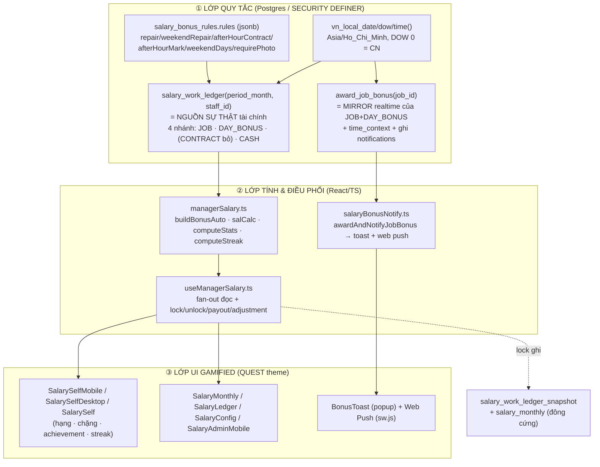
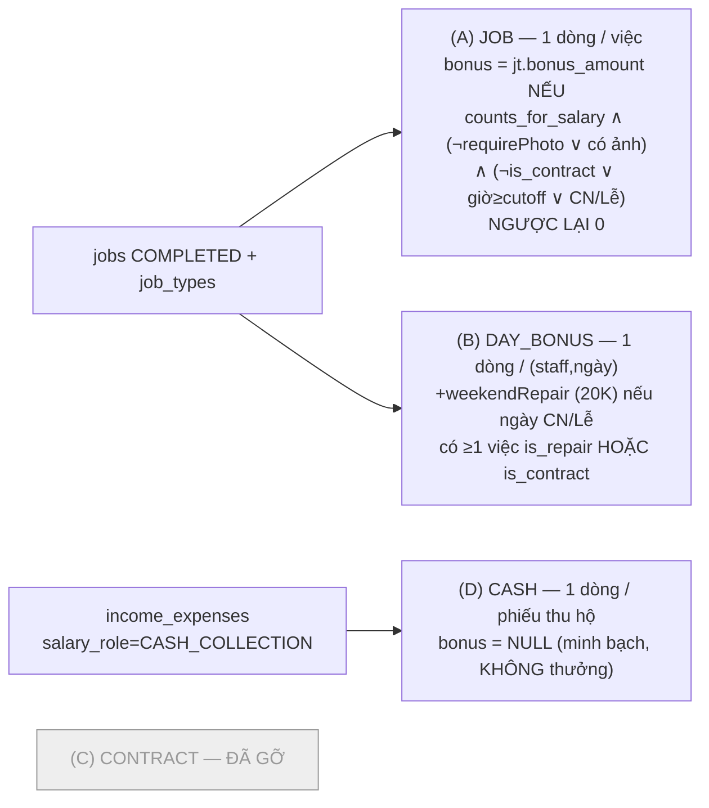
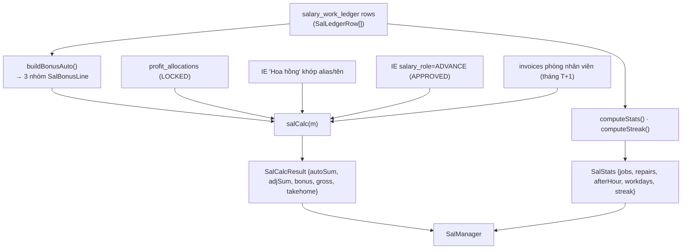
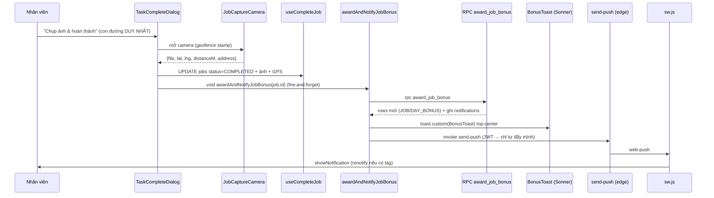
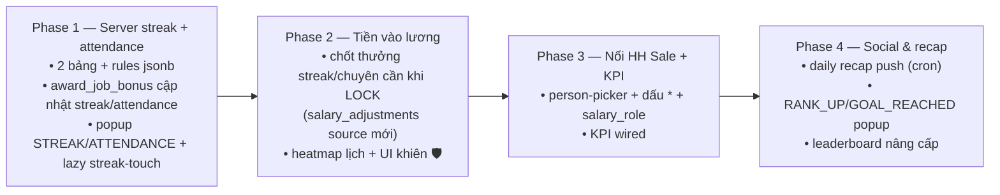

# Bảng lương KPI + Gamification — Kiến trúc hiện tại & Thiết kế hướng tới

> **Mục đích file này.** (1) Ghi lại **toàn bộ cấu trúc tính lương hiện tại** dưới dạng *logic flow + thành phần* để tham khảo; (2) Đặc tả **thiết kế bảng lương theo hướng gaming** mà team đang muốn xây: **chuyên cần**, **chuỗi streak**, và **popup thưởng công việc** mở rộng.
>
> Đọc kèm: `docs/he-thong/11-cong-viec-su-co.md` (jobs/job_types — đang **stale**, chưa nhắc 4 cột lương), `MEMORY.md` mục *Module Bảng lương quản lý*, *Thông báo thưởng khi hoàn thành việc*, *Cách port thiết kế mobile từ claude.ai/design*.
>
> Cập nhật: 2026-07-01.

---

## ⚠️ Cảnh báo nhầm lẫn: có HAI hệ "lương" khác nhau

Trước khi đọc tiếp, phân biệt rõ — tài liệu này **chỉ nói về Module A**:

| | **Module A — "Bảng lương quản lý"** (file này) | **Module B — "Lương điều hành"** |
|---|---|---|
| Route | `/finance/salary` (admin) + `/finance/my-salary` (self) | nằm trong `/finance/shareholder-profit` |
| Bản chất | Thưởng theo **việc thật** + lương cứng → thực nhận | Một **khoản lương trừ khỏi lợi nhuận từng toà** trước khi chia cổ đông |
| Bảng lõi | `manager_salary_config`, `salary_bonus_rules`, `salary_holidays`, `salary_monthly`, `salary_adjustments`, `salary_work_ledger_snapshot` | `profit_managers`, `profit_manager_salaries`, `profit_manager_salary_buildings`, `profit_manager_allocations` |
| Cột nối IE | `income_expenses.salary_staff_id` + `salary_role` | `income_expenses.profit_manager_id` |
| Lib TS | `src/lib/managerSalary.ts` | `src/lib/managementSalary.ts` |

Migration `20260629000020_profit_manager_salary.sql` ghi rõ Module B "KHÁC module Bảng lương quản lý cũ". **Đừng trộn hai cái.** Mọi nội dung dưới đây là Module A.

---

## Phần 0 — Triết lý thiết kế (nền tảng cho cả hiện tại lẫn tương lai)

Hệ thống hiện tại đã theo một triết lý nhất quán, và bản redesign **phải giữ nguyên** nó:

1. **Gamification là LỚP TRÌNH BÀY trên dữ liệu thật — KHÔNG có XP/level ảo.** Hạng (Tân binh→Vô địch), "chặng nhiệm vụ", streak… đều suy ra từ `gross` vs `income_goal` và từ các dòng ledger việc thật. Không có điểm thưởng tự bịa. Đây là điểm mạnh nhất, phải bảo toàn.
2. **Một nguồn sự thật tài chính duy nhất.** Tiền lương đến từ RPC `salary_work_ledger`. Mọi thứ realtime/gamified chỉ *phản chiếu* nó, không tự sinh tiền.
3. **Minh bạch từng đồng.** Tab "Bảng kê công việc" cho xem từng dòng vì sao có/không có thưởng (kể cả "0₫ — thiếu ảnh"). Gamification không được làm mờ con số thật.
4. **Vòng phản hồi tức thì.** Hoàn thành việc → popup + push ngay. Đây là "dopamine loop" cốt lõi cần khuếch đại.
5. **Chống gian lận bằng cổng dữ liệu, không bằng niềm tin.** Bắt buộc chụp ảnh tại chỗ (camera-only), geofence audit, dedup bằng unique index. Mọi cơ chế gaming mới (streak/chuyên cần) phải đi qua cùng các cổng này.

5 trụ gaming của hệ: **Mục tiêu/Tiến độ** (income goal, quest road) · **Streak** (chuỗi ngày) · **Chuyên cần** (workdays) · **Thưởng bất ngờ** (combo, time-context skin) · **Xã hội** (leaderboard). Bản redesign củng cố 3 trụ giữa.

---

# PHẦN 1 — HỆ THỐNG HIỆN TẠI (tham khảo)

## 1.1 Bản đồ kiến trúc — 3 lớp



**Điểm mấu chốt cần nhớ:**
- **Quy tắc tiền** nằm trong **1 RPC** (`salary_work_ledger`). `award_job_bonus` là bản sao realtime cho **1 việc** — *bất kỳ thay đổi quy tắc nào phải sửa CẢ HAI*.
- **Compute/Lock/Snapshot KHÔNG nằm trong DB RPC** mà ở TS (`useManagerSalary.ts`). Không có "lock RPC".
- **Streak và stats chỉ tính ở client** (`computeStreak`/`computeStats`) — *không* lưu server. Đây là giới hạn lớn nhất khi muốn gamify thêm (xem §1.9, §2.2).

---

## 1.2 Mô hình dữ liệu

### 1.2.1 `job_types` (mở rộng cho lương)
Base `016_job_workflow_tables.sql`; cột lương thêm ở `20260628000001` + `20260630000001`. RLS shared (`USING(true)`), `user_id` **không** dùng để lọc tenant.

| Cột | Kiểu / default | Ý nghĩa |
|---|---|---|
| `bonus_amount` | `NUMERIC(15,2)` def `0` | Tiền thưởng mỗi việc loại này hoàn thành (0 = không thưởng) |
| `is_repair` | `BOOLEAN` def `false` | Việc sửa chữa → kích hoạt phụ cấp CN/Lễ theo ngày (nhánh B) |
| `is_contract` | `BOOLEAN` def `false` | Việc **ký HĐ / checkin**; chỉ thưởng khi hoàn thành **sau `afterHourMark` HOẶC CN/Lễ** |
| `counts_for_salary` | `BOOLEAN` def `true` | Công tắc tổng: false = loại khỏi lương hoàn toàn |

> **Không có seed catalog cứng.** Toàn bộ `supabase/` **không** có `INSERT … bonus_amount`. Mỗi owner tự cấu hình giá trị cho từng loại việc trong UI (`TaskTypeFormDialog.tsx:399-451`). "Catalog việc" = dữ liệu per-tenant, không phải danh sách hardcode.

### 1.2.2 `jobs`
Status đã rút còn `IN_PROGRESS` / `COMPLETED` (`20260516000053`). Cột liên quan lương: `assignee_id` (FK profiles — **đây là trục scope của ledger**), `job_type_id`, `building_id`, `room_id`, `title`, `completion_time` (set `now()` khi xong), `completion_attachments` (jsonb — *cổng ảnh*), `completion_lat/lng/distance_m/geofence_status/address` (geofence **audit-only**, KHÔNG chặn, KHÔNG đọc bởi RPC thưởng). Ngày thưởng = `vn_local_date(COALESCE(completion_time, created_at))`.

### 1.2.3 `income_expenses` — cột nối lương
- `salary_staff_id UUID → auth.users ON DELETE SET NULL` — phiếu mà người nhận là **quản lý hưởng lương** (HH Sale / ứng lương / thu hộ). COMMENT cột ghi rõ kế hoạch: *"Hiện dấu * trên form, kết toán vào lương khi DUYỆT."*
- `salary_role TEXT CHECK IN ('ADVANCE','CASH_COLLECTION','COMMISSION')` — `ADVANCE`=ứng lương, `CASH_COLLECTION`=thu tiền mặt (không thưởng), `COMMISSION`=HH Sale.

### 1.2.4 `manager_salary_config` — ai hưởng lương (effective-dated)
PK `id`; `user_id` (owner), `staff_id` (= quản lý = `auth.uid`), `base_salary`, `default_room_rent`, `income_goal`, `role_title` (def `'Quản lý vận hành'`), `alias` (nickname để khớp phiếu HH theo `payer_name`), `room_id` (phòng giảm giá — tiền phòng = `total_amount` HĐ phòng đó), `effective_from/to`, `is_active`. **Tập `is_active` = danh sách quản lý hưởng lương.** Index `(staff_id, effective_from DESC)`.

### 1.2.5 `salary_bonus_rules` — quy tắc thưởng (1 dòng / owner, `UNIQUE(user_id)`)
`rules` jsonb, mặc định:
```json
{ "repair": 30000, "weekendRepair": 20000, "afterHourContract": 50000,
  "afterHourMark": "18:00", "weekendDays": [0], "requirePhoto": false }
```
- `repair: 30000` chỉ là **gợi ý mặc định** (giá trị thật đặt per-loại-việc ở `bonus_amount`).
- `weekendRepair: 20000` = phụ cấp/ngày CN-Lễ có việc sửa/HĐ.
- `afterHourContract: 50000` = thưởng ký HĐ ngoài giờ/CN-Lễ (nay thực thi qua việc `is_contract`).
- `afterHourMark: "18:00"`, `weekendDays: [0]` (0=CN; có thể đổi `[0,6]`), `requirePhoto`.
- Ngoài ra `rules.staffMonths = {"YYYY-MM": bool}` lưu *out-of-band* — override tháng nào nhân viên được xem self-view.

### 1.2.6 `salary_holidays`
`(user_id, holiday_date UNIQUE, name)` — lịch lễ nuôi quy tắc CN/Lễ. UI có nút "Nạp sẵn lễ VN 2026".

### 1.2.7 `salary_monthly` — header LOCK/snapshot (per quản lý per tháng)
`UNIQUE(staff_id, period_month)`, `status DEFAULT 'DRAFT' CHECK IN ('DRAFT','LOCKED')`. Cột đông cứng: `base_salary`, `work_bonus` (việc + ngày CN/Lễ), `contract_bonus` (HĐ ngoài giờ), `commission_total` (HH đã duyệt), `investment_profit` (LN cổ đông đã chốt), `adjustments_total` (manual có dấu), `advances_total`, `room_rent`, `gross_total`, `take_home`, `paid`, `payout_voucher_id`, `locked_at`, `locked_by`.

### 1.2.8 `salary_adjustments` — dòng thưởng/trừ tay
`kind CHECK IN ('BONUS','DEDUCTION')`, `label`, `amount >= 0` (dấu suy từ kind), `source CHECK IN ('MANUAL','ADVANCE_IE','ROOM_RENT','KPI')`, `income_expense_id`, FK `salary_monthly_id ON DELETE CASCADE`.

### 1.2.9 `salary_work_ledger_snapshot` — ledger đông cứng khi lock
Sao lại đủ cột RPC (`item_type, source_id, occurred_date, day_label, content, place, job_type_name, is_repair, is_contract, base_amount, weekend_amount, after_amount, cash_amount, has_photo, bonus_amount, reason`) + `salary_monthly_id`. Bất biến — lịch sử.

### 1.2.10 `notifications` (mở rộng cho popup thưởng)
Thêm `job_id UUID → jobs ON DELETE CASCADE`, `metadata jsonb DEFAULT '{}'`. Enum `notification_type` thêm `'SALARY_BONUS'`. **Hai partial unique index làm lưới chống trùng:**
- `uq_notif_bonus_job` ON `(user_id, job_id)` WHERE `type='SALARY_BONUS' AND metadata->>'bonus_kind'='JOB'` → 1 thưởng JOB / việc.
- `uq_notif_bonus_day` ON `(user_id, (metadata->>'bonus_date'))` WHERE `…='DAY_BONUS'` → 1 phụ cấp ngày / ngày.

### 1.2.11 `push_subscriptions`
`id, user_id (FK auth.users CASCADE), endpoint UNIQUE, p256dh, auth, user_agent, is_active, …`. RLS per-user + admin bypass. Index `(user_id) WHERE is_active`.

---

## 1.3 Bộ quy tắc — RPC `salary_work_ledger(p_period_month date, p_staff_id uuid = NULL)`

`plpgsql STABLE SECURITY DEFINER`, granted `authenticated`. Bản hiện hành: `20260630000002_ledger_drop_contract_branch.sql`. Trả về TABLE: `staff_id, item_type, source_id, occurred_date, day_label, content, place, job_type_name, is_repair, is_contract, base_amount, weekend_amount, after_amount, cash_amount, has_photo, bonus_amount, reason`.

**Setup:**
- `v_owner` = super-admin đầu tiên (`super_admins ORDER BY created_at LIMIT 1`) — chỉ để đọc rules/holidays.
- **Bảo mật self-view:** nếu caller không phải `is_admin()`/`is_super_admin()` → ép `v_staff := auth.uid()` (nhân viên chỉ thấy mình).
- Cửa sổ tháng `[date_trunc('month'), + 1 month - 1 day]`.
- Rules đọc từ `salary_bonus_rules`, fallback cứng: `weekendRepair→20000`, `afterHourContract→50000`, `afterHourMark→'18:00'`, `requirePhoto→false`, `weekendDays→[0]`.

### 4 nhánh sinh dòng



- **(A) JOB** — 1 dòng / việc COMPLETED có `counts_for_salary AND (bonus_amount>0 OR is_repair)`, scope theo `assignee_id` (self = `v_staff`; tổng hợp = `assignee_id IN` các `manager_salary_config` active). `day_label` = `'Lễ'` nếu ngày ∈ `salary_holidays`, else `'CN'` nếu `vn_local_dow ∈ weekendDays`, else `''`. `has_photo` = mảng attachments khác rỗng. **Công thức `bonus_amount`**: `jt.bonus_amount` nếu `counts_for_salary ∧ (¬requirePhoto ∨ có ảnh) ∧ (¬is_contract ∨ giờ_local ≥ afterHourMark ∨ CN ∨ Lễ)`, ngược lại **0** (dòng vẫn xuất hiện để minh bạch).
- **(B) DAY_BONUS** — `SELECT DISTINCT (assignee_id, ngày_local)` các việc CN/Lễ có `is_repair OR is_contract` → 1 dòng `weekend_amount = bonus_amount = weekendRepair (20K)`, lý do "CN/Lễ có sửa chữa hoặc ký HĐ".
- **(C) CONTRACT — ĐÃ GỠ** ở `20260630000002`. Trước đây đọc thẳng bảng `contracts` trả +50K cho HĐ tạo sau 18h/CN-Lễ. Gỡ để tránh đếm hai lần: +50K nay **chỉ** đến từ việc `is_contract` (checkin) ở nhánh A. FE vẫn dung thứ dòng `CONTRACT` cũ trong snapshot.
- **(D) CASH** — `income_expenses` `type='INCOME' AND salary_role='CASH_COLLECTION'`, scope `salary_staff_id`. `cash_amount = total_amount`, `bonus_amount=NULL`, lý do "Không tính thưởng". *(Hiện gần như rỗng vì chưa có UI ghi `salary_role` — xem §1.9.)*

---

## 1.4 RPC `award_job_bonus(p_job_id uuid)` — mirror realtime của (A)+(B)

`plpgsql VOLATILE SECURITY DEFINER`, granted `authenticated`. Bản hiện hành `20260630000005`. Trả TABLE: `bonus_kind, amount, label, note, place, content, icon, time_context, notif_id`.

**Guard (trả rỗng nếu trượt bất kỳ):** `auth.uid()` not null; việc `COMPLETED AND assignee_id = auth.uid()` (owner làm hộ việc người khác → rỗng); có `job_types`. Rules đọc theo owner.

**`time_context`** ưu tiên `HOLIDAY > SUNDAY > AFTER_HOURS > NORMAL` (dựa `vn_local_*(COALESCE(completion_time, created_at))`) — **chọn skin popup**.

- **(A) JOB insert** khi `counts_for_salary ∧ bonus_amount>0 ∧ (¬requirePhoto ∨ có ảnh) ∧ (¬is_contract ∨ giờ≥cutoff ∨ CN/Lễ) ∧ NOT EXISTS` thưởng JOB trước đó. `amount=jt.bonus_amount`, `icon` = 🔧 repair / 📝 contract / 💰 khác.
- **(B) DAY_BONUS insert** khi `(is_repair ∨ is_contract) ∧ CN/Lễ ∧ NOT EXISTS` phụ cấp ngày đó. `amount=weekendRepair (20K)`, `icon` 🔥.
- **Side effect:** mỗi dòng → `INSERT notifications (type='SALARY_BONUS', channel='IN_APP', status='PENDING', job_id, metadata={bonus_kind,amount,label,note,place,bonus_date,icon,time_context})`. RPC **chỉ trả dòng MỚI** (dedup `NOT EXISTS` + 2 unique index) → mở/hoàn thành lại không bắn popup trùng.

Helper `fmt_bonus_k(amt) → '+30K'`.

---

## 1.5 Pipeline tính ở TS — `src/lib/managerSalary.ts`

> "Compute ở TS" = RPC trả `bonus_amount` per-dòng đã *đủ điều kiện*; **TS chỉ nhóm và cộng**, không quyết định quy tắc tiền.



**`buildBonusAuto(ledger, requirePhoto)` → 3 nhóm:**
1. **JOB gộp theo `job_type_name`** (bỏ `is_contract`, bỏ `bonus_amount≤0`): `count`, `total=Σbonus`, `per=base_amount`, icon `Wrench`.
2. **DAY_BONUS**: 1 dòng "CN/Lễ có sửa chữa", icon `CalendarCheck`, `per=weekend_amount`.
3. **Ký HĐ**: rows `item_type='CONTRACT'` **HOẶC** (`JOB ∧ is_contract ∧ bonus>0`), icon `FileClock` — *icon này là dấu để tách work-bonus vs contract-bonus lúc lock*.

**`salCalc(m)` — công thức (per staff, per tháng):**
```
autoSum  = Σ bonusAuto[].amount
adjSum   = Σ adjustments[].amount      (deduction âm)
bonus    = autoSum + adjSum
gross    = base + bonus + investment + commission
takehome = gross − advance − roomRent
```

**`computeStats(ledger)`:** `jobs` = #JOB; `repairs` = #(JOB∧is_repair); `afterHour` = #CONTRACT hoặc (JOB∧is_contract∧bonus>0); `workdays` = số `occurred_date` *phân biệt* (bỏ DAY_BONUS).

**`computeStreak(ledger)`:** chuỗi ngày liên tục dài nhất tính lùi từ ngày hoạt động gần nhất (bỏ DAY_BONUS, khoảng cách 1 ngày = `86400000` ms). **⚠️ Chỉ client-side.**

**Tổng hợp inline trong hook (`useManagerSalary.ts`):**
- **investment** = Σ `profit_allocations.amount` của cổ đông tương ứng, **chỉ khi `profit_monthly.status='LOCKED'`**.
- **commission (HH Sale)** = Σ phiếu "Hoa hồng"/"HHMG" mà `income_expenses.payer_name` **khớp chuỗi** với alias HOẶC tên-gọi tiếng Việt của quản lý. Tháng draft: chỉ phiếu **CHƯA duyệt** được tính; phiếu **ĐÃ duyệt** → `commissionFlagged` (cảnh báo "!"). *(Heuristic mong manh — xem §1.9.)*
- **advance** = Σ IE `salary_role='ADVANCE'` đã `APPROVED` trong tháng.
- **roomRent** = `invoices.total_amount` mới nhất của phòng nhân viên ở **tháng T+1** (lương T trả ở T+1), fallback `default_room_rent`.

**Model `SalManager`** (cái mọi UI Path-A đọc): identity (`id,name,short,alias,role,initials,tone`), config (`base,roomRent,incomeGoal`), `bonusAuto[]`, `adjustments[]`, `investment(+By,Locked)`, `commission(+Items,Flagged)`, `advance(+Items)`, `roomRent(+Items)`, `paid`, `stats:SalStats`, `trend:SalTrendPoint[]` (6 tháng, chỉ tháng LOCKED + tháng live), `status`, `salaryMonthlyId`, `ledger:SalLedgerRow[]`, và **`calc:SalCalcResult`** (số headline UI đọc).

---

## 1.6 Cơ chế Lock / Snapshot (ở TS, không phải DB)

**Không có lock RPC.** Điều phối trong `useManagerSalary.ts`.

**Lock (`useLockSalaryMonth`):**
1. Auto-duyệt mọi phiếu HH còn DRAFT đang được tính (`approval_status→'APPROVED'`).
2. Mỗi quản lý: `salary_monthly.upsert(onConflict='staff_id,period_month')` `status='LOCKED'` + đông cứng toàn bộ tổng + `locked_at/by`. `contractBonus` = Σ dòng bonusAuto icon `FileClock`; `work_bonus = autoSum − contractBonus`.
3. Xoá snapshot cũ rồi **bulk-insert ledger live** vào `salary_work_ledger_snapshot`.

**Đọc khi đã lock = HOÁN ĐỔI live→frozen ở 3 lớp** (quyết theo `mRow.status==='LOCKED'`):
1. **Ledger rows** ← `salary_work_ledger_snapshot` (không gọi RPC live).
2. **Totals** ← cột frozen: `autoSum=work_bonus`, `adjSum=adjustments_total`, `bonus=work_bonus+contract_bonus+adjustments_total`, `gross=gross_total`, `takehome=take_home`.
3. **Commission/roomRent** ← `commission_total`/`room_rent` frozen.

→ Tháng đã lock **miễn nhiễm** sửa job/rules/holidays về sau.

**Unlock:** xoá snapshot + `status='DRAFT'`. **Payout:** tạo phiếu EXPENSE "Lương quản lý" (toà ảo "Chung", `business_result_accounting=false`, set `salary_staff_id`) rồi tăng `salary_monthly.paid` + `payout_voucher_id`.

**Gating tháng cho nhân viên:** mặc định "trễ 1 tháng tới khi chốt" — hiện tháng trước cho tới khi LOCKED rồi mới tiến; admin override qua `staffMonths` jsonb (RPC `salary_staff_months()`).

---

## 1.7 Luồng popup thưởng công việc (realtime)



**Chi tiết:**
- **Camera-only:** `TaskCompleteDialog` chỉ có một đường hoàn thành — chưa chụp ảnh thì không xong. Geofence **audit-only** (lưu `completion_geofence_status`, KHÔNG chặn, KHÔNG được RPC thưởng đọc — thưởng chỉ cần `completion_attachments` khác rỗng khi `requirePhoto`).
- **Fire-and-forget:** sau khi xong gọi `void awardAndNotifyJobBonus(job.id)`; mọi lỗi **nuốt** trong util để không vỡ UX (⚠️ thưởng hụt thì *im lặng* — xem §1.9).
- **`BonusToast` (3 mode):**
  1. **Single (xanh)** `.bp-pop`: 🎁 "Phần thưởng" + "🎉 CHÚC MỪNG", số `+{K}` count-up, tia jackpot, xu rơi 🪙, shine.
  2. **Combo (vàng, ≥2 dòng)** `.bp-pop--combo`: 🔥 "Thưởng kép! COMBO ×N", panel bóc tách, **canvas-confetti** + haptic `[40,60,120]`.
  3. **Trân trọng (single, theo time_context):** `night`🌙 ngoài giờ ("❤️ TRÂN TRỌNG"), `medal`🏅 CN ("⭐ TẬN TÂM"), `fest`🏮 Lễ ("🙏 TRI ÂN") — kèm lời cảm ơn của quản lý + sao lấp lánh.
- **Web Push self:** `send-push` chế độ **User-JWT** → chỉ đẩy cho chính người gọi (đủ vì người hoàn thành = assignee = chủ thiết bị). Title `🎉 +{K} COMBO`/`🎉 +{K} thưởng`. `sw.js` `renotify` khi có `tag=bonus-{jobId}`, click → focus tab `/finance/salary`.

**Catalog trigger popup hiện có:**

| Trigger | bonus_kind | Nguồn tiền | Icon | Điều kiện |
|---|---|---|---|---|
| Việc sửa/việc có thưởng | `JOB` | `job_types.bonus_amount` | 🔧/💰 | counts + bonus>0 + ảnh |
| Ký HĐ / checkin (+50K) | `JOB` | bonus của loại `is_contract` | 📝 | chỉ khi sau 18h HOẶC CN/Lễ |
| Phụ cấp CN/Lễ | `DAY_BONUS` | `weekendRepair` (20K) | 🔥 | việc sửa/HĐ vào CN/Lễ, 1 lần/ngày |

**KHÔNG bắn popup (quan trọng để redesign):** HH Sale (`salary_role='COMMISSION'`), thu hộ (`CASH_COLLECTION`), CONTRACT cũ (đã gỡ). Tin Zalo dùng đường push *khác* (worker service-role) nhưng *dùng chung* `send-push` + `push_subscriptions` + `sw.js`.

---

## 1.8 Lớp UI gamified hiện có (QUEST theme)

**Hai route, ba mặt self-view, nhánh theo `usePhoneViewport()`:**

| Mặt | Component | Theme | Dùng khi |
|---|---|---|---|
| Admin tổng (desktop) | `SalaryMonthly` + `SalaryLedger` + `SalaryConfig` | Sáng `.sal-root` | `/finance/salary` admin |
| Admin tổng (mobile) | `SalaryAdminMobile` | **QUEST tối**, 4 tab | admin trên phone |
| Self in-app (desktop) | `SalarySelf` | Sáng "Năng lượng" | non-admin desktop + admin preview |
| Self new-tab (desktop) | `SalarySelfDesktop` | **QUEST tối** full-screen | `/finance/my-salary` desktop |
| Self (mobile) | `SalarySelfMobile` | **QUEST tối** full-screen, 3 tab | cả 2 route trên phone |

**Yếu tố gaming đã có:**
- **Hạng:** `RANK_NAMES = ["Tân binh","Đồng","Bạc","Vàng","Vô địch"]` suy từ số mốc income-goal mà `gross` vượt (0–4). Badge avatar "Lv.{n}".
- **Chặng nhiệm vụ / Quest road:** 4 mốc — Khởi động (goal×0.25, ⚡) · Lương cứng (`base`, 💼) · Bứt phá (goal×0.75, 🔥) · Vô địch (goal, 🏆) — node check vàng vs node đứt nét, thanh tiến độ gradient, copy "Còn X để đạt mốc {next}".
- **Achievement 2×2:** Thợ sửa chữa (jobs/repairs) · Cú đêm (afterHour) · **Chuỗi lửa 🔥 (streak)** · Chuyên cần (workdays). Desktop = vòng SVG `/30` hoặc `/15`.
- **Leaderboard:** 🥇🥈🥉 + % goal (`SalaryMonthly`), roster xếp theo % (admin mobile).
- **Palette QUEST:** nền `#0d0a1a`/`#17132A`, card `#221C3E` viền `#322A55`, vàng `#FFD23F`, xanh `#34D399`, tím `#A78BFA`; font `Space Grotesk`/`Space Mono`. KHÔNG dùng `.sal-root` (hardcode hex — comment "NGOÀI .sal-root → dùng hex/rgba tường minh").
- **BonusToast skins** + count-up + haptic + confetti, tất cả tôn trọng `prefers-reduced-motion`.

**Dữ liệu nuôi gaming** đã sẵn trong `SalManager`: `stats.{streak,jobs,repairs,afterHour,workdays}`, `incomeGoal`, `trend`. Mọi widget gaming chỉ đọc từ đây.

---

## 1.9 Khoảng trống & nợ kỹ thuật hiện tại (nền cho redesign)

1. **Streak & stats CHỈ client-side** (`computeStreak`/`computeStats`). Không lưu server, không thưởng được theo streak, dễ lệch giữa thiết bị, không thể push "sắp mất streak". → *Phải server-authoritative nếu muốn gamify thật* (§2.2).
2. **HH Sale / commission chưa nối chuẩn.** `salary_role='COMMISSION'`/`'CASH_COLLECTION'` + `salary_staff_id` + dấu `*` trên form đều **chưa dựng UI**. Commission đang khớp bằng heuristic `payer_name`↔alias/tên — vỡ khi trùng tên/sai chính tả. `CASH_COLLECTION` branch *chết* (không UI ghi).
3. **KPI card là preview chết** (`SalaryConfig.tsx`): occupancy≥95%→1.5M, ontime≥90%→1M, retention≥8HĐ→800K — **hardcode, chưa cộng vào lương**.
4. **`award_job_bonus` nuốt mọi lỗi** → thưởng hụt vô hình, không log.
5. **Dòng CONTRACT cũ** vẫn được special-case ở `managerSalary.ts`/test cho snapshot cũ dù ledger live không sinh nữa — nợ dọn.
6. **`is_contract` mặc định false, không backfill** → loại checkin cũ không trả +50K tới khi admin bật tay từng loại.
7. **Hằng số trùng lặp ở TS:** `DEFAULT_RULES` (useSalaryConfig), `50000` hardcode trong `SalarySelf.tsx`, mẫu số tiến độ `/30`,`/15`. Khi đổi rule dễ lệch.
8. **Docs thiếu:** không có file `docs/he-thong/` cho lương; doc jobs stale.

---

# PHẦN 2 — THIẾT KẾ HƯỚNG TỚI (BUILD: chuyên cần · streak · popup)

Mục tiêu: **khuếch đại vòng phản hồi** và thưởng cho **sự đều đặn/có mặt**, không chỉ "làm nhiều việc". Tất cả vẫn bám 5 trụ ở Phần 0 và đi qua cùng cổng chống gian lận.

## 2.0 Nguyên tắc bổ sung cho phần gaming mới

- **Server-authoritative cho mọi cơ chế có-thưởng-mới.** Streak/chuyên cần nếu *cộng tiền* hoặc *bắn push chủ động* thì **phải** có nguồn sự thật trong DB (không thể chỉ `computeStreak` ở client). Client vẫn được tính nhanh để hiển thị, nhưng tiền & milestone do RPC quyết.
- **Mirror đôi như hiện tại:** quy tắc đặt ở RPC tháng (`salary_work_ledger` hoặc bảng phụ) **và** đường realtime (`award_job_bonus` mở rộng) — luôn song song.
- **Dedup bằng metadata + partial unique index** (mẫu đã có) cho mọi loại thưởng mới.
- **Không phạt nghỉ chính đáng:** cơ chế "khiên/streak-freeze" và loại trừ ngày phép để gamification không thành áp lực độc hại.
- **Một `bonus_kind` mới = một skin popup mới + một key dedup mới + một dòng ledger mới.** Giữ nguyên ba-mảnh để dễ mở rộng.

---

## 2.1 Module CHUYÊN CẦN (Attendance)

### 2.1.1 Vấn đề
Hiện "chuyên cần" chỉ là tile hiển thị `workdays = #ngày-phân-biệt-có-việc`, tính ở client, **không thưởng**. Muốn: thưởng **có mặt đều** trong tháng (đi làm đủ ngày), tách khỏi "làm nhiều việc".

### 2.1.2 Định nghĩa "ngày công hợp lệ" (server)
Một `(staff_id, ngày_local)` là **ngày công hợp lệ** nếu có **≥1 việc COMPLETED** mà:
- `counts_for_salary = true`, **và**
- qua cổng ảnh (`completion_attachments` khác rỗng) — *bắt buộc cho chuyên cần dù `requirePhoto` global tắt*, để chống "điểm danh ảo",
- *(tuỳ chọn cấu hình)* geofence `completion_geofence_status='ok'` (đang audit-only; có thể bật làm điều kiện chuyên cần mà KHÔNG ảnh hưởng thưởng việc).

→ Dùng lại `vn_local_date(COALESCE(completion_time, created_at))`. Đây là bản "siết" của `workdays` hiện tại.

### 2.1.3 Quy tắc thưởng chuyên cần (cấu hình trong `salary_bonus_rules.rules`)
Thêm khối `attendance`:
```jsonc
"attendance": {
  "enabled": true,
  "tiers": [                      // thưởng theo ngưỡng số ngày công trong tháng
    { "days": 22, "bonus": 200000, "label": "Chuyên cần Bạc" },
    { "days": 26, "bonus": 500000, "label": "Chuyên cần Vàng" }
  ],
  "perfectMonthBonus": 300000,    // thưởng nếu đủ ngày công mục tiêu, 0 ngày "lỗ hổng"
  "targetDays": 26,               // mốc "tháng hoàn hảo"
  "excuseLimit": 2,               // số ngày nghỉ được tha không phá "tháng hoàn hảo"
  "requirePhotoForDay": true,
  "requireGeofence": false
}
```
- Thưởng **chốt một lần khi LOCK tháng** (không realtime, vì phụ thuộc tổng cả tháng) → ghi thành `salary_adjustments(source='ATTENDANCE', kind='BONUS')` hoặc một dòng ledger `item_type='ATTENDANCE'`.
- **Realtime chỉ là tiến độ** (popup "đạt mốc N ngày công" mang tính cổ vũ, tiền thật chốt ở lock).

### 2.1.4 Mô hình dữ liệu mới
Bảng vật chất hoá ngày công (cho nhanh + cho streak dùng chung):
```sql
CREATE TABLE salary_attendance_day (
  id          uuid PRIMARY KEY DEFAULT gen_random_uuid(),
  staff_id    uuid NOT NULL,             -- = assignee
  work_date   date NOT NULL,             -- vn_local_date
  job_count   int  NOT NULL DEFAULT 0,
  has_photo   bool NOT NULL DEFAULT false,
  geofence_ok bool NOT NULL DEFAULT false,
  first_job_at timestamptz,              -- để biết "giờ vào" sớm nhất
  is_valid    bool NOT NULL DEFAULT false, -- theo định nghĩa 2.1.2 + rules
  UNIQUE (staff_id, work_date)
);
```
- Cập nhật **upsert** mỗi lần `award_job_bonus` chạy (hoàn thành việc) — tăng `job_count`, set cờ. *Hoặc* tính on-the-fly bằng RPC `salary_attendance(period_month, staff_id)` đọc thẳng từ `jobs` (đỡ một bảng, nhưng streak cần lưu trạng thái nên khuyên có bảng — §2.2).

### 2.1.5 RPC
- `salary_attendance(p_period_month date, p_staff_id uuid = NULL) RETURNS TABLE(work_date, is_valid, job_count, day_label)` — nguồn cho UI lịch + đếm.
- Mở rộng `salary_work_ledger` thêm **nhánh (E) ATTENDANCE** (chỉ xuất hiện khi đủ ngưỡng & khi tính tháng) HOẶC tính ở lock-time trong TS rồi ghi `salary_adjustments`. *Khuyến nghị: ghi `salary_adjustments(source='ATTENDANCE')` để tái dùng cơ chế lock/snapshot sẵn có, ít đụng RPC.*

### 2.1.6 UI
- **Vòng chuyên cần** (đã có tile) → nâng cấp: hiển thị `N/targetDays`, mốc thưởng kế tiếp, "+{bonus} khi đủ {days} ngày".
- **Lịch tháng heatmap** (mới): ô ngày tô màu — xanh (hợp lệ), xám (không có việc), vàng (CN/Lễ có việc). Đặt trong tab "Nhiệm vụ"/Home của `SalarySelfMobile`/`SalarySelfDesktop`.
- **Popup mốc chuyên cần** (skin mới, §2.3).

---

## 2.2 Module CHUỖI STREAK (server-authoritative)

### 2.2.1 Vấn đề
`computeStreak` chỉ ở client, không thưởng, không push "sắp mất chuỗi". Streak là cơ chế giữ-chân mạnh nhất của gaming → cần làm thật.

### 2.2.2 Trạng thái streak lưu server
```sql
CREATE TABLE salary_streak_state (
  staff_id        uuid PRIMARY KEY,
  current_streak  int  NOT NULL DEFAULT 0,
  longest_streak  int  NOT NULL DEFAULT 0,
  last_active_date date,                  -- ngày công hợp lệ gần nhất
  freeze_available int NOT NULL DEFAULT 0,-- "khiên" còn lại tháng này
  freeze_used      int NOT NULL DEFAULT 0,
  updated_at      timestamptz NOT NULL DEFAULT now()
);
```

### 2.2.3 Quy tắc
- **Tăng streak**: khi có **ngày công hợp lệ mới** (đi qua §2.1.2). Nếu `work_date = last_active_date + 1` → `current += 1`; nếu `= last_active_date` → giữ nguyên (đã tính); nếu nhảy cách >1 ngày → **đứt** (trừ khi dùng khiên).
- **Khiên / streak-freeze**: cấu hình `streak.freezePerMonth` (vd 2). Ngày nghỉ "chính đáng" (CN nếu `weekendDays` không tính, ngày phép đánh dấu) **không** phá streak; tự tiêu một `freeze_available`. Reset đầu tháng.
- **Mốc thưởng streak** (`bonus_kind='STREAK'`): cấu hình
  ```jsonc
  "streak": {
    "enabled": true,
    "milestones": [
      { "days": 3,  "bonus": 30000,  "label": "Chuỗi 3 ngày 🔥" },
      { "days": 7,  "bonus": 100000, "label": "Chuỗi 7 ngày 🔥🔥" },
      { "days": 14, "bonus": 250000, "label": "Chuỗi 14 ngày 🔥🔥🔥" },
      { "days": 30, "bonus": 700000, "label": "Bất bại 30 ngày 👑" }
    ],
    "freezePerMonth": 2
  }
  ```
  Mỗi mốc trả **một lần khi chạm** (dedup theo `(staff_id, milestone_days, YYYY-MM)` trong `notifications.metadata`). Tiền chốt vào `salary_adjustments(source='STREAK')` lúc lock; popup bắn realtime ngay khi chạm mốc.

### 2.2.4 RPC / điểm chèn
- Mở rộng `award_job_bonus`: sau khi xử lý JOB/DAY_BONUS, **cập nhật `salary_streak_state`** và nếu chạm mốc → emit thêm dòng `bonus_kind='STREAK'` + ghi `notifications`.
- **Cron / lazy-recompute "đứt streak"**: vì đứt xảy ra khi *không có việc* (không có sự kiện để hook), cần một trong hai:
  - **Lazy:** mỗi lần đọc self-view, RPC `salary_streak_touch(staff_id)` so `last_active_date` với hôm nay, nếu cách >1 ngày (và hết khiên) → `current=0`. Đơn giản, không cần cron.
  - **Cron:** routine chạy 00:05 mỗi ngày (qua scheduler có sẵn của hệ) tính đứt + push "Bạn vừa mất chuỗi" / "Còn hôm nay để giữ chuỗi 🔥". *Khuyến nghị Phase sau.*

### 2.2.5 UI
- **Badge 🔥 streak** đã có → nối vào `salary_streak_state.current_streak` (thay vì `computeStreak` client).
- Thanh "còn {x} ngày tới mốc {next} 🔥", hiển thị **khiên còn lại** (icon 🛡️ ×N).
- Popup mốc streak (skin lửa, §2.3).

---

## 2.3 Nâng cấp POPUP THƯỞNG CÔNG VIỆC

### 2.3.1 Thêm `bonus_kind` & skin
Mở rộng `award_job_bonus` (và orchestrator `salaryBonusNotify.ts` + `BonusToast.tsx`):

| `bonus_kind` | Khi nào | Skin đề xuất | Copy mẫu |
|---|---|---|---|
| `JOB` *(có)* | hoàn thành việc có thưởng | xanh / 🔧📝💰 | "+{K} {loại việc}" |
| `DAY_BONUS` *(có)* | CN/Lễ có việc | 🔥 → combo | "Phụ cấp CN/Lễ" |
| `STREAK` *(mới)* | chạm mốc chuỗi | **lửa cam-đỏ**, icon 🔥/👑 | "Chuỗi {n} ngày! +{K}" |
| `ATTENDANCE` *(mới)* | đạt mốc ngày công | **xanh-lá huy hiệu**, 📅 | "Chuyên cần {n} ngày! +{K}" |
| `FIRST_OF_DAY` *(mới, tuỳ chọn)* | việc đầu tiên trong ngày | tím nhạt, 🌅 | "Khởi động ngày mới ☀️" (cổ vũ, có thể 0đ) |
| `RANK_UP` *(mới)* | `gross` vượt mốc → lên hạng | **vàng vương miện**, 👑 | "Lên hạng {rank}! 🏆" |
| `GOAL_REACHED` *(mới)* | chạm 100% income_goal | vàng rực + confetti to | "Đạt mục tiêu tháng! 🎯" |

- **Combo lớn:** khi một lần hoàn thành sinh ≥3 dòng (vd JOB + DAY_BONUS + STREAK) → "SIÊU COMBO ×N", confetti mạnh hơn, haptic dài hơn.
- `RANK_UP`/`GOAL_REACHED`/`STREAK` có thể **không gắn job_id** → dedup theo key mới trong `metadata` (vd `metadata->>'rankup_to'`, `metadata->>'goal_month'`) bằng partial unique index tương ứng.

### 2.3.2 Tổng kết cuối ngày (Daily recap push) — *Phase sau*
Routine 20:30 mỗi ngày: với mỗi nhân viên có hoạt động → push "Hôm nay: {n} việc · +{K} · chuỗi {streak}🔥 · còn {x} để mốc kế". Tận dụng `send-push` service-role (cần **restart worker** để nạp code — caveat `project_web_push_pwa.md`) HOẶC một edge function cron riêng. Gộp 1 push/ngày để **chống spam**.

### 2.3.3 Điểm chèn code (giữ nguyên kiến trúc 3-mảnh)
```
salary_work_ledger / award_job_bonus   →  thêm nhánh + bonus_kind + dedup key
salaryBonusNotify.ts (AwardedBonus)    →  thêm variant cho STREAK/ATTENDANCE/RANK_UP
BonusToast.tsx + .bp-* (index.css)     →  thêm skin (.bp-pop--streak/--attend/--rankup)
notifications.metadata + unique index  →  key dedup mới
managerSalary.ts                       →  đọc salary_streak_state thay computeStreak;
                                          buildBonusAuto thêm nhóm ATTENDANCE/STREAK
salary_adjustments(source=…)           →  nơi tiền chốt vào lương khi lock
```

---

## 2.4 Thay đổi schema đề xuất (tóm tắt DDL)

```sql
-- 1) Ngày công vật chất hoá (chuyên cần + nguồn cho streak)
CREATE TABLE salary_attendance_day ( ... );          -- §2.1.4

-- 2) Trạng thái chuỗi (server-authoritative)
CREATE TABLE salary_streak_state ( ... );            -- §2.2.2

-- 3) Mở rộng cấu hình quy tắc (jsonb, KHÔNG cần cột mới)
-- salary_bonus_rules.rules += { attendance:{...}, streak:{...} }   -- §2.1.3, §2.2.3

-- 4) Mở rộng dedup notifications cho bonus_kind mới
CREATE UNIQUE INDEX uq_notif_streak ON notifications (user_id, (metadata->>'streak_milestone'))
  WHERE type='SALARY_BONUS' AND metadata->>'bonus_kind'='STREAK';
CREATE UNIQUE INDEX uq_notif_attend ON notifications (user_id, (metadata->>'attend_period'))
  WHERE type='SALARY_BONUS' AND metadata->>'bonus_kind'='ATTENDANCE';
CREATE UNIQUE INDEX uq_notif_rankup ON notifications (user_id, (metadata->>'rankup_to'), (metadata->>'rank_period'))
  WHERE type='SALARY_BONUS' AND metadata->>'bonus_kind'='RANK_UP';

-- 5) salary_adjustments.source CHECK += 'STREAK','ATTENDANCE'  (nơi tiền chốt)
ALTER TABLE salary_adjustments DROP CONSTRAINT ... ;
ALTER TABLE salary_adjustments ADD CONSTRAINT ...
  CHECK (source IN ('MANUAL','ADVANCE_IE','ROOM_RENT','KPI','STREAK','ATTENDANCE'));
```

> **Quy ước apply migration của repo:** apply SQL trực tiếp qua **Management API** (không `db push`), **UTF-8 qua Node** để không hỏng font tiếng Việt trong thân hàm (xem `MEMORY.md` *Migration apply qua Management API*).

---

## 2.5 Vá khoảng trống gắn vào redesign

- **HH Sale / `salary_staff_id` + dấu `*`:** thêm **person-picker** trên form phiếu chi (`IncomeExpenseForm.tsx`) set `salary_staff_id` + `salary_role` (`COMMISSION`/`CASH_COLLECTION`/`ADVANCE`); hiện badge `*` ở form + danh sách cho phiếu "kết toán vào lương ai đó". Bỏ heuristic `payer_name`. → Giải quyết nợ §1.9.2 và mở đường thưởng HH realtime (`bonus_kind='COMMISSION'`).
- **KPI card wired thật:** nối occupancy/ontime/retention vào dữ liệu thật, ghi `salary_adjustments(source='KPI')` khi lock (đang hardcode preview).
- **`award_job_bonus` log lỗi:** thay vì nuốt im, ghi `console.warn` + một bảng `salary_award_errors` nhẹ để truy vết thưởng hụt (§1.9.4).
- **Dọn dòng CONTRACT legacy** sau khi mọi snapshot cũ đã ngoài cửa sổ hiển thị (§1.9.5).

---

## 2.6 Lộ trình triển khai (phases)



**Thứ tự ưu tiên có chủ đích:** Phase 1 chỉ thêm *cảm giác* (popup + badge thật) — rủi ro thấp, không đụng tiền. Phase 2 mới *cộng tiền* (cần kiểm thử lock kỹ). Phase 3 vá nợ commission. Phase 4 là lớp xã hội/giữ-chân.

**Mỗi phase phải:** (1) `npx tsc -p tsconfig.app.json` + `npx vitest run` xanh (đặc biệt `managerSalary.test.ts`); (2) test trên `ptcrm.vercel.app` bằng Playwright — hoàn thành 1 việc thật, xem popup + push + số liệu self-view; (3) seed dữ liệu test qua Management API nếu cần (vd tạo chuỗi ngày để test streak).

---

## 2.7 Chống gian lận & công bằng (xuyên suốt)

- **Cổng ảnh bắt buộc** cho ngày công hợp lệ (không "điểm danh ảo").
- **Geofence** có thể bật làm điều kiện chuyên cần (đang audit-only, ngưỡng 70m) mà không phá thưởng việc.
- **Dedup tầng-bảng** (partial unique index) cho mọi `bonus_kind` mới — chống double-fire khi re-complete/đua race.
- **Khiên streak có giới hạn** + loại trừ ngày nghỉ chính đáng → tránh áp lực độc hại, vẫn giữ tính thử thách.
- **Tiền luôn chốt khi LOCK** (không tin số realtime) → realtime chỉ là cảm xúc, lock là sổ sách.

---

## Phụ lục A — Bảng tham chiếu file

| Lớp | File |
|---|---|
| RPC quy tắc tháng | `supabase/migrations/20260630000002_ledger_drop_contract_branch.sql` (`salary_work_ledger`) |
| RPC realtime | `supabase/migrations/20260630000005_award_job_bonus_time_context.sql` (`award_job_bonus`) |
| Module tables gốc | `supabase/migrations/20260628000001_manager_salary_module.sql` |
| `job_types.is_contract` + combo | `supabase/migrations/20260630000001_bonus_rules_contract_combo.sql` |
| Dedup index + `fmt_bonus_k` | `supabase/migrations/20260629000011_award_job_bonus.sql` |
| Compute thuần | `src/lib/managerSalary.ts` (`buildBonusAuto`, `salCalc`, `computeStats`, `computeStreak`) |
| Hook trung tâm | `src/hooks/useManagerSalary.ts` (fan-out + lock/unlock/payout) |
| Config/rules/holidays | `src/hooks/useSalaryConfig.ts` (`DEFAULT_RULES`) |
| Orchestrator popup+push | `src/lib/salaryBonusNotify.ts` (`awardAndNotifyJobBonus`) |
| Popup | `src/components/tasks/BonusToast.tsx` + `.bp-*` trong `src/index.css` |
| Điểm bắn award | `src/components/tasks/TaskCompleteDialog.tsx:102` |
| Self-view | `src/components/salary/SalarySelfMobile.tsx` · `SalarySelfDesktop.tsx` · `SalarySelf.tsx` |
| Admin | `src/components/salary/SalaryMonthly.tsx` · `SalaryLedger.tsx` · `SalaryConfig.tsx` · `SalaryAdminMobile.tsx` |
| Token shim sáng | `src/components/salary/salary.css` (`.sal-root`) |
| Config loại việc (4 cột lương) | `src/components/task-types/TaskTypeFormDialog.tsx:399-451` |
| Web Push | `src/lib/push.ts` · `public/sw.js` · `supabase/functions/send-push/index.ts` |
| Type | `src/types/jobTypes.ts` |

## Phụ lục B — Hằng số & ngưỡng hiện tại (để khi đổi không sót)

- `repair: 30000` (gợi ý) · `weekendRepair: 20000` · `afterHourContract: 50000` · `afterHourMark: "18:00"` · `weekendDays: [0]` · `requirePhoto: false` — `DEFAULT_RULES` (`useSalaryConfig.ts`) + fallback trong RPC.
- Hardcode TS cần dọn: `50000` trong `SalarySelf.tsx`; mẫu số tiến độ `/30`, `/15`; gap streak `86400000` ms; cửa sổ trend 6 tháng / đọc 5 tháng.
- Geofence mặc định: `enabled=true`, `radiusM=70`.
- Hạng: `["Tân binh","Đồng","Bạc","Vàng","Vô địch"]`; chặng: 25% / base / 75% / 100% income_goal.
