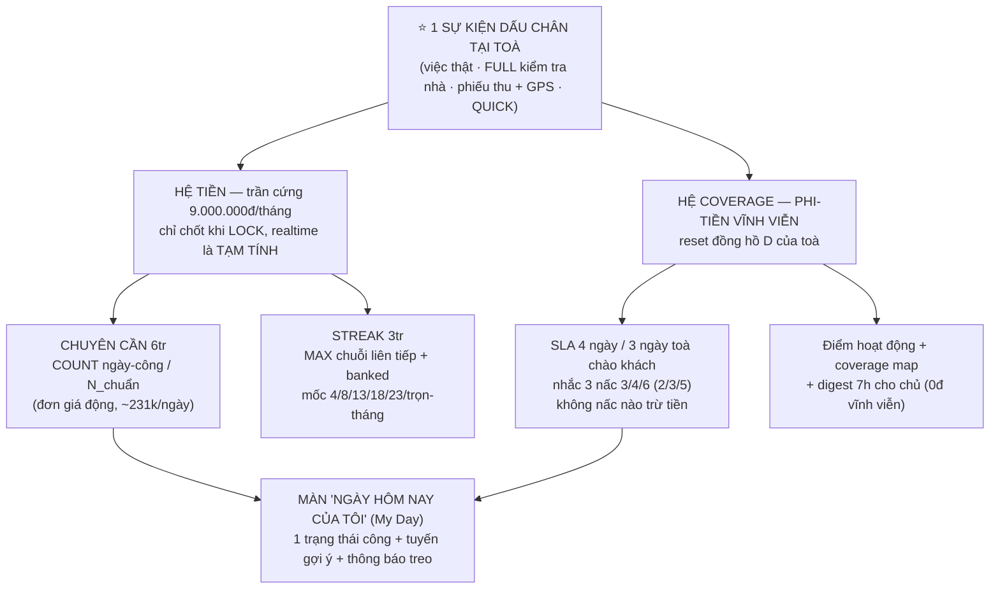
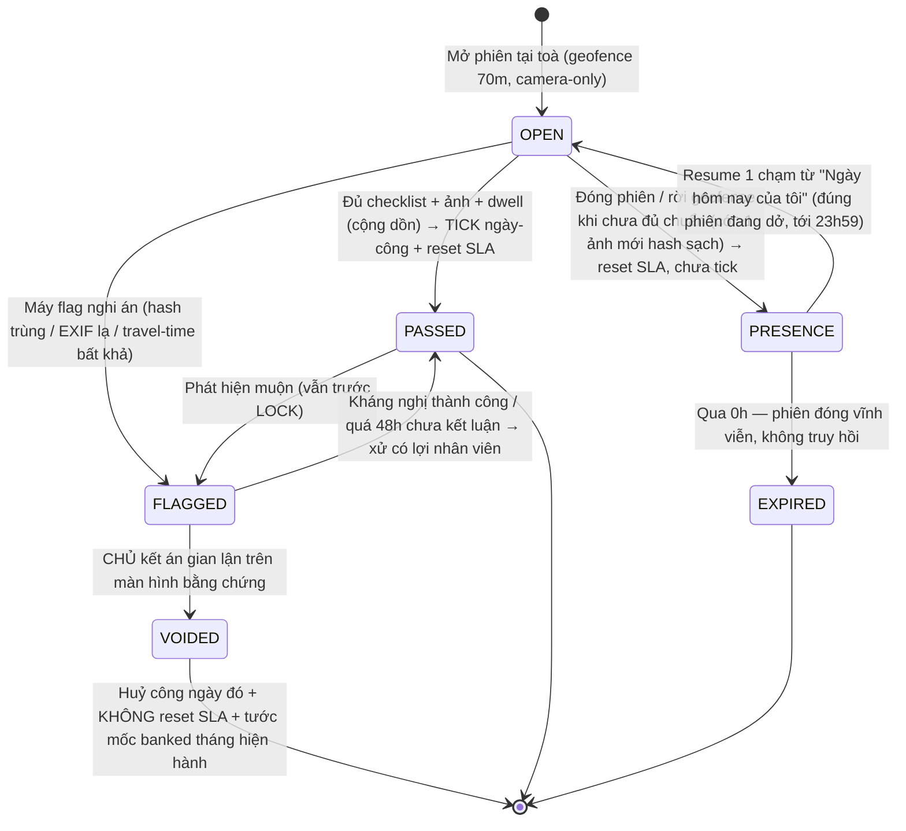
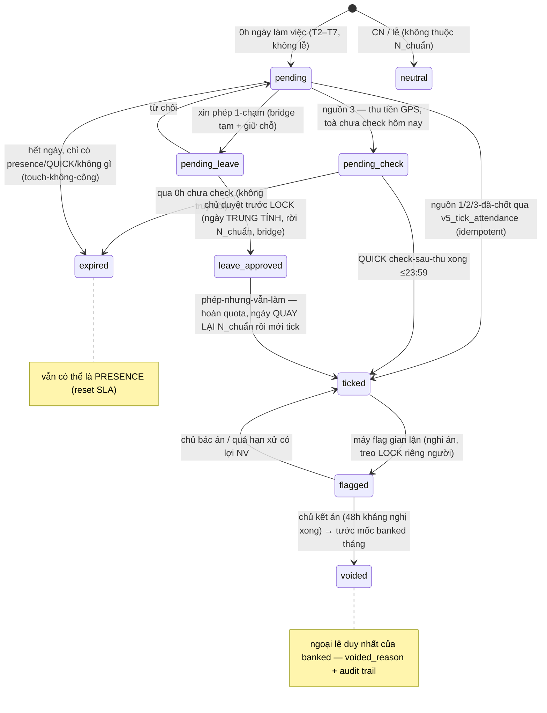
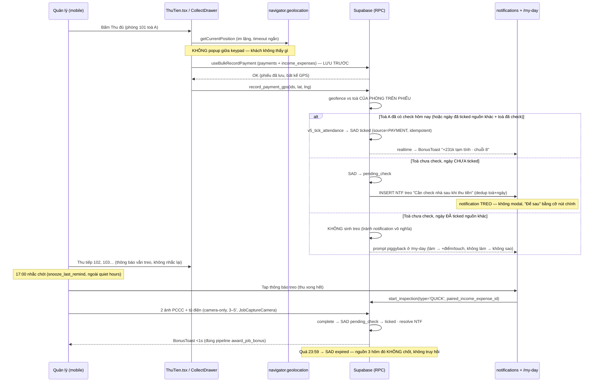

# V5 — HỆ THỐNG LƯƠNG-THƯỞNG-KPI THỐNG NHẤT (Chuyên cần + Streak + Coverage + My Day)

> v5 là đặc tả hợp nhất và thay thế toàn bộ bản thiết kế tiền-v5 đã được dọn khỏi repository. Plan giao hàng: [V5-PLAN-THUC-HIEN.md](V5-PLAN-THUC-HIEN.md). Đối chiếu triển khai: [V5-IMPLEMENTATION-LOG.md](V5-IMPLEMENTATION-LOG.md). Reviewed 2026-07-20.

---

# CHƯƠNG 0 — TÓM TẮT ĐIỀU HÀNH

**Toàn bộ v5 đứng trên MỘT khái niệm: DẤU CHÂN TẠI TOÀ.** Một sự kiện dấu chân (làm việc thật, kiểm tra nhà, thu tiền tại chỗ) được ghi nhận **một lần** và nuôi **hai hệ độc lập**: hệ **TIỀN** (trần cứng 9tr/người/tháng) và hệ **COVERAGE** (SLA bao phủ toà — phi-tiền vĩnh viễn).



**5 điều chủ doanh nghiệp cần nhớ:**

- **Trả tối đa 9tr/người/tháng, trần cứng:** 6tr chuyên cần (đơn giá ngày = 6tr ÷ số ngày-làm chuẩn của tháng, ~231k) + 3tr thưởng chuỗi đi làm đều (**banked — đã leo mốc nào là khoá mốc đó**). Không có nấc nhắc, điểm số hay SLA nào tự động trừ tiền — máy chỉ flag, **chủ là người kết án duy nhất**.
- **Ngày không có việc vẫn kiếm được ngày-công** bằng phiên **kiểm tra nhà FULL đạt chuẩn** (checklist + ảnh + đủ thời gian tại toà). Công ty không mua "sự có mặt" — công ty **mua sự kiểm tra** tài sản tiền tỷ; với người quản toà êm (Joey) đây là xương sống thu nhập.
- **Không toà nào bị bỏ rơi:** SLA **4 ngày/toà (3 ngày nếu đang chào khách)**, app tự nhắc 3 nấc (vàng in-app → đỏ push nhân viên → báo chủ). Các điểm mù kiểu 65NTG (2 tháng không ai ghé) về mặt toán học không thể tái diễn. Chủ chỉ thao tác **3 nút, tổng <10 phút/ngày**: duyệt phép · duyệt sự-cố-thiết-bị · spot-audit 2–3 phiếu/tuần.
- **Chống gian lận có due process:** máy flag (hash ảnh trùng, EXIF lạ, travel-time bất khả) → chủ kết án trên màn hình bằng chứng → nhân viên có **48h kháng nghị** → án chốt trước khoá sổ. Gian lận xác nhận = huỷ công ngày đó + tước toàn bộ mốc streak đã bank trong tháng (ngoại lệ duy nhất của banked).
- **Không bật tiền non:** grace 14 ngày → shadow coverage 4 tuần → **shadow tiền 3 tháng tròn** (lương vẫn trả theo cơ chế cũ, số v5 chỉ hiển thị "TẠM TÍNH — CHƯA GẮN TIỀN") → bật từ tháng thứ 4 khi qua đủ gate. Có **đường lui về v3 qua feature flag** (`feature_flags.v5_money` / `fallback_v3`) code sẵn từ ngày đầu; riêng SLA coverage giữ vĩnh viễn.

---

# CHƯƠNG 1 — BỐI CẢNH: VÌ SAO PHẢI CÓ v5

## 1.1 Tiến hoá v1 → v5

| Phiên bản | Một dòng tóm tắt |
|---|---|
| **v1** | Bàn tròn đầu tiên — game hoá điểm/chuỗi; CHRO ép **streak ≤1tr, phi-tiền-sống** vì rủi ro presenteeism (đi làm ốm giữ chuỗi). |
| **v2** | Thêm cổng chất lượng cho kiểm tra; **BÁC "thưởng tiền theo số vấn đề phát hiện"** — tạo động cơ bịa vấn đề. |
| **v3** | Nền hiện hành: bỏ hết lương cơ sở/BHXH/tối thiểu vùng; tuần **T2–T7, CN nghỉ, 26 ngày-làm**; phát minh "Khiên dự trữ"; streak vẫn nhỏ ≤1tr. |
| **v4** (v4.1–v4.2) | **Đảo cấu trúc tiền theo yêu cầu chủ**: 2 pool = chuyên cần 6tr + streak 3tr = 9tr; chỉ bật được nhờ 3 phát minh khoá (best-streak **banked** · sàn 3tr · tách trục đo COUNT vs MAX); FULL = đủ 26 ngày; 1 ngày phép có lương/tháng; đỉnh streak = trọn tháng. |
| **v4.3** | "Kiểm tra nhà" thành **nguồn ngày-công hạng nhất** + hệ coverage xoay tua (SLA 7/5, priority score, piggyback) — thiết kế trên dữ liệu thật Nathan/Joey. |
| **v5** (file này) | **HỢP NHẤT** tiền (v4.2) + coverage (v4.3) quanh **MỘT ma trận dấu chân** (Ch.3); hội đồng 6 vai chốt C1–C10; siết SLA 7/5 → **4/3**; calendar động (khai tử hằng số 26 và 230.769); **bỏ nguồn khiên-từ-CN**; scheduling bằng Vercel Cron + edge function; timeline shadow 1 trục có gate + đường lui. |

## 1.2 Dữ liệu thật (query DB prod 2026-07-02) — vì sao bài toán cấp bách

**NATHAN — 9 toà ở (172 phòng, 165 đang thuê) + Kho VP Chung. ~104 việc/60 ngày ≈ 2 việc/ngày-làm:**

| Toà | Phòng | Việc/60d | Ghi chú |
|---|---:|---:|---|
| 1392QT | 35 | 32 | Rất bận |
| 102LVT | 40 | 17 | Bận |
| 331PHI | 12 | 15 | Bận |
| 512TT | 17 | 12 | Bận |
| 403PVB | 15 | 9 | việc cuối 22/6 |
| 405PVB | 19 | 7 | **im 2 tuần** (việc cuối 17/6) |
| 481NVK | 10 | 5 | Vừa |
| 15KV | 8 | 4 | Êm |
| 44TL | 16 | 3 | Êm |

**JOEY — 7 toà ở (91 phòng, 90 đang thuê) + Kho. Chỉ ~20 việc/60 ngày ≈ 0,4 việc/ngày-làm:**

| Toà | Phòng | Việc/60d | Ghi chú |
|---|---:|---:|---|
| 111PVC | 19 | 5 | |
| 80DS3 | 21 | 5 | Toà lớn nhất |
| 32PVC | 8 | 4 | **trắng việc từ 25/5 — hơn 1 tháng** |
| 417LVT | 15 | 3 | |
| 158PVC | 13 | 2 | |
| 162NVK | 9 | 1 | **trắng việc từ 25/5** |
| 65NTG | 6 | **0** | **ĐIỂM MÙ TUYỆT ĐỐI — 0 việc/60 ngày, không ai ghé 2 tháng** |

## 1.3 Hai bài toán sống còn

1. **Joey KHÔNG THỂ full chuyên cần nếu chỉ dựa việc-phát-sinh** — việc chỉ cover ~10/26 ngày. Đó không phải lười; toà của Joey ÊM (và êm là TỐT). → **Kiểm tra nhà phải là nguồn ngày-công hạng nhất**, ngang hàng sửa chữa/thu tiền/ký HĐ.
2. **65NTG / 32PVC / 162NVK là lỗ hổng quản trị tài sản** — 6–9 phòng khách đang ở mà cả tháng+ không ai đặt chân tới (rò nước, PCCC, khách âm thầm bất mãn rồi đi). → Cần **SLA coverage cứng + app nhắc chủ động**, bất kể chuyện lương.

v5 giải cả hai bằng một thiết kế: **mỗi dấu chân hợp lệ vừa nuôi lương (Ch.4) vừa nuôi coverage (Ch.5)** — hai hệ đọc chung một sự kiện nhưng **không bao giờ trộn tiền vào coverage**.

---

# CHƯƠNG 2 — NGUYÊN TẮC NỀN (10 điều luật)

1. **NGÀY-CÔNG BINARY.** 1 việc = 8 việc = 1 ngày-công; đi 3 toà/ngày vẫn 1 công. Cấm progress bar kiểu "3/8 = 0.4 công". Phần vượt chỉ cộng **điểm phi-tiền**.
2. **GAIN-FRAMING TUYỆT ĐỐI** trên mọi surface (push, toast, empty-state, lỗi, recap, label hiển thị ra UI): **cấm các chữ "−/mất/trừ/phạt/rớt"**. Fail = *"còn X mục nữa là đủ công hôm nay"*. Phía nhân viên **không bao giờ có màu đỏ**.
3. **BEST-STREAK BANKED.** Tiền streak neo vào chuỗi-dài-nhất-ĐÃ-đạt trong tháng; chạm mốc là tiền đóng băng, đứt sau đó = PAUSE chứ không LOSS. Ngoại lệ **duy nhất**: án gian lận xác nhận (Ch.6.4).
4. **TIỀN CHỈ CHỐT KHI LOCK.** Cả tháng mọi con số realtime mang nhãn **"TẠM TÍNH — chốt khi khoá sổ"**; nguồn sự thật tiền duy nhất là `salary_work_ledger` + flow LOCK hiện có — FE không bao giờ tự cộng tiền.
5. **MUA SỰ KIỂM TRA, KHÔNG MUA SỰ CÓ MẶT.** Ngày-công chỉ tick khi qua cổng chất lượng (checklist + ảnh + dwell + geofence). Có mặt mà không đạt chuẩn = presence, không phải công.
6. **GỢI Ý ≠ RA LỆNH.** App xếp tuyến hộ, nhân viên đổi tuyến/swap toà 1 chạm — máy gợi ý, người quyết. **SLA = visibility lên chủ, không nấc nhắc nào tự trừ tiền/streak.** *Trừ máy = dạy nhân viên đánh lừa máy.*
7. **KHÁCH KHÔNG BAO GIỜ THẤY ĐIỂM** — điểm/streak/coverage/ảnh check không xuất hiện trên bất kỳ surface nào khách chạm được (kể cả trang public /r/:token và preview push trên lock screen). UX review từng surface trước release.
8. **MÁY CHỈ FLAG — CHỦ KẾT ÁN.** Không có án phạt tự động ở bất cứ đâu: nghi án gian lận, geofence fail, dwell thiếu… đều dừng ở mức cờ chờ người duyệt.
9. **MỌI NGƯỠNG LÀ SETTING** trong 1 catalog duy nhất (`salary_bonus_rules.rules`), đọc qua đúng 1 RPC `get_salary_v5_config()`. **Cấm hardcode mọi con số ở FE lẫn SQL — kể cả 230.769 và 26.** Key chạm tiền chỉ hiệu lực từ đầu tháng kế + version + audit; key phi-tiền đổi ngay được.
10. **SHADOW TRƯỚC KHI GẮN TIỀN + ĐƯỜNG LUI.** Grace 14 ngày → shadow coverage 4 tuần → shadow tiền 3 tháng → mới bật. Trượt gate lần 3 → tiền rơi về v3 qua **feature flag** (`feature_flags.v5_money`, `fallback_v3` — code sẵn từ ngày đầu); riêng SLA coverage giữ vĩnh viễn.

---

# CHƯƠNG 3 — MA TRẬN DẤU CHÂN HỢP NHẤT (CHƯƠNG KHOÁ)

> Đây là bảng chuẩn duy nhất của toàn hệ thống — Phần A hội đồng đã chốt là **bất biến**, mọi "cải tiến" ma trận phải đưa ngược lên chủ, không tự sửa trong sprint.

## 3.1 Bảng chuẩn 7 nguồn dấu chân

| # | Nguồn dấu chân | Tick ngày-công (+6tr/N_chuẩn) | Reset SLA (touch) | Điều kiện chi tiết |
|---|---|---|---|---|
| 1 | Hoàn thành việc thật (sửa/HĐ/khác) | ✅ | ✅ | Camera-only + watermark + geofence (tái dùng pipeline JobCaptureCamera hiện có — không viết pipeline ảnh mới) |
| 2 | Kiểm tra nhà **FULL** pass | ✅ | ✅ | Checklist đủ (kể cả **vào trong phòng trống** — không tick từ hành lang) + ảnh ≥4/5/7 theo cỡ toà + dwell ≥8/12/18′ (**cộng dồn các phiên cùng ngày cùng toà**) + geofence + hash sạch. "Tình trạng nhà" → tự sinh job sửa ngay trong phiên |
| 3 | Phiếu thu bấm tại chỗ + GPS | ✅ **KÈM ĐIỀU KIỆN** | ✅ | GPS khớp geofence **toà của phòng trên phiếu** + join ngược về payment id. Toà hôm nay **chưa check** → POPUP THÔNG BÁO kiểu mục Công việc **"Cần check nhà sau khi thu tiền"** — thông báo TREO, không chặn keypad, **không chen giữa chuỗi thu nhiều phòng liền**, treo ở "Ngày hôm nay của tôi" tới khi làm, snooze được, nhắc chót 17:00 → thu xong mở **CHECK-NHANH** (2 ảnh PCCC + tủ điện, 3–5′) — **hoàn thành mới chốt tick**, deadline 23:59 cùng ngày, quá hạn = nguồn 3 hôm đó không chốt, không truy hồi. Toà **đã check hôm nay** → tick luôn |
| 4 | Ngày phép có lương | ✅ | — | 1-chạm + duyệt; phép ĐANG CHỜ vẫn bắc cầu chuỗi + giữ chỗ tạm, chốt cứng khi duyệt trước LOCK; auto-nhắc chủ sau 24h. Quota `paid_leave_days_per_month` (default 1, range 0–4, không dồn). *Xem ghi chú model dữ liệu §3.6* |
| 5 | FULL **fail chuẩn** = PRESENCE | ❌ | ✅ | Presence = ≥1 ảnh camera-only **mới** (hash sạch) + geofence + thiết bị đăng nhập. Báo NGAY TẠI TOÀ *"còn X mục nữa là đủ công hôm nay"*; **bổ sung = resume đúng phiên đến 23:59**, đủ chuẩn lúc nào tick lúc đó; qua 0h phiên đóng vĩnh viễn |
| 6 | QUICK đơn lẻ (không kèm thu tiền) | ❌ **VĨNH VIỄN** | ✅ | +15 điểm phi-tiền; mọi màn QUICK có nút **"Nâng cấp lên FULL"** tại chỗ; không có cơ chế gom N QUICK = 1 công |
| 7 | Gian lận ảnh (hash trùng/né camera/EXIF giả) | ❌ **HUỶ CÔNG NGÀY ĐÓ** | ❌ (không có cả presence) | Máy flag → chủ kết án → 48h kháng nghị → chốt trước LOCK; án xác nhận: **tước toàn bộ mốc banked THÁNG HIỆN HÀNH** (ngoại lệ duy nhất của banked); ngày sạch khác + sàn mềm giữ nguyên; sau LOCK chỉ xử qua adjustments kỳ sau |

**Bất biến kèm bảng:** binary — 1 việc = 8 việc = 1 ngày-công; phần vượt chỉ cộng điểm phi-tiền. **STREAK = chuỗi ngày-công liên tiếp suy từ chính bảng này.** Mỗi tick ghi 1 dòng `ATTEND_DAY` trạng thái tạm qua RPC idempotent; mốc streak → `STREAK_MILESTONE`. **Không luồng v5 nào chạm `payments`/`income_expenses`** (trừ việc đọc + thêm cột GPS `collect_*` cho nguồn 3).

## 3.2 State machine pass — fail — gian lận

Ba nấc duy nhất: **pass = công + touch · fail = touch-không-công (presence) · gian lận = huỷ cả hai.** Trạng thái phiên không có giá trị `failed` — fail chuẩn theo C1 chính là `presence`.



## 3.3 C1 — Fail-gate FULL: presence + bổ sung trong ngày (chốt hội đồng)

- **Presence hợp lệ** = phiên check tại toà có **≥1 ảnh camera-only chụp MỚI (hash sạch, không trùng)** + **trong geofence 70m** + từ thiết bị đang đăng nhập. Presence → **reset đồng hồ D của SLA**, KHÔNG tick tiền. Gian lận ảnh → không có cả presence. *(Bán kính geofence đọc từ config acceptance_geofence hiện có — một nguồn sự thật, không sinh key mới.)*
- **Bổ sung:** mở lại **đúng phiên đang dở** (resume 1 chạm từ "Ngày hôm nay của tôi", không tạo phiên mới) đến **23:59 cùng ngày lịch, giờ Asia/Ho_Chi_Minh**, tại đúng toà (geofence lại); ảnh bổ sung phải chụp mới; **dwell CỘNG DỒN các phiên cùng ngày cùng toà**; đủ chuẩn lúc nào chốt tick lúc đó.
- **Qua 0h phiên đóng vĩnh viễn** — không truy hồi, không duyệt tay ngoại lệ cho việc quên bổ sung.
- Fail báo **NGAY TẠI TOÀ, TRƯỚC KHI RỜI** (khi đóng phiên hoặc rời geofence): *"còn X mục nữa là đủ công hôm nay"*.
- **Ngoại lệ duy nhất được duyệt tay:** nút **"Báo sự cố thiết bị"** (GPS drift/máy hỏng/giờ lệch) trong phiên → chủ duyệt 1-chạm kèm bằng chứng phụ, tick tay có audit. Van này phải sống **từ ngày 1** (điều kiện bật tiền). Lỗi kỹ thuật mặc định KHÔNG phải gian lận.

## 3.4 C2 — Án gian lận vs banked-streak (chốt hội đồng)

Gian lận ảnh XÁC NHẬN = **huỷ công ngày đó + TƯỚC TOÀN BỘ mốc streak đã bank trong THÁNG HIỆN HÀNH** (best-streak về 0, tính lại từ ngày kế). Đây là **ngoại lệ DUY NHẤT** của nguyên tắc banked. Kèm 4 chốt an toàn **bất khả thương lượng**:

1. **Máy chỉ flag** (hash trùng/EXIF lạ/travel-time bất khả) → sinh "nghi án"; **CHỦ kết án** trên màn hình bằng chứng — không có án tự động.
2. Nhân viên nhận bằng chứng + **48h kháng nghị**; án phải chốt **TRƯỚC LOCK**; quá hạn chưa kết luận → **xử có lợi cho nhân viên**. Đang điều tra → treo LOCK của riêng người đó, không treo cả kỳ.
3. Phạm vi = tháng hiện hành; **không đụng chuyên cần các ngày sạch, không đụng sàn mềm**; KHÔNG hồi tố tháng đã LOCK — phát hiện muộn xử qua `salary_adjustments` kỳ sau, tuyệt đối không sửa snapshot.
4. Tái phạm lần 2 trong 90 ngày → chuyển kỷ luật ngoài hệ thống.

## 3.5 C3 — QUICK và tiền (chốt hội đồng, 6/6 đồng thuận)

QUICK đơn lẻ = **0đ VĨNH VIỄN**: ngày chỉ có QUICK không bao giờ thành ngày-công, **không có cơ chế gom N QUICK = 1 công**, không mở van Phase sau. Vai trò của QUICK: reset SLA + điểm phi-tiền (+15đ) + là **điều kiện chốt tick cho nguồn thu-tiền** (dòng 3 — tiền ghi cho dấu chân PHIẾU THU + GPS, không phải cho QUICK). Mọi màn QUICK có nút **"Nâng cấp lên FULL"** tại chỗ, giữ nguyên ảnh + dwell đã có.

## 3.6 Ghi chú nghiệm thu (đồng bộ với biên bản C10)

- **Model dữ liệu ngày phép (dòng 4):** dấu ✅ nghĩa là **quyền lợi được bảo toàn** — nghỉ đúng phép không hụt đồng nào + tự bắc cầu chuỗi. Về mặt dữ liệu, chốt **MỘT model theo C10**: phép-đã-duyệt = **ngày trung tính** — KHÔNG sinh dòng `ATTEND_DAY`, ngày đó **rút khỏi N_chuẩn(người, tháng)**, chỉ bridge streak. Kết quả tiền giống hệt "tick như ngày công" (25 công / N_chuẩn 25 = full 6tr) nhưng không thể vượt trần. Vì chạm chữ ✅ của Phần A bất biến → điểm này **đưa chủ xác nhận 1 câu** trước khi cắt ticket.
- **Nguồn 3 khi ngày ĐÃ tick từ nguồn khác:** thu tiền tại toà chưa check nhưng hôm đó đã có ngày-công rồi → **KHÔNG sinh thông báo treo** (tick đã có, tránh notification vô nghĩa); nhu cầu ghé toà đó chuyển sang prompt piggyback thường (Ch.5).
- **Popup check-sau-thu là thông báo TREO, cấm biến thành modal chặn.** Nút "Để sau" bằng cỡ nút chính; từ chối không bị log xấu. GPS ghi nền im lặng — khách đứng trước mặt không thấy gì.

---

# CHƯƠNG 4 — CÔNG THỨC TIỀN (trần cứng 9.000.000đ)

## 4.1 Cấu trúc 2 pool

```
                        LƯƠNG THÁNG (trần 9.000.000đ)
        ┌──────────────────────────────────┬──────────────────────────┐
        │      POOL CHUYÊN CẦN = 6tr        │     POOL STREAK = 3tr      │
        │      (đo TỔNG ngày = COUNT)       │  (đo MAX chuỗi liên tiếp) │
        ├──────────────────┬───────────────┤                           │
        │  SÀN MỀM 3tr     │  LEO 3tr      │   BẬC THANG banked         │
        │  (tuỳ chọn,      │  (~231k/ngày, │   6 mốc, best-of-month,    │
        │   khi ≥13 ngày)  │   đủ N_chuẩn  │   reset mỗi tháng, ≤600k/mốc│
        │  ← chống turnover│   = 6tr)      │   ← at-risk, KHÔNG sàn      │
        └──────────────────┴───────────────┴──────────────────────────┘
              ↑ tiền-để-SỐNG                    ↑ thưởng ĐỘ-BỀN đã chứng minh
              (nhìn hiện tại)                    (nhìn quá khứ, đã khoá)

Rủi ro: ~1/3 (3tr sàn) CHỦ gánh (bảo hiểm chống turnover) · ~2/3 at-risk theo hành vi
Dải dao động THỰC của người đi làm đều = 6–9tr (KHÔNG phải 0–9tr)
```

> **Một câu:** *Chuyên cần mua "đủ số buổi"; streak mua "đều đặn không ngắt quãng". Sàn giữ tiền-sống an toàn để nhân viên chơi phần thưởng thoải mái, không phòng thủ độc hại.*

## 4.2 CHUYÊN CẦN → 6tr

**⚠️ C10 — đơn giá tính ĐỘNG theo calendar, CẤM hardcode 230.769 hay số 26** ở mọi nơi (FE, RPC, test). Một hàm calendar duy nhất (SQL + lib TS mirror, `vn_local_*`, Asia/Ho_Chi_Minh, `holidays[]` từ catalog) là nguồn sự thật; hai đồng hồ TIỀN và SLA cùng ĐỌC nó.

```
N_chuẩn(người, tháng) = COUNT(T2–T7 trong tháng)
                        − ngày lễ chính thức
                        − ngày phép-đã-duyệt của chính người đó

Đơn giá ngày = 6.000.000 / N_chuẩn          (≈ 230.769đ khi N_chuẩn = 26)
attend_pay   = 6.000.000 × clamp(ngày_công / N_chuẩn, 0, 1)
               [+ tuỳ chọn sàn mềm: max(.., 3.000.000) nếu ngày_công ≥ 13]
```

| Tham số (catalog `attendance_v5`) | Default | Ghi chú |
|---|---|---|
| `attendance_budget` 💰 | 6.000.000 | Trần cứng; **KHÔNG lưu `day_rate`** — đơn giá = budget / N_chuẩn |
| `paid_leave_days_per_month` 💰 | **1** | Range **0–4**, không dồn — **yêu cầu chủ: là SETTING** |
| `soft_floor` 💰 | {enabled: true, days: 13, amount: 3.000.000} | Sàn MỀM tuỳ chọn (linear đã cho đúng 3tr tại 13 ngày; sàn chỉ nâng người 8–12 ngày). Giữ/bỏ quyết sau 3 tháng shadow |

- **Đủ N_chuẩn ngày → full 6tr, trần tuyệt đối mọi tháng** — đi đủ tháng lễ/Tết vẫn tròn 6tr (N_chuẩn nhỏ hơn thì đơn giá ngày tự cao hơn). Thiếu ngày nào bớt ngày đó — chuyên cần = tiền trả theo ngày đi làm.
- **CN + lễ + phép-duyệt = ngày TRUNG TÍNH:** không vào N_chuẩn, không tick, **tự bắc cầu streak**. Làm CN/lễ: không tick chuyên cần, chỉ hưởng thưởng việc-thật (+20k/+50k theo Phần A cũ).
- **Phép có lương:** nghỉ đúng quota phép (mặc định 1/tháng) → **không hụt đồng nào + chuỗi không đứt**; nghỉ quá quota → ngày đó là ngày không công bình thường. Phép ĐANG CHỜ duyệt vẫn bắc cầu tạm, chốt cứng khi duyệt trước LOCK; auto-nhắc chủ sau 24h. Edge case (nghiệm thu #2): phép đã duyệt nhưng vẫn đi làm → hoàn quota, **ngày đó QUAY LẠI N_chuẩn rồi mới tick** — không bao giờ vượt trần 6tr.
- **Danh sách lễ do chủ công bố trước ngày 25 tháng trước, cấm đổi giữa tháng.**

**Bảng quy đổi (minh hoạ tháng chuẩn N_chuẩn = 26):**

| ngày-công | 8 | 10 | **13** | 16 | 18 | 20 | 22 | 24 | **26** |
|---|---|---|---|---|---|---|---|---|---|
| **chuyên cần** | 1,85tr | 2,31tr | **3,00tr** | 3,69tr | 4,15tr | 4,62tr | 5,08tr | 5,54tr | **6,00tr** |

*(Sàn mềm bật: cột 8→3,00tr, 10→3,00tr; ≥13 giữ nguyên như trên.)*

## 4.3 STREAK → 3tr (best-of-month, banked, reset tháng)

- **Đơn vị:** chuỗi ngày-công liên tiếp **DÀI NHẤT trong tháng** (best-of-month); CN + lễ + phép-duyệt bắc cầu tự động.
- **Banked-không-rơi:** chạm mốc → tiền đóng băng vĩnh viễn trong tháng. Đứt = PAUSE (dừng leo), KHÔNG rớt về mốc thấp. Chuỗi mới có thể leo lại mốc cao hơn. Ngoại lệ duy nhất: án gian lận C2.
- **Reset theo THÁNG** (không tích luỹ liên-tháng — giới hạn "nỗi đau tối đa" trong 1 chu kỳ). Dedup `(staff, mốc, YYYY-MM)`. Trần cứng 3tr enforce ở RPC LOCK. Mùng 1 = framing "mùa mới: mốc đầu +300k chỉ cách 4 ngày".

**Mốc bậc thang — đỉnh = TRỌN THÁNG (đứt-không-phép = 0 trên N_chuẩn, KHÔNG cứng số 26):**

| Mốc (chuỗi ngày-công liên tiếp) | 4 ngày | 8 ngày | 13 ngày | 18 ngày | 23 ngày | **Trọn tháng** |
|---|---|---|---|---|---|---|
| **Delta** | +300k | +500k | +600k | +600k | +500k | **+500k** |
| **Cộng dồn (tham khảo)** | 300k | 800k | 1.400k | 2.000k | 2.500k | **3.000k = FULL** |

- **Quy ước hiển thị (nghiệm thu #13):** nhãn mốc trên UI **luôn kèm DELTA** ("Mốc 8 · +500k"); tổng luỹ kế chỉ xuất hiện tách riêng ở thanh tổng — không trộn hai kiểu số.
- **Mốc "Trọn tháng" (+500k = full 3tr):** trả khi số lần đứt-**KHÔNG-phép** trong tháng = **0** trên N_chuẩn — dùng đúng ngày phép của mình vẫn đạt. Đây là phần **rõ nhất KHÔNG trùng chuyên cần**: thưởng cho đại lượng `đứt=0`, thứ mà COUNT(ngày) hoàn toàn mù.
- **Tháng lễ dài (C10):** mốc 4/8/13/18/23 **giữ số tuyệt đối**; nếu N_chuẩn < mốc nào thì **cắt mốc đó từ trên xuống, delta dồn vào mốc trọn-tháng** — trần 3tr bất biến, tháng Tết vẫn chạm được đỉnh.
- Đứt giữa tháng chỉ tụt tối đa 1 bậc ~600k, khiên vá được → **không có vực thẳm**, không kích tâm lý con bạc gỡ.

**Chống đo-trùng (volume vs consistency):**

| | CHUYÊN CẦN | STREAK |
|---|---|---|
| Đại lượng toán | `COUNT(ngày)` | `MAX(chuỗi liên tiếp)` + `đứt=0` |
| Ý nghĩa | KHỐI LƯỢNG có mặt | TÍNH ĐỀU ĐẶN |
| 26 ngày RẢI RÁC (nhiều đứt) | full 6tr | mốc thấp ~0,8tr |
| 26 ngày LIỀN MẠCH (trọn tháng) | full 6tr | full 3tr |

Cùng `COUNT`, streak chênh ~2,2tr vì `MAX-run` khác → 2 truy vấn khác biến, không ngày nào ghi sổ 2 lần.

## 4.4 Khiên (bảo vệ chuỗi)

| Loại | Quy tắc v5 (C7) |
|---|---|
| **Khiên miễn phí** | **3/tháng** (giữ theo v4) — vá 1 ngày đứt để chuỗi không gãy |
| **Khiên dự trữ — nguồn kiếm DUY NHẤT** | **Tháng đứt-không-phép ≤1 → +1 khiên tháng sau** (cap kiếm 1/tháng, **cap tồn 2**). **BỎ HẲN nguồn khiên-từ-CN** (2 CN → +1) ngay từ v5 — banner *"CN là ngày nghỉ — không làm CN không mất gì"* giờ đúng 100% sự thật kinh tế; làm CN/Lễ chỉ hưởng thưởng việc-thật +20k/+50k (kênh ghi nhận duy nhất) |
| **Cap TIÊU khiên dự trữ** | **1/tháng NGAY TỪ ĐẦU khi gắn tiền** — không đi chiều "mở 2 rồi siết về 1" (siết lại = loss-framing). Trong SHADOW, engine mô phỏng thêm kịch bản cap 2 trên số liệu (không hiển thị như quyền lợi) để đo nhu cầu; nếu quá khắt mà %mốc-nhờ-khiên vẫn thấp → **NỚI lên 2** từ đầu tháng kế (chiều nới luôn được phép) |

## 4.5 Worked examples (6 chân dung, minh hoạ tháng N_chuẩn = 26)

| Chân dung | ngày-công | chuỗi dài nhất | **Chuyên cần** | **Streak** (mốc 4/8/13/18/23/trọn-tháng) | **TỔNG** |
|---|---|---|---|---|---|
| **① SIÊNG** — đủ 26 ngày (hoặc 25 + 1 phép) liền mạch | 26 | 26, đứt=0 | 6,00tr | 3,00tr (trọn tháng, đủ mốc) | **9,00tr** |
| **② BÌNH THƯỜNG** — 22 ngày, đứt 1–2 lần | 22 | 16 | 5,08tr | 1,40tr (mốc 4+8+13) | **6,48tr** |
| **③ ĐỦ-SỐNG** — 18 ngày, ngắt quãng | 18 | 8 | 4,15tr | 0,80tr (mốc 4+8) | **4,95tr** |
| **④ ĐI-CHO-CÓ** — 13 ngày, rải rác | 13 | 4 | 3,00tr | 0,30tr (mốc 4) | **3,30tr** |
| **⑤ ỐM-CÓ-PHÉP** — 13 làm + 1 phép, chuỗi được bắc cầu | 14 (13+phép) | 12 | 3,23tr | 0,80tr (mốc 4+8) | **4,03tr** |
| **⑥ JOEY-ÊM** — 26 ngày-công trong đó **~16 từ phiên FULL kiểm tra nhà** + ~10 từ việc/thu-tiền, liền mạch | 26 | 26, đứt=0 | 6,00tr | 3,00tr | **9,00tr** |

- **Xuất sắc = 9tr** chỉ khi đi đủ N_chuẩn liền mạch (①) — dùng đúng phép của mình vẫn đạt trọn tháng nhờ bắc cầu.
- **② là bằng chứng chống đo-trùng:** 22 ngày ngắt quãng → thiếu chuyên cần + streak chỉ tới mốc 13, chênh rõ với ①.
- **Lười rớt RÕ:** ④ ~3,3tr; ③ ~4,95tr — tín hiệu sớm cho chủ.
- **Không ai rơi tự do:** ⑤ vẫn >4tr nhờ sàn mềm + phép bắc cầu bảo vệ chuỗi.
- **⑥ chứng minh "toà êm không phải án tử thu nhập":** người quản danh mục 7 toà êm sống đàng hoàng bằng kiểm tra nhà đạt chuẩn — công ty đổi lại được coverage tài sản (Ch.5). Ngày-công từ kiểm tra nhà dự kiến chiếm ~60–70% với Joey — **bình thường và lành mạnh** với danh mục êm.

## 4.6 LOCK & nguồn sự thật tiền (C9 — cấm đường tiền song song)

- **Nguồn sự thật TIỀN duy nhất = `salary_work_ledger` + lock flow hiện có** (`salary_monthly` / `salary_adjustments` / `salary_work_ledger_snapshot`). v5 chỉ **THÊM 2 loại dòng: `ATTEND_DAY` và `STREAK_MILESTONE`**.
- **Lưu ý bản chất (nghiệm thu #3):** `salary_work_ledger` là **RPC computed, không có bảng vật lý để "ghi/mirror"**. 2 loại dòng mới = **2 nhánh UNION mới trong RPC**, đọc từ bảng state `salary_attendance_day` / `salary_streak_state`; snapshot chỉ sinh lúc LOCK. Dev tạo bảng ledger mới = vi phạm C9.
- Trong tháng: mỗi tick ghi trạng thái tạm qua RPC idempotent (ngày đã tick gọi lại không double); popup **<1s qua đúng pipeline award_job_bonus → realtime → BonusToast** — không xây hệ popup thứ hai; mọi số hiển thị nhãn **"TẠM TÍNH — chốt khi khoá sổ"**.
- **Khi chủ bấm LOCK:** snapshot + **2 dòng tổng qua `salary_adjustments`: CHUYÊN CẦN (≤6.000.000) + STREAK (≤3.000.000)**. Compute **ASSERT cứng 3 bất biến — vượt là bug CHẶN LOCK**: (1) tổng ATTEND ≤6tr **và** STREAK ≤3tr mỗi người; (2) variance tạm-tính vs số-LOCK = 0 trừ khiếu nại có audit; (3) 100% tick nguồn thu-tiền join ngược được về phiếu thu thật.
- **Sau LOCK: snapshot bất biến tuyệt đối** — mọi sửa sai (kể cả án gian lận phát hiện muộn) đi qua `salary_adjustments` kỳ sau, không bao giờ sửa snapshot. FE không bao giờ tự cộng tiền.

---

# CHƯƠNG 5 — QUY TRÌNH COVERAGE (phi-tiền vĩnh viễn)

> Coverage % **VĨNH VIỄN PHI-TIỀN** (C4): KPI tuyến + visibility chủ + input xếp tuyến/spot-audit + tham khảo khi chủ chấm KPI quý **bằng tay** — cấm mọi công thức tự quy coverage ra tiền. Hệ tiền chỉ có đúng 2 cấu phần ở Ch.4.

## 5.1 Phân hạng toà ĐỘNG (cửa sổ trượt 30 ngày, job đêm 02:00 tính lại)

| Hạng | Ngưỡng (`busy_threshold`) | Cách phủ chính |
|---|---|---|
| **BẬN** | ≥6 việc/30d | Việc tự phủ — **chỉ piggyback QUICK, CẤM chuyến riêng** |
| **VỪA** | 2–6 việc/30d | Lịch tuần, ghép cụm |
| **ÊM** | <2 việc/30d (hoặc 30 ngày trắng việc) | **Kiểm tra nhà là xương sống** — FULL theo lịch cứng |

Theo cửa sổ 30 ngày hiện tại: Nathan có 4 toà BẬN tự phủ (1392QT, 102LVT, 331PHI, 512TT); **cả 7 toà của Joey đều ÊM** → gần như toàn bộ ngày-công của Joey đến từ kiểm tra nhà. Job phân hạng chạy qua Vercel Cron → edge function `salary-v5-jobs` (C5 — chi tiết ở nửa sau tài liệu), ghi `cron_runs`, idempotent.

## 5.2 SLA + nhắc 3 nấc

**SLA touch: 4 ngày thường / 3 ngày toà nóng** (`sla_days` / `sla_days_hot`; toà nóng = có phòng trống đang chào khách HOẶC HĐ đáo hạn ≤30 ngày). **FULL ≥1 lần/7 ngày/toà** (`full_interval_days` — QUICK chỉ reset touch, không reset đồng hồ FULL). Override per-toà qua `building_overrides[building_id]` (chỉ sla/dwell/photos/cờ-nóng).

**Đồng hồ D (C10):** D = số **NGÀY LỊCH kể cả CN/lễ** kể từ dấu chân thật gần nhất — rủi ro tài sản không nghỉ CN. Nhưng **CN/lễ không push đỏ** (dồn digest sáng ngày làm việc kế tiếp), quiet hours 21:00–07:00 giữ nguyên, và **không nấc nhắc nào trừ tiền**.

| Nấc | Ngưỡng thường / toà nóng (`remind` / `remind_hot`) | Hành động | Kênh |
|---|---|---|---|
| **VÀNG** | D ≥ **3** / ≥ **2** | Toà vào khối "Hôm nay nên đi" (sort theo score, kèm **lý do bằng chữ** + gợi ý ghép cụm), không push | In-app |
| **ĐỎ** | D ≥ **4** / ≥ **3** | Web Push đích danh, gain-framing: *"65NTG đã 4 ngày chưa ai ghé — ghé hôm nay là chắc thêm 1 ngày-công"* + deep-link mở phiên prefill | **Đúng 1 digest/người/ngày, 07:00** |
| **ESCALATE** | D ≥ **6** / ≥ **5** | Push chủ + toà ghim đỏ dashboard chủ + ghi SLA-breach vào KPI coverage tuyến (không trừ tiền ai) | Push chủ |

Chống spam: 1 digest coverage/người/ngày (gộp top 2–3 toà); tắt CN/lễ/ngày phép đã duyệt; thẻ "Tuyến sáng mai" hiện in-app từ 19:00 (**không push**); grace 14 ngày đầu digest chạy nhưng escalate tắt (tránh ngày 1 Joey nhận 3 dòng đỏ vì nợ cũ 2 tháng). **Nhân viên KHÔNG thấy bản đồ D đỏ toàn tuyến — đó là màn của chủ**; phía nhân viên chỉ có khối gợi ý gain-framing trong "Ngày hôm nay của tôi".

## 5.3 Quota tuyến + đi cụm

- **Quota gợi ý ≈ N/4 dấu chân/ngày** (`quota_divisor` = 4; N = số toà phụ trách): 8 toà → ~2 toà/ngày. Đủ giữ mọi toà D ≤ 4 mà không biến ngày làm việc thành ngày chạy xe.
- **Đi cụm ≤500m** (`cluster_radius_m`): 1 chuyến = **1 toà FULL (nguồn tick) + 1–2 toà QUICK (reset touch)**; toà FULL luân phiên. Không chạy 3 FULL/ngày.
- Engine **bắt buộc thử piggyback trước khi tạo chuyến riêng**; xong job tại toà nào → prompt 1 chạm *"sẵn ở đây, quét nhanh?"* cho toà đó hoặc toà cùng cụm có D ≥ ngưỡng (+15đ); tối đa 1 prompt/toà/ngày; nút "Để sau" to bằng nút chính; từ chối không bị log xấu.
- Việc phát sinh **luôn thế chỗ** phiên kiểm tra của toà đó trong tuyến. Tuyến chỉ là **gợi ý** — swap toà 1 chạm, máy gợi ý người quyết.

## 5.4 Priority score (job đêm 06:00; mọi trọng số là setting)

```
score = D × (1 + P/20)                        -- D = ngày lịch từ DẤU CHÂN THẬT gần nhất; P = số phòng
      + 10  nếu có phòng trống đang chào khách
      + 5 × số HĐ đáo hạn ≤30 ngày (cap 10)
      + 5   nếu kỳ chốt điện nước / thu tiền ≤3 ngày tới
      + 15  nếu có sự cố điện/nước/PCCC đang mở (90 ngày)
```

**Dấu chân thật (reset đồng hồ D):** job hoàn thành có ảnh+geofence · phiên FULL/QUICK đạt chuẩn (kể cả presence) · phiếu thu bấm-tại-chỗ có GPS. Job không ảnh / phiếu không GPS → **không reset**.

*Kiểm chứng data go-live 02/07: 65NTG ≈ 78+, 162NVK ≈ 55, 32PVC ≈ 53, 405PVB ≈ 29, 403PVB ≈ 17 → hàng đợi tự xếp đúng thứ tự chủ đang lo.*

## 5.5 Protocol tại toà

### Phiên FULL (nguồn ngày-công)

UI: **"Bắt đầu"** (1 chạm, auto geofence 70m — đọc config geofence hiện có) → chụp theo checklist (toggle mặc định OK, chỉ chạm khi có vấn đề, KHÔNG nhập text) → **"Hoàn tất"** + trường **"Tình trạng nhà": Tốt / Có vấn đề** (1 chạm; "Có vấn đề" → +1 ảnh cận → app **TỰ sinh job sửa chữa** prefill toà + ảnh ngay trong phiên). **Ngoài thao tác chụp: đúng 2 chạm.** Upload nền, offline-tolerant — hầm/tủ điện mất sóng không mất phiên. Tổng thao tác 1 phiên ≤ dwell + 2′ — đo vượt 25′ tổng là lỗi PROTOCOL, cắt checklist chứ không đổ lỗi người.

**Checklist điểm cố định:**
1. Tủ điện tổng / CB (tiện đọc số nếu sát kỳ chốt)
2. PCCC — bình (tem hạn / kim áp) + lối thoát không bị chắn
3. Hành lang **TẦNG do app chỉ định random**
4. Nước — bơm / bồn / đồng hồ tổng / khu rác
5. **PHÒNG TRỐNG (bắt buộc khi toà đang chào khách)** — mở cửa vào trong, ảnh nạp thẳng module Sale Phòng (*giá trị kép: hàng sẵn bán + không thể fake từ ngoài vì phải có chìa khoá*)
6. **+1 hạng mục sâu random theo seed ngày+toà** (không đoán trước được)
7. Chip tuỳ chọn "Chạm khách" [Ổn]/[Có phản ánh] — chỉ cộng điểm, không là điều kiện công

| Cỡ toà | Ảnh tối thiểu (`photos_min`) | Vị trí | Dwell tối thiểu (`dwell_min`) | Thực tế | Áp dụng |
|---|---|---|---|---|---|
| ≤10 phòng | ≥4 | ≥2 vị trí | **8′** | 10–15′ | 65NTG, 32PVC, 162NVK, 15KV, 481NVK |
| 11–20 phòng | ≥5 | ≥3 vị trí | **12′** | 15–25′ | 403/405PVB, 44TL, 512TT, 331PHI, 111PVC, 417LVT, 158PVC |
| >20 phòng | ≥7 | **≥2 tầng khác nhau** | **18′** | 25–45′ | 1392QT, 102LVT, 80DS3 |

- Dwell = timestamp ảnh đầu → ảnh cuối trong geofence, hệ tự đo — không ai bấm giờ; **cộng dồn các phiên cùng ngày cùng toà** (C1).
- Fail gate báo **NGAY TẠI TOÀ**, gain-framing: *"còn 2 mục nữa là đủ công hôm nay"* — resume phiên bổ sung đến 23:59.
- **Lằn ranh riêng tư:** ảnh chỉ KHU CHUNG + phòng TRỐNG; cấm cửa/nội thất phòng khách đang ở, cấm mặt khách.

### Phiên QUICK (piggyback / check-sau-thu)

2 ảnh (PCCC/lối thoát + tủ điện), 3–5′, 1 chạm mở từ màn hình hoàn-thành-job hoặc từ thông báo treo check-sau-thu, geofence dùng lại. Reset touch + cộng điểm (+15), **KHÔNG reset đồng hồ FULL, không tự là ngày-công (0đ vĩnh viễn — C3)**. Mọi màn QUICK có nút **"Nâng cấp lên FULL"** giữ ảnh + dwell đã có. Toà chỉ toàn QUICK vẫn phải 1 FULL/7 ngày — app tự chèn vào tuyến.

## 5.6 Lịch tuần mẫu (khung GỢI Ý — engine hoán đổi mỗi sáng theo score; CN nghỉ)

**Nhịp mới theo SLA 4/3:** mỗi toà cần **~2 dấu chân/tuần** (vàng từ D≥3); toà nóng nhịp 2–3 ngày; FULL ≥1/7 ngày vẫn giữ. Việc phát sinh luôn thế chỗ phiên kiểm tra của toà đó.

### NATHAN (~2 dấu chân/ngày; trần ~8 chuyến riêng/tháng — vượt = lỗi thuật toán điều phối)

| Thứ | Tuyến | Loại |
|---|---|---|
| T2 | **403PVB + 405PVB** — 1 chuyến 2 toà (cùng cụm; xoá điểm mù 405) | 1 FULL + 1 QUICK (luân phiên FULL) |
| T3 | Việc phát sinh nhóm bận + piggyback QUICK tại toà đang làm; QUICK 481NVK nếu cùng cụm | Piggyback |
| T4 | **44TL (FULL) + 15KV (QUICK)** | FULL + QUICK |
| T5 | **481NVK (FULL)** + việc phát sinh + QUICK 403/405 (giữ D≤4) | FULL + QUICK |
| T6 | FULL luân phiên nhóm bận: tuần lẻ 1392QT+102LVT, tuần chẵn 331PHI+512TT + Kho VP (2 tuần/lần) | FULL quét sâu |
| T7 | Quét toà VÀNG (D≥3) còn sót theo score + đảo QUICK↔FULL cho 15KV/44TL | Bù |

### JOEY (~2 dấu chân/ngày; FULL gần như mỗi ngày = khít số ngày cần tick)

| Thứ | Tuyến | Loại |
|---|---|---|
| T2 | **111PVC (FULL) + 32PVC (QUICK)** — cùng trục Phạm Văn Chiêu, 1 chuyến; toà FULL luân phiên tuần sau | FULL + QUICK |
| T3 | **80DS3** riêng — 21 phòng, làm kỹ + ảnh sale phòng trống (+65NTG QUICK 4 tuần đầu) | FULL sâu |
| T4 | **417LVT (FULL) + 162NVK (QUICK)** — luân phiên FULL | FULL + QUICK |
| T5 | **158PVC (FULL) + 32PVC (QUICK, chạm thứ 2)** + Kho VP (2 tuần/lần) | FULL + QUICK |
| T6 | **65NTG — SLOT GHIM, không trôi tuần** (4 tuần đầu thêm chuyến 2 vào T3; tuần đầu: gặp khách hỏi thăm — "trả nợ quan hệ" 2 tháng không ai ghé) | FULL |
| T7 | Quét VÀNG theo score + chạm thứ 2 cho 80DS3/111PVC/162NVK + việc phát sinh | Bù |

Quy tắc lai cụm: đi cụm thì **1 toà FULL (nguồn tick) + toà còn lại QUICK (reset touch)**; toà FULL luân phiên. Không chạy 3 FULL/ngày. Kho VP Chung: touch 2 tuần/lần, **không tick công** trừ khi có job thật.

---

# CHƯƠNG 6 — CHỐNG PRESENTEEISM + CHỐNG ĐỐI PHÓ

## 6.1 Sáu lớp chống presenteeism (streak 3tr không thành bom)

| # | Lớp | Cơ chế |
|---|---|---|
| 1 | **BEST-STREAK (mạnh nhất)** | Tiền neo vào chuỗi-dài-nhất-ĐÃ-đạt. Chốt mốc rồi đứt KHÔNG mất tiền → triệt gốc "đi làm ốm giữ chuỗi". |
| 2 | **SÀN 3tr** | Mất toàn bộ streak vẫn còn sàn (trong pool chuyên cần). Người đi-làm-thật đáy ~6tr. "Mất chuỗi" ≠ "mất sống". |
| 3 | **KHIÊN generous** | Miễn phí **3/tháng**; khiên dự trữ cap tồn 2, kiếm 1/tháng từ **duy nhất** nguồn tháng-đứt-không-phép ≤1 (**nguồn CN đã BỎ — C7**). Cap tiêu 1/tháng, chỉ chiều NỚI. |
| 4 | **PHÉP CÓ LƯƠNG (vũ khí #1)** | Setting `paid_leave_days_per_month` (default 1, range 0–4): xin 1-chạm + duyệt 1-chạm → ngày đó bảo toàn đủ lương + **bắc cầu chuỗi**. **Báo ốm CÓ LỢI hơn giấu ốm** — đảo động cơ tận gốc. Phép đang chờ vẫn bắc cầu tạm; auto-nhắc chủ sau 24h; best-streak bảo hiểm khi chủ quên duyệt. |
| 5 | **KHÔI PHỤC trong tháng** | Đứt → "chuỗi mới 🔥" từ 0; mốc đã chốt GIỮ + leo lại mốc cao hơn (best-of-month). Mùng 1 = fresh-start "mùa mới". Không mất mát nào vĩnh viễn. |
| 6 | **CỔNG CHẤT LƯỢNG ngày-SẠCH (Phase 2 — C4)** | Ngày dính khiếu nại thái độ xác minh được → không nối chuỗi, NHƯNG không động sàn (chống giấu khiếu nại). **Chỉ mở khi đủ 3 tiền đề:** ≥3 tháng dữ liệu khiếu nại phân loại đáng tin + kênh khiếu nại độc lập về owner + tranh chấp tick <5%; luôn có người duyệt, khiếu nại khách **không bao giờ tự trừ máy móc**. |

**Theo dõi presenteeism-ở-rìa-mốc từ ngày 1** (người cách mốc 1 ngày lết đi làm ốm): metric "% ngày-công sát mốc có dấu hiệu bất thường" trong shadow; nếu bất thường → kích hoạt đường lui v3 cho streak (van CHRO — sổ còn-mở của biên bản).

## 6.2 Bảng mánh / khoá (chống đối phó)

| Mánh | Khoá |
|---|---|
| Chụp 1 tấm sảnh rồi về | Checklist đa-vị-trí (tủ điện + tầng random + sân thượng + TRONG phòng trống) + min dwell theo cỡ toà + min ảnh/vị trí |
| Nộp lại ảnh cũ / chụp hộ | Camera-only (không gallery) + ảnh-hash + EXIF tăng dần + watermark Timemark GPS-address + geofence từng ảnh trên thiết bị đang đăng nhập. Ảnh gian lận → **không có cả presence** (C1) |
| 6 tấm cùng góc | Similarity check giữa ảnh trong phiên (perceptual hash; chưa kịp thì tạm: tầng random + hash exact + audit) |
| Ngồi quán cà phê trong bán kính 70m chờ dwell | Checklist bắt di chuyển (sân thượng, trong phòng trống — không chụp được từ quán) |
| Reset nhiều đồng hồ bằng 1 buổi hời hợt | Từng phiên qua trọn cổng riêng + **travel-time plausibility**: ảnh cuối phiên A → ảnh đầu phiên B ≥ thời gian di chuyển thực giữa 2 toạ độ toà (403→405 4′ OK; 80DS3→65NTG 4′ = cờ nghi án) |
| Dồn tick / farm điểm | Binary tuyệt đối + điểm diminishing theo recency (toà xanh ≈ 0 điểm) + quota ~N/4 + tối đa 1 toà-FULL-chính/ngày với danh mục êm |
| Kho in ngày-công | Kho VP chỉ tick khi có job thật |

## 6.3 Spot-audit của chủ

**2–3 phiếu/tuần (~5% phiên/tháng)**, mở màn hình bằng chứng (ảnh + hash + GPS + dwell). Chỉ báo sức khoẻ: **20–30% chuyến sinh ra ≥1 việc/ghi chú = lành mạnh**; 0% kéo dài 3–4 tuần → soi hồ sơ ảnh (KHÔNG mặc định nghi gian khi "Tốt" liên tục; **KHÔNG thưởng tiền theo số vấn đề phát hiện** — đã bác từ v2 vì tạo động cơ bịa vấn đề). Spot-audit đạt +10 điểm phi-tiền cho người được audit sạch.

## 6.4 Án gian lận (theo C2 — due process đầy đủ)

1. **Máy chỉ flag** (hash trùng / EXIF lạ / travel-time bất khả) → sinh "nghi án" trong hàng đợi của chủ; **không có án tự động**.
2. **Chủ kết án** trên màn hình bằng chứng; nhân viên nhận bằng chứng + **48h kháng nghị**; án chốt **TRƯỚC LOCK**; quá hạn chưa kết luận → **xử có lợi cho nhân viên**; đang điều tra → treo LOCK của riêng người đó, không treo cả kỳ.
3. **Án xác nhận:** huỷ công ngày đó + **tước toàn bộ mốc streak đã bank trong THÁNG HIỆN HÀNH** (best-streak về 0, tính lại từ ngày kế) — **ngoại lệ duy nhất của banked**. KHÔNG đụng chuyên cần các ngày sạch, KHÔNG đụng sàn mềm, KHÔNG hồi tố tháng đã LOCK (phát hiện muộn → `salary_adjustments` kỳ sau, không sửa snapshot).
4. **Tái phạm lần 2 trong 90 ngày** → chuyển kỷ luật ngoài hệ thống — hệ lương không gánh vai trò toà án lao động.
5. Phân biệt rạch ròi với **lỗi kỹ thuật**: GPS drift / máy hỏng / giờ lệch đi qua nút **"Báo sự cố thiết bị"** (C1) — chủ duyệt tay 1-chạm có audit, mặc định KHÔNG phải gian lận.

---

*(Hết Chương 6 — nửa đầu tài liệu. Nửa sau tiếp tục từ Chương 7: My Day & UX chi tiết, chu kỳ tháng → LOCK, kiến trúc dữ liệu & RPC, scheduling, catalog settings, timeline shadow & gate, sổ còn-mở.)*

---

## Ch.7 — MÀN HÌNH "NGÀY HÔM NAY CỦA TÔI"

Route `/my-day`, mobile-first (pattern `SalarySelfMobile` / `TasksMobilePage`, branch `usePhoneViewport`; desktop bó cột 480px giữa màn). Đây là màn hình trung tâm của toàn bộ vòng lặp v5 phía nhân viên: mọi con đường tới ngày-công đều bắt đầu và kết thúc ở đây.

### 7.1 Nguyên tắc màn hình (áp cho mọi khối bên dưới)

1. **Gain-framing tuyệt đối**: không có "−", "mất", "bị trừ", "phạt", "rớt", "trễ hạn", "bỏ lỡ" trên bất kỳ phần tử nào. Trạng thái xấu nhất = **màu xám trung tính, không bao giờ đỏ** (đỏ chỉ tồn tại trên màn của CHỦ — Ch.8).
2. Mọi số tiền realtime dán chip nhỏ `TẠM TÍNH — chốt khi khoá sổ`; trong shadow chưa gắn tiền → nhãn to `TẠM TÍNH — CHƯA GẮN TIỀN` (C8).
3. Mọi con số ngưỡng/tiền đọc từ `get_salary_v5_config()` lúc runtime — số trong wireframe (26, 231.000đ…) **chỉ là minh hoạ, cấm hardcode** (kể cả `230769` và `26`).
4. Tái dùng, không xây mới: hero card + tile `.hl-*` (HomeLauncher) · card nhiệm vụ (AlertsList) · camera/watermark/geofence (JobCaptureCamera + TaskCompleteDialog) · popup tick (pipeline `award_job_bonus` → realtime → BonusToast) · thông báo treo (NotificationBell + `useNotifications` + Web Push deep-link `sw.js data.url`).
5. Nhân viên **không bao giờ thấy** bản đồ D đỏ toàn tuyến, số D, số điểm priority — chỉ thấy LÝ DO BẰNG CHỮ ngôn ngữ khách. Khách thuê không thấy gì của v5 trên mọi surface.

### 7.2 Wireframe tổng (scroll dọc, 1 cột)

```
┌─────────────────────────────────────────────┐
│ ◄  Ngày hôm nay của tôi          🔔(2)  ⋯  │  Header sticky. Bell = NotificationBell
│    Thứ Ba 02/07 · Tháng 7: 26 ngày công     │  N_chuẩn từ config/calendar, KHÔNG hardcode
├─────────────────────────────────────────────┤  Menu ⋯ → "Xin phép 1-chạm" (mục 7.5)
│ [K1] CHIP TRẠNG THÁI NGÀY-CÔNG HÔM NAY      │
│ ┌─────────────────────────────────────────┐ │
│ │  ● HÔM NAY ĐÃ CÓ CÔNG                   │ │  Xanh lá đậm, chữ to duy nhất 1 dòng
│ │  Nguồn: Hoàn thành việc sửa ống nước    │ │  Dòng phụ: nguồn tick
│ │  tại 65NTG · 09:42                      │ │
│ │  +231.000đ ⓘ TẠM TÍNH — chốt khi khoá sổ│ │  231k = budget/N_chuẩn, tính động
│ └─────────────────────────────────────────┘ │
│  — hoặc khi CHƯA tick (nền xám, không đỏ): │
│ ┌─────────────────────────────────────────┐ │
│ │  ○ HÔM NAY CHƯA CÓ CÔNG                 │ │  Xám trung tính
│ │  Con đường ngắn nhất: check FULL toà    │ │  1 câu hành động + 1 nút
│ │  32PVC (~12 phút) là chắc +231.000đ     │ │
│ │  [ Bắt đầu check 32PVC → ]              │ │  Deep-link mở phiên FULL
│ └─────────────────────────────────────────┘ │
│  — hoặc trạng thái CHỜ CHỐT (nguồn 3):      │
│ │  ◐ CÔNG HÔM NAY ĐANG CHỜ CHỐT           │ │  Vàng nhạt (chờ, không phải lỗi)
│ │  Thu tiền 65NTG đã ghi nhận — hoàn      │ │
│ │  thành check nhanh trước 23:59 để chốt  │ │
│ │  [ Check nhanh 65NTG (3–5′) → ]          │ │
├─────────────────────────────────────────────┤
│ [K2] NHIỆM VỤ SÁNG NAY — TUYẾN GỢI Ý (~2 toà)│
│  Tuyến gợi ý hôm nay        [Đổi tuyến ⇄]  │  Đổi tuyến = bottom-sheet, swap 1 chạm
│ ┌─────────────────────────────────────────┐ │  Card kiểu AlertsList: icon tròn nền màu
│ │ (🏠 vàng)  Toà 65NTG          FULL 12′  │ │  Màu icon = nhịp: vàng = ghé sớm chắc công
│ │ "Có 2 phòng đang chào khách — ghé hôm   │ │  LÝ DO BẰNG CHỮ ngôn ngữ khách,
│ │  nay là chắc +1 ngày-công"              │ │  không hiện số D, không đỏ
│ │ [ Bắt đầu FULL ]      cách bạn ~1,2km   │ │
│ ├─────────────────────────────────────────┤ │
│ │ (🏠 xanh)  Toà 32PVC         QUICK 3′   │ │
│ │ "Cùng cụm với 65NTG (cách 400m) — ghé   │ │  Ghép cụm ≤500m (cluster_radius_m)
│ │  luôn cho trọn tuyến"                   │ │
│ │ [ Bắt đầu QUICK ]  [ Nâng lên FULL ]    │ │  Nút nâng cấp FULL luôn có (C3)
│ └─────────────────────────────────────────┘ │
│  ▸ Xem cả tuyến (N toà)                     │  Collapse, mặc định chỉ 2 card
├─────────────────────────────────────────────┤
│ [K3] VIỆC ĐẾN HẠN HÔM NAY                   │
│ ┌─────────────────────────────────────────┐ │  List rút gọn từ TasksMobilePage
│ │ 🔧 Sửa khoá cửa P.302 — 162NVK   [Làm →]│ │  Tap → luồng hoàn thành việc hiện có
│ │ 📄 Ký HĐ P.105 — 65NTG 15:00     [Xem →]│ │  (JobCaptureCamera, không đổi gì)
│ └─────────────────────────────────────────┘ │
├─────────────────────────────────────────────┤
│ [K4] THU TIỀN ĐẾN HẠN                       │
│ ┌─────────────────────────────────────────┐ │
│ │ 💵 3 phòng đến hạn thu — 65NTG          │ │  Tap → /thu-tien lọc sẵn toà
│ │    tổng ~9.500.000đ            [Thu →]  │ │
│ └─────────────────────────────────────────┘ │
├─────────────────────────────────────────────┤
│ [K5] NHẮC TREO: CHECK NHÀ SAU THU TIỀN      │  CHỈ render khi đang nợ check (≥1 toà)
│ ┌─────────────────────────────────────────┐ │
│ │ ⏳ Còn 1 toà chờ check nhanh để chốt    │ │  Nền vàng nhạt; sticky ngay dưới K1
│ │    công hôm nay                          │ │  sau 17:00 (snooze_last_remind)
│ │    65NTG — thu 3 phòng lúc 10:05        │ │
│ │ [ Check nhanh ngay (3–5′) ]  [ Để sau ] │ │  2 nút BẰNG CỠ NHAU (lằn ranh đỏ)
│ │    Hoàn thành trước 23:59 để chốt       │ │
│ │    +231.000đ hôm nay                     │ │
│ └─────────────────────────────────────────┘ │
├─────────────────────────────────────────────┤
│ [K6] COVERAGE MINI-GRID (các toà của tôi)   │
│  Nhịp ghé toà tuần này                      │
│  ┌──┬──┬──┬──┬──┐                           │  1 ô = 1 toà, tối đa 2 hàng
│  │65│32│16│PV│NK│ ...                       │  ● xanh = vừa ghé (D≤2)
│  └──┴──┴──┴──┴──┘                           │  ● vàng = "ghé sớm sẽ chắc công" (D≥3)
│   ●  ●  ●  ●  ●                             │  ● xám = trung tính/chưa xếp lịch
│  Tap ô → bottom-sheet: lần ghé gần nhất,    │  TUYỆT ĐỐI không ô đỏ, không hiện số D
│  loại dấu chân, nút "Bắt đầu check"         │
├─────────────────────────────────────────────┤
│ [K7] HAI THANH TIẾN TRÌNH TIỀN              │
│ ┌─────────────────────────────────────────┐ │
│ │ CHUYÊN CẦN THÁNG 7                       │ │
│ │ ███████████░░░░░░░░  14/26 ngày-công    │ │  x/N_chuẩn (label lấy N_chuẩn động)
│ │ Đã gom +3.230.000đ · TẠM TÍNH           │ │  "Đã gom" — không bao giờ "còn thiếu"
│ │ Mỗi ngày-công tiếp theo: +231.000đ      │ │
│ ├─────────────────────────────────────────┤ │
│ │ STREAK — MÙA THÁNG 7                    │ │
│ │ 4 ─ 8 ─ [13] ─ 18 ─ 23 ─ 🏁trọn tháng   │ │  Thang mốc; mốc đã bank có icon 🔒
│ │ 🔒 🔒   ►                                │ │  (lucide Lock) + tooltip "Đã giữ chắc"
│ │ Chuỗi hiện tại: 11 · Còn 2 ngày tới     │ │
│ │ mốc +600.000đ                            │ │  Mốc luôn hiển thị DELTA (quy ước 7.6)
│ │ Khiên: ▣▣▢ miễn phí · ▣ dự trữ          │ │  Chỉ hiện số khiên CÒN, không lịch sử
│ └─────────────────────────────────────────┘ │
├─────────────────────────────────────────────┤
│ [K8] GHI CHÚ TỪ CHỦ                          │  Ẩn khi rỗng
│ ┌─────────────────────────────────────────┐ │
│ │ 💬 "Tuần này ưu tiên 162NVK, đang có    │ │  Text thuần từ chủ
│ │    khách hẹn xem phòng." — Chủ, 01/07   │ │
│ └─────────────────────────────────────────┘ │
│                                             │
│  Thẻ 19:00 (chỉ in-app, KHÔNG push):        │
│  "Tuyến sáng mai: 16TB (FULL) + 2 toà cụm" │  Chèn phía trên K2
└─────────────────────────────────────────────┘
```

### 7.3 Hành vi chi tiết từng khối

**K1 — Chip trạng thái ngày-công.** Đúng 3 state: `CHƯA CÓ CÔNG` (xám) / `ĐANG CHỜ CHỐT` (vàng — chỉ khi nguồn 3 đang nợ check) / `ĐÃ CÓ CÔNG` (xanh). Ưu tiên hiển thị: đã tick > chờ chốt > chưa tick. Nguồn tick ghi rõ (việc thật / FULL / thu tiền + check / sự cố thiết bị đã duyệt). Ngày CN-lễ hoặc phép-đã-duyệt: chip đổi thành **"Hôm nay là ngày nghỉ — chuỗi của bạn được giữ nguyên"** (xanh nhạt, không nút hành động, K2 ẩn) — phép là **ngày trung tính bắc cầu streak**, không phải ngày tick (model phép Ch.9/Ch.13). Dữ liệu từ `get_my_day_summary()`.

**K2 — Tuyến gợi ý (~2 toà, theo SLA 4/3).** Dữ liệu từ job `score` 06:00 (`get_daily_missions`): 1 FULL + 1–2 QUICK theo cụm ≤500m, quota ~N/4 toà/ngày. Card lấy đúng anatomy AlertsList. Lý do luôn là CÂU CHỮ sinh từ priority score (phòng đang chào khách / HĐ đáo hạn / kỳ thu ≤3 ngày / lâu chưa ghé) — không bao giờ in số điểm hay số D. "Đổi tuyến" mở bottom-sheet danh sách toà kèm cùng loại lý do, swap 1 chạm, log lựa chọn — **máy gợi ý, người quyết**; từ chối không bị log xấu. Prompt **piggyback** (đang ở toà/cụm ≤500m có toà chưa đạt nhịp): hiện 1 chạm mở QUICK/FULL, +5 điểm, nút "Để sau" bằng cỡ nút chính.

**K3/K4 — Việc & thu tiền đến hạn.** Tái dùng list hiện có; tap đi thẳng vào luồng cũ (TaskCompleteDialog / ThuTien lọc sẵn toà). v5 không đổi gì các luồng này — chỉ hưởng dấu chân từ chúng.

**K5 — Nhắc treo "check nhà sau thu tiền" (nguồn 3, A1#3).** Là notification row (type `check_after_collect`) trong `notifications`, render cả ở NotificationBell lẫn khối K5 — **kiểu popup mục Công việc, treo tới khi xong, KHÔNG BAO GIỜ là modal chặn**, không chen giữa chuỗi thu (thu nhiều phòng liền tuỳ ý, không nhắc lại giữa keypad). "Để sau" (bằng cỡ nút chính) chỉ đóng khối tới lần mở app sau — notification vẫn treo tới khi hoàn thành hoặc 23:59. Dedup 1 notification/toà/ngày; nhiều toà nợ check → badge chuông cộng dồn, K5 list từng toà; chỉ cần hoàn thành check ở **1 toà bất kỳ** là đủ tick ngày (binary), các thông báo toà khác vẫn treo phục vụ SLA. Nhắc chót 17:00 (push, 1 lần, ngoài quiet hours). Quá 0h: khối biến mất **im lặng**, không "đã lỡ"; sáng mai chip K1 đơn giản là "chưa có công". Ngày **đã ticked từ nguồn khác** → thu tiền toà chưa check **không sinh treo** (tránh notification vô nghĩa), nhu cầu ghé toà chuyển sang prompt piggyback.

**K6 — Coverage mini-grid.** Đọc view `building_coverage` lọc theo toà mình phụ trách. Palette staff = xanh/vàng/xám (map từ D nhưng không lộ D). Toà đủ nhịp tuần có dấu tick nhỏ góc ô. Tap ô → bottom-sheet: lần ghé gần nhất, loại dấu chân, nút "Bắt đầu check".

**K7 — Hai thanh tiến trình tiền (đều TẠM TÍNH).** (a) Chuyên cần: x/N_chuẩn ngày-công, "Đã gom +Xđ", "Mỗi ngày-công tiếp theo: +{budget/N_chuẩn}"; (b) Streak: thang mốc 4/8/13/18/23/🏁trọn-tháng, mốc đã bank icon 🔒 tooltip "Đã giữ chắc — đứt chuỗi vẫn còn", con trỏ ► mốc đang nhắm, "Còn N ngày tới mốc +{delta}"; khiên chỉ hiện số CÒN. Copy luôn dạng cộng dồn ("Đã gom", "Còn X ngày tới mốc +Y") — không bao giờ "còn thiếu". Tháng lễ mốc bị cắt: không render mốc đó, mốc trọn-tháng hiện delta dồn ("Trọn tháng: +1.600.000đ") — không giải thích trừ hao.

**K8 — Ghi chú từ chủ.** Text thuần, ẩn khi rỗng.

**Thẻ 19:00 & recap cuối ngày.** Thẻ "Tuyến sáng mai" chỉ in-app (không push). Recap tĩnh 1 dòng: "Hôm nay: 1 ngày-công · +231k tạm tính · chuỗi 8 · mai gợi ý toà X" — không liệt kê "toà bỏ lỡ", không số âm.

### 7.4 Empty states & skeleton

| Tình huống | Hiển thị |
|---|---|
| Skeleton loading | K1 = khối shimmer 96px; K2 = 2 card shimmer; K6 = hàng ô xám; K7 = 2 thanh shimmer. Giữ đúng chiều cao thật, không giật layout |
| Không có việc/thu đến hạn (K3/K4) | Gộp 1 dòng: "Hôm nay không có việc phát sinh — check nhà là việc chính của bạn" + mũi tên trỏ K2 |
| Không nợ check (K5) | Ẩn hẳn khối, không placeholder |
| Chưa có tuyến (job score chưa chạy / toà mới) | K2: "Tuyến hôm nay đang được xếp — bạn có thể tự chọn toà" + nút "Chọn toà check" |
| Mùng 1 | Banner trên K7: "Mùa mới bắt đầu — mốc đầu +300.000đ chỉ cách 4 ngày" (fresh-start) |
| Offline | Phiên check vẫn mở được, ảnh queue upload nền (offline-tolerant); K1–K7 hiện dữ liệu cache + chip "Ngoại tuyến — sẽ đồng bộ" |
| Grace/Shadow (chưa gắn tiền) | Mọi số tiền K1/K7 đổi nhãn **"TẠM TÍNH — CHƯA GẮN TIỀN"** (to, rõ); ẩn hoàn toàn số tiền nếu đang chặng 0 |

### 7.5 Điểm vào

- **Tile mới trên HomeLauncher** (`launcherTiles.ts`): id `my_day`, icon `CalendarCheck`, label "Ngày hôm nay"; badge = 1 chấm xanh nếu hôm nay đã có công / số toà nợ check nếu có / không badge nếu trung tính — **không badge đỏ cảnh cáo**. Hero KPI card của HomeLauncher thêm 1 ô "Ngày-công tháng này: 14/26".
- **Push digest 07:00** (job `digest`): đúng **1 push/người/ngày**, `data.url = /my-day` (sw.js deep-link sẵn), tối đa 2–3 toà kèm lý do ngôn ngữ khách (copy #8). Tắt: CN/lễ (dồn sáng ngày làm việc kế), phép đã duyệt; quiet hours 21:00–07:00 im tuyệt đối (digest bắn đúng 07:00). Preview lock-screen không bao giờ chứa điểm/streak/coverage của người khác hay tên khách.
- **Xin phép 1-chạm** (menu ⋯ của header /my-day): sheet chọn ngày + lý do ngắn → gửi (`record_paid_leave`); hiện quota còn lại tháng này (`paid_leave_days_per_month`, default 1, range 0–4, không dồn). Phép ĐANG CHỜ: chip nhỏ "Chờ duyệt — chuỗi của bạn đang được giữ" (bridge tạm); chủ được auto-nhắc sau 24h. Kết quả duyệt push về gain-framing.
- **Notification treo** (K5/NotificationBell) và **banner fail-gate tại toà** ("còn X mục nữa là đủ công hôm nay" + nút resume phiên tới 23:59) đều deep-link về đúng phiên đang dở.

### 7.6 Bảng copy gain-framing chuẩn (dev copy nguyên văn — tập trung tại `src/lib/v5Copy.ts`, lint chuỗi cấm)

Cấm tuyệt đối: "−", "mất", "bị trừ", "phạt", "rớt", "hụt", "quá hạn", "bỏ lỡ", "cảnh cáo". **Quy ước số streak:** mốc luôn kèm **DELTA** (+500k…), tổng luỹ kế ghi TÁCH RIÊNG; giá trị luỹ kế hợp lệ duy nhất: 300 / 800 / 1.400 / 2.000 / 2.500 / 3.000 nghìn đ.

| # | Tình huống | Surface | Copy chuẩn |
|---|---|---|---|
| 1 | Tick thành công (mọi nguồn) | BonusToast <1s | "+231.000đ tạm tính · Chuỗi 8 ngày · Còn 1 ngày tới mốc +500.000đ" |
| 2 | Đạt mốc streak | BonusToast + notification | "Mốc 8 ngày đã được giữ chắc: +500.000đ tạm tính. Mốc kế: 13 ngày (+600.000đ)" |
| 3 | FULL fail chuẩn — trước khi rời toà | Banner tại toà | "Còn 2 mục nữa là đủ công hôm nay: ảnh tủ điện, phòng trống 204. [Tiếp tục phiên]" |
| 4 | Fail, đã rời toà | Row trong /my-day | "Phiên check 32PVC còn mở tới 23:59 — hoàn tất 2 mục là chắc +231.000đ. [Quay lại phiên]" |
| 5 | Sau phiếu thu, toà chưa check | Notification treo | "Chốt công hôm nay: check nhanh 65NTG (3–5 phút) trước 23:59 là xong. [Check ngay] [Để sau]" |
| 6 | Nhắc chót 17:00 | Push (1 lần) | "Còn 1 bước là có công hôm nay: check nhanh 65NTG trước 23:59." |
| 7 | Quá 0h chưa check | (không thông báo) | Im lặng. Sáng mai chip K1: "Hôm nay chưa có công — con đường ngắn nhất: …" |
| 8 | Digest 07:00 | Web Push | "Chào Nathan ☀ 65NTG có 2 phòng đang chào khách — ghé hôm nay là chắc +1 ngày-công. Tuyến gợi ý đã sẵn trong app." |
| 9 | Toà lâu chưa ghé (D≥3, phía staff) | Card K2 | "Đã lâu chưa ghé 16TB — ghé hôm nay vừa giữ nhịp toà vừa chắc +231.000đ" |
| 10 | CN/lễ | Chip K1 | "Hôm nay là ngày nghỉ — chuỗi của bạn được giữ nguyên. Làm việc hôm nay vẫn nhận thưởng việc +20.000đ/ngày." |
| 11 | Đứt chuỗi (có khiên) | Notification sáng hôm sau | "Khiên đã giữ chuỗi 11 ngày của bạn nguyên vẹn. Còn 1 khiên miễn phí tháng này." |
| 12 | Đứt chuỗi (hết khiên) | Notification sáng hôm sau | "Mốc 8 (+500.000đ) vẫn được giữ chắc — tổng mốc đã giữ tháng này: 800.000đ. Chuỗi mới bắt đầu hôm nay — mốc 4 chỉ cách 4 ngày." (chỉ nói cái CÒN + cái TỚI) |
| 13 | Mùng 1 | Banner /my-day | "Mùa tháng 8 bắt đầu — mốc đầu +300.000đ chỉ cách 4 ngày." |
| 14 | Chốt mềm ngày 1–2 | Notification + màn đối soát | "Bảng công tháng 7 của bạn: 24/26 ngày · mốc 18 đã giữ chắc · 1 khiên · 1 phép. Xem và xác nhận trong 72h. [Xác nhận] [Thắc mắc]" |
| 15 | Sau LOCK | Popup + Web Push | "Đã chốt tháng 7: +8.000.000đ (chuyên cần 6.000.000 + streak 2.000.000 — đã giữ chắc tới mốc 18). Xem phiếu lương chi tiết." |
| 16 | Nghi án gian lận (gửi NV) | Notification | "Có 1 phiên check cần bạn giải thích thêm (ảnh ngày 12/07). Bạn có 48h để phản hồi kèm bằng chứng. [Xem chi tiết]" — trung tính, không kết tội |
| 17 | Án xác nhận | Màn chi tiết (không push công khai) | "Ngày 12/07 không được tính công và các mốc chuỗi tháng này được tính lại từ 13/07. Các ngày còn lại giữ nguyên. [Xem quyết định]" |
| 18 | Sự cố thiết bị | Trong phiên check | "GPS không ổn định? Báo sự cố thiết bị — chủ sẽ duyệt tay kèm bằng chứng phụ. [Báo sự cố]" |
| 19 | Shadow (chưa gắn tiền) | Mọi số tiền | Nhãn to: "TẠM TÍNH — CHƯA GẮN TIỀN" |
| 20 | Empty ngày không việc | K3/K4 | "Hôm nay không có việc phát sinh — check nhà là việc chính của bạn." |

Quy tắc viết copy mới: (1) chỉ nói cái ĐANG CÓ và cái SẮP CÓ; (2) hành động kế tiếp luôn nằm trong câu; (3) số tiền luôn kèm nhãn tạm tính; (4) không so sánh với người khác trên surface staff.

---

## Ch.8 — HỆ ĐO ĐẾM TRÊN WEB

### 8.1 Staff self-view — bổ sung 3 khối vào SalarySelfMobile (giữ QUEST dark theme)

```
┌─ THANG MỐC STREAK ──────────────────────────┐
│  4      8      13     18     23    TRỌN     │
│ [🔒]   [🔒]   [ ► ]   [ · ]  [ · ]  [ 🏁 ]  │  🔒 (lucide Lock) = đã bank, tooltip:
│ +300k  +500k  +600k                          │  "Đã giữ chắc — đứt chuỗi vẫn còn"
│  Chuỗi tốt nhất tháng: 11 ngày               │  ► = mốc đang nhắm, · = phía trước
├─ PHỦ TUẦN ──────────────────────────────────┤
│  Tuần này bạn đã phủ  ████████░░  8/10 toà  │  % toà có dấu chân trong 7 ngày
│  "Ghé thêm 2 toà là phủ trọn tuần"          │  PHI-TIỀN — không gắn đ nào cạnh số này
├─ DẤU CHÂN THÁNG 7 ──────────────────────────┤
│  T2 T3 T4 T5 T6 T7                          │  Strip N_chuẩn ô (vd 26), 6 ô/hàng
│  ■  ■  ■  ■  ■  ■     ■ xanh   = ngày-công │  ◫ vàng = presence (fail chuẩn)
│  ■  ◫  ■  ■  ■  ■     ◌ viền   = phép/khiên│  ▢ xám  = chưa tới / trung tính
│  ■  ■  ►  ▢  ▢  ▢     ► hôm nay             │  Ô án đã kết: xám đậm, tap ra lý do
│  Tap ô → nguồn tick + link bằng chứng       │  + link kháng nghị (due process C2)
└──────────────────────────────────────────────┘
```

Mỗi ô tap được → sheet: ngày, trạng thái (từ `salary_attendance_day`), nguồn tick, ảnh/phiên/GPS bằng chứng, nút **"Thắc mắc về ngày này"** (khiếu nại 1-chạm trong 48h khi còn nhớ). Đúng 1 thông báo mốc giữa tháng (ngày 15) — không thống kê hằng tuần. Dữ liệu: `get_salary_progress_v5` (trả cả `n_chuan` + `day_rate` động; nhãn "TẠM TÍNH" do FE dán).

### 8.2 Owner dashboard — `/reports/coverage`, 4 tab (khung tab report kiểu FinancialAnalysisReport/BanGiaoReport)

**4 tab chốt (khớp plan & biên bản): CoverageMap · Nghi án (FraudQueue) · Đối soát tháng (MonthlyReconciliation) · Shadow report.** Mapping từ bản nháp UX 4-tab cũ (bắt buộc ghi rõ để AC không fail): "SLA & hàng duyệt" → gộp vào **Tab 1** (bảng breach + hàng duyệt 1-chạm) và **Tab 2** (nghi án); "Chất lượng phiếu" → gộp vào **Tab 2** (stat + histogram + spot-audit); "Quỹ lương projection" → nằm trong **Tab 4**. Tab "Đối soát tháng" là màn bắt buộc mới bổ sung.

Header chung: chọn khoảng thời gian + chọn quản lý (Nathan/Joey/Tất cả) + nút **"Chạy lại job"** (fallback C5 — 4 job tier/score/digest/close_period, hiện lần chạy cuối từ `cron_runs`). Route gate bằng permission key mới trong `permissionPages.ts` + `canUse` — chỉ chủ; đây là nơi **DUY NHẤT** toàn hệ thống có màu đỏ.

**TAB 1 — COVERAGE MAP (+ SLA & hàng duyệt)**
```
┌ 2 đồng hồ (Recharts radial) ────────────────────────────┐
│  TOUCH ≤4 NGÀY: 14/16 toà (87%)   FULL ≤7 NGÀY: 12/16   │
├ GRID TOÀ (nơi duy nhất có màu đỏ) ──────────────────────┤
│ ┌──────┬──────┬──────┬──────┐  ô = toà, nền theo D:     │
│ │65NTG │32PVC │162NVK│16TB  │  xanh D≤2 · vàng D=3 ·    │
│ │ D=0  │ D=5  │ D=2  │ D=7  │  đỏ D≥4 (D≥3 nếu cờ nóng) │
│ │Nathan│ FULL✓│ thu💵│ 🔥hot │  góc ô: người phụ trách,  │
│ └──────┴──────┴──────┴──────┘  dấu chân cuối, cờ 🔥     │
│ Tap ô → drawer: timeline dấu chân 30d (jobs + phiên     │
│ check + phiếu thu GPS), lần FULL cuối, override cấu hình│
├ BẢNG BREACH ────────────────────────────────────────────┤
│ Toà   │D │Cờ  │Nấc nhắc đã bắn│Người │Hành động          │
│ 16TB  │7 │hot │vàng→đỏ→chủ    │Joey  │[Giao check]       │
│ 32PVC │5 │—   │vàng→đỏ        │Joey  │[Giao check]       │
├ HÀNG DUYỆT 1 CHẠM (3 loại gộp 1 queue) ─────────────────┤
│ ⚠ Geofence-fail: Nathan check 65NTG, lệch 84m           │
│   [ảnh][GPS map][bằng chứng phụ] [Duyệt ✓][Không duyệt] │
│ 🛠 Sự cố thiết bị: Joey báo GPS drift 162NVK  [Duyệt ✓]  │
│ 🏖 Phép: Nathan xin 05/07               [Duyệt ✓][Hoãn]  │
├ Dòng dưới: sparkline %toà-đạt-nhịp 8 tuần (Recharts)    │
└──────────────────────────────────────────────────────────┘
```
Mục tiêu gánh chủ <10′/ngày, 3 nút: duyệt phép · duyệt sự-cố/geofence-fail · spot-audit — mọi row xử lý 1 chạm ngay trong bảng; phân hạng động 30d (BẬN ≥6 việc/30d → chỉ piggyback, VỪA, ÊM) hiển thị cạnh tên toà.

**TAB 2 — NGHI ÁN (FraudQueue) + CHẤT LƯỢNG PHIẾU**
```
┌ NGHI ÁN GIAN LẬN (máy flag, CHỦ kết án — C2) ───────────┐
│ Hash trùng phiên #1042 vs #0988 — [Mở màn bằng chứng]   │
│   → màn so ảnh cạnh nhau + EXIF + travel-time + nút     │
│     "Kết án" / "Bỏ qua" + đồng hồ 48h kháng nghị        │
│   Án phải chốt TRƯỚC LOCK; quá hạn → tự xử có lợi NV    │
├ CHẤT LƯỢNG PHIẾU ───────────────────────────────────────┤
│ 4 stat card: dwell median theo cỡ toà (vs chuẩn 8/12/18)│
│ · %fail chuẩn · %phiếu "Tình trạng nhà: có vấn đề"      │
│ · %ảnh flag                                              │
│ Histogram dwell (Recharts) — phát hiện dồn sát ngưỡng   │
│ AUDIT QUEUE spot-audit: 2–3 phiếu random/tuần (seed     │
│ audit được)  [phiếu #1041: 5 ảnh, dwell 13′] [Đạt][Xem] │
└──────────────────────────────────────────────────────────┘
```

**TAB 3 — ĐỐI SOÁT THÁNG (MonthlyReconciliation) — màn LOCK**
```
┌ BẢNG NGÀY ĐỐI CHIẾU (mỗi người 1 hàng mở rộng) ─────────┐
│ Nathan  24/26 · mốc 18 đã bank · 1 khiên · 1 phép       │
│  [N_chuẩn ô: tick/nguồn/phép/khiên/CN-bridge + link     │
│   bằng chứng ảnh/phiên/GPS từng ô]                       │
│  Trạng thái NV: ĐÃ XÁC NHẬN ✓ / Thắc mắc (2 ô) ⏳       │
│ Joey    21/26 · mốc 13 đã bank · ĐANG TRANH CHẤP ⚠       │
│  → treo LOCK RIÊNG người này, không treo cả kỳ           │
├ TẠM TÍNH 2 DÒNG / NGƯỜI ────────────────────────────────┤
│ CHUYÊN CẦN (≤6.000.000) · STREAK (≤3.000.000)           │
├ CỬA SỔ SOÁT 72h: đồng hồ đếm + log khiếu nại có audit  ├
│ [ KHOÁ SỔ (LOCK) ]  ← disable khi còn án/tranh chấp mở  │
│ Kết quả 3 ASSERT: ①trần ✓ ②variance=0 ✓ ③join phiếu ✓  │
└──────────────────────────────────────────────────────────┘
```

**TAB 4 — SHADOW REPORT (+ quỹ lương projection)**
```
┌ Bảng người × tiền (tạm tính realtime) ──────────────────┐
│ Người │Ngày-công│Chuyên cần │Streak (mốc bank)│Tổng v5  │
│ Nathan│ 14/26   │ 3.230.000 │ 800k (mốc 4,8)  │4.030.000│
│ Joey  │  9/26   │ 2.077.000 │ 300k (mốc 4)    │2.377.000│
│ TỔNG  │         │           │                 │6.407.000│ ≤ headcount×9tr (assert)
├ SHADOW vs THỰC TRẢ (chặng 2 — C8) ──────────────────────┤
│ BarChart: mỗi người 2 cột "v5 tạm tính" vs "thực trả    │
│ cơ chế cũ" + bảng lệch từng tháng shadow                 │
│ + panel GATE: median best-streak · %full-streak ·        │
│ %mốc-nhờ-khiên (kèm mô phỏng cap khiên 2 từ sim_cap2 —  │
│ C7, KHÔNG hiển thị cho NV như quyền lợi) · variance      │
│ tạm-tính vs LOCK-shadow — mỗi chỉ số 1 dòng đạt/chưa    │
│ so ngưỡng gate; export được để review hội đồng           │
└──────────────────────────────────────────────────────────┘
```

### 8.3 Settings — tab "Lương v5" trong `GeneralSettingsPage.tsx`

Form đọc/ghi `salary_bonus_rules.rules` qua `useSalaryConfig` (mở rộng), nhóm accordion theo catalog Ch.10:

| Section (accordion) | Fields | UX đặc thù |
|---|---|---|
| Chuyên cần (`attendance_v5`) | attendance_budget, paid_leave_days_per_month (0–4), soft_floor {enabled/days/amount} | Mọi field 💰 badge cam **"Hiệu lực từ 01 tháng kế"**; lưu → dialog xác nhận ghi version + audit (ai/khi nào/cũ→mới); dòng preview "Đơn giá tháng này: 6.000.000 / 26 = 230.769đ" — **CHỈ preview, không lưu day_rate** |
| Streak (`streak_v5`) | milestones, deltas (validate Σ = streak_budget, lỗi inline), shields_free, shield_earn_rule, shield_reserve_cap, shield_spend_cap | shield_spend_cap: chỉ cho đổi 1→2, disable chiều 2→1 + tooltip "Không siết quyền lợi đã mở" (C7) |
| Coverage (`coverage_v5`) | sla_days/sla_days_hot, remind/remind_hot, full_interval_days, dwell_min[3], photos_min[3], points{}, busy_threshold, cluster_radius_m, quota_divisor, quiet_hours, grace_days, supplement_deadline, snooze_last_remind | Đổi ngay không chờ tháng; sub-table **Override per-toà** (building_overrides): chọn toà → chỉ 4 field sla/dwell/photos/cờ-nóng. Bán kính geofence KHÔNG có ở đây — đọc config acceptance_geofence hiện có |
| Hệ thống (`system_v5`) | holidays[] (date-picker list, khoá chỉnh sau ngày 25 tháng trước — disable + tooltip; owner-force có audit + preview N_chuẩn/đơn giá/mốc bị cắt), review_window_hours, appeal_hours, lịch cron (read-only) + bảng `cron_runs` 20 dòng cuối + nút "Chạy lại job" **từng job trong 4 job** | Toggle "Tiền v5" ghi rõ đang bật/tắt key **`feature_flags.v5_money`** (kill-switch C8), confirm 2 bước |
| Lịch sử thay đổi | Bảng audit version các key 💰 | Read-only |

### 8.4 Màn phụ bắt buộc

- **Onboarding "Tôi đã hiểu"** (điều kiện Chặng 3): màn 1-pager trong app tóm cơ chế (2 cấu phần 6tr+3tr, mốc banked, khiên, phép, đường "Báo sự cố thiết bị") + nút xác nhận **"Tôi đã hiểu"**; chưa xác nhận → không bật tiền cho người đó, và không bật nửa vời — cả nhóm cùng bật.
- **Màn kết án** (chủ): so ảnh cạnh nhau + EXIF + travel-time + lịch sử phiên; nút "Kết án"/"Bỏ qua"; hiển thị đồng hồ 48h kháng nghị + hệ quả rõ ("huỷ công ngày X + tính lại mốc tháng này từ ngày kế — các ngày sạch giữ nguyên").
- **Checklist nghiệm thu UX** (trước mỗi release): grep 0 chuỗi cấm trên surface staff; /my-day không có phần tử đỏ ở mọi state; đổi config thấy UI đổi không cần deploy; popup check-sau-thu không bao giờ chặn keypad (test thu 3 phòng liên tiếp); test bằng tài khoản NHÂN VIÊN; khách không thấy gì (rà /r/:token + push preview lock screen).

---

## Ch.9 — THIẾT KẾ KỸ THUẬT

### 9.0 Facts codebase đã xác minh (đọc trước khi code)

1. **`salary_work_ledger` là RPC (hàm COMPUTED), KHÔNG phải bảng** (`supabase/migrations/20260628000001_manager_salary_module.sql:173`). Bảng lưu duy nhất là `salary_work_ledger_snapshot` (sinh lúc LOCK). ⇒ "thêm 2 loại dòng `ATTEND_DAY`/`STREAK_MILESTONE`" = **mở rộng UNION trong RPC**, đọc từ 2 bảng state mới. **KHÔNG tạo bảng ledger mới, không có gì để "mirror"** — dev tạo bảng ledger là vi phạm C9 (đường tiền song song).
2. `salary_adjustments.source` có CHECK `('MANUAL','ADVANCE_IE','ROOM_RENT','KPI')` → phải ALTER thêm `'ATTEND_V5','STREAK_V5'`.
3. `jobs` đã có `completion_lat/lng/completion_distance_m/completion_geofence_status/completion_address`; `buildings` đã có `latitude/longitude` — pipeline camera/watermark/geofence (JobCaptureCamera) tái dùng nguyên vẹn, không viết pipeline ảnh mới.
4. Trước migration: **regen `types.ts` từ live DB + đối chiếu `information_schema` qua Management API** (schema_migrations đứng ở Feb 2026 — đừng tin file migrations); apply SQL qua Management API **bằng Node UTF-8** (án lệ hỏng font tiếng Việt).

### 9.1 Event model "dấu chân" — bảng nguồn → side-effects

Ký hiệu: **SAD** = `salary_attendance_day` · **SSS** = `salary_streak_state` · **INS** = `inspection_sessions` · **INP** = `inspection_photos` · **BCV** = view `building_coverage` · **NTF** = `notifications`.

Event: `EV_JOB_DONE` (TaskCompleteDialog) · `EV_INSPECT_START/PHOTO/CLOSE` (phiên FULL/QUICK) · `EV_PAYMENT_GPS` (CollectDrawer → useBulkRecordPayment) · `EV_LEAVE_REQUEST/APPROVE` · `EV_FRAUD_FLAG/VERDICT` · `EV_DEVICE_ISSUE` · `EV_LOCK`.

| # | Nguồn | Điều kiện ĐẠT (đọc `get_salary_v5_config()`) | Side-effects khi ĐẠT | Khi KHÔNG ĐẠT |
|---|---|---|---|---|
| 1 | `EV_JOB_DONE` | `jobs.status=completed` AND `completion_geofence_status='inside'` (bán kính từ config acceptance_geofence) AND ảnh camera-only hash sạch | `v5_tick_attendance` → SAD `ticked` (source=`JOB`); recompute SSS; dòng `ATTEND_DAY` xuất hiện trong RPC ledger; BCV touch | Geofence fail → không tick; job vẫn completed (geofence audit-only như hiện tại); chủ duyệt tay qua `approve_geofence_fail` |
| 2 | FULL pass (`EV_INSPECT_CLOSE` đủ chuẩn) | Checklist đủ (kể cả **vào trong phòng trống**) + ảnh ≥ `photos_min[size]` (4/5/7) + **Σdwell các phiên cùng ngày cùng toà** ≥ `dwell_min[size]` (8/12/18′) + geofence + hash sạch | INS `passed`; tick SAD (source=`FULL`); "Tình trạng nhà" ≠ OK → INSERT job sửa ngay trong transaction (`spawned_job_id`) | INS `presence` (≥1 ảnh MỚI + geofence + thiết bị đăng nhập) → CHỈ reset đồng hồ D, SAD giữ `pending`; banner "còn X mục nữa là đủ công"; resume đúng phiên đến 23:59; qua 0h → `expired` vĩnh viễn |
| 3 | `EV_PAYMENT_GPS` | GPS trong geofence **toà của PHÒNG TRÊN PHIẾU** + join ngược income_expense_id. (a) toà đã check hôm nay → tick luôn; (b) chưa check **và ngày CHƯA ticked** → SAD `pending_check` + NTF treo `check_after_collect` (dedup toà+ngày); QUICK cùng toà xong ≤23:59 → tick; (c) **ngày ĐÃ ticked từ nguồn khác → KHÔNG sinh treo**, chuyển prompt piggyback | (a)/(b-hoàn-thành): tick SAD (source=`PAYMENT`), resolve NTF | GPS outside/denied → không tạo pending_check, **phiếu thu VẪN LƯU** (v5 không bao giờ chặn dòng tiền); quá 23:59 → `expired`, không truy hồi |
| 4 | `EV_LEAVE_APPROVE` | Quota `paid_leave_days_per_month` còn; duyệt trước LOCK | SAD `leave_approved` = **ngày TRUNG TÍNH** (model chốt sau nghiệm thu, chờ chủ gật — Ch.13): **KHÔNG sinh `ATTEND_DAY`, loại khỏi N_chuẩn của riêng người đó, chỉ bắc cầu streak**. Đang chờ: `pending_leave` bridge tạm + giữ chỗ | Từ chối → SAD về `pending` (xét theo nguồn khác nếu có) |
| 5 | FULL fail = PRESENCE | Như #2 nhánh fail | Chỉ BCV touch (reset D) — "touch-không-công" | — |
| 6 | QUICK đơn lẻ | 2 ảnh (PCCC + tủ điện) + geofence + 3–5′ | INS `quick_done`; +15 điểm phi-tiền; BCV touch; **không bao giờ ghi SAD** (QUICK = 0đ VĨNH VIỄN, không gom N QUICK = 1 công); nút "Nâng cấp lên FULL" giữ ảnh + dwell | Thiếu ảnh → presence hoặc bỏ |
| 7 | `EV_FRAUD_VERDICT=confirmed` | Máy flag (hash trùng/EXIF lạ/travel-time bất khả) → chủ kết án trên màn bằng chứng; 48h kháng nghị; chốt trước LOCK | SAD ngày đó `voided` (+`voided_reason` + audit); SSS: best_streak=0, **tước toàn bộ mốc banked THÁNG HIỆN HÀNH**, tính lại từ ngày kế; không có cả presence; tái phạm 2 lần/90d → cờ kỷ luật ngoài hệ thống | Verdict=dismissed → SAD giữ nguyên, nghi án đóng có audit |

**Bất biến:** SAD = 1 dòng/người/ngày (UNIQUE), UPSERT idempotent — ngày đã `ticked` thì nguồn đến sau chỉ append `evidence` (jsonb), không double. **Binary: 1 việc = 8 việc = 1 ngày-công** (cấm progress bar "3/8 = 0.4 công"); phần vượt chỉ cộng điểm phi-tiền. SAD/SSS/INS **không có cột tiền** — tiền chỉ được RPC ledger nhân `attendance_budget / N_chuẩn` lúc đọc, chốt lúc LOCK. Không luồng v5 nào chạm `payments`/`income_expenses` (chỉ THÊM cột `collect_*` ghi kèm).

### 9.2 State machine ngày-công (SAD.status — 9 trạng thái)



SSS đọc SAD: `ticked` → nối chuỗi; `leave_approved`/`neutral` → **bắc cầu** (không nối, không đứt); `expired` ngày thuộc N_chuẩn → đứt (tự tiêu khiên free 3/tháng, rồi khiên dự trữ cap tiêu 1/tháng); `voided` → đứt + tước banked tháng hiện hành. Best-streak BANKED: mốc đạt rồi giữ vĩnh viễn trong tháng, trừ án gian lận. **Nguồn khiên-từ-CN không tồn tại trong code** (C7 đã bỏ); kiếm khiên dự trữ duy nhất: tháng đứt-không-phép ≤1 → +1 (cap kiếm 1/tháng, cap tồn 2).

### 9.3 Sequence: thu tiền → popup treo → check-nhanh → tick



### 9.4 DDL (bảng chỉ chứa STATE + BẰNG CHỨNG — KHÔNG cột tiền, theo C9)

```sql
-- 9.4.1 Phiên kiểm tra nhà (FULL + QUICK chung bảng)
CREATE TABLE inspection_sessions (
  id              uuid PRIMARY KEY DEFAULT gen_random_uuid(),
  user_id         uuid NOT NULL REFERENCES auth.users(id),
  building_id     uuid NOT NULL REFERENCES buildings(id),
  type            text NOT NULL CHECK (type IN ('FULL','QUICK')),
  status          text NOT NULL DEFAULT 'open'
                  CHECK (status IN ('open','passed','quick_done','presence','expired','cancelled')),
                  -- KHÔNG có 'failed': fail chuẩn = presence (C1)
  session_date    date NOT NULL,                 -- ngày VN (vn_local_*), khoá resume + cộng dồn dwell
  started_at      timestamptz NOT NULL DEFAULT now(),
  closed_at       timestamptz,
  dwell_seconds   int NOT NULL DEFAULT 0,        -- CỘNG DỒN các phiên cùng ngày cùng toà khi chấm chuẩn
  checklist       jsonb NOT NULL DEFAULT '{}',   -- {tu_dien:{ok,photo_id}, pccc:{…}, hanh_lang_tang:N, phong_trong:[room_id], random_item:{…}}
  condition_note  text,                          -- "Tình trạng nhà" → sinh job sửa
  spawned_job_id  uuid REFERENCES jobs(id),
  start_lat double precision, start_lng double precision,
  distance_m double precision, geofence_status text,
  device_id       text,
  device_issue    jsonb,                         -- {reported_at, note, photo, approved_by, approved_at}
  paired_income_expense_id uuid REFERENCES income_expenses(id), -- check-sau-thu: phiếu kích hoạt
  created_at timestamptz NOT NULL DEFAULT now()
);
CREATE INDEX ON inspection_sessions (building_id, session_date);
CREATE INDEX ON inspection_sessions (user_id, session_date);

-- 9.4.2 Ảnh phiên (tái dùng camera-only/watermark của JobCaptureCamera — KHÔNG pipeline mới)
CREATE TABLE inspection_photos (
  id            uuid PRIMARY KEY DEFAULT gen_random_uuid(),
  session_id    uuid NOT NULL REFERENCES inspection_sessions(id) ON DELETE CASCADE,
  checklist_key text NOT NULL,                   -- 'tu_dien'|'pccc'|'hanh_lang'|'nuoc'|'phong_trong'|'random'
  storage_path  text NOT NULL,                   -- bucket private + signed URL (chuẩn repo)
  photo_hash    text NOT NULL,                   -- sha256 chống trùng (lớp 1 chống đối phó)
  exif_taken_at timestamptz, lat double precision, lng double precision,
  camera_only   boolean NOT NULL DEFAULT true,
  created_at    timestamptz NOT NULL DEFAULT now()
);
CREATE INDEX ON inspection_photos (photo_hash);   -- dò hash trùng liên-phiên

-- 9.4.3 Ngày-công — 1 dòng/người/ngày (xương sống kháng nghị C2)
CREATE TABLE salary_attendance_day (
  id            uuid PRIMARY KEY DEFAULT gen_random_uuid(),
  user_id       uuid NOT NULL REFERENCES auth.users(id),
  work_date     date NOT NULL,
  status        text NOT NULL DEFAULT 'pending' CHECK (status IN
                ('pending','pending_check','pending_leave','ticked','leave_approved',
                 'neutral','expired','flagged','voided')),
  tick_source   text CHECK (tick_source IN ('JOB','FULL','PAYMENT','MANUAL_DEVICE_ISSUE')),
                -- KHÔNG có 'LEAVE': phép = leave_approved trung tính, không phải tick
  source_id     uuid,                             -- job_id | session_id | income_expense_id
  building_id   uuid REFERENCES buildings(id),
  evidence      jsonb NOT NULL DEFAULT '[]',      -- mọi dấu chân trong ngày (append-only, phục vụ recompute)
  voided_reason text,
  audit         jsonb NOT NULL DEFAULT '[]',      -- [{at, by, action, from, to, note}] — bắt buộc mọi chuyển trạng thái tay
  created_at timestamptz DEFAULT now(), updated_at timestamptz DEFAULT now(),
  UNIQUE (user_id, work_date)
);

-- 9.4.4 Trạng thái streak theo người-tháng (cache-state có kiểm chứng)
CREATE TABLE salary_streak_state (
  id                uuid PRIMARY KEY DEFAULT gen_random_uuid(),
  user_id           uuid NOT NULL,
  period_month      date NOT NULL,                -- ngày 1 của tháng
  current_streak    int NOT NULL DEFAULT 0,
  best_streak       int NOT NULL DEFAULT 0,       -- BANKED trong tháng
  milestones_banked jsonb NOT NULL DEFAULT '[]',  -- [{milestone:4, banked_at, delta}] — delta đọc config lúc bank, chốt lúc LOCK
  breaks_no_leave   int NOT NULL DEFAULT 0,       -- đếm đứt-không-phép (full_month + shield_earn_rule)
  shields_free_used int NOT NULL DEFAULT 0,       -- /shields_free (3)
  shields_reserve   int NOT NULL DEFAULT 0,       -- cap tồn 2
  shields_reserve_used int NOT NULL DEFAULT 0,    -- cap tiêu 1/tháng (chỉ được NỚI lên 2)
  fraud_voided_at   timestamptz,                  -- án C2 đã thi hành
  sim_cap2          jsonb,                        -- mô phỏng cap tiêu 2 trong shadow (C7 — không hiển thị cho NV)
  updated_at timestamptz DEFAULT now(),
  UNIQUE (user_id, period_month)
);
-- BẤT BIẾN: recompute được 100% từ salary_attendance_day + config (property test).

-- 9.4.5 GPS phiếu thu — CHỈ income_expenses, prefix collect_* (không đụng payments)
ALTER TABLE income_expenses
  ADD COLUMN IF NOT EXISTS collect_lat        double precision,
  ADD COLUMN IF NOT EXISTS collect_lng        double precision,
  ADD COLUMN IF NOT EXISTS collect_distance_m double precision,
  ADD COLUMN IF NOT EXISTS collect_geofence_status text
    CHECK (collect_geofence_status IN ('inside','outside','denied','unavailable'));
-- Ghi im lặng, KHÔNG chặn lưu phiếu dù denied/outside. So geofence với toà của PHÒNG TRÊN PHIẾU.
-- Bán kính đọc từ config acceptance_geofence HIỆN CÓ — không tạo key geofence riêng (1 nguồn sự thật).

-- 9.4.6 Cụm toà (piggyback ≤500m)
ALTER TABLE buildings ADD COLUMN IF NOT EXISTS cluster_id uuid;
-- NULL = tự gom theo lat/lng khi dựng tuyến; set tay để override.

-- 9.4.7 Log lỗi RPC (không nuốt lỗi)
CREATE TABLE salary_award_errors (
  id uuid PRIMARY KEY DEFAULT gen_random_uuid(),
  fn_name text NOT NULL, user_id uuid, payload jsonb, error text NOT NULL,
  created_at timestamptz DEFAULT now()
);

-- 9.4.8 Cron heartbeat (C5)
CREATE TABLE cron_runs (
  id uuid PRIMARY KEY DEFAULT gen_random_uuid(),
  job text NOT NULL CHECK (job IN ('tier','score','digest','close_period')),
  idem_key text NOT NULL,                        -- 'tier:2026-07-02' — UNIQUE chống chạy đôi worker/cron
  started_at timestamptz NOT NULL DEFAULT now(),
  finished_at timestamptz, error text, rows_affected int,
  UNIQUE (job, idem_key)
);

-- 9.4.9 building_coverage = VIEW (C9), derive từ 3 nguồn dấu chân
CREATE VIEW building_coverage AS
SELECT b.id AS building_id,
       GREATEST(last_job.at, last_ins.at, last_pay.at) AS last_touch_at,  -- reset D
       last_full.at                                    AS last_full_at,   -- SLA FULL 7 ngày
       /* D = ngày LỊCH từ last_touch (C10: đếm cả CN/lễ; CN/lễ không push đỏ) */
       ...
FROM buildings b
LEFT JOIN LATERAL (/* jobs completed, geofence inside */)                            last_job ON true
LEFT JOIN LATERAL (/* inspection_sessions status IN ('passed','quick_done','presence') */) last_ins ON true
LEFT JOIN LATERAL (/* income_expenses collect_geofence_status='inside' */)           last_pay ON true
LEFT JOIN LATERAL (/* inspection_sessions type='FULL' AND status='passed' */)        last_full ON true;
-- Materialize + refresh 06:00 CHỈ khi đo thấy chậm (Sổ còn-mở Ch.13).

-- 9.4.10 Mở rộng cái CÓ SẴN (ALTER, không tạo mới)
ALTER TABLE salary_adjustments DROP CONSTRAINT salary_adjustments_source_check;
ALTER TABLE salary_adjustments ADD CONSTRAINT salary_adjustments_source_check
  CHECK (source IN ('MANUAL','ADVANCE_IE','ROOM_RENT','KPI','ATTEND_V5','STREAK_V5'));
-- RPC salary_work_ledger: UNION thêm 2 nhánh 'ATTEND_DAY' (từ salary_attendance_day ticked)
-- và 'STREAK_MILESTONE' (từ salary_streak_state.milestones_banked); snapshot flow giữ nguyên.
-- notifications: dùng bảng hiện có + metadata jsonb {kind:'check_after_collect', building_id,
-- deadline, snoozed_until} — treo tới khi resolve.
```

**Calendar — MỘT hàm duy nhất (C10):** `vn_workdays(p_month, p_user)` (SQL, `vn_local_*`, Asia/Ho_Chi_Minh) + mirror TS `src/lib/v5Calendar.ts` — mọi compute (tiền, N_chuẩn, SLA, bridge) đọc từ đây. **Định nghĩa chốt: `N_chuẩn(user, tháng) = COUNT(T2–T7 trong tháng) − holidays[] − số-ngày-phép-đã-duyệt-của-người-đó`** (per-user, vá lỗ ASSERT trần). Đơn giá ngày = `attendance_budget / N_chuẩn` — **CẤM hardcode 230.769 hay 26 ở mọi nơi**; trần 6tr tuyệt đối mọi tháng (tháng lễ đơn giá tự tăng, đi đủ vẫn tròn 6tr). CN + lễ + phép-duyệt = ngày trung tính: không vào N_chuẩn, không tick, tự bắc cầu streak. Tháng lễ N_chuẩn < mốc nào → cắt mốc đó từ trên xuống, delta dồn vào full_month (trần 3tr bất biến). Property test (fast-check): SQL ≡ TS trên 24 tháng liên tiếp, kể cả tháng lễ + tháng có phép.

**RLS:** INS/INP/SAD/SSS — nhân viên SELECT dòng của mình; chủ (is_admin) SELECT hết; **INSERT/UPDATE chỉ qua RPC SECURITY DEFINER** (revoke ghi trực tiếp) — tránh bug class RLS-MAX (generator MAX()/COUNT() trên bảng có RLS đã cắn 7 hàm).

### 9.5 Nguồn tiền duy nhất + tích hợp LOCK flow hiện có

- **Nguồn sự thật TIỀN = RPC `salary_work_ledger` + lock flow hiện có** (`salary_monthly` / `salary_adjustments` / `salary_work_ledger_snapshot`, hook `useManagerSalary.ts`). v5 chỉ: (1) thêm 2 nhánh UNION `ATTEND_DAY`/`STREAK_MILESTONE` vào RPC (sửa hàm tại `20260628000001_manager_salary_module.sql:173`); (2) lúc LOCK ghi **2 dòng tổng qua `salary_adjustments`: source `ATTEND_V5` (≤ attendance_budget) + `STREAK_V5` (≤ streak_budget)**; (3) snapshot flow giữ nguyên, bất biến tuyệt đối sau LOCK — mọi sửa sai (kể cả án gian lận muộn) qua `salary_adjustments` kỳ sau.
- **3 ASSERT chặn LOCK** (vượt là bug, CHẶN LOCK): ① trần — tổng ATTEND ≤ 6tr **và** STREAK ≤ 3tr mỗi người; ② variance tạm-tính vs số-LOCK = 0 trừ khiếu nại có audit; ③ 100% tick nguồn PAYMENT join ngược được về phiếu thu thật.
- **FE không bao giờ tự cộng tiền**; cấm đường tiền song song; shadow chặng 2: LOCK-shadow song song chỉ ra báo cáo, **assert CẤM ghi `salary_monthly`** khi `feature_flags.v5_money=false`. Kill-switch OFF giữa tháng → LOCK theo v3, 2 nhánh UNION bị bỏ qua ở compute (KHÔNG xoá dữ liệu SAD/SSS), coverage giữ nguyên hành vi.

### 9.6 RPC contracts

**Chuẩn chung BẮT BUỘC mọi hàm ghi (mẫu `award_job_bonus`):** `SECURITY DEFINER` + `SET search_path = public, pg_temp` + `pg_advisory_xact_lock(hashtext(user_id||work_date))` + **idempotent** (gọi lại không double-tick) + lỗi INSERT `salary_award_errors` rồi RAISE (không nuốt) + **test bằng tài khoản NHÂN VIÊN, không test bằng chủ**.

| RPC | Params | Returns | Quyền | Ghi chú |
|---|---|---|---|---|
| `get_salary_v5_config()` | — | jsonb hiệu-lực (merge default→global→building_overrides) + `version` + `effective_month` | mọi user đăng nhập | SECDEF đọc `salary_bonus_rules.rules` của owner (mẫu `get_acceptance_geofence_config`) |
| `v5_tick_attendance(p_user, p_date, p_source, p_source_id)` | uuid,date,text,uuid | SAD row + streak delta | **INTERNAL** — chỉ các RPC nguồn gọi nội bộ | Hàm lõi duy nhất ghi tick (nguồn 1/2/3 gọi chung; nguồn 4 phép KHÔNG gọi). UPSERT SAD; ngày đã ticked → append evidence; recompute SSS + bank mốc; bắn realtime qua đúng pipeline award_job_bonus → BonusToast |
| `get_my_day_summary(p_date)` | date | jsonb: SAD hôm nay + con-đường-ngắn-nhất-tick, X/N_chuẩn, tạm tính, streak, mốc kế, thông báo treo | self | Nuôi K1/K7 /my-day; chỉ gain-framing data, không trả số âm |
| `get_daily_missions(p_date)` | date | tuyến: [{building_id, action FULL/QUICK/piggyback, lý-do-bằng-chữ, cluster}] | self | Đọc kết quả job `score` 06:00; swap client-side, không cần RPC ghi |
| `start_inspection(p_building_id, p_type, p_lat, p_lng, p_device_id, p_paired_income_expense_id default null)` | … | session_id (**resume**: có phiên `open/presence` cùng ngày cùng toà → trả phiên cũ) | self | Advisory lock (user,building,date); geofence server-side từ buildings.lat/lng; `start_quick_check` nếu giữ lại **chỉ là wrapper mỏng** của hàm này — 1 đường ghi duy nhất |
| `submit_inspection_photo(p_session_id, p_checklist_key, p_storage_path, p_hash, p_exif, p_lat, p_lng)` | … | photo_id + cảnh báo hash-trùng (flag, không chặn) | self (chủ phiên) | Idempotent theo (session, hash) — retry queue offline an toàn |
| `complete_inspection(p_session_id)` | uuid | jsonb {result: passed/presence, missing:["còn X mục…"], ticked, streak, delta_next} | self | Chấm chuẩn server-side (checklist + photos_min + Σdwell cùng ngày cùng toà + geofence + hash); pass → gọi `v5_tick_attendance`; sinh job sửa nếu condition_note; QUICK gắn phiếu → resolve `pending_check` + đóng NTF |
| `record_payment_gps(p_income_expense_ids, p_lat, p_lng)` | uuid[],float,float | jsonb {geofence, need_check, building_id} | self (gọi trong useBulkRecordPayment SAU khi phiếu lưu OK) | Ghi `collect_*`; inside + toà chưa check + ngày chưa ticked → `pending_check` + NTF treo; ngày đã ticked → không treo (piggyback); **không bao giờ fail phiếu thu** — lỗi chỉ log |
| `get_salary_progress_v5(p_month, p_staff default self)` | date,uuid | bảng ngày N_chuẩn ô (tick/nguồn/phép/khiên/bridge + link bằng chứng) + mốc banked + 2 dòng tạm tính + `n_chuan` + `day_rate` động | self; chủ xem mọi người | Nhãn "TẠM TÍNH" do FE dán |
| `get_coverage_dashboard()` | — | per-toà: D, last_full, tier BẬN/VỪA/ÊM, priority, cờ nóng | chủ + quản lý (chỉ tuyến của mình) | NV không thấy bản đồ D đỏ toàn tuyến của người khác |
| `record_paid_leave(p_date)` / `approve_paid_leave(p_id, p_ok)` | date / uuid,bool | leave_id / SAD status | self / chủ | Quota theo config, không dồn; pending bridge tạm; auto-nhắc chủ sau 24h (job digest); duyệt → `leave_approved` trung tính, rời N_chuẩn |
| `approve_geofence_fail(p_ref_type, p_ref_id, p_ok, p_note)` | text,uuid,bool,text | SAD updated | chủ | Van "Báo sự cố thiết bị" C1 — tick tay `MANUAL_DEVICE_ISSUE` + audit row bắt buộc; **phải sống từ ngày 1** (điều kiện bật tiền) |
| `flag_fraud(p_attendance_id, p_evidence)` / `judge_fraud(p_id, p_verdict)` | uuid,jsonb / uuid,text | case_id / SAD+SSS updated | máy (service-role) / chủ | Máy chỉ flag, không có án tự động; án chốt trước LOCK; quá 48h+72h → auto xử có lợi NV (job close_period enforce) |
| `close_period_v5(p_month)` (gọi trong edge fn) | date | bảng đối chiếu chốt mềm | service-role | Idempotent theo idem_key; chạy **3 ASSERT** (mục 9.5) — vượt là CHẶN LOCK |

### 9.7 Scheduling (C5 — TUYỆT ĐỐI KHÔNG pg_cron)

**CHÍNH = Vercel Cron → 1 edge function mới `supabase/functions/salary-v5-jobs/`** (service-role, mẫu send-push), param `job`:

| Job | Giờ VN | Giờ UTC (vercel.json crons) | Nội dung |
|---|---|---|---|
| `tier` | 02:00 hằng ngày | 19:00 | Phân hạng động 30d (BẬN ≥6 việc/30d / VỪA / ÊM), chốt lại ma trận hôm trước |
| `score` | 06:00 hằng ngày | 23:00 | Priority score per toà = `D×(1+P/20) + 10·phòng-đang-chào + 5·HĐ-đáo-hạn (cap 10) + 5·kỳ-thu-≤3-ngày + 15·sự-cố-đang-mở` (D từ dấu chân thật, P = quy mô phòng của toà); dựng tuyến "Ngày hôm nay" (1 FULL + 1–2 QUICK cụm ≤500m, quota ~N/4); nhắc 3 nấc D≥3 vàng in-app → D≥4 đỏ push → D≥6 báo chủ (toà nóng 2/3/5); refresh coverage nếu materialize |
| `digest` | 07:00 hằng ngày | 00:00 | Đúng 1 push/người/ngày, gain-framing, ≤2–3 toà, deep-link /my-day; tắt CN/lễ/phép; CN/lễ không push đỏ — dồn digest sáng ngày làm việc kế; auto-nhắc chủ phép chờ >24h |
| `close_period` | 03:00 ngày 1 hằng tháng | 20:00 ngày cuối tháng | Dựng bảng đối chiếu chốt mềm + enforce án quá hạn xử có lợi NV + đánh giá full_month (đứt-không-phép = 0 trên N_chuẩn) |

(VN không có DST nên mapping UTC cố định. `vercel.json` chỉ thêm khối `crons` — **không đụng rewrites/Cache-Control hiện có**, án lệ cache poisoning 85d9515.)

- Mọi job **IDEMPOTENT** + ghi `cron_runs` (UNIQUE (job, idem_key) chống chạy đôi); chạy 2 lần cùng khoá không đổi kết quả.
- **Fallback tầng 1:** nút admin **"Chạy lại job"** trong settings (đủ cả 4 job), gọi đúng edge fn cùng idem_key, kết quả trong 10s.
- **Fallback tầng 2:** `worker/index.js` làm **watchdog mỏng** — mỗi 30–60′ đọc `cron_runs`, thiếu heartbeat >2h → HTTP gọi lại chính edge fn (cùng khoá idempotent) + báo chủ. Worker **KHÔNG ôm logic v5** — chỉ vài dòng gọi lại; caveat phải-restart-worker chỉ áp cho đoạn watchdog, ghi rõ trong runbook.
- Các job này chỉ tính điểm/nhắc/dựng bảng đối chiếu — **không sinh tiền** (tiền chỉ sinh khi LOCK) → cron fail không làm sai lương (test: tắt cron 48h → 0 sai state tiền).

### 9.8 Edge cases chốt

| # | Tình huống | Xử lý |
|---|---|---|
| 1 | GPS denied/unavailable khi thu tiền | Phiếu VẪN LƯU; `collect_geofence_status='denied'`; không tạo pending_check (nguồn 3 vô hiệu hôm đó); vẫn tick được qua nguồn 1/2; denied lặp nhiều ngày → gợi ý bật quyền + đường "Báo sự cố thiết bị" |
| 2 | GPS denied trong phiên FULL | Nút "Báo sự cố thiết bị" ngay màn start → chủ duyệt 1-chạm kèm bằng chứng phụ → tick `MANUAL_DEVICE_ISSUE` có audit. Lỗi kỹ thuật mặc định ≠ gian lận |
| 3 | Thu nhiều toà 1 ngày | Mỗi toà chưa-check 1 notification treo riêng; hoàn thành check ở **1 toà bất kỳ** là đủ tick ngày (binary); các treo khác phục vụ SLA — làm → +điểm/touch, không làm → không mất gì |
| 4 | Phép đã duyệt + vẫn làm việc | SAD upgrade `leave_approved → ticked (source=JOB)`, **hoàn quota phép, ngày QUAY LẠI N_chuẩn trước rồi mới tick** — không bao giờ tick > N_chuẩn → ASSERT trần an toàn |
| 5 | Đổi người phụ trách toà giữa tháng | Coverage/SLA thuộc VỀ TOÀ — D không reset; job score dựng tuyến theo `staff_assignments` hiện hành; SAD/SSS từng người giữ lịch sử; digest ngày đầu: "toà X mới về tuyến của bạn, dấu chân gần nhất D ngày trước" |
| 6 | Tháng Tết/lễ dài | N_chuẩn giảm → đơn giá 6tr/N_chuẩn tự tăng; mốc > N_chuẩn cắt từ trên xuống, delta dồn full_month (trần 3tr bất biến); SLA D vẫn đếm ngày lễ nhưng không push đỏ |
| 7 | 2 thiết bị cùng tài khoản | Phiên resume chỉ cần cùng user (đổi máy giữa ngày hợp lệ); 2 phiên open song song 2 toà → cho phép; 2 thiết bị 2 toạ độ CÙNG LÚC → input travel-time plausibility → máy flag, chủ kết án |
| 8 | Offline hầm/tủ điện | Ảnh queue local, dwell đếm client + đối chiếu server khi sync; `submit_inspection_photo` idempotent (session, hash) nên retry an toàn; mất mạng lúc complete → resume chấm lại, không mất phiên |
| 9 | Thu hộ từ xa / phiếu phòng toà khác | Geofence so toà CỦA PHÒNG TRÊN PHIẾU → `outside`, không tick nguồn 3; phiếu vẫn hợp lệ về tiền |
| 10 | Double-tap / retry mạng | Advisory lock + idempotent key tự nhiên (user+date / session+hash / job+idem_key) — gọi lại trả kết quả cũ |
| 11 | Đứt chuỗi ngày cuối tháng vs full_month | full_month = đứt-không-phép **= 0** trên N_chuẩn — đánh giá tại close_period; ngày cuối expired → chỉ không đạt full_month, mốc số đã bank giữ nguyên |
| 12 | Cron fail / worker chết | Job không sinh tiền → fail không sai lương; watchdog heartbeat >2h gọi lại; nút admin tầng 1 |
| 13 | Thu tiền toà chưa check nhưng ngày ĐÃ ticked | KHÔNG sinh notification treo (tránh spam Nathan); nhu cầu ghé toà chuyển prompt piggyback |

---

## Ch.10 — DANH MỤC SETTINGS v5

**Nơi lưu — MỘT catalog duy nhất:** `salary_bonus_rules.rules` (jsonb) của owner — 4 khối `attendance_v5` / `streak_v5` / `coverage_v5` / `system_v5` + `coverage_v5.building_overrides[building_id]` (chỉ override sla/dwell/photos/cờ-nóng). **RPC đọc duy nhất:** `get_salary_v5_config()` (SECDEF, trả JSON hiệu-lực đã merge default → global → per-toà, kèm `version` + `effective_month`). Default hardcode ở TS chỉ làm fallback offline. **CẤM hardcode số ở FE lẫn SQL — kể cả 230.769 và 26. KHÔNG lưu `day_rate`** (đơn giá tính động = attendance_budget/N_chuẩn theo calendar C10). **KHÔNG có key bán kính geofence riêng** — v5 đọc config acceptance_geofence hiện có (1 nguồn sự thật).

**QUY TẮC VÀNG:** key CHẠM TIỀN (💰) chỉ hiệu lực từ **ĐẦU THÁNG KẾ TIẾP** + version + audit (ai đổi, khi nào, cũ→mới); key phi-tiền (nhắc, điểm, quiet hours…) đổi ngay được.

| Key | Type | Default | Range/Ghi chú | Khối |
|---|---|---|---|---|
| 💰 `attendance_budget` | int (đ) | 6.000.000 | Trần cứng; đơn giá ngày = budget / N_chuẩn(user, tháng) | attendance_v5 |
| 💰 `paid_leave_days_per_month` | int | 1 | 0–4, không dồn | attendance_v5 |
| 💰 `soft_floor` | jsonb | `{enabled:true, days:13, amount:3000000}` | Sàn mềm theo v4 (xét lại sau shadow — Ch.13) | attendance_v5 |
| 💰 `streak_budget` | int (đ) | 3.000.000 | Trần cứng | streak_v5 |
| 💰 `milestones` | int[]+'full_month' | `[4,8,13,18,23,'full_month']` | full_month = đứt-không-phép = 0/N_chuẩn; tháng lễ cắt mốc > N_chuẩn từ trên xuống, delta dồn full_month | streak_v5 |
| 💰 `deltas` | int[] (nghìn đ) | `[300,500,600,600,500,500]` | Σ = streak_budget (validate khi lưu) | streak_v5 |
| 💰 `shields_free` | int/tháng | 3 | Theo v4 | streak_v5 |
| 💰 `shield_earn_rule` | jsonb | `{break_no_leave_max:1, earn:1}` | Tháng đứt-không-phép ≤1 → +1; cap kiếm 1/tháng; **nguồn khiên-từ-CN ĐÃ BỎ** | streak_v5 |
| 💰 `shield_reserve_cap` | int | 2 | Cap tồn | streak_v5 |
| 💰 `shield_spend_cap` | int/tháng | 1 | Chỉ được NỚI lên 2 sau dữ liệu shadow — không chiều siết | streak_v5 |
| `sla_days` / `sla_days_hot` | int | **4 / 3** | D đếm ngày LỊCH kể cả CN/lễ; hot = toà chào khách/HĐ đáo hạn | coverage_v5 |
| `remind` / `remind_hot` | int[] | **[3,4,6] / [2,3,5]** | Vàng in-app → đỏ push → báo chủ; **không nấc nào trừ tiền**; CN/lễ không push đỏ | coverage_v5 |
| `full_interval_days` | int | 7 | FULL ≥1 lần/7 ngày/toà | coverage_v5 |
| `dwell_min` | int[3] (phút) | **[8,12,18]** | Theo cỡ toà S/M/L; cộng dồn phiên cùng ngày cùng toà | coverage_v5 |
| `photos_min` | int[3] | **[4,5,7]** | Theo cỡ toà | coverage_v5 |
| `points` | jsonb | **`{full:25, quick:15, piggyback:5, spot:10}`** | Phi-tiền vĩnh viễn | coverage_v5 |
| `busy_threshold` | int | ≥6 việc/30d | Phân hạng BẬN | coverage_v5 |
| `cluster_radius_m` | int | 500 | Gom cụm tuyến + piggyback | coverage_v5 |
| `quota_divisor` | int | 4 | ~N/4 dấu chân/ngày | coverage_v5 |
| `quiet_hours` | jsonb | `{from:"21:00", to:"07:00"}` | Mọi push im, trừ digest 07:00 | coverage_v5 |
| `grace_days` | int | 14 | Chặng 0 | coverage_v5 |
| `supplement_deadline` | time | 23:59 | Giờ VN; đóng phiên fail + deadline check-sau-thu | coverage_v5 |
| `snooze_last_remind` | time | 17:00 | Nhắc chót check-sau-thu | coverage_v5 |
| `building_overrides` | jsonb map | `{}` | Chỉ `{sla_days, dwell_min, photos_min, is_hot}` per-toà | coverage_v5 |
| `review_window_hours` | int | 72 | Cửa sổ soát trước LOCK | system_v5 |
| `appeal_hours` | int | 48 | Kháng nghị án gian lận | system_v5 |
| 💰 `holidays` | date[] | `[]` | Chủ công bố trước ngày 25 tháng trước, **cấm đổi giữa tháng** | system_v5 |
| `cron_schedule` | jsonb | `{tier:"19:00", score:"23:00", digest:"00:00", close_period:"20:00 ngày cuối tháng"}` UTC | = 02:00/06:00/07:00 hằng ngày + 03:00 VN ngày 1 | system_v5 |
| `feature_flags` | jsonb | `{v5_money:false, v5_coverage:false, fallback_v3:true}` | Gate C8; kill-switch code sẵn từ ngày đầu; chỉ chủ đổi, có audit | system_v5 |
| `config_version` / `audit_log` | int / jsonb[] | 1 / `[]` | Tăng mỗi lần lưu; key 💰 kèm `effective_month` | system_v5 |

---

## Ch.11 — QUY TRÌNH END-TO-END + SHADOW

### 11.1 MỘT NGÀY CỦA QUẢN LÝ

| Giờ | Sự kiện | Hệ thống phản hồi |
|---|---|---|
| 02:00 | Job `tier` (cron) | Phân hạng động 30d (BẬN/VỪA/ÊM), chốt lại ma trận hôm trước; ghi `cron_runs` |
| 06:00 | Job `score` | Priority score + dựng tuyến "Ngày hôm nay của tôi" (1 FULL + 1–2 QUICK theo cụm ≤500m, quota ~N/4); refresh coverage view |
| 07:00 | Job `digest` — đúng 1 push/người/ngày | Gain-framing, tối đa 2–3 toà kèm lý do ngôn ngữ khách ("65NTG có 2 phòng đang chào khách — ghé hôm nay là chắc +1 ngày-công"); deep-link /my-day; tắt CN/lễ/phép đã duyệt |
| Sáng | Mở /my-day (hero card kiểu HomeLauncher) | K1 trạng thái công (1 dòng to xanh/xám, **không bao giờ đỏ**) + con đường ngắn nhất để tick; K2 tuyến gợi ý — đổi tuyến/swap toà 1 chạm (máy gợi ý, người quyết); vòng tiến độ X/N_chuẩn · +Y đ TẠM TÍNH · chuỗi hiện tại |
| Tại toà | Mở phiên FULL từ card toà | Checklist tuần tự, upload nền offline-tolerant (hầm/tủ điện mất sóng không mất phiên), dwell chạy ngầm hiển thị công khai; "Tình trạng nhà" → job sửa sinh ngay trong phiên |
| Tick đạt chuẩn | RPC `v5_tick_attendance` (idempotent) | Popup **<1s qua đúng pipeline award_job_bonus → realtime → BonusToast**: "+231k tạm tính · chuỗi 8 · còn 1 ngày tới mốc +500k" — in-app, không Web Push từng phiếu |
| Fail chuẩn | Chặn khi đóng phiên/rời geofence | Banner tại toà "còn X mục nữa là đủ công hôm nay" + nút mở lại phiên (resume tới 23:59, dwell + ảnh cộng dồn) |
| Thu tiền | GPS ghi nền im lặng (khách không thấy gì) | Không popup giữa keypad; thu xong → nếu toà chưa check & ngày chưa tick: thông báo TREO "Cần check nhà"; snooze được, nhắc chót 17:00; deadline 23:59 |
| 19:00 | Thẻ "Tuyến sáng mai" | In-app, KHÔNG push |
| Cuối ngày | Recap tĩnh 1 dòng | "Hôm nay: 1 ngày-công · +231k tạm tính · chuỗi 8 · mai gợi ý toà X" — không "toà bỏ lỡ", không số âm |
| 21:00–07:00 | Quiet hours | Im lặng tuyệt đối mọi push; CN/lễ im hoàn toàn, dồn digest sáng ngày làm việc kế |

Gánh hành chính của chủ gói trong **3 nút, tổng <10′/ngày**: duyệt phép 1-chạm · duyệt sự-cố-thiết-bị/geofence-fail 1-chạm · spot-audit 2–3 phiếu/tuần. Thao tác 1 phiên FULL ≤ dwell + 2′ — đo vượt 25′ tổng là lỗi PROTOCOL, cắt checklist chứ không đổ lỗi người.

### 11.2 CHU KỲ THÁNG → LOCK

1. **Mùng 1 mở kỳ:** streak reset theo tháng — framing "mùa mới: mốc đầu +300k chỉ cách 4 ngày" (fresh-start, không phải mất mát). Cả tháng chạy realtime, mọi số mang nhãn **"TẠM TÍNH — chốt khi khoá sổ"** (phòng tuyến pháp lý số 1).
2. **Trong tháng:** tick/mốc phản ánh liên tục qua 2 nhánh UNION `ATTEND_DAY`/`STREAK_MILESTONE` của RPC ledger (trạng thái tạm); self-view từng ngày pass/fail + LÝ DO cụ thể; khiếu nại tick 1-chạm trong 48h khi còn nhớ. Đúng 1 thông báo mốc giữa tháng (ngày 15).
3. **Ngày 1–2 tháng kế — CHỐT MỀM:** job `close_period` dựng **BẢNG NGÀY đối chiếu** (N_chuẩn ô: tick/nguồn/phép/khiên/CN-bridge + link bằng chứng ảnh/phiên/GPS) + mốc đã bank + tạm tính 2 dòng ATTENDANCE/STREAK. Gửi bản đối soát ("24/26 ngày · mốc 18 đã bank · 1 khiên · 1 phép") + nút XÁC NHẬN / "Thắc mắc" 1-chạm.
4. **CỬA SỔ SOÁT 72h:** khiếu nại từng ô ngày; mọi điều chỉnh có audit row (ai duyệt, lý do); án gian lận phải chốt xong TRONG cửa sổ — quá hạn xử **có lợi cho nhân viên**; đang tranh chấp → treo LOCK **riêng người đó**, không treo cả kỳ.
5. **Chủ bấm LOCK** (tab Đối soát tháng): snapshot theo flow `salary_monthly`/`salary_work_ledger_snapshot` hiện có + 2 dòng `salary_adjustments` source `ATTEND_V5` (≤6tr) + `STREAK_V5` (≤3tr). Compute chạy **3 ASSERT cứng — vượt là bug CHẶN LOCK**: ① trần ATTEND ≤6tr và STREAK ≤3tr mỗi người; ② variance tạm-tính vs số-LOCK = 0 trừ khiếu nại có audit; ③ 100% tick nguồn thu-tiền join ngược được về phiếu thu thật.
6. **Sau LOCK:** popup + Web Push "Đã chốt +X.XXX.XXXđ" + phiếu lương minh bạch từng người (bảng ngày, mốc bank, khiên/phép, so tháng trước). **Snapshot bất biến tuyệt đối** — mọi sửa sai (kể cả án gian lận muộn) qua `salary_adjustments` kỳ sau, tuyệt đối không sửa snapshot.

### 11.3 TIMELINE SHADOW 1 TRỤC — 4 CHẶNG + GATE THOÁT

| Chặng | Thời lượng | Chạy gì | Gate thoát |
|---|---|---|---|
| **0 — GRACE** | 14 ngày (từ ngày công bố) | Digest chạy; escalate/nhắc đỏ TẮT; không score công khai; chỉ đo nền; số tiền ẨN hoàn toàn trên UI | Cả 2 quản lý dùng app hằng ngày; 65NTG/32PVC/162NVK mỗi toà ≥1 FULL và không toà nào D>4 trong 7 ngày cuối; không mất dữ liệu |
| **1 — SHADOW COVERAGE** | 4 tuần | Bật SLA + score + nhắc 3 nấc; **0 tiền** | (Đo 2 tuần cuối) 3 toà trắng giữ nhịp touch ≤4 ngày ổn định 2 tuần liên tiếp · geofence-pass ≥90% · fail-dwell <15% · push-ignore <50% · 0 toà D>6 |
| **2 — SHADOW TIỀN** | 3 tháng tròn | Trả lương theo cơ chế cũ; toàn bộ loop chạy THẬT (popup, recap, LOCK-shadow song song mỗi tháng ra "báo cáo lệch v5 vs thực trả" = dữ liệu gate); cột "nếu áp v5" CHỈ hiển thị, nhãn **"TẠM TÍNH — CHƯA GẮN TIỀN"** to rõ, assert **CẤM ghi salary_monthly** | median best-streak ≥13 (nếu <12 → hạ mốc bằng config TRƯỚC khi bật) · %full-streak trong dải 10–60% (ngoài dải = mốc sai độ khó) · %mốc-đạt-nhờ-khiên ≤30% · fail-dwell ≤10% (người-làm-thật) · variance tạm-tính vs LOCK-shadow = 0 sau khiếu nại (lệch ≤1 ngày-công/người 2 kỳ đầu, kỳ cuối = 0) · khiếu nại tick <5% · khiếu nại khách "check cho có" không tăng vs baseline |
| **3 — BẬT TIỀN** | Từ ngày 1 tháng thứ 4 | `feature_flags.v5_money = true` | Điều kiện đủ: 100% quản lý nhận 1-pager + giải thích 1-1 + **bấm "Tôi đã hiểu" trong app** (không bật cho người chưa xác nhận, không bật nửa vời từng người) · đường "Báo sự cố thiết bị" đã sống (≥1 case duyệt thật trong shadow) · đối chiếu trần quỹ tăng thêm = headcount × 9tr với quỹ shadow tháng 3 trước khi chi |

**Luật trượt gate:** gia hạn chặng **+4 tuần**, chỉ chỉnh CONFIG (Ch.10) — không chỉnh cơ chế; tối đa 2 lần/chặng; **trượt lần 3 → tiền rơi về v3 qua `feature_flags.v5_money` (kill-switch code sẵn từ ngày đầu, diễn tập tắt-bật 1 lần trong chặng 2 có biên bản), riêng SLA coverage GIỮ VĨNH VIỄN.** Không bật tiền non dù số đẹp, không hạ chuẩn gate, không đốt giai đoạn dù ai sốt ruột.

### 11.4 Metrics theo dõi liên tục (nuôi tab Shadow report + Sổ còn-mở)

- **Coverage:** %toà touch ≤4d, %FULL ≤7d, D-max, phân bố D theo tuần; nhịp 3 toà trắng lịch sử (65NTG/32PVC/162NVK).
- **Chất lượng phiếu:** dwell median theo cỡ toà (vs 8/12/18), histogram dwell (phát hiện dồn sát ngưỡng), %fail-dwell, %ảnh flag, %phiếu "Tình trạng nhà: có vấn đề".
- **Tiền (shadow):** phân bố ngày-công, median/phân vị best-streak, %full-streak, %mốc-nhờ-khiên (kèm mô phỏng cap khiên 2 từ `sim_cap2`), variance tạm-tính vs LOCK-shadow, quỹ v5 vs thực trả per-người.
- **Hành vi:** push-ignore rate, %check-sau-thu quá hạn 23:59 (đo nhịp 17:00 có đúng không), tỷ lệ khiếu nại tick, thời gian xử án, p90 gánh chủ/ngày, presenteeism ở rìa mốc (van CHRO).
- **Vận hành:** `cron_runs` heartbeat, lần watchdog phải gọi lại, lỗi trong `salary_award_errors`.

---

## Ch.12 — ROADMAP GIAO HÀNG (TÓM TẮT)

**6 epics:** **E1** Nền dữ liệu (schema INS/INP/SAD/SSS/cron_runs + collect_* + VIEW coverage + catalog settings + calendar `vn_workdays` + `get_salary_v5_config` + feature flag) · **E2** Engine dấu chân (phiên FULL/QUICK + presence/resume + hàm lõi `v5_tick_attendance` + streak/khiên + `record_payment_gps` + edge fn `salary-v5-jobs` 4 job + watchdog) · **E3** Màn /my-day (3 khối + tuyến + piggyback + digest/recap + treo check-sau-thu + gain-framing lint) · **E4** Đo đếm + LOCK (self-view + owner dashboard 4 tab có Đối soát tháng + 5 lớp flag + màn kết án + chốt mềm/72h/LOCK + 3 ASSERT) · **E5** Settings + phép 1-chạm (tab Lương v5 + holidays + nút chạy lại job) · **E6** Shadow & metrics + kill-switch (chặng-state machine + gate dashboard + báo cáo lệch + sim cap 2 + diễn tập + onboarding "Tôi đã hiểu" + runbook).

| Sprint (2 tuần) | Nội dung chính |
|---|---|
| **S0** (2 ngày) | Chủ xác nhận model phép trung tính + regen types.ts + đối chiếu information_schema + check trùng tên bảng |
| **S1** | E1: migrations (Node UTF-8) + catalog + calendar + RPC config + flag; DoD: test acc nhân viên, property test SQL≡TS, grep 0 literal 230769/26 |
| **S2** | E2: toàn bộ RPC engine + cron 4 job + watchdog; DoD: idempotent test, cron live 3 ngày sạch; **GRACE 14d bắt đầu cuối S2** |
| **S3** | E3 + US-5.3 phép 1-chạm 2 phía; DoD: Playwright Joey-flow + Nathan-flow mobile viewport, lint chuỗi cấm xanh |
| **S4** | E4 + E5 (settings/holidays); DoD: LOCK-shadow 1 kỳ giả lập 3 ASSERT pass, án gian lận demo end-to-end, tab Đối soát tháng đủ |
| **S5** | E6: gates + kill-switch (diễn tập có biên bản) + onboarding + runbook; rollout tiếp chặng 1→2→3 theo gate Ch.11 |

Đường găng: S0→S1→S2 cứng; GRACE chạy song song từ cuối S2; Chặng 1 chỉ cần E2+E3; Chặng 2 cần đủ E4+E6 trước kỳ LOCK-shadow đầu tiên. **Chi tiết đầy đủ: xem [V5-PLAN-THUC-HIEN.md](V5-PLAN-THUC-HIEN.md).**

---

## Ch.13 — SỔ CÒN-MỞ HỢP NHẤT

Chỉ gồm những mục **không quyết được trên giấy** — cần chủ gật hoặc cần dữ liệu shadow. Mọi thứ khác trong spec này là ĐÃ CHỐT (Phần A + C1–C10 bất biến, không bàn lại trong sprint; "cải tiến" ma trận phải đưa ngược lên chủ).

### 13.0 MỤC CHỜ CHỦ — chặn S1 (duy nhất)

**Xác nhận model phép trung tính.** Ma trận A1 dòng 4 ghi phép ✅ tick ngày-công, nhưng C10 định nghĩa phép-duyệt = ngày trung tính (không vào N_chuẩn, không tick, bắc cầu streak) — hai điều mâu thuẫn về tiền. Spec này (và plan) dùng **model trung tính theo C10**: `leave_approved` không sinh `ATTEND_DAY`, loại khỏi N_chuẩn của riêng người đó → đơn giá 6tr/N_chuẩn tự tăng → đi đủ các ngày còn lại vẫn tròn 6tr (kinh tế tương đương "phép có lương", không ai thiệt, không vượt trần). Vì đụng chữ ✅ trong Phần A bất biến → **phải được chủ gật 1 câu tại S0, trước khi cắt ticket S1**. Nếu chủ chọn ngược → chỉ US-1.5/US-2.4/US-5.3 đổi AC, phần còn lại không lung lay.

### 13.1 Quyết bằng dữ liệu SHADOW (thời điểm quyết ghi kèm)

| # | Mục | Dữ liệu quyết định | Quyết khi nào |
|---|---|---|---|
| 1 | **Nới cap tiêu khiên 1 → 2?** | %mốc-nhờ-khiên (mô phỏng cap 2 trên `sim_cap2`, không hiển thị cho NV) + tỷ lệ đứt oan | Cuối Chặng 2. **Chỉ chiều nới** — không siết lại (loss-framing) |
| 2 | **Tinh chỉnh mốc/delta streak** | median best-streak <12 hoặc %full-streak ngoài dải 10–60% → mốc sai độ khó | Trong/cuối Chặng 2, chỉnh bằng config (C6), hiệu lực đầu tháng kế |
| 3 | **Dwell/ảnh override per-toà** | Toà quá nhỏ/quá lớn lệch chuẩn 8/12/18′ & 4/5/7 ảnh | Sau 4 tuần shadow coverage (Chặng 1) — qua `building_overrides` |
| 4 | **`building_coverage` view → materialized?** | Đo độ chậm lúc job score 06:00 | Chỉ khi đo thấy chậm — không tối ưu sớm |
| 5 | **"Ngày-SẠCH" (khiếu nại khách chặn chuỗi) — Phase 2** | 3 tiền đề: ≥3 tháng dữ liệu khiếu nại phân loại đáng tin + kênh khiếu nại độc lập về owner + tranh chấp tick <5% | Sớm nhất sau Chặng 2; luôn có người duyệt, **không bao giờ auto-trừ máy móc** |
| 6 | **Sàn mềm 3tr@13 giữ hay bỏ?** | Phân bố ngày-công thực 3 tháng shadow (có ai rơi vùng 10–15 ngày thật không) | Cuối Chặng 2 |
| 7 | **Ngưỡng presenteeism** | Theo dõi đi-làm-ốm ở rìa mốc từ ngày 1; bất thường → kích hoạt đường lui v3 cho streak (van CHRO) | Liên tục, review mỗi kỳ LOCK-shadow |
| 8 | **Snooze/nhắc 17:00 có đúng nhịp thu tiền thật?** | Tỷ lệ check-sau-thu quá hạn 23:59 trong shadow | Chặng 1–2; chỉnh `snooze_last_remind` (key phi-tiền, đổi ngay được) |

### 13.2 Nguyên tắc đóng sổ

- Mỗi mục ở 13.1 đóng bằng **1 quyết định config** (Ch.10) hoặc **1 tờ trình lên chủ** — không mục nào được "tiện tay" sửa cơ chế trong sprint.
- Mục nào trượt 2 kỳ review liên tiếp không có dữ liệu → giữ default, ghi lý do vào audit_log, không kéo dài tranh luận.
- Tab Shadow report (Ch.8) phải trả lời được cả 8 câu ở 13.1 — đó là tiêu chí nghiệm thu của US-6.3.

*— HẾT PHẦN 2 (Ch.7–Ch.13). Tài liệu nguồn: Biên bản Hội đồng Tầng 1 02/07/2026 (C1–C10 = luật) · Spec BA · Spec UX · 16 mục nghiệm thu chéo (đã áp dụng đủ) · V5-PLAN-THUC-HIEN.md.*

