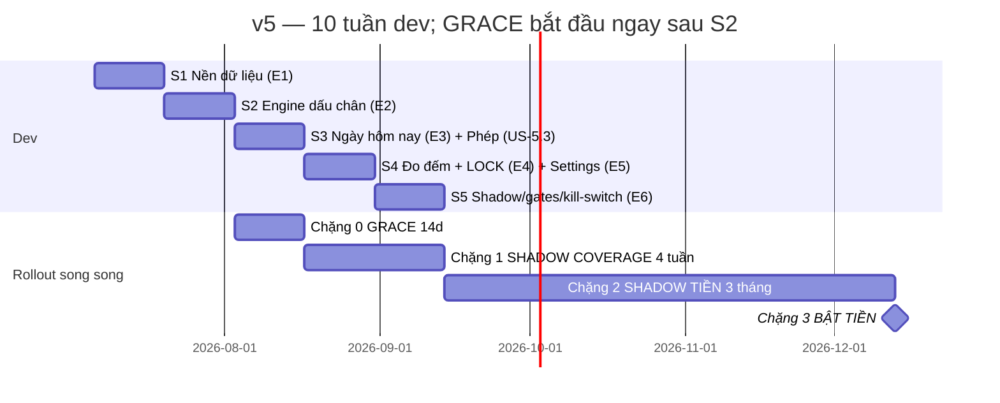

# V5-PLAN-THUC-HIEN.md — PLAN GIAO HÀNG HỆ THỐNG LƯƠNG-THƯỞNG v5

> **Trạng thái:** plan đã được thực thi; các quyết định từng treo trước S1 đã chốt theo [implementation log](V5-IMPLEMENTATION-LOG.md). Không dùng các câu hỏi lịch sử dưới đây làm chỉ báo rằng hệ thống đang chờ phê duyệt.

> **Tài liệu đi kèm:** `V5-HE-THONG-LUONG-THUONG-THONG-NHAT.md` (đặc tả hợp nhất — nguồn chân lý nghiệp vụ). Plan này là bản thực thi của đội PM/BA/UX/Dev, **đã áp dụng toàn bộ 16 mục sửa từ nghiệm thu chéo** (A1–A4, B5–B11, C12–C16).
> **Ngày:** 02/07/2026 · **Phạm vi bất biến:** Phần A + C1–C10 của Biên bản Hội đồng Tầng 1 — không bàn lại trong sprint; mọi đề xuất đổi cơ chế đưa ngược lên chủ.

---

## 0. ĐIỂM TREO DUY NHẤT CẦN CHỦ XÁC NHẬN TRƯỚC S1 (mục sửa A1)

**Ngày phép có lương: TICK hay TRUNG TÍNH?** Ma trận A1 dòng 4 ghi ✅ tick, nhưng C10 định nghĩa phép-duyệt = ngày trung tính (không vào N_chuẩn, không tick, bắc cầu streak). Hai điều này mâu thuẫn về tiền.

**Model đề xuất (đã dùng xuyên suốt plan này, chờ chủ gật 1 câu):**
- Phép-duyệt = **ngày TRUNG TÍNH theo C10**: `salary_attendance_day.status = 'leave_approved'`, **KHÔNG sinh dòng `ATTEND_DAY`**, **loại khỏi N_chuẩn của riêng người đó**, chỉ **bắc cầu streak**.
- Hệ quả kinh tế tương đương "phép có lương": N_chuẩn giảm 1 → đơn giá `6tr/N_chuẩn` tăng → đi đủ các ngày còn lại vẫn tròn 6.000.000đ. Không ai thiệt tiền, không vượt trần.
- **Định nghĩa chốt (mục sửa A2):** `N_chuẩn(user, tháng) = COUNT(T2–T7 trong tháng) − holidays[] − số-ngày-phép-đã-duyệt-của-người-đó`. Edge case phép-duyệt-nhưng-vẫn-làm-việc: SAD upgrade `leave_approved → ticked (source=JOB)`, **hoàn quota phép, ngày đó QUAY LẠI N_chuẩn trước rồi mới tick** — không bao giờ tick > N_chuẩn → ASSERT trần 6tr an toàn.

Nếu chủ không đồng ý → chỉ US-1.5 / US-2.4 / US-5.3 đổi AC, phần còn lại của plan không lung lay.

---

## 1. TÓM TẮT PRD

### 1.1 Mục tiêu

| # | Mục tiêu | Đo bằng |
|---|---|---|
| M1 | Không toà nào quá **4 ngày** (toà nóng **3 ngày**) không dấu chân; FULL ≥1/**7 ngày**/toà | View coverage: 0 toà D>4 ổn định; 3 toà trắng (65NTG/32PVC/162NVK) về nhịp |
| M2 | Trả đúng **CHUYÊN CẦN 6tr** (đơn giá = 6tr/N_chuẩn(user,tháng)) + **STREAK 3tr** (mốc 4/8/13/18/23/trọn-tháng, delta 300/500/600/600/500/500k, best-streak BANKED) từ dấu chân thật | 3 ASSERT chặn LOCK pass 100%; variance tạm-tính vs LOCK = 0 sau khiếu nại |
| M3 | Gain-framing tuyệt đối; tiền chỉ sinh khi LOCK; 1 nguồn sự thật = RPC `salary_work_ledger` + lock flow | 0 chuỗi "−/mất/trừ/phạt" mọi surface; 0 đường tiền song song |
| M4 | Bật tiền an toàn qua 4 chặng (GRACE 14d → SHADOW COVERAGE 4 tuần → SHADOW TIỀN 3 tháng → BẬT), có kill-switch về v3 | Gate thoát từng chặng (Mục 4) |
| M5 | Gánh chủ <10′/ngày: 3 nút (duyệt phép · duyệt sự cố thiết bị/geofence · spot-audit 2–3 phiếu/tuần) | Đo p90 thao tác owner trong shadow |

### 1.2 Không-mục-tiêu (chặn scope creep)

- KHÔNG quy Coverage %/điểm/QUICK ra tiền — phi-tiền vĩnh viễn; trần cứng 6tr+3tr=9tr/người/tháng.
- KHÔNG gom N QUICK = 1 công; KHÔNG progress bar "3/8 = 0.4 công" — binary tuyệt đối.
- KHÔNG "Ngày-SẠCH" phase này (Phase 2, cần 3 tiền đề dữ liệu).
- KHÔNG án gian lận tự động — máy flag, chủ kết án, 48h kháng nghị.
- KHÔNG code v5 nào đụng luồng ghi `payments`/`income_expenses` (chỉ THÊM cột `collect_*` ghi kèm, không bao giờ chặn phiếu).
- KHÔNG pipeline camera/watermark/geofence mới — tái dùng JobCaptureCamera/jobs.
- KHÔNG **tạo bảng ledger mới** — `salary_work_ledger` là **RPC computed**; v5 chỉ thêm 2 nhánh UNION (mục sửa A3).
- KHÔNG hardcode ngưỡng nào (kể cả 230.769 và 26) ở FE/SQL/test.
- KHÔNG gắn business logic v5 vào `worker/index.js` (chỉ watchdog vài dòng gọi lại edge fn).
- KHÔNG bàn lại Phần A; KHÔNG bật tiền sớm; KHÔNG cho khách thấy điểm/streak/ảnh check trên bất kỳ surface nào (kể cả /r/:token, push preview); KHÔNG sửa snapshot sau LOCK.

### 1.3 Persona

| Persona | Chân dung (dữ liệu 60d) | Pain | v5 mang lại |
|---|---|---|---|
| **NATHAN — "bận"** | 9 toà/172 phòng/104 việc | Toà êm bị bỏ quên vô thức; sợ thêm việc hành chính | Hầu hết ngày tick tự nhiên từ nguồn 1 & 3; piggyback 1 chạm cụm ≤500m; digest chỉ 2–3 toà "mồ côi"; 1 FULL ≤ dwell+2′ |
| **JOEY — "êm"** | 7 toà/91 phòng/20 việc; 65NTG 0 việc/60d; 32PVC+162NVK trắng từ 25/5 | Ngày không việc không biết làm gì để có công; toà trắng không ai phát hiện | Kiểm tra nhà = việc-mặc-định ra ngày-công; tuyến sẵn 1 FULL + 1–2 QUICK (quota ~N/4); đường tới 9tr rõ từng ngày |
| **CHỦ (owner)** | 1 người, quá tải phê duyệt | Không thấy toà bị bỏ; sợ trả tiền "check cho có"; không có thời gian xử án | Coverage map + digest D≥6; 5 lớp máy-flag-người-kết-án; 3 nút <10′/ngày; ASSERT chặn LOCK; kill-switch v3 |

---

## 2. EPICS & USER STORIES (36 US — đã vá theo nghiệm thu)

> **Quy ước AC:** mọi con số đọc từ `get_salary_v5_config()` lúc runtime — số trong AC là DEFAULT của catalog; test đọc config, **cấm hardcode**. Chuẩn RPC ghi bắt buộc (mẫu `award_job_bonus`): SECURITY DEFINER + `SET search_path` + advisory lock + idempotent + lỗi ghi `salary_award_errors` không nuốt + **test bằng tài khoản NHÂN VIÊN** (bug class RLS-MAX đã cắn 7 hàm).

### EPIC E1 — NỀN DỮ LIỆU

Bảng mới chỉ **STATE + BẰNG CHỨNG, không cột tiền**. Trước migration: regen `types.ts` từ live DB + đối chiếu `information_schema` qua Management API (schema_migrations đứng ở Feb 2026 — không tin file migrations); apply SQL qua **Node UTF-8**.

| US | User story | Acceptance criteria |
|---|---|---|
| **US-1.1** | Là dev, tôi muốn schema v5: `inspection_sessions`, `inspection_photos`, `salary_attendance_day`, `salary_streak_state`, `cron_runs`, cột GPS thu tiền, VIEW `building_coverage` | • `inspection_sessions`: FULL/QUICK chung bảng (`type`), `job_id`/`spawned_job_id` FK `jobs`, status **`open/passed/quick_done/presence/expired/cancelled`** (KHÔNG có 'failed' — fail chuẩn = presence, mục sửa B7), session_date (ngày VN), dwell_seconds cộng dồn, checklist jsonb, condition_note, device_id, device_issue, paired_income_expense_id. • `salary_attendance_day` (SAD): **UNIQUE(user_id, work_date)**, status **9 giá trị `pending/pending_check/pending_leave/ticked/leave_approved/neutral/expired/flagged/voided`** (mục sửa B8), tick_source `JOB/FULL/PAYMENT/MANUAL_DEVICE_ISSUE` (KHÔNG có LEAVE-tick — phép là leave_approved trung tính), evidence jsonb append-only, voided_reason, audit jsonb — xương sống kháng nghị C2. • `salary_streak_state` (SSS): current/best_streak, milestones_banked[], breaks_no_leave, khiên free/reserve/reserve_used, sim_cap2, UNIQUE(user_id, period_month); recompute 100% từ SAD + config. • `building_coverage` = **VIEW** derive 3 nguồn (jobs + inspection_sessions + income_expenses collect_*) — không materialize phase này. • ALTER CHECK `salary_adjustments.source` thêm `'ATTEND_V5','STREAK_V5'`. • Apply qua Node UTF-8, font Việt trong hàm hiển thị đúng; types.ts regen + commit |
| **US-1.2** | Là dev, tôi muốn GPS thu tiền trên **CHỈ `income_expenses`**: `collect_lat/collect_lng/collect_distance_m/collect_geofence_status` (mục sửa B6 — theo BA, không đụng `payments`) | Cột nullable, không phá luồng cũ; FE ghi GPS **nền im lặng** — 0 thay đổi UX keypad CollectDrawer; phiếu không GPS/denied VẪN LƯU bình thường, chỉ không sinh dấu chân; geofence so với **toà của PHÒNG TRÊN PHIẾU**, dùng bán kính từ **config acceptance_geofence hiện có** (KHÔNG tạo key `geofence_radius_m` riêng — mục sửa B11, 1 nguồn sự thật) |
| **US-1.3** | Là chủ, tôi muốn catalog settings v5 trong `salary_bonus_rules.rules`: khối `attendance_v5`/`streak_v5`/`coverage_v5`/**`system_v5`** (mục sửa B9) + `building_overrides` | Đủ key/default: attendance_budget 6tr, paid_leave 1 (0–4 không dồn), soft_floor {true,13,3tr}, streak_budget 3tr, milestones [4,8,13,18,23,'full_month'], deltas [300,500,600,600,500,500]k (Σ=streak_budget, validate), shields_free 3, shield_earn {break≤1→+1, cap kiếm 1}, reserve_cap 2, spend_cap 1 (chỉ nới), sla 4/3, remind [3,4,6]/[2,3,5], full_interval 7, dwell [8,12,18]′, photos [4,5,7], points {25,15,5,10}, busy ≥6/30d, cluster 500m, quota_divisor 4, quiet 21:00–07:00, grace 14, supplement_deadline 23:59, snooze 17:00, review/appeal 72/48h, holidays[], **cron_schedule {tier 19:00, score 23:00, digest 00:00, close_period 20:00-ngày-1} UTC** (= 02:00/06:00/07:00 + 03:00 VN ngày 1 — mục sửa B10), **feature_flags {v5_money:false, v5_coverage:false, fallback_v3:true}**. **KHÔNG có key `day_rate`, KHÔNG có key geofence riêng** |
| **US-1.4** | Là nhân viên, tôi muốn đọc config hiệu-lực qua **1 RPC `get_salary_v5_config()`** (SECDEF, mẫu `get_acceptance_geofence_config`) | Trả JSON merged default → global → building_overrides + `version` + `effective_month`; key 💰 đổi chỉ hiệu lực **đầu tháng kế** + audit row (ai/khi nào/cũ→mới); key phi-tiền hiệu lực ngay; test gọi bằng acc nhân viên pass; grep repo 0 literal `230769`/`26` trong code v5 |
| **US-1.5** | Là dev, tôi muốn 1 hàm calendar duy nhất `vn_workdays(p_month, p_user)` (SQL) + mirror TS `src/lib/` để 2 đồng hồ TIỀN/SLA đọc chung | **N_chuẩn(user, tháng) = COUNT(T2–T7) − holidays − phép-đã-duyệt-của-người-đó** (mục sửa A2); đơn giá = attendance_budget/N_chuẩn; CN/lễ/phép-duyệt = trung tính (không vào N_chuẩn, bắc cầu streak); SLA D đếm **ngày lịch kể cả CN/lễ**; tháng lễ N_chuẩn < mốc → cắt mốc từ trên xuống, delta dồn full_month, tổng vẫn = 3tr; property test (fast-check) SQL ≡ TS trên 24 tháng liên tiếp kể cả tháng lễ + tháng có phép |
| **US-1.6** | Là dev, tôi muốn feature flag **`feature_flags.v5_money`** (tên chốt theo BA — mục sửa B9) tồn tại từ migration đầu | Flag OFF → compute lương giữ hành vi hiện tại 100% (snapshot test); chỉ chủ đổi được, có audit; kill-switch code sẵn từ ngày đầu |

### EPIC E2 — ENGINE DẤU CHÂN

| US | User story | Acceptance criteria |
|---|---|---|
| **US-2.1** | Là quản lý, tôi muốn mở/ghi/đóng phiên FULL (checklist tủ điện, PCCC, hành lang tầng random, nước, **vào trong phòng trống**, +1 mục random, trường "Tình trạng nhà") — 1 phiên đạt chuẩn = 1 ngày-công | Pass khi checklist đủ + ảnh ≥ photos_min[size] + **Σdwell các phiên cùng ngày cùng toà ≥ dwell_min[size]** + geofence + hash sạch; ảnh qua pipeline JobCaptureCamera (camera-only + watermark) — không pipeline mới; condition_note ≠ OK → **tự sinh job sửa trong transaction** (spawned_job_id); upload nền offline-tolerant (mất sóng hầm không mất phiên, retry queue, `submit_inspection_photo` idempotent theo (session, hash)) |
| **US-2.2** | Là quản lý, tôi muốn fail chuẩn vẫn được PRESENCE + bổ sung trong ngày | Presence = ≥1 ảnh camera-only MỚI (hash sạch) + geofence + thiết bị đăng nhập → reset D của SLA, KHÔNG tick; đóng phiên/rời geofence chưa đủ → banner **ngay tại toà** "còn X mục nữa là đủ công hôm nay" (liệt kê đúng mục thiếu); resume **đúng phiên đang dở** 1 chạm từ /my-day (`start_inspection` trả lại phiên open/presence cùng ngày cùng toà), geofence lại, ảnh bổ sung mới; đủ lúc nào tick lúc đó; **qua 23:59 VN → status='expired' vĩnh viễn**, không API truy hồi, không duyệt tay (trừ US-2.8) |
| **US-2.3** | Là quản lý, tôi muốn phiên QUICK 2 ảnh (PCCC + tủ điện, 3–5′) giữ nhịp SLA toà êm | QUICK pass → reset SLA + **+15 điểm phi-tiền**, **không bao giờ** ghi SAD/`ATTEND_DAY`; nút **"Nâng cấp lên FULL"** giữ nguyên ảnh + dwell (UPDATE type qua resume); QUICK là điều-kiện-chốt cho nguồn 3; **`start_quick_check` chỉ là wrapper mỏng của `start_inspection(p_type='QUICK', p_paired_income_expense_id)`** — 1 đường ghi duy nhất vào bảng (mục sửa C15) |
| **US-2.4** | Là hệ thống, tôi muốn **hàm lõi `v5_tick_attendance`** (SECDEF + advisory lock (user,date) + idempotent) được các RPC nguồn gọi NỘI BỘ (mục sửa B5) | **Nguồn 1 (job pass), 2 (FULL pass), 3 (thu+GPS đã chốt-check) gọi chung hàm lõi — nguồn 4 (phép) KHÔNG gọi** (phép = leave_approved trung tính, mục sửa A1); UPSERT SAD 1 dòng/người/ngày — ngày đã ticked, nguồn đến sau chỉ append `evidence`, không double; binary: 8 việc = 1 tick, phần vượt chỉ điểm; **`ATTEND_DAY`/`STREAK_MILESTONE` = 2 nhánh UNION mới trong RPC `salary_work_ledger` đọc từ SAD/SSS — KHÔNG có bảng ledger để "mirror"** (mục sửa A3); tick thành công → bắn qua **đúng pipeline award_job_bonus → realtime → BonusToast <1s**: "+{budget/N_chuẩn} tạm tính · chuỗi {n} · còn {m} ngày tới mốc +{delta}k" — in-app, không Web Push từng phiếu; lỗi ghi `salary_award_errors` rồi RAISE |
| **US-2.5** | Là quản lý, tôi muốn thu tiền tại toà (GPS khớp toà của phòng trên phiếu) tự thành ngày-công khi toà đã/được check hôm đó | `record_payment_gps` gọi SAU khi phiếu lưu OK, **không bao giờ fail phiếu thu**; toà đã check hôm nay → tick luôn; chưa check **và ngày CHƯA ticked** → SAD `pending_check` + **thông báo TREO** "Cần check nhà sau khi thu tiền" (không chặn keypad, 1 thông báo/toà/ngày, snooze, nhắc chót 17:00) → hoàn thành CHECK-NHANH mới chốt tick; **ngày ĐÃ ticked từ nguồn khác → KHÔNG sinh treo** (tránh notification vô nghĩa cho Nathan), nhu cầu ghé toà chuyển sang prompt piggyback (mục sửa C14); quá 23:59 → `expired`, không truy hồi, empty-state trung tính không hiển thị như mất mát; tick nguồn 3 join ngược được income_expense_id — GPS lệch toà (thu hộ từ xa) = outside, không dấu chân |
| **US-2.6** | Là hệ thống, tôi muốn state machine streak (pass=công+touch · fail=touch-không-công · gian lận=huỷ cả hai) + best-streak BANKED + khiên, recompute từ sự kiện | Mốc đạt → nhánh `STREAK_MILESTONE` (tạm), đứt vẫn giữ (banked); CN/lễ/phép-duyệt bắc cầu (phép ĐANG CHỜ bridge tạm — `pending_leave`, chốt cứng khi duyệt trước LOCK); khiên free 3/tháng tự tiêu; khiên dự trữ tiêu **tối đa 1/tháng**, kiếm: tháng đứt-không-phép ≤1 → +1 (cap tồn 2); **nguồn khiên-từ-CN KHÔNG tồn tại trong code**; `recompute(user, month)` từ SAD + config = state hiện hành (property test); reset đầu tháng framing "mùa mới"; full_month = đứt-không-phép **= 0** trên N_chuẩn, đánh giá tại close_period |
| **US-2.7** | Là chủ, tôi muốn edge function **`salary-v5-jobs`** (service-role, mẫu send-push) chạy bởi Vercel Cron: `tier` 02:00 · `score` 06:00 · `digest` 07:00 · **`close_period` 03:00 ngày 1** giờ VN (mục sửa B10) | Mỗi run ghi `cron_runs` (UNIQUE (job, idem_key) chống chạy đôi); idempotent — chạy 2 lần cùng khoá không đổi kết quả; job chỉ tính điểm/nhắc/dựng bảng đối chiếu, **không sinh tiền** — tắt cron 1 tuần không sai lương (test); `score` dựng tuyến priority = D×(1+P/20) + 10·phòng-trống + 5·HĐ-đáo-hạn(cap 10) + 5·kỳ-thu-≤3d + 15·sự-cố-mở, D từ dấu chân thật; nhắc 3 nấc D≥3 vàng in-app → D≥4 đỏ push → D≥6 báo chủ (toà nóng 2/3/5); CN/lễ không push đỏ (dồn digest sáng ngày làm việc kế); quiet hours 21:00–07:00; không nấc nào trừ tiền |
| **US-2.8** | Là quản lý, tôi muốn nút **"Báo sự cố thiết bị"** trong phiên (GPS drift/máy hỏng/giờ lệch) | Tạo yêu cầu kèm bằng chứng phụ → chủ duyệt 1-chạm (`approve_geofence_fail`) → tick tay `source=MANUAL_DEVICE_ISSUE` + audit đầy đủ; đường này **sống trước khi bật tiền** (điều kiện Chặng 3); lỗi kỹ thuật mặc định ≠ gian lận; GPS denied trong FULL → nút hiện ngay màn start |
| **US-2.9** | Là chủ, tôi muốn fallback 2 tầng: nút admin "Chạy lại job" + worker watchdog mỏng | Nút gọi đúng edge fn cùng idem_key, phủ **cả 4 job** kể cả close_period (mục sửa B10); worker mỗi 30–60′ đọc `cron_runs`, thiếu heartbeat >2h → HTTP gọi lại edge fn + báo chủ; watchdog **vài dòng, không import logic v5**; runbook ghi caveat phải restart worker khi sửa watchdog |

### EPIC E3 — "NGÀY HÔM NAY CỦA TÔI" (/my-day)

Tái dùng: hero KPI card + tile grid `.hl-*` (HomeLauncher), AlertsList, usePhoneViewport, mobile full-screen CSS scoped (mẫu SalarySelfMobile).

| US | User story | Acceptance criteria |
|---|---|---|
| **US-3.1** | Là quản lý, tôi muốn 1 màn 3 khối: (1) trạng thái công HÔM NAY + con đường ngắn nhất để tick, (2) việc phát sinh + thông báo treo, (3) tuyến gợi ý | Badge trạng thái to **xanh/xám, không bao giờ đỏ**; vòng tiến độ X/N_chuẩn · +Y đ **"TẠM TÍNH — chốt khi khoá sổ"** · chuỗi hiện tại; nhân viên KHÔNG thấy bản đồ D đỏ toàn tuyến (màn của chủ); thông báo treo check-sau-thu ghim khối 2 tới khi resolve; **menu ⋯ có entry "Xin phép 1-chạm"** (mục sửa C12a); data từ `get_my_day_summary` |
| **US-3.2** | Là Joey (ngày không việc), tôi muốn tuyến 1 FULL + 1–2 QUICK theo cụm ≤500m (quota ~N/4) | Tuyến từ job `score` 06:00 (`get_daily_missions`); card toà ghi lý do ngôn ngữ khách ("2 phòng đang chào — ghé hôm nay chắc +1 ngày-công"); đổi tuyến/swap toà 1 chạm — máy gợi ý người quyết, từ chối không log xấu |
| **US-3.3** | Là Nathan (đang ở toà/cụm), tôi muốn prompt piggyback 1 chạm khi toà hiện tại hoặc cụm ≤500m chưa đạt nhịp | Prompt chỉ hiện khi có toà đủ điều kiện; bấm mở thẳng QUICK/FULL; +5 điểm; nút "Để sau" **bằng cỡ nút chính**; đây cũng là kênh thay thế notification treo khi ngày đã ticked (C14) |
| **US-3.4** | Là quản lý, tôi muốn digest 07:00 đúng-1-push/ngày + thẻ "Tuyến sáng mai" 19:00 in-app + recap tĩnh cuối ngày | Digest tối đa 2–3 toà, gain-framing, deep-link `sw.js data.url` vào /my-day; tắt CN/lễ/phép-đã-duyệt; 19:00 không push; recap 1 dòng không "toà bỏ lỡ", không số âm; quiet hours im tuyệt đối; đổi người phụ trách toà → digest ngày đầu ghi "toà X mới về tuyến của bạn, dấu chân gần nhất D ngày trước" |
| **US-3.5** | Là quản lý, tôi muốn luồng phiên FULL mượt: checklist tuần tự, dwell chạy ngầm hiển thị công khai, upload nền — tổng thao tác ≤ dwell + 2′ | Đo timestamp phiên: vượt 25′ tổng → log lỗi PROTOCOL (để cắt checklist), không hiển thị lỗi cho người dùng; mất mạng giữa phiên → sống lại nguyên trạng khi có mạng |
| **US-3.6** | Là quản lý, tôi muốn mọi chữ mọi surface qua bộ lọc gain-framing | 0 chuỗi "−/mất/trừ/phạt/rớt" (push, toast, empty-state, lỗi, recap, label); fail luôn = "còn X mục nữa là đủ công"; unit test lint chuỗi cấm trên file copy v5; **quy ước số streak: mốc luôn kèm DELTA (+500k), tổng luỹ kế ghi tách riêng — các giá trị luỹ kế hợp lệ duy nhất: 300/800/1.400/2.000/2.500/3.000k** (mục sửa C13) |

### EPIC E4 — ĐO ĐẾM + LOCK

| US | User story | Acceptance criteria |
|---|---|---|
| **US-4.1** | Là quản lý, tôi muốn self-view lương v5: bảng ngày N_chuẩn ô (tick/nguồn/phép/khiên/CN-bridge + lý do fail cụ thể + link bằng chứng) | `get_salary_progress_v5` trả cả n_chuan + day_rate động; mọi số nhãn "TẠM TÍNH"; khiếu nại tick 1-chạm trong 48h; đúng 1 thông báo mốc giữa tháng (ngày 15); mobile theo mẫu SalarySelfMobile |
| **US-4.2** | Là chủ, tôi muốn dashboard **4 tab đúng biên bản: Coverage map · Nghi án · Đối soát tháng · Shadow report** (mục sửa A4 — tab "Đối soát tháng" bắt buộc, chứa bảng N_chuẩn ô/người + trạng thái XÁC NHẬN/Thắc mắc 72h + nút LOCK + kết quả 3 ASSERT + treo LOCK riêng người tranh chấp; nếu UX gộp Nghi án/Shadow vào tab khác phải ghi mapping rõ) | Coverage từ VIEW `building_coverage`; hạng động 30d (BẬN ≥6 việc/30d → chỉ piggyback); tab Nghi án hiện bằng chứng cạnh nhau (2 ảnh trùng hash / travel-time / EXIF); D≥6 lên AlertsList; toàn bộ <5′/ngày |
| **US-4.3** | Là hệ thống, tôi muốn 5 lớp chống đối phó chạy nền, chỉ **flag** không kết án | Checklist đa-vị-trí · dwell · ảnh-hash+camera-only · travel-time plausibility (kể cả 2 thiết bị 2 toạ độ cùng lúc) · spot-audit 2–3 phiếu/tuần random có seed audit được; flag → nghi án + treo tick `flagged`; nhân viên nhận bằng chứng + đồng hồ 48h kháng nghị |
| **US-4.4** | Là chủ, tôi muốn màn kết án đúng due-process C2 | Án xác nhận → huỷ công ngày đó (`voided` + voided_reason + audit) + **tước toàn bộ mốc banked THÁNG HIỆN HÀNH** (best-streak về 0, tính lại từ ngày kế) — không đụng ngày sạch/sàn mềm; án chốt **trước LOCK**, quá hạn → xử **có lợi nhân viên** (job close_period enforce); đang điều tra → treo LOCK riêng người; sau LOCK → chỉ `salary_adjustments` kỳ sau; tái phạm 2/90d → cờ kỷ luật ngoài hệ thống |
| **US-4.5** | Là chủ, tôi muốn chu trình đóng kỳ: chốt mềm ngày 1–2 → cửa sổ soát 72h → LOCK | Job `close_period` dựng bảng đối chiếu + nút XÁC NHẬN/Thắc mắc; LOCK ghi snapshot theo flow hiện có + **2 dòng `salary_adjustments` source `ATTEND_V5` (≤6tr) + `STREAK_V5` (≤3tr)**; compute ASSERT **đúng 3 bất biến** (mục sửa C16): (1) trần ATTEND ≤6tr VÀ STREAK ≤3tr mỗi người; (2) variance tạm-tính vs LOCK = 0 trừ khiếu nại có audit; (3) 100% tick nguồn PAYMENT join ngược phiếu thu thật — vượt là **CHẶN LOCK**; sau LOCK → push "Đã chốt +X.XXX.XXXđ" + phiếu lương minh bạch; snapshot bất biến (test UPDATE trực tiếp bị chặn) |
| **US-4.6** | Là chủ, tôi muốn duyệt phép & sự cố thiết bị gộp 1 hàng chờ 1-chạm | p90 thao tác owner ≤ 3 nút/ngày, tổng <10′; phép chờ >24h → auto-nhắc chủ (job digest) |

### EPIC E5 — SETTINGS + PHÉP 1-CHẠM

| US | User story | Acceptance criteria |
|---|---|---|
| **US-5.1** | Là chủ, tôi muốn tab "Lương v5" trong Settings render từ catalog (4 khối + building_overrides) | Key 💰 cảnh báo "hiệu lực từ 01 tháng kế" + version + lịch sử audit; key phi-tiền apply ngay; validate range (paid_leave 0–4, Σdeltas = streak_budget, remind tăng dần); building_overrides chỉ sla/dwell/photos/cờ-nóng; **toggle "Tiền v5" ghi rõ đang bật/tắt key `feature_flags.v5_money`** (mục sửa B9) |
| **US-5.2** | Là chủ, tôi muốn khai báo `holidays[]` trước ngày 25 tháng trước, khoá đổi giữa tháng | Sau ngày 25 không sửa được tháng kế (trừ owner-force có audit + cảnh báo); đổi holidays → preview N_chuẩn + đơn giá + mốc bị cắt của tháng ảnh hưởng |
| **US-5.3** | Là quản lý, tôi muốn xin phép 1-chạm (chọn ngày, lý do ngắn) **từ /my-day** (mục sửa C12a) | Quota `paid_leave_days_per_month` (default 1, 0–4, không dồn); phép ĐANG CHỜ → `pending_leave`, bridge tạm + giữ chỗ, chốt cứng khi duyệt trước LOCK; **duyệt → `leave_approved` = ngày trung tính, loại khỏi N_chuẩn, KHÔNG tick** (model Mục 0); duyệt/từ chối 1-chạm phía chủ, push kết quả gain-framing; phép-duyệt-nhưng-vẫn-làm → upgrade JOB + hoàn quota + ngày quay lại N_chuẩn |
| **US-5.4** | Là chủ, tôi muốn nút "Chạy lại job" (**tier/score/digest/close_period**) + bảng `cron_runs` trong settings | 20 run gần nhất + trạng thái; chạy lại cùng idem_key, kết quả trong 10s |

### EPIC E6 — SHADOW & METRICS + KILL-SWITCH

| US | User story | Acceptance criteria |
|---|---|---|
| **US-6.1** | Là chủ, tôi muốn cấu hình chặng (`grace → shadow_coverage → shadow_money → live`) là CODE điều khiển hành vi | Grace: digest ON, escalate/nhắc-đỏ OFF, không score công khai; shadow_coverage: SLA+score+nhắc 3 nấc ON, 0 tiền; shadow_money: full loop THẬT (popup, recap, LOCK-shadow song song hằng tháng) nhưng cột "nếu áp v5" chỉ hiển thị, nhãn **"TẠM TÍNH — CHƯA GẮN TIỀN"** to rõ, **assert CẤM ghi salary_monthly**; chuyển chặng chỉ tiến, có audit |
| **US-6.2** | Là chủ, tôi muốn bảng gate metrics tự tính trên tab Shadow report | Từng gate: giá trị hiện tại / ngưỡng / pass-fail / cửa sổ đo (2 tuần cuối chặng 1, 3 kỳ chặng 2); export được để review hội đồng |
| **US-6.3** | Là chủ, tôi muốn báo cáo "lệch v5 vs thực trả" mỗi kỳ LOCK-shadow (tổng quỹ, per-người, phân bố ngày-công, %mốc-nhờ-khiên, **mô phỏng cap khiên 2** từ `sim_cap2`) | Mô phỏng cap 2 KHÔNG hiển thị cho nhân viên như quyền lợi; báo cáo trả lời được 8 câu Sổ-còn-mở (khiên 1→2, mốc/delta, dwell per-toà, materialize view, sàn mềm, presenteeism, nhịp 17:00, %check-sau-thu quá hạn) |
| **US-6.4** | Là chủ, tôi muốn kill-switch: `feature_flags.v5_money` OFF → tiền về v3 nguyên trạng, **SLA coverage giữ vĩnh viễn** | Tắt giữa tháng → tháng đó LOCK theo v3, nhánh ATTEND_DAY/STREAK_MILESTONE bị bỏ qua ở compute (KHÔNG xoá dữ liệu SAD/SSS); coverage/SLA/digest không đổi hành vi; **diễn tập tắt-bật 1 lần trong shadow chặng 2, có biên bản** |
| **US-6.5** | Là quản lý, tôi muốn **màn onboarding bắt buộc** trước bật tiền: 1-pager + giải thích 1-1 + nút **"Tôi đã hiểu"** trong app (mục sửa C12b — có wireframe/copy riêng) | Chưa xác nhận → không bật tiền cho người đó và **không bật nửa vời** (cả nhóm cùng bật); trước khi chi tháng đầu: đối chiếu trần quỹ tăng thêm = headcount × 9tr vs quỹ shadow tháng 3 |

---

## 3. SPRINT MAP S1–S5 (2 tuần/sprint) + PHỤ THUỘC + DoD

| Sprint | Nội dung | Stories | Phụ thuộc | Definition of Done |
|---|---|---|---|---|
| **S0 (trước S1, 2 ngày)** | **Chủ xác nhận model phép trung tính (Mục 0)** + regen types.ts + đối chiếu information_schema qua Management API + check trùng tên bảng | — | PAT trong CLAUDE.local.md | Biên bản 1 dòng chủ gật; types.ts commit; danh sách bảng/hàm hiện hữu đối chiếu xong |
| **S1** | Migrations + catalog settings + calendar + RPC config + feature flag + ALTER salary_adjustments CHECK | US-1.1→1.6 | S0 | Migration apply live qua **Node UTF-8**, font Việt đúng; `get_salary_v5_config()` test bằng acc **nhân viên**; property test calendar SQL≡TS xanh (kể cả tháng lễ + phép); flag OFF = hành vi cũ 100% (snapshot test); `tsc -p tsconfig.app.json` không thêm lỗi mới; grep 0 literal 230769/26; commit + push main |
| **S2** | RPC inspection FULL/QUICK (+wrapper) + presence/resume + hàm lõi `v5_tick_attendance` + streak state + `record_payment_gps` + edge fn `salary-v5-jobs` (4 job) + Vercel Cron + watchdog | US-2.1→2.9 | S1 (schema, config, calendar) | Test idempotent (gọi 2 lần = 1 tick); test acc nhân viên cho MỌI RPC; cron live 3 ngày `cron_runs` sạch; tắt cron 48h → không sai state tiền; Playwright: mở FULL → fail → resume → pass trên ptcrm; recompute SSS = state (property test); **GRACE 14d bắt đầu cuối S2** |
| **S3** | Màn /my-day (3 khối, tuyến, piggyback, digest/recap, treo check-sau-thu) + phép 1-chạm 2 phía | US-3.1→3.6, US-5.3 | S2 (engine + job score) | Playwright mobile viewport: Joey-flow (không việc → tuyến → FULL → toast <1s) + Nathan-flow (thu tiền → treo → CHECK-NHANH → tick; thu khi ĐÃ ticked → không treo, có piggyback); lint chuỗi cấm xanh; quiet hours verify; digest đúng 1 push/ngày; entry xin phép ở /my-day hoạt động |
| **S4** | Self-view + owner dashboard **4 tab (có Đối soát tháng)** + 5 lớp flag + màn kết án + chốt mềm/72h/LOCK + 3 ASSERT + settings tab + holidays | US-4.1→4.6, US-5.1, 5.2, 5.4 | S3 (dữ liệu phiên thật từ GRACE để test dashboard) | LOCK-shadow 1 kỳ giả lập với 3 ASSERT pass; án gian lận demo end-to-end (flag → kháng nghị → kết án → tước mốc banked) đủ audit; key 💰 đổi giữa tháng không hiệu lực tới tháng kế (test); tab Đối soát tháng đủ: bảng ô/người + XÁC NHẬN/Thắc mắc + nút LOCK + treo riêng người |
| **S5** | Chặng-state machine + gate metrics + báo cáo lệch + sim cap 2 + kill-switch + diễn tập + onboarding "Tôi đã hiểu" + runbook | US-6.1→6.5 | S4 (LOCK flow) | Diễn tập kill-switch tắt-bật có biên bản; gate dashboard tính đúng trên dữ liệu GRACE+shadow thật; runbook (cron, caveat restart watchdog, chạy lại job, xử nghi án); UX review "khách không thấy gì" mọi surface kể cả /r/:token + push preview lock screen |

**Đường găng:** S0→S1→S2 cứng (xác nhận phép → schema → engine). GRACE cần đúng E2 + digest; S3/S4/S5 ship dần TRONG grace/shadow coverage — Chặng 1 chỉ cần E2+E3, Chặng 2 cần đủ E4+E6 **trước kỳ LOCK-shadow đầu tiên**.

---

## 4. GATES SHADOW = ĐIỀU KIỆN RELEASE (không thương lượng)

| Chặng | Gate thoát | Trượt |
|---|---|---|
| **0 — GRACE 14d** | 2 quản lý dùng app hằng ngày; 65NTG/32PVC/162NVK mỗi toà ≥1 FULL, không toà D>4 trong 7 ngày cuối; không mất dữ liệu | Gia hạn +4 tuần, chỉ chỉnh CONFIG (C6) không chỉnh cơ chế, tối đa 2 lần/chặng |
| **1 — SHADOW COVERAGE 4 tuần** (đo 2 tuần cuối) | 3 toà trắng giữ touch ≤4d ổn định 2 tuần liên tiếp · geofence-pass ≥90% · fail-dwell <15% · push-ignore <50% · 0 toà D>6 | như trên |
| **2 — SHADOW TIỀN 3 tháng tròn** | median best-streak ≥13 (nếu <12 → hạ mốc bằng config TRƯỚC khi bật) · %full-streak 10–60% · %mốc-nhờ-khiên ≤30% · fail-dwell ≤10% (người-làm-thật) · variance tạm-tính vs LOCK-shadow = 0 sau khiếu nại (≤1 ngày-công/người 2 kỳ đầu, kỳ cuối = 0) · khiếu nại tick <5% · khiếu nại khách "check cho có" không tăng vs baseline | Trượt lần 3 → **tiền về v3 qua `feature_flags.v5_money`, SLA coverage giữ vĩnh viễn** |
| **3 — BẬT TIỀN** (ngày 1 tháng thứ 4) | 100% quản lý bấm "Tôi đã hiểu" · đường "Báo sự cố thiết bị" đã sống (có ≥1 case duyệt thật trong shadow) · đối chiếu quỹ tăng thêm = headcount × 9tr vs shadow tháng 3 | Không bật nửa vời từng người; không bật non dù số đẹp |

---

## 5. RACI — AI BẤM NÚT GÌ

| Việc | Chủ (owner) | Quản lý (staff) | Hệ thống (cron/RPC) | PM/BA/UX/Dev |
|---|---|---|---|---|
| Duyệt phép 1-chạm | **A/R** (1-chạm, auto-nhắc sau 24h) | R (xin từ /my-day) | C (bridge tạm khi pending) | — |
| Duyệt geofence-fail / sự cố thiết bị | **A/R** (1-chạm kèm bằng chứng phụ) | R (bấm "Báo sự cố" trong phiên) | C (tick `MANUAL_DEVICE_ISSUE` + audit) | — |
| Spot-audit 2–3 phiếu/tuần | **A/R** (xem phiếu random có seed) | I | R (chọn random, dựng hàng chờ) | — |
| Kết án gian lận | **A/R** (màn bằng chứng, trước LOCK) | R (48h kháng nghị) | R (flag only — hash/EXIF/travel-time) | I |
| Tick ngày-công / bank mốc | I (BonusToast bên staff) | I (nhận toast) | **R** (`v5_tick_attendance` idempotent) | — |
| Xếp tuyến + digest + nhắc 3 nấc | I (nhận báo D≥6) | I (nhận digest 07:00, swap tuyến) | **R** (jobs tier/score/digest) | — |
| Chốt mềm + cửa sổ 72h | **A** (mở kỳ) | R (XÁC NHẬN / Thắc mắc từng ô) | R (job close_period dựng bảng) | — |
| Bấm LOCK | **A/R** (duy nhất) | I (nhận phiếu lương + push) | R (3 ASSERT — chặn nếu vượt) | — |
| Đổi settings 💰 / holidays / feature flag | **A/R** (audit, hiệu lực tháng kế) | I | R (enforce effective_month) | C (không hardcode) |
| Chuyển chặng shadow / kill-switch | **A/R** (theo gate metrics) | I | R (gate dashboard tính số) | C (biên bản diễn tập) |
| Chạy lại job khi cron chết | **R** (nút admin) | — | R (watchdog heartbeat >2h) | C (runbook) |
| Sửa cơ chế Phần A / ma trận | **A** (duy nhất) | — | — | R (đưa ngược lên, không tự sửa) |

---

## 6. DANH SÁCH FILE CODE SẼ ĐỤNG

**FE — sửa:**
- `src/pages/home/HomeLauncher.tsx` + `src/pages/home/launcherTiles.ts` — tile "Ngày hôm nay của tôi" + hero card trạng thái công (tái dùng `.hl-*`)
- `src/App.tsx` — route lazy `/my-day` (+ listener onAuthStateChange giữ code sync, không thêm async)
- `src/pages/ThuTien.tsx` (CollectDrawer.submitKeypad) + `src/hooks/useQuickCollect.ts` + `useBulkRecordPayment` — GPS nền im lặng + gọi `record_payment_gps` SAU khi phiếu lưu
- `src/components/tasks/TaskCompleteDialog.tsx` — sau job pass gọi tick nguồn 1 (qua RPC, không tự cộng)
- `src/components/tasks/JobCaptureCamera.tsx` — tái dùng nguyên vẹn cho inspection (thêm prop checklist_key + hash, không fork pipeline)
- `src/pages/settings/GeneralSettingsPage.tsx` — tab "Lương v5" (catalog + holidays + cron_runs + nút chạy lại + feature flag)
- `src/hooks/useSalaryConfig.ts` — mở rộng đọc/ghi khối v5 trong `salary_bonus_rules.rules`
- `src/hooks/useManagerSalary.ts` — LOCK flow: 2 dòng adjustments ATTEND_V5/STREAK_V5 + 3 ASSERT + LOCK-shadow
- `src/components/dashboard/AlertsList.tsx` — nguồn cảnh báo D≥6
- `worker/index.js` — CHỈ watchdog vài dòng đọc `cron_runs` → gọi lại edge fn (caveat restart, ghi runbook)
- `sw.js` — deep-link data.url vào /my-day (đã hỗ trợ, chỉ thêm route)

**FE — mới:**
- `src/pages/my-day/MyDayPage.tsx` (+ `MyDayMobile.tsx`, CSS scoped, usePhoneViewport branch)
- `src/components/inspections/` — InspectionSession, InspectionChecklist, QuickCheckSheet, DeviceIssueButton, UpgradeToFullButton
- `src/components/salary-v5/` — SelfViewV5, OwnerDashboardV5 (4 tab: CoverageMap · FraudQueue · MonthlyReconciliation · ShadowReport), VerdictScreen, OnboardingConfirm ("Tôi đã hiểu"), LeaveOneTap
- `src/lib/v5Calendar.ts` (mirror TS của `vn_workdays`) + `src/lib/v5Copy.ts` (copy tập trung để lint chuỗi cấm) + test fast-check

**Backend:**
- `supabase/migrations/2026MMDD_v5_*.sql` — bảng INS/INP/SAD/SSS/cron_runs/salary_award_errors, cột `income_expenses.collect_*`, `buildings.cluster_id`, VIEW `building_coverage`, ALTER CHECK `salary_adjustments.source`, **mở rộng UNION trong RPC `salary_work_ledger`** (sửa hàm tại `20260628000001_manager_salary_module.sql:173` — KHÔNG tạo bảng ledger), toàn bộ RPC Mục 3 spec BA + hàm lõi `v5_tick_attendance` — apply qua Management API **Node UTF-8**, test acc nhân viên
- `supabase/functions/salary-v5-jobs/` — edge fn 4 job (tier/score/digest/close_period), service-role, idempotent, mẫu send-push
- `vercel.json` — 4 mục crons (19:00/23:00/00:00 UTC hằng ngày + 20:00 UTC ngày cuối tháng cho close_period 03:00 VN ngày 1); **không đụng khối rewrites/Cache-Control hiện có** (án lệ cache poisoning 85d9515)
- `src/integrations/supabase/types.ts` — regen từ live DB trước và sau migration

**Tham chiếu mẫu (không sửa):** `20260628000001_acceptance_geofence.sql` (RPC config SECDEF + geofence 70m), `20260629000001_completion_address.sql`, BonusToast/award_job_bonus pipeline, `FinancialAnalysisReport.tsx`/`BanGiaoReport.tsx` (pattern tab report), `SalarySelfMobile` (mẫu mobile), `useUiPreferences` (toggle hiển thị nhỏ per-user).

---

## 7. RỦI RO & GIẢM THIỂU

| Rủi ro | Khả năng | Tác động | Giảm thiểu |
|---|---|---|---|
| RLS-MAX bug class tái diễn ở RPC mới (test bằng chủ không lộ) | Cao | Tick sai/trùng cho staff | Chuẩn RPC bắt buộc; **DoD mọi sprint: test bằng acc nhân viên**; mẫu award_job_bonus |
| Dev đọc nhầm "ledger" thành bảng → tạo đường tiền song song | Cao (nếu không vá) | Vi phạm C9, sai lương | Đã vá ngôn ngữ (mục A3): chỉ UNION trong RPC; code review checklist "chỉ ledger"; 3 ASSERT chặn LOCK; assert CẤM ghi salary_monthly trong shadow |
| Mâu thuẫn phép tick/trung tính lọt vào code trước khi chủ chốt | Trung | Vượt trần 6tr, CHẶN LOCK do spec | **S0 chặn cứng**: không cắt ticket S1 khi chủ chưa gật model Mục 0; N_chuẩn per-user đã vá lỗ ASSERT (mục A2) |
| GPS drift/hầm mất sóng → fail oan → mất niềm tin ngày 1 | Cao | Chống đối hệ thống | Presence chỉ cần 1 ảnh; dwell cộng dồn; offline-tolerant; "Báo sự cố thiết bị" sống từ ngày 1 (điều kiện Chặng 3) |
| Án gian lận oan → tước 3tr → khủng hoảng nhân sự | Thấp | Rất cao | Máy chỉ flag; 48h kháng nghị; quá hạn xử có lợi NV; treo LOCK riêng người; không hồi tố tháng đã LOCK |
| Vercel Cron trễ/chết; watchdog sửa mà quên restart worker | Trung | Digest/tuyến trễ, fallback chết im | Job không sinh tiền → fail không sai lương; nút chạy lại + heartbeat >2h; `cron_runs` UNIQUE idem_key; watchdog vài dòng gần như không sửa + runbook caveat |
| Hardcode 230.769/26 lọt vào code/test | Trung | Tháng lễ tính sai | Lint/grep CI cấm literal; đơn giá luôn từ calendar+config; property test tháng lễ + tháng có phép |
| Loss-framing lọt qua copy; số streak minh hoạ sai (delta vs luỹ kế) | Trung | Phá tâm lý gain-framing, dev hiểu nhầm | Copy tập trung `v5Copy.ts` + lint chuỗi cấm; quy ước C13: mốc = DELTA, luỹ kế tách riêng; UX review từng surface |
| Hỏng font tiếng Việt khi apply SQL | Chắc chắn nếu quên | Hàm/thông báo vô nghĩa | Chỉ apply qua Node UTF-8 (án lệ đã có), ghi trong DoD S1 |
| Sốt ruột bật tiền sớm / hạ chuẩn gate | Trung | Trả tiền cho hành vi đối phó | Gate là code (US-6.1/6.2), chuyển chặng có audit; luật trượt-gate cứng; kill-switch diễn tập trước |
| Presenteeism (đi làm ốm giữ chuỗi) | Chưa rõ | Trung | Theo dõi từ ngày 1 (Sổ-còn-mở #7); bất thường → van CHRO lui streak về v3 |
| Khách thấy streak/ảnh check qua surface công khai | Thấp | Uy tín | UX review checklist mọi surface kể cả /r/:token + push preview lock screen (DoD S5) |
| Notification treo spam Nathan khi ngày đã tick | Trung | Nhờn thông báo | Đã vá (mục C14): ngày ticked → không sinh treo, chuyển piggyback prompt |

---

## 8. TIÊU CHÍ NGHIỆM THU TỔNG (trước khi tuyên bố "v5 xong")

**Kỹ thuật:**
1. `tsc -p tsconfig.app.json` không thêm lỗi mới; toàn bộ test v5 (unit + property fast-check + lint chuỗi cấm) xanh; grep 0 literal `230769`/`26` trong code v5.
2. 100% RPC ghi: SECDEF + search_path + advisory lock + idempotent (bằng chứng test gọi 2 lần) + lỗi vào `salary_award_errors`; 100% đã test bằng **tài khoản nhân viên**.
3. Recompute: `recompute(user, month)` từ SAD + config = state SSS hiện hành trên toàn bộ dữ liệu shadow (0 lệch).
4. Migration đã apply live qua Node UTF-8, font Việt đúng; types.ts regen khớp; VIEW `building_coverage` trả đúng D cho cả 3 nguồn dấu chân.
5. Cron 4 job chạy ≥2 tuần liên tục `cron_runs` sạch; diễn tập: tắt cron 48h → 0 sai state tiền; watchdog tự gọi lại khi thiếu heartbeat.

**Nghiệp vụ (Playwright trên ptcrm, acc test):**
6. Joey-flow: ngày không việc → mở /my-day → tuyến → FULL pass → BonusToast <1s → SAD ticked → dòng ATTEND_DAY xuất hiện trong ledger RPC.
7. Nathan-flow: thu tiền toà chưa check → keypad không bị chặn → treo 1 thông báo/toà → CHECK-NHANH → tick; thu khi ngày đã ticked → KHÔNG treo; thu hộ GPS lệch toà → không dấu chân, phiếu vẫn lưu.
8. Fail-flow: FULL thiếu chuẩn → banner "còn X mục" tại toà → resume → pass trước 23:59 → tick; qua 0h → expired, không truy hồi.
9. Án gian lận end-to-end: flag → 48h kháng nghị → kết án → voided + tước mốc banked tháng, ngày sạch/sàn mềm nguyên vẹn, audit đủ; quá hạn → tự xử có lợi NV.
10. LOCK end-to-end: chốt mềm → 72h soát → LOCK với đúng 3 ASSERT; 2 dòng adjustments ATTEND_V5 ≤6tr + STREAK_V5 ≤3tr; snapshot bất biến; kill-switch OFF giữa tháng → LOCK theo v3, coverage không đổi.
11. Phép: xin 1-chạm từ /my-day → pending bridge → duyệt → ngày trung tính loại khỏi N_chuẩn, đơn giá tự tăng, tổng tháng vẫn ≤6tr; phép+làm việc → hoàn quota, quay lại N_chuẩn rồi tick.

**Trải nghiệm & an toàn:**
12. 0 chuỗi loss-framing trên mọi surface; mọi số realtime có nhãn "TẠM TÍNH"; số streak hiển thị đúng quy ước delta/luỹ kế.
13. Khách không thấy bất kỳ dấu vết v5 nào (rà /r/:token, push preview lock screen, mọi trang public).
14. Gánh chủ đo thực tế <10′/ngày (p90, dữ liệu shadow); thao tác 1 FULL ≤ dwell + 2′.
15. Gates 4 chặng hiển thị đúng trên dashboard, chuyển chặng có audit; biên bản diễn tập kill-switch + runbook đã bàn giao; 100% quản lý bấm "Tôi đã hiểu" trước ngày bật tiền.

---
*Hết plan. Tài liệu nguồn: Biên bản Hội đồng Tầng 1 (02/07/2026) + PRD v1.0 + Spec BA + Danh sách sửa nghiệm thu chéo (16 mục — đã áp dụng đủ). Mục duy nhất chờ chủ: xác nhận model phép trung tính (Mục 0) trước khi cắt ticket S1. Các mục Sổ-còn-mở chỉ quyết bằng dữ liệu shadow — plan không quyết thay.*
