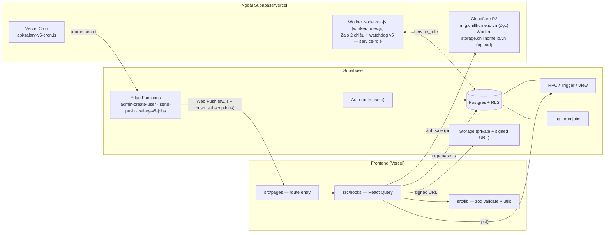
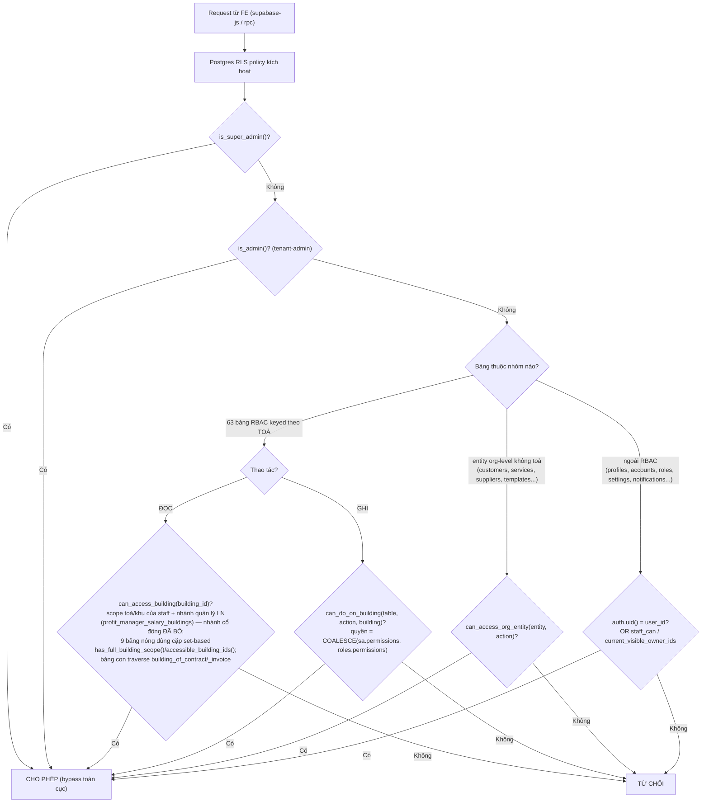
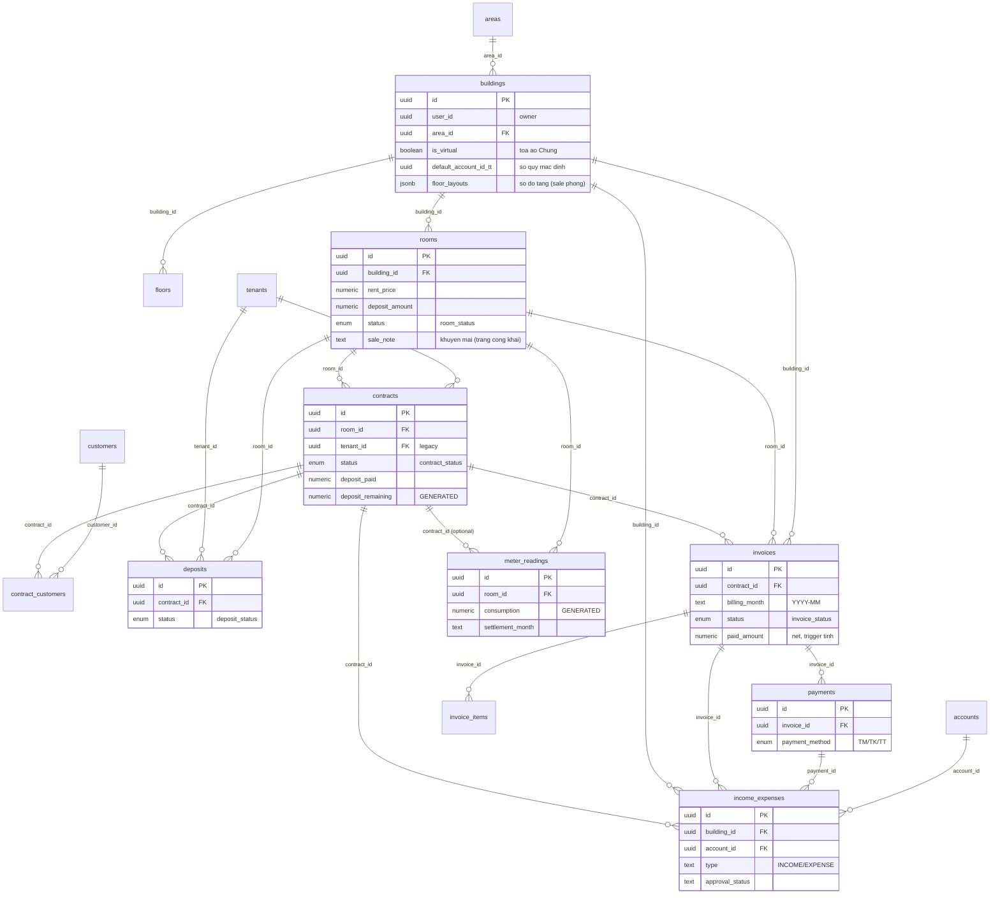
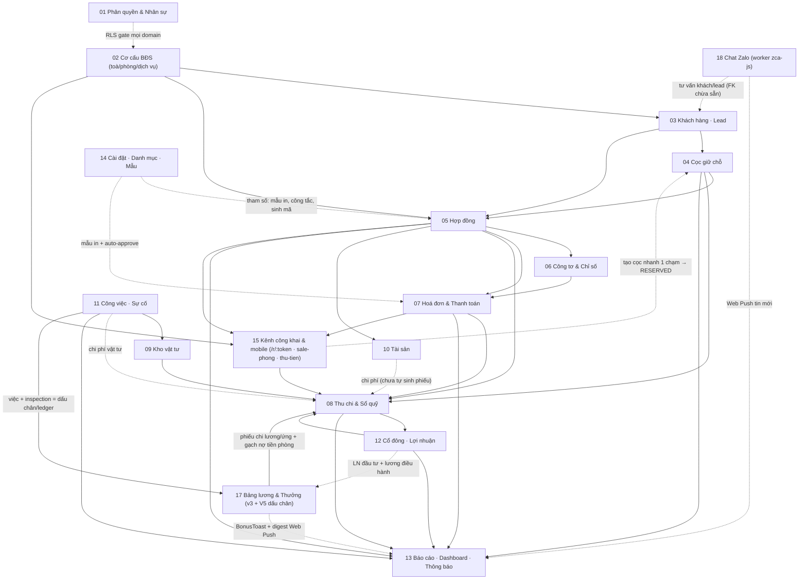

# Kiến trúc & Tổng quan hệ thống CRM BĐS

> Tài liệu nóc của bộ `docs/he-thong/`. Mô tả toàn cảnh hệ thống CRM quản lý bất động sản cho thuê (kiểu iHomeCRM): stack, 17 domain nghiệp vụ, mô hình multi-tenant + phân quyền RLS, sơ đồ quan hệ dữ liệu cốt lõi, phụ thuộc giữa các domain, bảng tra cứu enum trạng thái và các quy ước chung. Mỗi domain có file chi tiết riêng — xem cột "Tài liệu" trong [§2](#2-bản-đồ-17-domain). *(Cập nhật 2026-07-03.)*

---

## 1. Stack & kiến trúc tổng thể

**Frontend.** React + TypeScript + Vite, deploy thẳng lên Vercel từ nhánh `main` (production: <https://ptcrm.vercel.app>). UI dùng shadcn/ui + Tailwind. Form theo `react-hook-form` + `zod` (schema validate đặt ở `src/lib/*Validation.ts`). Data layer là React Query: mọi truy vấn/ghi đi qua hook trong `src/hooks/use*.ts`, gọi Supabase JS client. Trang đặt ở `src/pages/<domain>/`, UI theo domain ở `src/components/<domain>/`, util thuần + zod ở `src/lib/`.

**Code-split & cache mặc định** (e4bea2f, 2026-06-10): [App.tsx](src/App.tsx) `lazy()` toàn bộ ~75 page (giữ eager: auth, Dashboard, NotFound, guards) với một `<Suspense>` bọc quanh `<Routes>` — initial bundle 3.8MB → **~246kB gzip**. Thư viện nặng import động tại điểm gọi: `xlsx` (~430kB, mọi helper export/import Excel chuyển sang async), `docxtemplater`/`pizzip` (~187kB, engine mẫu HĐ), `recharts` (~340kB — 3 chart Dashboard lazy), `@zxing` (QR decoder); `vite.config.ts` dùng `manualChunks` function-form (react/supabase/query) — cố ý KHÔNG ép recharts vào vendor-chunk để khỏi bị preload ở mọi trang. `QueryClient` defaults: `staleTime: 60s`, `refetchOnWindowFocus: false`, `retry: 1` — hết "bão refetch" mỗi lần Alt-Tab (số request giảm 3–5 lần).

**Backend.** Supabase = Postgres + Auth + Storage + RLS + RPC. Không có server tự viết: logic nghiệp vụ nặng nằm trong Postgres dưới dạng:

- **RPC** (`SECURITY DEFINER` / `INVOKER`) — ví dụ `renew_contract`, `record_invoice_payment_v2`, `generate_invoices_for_building_v2`, `fa_monthly_pnl_accrual`. Pattern phổ biến: RPC public bọc một `*_impl` chứa logic gốc, lớp ngoài lo kiểm quyền (xem `project_contract_rpc_authz`). Một số ít RPC `SECURITY DEFINER` được GRANT cho `anon` phục vụ kênh công khai (`get_public_available_rooms` của trang `/r/:token`, tra cứu hoá đơn/HĐ theo mã public `/c/:code`) — tự lọc theo token/mã, role `anon` không có quyền trực tiếp trên bảng nào (xem [15-kenh-cong-khai-sale-thu-tien.md](15-kenh-cong-khai-sale-thu-tien.md)).
- **Trigger** — sinh mã, đồng bộ trạng thái phòng theo HĐ, recompute tồn vật tư/giá vốn, recompute `paid_amount` hoá đơn, recompute `deposit_paid`, gắn audit user_id…
- **View** — `accounts_with_balance`, `meter_readings_detailed`, `meters_with_latest_reading`… (một số view bỏ qua RLS để tính số dư — xem `project_ie_fund_owner_visibility`).
- **Edge Function** — `admin-create-user` (tạo user cho cổ đông/nhân viên), `send-push` (gửi Web Push, đọc `push_subscriptions` bằng service role), `salary-v5-jobs` (transport job hệ lương v5 — logic job nằm trong DB `v5_run_job`, idempotent qua `cron_runs`).

Migrations versioned theo timestamp ở `supabase/migrations/` (từ giữa 2026 team **apply SQL trực tiếp qua Management API** — `schema_migrations` trong DB không phản ánh đủ). Cron tác vụ định kỳ dùng `pg_cron` (vd `run_recurring_vouchers_job` sinh phiếu thu chi lặp); riêng hệ lương v5 **không dùng pg_cron** — **Vercel Cron** (`vercel.json crons` → [api/salary-v5-cron.js](../../api/salary-v5-cron.js), auth `x-cron-secret`) gọi edge fn `salary-v5-jobs`, worker Node giữ vai watchdog gọi bù khi lỡ giờ (xem [17 §4.10](17-luong-thuong.md)).

**Hạ tầng ngoài Supabase/Vercel** (2026-06/07):

- **Cloudflare R2** cho ảnh public của kênh Sale Phòng: FE đọc qua custom domain `img.chillhome.io.vn` (edge cache, egress $0), upload qua Worker `storage.chillhome.io.vn` (secret R2 chỉ ở Worker); lớp định tuyến [r2Config.ts](src/lib/r2Config.ts) theo bucket + nén WebP trước upload. Các bucket private còn lại vẫn ở Supabase Storage + signed URL (xem [15 §2.5](15-kenh-cong-khai-sale-thu-tien.md)).
- **Worker Node zca-js** ([worker/index.js](../../worker/index.js)) — tiến trình chạy **ngoài Vercel** (local/VPS, pm2) giữ **service-role key**: kết nối Zalo cá nhân cho `/chat-zalo` (poll `zalo_send_queue` để gửi, nghe WebSocket Zalo ghi `zalo_messages` → Realtime đẩy sang FE) + kiêm **watchdog cron v5**. Xem [18-zalo-chat.md](18-zalo-chat.md).
- **Web Push PWA**: service worker [public/sw.js](../../public/sw.js) + [push.ts](src/lib/push.ts) + bảng `push_subscriptions` + edge fn `send-push` (VAPID private trong Supabase secret) — thông báo đẩy tận status bar (tin Zalo mới, thưởng hoàn thành việc, digest tuyến v5). Xem [13 §4.5](13-bao-cao-dashboard-thong-bao.md).

**RLS (Row Level Security).** Mọi bảng nghiệp vụ bật RLS. Quyền không kiểm ở frontend mà ở từng policy DB, gọi xuống một bộ helper chung — bộ mặt hiện hành là **RBAC theo toà** (`is_super_admin`, `is_admin`, `can_access_building`, `can_do_on_building`, `can_access_org_entity`, `building_of_*`; từ đợt perf `20260702150000` policy SELECT các bảng nóng dùng cặp set-based `has_full_building_scope()`/`accessible_building_ids()` + ~170 policy wrap `(SELECT fn())` — xem [§3](#3-mô-hình-phân-quyền--multi-tenant)); `staff_can` / `current_visible_owner_ids` là lớp legacy chỉ còn hiệu lực trên vài bảng ngoài RBAC. Đây là hàng rào thật — frontend chỉ điều khiển hiển thị.

**Kiểm thử & chất lượng.** Vitest + fast-check (property-based) — `npx vitest run <path>`. Type check: `npx tsc --noEmit`. Quy trình mỗi thay đổi (xem [CLAUDE.md](../../CLAUDE.md)): type-check + test xanh → kiểm trực tiếp trên web bằng Playwright → seed/cleanup dữ liệu test qua Supabase Management API nếu cần → commit (stage file cụ thể) → push `origin/main`.

---

## 2. Bản đồ 17 domain

Mỗi domain là một file tài liệu chi tiết. Thứ tự gần đúng theo **vòng đời dữ liệu**: phân quyền → cơ cấu BĐS → khách/lead → cọc → hợp đồng → chỉ số → hoá đơn → thu chi → (vật tư/tài sản/công việc hỗ trợ) → cổ đông → báo cáo → cài đặt. Domain 15 là lớp **kênh công khai & mobile** (2026-06) xây bên trên các domain lõi, không có vòng đời dữ liệu riêng; 17 (**Bảng lương & Thưởng**) và 18 (**Chat Zalo**) là 2 domain mới 2026-06/07 — lớp trả công vận hành và lớp giao tiếp khách hàng. (File [16-thanh-ly-hop-dong.md](16-thanh-ly-hop-dong.md) là deep-dive dòng tiền thanh lý của domain 05, không phải domain riêng.)

| # | Domain | Mục đích | Bảng chính | Route chính | Tài liệu |
|---|--------|----------|------------|-------------|----------|
| 01 | Phân quyền & Nhân sự | Xác định caller (super admin / owner / staff / cổ đông) + quyền; lõi RLS mọi domain gọi xuống | `profiles`, `roles`, `user_roles`, `staff_assignments`, `super_admins` | `/admin/users`, `/settings/staff`, `/account/profile` | [01-phan-quyen-nhan-su.md](01-phan-quyen-nhan-su.md) |
| 02 | Cơ cấu BĐS | Khu vực (nhãn nhóm toà)→toà→tầng→phòng + danh mục dịch vụ/định mức; gốc neo `building_id`/`room_id` | `areas`, `buildings`, `floors`, `rooms`, `services`, `building_services`, `service_quotas` | `/buildings` (kèm dialog Quản lý khu vực; `/areas` redirect về đây), `/apartments`, `/services`, `/building-map` | [02-co-cau-toa-nha-phong-dich-vu.md](02-co-cau-toa-nha-phong-dich-vu.md) |
| 03 | Khách hàng · Lead · Hồ sơ | Phễu sale (lead) → người thuê → customer đứng tên HĐ; CT01 cư trú; phương tiện | `leads`, `customers`, `tenants`, `vehicles`, `ct01_declarations`, `contract_customers` | `/leads`, `/customers`, `/vehicles` | [03-khach-hang-lead-ho-so.md](03-khach-hang-lead-ho-so.md) |
| 04 | Cọc giữ chỗ & theo dõi cọc | Phiếu giữ chỗ trước HĐ; theo dõi đủ/thiếu cọc; chặn ký thiếu cọc; hoàn/bỏ cọc | `deposits`, `excess_amounts`, `contract_terminations`, `income_expenses` (is_deposit) | `/deposits` | [04-coc-giu-cho.md](04-coc-giu-cho.md) |
| 05 | Hợp đồng | Trụ cột nối phòng↔khách↔dịch vụ↔cọc; gia hạn/chuyển nhượng/thanh lý | `contracts`, `contract_customers`, `contract_services`, `contract_extensions`, `contract_transfers`, `contract_terminations` | `/contracts`, `/contracts/:id`, `/c/:code` | [05-hop-dong.md](05-hop-dong.md) |
| 06 | Công tơ & Chỉ số | Ghi chỉ số đồng hồ hằng tháng → consumption feed hoá đơn điện/nước | `meters`, `meter_readings` | `/meter-readings`, `/settings/meters` | [06-cong-to-chi-so.md](06-cong-to-chi-so.md) |
| 07 | Hoá đơn & Thanh toán | Phát hành HĐ theo kỳ + ghi nhận thu tiền; mỗi payment → 1 phiếu thu | `invoices`, `invoice_items`, `payments`, `excess_amounts` | `/invoices`, `/invoices/:id` | [07-hoa-don-thanh-toan.md](07-hoa-don-thanh-toan.md) |
| 08 | Thu chi & Sổ quỹ | Trung tâm dòng tiền: mọi tiền vào/ra đáp xuống phiếu gắn 1 sổ quỹ | `income_expenses`, `income_expense_items`, `income_expense_types`, `accounts` | `/income-expense`, `/finance/cashbooks` | [08-thu-chi-so-quy.md](08-thu-chi-so-quy.md) |
| 09 | Kho vật tư tiêu hao | Nhập/xuất/kiểm kê vật tư; xuất gắn job để quy chi phí về toà | `materials`, `material_purchases`, `material_usages`, `material_adjustments`, `suppliers` | `/materials` (4 tab) | [09-kho-vat-tu.md](09-kho-vat-tu.md) |
| 10 | Tài sản & Nội thất | Tài nguyên hỗ trợ; bàn giao gắn HĐ + dữ liệu chi phí | `assets`, `asset_categories`, `asset_movements`, `asset_maintenance`, `asset_handovers` | `/assets`, `/settings/categories/warehouses` | [10-tai-san.md](10-tai-san.md) |
| 11 | Công việc · Sự cố · Quy trình | Giao việc + ticket sự cố có workflow/SLA; xuất vật tư trừ kho | `jobs`, `issues`, `job_types`, `task_flows`, `task_phases`, `departments` | `/tasks`, `/settings/categories/task-types` | [11-cong-viec-su-co.md](11-cong-viec-su-co.md) |
| 12 | Cổ đông · Lợi nhuận · Ví cá nhân | Chốt-khoá LN tháng theo toà (nguồn `fa_monthly_pnl_accrual`) → trừ lương điều hành → phân bổ → sinh phiếu chi chia tiền cổ đông | `shareholders`, `building_shareholders`, `profit_monthly`, `profit_allocations`, `profit_managers` (+`_salaries/_salary_buildings/_allocations`), `personal_transactions` | `/reports/finance/profit-distribution` (ProfitHubPage — URL cũ `/finance/shareholder-profit` redirect), `/finance/personal-wallet` | [12-co-dong-loi-nhuan.md](12-co-dong-loi-nhuan.md) |
| 13 | Báo cáo · Dashboard · Thông báo | Đọc tổng hợp dựng KPI + 17 báo cáo (8 BĐS + 9 tài chính) + đẩy cảnh báo | `notifications`, `notification_templates`, `notification_logs` | `/` (Dashboard), `/notifications`, `/reports/*` | [13-bao-cao-dashboard-thong-bao.md](13-bao-cao-dashboard-thong-bao.md) |
| 14 | Cài đặt · Danh mục · Tài liệu mẫu | Tham số điều khiển: mẫu in, công tắc hành vi, engine sinh mã, gói cước | `settings`, `document_templates`, `signature_templates`, `code_sequences`, `subscription_plans` | `/settings/*`, `/account/subscription` | [14-cai-dat-danh-muc-tai-lieu.md](14-cai-dat-danh-muc-tai-lieu.md) |
| 15 | Kênh công khai & mobile | Trang Phòng trống công khai (anon, share token) + module quản trị Sale Phòng + trang thu tiền mặt mobile — "mặt tiền" trên domain 02/05/07/08 | `public_room_share_tokens`, `public_room_settings`, `public_room_events`, `room_pass_listings` (+ cột sale/public trên `rooms`/`buildings`: `sale_note`, `room_type`, `floor_layouts`…) | `/r/:token` (anon), `/sale-phong`, `/thu-tien` | [15-kenh-cong-khai-sale-thu-tien.md](15-kenh-cong-khai-sale-thu-tien.md) |
| 17 | Bảng lương & Thưởng | Lương quản lý tính từ dữ liệu vận hành thật (v3: ledger việc/HĐ/phiếu + chốt LOCK) + thưởng tức thời `award_job_bonus` + hệ **V5 "dấu chân"** ngày-công/chuỗi/coverage (đã deploy live, **flags OFF — shadow mode**) | `manager_salary_config`, `salary_monthly`, `salary_adjustments`, `salary_bonus_rules`, `salary_holidays`, `salary_work_ledger_snapshot`, `inspection_sessions` (+`_photos`), `salary_attendance_day`, `salary_streak_state`, `cron_runs` | `/finance/salary`, `/finance/my-salary`, `/my-day`, `/reports/coverage` | [17-luong-thuong.md](17-luong-thuong.md) |
| 18 | Chat Zalo | Nhắn tin Zalo cá nhân 2 chiều trong CRM (worker zca-js ngoài Vercel, service-role; FE chỉ nói chuyện với Supabase + Realtime); nhãn phân loại + broadcast + Web Push tin mới; RLS owner-scoped + guard `zalo_can` | `zalo_accounts`, `zalo_conversations`, `zalo_messages`, `zalo_send_queue`, `zalo_labels`, `zalo_message_templates`, `zalo_automations` | `/chat-zalo` | [18-zalo-chat.md](18-zalo-chat.md) |

---

## 3. Mô hình phân quyền & multi-tenant

Hệ thống **multi-tenant theo owner**: mỗi *owner* là một `user_id` (auth.users) sở hữu trọn dữ liệu của mình — nhưng từ đợt refactor RBAC 2026-05-27/28, **RLS bảng nghiệp vụ keyed theo TOÀ chứ không theo owner**: 63 bảng chỉ còn bộ policy `<t>_select/insert/update/delete_rbac` + `<t>_admin_all` + `<t>_super_admin_all` (batch F drop sạch policy owner cũ và `*_staff_*`). Bốn loại caller (+ khách anon):

- **Super admin** (`super_admins.user_id`) — bypass toàn cục, thấy mọi owner. Cổng: `is_super_admin()`.
- **Owner / tenant** — `user_id` sở hữu dữ liệu, nhưng trên 63 bảng RBAC cột này giờ chủ yếu là **audit** (trigger `set_user_id_from_auth` tự fill): policy owner `auth.uid() = user_id` đã bị **drop** (batch F). Owner gốc vẫn toàn quyền vì nằm trong `super_admins` + có self-assignment role Super Admin từ seed; user mới không có assignment → **không thấy gì** trên bảng RBAC (chủ ý). `auth.uid() = user_id` chỉ còn trên các bảng **ngoài RBAC** (profiles, accounts, roles, staff_assignments, settings, notifications…). `is_admin()` (tenant-admin: role `__superadmin` hoặc `name='Admin'`) là tầng bypass trong phạm vi một owner.
- **Staff (nhân viên)** — `staff_assignments` nối `staff_id ↔ owner ↔ building ↔ role`. Quyền là **2 tầng**: Tier 1 = `roles.permissions` (JSONB mẫu, 4 role hệ thống); Tier 2 = `staff_assignments.permissions` snapshot override per-staff — **enforce ngay ở DB** qua `COALESCE(sa.permissions, r.permissions)` trong `can_do_on_building`/`can_access_org_entity`. `building_id = NULL` nghĩa là full scope (tất cả toà của owner đó). Action keys trong JSONB: `view → create → edit → delete` (+ `record_payment`, `approve`, `print`, `export`, cờ phạm vi `all_buildings` của thu chi, `create_deposit` của sale_phong — cọc nhanh 1 chạm trên trang công khai, live từ 4b4f1cd).
- **Cổ đông / quản lý lợi nhuận** — từ 2026-07-02 (commit 3cd0d90, migration `20260701170000`): `get_my_permissions` trả **ĐÚNG 1 quyền** `{"shareholder_profit": {"view": true}}` — bộ ~20 module chỉ-xem + `personal_finance` của bản cũ đã **CẮT**; `can_access_building` **bỏ nhánh cổ đông** → cổ đông thuần không còn SELECT được bảng vận hành của toà góp vốn; tên toà trang chia LN lấy qua RPC `get_my_share_buildings` (SECURITY DEFINER). Nhánh ngoài-staff còn lại trong `can_access_building` là **quản lý lợi nhuận** (toà trong `profit_manager_salary_buildings`). Kiêm staff → merge thêm quyền staff. Map login qua `shareholders.auth_user_id` / `profit_managers.auth_user_id` (`current_shareholder_id()` / `current_profit_manager_id()`).
- **Khách anon (kênh công khai)** — không phải caller RLS thật: role `anon` không có policy trên bảng nào, chỉ EXECUTE vài RPC `SECURITY DEFINER` tự lọc theo token/mã (`get_public_available_rooms` cho `/r/:token`, tra cứu HĐ/hoá đơn theo mã public). Xem [15-kenh-cong-khai-sale-thu-tien.md](15-kenh-cong-khai-sale-thu-tien.md).

**Các helper RLS cốt lõi** (gọi xuyên suốt mọi domain — engine hiện hành ở trên, legacy ở dưới):

| Helper | Vai trò |
|--------|---------|
| `is_super_admin()` / `is_admin()` | 2 tầng bypass (toàn cục / trong-owner) |
| `can_access_building(building_id)` | Đọc theo toà: staff pass nếu có assignment full-scope (`building_id IS NULL`), đúng toà, hoặc toà theo **khu live** (`staff_assignments.area_id`); nhánh ngoài-staff duy nhất là **quản lý LN** (`profit_manager_salary_buildings`) — nhánh cổ đông đã **BỎ** (3cd0d90, 2026-07-02) |
| `has_full_building_scope()` / `accessible_building_ids()` | **Cặp helper set-based** (đợt perf initplan `20260702150000`, 86c01a5): mirror đúng các nhánh `can_access_building`; policy SELECT của 9 bảng nóng viết `(SELECT has_full_building_scope()) OR <cột> IN (SELECT accessible_building_ids())` thay vì gọi hàm per-row; ~170 policy admin/super_admin wrap `(SELECT fn())` thành InitPlan. ✅ **Quy ước tái dùng cho mọi policy/RPC mới** |
| `can_do_on_building(table, action, building_id)` | Ghi theo toà — đọc quyền `COALESCE(staff_assignments.permissions, roles.permissions)` (Tier-2 aware) |
| `same_team(uid)` | Đội ngũ (`teams`/`team_members`): đồng đội thấy profile nhau (policy `profiles_select_same_team`) + guard người nhận khi bàn giao tiền mặt (`create_cash_handover`) |
| `can_access_org_entity(entity, action)` | Entity org-level **không scope toà** (customers, tenants, services, suppliers, vật tư, templates…) |
| `building_of_contract / _invoice / _payment(id)` | Traversal: trả `building_id` qua chain FK cho bảng con (contract_*, deposits, invoice_items, payments…) |
| `staff_can(table, action, owner)` | **Legacy** — sau batch F chỉ còn trên `accounts` (perm key `cashbooks`), `settings`, `notifications`; chỉ đọc `roles.permissions`, KHÔNG Tier 2 (lỗ hổng đã ghi nhận, xem doc 01 §4.4) |
| `current_visible_owner_ids()` | **Residual** — còn sống trên bảng ngoài RBAC + `invoice_audit_log` + storage policy `document-templates`. `is_staff_of` / `staff_in_building` / `customer_in_my_scope` đã **mồ côi** (không policy nào tham chiếu; mirror FE = `useMyBuildingScope`) |
| `get_my_context()` / `get_my_permissions()` / `get_my_assignments()` | FE bootstrap: ai là tôi + quyền + phân công |

Chi tiết đầy đủ ở [01-phan-quyen-nhan-su.md](01-phan-quyen-nhan-su.md) (mục 4.3–4.5).

### Luồng kiểm quyền 1 request (đọc/ghi một bản ghi)

> Lưu ý: `can_do_on_building`/`can_access_org_entity` đọc quyền theo `COALESCE(staff_assignments.permissions, roles.permissions)` — Tier 2 override Tier 1 ngay ở DB. User thường không có assignment (và không trong `super_admins`) bị bảng RBAC chặn hoàn toàn dù `get_my_permissions` trả sentinel `__superadmin` — "FE mở mà DB đóng". Một số **view tính số dư** (vd `accounts_with_balance`) cố ý bỏ qua RLS để chủ sổ thấy đủ số dư xuyên toà, trong khi **bảng chi tiết** vẫn lọc theo RLS → số dư và danh sách giao dịch có thể lệch quyền (đây là chủ ý, xem `project_ie_fund_owner_visibility`).

---

## 4. Sơ đồ quan hệ dữ liệu CỐT LÕI (spine)

Chỉ vẽ **xương sống** dòng giao dịch. ~100 bảng còn lại (trong tổng **~117 bảng** — 110 đếm từ khối `Tables` của `src/integrations/supabase/types.ts` regen từ live DB 2026-06-29, cộng các bảng áp thẳng qua Management API sau đó: `cashbook_reconciliations` + 6 bảng lương v5; kèm 6 view, ~130 RPC/function) được gom nhóm và chú thích bên dưới — KHÔNG vẽ hết vào một sơ đồ.

**Chú thích các nhóm bảng ngoài spine** (gắn vào spine qua FK đã nêu trong từng domain):

- **Phân quyền & đội ngũ** (`profiles`, `roles`, `user_roles`, `staff_assignments`, `super_admins`, `departments`, `teams`, `team_members`, `area_buildings`) — gắn vào mọi `user_id` và `building_id`.
- **Danh mục BĐS** (`services`, `building_services`, `service_quotas`, `service_quota_tiers`, `code_sequences`) — cấp giá/định mức cho `invoice_items`.
- **HĐ mở rộng** (`contract_services`, `contract_extensions`, `contract_transfers`, `contract_terminations`, `contract_tenants`, `asset_handovers`) — quanh `contracts`.
- **Cọc & credit** (`excess_amounts`) — gắn `contract_id` / `source_invoice_id` / `source_payment_id`.
- **Thu chi mở rộng** (`income_expense_items`, `income_expense_types`, `income_expense_templates`, `income_expense_batches`, `account_shared_users`, `auto_debt_config`, `cash_handovers` — bàn giao tiền mặt, `cashbook_reconciliations` — đối soát/chốt số sổ) — quanh `income_expenses`/`accounts`.
- **Công tơ** (`meters`) — cha của `meter_readings`.
- **Vật tư** (`materials`, `material_*`, `suppliers`) & **Tài sản** (`assets`, `asset_*`) — nhánh chi phí, gắn `building_id`/`room_id`/`job_id`/`contract_id`.
- **Vận hành** (`jobs`, `issues`, `task_flows`, `task_phases`, `job_types`, `sla_configs`) — gắn `building_id`/`room_id`/`contract_id`/`profiles`.
- **Cổ đông & lương điều hành** (`shareholders`, `building_shareholders`, `profit_monthly`, `profit_allocations`, `profit_managers`, `profit_manager_salaries/_salary_buildings/_allocations`, `personal_transactions`) — đọc từ `income_expenses`, ghi phiếu chia LN/lương điều hành vào `income_expenses`.
- **Bảng lương & thưởng** (`manager_salary_config`, `salary_monthly`, `salary_adjustments`, `salary_bonus_rules`, `salary_holidays`, `salary_work_ledger_snapshot` + bộ v5: `inspection_sessions/photos`, `salary_attendance_day`, `salary_streak_state`, `cron_runs`, `salary_award_errors`) — đọc `jobs`/`contracts`/`income_expenses` làm bằng chứng, tiền chỉ vật chất hoá khi LOCK ([17](17-luong-thuong.md)).
- **Chat Zalo** (`zalo_accounts/conversations/messages/send_queue/labels/message_templates/automations`) — owner-scoped, worker ngoài Vercel ghi bằng service-role; FK sang `customers`/`leads`/`contracts` chừa sẵn chưa ghi ([18](18-zalo-chat.md)).
- **Báo cáo & thông báo** (`notifications`, `notification_*`, `push_subscriptions` — Web Push) — chỉ đọc tổng hợp + deep-link.
- **Kênh công khai** (`public_room_share_tokens`, `public_room_settings`) — token chia sẻ + cấu hình trang Phòng trống `/r/:token`; không FK vào spine, RPC `get_public_available_rooms` (SECURITY DEFINER, grant `anon`) đọc xuyên `buildings/rooms/areas/hotlines/contracts/building_services` theo `owner_id` của token.
- **Cấu hình** (`settings`, `document_templates`, `signature_templates`, `subscription_plans`, `hotlines`, `ai_*`) — tham số điều khiển.

---

## 5. Sơ đồ phụ thuộc domain-level

17 domain là node; mũi tên = phụ thuộc dữ liệu chính (dựa crossLinks + FK). `A --> B` đọc là "A feed/ghi vào B" theo chiều dòng giao dịch.

Đọc nhanh: **02→03→04→05** là phễu mở (toà/phòng → khách/lead → cọc → HĐ). Từ HĐ tỏa ra **06 (chỉ số)** và **07 (hoá đơn)**; hoá đơn + cọc + HĐ + vật tư đều đáp xuống **08 (thu chi)** — trung tâm dòng tiền. **08** feed **12 (cổ đông)** và **13 (báo cáo)**; **12** lại ghi ngược phiếu chia LN vào **08**. **01** và **14** là 2 lớp ngang (gate quyền + tham số) phủ lên toàn bộ. **15** là lớp mặt tiền: đọc 02/05 (phòng trống public — `status_public` suy từ HĐ ACTIVE) và 07 (lưới thu tiền theo hoá đơn), ghi ngược `payments` + phiếu thu TM vào 08; flow tạo cọc nhanh (live từ 4b4f1cd) ghi phiếu cọc `is_deposit` → phòng tự `RESERVED` (04). **17** ăn dữ liệu vận hành (việc/inspection của 11, phiếu của 08, phân bổ LN của 12) và ghi ngược phiếu chi lương vào 08; **18** chạy song song phục vụ giao tiếp khách (Web Push qua hạ tầng 13, FK khách/lead chừa sẵn sang 03).

---

## 6. Bảng tra cứu Enum trạng thái

30 enum DB (khối `Enums` trong `src/integrations/supabase/types.ts` — regen từ live DB 2026-06-07). Bảng dưới gom các enum trạng thái + một số enum phân loại hay tra. Một số "trạng thái" thực ra là `text + CHECK` chứ không phải enum Postgres — đánh dấu rõ ở cột ý nghĩa.

| Enum | Giá trị | Ý nghĩa / đặt ở đâu |
|------|---------|---------------------|
| `building_status` | ACTIVE, INACTIVE, MAINTENANCE | Trạng thái toà (`buildings.status`); UI form chỉ ACTIVE↔INACTIVE |
| `building_type` | APARTMENT, DORMITORY, HOUSE, OFFICE, SLEEPBOX, HOMESTAY | Loại hình toà (`buildings.type`) |
| `room_status` | AVAILABLE, OCCUPIED, RESERVED, MAINTENANCE, UNAVAILABLE | Trạng thái phòng (`rooms.status`); trigger HĐ tự set AVAILABLE↔OCCUPIED; `recompute_room_reservation` tự set AVAILABLE↔RESERVED theo cọc giữ chỗ chưa gắn HĐ (kể cả phiếu **chưa duyệt**) |
| `contract_status` | DRAFT, ACTIVE, **EXTENDED (ngưng dùng)**, TRANSFERRED, TERMINATED, EXPIRED | Vòng đời HĐ (`contracts.status`). ⚠️ **EXTENDED còn trong enum nhưng NGƯNG GHI từ 2026-06-06** (migration `20260606140000`): HĐ gia hạn **giữ nguyên ACTIVE**; `isContractInEffect()` = ACTIVE-only; "đã gia hạn" suy từ bảng `contract_extensions` (`useRenewedContracts` + `RenewedBadge`). Trigger phòng / RPC cũ còn đọc `IN ('ACTIVE','EXTENDED')` chỉ là **lớp tương thích** với dữ liệu cũ — xem [05](05-hop-dong.md) |
| `payment_cycle` | MONTHLY, QUARTERLY, SEMI_ANNUAL, ANNUAL | Kỳ thanh toán HĐ (`contracts.payment_cycle`) |
| `lead_status` | B1_LEAD, B2_APPOINTMENT, B3_CONSULTATION, CONVERTED, FAILED | Phễu sale (`leads.status`) |
| `lead_source` | FACEBOOK, ZALO, PHONE, REFERRAL, WALK_IN, WEBSITE, OTHER | Nguồn lead (`leads.source`) |
| `customer_status` | PROSPECT, ACTIVE, INACTIVE, BLACKLIST | Trạng thái khách (model cũ) |
| `customer_status_v2` | RENTING, MOVED_OUT, WALK_IN | Trạng thái khách (đang dùng) |
| `customer_type` | INDIVIDUAL, ORGANIZATION | Cá nhân / tổ chức (`customers.customer_type`) |
| `tenant_status` | PROSPECT, DEPOSITED, ACTIVE, INACTIVE, BLACKLIST | Trạng thái người thuê legacy |
| `id_type` | CCCD, CMND, PASSPORT, OTHER | Loại giấy tờ tuỳ thân |
| `vehicle_type` | MOTORBIKE, CAR, BICYCLE, OTHER, ELECTRIC_BIKE | Loại phương tiện (`vehicles.type`) |
| `deposit_status` | PENDING, CONFIRMED, CONVERTED, REFUNDED, FORFEITED | Trạng thái phiếu giữ chỗ (`deposits.status`). **KHÔNG phải nguồn sự thật** — RPC thanh lý không cập nhật; cọc thực nộp lấy từ IE `is_deposit` |
| `invoice_status` | DRAFT, PENDING_APPROVAL, APPROVED, PAID, PARTIAL_PAID, OVERDUE, CANCELLED | Trạng thái hoá đơn (`invoices.status`). FE tạo thẳng APPROVED; PAID/PARTIAL/OVERDUE do trigger suy ra; CANCELLED có thể restore→APPROVED |
| `invoice_item_type` | RENT, SERVICE, PENALTY, DISCOUNT, OTHER | Loại khoản trong hoá đơn (`invoice_items.type`) |
| `payment_method` | TM, TK, TT, **CT** | Hình thức thu/chi (`payments`, `income_expenses`). **Giữ nguyên mã**, không dịch, không icon. `CT` (Cấn trừ — `20260619000001`) = **gạch nợ, KHÔNG phải tiền mặt** (dashboard tách thẻ riêng `payment_ct`), **không cho chọn tay** — chỉ sinh tự động bởi: trigger duyệt bỏ-cọc `trg_forfeit_settle_on_approve` ([16 §2.3](16-thanh-ly-hop-dong.md)) và gạch nợ tiền phòng khi trả lương quản lý ([17 §4.4](17-luong-thuong.md)); bản move-out hiện hành (`20260627000001`) đã **quay về `TM`** "Quyết toán khi thanh lý" |
| `meter_type` | ELECTRICITY, WATER, GAS, OTHER | Loại công tơ (`meters`/`meter_readings`); UI dùng 3 đầu |
| `fee_type` | TIEN_PHI_DICH_VU, TIEN_DIEN, TIEN_NUOC, TIEN_PHI_KHAC, TIEN_VE_SINH | Loại phí dịch vụ (`services.fee_type`) |
| `pricing_type` | DON_GIA_CO_DINH_THANG, DON_GIA_CO_DINH_DONG_HO, DON_GIA_BIEN_DONG, DON_GIA_THEO_NGUOI, DON_GIA_THEO_PHONG | Cách tính giá dịch vụ; DONG_HO = tính theo chỉ số công tơ |
| `service_type` | FIXED, PER_PERSON, PER_ROOM, METER_READING | Model dịch vụ cũ |
| `expense_category` | MAINTENANCE, REPAIR, UTILITIES, SALARY, SUPPLIES, OTHER | Phân loại chi phí (bảng `expenses` legacy) |
| `asset_condition` | NEW, GOOD, FAIR, POOR, BROKEN | Chất lượng vật lý tài sản — KHÔNG phải trạng thái thuê |
| `issue_status` | NEW, ASSIGNED, IN_PROGRESS, RESOLVED, CLOSED, CANCELLED | Trạng thái sự cố (`issues.status`) |
| `issue_priority` | LOW, MEDIUM, HIGH, URGENT | Mức ưu tiên sự cố + `job_types.default_priority` |
| `notification_status` | PENDING, SENT, FAILED, CANCELLED, READ | PENDING=chưa đọc / READ=đã đọc (IN_APP). SENT/FAILED/CANCELLED dành kênh ngoài |
| `notification_type` | NEW_INVOICE, PAYMENT_REMINDER, OVERDUE_INVOICE, CONTRACT_EXPIRING, ISSUE_RESOLVED, GENERAL_ANNOUNCEMENT, CUSTOM, DEPOSIT_SHORTFALL | Loại thông báo. Thực tế chỉ PAYMENT_REMINDER / OVERDUE_INVOICE / CONTRACT_EXPIRING / DEPOSIT_SHORTFALL được sinh (scheduler client-side); 4 loại còn lại không có nơi sinh — xem [13](13-bao-cao-dashboard-thong-bao.md) |
| `notification_channel` | IN_APP, EMAIL, SMS, ZALO, PUSH | Kênh gửi; thực tế chỉ IN_APP dùng |
| `template_category` | CONTRACT_NEW, CONTRACT_TERMINATION, CONTRACT_EXTENSION, CONTRACT_TRANSFER, INVOICE, RECEIPT, HANDOVER | Phân loại mẫu in (`document_templates.category`) |
| `ai_message_role` | user, assistant, system | Subsystem AI RAG (`ai_messages.role`) |

**Trạng thái dạng `text + CHECK` (không phải enum DB) — hay nhầm:**

| "Enum" | Giá trị | Đặt ở đâu |
|--------|---------|-----------|
| `income_expenses.approval_status` | APPROVED, UNAPPROVED, CANCELLED | Mặc định tạo = APPROVED; chỉ APPROVED + `deleted_at IS NULL` mới vào số dư/báo cáo |
| `income_expenses.type` | INCOME, EXPENSE | Thu / chi |
| `income_expense_types.type` | income, expense (chữ thường) | Loại thu chi per-user |
| `repeat_cycle` | NONE, WEEK, MONTH, QUARTER, YEAR | Chu kỳ phiếu lặp |
| `meter_readings.status` | UNAPPROVED, APPROVED | FE tạo thẳng APPROVED |
| `jobs.status` | IN_PROGRESS, COMPLETED | 2 trạng thái (đã bỏ NOT_STARTED/PENDING…) |
| `jobs.priority` | NORMAL, LOW, URGENT | Khác `issue_priority` |
| `deposit_debt_mode` | DEBT, FIRST_INVOICE, NULL | Chế độ nợ cọc (`contracts`) |
| `contract_terminations.status` | DRAFT, PENDING_APPROVAL, APPROVED, COMPLETED | Legacy flow; RPC tức thì ghi thẳng COMPLETED |
| `contract_extensions.extension_type` | UPDATE_EXISTING, CREATE_NEW | CHECK chỉ 2 giá trị (hook legacy `useExtendContract` từng ghi `'SIMPLE'` vi phạm CHECK — đã xoá 2026-06-10, xem [05 §2.5](05-hop-dong.md)) |
| `termination_type` | NORMAL, FORFEIT, EARLY_*, BREACH | Loại thanh lý (FORFEIT = bỏ cọc) |
| `profit_monthly.status` | DRAFT, LOCKED | Chốt-khoá LN tháng (mở khoá quay lại DRAFT) |
| `material_adjustments.type` | IN, OUT | Kiểm kê cộng/trừ tồn |
| `asset_handovers.type` | CHECK_IN, CHECK_OUT | Bàn giao nhận/trả phòng |
| `signature_type` | UPLOAD, DRAW, TEXT | Loại chữ ký |
| `code_sequences.reset_period` | DAILY, MONTHLY, YEARLY, NEVER | Chu kỳ reset bộ đếm mã |
| `user_subscriptions.status` | active, expired, cancelled | Trạng thái gói cước |
| `status_public` (không lưu DB) | free, soon, rented | Trạng thái phòng trên trang công khai `/r/:token` — RPC `get_public_available_rooms` tính tại chỗ từ HĐ ACTIVE + `soon_days`; phòng RESERVED (đã cọc) hiện như rented (xem [15 §4.2](15-kenh-cong-khai-sale-thu-tien.md)) |

---

## 7. Quy ước chung

**Mã tự sinh (code_sequences).** Bảng `code_sequences` per-user + per-object-type (9 object_type seed sẵn) + 2 RPC `generate_code` / `generate_next_code` là engine sinh mã *theo thiết kế* — nhưng hiện là **engine mồ côi**: không FE/trigger nào gọi, `current_sequence` không nhúc nhích (xem [14 §4.5](14-cai-dat-danh-muc-tai-lieu.md)). Mã thực tế do từng domain tự sinh bằng trigger/helper chuyên biệt (vd `PT/PC{YYMM}{seq}` phiếu thu chi, `JOB-YYYYMMDD-NNNN`, `MP/MU/MA-YYYYMMDD-NNNN`, `CSS{YYMM}{seq}` cho chỉ số, `DCxxxxxx` cho cọc, retry client-side cho mã mẫu in) — thường kèm advisory lock để chống trùng.

**payment_method TM / TK / TT / CT.** Giữ nguyên mã (TM = tiền mặt, TK = tài khoản, TT = thanh toán) ở `payments` và `income_expenses`. **Không dịch** sang "Tiền mặt/Chuyển khoản", **không** đặt icon cạnh badge (xem `feedback_payment_method_codes`). Loại thứ 4 `CT` (Cấn trừ) chỉ do hệ thống tự sinh (gạch nợ — xem chú thích enum ở §6), người dùng không chọn được.

**Soft-delete (`deleted_at`).** Hầu hết bảng nghiệp vụ có cột `deleted_at timestamptz`; xoá là set timestamp, không DELETE vật lý. Mọi query/trigger/aggregate lọc `deleted_at IS NULL` (vd `update_building_total_rooms` chỉ đếm phòng chưa xoá; số dư/báo cáo chỉ tính phiếu APPROVED + chưa xoá). RPC `soft_delete_customer` là ví dụ điển hình (set `deleted_at`, kiểm `user_id = auth.uid()` OR `is_super_admin()` — bản `20260514000005`).

**Storage bucket private + signed URL.** 7 bucket ảnh nhạy cảm đã chuyển **private** ở `20260601000200` (`customer-id-cards`, `customer-images`, `payment-receipts`, `income-expense-attachments`, `meter-images`, `job-attachments`, `ui-references`; `document-templates` private từ trước). Hiển thị ảnh phải qua `StorageImage`/`useSignedUrl` (signed URL ngắn hạn), **không** dùng `` (xem `project_storage_private_signed_urls`). **Ngoại lệ chủ ý**: bucket `room-sale-images` (ảnh sale của trang công khai `/r/:token`) là **PUBLIC** vì phục vụ khách `anon` (xem [15 §2.5](15-kenh-cong-khai-sale-thu-tien.md)); `avatars` cũng không nằm trong nhóm private.

**Cọc giữ chỗ tự khoá phòng (`RESERVED`).** Nguồn sự thật số cọc = tổng phiếu thu chi `is_deposit` (đáp xuống cột suy `contracts.deposit_remaining`); hoàn/bỏ cọc đọc từ `contract_terminations`, **không** dùng `deposits.status`. Hàm `recompute_room_reservation` (trigger trên `deposits` / `income_expenses` / `income_expense_items` / `rooms`, migration `20260608000000`) tự chuyển `rooms.status` AVAILABLE↔RESERVED khi phòng có cọc chưa gắn HĐ — **kể cả phiếu chưa duyệt** (chỉ loại CANCELLED/đã xoá) → phòng ẩn khỏi danh sách trống nội bộ lẫn trang công khai (xem [04 §4.11](04-coc-giu-cho.md)).

**Kỳ tháng dạng `YYYY-MM`.** Hoá đơn (`billing_month`), chỉ số (`settlement_month`), chốt LN (`profit_monthly`) đều dùng chuỗi `YYYY-MM` làm khoá chốt tháng — tiện so sánh/nhóm mà không lệ thuộc timezone.

**Khu vực = nhãn nhóm toà (bộ lọc), không phải đơn vị quyền.** Từ 2026-06-10 (commit 099102f + 9ad626d): `areas` chỉ còn là nhãn gom toà nhà — không status, không trang riêng (`/areas` redirect `/buildings`, quản lý qua dialog), không tham gia RLS (RLS 100% theo `building_id`; quan hệ toà↔khu là N-N qua `area_buildings`, cột `buildings.area_id` đã DROP). **Ô LỌC toà toàn app = `BuildingFilterSelect` phẳng ĐƠN-CHỌN** ([src/components/buildings/BuildingFilterSelect.tsx](src/components/buildings/BuildingFilterSelect.tsx), 3c3b7fa — 1 toà hoặc tất cả, danh sách phẳng A→Z, không nhóm khu; state giữ shape mảng 0/1 phần tử, `[] = tất cả`); **`BuildingMultiSelect`** (+ [buildingGroups.ts](src/lib/buildingGroups.ts), chọn nhiều toà theo khu) **chỉ còn** cho màn scope/cấu hình: gán phạm vi staff (StaffPage), ProfitManagerForm, ManageAreasDialog. Filter hook vẫn nhận `building_ids: string[]` (RPC `get_invoice_statistics_v2` nhận `p_building_ids uuid[]`; `area_id` deprecated). Gán phạm vi staff theo khu là **scope LIVE** (`staff_assignments.area_id` — xem [01 §5.2](01-phan-quyen-nhan-su.md)).

**Bộ lọc giữ qua F5 (`usePersistedState`).** Từ 7fd2d3f (2026-07-02): state ô lọc/tìm kiếm của mọi trang lưu sessionStorage qua hook [usePersistedState](src/hooks/usePersistedState.ts), key quy ước `flt:<trang>:<state>`; URL param **thắng** giá trị khôi phục (vd `?building_id=` ở RoomsPage); không persist dialog/selection/pagination. Trang mới có filter phải theo quy ước này.

**Tòa ảo `is_virtual` ("Chung").** Mỗi owner có thể có toà ảo (`buildings.is_virtual = true`, tên "Chung") để hạch toán chi phí dùng chung không thuộc toà thật nào (vd phiếu chia LN cổ đông ghi vào toà ảo này). RPC tính LN/báo cáo theo toà thật loại trừ toà ảo khi cần.

**Hạch toán KQKD item-level (`kqkd_amount`).** Từ 2026-07-02 (migration `20260702120000` — áp live, loạt FE working-tree chưa commit): báo cáo P&L/`fa_*` cộng **`SUM(income_expenses.kqkd_amount)`** — cột do trigger tính ở mức **hạng mục**: `business_result_accounting` TRUE → `total_amount`, FALSE → 0, NULL (auto) → `total_amount − Σ(items is_deposit)`. Nhờ đó **1 lần thu = 1 phiếu trộn** doanh thu + cọc vẫn hạch toán đúng (phần cọc tự loại — xử tận gốc lớp bug "cọc rò vào doanh thu"). Cờ nhị phân cũ `counts_in_business_result` (= `COALESCE(business_result_accounting, NOT has_deposit)`) vẫn tồn tại cho filter/badge. Phiếu chia LN cổ đông / lương điều hành / lương quản lý đặt `business_result_accounting = false` → `kqkd_amount = 0`, ngoài P&L.

**RPC bọc wrapper kiểm quyền.** RPC nghiệp vụ HĐ (renew/transfer/terminate_*) có guard quyền ở lớp ngoài, logic gốc nằm trong `*_impl`; RPC mới đụng HĐ phải tự kiểm quyền + revoke quyền `anon` (xem `project_contract_rpc_authz`).

---

*Để xem chi tiết từng domain (quy trình page từng bước, hook → RPC → trigger → side-effect, edge case + zod validate), mở file tương ứng ở cột "Tài liệu" trong [§2](#2-bản-đồ-17-domain).*
