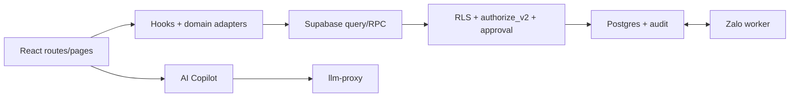

# Tổng quan hệ thống ptcrm

> **Reviewed:** 2026-07-20

ptcrm là ứng dụng React/Vite quản lý vòng đời cho thuê BĐS, dùng Supabase Postgres/Auth/Storage/Realtime/Edge Functions. Vercel phục vụ web/API; Zalo worker chạy ngoài Vercel; R2 lưu ảnh public được định tuyến qua [r2Config.ts](../../src/lib/storage/r2Config.ts).

## Kiến trúc

Backend là nơi quyết định quyền và trạng thái tiền. Frontend gate chỉ hỗ trợ UX.

## Bản đồ domain

| # | Domain | Route/điểm vào tiêu biểu |
|---:|---|---|
| 01 | Tổ chức, nhân sự, RBAC/RLS | `/settings/staff`, `/admin/users` |
| 02 | Khu vực, tòa, tầng, phòng, dịch vụ | `/buildings`, `/apartments` |
| 03–05 | Lead/khách, cọc, hợp đồng | `/customers`, `/deposits`, `/contracts` |
| 06–08 | Chỉ số, hóa đơn/thanh toán, thu chi/sổ quỹ | `/meter-readings`, `/invoices`, `/thu-tien`, `/income-expense` |
| 09–11 | Kho, tài sản, công việc/sự cố | `/materials`, `/assets`, `/tasks` |
| 12–14 | Lợi nhuận, báo cáo/thông báo, cài đặt | `/reports/**`, `/notifications`, `/settings/**` |
| 15–18 | Sale/public, thanh lý, lương, Zalo | public room/invoice routes, `/finance/salary`, `/chat-zalo` |
| 19 | SOP tiền và sổ quỹ | quy trình kiểm soát |
| 20 | Approval tài chính | `/approvals` |
| 21 | AI Copilot | launcher, `/settings/ai-copilot` |

## Trạng thái platform

- Authorization organization-model đang production; 15/15 canonical writer flags ON.
- Approval inbox live; phiếu đặc biệt/chi vượt ngưỡng đi qua maker-checker.
- Hub báo cáo tài chính hiện có 9 báo cáo. Các route debt cũ chuyển về `/thu-tien`.
- Profit Close V2 chốt lợi nhuận server-side bằng preview/source hash/revision; snapshot cũ được đánh dấu stale thay vì âm thầm ghi đè.
- AI Copilot có chat, tool đọc, UI-control có gate và write tool draft-first; write tool hiện chưa là một transaction DB duy nhất.
- Zalo chat dùng worker `zca-js`; web gửi text/reply, còn media hiện là chiều nhận/render. Xem [18](18-zalo-chat.md) và [runbook Zalo](../zalo/README.md).

## Nguồn sự thật

- Route: [src/App.tsx](../../src/App.tsx)
- Generated schema: [types.ts](../../src/integrations/supabase/types.ts)
- Migration: [supabase/migrations](../../supabase/migrations/)
- Quyền: [permissionPages.ts](../../src/lib/permissionPages.ts)
