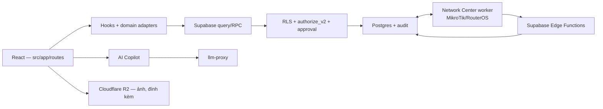

# Tổng quan hệ thống ptcrm

> **Reviewed:** 2026-07-20

ptcrm là ứng dụng React/Vite quản lý vòng đời cho thuê BĐS, dùng Supabase Postgres/Auth/Realtime/Edge Functions. Vercel phục vụ web/API. **Ảnh và tệp đính kèm nằm ở Cloudflare R2**, định tuyến qua [r2Config.ts](../../src/lib/storage/r2Config.ts) — Supabase Storage không còn là nơi lưu chính. Một hệ con chạy hạ tầng riêng ngoài Vercel: **Network Center** (worker quản trị router). (Hệ con thứ hai — OpenClaw Zalo — đã xóa toàn bộ 30/08/2026.)

## Kiến trúc

Bảy khối, và ranh giới quan trọng nhất không nằm ở hình: **backend quyết định quyền và trạng thái
tiền; frontend gate chỉ hỗ trợ UX.** Một màn hình ẩn nút không phải là một quyền bị chặn.

Network Center **không** gọi thẳng Postgres từ hạ tầng riêng của nó — nó đi qua
Edge Functions, nơi có xác thực workload và ranh giới tổ chức. Đó là lý do mũi tên đi qua `EF`
chứ không nối thẳng vào `DB`.

## Bản đồ domain

| # | Domain | Route/điểm vào tiêu biểu |
|---:|---|---|
| 01 | Tổ chức, nhân sự, RBAC/RLS | `/settings/staff`, `/admin/users` |
| 02 | Khu vực, tòa, tầng, phòng, dịch vụ | `/buildings`, `/apartments` |
| 03–05 | Lead/khách, cọc, hợp đồng | `/customers`, `/deposits`, `/contracts` |
| 06–08 | Chỉ số, hóa đơn/thanh toán, thu chi/sổ quỹ | `/meter-readings`, `/invoices`, `/thu-tien`, `/income-expense` |
| 09–11 | Kho, tài sản, công việc/sự cố | `/materials`, `/assets`, `/tasks` |
| 12–14 | Lợi nhuận, báo cáo/thông báo, cài đặt | `/reports/**`, `/notifications`, `/settings/**` |
| 15–18 | Sale/public, thanh lý, lương, Zalo | public room/invoice routes, `/finance/salary`, `/chat-zalo` |
| 19 | SOP tiền và sổ quỹ | quy trình kiểm soát |
| 20 | Approval tài chính | `/approvals` |
| 21 | AI Copilot | launcher, `/settings/ai-copilot` |
| [22](22-network-center.md) | Trung tâm mạng — fleet router MikroTik/RouterOS nhiều toà | `/network-center` |
| [24](24-platform-delivery.md) | Phát hành nền tảng — deploy, cron, môi trường | không có route |

> Số 23 (OpenClaw Zalo) đã rút khỏi bảng: hệ con này bị xóa toàn bộ 30/08/2026 —
> code, schema (79 bảng/249 hàm) và tài liệu. Bài học cũ vẫn giữ: hệ con thêm sau
> thường bị bỏ quên khỏi các bản đồ tổng quan — khi thêm/xoá domain phải cập nhật
> README, bảng này và [99](99-quy-trinh-tong.md).

## Trạng thái platform

- Authorization organization-model đang production; 15/15 canonical writer flags ON.
- Approval inbox live; phiếu đặc biệt/chi vượt ngưỡng đi qua maker-checker.
- Hub báo cáo tài chính hiện có 9 báo cáo. Các route debt cũ chuyển về `/thu-tien`.
- Profit Close V2 chốt lợi nhuận server-side bằng preview/source hash/revision; snapshot cũ được đánh dấu stale thay vì âm thầm ghi đè.
- AI Copilot có chat, tool đọc, UI-control có gate và write tool draft-first; write tool hiện chưa là một transaction DB duy nhất.
- Zalo chat dùng worker `zca-js`; web gửi text/reply, còn media hiện là chiều nhận/render. Xem [18](18-zalo-chat.md) và [runbook Zalo](../zalo/README.md).

## Nguồn sự thật

- Route: [src/app/routes/index.tsx](../../src/app/routes/index.tsx) — **không còn ở `App.tsx`**. Cây
  route đã tách thành 11 file theo capability; `App.tsx` nay chỉ còn 71 dòng vỏ. Gate
  `scripts/check-route-guards.mjs` quét cả thư mục đó, nên mọi route vẫn phải nằm dưới một guard đã
  biết hoặc được khai **tường minh** là công khai.
- Provider: [src/app/providers/AppProviders.tsx](../../src/app/providers/AppProviders.tsx)
- Generated schema: [types.ts](../../src/integrations/supabase/types.ts)
- Migration: [supabase/migrations](../../supabase/migrations/)
- Quyền: [permissionPages.ts](../../src/lib/permissionPages.ts)
