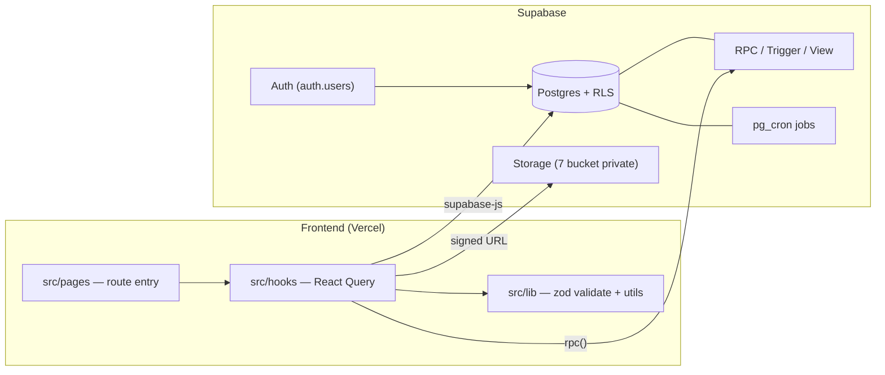
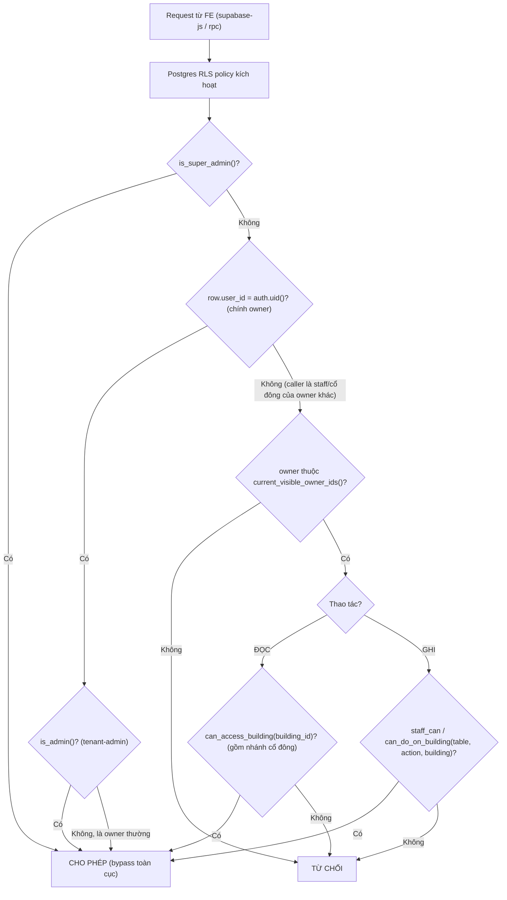
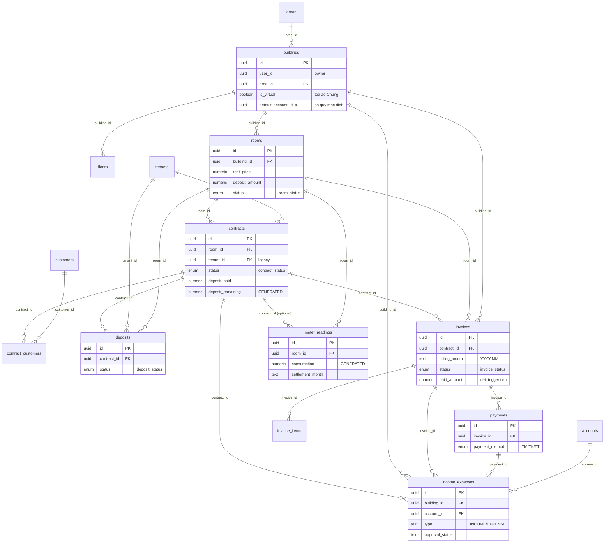
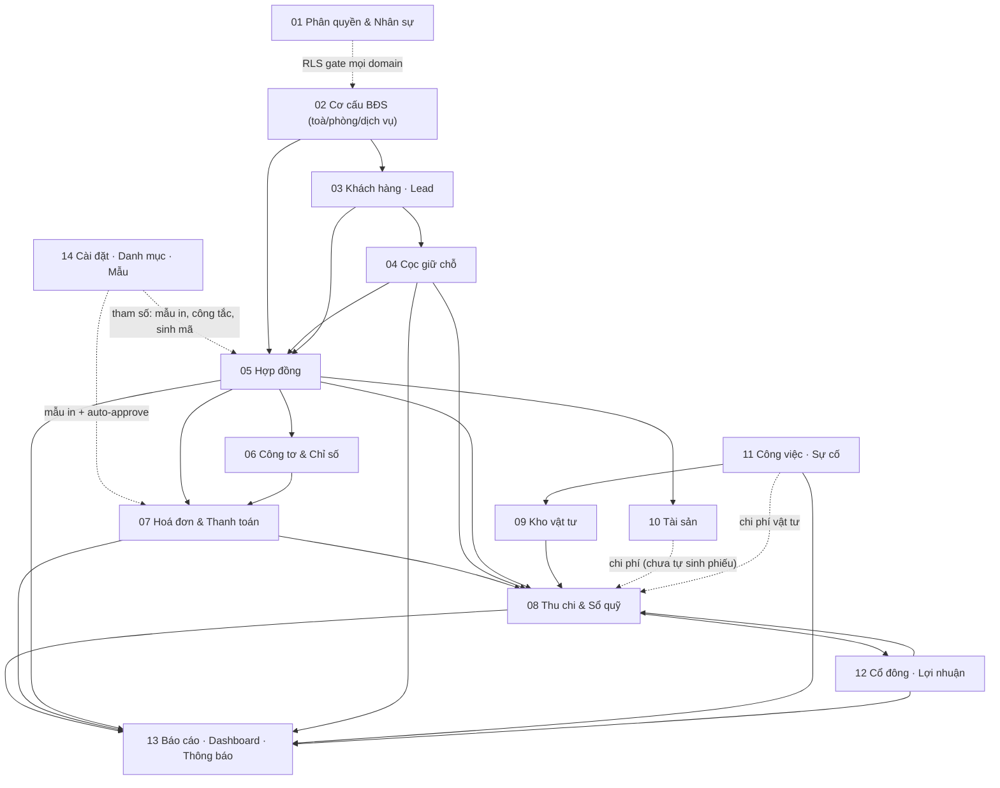

# Kiến trúc & Tổng quan hệ thống CRM BĐS

> Tài liệu nóc của bộ `docs/he-thong/`. Mô tả toàn cảnh hệ thống CRM quản lý bất động sản cho thuê (kiểu iHomeCRM): stack, 14 domain nghiệp vụ, mô hình multi-tenant + phân quyền RLS, sơ đồ quan hệ dữ liệu cốt lõi, phụ thuộc giữa các domain, bảng tra cứu enum trạng thái và các quy ước chung. Mỗi domain có file chi tiết riêng — xem cột "Tài liệu" trong [§2](#2-bản-đồ-14-domain).

---

## 1. Stack & kiến trúc tổng thể

**Frontend.** React + TypeScript + Vite, deploy thẳng lên Vercel từ nhánh `main` (production: <https://ptcrm.vercel.app>). UI dùng shadcn/ui + Tailwind. Form theo `react-hook-form` + `zod` (schema validate đặt ở `src/lib/*Validation.ts`). Data layer là React Query: mọi truy vấn/ghi đi qua hook trong `src/hooks/use*.ts`, gọi Supabase JS client. Trang đặt ở `src/pages/<domain>/`, UI theo domain ở `src/components/<domain>/`, util thuần + zod ở `src/lib/`.

**Backend.** Supabase = Postgres + Auth + Storage + RLS + RPC. Không có server tự viết: logic nghiệp vụ nặng nằm trong Postgres dưới dạng:

- **RPC** (`SECURITY DEFINER` / `INVOKER`) — ví dụ `renew_contract`, `record_invoice_payment_v2`, `generate_invoices_for_building_v2`, `monthly_building_profit`. Pattern phổ biến: RPC public bọc một `*_impl` chứa logic gốc, lớp ngoài lo kiểm quyền (xem `project_contract_rpc_authz`).
- **Trigger** — sinh mã, đồng bộ trạng thái phòng theo HĐ, recompute tồn vật tư/giá vốn, recompute `paid_amount` hoá đơn, recompute `deposit_paid`, gắn audit user_id…
- **View** — `accounts_with_balance`, `meter_readings_detailed`, `meters_with_latest_reading`… (một số view bỏ qua RLS để tính số dư — xem `project_ie_fund_owner_visibility`).
- **Edge Function** — admin tạo user (vd `admin-create-user` cho login cổ đông/nhân viên).

Migrations versioned theo timestamp ở `supabase/migrations/`. Cron tác vụ định kỳ dùng `pg_cron` (vd `run_recurring_vouchers_job` sinh phiếu thu chi lặp).

**RLS (Row Level Security).** Mọi bảng nghiệp vụ bật RLS. Quyền không kiểm ở frontend mà ở từng policy DB, gọi xuống một bộ helper chung (`is_super_admin`, `is_admin`, `staff_can`, `can_do_on_building`, `can_access_building`, `current_visible_owner_ids`…). Đây là hàng rào thật — frontend chỉ điều khiển hiển thị.

**Kiểm thử & chất lượng.** Vitest + fast-check (property-based) — `npx vitest run <path>`. Type check: `npx tsc --noEmit`. Quy trình mỗi thay đổi (xem [CLAUDE.md](../../CLAUDE.md)): type-check + test xanh → kiểm trực tiếp trên web bằng Playwright → seed/cleanup dữ liệu test qua Supabase Management API nếu cần → commit (stage file cụ thể) → push `origin/main`.

---

## 2. Bản đồ 14 domain

Mỗi domain là một file tài liệu chi tiết. Thứ tự gần đúng theo **vòng đời dữ liệu**: phân quyền → cơ cấu BĐS → khách/lead → cọc → hợp đồng → chỉ số → hoá đơn → thu chi → (vật tư/tài sản/công việc hỗ trợ) → cổ đông → báo cáo → cài đặt.

| # | Domain | Mục đích | Bảng chính | Route chính | Tài liệu |
|---|--------|----------|------------|-------------|----------|
| 01 | Phân quyền & Nhân sự | Xác định caller (super admin / owner / staff / cổ đông) + quyền; lõi RLS mọi domain gọi xuống | `profiles`, `roles`, `user_roles`, `staff_assignments`, `super_admins` | `/admin/users`, `/settings/staff`, `/account/profile` | [01-phan-quyen-nhan-su.md](01-phan-quyen-nhan-su.md) |
| 02 | Cơ cấu BĐS | Khu vực→toà→tầng→phòng + danh mục dịch vụ/định mức; gốc neo `building_id`/`room_id` | `areas`, `buildings`, `floors`, `rooms`, `services`, `building_services`, `service_quotas` | `/areas`, `/buildings`, `/apartments`, `/services`, `/building-map` | [02-co-cau-toa-nha-phong-dich-vu.md](02-co-cau-toa-nha-phong-dich-vu.md) |
| 03 | Khách hàng · Lead · Hồ sơ | Phễu sale (lead) → người thuê → customer đứng tên HĐ; CT01 cư trú; phương tiện | `leads`, `customers`, `tenants`, `vehicles`, `ct01_declarations`, `contract_customers` | `/leads`, `/customers`, `/vehicles` | [03-khach-hang-lead-ho-so.md](03-khach-hang-lead-ho-so.md) |
| 04 | Cọc giữ chỗ & theo dõi cọc | Phiếu giữ chỗ trước HĐ; theo dõi đủ/thiếu cọc; chặn ký thiếu cọc; hoàn/bỏ cọc | `deposits`, `excess_amounts`, `contract_terminations`, `income_expenses` (is_deposit) | `/deposits` | [04-coc-giu-cho.md](04-coc-giu-cho.md) |
| 05 | Hợp đồng | Trụ cột nối phòng↔khách↔dịch vụ↔cọc; gia hạn/chuyển nhượng/thanh lý | `contracts`, `contract_customers`, `contract_services`, `contract_extensions`, `contract_transfers`, `contract_terminations` | `/contracts`, `/contracts/:id`, `/c/:code` | [05-hop-dong.md](05-hop-dong.md) |
| 06 | Công tơ & Chỉ số | Ghi chỉ số đồng hồ hằng tháng → consumption feed hoá đơn điện/nước | `meters`, `meter_readings` | `/meter-readings`, `/settings/meters` | [06-cong-to-chi-so.md](06-cong-to-chi-so.md) |
| 07 | Hoá đơn & Thanh toán | Phát hành HĐ theo kỳ + ghi nhận thu tiền; mỗi payment → 1 phiếu thu | `invoices`, `invoice_items`, `payments`, `excess_amounts` | `/invoices`, `/invoices/:id` | [07-hoa-don-thanh-toan.md](07-hoa-don-thanh-toan.md) |
| 08 | Thu chi & Sổ quỹ | Trung tâm dòng tiền: mọi tiền vào/ra đáp xuống phiếu gắn 1 sổ quỹ | `income_expenses`, `income_expense_items`, `income_expense_types`, `accounts` | `/income-expense`, `/finance/cashbooks` | [08-thu-chi-so-quy.md](08-thu-chi-so-quy.md) |
| 09 | Kho vật tư tiêu hao | Nhập/xuất/kiểm kê vật tư; xuất gắn job để quy chi phí về toà | `materials`, `material_purchases`, `material_usages`, `material_adjustments`, `suppliers` | `/materials` (4 tab) | [09-kho-vat-tu.md](09-kho-vat-tu.md) |
| 10 | Tài sản & Nội thất | Tài nguyên hỗ trợ; bàn giao gắn HĐ + dữ liệu chi phí | `assets`, `asset_categories`, `asset_movements`, `asset_maintenance`, `asset_handovers` | `/assets`, `/settings/categories/warehouses` | [10-tai-san.md](10-tai-san.md) |
| 11 | Công việc · Sự cố · Quy trình | Giao việc + ticket sự cố có workflow/SLA; xuất vật tư trừ kho | `jobs`, `issues`, `job_types`, `task_flows`, `task_phases`, `departments` | `/tasks`, `/settings/categories/task-types` | [11-cong-viec-su-co.md](11-cong-viec-su-co.md) |
| 12 | Cổ đông · Lợi nhuận · Ví cá nhân | Chốt-khoá LN tháng theo toà → phân bổ → sinh phiếu chi chia tiền cổ đông | `shareholders`, `building_shareholders`, `profit_monthly`, `profit_allocations`, `personal_transactions` | `/finance/shareholder-profit`, `/finance/personal-wallet` | [12-co-dong-loi-nhuan.md](12-co-dong-loi-nhuan.md) |
| 13 | Báo cáo · Dashboard · Thông báo | Đọc tổng hợp dựng KPI + ~17 báo cáo + đẩy cảnh báo | `notifications`, `notification_templates`, `notification_logs` | `/` (Dashboard), `/notifications`, `/reports/*` | [13-bao-cao-dashboard-thong-bao.md](13-bao-cao-dashboard-thong-bao.md) |
| 14 | Cài đặt · Danh mục · Tài liệu mẫu | Tham số điều khiển: mẫu in, công tắc hành vi, engine sinh mã, gói cước | `settings`, `document_templates`, `signature_templates`, `code_sequences`, `subscription_plans` | `/settings/*`, `/account/subscription` | [14-cai-dat-danh-muc-tai-lieu.md](14-cai-dat-danh-muc-tai-lieu.md) |

---

## 3. Mô hình phân quyền & multi-tenant

Hệ thống **multi-tenant theo owner**: mỗi *owner* là một `user_id` (auth.users) sở hữu trọn dữ liệu của mình. Bốn loại caller:

- **Super admin** (`super_admins.user_id`) — bypass toàn cục, thấy mọi owner. Cổng: `is_super_admin()`.
- **Owner / tenant** — `user_id` sở hữu dữ liệu; mọi bản ghi nghiệp vụ có cột `user_id` = owner. `is_admin()` (tenant-admin: role `__superadmin` hoặc `name='Admin'`) là tầng bypass trong phạm vi một owner.
- **Staff (nhân viên)** — `staff_assignments` nối `staff_id ↔ owner ↔ building ↔ role`. Quyền là **2 tầng**: Tier 1 = `roles.permissions` (JSONB mẫu, 4 role hệ thống); Tier 2 = `staff_assignments.permissions` snapshot override per-staff. `building_id = NULL` nghĩa là full scope (tất cả toà của owner đó). Action keys trong JSONB: `view → create → edit → delete` (+ `record_payment`, `approve`, `print`, `export`).
- **Cổ đông** — nhánh read-only trong `get_my_permissions`/`can_access_building`: chỉ đọc các toà có cổ phần (`building_shareholders`) + toàn quyền `personal_finance`. Map login qua `shareholders.auth_user_id` / `current_shareholder_id()`.

**Các helper RLS cốt lõi** (gọi xuyên suốt mọi domain):

| Helper | Vai trò |
|--------|---------|
| `is_super_admin()` / `is_admin()` | 2 tầng bypass (toàn cục / trong-owner) |
| `staff_can(table, action, owner)` | Động cơ write-policy: staff được ghi bảng X action Y trên owner Z? |
| `can_access_building(building_id)` | Đọc: caller được xem toà này? (COALESCE snapshot → role template; có nhánh cổ đông) |
| `can_do_on_building(table, action, building_id)` | Ghi theo toà (record payment, sinh HĐ…) |
| `can_access_org_entity(entity, action)` | Quyền org-level không scope theo toà (vật tư, kho) |
| `current_visible_owner_ids()` / `is_staff_of()` | Visibility đọc: tập owner mà caller được thấy |
| `customer_in_my_scope` / `staff_in_building` | Scope ghi theo toà của HĐ còn hiệu lực |
| `get_my_context()` / `get_my_permissions()` / `get_my_assignments()` | FE bootstrap: ai là tôi + quyền + phân công |

Chi tiết đầy đủ ở [01-phan-quyen-nhan-su.md](01-phan-quyen-nhan-su.md).

### Luồng kiểm quyền 1 request (đọc/ghi một bản ghi gắn toà)

> Lưu ý: `can_access_building`/`can_do_on_building` đọc quyền theo `COALESCE(staff_assignments.permissions, roles.permissions)` — Tier 2 override Tier 1. Một số **view tính số dư** (vd `accounts_with_balance`) cố ý bỏ qua RLS để chủ sổ thấy đủ số dư xuyên toà, trong khi **bảng chi tiết** vẫn lọc theo RLS → số dư và danh sách giao dịch có thể lệch quyền (đây là chủ ý, xem `project_ie_fund_owner_visibility`).

---

## 4. Sơ đồ quan hệ dữ liệu CỐT LÕI (spine)

Chỉ vẽ **xương sống** dòng giao dịch. 95 bảng còn lại được gom nhóm và chú thích bên dưới — KHÔNG vẽ hết vào một sơ đồ.

**Chú thích các nhóm bảng ngoài spine** (gắn vào spine qua FK đã nêu trong từng domain):

- **Phân quyền** (`profiles`, `roles`, `user_roles`, `staff_assignments`, `super_admins`, `departments`) — gắn vào mọi `user_id` và `building_id`.
- **Danh mục BĐS** (`services`, `building_services`, `service_quotas`, `service_quota_tiers`, `code_sequences`) — cấp giá/định mức cho `invoice_items`.
- **HĐ mở rộng** (`contract_services`, `contract_extensions`, `contract_transfers`, `contract_terminations`, `contract_tenants`, `asset_handovers`) — quanh `contracts`.
- **Cọc & credit** (`excess_amounts`) — gắn `contract_id` / `source_invoice_id` / `source_payment_id`.
- **Thu chi mở rộng** (`income_expense_items`, `income_expense_types`, `income_expense_templates`, `income_expense_batches`, `account_shared_users`, `auto_debt_config`) — quanh `income_expenses`/`accounts`.
- **Công tơ** (`meters`) — cha của `meter_readings`.
- **Vật tư** (`materials`, `material_*`, `suppliers`) & **Tài sản** (`assets`, `asset_*`) — nhánh chi phí, gắn `building_id`/`room_id`/`job_id`/`contract_id`.
- **Vận hành** (`jobs`, `issues`, `task_flows`, `task_phases`, `job_types`, `sla_configs`) — gắn `building_id`/`room_id`/`contract_id`/`profiles`.
- **Cổ đông** (`shareholders`, `building_shareholders`, `profit_monthly`, `profit_allocations`, `personal_transactions`) — đọc từ `income_expenses`, ghi phiếu chia LN vào `income_expenses`.
- **Báo cáo & thông báo** (`notifications`, `notification_*`) — chỉ đọc tổng hợp + deep-link.
- **Cấu hình** (`settings`, `document_templates`, `signature_templates`, `subscription_plans`, `hotlines`, `ai_*`) — tham số điều khiển.

---

## 5. Sơ đồ phụ thuộc domain-level

14 domain là node; mũi tên = phụ thuộc dữ liệu chính (dựa crossLinks + FK). `A --> B` đọc là "A feed/ghi vào B" theo chiều dòng giao dịch.

Đọc nhanh: **02→03→04→05** là phễu mở (toà/phòng → khách/lead → cọc → HĐ). Từ HĐ tỏa ra **06 (chỉ số)** và **07 (hoá đơn)**; hoá đơn + cọc + HĐ + vật tư đều đáp xuống **08 (thu chi)** — trung tâm dòng tiền. **08** feed **12 (cổ đông)** và **13 (báo cáo)**; **12** lại ghi ngược phiếu chia LN vào **08**. **01** và **14** là 2 lớp ngang (gate quyền + tham số) phủ lên toàn bộ.

---

## 6. Bảng tra cứu Enum trạng thái

30 enum DB (`.tmp/schema/enums.json`). Bảng dưới gom các enum trạng thái + một số enum phân loại hay tra. Một số "trạng thái" thực ra là `text + CHECK` chứ không phải enum Postgres — đánh dấu rõ ở cột ý nghĩa.

| Enum | Giá trị | Ý nghĩa / đặt ở đâu |
|------|---------|---------------------|
| `building_status` | ACTIVE, INACTIVE, MAINTENANCE | Trạng thái toà (`buildings.status`); UI form chỉ ACTIVE↔INACTIVE |
| `building_type` | APARTMENT, DORMITORY, HOUSE, OFFICE, SLEEPBOX, HOMESTAY | Loại hình toà (`buildings.type`) |
| `room_status` | AVAILABLE, OCCUPIED, RESERVED, MAINTENANCE, UNAVAILABLE | Trạng thái phòng (`rooms.status`); trigger HĐ tự set AVAILABLE/OCCUPIED |
| `contract_status` | DRAFT, ACTIVE, **EXTENDED**, TRANSFERRED, TERMINATED, EXPIRED | Vòng đời HĐ (`contracts.status`). EXTENDED = đang hiệu lực, đối xử như ACTIVE ở mọi check (`isContractInEffect`) |
| `payment_cycle` | MONTHLY, QUARTERLY, SEMI_ANNUAL, ANNUAL | Kỳ thanh toán HĐ (`contracts.payment_cycle`) |
| `lead_status` | B1_LEAD, B2_APPOINTMENT, B3_CONSULTATION, CONVERTED, FAILED | Phễu sale (`leads.status`) |
| `lead_source` | FACEBOOK, ZALO, PHONE, REFERRAL, WALK_IN, WEBSITE, OTHER | Nguồn lead (`leads.source`) |
| `customer_status` | PROSPECT, ACTIVE, INACTIVE, BLACKLIST | Trạng thái khách (model cũ) |
| `customer_status_v2` | RENTING, MOVED_OUT, WALK_IN | Trạng thái khách (đang dùng) |
| `customer_type` | INDIVIDUAL, ORGANIZATION | Cá nhân / tổ chức (`customers.customer_type`) |
| `tenant_status` | PROSPECT, DEPOSITED, ACTIVE, INACTIVE, BLACKLIST | Trạng thái người thuê legacy |
| `id_type` | CCCD, CMND, PASSPORT, OTHER | Loại giấy tờ tuỳ thân |
| `vehicle_type` | MOTORBIKE, CAR, BICYCLE, OTHER, ELECTRIC_BIKE | Loại phương tiện (`vehicles.type`) |
| `deposit_status` | PENDING, CONFIRMED, CONVERTED, REFUNDED, FORFEITED | Trạng thái phiếu giữ chỗ (`deposits.status`). **KHÔNG phải nguồn sự thật** — RPC thanh lý không cập nhật; cọc thực nộp lấy từ IE `is_deposit` |
| `invoice_status` | DRAFT, PENDING_APPROVAL, APPROVED, PAID, PARTIAL_PAID, OVERDUE, CANCELLED | Trạng thái hoá đơn (`invoices.status`). FE tạo thẳng APPROVED; PAID/PARTIAL/OVERDUE do trigger suy ra; CANCELLED có thể restore→APPROVED |
| `invoice_item_type` | RENT, SERVICE, PENALTY, DISCOUNT, OTHER | Loại khoản trong hoá đơn (`invoice_items.type`) |
| `payment_method` | TM, TK, TT | Hình thức thu/chi (`payments`, `income_expenses`). **Giữ nguyên mã**, không dịch, không icon |
| `meter_type` | ELECTRICITY, WATER, GAS, OTHER | Loại công tơ (`meters`/`meter_readings`); UI dùng 3 đầu |
| `fee_type` | TIEN_PHI_DICH_VU, TIEN_DIEN, TIEN_NUOC, TIEN_PHI_KHAC, TIEN_VE_SINH | Loại phí dịch vụ (`services.fee_type`) |
| `pricing_type` | DON_GIA_CO_DINH_THANG, DON_GIA_CO_DINH_DONG_HO, DON_GIA_BIEN_DONG, DON_GIA_THEO_NGUOI, DON_GIA_THEO_PHONG | Cách tính giá dịch vụ; DONG_HO = tính theo chỉ số công tơ |
| `service_type` | FIXED, PER_PERSON, PER_ROOM, METER_READING | Model dịch vụ cũ |
| `expense_category` | MAINTENANCE, REPAIR, UTILITIES, SALARY, SUPPLIES, OTHER | Phân loại chi phí (bảng `expenses` legacy) |
| `asset_condition` | NEW, GOOD, FAIR, POOR, BROKEN | Chất lượng vật lý tài sản — KHÔNG phải trạng thái thuê |
| `issue_status` | NEW, ASSIGNED, IN_PROGRESS, RESOLVED, CLOSED, CANCELLED | Trạng thái sự cố (`issues.status`) |
| `issue_priority` | LOW, MEDIUM, HIGH, URGENT | Mức ưu tiên sự cố + `job_types.default_priority` |
| `notification_status` | PENDING, SENT, FAILED, CANCELLED, READ | PENDING=chưa đọc / READ=đã đọc (IN_APP). SENT/FAILED/CANCELLED dành kênh ngoài |
| `notification_type` | NEW_INVOICE, PAYMENT_REMINDER, OVERDUE_INVOICE, CONTRACT_EXPIRING, ISSUE_RESOLVED, GENERAL_ANNOUNCEMENT, CUSTOM, DEPOSIT_SHORTFALL | Loại thông báo |
| `notification_channel` | IN_APP, EMAIL, SMS, ZALO, PUSH | Kênh gửi; thực tế chỉ IN_APP dùng |
| `template_category` | CONTRACT_NEW, CONTRACT_TERMINATION, CONTRACT_EXTENSION, CONTRACT_TRANSFER, INVOICE, RECEIPT, HANDOVER | Phân loại mẫu in (`document_templates.category`) |
| `ai_message_role` | user, assistant, system | Subsystem AI RAG (`ai_messages.role`) |

**Trạng thái dạng `text + CHECK` (không phải enum DB) — hay nhầm:**

| "Enum" | Giá trị | Đặt ở đâu |
|--------|---------|-----------|
| `income_expenses.approval_status` | APPROVED, UNAPPROVED, CANCELLED | Mặc định tạo = APPROVED; chỉ APPROVED + `deleted_at IS NULL` mới vào số dư/báo cáo |
| `income_expenses.type` | INCOME, EXPENSE | Thu / chi |
| `income_expense_types.type` | income, expense (chữ thường) | Loại thu chi per-user |
| `repeat_cycle` | NONE, WEEK, MONTH, QUARTER, YEAR | Chu kỳ phiếu lặp |
| `meter_readings.status` | UNAPPROVED, APPROVED | FE tạo thẳng APPROVED |
| `jobs.status` | IN_PROGRESS, COMPLETED | 2 trạng thái (đã bỏ NOT_STARTED/PENDING…) |
| `jobs.priority` | NORMAL, LOW, URGENT | Khác `issue_priority` |
| `deposit_debt_mode` | DEBT, FIRST_INVOICE, NULL | Chế độ nợ cọc (`contracts`) |
| `contract_terminations.status` | DRAFT, PENDING_APPROVAL, APPROVED, COMPLETED | Legacy flow; RPC tức thì ghi thẳng COMPLETED |
| `termination_type` | NORMAL, FORFEIT, EARLY_*, BREACH | Loại thanh lý (FORFEIT = bỏ cọc) |
| `profit_monthly.status` | DRAFT, LOCKED | Chốt-khoá LN tháng (mở khoá quay lại DRAFT) |
| `material_adjustments.type` | IN, OUT | Kiểm kê cộng/trừ tồn |
| `asset_handovers.type` | CHECK_IN, CHECK_OUT | Bàn giao nhận/trả phòng |
| `signature_type` | UPLOAD, DRAW, TEXT | Loại chữ ký |
| `code_sequences.reset_period` | DAILY, MONTHLY, YEARLY, NEVER | Chu kỳ reset bộ đếm mã |
| `user_subscriptions.status` | active, expired, cancelled | Trạng thái gói cước |

---

## 7. Quy ước chung

**Mã tự sinh (code_sequences).** Engine sinh mã tuần tự ở bảng `code_sequences` per-user + per-object-type, qua 2 RPC: `generate_code(p_user_id, p_object_type)` (RAISE nếu chưa cấu hình) và `generate_next_code(...)` (`FOR UPDATE` chống race, tự tạo config mặc định nếu thiếu). `reset_period` (DAILY/MONTHLY/YEARLY/NEVER) quyết định khi nào bộ đếm về 0. Các domain có mã riêng còn dùng trigger sinh mã chuyên biệt (vd `JOB-YYYYMMDD-NNNN`, `MP/MU/MA-YYYYMMDD-NNNN`, `CSS{YYMM}{seq}` cho chỉ số, `DCxxxxxx` cho cọc) — thường kèm advisory lock để chống trùng.

**payment_method TM / TK / TT.** Giữ nguyên mã (TM = tiền mặt, TK = tài khoản, TT = thanh toán) ở `payments` và `income_expenses`. **Không dịch** sang "Tiền mặt/Chuyển khoản", **không** đặt icon cạnh badge (xem `feedback_payment_method_codes`).

**Soft-delete (`deleted_at`).** Hầu hết bảng nghiệp vụ có cột `deleted_at timestamptz`; xoá là set timestamp, không DELETE vật lý. Mọi query/trigger/aggregate lọc `deleted_at IS NULL` (vd `update_building_total_rooms` chỉ đếm phòng chưa xoá; số dư/báo cáo chỉ tính phiếu APPROVED + chưa xoá). RPC `soft_delete_customer` là ví dụ điển hình (set `deleted_at`, kiểm `user_id = auth.uid()`).

**Storage bucket private + signed URL.** 7 bucket Storage đều **private** (vd `document-templates`, ảnh hoá đơn/chỉ số/biên lai…). Hiển thị ảnh phải qua `StorageImage`/`useSignedUrl` (signed URL ngắn hạn), **không** dùng `` (xem `project_storage_private_signed_urls`).

**Kỳ tháng dạng `YYYY-MM`.** Hoá đơn (`billing_month`), chỉ số (`settlement_month`), chốt LN (`profit_monthly`) đều dùng chuỗi `YYYY-MM` làm khoá chốt tháng — tiện so sánh/nhóm mà không lệ thuộc timezone.

**Tòa ảo `is_virtual` ("Chung").** Mỗi owner có thể có toà ảo (`buildings.is_virtual = true`, tên "Chung") để hạch toán chi phí dùng chung không thuộc toà thật nào (vd phiếu chia LN cổ đông ghi vào toà ảo này). RPC tính LN/báo cáo theo toà thật loại trừ toà ảo khi cần.

**Cờ KQKD (`counts_in_business_result`).** Phiếu thu chi có cờ suy từ `business_result_accounting` (NULL=auto / TRUE / FALSE) quyết định có vào Kết quả kinh doanh (P&L) hay không. Cọc (`is_deposit`) và phiếu chia LN cổ đông bị loại khỏi P&L để tránh méo lợi nhuận.

**RPC bọc wrapper kiểm quyền.** RPC nghiệp vụ HĐ (renew/transfer/terminate_*) có guard quyền ở lớp ngoài, logic gốc nằm trong `*_impl`; RPC mới đụng HĐ phải tự kiểm quyền + revoke quyền `anon` (xem `project_contract_rpc_authz`).

---

*Để xem chi tiết từng domain (quy trình page từng bước, hook → RPC → trigger → side-effect, edge case + zod validate), mở file tương ứng ở cột "Tài liệu" trong [§2](#2-bản-đồ-14-domain).*
