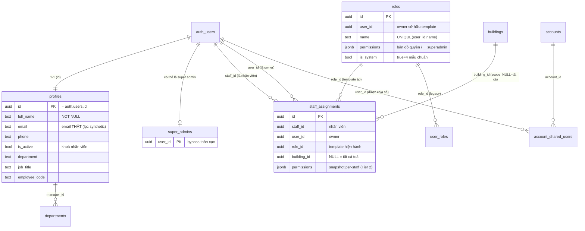
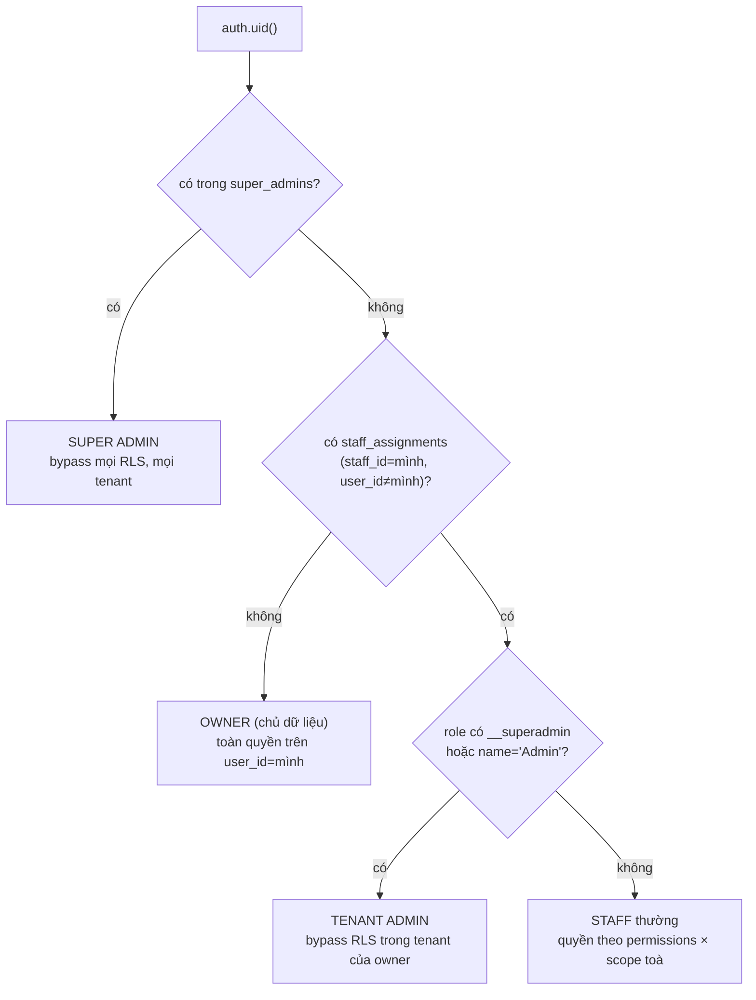
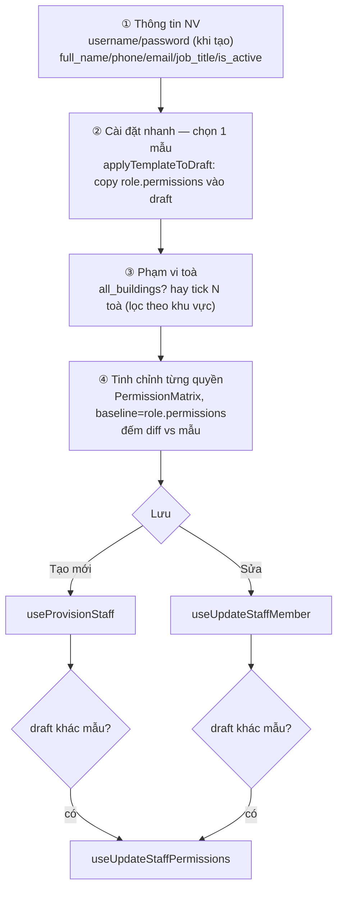

# Phân quyền & Nhân sự (Auth · Roles · Staff · RLS)

> Đây là **lõi phân quyền** của toàn hệ thống. Mọi domain khác (hợp đồng, hoá đơn,
> thu chi, báo cáo…) đều dựa vào các hàm RLS và bảng mô tả ở file này để quyết
> định "ai thấy gì, ai sửa được gì". Đọc kỹ phần 4 (RPC/RLS) trước khi đọc tài
> liệu các domain khác.

---

## 1. Tổng quan & vai trò nghiệp vụ

Hệ thống là **multi-tenant mềm trên Supabase**: dữ liệu của nhiều "chủ" cùng nằm
trong một database, RLS (Row Level Security) là biên giới ngăn cách. Có 3 cấp
chủ thể:

| Cấp | Là ai | Cách nhận diện trong DB | Quyền |
|-----|-------|--------------------------|-------|
| **Super admin** | Người vận hành nền tảng / chủ tài khoản gốc | có row trong `super_admins` | Bypass **mọi** RLS, **mọi** tenant, mọi bảng. |
| **Owner** (chủ dữ liệu / tenant) | 1 `user_id` sở hữu dữ liệu | xuất hiện ở cột `user_id` của các bảng nghiệp vụ; **không** là staff của ai | Toàn quyền trên dữ liệu của chính mình (RLS `auth.uid() = user_id`). |
| **Staff** (nhân viên) | Người được owner thuê | có row trong `staff_assignments` với `staff_id = mình, user_id = owner` | Quyền **giới hạn** theo (1) role/permissions và (2) phạm vi toà nhà được giao. |

Điểm mấu chốt của mô hình:

- **`roles` là TEMPLATE permissions, không phải role gắn cứng.** Khi gán nhân
  viên, permissions JSONB của role được **COPY snapshot** vào
  `staff_assignments.permissions`. Sau đó owner có thể tick/untick từng quyền cho
  riêng một nhân viên mà **không** ảnh hưởng template hay nhân viên khác. Đây là
  cơ chế **2 tier**:
  - **Tier 1** — chọn template (Super Admin / Quản Lý Tòa / Partner / Viewer).
  - **Tier 2** — tinh chỉnh per-staff trên `staff_assignments.permissions`.
- **Phạm vi toà nhà** là chiều kiểm soát thứ hai, độc lập với permissions. Một
  nhân viên có quyền `contracts.edit` vẫn chỉ sửa được hợp đồng ở các toà được
  giao (qua `staff_assignments.building_id`).
- Hiện tại hệ thống chạy theo mô hình **single-org**: đăng ký công khai đã đóng
  ([Register.tsx](src/pages/auth/Register.tsx)), tài khoản mới chỉ tạo qua trang
  admin hoặc trang phân quyền. `super_admins` được seed sẵn 1 tài khoản gốc.

Domain này nằm ở **đầu vòng đời nghiệp vụ**: trước khi một lead/cọc/hợp đồng/chỉ
số/hoá đơn/thu chi/báo cáo được tạo hay xem, hệ thống phải biết caller là ai và
được phép gì. Mọi RPC/RLS ở các domain sau đều gọi xuống các helper định nghĩa
tại đây.

---

## 2. Cấu trúc dữ liệu

### 2.1 `profiles` — hồ sơ người dùng (1-1 với `auth.users`)

- **Mục đích**: lưu thông tin hiển thị + thông tin nhân sự mở rộng cho mỗi tài
  khoản auth. `id` = `auth.users.id` (cùng UUID, quan hệ 1-1).
- **Cột chủ chốt**:
  - `full_name` (NOT NULL) — tên hiển thị; trigger `handle_new_user` luôn điền
    một giá trị (full_name → username → local-part email → `'User'`).
  - `phone`, `email` — định danh phụ. **Lưu ý**: `email` ở đây là email *thật*
    của người dùng; các email tổng hợp dạng `…@username.ihomecrm.local` hoặc
    `…@phone.ihomecrm.local` (dùng cho Supabase Auth) bị trigger lọc bỏ → NULL.
  - `avatar_url` — ảnh đại diện (bucket `avatars`).
  - `department`, `job_title`, `employee_code` — thông tin nhân sự mở rộng (thêm
    ở migration `20260502000001`).
  - `is_active` (NOT NULL, default true) — cờ khoá nhân viên. UI hiển thị badge
    "Khoá" khi false; dropdown chọn người phụ trách lọc bỏ user `is_active=false`.
  - `company_name`, `address`, `default_payment_due_days`, `timezone`,
    `language`, `subscription_plan`, `subscription_expires_at` — cấu hình tenant
    cấp owner (phần lớn chỉ owner dùng).
  - `id`, `created_at`, `updated_at` — khoá + audit.
- **Quan hệ FK (được tham chiếu)**: nhiều bảng nghiệp vụ trỏ tới `profiles.id`
  để chỉ "người phụ trách": `asset_maintenance.assigned_to`,
  `departments.manager_id`, `issues.assigned_to`/`reported_by_staff_id`,
  `jobs.assignee_id`, `leads.assigned_staff_id`.

### 2.2 `roles` — template phân quyền

- **Mục đích**: mẫu permissions tái sử dụng. Có 4 template hệ thống
  (`is_system=true`) + template tuỳ chỉnh do owner tạo.
- **Cột chủ chốt**:
  - `user_id` (NOT NULL) — owner sở hữu template (single-org: owner gốc).
  - `name` (NOT NULL) — tên mẫu; UNIQUE theo `(user_id, name)`. 4 tên hệ thống:
    `Super Admin`, `Quản Lý Tòa`, `Partner`, `Viewer`.
  - `permissions` (jsonb, default `[]`) — **bản đồ quyền** dạng
    `{ "<module>": { "<action>": true, … }, … }`. Riêng Super Admin chứa sentinel
    `{"__superadmin": true}` → mọi quyền true.
  - `is_system` (default false) — true với 4 template chuẩn (không cho sửa/xoá ở
    UI, chỉ "nhân bản").
  - `description` — mô tả mẫu.
- **Quan hệ FK (được tham chiếu)**: `staff_assignments.role_id`,
  `user_roles.role_id`.

### 2.3 `staff_assignments` — gán nhân viên ↔ owner ↔ toà ↔ role

- **Mục đích**: bảng **trung tâm** của phân quyền. Một row = "nhân viên `staff_id`
  làm cho owner `user_id`, role `role_id`, scope toà `building_id`". Nhân viên
  quản lý nhiều toà → nhiều row (cùng `staff_id`).
- **Cột chủ chốt**:
  - `staff_id` (NOT NULL) — `auth.users.id` của nhân viên.
  - `user_id` (NOT NULL) — owner thuê nhân viên này (chủ dữ liệu).
  - `role_id` (NOT NULL → `roles.id`) — template đang áp (chỉ để badge UI biết
    "mẫu hiện hành").
  - `building_id` (nullable → `buildings.id`) — toà được giao. **`NULL` = quản lý
    TẤT CẢ toà** của owner (full scope). Đây là quy ước quan trọng xuất hiện
    trong mọi hàm RLS scope-theo-toà.
  - `permissions` (jsonb, nullable) — **snapshot quyền per-staff** (Tier 2). Copy
    từ `role.permissions` khi áp template; `NULL` = chưa override → RPC fallback
    về `role.permissions`. Có GIN index `idx_staff_assignments_permissions`.
  - `id`, `created_at`, `updated_at` — khoá + audit.
- **Quan hệ FK (đi ra)**: `role_id → roles.id`, `building_id → buildings.id`
  (sang domain Bất động sản).

### 2.4 `super_admins` — danh sách bypass toàn cục

- **Mục đích**: denylist-style table cấp quyền god-mode xuyên tenant. `is_super_admin()`
  chỉ kiểm tra `auth.uid() ∈ super_admins`.
- **Cột**: `user_id` (PK → `auth.users.id`, ON DELETE CASCADE), `note`,
  `created_at`. Seed sẵn tài khoản gốc.
- RLS: chỉ super admin tự đọc/sửa bảng này.

### 2.5 `user_roles` — (legacy) gán role trực tiếp cho user

- **Mục đích**: bảng cũ map `user_id ↔ role_id`. Mô hình hiện hành đã chuyển sang
  `staff_assignments` (có thêm scope toà + snapshot permissions), nên `user_roles`
  gần như **không còn dùng** trong flow chính. Vẫn giữ FK `role_id → roles.id`.
- **Cột**: `user_id`, `role_id`, `assigned_by` (ai gán), `id`, `created_at`.

### 2.6 `departments` — phòng ban (danh mục nhân sự)

- **Mục đích**: danh mục phòng ban của tổ chức, dùng phân loại nhân viên và gắn
  vào issues/job_types.
- **Cột chủ chốt**: `user_id` (owner), `code` + `name` (NOT NULL),
  `manager_id → profiles.id` (trưởng phòng), `phone`, `email`,
  `is_active`, audit.
- **Quan hệ FK (được tham chiếu)**: `issues.department_id`,
  `job_types.default_department_id` (sang domain Vận hành/Công việc).

### 2.7 `account_shared_users` — chia sẻ quyền dùng 1 sổ quỹ

- **Mục đích**: cho phép nhiều user cùng thao tác trên **một sổ quỹ** (`accounts`)
  ngoài chủ sổ. Liên quan trực tiếp domain Sổ quỹ / Thu chi.
- **Cột**: `account_id (NOT NULL → accounts.id)`, `user_id` (người được chia sẻ),
  `created_by` (ai chia sẻ), `id`, `created_at`.
- **Quan hệ FK (đi ra)**: `account_id → accounts.id` (sang domain Sổ quỹ).

### 2.8 Enum liên quan

Domain này **không** sở hữu enum riêng (các bảng dùng `boolean`/`jsonb`/`text`).
Permissions không phải enum mà là JSONB tự do với khoá module/action do FE quy
định trong [permissions.ts](src/lib/permissions.ts). Các action chuẩn:
`view · create · edit · delete` (+ extras: `record_payment · approve · print ·
export` tuỳ module).

---

## 3. Sơ đồ quan hệ dữ liệu

### Cây phân loại caller (FE & RLS đều dựa vào đây)

---

## 4. Quy tắc nghiệp vụ & tự động hoá

Tất cả helper RLS là **`SECURITY DEFINER`** + `STABLE` + `SET search_path =
public` (để bypass RLS của chính bảng `staff_assignments`/`super_admins` khi
kiểm tra, tránh đệ quy vô hạn). Được `GRANT EXECUTE` cho `authenticated`/`anon`/
`service_role`.

### 4.1 Trigger `handle_new_user()` — tạo profile khi đăng ký

Định nghĩa: [20260502000001_fix_user_provision_flow.sql](supabase/migrations/20260502000001_fix_user_provision_flow.sql).

- **Khi nào chạy**: `AFTER INSERT ON auth.users` (mỗi lần Supabase tạo auth user,
  kể cả khi admin provision nhân viên qua `signUp`).
- **Làm gì**: đọc `raw_user_meta_data` (full_name, username, phone, email,
  department, job_title, employee_code, is_active) → INSERT vào `profiles`.
  - `full_name`: coalesce `full_name → username → split_part(email,'@',1) → 'User'`.
  - `phone`: regex `^[0-9]{10,11}$`, sai định dạng → NULL.
  - `email`: ưu tiên email trong metadata; nếu trống mới dùng `NEW.email`
    **và chỉ khi** nó không phải synthetic (`NOT LIKE '%@%.ihomecrm.local'`).
  - `ON CONFLICT (id) DO NOTHING` — re-signup vô hại.
- **Bất biến**: mỗi `auth.users` có đúng 1 `profiles`; email synthetic không bao
  giờ lọt vào `profiles.email`.

### 4.2 `is_super_admin()` & `is_admin()` — 2 tầng bypass

[20260506000003_super_admin_tier.sql](supabase/migrations/20260506000003_super_admin_tier.sql),
[20260506000002_admin_bypass_rls.sql](supabase/migrations/20260506000002_admin_bypass_rls.sql).

- `is_super_admin()` → `auth.uid() ∈ super_admins`. Mỗi bảng RLS-enabled có policy
  `<t>_super_admin_all FOR ALL USING (is_super_admin())` — Postgres OR-merge nên
  super admin luôn pass mọi SELECT/INSERT/UPDATE/DELETE, **xuyên tenant**.
- `is_admin()` → tồn tại `staff_assignments` của caller với role thoả
  `permissions @> '{"__superadmin": true}'` **HOẶC** `role.name = 'Admin'`. Tạo
  policy `<t>_admin_all` tương tự nhưng chỉ "god-mode trong tenant" (vì check qua
  chính staff_assignments → giới hạn ở dữ liệu owner mà họ phục vụ).
- **Lý do tồn tại**: trước đây write vẫn check `auth.uid() = user_id`, khiến admin
  sửa dữ liệu do staff tạo → UPDATE khớp 0 row, PostgREST trả 204 "fake success".
  2 policy bypass này vá lỗ hổng đó.

### 4.3 `staff_can(_table, _action, _owner)` — quyền theo permissions

[20260510000056_staff_write_rls.sql](supabase/migrations/20260510000056_staff_write_rls.sql).

- True khi caller có `staff_assignments` trỏ tới `_owner` mà role thoả 1 trong:
  `__superadmin` / `name='Admin'` / `(role.permissions -> _table ->> _action) = true`.
- Là **động cơ chính của các write-policy staff**. Mỗi bảng nghiệp vụ keyed
  trực tiếp bởi `user_id` có 3 policy `<t>_staff_insert/update/delete` gọi
  `staff_can('<perm_key>', 'create|edit|delete', user_id)`. Bảng phụ thuộc
  (rooms, beds, invoice_items, contract_customers…) check qua FK lên bảng cha.
- Lưu ý mapping `tbl → perm_key`: nhiều bảng vật lý chia sẻ 1 khoá quyền (vd
  `contract_extensions/terminations/transfers` đều dùng `'contracts'`;
  `meters` dùng `'meters'`; `accounts` dùng `'cashbooks'`).

  > ⚠️ **Lệch quyền cũ vs mới**: `staff_can()` đọc `role.permissions` (chưa biết
  > tới override Tier 2). Các helper `can_do_on_building`/`can_access_org_entity`
  > (4.6) mới đọc `COALESCE(sa.permissions, role.permissions)`. Vì vậy
  > write-policy chuẩn (insert/update/delete qua `staff_can`) **chưa** phản ánh
  > tinh chỉnh per-staff — đây là chủ ý hiện tại; gate per-staff chủ yếu áp ở FE
  > qua `get_my_permissions()`.

### 4.4 `staff_in_building` & scope ghi theo toà

[20260518000051_staff_building_scope_writes.sql](supabase/migrations/20260518000051_staff_building_scope_writes.sql).

- `staff_in_building(_owner, _building_id)` → true nếu caller là owner / `is_admin`
  / staff có row `building_id IS NULL` (full scope) / staff có row trùng đúng
  `_building_id`.
- Áp cho write-policy của **contracts / vehicles / customers**: ngoài `staff_can`
  còn AND thêm `staff_in_building(...)`:
  - `contracts`: scope lấy từ `room.building_id` (chain contract → room → building).
  - `vehicles`: `building_id` trực tiếp.
  - `customers`: dùng `customer_in_my_scope` (khách không có building trực tiếp →
    xét qua hợp đồng còn sống; khách **chưa có** hợp đồng nào → fallback cho phép
    để không khoá use-case tạo khách mới).
- `get_my_assignments()` (cùng migration) trả `(user_id, building_id)` của caller
  cho FE biết phải ẩn nút action nào — gương soi của `staff_in_building` ở client.
- **Bất biến**: staff được tick N toà chỉ ghi được dữ liệu trong N toà đó, dù
  role cho phép action.

### 4.5 Visibility đọc: `current_visible_owner_ids`, `is_staff_of`, `staff_building_scope`

- `is_staff_of(owner)` / `staff_building_scope(owner)`
  ([migrations-bundle/20260427_apply_staff_visibility.sql](supabase/migrations-bundle/20260427_apply_staff_visibility.sql)):
  - `is_staff_of` → caller có làm staff cho owner không.
  - `staff_building_scope` → mảng `building_id[]` caller xem được dưới owner;
    trả `NULL` nếu có ít nhất 1 row `building_id IS NULL` (xem tất cả toà).
- `current_visible_owner_ids()`
  ([20260506000004_tenant_symmetric_visibility.sql](supabase/migrations/20260506000004_tenant_symmetric_visibility.sql)):
  trả tập owner_id mà caller được SELECT, gồm: **chính mình + các owner mình làm
  staff + staff của mình + đồng nghiệp (co-staff) chung owner**. Nhánh co-staff
  được thêm để nhân viên cùng tenant thấy dữ liệu của nhau (vd sổ quỹ của đồng
  nghiệp trong dropdown). Đồng thời view `accounts_with_balance` được chuyển sang
  `security_invoker = true` để tôn trọng RLS (trước đó leak xuyên tenant).
- `customer_in_my_scope(_owner, _customer_id)` — đã mô tả ở 4.4.

### 4.6 RPC cho FE: `get_my_context` & `get_my_permissions`

Hai RPC này tồn tại vì **RLS của `staff_assignments` chỉ cho owner đọc** → staff
không tự query được context/permissions của chính mình. Cả hai `SECURITY DEFINER`.

- **`get_my_context()`**
  ([20260516000011_get_my_context_default_area.sql](supabase/migrations/20260516000011_get_my_context_default_area.sql)):
  trả `{ is_super, is_staff, owner_id, default_area_id }`.
  - super admin → `is_super=true, owner_id=mình`.
  - staff → `is_staff=true, owner_id=owner`; **`default_area_id`** = area của owner
    có `name` (lowercase) khớp username staff (phần trước `@`, hoặc
    `raw_user_meta_data.username`) → FE auto-lock filter khu vực.
  - owner thường → `owner_id=mình`, các cờ false.

- **`get_my_permissions()`** (phiên bản mới nhất:
  [20260603000002_shareholder_access_and_perms.sql](supabase/migrations/20260603000002_shareholder_access_and_perms.sql),
  kế thừa [20260529000001_per_staff_permissions.sql](supabase/migrations/20260529000001_per_staff_permissions.sql)):
  trả JSONB permissions của caller theo thứ tự ưu tiên:
  1. super admin → sentinel `{"__superadmin": true}`.
  2. staff → `COALESCE(sa.permissions, role.permissions)` của assignment đầu tiên
     (ưu tiên row full-scope `building_id IS NULL`, rồi `created_at` sớm nhất) —
     tức **đã** tính tới override Tier 2.
  3. **cổ đông** (có trong `shareholders.auth_user_id`) → bộ quyền **chỉ-xem** cố
     định + `shareholder_profit.view` + toàn quyền `personal_finance`; nếu đồng
     thời là staff thì **merge** `v_sh_perms || v_perms` (quyền staff ghi đè base).
  4. owner thật (không staff, không cổ đông) → sentinel `__superadmin`.
  - **Bất biến quan trọng**: cổ đông không-staff trước đây rơi vào nhánh "owner
    thật → superadmin bypass" gây lỗ hổng; nhánh cổ đông (3) đóng lỗ hổng này
    bằng cách trả permissions read-only tường minh.

- `get_my_permissions` đi kèm `can_do_on_building(_table,_action,_building_id)` và
  `can_access_org_entity(_resource,_action)` — bản kiểm quyền có scope toà / không
  scope, đều đọc `COALESCE(sa.permissions, role.permissions)` (tôn trọng Tier 2).
- `can_access_building(_building_id)` (4.x) còn có nhánh **cổ đông**: cổ đông
  SELECT được đúng các toà có trong `building_shareholders` của mình.

### 4.7 RPC quản trị nhân sự

- **`delete_staff_member(p_staff_id)`**
  ([20260502000002_delete_staff_member_rpc.sql](supabase/migrations/20260502000002_delete_staff_member_rpc.sql)):
  `DELETE FROM auth.users` (cascade xoá profiles + staff_assignments + dữ liệu
  do user sở hữu). Guard: caller phải đang quản lý target (`staff_assignments`
  với `user_id = auth.uid()`); **chặn tự xoá mình** (ERRCODE 42501). Mục đích:
  `auth.users` là single source of truth — xoá nửa vời (chỉ staff_assignments)
  để lại username chiếm chỗ + vẫn đăng nhập được.
- Tạo tài khoản: 2 đường — (a) FE provision qua `supabase.auth.signUp` +
  insert `staff_assignments` (xem 5.2), (b) super admin gọi edge function
  `admin-create-user` từ [UsersPage](src/pages/admin/UsersPage.tsx).

### 4.8 4 template hệ thống

Seed tại [20260529000002_seed_system_role_templates.sql](supabase/migrations/20260529000002_seed_system_role_templates.sql):

| Template | permissions | Dùng cho |
|----------|-------------|----------|
| **Super Admin** | `{"__superadmin": true}` | Toàn quyền, bypass mọi check. |
| **Quản Lý Tòa** | full CRUD + duyệt trên ~30 module vận hành | Quản lý 1+ toà. |
| **Partner** | quản lý leads/cọc + xem BĐS, hợp đồng read-only | CTV/đối tác. |
| **Viewer** | mọi module chỉ `view` | Chỉ xem (read-only). |

`is_system=true` → UI không cho sửa/xoá, chỉ "Tạo bản sao". Migration này cũng
migrate role cũ (Admin→Super Admin, Manager→Quản Lý Tòa) và snapshot permissions
vào mọi row `staff_assignments`.

---

## 5. Quy trình theo từng trang

### 5.1 `/login` · `/register` · `/forgot-password` · `/reset-password` — Auth

**[Login.tsx](src/pages/auth/Login.tsx)** — đăng nhập đa định danh.

- Hiển thị: form `identifier` (tên đăng nhập | SĐT | email) + password + "ghi nhớ".
- Các bước:
  1. Validate client: identifier & password không trống.
  2. `useLogin` ([useAuth.ts](src/hooks/useAuth.ts)) → `normalizeIdentifier()`:
     email giữ nguyên; SĐT (`^[0-9]{10,11}$`) → `<phone>@phone.ihomecrm.local`;
     còn lại slugify → `<slug>@username.ihomecrm.local`.
  3. `supabase.auth.signInWithPassword({ email, password })`.
  4. Thành công → invalidate `['auth']`, toast, `navigate('/')`.
- Edge case: lỗi `Invalid login credentials` được dịch sang thông báo tiếng Việt
  gộp cả 3 kiểu định danh.

**[Register.tsx](src/pages/auth/Register.tsx)** — đăng ký công khai **đã đóng**:
chỉ là trang thông báo "liên hệ admin". Hook `useRegister` vẫn còn trong code
nhưng không nối với UI.

**[ResetPassword.tsx](src/pages/auth/ResetPassword.tsx)** — đặt lại mật khẩu qua
link email.

- Các bước: `useEffect` đọc hash URL (`type=recovery` + `access_token`) →
  `supabase.auth.setSession` để có phiên recovery. Nếu không có token và không có
  session → màn "Link không hợp lệ".
- Validate mật khẩu mạnh hơn ProfilePage: ≥ 8 ký tự, có hoa/thường/số, có thanh
  đo độ mạnh. Submit → `useResetPassword` → `supabase.auth.updateUser({password})`.
- `ForgotPassword` gọi `useForgotPassword` → `resetPasswordForEmail` với
  `redirectTo = origin + '/reset-password'`.

### 5.2 `/settings/staff` — Phân quyền nhân viên (trang chính của domain)

[StaffPage.tsx](src/pages/settings/StaffPage.tsx). Mục đích: quản lý **template**
(tab "Mẫu phân quyền") và **nhân viên** (tab "Nhân viên"). Dữ liệu:
`useStaffAssignments`, `useRoles`, `useBuildings`, `useAreas`.

#### Tab "Mẫu phân quyền"

- Hiển thị 4 card system + N card custom (đếm số staff/role qua `useStaffAssignments`).
- Thao tác: xem mẫu (Sheet + `PermissionMatrix` read-only); custom → sửa
  (`useUpdateRole`) / xoá (`useDeleteRole`, chặn nếu đang được gán); system →
  "Tạo bản sao" (`useCreateRole`). Validate: tên mẫu không trống.

#### Tab "Nhân viên" — thêm/sửa qua Sheet 4 bước

**Tạo mới — `useProvisionStaff`** ([useStaffAssignments.ts](src/hooks/useStaffAssignments.ts)):

1. Lưu **session admin hiện tại** trước khi `signUp` (vì `signUp` tự chuyển phiên
   client sang user mới → mọi insert sau đó sẽ chạy dưới quyền user mới chưa có
   staff_assignment → RLS 403 + orphan auth row).
2. `buildAuthEmail` slugify username → `<slug>@username.ihomecrm.local`.
3. `supabase.auth.signUp` với toàn bộ identity trong `options.data` → trigger
   `handle_new_user` tự điền `profiles` trong cùng transaction (không cần upsert
   client).
4. **Khôi phục session admin ngay** (`setSession`) — kể cả khi signUp lỗi.
5. Đọc `role.permissions` → snapshot vào mỗi row. `building_ids` rỗng/null →
   `[null]` (1 row full-scope). Insert N row `staff_assignments`.
6. Validate UI: tên đăng nhập bắt buộc, password ≥ 6 và khớp confirm, role bắt
   buộc, nếu không "tất cả toà" phải chọn ≥ 1 toà, phone `10-11` số / email đúng
   regex.

**Sửa — `useUpdateStaffMember`**: (1) update `profiles` (RLS `profiles_admin_update`
cho phép owner sửa profile staff mình quản lý); (2) **diff** assignments hiện có
vs `wantBuildings`: xoá row toà bị bỏ, insert row toà mới, update `role_id` +
re-snapshot `permissions` khi đổi role. Sau đó nếu draft khác `role.permissions`
→ `useUpdateStaffPermissions` (UPDATE cùng JSONB cho mọi row của staff).

**Xoá — `useRemoveStaffMember`** → RPC `delete_staff_member` (4.7).

**Áp mẫu nhanh — `useApplyTemplate`**: copy `role.permissions` vào
`staff_assignments.permissions` cho mọi row + đổi `role_id`.

Card nhân viên hiển thị badge: phạm vi toà ("Tất cả toà" / "N toà (…)"), và trạng
thái quyền: "Bypass toàn quyền" (super), "Khớp mẫu" (diff=0), hoặc "N thay đổi so
với mẫu" (`diffPermissions`).

### 5.3 `/admin/users` — Quản lý tài khoản (super admin)

[UsersPage.tsx](src/pages/admin/UsersPage.tsx). Mục đích: super admin xem danh
sách toàn bộ tài khoản và tạo tài khoản gốc.

- Hiển thị (`useAdminUsers`): join `profiles` + `super_admins` (cờ) +
  `staff_assignments` (đếm) → cột Họ tên/Email/SĐT/Vai trò (Super admin | Staff |
  Chưa gán)/số toà được giao/ngày tạo.
- Tạo tài khoản (`useCreateAdminUser`): gọi edge function `admin-create-user`
  (yêu cầu caller là super_admin trên DB). Validate: email + password (≥6) bắt
  buộc. Sau khi tạo, phân quyền chi tiết làm ở `/settings/staff`.

### 5.4 `/account/profile` — Hồ sơ cá nhân

[ProfilePage.tsx](src/pages/account/ProfilePage.tsx). Mục đích: mỗi user tự sửa
thông tin của mình.

- Hiển thị (`useProfile`): avatar + họ tên/email/SĐT.
- Thao tác:
  - Lưu thông tin → `useUpdateProfile` (UPDATE `profiles WHERE id=auth.uid()`).
  - Đổi avatar → `useUploadAvatar`: upload bucket `avatars`
    (`<uid>/avatar.<ext>`, ≤ 2MB, hỗ trợ paste clipboard) rồi cập nhật
    `avatar_url`. ⚠️ Hiện dùng `getPublicUrl` — xem cảnh báo bucket private ở
    phần 6.
  - Đổi mật khẩu → `useChangePassword` → `supabase.auth.updateUser`. Validate:
    mật khẩu mới ≥ 6 ký tự + khớp confirm (lưu ý khác chuẩn mạnh ở ResetPassword).

---

## 6. Liên kết sang domain khác (vào / ra)

**Ra (domain này cung cấp cho domain khác):**

- **Mọi domain nghiệp vụ** gọi xuống các helper RLS định nghĩa ở đây:
  `is_super_admin / is_admin / staff_can / staff_in_building / can_access_building
  / can_do_on_building / current_visible_owner_ids`. Cột `user_id` của bảng
  nghiệp vụ chính là khoá tenant mà các helper này dùng.
- → **Bất động sản**: `staff_assignments.building_id → buildings.id` là chiều
  scope toà; `default_area_id` trong `get_my_context` khoá filter khu vực.
- → **Vận hành / Công việc**: `profiles.id` được tham chiếu làm "người phụ trách"
  (`issues.assigned_to`, `jobs.assignee_id`, `leads.assigned_staff_id`,
  `asset_maintenance.assigned_to`); `departments` gắn vào `issues`/`job_types`.
- → **Sổ quỹ / Thu chi**: `account_shared_users.account_id → accounts.id` mở rộng
  quyền dùng sổ quỹ cho nhiều user; `staff_can('cashbooks', …)` gate sổ quỹ.
- → **Cổ đông & Tài chính**: `get_my_permissions` và `can_access_building` có
  nhánh riêng cho cổ đông (`shareholders.auth_user_id`, `building_shareholders`)
  → cổ đông read-only theo toà có cổ phần + toàn quyền `personal_finance`.

**Vào (domain này phụ thuộc):**

- **Supabase `auth.users`** — gốc của `profiles.id`, `staff_assignments.staff_id/
  user_id`, `super_admins.user_id` (cascade xoá khi xoá auth user).
- **Bất động sản** — `staff_assignments.building_id` và `areas` (cho default area).
- **Sổ quỹ** — `account_shared_users.account_id` trỏ tới `accounts`.
- **Cổ đông** — `get_my_permissions`/`can_access_building` đọc `shareholders` +
  `building_shareholders` (định nghĩa ở domain Cổ đông).
