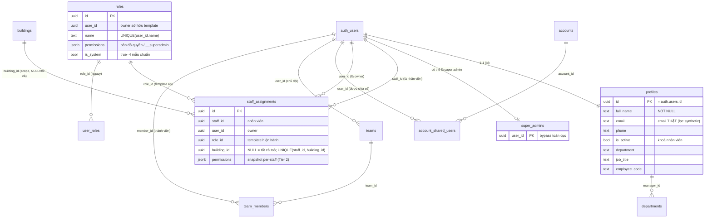
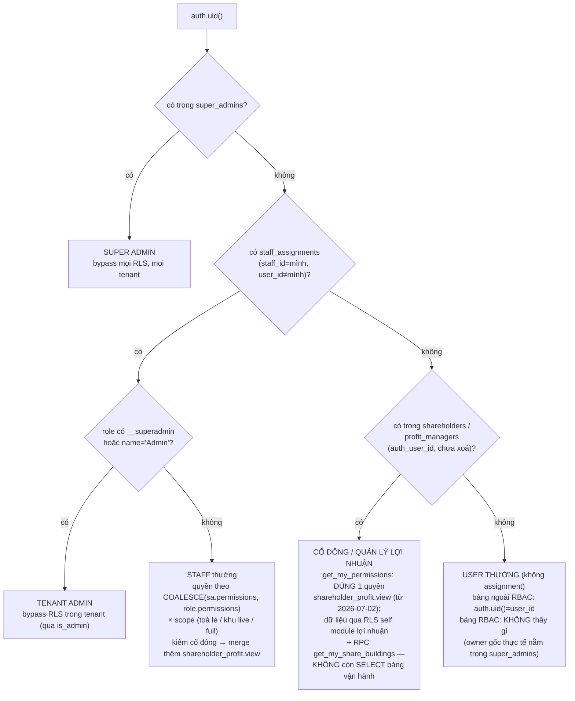
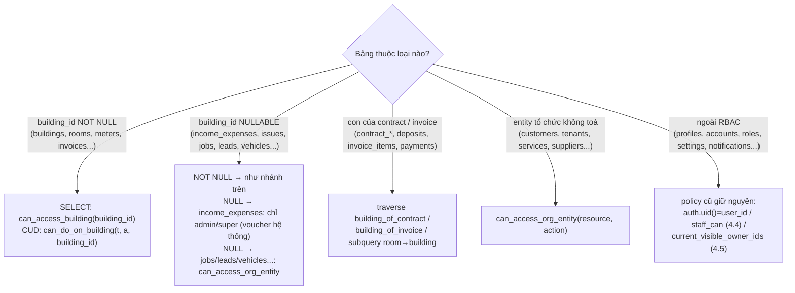
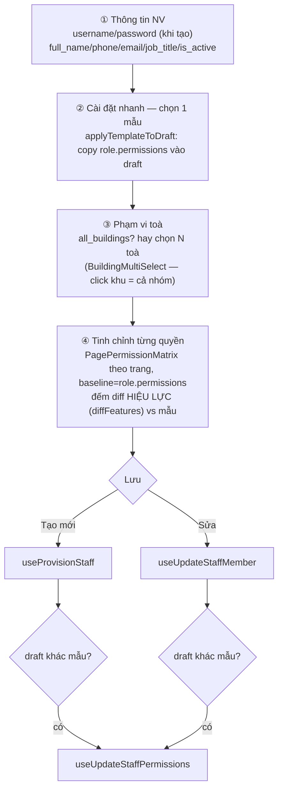

# Phân quyền & Nhân sự (Auth · Roles · Staff · RLS)

> Đây là **lõi phân quyền** của toàn hệ thống. Mọi domain khác (hợp đồng, hoá đơn,
> thu chi, báo cáo…) đều dựa vào các hàm RLS và bảng mô tả ở file này để quyết
> định "ai thấy gì, ai sửa được gì". Đọc kỹ phần 4 (RPC/RLS) trước khi đọc tài
> liệu các domain khác.
>
> Kèm theo: [Audit phân quyền toàn hệ thống 2026-07-02](docs/he-thong/phan-quyen-audit.md)
> — bản đối chiếu **DB production live** (pg_policies + pg_get_functiondef) với
> danh sách phát hiện 🔴/🟡/🟢; đọc nó khi cần biết trạng thái THẬT trên prod
> thay vì mô hình thiết kế ở đây.

---

## 1. Tổng quan & vai trò nghiệp vụ

Hệ thống là **multi-tenant mềm trên Supabase**: dữ liệu của nhiều "chủ" cùng nằm
trong một database, RLS (Row Level Security) là biên giới ngăn cách. Có 3 cấp
chủ thể:

| Cấp | Là ai | Cách nhận diện trong DB | Quyền |
|-----|-------|--------------------------|-------|
| **Super admin** | Người vận hành nền tảng / chủ tài khoản gốc | có row trong `super_admins` | Bypass **mọi** RLS, **mọi** tenant, mọi bảng. |
| **Owner** (chủ dữ liệu / tenant) | 1 `user_id` sở hữu dữ liệu | xuất hiện ở cột `user_id` của các bảng nghiệp vụ; **không** là staff của ai | Trên 63 bảng đã RBAC-hoá, policy owner `auth.uid() = user_id` đã bị **drop** (batch F, xem 4.3) — owner gốc vẫn toàn quyền vì nằm trong `super_admins` (và có self-assignment role Super Admin từ seed). `auth.uid() = user_id` chỉ còn trên các bảng **ngoài RBAC** (profiles, accounts, roles, staff_assignments, settings, notifications…). User mới không có `staff_assignments` và không trong `super_admins` → **không thấy gì** trên bảng nghiệp vụ (chủ ý, ghi rõ trong comment migration `20260527000054`). |
| **Staff** (nhân viên) | Người được owner thuê | có row trong `staff_assignments` với `staff_id = mình, user_id = owner` | Quyền **giới hạn** theo (1) role/permissions và (2) phạm vi toà nhà được giao. |

Điểm mấu chốt của mô hình:

- **RLS bảng nghiệp vụ keyed theo TOÀ, không theo owner** (từ đợt refactor RBAC
  2026-05-27/28): policy chuẩn của mỗi bảng là `<t>_select/insert/update/delete_rbac`
  gọi `can_access_building` / `can_do_on_building` / `can_access_org_entity`
  (mục 4.3). Các policy owner-keyed cũ và `*_staff_*` (qua `staff_can`) đã bị drop
  trên 63 bảng — `staff_can` chỉ còn hiệu lực trên `accounts`/`settings`/
  `notifications` (mục 4.4).

- **`roles` là TEMPLATE permissions, không phải role gắn cứng.** Khi gán nhân
  viên, permissions JSONB của role được **COPY snapshot** vào
  `staff_assignments.permissions`. Sau đó owner có thể tick/untick từng quyền cho
  riêng một nhân viên mà **không** ảnh hưởng template hay nhân viên khác. Đây là
  cơ chế **2 tier**:
  - **Tier 1** — chọn template (Super Admin / Quản Lý Tòa / Partner / Viewer).
  - **Tier 2** — tinh chỉnh per-staff trên `staff_assignments.permissions`.
- **Phạm vi toà nhà** là chiều kiểm soát thứ hai, độc lập với permissions. Một
  nhân viên có quyền `contracts.edit` vẫn chỉ sửa được hợp đồng ở các toà được
  giao (qua `staff_assignments.building_id`).
- Hiện tại hệ thống chạy theo mô hình **single-org**: đăng ký công khai đã đóng
  ([Register.tsx](src/pages/auth/Register.tsx)), tài khoản mới chỉ tạo qua trang
  admin hoặc trang phân quyền. `super_admins` được seed sẵn 1 tài khoản gốc.

Domain này nằm ở **đầu vòng đời nghiệp vụ**: trước khi một lead/cọc/hợp đồng/chỉ
số/hoá đơn/thu chi/báo cáo được tạo hay xem, hệ thống phải biết caller là ai và
được phép gì. Mọi RPC/RLS ở các domain sau đều gọi xuống các helper định nghĩa
tại đây.

---

## 2. Cấu trúc dữ liệu

### 2.1 `profiles` — hồ sơ người dùng (1-1 với `auth.users`)

- **Mục đích**: lưu thông tin hiển thị + thông tin nhân sự mở rộng cho mỗi tài
  khoản auth. `id` = `auth.users.id` (cùng UUID, quan hệ 1-1).
- **Cột chủ chốt**:
  - `full_name` (NOT NULL) — tên hiển thị; trigger `handle_new_user` luôn điền
    một giá trị (full_name → username → local-part email → `'User'`).
  - `phone`, `email` — định danh phụ. **Lưu ý**: `email` ở đây là email *thật*
    của người dùng; các email tổng hợp dạng `…@username.ihomecrm.local` hoặc
    `…@phone.ihomecrm.local` (dùng cho Supabase Auth) bị trigger lọc bỏ → NULL.
  - `avatar_url` — ảnh đại diện (bucket `avatars`).
  - `department`, `job_title`, `employee_code` — thông tin nhân sự mở rộng (thêm
    ở migration `20260502000001`).
  - `is_active` (NOT NULL, default true) — cờ khoá nhân viên. UI hiển thị badge
    "Khoá" khi false; dropdown chọn người phụ trách lọc bỏ user `is_active=false`.
  - `company_name`, `address`, `default_payment_due_days`, `timezone`,
    `language`, `subscription_plan`, `subscription_expires_at` — cấu hình tenant
    cấp owner (phần lớn chỉ owner dùng).
  - `id`, `created_at`, `updated_at` — khoá + audit.
- **RLS đáng chú ý** (migration `20260502000001`): `profiles_select_via_staff_assignments`
  cho đọc **2 chiều** — owner thấy profile staff mình quản VÀ staff thấy profile
  owner mình phục vụ; nhờ vậy dropdown "người phụ trách"
  ([useStaffUsers](src/hooks/useStaffUsers.ts), lọc `is_active` client-side) hoạt
  động cho cả staff. Kèm `profiles_admin_insert` / `profiles_admin_update` (owner
  tạo/sửa profile staff mình quản lý). Từ 2026-06/07 thêm 2 policy SELECT
  **additive**:
  - `profiles_select_same_team` ([20260619120000](supabase/migrations/20260619120000_teams.sql)) —
    thành viên **cùng đội** thấy profile nhau qua helper `same_team()` (xem 4.11);
    phục vụ ô "Người nhận" khi bàn giao tiền mặt.
  - `profiles_select_super_admin` ([20260701150000](supabase/migrations/20260701150000_profiles_super_admin_visible.sql)) —
    **mọi** authenticated thấy profile của super admin (chủ) qua helper
    `is_user_super_admin(id)`; vá vụ nhân viên KHÁC đội (Joey) không thấy CHỦ
    trong ô "Người nhận" dù guard backend cho phép nộp tiền cho super admin
    (commit 792e61c). Chỉ lộ đúng profile của chủ.
- **Quan hệ FK (được tham chiếu)**: nhiều bảng nghiệp vụ trỏ tới `profiles.id`
  để chỉ "người phụ trách": `asset_maintenance.assigned_to`,
  `departments.manager_id`, `issues.assigned_to`/`reported_by_staff_id`,
  `jobs.assignee_id`, `leads.assigned_staff_id`.

### 2.2 `roles` — template phân quyền

- **Mục đích**: mẫu permissions tái sử dụng. Có 4 template hệ thống
  (`is_system=true`) + template tuỳ chỉnh do owner tạo.
- **Cột chủ chốt**:
  - `user_id` (NOT NULL) — owner sở hữu template (single-org: owner gốc).
  - `name` (NOT NULL) — tên mẫu; UNIQUE theo `(user_id, name)`. 4 tên hệ thống:
    `Super Admin`, `Quản Lý Tòa`, `Partner`, `Viewer`.
  - `permissions` (jsonb, default `[]`) — **bản đồ quyền** dạng
    `{ "<module>": { "<action>": true, … }, … }`. Riêng Super Admin chứa sentinel
    `{"__superadmin": true}` → mọi quyền true.
  - `is_system` (default false) — true với 4 template chuẩn (không cho sửa/xoá ở
    UI, chỉ "nhân bản").
  - `description` — mô tả mẫu.
- **Quan hệ FK (được tham chiếu)**: `staff_assignments.role_id`,
  `user_roles.role_id`.

### 2.3 `staff_assignments` — gán nhân viên ↔ owner ↔ toà ↔ role

- **Mục đích**: bảng **trung tâm** của phân quyền. Một row = "nhân viên `staff_id`
  làm cho owner `user_id`, role `role_id`, scope toà `building_id`". Nhân viên
  quản lý nhiều toà → nhiều row (cùng `staff_id`).
- **Cột chủ chốt**:
  - `staff_id` (NOT NULL) — `auth.users.id` của nhân viên.
  - `user_id` (NOT NULL) — owner thuê nhân viên này (chủ dữ liệu).
  - `role_id` (NOT NULL → `roles.id`) — template đang áp (chỉ để badge UI biết
    "mẫu hiện hành").
  - `building_id` (nullable → `buildings.id`) — toà lẻ được giao (snapshot).
  - `area_id` (nullable → `areas.id`, thêm 2026-06-11 [20260611110000](supabase/migrations/20260611110000_staff_assignments_area_scope.sql)) —
    **scope theo KHU VỰC, LIVE**: row có `area_id` = nhân viên có quyền trên MỌI
    toà thuộc khu **tại thời điểm query** (helper join `area_buildings`) — thêm/bớt
    toà khỏi khu là phạm vi tự đổi, không snapshot. FK `ON DELETE RESTRICT` +
    trigger `areas_guard_soft_delete` chặn xoá khu đang được dùng làm phạm vi.
  - **Ngữ nghĩa row** (CHECK `building_id IS NULL OR area_id IS NULL`):
    `building_id` set = toà lẻ; `area_id` set = khu live; **cả hai NULL = quản lý
    TẤT CẢ toà** (full scope). ⚠️ Quy ước full-scope trong mọi hàm RLS từ
    2026-06-11 là `(building_id IS NULL AND area_id IS NULL)` — nếu chỉ test
    `building_id IS NULL` sẽ nhầm row khu thành full quyền.
  - `permissions` (jsonb, nullable) — **snapshot quyền per-staff** (Tier 2). Copy
    từ `role.permissions` khi áp template; `NULL` = chưa override → RPC fallback
    về `role.permissions`. Có GIN index `idx_staff_assignments_permissions`.
  - `id`, `created_at`, `updated_at` — khoá + audit.
- **Constraint & index**: `staff_assignments_unique_staff_building` —
  **UNIQUE `(staff_id, building_id)`** (migration `20250101000008`), nền của toast
  lỗi 23505 "Nhân viên đã được gán cho toà nhà này" trong hooks. ⚠️ Postgres coi
  `NULL ≠ NULL` nên 2+ row full-scope (`building_id IS NULL`) của cùng staff
  **không** bị chặn — dữ liệu bẩn kiểu này làm `get_my_permissions` chọn row tuỳ
  `created_at` (xem 4.7). Index thường theo `user_id`/`staff_id`/`role_id`/
  `building_id` — đủ cho các EXISTS trong helper RLS.
- **Quan hệ FK (đi ra)**: `role_id → roles.id`, `building_id → buildings.id`
  (sang domain Bất động sản).

### 2.4 `super_admins` — danh sách bypass toàn cục

- **Mục đích**: denylist-style table cấp quyền god-mode xuyên tenant. `is_super_admin()`
  chỉ kiểm tra `auth.uid() ∈ super_admins`.
- **Cột**: `user_id` (PK → `auth.users.id`, ON DELETE CASCADE), `note`,
  `created_at`. Seed sẵn tài khoản gốc.
- RLS: chỉ super admin tự đọc/sửa bảng này.

### 2.5 `user_roles` — (legacy) gán role trực tiếp cho user

- **Mục đích**: bảng cũ map `user_id ↔ role_id`. Mô hình hiện hành đã chuyển sang
  `staff_assignments` (có thêm scope toà + snapshot permissions), nên `user_roles`
  gần như **không còn dùng** trong flow chính. Vẫn giữ FK `role_id → roles.id`.
- **Cột**: `user_id`, `role_id`, `assigned_by` (ai gán), `id`, `created_at`.

### 2.6 `departments` — phòng ban (danh mục nhân sự)

- **Mục đích**: danh mục phòng ban của tổ chức, dùng phân loại nhân viên và gắn
  vào issues/job_types.
- **Cột chủ chốt**: `user_id` (owner), `code` + `name` (NOT NULL),
  `manager_id → profiles.id` (trưởng phòng), `phone`, `email`,
  `is_active`, audit.
- **Quan hệ FK (được tham chiếu)**: `issues.department_id`,
  `job_types.default_department_id` (sang domain Vận hành/Công việc).

### 2.7 `account_shared_users` — chia sẻ quyền dùng 1 sổ quỹ

- **Mục đích**: cho phép nhiều user cùng thao tác trên **một sổ quỹ** (`accounts`)
  ngoài chủ sổ. Liên quan trực tiếp domain Sổ quỹ / Thu chi.
- **Cột**: `account_id (NOT NULL → accounts.id)`, `user_id` (người được chia sẻ),
  `created_by` (ai chia sẻ), `id`, `created_at`.
- **Quan hệ FK (đi ra)**: `account_id → accounts.id` (sang domain Sổ quỹ).

### 2.8 `teams` / `team_members` — Đội ngũ (thêm 2026-06-19)

Migration [20260619120000_teams.sql](supabase/migrations/20260619120000_teams.sql)
(commit 978a157). Nhóm nhân viên thành **đội** để (1) thấy profile nhau và
(2) chỉ bàn giao tiền mặt **nội đội** — xem quy tắc ở 4.11.

- **`teams`**: `user_id` (chủ sở hữu đội, trigger `set_user_id_from_auth` tự gán),
  `name` (NOT NULL), `description`, `deleted_at` (soft-delete), audit.
- **`team_members`** (N-N người ↔ đội): `team_id → teams.id` (CASCADE),
  `member_id → auth.users.id` (người trong đội), `user_id` (chủ — denormalize để
  RLS khỏi join `teams`), UNIQUE `(team_id, member_id)`.
- **RLS**: chủ (`user_id = auth.uid()`) + super admin toàn quyền ghi; SELECT thêm
  cho chính thành viên và đồng đội (qua `same_team()`), admin. **Đội này không
  thấy đội kia**. `REVOKE ALL … FROM anon`.
- **FE**: [useTeams](src/hooks/useTeams.ts) (`useTeams` / `useSaveTeam` /
  `useDeleteTeam`) + tab "Đội ngũ" trong [TeamsTab](src/components/staff/TeamsTab.tsx)
  ở `/settings/staff` (xem 5.2).

### 2.9 Enum liên quan

Domain này **không** sở hữu enum riêng (các bảng dùng `boolean`/`jsonb`/`text`).
Permissions không phải enum mà là JSONB tự do với khoá module/action do FE quy
định trong [permissions.ts](src/lib/permissions.ts).

- **Registry (redesign 2026-06-11, cập nhật đến 2026-07-02)**: `PERMISSION_GROUPS`
  có **39 module trong 9 nhóm UI**, tổng **208 khoá** quyền `module.action`.
  Module mới đợt 06-11: `thu_tien` (trang Thu tiền mobile, FE-only), `materials`
  (Vật tư — RLS đã dùng khoá này từ trước nhưng registry cũ THIẾU), `users`
  (trang Phân quyền — trước là khoá "ma", nay là module thật cấp được qua
  matrix). Module thêm sau đó: `chat_zalo` (nhóm UI mới "Kênh chat"; actions
  `view · send · manage_automation · manage_templates`, DB guard qua `zalo_can()`)
  và `salary` (Bảng lương quản lý, 2026-06-27; actions `view · lock · unlock ·
  distribute · manage_salary · export`). Một số module đổi bộ action:
  `sale_phong`/`shareholder_profit`/`salary`/`thu_tien`/`chat_zalo`/`reports_*`
  bỏ CRUD chuẩn, dùng action chi tiết riêng (`ModuleDef.core` override).
- **Action chi tiết theo chức năng**: ngoài 4 action chuẩn + extras cũ
  (`record_payment · approve · print · export · all_buildings · create_deposit`),
  registry thêm ~50 action mới: vòng đời HĐ (`renew · transfer · terminate ·
  handover`), cọc (`convert · refund`), hoá đơn (`cancel`), thu tiền (`collect ·
  undo · report`), lợi nhuận (`lock · unlock · distribute · manage_shareholders`),
  sale phòng (`manage_tokens · manage_settings · manage_images ·
  edit_floor_plan · manage_pass_listings · view_analytics · create_deposit`),
  thu chi hạn chế (`restricted_create · restricted_view` — RLS RESTRICTIVE thật
  ở DB, xem doc Thu chi), tài sản (`move · maintain`), từng báo cáo riêng lẻ
  (8 BC BĐS + 12 BC tài chính, gồm `handover_report · reconcile ·
  collection_cycle` thêm 2026-07-01), v.v.
- **Catalog theo TRANG**: [permissionPages.ts](src/lib/permissionPages.ts) là
  nguồn sự thật cho UI phân quyền mới — `PAGE_GROUPS` (**10 nhóm × 39 trang**),
  mỗi trang liệt kê từng chức năng (`PageFeature` gồm `tier` view/manage/elevated
  + `fallback` legacy). **Fallback legacy**: JSONB cũ chưa có key chi tiết →
  `canFeature`/`canUse` rơi về quyền gốc (vd `contracts.renew` rơi về
  `contracts.edit`; `thu_tien.*` rơi về `invoices.record_payment`) nên nhân viên
  hiện hữu không mất quyền. Test bất biến (catalog phủ đủ registry, fallback,
  preset) ở [permissionPages.test.ts](src/lib/__tests__/permissionPages.test.ts).
- **Diff "khác mẫu"** từ 2026-06-11 so theo **giá trị hiệu lực** từng chức năng
  (`diffFeatures`), không so key thô — tránh diff ảo khi staff materialize key
  chi tiết mà template cũ chưa có.

---

## 3. Sơ đồ quan hệ dữ liệu

### Cây phân loại caller (FE & RLS đều dựa vào đây)

> Lưu ý: `get_my_permissions()` trả sentinel `__superadmin` cho nhánh "user
> thường" (mở khoá FE), nhưng RLS trên các bảng RBAC vẫn chặn — FE mở mà DB đóng.

---

## 4. Quy tắc nghiệp vụ & tự động hoá

Tất cả helper RLS là **`SECURITY DEFINER`** + `STABLE` + `SET search_path =
public` (để bypass RLS của chính bảng `staff_assignments`/`super_admins` khi
kiểm tra, tránh đệ quy vô hạn). Được `GRANT EXECUTE` cho `authenticated`/`anon`/
`service_role`.

### 4.1 Trigger `handle_new_user()` — tạo profile khi đăng ký

Định nghĩa: [20260502000001_fix_user_provision_flow.sql](supabase/migrations/20260502000001_fix_user_provision_flow.sql).

- **Khi nào chạy**: `AFTER INSERT ON auth.users` (mỗi lần Supabase tạo auth user,
  kể cả khi admin provision nhân viên qua `signUp`).
- **Làm gì**: đọc `raw_user_meta_data` (full_name, username, phone, email,
  department, job_title, employee_code, is_active) → INSERT vào `profiles`.
  - `full_name`: coalesce `full_name → username → split_part(email,'@',1) → 'User'`.
  - `phone`: regex `^[0-9]{10,11}$`, sai định dạng → NULL.
  - `email`: ưu tiên email trong metadata; nếu trống mới dùng `NEW.email`
    **và chỉ khi** nó không phải synthetic (`NOT LIKE '%@%.ihomecrm.local'`).
  - `ON CONFLICT (id) DO NOTHING` — re-signup vô hại.
- **Bất biến**: mỗi `auth.users` có đúng 1 `profiles`; email synthetic không bao
  giờ lọt vào `profiles.email`.

### 4.2 `is_super_admin()` & `is_admin()` — 2 tầng bypass

[20260506000003_super_admin_tier.sql](supabase/migrations/20260506000003_super_admin_tier.sql),
[20260506000002_admin_bypass_rls.sql](supabase/migrations/20260506000002_admin_bypass_rls.sql).

- `is_super_admin()` → `auth.uid() ∈ super_admins`. Mỗi bảng RLS-enabled có policy
  `<t>_super_admin_all FOR ALL USING (is_super_admin())` — Postgres OR-merge nên
  super admin luôn pass mọi SELECT/INSERT/UPDATE/DELETE, **xuyên tenant**.
- `is_admin()` → tồn tại `staff_assignments` của caller với role thoả
  `permissions @> '{"__superadmin": true}'` **HOẶC** `role.name = 'Admin'`. Tạo
  policy `<t>_admin_all` tương tự nhưng chỉ "god-mode trong tenant" (vì check qua
  chính staff_assignments → giới hạn ở dữ liệu owner mà họ phục vụ).
- **Lý do tồn tại**: trước đây write vẫn check `auth.uid() = user_id`, khiến admin
  sửa dữ liệu do staff tạo → UPDATE khớp 0 row, PostgREST trả 204 "fake success".
  2 policy bypass này vá lỗ hổng đó.

  > ⚠️ `is_admin()` **không** OR `is_super_admin()`: một tài khoản chỉ có row trong
  > `super_admins` nhưng KHÔNG có staff_assignment role-admin sẽ bị
  > [AdminOnlyRoute](src/components/auth/AdminOnlyRoute.tsx) (guard FE gọi
  > `is_admin()` — xem 4.8/5.3) chặn khỏi `/admin/users` dù DB cho phép mọi thứ.
  > Hiện chưa lộ vì owner gốc tình cờ có self-assignment role Super Admin (seed
  > `20260529000002`), nhưng thêm super admin "thuần" thứ 2 sẽ gặp.

### 4.3 RBAC theo toà — engine RLS hiện hành (`*_rbac`)

Cụm migration `20260527000007/8/9` + `20260527000053/54/55` + `20260528000001-3`
(2026-05-27/28) chuyển toàn bộ RLS bảng nghiệp vụ từ **owner-keyed** sang
**building-keyed**. Batch F
([20260528000003_rbac_batch_f_drop_legacy.sql](supabase/migrations/20260528000003_rbac_batch_f_drop_legacy.sql))
drop sạch policy owner cũ ("Users can … own …") và `*_staff_*`/`*_select_staff`
trên **63 bảng**; mỗi bảng giờ chỉ còn `<t>_select/insert/update/delete_rbac` +
`<t>_admin_all` + `<t>_super_admin_all` (+ `*_shared` của sổ quỹ). Các bảng
**ngoài RBAC** (profiles, accounts, account_shared_users, roles, super_admins,
staff_assignments, user_roles, notifications, settings, departments…) giữ policy
cũ — xem 4.4/4.5.

4 nhóm helper chính (gốc:
[20260527000053_rbac_helpers.sql](supabase/migrations/20260527000053_rbac_helpers.sql) —
riêng `can_access_org_entity` gốc ở
[20260527000009_rbac_phase5_misc.sql](supabase/migrations/20260527000009_rbac_phase5_misc.sql);
Tier-2 aware từ
[20260529000001_per_staff_permissions.sql](supabase/migrations/20260529000001_per_staff_permissions.sql);
bản hiện hành của `can_do_on_building` — 3 nhánh scope toà lẻ/khu-live/full + Tier 2 — ở
[20260611110000_staff_assignments_area_scope.sql](supabase/migrations/20260611110000_staff_assignments_area_scope.sql);
bản hiện hành của `can_access_building` ở
[20260701170000_shareholder_scope_split.sql](supabase/migrations/20260701170000_shareholder_scope_split.sql)):

| Helper | Dùng cho | Logic |
|--------|----------|-------|
| `can_access_building(b)` | SELECT | super/admin pass; staff pass nếu có row full-scope (`building_id IS NULL AND area_id IS NULL`), row `building_id = b`, hoặc row **khu live** (`area_id` có `b` trong `area_buildings`); **quản lý lợi nhuận** (`profit_managers`) pass các toà gắn qua `profit_manager_salary_buildings`. ⚠️ **Nhánh cổ đông đã BỎ** 2026-07-02 ([20260701170000](supabase/migrations/20260701170000_shareholder_scope_split.sql), commit 3cd0d90) — cổ đông không còn SELECT được 32 bảng vận hành của toà góp vốn; dữ liệu lợi nhuận đi qua RLS self của module Cổ đông (xem 4.7 và doc 12). |
| `can_do_on_building(t, a, b)` | INSERT/UPDATE/DELETE | super/admin pass; staff cần row scope khớp **và** `COALESCE(sa.permissions, r.permissions) -> t ->> a = true` — tức **override Tier 2 được enforce ngay ở DB**. |
| `can_access_org_entity(r, a)` | entity không gắn toà (customers, tenants, services, suppliers, hotlines, templates…) | như trên nhưng **không** check building. |
| `building_of_contract / building_of_invoice / building_of_payment(id)` | traversal | trả `building_id` qua chain FK cho bảng con (contract_*, deposits, invoice_items, payments…). |

Pattern policy theo loại bảng:

Quy ước & điểm cần nhớ:

- **contracts** scope qua chain `contract → room → building` (subquery trong
  policy; bảng con dùng `building_of_contract`). RPC vòng đời hợp đồng
  (renew/transfer/terminate_*) cũng kiểm `can_do_on_building('contracts','edit',
  room→building)` trong wrapper trước khi gọi `*_impl`, REVOKE anon
  (`20260601000100`).
- **`income_expenses.building_id IS NULL` = voucher hệ thống** — chỉ super
  admin/admin truy cập ([20260527000054](supabase/migrations/20260527000054_rbac_phase2_policies_invoices_payments_ie.sql)).
- **vehicles** hybrid: `building_id NOT NULL` → `can_do_on_building`; NULL →
  `can_access_org_entity('vehicles', …)`.
- **customers/tenants** dùng `can_access_org_entity('customers', …)` — **không có
  scope toà** ở RLS (xem bất biến bên dưới).
- **areas**: SELECT pass nếu super/admin, staff full-scope, hoặc được giao ≥1
  building thuộc area; **INSERT/UPDATE/DELETE yêu cầu staff FULL-SCOPE**
  (`sa.building_id IS NULL`) + quyền `areas.*` — staff giới hạn toà không bao giờ
  tạo/sửa khu vực ([20260527000008](supabase/migrations/20260527000008_rbac_phase4_buildings_rooms.sql)).
- Mapping `tbl → perm_key` vẫn như mô hình cũ: nhiều bảng vật lý chia sẻ 1 khoá
  quyền (`contract_extensions/terminations/transfers` → `'contracts'`;
  `payments` → `'invoices'`; `issues/jobs/job_groups/task_flows` → `'tasks'`…).

**Perf RLS đợt 2026-07-02 — initplan wrap + set-based SELECT** (commit 86c01a5,
[20260702150000_rls_initplan_setbased_select.sql](supabase/migrations/20260702150000_rls_initplan_setbased_select.sql)).
Nguyên nhân đo được trên prod (staff scoped): policy gọi hàm **từng dòng** —
Postgres không hoist hàm STABLE, mỗi row lại chạy `is_admin()`/
`can_access_building(cột)` (mỗi lần = 2 check + 2 EXISTS) → trang chậm 2–16s.
Hai fix, **ngữ nghĩa giữ nguyên**:

1. **Initplan wrap**: TOÀN BỘ policy `<t>_admin_all` / `<t>_super_admin_all`
   (FOR ALL, ~170 policy trên live, ALTER động qua `pg_policies`) đổi
   `USING (is_admin())` → `USING ((SELECT is_admin()))` — thành InitPlan chạy
   **1 lần/statement** (pattern chuẩn Supabase `auth_rls_initplan`).
2. **Set-based rewrite** `*_select_rbac` của **9 bảng nóng** (`invoices ·
   invoice_items · payments · contracts · contract_customers · rooms ·
   buildings · area_buildings · income_expenses`): thay
   `can_access_building(<cột dòng>)` per-row bằng
   `(SELECT has_full_building_scope()) OR <cột> IN (SELECT accessible_building_ids())`
   (bảng con dùng `accessible_invoice_ids()`/`accessible_room_ids()`/
   `accessible_contract_ids()`) — subquery uncorrelated → Hashed SubPlan build
   1 lần. Đúng phép tách `v_priv`/`v_bids` đã verify ở
   `get_invoice_statistics_v2` (403ms→22ms, `20260630120000`).

Helper mới (STABLE SECURITY DEFINER, mirror ĐÚNG các nhánh
`can_access_building` bản 20260701170000 — không cổ đông):
`has_full_building_scope()` ≡ super/admin/staff-full-scope;
`accessible_building_ids()` ≡ toà gán trực tiếp ∪ toà theo khu ∪ toà hưởng
lương LN. ✅ **Quy ước cho policy/RPC mới**: tái dùng cặp helper này (hoặc ít
nhất bọc `(SELECT fn())`) thay vì gọi `can_access_building` per-row;
`can_access_building` vẫn là chuẩn ngữ nghĩa và là bản rollback (nguyên văn
USING cũ ghi cuối migration). Chỉ SELECT policy được rewrite — policy
insert/update/delete, RESTRICTIVE (hạng mục hạn chế) và self/share giữ nguyên.

**Bất biến**: staff được tick N toà chỉ ghi được dữ liệu trong N toà đó (qua
`can_do_on_building`) — đúng cho mọi bảng building-keyed (contracts, invoices,
vehicles có toà…). **Ngoại lệ chủ ý phải nhớ**: các entity org-level đi qua
`can_access_org_entity` (đặc biệt `customers`) — staff có `customers.edit` sửa
được **mọi** khách của tenant bất kể toà.

### 4.4 `staff_can(_table, _action, _owner)` — legacy, chỉ còn 3 bảng

[20260510000056_staff_write_rls.sql](supabase/migrations/20260510000056_staff_write_rls.sql).

- True khi caller có `staff_assignments` trỏ tới `_owner` mà **role** thoả 1 trong:
  `__superadmin` / `name='Admin'` / `(role.permissions -> _table ->> _action) = true`.
- Trước batch F là động cơ của mọi write-policy staff (`<t>_staff_insert/update/
  delete` trên ~40 bảng). Sau batch F, các policy đó chỉ còn trên các bảng **bị
  loại khỏi RBAC**: `accounts` (perm key `'cashbooks'`), `settings`,
  `notifications`. Mọi bảng khác đã chuyển sang `*_rbac` (4.3).

  > ⚠️ **Lỗ hổng Tier 2 trên 3 bảng còn lại**: `staff_can()` chỉ đọc
  > `role.permissions` (KHÔNG `COALESCE(sa.permissions, …)`). Owner untick
  > `cashbooks.create` cho 1 nhân viên → FE ẩn nút (vì `get_my_permissions` trả
  > override) nhưng gọi API trực tiếp vẫn INSERT được sổ quỹ, vì role template
  > vẫn cấp quyền. Fix gọn: sửa `staff_can` đọc `COALESCE(sa.permissions,
  > r.permissions)` (giống `can_do_on_building`) hoặc RBAC-hoá nốt 3 bảng.

### 4.5 Các helper visibility cũ — trạng thái sau batch F

Các policy `*_select_staff` (đọc theo owner-set) đã bị drop trên 63 bảng; SELECT
nghiệp vụ hiện đi qua `*_select_rbac` (4.3). Tình trạng từng helper:

| Helper | Trạng thái | Còn dùng ở |
|--------|-----------|------------|
| `current_visible_owner_ids()` ([20260506000004](supabase/migrations/20260506000004_tenant_symmetric_visibility.sql): mình + owner mình phục vụ + staff của mình + co-staff) | còn sống | policy trên các bảng **ngoài RBAC** (`accounts`, `notifications`, `roles`, `settings` — comment giữ-lại trong `20260528000004`); `invoice_audit_log_select_visible`; storage policy "Tenant can read shared templates" (bucket `document-templates`). |
| `is_staff_of` / `staff_building_scope` | mồ côi | chỉ còn định nghĩa trong [migrations-bundle/20260427_apply_staff_visibility.sql](supabase/migrations-bundle/20260427_apply_staff_visibility.sql); không policy nào tham chiếu. |
| `staff_in_building` / `customer_in_my_scope` ([20260518000051](supabase/migrations/20260518000051_staff_building_scope_writes.sql)) | mồ côi | function vẫn tồn tại nhưng các policy contracts/vehicles/customers dùng chúng đã bị drop ở batch F. Logic tương đương sống tiếp ở FE qua [useMyBuildingScope](src/hooks/useMyBuildingScope.ts). |
| `get_my_assignments()` (cùng `20260518000051`) | còn sống | RPC cho FE — `useMyBuildingScope` dùng để ẩn nút action theo toà (4.8). |

- View `accounts_with_balance` vẫn `security_invoker = true` (tôn trọng RLS,
  từ `20260506000004`) — điểm này không đổi.
- Lưu ý **jobs**: từng bị siết SELECT về creator/assignee
  (`20260526000001_jobs_scope_owner_or_assignee`), nhưng batch F đã drop policy
  đó — hiện `jobs_select_rbac` (theo toà / org-entity `'tasks'`) là policy SELECT
  duy nhất. Doc Vận hành nào còn ghi "chỉ creator/assignee thấy job" cần soát lại.

### 4.6 Quyền `income_expenses.all_buildings` — vượt scope toà trong form thu chi

[20260603000002_ie_all_buildings_permission.sql](supabase/migrations/20260603000002_ie_all_buildings_permission.sql)
+ siết lại ở [20260603000003_ie_all_buildings_scope_own.sql](supabase/migrations/20260603000003_ie_all_buildings_scope_own.sql).

- **Cờ phạm vi** trong JSONB permissions (role hoặc per-staff):
  `{"income_expenses": {"all_buildings": true}}` — cho phép staff (vd kế toán)
  XEM + GHI phiếu thu chi cho **mọi toà của chủ**, CHỈ trong module Thu chi;
  toà/phòng ở các module khác vẫn khoá theo toà quản lý.
- 2 helper SECURITY DEFINER, đều đọc `COALESCE(sa.permissions, r.permissions)`
  (Tier-2 aware): `ie_all_buildings_scope(b)` cho SELECT và
  `can_ie_all_buildings(action, b)` cho WRITE (cần thêm quyền
  `create/edit/delete` trên `income_expenses`).
- 8 policy **additive** trên `income_expenses` + `income_expense_items` (OR với
  RBAC thường). Migration `20260603000003` siết thêm `user_id = auth.uid()`:
  quyền này chỉ mở **phiếu do chính mình tạo** xuyên toà (đủ cho luồng
  `.insert().select()` RETURNING và sửa phiếu mình) — KHÔNG mở xem/sửa phiếu
  người khác; phiếu ở toà mình quản lý vẫn thấy/sửa đầy đủ qua RBAC thường.
- 2 RPC SECURITY DEFINER cấp dữ liệu dropdown cho form: `ie_form_buildings()`
  (kèm cờ `managed` để FE xếp toà quản lý lên đầu; điều kiện per-owner chống lộ
  tên toà của owner khác với staff đa-owner) và `ie_form_rooms(_building_id)`.
  FE: [useIncomeExpenseFormScope](src/hooks/useIncomeExpenseFormScope.ts) — form
  thu chi KHÔNG query buildings/rooms trực tiếp.
- Trang danh sách/ô lọc Thu chi **vẫn theo scope toà quản lý** (tên toà ngoài
  scope hiện "—") — phạm vi "mọi toà" gói gọn trong FORM, đúng chủ ý.

### 4.7 RPC cho FE: `get_my_context` & `get_my_permissions`

Hai RPC này tồn tại vì **RLS của `staff_assignments` chỉ cho owner đọc** → staff
không tự query được context/permissions của chính mình. Cả hai `SECURITY DEFINER`.

- **`get_my_context()`**
  ([20260516000011_get_my_context_default_area.sql](supabase/migrations/20260516000011_get_my_context_default_area.sql)):
  trả `{ is_super, is_staff, owner_id, default_area_id }`.
  - super admin → `is_super=true, owner_id=mình`.
  - staff → `is_staff=true, owner_id=owner`; **`default_area_id`** = area của owner
    có `name` (lowercase) khớp username staff (phần trước `@`, hoặc
    `raw_user_meta_data.username`).
  - owner thường → `owner_id=mình`, các cờ false.
  - ⚠️ **`default_area_id` đã DEPRECATED phía FE** (2026-06-10, commit 9ad626d):
    cơ chế "khoá filter khu vực theo quy ước ngầm username = tên khu"
    (`lockedAreaId` ở trang Hoá đơn) đã **gỡ** — scope staff vốn do RLS
    per-building quyết định, `BuildingMultiSelect` (nguồn `useBuildings` bị RLS
    cắt) tự nhiên chỉ hiện toà staff được quản. RPC vẫn trả field nhưng
    [useMyContext](src/hooks/useMyContext.ts) map ra `defaultAreaId` **không nơi
    nào dùng** nữa.

- **`get_my_permissions()`** (phiên bản mới nhất:
  [20260701170000_shareholder_scope_split.sql](supabase/migrations/20260701170000_shareholder_scope_split.sql),
  kế thừa [20260529000001_per_staff_permissions.sql](supabase/migrations/20260529000001_per_staff_permissions.sql)
  và bản cổ đông cũ `20260603000002`):
  trả JSONB permissions của caller theo thứ tự ưu tiên:
  1. super admin → sentinel `{"__superadmin": true}`.
  2. staff → `COALESCE(sa.permissions, role.permissions)` của assignment đầu tiên
     (ưu tiên row full-scope `building_id IS NULL`, rồi `created_at` sớm nhất) —
     tức **đã** tính tới override Tier 2.
  3. **cổ đông hoặc quản lý lợi nhuận** (`shareholders.auth_user_id` /
     `profit_managers.auth_user_id`, chưa xoá) → từ 2026-07-02 (commit 3cd0d90)
     chỉ còn **ĐÚNG 1 quyền** `{"shareholder_profit": {"view": true}}` — bộ
     ~20 module chỉ-xem + `personal_finance` của bản `20260603000002` đã **CẮT**.
     Nếu đồng thời là staff → **merge** `v_sh_perms || v_perms` (quyền staff giữ
     nguyên, chỉ cộng thêm cửa vào trang lợi nhuận). Muốn cổ đông xem thêm gì
     thì thêm vào TRANG chia LN, không mở module khác (comment trong migration).
  4. owner thật (không staff, không cổ đông, không quản lý) → sentinel `__superadmin`.
  - **Bất biến quan trọng**: cổ đông không-staff trước đây rơi vào nhánh "owner
    thật → superadmin bypass" gây lỗ hổng; nhánh (3) đóng lỗ hổng từ
    `20260603000002` và đến `20260701170000` siết tiếp về đúng 1 quyền —
    audit 2026-07-02 đã verify live: cổ đông thuần chỉ nhận
    `{"shareholder_profit":{"view":true}}`.
  - ⚠️ **Chỉ đọc 1 row**: với staff nhiều assignment, RPC lấy đúng 1 row (ưu tiên
    `building_id IS NULL`, rồi `created_at ASC`). Nếu các row của 1 staff lệch
    `permissions` (xem gotcha 5.2), quyền hiệu lực phụ thuộc thứ tự tạo row.

- **`get_my_share_buildings()`** (cùng `20260701170000`, SECURITY DEFINER, REVOKE
  anon): trả `id + name` các toà caller có cổ phần (`building_shareholders`) hoặc
  hưởng lương LN (`profit_manager_salary_buildings`). Tồn tại vì cổ đông đã mất
  quyền SELECT bảng `buildings` — trang chia LN cần TÊN TOÀ qua RPC này. FE:
  [useMyShareBuildings](src/hooks/useShareholders.ts).
- `get_my_permissions` đi kèm `can_do_on_building(_table,_action,_building_id)` và
  `can_access_org_entity(_resource,_action)` (4.3) — bản kiểm quyền có scope toà /
  không scope, đều đọc `COALESCE(sa.permissions, role.permissions)` (tôn trọng Tier 2).
- `can_access_building(_building_id)` (4.3) **không còn** nhánh cổ đông; nhánh
  còn lại ngoài staff là **quản lý lợi nhuận** (toà gắn trong
  `profit_manager_salary_buildings`).

### 4.8 Gate phía FE: RequirePermission · AdminOnlyRoute · useIsAdmin · useMyBuildingScope

Lớp guard route/UI mirror các helper DB (gate FE chỉ là UX — enforcement thật nằm
ở RLS/RPC):

- [RequirePermission](src/components/auth/RequirePermission.tsx) `(module,
  action="view")` — bọc route trong [App.tsx](src/App.tsx), redirect về `/` khi
  `can(perms, module, action)` false; dữ liệu từ
  [useMyPermissions](src/hooks/useMyPermissions.ts) (RPC `get_my_permissions`,
  staleTime 5 phút).

  > ✅ **Module "users" đã là module thật** (2026-06-11): có trong registry
  > (nhóm Cấu hình, actions view/create/edit/delete/manage_templates, tier
  > elevated) — owner có thể uỷ quyền quản lý nhân sự cho staff qua matrix.
  > Preset view/manage KHÔNG tự cấp module này (chỉ preset "all" hoặc tick tay).
  > Trong StaffPage, nút Thêm/Sửa/Xoá nhân viên gate theo `users.create/edit/
  > delete`; tab Mẫu phân quyền gate theo `users.manage_templates`.
  >
  > Từ 2026-06-11 `RequirePermission` check qua `canUse` (catalog + fallback
  > legacy) và **hầu hết route nghiệp vụ trong App.tsx đã được gate** theo
  > `module.view` (kể cả từng báo cáo riêng: `reports_finance.daily_cashbook`…).

- [AdminOnlyRoute](src/components/auth/AdminOnlyRoute.tsx) — guard `/admin/users`,
  dựa [useIsAdmin](src/hooks/useIsAdmin.ts) (mirror RPC `is_admin()`, staleTime
  5 phút). Xem caveat super-admin-"thuần" ở 4.2.
- [useMyBuildingScope](src/hooks/useMyBuildingScope.ts) — mirror scope toà qua RPC
  `get_my_assignments` + `useMyContext` + `useIsAdmin`: trả `canManageAll` /
  `buildingIds` (Set) / `hasAnyScope` / `canManageBuilding(b)` để ẩn nút
  Thêm/Sửa/Xoá theo toà trên các trang nghiệp vụ.

### 4.9 RPC quản trị nhân sự

- **`delete_staff_member(p_staff_id)`**
  ([20260502000002_delete_staff_member_rpc.sql](supabase/migrations/20260502000002_delete_staff_member_rpc.sql)):
  `DELETE FROM auth.users` (cascade xoá profiles + staff_assignments + dữ liệu
  do user sở hữu). Guard: caller phải đang quản lý target (`staff_assignments`
  với `user_id = auth.uid()`); **chặn tự xoá mình** (ERRCODE 42501). Mục đích:
  `auth.users` là single source of truth — xoá nửa vời (chỉ staff_assignments)
  để lại username chiếm chỗ + vẫn đăng nhập được.

  > ⚠️ Guard yêu cầu caller là **owner trực tiếp** của assignment
  > (`user_id = auth.uid()`), không nhận `is_admin`/`is_super_admin`. Tenant
  > admin vẫn thấy nút Xoá trên `/settings/staff` nhưng RPC sẽ 42501 vì mọi
  > assignment có `user_id` = owner gốc.

- Tạo tài khoản: 2 đường — (a) FE provision qua `supabase.auth.signUp` +
  insert `staff_assignments` (xem 5.2), (b) super admin gọi edge function
  `admin-create-user` từ [UsersPage](src/pages/admin/UsersPage.tsx).

### 4.10 4 template hệ thống

Seed tại [20260529000002_seed_system_role_templates.sql](supabase/migrations/20260529000002_seed_system_role_templates.sql):

| Template | permissions | Dùng cho |
|----------|-------------|----------|
| **Super Admin** | `{"__superadmin": true}` | Toàn quyền, bypass mọi check. |
| **Quản Lý Tòa** | full CRUD + duyệt trên ~30 module vận hành (riêng `areas`/`templates` chỉ `view`; `auto_debt`/`excess_amounts` chỉ `view`+`edit`) | Quản lý 1+ toà. |
| **Partner** | quản lý leads/cọc + xem BĐS, hợp đồng read-only | CTV/đối tác. |
| **Viewer** | mọi module chỉ `view` | Chỉ xem (read-only). |

`is_system=true` → UI không cho sửa/xoá, chỉ "Tạo bản sao". Migration này cũng
migrate role cũ (Admin→Super Admin — chính là **self-assignment của owner gốc**
nhắc ở 4.2, Manager→Quản Lý Tòa) và snapshot permissions vào mọi row
`staff_assignments`.

### 4.11 `same_team()` & Đội ngũ — visibility đồng đội + guard bàn giao

[20260619120000_teams.sql](supabase/migrations/20260619120000_teams.sql)
(commit 978a157, 2026-06-19; bảng xem 2.8).

- **`same_team(_target)`** — SECURITY DEFINER + `SET search_path = public`
  (bypass RLS của chính `team_members`, chống đệ quy): true khi caller và
  `_target` có chung ≥1 đội (`team_members a JOIN team_members b ON a.team_id =
  b.team_id`). GRANT cho `authenticated`/`service_role`, **không** anon.
- **Dùng ở 2 chỗ**:
  1. Policy `profiles_select_same_team` (additive trên `profiles`) — đồng đội
     thấy tên nhau → ô "Người nhận" trong
     [HandoverSheet](src/components/thu-tien/HandoverSheet.tsx) (`/thu-tien`,
     nguồn `useStaffUsers` đọc `profiles` theo RLS) hiện được đồng đội.
  2. Guard trong RPC **`create_cash_handover`**: sau bước xác thực người nhận,
     chặn `RAISE 'Người nhận không cùng đội với bạn'` nếu
     `NOT (is_super_admin() OR same_team(p_receiver_id))` — bàn giao tiền mặt
     chỉ nội đội, **trừ** nộp cho super admin (chủ).
- **Vá tiếp 2026-07-01** (commit 792e61c,
  [20260701150000](supabase/migrations/20260701150000_profiles_super_admin_visible.sql)):
  nhân viên KHÁC đội với chủ không thấy chủ trong ô "Người nhận" dù guard cho
  phép → thêm helper `is_user_super_admin(p_user)` + policy
  `profiles_select_super_admin` cho mọi authenticated thấy profile super admin.
- Lý do ra đời: trước Teams, ô "Người nhận" bàn giao rỗng vì `profiles` chỉ mở
  2 chiều owner↔staff — nhân viên không thấy nhân viên khác.

### 4.12 Quy tắc: trigger sinh mã trên bảng có RLS phải SECURITY DEFINER + advisory lock

[20260701000001_secdef_code_generators.sql](supabase/migrations/20260701000001_secdef_code_generators.sql)
(commit 13bf498, 2026-07-01) — **bug class** đã chứng minh trên prod:

- **Root cause**: trigger BEFORE INSERT sinh mã kiểu `MAX(...)+1`/`COUNT(...)+1`
  đọc chính bảng có RLS mà chạy SECURITY INVOKER (mặc định) → chạy dưới RLS của
  **caller**. Staff scoped chỉ thấy một phần bảng (vd nathan thấy 8/90 row
  `CSS2607…`) → MAX tính thiếu → sinh mã đã tồn tại → unique violation 23505 →
  **staff lưu fail trong khi chủ (is_admin, thấy hết) test không lộ lỗi**.
- **Fix pattern** (mẫu chuẩn có sẵn: `generate_job_code`): `SECURITY DEFINER`
  (SELECT nội bộ bỏ qua RLS, thấy đủ bảng) + `SET search_path = public` (chống
  hijack) + `pg_advisory_xact_lock(hashtext(<prefix logic>))` (serialize insert
  song song, chống race MAX+1).
- Đã áp cho **7 hàm**: `auto_generate_reading_code` (CSS — chính là bug được
  báo, kết hợp global MAX ở
  [20260630000001](supabase/migrations/20260630000001_fix_reading_code_global_unique.sql)),
  `set_material_purchase_code` / `set_material_usage_code` /
  `set_material_adjustment_code` (MP/MU/MA), `auto_generate_voucher_code`
  (PT/PC), `generate_template_code` (MT), `generate_invoice_number_v2`.
- ✅ **Quy ước**: mọi generator mã mới trên bảng có RLS PHẢI theo pattern này;
  test bằng tài khoản **staff scoped** (không phải chủ) mới lộ được lỗi.

---

## 5. Quy trình theo từng trang

### 5.1 `/login` · `/register` · `/forgot-password` · `/reset-password` — Auth

**[Login.tsx](src/pages/auth/Login.tsx)** — đăng nhập đa định danh.

- Hiển thị: form `identifier` (tên đăng nhập | SĐT | email) + password + "ghi nhớ".
- Các bước:
  1. Validate client: identifier & password không trống.
  2. `useLogin` ([useAuth.ts](src/hooks/useAuth.ts)) → `normalizeIdentifier()`:
     email giữ nguyên; SĐT (`^[0-9]{10,11}$`) → `<phone>@phone.ihomecrm.local`;
     còn lại slugify → `<slug>@username.ihomecrm.local`.
  3. `supabase.auth.signInWithPassword({ email, password })`.
  4. Thành công → invalidate `['auth']`, toast, `navigate('/')`.
- Edge case: lỗi `Invalid login credentials` được dịch sang thông báo tiếng Việt
  gộp cả 3 kiểu định danh.

**[Register.tsx](src/pages/auth/Register.tsx)** — đăng ký công khai **đã đóng**:
chỉ là trang thông báo "liên hệ admin". Hook `useRegister` vẫn còn trong code
nhưng không nối với UI.

**[ResetPassword.tsx](src/pages/auth/ResetPassword.tsx)** — đặt lại mật khẩu qua
link email.

- Các bước: `useEffect` đọc hash URL (`type=recovery` + `access_token`) →
  `supabase.auth.setSession` để có phiên recovery. Nếu không có token và không có
  session → màn "Link không hợp lệ".
- Validate mật khẩu mạnh hơn ProfilePage: ≥ 8 ký tự, có hoa/thường/số, có thanh
  đo độ mạnh. Submit → `useResetPassword` → `supabase.auth.updateUser({password})`.
- `ForgotPassword` gọi `useForgotPassword` → `resetPasswordForEmail` với
  `redirectTo = origin + '/reset-password'`.

### 5.2 `/settings/staff` — Phân quyền nhân viên (trang chính của domain)

[StaffPage.tsx](src/pages/settings/StaffPage.tsx). Mục đích: quản lý **nhân viên**
(tab "Nhân viên"), **đội ngũ** (tab "Đội ngũ", thêm 2026-06-19) và **template**
(tab "Mẫu phân quyền"). Dữ liệu: `useStaffAssignments`, `useRoles`,
`useBuildings`, `useAreas`, `useTeams`.

Route được gate bằng `RequirePermission module="users" action="view"` — từ
2026-06-11 `users` là module **thật** trong registry (nhóm Cấu hình, tier
elevated, xem 4.8): owner uỷ quyền quản lý nhân sự cho staff được qua matrix.
Trong trang, từng nút gate tiếp bằng `canUse`: Thêm/Sửa/Xoá nhân viên theo
`users.create/edit/delete`, tab Mẫu phân quyền theo `users.manage_templates`.

#### Tab "Mẫu phân quyền"

- Hiển thị 4 card system + N card custom (đếm số staff/role qua `useStaffAssignments`).
- Thao tác: xem mẫu (Sheet + `PagePermissionMatrix` với `disabled` khi không
  được sửa); custom → sửa (`useUpdateRole`) / xoá (`useDeleteRole`, chặn nếu
  đang được gán); system → "Tạo bản sao" (`useCreateRole`). Validate: tên mẫu
  không trống.

#### Tab "Đội ngũ" — nhóm nhân viên bàn giao tiền nội đội

[TeamsTab.tsx](src/components/staff/TeamsTab.tsx) + [useTeams](src/hooks/useTeams.ts)
(bảng & quy tắc: 2.8 / 4.11).

- Chủ tạo nhiều đội (Sheet tên + mô tả + tick thành viên từ `useStaffUsers`,
  gồm cả chính mình); sửa/xoá đội (xoá = soft-delete `deleted_at`).
- Hệ quả nghiệp vụ: thành viên cùng đội **thấy tên nhau** (policy
  `profiles_select_same_team`) và chỉ bàn giao tiền mặt được cho người **cùng
  đội** hoặc **chủ** (guard `create_cash_handover` + policy
  `profiles_select_super_admin` — xem 4.11). Đội này không thấy đội kia.

#### Tab "Nhân viên" — thêm/sửa qua Sheet 4 bước

> **UI bước ④ đổi 2026-06-11**: `PermissionMatrix` (accordion module × action)
> đã bị XOÁ, thay bằng [PagePermissionMatrix](src/components/staff/PagePermissionMatrix.tsx) —
> nav dọc theo TRANG (10 nhóm × 39 trang, badge bật/tổng + chấm diff), panel
> phải liệt kê TỪNG CHỨC NĂNG của trang (checkbox + mô tả + badge "Nhạy cảm"
> cho tier elevated), search xuyên trang, nút nhanh per-page (Bỏ hết / Chỉ xem /
> Tất cả) + preset toàn cục. Checkbox hiển thị GIÁ TRỊ HIỆU LỰC (key tường minh
> hoặc fallback legacy); toggle ghi key tường minh (materialize).

**Tạo mới — `useProvisionStaff`** ([useStaffAssignments.ts](src/hooks/useStaffAssignments.ts)):

1. Lưu **session admin hiện tại** trước khi `signUp` (vì `signUp` tự chuyển phiên
   client sang user mới → mọi insert sau đó sẽ chạy dưới quyền user mới chưa có
   staff_assignment → RLS 403 + orphan auth row).
2. `buildAuthEmail` slugify username → `<slug>@username.ihomecrm.local`.
3. `supabase.auth.signUp` với toàn bộ identity trong `options.data` → trigger
   `handle_new_user` tự điền `profiles` trong cùng transaction (không cần upsert
   client).
4. **Khôi phục session admin ngay** (`setSession`) — kể cả khi signUp lỗi.
5. Đọc `role.permissions` → snapshot vào mỗi row. `building_ids` rỗng/null →
   `[null]` (1 row full-scope). Insert N row `staff_assignments`.
6. Validate UI: tên đăng nhập bắt buộc, password ≥ 6 và khớp confirm, role bắt
   buộc, nếu không "tất cả toà" phải chọn ≥ 1 toà, phone `10-11` số / email đúng
   regex.

**Bước ③ Phạm vi toà** (đổi 2026-06-11, commit 30aa175): khi không tick "tất cả
toà nhà", form có **2 khối**:

1. **"Theo khu vực — tự cập nhật"** ([AreaMultiSelect](src/components/areas/AreaMultiSelect.tsx)):
   chọn khu → lưu row `{area_id, building_id: null}` — scope **LIVE**, toà
   thêm vào khu sau này TỰ ĐỘNG thuộc phạm vi nhân viên (DB bung qua
   `area_buildings`, không snapshot).
2. **"Toà lẻ bổ sung — cố định"** ([BuildingMultiSelect](src/components/buildings/BuildingMultiSelect.tsx)):
   tick từng toà → row `{building_id, area_id: null}` snapshot như cũ. Click tên
   khu trong dropdown này vẫn chỉ là phím tắt chọn nhanh (bung thành toà lẻ).

Trộn được cả hai; validate ≥1 khu hoặc ≥1 toà. Banner "cảnh báo lệch khu" cũ đã
GỠ — scope live giải quyết gốc rễ. Card nhân viên hiển thị "`<Khu>` (live)" tách
khỏi "N toà lẻ (...)". `get_my_assignments()` trả rows ĐÃ BUNG (row khu →
từng building_id) nên contract FE `building_id === null` = ALL giữ nguyên.

**Sửa — `useUpdateStaffMember`**: (1) update `profiles` (RLS `profiles_admin_update`
cho phép owner sửa profile staff mình quản lý); (2) **diff** assignments hiện có
vs scope mong muốn (key `b:<building_id>` / `a:<area_id>` / `__global__`): xoá
row toà/khu bị bỏ, insert row mới, update `role_id` + re-snapshot `permissions`
khi đổi role. Sau đó nếu draft khác `role.permissions`
→ `useUpdateStaffPermissions` (UPDATE cùng JSONB cho mọi row của staff).

> ⚠️ Gotcha hiện có quanh handleSave / useUpdateStaffMember:
>
> - **Không "revert về khớp mẫu" được**: handleSave chỉ gọi
>   `useUpdateStaffPermissions` khi draft **khác** `role.permissions`. Staff đang
>   có override trong DB, owner chỉnh matrix về đúng template rồi Lưu → diff = 0
>   → không UPDATE → override cũ vẫn nằm trong `staff_assignments.permissions`;
>   sau refetch card lại hiện "N thay đổi so với mẫu".
> - **Rows của 1 staff có thể lệch permissions**: giữ nguyên role nhưng thêm toà
>   mới → row mới snapshot từ `role.permissions` trong khi row cũ giữ override;
>   `get_my_permissions` chỉ đọc 1 row (4.7) nên quyền hiệu lực phụ thuộc thứ tự
>   tạo row. (Được "heal" một phần vì handleSave update mọi row khi draft khác
>   mẫu, nhưng gọi API trực tiếp hoặc lỗi giữa chừng vẫn để lệch.)
> - **Provision không rollback**: nếu insert `staff_assignments` thất bại SAU khi
>   signUp thành công → auth user mồ côi chiếm username, lần tạo lại báo "đã được
>   sử dụng" — phải dọn bằng `delete_staff_member`.

**Xoá — `useRemoveStaffMember`** → RPC `delete_staff_member` (4.9; lưu ý tenant
admin thấy nút Xoá nhưng RPC trả 42501 — chỉ owner trực tiếp xoá được).

**Áp mẫu trong Sheet — `applyTemplateToDraft`**: copy `role.permissions` vào
**draft client-side**; thay đổi chỉ được ghi khi bấm Lưu (qua flow ở trên).
Hook chết `useApplyTemplate` đã bị **xoá hẳn** khỏi
[useStaffAssignments.ts](src/hooks/useStaffAssignments.ts) (commit 9ad626d —
file còn để lại comment ghi chú). Các hook `useCreateStaffAssignment` /
`useUpdateStaffAssignment` / `useDeleteStaffAssignment` /
`useStaffAssignmentsByStaff` vẫn export nhưng không trang nào import — legacy.

Card nhân viên hiển thị badge: phạm vi toà ("Tất cả toà" / "N toà (…)"), và trạng
thái quyền: "Bypass toàn quyền" (super), "Khớp mẫu" (diff=0), hoặc "N thay đổi so
với mẫu" (`diffPermissions`).

### 5.3 `/admin/users` — Quản lý tài khoản (admin)

[UsersPage.tsx](src/pages/admin/UsersPage.tsx). Mục đích: xem danh sách toàn bộ
tài khoản và tạo tài khoản gốc.

- **Guard**: [AdminOnlyRoute](src/components/auth/AdminOnlyRoute.tsx) → RPC
  `is_admin()` — pass cho staff có role `__superadmin`/`'Admin'` (tức cả **tenant
  admin**, không riêng super admin). ⚠️ `is_admin()` không OR `is_super_admin()`
  → super admin "thuần" (chỉ có row `super_admins`, không có staff_assignment
  admin) bị guard FE chặn dù DB cho phép mọi thứ (xem 4.2). Chỉ edge function
  `admin-create-user` mới check bảng `super_admins` thật sự.
- Hiển thị ([useAdminUsers](src/hooks/useAdminUsers.ts)): kéo toàn bộ `profiles`
  + toàn bộ `super_admins` (cờ) + toàn bộ `staff_assignments` rồi đếm
  client-side (không phân trang) → cột Họ tên/Email/SĐT/Vai trò (Super admin |
  Staff | Chưa gán)/số toà được giao/ngày tạo.
- Tạo tài khoản (`useCreateAdminUser`): gọi edge function `admin-create-user`
  (403 nếu caller không nằm trong `super_admins`). Validate: email + password
  (≥6) bắt buộc. Sau khi tạo, phân quyền chi tiết làm ở `/settings/staff`.

### 5.4 `/account/profile` — Hồ sơ cá nhân

[ProfilePage.tsx](src/pages/account/ProfilePage.tsx). Mục đích: mỗi user tự sửa
thông tin của mình.

- Hiển thị (`useProfile`): avatar + họ tên/email/SĐT.
- Thao tác:
  - Lưu thông tin → `useUpdateProfile` (UPDATE `profiles WHERE id=auth.uid()`).
  - Đổi avatar → `useUploadAvatar`: upload bucket `avatars`
    (`<uid>/avatar.<ext>`, ≤ 2MB, hỗ trợ paste clipboard) rồi cập nhật
    `avatar_url`. Dùng `getPublicUrl` — hợp lệ vì `avatars` KHÔNG nằm trong 7
    bucket bị chuyển private ở `20260601000200` (ảnh nghiệp vụ nhạy cảm mới phải
    đi qua StorageImage/useSignedUrl).
  - Đổi mật khẩu → `useChangePassword` → `supabase.auth.updateUser`. Validate:
    mật khẩu mới ≥ 6 ký tự + khớp confirm (lưu ý khác chuẩn mạnh ở ResetPassword).

---

## 6. Liên kết sang domain khác (vào / ra)

**Ra (domain này cung cấp cho domain khác):**

- **Mọi domain nghiệp vụ** gọi xuống các helper RLS định nghĩa ở đây. Bộ mặt xuất
  khẩu **hiện hành** là RBAC building-keyed (Tier-2 aware):
  `can_access_building / can_do_on_building / can_access_org_entity /
  building_of_contract / building_of_invoice / building_of_payment` + 2 tầng
  bypass `is_super_admin / is_admin` (4.2-4.3). Các helper owner-keyed cũ
  (`staff_can`, `staff_in_building`, `current_visible_owner_ids`…) chỉ còn hiệu
  lực residual (4.4-4.5) — **doc domain khác nào còn trích mục 4.3-4.5 phiên bản
  cũ ("staff_can là động cơ chính"…) cần soát lại theo bản này.**
- → **Hợp đồng**: RPC vòng đời (renew/transfer/terminate_*) được bọc wrapper kiểm
  `can_do_on_building('contracts','edit', room→building)` rồi mới gọi `*_impl`,
  REVOKE anon (`20260601000100`).
- → **Bất động sản**: `staff_assignments.building_id → buildings.id` là chiều
  scope toà lẻ (snapshot); `staff_assignments.area_id → areas.id` là chiều scope
  **khu LIVE** (bung qua `area_buildings` lúc query — xem 2.3 và 5.2). Trong Ô
  LỌC, khu vực vẫn chỉ là nhãn nhóm toà (`BuildingMultiSelect` bung thành
  `building_ids[]`); `default_area_id` trong `get_my_context` đã **deprecated**
  — FE không còn auto-lock filter theo khu (xem 4.7).
- → **Vận hành / Công việc**: `profiles.id` được tham chiếu làm "người phụ trách"
  (`issues.assigned_to`, `jobs.assignee_id`, `leads.assigned_staff_id`,
  `asset_maintenance.assigned_to`); `departments` gắn vào `issues`/`job_types`;
  dropdown chung là `useStaffUsers` (profiles, lọc `is_active`). SELECT của
  `jobs` hiện theo `jobs_select_rbac` (không còn siết creator/assignee — xem 4.5).
- → **Sổ quỹ / Thu chi**: `account_shared_users.account_id → accounts.id` mở rộng
  quyền dùng sổ quỹ cho nhiều user; `accounts` vẫn gate bằng
  `staff_can('cashbooks', …)` — **role-only, lệch Tier 2** (4.4). Cờ
  `income_expenses.all_buildings` + RPC `ie_form_buildings`/`ie_form_rooms` gói
  scope "mọi toà" trong form thu chi (4.6); list/ô lọc vẫn theo scope toà.
  **Bàn giao tiền mặt** (`create_cash_handover`, `/thu-tien`) phụ thuộc Đội ngũ:
  guard `same_team()` + visibility `profiles_select_same_team`/
  `profiles_select_super_admin` (4.11).
- → **Cổ đông & Tài chính**: từ 2026-07-02 (3cd0d90) cổ đông/quản lý LN thuần chỉ
  còn `shareholder_profit.view` từ `get_my_permissions`; `can_access_building`
  **không còn** nhánh cổ đông (chỉ còn nhánh quản lý LN qua
  `profit_manager_salary_buildings`) → dữ liệu trang chia LN đi qua RLS **self**
  của module Cổ đông (`current_shareholder_id()`/`current_profit_manager_id()`,
  xem doc 12) + tên toà qua RPC `get_my_share_buildings` (4.7).
- → **Sale Phòng / Phòng trống công khai**: module `sale_phong` gate từng tab
  trang quản trị `/sale-phong` bằng action riêng (`manage_tokens ·
  manage_settings · manage_images · edit_floor_plan · manage_pass_listings ·
  view_analytics` — xem 2.9); action `create_deposit` cho user đăng nhập thấy
  nút "Tạo cọc nhanh" trên trang công khai `/r/:token`
  ([PhongTrongPage](src/pages/phong-trong/PhongTrongPage.tsx) gate qua
  `can(perms, "sale_phong", "create_deposit")`).
  [QuickDepositModal](src/pages/phong-trong/QuickDepositModal.tsx) tạo phiếu thu
  cọc: sổ "CỌC (giữ hộ khách)" qua RPC `get_or_create_deposit_account`, loại thu
  qua RPC `ensure_room_deposit_type` (đảm bảo `is_deposit = TRUE`) → trigger
  `recompute_room_reservation` set `rooms.status = RESERVED` (liên kết Đặt cọc +
  Bất động sản).

**Vào (domain này phụ thuộc):**

- **Supabase `auth.users`** — gốc của `profiles.id`, `staff_assignments.staff_id/
  user_id`, `super_admins.user_id` (cascade xoá khi xoá auth user).
- **Bất động sản** — `staff_assignments.building_id`; `areas` chỉ phục vụ nhóm toà trong UI gán phạm vi (`BuildingMultiSelect`).
- **Sổ quỹ** — `account_shared_users.account_id` trỏ tới `accounts`.
- **Cổ đông & Lương** — `get_my_permissions` đọc `shareholders` +
  `profit_managers` (cờ "là cổ đông/quản lý LN"); `can_access_building` /
  `accessible_building_ids` đọc `profit_manager_salary_buildings` (nhánh quản lý
  LN); `get_my_share_buildings` đọc `building_shareholders` (định nghĩa ở domain
  Cổ đông & Lương).
