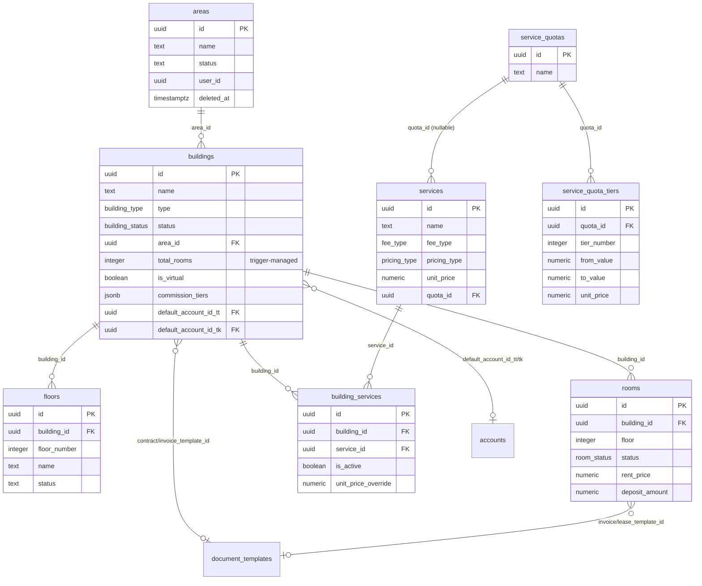
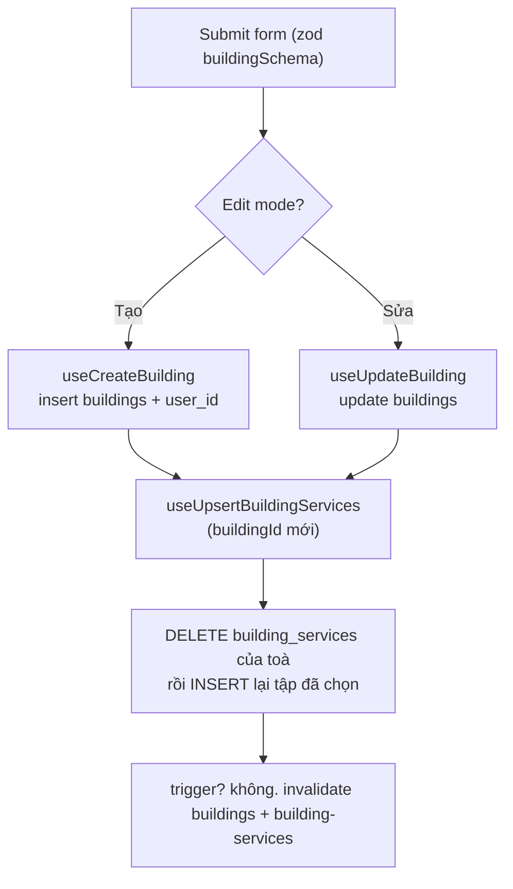

# Cơ cấu BĐS: Khu vực · Toà nhà · Tầng · Phòng · Dịch vụ

> Domain "xương sống" của toàn hệ thống CRM cho thuê. Mọi nghiệp vụ phía sau (lead, hợp đồng, đồng hồ/chỉ số, hoá đơn, thu chi, báo cáo lợi nhuận) đều tham chiếu tới một **toà nhà** và/hoặc một **phòng** trong domain này. Đây là nơi định nghĩa "ta đang quản lý cái gì".

## 1. Tổng quan & vai trò nghiệp vụ

Domain này mô hình hoá **cây tài sản BĐS cho thuê** theo phân cấp:

```text
Khu vực (areas)
  └── Toà nhà (buildings)        ← đơn vị phân quyền & gắn sổ quỹ, mẫu HĐ/HĐ-ơn
        ├── Tầng (floors)        ← danh mục số tầng, dùng để nhóm phòng trong sơ đồ
        └── Phòng/Căn hộ (rooms) ← đơn vị cho thuê thực tế (giá thuê, cọc, trạng thái)
```

Song song với cây tài sản là **danh mục Dịch vụ** (điện, nước, wifi, vệ sinh…):

```text
services (định nghĩa dịch vụ + cách tính tiền pricing_type)
  ├── building_services  ← junction bật/tắt + override giá cho TỪNG toà
  └── quota_id → service_quotas → service_quota_tiers (định mức bậc thang)
```

Vai trò nghiệp vụ chính:

- **Toà nhà là đơn vị phân quyền (multi-tenant + RBAC).** Nhân viên (staff) được gán vào toà qua `staff_assignments`; RLS dùng `can_access_building(building_id)` để lọc dữ liệu. Khu vực được "thấy" gián tiếp nếu staff có quyền trên ít nhất 1 toà thuộc khu vực đó.
- **Toà nhà mang cấu hình mặc định** áp xuống các nghiệp vụ con: sổ quỹ mặc định (`default_account_id_tt/tk`), mẫu hợp đồng (`contract_template_id`), mẫu hoá đơn (`invoice_template_id`), bậc hoa hồng môi giới (`commission_tiers`).
- **Phòng (room) là đơn vị cho thuê.** Hợp đồng, hoá đơn, đồng hồ, tài sản, vehicle… đều gắn `room_id`. Trạng thái phòng (`room_status`) được trigger tự cập nhật theo vòng đời hợp đồng.
- **Dịch vụ + định mức** quyết định cách tính tiền trên hoá đơn (cố định theo tháng, theo đồng hồ, theo người, theo phòng, hoặc bậc thang theo định mức).
- **Tòa ảo (`is_virtual`)**: một toà đặc biệt tên "Chung" để gắn các chi phí không thuộc toà thật nào (xem domain thu/chi & cổ đông). Mặc định bị ẩn khỏi mọi danh sách trừ form thu/chi.

## 2. Cấu trúc dữ liệu

### 2.1. `areas` — Khu vực

Nhóm địa lý/quản lý cấp cao nhất, gom nhiều toà nhà.

- `name` (NOT NULL), `code` (mã tuỳ chọn, không sinh tự động), `description`.
- `status` text mặc định `'ACTIVE'` (UI chỉ dùng `ACTIVE` / `INACTIVE`).
- `user_id` (NOT NULL) — owner (multi-tenant).
- Soft delete qua `deleted_at`; `id/created_at/updated_at` chuẩn.
- **FK ra:** không. **Được tham chiếu bởi:** `buildings.area_id` (1 area → N building).

### 2.2. `buildings` — Toà nhà

Đơn vị tài sản trung tâm, vừa là nút phân quyền vừa mang cấu hình mặc định.

- Định danh: `name` (NOT NULL), `code` (mã/viết tắt tuỳ chọn — **có thể nhập nhiều mã cách nhau bởi dấu phẩy** để khớp khi tạo công việc nhanh).
- `type` enum **building_type** mặc định `APARTMENT`; `status` enum **building_status** mặc định `ACTIVE`.
- Địa chỉ: `province`, `district`, `ward` (đều NOT NULL) + `street_address`.
- Thống kê: `total_floors` (mặc định 1), `total_rooms` (mặc định 0 — **được trigger tự tính**, không sửa tay).
- Media/đặc điểm: `images` jsonb, `amenities` jsonb.
- Liên kết cấu hình:
  - `area_id` → `areas.id` (thuộc khu vực nào, nullable).
  - `contract_template_id`, `invoice_template_id` → `document_templates.id` (mẫu in mặc định cho HĐ/hoá đơn của toà).
  - `default_account_id_tt`, `default_account_id_tk` → `accounts.id` — **sổ quỹ mặc định** ghi nhận khi khách thanh toán hoá đơn phòng bằng TT (tiền mặt/thanh toán) / TK (chuyển khoản). Chỉ super admin được xem & sửa 2 field này.
  - `commission_tiers` jsonb (NOT NULL, có default) — bậc hoa hồng môi giới theo số tháng hợp đồng `[{min_months,max_months,rate_percent}]`.
- `is_virtual` boolean (NOT NULL, default false) — **tòa ảo "Chung"** cho chi phí không thuộc toà thật.
- Soft delete `deleted_at`.
- **Được tham chiếu bởi (rộng):** `floors`, `rooms`, `building_services`, `building_shareholders`, `staff_assignments`, `meters`, `meter_readings`, `invoices`, `income_expenses`, `expenses`, `leads`, `issues`, `jobs`, `assets`, `asset_warehouses`, `vehicles`, `auto_debt_config`, `profit_monthly`, `accounts.quick_default_building_id`. → Toà nhà là "khoá ngoại trung tâm" của gần như mọi domain.

### 2.3. `floors` — Tầng

Danh mục số tầng theo toà, chủ yếu để **nhóm/hiển thị phòng** trong Sơ đồ toà nhà và bộ lọc.

- `building_id` → `buildings.id` (NOT NULL), `floor_number` (NOT NULL), `name` (vd "Tầng trệt"), `description`.
- `status` text mặc định `'active'` (chú ý: chữ thường, khác convention `ACTIVE` của area/building).
- `user_id` (NOT NULL). Không có `deleted_at` → xoá tầng là **hard delete**.
- **Quan trọng:** `floors` *không* phải nguồn sự thật cho tầng của phòng. Phòng có cột `rooms.floor` (integer) riêng; bảng `floors` chỉ là danh mục đặt tên & lọc. Có UNIQUE ngầm `(building_id, floor_number)` (hook bắt lỗi `23505` → "Tầng này đã tồn tại trong toà nhà").

### 2.4. `rooms` — Phòng / Căn hộ

Đơn vị cho thuê thực tế.

- Định danh: `name` (NOT NULL), `code` (tuỳ chọn), `building_id` → `buildings.id` (NOT NULL), `floor` integer (NOT NULL, default 1 — số tầng của phòng).
- `status` enum **room_status** mặc định `AVAILABLE`.
- Thương mại: `rent_price` (NOT NULL — giá thuê), `deposit_amount` (NOT NULL — tiền cọc), `area` numeric (diện tích), `max_occupants` (default 1).
- Media: `images`, `amenities` jsonb; `description`.
- Mẫu in riêng cho phòng (ưu tiên hơn cấu hình toà): `invoice_template_id`, `lease_template_id` → `document_templates.id`.
- Soft delete `deleted_at`.
- **Được tham chiếu bởi (rộng):** `contracts.room_id`, `deposits.room_id`, `invoices.room_id`, `income_expenses.room_id`, `expenses.room_id`, `meters.room_id`, `meter_readings.room_id`, `assets.room_id`, `asset_movements.from/to_room_id`, `contract_transfers.old/new_room_id`, `leads.room_id`, `issues.room_id`, `jobs.room_id`, `vehicles.room_id`.

### 2.5. `services` — Dịch vụ

Danh mục dịch vụ (điện, nước, wifi, vệ sinh, gửi xe…) ở cấp owner (dùng chung mọi toà).

- `name` (NOT NULL), `code`, `unit` (đơn vị: Phòng/Người/Kwh/m³/Tháng…), `unit_price` (NOT NULL, default 0 — đơn giá mặc định).
- `type` enum **service_type** (NOT NULL) — model cũ (FIXED/PER_PERSON/PER_ROOM/METER_READING).
- `fee_type` enum **fee_type** — phân loại phí (Tiền điện/nước/phí dịch vụ/phí khác/vệ sinh) → quyết định cột nào trên hoá đơn.
- `pricing_type` enum **pricing_type** — **cách tính tiền** (cố định/tháng, cố định/đồng hồ, biến động, theo người, theo phòng). `fee_type`+`pricing_type` là model mới thay dần `type`.
- `is_default`, `is_mandatory` boolean (gợi ý mặc định / bắt buộc khi lập HĐ).
- `quota_id` → `service_quotas.id` (nullable) — gắn định mức bậc thang nếu tính theo bậc.
- Soft delete `deleted_at`. `user_id` (NOT NULL).
- **Được tham chiếu bởi:** `building_services.service_id`, `contract_services.service_id`, `invoice_items.service_id`, `meters.service_id`, `meter_readings.service_id`.

### 2.6. `building_services` — Junction Toà ↔ Dịch vụ

Bật/tắt dịch vụ cho từng toà + **override giá riêng** từng toà.

- `building_id` → `buildings.id`, `service_id` → `services.id` (cặp duy nhất; vi phạm → 23505 "Dịch vụ này đã được thêm cho toà nhà").
- `is_active` boolean (NOT NULL, default true) — dịch vụ có áp cho toà này không.
- `unit_price_override` numeric (nullable) — nếu set, **giá toà này dùng số này thay vì `services.unit_price`** (logic định giá hoá đơn đọc tại đây).
- Đây là **nguồn sự thật** cho liên kết dịch vụ–toà ở runtime. (Bảng cũ `service_buildings` đã hợp nhất vào `building_services` qua migration `unify_service_building_links` rồi DROP hẳn ở `20260510000005_drop_service_buildings.sql` — hiện không còn tồn tại.)

### 2.7. `service_quotas` + `service_quota_tiers` — Định mức bậc thang

Mô hình giá bậc thang (vd điện luỹ tiến).

- `service_quotas`: định mức có tên (`name` NOT NULL, `description`), owner `user_id`, soft delete `deleted_at`. Một quota gắn vào nhiều `services` qua `services.quota_id`.
- `service_quota_tiers`: từng bậc của quota.
  - `quota_id` → `service_quotas.id` (NOT NULL), `tier_number` (NOT NULL; UNIQUE `(quota_id, tier_number)`).
  - `from_value` (NOT NULL, default 0), `to_value` (nullable — bậc cuối để trống = vô cực), `unit_price` (NOT NULL, default 0 — đơn giá trong khoảng `[from_value, to_value)`).
- Quan hệ tính tiền: lượng tiêu thụ rơi vào bậc nào thì áp `unit_price` bậc đó (hoặc cộng dồn luỹ tiến tuỳ logic hoá đơn).

### 2.8. `code_sequences` — Cấu hình sinh mã tự động

Cấu hình bộ đếm sinh mã theo loại đối tượng (toà/phòng/HĐ/hoá đơn/phiếu…), không chứa mã cụ thể.

- `object_type` (NOT NULL — loại đối tượng), `prefix` (NOT NULL — tiền tố), `separator` (default `'-'`), `date_format` (vd `'YYMM'`), `sequence_length` (default 4 — số chữ số padding), `current_sequence` (default 0 — số đếm hiện tại), `reset_period` (default `'YEARLY'` — DAILY/MONTHLY/YEARLY), `last_reset_at`.
- `user_id` (NOT NULL) — mỗi owner có bộ đếm riêng.
- Lưu ý: trong domain này, **mã toà/khu vực/phòng/dịch vụ được nhập tay** (không bắt buộc), `code_sequences` phục vụ các domain dùng mã tuần tự (HĐ, hoá đơn, phiếu thu chi…). Hàm `generate_code` / `generate_next_code` đọc/ghi bảng này.

## 3. Sơ đồ quan hệ dữ liệu



### Các enum của domain

- **building_type**: `APARTMENT, DORMITORY, HOUSE, OFFICE, SLEEPBOX, HOMESTAY`.
- **building_status**: `ACTIVE, INACTIVE, MAINTENANCE` (UI form chỉ chuyển ACTIVE↔INACTIVE).
- **room_status**: `AVAILABLE, OCCUPIED, RESERVED, MAINTENANCE, UNAVAILABLE`.
- **service_type** (model cũ): `FIXED, PER_PERSON, PER_ROOM, METER_READING`.
- **fee_type**: `TIEN_PHI_DICH_VU, TIEN_DIEN, TIEN_NUOC, TIEN_PHI_KHAC, TIEN_VE_SINH`.
- **pricing_type**: `DON_GIA_CO_DINH_THANG, DON_GIA_CO_DINH_DONG_HO, DON_GIA_BIEN_DONG, DON_GIA_THEO_NGUOI, DON_GIA_THEO_PHONG`.

## 4. Quy tắc nghiệp vụ & tự động hoá

### 4.1. Trigger `update_building_total_rooms` — tự đếm số phòng

- **Nguồn:** [008_triggers_functions.sql](supabase/migrations/008_triggers_functions.sql).
- **Khi nào:** `AFTER INSERT OR UPDATE OR DELETE ON rooms` (mỗi dòng).
- **Làm gì:** `UPDATE buildings SET total_rooms = (SELECT COUNT(*) FROM rooms WHERE building_id = … AND deleted_at IS NULL)`.
- **Bất biến:** `buildings.total_rooms` luôn = số phòng **chưa soft-delete** của toà. Soft delete phòng (set `deleted_at`) là một UPDATE → trigger chạy → đếm lại. → Không bao giờ set `total_rooms` thủ công.

### 4.2. Trigger `update_room_status_on_contract_change` — vòng đời trạng thái phòng

- **Nguồn:** [20260601000300_drop_bed_remnants_db.sql](supabase/migrations/20260601000300_drop_bed_remnants_db.sql) (đã đổi tên, gỡ "bed"). Trigger `trigger_update_room_status` `AFTER INSERT OR UPDATE ON contracts`.
- **Logic:**
  - INSERT hợp đồng `status=ACTIVE` & có `room_id` → phòng `OCCUPIED`.
  - UPDATE rời ACTIVE (ACTIVE → TERMINATED/EXPIRED/…) → phòng về `AVAILABLE` **chỉ khi** không còn hợp đồng ACTIVE nào khác trên cùng phòng (`NOT EXISTS … status='ACTIVE' AND id<>NEW.id`).
  - UPDATE vào ACTIVE (khác → ACTIVE) → phòng `OCCUPIED`.
- **Bất biến/cảnh báo:** Trigger chỉ phản ứng với trạng thái `'ACTIVE'` thuần. **`EXTENDED` không được xử lý ở đây** — phòng có HĐ EXTENDED giữ nguyên trạng thái cuối cùng (đã OCCUPIED từ lúc ACTIVE). Các trạng thái hiển thị "đang thuê / sắp trống" trên UI **không** dựa vào cột `rooms.status` này mà tính lại từ hợp đồng đang hiệu lực (xem `getRoomDisplayStatus` 4.5).

### 4.3. `generate_code` / `generate_next_code` — sinh mã tuần tự

- **Nguồn:** `generate_code` ([008_triggers_functions.sql](supabase/migrations/008_triggers_functions.sql)); `generate_next_code` ([029_missing_features.sql](supabase/migrations/029_missing_features.sql)).
- **Cơ chế chung:** lấy dòng `code_sequences` theo `(user_id, object_type)` — `generate_next_code` khoá dòng `FOR UPDATE`, còn `generate_code` chỉ `SELECT` thường (không khoá hàng); nếu tới kỳ reset (DAILY/MONTHLY/YEARLY so với `last_reset_at`) thì `next = 1`, ngược lại `current_sequence + 1`; ghép `prefix [+ sep + date(date_format)] + sep + LPAD(seq, sequence_length, '0')`; cập nhật `current_sequence`/`last_reset_at`.
- **Khác biệt:** `generate_next_code` **tự tạo dòng cấu hình mặc định** nếu chưa có (prefix = 2 ký tự đầu object_type, format YYMM, reset MONTHLY); `generate_code` **raise exception** nếu chưa cấu hình.
- **Trong domain này:** không trang nào của khu vực/toà/phòng/dịch vụ gọi 2 hàm này — mã do người dùng nhập tay. Chúng phục vụ các domain khác (HĐ, hoá đơn, phiếu thu chi, công việc…) qua các trigger `generate_*_number` / `*_set_code`.

### 4.4. RLS theo RBAC (phân quyền theo toà)

- **Nguồn:** [20260527000008_rbac_phase4_buildings_rooms.sql](supabase/migrations/20260527000008_rbac_phase4_buildings_rooms.sql).
- **buildings / floors / rooms / building_services:** SELECT/ghi dựa trên `can_access_building(building_id)` (super_admin/admin thấy hết; staff thấy toà được gán trong `staff_assignments`; quyền ghi kiểm `can_do_on_building(table, action, building_id)`).
- **areas:** thấy nếu super_admin/admin HOẶC có `staff_assignments` (full-scope `building_id IS NULL`, hoặc gán 1 toà thuộc area đó). Tạo/sửa/xoá area chỉ cho user full-scope có quyền `areas.create/edit/delete`.
- **services / service_quotas / service_quota_tiers:** đơn giản theo owner — `auth.uid() = user_id` (và `deleted_at IS NULL` cho SELECT). Tiers/junction kiểm qua `EXISTS` trên bảng cha (quota của tôi / service của tôi).

### 4.5. `getRoomDisplayStatus` — trạng thái phòng hiển thị (client-side)

- **Nguồn:** [roomStatus.ts](src/lib/roomStatus.ts). Suy ra trạng thái hiển thị từ `room.status` + **ngày kết thúc hợp đồng đang hiệu lực** (ACTIVE/EXTENDED):
  - Còn 1..30 ngày → `EXPIRING_SOON` (sắp trống). Còn lại → `OCCUPIED`.
  - Không có HĐ hiệu lực → theo `room.status`: `MAINTENANCE` / `RESERVED`, mặc định `AVAILABLE`.
- Dùng chung cho Sơ đồ toà nhà và Danh mục căn hộ → đảm bảo cách tính "đang thuê / sắp trống / trống" nhất quán. Nguồn HĐ lấy từ hook `useRoomsWithActiveContracts` ([useRoomsWithContracts.ts](src/hooks/useRoomsWithContracts.ts), lọc `contracts.status IN ('ACTIVE','EXTENDED')`).

## 5. Quy trình theo từng trang

### 5.1. `/areas` — Quản lý Khu vực

[AreasPage.tsx](src/pages/areas/AreasPage.tsx) · hook [useAreas.ts](src/hooks/useAreas.ts)

- **Hiển thị:** `useAreas` select `areas` + `buildings:buildings(count)` (đếm toà nhà mỗi khu vực), lọc `deleted_at IS NULL`. Bảng: Mã, Tên, Mô tả, Số toà nhà (badge), Trạng thái.
- **Lọc client-side:** ô tìm theo tên/mã (Input) + dropdown trạng thái dùng `SearchableSelect` (theo MEMORY: filter phải là combobox gõ-để-tìm).
- **Tạo / sửa:** `CreateAreaDialog` / `EditAreaDialog` → `useCreateArea` (tự gắn `user_id`) / `useUpdateArea`. Lỗi `23505` → toast "Mã khu vực đã tồn tại".
- **Xoá (soft):** `useDeleteArea` **chặn** nếu khu vực còn toà nhà chưa xoá → toast "Không thể xóa khu vực đang có N tòa nhà"; ngược lại set `deleted_at`.
- **Gán toà vào khu vực:** `useAssignBuildingsToArea` (diff add/remove → update `buildings.area_id`), dùng ở dialog gán nhanh.

### 5.2. `/buildings` — Danh sách Toà nhà

[BuildingsPage.tsx](src/pages/buildings/BuildingsPage.tsx) · hook [useBuildings.ts](src/hooks/useBuildings.ts)

- **Hiển thị:** `useBuildings()` (mặc định **ẩn tòa ảo** `is_virtual=true`) join `area:areas(...)` + `rooms:rooms(count)` (chỉ phòng chưa xoá). Stats cards (Tổng / Đang hoạt động / Ngừng) tính theo **phạm vi tìm kiếm + khu vực** (cố ý KHÔNG áp bộ lọc trạng thái để 3 thẻ vẫn phân tích đủ).
- **Lọc:** tìm theo tên/mã/địa chỉ + lọc trạng thái + lọc khu vực (`BuildingListFilters`).
- **Toggle trạng thái nhanh:** `useUpdateBuildingStatus` với **optimistic update** (snapshot cache, revert nếu lỗi) — bật/tắt ACTIVE/INACTIVE ngay trên bảng.
- **Tạo / sửa:** `BuildingFormDialog` ([BuildingFormDialog.tsx](src/components/buildings/BuildingFormDialog.tsx)) — form đa section: Thông tin cơ bản (tên + mã, switch trạng thái), Địa chỉ (province/district/ward + street), **Dịch vụ toà** (chọn dịch vụ + override giá), Cấu hình (sổ quỹ TT/TK mặc định — **chỉ super admin thấy**, mẫu hoá đơn, mẫu HĐ), Hoa hồng môi giới (`commission_tiers`). Validate bằng `buildingSchema` ([buildingValidation.ts](src/lib/buildingValidation.ts)).
- **Quy trình submit:**



- **Edge case:** mã trùng → 23505 ("Mã tòa nhà đã tồn tại"); FK sai (vd template/account không tồn tại) → 23503. `useUpsertBuildingServices` xoá-rồi-chèn nên **mất `unit_price_override` của dịch vụ bị bỏ chọn** (cố ý).
- **Xem phòng:** nút điều hướng `/apartments?building_id=…` (RoomsPage đọc query param).

### 5.3. `/buildings/:id` (chi tiết) — `BuildingDetailPage`

[BuildingDetailPage.tsx](src/pages/buildings/BuildingDetailPage.tsx)

- **Tabs:** Thông tin chung (cơ bản + địa chỉ + 4 thẻ thống kê phòng tính từ `useRooms(id)`), Căn hộ (danh sách phòng của toà), Hợp đồng (query trực tiếp `contracts` join room thuộc toà), Hoá đơn (query `invoices` theo room_id của toà).
- **Sửa:** `EditBuildingDialog`. Lưu ý: trang có vài field tham chiếu tới schema cũ (`building.floors`, `building.notes`, `room.base_rent`) có thể không khớp cột thực (cột thực là `total_floors`, không có `notes`, phòng dùng `rent_price`) — hiển thị fallback `-`.

### 5.4. `/rooms` (route `/apartments`) — Danh mục Căn hộ

[RoomsPage.tsx](src/pages/rooms/RoomsPage.tsx) · hooks [useRooms.ts](src/hooks/useRooms.ts), [useRoomsWithContracts.ts](src/hooks/useRoomsWithContracts.ts)

- **Hiển thị:** `useRooms()` (toàn bộ phòng chưa xoá, join `building`), sắp xếp theo toà rồi tên phòng bằng `compareBuildingThenRoom`. `useRoomsWithActiveContracts()` (toàn bộ) cung cấp ngày hết hạn để tính trạng thái.
- **Bộ lọc liên hoàn:** Khu vực → Toà → Tầng (đổi khu vực reset toà+tầng; dropdown toà giới hạn theo khu vực; tầng lấy từ `useFloors(buildingId)`). Có pre-filter từ query `?building_id=`.
- **Stat cards** (theo danh sách đang lọc): Tổng phòng, Tổng phòng trống, Sắp hết hạn — tính qua `getRoomDisplayStatus`.
- **Tạo / sửa:** `RoomFormDialog` (validate `roomSchema` [roomValidation.ts](src/lib/roomValidation.ts): bắt buộc `building_id`, `floor` dương, `name`, `rent_price/deposit_amount ≥ 0`). `useCreateRoom`/`useUpdateRoom` invalidate cả `rooms` lẫn `buildings` (cập nhật `total_rooms` qua trigger).
- **Toggle trạng thái:** `useUpdateRoomStatus` map switch → `AVAILABLE`/`UNAVAILABLE`.
- **Xoá (soft):** `useDeleteRoom` set `deleted_at` → trigger giảm `total_rooms`.
- **Tạo hàng loạt:** `useBulkCreateRooms` (insert mảng `rooms`).
- **Edge case:** mã phòng trùng → 23505; `building_id` sai → 23503 ("Tòa nhà không tồn tại").

### 5.5. `/apartments/:id` (route chi tiết; `/rooms/:id` redirect) — `RoomDetailPage`

[RoomDetailPage.tsx](src/pages/rooms/RoomDetailPage.tsx)

- `useRoom(id)` + các query trực tiếp: hợp đồng của phòng, hoá đơn, khách đang thuê (lọc HĐ còn hiệu lực qua `isContractInEffect`), tài sản (`assets` theo `room_id`). Dùng tabs Hợp đồng / Hoá đơn / Khách thuê / Tài sản. Sửa qua `EditRoomDialog`.

### 5.6. `/building-map` — Sơ đồ Toà nhà

[BuildingMapPage.tsx](src/pages/building-map/BuildingMapPage.tsx)

- **Mục đích:** xem trực quan tình trạng phòng theo toà & tầng (mỗi phòng là `RoomCard` tô màu theo trạng thái).
- **Bộ lọc:** Khu vực → Toà (auto chọn toà đầu tiên nếu chưa chọn) → Tầng → Trạng thái + ô tìm phòng/khách. Tất cả dùng `SearchableSelect`.
- **Trạng thái hiển thị (5 loại):** Đang thuê / Đã đặt cọc / Trống / Sắp trống / Ngừng hoạt động, suy từ `getRoomDisplayStatus` + `useRoomsWithActiveContracts(buildingId)`. Có thẻ thống kê + chú thích màu.
- **Bố cục:** chọn 1 tầng → lưới phẳng; chọn "tất cả tầng" → nhóm theo `floor` (dùng `floors` để đặt tên tầng). Click phòng → `RoomDetailDialog`.

### 5.7. `/services` — Danh mục Dịch vụ

[ServicesPage.tsx](src/pages/services/ServicesPage.tsx) · hooks [useServices.ts](src/hooks/useServices.ts), [useBuildingServices.ts](src/hooks/useBuildingServices.ts)

- **Hiển thị:** `useServices({building_id, fee_type})` select services + `building_services(building_id, is_active)`; lọc theo toà **client-side** (phải có junction `is_active=true`), lọc `fee_type` server-side. Bảng: Mã, Tên, Loại phí (`fee_type`), Loại tính tiền (`pricing_type`), Giá (đơn giá + đơn vị), Mặc định (switch read-only). Phân trang client.
- **Tạo / sửa:** `CreateServiceDialog`/`EditServiceDialog` → `useCreateService` (insert service + insert `building_services` cho các toà chọn) / `useUpdateService` (**diff** add/activate/delete junction để **giữ `unit_price_override`** của dòng không đổi).
- **Xoá (soft):** `useDeleteService` set `deleted_at`.
- **Bộ lọc** dùng `SearchableSelect`; combobox phân trang dùng `Select` thường (đúng MEMORY).

### 5.8. `/settings/categories/floors` — Danh sách Tầng

[FloorsPage.tsx](src/pages/settings/categories/FloorsPage.tsx) · hook [useFloors.ts](src/hooks/useFloors.ts)

- Trang CRUD generic (`CategoryCrudPage`): cột Số tầng / Tên / Mô tả / Trạng thái. Field form: `floor_number` (số, bắt buộc), `name`, `description`.
- `useCreateFloor` (tự gắn `user_id`) / `useUpdateFloor` / `useDeleteFloor` (**hard delete**, không có `deleted_at`). Trùng `(building_id, floor_number)` → 23505 "Tầng này đã tồn tại trong toà nhà".
- Lưu ý: trang này không gắn `building_id` cụ thể (form không có field toà) → chủ yếu là danh mục tên tầng dùng lại; tầng theo toà thực tế được tạo/đọc qua `useFloors(buildingId)` ở RoomsPage/BuildingMapPage.

### 5.9. `/settings/categories/service-quotas` — Định mức dịch vụ

[ServiceQuotasPage.tsx](src/pages/settings/categories/ServiceQuotasPage.tsx) · hooks trong [useServices.ts](src/hooks/useServices.ts)

- **Hiển thị:** `useServiceQuotas()` select quotas + `service_quota_tiers(*)`. Bảng: Tên định mức, Số bậc (đếm tiers), Mô tả. Phân trang client.
- **Tạo / sửa:** `CreateQuotaDialog`/`EditQuotaDialog` → `useCreateServiceQuota` (insert quota + insert tiers) / `useUpdateServiceQuota` (**xoá hết tiers rồi chèn lại** — replace toàn bộ bậc).
- **Xoá (soft):** `useDeleteServiceQuota` set `deleted_at`.
- Định mức tạo ở đây được gắn vào dịch vụ qua `services.quota_id` (chọn trong form dịch vụ) để tính giá bậc thang trên hoá đơn.

## 6. Liên kết sang domain khác (vào / ra)

- **→ Phân quyền / RBAC:** `staff_assignments.building_id`, `roles` quyết định ai thấy/sửa toà–phòng–dịch vụ. `can_access_building`, `can_do_on_building`, `is_admin/is_super_admin` là cổng RLS xuyên suốt mọi domain bám theo `building_id`.
- **→ Khách hàng & Hợp đồng:** `contracts.room_id` (và `deposits.room_id`, `contract_transfers.old/new_room_id`) gắn nghiệp vụ thuê vào phòng. Trigger contract → cập nhật `rooms.status`. `buildings.contract_template_id`/`rooms.lease_template_id` cấp mẫu HĐ.
- **→ Đồng hồ / Chỉ số (meter):** `meters.room_id/building_id/service_id`, `meter_readings.*` — dịch vụ kiểu đồng hồ (`pricing_type = DON_GIA_CO_DINH_DONG_HO`) ghi chỉ số tại phòng để ra sản lượng.
- **→ Hoá đơn:** `invoices.room_id/building_id`; `invoice_items.service_id` lấy giá từ `building_services.unit_price_override` (fallback `services.unit_price`) và `service_quota_tiers` nếu tính bậc. `buildings/rooms.invoice_template_id` cấp mẫu in.
- **→ Thu / Chi (income_expenses) & sổ quỹ:** `income_expenses.building_id/room_id`; `buildings.default_account_id_tt/tk` quyết định sổ quỹ mặc định khi thu tiền phòng. **Tòa ảo `is_virtual`** chứa chi phí "Chung" không thuộc toà thật.
- **→ Báo cáo & Lợi nhuận / Cổ đông:** `profit_monthly.building_id`, `building_shareholders.building_id`, RPC `monthly_building_profit(...)` tổng hợp thu–chi theo toà → là chiều phân tích chính của báo cáo lợi nhuận.
- **→ Vận hành khác:** `leads.building_id/room_id`, `issues.*`, `jobs.*`, `assets.room_id/building_id`, `asset_warehouses.building_id`, `vehicles.room_id/building_id`, `auto_debt_config.building_id` — toàn bộ neo vào cây toà–phòng của domain này.
- **→ Mẫu in:** `document_templates` (qua `contract_template_id`, `invoice_template_id`, `lease_template_id`).
- **→ Sinh mã:** `code_sequences` + `generate_code`/`generate_next_code` dùng bởi các domain có mã tuần tự (HĐ, hoá đơn, phiếu, công việc…).
