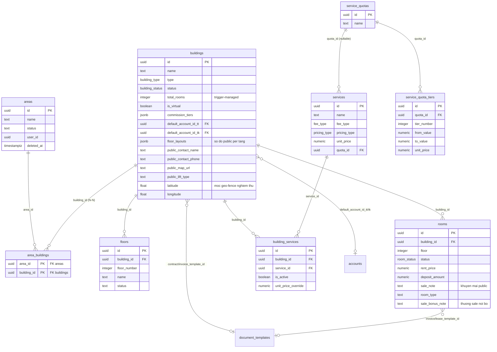
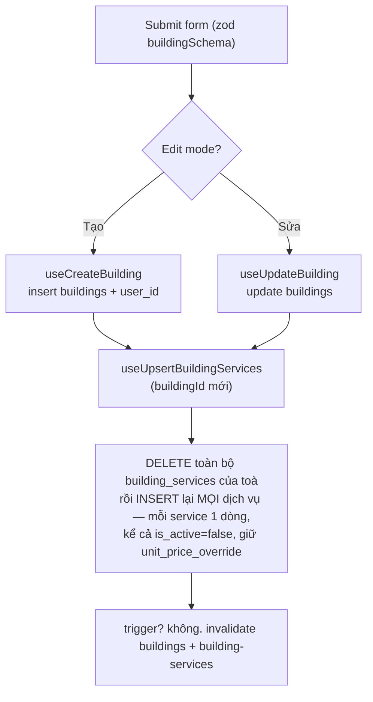

# Cơ cấu BĐS: Khu vực · Toà nhà · Tầng · Phòng · Dịch vụ

> Domain "xương sống" của toàn hệ thống CRM cho thuê. Mọi nghiệp vụ phía sau (lead, hợp đồng, đồng hồ/chỉ số, hoá đơn, thu chi, báo cáo lợi nhuận) đều tham chiếu tới một **toà nhà** và/hoặc một **phòng** trong domain này. Đây là nơi định nghĩa "ta đang quản lý cái gì".

## 1. Tổng quan & vai trò nghiệp vụ

Domain này mô hình hoá **cây tài sản BĐS cho thuê** theo phân cấp:

```text
Khu vực (areas)
  └── Toà nhà (buildings)        ← đơn vị phân quyền & gắn sổ quỹ, mẫu HĐ/HĐ-ơn
        ├── Tầng (floors)        ← danh mục số tầng, dùng để nhóm phòng trong sơ đồ
        └── Phòng/Căn hộ (rooms) ← đơn vị cho thuê thực tế (giá thuê, cọc, trạng thái)
```

Song song với cây tài sản là **danh mục Dịch vụ** (điện, nước, wifi, vệ sinh…):

```text
services (định nghĩa dịch vụ + cách tính tiền pricing_type)
  ├── building_services  ← junction bật/tắt + override giá cho TỪNG toà
  └── quota_id → service_quotas → service_quota_tiers (định mức bậc thang)
```

Vai trò nghiệp vụ chính:

- **Toà nhà là đơn vị phân quyền (multi-tenant + RBAC).** Nhân viên (staff) được gán vào toà qua `staff_assignments`; RLS dùng `can_access_building(building_id)` để lọc dữ liệu. Khu vực được "thấy" nếu staff có quyền trên ≥1 toà thuộc khu HOẶC được gán scope theo chính khu đó.
- **Khu vực = NHÃN NHÓM toà nhà, quan hệ N-N** (2026-06-11, commit 30aa175 — thay mô hình 1-1 cũ): **một toà có thể thuộc NHIỀU khu** (vd "Nhà cũ"={A,B,C}, "Thang bộ"={A,B,D}) qua bảng nối `area_buildings(area_id, building_id)`; cột `buildings.area_id` đã **DROP**. Filter của hook chỉ nhận `building_ids: string[]` (`area_id` legacy đã gỡ hẳn).
- **Ô LỌC toà nhà = PHẲNG + ĐƠN-CHỌN toàn app** (2026-07-02, commit 3c3b7fa — thay mô hình multi-select nhóm khu trước đó): mọi ô lọc toà trên các trang danh sách dùng **một** component [BuildingFilterSelect](src/components/buildings/BuildingFilterSelect.tsx) — combobox gõ-để-tìm ([SearchableSelect](src/components/ui/searchable-select.tsx)) liệt kê toà **phẳng A→Z không nhóm khu vực**, chọn đúng **1 toà hoặc "Tất cả toà nhà"**; prop `value` giữ nguyên shape MẢNG (`[]` = tất cả, `[id]` = 1 toà) để các trang/hook không phải đổi state (state legacy chứa >1 id thì trigger hiện "N toà nhà", chọn lại là về 1). [BuildingMultiSelect](src/components/buildings/BuildingMultiSelect.tsx) (chọn NHIỀU toà, nhóm theo khu, logic thuần ở [buildingGroups.ts](src/lib/buildingGroups.ts) — property test fast-check) **chỉ còn dùng cho scope/cấu hình**: gán phạm vi nhân viên (StaffPage), quản lý chia lợi nhuận (ProfitManagerForm), gán toà vào khu (ManageAreasDialog §5.1).
- **Bộ lọc giữ qua F5** (2026-07-02, commit 7fd2d3f): state ô lọc của các trang trong domain (`/buildings`, `/apartments`, `/building-map`, `/services`) dùng hook [usePersistedState](src/hooks/usePersistedState.ts) (sessionStorage, key quy ước `flt:<trang>:<state>` — vd `flt:rooms:buildingIds`) — reload không mất bộ lọc, đóng tab là về mặc định; trang có seed từ URL (vd `?building_id=` ở RoomsPage) để **URL THẮNG** giá trị khôi phục.
- **Scope nhân viên theo khu = LIVE** (khác ô lọc): `staff_assignments.area_id` tham chiếu khu — toà thêm/bớt khỏi khu thì phạm vi nhân viên **tự đổi theo** (DB resolve qua `area_buildings` lúc query, không snapshot). Chi tiết ở [01-phan-quyen-nhan-su.md](01-phan-quyen-nhan-su.md).
- **Toà nhà mang cấu hình mặc định** áp xuống các nghiệp vụ con: sổ quỹ mặc định (`default_account_id_tt/tk`), mẫu hợp đồng (`contract_template_id`), mẫu hoá đơn (`invoice_template_id`), bậc hoa hồng môi giới (`commission_tiers`).
- **Phòng (room) là đơn vị cho thuê.** Hợp đồng, hoá đơn, đồng hồ, tài sản, vehicle… đều gắn `room_id`. Trạng thái phòng (`room_status`) được trigger tự cập nhật theo vòng đời hợp đồng (4.2) **và theo cọc giữ chỗ** (AVAILABLE↔RESERVED tự động, 4.6).
- **Dịch vụ + định mức** quyết định cách tính tiền trên hoá đơn (cố định theo tháng, theo đồng hồ, theo người, theo phòng, hoặc bậc thang theo định mức).
- **Tòa ảo (`is_virtual`)**: một toà đặc biệt tên "Chung" để gắn các chi phí không thuộc toà thật nào (xem domain thu/chi & cổ đông). Mặc định bị ẩn khỏi mọi danh sách trừ form thu/chi.

## 2. Cấu trúc dữ liệu

### 2.1. `areas` — Khu vực

Nhóm địa lý/quản lý cấp cao nhất, gom nhiều toà nhà. **Vai trò hiện hành: nhãn nhóm cho bộ lọc/scope** — UI quản lý chỉ còn đặt tên + gán toà (xem §5.1).

- `name` (NOT NULL), `code` (mã tuỳ chọn, không sinh tự động), `description`.
- `status` text mặc định `'ACTIVE'` — **cột vẫn còn trong DB nhưng UI đã bỏ** (dialog quản lý khu vực mới không hiển thị/sửa status; các form `code`/`description` cũng không còn chỗ nhập).
- `user_id` (NOT NULL) — owner (multi-tenant).
- Soft delete qua `deleted_at`; `id/created_at/updated_at` chuẩn. ⚠️ Khu đang được dùng làm **phạm vi phân quyền** (`staff_assignments.area_id`) thì bị CHẶN xoá (trigger `areas_guard_soft_delete` RAISE `AREA_IN_STAFF_SCOPE` + FK `ON DELETE RESTRICT`) — tránh nâng quyền nhầm khi staff hết row assignment.
- **FK ra:** không. **Được tham chiếu bởi:** `area_buildings.area_id` (N-N với buildings, từ 2026-06-11) và `staff_assignments.area_id` (scope nhóm live).
- **`area_buildings`** (bảng nối, [20260611100000](supabase/migrations/20260611100000_area_buildings_m2m.sql)): `(area_id FK CASCADE, building_id FK CASCADE, user_id, created_at)` PK kép + index chiều `building_id`. RLS: SELECT theo `can_access_building(building_id)`; WRITE = super admin / staff full-scope có `areas.edit`. Backfill từ `buildings.area_id` cũ trước khi drop cột.

### 2.2. `buildings` — Toà nhà

Đơn vị tài sản trung tâm, vừa là nút phân quyền vừa mang cấu hình mặc định.

- Định danh: `name` (NOT NULL), `code` (mã/viết tắt tuỳ chọn — **có thể nhập nhiều mã cách nhau bởi dấu phẩy** để khớp khi tạo công việc nhanh).
- `type` enum **building_type** mặc định `APARTMENT`; `status` enum **building_status** mặc định `ACTIVE`.
- Địa chỉ: `province`, `district`, `ward` (đều NOT NULL) + `street_address`.
- Thống kê: `total_floors` (mặc định 1), `total_rooms` (mặc định 0 — **được trigger tự tính**, không sửa tay).
- Media/đặc điểm: `description`, `images` jsonb, `amenities` jsonb.
- Liên kết cấu hình:
  - Khu vực: qua bảng nối `area_buildings` (N-N — cột `area_id` cũ đã DROP 2026-06-11); form tạo/sửa toà **không còn ô khu vực**, gom nhóm chỉ làm ở dialog "Quản lý khu vực".
  - `contract_template_id`, `invoice_template_id` → `document_templates.id` (mẫu in mặc định cho HĐ/hoá đơn của toà).
  - `default_account_id_tt`, `default_account_id_tk` → `accounts.id` — **sổ quỹ mặc định** ghi nhận khi khách thanh toán hoá đơn phòng bằng TT (tiền mặt/thanh toán) / TK (chuyển khoản). Chỉ super admin được xem & sửa 2 field này (gate ở FE — RLS không chặn riêng cột).
  - `commission_tiers` jsonb (NOT NULL, có default) — bậc hoa hồng môi giới theo số tháng hợp đồng `[{min_months,max_months,rate_percent}]`.
- `is_virtual` boolean (NOT NULL, default false) — **tòa ảo "Chung"** cho chi phí không thuộc toà thật.
- **Cột phục vụ trang Phòng trống công khai `/r/:token` & module Sale Phòng** (thêm 2026-06-07, xem §6):
  - `floor_layouts` jsonb — sơ đồ tọa độ thủ công per-tầng cho trang public, shape `{"<floor>": {canvasW, canvasH, corridor, fixtures, rooms: {"<room_id>": {x,y,w,h}}}}` ([20260607090100_building_floor_layouts.sql](supabase/migrations/20260607090100_building_floor_layouts.sql)). Ghi bởi editor kéo-thả Sale Phòng ([FloorPlanEditorTab.tsx](src/components/sale-phong/floor-editor/FloorPlanEditorTab.tsx) qua `useUpdateBuilding`), đọc bởi RPC `get_public_available_rooms`; tầng/phòng thiếu layout → client tự sinh fallback.
  - `public_contact_name`, `public_contact_phone` — liên hệ quản lý riêng từng toà (nút gọi/Zalo trên trang public) ([20260607140000](supabase/migrations/20260607140000_room_sale_bonus_building_public_contact.sql)).
  - `public_map_url` — link Google Maps "Chỉ đường" riêng từng toà.
  - `public_lift_type` — `'Thang máy'` / `'Thang bộ'` ([20260607150000](supabase/migrations/20260607150000_building_public_elec_lift.sql)).
  - Lưu ý: `types.ts` đã regen từ live DB (2026-06-17) — nay có đủ `floor_layouts` + các cột `public_*`.
- **`latitude` / `longitude`** (double precision, nullable — thêm 2026-06-28, [20260628000001_acceptance_geofence.sql](supabase/migrations/20260628000001_acceptance_geofence.sql)): toạ độ GPS của toà, làm **mốc geo-fence khi nghiệm thu công việc** (so khoảng cách với vị trí chụp ảnh lúc staff bấm "Hoàn thành", audit-only KHÔNG chặn — cột audit `completion_lat/lng/distance_m/geofence_status` nằm bên `jobs`, xem [11-cong-viec-su-co.md](11-cong-viec-su-co.md)). Nhập trong form toà nhà qua [BuildingGeoSection](src/components/buildings/BuildingGeoSection.tsx) (nút "lấy vị trí hiện tại" hoặc gõ tay, đặt trong card Địa chỉ của `BuildingFormDialog`). Ngưỡng bán kính + bật/tắt là setting `acceptance_geofence` của owner (mặc định 70m — xem [14-cai-dat-danh-muc-tai-lieu.md](14-cai-dat-danh-muc-tai-lieu.md)).
- Soft delete `deleted_at`.
- **Được tham chiếu bởi (rộng):** `floors`, `rooms`, `building_services`, `building_shareholders`, `staff_assignments`, `meters`, `meter_readings`, `invoices`, `income_expenses`, `expenses`, `leads`, `issues`, `jobs`, `assets`, `asset_warehouses`, `vehicles`, `auto_debt_config`, `profit_monthly`, `accounts.quick_default_building_id`. → Toà nhà là "khoá ngoại trung tâm" của gần như mọi domain.

### 2.3. `floors` — Tầng

Danh mục số tầng theo toà, chủ yếu để **nhóm/hiển thị phòng** trong Sơ đồ toà nhà và bộ lọc.

- `building_id` → `buildings.id` (NOT NULL), `floor_number` (NOT NULL), `name` (vd "Tầng trệt"), `description`.
- `status` text mặc định `'active'` + CHECK `status IN ('active','inactive')` (chú ý: chữ thường, khác convention `ACTIVE` của area/building).
- `user_id` (NOT NULL). Không có `deleted_at` → xoá tầng là **hard delete**.
- **Quan trọng:** `floors` *không* phải nguồn sự thật cho tầng của phòng. Phòng có cột `rooms.floor` (integer) riêng; bảng `floors` chỉ là danh mục đặt tên & lọc. Có constraint **tường minh** `floors_unique_building_floor UNIQUE (building_id, floor_number)` ([20250101000001_create_floors_table.sql](supabase/migrations/20250101000001_create_floors_table.sql)) — hook bắt lỗi `23505` → "Tầng này đã tồn tại trong toà nhà".

### 2.4. `rooms` — Phòng / Căn hộ

Đơn vị cho thuê thực tế.

- Định danh: `name` (NOT NULL), `code` (tuỳ chọn), `building_id` → `buildings.id` (NOT NULL), `floor` integer (NOT NULL, default 1 — số tầng của phòng).
- `status` enum **room_status** mặc định `AVAILABLE`.
- Thương mại: `rent_price` (NOT NULL — giá thuê), `deposit_amount` (NOT NULL — tiền cọc), `area` numeric (diện tích), `max_occupants` (default 1).
- Media: `images`, `amenities` jsonb; `description`.
- **Cột sale/public** (thêm 2026-06-07, đã có trong `types.ts` sau lần regen 2026-06-17 — migrations [20260607120000](supabase/migrations/20260607120000_room_sale_note.sql), [20260607130000](supabase/migrations/20260607130000_room_type.sql), [20260607140000](supabase/migrations/20260607140000_room_sale_bonus_building_public_contact.sql)): `sale_note` (ô "Khuyến mãi" cho khách), `room_type` ("Loại phòng" — Gác/Ban công/Studio/Cửa sổ hành lang…), `sale_bonus_note` ("Thưởng sale" nội bộ, không gửi khách). Dùng bởi trang Phòng trống công khai ([supabaseData.ts](src/pages/phong-trong/supabaseData.ts)) & module Sale Phòng.
- Mẫu in riêng cho phòng (ưu tiên hơn cấu hình toà): `invoice_template_id`, `lease_template_id` → `document_templates.id`.
- **UNIQUE:** partial index `idx_rooms_unique_name_per_building` trên `(building_id, name) WHERE deleted_at IS NULL` ([002_core_tables_part1.sql](supabase/migrations/002_core_tables_part1.sql)) — **tên phòng** duy nhất trong toà; cột `code` KHÔNG unique.
- Soft delete `deleted_at`.
- **Được tham chiếu bởi (rộng):** `contracts.room_id`, `deposits.room_id`, `invoices.room_id`, `income_expenses.room_id`, `expenses.room_id`, `meters.room_id`, `meter_readings.room_id`, `assets.room_id`, `asset_movements.from/to_room_id`, `contract_transfers.old/new_room_id`, `leads.room_id`, `issues.room_id`, `jobs.room_id`, `vehicles.room_id`.

### 2.5. `services` — Dịch vụ

Danh mục dịch vụ (điện, nước, wifi, vệ sinh, gửi xe…) ở cấp owner (dùng chung mọi toà).

- `name` (NOT NULL), `code`, `unit` (đơn vị: Phòng/Người/Kwh/m³/Tháng…), `unit_price` (NOT NULL, default 0 — đơn giá mặc định).
- `type` enum **service_type** (NOT NULL) — model cũ (FIXED/PER_PERSON/PER_ROOM/METER_READING).
- `fee_type` enum **fee_type** — phân loại phí (Tiền điện/nước/phí dịch vụ/phí khác/vệ sinh) → quyết định cột nào trên hoá đơn.
- `pricing_type` enum **pricing_type** — **cách tính tiền** (cố định/tháng, cố định/đồng hồ, biến động, theo người, theo phòng). `fee_type`+`pricing_type` là model mới thay dần `type`.
- `is_default`, `is_mandatory` boolean (gợi ý mặc định / bắt buộc khi lập HĐ).
- `quota_id` → `service_quotas.id` (nullable) — gắn định mức bậc thang nếu tính theo bậc.
- Soft delete `deleted_at`. `user_id` (NOT NULL).
- **Được tham chiếu bởi:** `building_services.service_id`, `contract_services.service_id`, `invoice_items.service_id`, `meters.service_id`, `meter_readings.service_id`.

### 2.6. `building_services` — Junction Toà ↔ Dịch vụ

Bật/tắt dịch vụ cho từng toà + **override giá riêng** từng toà.

- `building_id` → `buildings.id`, `service_id` → `services.id` (cặp duy nhất; vi phạm → 23505 "Dịch vụ này đã được thêm cho toà nhà").
- `is_active` boolean (NOT NULL, default true) — dịch vụ có áp cho toà này không.
- `unit_price_override` numeric (nullable) — nếu set, **giá toà này dùng số này thay vì `services.unit_price`** (logic định giá hoá đơn đọc tại đây).
- Đây là **nguồn sự thật** cho liên kết dịch vụ–toà ở runtime. (Bảng cũ `service_buildings` đã hợp nhất vào `building_services` qua migration `unify_service_building_links` rồi DROP hẳn ở `20260510000005_drop_service_buildings.sql` — hiện không còn tồn tại.)

### 2.7. `service_quotas` + `service_quota_tiers` — Định mức bậc thang

Mô hình giá bậc thang (vd điện luỹ tiến).

- `service_quotas`: định mức có tên (`name` NOT NULL, `description`), owner `user_id`, soft delete `deleted_at`. Một quota gắn vào nhiều `services` qua `services.quota_id`.
- `service_quota_tiers`: từng bậc của quota.
  - `quota_id` → `service_quotas.id` (NOT NULL), `tier_number` (NOT NULL; UNIQUE `(quota_id, tier_number)`).
  - `from_value` (NOT NULL, default 0), `to_value` (nullable — bậc cuối để trống = vô cực), `unit_price` (NOT NULL, default 0 — đơn giá trong khoảng `[from_value, to_value)`).
- Quan hệ tính tiền: lượng tiêu thụ rơi vào bậc nào thì áp `unit_price` bậc đó (hoặc cộng dồn luỹ tiến tuỳ logic hoá đơn).

### 2.8. `code_sequences` — Cấu hình sinh mã tự động

Cấu hình bộ đếm sinh mã theo loại đối tượng (toà/phòng/HĐ/hoá đơn/phiếu…), không chứa mã cụ thể.

- `object_type` (NOT NULL — loại đối tượng), `prefix` (NOT NULL — tiền tố), `separator` (default `'-'`), `date_format` (vd `'YYMM'`), `sequence_length` (default 4 — số chữ số padding), `current_sequence` (default 0 — số đếm hiện tại), `reset_period` (default `'YEARLY'` — DAILY/MONTHLY/YEARLY), `last_reset_at`.
- `user_id` (NOT NULL) — mỗi owner có bộ đếm riêng.
- Lưu ý: trong domain này, **mã toà/khu vực/phòng/dịch vụ được nhập tay** (không bắt buộc), `code_sequences` phục vụ các domain dùng mã tuần tự (HĐ, hoá đơn, phiếu thu chi…). Hàm `generate_code` / `generate_next_code` đọc/ghi bảng này.

## 3. Sơ đồ quan hệ dữ liệu



### Các enum của domain

- **building_type**: `APARTMENT, DORMITORY, HOUSE, OFFICE, SLEEPBOX, HOMESTAY`.
- **building_status**: `ACTIVE, INACTIVE, MAINTENANCE` (UI form chỉ chuyển ACTIVE↔INACTIVE).
- **room_status**: `AVAILABLE, OCCUPIED, RESERVED, MAINTENANCE, UNAVAILABLE`.
- **service_type** (model cũ): `FIXED, PER_PERSON, PER_ROOM, METER_READING`.
- **fee_type**: `TIEN_PHI_DICH_VU, TIEN_DIEN, TIEN_NUOC, TIEN_PHI_KHAC, TIEN_VE_SINH`.
- **pricing_type**: `DON_GIA_CO_DINH_THANG, DON_GIA_CO_DINH_DONG_HO, DON_GIA_BIEN_DONG, DON_GIA_THEO_NGUOI, DON_GIA_THEO_PHONG`.

## 4. Quy tắc nghiệp vụ & tự động hoá

### 4.1. Trigger `update_building_total_rooms` — tự đếm số phòng

- **Nguồn:** [008_triggers_functions.sql](supabase/migrations/008_triggers_functions.sql).
- **Khi nào:** `AFTER INSERT OR UPDATE OR DELETE ON rooms` (mỗi dòng).
- **Làm gì:** `UPDATE buildings SET total_rooms = (SELECT COUNT(*) FROM rooms WHERE building_id = … AND deleted_at IS NULL)`.
- **Bất biến (có điều kiện):** `buildings.total_rooms` = số phòng **chưa soft-delete** của toà. Soft delete phòng (set `deleted_at`) là một UPDATE → trigger chạy → đếm lại. → Không bao giờ set `total_rooms` thủ công.
- **Lỗ hổng đã biết:** trigger chỉ recount toà `COALESCE(NEW.building_id, OLD.building_id)` — khi UPDATE **đổi `building_id`** (chuyển phòng sang toà khác) chỉ toà MỚI được đếm lại, `total_rooms` của toà CŨ đứng giá trị sai cho tới lần thay đổi phòng kế tiếp của chính toà đó. Bất biến chỉ đúng khi không move phòng giữa các toà.

### 4.2. Trigger `update_room_status_on_contract_change` — vòng đời trạng thái phòng

- **Nguồn (bản hiện hành):** [20260606140000_contract_extended_decouple.sql](supabase/migrations/20260606140000_contract_extended_decouple.sql) — REPLACE bản cũ ở `20260601000300_drop_bed_remnants_db.sql`. Trigger `trigger_update_room_status` `AFTER INSERT OR UPDATE ON contracts`.
- **Logic — "active-set" = `{ACTIVE, EXTENDED}` ở cả 3 nhánh:**
  - INSERT hợp đồng `status IN ('ACTIVE','EXTENDED')` & có `room_id` → phòng `OCCUPIED`.
  - UPDATE rời active-set (vd ACTIVE → TERMINATED/EXPIRED) → phòng về `AVAILABLE` **chỉ khi** không còn HĐ active-set nào khác trên cùng phòng (`NOT EXISTS … status IN ('ACTIVE','EXTENDED') AND deleted_at IS NULL AND id <> NEW.id`).
  - UPDATE vào active-set → phòng `OCCUPIED`.
- **Bất biến/cảnh báo:** `EXTENDED` đã **ngưng ghi** từ 2026-06-06 (HĐ gia hạn giữ `ACTIVE` — xem domain Hợp đồng), nhưng trigger vẫn coi `EXTENDED` là "đang thuê" để phòng hờ dữ liệu cũ/ngoại lệ. Trạng thái hiển thị "đang thuê / sắp trống" trên UI **không** dựa thẳng vào cột `rooms.status` mà tính lại từ hợp đồng đang hiệu lực (`ACTIVE`-only, xem `getRoomDisplayStatus` 4.5). Khi trigger thả phòng về `AVAILABLE`, trigger reconcile cọc (4.6) chạy nối tiếp — nếu phòng còn cọc giữ chỗ sẽ tự thành `RESERVED`.

### 4.3. `generate_code` / `generate_next_code` — sinh mã tuần tự

- **Nguồn:** `generate_code` ([008_triggers_functions.sql](supabase/migrations/008_triggers_functions.sql)); `generate_next_code` ([029_missing_features.sql](supabase/migrations/029_missing_features.sql)).
- **Cơ chế chung:** lấy dòng `code_sequences` theo `(user_id, object_type)` — `generate_next_code` khoá dòng `FOR UPDATE`, còn `generate_code` chỉ `SELECT` thường (không khoá hàng); nếu tới kỳ reset (DAILY/MONTHLY/YEARLY so với `last_reset_at`) thì `next = 1`, ngược lại `current_sequence + 1`; ghép `prefix [+ sep + date(date_format)] + sep + LPAD(seq, sequence_length, '0')`; cập nhật `current_sequence`/`last_reset_at`.
- **Khác biệt:** `generate_next_code` **tự tạo dòng cấu hình mặc định** nếu chưa có (prefix = 2 ký tự đầu object_type, format YYMM, reset MONTHLY); `generate_code` **raise exception** nếu chưa cấu hình.
- **Trong domain này:** không trang nào của khu vực/toà/phòng/dịch vụ gọi 2 hàm này — mã do người dùng nhập tay. Thực tế 2 hàm hiện **mồ côi toàn hệ thống** (không FE/trigger nào gọi — xem [14-cai-dat-danh-muc-tai-lieu.md](14-cai-dat-danh-muc-tai-lieu.md) §4.5); mã các domain khác sinh bởi trigger riêng `generate_*_number` / `*_set_code` (MAX/COUNT trực tiếp trên bảng đích). ⚠️ Bug class đã vá (13bf498, [20260701000001_secdef_code_generators.sql](supabase/migrations/20260701000001_secdef_code_generators.sql)): trigger sinh mã MAX()/COUNT() trên bảng có RLS **phải SECURITY DEFINER + SET search_path + pg_advisory_xact_lock** — nếu để SECURITY INVOKER, staff (RLS chỉ thấy 1 phần bảng) tính MAX sai → trùng mã 23505, còn chủ (is_admin) test không lộ lỗi; trigger sinh mã mới phải theo mẫu `generate_job_code`.

### 4.4. RLS theo RBAC (phân quyền theo toà)

- **Nguồn:** [20260527000008_rbac_phase4_buildings_rooms.sql](supabase/migrations/20260527000008_rbac_phase4_buildings_rooms.sql).
- **buildings / floors / rooms / building_services:** SELECT/ghi dựa trên `can_access_building(building_id)` (super_admin/admin thấy hết; staff thấy toà được gán trong `staff_assignments`; quyền ghi kiểm `can_do_on_building(table, action, building_id)`).
- **areas:** thấy nếu super_admin/admin HOẶC có `staff_assignments` (full-scope `building_id IS NULL`, hoặc gán 1 toà thuộc area đó). Tạo/sửa/xoá area chỉ cho user full-scope có quyền `areas.create/edit/delete`.
- **services / service_quotas / service_quota_tiers:** **KHÔNG còn** policy owner-based (`auth.uid() = user_id`) — toàn bộ đã bị DROP ở [20260528000003_rbac_batch_f_drop_legacy.sql](supabase/migrations/20260528000003_rbac_batch_f_drop_legacy.sql). Policy hiện hành là **RBAC org-entity** (quyền toàn tổ chức, không theo toà): `can_access_org_entity('services', action)` cho `services` ([20260527000009_rbac_phase5_misc.sql](supabase/migrations/20260527000009_rbac_phase5_misc.sql)); `can_access_org_entity('service_quotas', action)` cho **cả** `service_quotas` lẫn `service_quota_tiers` ([20260528000001_rbac_batch_a_config_tables.sql](supabase/migrations/20260528000001_rbac_batch_a_config_tables.sql)) — tiers KHÔNG kiểm `EXISTS` trên bảng cha. Policy không so `user_id` và không lọc `deleted_at` (hook tự thêm `.is('deleted_at', null)` vào query); pass nếu super_admin/admin hoặc role/per-staff permission tương ứng ([20260529000001_per_staff_permissions.sql](supabase/migrations/20260529000001_per_staff_permissions.sql)).
- **Lớp quyền FE:** song song với RLS, permission matrix ([permissions.ts](src/lib/permissions.ts)) có module `areas` / `buildings` / `rooms` / `services` / `sale_phong` (nhóm "Bất động sản") và `service_quotas` (nhóm "Cấu hình hệ thống") — trang/nút bị ẩn theo role + per-staff permissions, khớp với `can_access_org_entity`/`can_do_on_building` phía DB. Các hook đọc của domain KHÔNG tự lọc scope — dựa hoàn toàn vào RLS; lưu ý các hook đọc (`useAreas`/`useBuildings`/`useRooms`/`useFloors`) **nuốt lỗi và trả `[]`** → khi RLS chặn hoặc query fail, UI hiện "Chưa có dữ liệu" thay vì báo lỗi, dễ chẩn đoán nhầm.

### 4.5. `getRoomDisplayStatus` — trạng thái phòng hiển thị (client-side)

- **Nguồn:** [roomStatus.ts](src/lib/roomStatus.ts). Suy ra trạng thái hiển thị từ `room.status` + **ngày kết thúc hợp đồng đang hiệu lực** (`ACTIVE`-only — JSDoc trong file còn ghi "(ACTIVE/EXTENDED)" là comment sót, dữ liệu nạp vào thực tế chỉ ACTIVE):
  - Còn 1..30 ngày → `EXPIRING_SOON` (sắp trống). Còn lại → `OCCUPIED`.
  - Không có HĐ hiệu lực → theo `room.status`: `MAINTENANCE` / `RESERVED`, mặc định `AVAILABLE`.
- Dùng chung cho Sơ đồ toà nhà và Danh mục căn hộ → đảm bảo cách tính "đang thuê / sắp trống / trống / đã đặt cọc" nhất quán. Nguồn HĐ lấy từ hook `useRoomsWithActiveContracts` ([useRoomsWithContracts.ts](src/hooks/useRoomsWithContracts.ts)) lọc `contracts.status IN ('ACTIVE')` — khớp mô hình mới "còn hiệu lực = ACTIVE-only" (`isContractInEffect` / `ACTIVE_CONTRACT_STATUSES = ['ACTIVE']` trong [contract.ts](src/types/contract.ts)).

### 4.6. `recompute_room_reservation` — cọc giữ chỗ tự động RESERVED

- **Nguồn:** [20260608000000_room_reservation_reconcile.sql](supabase/migrations/20260608000000_room_reservation_reconcile.sql). Hàm `recompute_room_reservation(p_room_id)` (SECURITY DEFINER, idempotent) là **nguồn sự thật duy nhất** cho việc chuyển `AVAILABLE` ↔ `RESERVED`.
- **Logic:** bỏ qua nếu phòng đã xoá hoặc đang có HĐ hiệu lực (`contracts.status IN ('ACTIVE','EXTENDED')`, `deleted_at IS NULL` — HĐ "sở hữu" OCCUPIED, reconcile không can thiệp). Predicate "cọc giữ chỗ đang hiệu lực":
  - `deposits` `status IN ('PENDING','CONFIRMED')`, chưa link HĐ (`contract_id IS NULL`), chưa xoá; **HOẶC**
  - phiếu thu `income_expenses` `type='INCOME'`, chưa link HĐ, `approval_status <> 'CANCELLED'` (**đếm cả phiếu CHƯA DUYỆT**) và có item cọc theo `ie_has_deposit_item(ie.id)` (hàm của domain Thu chi).
  - Có cọc + phòng `AVAILABLE` → set `RESERVED`; hết cọc + phòng `RESERVED` → trả về `AVAILABLE`. **KHÔNG đụng** `OCCUPIED` / `MAINTENANCE` / `UNAVAILABLE`.
- **4 nhóm trigger** gọi hàm: trên `deposits` (INSERT / `UPDATE OF room_id, contract_id, status, deleted_at` / DELETE), `income_expenses` (INSERT / `UPDATE OF room_id, contract_id, approval_status, deleted_at, type` / DELETE), `income_expense_items` (mọi INSERT/UPDATE/DELETE — FOR EACH ROW nên phiếu N item chạy reconcile N lần; idempotent nên chỉ tốn chi phí, không sai kết quả) và `rooms` (`AFTER UPDATE OF status WHEN NEW.status='AVAILABLE'` — phòng vừa được thả về trống, kể cả sửa tay, sẽ tự "cứu" lại `RESERVED` nếu còn cọc). Migration kèm backfill toàn bộ phòng hiện có.
- **Hệ quả UI:** trạng thái `RESERVED` ("Đã đặt cọc") xuất hiện **tự động** ở Danh mục căn hộ / Chi tiết toà / Sơ đồ toà nhà / trang Phòng trống — không ai set tay. Đây là cầu nối với domain Đặt cọc & Thu chi (xem §6).

### 4.7. Trigger `set_user_id_from_auth` — auto-fill `user_id`

- `areas` / `buildings` / `floors` có trigger `BEFORE INSERT … set_user_id_from_auth()` ([20260527000008_rbac_phase4_buildings_rooms.sql](supabase/migrations/20260527000008_rbac_phase4_buildings_rooms.sql)); `services` ở [20260527000009_rbac_phase5_misc.sql](supabase/migrations/20260527000009_rbac_phase5_misc.sql); `service_quotas` ở [20260528000001_rbac_batch_a_config_tables.sql](supabase/migrations/20260528000001_rbac_batch_a_config_tables.sql). (`rooms`/`building_services`/`service_quota_tiers` không có cột `user_id`.)
- Trigger chỉ gán `user_id := auth.uid()` **khi NEW.user_id NULL** (định nghĩa gốc ở [20260527000006_rbac_phase2_trigger_auto_user_id.sql](supabase/migrations/20260527000006_rbac_phase2_trigger_auto_user_id.sql), mục đích audit — không tham gia access control) → giải thích vì sao staff insert được dù FE không truyền `user_id`; một số hook vẫn tự gắn `user_id` — vô hại.

## 5. Quy trình theo từng trang

### 5.1. Quản lý Khu vực — dialog trong `/buildings` (trang `/areas` ĐÃ GỠ)

[ManageAreasDialog.tsx](src/components/areas/ManageAreasDialog.tsx) · hook [useAreas.ts](src/hooks/useAreas.ts)

Từ 2026-06-10 (commit 9ad626d): **trang `/areas` + mục Sidebar "Khu vực" đã gỡ** — route `/areas` chỉ còn `<Navigate to="/buildings" replace />` ([App.tsx](src/App.tsx)); `AreasPage` + 3 dialog cũ (`CreateAreaDialog`/`EditAreaDialog`/`DeleteAreaDialog`) đã xoá khỏi codebase. Quản lý khu vực = nút **"Quản lý khu vực"** trên `/buildings` mở `ManageAreasDialog`:

- **Hiển thị:** `useAreas` (select `areas` + `members:area_buildings(count)`, lọc `deleted_at IS NULL`) + `useBuildings` (embed `area_links:area_buildings(...)` → `area_ids[]`) để dựng map `membersByArea`. Mỗi khu là 1 card: tên + badge "N toà" + 1 `BuildingMultiSelect` hiển thị/sửa danh sách toà của khu. **Không còn** cột Mã / Mô tả / Trạng thái.
- **Tạo:** ô input "Tên khu vực mới" + nút Thêm → `useCreateArea({name})` (tự gắn `user_id`). **Đổi tên:** icon bút chì → `useUpdateArea({id, updates:{name}})`.
- **Gán/bỏ toà (N-N, từ 2026-06-11):** đổi selection trong `BuildingMultiSelect` của card → diff với `membersByArea` → `useAssignBuildingsToArea({areaId, toAddIds, toRemoveIds})` = **insert/delete join rows `area_buildings`** của đúng khu đang sửa. **Một toà thuộc được nhiều khu** — gán vào khu mới KHÔNG kéo toà khỏi khu cũ. Mutation invalidate thêm `staff_assignments` (membership đổi → scope live đổi).
- **Xoá (soft):** icon thùng rác → `confirm()` ("khu sẽ bị gỡ khỏi N toà, toà vẫn giữ các khu khác") → `useDeleteArea`: soft-delete khu trước (khu đang là phạm vi phân quyền → DB chặn `AREA_IN_STAFF_SCOPE`, toast hướng dẫn gỡ phân quyền trước), rồi delete các join rows.
- Toà không thuộc khu sống nào hiển thị trong nhóm **"Chưa phân khu"** (cuối danh sách) của mọi `BuildingMultiSelect` (component này nay chỉ còn ở scope/cấu hình — xem §1); toà thuộc k khu xuất hiện trong cả k nhóm (`UNGROUPED_LABEL` + invariants trong [buildingGroups.ts](src/lib/buildingGroups.ts)).

### 5.2. `/buildings` — Danh sách Toà nhà

[BuildingsPage.tsx](src/pages/buildings/BuildingsPage.tsx) · hook [useBuildings.ts](src/hooks/useBuildings.ts)

- **Hiển thị:** `useBuildings()` (mặc định **ẩn tòa ảo** `is_virtual=true`) join `area_links:area_buildings(area_id, area:areas(...))` → map ra `area_ids[]`/`areas[]` + `rooms:rooms(count)` (chỉ phòng chưa xoá). Stats cards (Tổng / Đang hoạt động / Ngừng) tính theo **phạm vi tìm kiếm + bộ lọc toà** (cố ý KHÔNG áp bộ lọc trạng thái để 3 thẻ vẫn phân tích đủ).
- **Lọc** ([BuildingListFilters](src/components/buildings/BuildingListFilters.tsx)): tìm theo tên/mã/địa chỉ + lọc trạng thái (`SearchableSelect`) + **`BuildingFilterSelect`** (đơn-chọn 1 toà hoặc tất cả, danh sách phẳng A→Z — từ 3c3b7fa thay `BuildingMultiSelect` nhóm khu; state vẫn là mảng, lọc client-side `buildingIds.includes(b.id)`). Cả 3 state lọc giữ qua F5 (`flt:buildings:search/status/buildingIds`).
- **Nút "Quản lý khu vực"** trên toolbar mở `ManageAreasDialog` (§5.1).
- **Toggle trạng thái nhanh:** `useUpdateBuildingStatus` với **optimistic update** (snapshot cache, revert nếu lỗi) — bật/tắt ACTIVE/INACTIVE ngay trên bảng.
- **Tạo / sửa:** `BuildingFormDialog` ([BuildingFormDialog.tsx](src/components/buildings/BuildingFormDialog.tsx)) — form đa section: Thông tin cơ bản (tên + mã, switch trạng thái), Địa chỉ (province/district/ward + street + **toạ độ GPS geo-fence** qua `BuildingGeoSection` — nút lấy vị trí hiện tại hoặc gõ tay `latitude/longitude`), **Dịch vụ toà** (chọn dịch vụ + override giá), Cấu hình (sổ quỹ TT/TK mặc định — **chỉ super admin thấy**, mẫu hoá đơn, mẫu HĐ), Hoa hồng môi giới (`commission_tiers`). Validate bằng `buildingSchema` ([buildingValidation.ts](src/lib/buildingValidation.ts)).
- **Quy trình submit:**



- **Edge case:** handler `23505` → toast "Mã tòa nhà đã tồn tại" chỉ là **phòng hờ FE** — DB không có UNIQUE trên `buildings.code` ([002_core_tables_part1.sql](supabase/migrations/002_core_tables_part1.sql)), mã trùng vẫn lưu được; FK sai (vd template/account không tồn tại) → 23503.
- **Hành vi `useUpsertBuildingServices`** ([useBuildingServices.ts](src/hooks/useBuildingServices.ts)): form khởi tạo state từ **toàn bộ** `useServices()` + junction hiện có (giữ `unit_price_override` sẵn trong state), submit gửi đủ N dòng (kể cả `is_active=false`) → sau delete-all + insert-all, **override của dịch vụ bị bỏ chọn vẫn được chèn lại (không mất)**. Hệ quả phụ: `building_services` phình N×M dòng (mỗi toà × mọi dịch vụ); và vì 2 bước delete + insert **không nằm trong transaction**, nếu insert fail sau khi delete thành công thì toà mất toàn bộ liên kết dịch vụ + override. Mỗi lần bấm Lưu toà đều xoá-chèn lại junction dù không đổi dịch vụ (churn row/id).
- **Xem phòng:** nút điều hướng `/apartments?building_id=…` (RoomsPage đọc query param).

### 5.3. `/buildings/:id` (chi tiết) — `BuildingDetailPage`

[BuildingDetailPage.tsx](src/pages/buildings/BuildingDetailPage.tsx)

- **Tabs:** Thông tin chung (cơ bản + địa chỉ + **5 thẻ thống kê phòng** tính từ `useRooms(id)`: Tổng số căn hộ / Còn trống / **Đã đặt cọc** (RESERVED) / Đang thuê / Bảo trì), Căn hộ (danh sách phòng của toà), Hợp đồng (query trực tiếp `contracts` join room thuộc toà), Hoá đơn (query `invoices` theo room_id của toà).
- **Sửa:** `EditBuildingDialog`. Lưu ý: trang có vài field tham chiếu tới schema cũ (`building.floors`, `building.notes`, `room.base_rent`) có thể không khớp cột thực (cột thực là `total_floors`, không có `notes`, phòng dùng `rent_price`) — hiển thị fallback `-`.
- **Cảnh báo dữ liệu & điều hướng (hiện trạng):**
  - 2 query Hợp đồng/Hoá đơn join `tenant:tenants` là **model cũ** (`contracts.tenant_id` nullable) — HĐ mới dùng `contract_customers` nên cột Khách hàng thường hiện `-`.
  - Query Hoá đơn lọc qua embed **không `!inner`** (`.in('contract.room_id', roomIds)` chỉ null-out `contract`, không lọc dòng cha) → có thể hiện hoá đơn của **toà khác**; query Hợp đồng cũng non-inner, lọc client SAU `limit 50` → có thể sót HĐ của toà khi dữ liệu lớn. (So sánh: `RoomDetailPage` đã dùng `contracts!inner` đúng cách.)
  - Nút "Quản lý căn hộ" gọi `navigate('/rooms', {state: {buildingId}})` nhưng `/rooms` redirect về `/apartments` và RoomsPage chỉ đọc query `?building_id=` → **mất pre-filter toà**; nút Eye từng phòng gọi `navigate('/rooms/${room.id}')` cũng rơi về trang danh sách (xem 5.5).

### 5.4. `/rooms` (route `/apartments`) — Danh mục Căn hộ

[RoomsPage.tsx](src/pages/rooms/RoomsPage.tsx) · hooks [useRooms.ts](src/hooks/useRooms.ts), [useRoomsWithContracts.ts](src/hooks/useRoomsWithContracts.ts)

- **Hiển thị:** `useRooms()` (toàn bộ phòng chưa xoá, join `building`), sắp xếp theo toà rồi tên phòng bằng `compareBuildingThenRoom`. `useRoomsWithActiveContracts()` (toàn bộ) cung cấp ngày hết hạn để tính trạng thái.
- **Bộ lọc** ([RoomListFilters.tsx](src/components/rooms/RoomListFilters.tsx)): ô tìm + **`BuildingFilterSelect`** (đơn-chọn 1 toà hoặc tất cả, phẳng A→Z — từ 3c3b7fa thay `BuildingMultiSelect`; state vẫn mảng, lọc client-side `buildingIds.includes(room.building_id)`) + Tầng + Trạng thái. **Tầng chỉ bật khi chọn ĐÚNG 1 toà** (`floorEnabled = buildingIds.length === 1` — với ô lọc đơn-chọn mới, chọn toà là bật; tầng lấy từ `useFloors(singleBuildingId)` — lọc server-side `.eq('building_id', …)`); chưa chọn toà (hoặc state legacy còn ≥2 toà) thì ô Tầng disabled "Tầng (chọn 1 toà)". Ô lọc trạng thái có 3 lựa chọn `ACTIVE` ("Đang hoạt động") / `RESERVED` ("Đã đặt cọc") / `INACTIVE` ("Ngừng hoạt động") map sang `AVAILABLE` / `RESERVED` / `UNAVAILABLE`. Cả 4 state lọc giữ qua F5 (`flt:rooms:search/buildingIds/floor/status`); query `?building_id=` trên URL **thắng** giá trị khôi phục (effect sync sau mount set `buildingIds = [id]`).
- **Stat cards** (4 thẻ, theo danh sách đang lọc): Tổng phòng, Tổng phòng trống, **Đã đặt cọc** (RESERVED), Sắp hết hạn — tính qua `getRoomDisplayStatus`.
- **Tạo / sửa:** `RoomFormDialog` (validate `roomSchema` [roomValidation.ts](src/lib/roomValidation.ts): bắt buộc `building_id`, `floor` dương, `name`, `rent_price/deposit_amount ≥ 0`). Dropdown Toà **chỉ liệt kê toà `status='ACTIVE'`**; Tầng cascade theo toà đã chọn (đổi toà reset floor). Trong 2 dropdown có mục **tạo nhanh inline**:
  - "+ Thêm toà nhà" → `QuickCreateBuildingDialog` ([QuickCreateBuildingDialog.tsx](src/components/rooms/QuickCreateBuildingDialog.tsx)): insert toà tối thiểu (tên + mã) với `province/district/ward` = **chuỗi rỗng** để lách NOT NULL — toà tạo nhanh không có địa chỉ, các màn khác hiện `-`, và `buildingSchema` (bắt buộc địa chỉ) sẽ chặn khi sửa lại nếu không điền đủ.
  - "+ Thêm tầng" → `QuickCreateFloorDialog` ([QuickCreateFloorDialog.tsx](src/components/rooms/QuickCreateFloorDialog.tsx)): insert `floors` **có truyền `buildingId` đã chọn** — đây là đường tạo tầng thật của hệ thống (xem 5.8).
  - `useCreateRoom`/`useUpdateRoom` invalidate cả `rooms` lẫn `buildings` (cập nhật `total_rooms` qua trigger).
- **Toggle trạng thái:** `useUpdateRoomStatus` map switch → `AVAILABLE`/`UNAVAILABLE`. **Cảnh báo:** switch chỉ `checked` khi `status === 'AVAILABLE'` nên phòng `OCCUPIED`/`RESERVED` hiện OFF; bật ON sẽ set thẳng `AVAILABLE` — có thể "mở bán" nhầm phòng đang có HĐ thuê (trigger 4.6 chỉ tự cứu lại `RESERVED` nếu còn cọc; `OCCUPIED` thì không gì khôi phục cho tới sự kiện HĐ kế tiếp). Toggle này chỉ nên dùng cho AVAILABLE↔UNAVAILABLE.
- **Xoá (soft):** `useDeleteRoom` set `deleted_at` → trigger giảm `total_rooms`.
- `useBulkCreateRooms` (insert mảng `rooms`) **tồn tại trong hook nhưng không có UI nào gọi** — dead code, không phải tính năng đang dùng.
- **Edge case:** `23505` đến từ partial index `idx_rooms_unique_name_per_building` `(building_id, name) WHERE deleted_at IS NULL` — tức **trùng TÊN phòng trong cùng toà**, không liên quan cột `code`. `RoomFormDialog` toast đúng nghĩa "Tên phòng đã tồn tại trong toà nhà này" (toast "Mã căn hộ đã tồn tại" trong `useRooms` là nhãn sai). `building_id` sai → 23503 ("Tòa nhà không tồn tại").

### 5.5. `/apartments/:id` — `RoomDetailPage`

[RoomDetailPage.tsx](src/pages/rooms/RoomDetailPage.tsx)

- `useRoom(id)` + các query trực tiếp: hợp đồng của phòng, hoá đơn, khách đang thuê (lọc HĐ còn hiệu lực qua `isContractInEffect`), tài sản (`assets` theo `room_id`). Dùng tabs Hợp đồng / Hoá đơn / Khách thuê / Tài sản. Sửa qua `EditRoomDialog`.
- **Lưu ý route:** `/rooms/:id` được `Navigate` về `/apartments` (trang **danh sách**) và **mất `:id`** — KHÔNG tới trang chi tiết tương ứng ([App.tsx](src/App.tsx)). Mọi `navigate('/rooms/${id}')` còn sót (vd nút Eye ở `BuildingDetailPage`) vì vậy rơi về danh sách.

### 5.6. `/building-map` — Sơ đồ Toà nhà

[BuildingMapPage.tsx](src/pages/building-map/BuildingMapPage.tsx)

- **Mục đích:** xem trực quan tình trạng phòng theo toà & tầng (mỗi phòng là `RoomCard` tô màu theo trạng thái).
- **Bộ lọc:** Toà (đơn-chọn `SearchableSelect` vì bản đồ vẽ 1 toà; **gõ được TÊN KHU VỰC** để thu hẹp nhanh — option có `keywords: [area.name]`, thay cho dropdown "Khu vực" riêng trước đây; auto chọn toà đầu tiên nếu chưa chọn) → Tầng → Trạng thái + ô tìm phòng/khách. Cả 4 state giữ qua F5 (`flt:building-map:buildingId/floor/status/search`).
- **Trạng thái hiển thị (5 loại):** Đang thuê / Đã đặt cọc / Trống / Sắp trống / Ngừng hoạt động, suy từ `getRoomDisplayStatus` + `useRoomsWithActiveContracts(buildingId)`. Có thẻ thống kê + chú thích màu.
- **Bố cục:** chọn 1 tầng → lưới phẳng; chọn "tất cả tầng" → nhóm theo `floor` (dùng `floors` để đặt tên tầng). Click phòng → `RoomDetailDialog`.
- **Lưu ý hiện trạng:** trang gọi `useRooms()` KHÔNG truyền `buildingId` (tải mọi phòng của mọi toà rồi lọc client theo toà đang xem — hook đã hỗ trợ lọc server nhưng chưa dùng); việc auto-chọn toà đầu tiên làm bằng `setState` **ngay trong thân render** (`if (!selectedBuildingId && …) setSelectedBuildingId(…)`) — pattern render-phase update, khó lường khi danh sách toà thay đổi.
- **`RoomDetailDialog`** (dialog chi tiết phòng trên bản đồ, [RoomDetailDialog.tsx](src/components/building-map/RoomDetailDialog.tsx)) — từ commit df24746: nút "Tạo hợp đồng" mở thẳng `ContractFormDialog` prefill toà/phòng (trước đây navigate route chết `/contracts/new`); nút "Báo cáo công việc" trỏ về `/tasks` (trước đây `/issues/create` không tồn tại).

### 5.7. `/services` — Danh mục Dịch vụ

[ServicesPage.tsx](src/pages/services/ServicesPage.tsx) · hooks [useServices.ts](src/hooks/useServices.ts), [useBuildingServices.ts](src/hooks/useBuildingServices.ts)

- **Hiển thị:** `useServices({building_id, fee_type})` select services + `building_services(building_id, is_active)`; lọc theo toà **client-side** (phải có junction `is_active=true`), lọc `fee_type` server-side. Bảng: Mã, Tên, Loại phí (`fee_type`), Loại tính tiền (`pricing_type`), Giá (đơn giá + đơn vị), Mặc định (switch read-only). Phân trang client.
- **Tạo / sửa:** `CreateServiceDialog`/`EditServiceDialog` → `useCreateService` (insert service + insert `building_services` cho các toà chọn) / `useUpdateService` (**diff** add/activate/delete junction để **giữ `unit_price_override`** của dòng không đổi — pattern đúng, khác kiểu delete-all của `useUpsertBuildingServices` 5.2).
- **Xoá (soft):** `useDeleteService` set `deleted_at`.
- **Bộ lọc** dùng `SearchableSelect` (toà ở đây đơn-chọn value chuỗi từ trước, không qua `BuildingFilterSelect`); combobox phân trang dùng `Select` thường (đúng MEMORY). 2 state lọc giữ qua F5 (`flt:services:building/feeType`).
- **Lưu ý:** vì `BuildingFormDialog` chèn 1 dòng junction cho MỌI service × toà (kể cả `is_active=false`, xem 5.2), payload `building_services` tải về phình N×M theo thời gian; lọc theo toà vẫn đúng nhờ điều kiện `is_active=true`.

### 5.8. `/settings/categories/floors` — Danh sách Tầng

[FloorsPage.tsx](src/pages/settings/categories/FloorsPage.tsx) · hook [useFloors.ts](src/hooks/useFloors.ts)

- Trang CRUD generic (`CategoryCrudPage`): cột Số tầng / Tên / Mô tả / Trạng thái. Field form: `floor_number` (số, bắt buộc), `name`, `description` — **KHÔNG có field toà nhà**.
- **Nút "Thêm" của trang này LUÔN thất bại:** `floors.building_id` là NOT NULL ([20250101000001_create_floors_table.sql](supabase/migrations/20250101000001_create_floors_table.sql)) mà form không truyền → insert vi phạm NOT NULL (23502), toast "Không thể tạo tầng". Trang thực tế chỉ dùng được để **xem / sửa / xoá**. Tạo tầng thật đi qua `QuickCreateFloorDialog` trong form Căn hộ (có truyền `buildingId`, xem 5.4).
- `useCreateFloor` (tự gắn `user_id`) / `useUpdateFloor` / `useDeleteFloor` (**hard delete**, không có `deleted_at`). Trùng `(building_id, floor_number)` → 23505 "Tầng này đã tồn tại trong toà nhà" (constraint tường minh `floors_unique_building_floor`).
- Lưu ý thêm: bảng liệt kê tầng của **MỌI toà** (`useFloors()` không filter) nhưng không có cột Toà nhà → các toà trùng số tầng hiển thị lẫn nhau, dễ rối; tầng theo toà thực tế được đọc qua `useFloors(buildingId)` ở RoomsPage/BuildingMapPage/RoomFormDialog.

### 5.9. `/settings/categories/service-quotas` — Định mức dịch vụ

[ServiceQuotasPage.tsx](src/pages/settings/categories/ServiceQuotasPage.tsx) · hooks trong [useServices.ts](src/hooks/useServices.ts)

- **Hiển thị:** `useServiceQuotas()` select quotas + `service_quota_tiers(*)`. Bảng: Tên định mức, Số bậc (đếm tiers), Mô tả. Phân trang client.
- **Tạo / sửa:** `CreateQuotaDialog`/`EditQuotaDialog` → `useCreateServiceQuota` (insert quota + insert tiers) / `useUpdateServiceQuota` (**xoá hết tiers rồi chèn lại** — replace toàn bộ bậc).
- **Rủi ro hiện trạng:** cả 2 hook **nuốt lỗi tiers** — insert tiers lỗi chỉ `console.error`, không throw/không toast, mutation vẫn báo "thành công"; update lại là delete-all-rồi-insert **không transaction** (delete còn không check error) → quota có thể mất sạch bậc giá mà UI vẫn xanh, hoá đơn bậc thang tính sai âm thầm ([useServices.ts](src/hooks/useServices.ts)).
- **Xoá (soft):** `useDeleteServiceQuota` set `deleted_at`.
- Định mức tạo ở đây được gắn vào dịch vụ qua `services.quota_id` (chọn trong form dịch vụ) để tính giá bậc thang trên hoá đơn.

## 6. Liên kết sang domain khác (vào / ra)

- **→ Phân quyền / RBAC:** `staff_assignments.building_id`, `roles` quyết định ai thấy/sửa toà–phòng–dịch vụ. `can_access_building`, `can_do_on_building`, `is_admin/is_super_admin` là cổng RLS xuyên suốt mọi domain bám theo `building_id`.
- **→ Khách hàng & Hợp đồng:** `contracts.room_id` (và `deposits.room_id`, `contract_transfers.old/new_room_id`) gắn nghiệp vụ thuê vào phòng. Trigger contract → cập nhật `rooms.status` (active-set ACTIVE+EXTENDED, xem 4.2); chiều ngược lại trạng thái hiển thị FE suy từ HĐ `ACTIVE`-only (4.5). `buildings.contract_template_id`/`rooms.lease_template_id` cấp mẫu HĐ.
- **→ Đặt cọc & Thu chi (tự động RESERVED):** trigger trên `deposits` / `income_expenses` / `income_expense_items` gọi `recompute_room_reservation` (xem 4.6) — phiếu cọc giữ chỗ (kể cả **chưa duyệt**, chỉ loại CANCELLED) tự đẩy `rooms.status` AVAILABLE↔RESERVED; predicate dùng `ie_has_deposit_item` của domain Thu chi. Đây là cầu nối mới (2026-06-08) giữa domain này và Đặt cọc/Thu chi.
- **→ Đồng hồ / Chỉ số (meter):** `meters.room_id/building_id/service_id`, `meter_readings.*` — dịch vụ kiểu đồng hồ (`pricing_type = DON_GIA_CO_DINH_DONG_HO`) ghi chỉ số tại phòng để ra sản lượng.
- **→ Hoá đơn:** `invoices.room_id/building_id`; `invoice_items.service_id` lấy giá từ `building_services.unit_price_override` (fallback `services.unit_price`) và `service_quota_tiers` nếu tính bậc. `buildings/rooms.invoice_template_id` cấp mẫu in.
- **→ Thu / Chi (income_expenses) & sổ quỹ:** `income_expenses.building_id/room_id`; `buildings.default_account_id_tt/tk` quyết định sổ quỹ mặc định khi thu tiền phòng. **Tòa ảo `is_virtual`** chứa chi phí "Chung" không thuộc toà thật.
- **→ Báo cáo & Lợi nhuận / Cổ đông:** `profit_monthly.building_id`, `building_shareholders.building_id`, RPC `monthly_building_profit(...)` tổng hợp thu–chi theo toà → là chiều phân tích chính của báo cáo lợi nhuận.
- **→ Vận hành khác:** `leads.building_id/room_id`, `issues.*`, `jobs.*`, `assets.room_id/building_id`, `asset_warehouses.building_id`, `vehicles.room_id/building_id`, `auto_debt_config.building_id` — toàn bộ neo vào cây toà–phòng của domain này.
- **→ Công việc (geo-fence nghiệm thu):** `buildings.latitude/longitude` là mốc so khoảng cách khi staff hoàn thành job (chụp ảnh trực tiếp + GPS, ngưỡng mặc định 70m, audit-only không chặn); cấu hình bật/tắt + bán kính là setting `acceptance_geofence` của owner, staff đọc qua RPC `get_acceptance_geofence_config` (SECURITY DEFINER). Xem [11-cong-viec-su-co.md](11-cong-viec-su-co.md) + [14-cai-dat-danh-muc-tai-lieu.md](14-cai-dat-danh-muc-tai-lieu.md).
- **→ Phòng trống công khai `/r/:token` & Sale Phòng `/sale-phong`:** cây areas→buildings→rooms được expose **ra ngoài hệ thống** qua RPC SECURITY DEFINER `get_public_available_rooms(p_token)` (grant `anon`; bản mới nhất ở [20260607150000_building_public_elec_lift.sql](supabase/migrations/20260607150000_building_public_elec_lift.sql)): scope theo **owner của token** (`b.user_id = v_owner`), loại toà ảo + đã xoá; tính `status_public` free/soon/rented từ `contracts` `ACTIVE/EXTENDED` (soon = hết hạn trong `soon_days`); trả areas + buildings (kèm `floor_layouts`, `public_contact_*`, `public_map_url`, `public_lift_type`, `elec_rate` tính từ `building_services` giá điện toà) + rooms (kèm `sale_note/room_type/sale_bonus_note`). Module Sale Phòng quản trị token chia sẻ / cài đặt hiển thị (bảng riêng `public_room_settings`: `soon_days`/`show_rented`/`hotline_id`, 1 dòng/owner) / ảnh sale (từ 2026-06-27 đã chuyển sang **Cloudflare R2** `img.chillhome.io.vn`) / editor kéo-thả sơ đồ tầng ghi `buildings.floor_layouts`. Phòng **đang có khách nhờ sale/pass** lên kênh công khai qua bảng overlay `room_pass_listings` (đánh dấu `status_public='pass'` với SĐT/giá của khách — **KHÔNG đụng** `rooms.status`/hợp đồng, nên không kích `recompute_room_reservation`). Luồng "cọc nhanh" từ trang Phòng trống (`QuickDepositModal` + RPC `ensure_room_deposit_type`) đã commit chính thức (71858f3). Quyền FE: module `sale_phong` ([permissions.ts](src/lib/permissions.ts)). Chi tiết toàn bộ ở [15-kenh-cong-khai-sale-thu-tien.md](15-kenh-cong-khai-sale-thu-tien.md).
- **→ Mẫu in:** `document_templates` (qua `contract_template_id`, `invoice_template_id`, `lease_template_id`).
- **→ Sinh mã:** `code_sequences` + `generate_code`/`generate_next_code` hiện **mồ côi** (không domain nào gọi); mã tuần tự của HĐ/hoá đơn/phiếu/công việc sinh bởi trigger riêng — từ 13bf498 các trigger này phải SECURITY DEFINER + advisory lock (xem §4.3 và [14-cai-dat-danh-muc-tai-lieu.md](14-cai-dat-danh-muc-tai-lieu.md) §4.5).
