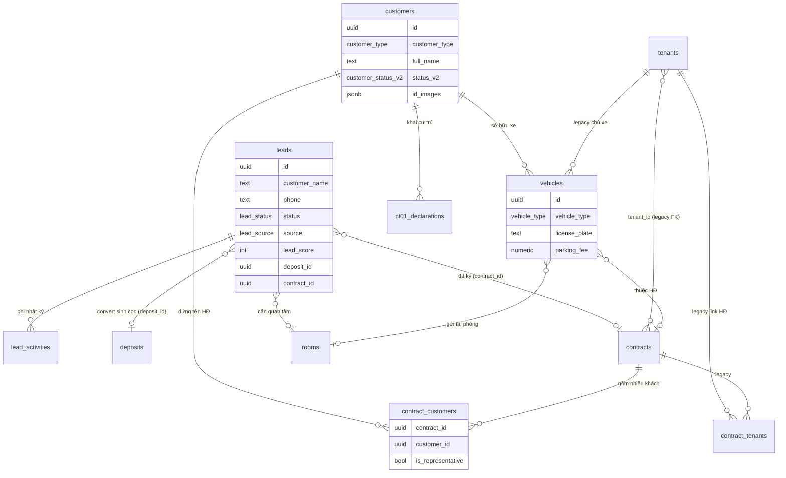
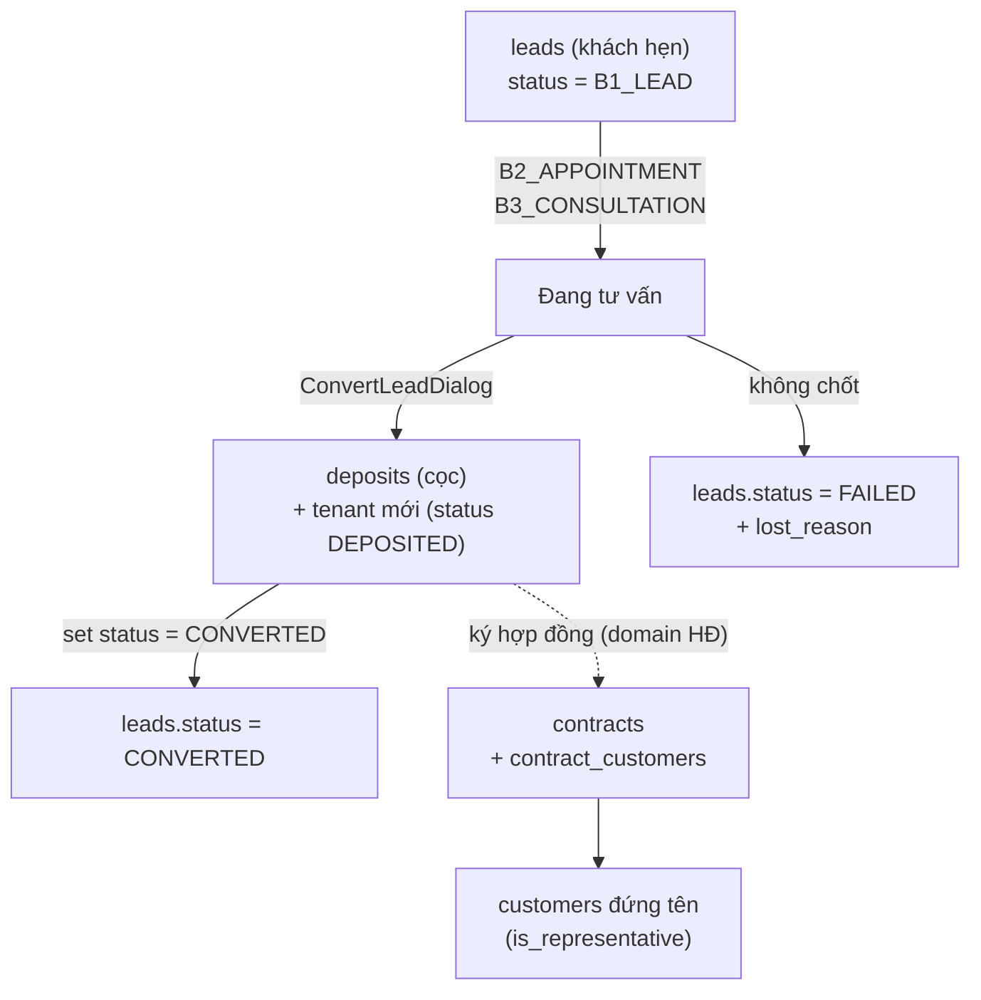
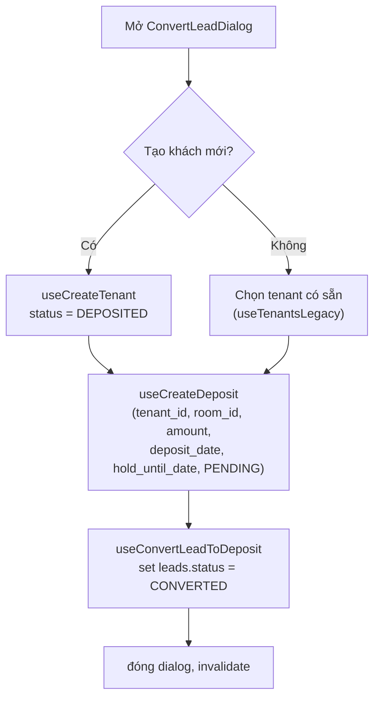

# Khách hàng · Lead (Khách hẹn) · Người thuê · Phương tiện · Tờ khai CT01

> Domain "đầu vào con người" của hệ thống: từ **khách tiềm năng (lead/khách hẹn)** đi qua phễu sale → **đặt cọc** → trở thành **khách hàng (customer)** đứng tên trên **hợp đồng**, kèm hồ sơ phương tiện và tờ khai cư trú CT01. Đây là gốc của mọi liên kết người-trong-hệ-thống: hợp đồng, cọc, hoá đơn, công việc (issue) đều tham chiếu ngược về các bảng ở đây.

---

## 1. Tổng quan & vai trò nghiệp vụ

Domain này quản lý **danh tính con người** ở 3 giai đoạn vòng đời và 2 hồ sơ phụ trợ:

| Giai đoạn / Hồ sơ | Bảng | Vai trò |
|---|---|---|
| Khách tiềm năng (phễu sale) | `leads`, `lead_activities` | Theo dõi lead từ lúc tiếp cận đến khi chốt/loại, có chấm điểm tự động phía DB (`lead_score` — hiện **không hiển thị trên UI**, xem 4.1) và nhật ký hoạt động |
| Khách hàng (hồ sơ chính thức) | `customers` | Hồ sơ đầy đủ (CCCD, địa chỉ, ngân hàng, ảnh giấy tờ); đứng tên hợp đồng |
| Người thuê (legacy) | `tenants` | Bảng cũ; vẫn được hợp đồng/cọc/hoá đơn FK tới; UI `/tenants` đã redirect sang `/customers` |
| Phương tiện | `vehicles` | Xe gắn với khách/hợp đồng/phòng (phí gửi xe, vé xe) |
| Tờ khai cư trú | `ct01_declarations` | Mẫu CT01 (thay đổi thông tin cư trú) in cho công an phường |
| Junction đại diện HĐ | `contract_customers`, `contract_tenants` | Nối nhiều khách/người thuê vào 1 hợp đồng, đánh dấu ai là **đại diện** |

**Điểm cốt lõi cần nhớ — quan hệ customers vs tenants (lịch sử kỹ thuật):**

- Ban đầu hệ thống dùng `tenants` làm hồ sơ người thuê. Hợp đồng (`contracts.tenant_id`), cọc (`deposits.tenant_id`), hoá đơn/thu chi (`income_expenses.tenant_id`), công việc (`issues.reported_by_tenant_id`) đều FK tới `tenants`.
- Sau này refactor sang `customers` làm hồ sơ chuẩn (45 cột, đầy đủ giấy tờ/địa chỉ/tổ chức). Liên kết khách ↔ hợp đồng chuyển sang junction `contract_customers` (xem [useContracts.ts](src/hooks/useContracts.ts) — `contracts.tenant_id` để NULL trên row mới, link thật nằm ở `contract_customers`).
- UI hợp nhất về "Khách hàng": route `/tenants` → `Navigate` sang `/customers`, `/tenants/:id` → `/customers/:id` (xem [App.tsx](../../src/App.tsx) `TenantToCustomerRedirect`). Màn `TenantsPage` cũ đã được gỡ khỏi code; mọi hướng dẫn và liên kết mới phải dùng `/customers`.
- **Hệ quả tài liệu hoá:** `tenants` là *legacy nhưng còn sống* (nhiều FK đang trỏ vào). `customers` là *hồ sơ chính của UI hiện tại*. Hai bảng KHÔNG đồng bộ tự động; chúng tồn tại song song.

**Hai trục trạng thái của customers (đừng nhầm):**

- `status` (`customer_status`: `PROSPECT / ACTIVE / INACTIVE / BLACKLIST`) — trục cũ, mặc định `PROSPECT`, gần như không dùng trong UI hiện tại.
- `status_v2` (`customer_status_v2`: `RENTING / MOVED_OUT / WALK_IN`) — **trục đang dùng** cho tab lọc và mọi truy vấn ([CustomerStatusTabs.tsx](src/components/customers/CustomerStatusTabs.tsx)). Khách tạo mới luôn set `status_v2 = 'RENTING'` ([useCustomers.ts](src/hooks/useCustomers.ts)).
- **Hạn chế hiện tại của `status_v2`:** điểm ghi duy nhất là insert `RENTING` trong `useCreateCustomer` — **không code nào set `MOVED_OUT`/`WALK_IN`** (CustomerForm không expose trường này, flow thanh lý HĐ cũng không cập nhật khách) ⇒ tab "Đã chuyển đi"/"Khách vãng lai" gần như luôn rỗng.

---

## 2. Cấu trúc dữ liệu

### 2.1. `leads` — Khách hẹn / khách tiềm năng

**Mục đích:** lưu khách tiềm năng và tiến trình phễu sale, có chấm điểm tự động.

Cột chủ chốt (xem `node .tmp/schema/cols.mjs leads`):

- **Định danh & liên hệ:** `customer_name` (NOT NULL), `phone` (NOT NULL), `email`, `notes`.
- **Phễu sale:** `status` (`lead_status`, default `B1_LEAD`), `source` (`lead_source`), `lead_score` (int, default 0 — do trigger tính), `lost_reason` (lý do thất bại), `conversion_date`.
- **Nhu cầu thuê:** `budget_min`/`budget_max` (numeric), `move_in_date`, `num_occupants` (default 1), `preferred_room_type`, `appointment_date` (lịch hẹn xem nhà).
- **Theo dõi:** `last_contact_date`, `next_follow_up_date`, `assigned_staff_id` (nhân viên phụ trách).
- **Nguồn giới thiệu:** `referrer_name`, `ctv_name` (cộng tác viên), `finder_name`.
- **Liên kết kết quả:** `deposit_id` (cọc sinh ra khi convert), `contract_id` (HĐ nếu đã ký), `building_id`, `room_id` (căn hộ quan tâm). Lưu ý: flow convert hiện tại **không ghi** `deposit_id` lẫn `conversion_date` (xem 5.1).
- **Hệ thống:** `user_id` (trigger DB tự gán khi INSERT — xem 4.4), `id/created_at/updated_at`, `deleted_at` (soft delete).

**Enum:** `lead_status` = `B1_LEAD → B2_APPOINTMENT → B3_CONSULTATION → CONVERTED / FAILED`; `lead_source` = `FACEBOOK, ZALO, PHONE, REFERRAL, WALK_IN, WEBSITE, OTHER`.

**FK đi ra:** `assigned_staff_id → profiles`, `building_id → buildings`, `room_id → rooms`, `contract_id → contracts`, `deposit_id → deposits`.
**Được tham chiếu bởi:** `lead_activities.lead_id`.

### 2.2. `lead_activities` — Nhật ký hoạt động lead

**Mục đích:** lịch sử tương tác với từng lead (gọi điện, hẹn, đổi trạng thái…).

Cột chủ chốt: `lead_id` (NOT NULL), `activity_type` (varchar — không phải enum, giá trị do FE chuẩn hoá: `CALL/EMAIL/SMS/ZALO/MEETING/VIEWED_ROOM/NOTE/STATUS_CHANGE/FOLLOW_UP/CREATED` định nghĩa trong [leadHelpers.ts](src/lib/leadHelpers.ts) `LEAD_ACTIVITY_TYPES`), `description`, `old_value`/`new_value` (jsonb — thiết kế để log đổi trạng thái, nhưng hàm duy nhất ghi chúng là `logLeadStatusChange` trong [useLeadActivities.ts](src/hooks/useLeadActivities.ts) **không được gọi ở đâu**; `EditLeadDialog` đổi status không log activity ⇒ 2 cột này luôn NULL qua UI hiện tại — chỉ có activity nhập thủ công từ `LeadActivityTimeline`), `performed_by`, `scheduled_at`/`completed_at`, `notes`. `user_id` do trigger DB tự gán (xem 4.4).

**FK đi ra:** `lead_id → leads`.

### 2.3. `customers` — Hồ sơ khách hàng (chính)

**Mục đích:** hồ sơ pháp lý đầy đủ của khách (cá nhân hoặc tổ chức) để ký hợp đồng, xuất CT01.

Cột chủ chốt (45 cột — chỉ nêu nhóm có ý nghĩa nghiệp vụ):

- **Loại & tên:** `customer_type` (`INDIVIDUAL/ORGANIZATION`, default INDIVIDUAL), `full_name` (NOT NULL — với tổ chức để rỗng), `company_name`, `representative` (người đại diện tổ chức).
- **Liên hệ:** `phone` (NOT NULL), `email`.
- **Giấy tờ tuỳ thân:** `id_type` (`CCCD/CMND/PASSPORT/OTHER`, default CCCD), `id_number`, `id_issue_date`, `id_issue_place`, `id_images` (jsonb `{front, back, passport}` — CCCD mặt trước/sau + ảnh hộ chiếu; với ORGANIZATION ô `front` được tái dụng làm "Đăng ký kinh doanh" — xem 5.3), `fingerprint_code` (mã vân tay).
- **Nhân khẩu:** `date_of_birth`, `gender`, `is_foreign` (khách nước ngoài).
- **Địa chỉ:** `province/district/ward/detailed_address`, `current_residence` (chỗ ở hiện tại), `permanent_address` (thường trú), `headquarters_address` (trụ sở tổ chức).
- **Tài chính/nghề:** `bank_account_number`, `bank_name`, `occupation`, `workplace`.
- **Liên hệ phụ:** `contact_person`/`contact_person_phone`, `advisor`/`advisor_phone` (người tư vấn), `emergency_contact_name/_phone/_relationship` (liên hệ khẩn cấp).
- **Trạng thái:** `status` (cũ — `customer_status`), **`status_v2`** (đang dùng — `customer_status_v2`, default RENTING).
- **Khác:** `customer_group`, `notes`, `avatar_url`, `business_registration_url` (giấy phép KD), `vehicles` (jsonb — **di tích, không còn được ghi/đọc**: `useCreateCustomer` ([useCustomers.ts](src/hooks/useCustomers.ts)) tách `vehicles` ra khỏi payload rồi insert thành rows trong **bảng** `vehicles` (`vehicle_type/vehicle_name/license_plate` + `customer_id`), không đụng cột jsonb này).
- **Hệ thống:** `user_id`, `id/created_at/updated_at`, `deleted_at` (soft delete).

**Enum:** `customer_type`, `id_type`, `customer_status`, `customer_status_v2`.

**Được tham chiếu bởi:** `contract_customers.customer_id`, `ct01_declarations.customer_id`, `vehicles.customer_id`.

### 2.4. `tenants` — Người thuê (legacy, còn FK sống)

**Mục đích:** hồ sơ người thuê đời cũ. Vẫn là đích FK của nhiều bảng vận hành.

Cột chủ chốt: `full_name` (NOT NULL), `phone` (NOT NULL), `email`, `id_number`/`id_type`, `date_of_birth`, `gender`, `permanent_address`, `status` (`tenant_status`: `PROSPECT/DEPOSITED/ACTIVE/INACTIVE/BLACKLIST`), `emergency_contact_*`, `avatar_url`, `id_images` (jsonb), `notes`. `user_id`, soft delete qua `deleted_at`.

> Lưu ý: các trạng thái và bộ lọc hiện hành lấy từ màn Khách hàng (`CustomersPage`) và enum generated types; không dùng các tab `MOVED_OUT`/`BLACKLISTED` của UI cũ.

**Được tham chiếu bởi:** `contracts.tenant_id`, `deposits.tenant_id`, `income_expenses.tenant_id`, `issues.reported_by_tenant_id`, `contract_tenants.tenant_id`, `contract_transfers.old_tenant_id`/`new_tenant_id`, `vehicles.tenant_id`.

### 2.5. `vehicles` — Phương tiện

**Mục đích:** quản lý xe của khách (chủ yếu xe máy), phí gửi xe, vé xe theo phòng/HĐ.

Cột chủ chốt: `vehicle_type` (NOT NULL — `MOTORBIKE/CAR/BICYCLE/OTHER/ELECTRIC_BIKE`), `vehicle_name` (dòng xe), `brand`/`model`/`color`, `license_plate` (biển số), `owner_name`, `ticket_number` (số vé xe), `parking_fee` (numeric, default 0), `images` (jsonb)/`image_url`, `notes`. Liên kết: `customer_id`, `tenant_id`, `contract_id`, `building_id`, `room_id`. `user_id`, soft delete `deleted_at`.

**Enum:** `vehicle_type`.
**FK đi ra:** `customer_id → customers`, `tenant_id → tenants`, `contract_id → contracts`, `building_id → buildings`, `room_id → rooms`.

> UI `VehiclesPage` hiện **ẩn bộ lọc loại xe và ghim cứng `vehicle_type = 'MOTORBIKE'`** (xem [VehiclesPage.tsx](src/pages/vehicles/VehiclesPage.tsx) `EMPTY_FILTERS` + `handleFiltersChange`).

### 2.6. `ct01_declarations` — Tờ khai thay đổi thông tin cư trú (CT01)

**Mục đích:** lưu nội dung tờ khai CT01 để in nộp công an, lập từ hồ sơ một khách.

Cột chủ chốt: `customer_id` (NOT NULL), `registration_authority` (cơ quan đăng ký — NOT NULL), khối thông tin người khai (`full_name/date_of_birth/gender/id_number` NOT NULL, `phone/email`), khối địa chỉ (`permanent_address/temporary_address/current_address`), `occupation_workplace`, khối chủ hộ (`household_head_name/_relationship/_id_number`), `request_content` (nội dung đề nghị), `family_members` (jsonb — danh sách thành viên cùng khai). `user_id`, `id/created_at/updated_at` (KHÔNG có soft delete).

**FK đi ra:** `customer_id → customers`.

### 2.7. `contract_customers` & `contract_tenants` — Junction đại diện hợp đồng

**Mục đích:** một hợp đồng có thể có nhiều khách/người thuê; junction đánh dấu ai là **đại diện** (`is_representative`).

- `contract_customers`: `contract_id` + `customer_id` (cả hai NOT NULL), `is_representative` (default false), `notes`. → đây là **link chính** giữa khách và hợp đồng trong code hiện tại.
- `contract_tenants`: `contract_id` + `tenant_id`, `is_representative`, `move_in_date` (ngày dọn vào của người thuê đó), `notes`. → junction legacy, đi với bảng `tenants`. Trong frontend hầu như chỉ xuất hiện trong type generated; logic chính dùng `contract_customers`.

**FK đi ra:** `contract_id → contracts`; `customer_id → customers` / `tenant_id → tenants`.

---

## 3. Sơ đồ quan hệ dữ liệu

Phễu chuyển đổi tổng quát (lead → cọc → khách + HĐ):

---

## 4. Quy tắc nghiệp vụ & tự động hoá

### 4.1. Chấm điểm lead — trigger `update_lead_score` + RPC `calculate_lead_score`

Định nghĩa trong [029_missing_features.sql](supabase/migrations/029_missing_features.sql).

- **Trigger `trigger_update_lead_score`** chạy **BEFORE INSERT OR UPDATE** trên `leads`, gọi `update_lead_score()`, gán thẳng `NEW.lead_score`. Nghĩa là mọi lần tạo/sửa lead, điểm được tính lại tự động, FE không cần gửi `lead_score`.
- **Thang điểm (tối đa 100):**
  - Ngân sách: có `budget_max` +30, chỉ có `budget_min` +15.
  - Lịch hẹn: `appointment_date` tương lai +25, quá khứ +10.
  - Nguồn: REFERRAL 20 / WALK_IN 18 / WEBSITE 15 / FACEBOOK·ZALO 12 / PHONE 10 / OTHER 5 (trong SQL trigger).
  - Tiến trình: CONVERTED +20, B3 +15, B2 +10, B1 +5, FAILED +0.
  - Email +5; `move_in_date` trong 30 ngày +5.
- **RPC `calculate_lead_score(lead_id)`** (read-only) tính lại điểm từ record đã có — dùng cho backfill (`UPDATE leads SET lead_score = calculate_lead_score(id)` ở cuối migration).
- **Lưu ý — cơ chế điểm hiện "nửa vời" phía UI:** [leadHelpers.ts](src/lib/leadHelpers.ts) có bộ helper `calculateLeadScore()` / `getLeadScoreColor()` / `getLeadScoreLabel()` (thang status lệch SQL: FE tối đa 15, SQL tối đa 20) nhưng là **dead code — không file nào import**. `lead_score` cũng **không hiển thị ở bất kỳ UI nào** ([LeadCard](src/components/leads/LeadCard.tsx) lẫn [LeadDetailDialog](src/components/leads/LeadDetailDialog.tsx) đều không render điểm). Thêm nữa, `CreateLeadDialog`/`EditLeadDialog` không có input `budget_min/max`, `move_in_date`, `num_occupants`, `preferred_room_type` ⇒ tối đa 35/100 điểm (ngân sách 30 + dọn vào trong 30 ngày 5) không bao giờ đạt được qua UI. Điểm "thật" duy nhất là `leads.lead_score` do trigger tính.

### 4.2. Một đại diện duy nhất mỗi HĐ — trigger `check_contract_representative`

Định nghĩa trong [20250710000001_lease_contract_management.sql](supabase/migrations/20250710000001_lease_contract_management.sql).

- Trigger `ensure_single_representative` chạy **BEFORE INSERT OR UPDATE** trên `contract_customers`. Khi `NEW.is_representative = true`, nó **tự bỏ cờ đại diện của mọi row khác cùng `contract_id`**.
- **Bất biến:** mỗi hợp đồng có tối đa một `contract_customers.is_representative = true`. (Không ép buộc *ít nhất một* — nếu không tick ai thì không có đại diện.)
- `contract_tenants` cũng có cột `is_representative` nhưng không thấy trigger tương ứng cho bảng legacy này.

### 4.3. Soft delete khách — RPC `soft_delete_customer`

Định nghĩa gốc trong [20250702000002_soft_delete_customer_rpc.sql](supabase/migrations/20250702000002_soft_delete_customer_rpc.sql); bản hiện hành đã được **redefine kèm bypass super admin** trong [20260514000005_super_admin_bypass_rpcs_and_storage.sql](supabase/migrations/20260514000005_super_admin_bypass_rpcs_and_storage.sql).

- `SECURITY DEFINER`, chỉ set `deleted_at = NOW()` khi `(user_id = auth.uid() OR is_super_admin())` và row chưa bị xoá; nếu không khớp → `RAISE EXCEPTION 'Customer not found or not authorized'`.
- FE gọi qua `useDeleteCustomer` ([useCustomers.ts](src/hooks/useCustomers.ts)) → `supabase.rpc('soft_delete_customer', { p_customer_id })`.
- **Bất biến:** mọi truy vấn khách trong UI đều `.is("deleted_at", null)` ⇒ khách "đã xoá" biến mất khỏi danh sách nhưng KHÔNG mất khỏi DB (giữ tham chiếu HĐ/hoá đơn).
- Lead, tenant, vehicle cũng soft-delete nhưng **không qua RPC** — chỉ `update({ deleted_at })` trực tiếp (xem `useDeleteLead`, `useDeleteTenant`, `useDeleteVehicle`).

### 4.4. Phân quyền RLS — RBAC theo module & toà nhà (mô hình scope cũ đã gỡ)

Đợt chuyển RBAC 2026-05-27/28 đã **thay toàn bộ** mô hình cũ (`customer_in_my_scope`, `staff_in_building`, `staff_can` của [20260518000051_staff_building_scope_writes.sql](supabase/migrations/20260518000051_staff_building_scope_writes.sql)): migration batch F ([20260528000003_rbac_batch_f_drop_legacy.sql](supabase/migrations/20260528000003_rbac_batch_f_drop_legacy.sql)) DROP sạch policy legacy của domain này (`customers_staff_*`, `tenants_staff_*`, `leads_staff_*`, `vehicles_staff_*`, các policy `user_id = auth.uid()` của `lead_activities`/`ct01_declarations`…). Policy hiện hành (đuôi `_rbac`):

| Bảng | Policy hiện hành | Ghi chú |
|---|---|---|
| `customers`, `tenants` | `can_access_org_entity('customers', action)` | Quyền org **toàn cục, KHÔNG giới hạn theo toà** ([20260527000009_rbac_phase5_misc.sql](supabase/migrations/20260527000009_rbac_phase5_misc.sql)) |
| `ct01_declarations` | `can_access_org_entity('customers', action)` | [20260528000001_rbac_batch_a_config_tables.sql](supabase/migrations/20260528000001_rbac_batch_a_config_tables.sql) |
| `lead_activities` | `can_access_org_entity('leads', action)` | Không còn check `user_id = auth.uid()` |
| `leads`, `vehicles` | `building_id` NOT NULL → `can_do_on_building('leads'/'vehicles', action, building_id)` (SELECT dùng `can_access_building`); `building_id` NULL → fallback `can_access_org_entity` | Pattern "hybrid" nhóm B của [20260527000009_rbac_phase5_misc.sql](supabase/migrations/20260527000009_rbac_phase5_misc.sql) |
| `contract_customers`, `contract_tenants` | traverse `building_of_contract(contract_id)` với quyền module **`contracts`** ([20260527000007_rbac_phase3_contracts.sql](supabase/migrations/20260527000007_rbac_phase3_contracts.sql)) | Sửa đại diện HĐ cần quyền `contracts`, KHÔNG phải `customers` |

- **Helpers** ([20260527000053_rbac_helpers.sql](supabase/migrations/20260527000053_rbac_helpers.sql)): `can_access_building(b)` = super_admin/admin hoặc có row `staff_assignments` khớp toà (hoặc `building_id IS NULL` = full scope); `can_do_on_building(table, action, b)` check thêm quyền `{table: {action: true}}` trong permissions JSONB. Từ [20260529000001_per_staff_permissions.sql](supabase/migrations/20260529000001_per_staff_permissions.sql), các helper ghi quyền dùng `COALESCE(staff_assignments.permissions, roles.permissions)` — **override quyền per-staff** ưu tiên hơn role.
- **Trigger auto-fill `user_id`:** các bảng `customers`, `tenants`, `leads`, `lead_activities`, `vehicles` ([20260527000009_rbac_phase5_misc.sql](supabase/migrations/20260527000009_rbac_phase5_misc.sql)) và `ct01_declarations` ([20260528000001_rbac_batch_a_config_tables.sql](supabase/migrations/20260528000001_rbac_batch_a_config_tables.sql)) có trigger `*_set_user_id_audit` BEFORE INSERT gọi `set_user_id_from_auth()` — FE không còn bắt buộc gửi `user_id` (dù các hook vẫn gửi kèm).
- **Ma trận quyền FE:** [permissions.ts](src/lib/permissions.ts) nhóm "Khách hàng" gồm module `leads` (extra `convert/export`), `deposits` (extra `convert/refund/print`), `contracts` (extra `approve/renew/transfer/terminate/handover/print/export`), `customers` — nhãn "Cư dân" (extra `import/print/export`), `vehicles`; tên module khớp key trong `roles.permissions`/`staff_assignments.permissions`. Từ f528cd8 (2026-06-11), gate hành động chi tiết trên UI đi qua **catalog theo TRANG** [permissionPages.ts](src/lib/permissionPages.ts) + helper `canUse` (fallback về quyền gốc) — vd [CustomerListToolbar](src/components/customers/CustomerListToolbar.tsx) kiểm `canUse(perms, 'customers', 'create'/'import'/'export'/'print')` bên cạnh `hasAnyScope`.
- **Mirror UI qua `useMyBuildingScope`** (RPC `get_my_assignments` đọc `staff_assignments`):
  - Trang Khách hàng: [CustomerListToolbar](src/components/customers/CustomerListToolbar.tsx) ẩn nút Thêm + Nhập Excel khi `!hasAnyScope`; [CustomerListTable](src/components/customers/CustomerListTable.tsx) ẩn Sửa/Xoá per-row qua `canManageBuilding(current_building_id)` — khách chưa thuê (`current_building_id` NULL) thì cho phép. Đây chính là lý do `useCustomers` enrich `current_building_id` (xem 5.2).
  - Trang Phương tiện: [VehicleListToolbar](src/components/vehicles/VehicleListToolbar.tsx) ẩn Thêm/Nhập khi `!hasAnyScope`; [VehicleListTable](src/components/vehicles/VehicleListTable.tsx) per-row theo `canManageBuilding(vehicle.building_id)` — xe không gắn toà chỉ người `canManageAll` quản.
- **Hệ quả nghiệp vụ:** danh sách khách (`SELECT customers`) mở theo quyền org `customers.view` — staff có quyền là thấy **mọi khách, không giới hạn toà** (khác mô hình scope cũ); còn lead/xe đã gắn `building_id` thì staff chỉ thấy/sửa trong toà được giao.

### 4.5. Liên kết khách ↔ hợp đồng được tạo ở domain Hợp đồng

Khi tạo HĐ ([useContracts.ts](src/hooks/useContracts.ts)): insert `contracts` (để `tenant_id` NULL), rồi batch insert `contract_customers` (mỗi khách 1 row, đánh dấu đại diện). Trang chi tiết khách đọc ngược lại junction này để hiện danh sách HĐ. `create_tenant_transfer` ([014_contract_transfers.sql](supabase/migrations/014_contract_transfers.sql)) là helper legacy đổi `tenants` trên HĐ (ghi `contract_transfers` với `old/new_tenant_id`), không thuộc luồng customers mới.

---

## 5. Quy trình theo từng trang (page)

### 5.1. `/leads` — [LeadsPage.tsx](src/pages/leads/LeadsPage.tsx)

**Mục đích:** bảng Kanban 5 cột theo `lead_status`, theo dõi phễu sale.

**Dữ liệu:** `useLeads()` ([useLeads.ts](src/hooks/useLeads.ts)) — select `leads` + embed `building`, `room(+building)`, sort `created_at` desc, **không phân trang** (tải toàn bộ leads). (Lưu ý: hook **không** lọc `deleted_at` dù delete là soft, và RLS RBAC cũng không lọc ⇒ **lead đã xoá vẫn hiện lại** trên Kanban sau invalidate — nút Xoá trông như "không ăn".) Lọc client-side theo tên/SĐT/email/căn/tòa (ô tìm kiếm **giữ qua F5** — `usePersistedState` key `flt:leads:search`, 7fd2d3f); chia cột bằng `getLeadsByStatus`. Nút thao tác gate qua `canUse(perms, 'leads', ...)` (xem 4.4).

**Thao tác từng-bước:**

1. **Tạo lead** → `CreateLeadDialog` → `useCreateLead` insert kèm `user_id` → trigger tính `lead_score` → invalidate `["leads"]`.
2. **Sửa** → `EditLeadDialog` → `useUpdateLead` (re-tính điểm qua trigger).
3. **Xem chi tiết** → `LeadDetailDialog` ([LeadDetailDialog.tsx](src/components/leads/LeadDetailDialog.tsx)) — hiển thị liên hệ/nguồn/toà/căn quan tâm/lịch hẹn/ghi chú + timeline `LeadActivityTimeline`; **không** hiển thị điểm `lead_score` (xem 4.1).
4. **Convert** → `ConvertLeadDialog` (xem flow dưới).
5. **Xoá** → `confirm()` → `useDeleteLead` set `deleted_at`.
6. **Xuất Excel** → `ExportExcelDialog exportType="leads"`.

**Convert lead → cọc** ([ConvertLeadDialog.tsx](src/components/leads/ConvertLeadDialog.tsx)):

- **Validate (zod `convertSchema`):** `room_id` bắt buộc, `amount >= 0`, `deposit_date` & `hold_until_date` bắt buộc.
- **Edge case:** không chọn/không tạo tenant → throw `"Phải chọn hoặc tạo khách hàng"`. Lưu ý convert (theo thiết kế) tạo **tenant** (bảng legacy) + **deposit**, KHÔNG tạo bản ghi `customers`; `useConvertLeadToDeposit` chỉ `update({ status: 'CONVERTED' })`, **không** gắn `deposit_id` lẫn `conversion_date` ngược lại lead.
- **UI dialog:** ô "Căn hộ *" lấy `useRooms()` **toàn bộ phòng mọi toà, mọi trạng thái** (kể cả đang thuê) bằng Select thường (không gõ-tìm); ô "Chọn khách hàng" cũng là Select thường load toàn bộ `tenants` legacy (`useTenantsLegacy`).
- **🐞 BUG đang hỏng toàn flow:** payload insert gửi key **`hold_until_date`** trong khi cột thật của `deposits` là **`hold_until`** → PostgREST từ chối INSERT (PGRST204) → `createDeposit` throw → convert **fail hoàn toàn** (tenant mới có thể đã tạo, deposit không tạo, lead **không** flip CONVERTED; lỗi chỉ ra console). Đây là điểm ghi cuối cùng còn trỏ vào bảng `deposits` toàn hệ (các form khác đã viết lại — doc 04 §5.4).
- **⚠️ Lệch kiến trúc cọc (kể cả khi sửa bug trên):** flow này đổ vào thế giới cọc **LEGACY** (row bảng `deposits` status `PENDING` + `tenants` status `DEPOSITED`) — bảng `deposits` nay đã **chết** (0 dòng, doc 04 §2.1); nguồn sự thật cọc giữ chỗ hiện hành là **phiếu thu cọc mồ côi trong `income_expenses`** (item `is_deposit`, `contract_id NULL`). Hệ quả: cọc sinh từ convert **không** xuất hiện ở tab "Phiếu giữ chỗ" `/deposits` (đọc `income_expenses`), **không** tự giữ phòng qua nhánh IE, và khi ký HĐ phải nhập lại hồ sơ `customers` từ đầu. Hướng đúng: viết lại theo cơ chế `CreateDepositDialog` mới (doc 04 §5.4).

### 5.2. `/customers` — [CustomersPage.tsx](src/pages/customers/CustomersPage.tsx)

**Mục đích:** danh sách khách hàng có tab trạng thái, thẻ thống kê, lọc vị trí, phân trang, import/export.

**Rẽ nhánh mobile (f0950a2, 2026-06-17):** viewport phone (`usePhoneViewport()`, ≤767px) → lazy-load **[CustomersMobilePage.tsx](src/pages/customers/CustomersMobilePage.tsx)** — màn app full-screen riêng NGOÀI MainLayout (CSS scope độc lập `src/styles/mobileApp.css`): tab trạng thái + dropdown toà (lọc client theo `current_building_id` như desktop) + tìm kiếm; thẻ KH hiện tên + **SĐT kèm nút copy** (78b761b) + CCCD/ngày sinh/địa chỉ/phòng + **chip loại xe + biển số** (query gộp `vehicles` theo customer_id) + nút **Gọi · Zalo** — nút Zalo chỉ là **deep-link `https://zalo.me/{SĐT}`** mở app Zalo ngoài, KHÔNG liên quan module Chat Zalo nội bộ ([doc 18](docs/he-thong/18-zalo-chat.md), chưa có gắn dữ liệu khách ↔ hội thoại). Hàng chip lọc loại KH trên mobile đã gỡ (e4a260f). Desktop giữ nguyên bảng.

**Dữ liệu (desktop):**
- `useCustomers(effectiveFilters, {page,pageSize})` — lọc `status_v2` theo tab; `statFilter` (ALL/INDIVIDUAL/ORGANIZATION/FOREIGN); search `full_name/phone/email/id_number`; lọc building/room qua `contract_customers`; phân trang `range`. Sau khi lấy trang, **enrich** thêm `current_building_id/_name` + `current_room_name` từ HĐ còn-hiệu-lực (`isContractInEffect`, query `contract_customers` theo chunk 80 id) — vừa hiển thị "Căn hộ đang ở" vừa phục vụ per-row scope check (xem 4.4). Lỗi query bị **nuốt** (trả mảng rỗng thay vì throw) ⇒ lỗi RLS/network hiển thị như "Chưa có khách hàng nào".
- Ô lọc vị trí ([CustomerListFilters.tsx](src/components/customers/CustomerListFilters.tsx)) — từ 3c3b7fa (2026-06-30): **`BuildingFilterSelect`** ([BuildingFilterSelect](src/components/buildings/BuildingFilterSelect.tsx) — danh sách **phẳng A→Z, chọn 1 toà hoặc tất cả**, thay `BuildingMultiSelect` nhóm-theo-khu của 9ad626d; state giữ shape mảng 0/1 phần tử) + **Phòng** (SearchableSelect, `useRooms(singleBuildingId)`, chỉ bật khi chọn đúng 1 toà; đổi phạm vi toà reset `room_id`). Bộ lọc toà chạy **client-side trên trang dữ liệu hiện tại**: so `buildingIds.includes(customer.current_building_id)` (toà của HĐ còn-hiệu-lực enrich sẵn) — KHÔNG vào query server.
- Tab / statFilter / bộ lọc / ô search **giữ qua F5** bằng `usePersistedState` key `flt:customers:*` (7fd2d3f).
- `useCustomerStats(statsFilters)` — đếm total/individual/organization/foreign (kéo toàn bộ rows khớp filter rồi đếm client-side; chạy lại mỗi keystroke vì ô search không debounce).

**Thao tác:**
1. **Đổi tab** (`RENTING/MOVED_OUT/WALK_IN`) → reset statFilter & page=1.
2. **Click thẻ thống kê** → set `statFilter`.
3. **Thêm** → điều hướng `/customers/new` (nút Thêm + Nhập Excel chỉ hiện khi `hasAnyScope` **và** `canUse(perms, 'customers', 'create'/'import')`; Xuất/In theo `canUse(..., 'export'/'print')` — xem 4.4).
4. **Xem** → `CustomerDetailModal`; **Sửa** → `/customers/:id/edit`; **Xoá** → `DeleteCustomerDialog` (Sửa/Xoá ẩn per-row khi khách đang thuê toà ngoài scope — `canManageBuilding(current_building_id)`).
5. **Import** → `CustomerImportExportDialog`; mỗi dòng `useCreateCustomer.mutateAsync` (mặc định INDIVIDUAL), tải ảnh CCCD từ URL cột L (`uploadIdImagesFromUrls`) rồi update `id_images`; gom kết quả thành công/thất bại; map mã lỗi PG (`23505`→trùng SĐT/CCCD, `23514`→SĐT sai định dạng, `22008`→ngày sai).
6. **Export** → `exportCustomers`.

> **Lưu ý lọc PHÒNG vẫn vô hiệu:** chọn phòng đặt `filters.room_id` đi vào `useCustomers` → `resolveCustomerIdsByLocation` hiện trả `[]` ngay (biến `contractIds` hard-code rỗng) ⇒ chọn phòng ra **0 khách**. (Lọc TOÀ đã hoạt động — nhưng client-side theo `current_building_id` như mô tả trên, không qua hàm này; cảnh báo "khu vực bị ignore" cũ hết hiệu lực vì ô khu vực đã gỡ.) Toggle grid/list trên toolbar vẫn là nút chết — đổi state nhưng luôn render bảng list.

### 5.3. `/customers/new` & `/customers/:id/edit` — [CustomerFormPage.tsx](src/pages/customers/CustomerFormPage.tsx)

**Mục đích:** tạo/sửa hồ sơ khách qua `CustomerForm`.

- **Quét QR CCCD tự điền hồ sơ** (chỉ hiện với khách CÁ NHÂN): khối [CCCDQrUpload](src/components/customers/CCCDQrUpload.tsx) nhận ảnh QR qua kéo-thả / click chọn file / paste Ctrl+V / camera ([CCCDQrCameraScanner](src/components/customers/CCCDQrCameraScanner.tsx)). `decodeQrFromFile` đọc QR → [parseCccdQr](src/lib/cccdQrParser.ts) tách payload chuẩn Bộ Công An (7 trường phân tách `|`) → [CustomerForm](src/components/customers/CustomerForm.tsx) `handleCccdParsed` tự điền `full_name`, `id_number`, `date_of_birth`, `gender`, `id_issue_date`, `id_issue_place` (mặc định "Cục Cảnh Sát"), `permanent_address`. Kèm `lookupAddressFromText` ([cccdAddressLookup](src/lib/cccdAddressLookup.ts)) tự set cascading tỉnh/quận/phường: seed React Query cache districts/wards trước, rồi chờ **2 animation frame** giữa mỗi cấp (Radix Select reset value nếu SelectItem chưa mount — fix riêng cho iOS Safari).
- **Upload ảnh giấy tờ** qua [ImageUploadZone](src/components/customers/ImageUploadZone.tsx) (bucket mặc định **`customer-images`** — private; hỗ trợ kéo-thả + paste clipboard; validate ảnh ≤ 10MB): khách cá nhân có 3 ô `id_images.front/back/passport` (CCCD trước/sau + Hộ chiếu); ORGANIZATION chỉ còn ô `front` được tái dụng làm "Đăng ký kinh doanh".
- Edit: `useCustomer(id)` nạp default values; build `id_images` chỉ khi là object (mảng `[]` legacy → undefined để zod không reject).
- Validate: `customerSchema` (discriminatedUnion theo `customer_type` — [customerValidation.ts](src/lib/customerValidation.ts)): INDIVIDUAL cần `full_name`; ORGANIZATION cần `company_name`; cả hai cần `phone` khớp `^[0-9]{10,11}$`, email hợp lệ nếu nhập.
- Submit: `useCreateCustomer` (set `status_v2='RENTING'`, tách `vehicles` inline insert sang bảng `vehicles`) hoặc `useUpdateCustomer`; thành công → `navigate('/customers')`.
- Edge case: lỗi `23505` → toast "SĐT hoặc CCCD đã tồn tại".

### 5.4. `/customers/:id` — [CustomerDetailPage.tsx](src/pages/customers/CustomerDetailPage.tsx)

**Mục đích:** trang chi tiết khách (thông tin cá nhân, ảnh CCCD, địa chỉ, phương tiện, hợp đồng, liên hệ khẩn cấp, ghi chú).

**Rẽ nhánh mobile (f0950a2):** viewport phone → lazy-load **[CustomerDetailMobilePage.tsx](src/pages/customers/CustomerDetailMobilePage.tsx)** — header + hàng nút kéo-cuộn (Gọi/Zalo deep-link/Sao chép/Sửa/CT01/Xoá, ẩn-hiện theo quyền); thẻ Thông tin cá nhân / Địa chỉ / Phương tiện / Hợp đồng từ cùng nguồn dữ liệu thật; tái dùng `DeleteCustomerDialog`.

- Dữ liệu: `useCustomer(id)`; `useVehicles({customer_id:id})`; query riêng `customer-contracts` đọc `contract_customers` → embed `contract(+room+building)`, lọc bỏ HĐ `deleted_at`.
- Ảnh CCCD render bằng `StorageImage` (bucket private + signed URL — đúng quy ước bảo mật).
- Thao tác: Sao chép thông tin (clipboard), Sửa, **Mẫu CT01** (`/customers/:id/ct01`), Xoá (`DeleteCustomerDialog` → `soft_delete_customer`). Badge HĐ map `CONTRACT_STATUS_LABEL` chỉ gồm **ACTIVE/TRANSFERRED/TERMINATED/EXPIRED/DRAFT** — `EXTENDED` đã bị bỏ khỏi map (khớp việc ngưng dùng status này 2026-06-06; status lạ rơi vào fallback hiển thị raw text). Trang **không** hiển thị `RenewedBadge` ("đã gia hạn" không xuất hiện ở chi tiết khách). Cờ "Đại diện" lấy từ `is_representative`. Bảng phương tiện hiển thị cả `parking_fee` — cột này KHÔNG nhập được từ `VehicleFormDialog` (xem 5.7).

### 5.5. `/customers/:id/ct01` — [CT01FormPage.tsx](src/pages/customers/CT01FormPage.tsx)

**Mục đích:** lập + in tờ khai CT01 từ hồ sơ khách.

- Dữ liệu: `useCustomer(id)` (đổ sẵn vào form), `useCreateCT01Declaration`.
- Validate `ct01Schema` ([ct01Validation.ts](src/lib/ct01Validation.ts)): bắt buộc `registration_authority`, `full_name`, `date_of_birth`, `gender`, `id_number`; `family_members` mặc định `[]`.
- Bước: submit → `createDeclaration.mutateAsync({customerId, data})` lưu vào `ct01_declarations` → set `printData` → `setTimeout(window.print,100)` in `CT01PrintLayout`. Nút "Chỉ in" in lại không lưu thêm.
- Edge case: không có khách → "Không tìm thấy khách hàng".
- **Lịch sử tờ khai:** mỗi lần "Lưu & In" insert bản ghi mới vào `ct01_declarations`, nhưng hook đọc lịch sử `useCT01Declarations(customerId)` ([useCT01Declarations.ts](src/hooks/useCT01Declarations.ts)) là **dead code — không UI nào dùng** ⇒ tờ khai lưu xong không có chỗ xem/in lại (chỉ in lại được trong session hiện tại qua nút "Chỉ in"); dữ liệu tích tụ một chiều.

### 5.6. `/tenants` (legacy)

Route này chỉ là alias chuyển hướng sang `/customers`; không còn page riêng để cập nhật. Khi kiểm thử hoặc viết tài liệu mới, dùng `/customers` và `src/pages/customers/**`.

**Mục đích:** trang người-thuê cũ — hiện là **dead code hoàn toàn**: [App.tsx](src/App.tsx) đã bỏ cả import, không route nào render nó (`/tenants` → `Navigate` `/customers`, `/tenants/:id` → `TenantToCustomerRedirect`).

- Dữ liệu: `useTenants({status}, {page,pageSize})` — lọc `tenants` theo `status`, `.is(deleted_at,null)`, phân trang.
- Thao tác: Thêm (`CreateTenantDialog`), Sửa (`EditTenantDialog`), Xoá (`DeleteTenantDialog` → `useDeleteTenant` soft delete), Xem → trỏ `/customers/{tenant.id}` — dùng id bảng `tenants` tra vào bảng `customers` nên nếu page được gắn lại route sẽ luôn ra "Không tìm thấy khách hàng" (xem mục 1).
- Edge case: tab `MOVED_OUT`/`BLACKLISTED` không khớp enum `tenant_status` → count = 0.

### 5.7. `/vehicles` — [VehiclesPage.tsx](src/pages/vehicles/VehiclesPage.tsx)

**Mục đích:** danh sách phương tiện (desktop ghim cứng `MOTORBIKE`), tìm kiếm, lọc, phân trang.

**Rẽ nhánh mobile (f0950a2):** viewport phone → lazy-load **[VehiclesMobilePage.tsx](src/pages/vehicles/VehiclesMobilePage.tsx)** — panel lọc (loại·toà·phòng) + chip lọc đang áp + thẻ xe; tái dùng `VehicleFormDialog`. **Khác desktop: bản mobile cho lọc ĐỦ loại xe** (desktop khoá Xe máy).

- Dữ liệu: `useVehicles(filters, {page,pageSize})` ([useVehicles.ts](src/hooks/useVehicles.ts)) — embed `customer/building/room`, `.is(deleted_at,null)`. Search ghép biển số/tên xe/owner + `customer_id.in.(…)` từ khách khớp tên (vì PostgREST `.or()` không OR xuyên bảng embed). Hook còn hỗ trợ filter `contract_id`, `customer_id`, `vehicle_name`, `color`, `room_ids`; lỗi query bị **nuốt** (trả mảng rỗng). Bộ lọc + search **giữ qua F5** (`usePersistedState` key `flt:vehicles:*` — 7fd2d3f; khi đổi filter, `vehicle_type` luôn bị ép lại `MOTORBIKE` trên desktop).
- Bộ lọc ([VehicleFilterPanel.tsx](src/components/vehicles/VehicleFilterPanel.tsx) — drawer chỉ mở được trên **mobile**, nút `SlidersHorizontal` nằm trong `if (isMobile)`): 4 ô `SearchableSelect` — **Toà nhà** (`building_id` eq trực tiếp trên cột `vehicles.building_id`); **Phòng** gộp theo TÊN xuyên toà (`roomIdsByName` → `.in('room_id', room_ids)` — nhiều toà cùng phòng "101" thành 1 mục); **Dòng xe** & **Màu** lấy distinct từ `useDistinctVehicleValues` (quét toàn bộ `vehicles` rồi distinct client-side).
- Thao tác: Thêm/Sửa (`VehicleFormDialog`), Xoá (`DeleteVehicleDialog` → `useDeleteVehicle` soft delete). **Nút Xuất/Nhập Excel là stub** — `handleExport`/`handleImport` ở [VehiclesPage.tsx](src/pages/vehicles/VehiclesPage.tsx) chỉ `console.log`, chưa có chức năng. Toggle grid/list cũng là nút chết (luôn render bảng list).
- Form ([VehicleFormDialog.tsx](src/components/vehicles/VehicleFormDialog.tsx)) chỉ expose `vehicle_type/vehicle_name/color/license_plate/owner_name/ticket_number/building/room/customer/image_url` — **KHÔNG nhập được `parking_fee`, `brand`, `model`, `notes`, `images` (jsonb)** dù cột tồn tại và `parking_fee` được hiển thị ở chi tiết khách (5.4). Dropdown chọn khách load `useCustomers(undefined, {page:1, pageSize:500})` — dialog được render sẵn cùng trang (không mount theo nút Thêm/Sửa) nên query này kèm cả vòng enrich HĐ chạy ngay khi vào trang `/vehicles`.
- RLS/UI: `useMyBuildingScope().hasAnyScope` ẩn nút "Thêm"/"Nhập"; Sửa/Xoá per-row theo `canManageBuilding(vehicle.building_id)` — khớp policy `vehicles_*_rbac` theo `building_id` (xem 4.4); xe không gắn toà chỉ người `canManageAll` quản.

---

## 6. Liên kết sang domain khác (vào / ra)

**Ra (domain này tham chiếu sang nơi khác):**

- `leads.building_id/room_id` → **Toà nhà & Căn hộ**: căn hộ khách quan tâm.
- `leads.deposit_id` → **Đặt cọc**; `leads.contract_id` → **Hợp đồng**: kết quả convert/ký.
- `leads.assigned_staff_id` → **Người dùng/Nhân sự** (`profiles`).
- `vehicles.building_id/room_id` → **Toà nhà & Căn hộ**: nơi gửi xe; `vehicles.contract_id` → **Hợp đồng**.
- `contract_customers.contract_id` / `contract_tenants.contract_id` → **Hợp đồng**.

**Vào (domain khác trỏ về đây):**

- **Hợp đồng** ↔ `customers` qua `contract_customers` (link chính, có đại diện) và `contracts.tenant_id` → `tenants` (legacy). `contract_transfers.old/new_tenant_id` → `tenants` khi chuyển nhượng.
- **Đặt cọc** (`deposits.tenant_id`) → `tenants`: cọc gắn người thuê — thế giới cọc **legacy, bảng `deposits` nay đã chết** (0 dòng — doc 04 §2.1); convert lead là code cuối cùng còn trỏ vào và đang hỏng (bug 5.1). Kiến trúc cọc hiện hành gắn khách qua `income_expenses.tenant_id`/`payer_name` trên phiếu thu cọc `is_deposit` (doc 04). Dialog "Tạo đặt cọc" mới ở `/deposits` và `ConvertLeadDialog` vẫn tạo **tenant** legacy `status='DEPOSITED'` khi tick "Tạo khách hàng mới".
- **Hoá đơn / Thu chi** (`income_expenses.tenant_id`) → `tenants`: dòng tiền gắn người thuê.
- **Công việc / Sự cố** (`issues.reported_by_tenant_id`) → `tenants`: ai báo sự cố.
- **Người dùng / Phân quyền:** RLS của domain này chạy trên `roles.permissions` + `staff_assignments.permissions` (override per-staff) qua các helper RBAC (xem 4.4); FE đọc scope qua RPC `get_my_assignments` (`useMyBuildingScope`). RBAC gom `tenants` + `ct01_declarations` dưới quyền module `customers`, `lead_activities` dưới `leads`; còn `contract_customers/_tenants` đi theo quyền module `contracts`.

**Lý do liên kết:** domain này là **nguồn danh tính** của hệ thống — mọi nghiệp vụ vận hành (ký HĐ, thu cọc, xuất hoá đơn, ghi nhận chỉ số, mở công việc) đều phải quy về một con người/tổ chức cụ thể, hoặc ở dạng hồ sơ chuẩn (`customers`) hoặc ở dạng legacy còn FK sống (`tenants`).
