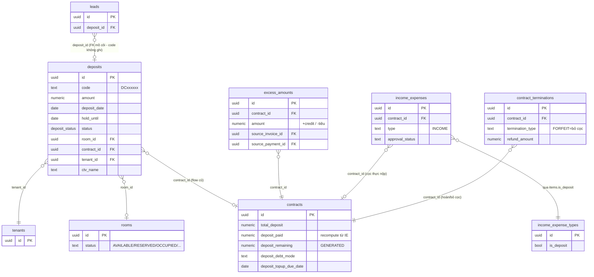
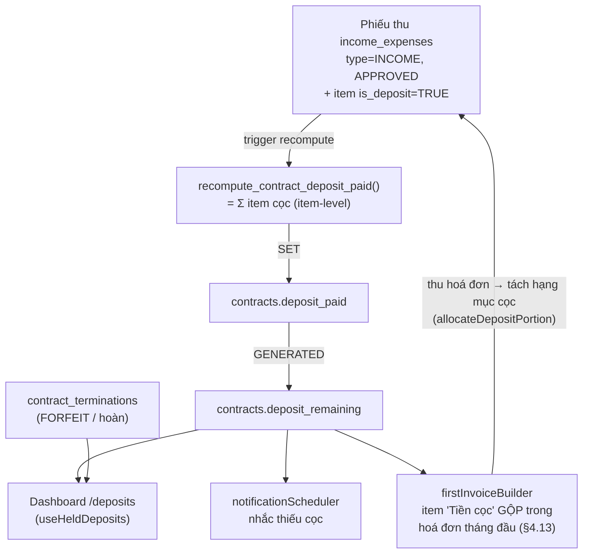
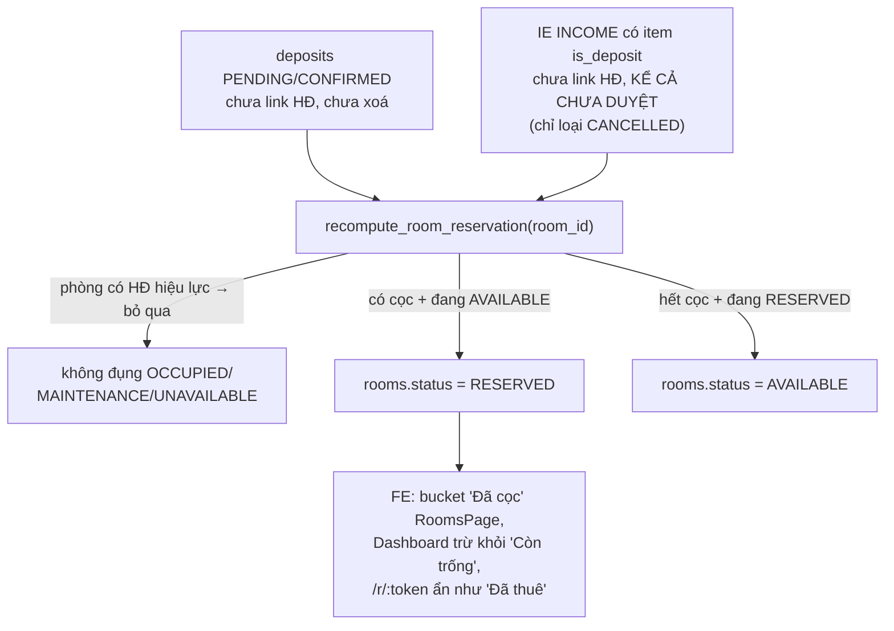
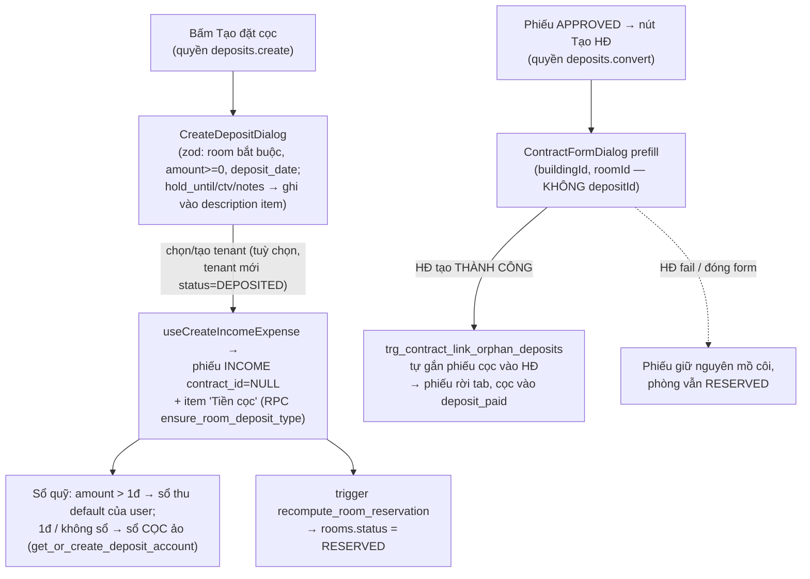
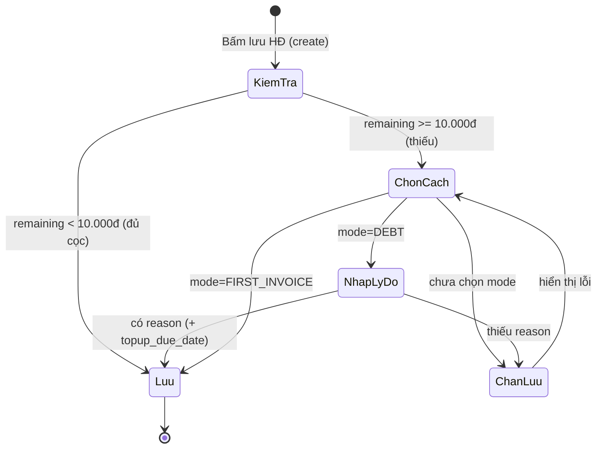

# Cọc giữ chỗ (Deposits) & Theo dõi cọc

## 1. Tổng quan & vai trò nghiệp vụ

Domain này phục vụ **toàn bộ vòng đời tiền cọc** trong CRM cho thuê:

- **Giữ chỗ trước hợp đồng**: khách đặt cọc giữ một căn hộ trong khi chưa ký HĐ → từ 2026-06-21 (commit 09b5754) quản lý bằng **phiếu thu cọc "mồ côi"** trong `income_expenses` (type `INCOME`, `contract_id IS NULL`, có item `is_deposit`) — **nguồn thống nhất** cho mọi đường tạo cọc giữ chỗ (trang Phòng trống `/r/:token`, Thu chi, nút "Tạo đặt cọc" trang `/deposits`). Bảng `deposits` (mã `DCxxxxxx`) là **legacy đã chết** — 0 dòng, UI không còn ghi vào (§2.1).
- **Tự khoá phòng `RESERVED` khi có cọc giữ chỗ** (2026-06-07, commit b3e69db): phiếu giữ chỗ `PENDING/CONFIRMED` chưa link HĐ HOẶC phiếu thu cọc (IE có item `is_deposit`, **kể cả chưa duyệt**) chưa link HĐ → `rooms.status` tự chuyển `AVAILABLE ↔ RESERVED` qua `recompute_room_reservation` (§4.11) → phòng rời bucket "Còn trống" toàn hệ thống (Danh mục căn hộ, Dashboard, Sơ đồ toà nhà, trang công khai `/r/:token`).
- **Cọc còn thiếu GỘP vào hoá đơn tháng đầu** (2026-06-21, c09eda2): phần cọc khách chưa đưa = item OTHER "Tiền cọc" **TRONG** hoá đơn cọc + tháng đầu (là khoản phải thu của HĐ). Khi thu hoá đơn, phần cọc tách thành **hạng mục `is_deposit` trên CÙNG phiếu thu** và tự loại khỏi KQKD qua cột `kqkd_amount` (hạch toán item-level — migration 20260702120000, §4.13).
- **Theo dõi đủ/thiếu cọc của HĐ đang hiệu lực**: mỗi HĐ có `total_deposit` (cần thu) và `deposit_paid` (đã thu). Hệ thống chốt **đủ / thiếu cọc** và cảnh báo khoản còn nợ.
- **Chặn ký HĐ khi thiếu cọc**: khi tạo HĐ mà khách chưa đóng đủ, app bắt admin chọn cách xử lý (`deposit_debt_mode`: `DEBT` = nợ cọc, không gộp vào hoá đơn; `FIRST_INVOICE` = gộp đủ vào hoá đơn tháng đầu) — cơ chế "acknowledge".
- **Hoàn / Bỏ cọc khi thanh lý**: lấy từ `contract_terminations`, KHÔNG dựa vào `deposits.status`. Forfeit chỉ giữ **cọc thực đã thu** = `LEAST(total_deposit, deposit_paid)` (§4.18, chi tiết thanh lý xem [doc 16](docs/he-thong/16-thanh-ly-hop-dong.md)).
- **Tiền thừa / credit theo HĐ**: bảng `excess_amounts` ghi nhận credit dư (do trả thừa hoá đơn) và việc tiêu credit.

> **Nguyên tắc cốt lõi (xem MEMORY `project_deposit_tracking_architecture`)**:
> **Nguồn sự thật của số cọc thực nộp KHÔNG phải `deposits.status`**, mà là:
> - `contracts.deposit_paid` — được **tự động recompute** từ các **phiếu thu (`income_expenses`)** đã APPROVED link vào HĐ, cộng theo **Σ item loại "Tiền cọc"** (`income_expense_types.is_deposit = TRUE`) — item-level từ migration 20260702120000, phiếu "trộn" (doanh thu + cọc) chỉ tính phần item cọc (§4.1).
> - `contracts.deposit_remaining` (cột `GENERATED ALWAYS AS total_deposit - deposit_paid`) = số còn thiếu.
> - Hoàn/bỏ cọc đến từ `contract_terminations`, không phải `deposits.status`.
> - **Tiền cọc vào SỔ QUỸ THẬT** (sổ thu của user); sổ "CỌC (giữ hộ khách)" chỉ là **sổ ảo theo dõi/fallback** (§4.12).
>
> Bảng `deposits` là **legacy đã chết**: 0 dòng dữ liệu, không UI nào còn ghi vào (dialog Tạo đặt cọc đã viết lại sang `income_expenses` — §5.4); enum `deposit_status` trên bảng này **không** được RPC nào cập nhật.

Trang `/deposits` ([DepositsPage.tsx](src/pages/deposits/DepositsPage.tsx)) là **trung tâm quản lý cọc** với 4 tab: Tổng quan, Đủ/Thiếu cọc, Hoàn/Bỏ cọc, Phiếu giữ chỗ (tab 4 đọc phiếu thu cọc mồ côi từ `income_expenses` — §5.4). Ngoài ra domain còn chạm tới trang báo cáo **"Danh sách tiền cọc"** `/reports/finance/deposits` (§5.6 — legacy, vẫn đọc bảng `deposits` chết) và 2 redirect legacy `/reservations`, `/reservations/all` → `/deposits` ([App.tsx](src/App.tsx)).

---

## 2. Cấu trúc dữ liệu

### 2.1. Bảng `deposits` — Phiếu giữ chỗ trước hợp đồng (LEGACY, ĐÃ CHẾT)

Mục đích gốc: ghi nhận một lần khách **đặt cọc giữ căn hộ** trước khi ký HĐ (hoặc flow cũ chuyển cọc → HĐ).

> **Trạng thái 2026-07 (commit 09b5754, 2026-06-21)**: bảng **0 dòng, không UI nào còn ghi vào**. Dialog "Tạo đặt cọc" đã viết lại sang `income_expenses` (§5.4); [EditDepositDialog.tsx](src/components/deposits/EditDepositDialog.tsx) và [ConvertToContractDialog.tsx](src/components/deposits/ConvertToContractDialog.tsx) thành **dead code** (file còn nhưng không nơi nào import). Đường ghi duy nhất còn sót là [ConvertLeadDialog.tsx](src/components/leads/ConvertLeadDialog.tsx) (Lead → Đặt cọc) — nhưng chính nó **fail hoàn toàn** vì bug `hold_until_date` (xem §5.4). Đường đọc còn sót: báo cáo `/reports/finance/deposits` (§5.6), Dashboard `OperationsSummary`/`DashboardMobilePage` (`useDeposits` — đếm phiếu `PENDING/CONFIRMED`, luôn 0), và predicate `recompute_room_reservation` (§4.11) vẫn OR thêm nhánh `deposits` DB-side. Mô tả cột dưới đây giữ lại để tra cứu legacy.

Cột chủ chốt:

| Cột | Ý nghĩa nghiệp vụ |
|---|---|
| `code` | Mã phiếu `DCxxxxxx` tự sinh (sequence `deposits_code_seq`), unique. Trùng style mã đặt chỗ phía Resident. |
| `amount` | Số tiền cọc giữ chỗ (NOT NULL). |
| `deposit_date` | Ngày đặt cọc (NOT NULL, default `CURRENT_DATE`). |
| `hold_until` | Giữ căn hộ đến ngày nào (date). **Lưu ý bug**: form FE dùng key `hold_until_date` (xem §5.4). |
| `status` | enum `deposit_status` (default `PENDING`). **KHÔNG** phải nguồn sự thật đủ/thiếu cọc. |
| `room_id` | Căn hộ được giữ (FK→`rooms`). Nullable. |
| `contract_id` | HĐ mà phiếu này được chuyển thành (FK→`contracts`). Được set khi flow Cọc→HĐ flip `CONVERTED` (ContractFormDialog, sau khi HĐ tạo thành công — §5.4). |
| `tenant_id` | Khách đặt cọc (FK→`tenants`, NOT NULL). |
| `ctv_name` | Tên cộng tác viên giới thiệu. |
| `notes`, `receipt_image_url` | Ghi chú + ảnh biên nhận. **Lưu ý**: hiện **không có UI nào** upload/hiển thị `receipt_image_url` (cột tồn tại nhưng chưa dùng — nếu dùng lại phải qua StorageImage/signed URL vì bucket private). |
| `user_id` | Owner. Trigger BEFORE INSERT `deposits_set_user_id_audit` (`set_user_id_from_auth`) tự điền. Quyền truy cập thực tế scope **theo toà nhà** qua RLS RBAC (§4.16), không chỉ theo owner. |
| id / created_at / updated_at / deleted_at | Khoá + audit + soft delete. **Lưu ý**: FE hiện **hard-delete** (`useDeleteDeposit`) và `useDeposits` **không lọc** `deleted_at`; cột này chỉ được xét DB-side — `recompute_room_reservation` (§4.11) lọc `deleted_at IS NULL`. |

Enum dùng: **`deposit_status`** = `PENDING, CONFIRMED, CONVERTED, REFUNDED, FORFEITED`.

Quan hệ FK:
- **Đi ra**: `contract_id → contracts`, `room_id → rooms`, `tenant_id → tenants`.
- **Được tham chiếu**: `leads.deposit_id → deposits.id` — **FK mồ côi**: cột + FK tồn tại trong DB nhưng **không code nào ghi nó**. [ConvertLeadDialog.tsx](src/components/leads/ConvertLeadDialog.tsx) tạo deposit rồi gọi `useConvertLeadToDeposit` ([useLeads.ts](src/hooks/useLeads.ts)) — hook này chỉ update `leads.status='CONVERTED'`, không set `deposit_id`.

### 2.2. Bảng `excess_amounts` — Tiền thừa / credit theo HĐ

Mục đích: sổ ledger ghi **credit dư của một HĐ** (do trả thừa hoá đơn) và việc **tiêu credit** (áp vào giảm trừ / tiêu khi thanh lý). Số dư credit = `SUM(amount)` các dòng chưa bị huỷ.

Cột chủ chốt:

| Cột | Ý nghĩa nghiệp vụ |
|---|---|
| `contract_id` | HĐ sở hữu credit (FK→`contracts`, NOT NULL). |
| `amount` | Số tiền (NOT NULL). **Dương** = phát sinh credit (trả thừa); **âm** = tiêu credit. |
| `description` | Mô tả nguồn/lý do (vd "Áp credit vào Giảm trừ HĐ ...", "Tiêu credit khi thanh lý ..."). |
| `source_invoice_id` | Hoá đơn nguồn (FK→`invoices`). Dùng để **rollback idempotent**: nếu invoice nguồn bị `deleted_at` thì dòng credit đó bị bỏ qua khi tính tổng. |
| `source_payment_id` | Thanh toán nguồn (FK→`payments`). |
| `user_id`, `created_at` | Owner + audit (bảng này **không** có updated_at / deleted_at — chỉ append-only ledger). |

Enum dùng: không có.

Quan hệ FK:
- **Đi ra**: `contract_id → contracts`, `source_invoice_id → invoices`, `source_payment_id → payments`.
- Không bảng nào tham chiếu vào.

### 2.3. Cột "cọc" trên `contracts` (thuộc domain HĐ nhưng là nguồn sự thật của domain này)

| Cột | Ý nghĩa |
|---|---|
| `total_deposit` | Cọc cần thu theo HĐ (NOT NULL, default 0). |
| `deposit_paid` | Cọc đã thu thực tế — **tự recompute từ IE is_deposit** (xem §4.1). |
| `deposit_remaining` | `GENERATED ALWAYS AS (total_deposit - COALESCE(deposit_paid,0)) STORED` — số còn thiếu. |
| `deposit_debt_acknowledged` | Admin đã xử lý việc thiếu cọc lúc ký (bool, default false). |
| `deposit_debt_mode` | Cách xử lý thiếu cọc: `DEBT` (nợ, có nhắc) \| `FIRST_INVOICE` (thu đủ ở hoá đơn cọc+tháng đầu). CHECK constraint chỉ cho 2 giá trị hoặc NULL. |
| `deposit_debt_reason` | Lý do cho nợ cọc — bắt buộc khi mode = `DEBT`. |
| `deposit_topup_due_date` | Hẹn ngày khách bổ sung đủ cọc (mode `DEBT`) — dùng để nhắc. |

### 2.4. Cột "cọc" trên `contract_terminations` (nguồn của Hoàn/Bỏ cọc)

| Cột | Ý nghĩa |
|---|---|
| `termination_type` | `FORFEIT` = bỏ cọc (cọc thành doanh thu) \| còn lại = hoàn cọc. |
| `total_deposit` | Cọc gốc của HĐ tại thời điểm thanh lý (NOT NULL). **Với FORFEIT** từ [20260618000001](supabase/migrations/20260618000001_forfeit_use_paid_deposit.sql): ghi `LEAST(total_deposit, deposit_paid)` = **cọc thực khách đã đưa** (không thể giữ tiền khách chưa nộp — tránh sổ quỹ âm + doanh thu khống). |
| `total_deductions` | Tổng khấu trừ (`GENERATED` từ các loại phí). UI tab Hoàn/Bỏ cọc hiển thị là **"Tổng nợ tất toán"** — tổng nợ khách khi thanh lý, **KHÔNG trừ vào cọc** (§5.3). |
| `refund_amount` | Số hoàn lại (`GENERATED` = cọc - khấu trừ). **Có thể ÂM** khi nợ > cọc → UI hiển thị "Khách nợ X". |
| `refund_date`, `status` | Đã hoàn hay chưa (suy ra `refund_done = refund_date IS NOT NULL OR status='COMPLETED'`). |

---

## 3. Sơ đồ quan hệ dữ liệu

Luồng nguồn-sự-thật cọc:

> Trigger legacy `trigger_auto_calculate_deposit_paid` (`deposits` → `contracts.deposit_paid` khi INSERT HĐ) đã bị **DROP hẳn** 2026-06-10 — xem §4.6.

Luồng cọc giữ chỗ → khoá phòng `RESERVED` (§4.11):

---

## 4. Quy tắc nghiệp vụ & tự động hoá

### 4.1. `recompute_contract_deposit_paid(p_contract_id)` — nguồn sự thật `deposit_paid`

[20260529000003_deposit_unify.sql](supabase/migrations/20260529000003_deposit_unify.sql) (bản gốc, cộng `total_amount` cả phiếu) → **viết lại item-level** tại [20260702120000_kqkd_item_level.sql](supabase/migrations/20260702120000_kqkd_item_level.sql):

- Tính `deposit_paid = SUM(income_expense_items.amount)` của các **item thuộc loại `is_deposit = TRUE`**, trên các phiếu thoả: `type='INCOME'`, `approval_status='APPROVED'`, `deleted_at IS NULL`, đã link `contract_id`. → Phiếu "trộn" (1 phiếu vừa doanh thu vừa cọc — sinh ra khi thu hoá đơn tháng đầu gộp cọc, §4.13) chỉ tính **phần item cọc**, không lôi cả `total_amount` vào cọc.
- **Invariant quan trọng**: chỉ ghi đè `deposit_paid` khi `v_count > 0` (có ít nhất 1 IE cọc). Nếu HĐ chưa có IE cọc nào thì **giữ nguyên** giá trị cũ → tránh đè 0 lên giá trị legacy do flow cũ (`deposits` → `auto_calculate_deposit_paid`, đã DROP — §4.6) từng set.

### 4.2. `ie_has_deposit_item(p_ie_id)` — helper

Trả `TRUE` nếu phiếu IE có item thuộc loại `is_deposit`. Dùng trong các trigger để quyết định có recompute hay không.

### 4.3. Trigger đồng bộ IE → contract.deposit_paid

| Trigger | Bảng / sự kiện | Hành vi |
|---|---|---|
| `trg_ie_recompute_contract_deposit_ins` | AFTER INSERT `income_expenses` | recompute HĐ mới nếu IE có item cọc. |
| `trg_ie_recompute_contract_deposit_upd` | AFTER UPDATE OF (contract_id, approval_status, deleted_at, type, total_amount) | recompute HĐ mới + nếu đổi `contract_id` thì recompute cả HĐ cũ. |
| `trg_ie_recompute_contract_deposit_del` | AFTER DELETE `income_expenses` | recompute HĐ cũ nếu IE bị xoá có item cọc. |
| `trg_ie_items_recompute_deposit` | AFTER INSERT/UPDATE/DELETE `income_expense_items` | tra `contract_id` của IE cha rồi recompute (bắt trường hợp thêm/xoá item cọc sau). |

→ Bất kỳ thay đổi nào tới phiếu cọc (duyệt, sửa số tiền, xoá, đổi HĐ) đều **tự cập nhật** `deposit_paid`, kéo theo `deposit_remaining`.

Song song, trigger `ie_business_result` + `recompute_ie_business_result` ([20260702120000_kqkd_item_level.sql](supabase/migrations/20260702120000_kqkd_item_level.sql)) maintain 3 cột dẫn xuất trên `income_expenses`: `counts_in_business_result = COALESCE(business_result_accounting, NOT has_deposit_item)` (cờ cả-phiếu, giữ cho badge/RLS), `has_restricted_item`, và **`kqkd_amount`** = phần tiền tính vào KQKD (`TRUE`→total, `FALSE`→0, `NULL`→`GREATEST(total − Σ item cọc, 0)`). Báo cáo P&L (`fa_monthly_pnl`, `fa_type_breakdown`, `fa_accrual_allocations`, `monthly_building_profit`) cộng `kqkd_amount`/lọc item cọc thay vì nhân cờ cả-phiếu → **cọc không bao giờ lọt vào doanh thu KQKD** kể cả trên phiếu trộn (vá đường rò rỉ cũ — MEMORY `project_deposit_leak_into_kqkd_revenue`).

### 4.4. `trg_contract_link_orphan_deposits` — tự link cọc-trước-HĐ

AFTER INSERT trên `contracts`. Khi tạo HĐ cho một `room_id`, trigger **tự gắn `contract_id`** cho các phiếu IE cọc "mồ côi" (`contract_id IS NULL`) cùng phòng, thoả:
- `type='INCOME'`, có item cọc, chưa xoá;
- tenant tương thích (`NEW.tenant_id IS NULL OR ie.tenant_id IS NULL OR khớp`);
- `voucher_date <= start_date + 7 ngày`.

Sau khi link → gọi `recompute_contract_deposit_paid(NEW.id)`. → Hỗ trợ kịch bản **thu cọc trước khi ký HĐ** (lúc đó chưa biết HĐ, ghi IE theo phòng).

### 4.5. `deposits_set_code` — sinh mã `DCxxxxxx`

[20260426000006_deposits_code_and_ctv.sql](supabase/migrations/20260426000006_deposits_code_and_ctv.sql)

BEFORE INSERT trên `deposits`: nếu `code` rỗng → `'DC' || LPAD(nextval('deposits_code_seq'),6,'0')`. Unique index trên `code`.

### 4.6. `auto_calculate_deposit_paid` — flow cũ deposits → contract (ĐÃ GỠ HẲN)

[012_auto_deposit_calculation.sql](supabase/migrations/012_auto_deposit_calculation.sql) (tạo) → **DROP** tại [20260610110000_perf_indexes_cashbook_rpc.sql](supabase/migrations/20260610110000_perf_indexes_cashbook_rpc.sql) (2026-06-10).

Trigger legacy `trigger_auto_calculate_deposit_paid` (BEFORE INSERT `contracts`) từng: tính `SUM(deposits.amount)` của tenant+room (`status IN ('CONFIRMED','CONVERTED')`) điền vào `NEW.deposit_paid` nếu rỗng, và flip các phiếu `CONFIRMED` cùng tenant+room sang `CONVERTED` + gắn `contract_id`.

- **Lý do gỡ**: trigger "chết lâm sàng" từ 2026-05 — `useCreateContract` luôn insert `tenant_id = NULL` (khách thật nằm ở `contract_customers`) nên `WHERE tenant_id = NEW.tenant_id` không bao giờ match. Giữ lại chỉ gây hiểu nhầm + rủi ro 2 nguồn cùng ghi đè `deposit_paid` nếu sau này có flow set `tenant_id` (vd `useBulkCreateContracts` import Excel vẫn insert `tenant_id` thật).
- **Nguồn sự thật hiện hành**: phiếu IE `is_deposit` → `recompute_contract_deposit_paid` (§4.1) qua `trg_contract_link_orphan_deposits` (§4.4).
- **Việc flip `deposits.status='CONVERTED'`**: `ContractFormDialog` vẫn giữ code flip + gắn `contract_id` SAU khi HĐ tạo thành công (qua `prefill.depositId`), nhưng đường này hiện **không còn entry point** — `ConvertToContractDialog` là dead code và tab "Phiếu giữ chỗ" mới (§5.4) không truyền `depositId` (phiếu cọc mồ côi IE tự gắn qua trigger §4.4). Với bảng `deposits` đã chết, flip này chỉ còn ý nghĩa lịch sử.

### 4.7. Chặn ký HĐ khi thiếu cọc (acknowledge)

[20260603000003_contract_deposit_debt_ack.sql](supabase/migrations/20260603000003_contract_deposit_debt_ack.sql)

- **Không** dùng CHECK constraint chặn lưu (để renew/transfer RPC và dữ liệu cũ không vỡ) — chỉ CHECK giới hạn giá trị `deposit_debt_mode ∈ {DEBT, FIRST_INVOICE, NULL}`.
- **Enforce ở tầng app** (xem §5.5): khi `remaining >= PREVIOUS_DEBT_ROUND_THRESHOLD` (10.000đ) mà chưa chọn `deposit_debt_mode` → chặn lưu; mode `DEBT` còn bắt buộc `deposit_debt_reason`.
- Index `idx_contracts_deposit_topup_due` hỗ trợ query nhắc.

### 4.8. Nhắc bổ sung cọc — `checkDepositTopupReminders`

[notificationScheduler.ts](src/lib/notificationScheduler.ts)

Chạy hằng ngày: quét HĐ `ACTIVE` (EXTENDED đã ngưng dùng — HĐ gia hạn giữ nguyên `ACTIVE`), `deposit_remaining >= ngưỡng`, `deposit_debt_mode IS NULL OR = 'DEBT'` (loại `FIRST_INVOICE` vì khoản đó thu qua hoá đơn). Scope chỉ theo `.eq('user_id', userId)` — không lọc theo toà/khu vực, notification tạo cho owner. Tạo notification `type='DEPOSIT_SHORTFALL'`. Throttle: quá hẹn (`deposit_topup_due_date < hôm nay`) nhắc 1 lần/ngày, chưa tới hẹn 1 lần/tuần.

### 4.9. Ledger credit `excess_amounts` & `consumeRemainingCredit`

[useContractOperations.ts](src/hooks/useContractOperations.ts), [useInvoices.ts](src/hooks/useInvoices.ts)

- Số dư credit của HĐ = `SUM(amount)` các dòng có `source_invoice` chưa `deleted_at` (rollback idempotent).
- Áp credit vào giảm trừ HĐ → insert dòng **âm** `-appliedCredit`.
- Thanh lý (move-out/forfeit) → `consumeRemainingCredit()` insert một dòng âm bằng đúng tổng credit còn dư → đưa số dư về 0.

Điểm chạm ghi/tiêu/xoá credit **ngoài 2 hook trên**:
- [RecordPaymentDialog.tsx](src/components/invoices/RecordPaymentDialog.tsx) — ghi nhận thanh toán lẻ có thể phát sinh credit.
- [useBulkRecordPayment.ts](src/hooks/useBulkRecordPayment.ts) — thu hàng loạt, tuỳ chọn `keep_as_credit` giữ tiền thừa thành credit.
- [useInvoicePayments.ts](src/hooks/useInvoicePayments.ts) — RPC `record_invoice_payment` tự insert dòng credit.
- [useDeletePayment.ts](src/hooks/useDeletePayment.ts) — hard-delete dòng credit theo `source_payment_id` khi xoá thanh toán.
- [TerminateDialog.tsx](src/components/contracts/TerminateDialog.tsx) — auto-fill credit còn dư khi thanh lý.
- [ExcelInvoiceDialog.tsx](src/components/invoices/ExcelInvoiceDialog.tsx) — áp credit vào Giảm trừ khi tạo hoá đơn hàng loạt.

### 4.10. Hoàn / Bỏ cọc đến từ `contract_terminations`

`useDepositRefundsForfeits` đọc `contract_terminations`. **KHÔNG** dựa `deposits.status` vì RPC thanh lý không set `REFUNDED/FORFEITED` trên `deposits`. `FORFEIT` → "Bỏ cọc" (cọc thành doanh thu); còn lại → "Hoàn cọc" với `refund_amount`.

### 4.11. `recompute_room_reservation(p_room_id)` — cọc giữ chỗ tự khoá phòng `RESERVED`

[20260608000000_room_reservation_reconcile.sql](supabase/migrations/20260608000000_room_reservation_reconcile.sql) (commit b3e69db, 2026-06-07 — timestamp file migration là 0608)

Hàm reconcile **idempotent**, là nguồn sự thật duy nhất cho cờ `RESERVED`:

1. **Bỏ qua nếu phòng có HĐ hiệu lực** (`contracts.status IN ('ACTIVE','EXTENDED')`, chưa xoá — check DB-side vẫn phòng hờ `EXTENDED` dù FE không còn ghi status này) — HĐ sở hữu `OCCUPIED`, reconcile không can thiệp.
2. **Predicate "đang có cọc giữ chỗ"** (OR 2 nhánh):
   - `deposits`: cùng `room_id`, `deleted_at IS NULL`, `contract_id IS NULL`, `status IN ('PENDING','CONFIRMED')`;
   - `income_expenses`: cùng `room_id`, `deleted_at IS NULL`, `contract_id IS NULL`, `type='INCOME'`, `approval_status <> 'CANCELLED'` (**kể cả phiếu chưa duyệt**), có item cọc (`ie_has_deposit_item`).
3. Chỉ chuyển 2 chiều `AVAILABLE → RESERVED` (có cọc) và `RESERVED → AVAILABLE` (hết cọc). **Không đụng** `OCCUPIED/MAINTENANCE/UNAVAILABLE`.

4 nhóm trigger gọi reconcile:

| Trigger | Bảng / sự kiện |
|---|---|
| `trg_deposit_reconcile_room_{ins,upd,del}` | `deposits` — INSERT / UPDATE OF (`room_id`, `contract_id`, `status`, `deleted_at`) / DELETE; đổi `room_id` thì reconcile cả phòng cũ. |
| `trg_ie_reconcile_room_{ins,upd,del}` | `income_expenses` — INSERT / UPDATE OF (`room_id`, `contract_id`, `approval_status`, `deleted_at`, `type`) / DELETE. |
| `trg_ie_items_reconcile_room` | `income_expense_items` — mọi INSERT/UPDATE/DELETE (thêm/bớt item cọc làm `ie_has_deposit_item` đổi). |
| `trg_room_status_reconcile` | `rooms` — AFTER UPDATE OF `status` `WHEN (NEW.status='AVAILABLE')` (chống đệ quy): phòng vừa được nhả (thanh lý, sửa tay) mà còn cọc → tái-`RESERVED`. |

Migration có **backfill** chạy reconcile toàn bộ phòng hiện hữu.

Touchpoint FE (bucket "Đã cọc" tách riêng toàn hệ):
- [RoomsPage.tsx](src/pages/rooms/RoomsPage.tsx) — filter trạng thái `RESERVED` + KPI đếm phòng "Đã đặt cọc".
- [useDashboard.ts](src/hooks/useDashboard.ts) — đếm `rooms.status='RESERVED'` riêng, **trừ khỏi "Còn trống"**.
- [roomStatus.ts](src/lib/roomStatus.ts) — `getRoomDisplayStatus`: không HĐ hiệu lực + `room.status='RESERVED'` → hiển thị `RESERVED`.
- Trang công khai `/r/:token` ([README](src/pages/phong-trong/README.md)) — map `RESERVED` → `rented` (ẩn khỏi danh sách phòng trống).

> **Cảnh báo (lỗ hổng vòng đời)**: predicate **không xét hạn giữ chỗ** → cọc giữ chỗ quá hạn vẫn giữ phòng `RESERVED` vô hạn. Với nguồn cọc giữ chỗ hiện hành (phiếu IE mồ côi), "Giữ phòng đến ngày X" chỉ được ghi vào **description của item** (§5.4), không có cột riêng để reconcile xét. Phiếu cọc mồ côi của phòng **ký HĐ thẳng** (không qua trigger link vì lệch tenant/cửa sổ 7 ngày, hoặc bị CANCELLED sót) có thể **tái-RESERVED** phòng khi HĐ đó thanh lý và phòng về `AVAILABLE` (trigger `trg_room_status_reconcile`). Cần huỷ (CANCELLED) phiếu giữ chỗ cũ thủ công khi khách bỏ.

### 4.12. Tiền cọc vào SỔ QUỸ THẬT + sổ ảo "CỌC (giữ hộ khách)" + phiếu thu cọc khi ký HĐ

[20260603000022_termination_deposit_book_transfer.sql](supabase/migrations/20260603000022_termination_deposit_book_transfer.sql), [ContractFormDialog.tsx](src/components/contracts/ContractFormDialog.tsx)

Đây là **nguồn chính sinh ra phiếu IE `is_deposit`** mà §4.1 dựa vào. Nguyên tắc tiền: **cọc thật ghi vào SỔ QUỸ THẬT** (sổ thu do user chọn); sổ `'CỌC (giữ hộ khách)'` chỉ là **sổ ảo theo dõi**, dùng làm fallback (dòng chưa chọn sổ, cọc giữ chỗ 1đ) và làm sổ trung chuyển khi thanh lý.

- Helper DB `_deposit_account(p_user_id)` — get-or-create sổ ảo tên `'CỌC (giữ hộ khách)'` **theo owner** (1 sổ chung mọi toà, khớp MEMORY `feedback_system_account_single`). RPC `get_or_create_deposit_account()` bọc cho FE (authenticated-only).
- Khu "**Đã đặt cọc (khách đã đưa tiền mặt)**" trên form HĐ (chỉ create-mode): user thêm **từng dòng** `[số tiền | sổ quỹ | ngày nhận | ảnh]` — mỗi dòng = 1 lần khách đưa cọc. Sau khi HĐ tạo thành công, form tạo **1 phiếu thu cọc/dòng** tên `"Cọc giữ phòng {phòng} Toà nhà {toà}"` vào **sổ thật của dòng đó** (fallback sổ CỌC ảo nếu dòng chưa chọn sổ), `contract_id` gắn HĐ vừa tạo, `business_result_accounting: null` (item cọc tự loại khỏi KQKD qua `kqkd_amount`), attachments = ảnh của dòng.
- **Chống double-count với cọc giữ chỗ**: form dùng [useOrphanDepositVouchers](src/hooks/useDeposits.ts) (cùng predicate trigger `trg_contract_link_orphan_deposits` §4.4: cùng phòng, `contract_id IS NULL`, INCOME có item `is_deposit`, APPROVED/UNAPPROVED, `voucher_date ≤ start_date + 7 ngày`) hiển thị **danh sách phiếu cọc cũ của phòng dạng dòng xám chỉ-xem** ("đã thu" / "chưa duyệt (chưa tính)") — các phiếu này trigger tự gắn vào HĐ, form **không tạo lại**. `deposit_paid` ghi lên HĐ = Σ dòng nhập tay + Σ orphan APPROVED.
- Phần cọc **còn thiếu** sau các dòng trên **KHÔNG tạo phiếu** — nó gộp thành item "Tiền cọc" trong hoá đơn tháng đầu (§4.13), trừ mode `DEBT`.
- Thiếu loại thu "Tiền cọc" / dòng không có sổ / insert phiếu **fail** → `toast.error` rõ ràng (15s) "HĐ đã lưu nhưng phiếu thu cọc TẠO THẤT BẠI..." kèm hướng xử lý tay — không nuốt lỗi.
- DB còn helper `_ensure_initial_deposit_voucher(p_contract_id)` dùng cho RPC thanh lý: nếu HĐ đã có phiếu thu cọc → trả `account_id` **sổ đang chứa cọc** của phiếu đó (sổ thật); chưa có và `deposit_paid > 0` → tạo bù trên sổ CỌC ảo. Chuỗi chuyển khoản nội bộ sổ chứa cọc ↔ sổ vận hành khi thanh lý xem [doc 16](docs/he-thong/16-thanh-ly-hop-dong.md) (MEMORY `project_termination_net_settlement`).

### 4.13. Cọc còn thiếu GỘP vào hoá đơn tháng đầu — tách hạng mục cọc khi thu

[firstInvoiceBuilder.ts](src/lib/firstInvoiceBuilder.ts), [invoiceHelpers.ts](src/lib/invoiceHelpers.ts) (`allocateDepositPortion`), [useInvoicePayments.ts](src/hooks/useInvoicePayments.ts) (`useRecordPaymentRPC`), [useInvoices.ts](src/hooks/useInvoices.ts) (`useContractDepositVouchers`)

Mô hình hiện hành (315f01a → c09eda2, 2026-06-21; hạch toán item-level 20260702120000):

1. **Gộp vào hoá đơn**: `buildFirstInvoiceItems` thêm item `OTHER` mô tả **đúng chuỗi "Tiền cọc"** = `total_deposit − deposit_paid` vào hoá đơn cọc + tháng đầu — cọc thiếu là **khoản phải thu TRONG hoá đơn**, không phải phiếu thu lẻ ngoài HĐ. Cờ `include_deposit` do form HĐ truyền = `deposit_debt_mode !== 'DEBT'` — mode **Nợ cọc** thì KHÔNG gộp, chỉ theo dõi `deposit_remaining` + nhắc (§4.8).
2. **Khi thu hoá đơn** (`useRecordPaymentRPC`): tính `depositInInvoice` = Σ item `OTHER` "Tiền cọc" + Σ source nợ cũ `type='deposit'` (legacy), rồi phân bổ số tiền thu bằng hàm thuần **`allocateDepositPortion({paymentAmount, depositInInvoice, paidBefore, collectibleTotal})`** — quy ước **PHÒNG-TRƯỚC, CỌC-SAU**: mỗi đồng thu phủ phần tiền phòng/dịch vụ còn thiếu trước, phần dư mới vào cọc (`Σ revenuePortion = min(Σ thu, collectibleTotal − depositInInvoice)`). Bất biến có **property test fast-check** tại [depositSplit.property.test.ts](src/lib/__tests__/depositSplit.property.test.ts) (kèm case thật 01/481NVK).
3. **1 lần thu = ĐÚNG 1 phiếu thu** (chứng từ khớp giao dịch thực — KHÔNG tách 2 phiếu như bản trước): phiếu `INCOME` gắn `invoice_id`/`payment_id`, chứa tối đa **2 hạng mục** — item loại thu thường (`revenuePortion`, tên "Thanh toán HĐ …") + item loại "Tiền cọc" `is_deposit` (`depositPortion`, tên "Tiền cọc theo HĐ …"). Phần cọc tự loại khỏi KQKD qua `kqkd_amount` (§4.1); `deposit_paid` chỉ cộng phần item cọc. Bỏ qua tách khi phiếu có rounding/credit (paid_amount lệch) — khi đó toàn bộ là doanh thu.
4. **Popup "Các lần thanh toán"** phân biệt rạch ròi: phần cọc **trong hoá đơn** đọc từ item của phiếu gắn `invoice_id`; khu "Cọc bổ sung bằng phiếu thu (**ngoài HĐ**)" = `useContractDepositVouchers` chỉ đếm **phiếu cọc ĐỘC LẬP `invoice_id IS NULL`** (cọc giữ chỗ thu trước / phiếu tạo tay) — phiếu cọc tách-từ-hoá-đơn không hiện nhầm ở "ngoài HĐ".
5. **`computePreviousDebt` KHÔNG còn gộp "Cọc còn thiếu" vào Nợ cũ** (đường rò rỉ cũ làm cọc lọt KQKD khi thu — đã gỡ ở 315f01a): nợ cũ nay chỉ gồm remaining của hoá đơn `APPROVED/PARTIAL_PAID/OVERDUE` ≥ ngưỡng 10.000đ (chống cộng đúp qua `previous_debt_sources` `type='invoice'`). [ExcelInvoiceDialog.tsx](src/components/invoices/ExcelInvoiceDialog.tsx) cũng vậy; source `type='deposit'` chỉ còn trên hoá đơn cũ (legacy) và vẫn được bước 2 nhận diện khi thu.

### 4.14. KPI "Cọc đã thu" (`deposit_collected`) trong thống kê hoá đơn

[20260529000003_deposit_unify.sql](supabase/migrations/20260529000003_deposit_unify.sql) (khai sinh) → bản hiện hành trong [20260702120000_kqkd_item_level.sql](supabase/migrations/20260702120000_kqkd_item_level.sql)

`get_invoice_statistics_v2` (RPC FE thực gọi) trả trường `deposit_collected` = **`SUM(income_expense_items.amount)` của các item `is_deposit`** trên phiếu IE `INCOME` `APPROVED` chưa xoá (item-level — phiếu trộn chỉ tính phần cọc), lọc theo `p_building_ids uuid[]`, `p_building_id`, `p_room_id`, `voucher_date` (start/end), `p_billing_month`; scope quyền tính 1 lần theo mảng toà được phép (super_admin/admin/full-scope thấy hết). RPC `get_deposit_breakdown_v2` (drill-down từng phiếu cọc: HĐ, sổ, hoá đơn gắn kèm) cũng trả `amount` = Σ item cọc/phiếu. `get_invoice_statistics` v1 là legacy FE không còn gọi. → touchpoint thống kê cọc nằm ở domain hoá đơn.

### 4.15. Guard chặn thiếu cọc tầng hook + badge cọc ở danh sách HĐ

- **Defense-in-depth** ngoài form (§5.5): [useContracts.ts](src/hooks/useContracts.ts) — `useCreateContract` `throw` nếu `total_deposit - deposit_paid >= PREVIOUS_DEBT_ROUND_THRESHOLD` mà `deposit_debt_acknowledged = false` ("Khách chưa đóng đủ cọc...").
- **DepositBadge** ([ContractListTable.tsx](src/components/contracts/ContractListTable.tsx)): badge 3 trạng thái cho HĐ in-effect (`isContractInEffect` = ACTIVE-only) có `total_deposit > 0`: **Đủ cọc** (xanh, remaining < 10.000đ) / **Cọc ở HĐ đầu** (xanh dương, mode `FIRST_INVOICE`) / **Thiếu cọc** (cam, mode `DEBT`/legacy).

### 4.16. RLS/RBAC theo toà nhà cho bảng `deposits` + module quyền

[20260527000007_rbac_phase3_contracts.sql](supabase/migrations/20260527000007_rbac_phase3_contracts.sql), [permissions.ts](src/lib/permissions.ts)

- 4 policy `deposits_{select,insert,update,delete}_rbac` scope **theo toà nhà**: SELECT dùng `can_access_building(building)`; INSERT/UPDATE/DELETE dùng `can_do_on_building('deposits', 'create'/'edit'/'delete', building)`. Building suy từ `building_of_contract(contract_id)` nếu có HĐ, fallback `rooms.building_id` theo `room_id`. SELECT có thêm nhánh bypass `is_super_admin()` / `is_admin()`; INSERT/UPDATE/DELETE chỉ bypass `is_super_admin()`.
- Trigger BEFORE INSERT `deposits_set_user_id_audit` (`set_user_id_from_auth`) tự điền `user_id`.
- Module quyền `deposits` (label "Đặt cọc", extra actions `convert`, `refund`, `print`) trong `PERMISSION_GROUPS` nhóm "Khách hàng" ([permissions.ts](src/lib/permissions.ts)); gate FE chi tiết qua catalog trang [permissionPages.ts](src/lib/permissionPages.ts) + `canUse` — trang `/deposits` dùng `deposits.create` (nút Tạo đặt cọc) và `deposits.convert` (nút Tạo HĐ, fallback quyền `edit`).

### 4.17. Phiếu cọc KHÔNG auto-gắn HĐ active đã đủ cọc (2ebb066, 2026-07-02)

[IncomeExpenseForm.tsx](src/components/income-expenses/IncomeExpenseForm.tsx)

Form Thu chi auto-prefill `contract_id` khi tạo phiếu mới cho phòng có đúng 1 HĐ `ACTIVE`. **Ngoại lệ phiếu CỌC**: nếu phiếu có item `is_deposit` **và** HĐ active đó đã đóng **ĐỦ cọc** (`deposit_paid >= total_deposit`) → mặc định "-- Không gắn HĐ --", vì tiền cọc mới gần như chắc là của **khách kế tiếp** (giữ chỗ) — để phiếu mồ côi cho trigger §4.4 tự link khi HĐ mới được tạo. Gắn nhầm vào HĐ active làm phồng `deposit_paid` của khách cũ + form tạo HĐ mới báo thiếu cọc (vụ PT2607014, phòng 102/102LVT). Chi tiết hành vi:

- HĐ active còn **THIẾU** cọc → vẫn auto-gắn (đây là thu bổ sung cọc của chính khách đó).
- Giá trị đã auto-gắn TRƯỚC khi user thêm item cọc → effect tự **gỡ lại**; HĐ do user **tự chọn** trong dropdown thì tôn trọng, không đụng (theo dõi qua `autoLinkedContractIdRef`).

### 4.18. Bỏ cọc (FORFEIT) — tất toán đầy đủ, cọc thực thu, cặp phiếu chờ duyệt

Chuỗi migration `terminate_contract_forfeit_impl`: `20260530000001` → bản lịch sử `20260617000001` (đã superseded, chỉ còn trong `supabase/migrations-archive/`) → `20260618000001`/`20260619000001` → [20260627000001](../../supabase/migrations/20260627000001_termination_extra_charges.sql) (**bản live hiện hành**, thêm `p_extra_charges` và giữ `LEAST`). Thuộc domain thanh lý — chi tiết đầy đủ xem [doc 16](16-thanh-ly-hop-dong.md); tóm tắt phần chạm domain cọc (theo bản live):

- **Tất toán đầy đủ (logic hiện hành)**: forfeit huỷ **MỌI hoá đơn còn nợ của HĐ** (mọi tháng, không chỉ tháng bỏ cọc): hoá đơn đã thu 1 phần → `CANCELLED` + hạ `total_amount = paid_amount` (giữ phần đã thu làm doanh thu, huỷ phần nợ); chưa thu → `CANCELLED` + `total_amount = 0`. Bản migration lịch sử 20260617000001 chỉ dùng để đối chiếu, không replay.
- **Cọc forfeit = cọc THỰC đã thu (20260618000001)**: `v_deposit = LEAST(total_deposit, deposit_paid)` — khách nợ cọc rồi bỏ thì chỉ forfeit phần đã đưa, tránh sổ thật âm + "Doanh thu bỏ cọc" khống.
- **Hoá đơn thanh lý** `APPROVED` với 1 item `PENALTY` "Phí phạt khách bỏ cọc (giữ tiền cọc đã thu)" = `v_deposit`, `billing_month` = tháng bỏ cọc.
- **Cặp phiếu chuyển khoản nội bộ CHỜ DUYỆT (`UNAPPROVED`)** đánh dấu notes `[CẤN CỌC BỎ CỌC {contract_id}]`: phiếu **CHI** sổ đang chứa cọc (loại "Cấn cọc chuyển doanh thu", `is_deposit=TRUE` → ngoài KQKD) + phiếu **THU** sổ vận hành (loại "Doanh thu bỏ cọc", `is_deposit=FALSE` → KQKD) gắn hoá đơn thanh lý. Khác move-out: forfeit **không auto duyệt** — trước khi duyệt, cọc chưa thành doanh thu, hoá đơn thanh lý chưa tất toán; kỳ ghi nhận = `voucher_date` (sửa được trước khi duyệt).
- **Trigger `trg_forfeit_settle_on_approve`** (AFTER UPDATE OF `approval_status` trên `income_expenses`): duyệt 1 phiếu trong cặp → tự duyệt phiếu còn lại + INSERT 1 dòng `payments` method `'CT'` (Cấn trừ — không phải tiền mặt) cho hoá đơn thanh lý → flip `PAID`. Đảo duyệt → gỡ đối xứng (xoá payment, hạ phiếu kia). Idempotent qua marker note `[CẤN CỌC BỎ CỌC PAYMENT {ie_id}]`.
- **Thu thêm khi thanh lý (20260627000001)**: forfeit nhận `p_extra_charges` — các khoản thu thêm tạo **hoá đơn AR riêng thu khách** (tháng kế), TÁCH khỏi hoá đơn thanh lý cọc.
- Audit `contract_terminations`: `termination_type='FORFEIT'`, `total_deposit = v_deposit` (cọc thực thu), `status='COMPLETED'` → nguồn tab Hoàn/Bỏ cọc (§4.10, §5.3).

---

## 5. Quy trình theo từng trang

Trang chính của domain: **`/deposits`** ([DepositsPage.tsx](src/pages/deposits/DepositsPage.tsx)). Ngoài ra còn trang báo cáo **`/reports/finance/deposits`** (§5.6), 2 redirect legacy `/reservations`, `/reservations/all` → `/deposits`, và nút "Tạo cọc giữ phòng" (quyền `sale_phong.create_deposit`, nhãn "Tạo cọc nhanh") trên trang công khai `/r/:token` (§5.7). Bộ lọc toà = **một `BuildingFilterSelect`** ([BuildingFilterSelect](src/components/buildings/BuildingFilterSelect.tsx) — danh sách **phẳng A→Z, chọn 1 toà hoặc tất cả**, thay `BuildingMultiSelect` nhóm-theo-khu ở commit 3c3b7fa; state vẫn giữ shape mảng 0/1 phần tử) dùng chung cho cả 4 tab; `held`/`refunds` lọc **client-side theo `building_id`**, riêng phiếu giữ chỗ (tab 4) lọc **server-side** (`.in('building_id', ...)` trong `useReservationDeposits`). Tab đang mở + toàn bộ filter/search **giữ qua F5** bằng `usePersistedState` key `flt:deposits:*` (commit 7fd2d3f).

Hook dữ liệu (cả 3 fetch ngay khi mount, không phân trang):
- `useHeldDeposits` ([useDepositDashboard.ts](src/hooks/useDepositDashboard.ts)) — HĐ `ACTIVE` chưa xoá (EXTENDED đã ngưng dùng — HĐ gia hạn giữ `ACTIVE`), map ra `HeldDepositRow` với `state`:
  - `FULL` nếu `deposit_remaining < DEPOSIT_SHORTFALL_THRESHOLD` (10.000đ — ngưỡng làm tròn);
  - ngược lại `FIRST_INVOICE` nếu `deposit_debt_mode='FIRST_INVOICE'`, else `SHORT` (nợ cọc).
- `useDepositRefundsForfeits` — đọc `contract_terminations` (toàn bộ, không giới hạn thời gian) → `RefundForfeitRow`.
- `useReservationDeposits` ([useDeposits.ts](src/hooks/useDeposits.ts)) — **cọc giữ chỗ toàn hệ thống** = phiếu thu cọc mồ côi trong `income_expenses` (`type='INCOME'`, `contract_id IS NULL`, `deleted_at IS NULL`, item có `is_deposit=TRUE`, `approval_status ∈ {APPROVED, UNAPPROVED, CANCELLED}` — lấy cả CANCELLED để hiện "Đã huỷ"), join building/room, dedupe theo id (`!inner` nhân dòng nếu phiếu >1 item cọc). Khác `useOrphanDepositVouchers` (§4.12): không giới hạn phòng, không cửa sổ `voucher_date+7`. Phiếu đã gắn HĐ tự rớt khỏi danh sách (thành cọc HĐ — tab Đủ/Thiếu cọc).
- `summarizeByBuilding` — gộp held theo toà nhà cho tab Tổng quan.

> Hook cũ `useDeposits` (đọc bảng `deposits` legacy) **không còn dùng ở trang này** — chỉ còn Dashboard ([OperationsSummary.tsx](src/components/dashboard/OperationsSummary.tsx), [DashboardMobilePage.tsx](src/pages/DashboardMobilePage.tsx)) gọi để đếm phiếu `PENDING/CONFIRMED` → **luôn 0** vì bảng chết (§2.1).

### 5.1. Tab "Tổng quan"

KPI tính từ `heldFiltered` + `refundsFiltered` + `reservations`:
- **Cọc đang giữ** = Σ `deposit_paid`; **Cọc cần thu** = Σ `total_deposit`.
- **Thiếu cọc** = Σ `deposit_remaining` của các dòng `state='SHORT'` (+ số HĐ).
- **Giữ chỗ chờ** = Σ `total_amount` các phiếu thu cọc mồ côi **đã duyệt** (`approval_status='APPROVED'`) từ `useReservationDeposits` — cùng nguồn với tab 4.
- **Đã hoàn cọc** (Σ `refund_amount` dương của REFUND) / **Đã bỏ cọc** (Σ `total_deposit` của FORFEIT) — từ `contract_terminations`.

Bảng dưới: gộp theo toà nhà (Số HĐ / Cọc cần thu / Đang giữ / Thiếu cọc / Đủ-Thiếu).

### 5.2. Tab "Đủ / Thiếu cọc"

Hiển thị các dòng `state != 'FULL'` (HĐ chưa đủ cọc). Toggle "Chỉ hiện thiếu cọc" → lọc tiếp `state='SHORT'`. Mỗi dòng: toà/phòng/khách (link `/contracts/:id`), Cần thu / Đã thu / Còn thiếu, badge trạng thái (`FIRST_INVOICE` = "Thu ở HĐ đầu" xanh; còn lại "Nợ cọc" cam), cột "Hẹn bổ sung" = `deposit_topup_due_date`.

### 5.3. Tab "Hoàn / Bỏ cọc"

Bảng từ `contract_terminations` (sort theo `termination_date` desc) — cột đổi ở 09b5754 (bỏ cột "Khấu trừ" gây hiểu nhầm khấu-trừ-vào-cọc): Ngày, toà/phòng/khách (link `/contracts/:id`), Loại (badge Bỏ cọc đỏ / Hoàn cọc xám), **Cọc gốc** (`total_deposit` — với FORFEIT là cọc thực thu, §2.4), **Tổng nợ tất toán** (`total_deductions` — tổng nợ khách khi thanh lý, **KHÔNG trừ vào cọc**), **Còn nợ / Hoàn lại**: FORFEIT → nợ > cọc (`refund_amount` âm) hiện "⚠ Khách nợ X", ngược lại "Cọc thành doanh thu"; REFUND → `refund_done` hiện "Đã hoàn X", else "Chờ hoàn X". Có chú thích cố định trên bảng giải thích ngữ nghĩa "Tổng nợ tất toán".

### 5.4. Tab "Phiếu giữ chỗ" — phiếu thu cọc mồ côi (viết lại ở 09b5754, 2026-06-21)

Tab đọc **cọc giữ chỗ THẬT** từ `income_expenses` qua `useReservationDeposits` (§5 đầu mục) thay vì bảng `deposits` đã chết — thống nhất 1 nguồn cho mọi đường tạo cọc giữ chỗ (trang Phòng trống, Thu-chi, nút "Tạo đặt cọc").

- **3 card đếm theo trạng thái phiếu** (`approval_status`): Chờ duyệt (`UNAPPROVED`) / Đang giữ chỗ (`APPROVED`) / Đã huỷ (`CANCELLED`).
- **Ô search** (mã/nội dung/người nộp/phòng) + **SearchableSelect lọc trạng thái** — cả hai lọc **client-side** (không làm sai KPI tab khác như bản cũ).
- Bảng: Mã (`code` phiếu thu) / Nội dung / Toà nhà / Phòng / Người nộp (`payer_name`) / Số tiền / Ngày / Trạng thái / Thao tác.

Các thao tác:
- **Tạo** ([CreateDepositDialog.tsx](src/components/deposits/CreateDepositDialog.tsx) — viết lại ở 09b5754): tạo **phiếu thu cọc** cùng cơ chế `QuickDepositModal` (§5.7): hạng mục "Tiền cọc" qua RPC `ensure_room_deposit_type`, `business_result_accounting: null` (ngoài KQKD). "Giữ phòng đến" / "CTV" / "Ghi chú" chỉ nối vào **description của item** — không còn cột riêng. Tenant tuỳ chọn (chọn sẵn từ `tenants` legacy hoặc tạo mới `status='DEPOSITED'`) → `tenant_id` + `payer_name` trên phiếu. Bug `hold_until_date` cũ **hết hiệu lực** ở form này (không còn ghi bảng `deposits`).
- **Sửa / Duyệt / Huỷ phiếu**: làm ở trang **Thu chi** như mọi phiếu IE khác (tab này không có nút sửa). Huỷ (`CANCELLED`) → trigger §4.11 nhả phòng về `AVAILABLE`.
- **Tạo HĐ** (chỉ hiện với phiếu `APPROVED` có `room_id`, quyền `deposits.convert`): mở `ContractFormDialog` prefill `buildingId`/`roomId` — **KHÔNG truyền depositId/depositAmount**; phiếu cọc mồ côi hiện dạng dòng xám trong form (§4.12) và trigger `trg_contract_link_orphan_deposits` tự gắn khi HĐ được INSERT → phiếu tự rời tab, tiền cọc chảy vào `deposit_paid`. HĐ fail/đóng form → phiếu giữ nguyên, phòng vẫn `RESERVED`.
- **Entry-point legacy còn hỏng**: [ConvertLeadDialog.tsx](src/components/leads/ConvertLeadDialog.tsx) — "Chuyển sang Đặt cọc" từ pipeline `/leads` (§5.1 doc 03) **vẫn INSERT bảng `deposits`** với key sai **`hold_until_date`** (cột thật là `hold_until`) → PostgREST từ chối INSERT (PGRST204) → **flow convert fail hoàn toàn** (tenant có thể đã tạo, deposit không tạo, lead không flip CONVERTED). Đây là chỗ ghi bảng `deposits` cuối cùng còn trong code; cọc sinh từ đây (nếu sửa bug) cũng **không hiện** ở tab này vì tab đọc `income_expenses`. Cần viết lại sang phiếu thu cọc như CreateDepositDialog.
- **Dead code**: [EditDepositDialog.tsx](src/components/deposits/EditDepositDialog.tsx), [ConvertToContractDialog.tsx](src/components/deposits/ConvertToContractDialog.tsx) — không nơi nào import sau 09b5754; flip `CONVERTED` qua `prefill.depositId` trong ContractFormDialog chỉ còn ý nghĩa lịch sử (§4.6).

### 5.5. Chặn ký HĐ thiếu cọc (xảy ra ở domain HĐ, liên đới mạnh)

Khi tạo HĐ trong [ContractFormDialog.tsx](src/components/contracts/ContractFormDialog.tsx): nếu còn thiếu cọc (`total_deposit − deposit_paid ≥ PREVIOUS_DEBT_ROUND_THRESHOLD`, với `deposit_paid` = Σ dòng "Đã đặt cọc" + Σ phiếu cọc mồ côi APPROVED — §4.12) mà chưa chọn `deposit_debt_mode` → `form.setError` + toast chặn lưu. Mode `DEBT` bắt buộc nhập `deposit_debt_reason` (+ `deposit_topup_due_date` tuỳ chọn) và **không gộp** cọc vào hoá đơn; mode `FIRST_INVOICE` → phần thiếu gộp thành item "Tiền cọc" trong hoá đơn tháng đầu (§4.13). Schema zod ([contractValidation.ts](src/lib/contractValidation.ts)) khai báo 4 trường `deposit_debt_*`. Khi đủ cọc thì các trường này set null.

### 5.6. Trang báo cáo "Danh sách tiền cọc" — `/reports/finance/deposits`

[DepositsReport.tsx](src/pages/reports/finance/DepositsReport.tsx) + hook `useDepositsReport` ([useReports.ts](src/hooks/useReports.ts)). Route chính `/reports/finance/deposits`, kèm alias legacy `/report/finance/deposit` ([App.tsx](src/App.tsx)).

- Đọc **toàn bộ bảng `deposits`** (`select('*')` + join tenant, room→building, sort `deposit_date` desc) — không limit, không lọc `deleted_at`/status server-side; "phân trang" chỉ là `slice` client trên mảng full.
- Cột: Toà nhà / Căn hộ / Khách hàng / Số tiền cọc / "Số tiền cọc (giữ chỗ)" (chỉ điền khi `status ∈ {PENDING, CONFIRMED}`) / "Số tiền cọc (trong hoá đơn)" (chỉ điền khi `CONVERTED`) / Phân loại (map nhãn tiếng Việt từ `deposit_status`). Dòng "Tổng" = Σ `amount` của rows sau lọc.
- 2 ô lọc: Loại cọc (status, SearchableSelect) + **`BuildingFilterSelect`** (1 toà hoặc tất cả, danh sách phẳng — 3c3b7fa) lọc client-side theo `buildings.id`; filter giữ qua F5 (`usePersistedState` key `flt:rpt-deposits:*`).

> **Báo cáo này là LEGACY chưa migrate**: vẫn đọc bảng `deposits` đã chết (§2.1) → với dữ liệu hiện hành **luôn rỗng**. Cọc giữ chỗ thật xem ở tab Phiếu giữ chỗ `/deposits` (§5.4); cọc đã thu theo HĐ xem qua thống kê hoá đơn / `get_deposit_breakdown_v2` (§4.14). Cột Phân loại đọc từ `deposit_status` cũng kế thừa hạn chế "status không phải nguồn sự thật" (§1).

### 5.7. "Tạo cọc nhanh" trên trang công khai `/r/:token`

[QuickDepositModal.tsx](src/pages/phong-trong/QuickDepositModal.tsx) (gate tại [PhongTrongPage.tsx](src/pages/phong-trong/PhongTrongPage.tsx)), migration [20260608100000_ensure_room_deposit_type_rpc.sql](supabase/migrations/20260608100000_ensure_room_deposit_type_rpc.sql) — đã lên `main` (module Sale Phòng, 8d95977).

- Mục đích: nhân viên sale nhận cọc của khách → **khoá phòng `RESERVED` realtime** ngay trên trang công khai. Modal tạo 1 phiếu thu `INCOME` (`contract_id = null` — cọc giữ chỗ, `room_id`/`building_id` theo phòng đang xem) + hạng mục "Tiền cọc" qua **RPC `ensure_room_deposit_type`** (SECURITY DEFINER, get-or-create loại thu của caller qua `_termination_ensure_type` rồi **ép `is_deposit = TRUE`**, revoke `anon`) → trigger §4.11 tự set `rooms.status='RESERVED'` → invalidate query `['phong-trong']` để phòng biến mất khỏi danh sách công khai ngay.
- **Sổ quỹ theo nguyên tắc §4.12**: cọc **thật** (số tiền > 1đ) ghi vào **sổ thu default của chính staff** (`is_default`, RLS-safe); giữ chỗ 1đ / user không có sổ → fallback sổ ảo "CỌC (giữ hộ khách)" (RPC `get_or_create_deposit_account`).
- Gate bằng quyền **`sale_phong.create_deposit`** (label "Tạo cọc nhanh") — extra action của module Sale Phòng, **cờ toàn cục, không per-building**; nút chỉ hiện khi user **đang đăng nhập** và có quyền (khách vãng lai xem trang không thấy).
- Nội dung phiếu = `"Cọc phòng {x} tòa {y}"`; "Ngày bổ sung cọc" + "Ngày vào" (tuỳ chọn) chỉ ghi thêm vào nội dung/description, không có cột riêng. `business_result_accounting: null` (item cọc tự loại khỏi KQKD).
- **Số tiền để trống → mặc định 1đ** (phiếu giữ-chỗ-tượng-trưng trong sổ CỌC ảo). Khi phòng ký HĐ, `trg_contract_link_orphan_deposits` (§4.4) sẽ link phiếu 1đ vào HĐ (điều kiện `voucher_date <= start_date + 7 ngày` — **không giới hạn lùi**, phiếu cọc cũ bao lâu cũng link miễn HĐ ký sau) và cộng vào `deposit_paid` / KPI `deposit_collected` (§4.14) — vô hại về số nhưng tạo **rác sổ quỹ + nhiễu thống kê** "Cọc đã thu"; cân nhắc bắt buộc nhập tiền hoặc đánh dấu phiếu 1đ để dễ dọn. Phiếu 1đ cũng hiện ở tab Phiếu giữ chỗ (§5.4).

---

## 6. Liên kết sang domain khác (vào / ra)

| Liên kết | Hướng | Lý do |
|---|---|---|
| `income_expenses` (+ `income_expense_items`, `income_expense_types.is_deposit`) | **Vào** (nguồn sự thật) | Cọc thực nộp = Σ item cọc của phiếu thu APPROVED (trigger recompute `contracts.deposit_paid` — §4.1); cọc giữ chỗ = phiếu cọc mồ côi (tab 4, §5.4); cột `kqkd_amount` loại phần cọc khỏi P&L (§4.3). |
| `contracts` (`total_deposit`, `deposit_paid`, `deposit_remaining`, `deposit_debt_*`) | **Ra/Vào** | Dashboard đủ/thiếu cọc đọc từ HĐ; chặn ký HĐ thiếu cọc ghi vào HĐ. |
| `contract_terminations` | **Vào** | Hoàn/Bỏ cọc (tab 3) — `termination_type`, `refund_amount` (FORFEIT ghi cọc thực thu — §4.18, [doc 16](docs/he-thong/16-thanh-ly-hop-dong.md)). |
| `excess_amounts` ↔ `invoices` / `payments` | **Ra/Vào** | Credit dư từ trả thừa hoá đơn; tiêu credit khi áp giảm trừ / thanh lý. |
| `tenants` / `rooms` / `buildings` | **Ra** | Phiếu cọc giữ chỗ gắn khách (`tenant_id`/`payer_name`) + phòng; dashboard gộp theo toà nhà. |
| `rooms.status` = `RESERVED` | **Ra** | Cọc giữ chỗ chưa link HĐ tự khoá/nhả phòng qua `recompute_room_reservation` (§4.11) → lan sang Danh mục căn hộ, Dashboard, Sơ đồ toà nhà, trang công khai `/r/:token`. |
| `invoices` (item OTHER "Tiền cọc" hoá đơn tháng đầu) + RPC `get_invoice_statistics_v2` / `get_deposit_breakdown_v2` | **Ra** | Cọc còn thiếu gộp vào hoá đơn tháng đầu qua `firstInvoiceBuilder`, tách hạng mục cọc khi thu (§4.13); KPI `deposit_collected` = Σ item cọc (§4.14). Source nợ cũ `type='deposit'` chỉ còn trên hoá đơn legacy. |
| `payments` method `'CT'` | **Ra** | Duyệt cặp phiếu bỏ cọc → trigger `trg_forfeit_settle_on_approve` insert payment Cấn trừ tất toán hoá đơn thanh lý (§4.18). |
| `leads` (ConvertLeadDialog) | **Vào** | Lead "Chuyển sang Đặt cọc" theo thiết kế tạo phiếu giữ chỗ `PENDING` trên bảng `deposits` legacy — hiện **fail hoàn toàn** vì bug `hold_until_date` (§5.4). FK `leads.deposit_id → deposits.id` là FK mồ côi — code chỉ update `leads.status='CONVERTED'`, không bao giờ ghi `deposit_id` (§2.1). |
| `notifications` (`type='DEPOSIT_SHORTFALL'`) | **Ra** | notificationScheduler nhắc bổ sung cọc theo `deposit_topup_due_date`. |
| `ContractFormDialog` (domain 05) | **Ra** | Tab Phiếu giữ chỗ mở form HĐ với `prefill` toà/phòng (KHÔNG depositId); phiếu cọc mồ côi tự gắn vào HĐ qua trigger §4.4; khu "Đã đặt cọc" từng-dòng tạo phiếu thu cọc vào sổ thật (§4.12). |
