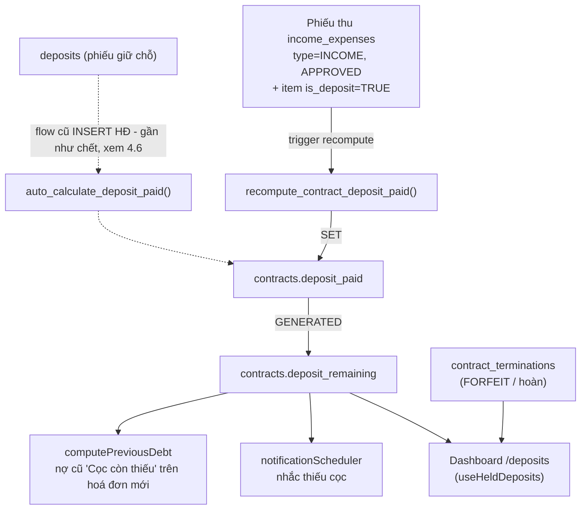
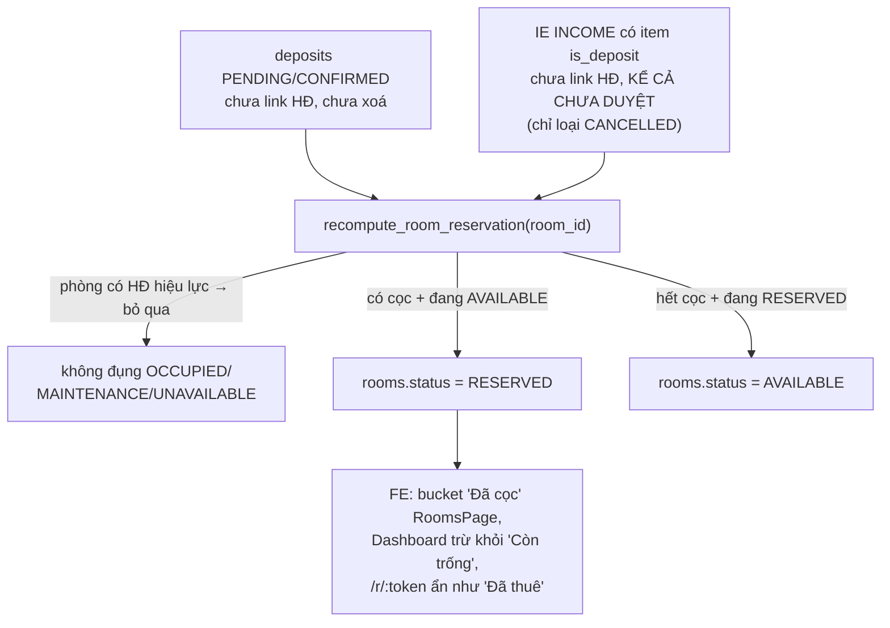
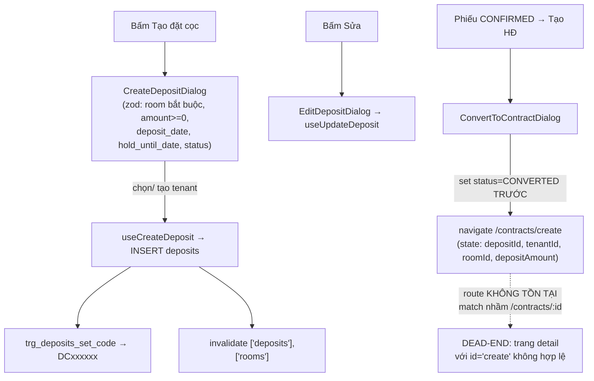
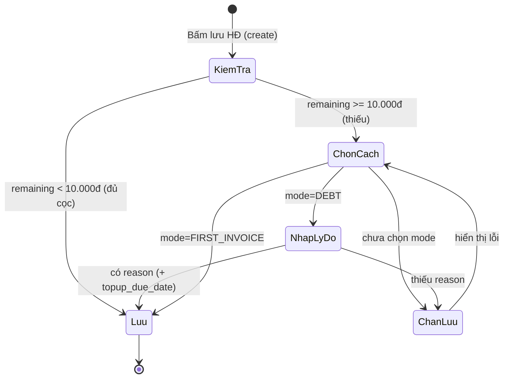

# Cọc giữ chỗ (Deposits) & Theo dõi cọc

## 1. Tổng quan & vai trò nghiệp vụ

Domain này phục vụ **toàn bộ vòng đời tiền cọc** trong CRM cho thuê:

- **Giữ chỗ trước hợp đồng**: khách đặt cọc giữ một căn hộ trong khi chưa ký HĐ → quản lý bằng bảng `deposits` (phiếu giữ chỗ, có mã `DCxxxxxx`, CTV, ngày giữ đến).
- **Tự khoá phòng `RESERVED` khi có cọc giữ chỗ** (2026-06-07, commit b3e69db): phiếu giữ chỗ `PENDING/CONFIRMED` chưa link HĐ HOẶC phiếu thu cọc (IE có item `is_deposit`, **kể cả chưa duyệt**) chưa link HĐ → `rooms.status` tự chuyển `AVAILABLE ↔ RESERVED` qua `recompute_room_reservation` (§4.11) → phòng rời bucket "Còn trống" toàn hệ thống (Danh mục căn hộ, Dashboard, Sơ đồ toà nhà, trang công khai `/r/:token`).
- **Theo dõi đủ/thiếu cọc của HĐ đang hiệu lực**: mỗi HĐ có `total_deposit` (cần thu) và `deposit_paid` (đã thu). Hệ thống chốt **đủ / thiếu cọc** và cảnh báo khoản còn nợ.
- **Chặn ký HĐ khi thiếu cọc**: khi tạo HĐ mà khách chưa đóng đủ, app bắt admin chọn cách xử lý (`deposit_debt_mode`: nợ cọc hoặc đóng đủ trong hoá đơn đầu) — cơ chế "acknowledge".
- **Hoàn / Bỏ cọc khi thanh lý**: lấy từ `contract_terminations`, KHÔNG dựa vào `deposits.status`.
- **Tiền thừa / credit theo HĐ**: bảng `excess_amounts` ghi nhận credit dư (do trả thừa hoá đơn) và việc tiêu credit.

> **Nguyên tắc cốt lõi (xem MEMORY `project_deposit_tracking_architecture`)**:
> **Nguồn sự thật của số cọc thực nộp KHÔNG phải `deposits.status`**, mà là:
> - `contracts.deposit_paid` — được **tự động recompute** từ các **phiếu thu chi (`income_expenses`) loại "tiền cọc"** (`income_expense_types.is_deposit = TRUE`) đã APPROVED và link vào HĐ.
> - `contracts.deposit_remaining` (cột `GENERATED ALWAYS AS total_deposit - deposit_paid`) = số còn thiếu.
> - Hoàn/bỏ cọc đến từ `contract_terminations`, không phải `deposits.status`.
>
> Bảng `deposits` chỉ còn vai trò **phiếu giữ chỗ trước HĐ** (CRUD đơn thuần) + flow cũ "deposit → contract"; enum `deposit_status` trên bảng này **không** được các RPC thanh lý/đồng bộ cập nhật.

Trang `/deposits` ([DepositsPage.tsx](src/pages/deposits/DepositsPage.tsx)) là **trung tâm quản lý cọc** với 4 tab: Tổng quan, Đủ/Thiếu cọc, Hoàn/Bỏ cọc, Phiếu giữ chỗ. Ngoài ra domain còn chạm tới trang báo cáo **"Danh sách tiền cọc"** `/reports/finance/deposits` (§5.6) và 2 redirect legacy `/reservations`, `/reservations/all` → `/deposits` ([App.tsx](src/App.tsx)).

---

## 2. Cấu trúc dữ liệu

### 2.1. Bảng `deposits` — Phiếu giữ chỗ trước hợp đồng

Mục đích: ghi nhận một lần khách **đặt cọc giữ căn hộ** trước khi ký HĐ (hoặc flow cũ chuyển cọc → HĐ).

Cột chủ chốt:

| Cột | Ý nghĩa nghiệp vụ |
|---|---|
| `code` | Mã phiếu `DCxxxxxx` tự sinh (sequence `deposits_code_seq`), unique. Trùng style mã đặt chỗ phía Resident. |
| `amount` | Số tiền cọc giữ chỗ (NOT NULL). |
| `deposit_date` | Ngày đặt cọc (NOT NULL, default `CURRENT_DATE`). |
| `hold_until` | Giữ căn hộ đến ngày nào (date). **Lưu ý bug**: form FE dùng key `hold_until_date` (xem §5.4). |
| `status` | enum `deposit_status` (default `PENDING`). **KHÔNG** phải nguồn sự thật đủ/thiếu cọc. |
| `room_id` | Căn hộ được giữ (FK→`rooms`). Nullable. |
| `contract_id` | HĐ mà phiếu này được chuyển thành (FK→`contracts`). Set khi flow cũ convert. |
| `tenant_id` | Khách đặt cọc (FK→`tenants`, NOT NULL). |
| `ctv_name` | Tên cộng tác viên giới thiệu. |
| `notes`, `receipt_image_url` | Ghi chú + ảnh biên nhận. **Lưu ý**: hiện **không có UI nào** upload/hiển thị `receipt_image_url` (cột tồn tại nhưng chưa dùng — nếu dùng lại phải qua StorageImage/signed URL vì bucket private). |
| `user_id` | Owner. Trigger BEFORE INSERT `deposits_set_user_id_audit` (`set_user_id_from_auth`) tự điền. Quyền truy cập thực tế scope **theo toà nhà** qua RLS RBAC (§4.16), không chỉ theo owner. |
| id / created_at / updated_at / deleted_at | Khoá + audit + soft delete. **Lưu ý**: FE hiện **hard-delete** (`useDeleteDeposit`) và `useDeposits` **không lọc** `deleted_at`; cột này chỉ được xét DB-side — `recompute_room_reservation` (§4.11) và bản live của `auto_calculate_deposit_paid` (§4.6) đều lọc `deleted_at IS NULL`. |

Enum dùng: **`deposit_status`** = `PENDING, CONFIRMED, CONVERTED, REFUNDED, FORFEITED`.

Quan hệ FK:
- **Đi ra**: `contract_id → contracts`, `room_id → rooms`, `tenant_id → tenants`.
- **Được tham chiếu**: `leads.deposit_id → deposits.id` — **FK mồ côi**: cột + FK tồn tại trong DB nhưng **không code nào ghi nó**. [ConvertLeadDialog.tsx](src/components/leads/ConvertLeadDialog.tsx) tạo deposit rồi gọi `useConvertLeadToDeposit` ([useLeads.ts](src/hooks/useLeads.ts)) — hook này chỉ update `leads.status='CONVERTED'`, không set `deposit_id`.

### 2.2. Bảng `excess_amounts` — Tiền thừa / credit theo HĐ

Mục đích: sổ ledger ghi **credit dư của một HĐ** (do trả thừa hoá đơn) và việc **tiêu credit** (áp vào giảm trừ / tiêu khi thanh lý). Số dư credit = `SUM(amount)` các dòng chưa bị huỷ.

Cột chủ chốt:

| Cột | Ý nghĩa nghiệp vụ |
|---|---|
| `contract_id` | HĐ sở hữu credit (FK→`contracts`, NOT NULL). |
| `amount` | Số tiền (NOT NULL). **Dương** = phát sinh credit (trả thừa); **âm** = tiêu credit. |
| `description` | Mô tả nguồn/lý do (vd "Áp credit vào Giảm trừ HĐ ...", "Tiêu credit khi thanh lý ..."). |
| `source_invoice_id` | Hoá đơn nguồn (FK→`invoices`). Dùng để **rollback idempotent**: nếu invoice nguồn bị `deleted_at` thì dòng credit đó bị bỏ qua khi tính tổng. |
| `source_payment_id` | Thanh toán nguồn (FK→`payments`). |
| `user_id`, `created_at` | Owner + audit (bảng này **không** có updated_at / deleted_at — chỉ append-only ledger). |

Enum dùng: không có.

Quan hệ FK:
- **Đi ra**: `contract_id → contracts`, `source_invoice_id → invoices`, `source_payment_id → payments`.
- Không bảng nào tham chiếu vào.

### 2.3. Cột "cọc" trên `contracts` (thuộc domain HĐ nhưng là nguồn sự thật của domain này)

| Cột | Ý nghĩa |
|---|---|
| `total_deposit` | Cọc cần thu theo HĐ (NOT NULL, default 0). |
| `deposit_paid` | Cọc đã thu thực tế — **tự recompute từ IE is_deposit** (xem §4.1). |
| `deposit_remaining` | `GENERATED ALWAYS AS (total_deposit - COALESCE(deposit_paid,0)) STORED` — số còn thiếu. |
| `deposit_debt_acknowledged` | Admin đã xử lý việc thiếu cọc lúc ký (bool, default false). |
| `deposit_debt_mode` | Cách xử lý thiếu cọc: `DEBT` (nợ, có nhắc) \| `FIRST_INVOICE` (thu đủ ở hoá đơn cọc+tháng đầu). CHECK constraint chỉ cho 2 giá trị hoặc NULL. |
| `deposit_debt_reason` | Lý do cho nợ cọc — bắt buộc khi mode = `DEBT`. |
| `deposit_topup_due_date` | Hẹn ngày khách bổ sung đủ cọc (mode `DEBT`) — dùng để nhắc. |

### 2.4. Cột "cọc" trên `contract_terminations` (nguồn của Hoàn/Bỏ cọc)

| Cột | Ý nghĩa |
|---|---|
| `termination_type` | `FORFEIT` = bỏ cọc (cọc thành doanh thu) \| còn lại = hoàn cọc. |
| `total_deposit` | Cọc gốc của HĐ tại thời điểm thanh lý (NOT NULL). |
| `total_deductions` | Tổng khấu trừ (`GENERATED` từ các loại phí). |
| `refund_amount` | Số hoàn lại (`GENERATED` = cọc - khấu trừ). |
| `refund_date`, `status` | Đã hoàn hay chưa (suy ra `refund_done = refund_date IS NOT NULL OR status='COMPLETED'`). |

---

## 3. Sơ đồ quan hệ dữ liệu

Luồng nguồn-sự-thật cọc:

Luồng cọc giữ chỗ → khoá phòng `RESERVED` (§4.11):

---

## 4. Quy tắc nghiệp vụ & tự động hoá

### 4.1. `recompute_contract_deposit_paid(p_contract_id)` — nguồn sự thật `deposit_paid`

[20260529000003_deposit_unify.sql](supabase/migrations/20260529000003_deposit_unify.sql)

- Tính `deposit_paid = SUM(income_expenses.total_amount)` của các phiếu thoả: `type='INCOME'`, `approval_status='APPROVED'`, `deleted_at IS NULL`, đã link `contract_id`, và **EXISTS item có `income_expense_types.is_deposit = TRUE`**.
- **Invariant quan trọng**: chỉ ghi đè `deposit_paid` khi `v_count > 0` (có ít nhất 1 IE cọc). Nếu HĐ chưa có IE cọc nào thì **giữ nguyên** giá trị cũ → tránh đè 0 lên giá trị set từ flow cũ (`deposits` → `auto_calculate_deposit_paid`).

### 4.2. `ie_has_deposit_item(p_ie_id)` — helper

Trả `TRUE` nếu phiếu IE có item thuộc loại `is_deposit`. Dùng trong các trigger để quyết định có recompute hay không.

### 4.3. Trigger đồng bộ IE → contract.deposit_paid

| Trigger | Bảng / sự kiện | Hành vi |
|---|---|---|
| `trg_ie_recompute_contract_deposit_ins` | AFTER INSERT `income_expenses` | recompute HĐ mới nếu IE có item cọc. |
| `trg_ie_recompute_contract_deposit_upd` | AFTER UPDATE OF (contract_id, approval_status, deleted_at, type, total_amount) | recompute HĐ mới + nếu đổi `contract_id` thì recompute cả HĐ cũ. |
| `trg_ie_recompute_contract_deposit_del` | AFTER DELETE `income_expenses` | recompute HĐ cũ nếu IE bị xoá có item cọc. |
| `trg_ie_items_recompute_deposit` | AFTER INSERT/UPDATE/DELETE `income_expense_items` | tra `contract_id` của IE cha rồi recompute (bắt trường hợp thêm/xoá item cọc sau). |

→ Bất kỳ thay đổi nào tới phiếu cọc (duyệt, sửa số tiền, xoá, đổi HĐ) đều **tự cập nhật** `deposit_paid`, kéo theo `deposit_remaining`.

### 4.4. `trg_contract_link_orphan_deposits` — tự link cọc-trước-HĐ

AFTER INSERT trên `contracts`. Khi tạo HĐ cho một `room_id`, trigger **tự gắn `contract_id`** cho các phiếu IE cọc "mồ côi" (`contract_id IS NULL`) cùng phòng, thoả:
- `type='INCOME'`, có item cọc, chưa xoá;
- tenant tương thích (`NEW.tenant_id IS NULL OR ie.tenant_id IS NULL OR khớp`);
- `voucher_date <= start_date + 7 ngày`.

Sau khi link → gọi `recompute_contract_deposit_paid(NEW.id)`. → Hỗ trợ kịch bản **thu cọc trước khi ký HĐ** (lúc đó chưa biết HĐ, ghi IE theo phòng).

### 4.5. `deposits_set_code` — sinh mã `DCxxxxxx`

[20260426000006_deposits_code_and_ctv.sql](supabase/migrations/20260426000006_deposits_code_and_ctv.sql)

BEFORE INSERT trên `deposits`: nếu `code` rỗng → `'DC' || LPAD(nextval('deposits_code_seq'),6,'0')`. Unique index trên `code`.

### 4.6. `auto_calculate_deposit_paid` — flow cũ deposits → contract

[012_auto_deposit_calculation.sql](supabase/migrations/012_auto_deposit_calculation.sql)

BEFORE INSERT trên `contracts`:
- Tính `SUM(deposits.amount)` của tenant + room với `status IN ('CONFIRMED','CONVERTED')` → nếu `NEW.deposit_paid` rỗng thì điền vào.
- UPDATE các `deposits` `status='CONFIRMED'` cùng tenant+room → `status='CONVERTED'`, gắn `contract_id`.

> **Lưu ý kỹ thuật (flow cũ gần như CHẾT trên thực tế)**: bản live của hàm đã được redefine **bỏ hẳn `bed_id`** tại [20260528000006_drop_beds_fix_triggers.sql](supabase/migrations/20260528000006_drop_beds_fix_triggers.sql) — không còn nợ kỹ thuật `bed_id`. Vấn đề tồn đọng thật sự nằm chỗ khác: `useCreateContract` ([useContracts.ts](src/hooks/useContracts.ts)) — đường tạo HĐ chính qua form — insert HĐ mới với `tenant_id = null` (cột legacy — khách thật nằm ở `contract_customers`), nên điều kiện `WHERE tenant_id = NEW.tenant_id` (so sánh với NULL) **không match** → SUM luôn rỗng và `deposits` **không** tự chuyển `CONVERTED`/gắn `contract_id` khi ký HĐ qua form. **Ngoại lệ**: `useBulkCreateContracts` (import HĐ hàng loạt từ Excel, cùng file) vẫn insert `tenant_id` thật → flow cũ vẫn có thể chạy ở đường import. Nguồn IE (§4.1, qua `trg_contract_link_orphan_deposits` §4.4 — trigger này match được vì `NEW.tenant_id IS NULL` coi như khớp mọi tenant) vẫn là đường chính; hệ quả phụ: phiếu giữ chỗ cũ không được dọn tự động ở luồng form → xem cảnh báo tái-RESERVED ở §4.11.

### 4.7. Chặn ký HĐ khi thiếu cọc (acknowledge)

[20260603000003_contract_deposit_debt_ack.sql](supabase/migrations/20260603000003_contract_deposit_debt_ack.sql)

- **Không** dùng CHECK constraint chặn lưu (để renew/transfer RPC và dữ liệu cũ không vỡ) — chỉ CHECK giới hạn giá trị `deposit_debt_mode ∈ {DEBT, FIRST_INVOICE, NULL}`.
- **Enforce ở tầng app** (xem §5.5): khi `remaining >= PREVIOUS_DEBT_ROUND_THRESHOLD` (10.000đ) mà chưa chọn `deposit_debt_mode` → chặn lưu; mode `DEBT` còn bắt buộc `deposit_debt_reason`.
- Index `idx_contracts_deposit_topup_due` hỗ trợ query nhắc.

### 4.8. Nhắc bổ sung cọc — `checkDepositTopupReminders`

[notificationScheduler.ts](src/lib/notificationScheduler.ts)

Chạy hằng ngày: quét HĐ `ACTIVE` (EXTENDED đã ngưng dùng — HĐ gia hạn giữ nguyên `ACTIVE`), `deposit_remaining >= ngưỡng`, `deposit_debt_mode IS NULL OR = 'DEBT'` (loại `FIRST_INVOICE` vì khoản đó thu qua hoá đơn). Scope chỉ theo `.eq('user_id', userId)` — không lọc theo toà/khu vực, notification tạo cho owner. Tạo notification `type='DEPOSIT_SHORTFALL'`. Throttle: quá hẹn (`deposit_topup_due_date < hôm nay`) nhắc 1 lần/ngày, chưa tới hẹn 1 lần/tuần.

### 4.9. Ledger credit `excess_amounts` & `consumeRemainingCredit`

[useContractOperations.ts](src/hooks/useContractOperations.ts), [useInvoices.ts](src/hooks/useInvoices.ts)

- Số dư credit của HĐ = `SUM(amount)` các dòng có `source_invoice` chưa `deleted_at` (rollback idempotent).
- Áp credit vào giảm trừ HĐ → insert dòng **âm** `-appliedCredit`.
- Thanh lý (move-out/forfeit) → `consumeRemainingCredit()` insert một dòng âm bằng đúng tổng credit còn dư → đưa số dư về 0.

Điểm chạm ghi/tiêu/xoá credit **ngoài 2 hook trên**:
- [RecordPaymentDialog.tsx](src/components/invoices/RecordPaymentDialog.tsx) — ghi nhận thanh toán lẻ có thể phát sinh credit.
- [useBulkRecordPayment.ts](src/hooks/useBulkRecordPayment.ts) — thu hàng loạt, tuỳ chọn `keep_as_credit` giữ tiền thừa thành credit.
- [useInvoicePayments.ts](src/hooks/useInvoicePayments.ts) — RPC `record_invoice_payment` tự insert dòng credit.
- [useDeletePayment.ts](src/hooks/useDeletePayment.ts) — hard-delete dòng credit theo `source_payment_id` khi xoá thanh toán.
- [TerminateDialog.tsx](src/components/contracts/TerminateDialog.tsx) — auto-fill credit còn dư khi thanh lý.
- [ExcelInvoiceDialog.tsx](src/components/invoices/ExcelInvoiceDialog.tsx) — áp credit vào Giảm trừ khi tạo hoá đơn hàng loạt.

### 4.10. Hoàn / Bỏ cọc đến từ `contract_terminations`

`useDepositRefundsForfeits` đọc `contract_terminations`. **KHÔNG** dựa `deposits.status` vì RPC thanh lý không set `REFUNDED/FORFEITED` trên `deposits`. `FORFEIT` → "Bỏ cọc" (cọc thành doanh thu); còn lại → "Hoàn cọc" với `refund_amount`.

### 4.11. `recompute_room_reservation(p_room_id)` — cọc giữ chỗ tự khoá phòng `RESERVED`

[20260608000000_room_reservation_reconcile.sql](supabase/migrations/20260608000000_room_reservation_reconcile.sql) (commit b3e69db, 2026-06-07 — timestamp file migration là 0608)

Hàm reconcile **idempotent**, là nguồn sự thật duy nhất cho cờ `RESERVED`:

1. **Bỏ qua nếu phòng có HĐ hiệu lực** (`contracts.status IN ('ACTIVE','EXTENDED')`, chưa xoá — check DB-side vẫn phòng hờ `EXTENDED` dù FE không còn ghi status này) — HĐ sở hữu `OCCUPIED`, reconcile không can thiệp.
2. **Predicate "đang có cọc giữ chỗ"** (OR 2 nhánh):
   - `deposits`: cùng `room_id`, `deleted_at IS NULL`, `contract_id IS NULL`, `status IN ('PENDING','CONFIRMED')`;
   - `income_expenses`: cùng `room_id`, `deleted_at IS NULL`, `contract_id IS NULL`, `type='INCOME'`, `approval_status <> 'CANCELLED'` (**kể cả phiếu chưa duyệt**), có item cọc (`ie_has_deposit_item`).
3. Chỉ chuyển 2 chiều `AVAILABLE → RESERVED` (có cọc) và `RESERVED → AVAILABLE` (hết cọc). **Không đụng** `OCCUPIED/MAINTENANCE/UNAVAILABLE`.

4 nhóm trigger gọi reconcile:

| Trigger | Bảng / sự kiện |
|---|---|
| `trg_deposit_reconcile_room_{ins,upd,del}` | `deposits` — INSERT / UPDATE OF (`room_id`, `contract_id`, `status`, `deleted_at`) / DELETE; đổi `room_id` thì reconcile cả phòng cũ. |
| `trg_ie_reconcile_room_{ins,upd,del}` | `income_expenses` — INSERT / UPDATE OF (`room_id`, `contract_id`, `approval_status`, `deleted_at`, `type`) / DELETE. |
| `trg_ie_items_reconcile_room` | `income_expense_items` — mọi INSERT/UPDATE/DELETE (thêm/bớt item cọc làm `ie_has_deposit_item` đổi). |
| `trg_room_status_reconcile` | `rooms` — AFTER UPDATE OF `status` `WHEN (NEW.status='AVAILABLE')` (chống đệ quy): phòng vừa được nhả (thanh lý, sửa tay) mà còn cọc → tái-`RESERVED`. |

Migration có **backfill** chạy reconcile toàn bộ phòng hiện hữu.

Touchpoint FE (bucket "Đã cọc" tách riêng toàn hệ):
- [RoomsPage.tsx](src/pages/rooms/RoomsPage.tsx) — filter trạng thái `RESERVED` + KPI đếm phòng "Đã đặt cọc".
- [useDashboard.ts](src/hooks/useDashboard.ts) — đếm `rooms.status='RESERVED'` riêng, **trừ khỏi "Còn trống"**.
- [roomStatus.ts](src/lib/roomStatus.ts) — `getRoomDisplayStatus`: không HĐ hiệu lực + `room.status='RESERVED'` → hiển thị `RESERVED`.
- Trang công khai `/r/:token` ([README](src/pages/phong-trong/README.md)) — map `RESERVED` → `rented` (ẩn khỏi danh sách phòng trống).

> **Cảnh báo (lỗ hổng vòng đời)**: predicate **không xét `hold_until`** → phiếu giữ chỗ quá hạn vẫn giữ phòng `RESERVED` vô hạn. Kết hợp với flow auto-convert đã chết (§4.6): phiếu `PENDING/CONFIRMED` không tự đóng khi phòng ký HĐ — lúc ký không lộ (reconcile skip vì có HĐ hiệu lực), nhưng khi HĐ đó thanh lý và phòng về `AVAILABLE`, trigger `trg_room_status_reconcile` sẽ **tái-RESERVED** phòng bởi phiếu giữ chỗ cổ chưa dọn. Cần dọn phiếu cũ thủ công hoặc bổ sung điều kiện `hold_until`/auto-convert khi sửa.

### 4.12. Sổ quỹ "CỌC (giữ hộ khách)" + auto-tạo phiếu thu cọc khi ký HĐ

[20260603000022_termination_deposit_book_transfer.sql](supabase/migrations/20260603000022_termination_deposit_book_transfer.sql), [ContractFormDialog.tsx](src/components/contracts/ContractFormDialog.tsx)

Đây là **nguồn chính sinh ra phiếu IE `is_deposit`** mà §4.1 dựa vào:

- Helper DB `_deposit_account(p_user_id)` — get-or-create sổ quỹ tên `'CỌC (giữ hộ khách)'` **theo owner** (1 sổ chung mọi toà, khớp MEMORY `feedback_system_account_single`). RPC `get_or_create_deposit_account()` bọc cho FE (authenticated-only).
- Khi tạo HĐ có `deposit_paid > 0` và tồn tại loại thu "Tiền cọc" (`is_deposit`): form HĐ **auto-tạo phiếu thu** `INCOME` tên `"Cọc giữ phòng {phòng} Toà nhà {toà}"` vào sổ CỌC, `contract_id` gắn HĐ vừa tạo, `business_result_accounting: null` (hạng mục cọc tự loại khỏi KQKD), kèm attachments upload tại form. Thiếu sổ CỌC hoặc thiếu loại thu "Tiền cọc" → toast cảnh báo "Đã lưu HĐ nhưng chưa tạo phiếu thu cọc...".
- DB còn helper `_ensure_initial_deposit_voucher(p_contract_id)` dùng cho RPC thanh lý: nếu HĐ đã có phiếu thu cọc → trả `account_id` của phiếu đó; chưa có và `deposit_paid > 0` → tạo bù trên sổ CỌC. Chuỗi chuyển khoản nội bộ sổ CỌC ↔ sổ vận hành khi thanh lý xem doc 05 (Hợp đồng/Thanh lý, MEMORY `project_termination_net_settlement`).

### 4.13. Thiếu cọc chảy vào "Nợ cũ" của hoá đơn — cơ chế thu nốt cọc thực tế

[invoiceHelpers.ts](src/lib/invoiceHelpers.ts) (`computePreviousDebt`), [ExcelInvoiceDialog.tsx](src/components/invoices/ExcelInvoiceDialog.tsx)

Khoản `FIRST_INVOICE`/`DEBT` được **thu thật** qua hoá đơn:

- `computePreviousDebt(contractId)` khi tạo hoá đơn mới: nếu `deposit_remaining >= PREVIOUS_DEBT_ROUND_THRESHOLD` (10.000đ) → thêm source `{type:'deposit', contract_id, amount, label:'Cọc còn thiếu'}` vào `previous_debt` của hoá đơn.
- **Chống cộng đúp**: quét `previous_debt_sources` của các hoá đơn mở (`APPROVED/PARTIAL_PAID/OVERDUE`) — nếu đã có hoá đơn nào gánh source `type='deposit'` (`depositAlreadyCarried`) thì không tính lại.
- `ExcelInvoiceDialog` (tạo hoá đơn hàng loạt theo toà) làm tương tự ở mức batch: build `previousDebtByContract`, skip HĐ đã carried.

### 4.14. KPI "Cọc đã thu" (`deposit_collected`) trong thống kê hoá đơn

[20260529000003_deposit_unify.sql](supabase/migrations/20260529000003_deposit_unify.sql)

`get_invoice_statistics` (v1) và `get_invoice_statistics_v2` (RPC FE thực gọi) trả thêm trường `deposit_collected` = `SUM(ie.total_amount)` các phiếu IE `INCOME` `APPROVED` chưa xoá có item `is_deposit`, lọc theo `p_area_id` (qua `buildings.area_id`), `p_building_id`, `p_room_id`, `voucher_date` (start/end), `p_billing_month`. v2 scope quyền qua `can_access_building(ie.building_id)`; v1 qua mảng `staff_assignments`. → touchpoint thống kê cọc nằm ở domain hoá đơn.

### 4.15. Guard chặn thiếu cọc tầng hook + badge cọc ở danh sách HĐ

- **Defense-in-depth** ngoài form (§5.5): [useContracts.ts](src/hooks/useContracts.ts) — `useCreateContract` `throw` nếu `total_deposit - deposit_paid >= PREVIOUS_DEBT_ROUND_THRESHOLD` mà `deposit_debt_acknowledged = false` ("Khách chưa đóng đủ cọc...").
- **DepositBadge** ([ContractListTable.tsx](src/components/contracts/ContractListTable.tsx)): badge 3 trạng thái cho HĐ in-effect (`isContractInEffect` = ACTIVE-only) có `total_deposit > 0`: **Đủ cọc** (xanh, remaining < 10.000đ) / **Cọc ở HĐ đầu** (xanh dương, mode `FIRST_INVOICE`) / **Thiếu cọc** (cam, mode `DEBT`/legacy).

### 4.16. RLS/RBAC theo toà nhà cho bảng `deposits` + module quyền

[20260527000007_rbac_phase3_contracts.sql](supabase/migrations/20260527000007_rbac_phase3_contracts.sql), [permissions.ts](src/lib/permissions.ts)

- 4 policy `deposits_{select,insert,update,delete}_rbac` scope **theo toà nhà**: SELECT dùng `can_access_building(building)`; INSERT/UPDATE/DELETE dùng `can_do_on_building('deposits', 'create'/'edit'/'delete', building)`. Building suy từ `building_of_contract(contract_id)` nếu có HĐ, fallback `rooms.building_id` theo `room_id`. SELECT có thêm nhánh bypass `is_super_admin()` / `is_admin()`; INSERT/UPDATE/DELETE chỉ bypass `is_super_admin()`.
- Trigger BEFORE INSERT `deposits_set_user_id_audit` (`set_user_id_from_auth`) tự điền `user_id`.
- Module quyền `deposits` (label "Đặt cọc", extra action `print`) trong `PERMISSION_GROUPS` nhóm "Khách hàng".

---

## 5. Quy trình theo từng trang

Trang chính của domain: **`/deposits`** ([DepositsPage.tsx](src/pages/deposits/DepositsPage.tsx)). Ngoài ra còn trang báo cáo **`/reports/finance/deposits`** (§5.6), 2 redirect legacy `/reservations`, `/reservations/all` → `/deposits`, và nút "Tạo cọc giữ phòng" (quyền nhãn "Tạo cọc nhanh") trên trang công khai `/r/:token` (§5.7 — WIP). Bộ lọc Khu vực/Toà nhà (SearchableSelect, theo MEMORY) dùng chung cho mọi tab; lọc toà nhà chạy **client-side**.

> **Cảnh báo bộ lọc Khu vực**: `areaId` hiện **chỉ thu hẹp options của dropdown Toà nhà** (`b.area_id === areaId`), **không lọc dữ liệu** — chọn khu vực + "Tất cả toà nhà" thì bảng vẫn hiện mọi khu vực; đổi khu vực cũng không reset `buildingId` (giá trị toà của khu vực cũ vẫn âm thầm áp).

Hook dữ liệu (cả 3 fetch ngay khi mount, không scope toà/khu vực server-side — chỉ dựa RLS, không phân trang):
- `useHeldDeposits` ([useDepositDashboard.ts](src/hooks/useDepositDashboard.ts)) — HĐ `ACTIVE` chưa xoá (EXTENDED đã ngưng dùng — HĐ gia hạn giữ `ACTIVE`), map ra `HeldDepositRow` với `state`:
  - `FULL` nếu `deposit_remaining < DEPOSIT_SHORTFALL_THRESHOLD` (10.000đ — ngưỡng làm tròn);
  - ngược lại `FIRST_INVOICE` nếu `deposit_debt_mode='FIRST_INVOICE'`, else `SHORT` (nợ cọc).
- `useDepositRefundsForfeits` — đọc `contract_terminations` (toàn bộ, không giới hạn thời gian) → `RefundForfeitRow`.
- `useDeposits` ([useDeposits.ts](src/hooks/useDeposits.ts)) — phiếu giữ chỗ (join tenant, room→building), lọc theo `status` **server-side**. **Lưu ý 2 điểm**: (1) không lọc `deleted_at` (hiện vô hại vì xoá là hard-delete); (2) `statusFilter` của tab 4 là tham số server của query **dùng chung** → khi user lọc trạng thái ở tab Phiếu giữ chỗ, KPI "Giữ chỗ chờ" (tab Tổng quan) và 5 card đếm trạng thái (đầu tab 4) bị sai vì dataset chỉ còn 1 status.
- `summarizeByBuilding` — gộp held theo toà nhà cho tab Tổng quan.

### 5.1. Tab "Tổng quan"

KPI tính từ `heldFiltered` + `refundsFiltered`:
- **Cọc đang giữ** = Σ `deposit_paid`; **Cọc cần thu** = Σ `total_deposit`.
- **Thiếu cọc** = Σ `deposit_remaining` của các dòng `state='SHORT'` (+ số HĐ).
- **Giữ chỗ chờ** = Σ `amount` các phiếu `deposits` `PENDING/CONFIRMED` (lọc theo toà qua `room.building.id`).
- **Đã hoàn cọc** / **Đã bỏ cọc** — từ `contract_terminations`.

Bảng dưới: gộp theo toà nhà (Số HĐ / Cọc cần thu / Đang giữ / Thiếu cọc / Đủ-Thiếu).

### 5.2. Tab "Đủ / Thiếu cọc"

Hiển thị các dòng `state != 'FULL'` (HĐ chưa đủ cọc). Toggle "Chỉ hiện thiếu cọc" → lọc tiếp `state='SHORT'`. Mỗi dòng: toà/phòng/khách (link `/contracts/:id`), Cần thu / Đã thu / Còn thiếu, badge trạng thái (`FIRST_INVOICE` = "Thu ở HĐ đầu" xanh; còn lại "Nợ cọc" cam), cột "Hẹn bổ sung" = `deposit_topup_due_date`.

### 5.3. Tab "Hoàn / Bỏ cọc"

Bảng từ `contract_terminations` (sort theo `termination_date` desc): Ngày, toà/phòng/khách, Loại (badge Bỏ cọc đỏ / Hoàn cọc xám), Cọc gốc, Khấu trừ, Hoàn lại (`FORFEIT` hiển thị "—"), Tình trạng (`refund_done` → "Đã hoàn", `FORFEIT` → "Cọc thành doanh thu", else "Chờ hoàn").

### 5.4. Tab "Phiếu giữ chỗ" (CRUD trên `deposits`)

Các thao tác:
- **Tạo** ([CreateDepositDialog.tsx](src/components/deposits/CreateDepositDialog.tsx)): chọn tenant có sẵn hoặc tạo mới (tenant mới `status='DEPOSITED'`); validate zod (`room_id` bắt buộc, `amount>=0`, `deposit_date`, `hold_until_date`, `status`). `useCreateDeposit` tự gắn `user_id`.
- **Sửa / Xoá** ([EditDepositDialog.tsx](src/components/deposits/EditDepositDialog.tsx)): `useUpdateDeposit` / `useDeleteDeposit` (hard delete).
- **Chuyển sang HĐ** ([ConvertToContractDialog.tsx](src/components/deposits/ConvertToContractDialog.tsx)): chỉ hiện khi `status='CONFIRMED'`. Set `status='CONVERTED'` rồi điều hướng sang `/contracts/create` mang theo `depositId/tenantId/roomId/depositAmount`.
- **Entry-point thứ 2 (ngoài trang này)**: [ConvertLeadDialog.tsx](src/components/leads/ConvertLeadDialog.tsx) — "Chuyển sang Đặt cọc" từ pipeline `/leads` (§5.1 doc 03): INSERT `deposits` `status='PENDING'` (có thể tạo tenant mới `status='DEPOSITED'`), rồi `useConvertLeadToDeposit` update `leads.status='CONVERTED'` — **không** ghi `leads.deposit_id` (FK mồ côi, §2.1). Dính cùng bug `hold_until_date` bên dưới.

> **BUG dead-end phá dữ liệu (Chuyển sang HĐ)**: route `/contracts/create` **không tồn tại** trong [App.tsx](src/App.tsx) (chỉ có `/contracts` và `/contracts/:id` → `'create'` bị match làm `:id`, vào ContractDetailPage với id không hợp lệ); cũng **không file nào** trong `src/pages/contracts` đọc `location.state` để prefill form. Hậu quả kép vì deposit đã bị set `CONVERTED` **trước** khi navigate: (1) phiếu kẹt `CONVERTED` không có HĐ, nút "Tạo HĐ" biến mất; (2) `CONVERTED` rời predicate `PENDING/CONFIRMED` của `recompute_room_reservation` (§4.11) → phòng đang `RESERVED` bị nhả về `AVAILABLE` dù chưa hề ký HĐ. Hướng sửa: mở ContractFormDialog prefill từ state (hoặc thêm route thật) và chỉ set `CONVERTED` sau khi HĐ tạo thành công.

> **BUG `hold_until_date` (Tạo/Sửa phiếu hỏng hoàn toàn)**: cột thực tế là `deposits.hold_until` ([types.ts](src/integrations/supabase/types.ts) — Insert type chỉ có `hold_until`), nhưng cả 3 form đều gửi key **`hold_until_date`**: [CreateDepositDialog.tsx](src/components/deposits/CreateDepositDialog.tsx) (insert trực tiếp), [EditDepositDialog.tsx](src/components/deposits/EditDepositDialog.tsx) (spread `...data` chứa field này), và [ConvertLeadDialog.tsx](src/components/leads/ConvertLeadDialog.tsx) (entry-point Lead → Đặt cọc, §5.1 doc 03). PostgREST **từ chối toàn bộ INSERT/UPDATE** khi payload chứa cột không tồn tại (lỗi PGRST204) → tạo/sửa phiếu giữ chỗ từ UI **fail hoàn toàn**, không phải chỉ mất 1 field. Cần map `hold_until_date` (form) → `hold_until` (payload) ở cả 3 chỗ.

### 5.5. Chặn ký HĐ thiếu cọc (xảy ra ở domain HĐ, liên đới mạnh)

Khi tạo HĐ trong [ContractFormDialog.tsx](src/components/contracts/ContractFormDialog.tsx): nếu `total_deposit - deposit_paid >= PREVIOUS_DEBT_ROUND_THRESHOLD` mà chưa chọn `deposit_debt_mode` → `form.setError` + toast chặn lưu. Mode `DEBT` bắt buộc nhập `deposit_debt_reason`. Schema zod ([contractValidation.ts](src/lib/contractValidation.ts)) khai báo 4 trường `deposit_debt_*`. Khi đủ cọc thì các trường này set null.

### 5.6. Trang báo cáo "Danh sách tiền cọc" — `/reports/finance/deposits`

[DepositsReport.tsx](src/pages/reports/finance/DepositsReport.tsx) + hook `useDepositsReport` ([useReports.ts](src/hooks/useReports.ts)). Route chính `/reports/finance/deposits`, kèm alias legacy `/report/finance/deposit` ([App.tsx](src/App.tsx)).

- Đọc **toàn bộ bảng `deposits`** (`select('*')` + join tenant, room→building, sort `deposit_date` desc) — không limit, không lọc `deleted_at`/status server-side; "phân trang" chỉ là `slice` client trên mảng full.
- Cột: Toà nhà / Căn hộ / Khách hàng / Số tiền cọc / "Số tiền cọc (giữ chỗ)" (chỉ điền khi `status ∈ {PENDING, CONFIRMED}`) / "Số tiền cọc (trong hoá đơn)" (chỉ điền khi `CONVERTED`) / Phân loại (map nhãn tiếng Việt từ `deposit_status`). Dòng "Tổng" = Σ `amount` của rows sau lọc.
- 3 ô lọc SearchableSelect: Loại cọc (status), Khu vực, Toà nhà — lọc client-side.

> **Cảnh báo bộ lọc (tệ hơn cả /deposits)**: `areaId` hoàn toàn **không được dùng** trong `filtered()` (dead filter — chọn khu vực không đổi gì); dropdown Toà **không thu hẹp theo khu vực**; lọc toà so sánh theo **TÊN toà** (`d.rooms?.buildings?.name === b.name`) thay vì id — 2 toà trùng tên sẽ lẫn dữ liệu. Hướng sửa: lọc theo `building.id` + áp `area_id`.

> Vì cột Phân loại đọc từ `deposits.status` nên báo cáo này kế thừa hạn chế "status không phải nguồn sự thật" (§1): `REFUNDED/FORFEITED` gần như không bao giờ được set tự động (§4.10), và `CONVERTED` không được set khi ký HĐ vì flow cũ đã chết (§4.6).

### 5.7. "Tạo cọc nhanh" trên trang công khai `/r/:token` — **WIP, chưa commit**

[QuickDepositModal.tsx](src/pages/phong-trong/QuickDepositModal.tsx) (gate tại [PhongTrongPage.tsx](src/pages/phong-trong/PhongTrongPage.tsx)), migration [20260608100000_ensure_room_deposit_type_rpc.sql](supabase/migrations/20260608100000_ensure_room_deposit_type_rpc.sql), diff [permissions.ts](src/lib/permissions.ts) — **toàn bộ đang uncommitted** trong working tree; mục này mô tả trước, cập nhật lại khi lên `main`.

- Mục đích: nhân viên sale nhận cọc của khách → **khoá phòng `RESERVED` realtime** ngay trên trang công khai. Modal tạo 1 phiếu thu `INCOME` (`contract_id = null` — cọc giữ chỗ, `room_id`/`building_id` theo phòng đang xem) vào sổ "CỌC (giữ hộ khách)" (RPC `get_or_create_deposit_account`, §4.12) + hạng mục "Tiền cọc" qua **RPC mới `ensure_room_deposit_type`** (SECURITY DEFINER, get-or-create loại thu của caller qua `_termination_ensure_type` rồi **ép `is_deposit = TRUE`**, revoke `anon`) → trigger §4.11 tự set `rooms.status='RESERVED'` → invalidate query `['phong-trong']` để phòng biến mất khỏi danh sách công khai ngay.
- Gate bằng quyền mới **`sale_phong.create_deposit`** (label "Tạo cọc nhanh") — extra action của module Sale Phòng, **cờ toàn cục, không per-building**; nút chỉ hiện khi user **đang đăng nhập** và có quyền (khách vãng lai xem trang không thấy).
- Nội dung phiếu = `"Cọc phòng {x} tòa {y}"`; "Ngày bổ sung cọc" + "Ngày vào" (tuỳ chọn) chỉ ghi thêm vào nội dung/description, không có cột riêng. `business_result_accounting: null` (cọc ngoài KQKD).
- **Số tiền để trống → mặc định 1đ**: đây là phiếu thu thật trong sổ CỌC. Khi phòng ký HĐ, `trg_contract_link_orphan_deposits` (§4.4) sẽ link phiếu 1đ vào HĐ (điều kiện `voucher_date <= start_date + 7 ngày` — **không giới hạn lùi**, phiếu cọc cũ bao lâu cũng link miễn HĐ ký sau) và cộng vào `deposit_paid` / KPI `deposit_collected` (§4.14) — vô hại về số nhưng tạo **rác sổ quỹ + nhiễu thống kê** "Cọc đã thu"; cân nhắc bắt buộc nhập tiền hoặc đánh dấu phiếu 1đ để dễ dọn.

---

## 6. Liên kết sang domain khác (vào / ra)

| Liên kết | Hướng | Lý do |
|---|---|---|
| `income_expenses` (+ `income_expense_items`, `income_expense_types.is_deposit`) | **Vào** (nguồn sự thật) | Cọc thực nộp = phiếu thu cọc APPROVED; trigger recompute `contracts.deposit_paid`. |
| `contracts` (`total_deposit`, `deposit_paid`, `deposit_remaining`, `deposit_debt_*`) | **Ra/Vào** | Dashboard đủ/thiếu cọc đọc từ HĐ; chặn ký HĐ thiếu cọc ghi vào HĐ. |
| `contract_terminations` | **Vào** | Hoàn/Bỏ cọc (tab 3) — `termination_type`, `refund_amount`. |
| `excess_amounts` ↔ `invoices` / `payments` | **Ra/Vào** | Credit dư từ trả thừa hoá đơn; tiêu credit khi áp giảm trừ / thanh lý. |
| `tenants` / `rooms` / `buildings` | **Ra** | Phiếu giữ chỗ gắn khách + phòng; dashboard gộp theo toà nhà. |
| `rooms.status` = `RESERVED` | **Ra** | Cọc giữ chỗ chưa link HĐ tự khoá/nhả phòng qua `recompute_room_reservation` (§4.11) → lan sang Danh mục căn hộ, Dashboard, Sơ đồ toà nhà, trang công khai `/r/:token`. |
| `invoices` (`previous_debt_sources` `type='deposit'`) + RPC `get_invoice_statistics(_v2)` | **Ra** | Thiếu cọc chảy vào "Nợ cũ" của hoá đơn mới qua `computePreviousDebt` (§4.13); KPI `deposit_collected` trong thống kê hoá đơn (§4.14). |
| `leads` (ConvertLeadDialog) | **Vào** | Lead "Chuyển sang Đặt cọc" tạo phiếu giữ chỗ `PENDING` (§5.4). **Lưu ý**: FK `leads.deposit_id → deposits.id` là FK mồ côi — code chỉ update `leads.status='CONVERTED'`, không bao giờ ghi `deposit_id` (§2.1). |
| `notifications` (`type='DEPOSIT_SHORTFALL'`) | **Ra** | notificationScheduler nhắc bổ sung cọc theo `deposit_topup_due_date`. |
| `/contracts/create` | **Ra** | ConvertToContractDialog điều hướng kèm state phiếu cọc — **route không tồn tại, dead-end phá dữ liệu** (xem BUG §5.4). |
