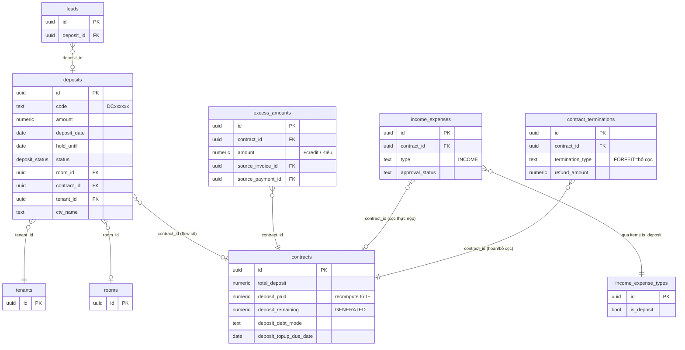
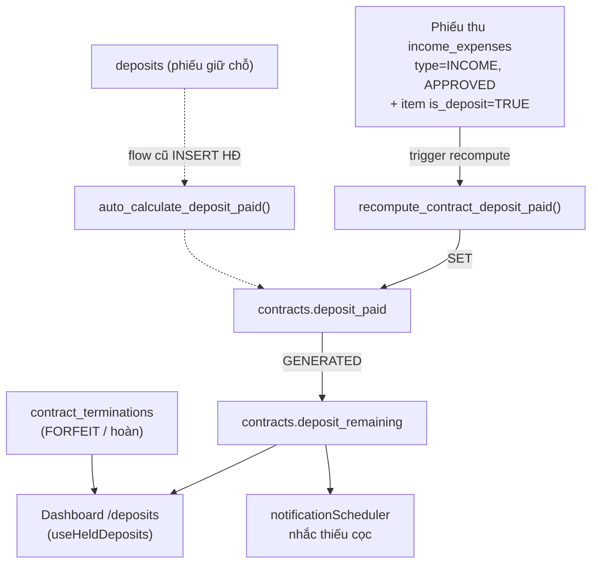
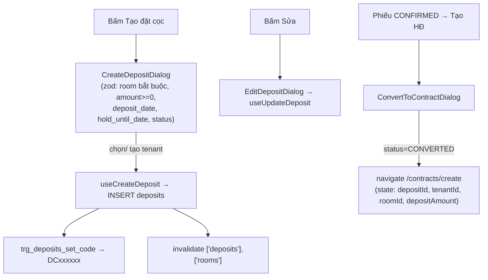
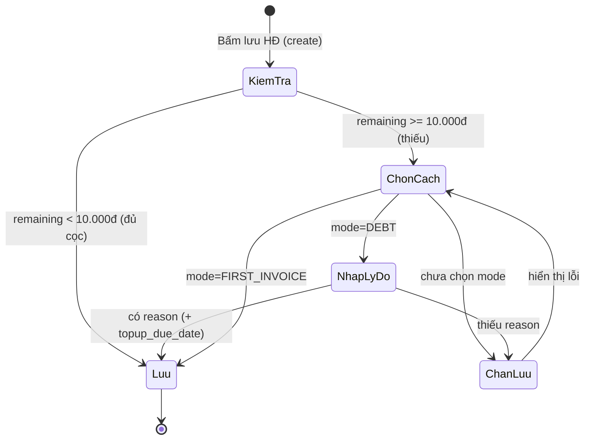

# Cọc giữ chỗ (Deposits) & Theo dõi cọc

## 1. Tổng quan & vai trò nghiệp vụ

Domain này phục vụ **toàn bộ vòng đời tiền cọc** trong CRM cho thuê:

- **Giữ chỗ trước hợp đồng**: khách đặt cọc giữ một căn hộ trong khi chưa ký HĐ → quản lý bằng bảng `deposits` (phiếu giữ chỗ, có mã `DCxxxxxx`, CTV, ngày giữ đến).
- **Theo dõi đủ/thiếu cọc của HĐ đang hiệu lực**: mỗi HĐ có `total_deposit` (cần thu) và `deposit_paid` (đã thu). Hệ thống chốt **đủ / thiếu cọc** và cảnh báo khoản còn nợ.
- **Chặn ký HĐ khi thiếu cọc**: khi tạo HĐ mà khách chưa đóng đủ, app bắt admin chọn cách xử lý (`deposit_debt_mode`: nợ cọc hoặc đóng đủ trong hoá đơn đầu) — cơ chế "acknowledge".
- **Hoàn / Bỏ cọc khi thanh lý**: lấy từ `contract_terminations`, KHÔNG dựa vào `deposits.status`.
- **Tiền thừa / credit theo HĐ**: bảng `excess_amounts` ghi nhận credit dư (do trả thừa hoá đơn) và việc tiêu credit.

> **Nguyên tắc cốt lõi (xem MEMORY `project_deposit_tracking_architecture`)**:
> **Nguồn sự thật của số cọc thực nộp KHÔNG phải `deposits.status`**, mà là:
> - `contracts.deposit_paid` — được **tự động recompute** từ các **phiếu thu chi (`income_expenses`) loại "tiền cọc"** (`income_expense_types.is_deposit = TRUE`) đã APPROVED và link vào HĐ.
> - `contracts.deposit_remaining` (cột `GENERATED ALWAYS AS total_deposit - deposit_paid`) = số còn thiếu.
> - Hoàn/bỏ cọc đến từ `contract_terminations`, không phải `deposits.status`.
>
> Bảng `deposits` chỉ còn vai trò **phiếu giữ chỗ trước HĐ** (CRUD đơn thuần) + flow cũ "deposit → contract"; enum `deposit_status` trên bảng này **không** được các RPC thanh lý/đồng bộ cập nhật.

Trang `/deposits` ([DepositsPage.tsx](src/pages/deposits/DepositsPage.tsx)) là **trung tâm quản lý cọc** với 4 tab: Tổng quan, Đủ/Thiếu cọc, Hoàn/Bỏ cọc, Phiếu giữ chỗ.

---

## 2. Cấu trúc dữ liệu

### 2.1. Bảng `deposits` — Phiếu giữ chỗ trước hợp đồng

Mục đích: ghi nhận một lần khách **đặt cọc giữ căn hộ** trước khi ký HĐ (hoặc flow cũ chuyển cọc → HĐ).

Cột chủ chốt:

| Cột | Ý nghĩa nghiệp vụ |
|---|---|
| `code` | Mã phiếu `DCxxxxxx` tự sinh (sequence `deposits_code_seq`), unique. Trùng style mã đặt chỗ phía Resident. |
| `amount` | Số tiền cọc giữ chỗ (NOT NULL). |
| `deposit_date` | Ngày đặt cọc (NOT NULL, default `CURRENT_DATE`). |
| `hold_until` | Giữ căn hộ đến ngày nào (date). **Lưu ý bug**: form FE dùng key `hold_until_date` (xem §5.4). |
| `status` | enum `deposit_status` (default `PENDING`). **KHÔNG** phải nguồn sự thật đủ/thiếu cọc. |
| `room_id` | Căn hộ được giữ (FK→`rooms`). Nullable. |
| `contract_id` | HĐ mà phiếu này được chuyển thành (FK→`contracts`). Set khi flow cũ convert. |
| `tenant_id` | Khách đặt cọc (FK→`tenants`, NOT NULL). |
| `ctv_name` | Tên cộng tác viên giới thiệu. |
| `notes`, `receipt_image_url` | Ghi chú + ảnh biên nhận (bucket private → dùng StorageImage/signed URL). |
| `user_id` | Owner (multi-tenant). |
| id / created_at / updated_at / deleted_at | Khoá + audit + soft delete. |

Enum dùng: **`deposit_status`** = `PENDING, CONFIRMED, CONVERTED, REFUNDED, FORFEITED`.

Quan hệ FK:
- **Đi ra**: `contract_id → contracts`, `room_id → rooms`, `tenant_id → tenants`.
- **Được tham chiếu**: `leads.deposit_id → deposits.id` (lead khi chuyển thành cọc thì gắn `deposit_id`).

### 2.2. Bảng `excess_amounts` — Tiền thừa / credit theo HĐ

Mục đích: sổ ledger ghi **credit dư của một HĐ** (do trả thừa hoá đơn) và việc **tiêu credit** (áp vào giảm trừ / tiêu khi thanh lý). Số dư credit = `SUM(amount)` các dòng chưa bị huỷ.

Cột chủ chốt:

| Cột | Ý nghĩa nghiệp vụ |
|---|---|
| `contract_id` | HĐ sở hữu credit (FK→`contracts`, NOT NULL). |
| `amount` | Số tiền (NOT NULL). **Dương** = phát sinh credit (trả thừa); **âm** = tiêu credit. |
| `description` | Mô tả nguồn/lý do (vd "Áp credit vào Giảm trừ HĐ ...", "Tiêu credit khi thanh lý ..."). |
| `source_invoice_id` | Hoá đơn nguồn (FK→`invoices`). Dùng để **rollback idempotent**: nếu invoice nguồn bị `deleted_at` thì dòng credit đó bị bỏ qua khi tính tổng. |
| `source_payment_id` | Thanh toán nguồn (FK→`payments`). |
| `user_id`, `created_at` | Owner + audit (bảng này **không** có updated_at / deleted_at — chỉ append-only ledger). |

Enum dùng: không có.

Quan hệ FK:
- **Đi ra**: `contract_id → contracts`, `source_invoice_id → invoices`, `source_payment_id → payments`.
- Không bảng nào tham chiếu vào.

### 2.3. Cột "cọc" trên `contracts` (thuộc domain HĐ nhưng là nguồn sự thật của domain này)

| Cột | Ý nghĩa |
|---|---|
| `total_deposit` | Cọc cần thu theo HĐ (NOT NULL, default 0). |
| `deposit_paid` | Cọc đã thu thực tế — **tự recompute từ IE is_deposit** (xem §4.1). |
| `deposit_remaining` | `GENERATED ALWAYS AS (total_deposit - COALESCE(deposit_paid,0)) STORED` — số còn thiếu. |
| `deposit_debt_acknowledged` | Admin đã xử lý việc thiếu cọc lúc ký (bool, default false). |
| `deposit_debt_mode` | Cách xử lý thiếu cọc: `DEBT` (nợ, có nhắc) \| `FIRST_INVOICE` (thu đủ ở hoá đơn cọc+tháng đầu). CHECK constraint chỉ cho 2 giá trị hoặc NULL. |
| `deposit_debt_reason` | Lý do cho nợ cọc — bắt buộc khi mode = `DEBT`. |
| `deposit_topup_due_date` | Hẹn ngày khách bổ sung đủ cọc (mode `DEBT`) — dùng để nhắc. |

### 2.4. Cột "cọc" trên `contract_terminations` (nguồn của Hoàn/Bỏ cọc)

| Cột | Ý nghĩa |
|---|---|
| `termination_type` | `FORFEIT` = bỏ cọc (cọc thành doanh thu) \| còn lại = hoàn cọc. |
| `total_deposit` | Cọc gốc của HĐ tại thời điểm thanh lý (NOT NULL). |
| `total_deductions` | Tổng khấu trừ (`GENERATED` từ các loại phí). |
| `refund_amount` | Số hoàn lại (`GENERATED` = cọc - khấu trừ). |
| `refund_date`, `status` | Đã hoàn hay chưa (suy ra `refund_done = refund_date IS NOT NULL OR status='COMPLETED'`). |

---

## 3. Sơ đồ quan hệ dữ liệu

Luồng nguồn-sự-thật cọc:

---

## 4. Quy tắc nghiệp vụ & tự động hoá

### 4.1. `recompute_contract_deposit_paid(p_contract_id)` — nguồn sự thật `deposit_paid`

[20260529000003_deposit_unify.sql](supabase/migrations/20260529000003_deposit_unify.sql)

- Tính `deposit_paid = SUM(income_expenses.total_amount)` của các phiếu thoả: `type='INCOME'`, `approval_status='APPROVED'`, `deleted_at IS NULL`, đã link `contract_id`, và **EXISTS item có `income_expense_types.is_deposit = TRUE`**.
- **Invariant quan trọng**: chỉ ghi đè `deposit_paid` khi `v_count > 0` (có ít nhất 1 IE cọc). Nếu HĐ chưa có IE cọc nào thì **giữ nguyên** giá trị cũ → tránh đè 0 lên giá trị set từ flow cũ (`deposits` → `auto_calculate_deposit_paid`).

### 4.2. `ie_has_deposit_item(p_ie_id)` — helper

Trả `TRUE` nếu phiếu IE có item thuộc loại `is_deposit`. Dùng trong các trigger để quyết định có recompute hay không.

### 4.3. Trigger đồng bộ IE → contract.deposit_paid

| Trigger | Bảng / sự kiện | Hành vi |
|---|---|---|
| `trg_ie_recompute_contract_deposit_ins` | AFTER INSERT `income_expenses` | recompute HĐ mới nếu IE có item cọc. |
| `trg_ie_recompute_contract_deposit_upd` | AFTER UPDATE OF (contract_id, approval_status, deleted_at, type, total_amount) | recompute HĐ mới + nếu đổi `contract_id` thì recompute cả HĐ cũ. |
| `trg_ie_recompute_contract_deposit_del` | AFTER DELETE `income_expenses` | recompute HĐ cũ nếu IE bị xoá có item cọc. |
| `trg_ie_items_recompute_deposit` | AFTER INSERT/UPDATE/DELETE `income_expense_items` | tra `contract_id` của IE cha rồi recompute (bắt trường hợp thêm/xoá item cọc sau). |

→ Bất kỳ thay đổi nào tới phiếu cọc (duyệt, sửa số tiền, xoá, đổi HĐ) đều **tự cập nhật** `deposit_paid`, kéo theo `deposit_remaining`.

### 4.4. `trg_contract_link_orphan_deposits` — tự link cọc-trước-HĐ

AFTER INSERT trên `contracts`. Khi tạo HĐ cho một `room_id`, trigger **tự gắn `contract_id`** cho các phiếu IE cọc "mồ côi" (`contract_id IS NULL`) cùng phòng, thoả:
- `type='INCOME'`, có item cọc, chưa xoá;
- tenant tương thích (`NEW.tenant_id IS NULL OR ie.tenant_id IS NULL OR khớp`);
- `voucher_date <= start_date + 7 ngày`.

Sau khi link → gọi `recompute_contract_deposit_paid(NEW.id)`. → Hỗ trợ kịch bản **thu cọc trước khi ký HĐ** (lúc đó chưa biết HĐ, ghi IE theo phòng).

### 4.5. `deposits_set_code` — sinh mã `DCxxxxxx`

[20260426000006_deposits_code_and_ctv.sql](supabase/migrations/20260426000006_deposits_code_and_ctv.sql)

BEFORE INSERT trên `deposits`: nếu `code` rỗng → `'DC' || LPAD(nextval('deposits_code_seq'),6,'0')`. Unique index trên `code`.

### 4.6. `auto_calculate_deposit_paid` — flow cũ deposits → contract

[012_auto_deposit_calculation.sql](supabase/migrations/012_auto_deposit_calculation.sql)

BEFORE INSERT trên `contracts`:
- Tính `SUM(deposits.amount)` của tenant + room với `status IN ('CONFIRMED','CONVERTED')` → nếu `NEW.deposit_paid` rỗng thì điền vào.
- UPDATE các `deposits` `status='CONFIRMED'` cùng tenant+room → `status='CONVERTED'`, gắn `contract_id`.

> **Lưu ý kỹ thuật (legacy/nợ kỹ thuật)**: hàm này còn tham chiếu `NEW.bed_id` / `deposits.bed_id`. Cột `bed_id` đã bị bỏ ở các migration sau (xem `20260528000006_drop_beds_fix_triggers.sql`). Đây là flow cũ, ưu tiên thực tế là nguồn IE (§4.1). `recompute_contract_deposit_paid` chỉ override khi có IE cọc, nên giá trị do flow cũ điền vẫn được bảo toàn nếu chưa có IE cọc.

### 4.7. Chặn ký HĐ khi thiếu cọc (acknowledge)

[20260603000003_contract_deposit_debt_ack.sql](supabase/migrations/20260603000003_contract_deposit_debt_ack.sql)

- **Không** dùng CHECK constraint chặn lưu (để renew/transfer RPC và dữ liệu cũ không vỡ) — chỉ CHECK giới hạn giá trị `deposit_debt_mode ∈ {DEBT, FIRST_INVOICE, NULL}`.
- **Enforce ở tầng app** (xem §5.5): khi `remaining >= PREVIOUS_DEBT_ROUND_THRESHOLD` (10.000đ) mà chưa chọn `deposit_debt_mode` → chặn lưu; mode `DEBT` còn bắt buộc `deposit_debt_reason`.
- Index `idx_contracts_deposit_topup_due` hỗ trợ query nhắc.

### 4.8. Nhắc bổ sung cọc — `checkDepositTopupReminders`

[notificationScheduler.ts](src/lib/notificationScheduler.ts)

Chạy hằng ngày: quét HĐ `ACTIVE/EXTENDED`, `deposit_remaining >= ngưỡng`, `deposit_debt_mode IS NULL OR = 'DEBT'` (loại `FIRST_INVOICE` vì khoản đó thu qua hoá đơn). Tạo notification `type='DEPOSIT_SHORTFALL'`. Throttle: quá hẹn (`deposit_topup_due_date < hôm nay`) nhắc 1 lần/ngày, chưa tới hẹn 1 lần/tuần.

### 4.9. Ledger credit `excess_amounts` & `consumeRemainingCredit`

[useContractOperations.ts](src/hooks/useContractOperations.ts), [useInvoices.ts](src/hooks/useInvoices.ts)

- Số dư credit của HĐ = `SUM(amount)` các dòng có `source_invoice` chưa `deleted_at` (rollback idempotent).
- Áp credit vào giảm trừ HĐ → insert dòng **âm** `-appliedCredit`.
- Thanh lý (move-out/forfeit) → `consumeRemainingCredit()` insert một dòng âm bằng đúng tổng credit còn dư → đưa số dư về 0.

### 4.10. Hoàn / Bỏ cọc đến từ `contract_terminations`

`useDepositRefundsForfeits` đọc `contract_terminations`. **KHÔNG** dựa `deposits.status` vì RPC thanh lý không set `REFUNDED/FORFEITED` trên `deposits`. `FORFEIT` → "Bỏ cọc" (cọc thành doanh thu); còn lại → "Hoàn cọc" với `refund_amount`.

---

## 5. Quy trình theo từng trang

Domain chỉ có 1 trang: **`/deposits`** ([DepositsPage.tsx](src/pages/deposits/DepositsPage.tsx)). Bộ lọc Khu vực/Toà nhà (SearchableSelect, theo MEMORY) dùng chung cho mọi tab; lọc toà nhà chạy **client-side**.

Hook dữ liệu:
- `useHeldDeposits` ([useDepositDashboard.ts](src/hooks/useDepositDashboard.ts)) — HĐ `ACTIVE/EXTENDED` chưa xoá, map ra `HeldDepositRow` với `state`:
  - `FULL` nếu `deposit_remaining < DEPOSIT_SHORTFALL_THRESHOLD` (10.000đ — ngưỡng làm tròn);
  - ngược lại `FIRST_INVOICE` nếu `deposit_debt_mode='FIRST_INVOICE'`, else `SHORT` (nợ cọc).
- `useDepositRefundsForfeits` — đọc `contract_terminations` → `RefundForfeitRow`.
- `useDeposits` ([useDeposits.ts](src/hooks/useDeposits.ts)) — phiếu giữ chỗ (join tenant, room→building), lọc theo `status`.
- `summarizeByBuilding` — gộp held theo toà nhà cho tab Tổng quan.

### 5.1. Tab "Tổng quan"

KPI tính từ `heldFiltered` + `refundsFiltered`:
- **Cọc đang giữ** = Σ `deposit_paid`; **Cọc cần thu** = Σ `total_deposit`.
- **Thiếu cọc** = Σ `deposit_remaining` của các dòng `state='SHORT'` (+ số HĐ).
- **Giữ chỗ chờ** = Σ `amount` các phiếu `deposits` `PENDING/CONFIRMED` (lọc theo toà qua `room.building.id`).
- **Đã hoàn cọc** / **Đã bỏ cọc** — từ `contract_terminations`.

Bảng dưới: gộp theo toà nhà (Số HĐ / Cọc cần thu / Đang giữ / Thiếu cọc / Đủ-Thiếu).

### 5.2. Tab "Đủ / Thiếu cọc"

Hiển thị các dòng `state != 'FULL'` (HĐ chưa đủ cọc). Toggle "Chỉ hiện thiếu cọc" → lọc tiếp `state='SHORT'`. Mỗi dòng: toà/phòng/khách (link `/contracts/:id`), Cần thu / Đã thu / Còn thiếu, badge trạng thái (`FIRST_INVOICE` = "Thu ở HĐ đầu" xanh; còn lại "Nợ cọc" cam), cột "Hẹn bổ sung" = `deposit_topup_due_date`.

### 5.3. Tab "Hoàn / Bỏ cọc"

Bảng từ `contract_terminations` (sort theo `termination_date` desc): Ngày, toà/phòng/khách, Loại (badge Bỏ cọc đỏ / Hoàn cọc xám), Cọc gốc, Khấu trừ, Hoàn lại (`FORFEIT` hiển thị "—"), Tình trạng (`refund_done` → "Đã hoàn", `FORFEIT` → "Cọc thành doanh thu", else "Chờ hoàn").

### 5.4. Tab "Phiếu giữ chỗ" (CRUD trên `deposits`)

Các thao tác:
- **Tạo** ([CreateDepositDialog.tsx](src/components/deposits/CreateDepositDialog.tsx)): chọn tenant có sẵn hoặc tạo mới (tenant mới `status='DEPOSITED'`); validate zod (`room_id` bắt buộc, `amount>=0`, `deposit_date`, `hold_until_date`, `status`). `useCreateDeposit` tự gắn `user_id`.
- **Sửa / Xoá** ([EditDepositDialog.tsx](src/components/deposits/EditDepositDialog.tsx)): `useUpdateDeposit` / `useDeleteDeposit` (hard delete).
- **Chuyển sang HĐ** ([ConvertToContractDialog.tsx](src/components/deposits/ConvertToContractDialog.tsx)): chỉ hiện khi `status='CONFIRMED'`. Set `status='CONVERTED'` rồi điều hướng sang `/contracts/create` mang theo `depositId/tenantId/roomId/depositAmount` để điền sẵn form HĐ.

> **Cảnh báo bug (đáng kiểm tra)**: cột thực tế là `deposits.hold_until`, nhưng cả Create/Edit dialog đều insert/update key **`hold_until_date`** (xem [CreateDepositDialog.tsx](src/components/deposits/CreateDepositDialog.tsx) dòng ~106 và [EditDepositDialog.tsx](src/components/deposits/EditDepositDialog.tsx) dòng ~95). Key sai tên → PostgREST có thể báo lỗi hoặc giá trị `hold_until` không được lưu. Cần map về `hold_until` khi insert/update.

### 5.5. Chặn ký HĐ thiếu cọc (xảy ra ở domain HĐ, liên đới mạnh)

Khi tạo HĐ trong [ContractFormDialog.tsx](src/components/contracts/ContractFormDialog.tsx): nếu `total_deposit - deposit_paid >= PREVIOUS_DEBT_ROUND_THRESHOLD` mà chưa chọn `deposit_debt_mode` → `form.setError` + toast chặn lưu. Mode `DEBT` bắt buộc nhập `deposit_debt_reason`. Schema zod ([contractValidation.ts](src/lib/contractValidation.ts)) khai báo 4 trường `deposit_debt_*`. Khi đủ cọc thì các trường này set null.

---

## 6. Liên kết sang domain khác (vào / ra)

| Liên kết | Hướng | Lý do |
|---|---|---|
| `income_expenses` (+ `income_expense_items`, `income_expense_types.is_deposit`) | **Vào** (nguồn sự thật) | Cọc thực nộp = phiếu thu cọc APPROVED; trigger recompute `contracts.deposit_paid`. |
| `contracts` (`total_deposit`, `deposit_paid`, `deposit_remaining`, `deposit_debt_*`) | **Ra/Vào** | Dashboard đủ/thiếu cọc đọc từ HĐ; chặn ký HĐ thiếu cọc ghi vào HĐ. |
| `contract_terminations` | **Vào** | Hoàn/Bỏ cọc (tab 3) — `termination_type`, `refund_amount`. |
| `excess_amounts` ↔ `invoices` / `payments` | **Ra/Vào** | Credit dư từ trả thừa hoá đơn; tiêu credit khi áp giảm trừ / thanh lý. |
| `tenants` / `rooms` / `buildings` | **Ra** | Phiếu giữ chỗ gắn khách + phòng; dashboard gộp theo toà nhà. |
| `leads` (`deposit_id → deposits.id`) | **Vào** | Lead chuyển thành cọc thì gắn `deposit_id` (pipeline bán hàng). |
| `notifications` (`type='DEPOSIT_SHORTFALL'`) | **Ra** | notificationScheduler nhắc bổ sung cọc theo `deposit_topup_due_date`. |
| `/contracts/create` | **Ra** | ConvertToContractDialog điều hướng kèm state phiếu cọc. |
