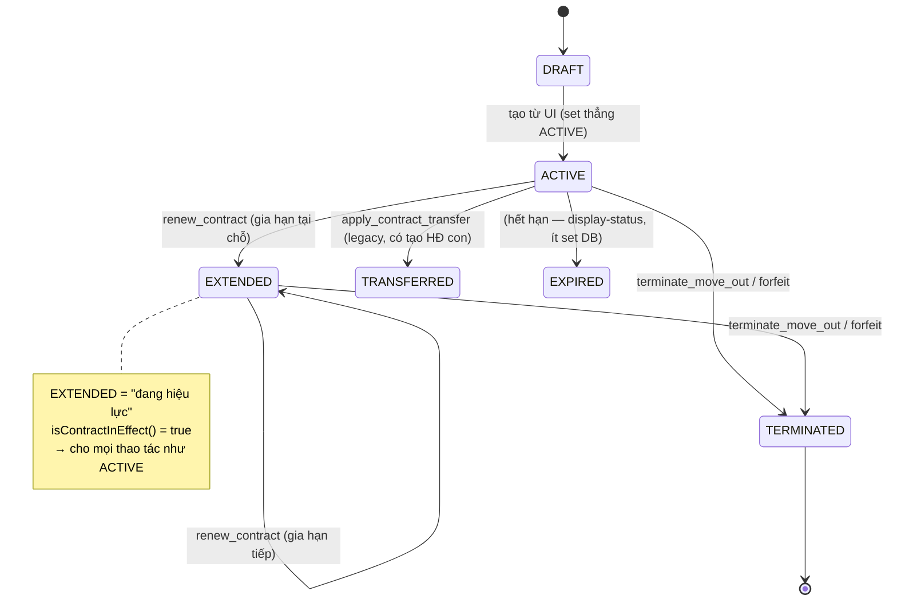
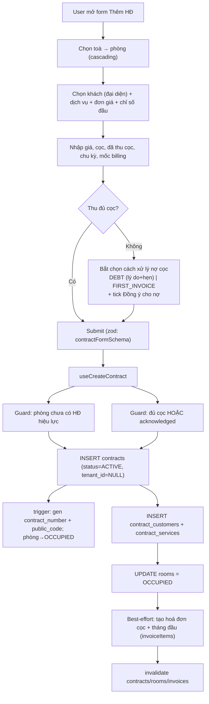
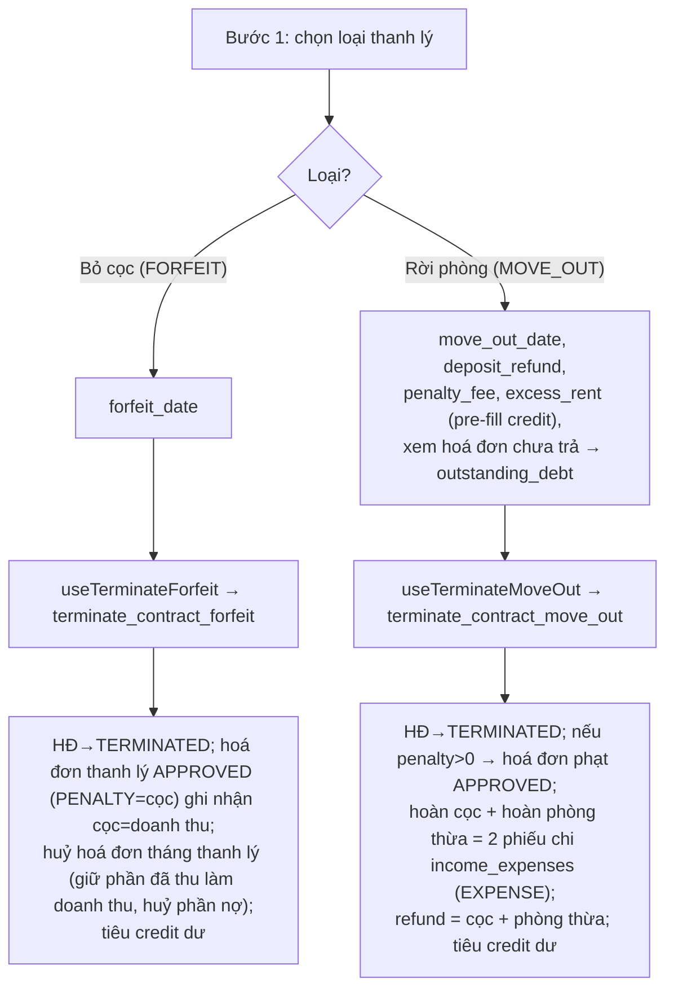

# Hợp đồng (Contracts) — gia hạn · chuyển nhượng · thanh lý

> Trụ cột vận hành của hệ thống. Hợp đồng nối **phòng (room)** ↔ **khách (customer)** ↔ **dịch vụ (service)** ↔ **tiền cọc / hoá đơn / công nợ**. Mọi nghiệp vụ tính tiền (ghi chỉ số, sinh hoá đơn, thu chi, công nợ) đều bám vào một hợp đồng đang **hiệu lực**.

---

## 1. Tổng quan & vai trò nghiệp vụ

Domain Hợp đồng quản lý toàn bộ **vòng đời** của một hợp đồng thuê:

```
Lead → (cọc giữ phòng) → KÝ HĐ (DRAFT/ACTIVE) → chốt chỉ số đầu → sinh hoá đơn cọc + tháng đầu
     → vận hành (ghi chỉ số → hoá đơn định kỳ → thu chi → công nợ)
     → biến động: GIA HẠN (EXTENDED) / CHUYỂN PHÒNG / NHƯỢNG HĐ / ĐĂNG KÝ CHUYỂN ĐI
     → KẾT THÚC: THANH LÝ (move-out: hoàn cọc/cấn trừ) hoặc BỎ CỌC (forfeit) → TERMINATED
```

Vai trò trung tâm:

- **Một phòng chỉ có một HĐ đang hiệu lực tại một thời điểm** — bất biến được bảo vệ ở nhiều tầng (hook tạo HĐ, RPC chuyển phòng).
- HĐ là **đối tượng phân quyền theo toà nhà**: mọi RPC vòng đời đều kiểm tra `can_do_on_building('contracts','edit', building_id)` (qua phòng) — xem [migration authz](../../supabase/migrations/20260601000100_sec_contract_rpc_authz_and_anon_revoke.sql).
- HĐ sinh **mã công khai ngắn** (`public_code`, 6 ký tự) cho link QR `/c/:code` để khách tự tra hoá đơn mới nhất mà không cần đăng nhập.
- enum trạng thái **`contract_status`**: `DRAFT / ACTIVE / EXTENDED / TRANSFERRED / TERMINATED / EXPIRED`. **EXTENDED phải được đối xử như ACTIVE** ở mọi check vận hành — dùng helper `isContractInEffect()` trong [src/types/contract.ts](../../src/types/contract.ts).

Hai trang chính:

- [ContractsPage.tsx](../../src/pages/contracts/ContractsPage.tsx) — danh sách + lọc + thao tác hàng loạt qua dialog.
- [ContractDetailPage.tsx](../../src/pages/contracts/ContractDetailPage.tsx) — chi tiết 5 tab (chung / dịch vụ / hoá đơn / thanh toán / lịch sử) + nút thao tác vòng đời.

---

## 2. Cấu trúc dữ liệu

### 2.1. `contracts` — bảng cốt lõi (34 cột)

Mục đích: lưu một hợp đồng thuê. Một dòng = một kỳ hiệu lực của một phòng cho một (nhóm) khách.

Các cột chủ chốt:

| Nhóm | Cột | Ý nghĩa nghiệp vụ |
|---|---|---|
| Định danh | `contract_number` | Mã HĐ dạng `HD-2025-00001`, **tự sinh** bởi trigger `generate_contract_number` (theo `settings.contract_number_format`, mặc định prefix `HD`). |
| | `public_code` (NOT NULL, UNIQUE) | Mã ngắn 6 ký tự base-57, tự sinh, dùng cho link QR `/c/<code>`. |
| | `parent_contract_id` → `contracts.id` | Tự tham chiếu: HĐ con (gia hạn tạo-mới / chuyển phòng / nhượng) trỏ về HĐ gốc. |
| Quan hệ | `room_id` → `rooms.id` | Phòng thuê. Nullable (HĐ chưa gán phòng). |
| | `tenant_id` → `tenants.id` | **Legacy**. Hiện để `NULL` khi tạo mới; khách thật nằm ở `contract_customers`. FK còn nhưng không dùng. |
| Trạng thái | `status` (`contract_status`, default `DRAFT`) | Vòng đời. Tạo từ UI luôn set thẳng `ACTIVE`. |
| Thời gian | `signed_date`, `start_date`, `end_date` (NOT NULL) | Ngày ký / bắt đầu / kết thúc. `end_date > start_date` (zod + DB). |
| | `actual_end_date` | Ngày kết thúc thực (set khi thanh lý/bỏ cọc). |
| | `expected_move_out_date` | Khách đã **đăng ký chuyển đi** (chưa thanh lý) — bật alert + đổi display status `MOVING_OUT`. |
| | `start_billing_date`, `end_billing_date` | Mốc tính hoá đơn (khác `start/end_date` nếu lệch chu kỳ). |
| Tiền thuê | `rent_price` (NOT NULL) | Giá thuê/tháng. |
| | `payment_cycle` (`payment_cycle`, default `MONTHLY`) | Chu kỳ: `MONTHLY/QUARTERLY/SEMI_ANNUAL/ANNUAL`. |
| | `discounts` (jsonb) | Cấu hình giảm trừ định kỳ `{months, amount_per_month}`. |
| Cọc | `total_deposit` (NOT NULL), `deposit_paid`, `deposit_remaining` | Tổng cọc / đã thu / còn lại. **`deposit_paid` được recompute từ phiếu IE `is_deposit`** (xem domain Thu chi) qua `recompute_contract_deposit_paid`. |
| | `deposit_debt_acknowledged`, `deposit_debt_mode`, `deposit_debt_reason`, `deposit_topup_due_date` | Xử lý **ký thiếu cọc**: mode `DEBT` (cho nợ, kèm lý do + hẹn ngày) hoặc `FIRST_INVOICE` (thu đủ trong hoá đơn đầu). Chặn ký nếu thiếu mà chưa "đồng ý cho nợ". |
| Chỉ số đầu | `initial_electricity_reading`, `initial_water_reading` | Chỉ số điện/nước lúc nhận phòng (mốc cho kỳ chỉ số đầu tiên). |
| Mẫu / file | `contract_template_id`, `invoice_template_id` → `document_templates.id` | Mẫu in HĐ / hoá đơn. |
| | `contract_file_url` | URL file HĐ đã scan. |
| Audit | `user_id` (owner), `created_at`, `updated_at`, `deleted_at` (soft delete) | Đa-tenant theo `user_id`; xoá là soft-delete. |

**Được tham chiếu bởi** (FK đi vào — minh hoạ vị trí "hub" của bảng): `asset_handovers`, `contract_customers`, `contract_extensions` (cả `contract_id` lẫn `new_contract_id`), `contract_services`, `contract_tenants`, `contract_terminations`, `contract_transfers`, `deposits`, `excess_amounts`, `income_expenses`, `invoices`, `issues`, `leads`, `meter_readings`, `notifications`, `vehicles`.

### 2.2. `contract_customers` — junction HĐ ↔ khách (nguồn sự thật về khách)

Mục đích: nối nhiều khách vào một HĐ, đánh dấu **người đại diện**.

- `contract_id` → `contracts.id`, `customer_id` → `customers.id`.
- `is_representative` (default false): chỉ **một** đại diện/HĐ — bảo đảm bởi trigger `check_contract_representative`.
- `notes`: ghi chú riêng cho từng khách trong HĐ.

> Đây là quan hệ khách "chuẩn" hiện tại, thay cho `contracts.tenant_id`. UI đọc đại diện từ đây để hiển thị tên/SĐT/CCCD.

### 2.3. `contract_tenants` — junction HĐ ↔ tenant (legacy)

Cùng vai trò junction nhưng trỏ sang bảng `tenants` (mô hình cũ). Còn cột `move_in_date`, `is_representative`. Chỉ luồng **import hàng loạt cũ** (`useBulkCreateContracts`) còn ghi vào đây; luồng tạo HĐ mới dùng `contract_customers`.

### 2.4. `contract_services` — dịch vụ đăng ký trong HĐ

Mục đích: chốt **đơn giá riêng theo HĐ** và **chỉ số đầu** cho từng dịch vụ.

- `service_id` → `services.id`, `unit_price` (NOT NULL), `initial_reading` (chỉ số ban đầu cho dịch vụ công-tơ).
- Khi gia hạn loại "cập nhật tại chỗ" có đổi dịch vụ, hoặc khi sửa HĐ, bảng này bị **xoá-rồi-chèn-lại** (`useSyncContractServices`).

### 2.5. `contract_extensions` — lịch sử gia hạn (22 cột)

Mục đích: audit mỗi lần gia hạn.

- `extension_type` (text): `UPDATE_EXISTING` (gia hạn tại chỗ — RPC `renew_contract` ghi loại này), `CREATE_NEW`/`RENEWAL` (tạo HĐ mới link parent — đường legacy).
- `old_end_date`, `new_end_date`, `extension_months`, `new_rent_price`/`rent_price_changed`, `new_deposit`/`additional_deposit_required`/`deposit_changed`, `services_changed`/`new_services` (jsonb).
- `new_contract_id` → `contracts.id` (nếu tạo HĐ mới).
- `status` (text, default `DRAFT`): vòng `DRAFT → APPROVED → COMPLETED` (đường legacy) hoặc ghi thẳng `COMPLETED` (RPC mới).

### 2.6. `contract_transfers` — lịch sử chuyển phòng / nhượng HĐ (30 cột)

Mục đích: audit chuyển phòng (`ROOM_CHANGE`), đổi khách-đại-diện (`TENANT_CHANGE`), hoặc cả hai (`BOTH_CHANGE`).

- Phòng: `old_room_id`/`new_room_id` → `rooms.id`. Khách: `old_tenant_id`/`new_tenant_id` → `tenants.id`.
- Tiền: `transfer_fee`, `new_rent_price`, `new_deposit`, `deposit_transfer_type`, `old_tenant_deposit_refund`, `new_tenant_deposit_paid`, `old_tenant_outstanding` (auto từ trigger), `old_tenant_settlement_amount/date`.
- `status` (text) — đường legacy DRAFT→APPROVED; RPC mới ghi thẳng `COMPLETED`.

### 2.7. `contract_terminations` — biên bản thanh lý (32 cột)

Mục đích: lưu tính toán tài chính khi thanh lý.

- `termination_type` (text): `NORMAL` (move-out), `FORFEIT` (bỏ cọc), `EARLY_TENANT/EARLY_OWNER/BREACH` (legacy).
- `actual_move_out_date` (NOT NULL), `termination_date`, `notice_date`.
- Tính tiền: `outstanding_debt`, `prorated_days/rent/services`, các loại phí (`early_termination_fee`, `notice_violation_fee`, `damage_fee` + `damage_description` + `damage_images` jsonb, `cleaning_fee`, `other_fees` + mô tả), `total_deposit` (NOT NULL), `total_deductions`, `refund_amount`, `refund_method` (kiểu enum `payment_method` — TM/TK/TT), `refund_date`, `refund_receipt_url`.
- `status` (text): `DRAFT → PENDING_APPROVAL → APPROVED → COMPLETED` (legacy) hoặc `COMPLETED` (RPC mới).

> Nhiều cột tài chính được **trigger tự tính** lúc INSERT/UPDATE (xem mục 4) — frontend không cần tính tay.

### 2.8. `asset_handovers` — biên bản bàn giao tài sản (10 cột)

Mục đích: biên bản nhận/trả phòng kèm danh mục tài sản.

- `type` (text, CHECK `CHECK_IN`/`CHECK_OUT`), `handover_date`, `items` (jsonb NOT NULL — `[{asset_id, quantity, condition, notes}]`).
- `landlord_signature`, `tenant_signature` (URL ảnh ký).
- Liên kết domain **Tài sản**: được dùng qua `useAssets` ([src/hooks/useAssets.ts](../../src/hooks/useAssets.ts)), không có UI riêng trong trang Hợp đồng.

### Enum liên quan

- **`contract_status`**: `DRAFT, ACTIVE, EXTENDED, TRANSFERRED, TERMINATED, EXPIRED`.
- **`payment_cycle`**: `MONTHLY, QUARTERLY, SEMI_ANNUAL, ANNUAL`.
- Cột `contract_terminations.refund_method` dùng enum **`payment_method`** (`TM/TK/TT`) — không có enum `refund_method` riêng.

---

## 3. Sơ đồ quan hệ dữ liệu


Sơ đồ trạng thái HĐ:



---

## 4. Quy tắc nghiệp vụ & tự động hoá

### 4.1. Trigger trên `contracts`

| Trigger / hàm | Thời điểm | Tác động |
|---|---|---|
| `generate_contract_number` ([008](../../supabase/migrations/008_triggers_functions.sql)) | BEFORE INSERT | Nếu `contract_number` NULL → sinh `<prefix>-<năm>-<đếm 5 số>` theo `settings`. |
| `set_contract_public_code` ([20260530000003](../../supabase/migrations/20260530000003_contract_public_short_code.sql)) | BEFORE INSERT | Sinh `public_code` 6 ký tự base-57 (bỏ ký tự dễ nhầm), retry khi trùng, >10 lần → 8 ký tự. UNIQUE index bảo đảm không trùng. |
| `update_room_status_on_contract_change` ([20260601000300](../../supabase/migrations/20260601000300_drop_bed_remnants_db.sql)) | AFTER INSERT/UPDATE | HĐ INSERT `ACTIVE` → phòng `OCCUPIED`. UPDATE rời `ACTIVE` → phòng `AVAILABLE` **nếu không còn HĐ ACTIVE khác**. ⚠️ Nhánh free-phòng chỉ kiểm `status = 'ACTIVE'` (không gồm EXTENDED) — RPC thanh lý/chuyển phòng tự xử lý phòng nên không phụ thuộc hành vi này. |
| `update_asset_status_on_contract_change` ([008](../../supabase/migrations/008_triggers_functions.sql) → [no-op](../../supabase/migrations/20260528000008_fix_asset_trigger_no_op.sql)) | AFTER INSERT/UPDATE OF status | **Hiện no-op toàn phần** (chỉ `RETURN NEW`) — bảng `assets` không có cột status nên trigger không làm gì; giữ trigger để tránh DDL churn trên `contracts`. Việc đồng bộ `rooms.status` **do `update_room_status_on_contract_change` đảm nhiệm**, không phải hàm này. |

### 4.2. Trigger trên các bảng con

| Trigger / hàm | Bảng | Tác động |
|---|---|---|
| `check_contract_representative` ([20250710000001](../../supabase/migrations/20250710000001_lease_contract_management.sql)) | `contract_customers` | Khi set `is_representative=true` → hạ cờ đại diện của mọi dòng khác cùng HĐ. **Bất biến: tối đa 1 đại diện/HĐ.** |
| `auto_calculate_termination_financials` ([013](../../supabase/migrations/013_contract_terminations.sql)) | `contract_terminations` | BEFORE INSERT/UPDATE: tự tính `outstanding_debt` (Σ hoá đơn chưa PAID/CANCELLED), `prorated_rent`/`prorated_days` (theo ngày trong tháng rời), `prorated_services` (FIXED/PER_ROOM theo tỉ lệ ngày), set `total_deposit` từ HĐ. Validate `actual_move_out_date >= start_date`. |
| `update_contract_on_termination_approved` ([013](../../supabase/migrations/013_contract_terminations.sql)) | `contract_terminations` | BEFORE UPDATE OF status: khi `status` chuyển → `APPROVED` ⇒ HĐ thành `TERMINATED` + set `actual_end_date` + ghi `approved_by/at`. (Đường legacy duyệt thủ công.) |
| `auto_calculate_transfer_outstanding` ([014](../../supabase/migrations/014_contract_transfers.sql)) | `contract_transfers` | Tính `old_tenant_outstanding` (Σ hoá đơn chưa thanh toán) cho `TENANT_CHANGE`/`BOTH_CHANGE`. |
| `apply_contract_transfer` ([014](../../supabase/migrations/014_contract_transfers.sql)) | `contract_transfers` | Khi `DRAFT→APPROVED`: cập nhật HĐ (đổi tenant/phòng/giá/cọc/ngày), set `status='TRANSFERRED'`, `parent_contract_id=id`, free phòng cũ / chiếm phòng mới. (Đường legacy.) |
| `apply_contract_extension_update` ([015](../../supabase/migrations/015_contract_extensions.sql)) | `contract_extensions` | Khi `DRAFT→APPROVED` + type `UPDATE_EXISTING`: gia hạn HĐ (`end_date`, giá, cọc), set `EXTENDED`, thay dịch vụ nếu `services_changed`. (Đường legacy.) |

### 4.3. RPC vòng đời (đường "thao tác tức thì" mà UI dùng)

**Đúng 4 RPC được bọc wrapper kiểm quyền** (migration [20260601000100](../../supabase/migrations/20260601000100_sec_contract_rpc_authz_and_anon_revoke.sql)): `renew_contract`, `transfer_contract`, `terminate_contract_forfeit`, `terminate_contract_move_out`. Với mỗi hàm: hàm public `<tên>` kiểm `auth.uid()` + `is_super_admin()` OR `can_do_on_building('contracts','edit', building_of_room)`, rồi gọi `<tên>_impl` chứa logic gốc. `anon` bị revoke; chỉ `authenticated` được EXECUTE. (`transfer_room` **không** thuộc nhóm này — xem ghi chú riêng bên dưới.)

| RPC (impl) | Hook gọi | Việc làm |
|---|---|---|
| `renew_contract_impl` ([action_rpcs](../../supabase/migrations/20260510000012_contract_action_rpcs.sql)) | `useRenewContract` | Chỉ gia hạn HĐ `ACTIVE/EXTENDED`. Validate `new_end_date > end_date`. UPDATE `end_date`/giá/cọc + set `EXTENDED` + nối ghi chú. Ghi audit `contract_extensions` (type `UPDATE_EXISTING`, status `COMPLETED`). |
| `transfer_room` — **đã bị DROP, chưa tạo lại** ([drop_beds](../../supabase/migrations/20260528000005_drop_beds.sql)) | `useTransferRoom` | ⚠️ RPC này đã bị `DROP FUNCTION` ở [drop_beds (28/05)](../../supabase/migrations/20260528000005_drop_beds.sql) và **chưa được tạo lại** (không có trong schema). FE [`useTransferRoom`](../../src/hooks/useContractOperations.ts) vẫn gọi `rpc('transfer_room', …)` nên nút "Chuyển phòng" hiện sẽ **lỗi runtime** ("function not found"). Logic dự kiến (chưa tồn tại): đổi `room_id` của chính HĐ, chặn nếu phòng đích bận, tự free phòng cũ / chiếm phòng mới. |
| `transfer_contract_impl` ([action_rpcs](../../supabase/migrations/20260510000012_contract_action_rpcs.sql)) | `useTransferContract` | **Đổi khách đại diện**: hạ cờ mọi khách, promote/insert khách mới làm đại diện; cập nhật giá/cọc. **Không** đổi status (HĐ vẫn ACTIVE/EXTENDED). Audit `contract_transfers` (`TENANT_CHANGE`). |
| `terminate_contract_forfeit_impl` ([forfeit_keep_partial_paid](../../supabase/migrations/20260530000001_forfeit_keep_partial_paid_revenue.sql)) | `useTerminateForfeit` | **Khách bỏ cọc**: tạo hoá đơn thanh lý status `APPROVED` (không phải PAID), `subtotal = total_amount = total_deposit`, **không** prepaid, 1 line `PENALTY` = `total_deposit` (ghi nhận cọc thành doanh thu, không có tiền mới đổi tay). Ngoài ra **huỷ các hoá đơn của tháng thanh lý**: hoá đơn đã thu một phần/đủ → `CANCELLED` nhưng **giữ payment**, hạ `total_amount = paid_amount` (phần đã thu thành doanh thu, huỷ phần nợ); hoá đơn chưa thu → `CANCELLED`, `total_amount = 0`. Set HĐ `TERMINATED` + `actual_end_date`. Audit `contract_terminations` (`FORFEIT`). Hook còn **tiêu hết credit dư** của HĐ. |
| `terminate_contract_move_out_impl` ([move_out_drop_bed_id](../../supabase/migrations/20260601000200_termination_move_out_drop_bed_id.sql)) | `useTerminateMoveOut` | **Khách rời phòng**: (1) chỉ tạo hoá đơn **phạt** khi `penalty > 0` — status `APPROVED` cố định, `subtotal = total_amount = penalty`, **không** prepaid, line `PENALTY`, `previous_debt = outstanding_debt`; (2) hoàn cọc và tiền phòng thừa là **2 phiếu chi `income_expenses` (EXPENSE)** riêng: hoàn cọc `is_deposit=TRUE` (loại khỏi KQKD), hoàn phòng thừa `is_deposit=FALSE` (giảm doanh thu). Set HĐ `TERMINATED`. Audit `contract_terminations` (`NORMAL`, `refund_amount = deposit + excess` — **không** trừ debt/penalty). Hook tiêu credit dư. |

> **Lưu ý kiến trúc**: tồn tại **hai thế hệ** RPC trùng tên — bản legacy "DRAFT→APPROVED" (013/014/015) và bản "tức thì" (action_rpcs). UI hiện tại (các dialog ở mục 5) dùng bản **tức thì**. Các RPC legacy không dùng ở FE (`create_new_contract_extension`, `create_simple_extension`, `create_tenant_transfer`) đã bị **revoke EXECUTE** cho client.

### 4.4. Hàm hỗ trợ & view

- `estimate_termination_costs(contract, move_out_date, ...)` — ước tính chi phí thanh lý trước khi tạo (FE hiện tính phía client trong dialog).
- `recompute_contract_deposit_paid(contract_id)` / trigger `trg_ie_recompute_contract_deposit` — đồng bộ `deposit_paid` từ phiếu IE `is_deposit` (xem domain Thu chi & Cọc).
- `get_contract_extension_count(contract_id)` — đếm số lần gia hạn `COMPLETED`.
- `get_public_latest_invoice_by_code(code)` ([20260530000003](../../supabase/migrations/20260530000003_contract_public_short_code.sql)) — RPC **public** (anon): resolve `public_code` → contract → hoá đơn mới nhất; trả NULL nếu mã sai / HĐ thanh lý / đã xoá. Đây là cổng duy nhất cho link QR.
- View `contract_extension_history` — tổng hợp gia hạn kèm tên tenant.
- View `v_termination_calculation` ([029](../../supabase/migrations/029_missing_features.sql)) — tính sẵn số liệu thanh lý.

### 4.5. Bất biến quan trọng (invariant)

1. **Một phòng — một HĐ hiệu lực**: kiểm ở `useCreateContract` (chặn tạo nếu phòng có HĐ `ACTIVE/EXTENDED`). Lưu ý: lớp chặn ở `transfer_room` hiện **không còn hiệu lực** vì RPC `transfer_room` đã bị DROP và chưa tạo lại (xem §4.3).
2. **EXTENDED = đang hiệu lực**: mọi gate thao tác dùng `isContractInEffect()` / `.in('status',['ACTIVE','EXTENDED'])`.
3. **Một đại diện/HĐ**: trigger `check_contract_representative`.
4. **Không xoá HĐ đã có hoá đơn / biên bản thanh lý**: `useDeleteContract` chặn; nếu được phép → soft-delete (`deleted_at`).
5. **Ký phải đủ cọc** trừ khi admin chủ động "đồng ý cho nợ cọc" kèm lý do — kiểm ở cả form lẫn hook (`PREVIOUS_DEBT_ROUND_THRESHOLD`).

---

## 5. Quy trình theo từng trang (page)

### 5.1. `/contracts` — [ContractsPage.tsx](../../src/pages/contracts/ContractsPage.tsx)

**Mục đích**: danh sách HĐ + lọc + thao tác vòng đời qua dialog.

**Dữ liệu hiển thị**: `useContracts()` ([useContracts.ts](../../src/hooks/useContracts.ts)) — tải toàn bộ HĐ chưa xoá kèm relations (phòng→toà→khu vực, `contract_customers`+customer, `contract_services`+service). Phụ trợ: `useBuildings`, `useRooms`, `useProfile`, `useMyBuildingScope`.

Đặc điểm:
- **Lọc & phân trang client-side**: lọc theo vòng đời (Đang ở / Thanh lý / Tất cả), stat card (Sắp hết hạn / Quá hạn / Đã thanh lý), tìm kiếm (mã HĐ / tên khách đại diện / SĐT / tên phòng), khu vực → toà → phòng (cascading), tháng (overlap với kỳ HĐ). Sắp xếp gom theo toà rồi tên phòng.
- **Mặc định khu vực theo user**: nếu `full_name` là `joey`/`nathan` → tự chọn khu vực tương ứng.
- Stats tính bằng `getContractDisplayStatus` (display status dẫn xuất, gồm `EXPIRING` ≤30 ngày).
- Nút Thêm/Nhập chỉ hiện khi `hasAnyScope`.

**Thao tác (mỗi dòng mở một dialog)** — gating bởi `getActionButtonStates` trong [ContractListTable.tsx](../../src/components/contracts/ContractListTable.tsx):

| Thao tác | Điều kiện bật | Dialog | Hook → RPC |
|---|---|---|---|
| Sửa | `status ≠ TERMINATED` | `ContractFormDialog` | `useUpdateContract` + sync customers/services |
| Gia hạn | inEffect / EXPIRED / EXPIRING | `RenewDialog` | `useRenewContract` → `renew_contract` |
| Chuyển phòng | inEffect | `TransferRoomDialog` | `useTransferRoom` → `transfer_room` ⚠️ RPC **đã bị xoá, chưa tạo lại** → thao tác này hiện lỗi runtime (xem §4.3) |
| Đăng ký chuyển đi | inEffect | `MoveOutDialog` | `useRegisterMoveOut` (UPDATE `expected_move_out_date`) |
| Nhượng HĐ | inEffect | `TransferContractDialog` | `useTransferContract` → `transfer_contract` |
| Thanh lý | inEffect / EXPIRED / EXPIRING | `TerminateDialog` | `useTerminateForfeit` / `useTerminateMoveOut` |
| Xoá | `status = DRAFT` | `DeleteContractDialog` | `useDeleteContract` (soft-delete) |
| QR | `status ≠ TERMINATED/DRAFT` | `ContractQRDialog` | dựng link `/c/<public_code>` |

#### Luồng "Tạo hợp đồng" (qua `ContractFormDialog`)



**Validate (zod `contractFormSchema`)**: `room_id` là uuid, các ngày bắt buộc, `end_date > start_date`, giá/cọc ≥ 0, `deposit_debt_mode ∈ {DEBT, FIRST_INVOICE}`.

**Edge case**:
- Không có khách đại diện → hook ném lỗi tiếng Việt rõ ràng (tránh lỗi DB "null tenant_id").
- Phòng đã có HĐ hiệu lực → chặn, yêu cầu thanh lý HĐ cũ trước.
- Thiếu cọc mà chưa "đồng ý cho nợ" → chặn (defense-in-depth ở cả hook).
- Tạo hoá đơn đầu **best-effort**: lỗi không rollback HĐ, chỉ toast nhắc tạo hoá đơn tay.

#### Luồng "Thanh lý" (`TerminateDialog` — 2 bước)

Bước 1 chọn loại; bước 2 nhập số liệu + xác nhận:



**Validate**: `terminateForfeitFormSchema` (chỉ ngày), `terminateMoveOutFormSchema` (ngày + `deposit_refund≥0`, `penalty_fee`/`excess_rent` optional ≥0).

**Edge case**: HĐ đã `TERMINATED/EXPIRED` → RPC ném lỗi "Hợp đồng đã thanh lý/hết hạn". Quyền: RPC kiểm `can_do_on_building` trước khi chạy logic.

### 5.2. `/contracts/:id` — [ContractDetailPage.tsx](../../src/pages/contracts/ContractDetailPage.tsx)

**Mục đích**: xem chi tiết + thực hiện thao tác vòng đời.

**Dữ liệu**: `useContract(id)` (HĐ + relations); `useInvoicesLegacy({contract_id})` (hoá đơn + payments); query trực tiếp `contract_services`, `income_expenses` (phiếu thu cọc đã link để minh bạch `deposit_paid`), `vehicles` (phương tiện theo khách), và lịch sử (`contract_extensions` + `contract_transfers` + `contract_terminations` gộp & sort).

**5 tab**:
1. **Thông tin chung** — thẻ HĐ (số, ngày, giá, chu kỳ, thanh tiến độ), thẻ khách (đại diện đứng đầu, phương tiện, ghi chú), thẻ phòng (vị trí, chỉ số đầu), thẻ **Tiền cọc** (tổng/đã thu/còn lại + alert theo `deposit_debt_mode` + **danh sách phiếu thu cọc** đã ghi nhận), thẻ tóm tắt hoá đơn (công nợ), thẻ thời gian.
2. **Dịch vụ** — bảng `contract_services`.
3. **Hoá đơn** — bảng hoá đơn (kỳ, hạn, tổng/đã thu/còn lại, status).
4. **Thanh toán** — gom payments từ mọi hoá đơn.
5. **Lịch sử** — timeline gia hạn / chuyển / thanh lý kèm badge status; nếu thanh lý còn `DRAFT/PENDING_APPROVAL` → nút "Đi đến duyệt thanh lý".

**Thao tác (header)**: Cập nhật (nếu ≠ TERMINATED), In HĐ, QR (nếu ≠ TERMINATED/DRAFT), và khi `isContractInEffect`: Gia hạn / Chuyển phòng / Nhượng HĐ / Đăng ký chuyển đi / Thanh lý. `DRAFT` → nút Xoá. ⚠️ Nút **Chuyển phòng** gọi `useTransferRoom` → RPC `transfer_room` **đã bị xoá, chưa tạo lại** nên hiện lỗi runtime (xem §4.3).

**Alert**: sắp hết hạn ≤30 ngày (nếu đang hiệu lực); đã đăng ký chuyển đi (`expected_move_out_date`).

**Edge case**: thiếu/sai `id` → màn lỗi + nút quay lại; `daysRemaining<0` hiển thị "Quá hạn N ngày".

---

## 6. Liên kết sang domain khác (vào / ra)

| Hướng | Liên kết | Lý do |
|---|---|---|
| → **Phòng / Toà nhà** | `contracts.room_id → rooms`; trigger đồng bộ `rooms.status` | HĐ chiếm/giải phóng phòng; phân quyền theo `building_id` của phòng. |
| → **Khách hàng** | `contract_customers.customer_id → customers` | Khách đại diện + đồng ký; ContractDetail link `/customers/:id`. |
| → **Dịch vụ** | `contract_services.service_id → services` | Đơn giá riêng + chỉ số đầu cho từng dịch vụ. |
| → **Hoá đơn** | `invoices.contract_id`; tạo hoá đơn cọc+tháng đầu, hoá đơn thanh lý | Vòng đời tiền: HĐ là gốc của mọi hoá đơn. ContractDetail có nút "Tạo hoá đơn" → `/invoices`. |
| → **Chỉ số (meter)** | `meter_readings.contract_id`; `initial_*_reading` | Chốt chỉ số đầu khi nhận phòng → cơ sở tính hoá đơn dịch vụ công-tơ. |
| → **Thu chi (IE) & Cọc** | `income_expenses.contract_id` (phiếu `is_deposit`), `deposits.contract_id`; `recompute_contract_deposit_paid` | `deposit_paid`/`deposit_remaining` là **hệ quả** của phiếu cọc; thanh lý sinh hoá đơn + (qua hook) tiêu credit `excess_amounts`. |
| → **Tài sản** | `asset_handovers.contract_id` | Biên bản bàn giao tài sản khi nhận/trả phòng. |
| ← **Lead** | `leads.contract_id` | Lead chuyển đổi thành HĐ (đính kèm cọc giữ phòng). |
| ← **Sự cố / Thông báo / Phương tiện** | `issues.contract_id`, `notifications.contract_id`, `vehicles` (qua khách) | Tham chiếu ngữ cảnh HĐ. |
| ← **Public QR** | route `/c/:code` → `get_public_latest_invoice_by_code` | Khách quét QR xem hoá đơn mới nhất không cần đăng nhập. |
| ← **Báo cáo / Lợi nhuận** | tổng hợp từ hoá đơn + thu chi gắn HĐ | HĐ là chiều phân tích (occupancy, doanh thu phòng) cho dashboard & chia lợi nhuận cổ đông. |
