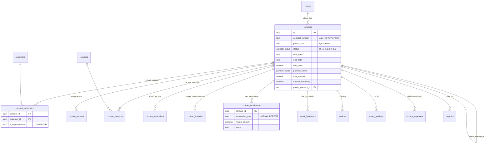
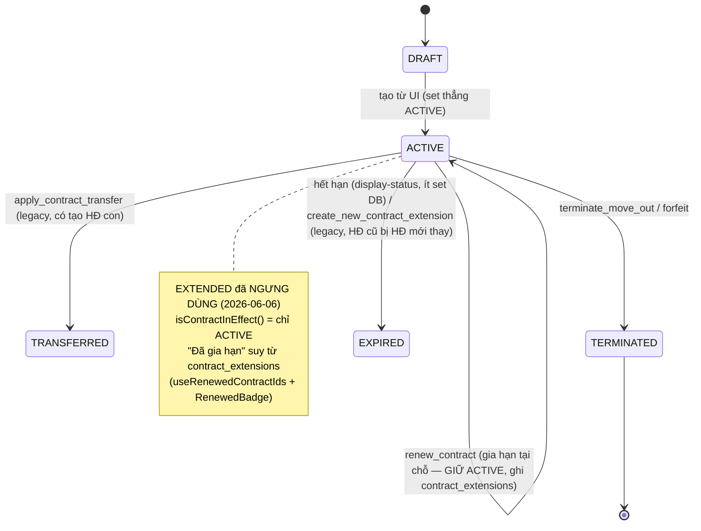
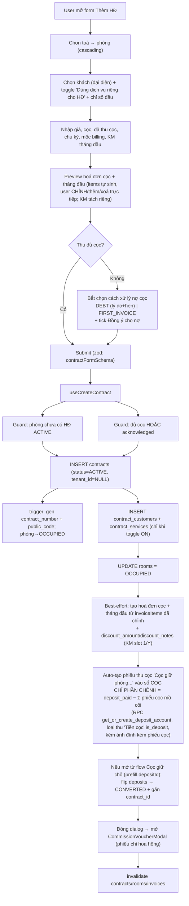
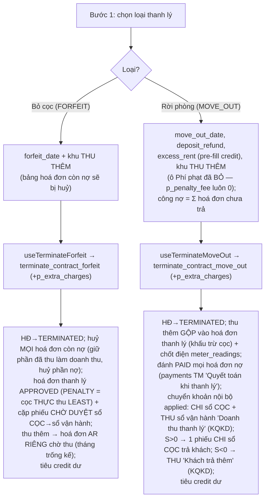

# Hợp đồng (Contracts) — gia hạn · chuyển nhượng · thanh lý

> Trụ cột vận hành của hệ thống. Hợp đồng nối **phòng (room)** ↔ **khách (customer)** ↔ **dịch vụ (service)** ↔ **tiền cọc / hoá đơn / công nợ**. Mọi nghiệp vụ tính tiền (ghi chỉ số, sinh hoá đơn, thu chi, công nợ) đều bám vào một hợp đồng đang **hiệu lực**.

---

## 1. Tổng quan & vai trò nghiệp vụ

Domain Hợp đồng quản lý toàn bộ **vòng đời** của một hợp đồng thuê:

```
Lead → (cọc giữ phòng) → KÝ HĐ (DRAFT/ACTIVE) → chốt chỉ số đầu → sinh hoá đơn cọc + tháng đầu
     → vận hành (ghi chỉ số → hoá đơn định kỳ → thu chi → công nợ)
     → biến động: GIA HẠN (giữ ACTIVE, ghi contract_extensions) / CHUYỂN PHÒNG / NHƯỢNG HĐ / ĐĂNG KÝ CHUYỂN ĐI
     → KẾT THÚC: THANH LÝ (move-out: hoàn cọc/cấn trừ) hoặc BỎ CỌC (forfeit) → TERMINATED
```

Vai trò trung tâm:

- **Một phòng chỉ có một HĐ đang hiệu lực tại một thời điểm** — bất biến được bảo vệ ở nhiều tầng (hook tạo HĐ, RPC chuyển phòng).
- HĐ là **đối tượng phân quyền theo toà nhà**: mọi RPC vòng đời đều kiểm tra `can_do_on_building('contracts','edit', building_id)` (qua phòng) — xem [migration authz](../../supabase/migrations/20260601000100_sec_contract_rpc_authz_and_anon_revoke.sql). Ngoài wrapper RPC, bản thân bảng `contracts` + 6 bảng con cũng có **tầng RLS RBAC theo toà** — xem §4.6.
- HĐ sinh **mã công khai ngắn** (`public_code`, 6 ký tự) cho link QR `/c/:code` để khách tự tra hoá đơn mới nhất mà không cần đăng nhập.
- enum trạng thái **`contract_status`**: `DRAFT / ACTIVE / EXTENDED / TRANSFERRED / TERMINATED / EXPIRED`. **`EXTENDED` đã NGƯNG DÙNG từ 2026-06-06** ([migration decouple](../../supabase/migrations/20260606140000_contract_extended_decouple.sql)): HĐ gia hạn **giữ nguyên `ACTIVE`**, mọi HĐ `EXTENDED` cũ đã được di trú về `ACTIVE` (giá trị enum vẫn tồn tại nhưng không còn được ghi). "Đang hiệu lực" = **chỉ `ACTIVE`** — helper `isContractInEffect()` / `ACTIVE_CONTRACT_STATUSES = ['ACTIVE']` trong [src/types/contract.ts](../../src/types/contract.ts). Dấu **"đã gia hạn"** là dấu hiệu RIÊNG suy từ bảng `contract_extensions` (status `APPROVED/COMPLETED`) qua hook [useRenewedContracts.ts](../../src/hooks/useRenewedContracts.ts) (`useRenewedContractIds`/`useIsContractRenewed` — 1 query trả `Set` tra O(1)) + chip xanh dương [RenewedBadge](../../src/components/contracts/RenewedBadge.tsx). Lưu ý: `RenewedBadge` hiện **chỉ** hiển thị ở header trang chi tiết — danh sách `/contracts` chưa hiện dấu này.

Hai trang chính:

- [ContractsPage.tsx](../../src/pages/contracts/ContractsPage.tsx) — danh sách + lọc + thao tác hàng loạt qua dialog.
- [ContractDetailPage.tsx](../../src/pages/contracts/ContractDetailPage.tsx) — chi tiết 5 tab (chung / dịch vụ / hoá đơn / thanh toán / lịch sử) + nút thao tác vòng đời.

---

## 2. Cấu trúc dữ liệu

### 2.1. `contracts` — bảng cốt lõi (34 cột)

Mục đích: lưu một hợp đồng thuê. Một dòng = một kỳ hiệu lực của một phòng cho một (nhóm) khách.

Các cột chủ chốt:

| Nhóm | Cột | Ý nghĩa nghiệp vụ |
|---|---|---|
| Định danh | `contract_number` | Mã HĐ dạng `HD-2025-00001`, **tự sinh** bởi trigger `generate_contract_number` (theo `settings.contract_number_format`, mặc định prefix `HD`). |
| | `public_code` (NOT NULL, UNIQUE) | Mã ngắn 6 ký tự base-57, tự sinh, dùng cho link QR `/c/<code>`. |
| | `parent_contract_id` → `contracts.id` | Tự tham chiếu: HĐ con (gia hạn tạo-mới / chuyển phòng / nhượng) trỏ về HĐ gốc. |
| Quan hệ | `room_id` → `rooms.id` | Phòng thuê. Nullable (HĐ chưa gán phòng). |
| | `tenant_id` → `tenants.id` | **Legacy**. `useCreateContract` để `NULL` khi tạo mới; khách thật nằm ở `contract_customers`. FK `contracts_tenant_id_fkey` → `tenants` **vẫn tồn tại** trên live DB ([types.ts](../../src/integrations/supabase/types.ts)). ⚠️ Riêng luồng **Nhập Excel** ([ContractImportExportDialog](../../src/components/contracts/ContractImportExportDialog.tsx)) vẫn set `tenant_id = customers.id` — id bảng `customers` nhét vào cột FK trỏ `tenants`, nên khách **mới tạo** qua import có nguy cơ lỗi FK khi insert HĐ. |
| Trạng thái | `status` (`contract_status`, default `DRAFT`) | Vòng đời. Tạo từ UI luôn set thẳng `ACTIVE`. |
| Thời gian | `signed_date`, `start_date`, `end_date` (NOT NULL) | Ngày ký / bắt đầu / kết thúc. `end_date > start_date` (zod + DB). |
| | `actual_end_date` | Ngày kết thúc thực (set khi thanh lý/bỏ cọc). |
| | `expected_move_out_date` | Khách đã **đăng ký chuyển đi** (chưa thanh lý) — bật alert + đổi display status `MOVING_OUT`. |
| | `start_billing_date`, `end_billing_date` | Mốc tính hoá đơn (khác `start/end_date` nếu lệch chu kỳ). |
| Tiền thuê | `rent_price` (NOT NULL) | Giá thuê/tháng. |
| | `payment_cycle` (`payment_cycle`, default `MONTHLY`) | Chu kỳ: `MONTHLY/QUARTERLY/SEMI_ANNUAL/ANNUAL`. |
| | `discounts` (jsonb) | Cấu hình giảm trừ định kỳ `{months, amount_per_month}`. |
| Cọc | `total_deposit` (NOT NULL), `deposit_paid`, `deposit_remaining` | Tổng cọc / đã thu / còn lại. **`deposit_paid` được recompute từ phiếu IE `is_deposit`** (xem domain Thu chi) qua `recompute_contract_deposit_paid`. |
| | `deposit_debt_acknowledged`, `deposit_debt_mode`, `deposit_debt_reason`, `deposit_topup_due_date` | Xử lý **ký thiếu cọc**: mode `DEBT` (cho nợ, kèm lý do + hẹn ngày) hoặc `FIRST_INVOICE` (thu đủ trong hoá đơn đầu). Chặn ký nếu thiếu mà chưa "đồng ý cho nợ". |
| Chỉ số đầu | `initial_electricity_reading`, `initial_water_reading` | Chỉ số điện/nước lúc nhận phòng (mốc cho kỳ chỉ số đầu tiên). |
| Mẫu / file | `contract_template_id`, `invoice_template_id` → `document_templates.id` | Mẫu in HĐ / hoá đơn. |
| | `contract_file_url` | URL file HĐ đã scan. |
| Audit | `user_id` (owner), `created_at`, `updated_at`, `deleted_at` (soft delete) | Đa-tenant theo `user_id`; xoá là soft-delete. |

**Được tham chiếu bởi** (FK đi vào — minh hoạ vị trí "hub" của bảng): `asset_handovers`, `contract_customers`, `contract_extensions` (cả `contract_id` lẫn `new_contract_id`), `contract_services`, `contract_tenants`, `contract_terminations`, `contract_transfers`, `deposits`, `excess_amounts`, `income_expenses`, `invoices`, `issues`, `leads`, `meter_readings`, `notifications`, `vehicles`.

### 2.2. `contract_customers` — junction HĐ ↔ khách (nguồn sự thật về khách)

Mục đích: nối nhiều khách vào một HĐ, đánh dấu **người đại diện**.

- `contract_id` → `contracts.id`, `customer_id` → `customers.id`.
- `is_representative` (default false): chỉ **một** đại diện/HĐ — bảo đảm bởi trigger `check_contract_representative`.
- `notes`: ghi chú riêng cho từng khách trong HĐ.

> Đây là quan hệ khách "chuẩn" hiện tại, thay cho `contracts.tenant_id`. UI đọc đại diện từ đây để hiển thị tên/SĐT/CCCD.

### 2.3. `contract_tenants` — junction HĐ ↔ tenant (legacy)

Cùng vai trò junction nhưng trỏ sang bảng `tenants` (mô hình cũ). Còn cột `move_in_date`, `is_representative`. **Không còn đường ghi nào từ UI**: hook import hàng loạt cũ `useBulkCreateContracts` chỉ còn là định nghĩa deprecated trong [useContracts.ts](../../src/hooks/useContracts.ts) (không UI nào gọi); luồng import thật ([ContractImportExportDialog](../../src/components/contracts/ContractImportExportDialog.tsx) — nút Nhập của `/contracts`) ghi vào `contract_customers`, và luồng tạo HĐ mới cũng dùng `contract_customers`.

### 2.4. `contract_services` — dịch vụ đăng ký trong HĐ

Mục đích: chốt **đơn giá riêng theo HĐ** và **chỉ số đầu** cho từng dịch vụ.

- `service_id` → `services.id`, `unit_price` (NOT NULL), `initial_reading` (chỉ số ban đầu cho dịch vụ công-tơ).
- Khi gia hạn loại "cập nhật tại chỗ" có đổi dịch vụ, hoặc khi sửa HĐ, bảng này bị **xoá-rồi-chèn-lại** (`useSyncContractServices`).

### 2.5. `contract_extensions` — lịch sử gia hạn (22 cột)

Mục đích: audit mỗi lần gia hạn.

- `extension_type` (text, CHECK **chỉ cho phép** `UPDATE_EXISTING` | `CREATE_NEW` — [015](../../supabase/migrations/015_contract_extensions.sql)): `UPDATE_EXISTING` (gia hạn tại chỗ — RPC `renew_contract` ghi loại này), `CREATE_NEW` (tạo HĐ mới link parent — đường legacy; bản hiện hành set HĐ cũ → `EXPIRED`). (Hook deprecated `useExtendContract` từng ghi `'SIMPLE'` vi phạm CHECK đã bị **xoá hẳn** cùng `ExtendContractDialog` ở df24746 — xem §5.2.)
- `old_end_date`, `new_end_date`, `extension_months`, `new_rent_price`/`rent_price_changed`, `new_deposit`/`additional_deposit_required`/`deposit_changed`, `services_changed`/`new_services` (jsonb).
- `new_contract_id` → `contracts.id` (nếu tạo HĐ mới).
- `status` (text, default `DRAFT`): vòng `DRAFT → APPROVED → COMPLETED` (đường legacy) hoặc ghi thẳng `COMPLETED` (RPC mới).

### 2.6. `contract_transfers` — lịch sử chuyển phòng / nhượng HĐ (30 cột)

Mục đích: audit chuyển phòng (`ROOM_CHANGE`), đổi khách-đại-diện (`TENANT_CHANGE`), hoặc cả hai (`BOTH_CHANGE`).

- Phòng: `old_room_id`/`new_room_id` → `rooms.id`. Khách: `old_tenant_id`/`new_tenant_id` → `tenants.id`.
- Tiền: `transfer_fee`, `new_rent_price`, `new_deposit`, `deposit_transfer_type`, `old_tenant_deposit_refund`, `new_tenant_deposit_paid`, `old_tenant_outstanding` (auto từ trigger), `old_tenant_settlement_amount/date`.
- `status` (text) — đường legacy DRAFT→APPROVED; RPC mới ghi thẳng `COMPLETED`.

### 2.7. `contract_terminations` — biên bản thanh lý (32 cột)

Mục đích: lưu tính toán tài chính khi thanh lý.

- `termination_type` (text): `NORMAL` (move-out), `FORFEIT` (bỏ cọc), `EARLY_TENANT/EARLY_OWNER/BREACH` (legacy).
- `actual_move_out_date` (NOT NULL), `termination_date`, `notice_date`.
- Tính tiền: `outstanding_debt`, `prorated_days/rent/services`, các loại phí (`early_termination_fee`, `notice_violation_fee`, `damage_fee` + `damage_description` + `damage_images` jsonb, `cleaning_fee`, `other_fees` + mô tả), `total_deposit` (NOT NULL), `total_deductions`, `refund_amount`, `refund_method` (kiểu enum `payment_method` — TM/TK/TT), `refund_date`, `refund_receipt_url`.
- `status` (text): `DRAFT → PENDING_APPROVAL → APPROVED → COMPLETED` (legacy) hoặc `COMPLETED` (RPC mới).
- `internal_notes` (text) — ghi chú nội bộ của staff.
- **UNIQUE INDEX `idx_terminations_unique_contract`** ([013](../../supabase/migrations/013_contract_terminations.sql)): tối đa **1 biên bản thanh lý / HĐ**. ⚠️ RPC thanh lý insert audit trong khối `BEGIN...EXCEPTION WHEN OTHERS THEN NULL` → nếu HĐ đã có bản ghi từ trước (vd bản `PENDING_APPROVAL` mồ côi do dialog legacy tạo — xem §5.2) thì **audit row của lần thanh lý thật bị mất im lặng**.

> Nhiều cột tài chính được **trigger `auto_calculate_termination_financials` tự tính (BEFORE INSERT/UPDATE) và ĐÈ LÊN giá trị truyền vào** (xem mục 4.2) — frontend không cần tính tay, nhưng cũng nghĩa là số RPC truyền vào audit bị đè: RPC move-out đánh PAID mọi hoá đơn **trước** khi insert audit, nên trigger tính lại `outstanding_debt ≈ 0` (mất số nợ thật đã quyết toán); `prorated_*` cũng bị tính lại theo công thức cũ dù RPC không dùng prorate.

### 2.8. `asset_handovers` — biên bản bàn giao tài sản (10 cột)

Mục đích: biên bản nhận/trả phòng kèm danh mục tài sản.

- `type` (text, CHECK `CHECK_IN`/`CHECK_OUT`), `handover_date`, `items` (jsonb NOT NULL — `[{asset_id, quantity, condition, notes}]`).
- `landlord_signature`, `tenant_signature` (URL ảnh ký).
- Liên kết domain **Tài sản**: được dùng qua `useAssets` ([src/hooks/useAssets.ts](../../src/hooks/useAssets.ts)), không có UI riêng trong trang Hợp đồng.

### Enum liên quan

- **`contract_status`**: `DRAFT, ACTIVE, EXTENDED, TRANSFERRED, TERMINATED, EXPIRED` — giá trị `EXTENDED` vẫn tồn tại trong enum nhưng **đã ngưng ghi** (xem §1); reader-guard `IN ('ACTIVE','EXTENDED')` ở các RPC chỉ là lớp tương thích.
- **`payment_cycle`**: `MONTHLY, QUARTERLY, SEMI_ANNUAL, ANNUAL`.
- Cột `contract_terminations.refund_method` dùng enum **`payment_method`** (`TM/TK/TT`) — không có enum `refund_method` riêng.

---

## 3. Sơ đồ quan hệ dữ liệu



Sơ đồ trạng thái HĐ:



---

## 4. Quy tắc nghiệp vụ & tự động hoá

### 4.1. Trigger trên `contracts`

| Trigger / hàm | Thời điểm | Tác động |
|---|---|---|
| `generate_contract_number` ([008](../../supabase/migrations/008_triggers_functions.sql)) | BEFORE INSERT | Nếu `contract_number` NULL → sinh `<prefix>-<năm>-<đếm 5 số>` theo `settings`. |
| `set_contract_public_code` ([20260530000003](../../supabase/migrations/20260530000003_contract_public_short_code.sql)) | BEFORE INSERT | Sinh `public_code` 6 ký tự base-57 (bỏ ký tự dễ nhầm), retry khi trùng, >10 lần → 8 ký tự. UNIQUE index bảo đảm không trùng. |
| `update_room_status_on_contract_change` (bản hiện hành [20260606140000](../../supabase/migrations/20260606140000_contract_extended_decouple.sql)) | AFTER INSERT/UPDATE | Active-set = `IN ('ACTIVE','EXTENDED')` cho **cả 3 nhánh** (phòng hờ dữ liệu cũ): INSERT vào active-set → phòng `OCCUPIED`; UPDATE rời active-set → phòng `AVAILABLE` **nếu không còn HĐ trong active-set khác**; UPDATE vào active-set → `OCCUPIED`. RPC thanh lý/chuyển phòng tự xử lý phòng nên không phụ thuộc hành vi này. |
| `update_asset_status_on_contract_change` ([008](../../supabase/migrations/008_triggers_functions.sql) → [no-op](../../supabase/migrations/20260528000008_fix_asset_trigger_no_op.sql)) | AFTER INSERT/UPDATE OF status | **Hiện no-op toàn phần** (chỉ `RETURN NEW`) — bảng `assets` không có cột status nên trigger không làm gì; giữ trigger để tránh DDL churn trên `contracts`. Việc đồng bộ `rooms.status` **do `update_room_status_on_contract_change` đảm nhiệm**, không phải hàm này. |

### 4.2. Trigger trên các bảng con

| Trigger / hàm | Bảng | Tác động |
|---|---|---|
| `check_contract_representative` ([20250710000001](../../supabase/migrations/20250710000001_lease_contract_management.sql)) | `contract_customers` | Khi set `is_representative=true` → hạ cờ đại diện của mọi dòng khác cùng HĐ. **Bất biến: tối đa 1 đại diện/HĐ.** |
| `auto_calculate_termination_financials` ([013](../../supabase/migrations/013_contract_terminations.sql) → bản hiện hành [031](../../supabase/migrations/031_fix_all_deleted_at_issues.sql)) | `contract_terminations` | BEFORE INSERT/UPDATE: tự tính và **ĐÈ** `outstanding_debt` (Σ hoá đơn chưa PAID/CANCELLED), `prorated_rent`/`prorated_days` (theo ngày trong tháng rời), `prorated_services` (FIXED/PER_ROOM theo tỉ lệ ngày), `total_deposit` từ HĐ — kể cả đè lên giá trị RPC thanh lý truyền vào (xem ⚠️ §2.7). Validate `actual_move_out_date >= start_date`. |
| `update_contract_on_termination_approved` ([013](../../supabase/migrations/013_contract_terminations.sql)) | `contract_terminations` | BEFORE UPDATE OF status: khi `status` chuyển → `APPROVED` ⇒ HĐ thành `TERMINATED` + set `actual_end_date` + ghi `approved_by/at`. (Đường legacy duyệt thủ công.) |
| `auto_calculate_transfer_outstanding` ([014](../../supabase/migrations/014_contract_transfers.sql)) | `contract_transfers` | Tính `old_tenant_outstanding` (Σ hoá đơn chưa thanh toán) cho `TENANT_CHANGE`/`BOTH_CHANGE`. |
| `apply_contract_transfer` ([014](../../supabase/migrations/014_contract_transfers.sql)) | `contract_transfers` | Khi `DRAFT→APPROVED`: cập nhật HĐ (đổi tenant/phòng/giá/cọc/ngày), set `status='TRANSFERRED'`, `parent_contract_id=id`, free phòng cũ / chiếm phòng mới. (Đường legacy.) |
| `apply_contract_extension_update` ([015](../../supabase/migrations/015_contract_extensions.sql) → bản hiện hành [20260606140000](../../supabase/migrations/20260606140000_contract_extended_decouple.sql)) | `contract_extensions` | Khi `DRAFT→APPROVED` + type `UPDATE_EXISTING`: gia hạn HĐ (`end_date`, giá, cọc), thay dịch vụ nếu `services_changed`, set bản ghi → `COMPLETED`. **KHÔNG đổi status HĐ nữa (giữ `ACTIVE`)** — bản cũ set `EXTENDED` đã bị thay. (Đường legacy duyệt thủ công.) |

### 4.3. RPC vòng đời (đường "thao tác tức thì" mà UI dùng)

**Đúng 4 RPC được bọc wrapper kiểm quyền** (migration [20260601000100](../../supabase/migrations/20260601000100_sec_contract_rpc_authz_and_anon_revoke.sql)): `renew_contract`, `transfer_contract`, `terminate_contract_forfeit`, `terminate_contract_move_out`. Với mỗi hàm: hàm public `<tên>` kiểm `auth.uid()` + `is_super_admin()` OR `can_do_on_building('contracts','edit', building_of_room)`, rồi gọi `<tên>_impl` chứa logic gốc. `anon` bị revoke; chỉ `authenticated` được EXECUTE. (`transfer_room` không dùng pattern `_impl` mà **tự kiểm quyền ngay trong thân hàm** với cùng điều kiện — xem dòng riêng bên dưới.)

| RPC (impl) | Hook gọi | Việc làm |
|---|---|---|
| `renew_contract_impl` ([action_rpcs](../../supabase/migrations/20260510000012_contract_action_rpcs.sql) → bản hiện hành [20260606140000](../../supabase/migrations/20260606140000_contract_extended_decouple.sql)) | `useRenewContract` | Chỉ gia hạn HĐ `ACTIVE/EXTENDED` (reader-guard tương thích). Validate `new_end_date > end_date`. UPDATE `end_date`/giá/cọc + nối ghi chú `[Gia hạn]` — **GIỮ status `ACTIVE`** (bản cũ set `EXTENDED` đã bị thay). Ghi audit `contract_extensions` (type `UPDATE_EXISTING`, status `COMPLETED`, tự tính `extension_months = GREATEST(1, số tháng chênh)`) bằng INSERT **chắc chắn** — không còn bọc EXCEPTION nuốt lỗi như bản cũ, vì bản ghi này là **nguồn sự thật của "đã gia hạn"**. |
| `transfer_room` ([recreate_transfer_room](../../supabase/migrations/20260603000100_recreate_transfer_room_no_bed.sql)) | `useTransferRoom` | **Chuyển phòng** HĐ đang hiệu lực sang phòng khác. Hàm **tự kiểm quyền** (`auth.uid()` + `is_super_admin()` OR `can_do_on_building('contracts','edit', building_of_room)`). Validate HĐ `ACTIVE/EXTENDED`, phòng đích ≠ phòng hiện tại và không bị HĐ hiệu lực khác chiếm. UPDATE `room_id` + `rent_price` (COALESCE) + nối ghi chú; **giữ nguyên status** (KHÔNG sang TRANSFERRED); free phòng cũ → `AVAILABLE`, phòng mới → `OCCUPIED`. Audit `contract_transfers` (`ROOM_CHANGE`, `status='COMPLETED'` ⇒ không kích trigger `apply_contract_transfer`). _Lịch sử: bản 6-tham-số (có bed) bị DROP ở [drop_beds 28/05](../../supabase/migrations/20260528000005_drop_beds.sql), tạo lại 5-tham-số (bỏ bed) ở migration 20260603000100._ |
| `transfer_contract_impl` ([action_rpcs](../../supabase/migrations/20260510000012_contract_action_rpcs.sql)) | `useTransferContract` | **Đổi khách đại diện**: hạ cờ mọi khách, promote/insert khách mới làm đại diện; cập nhật giá/cọc. **Không** đổi status (HĐ vẫn `ACTIVE` — reader-guard `ACTIVE/EXTENDED` chỉ là lớp tương thích). Audit `contract_transfers` (`TENANT_CHANGE`). |
| `terminate_contract_forfeit_impl` ([forfeit_keep_partial_paid](../../supabase/migrations/20260530000001_forfeit_keep_partial_paid_revenue.sql)) | `useTerminateForfeit` | **Khách bỏ cọc**: tạo hoá đơn thanh lý status `APPROVED` (không phải PAID), `subtotal = total_amount = total_deposit`, **không** prepaid, 1 line `PENALTY` = `total_deposit` (ghi nhận cọc thành doanh thu, không có tiền mới đổi tay). Ngoài ra **huỷ các hoá đơn của tháng thanh lý**: hoá đơn đã thu một phần/đủ → `CANCELLED` nhưng **giữ payment**, hạ `total_amount = paid_amount` (phần đã thu thành doanh thu, huỷ phần nợ); hoá đơn chưa thu → `CANCELLED`, `total_amount = 0`. Set HĐ `TERMINATED` + `actual_end_date`. Audit `contract_terminations` (`FORFEIT`). Hook còn **tiêu hết credit dư** của HĐ. |
| `terminate_contract_move_out_impl` (mô tả theo thế hệ [20260603000022 — sổ CỌC + chuyển khoản nội bộ](../../supabase/migrations/20260603000022_termination_deposit_book_transfer.sql); viết lại 2 lần từ bản [20260601000200](../../supabase/migrations/20260601000200_termination_move_out_drop_bed_id.sql) qua [20260603000020](../../supabase/migrations/20260603000020_termination_net_settlement.sql); **bản hiện hành = [20260627000001](../../supabase/migrations/20260627000001_termination_extra_charges.sql)** — xem callout dưới) | `useTerminateMoveOut` | **Khách rời phòng** — mô hình "sổ CỌC". Ký hiệu: `charges = nợ + phạt`, `pool = cọc hoàn + tiền thừa`, `applied = min(pool, charges)`, `S = pool − charges`. (1) `_ensure_initial_deposit_voucher`: đảm bảo cọc nằm trên sổ **"CỌC (giữ hộ khách)"** (backfill phiếu thu cọc nếu HĐ cũ thiếu) và trả về sổ đang chứa cọc; (2) phí phạt được **GỘP** vào hoá đơn còn sống của tháng thanh lý dưới dạng line `PENALTY` (chưa có hoá đơn → tạo hoá đơn `APPROVED` subtotal 0 rồi cộng) — **không** set `previous_debt`; (3) đánh **PAID mọi hoá đơn còn nợ** bằng `payments` (`TM`, "Quyết toán khi thanh lý") — trigger `trg_payments_recompute_invoice` tự flip status; riêng hoá đơn thanh lý được gọi thêm `recompute_invoice_for_id`; (4) **chuyển khoản nội bộ** phần cấn `applied`: phiếu **CHI sổ CỌC** "Cấn cọc → chuyển doanh thu" (`is_deposit`, ngoài KQKD) + phiếu **THU sổ vận hành** "Doanh thu thanh lý" (KQKD của toà); (5) quyết toán ròng: `S>0` → **1 phiếu CHI từ sổ CỌC** trả khách (`is_deposit`); `S<0` → phiếu **THU sổ vận hành** "Khách trả thêm" (KQKD); (6) set HĐ `TERMINATED` + nối ghi chú `[Thanh lý ...]`; (7) audit `contract_terminations` (`NORMAL`, `total_deductions = applied`, `refund_amount = GREATEST(S, 0)` — tức **ĐÃ trừ** nợ/phạt; insert bọc EXCEPTION nuốt lỗi — xem ⚠️ §2.7). Trả về jsonb `{contract_id, settlement_invoice_id, charges, applied, net_settlement, acc_op, acc_deposit}`. Sổ vận hành chọn qua `_termination_pick_account` — ưu tiên `buildings.default_account_id_tt` (xem §4.4). Hook tiêu credit dư (client-side, **sau** RPC — không cùng transaction). |

> 📖 **Thanh lý — bản deep-dive cập nhật:** 2 dòng `terminate_contract_forfeit_impl` /
> `terminate_contract_move_out_impl` ở bảng trên mô tả **thế hệ trước**. Hành vi LIVE hiện hành
> ([20260627000001 — thu thêm](../../supabase/migrations/20260627000001_termination_extra_charges.sql))
> đã đổi: cả 2 RPC nhận thêm **`p_extra_charges` jsonb** (khu "Thu thêm" —
> [TerminationExtraCharges](../../src/components/contracts/TerminationExtraCharges.tsx) — ở cả 2
> mode, kèm **chốt số điện ghi vào `meter_readings`** mã `TLY`); forfeit dùng
> `LEAST(total_deposit, deposit_paid)` + **cặp phiếu chờ duyệt** tất toán qua
> `payment_method='CT'` khi duyệt, thu thêm tạo **hoá đơn AR riêng** (tháng trống kế); move-out
> **bỏ ô Phí phạt** (FE luôn gửi `p_penalty_fee=0`), thu thêm **gộp vào hoá đơn thanh lý** & cấn
> vào cọc, gạch nợ bằng payment `TM` "Quyết toán khi thanh lý" (bản `CT` + sổ ảo 19→27/06 đã bị
> 20260627000001 thay). Xem **[16 — Thanh lý hợp đồng (deep-dive)](16-thanh-ly-hop-dong.md)** cho
> dòng tiền & sơ đồ đầy đủ, đã đối chiếu định nghĩa hàm LIVE.
>
> **Lưu ý kiến trúc**: tồn tại **hai thế hệ** RPC trùng tên — bản legacy "DRAFT→APPROVED" (013/014/015) và bản "tức thì" (action_rpcs + các bản viết lại sau). Cả trang danh sách lẫn trang chi tiết nay đều dùng bộ dialog gọi bản **tức thì** (đồng nhất từ df24746 — xem §5.2; riêng Đăng ký chuyển đi trang chi tiết dùng `RegisterMoveOutDialog` UPDATE trực tiếp, đã sửa chạy đúng ở 922061f). Các RPC legacy không dùng ở FE (`create_new_contract_extension` — bản hiện hành set HĐ cũ → `EXPIRED` thay vì `EXTENDED`, `create_simple_extension`, `create_tenant_transfer`) đã bị **revoke EXECUTE** cho client.

### 4.4. Hàm hỗ trợ & view

- `estimate_termination_costs(contract, move_out_date, ...)` — ước tính chi phí thanh lý trước khi tạo (FE hiện tính phía client trong dialog).
- **Hệ sổ quỹ thanh lý** ([20260603000022](../../supabase/migrations/20260603000022_termination_deposit_book_transfer.sql)):
  - `_deposit_account(user_id)` / RPC `get_or_create_deposit_account()` — get-or-create sổ **"CỌC (giữ hộ khách)"**, **1 sổ/owner dùng chung mọi toà** (số dư = tổng cọc đang giữ toàn hệ, tất toán về 0 mỗi HĐ sau thanh lý). FE gọi RPC này khi auto-tạo phiếu thu cọc lúc ký HĐ (xem §5.1) — và cả [QuickDepositModal](../../src/pages/phong-trong/QuickDepositModal.tsx) (WIP chưa commit ở trang Phòng trống) cũng ghi cọc giữ chỗ vào đúng sổ này.
  - `_ensure_initial_deposit_voucher(contract_id)` — nếu HĐ đã có phiếu thu cọc (`is_deposit`, APPROVED) thì trả về sổ đang chứa cọc; chưa có và `deposit_paid > 0` → backfill phiếu thu cọc `[BACKFILL_INITIAL_DEPOSIT]` vào sổ CỌC (HĐ cũ trước mô hình mới).
  - `_termination_pick_account(user, building)` ([20260603000021](../../supabase/migrations/20260603000021_termination_pick_account_building_cashbook.sql)) — chọn sổ **vận hành** cho thanh lý: ưu tiên `buildings.default_account_id_tt` (sổ tiền mặt cấu hình cho toà) → `default_account_id_tk` (ngân hàng) → fallback trùng tên toà / `is_default` / tạo sớm nhất, **né** các sổ kỹ thuật ("Cấn trừ thanh lý (nội bộ)", "Làm tròn tiền thiếu"). Từ [20260617000001](../../supabase/migrations/20260617000001_forfeit_full_settlement.sql) **cả forfeit lẫn move-out đều gọi hàm này** (forfeit dùng cho phiếu THU "Doanh thu bỏ cọc" chờ duyệt).
  - `_termination_offset_account(user)` ([20260603000020](../../supabase/migrations/20260603000020_termination_net_settlement.sql)) — sổ ảo "Cấn trừ thanh lý (nội bộ)" (TK000055); từng được bản move-out 19→27/06 ([20260619000001](../../supabase/migrations/20260619000001_payment_method_cantru.sql)) dùng ghi phiếu truy vết cấn trừ kèm payment `CT`, nhưng bản hiện hành ([20260627000001](../../supabase/migrations/20260627000001_termination_extra_charges.sql)) **không dùng nữa** — hàm và sổ chỉ còn dấu vết lịch sử.
  - `_termination_apply_extra_charges(invoice, charges, date, user, contract)` + `_termination_free_billing_month(contract, start)` ([20260627000001](../../supabase/migrations/20260627000001_termination_extra_charges.sql)) — cặp helper "Thu thêm": itemize `p_extra_charges` vào hoá đơn (`PRORATED→RENT`, `ELECTRIC→SERVICE`, còn lại `→OTHER`, kèm chốt điện `meter_readings` mã `TLY` best-effort) và tìm `billing_month` còn trống né UNIQUE `(contract_id, billing_month)` cho các hoá đơn forfeit.
- `recompute_contract_deposit_paid(contract_id)` / trigger `trg_ie_recompute_contract_deposit` — đồng bộ `deposit_paid` từ phiếu IE `is_deposit` (xem domain Thu chi & Cọc).
- `get_contract_extension_count(contract_id)` — đếm số lần gia hạn `COMPLETED`.
- `get_public_latest_invoice_by_code(code)` ([20260530000003](../../supabase/migrations/20260530000003_contract_public_short_code.sql)) — RPC **public** (anon): resolve `public_code` → contract → hoá đơn mới nhất; trả NULL nếu mã sai / HĐ thanh lý / đã xoá. Đây là cổng duy nhất cho link QR.
- View `contract_extension_history` — tổng hợp gia hạn kèm tên tenant.
- View `v_termination_calculation` ([029](../../supabase/migrations/029_missing_features.sql)) — tính sẵn số liệu thanh lý.

### 4.5. Bất biến quan trọng (invariant)

1. **Một phòng — một HĐ hiệu lực**: kiểm ở `useCreateContract` (guard `.in('status', ['ACTIVE'])` — `EXTENDED` không còn trong điều kiện vì đã ngưng gán); RPC `transfer_room` cũng tự chặn nếu phòng đích đang có HĐ hiệu lực khác (xem §4.3). ⚠️ Luồng **Nhập Excel** ([ContractImportExportDialog](../../src/components/contracts/ContractImportExportDialog.tsx)) insert thẳng `contracts` **bỏ qua guard này** — có thể tạo 2 HĐ `ACTIVE` cùng phòng (xem §5.1).
2. **Đang hiệu lực = chỉ `ACTIVE`**: mọi gate FE dùng `isContractInEffect()` (ACTIVE-only). Các RPC DB còn giữ reader-guard `IN ('ACTIVE','EXTENDED')` như **lớp tương thích** (vô hại — `EXTENDED` không còn được ghi).
3. **Một đại diện/HĐ**: trigger `check_contract_representative`.
4. **Không xoá HĐ đã có hoá đơn / biên bản thanh lý**: `useDeleteContract` chặn; nếu được phép → soft-delete (`deleted_at`).
5. **Ký phải đủ cọc** trừ khi admin chủ động "đồng ý cho nợ cọc" kèm lý do — kiểm ở cả form lẫn hook (`PREVIOUS_DEBT_ROUND_THRESHOLD`).

### 4.6. RLS RBAC theo toà ([rbac_phase3_contracts](../../supabase/migrations/20260527000007_rbac_phase3_contracts.sql))

Ngoài wrapper RPC (§4.3), bản thân các bảng cũng có policy RBAC theo toà:

- `contracts_select_rbac`: `is_super_admin()` OR `is_admin()` OR `can_access_building(building của room)`; `contracts_insert/update/delete_rbac` dùng `can_do_on_building('contracts', <create|edit|delete>, building của room)`.
- 6 bảng con (`contract_customers`, `contract_tenants`, `contract_services`, `contract_extensions`, `contract_terminations`, `contract_transfers`) traverse qua helper `building_of_contract(contract_id)` với cùng pattern select/insert/update/delete (module `'contracts'`).
- `deposits` cũng có bộ policy `deposits_*_rbac` nhưng **khác pattern**: dùng module `'deposits'` cho `can_do_on_building`, SELECT thêm nhánh `is_super_admin()/is_admin()`, và khi `contract_id` NULL thì fallback `room_id → building`.
- Trigger `*_set_user_id_audit` (BEFORE INSERT, hàm `set_user_id_from_auth`) tự điền `user_id` từ `auth.uid()` cho `contracts`, 3 bảng audit (`contract_extensions`/`contract_terminations`/`contract_transfers`) và `deposits` (không có trên `contract_customers`/`contract_tenants`/`contract_services`).
- Hệ quả: query danh sách (`useContractsPaged`) chỉ filter theo ô lọc user chọn — kết quả còn bị **RLS scope ngầm** thu hẹp theo quyền toà của user đang đăng nhập.

---

## 5. Quy trình theo từng trang (page)

### 5.1. `/contracts` — [ContractsPage.tsx](../../src/pages/contracts/ContractsPage.tsx)

**Mục đích**: danh sách HĐ + lọc + thao tác vòng đời qua dialog.

**Dữ liệu hiển thị**: `useContractsPaged(filters, {page, pageSize})` ([useContracts.ts](../../src/hooks/useContracts.ts)) — lọc + phân trang **server-side**; dòng trong danh sách là bản **rút gọn** (không có `contract_services`/CMND…), dialog Sửa/In fetch bản đầy đủ qua `useContract(id)`. Thẻ thống kê = `useContractStats(buildingIds)` (4 HEAD count song song server-side). Phụ trợ: `useBuildings`, `useRooms`, `useProfile`, `useMyBuildingScope`, `useMyPermissions`.

Đặc điểm:
- **Lọc server-side + giữ qua F5**: vòng đời (Đang ở / Thanh lý / Tất cả), stat card (Sắp hết hạn / Quá hạn / Đã thanh lý), tìm kiếm debounce (mã HĐ / tên khách đại diện / SĐT / tên phòng), **toà nhà = `BuildingFilterSelect`** (combobox **phẳng, đơn-chọn** A→Z — [ContractListFilters](../../src/components/contracts/ContractListFilters.tsx); thay `BuildingMultiSelect` từ 3c3b7fa 02/07, state vẫn giữ shape mảng 0/1 phần tử), phòng (gộp theo TÊN, dropdown thu hẹp theo toà đang chọn), tháng. Mọi ô lọc persist `sessionStorage` key `flt:contracts:*` qua `usePersistedState` (7fd2d3f). **Sort trong trang**: gom theo toà rồi tên phòng (`compareBuildingThenRoom`); thứ tự toàn cục giữa các trang là `created_at desc` (server) — sort tuỳ biến không đẩy xuống SQL được.
- **Mặc định theo user**: nếu `full_name` là `joey`/`nathan` → tự **chọn sẵn toàn bộ toà** thuộc khu vực trùng tên — **chỉ khi phiên chưa có filter toà đã persist** (F5 khôi phục lựa chọn của user thì bỏ qua default).
- **Lỗi tải danh sách** → panel lỗi (message thật) + nút **"Thử lại"** (refetch) thay vì rơi vào empty-state giả (f36ef69, 30/06 — `useContractsPaged` throw thay vì nuốt lỗi); `ContractsMobilePage` cũng vậy.
- Nút **Thêm/Nhập** cần scope toà **và** quyền `contracts.create` (`hasAnyScope = hasBuildingScope && canUse(perms,'contracts','create')`); nút **Xuất** cần quyền `contracts.export` — export kéo **toàn bộ** kết quả theo filter hiện tại qua `fetchContractsForExport` (loop `.range` từng khúc 1000) rồi sort gom toà → phòng, không chỉ trang đang xem.
- **Per-row `canManageBuilding`**: từng dòng còn ẩn toàn bộ nút quản trị (Sửa / Gia hạn / Chuyển phòng / Đăng ký chuyển đi / Nhượng / Thanh lý / Xoá) nếu user không quản lý toà của HĐ — chỉ giữ Xem / In / QR.
- **Click ô "Vị trí"** của mỗi dòng → copy **ảnh QR** (QR + nhãn phòng/toà) vào clipboard (`copyContractQrToClipboard` — [contractQrImage.ts](../../src/lib/contractQrImage.ts)); không khả dụng khi HĐ `TERMINATED/DRAFT`.
- Cột "Người tạo" hiện đang hard-code `-` (chưa hoàn thiện).

**Thao tác (mỗi dòng mở một dialog)** — gating bởi `getActionButtonStates` trong [ContractListTable.tsx](../../src/components/contracts/ContractListTable.tsx):

| Thao tác | Điều kiện bật | Dialog | Hook → RPC |
|---|---|---|---|
| Sửa | `status ≠ TERMINATED` | `ContractFormDialog` | `useUpdateContract` + sync customers/services |
| Gia hạn | inEffect / EXPIRED / EXPIRING | `RenewDialog` | `useRenewContract` → `renew_contract` |
| Chuyển phòng | inEffect | `TransferRoomDialog` | `useTransferRoom` → `transfer_room` (đổi `room_id`, giữ status, đồng bộ phòng cũ/mới — xem §4.3) |
| Đăng ký chuyển đi | inEffect | `MoveOutDialog` | `useRegisterMoveOut` (UPDATE `expected_move_out_date`). ⚠️ Form default `notes: ''` và hook chỉ kiểm `notes !== undefined` → submit không nhập ghi chú sẽ **ghi đè trắng** ghi chú HĐ cũ — khác ý đồ APPEND của `RegisterMoveOutDialog` ở trang chi tiết (bản đó **đã sửa** chạy đúng từ 922061f — §5.2). |
| Nhượng HĐ | inEffect | `TransferContractDialog` | `useTransferContract` → `transfer_contract` |
| Thanh lý | inEffect / EXPIRED / EXPIRING | `TerminateDialog` | `useTerminateForfeit` / `useTerminateMoveOut` |
| Xoá | `status = DRAFT` | `DeleteContractDialog` | `useDeleteContract` (soft-delete). ⚠️ UI tạo HĐ luôn set thẳng `ACTIVE` → nút Xoá gần như không bao giờ bật trên dữ liệu thật (guard trong `useDeleteContract` thực ra cho phép rộng hơn). |
| QR | `status ≠ TERMINATED/DRAFT` | `ContractQRDialog` | dựng link `/c/<public_code>` |

#### Luồng "Tạo hợp đồng" (qua `ContractFormDialog`)



Chi tiết các bước mới so với mô tả cũ:

- **Toggle "Dùng dịch vụ riêng cho HĐ"** (`useCustomServices` trong [ContractFormDialog.tsx](../../src/components/contracts/ContractFormDialog.tsx)): **OFF** (mặc định khi tạo) = KHÔNG lưu `contract_services` — hoá đơn về sau fallback **đơn giá dịch vụ của toà** (khớp `resolveInvoicePricing`); **ON** = seed danh sách từ dịch vụ đang bật của toà (`useBuildingServices`) rồi thêm/bớt/sửa giá. "Số lượng" của dịch vụ tính theo người (`pricing_type = DON_GIA_THEO_NGUOI`) tự bump theo số khách đã chọn.
- **Preview hoá đơn cọc + tháng đầu chỉnh được**: items tự sinh bởi `buildFirstInvoiceItems` ([firstInvoiceBuilder.ts](../../src/lib/firstInvoiceBuilder.ts)) và user **chỉnh trực tiếp** (sửa mô tả/đơn giá/số lượng, thêm/xoá dòng) trước khi lưu — hook insert đúng payload, không tự tính lại. Giảm trừ **"Khuyến mãi tháng đầu"** (`firstInvoiceDiscount`) KHÔNG trộn vào items mà ghi vào `invoices.discount_amount + discount_notes` (slot `1/Y`; các tháng `2..Y` auto-fill qua `getContractDiscountSlot` khi tạo hoá đơn tháng kế).
- **Cảnh báo cọc giữ chỗ mồ côi + auto-voucher CHỈ PHẦN CHÊNH (df24746)**: form create dùng [useOrphanDepositVouchers](../../src/hooks/useDeposits.ts)(roomId, start_date) — cùng predicate với trigger `trg_contract_link_orphan_deposits` — để hiện banner "đã thu X cọc giữ chỗ (N phiếu) — sẽ tự gắn vào HĐ" kèm danh sách phiếu, và auto-bump "Đã đặt cọc"/"Tổng cọc" tối thiểu bằng tổng orphan. Phiếu thu cọc auto-tạo sau khi lưu chỉ ghi `max(0, deposit_paid − orphanTotal)` — hết double-count `deposit_paid` (bug cũ: phiếu auto ghi toàn bộ trong khi trigger link orphan cũng cộng).
- **Auto-tạo phiếu thu cọc vào sổ CỌC**: sau khi lưu HĐ thành công, nếu phần chênh > 0 → tự tạo phiếu IE `INCOME` "Cọc giữ phòng `<phòng>` Toà nhà `<toà>`" (loại thu "Tiền cọc" `is_deposit`) vào sổ **"CỌC (giữ hộ khách)"** resolve qua RPC `get_or_create_deposit_account` — **không cho user chọn sổ thu cọc nữa**, kèm ảnh đính kèm (AttachmentUpload tại form). Thiếu sổ/loại thu hoặc insert phiếu **fail** → `toast.error` 15s nêu rõ số tiền chưa có chứng từ + cách xử lý tay (HĐ vẫn lưu; trước đây chỉ `toast.warning` dễ trôi).
- **Prop mới `prefill` / `onCreated`** ([ContractFormDialog.tsx](../../src/components/contracts/ContractFormDialog.tsx)): `prefill = {buildingId, roomId, depositId, depositAmount}` phục vụ flow Cọc giữ chỗ → HĐ ([ConvertToContractDialog](../../src/components/deposits/ConvertToContractDialog.tsx)) và nút "Tạo hợp đồng" của `RoomDetailDialog` (building-map). Có `prefill.depositId` → sau khi HĐ tạo thành công form tự UPDATE phiếu giữ chỗ `status='CONVERTED'` + `contract_id` (fail → toast.warning nhắc sửa tay); `onCreated(contractId)` callback cho caller.
- **CommissionVoucherModal** ([CommissionVoucherModal.tsx](../../src/components/contracts/CommissionVoucherModal.tsx)): tạo HĐ xong, dialog đóng và mở modal lập **phiếu chi hoa hồng** (Đơn vị MG + Sale, prefill theo tier qua `useCommissionPrefill`, chọn sổ quỹ) — chỉ khi tạo mới, không khi edit.

**Validate (zod `contractFormSchema`)**: `room_id` là uuid, các ngày bắt buộc, `end_date > start_date`, giá/cọc ≥ 0, `deposit_debt_mode ∈ {DEBT, FIRST_INVOICE}`.

**Edge case**:
- Không có khách đại diện → hook ném lỗi tiếng Việt rõ ràng (tránh lỗi DB "null tenant_id").
- Phòng đã có HĐ hiệu lực → chặn, yêu cầu thanh lý HĐ cũ trước.
- Thiếu cọc mà chưa "đồng ý cho nợ" → chặn (defense-in-depth ở cả hook).
- Tạo hoá đơn đầu **best-effort**: lỗi không rollback HĐ, chỉ toast nhắc tạo hoá đơn tay.

#### Luồng Nhập / Xuất Excel (`ContractImportExportDialog`)

[ContractImportExportDialog.tsx](../../src/components/contracts/ContractImportExportDialog.tsx) — `ContractsPage` chỉ mount dialog này với `mode="import"` (nút **Nhập**):

- **Nhập**: bắt buộc **chọn toà trước** → chọn file → `parseContractExcel` ([contractExcelHelpers.ts](../../src/lib/contractExcelHelpers.ts)) → xác nhận. Với mỗi dòng hợp lệ: tìm phòng theo tên/code trong toà; **tìm hoặc tạo customer theo SĐT**; insert thẳng `contracts` (status `ACTIVE`, `deposit_paid = 0`); insert `contract_customers` (đại diện); set phòng `OCCUPIED`.
- **Xuất**: KHÔNG đi qua dialog — nút Xuất trên toolbar (quyền `contracts.export`) gọi `fetchContractsForExport(pagedFilters)` kéo **toàn bộ** kết quả theo filter hiện tại (loop `.range` từng khúc 1000, không chỉ trang đang xem), sort gom toà → phòng rồi đưa vào `exportContracts(...)` ([contractExcelHelpers.ts](../../src/lib/contractExcelHelpers.ts)).

> ⚠️ **Luồng import bypass mọi bất biến của domain** (đi đường insert trực tiếp, không qua `useCreateContract`): KHÔNG kiểm "1 phòng 1 HĐ hiệu lực" (có thể tạo 2 HĐ `ACTIVE` cùng phòng), KHÔNG kiểm đủ cọc / `deposit_debt_mode`, KHÔNG tạo phiếu thu cọc / hoá đơn đầu, và set `tenant_id = customers.id` trong khi FK `contracts_tenant_id_fkey` → `tenants` vẫn tồn tại (khách mới tạo qua import → nguy cơ lỗi FK; xem §2.1).

#### Luồng "Thanh lý" (`TerminateDialog` — 2 bước)

Bước 1 chọn loại; bước 2 nhập số liệu + xác nhận:

Cả 2 mode đều có khu **"Thu thêm"** ([TerminationExtraCharges](../../src/components/contracts/TerminationExtraCharges.tsx), 8b01507 + 25d176d 27/06): dòng "Tiền phòng + Nước + PDV" prorate theo khoảng **ở từ ngày → đến ngày** (tự suy số ngày, ô "đến" mặc định = ngày thanh lý), "Tiền điện" chốt số đầu (auto từ `meter_readings` APPROVED mới nhất) → số cuối × đơn giá, "Tiền vệ sinh" (mặc định 200k), + nút "Thêm khoản" tuỳ ý — emit mảng gửi RPC qua `p_extra_charges`:



(Chi tiết từng bút toán: xem **[16 — Thanh lý hợp đồng (deep-dive)](16-thanh-ly-hop-dong.md)** — mô hình "sổ CỌC + chuyển khoản nội bộ" + Thu thêm. Ô "Số tiền quyết toán" của StepMoveOut = `deposit_refund + excess_rent − (công nợ + thu thêm)`, hiển thị xanh/đỏ theo dấu.)

**Validate**: `terminateForfeitFormSchema` (chỉ ngày), `terminateMoveOutFormSchema` (ngày + `deposit_refund≥0`, `excess_rent` optional ≥0 — **`penalty_fee` đã bỏ khỏi schema & form**); từng khoản thu thêm theo `extraChargeItemSchema` (`kind ∈ PRORATED/ELECTRIC/CLEANING/CUSTOM`, amount ≥ 0). Lưu ý `renewFormSchema` của dialog Gia hạn **không** validate `new_end_date > end_date` phía client — lỗi chỉ hiện qua toast từ RPC sau khi submit. Cột "Kỳ" của bảng hoá đơn chưa trả: bảng **forfeit** đã đọc `billing_month`; bảng **move-out** vẫn đọc `inv.billing_period` (cột không tồn tại — `invoices` chỉ có `billing_month`) → luôn hiện "—".

**Edge case**: HĐ đã `TERMINATED/EXPIRED` → RPC ném lỗi "Hợp đồng đã thanh lý/hết hạn". Quyền: RPC kiểm `can_do_on_building` trước khi chạy logic.

### 5.2. `/contracts/:id` — [ContractDetailPage.tsx](../../src/pages/contracts/ContractDetailPage.tsx)

**Mục đích**: xem chi tiết + thực hiện thao tác vòng đời.

**Dữ liệu**: `useContract(id)` (HĐ + relations); `useInvoicesLegacy({contract_id})` (hoá đơn + payments); query trực tiếp `contract_services`, `income_expenses` (phiếu thu cọc đã link để minh bạch `deposit_paid`), `vehicles` (phương tiện theo khách), và lịch sử (`contract_extensions` + `contract_transfers` + `contract_terminations` gộp & sort).

**5 tab**:
1. **Thông tin chung** — thẻ HĐ (số, ngày, giá, chu kỳ, thanh tiến độ; cạnh badge status có chip **[RenewedBadge](../../src/components/contracts/RenewedBadge.tsx)** "Đã gia hạn" nếu HĐ có bản ghi `contract_extensions` APPROVED/COMPLETED), thẻ khách (đại diện đứng đầu, phương tiện, ghi chú), thẻ phòng (vị trí, chỉ số đầu), thẻ **Tiền cọc** (tổng/đã thu/còn lại + alert theo `deposit_debt_mode` + **danh sách phiếu thu cọc** đã ghi nhận), thẻ tóm tắt hoá đơn (công nợ), thẻ thời gian.
2. **Dịch vụ** — bảng `contract_services`.
3. **Hoá đơn** — bảng hoá đơn (kỳ, hạn, tổng/đã thu/còn lại, status).
4. **Thanh toán** — gom payments từ mọi hoá đơn.
5. **Lịch sử** — timeline gia hạn / chuyển / thanh lý kèm badge status; nếu thanh lý còn `DRAFT/PENDING_APPROVAL` → nút "Đi đến duyệt thanh lý". ⚠️ Nút này navigate `/contracts?tab=termination-approvals` nhưng `ContractsPage` **không đọc query param** đó → ngõ cụt; cũng không tồn tại UI duyệt nào (`usePendingTerminations`/`useApproveTermination` không được mount ở đâu).

**Thao tác (header)**: Cập nhật (nếu ≠ TERMINATED), In HĐ, QR (nếu ≠ TERMINATED/DRAFT), và khi `isContractInEffect`: Gia hạn / Chuyển phòng / Nhượng HĐ / Đăng ký chuyển đi / Thanh lý. `DRAFT` → nút Xoá. Trang chi tiết **không gate nút theo quyền toà** (chỉ kiểm `isContractInEffect`) — staff ngoài scope vẫn thấy đủ nút, bấm mới bị RLS/RPC từ chối (42501); lệch UX với trang danh sách (đã ẩn theo `canManageBuilding`).

> ✅ **Gia hạn / Thanh lý đã đồng nhất với trang danh sách** (df24746, 2026-06-10): trang chi tiết dùng chung [RenewDialog](../../src/components/contracts/RenewDialog.tsx) → RPC `renew_contract` và [TerminateDialog](../../src/components/contracts/TerminateDialog.tsx) → RPC forfeit/move-out. Cặp dialog legacy `ExtendContractDialog`/`TerminateContractDialog` + 3 hook deprecated (`useExtendContract`/`useTransferContract`/`useTerminateContract` trong `useContracts.ts`) đã **xoá khỏi codebase** — trước đó chúng tạo bản ghi `DRAFT`/`PENDING_APPROVAL` không có UI duyệt (user thấy toast thành công nhưng HĐ không đổi; bản ghi PENDING mồ côi còn làm RPC thanh lý thật mất audit row vì UNIQUE 1 biên bản/HĐ §2.7). Lưu ý: hook sống `useTransferContract` của [useContractOperations.ts](../../src/hooks/useContractOperations.ts) (RPC `transfer_contract`) **không** bị xoá — chỉ bản trùng tên deprecated trong `useContracts.ts`.
>
> ✅ **Đăng ký chuyển đi đã sửa (922061f, 2026-06-29)**: [RegisterMoveOutDialog](../../src/components/contracts/RegisterMoveOutDialog.tsx) trước đây gọi `mutate({ id, expected_move_out_date, notes })` **phẳng** trong khi `useUpdateContract` nhận `{ id, updates }` → `updates = undefined` → `.update(undefined)` gửi PATCH rỗng → PostgREST báo **"Empty or invalid json"**, không ghi được gì. Nay đã bọc đúng `{ id, updates: {...} }`: UPDATE `expected_move_out_date` + **APPEND** `[Đăng ký chuyển đi]: ...` vào notes (bỏ trống ghi chú → **giữ nguyên** notes cũ). Lệch nhỏ còn lại: `MoveOutDialog` của trang danh sách (`useRegisterMoveOut`) vẫn có thể **ghi đè trắng** notes khi bỏ trống ghi chú (§5.1). Chuyển phòng / Nhượng HĐ dùng `TransferRoomDialog` / `TransferContractDialog` (RPC `transfer_room` / `transfer_contract`) như danh sách.

**Alert**: sắp hết hạn ≤30 ngày (nếu đang hiệu lực); đã đăng ký chuyển đi (`expected_move_out_date`).

**Edge case**: thiếu/sai `id` → màn lỗi + nút quay lại; `daysRemaining<0` hiển thị "Quá hạn N ngày".

---

## 6. Liên kết sang domain khác (vào / ra)

| Hướng | Liên kết | Lý do |
|---|---|---|
| → **Phòng / Toà nhà** | `contracts.room_id → rooms`; trigger đồng bộ `rooms.status` | HĐ chiếm/giải phóng phòng; phân quyền theo `building_id` của phòng. |
| → **Khách hàng** | `contract_customers.customer_id → customers` | Khách đại diện + đồng ký; ContractDetail link `/customers/:id`. |
| → **Dịch vụ** | `contract_services.service_id → services` | Đơn giá riêng + chỉ số đầu cho từng dịch vụ. |
| → **Hoá đơn** | `invoices.contract_id`; tạo hoá đơn cọc+tháng đầu, hoá đơn thanh lý | Vòng đời tiền: HĐ là gốc của mọi hoá đơn. ContractDetail có nút "Tạo hoá đơn" → `/invoices`. |
| → **Chỉ số (meter)** | `meter_readings.contract_id`; `initial_*_reading` | Chốt chỉ số đầu khi nhận phòng → cơ sở tính hoá đơn dịch vụ công-tơ. Thanh lý có dòng "Tiền điện" trong Thu thêm → ghi 1 bản ghi `meter_readings` APPROVED mã `TLY` (chốt số cuối — [16 §2.5](16-thanh-ly-hop-dong.md)). |
| → **Thu chi (IE) & Cọc** | `income_expenses.contract_id` (phiếu `is_deposit`), `deposits.contract_id`; `recompute_contract_deposit_paid` | `deposit_paid`/`deposit_remaining` là **hệ quả** của phiếu cọc. Ký HĐ auto-tạo phiếu thu cọc vào sổ **"CỌC (giữ hộ khách)"** (`get_or_create_deposit_account` — §5.1); thanh lý move-out sinh cặp **chuyển khoản nội bộ** sổ CỌC → sổ vận hành ("Doanh thu thanh lý" vào KQKD, sổ vận hành theo `buildings.default_account_id_tt`) + 1 phiếu chi ròng trả khách từ sổ CỌC (§4.3); hook tiêu credit `excess_amounts` (client, sau RPC). |
| → **Tài sản** | `asset_handovers.contract_id` | Biên bản bàn giao tài sản khi nhận/trả phòng. |
| ← **Lead** | `leads.contract_id` | Lead chuyển đổi thành HĐ (đính kèm cọc giữ phòng). |
| ← **Sự cố / Thông báo / Phương tiện** | `issues.contract_id`, `notifications.contract_id`, `vehicles` (qua khách) | Tham chiếu ngữ cảnh HĐ. |
| ← **Public QR** | route `/c/:code` → `get_public_latest_invoice_by_code` | Khách quét QR xem hoá đơn mới nhất không cần đăng nhập. |
| ← **Báo cáo Gia hạn & Chuyển nhượng** | `useRenewalsTransfersReport` ([useReports.ts](../../src/hooks/useReports.ts)) | "Gia hạn" (RENEWAL) đọc `contract_extensions` (status `APPROVED/COMPLETED`, theo `extension_date`); "Chuyển nhượng" (TRANSFER) đọc HĐ `status='TRANSFERRED'`. Consumer thứ 2 của `contract_extensions` sau `RenewedBadge` — cùng nguồn sự thật "đã gia hạn". |
| ← **Báo cáo / Lợi nhuận** | tổng hợp từ hoá đơn + thu chi gắn HĐ | HĐ là chiều phân tích (occupancy, doanh thu phòng) cho dashboard & chia lợi nhuận cổ đông. |
