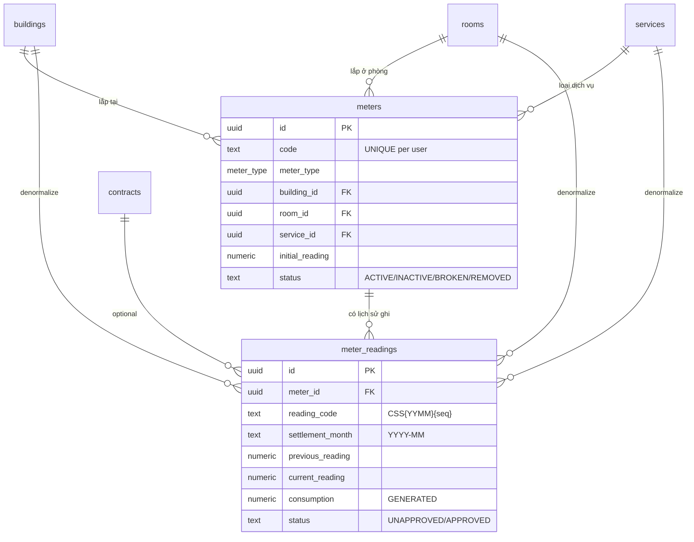
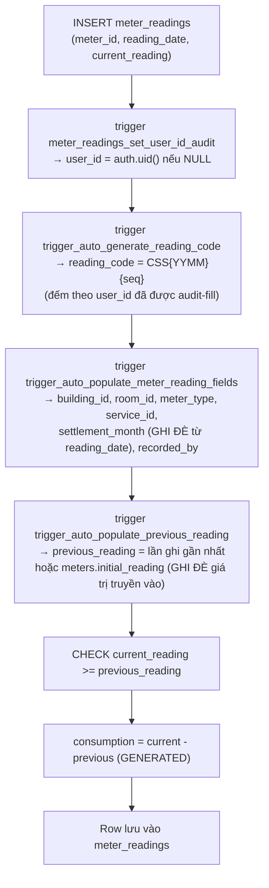
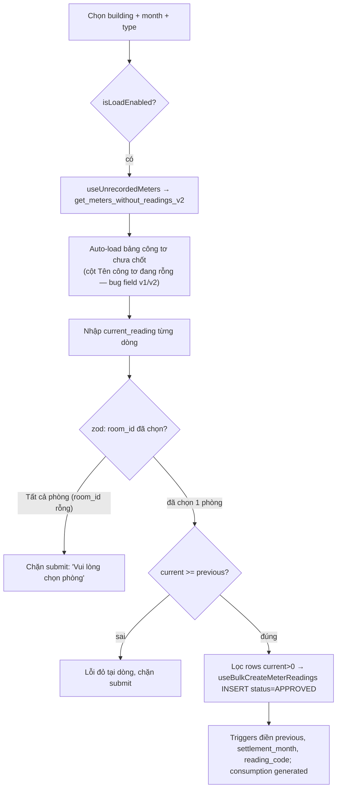

# Công tơ & Ghi chỉ số (Meters & Meter Readings)

> Domain quản lý **đồng hồ điện/nước/gas** gắn theo phòng và quy trình **ghi → (duyệt) → chốt chỉ số** để tính tiêu thụ, từ đó lên **hoá đơn tiền điện/nước** theo đơn giá đồng hồ.

---

## 1. Tổng quan & vai trò nghiệp vụ

Domain này là **cầu nối giữa hạ tầng vật lý (đồng hồ trong phòng) và doanh thu dịch vụ biến đổi theo mức dùng**. Nó nằm ở khúc giữa của vòng đời vận hành:

```
… HĐ (contract) → [Ghi chỉ số hằng tháng] → consumption → [Lên hoá đơn điện/nước] → thu tiền → báo cáo …
```

Hai thực thể trung tâm:

- **`meters`** — *Công tơ vật lý*: mỗi đồng hồ điện/nước/gas được lắp ở một phòng (`room_id`) trong một toà nhà (`building_id`), gắn với một `service` (Điện / Nước / Gas). Đây là **danh mục** (master data), quản lý ở trang Cài đặt.
- **`meter_readings`** — *Lần ghi chỉ số*: mỗi tháng người vận hành đọc đồng hồ, nhập `current_reading`. Hệ thống tự suy ra `previous_reading` (từ lần ghi trước hoặc `initial_reading`), và **`consumption = current − previous`** (cột generated). Mỗi bản ghi có trạng thái duyệt (`UNAPPROVED`/`APPROVED`).

Vai trò nghiệp vụ:

1. **Theo dõi tiêu thụ** điện/nước/gas theo phòng theo tháng (`settlement_month`).
2. **Cung cấp dữ liệu đầu vào cho hoá đơn**: các dialog lập hoá đơn đọc chỉ số **APPROVED gần nhất** làm "chỉ số đầu" cho tiền điện, và khi submit còn **tự ghi một reading APPROVED mới** vào bảng (xem §6 — domain hoá đơn vừa đọc vừa ghi `meter_readings`). Số tiền dòng điện = `consumption × unit_price`.
3. **Phát hiện công tơ chưa chốt** trong tháng (`get_meters_without_readings_v2`) để nhắc người vận hành đi đọc số.

> Lưu ý về "duyệt": Mặc dù schema có đầy đủ workflow `UNAPPROVED → APPROVED` (RPC `approve_meter_reading`, `bulk_approve_*`), **frontend hiện tại chạy ở chế độ auto-approve**: hook `useBulkCreateMeterReadings` (đường chạy thật duy nhất của form Thêm chỉ số) insert thẳng với `status='APPROVED'` (xem mục 4.7). Các hook `useCreateMeterReading`, `useApproveMeterReading`, `useBulkApproveMeterReadings`, `useUnapproveMeterReading` đều được export nhưng **không nơi nào import — dead code FE**, không chỉ là "workflow dự phòng". Các helper `canEditReading`/`canDeleteReading` luôn trả `true` — xoá/sửa chỉ số APPROVED đã dùng lên hoá đơn **không có guard nào** (không có FK `invoice_items → reading`), dễ làm lịch sử consumption và hoá đơn lệch nhau. Phần workflow duyệt chỉ còn tồn tại ở tầng DB/RPC.

---

## 2. Cấu trúc dữ liệu

### 2.1. Bảng `meters` — Công tơ

Nguồn: [`20250130000001_meter_reading_full_reimplementation.sql`](supabase/migrations/20250130000001_meter_reading_full_reimplementation.sql)

Mục đích: lưu **đồng hồ vật lý** lắp trong phòng. Là master data, mỗi `(user_id, code)` là duy nhất.

Cột chủ chốt (ý nghĩa nghiệp vụ):

| Cột | Ý nghĩa & ràng buộc |
|-----|----------------------|
| `code` | Mã công tơ (VD `CTD-201`, `CTN-201`). `NOT NULL`, `char_length > 0`, **UNIQUE theo `(user_id, code)`** → trùng mã trả lỗi PG `23505` ("Mã công tơ đã tồn tại"). ⚠️ UNIQUE này **không phải partial index** (không loại trừ `deleted_at IS NOT NULL`) → xoá mềm công tơ rồi tạo lại cùng mã **vẫn dính 23505**. |
| `meter_type` | Enum `meter_type` (`ELECTRICITY`/`WATER`/`GAS`/`OTHER`). UI chỉ cho chọn 3 loại đầu. |
| `name` | Tên hiển thị; **auto-sinh** nếu bỏ trống: `"{tên phòng} - {nhãn loại}"` (trigger `auto_generate_meter_name`). |
| `building_id` / `room_id` | Vị trí lắp đặt. `building_id` NOT NULL; `room_id` nullable (đồng hồ dùng chung). |
| `service_id` | Dịch vụ tương ứng (Điện/Nước/Gas). NOT NULL, `ON DELETE RESTRICT`. Frontend **tự resolve** từ `meter_type` → tên service (`resolveServiceId` trong [`useMeters.ts`](src/hooks/useMeters.ts)). |
| `initial_reading` | Chỉ số gốc lúc lắp đặt, default 0, CHECK `>= 0`. Dùng làm `previous_reading` cho lần ghi đầu tiên khi chưa có lịch sử. |
| `status` | TEXT, default `ACTIVE`, CHECK ∈ `ACTIVE/INACTIVE/BROKEN/REMOVED`. Chỉ `ACTIVE` mới xuất hiện trong "công tơ chưa chốt". |
| `installation_date`, `location_note`, `manufacturer`, `model`, `serial_number`, `notes` | Metadata bổ sung (form chỉ nhập `installation_date` + `location_note`). |
| `id`, `user_id`, `created_at`, `updated_at`, `deleted_at` | Khoá/audit chuẩn. `deleted_at` = soft-delete (mọi query lọc `IS NULL`). `user_id` từ RBAC chỉ còn vai trò **audit** (trigger `meters_set_user_id_audit` auto-fill `auth.uid()` nếu NULL — xem §4.12); **staff tạo công tơ → `user_id` = staff**, không phải owner. |

Quan hệ FK (đi ra):
- `building_id → buildings.id` (domain Toà nhà & Phòng), `ON DELETE CASCADE`
- `room_id → rooms.id`, `ON DELETE SET NULL`
- `service_id → services.id` (domain Dịch vụ & Giá), `ON DELETE RESTRICT`
- `user_id → auth.users.id`

Được tham chiếu bởi: `meter_readings.meter_id`.

### 2.2. Bảng `meter_readings` — Lần ghi chỉ số

Mục đích: mỗi dòng là **một lần đọc số** của một công tơ trong một tháng.

Cột chủ chốt:

| Cột | Ý nghĩa & ràng buộc |
|-----|----------------------|
| `meter_id` | Trỏ về công tơ. Nullable trên schema nhưng luôn được set khi tạo qua UI. `ON DELETE CASCADE`. |
| `reading_code` | Mã chỉ số duy nhất, format **`CSS{YYMM}{seq 5 chữ số}`** (VD `CSS250700001`). UNIQUE (partial index). Auto-sinh bởi trigger nếu bỏ trống. |
| `meter_type`, `building_id`, `room_id`, `service_id` | **Auto-populate từ `meter_id`** (trigger `auto_populate_meter_reading_fields`) — denormalize để query/filter nhanh không cần JOIN. |
| `settlement_month` | TEXT `YYYY-MM`. **Auto-set từ `reading_date`** (trigger — **GHI ĐÈ kể cả khi client truyền giá trị khác**, xem §4.1). Là khoá nghiệp vụ để xác định "đã chốt tháng này chưa" và để chọn chỉ số khi lên hoá đơn. |
| `reading_date` | Ngày chốt, `NOT NULL`. |
| `previous_reading` | Chỉ số đầu, `NOT NULL` default 0. **Auto-populate** (trigger `auto_populate_previous_reading` — **GHI ĐÈ kể cả khi client truyền giá trị**, xem §4.2): lấy `current_reading` của lần ghi gần nhất cùng `meter_id`, fallback `meters.initial_reading`, fallback 0. |
| `current_reading` | Chỉ số mới đọc được, `NOT NULL`. CHECK **`current_reading >= previous_reading`** (không cho tụt số). |
| `consumption` | **GENERATED ALWAYS AS (`current_reading - previous_reading`) STORED** — số tiêu thụ, không ghi tay được. |
| `status` | TEXT default `UNAPPROVED`, CHECK ∈ `UNAPPROVED/APPROVED`. (Thực tế frontend tạo thẳng `APPROVED`.) |
| `approved_by`, `approved_at` | Người/lúc duyệt. |
| `recorded_by` | Người ghi — **auto-set = `auth.uid()`** (trigger). |
| `contract_id` | Liên kết HĐ (legacy/optional), `ON DELETE CASCADE`. Không bắt buộc; chỉ số gắn theo phòng+tháng là chính. |
| `notes`, `meter_image_url` | Ghi chú + ảnh chụp mặt đồng hồ (lưu bucket private `meter-images`, hiển thị qua `StorageImage`/signed URL — chi tiết §4.13). |
| `id`, `user_id`, `created_at`, `updated_at`, `deleted_at` | Khoá/audit chuẩn. `deleted_at` = soft-delete. `user_id` chỉ còn vai trò audit (trigger `meter_readings_set_user_id_audit`, §4.12); **staff ghi chỉ số → `user_id` = staff** — hệ quả: RPC stats lọc `user_id = auth.uid()` lệch dữ liệu (xem §4.8). |

Enum dùng: `meter_type` (`ELECTRICITY/WATER/GAS/OTHER`).

Quan hệ FK (đi ra):
- `meter_id → meters.id`
- `contract_id → contracts.id` (domain Hợp đồng)
- `service_id → services.id` (domain Dịch vụ)
- `building_id → buildings.id`, `room_id → rooms.id` (domain Toà nhà & Phòng)
- `approved_by`, `recorded_by`, `user_id → auth.users.id`

---

## 3. Sơ đồ quan hệ dữ liệu



Luồng dữ liệu khi insert một `meter_reading` (các trigger BEFORE INSERT — Postgres chạy theo **thứ tự alphabet của TÊN trigger**; tên thật có prefix `trigger_*`, nên `trigger_auto_generate_reading_code` chạy TRƯỚC 2 trigger populate — các bước độc lập nhau nên không ảnh hưởng kết quả):



---

## 4. Quy tắc nghiệp vụ & tự động hoá

### 4.1. Trigger `auto_populate_meter_reading_fields` (BEFORE INSERT trên `meter_readings`)
Nguồn: [`20250130000003_meter_reading_triggers.sql`](supabase/migrations/20250130000003_meter_reading_triggers.sql).
- Từ `NEW.meter_id` → SELECT `meters` → gán `building_id`, `room_id`, `meter_type`, `service_id` vào row mới (denormalize). Nhờ denormalize này, RLS theo toà (§4.10) áp được ngay từ lúc INSERT.
- `settlement_month := TO_CHAR(reading_date, 'YYYY-MM')`.
- `recorded_by := auth.uid()`.
- **Invariant:** mọi reading luôn có vị trí + loại đồng nhất với công tơ tại thời điểm ghi; `settlement_month` luôn khớp tháng của `reading_date`.
- ⚠️ **Gotcha:** trigger **GHI ĐÈ vô điều kiện** — client truyền `settlement_month` khác (vd `GenerateInvoiceDialog` truyền `billing_month`, hoặc form chọn "Tháng chốt" tháng 5 nhưng `reading_date` 10/06) thì giá trị cuối vẫn là tháng của `reading_date`. Hệ quả: reading rơi vào tháng khác, công tơ vẫn bị coi "chưa chốt" tháng đã chọn → dễ ghi trùng (xem §5.1.A và §6).

### 4.2. Trigger `auto_populate_previous_reading` (BEFORE INSERT)
- Lấy `current_reading` của lần ghi **gần nhất** cùng `meter_id` (`ORDER BY reading_date DESC, created_at DESC LIMIT 1`, chỉ tính `deleted_at IS NULL`).
- Nếu chưa có lịch sử → dùng `meters.initial_reading`; nếu null → 0.
- **Invariant:** chuỗi chỉ số liền mạch — `previous_reading` của lần này = `current_reading` lần trước, không có khoảng hở.
- ⚠️ **Gotcha:** trigger **GHI ĐÈ kể cả khi INSERT truyền giá trị** (không có check "fill-when-null"). `GenerateInvoiceDialog`/`ExcelInvoiceDialog` truyền `previous_reading` đã override tay nhưng giá trị lưu thật vẫn là reading gần nhất → lịch sử công tơ có thể lệch với hoá đơn; nếu prev override xuống thấp khiến `current < previous` thực thì CHECK fail và reading bị bỏ qua **im lặng** (`GenerateInvoiceDialog` chỉ `console.warn`; `ExcelInvoiceDialog` còn không check error của lệnh insert) trong khi hoá đơn vẫn tạo (xem §6).

### 4.3. Trigger `auto_generate_reading_code` (BEFORE INSERT)
- Bỏ qua nếu `reading_code` đã có giá trị.
- `prefix = 'CSS' || TO_CHAR(reading_date, 'YYMM')`; `seq = COUNT(*) + 1` các reading cùng `user_id` + cùng prefix; kết quả `prefix || LPAD(seq, 5, '0')`.
- **Lưu ý kỹ thuật:** sequence tính bằng `COUNT(*)+1`, không khoá hàng → về lý thuyết có thể đụng UNIQUE index `reading_code` nếu hai insert song song cùng prefix; trong import hàng loạt các row insert tuần tự trong vòng lặp nên thực tế an toàn. `COUNT(*)` cũng **không lọc `deleted_at`** (reading xoá mềm vẫn được đếm — chỉ ảnh hưởng số thứ tự, không gây lỗi). Hiệu năng: mỗi row insert chạy 1 lần `COUNT(*) + LIKE 'CSSyymm%'` (bulk N dòng = N lần count).

### 4.4. Trigger `auto_generate_meter_name` (BEFORE INSERT trên `meters`)
- Bỏ qua nếu `name` đã có.
- Tra `rooms.name`, map nhãn (`ELECTRICITY→Điện`, `WATER→Nước`, `GAS→Gas`) → `name = "{room} - {nhãn}"` (không có phòng thì chỉ nhãn).

### 4.5. Trigger `updated_at` — dùng chung `update_updated_at_column()` cho cả 2 bảng (BEFORE UPDATE).

### 4.6. Cột generated `consumption`
- `consumption = current_reading - previous_reading` (STORED). **Không thể** ghi tay; mọi nơi (stats, hoá đơn) đọc trực tiếp.
- Kết hợp CHECK `current >= previous` ⇒ **invariant: `consumption >= 0`**.

### 4.7. RPC duyệt / tạo

| RPC | Security | Tác động |
|-----|----------|----------|
| `approve_meter_reading(p_reading_id)` | DEFINER | Set `status='APPROVED'`, `approved_by=auth.uid()`, `approved_at=NOW()`. RAISE nếu không tìm thấy / đã duyệt. |
| `bulk_approve_meter_readings(p_reading_ids[])` | DEFINER | Chỉ update các row đang `UNAPPROVED`; trả về số dòng đã duyệt. |
| `bulk_create_meter_readings(p_readings jsonb)` | DEFINER | Dùng cho **import Excel**. Mỗi phần tử `{meter_code, reading_date, current_reading, notes?}`: tra `meters` theo `code + auth.uid()` (**owner-scope cũ, chưa nâng cấp RBAC** — staff import sẽ không thấy meter của owner), INSERT row `UNAPPROVED` (để các trigger tự điền). Trả mảng `{meter_code, reading_id, reading_code, success, error_message}` — **lỗi từng dòng được bắt riêng** (`EXCEPTION WHEN OTHERS`), 1 dòng hỏng không làm hỏng cả lô. |

Nguồn: [`20250130000004_meter_reading_rpc_functions.sql`](supabase/migrations/20250130000004_meter_reading_rpc_functions.sql).

> **Trạng thái wiring thực tế (FE):** chỉ `useBulkCreateMeterReadings` ([`useMeterReadings.ts`](src/hooks/useMeterReadings.ts)) được UI dùng (form Thêm chỉ số) — **không** qua RPC, `INSERT` trực tiếp vào bảng với `status='APPROVED'`, `approved_by/approved_at` set ngay. Các hook `useCreateMeterReading`, `useApproveMeterReading`, `useBulkApproveMeterReadings`, `useUnapproveMeterReading` đều **dead code** (export nhưng không nơi nào import). Helper `createMeterReadingPayload` (pure) có **2 bản trùng tên**: bản trong [`meterReadingFormUtils.ts`](src/components/meter-readings/meterReadingFormUtils.ts) tạo payload `APPROVED` (chỉ property test dùng), bản trong [`useMeterReadingsHelpers.ts`](src/hooks/useMeterReadingsHelpers.ts) tạo `UNAPPROVED` (re-export từ `useMeterReadings.ts`, không ai dùng) — đều không phải đường chạy thật.
>
> ⚠️ **Import Excel hiện HỎNG runtime:** hook `useImportMeterReadings` gọi `supabase.rpc('bulk_create_meter_readings', { p_readings, p_user_id })` — nhưng live DB chỉ có signature `(p_readings jsonb)` (xác nhận trong [`types.ts`](src/integrations/supabase/types.ts)) → PostgREST không match function (lỗi PGRST202/404) → toast "Không thể nhập dữ liệu từ Excel", không insert được dòng nào. Sửa: bỏ `p_user_id` khỏi lời gọi (RPC tự dùng `auth.uid()`).

### 4.8. RPC thống kê `get_meter_reading_stats(p_building_id?, p_month?)` (INVOKER)
- Đếm `total_readings`, `unapproved_count`, `approved_count` và SUM `consumption` theo từng loại (`electricity/water/gas_consumption`).
- Lọc theo `user_id = auth.uid()`, `deleted_at IS NULL`, optional building + month.
- Trả về 1 dòng; hook `useMeterReadingStats` map vào card thống kê.
- ⚠️ **RPC v1 chưa nâng cấp RBAC, lệch với danh sách:** sau RBAC, reading do staff ghi có `user_id = staff` (trigger audit §4.12) trong khi danh sách đọc view bypass RLS không lọc owner (§4.11) → owner mở trang thấy danh sách có dòng nhưng card thống kê không đếm (và ngược lại với staff).
- ⚠️ **Edge case month rỗng:** `useMeterReadingStats` chỉ fallback tháng hiện tại khi `month` là `null/undefined` (`month ?? …`); trang truyền thẳng `filters.month` nên xoá tháng trong ô lọc → `p_month=''` → stats đếm 0, trong khi danh sách bỏ filter tháng (`month || undefined`) → hai khối hiển thị mâu thuẫn.

### 4.9. RPC tìm công tơ chưa chốt

- **`get_meters_without_readings(p_user_id, …)`** (v1, INVOKER): trả các công tơ `ACTIVE` chưa có reading cho `p_month` (kèm `last_reading`, `last_reading_date`). Lọc theo building/room/meter_type tuỳ chọn.
- **`get_meters_without_readings_v2(p_building_id?, p_room_id?, p_meter_type?, p_month?)`** (DEFINER, RBAC) — bản frontend dùng. Nguồn: [`20260528000002_rbac_batch_c_rpc_v2.sql`](supabase/migrations/20260528000002_rbac_batch_c_rpc_v2.sql).
  - Không nhận `p_user_id`; thay vào đó: nếu có `building_id` → kiểm `can_access_building(building_id)` (RAISE nếu không có quyền) rồi lấy owner của building (`buildings.user_id`).
  - **Edge case khi KHÔNG truyền building:** super_admin → lấy owner của building đầu tiên; staff → lấy owner đầu tiên trong `staff_assignments` (staff đa-owner sẽ lấy tuỳ ý 1 owner); **owner thường** (không là staff của ai, không super_admin) → `v_owner` NULL → trả **RỖNG**. Form chỉ load khi đã chọn toà nên ít lộ ra ngoài.
  - Sau đó **delegate** xuống v1 với owner đã resolve.
  - Hook `useUnrecordedMeters` ([`useMeters.ts`](src/hooks/useMeters.ts)) gọi bản v2; field trả về dùng tên `code/name/meter_type` (khác v1 dùng `meter_code/meter_name/meter_type_value`).
  - ⚠️ **Bug lệch tên field ở FE:** [`meterReadingFormUtils.ts`](src/components/meter-readings/meterReadingFormUtils.ts) (interface `UnrecordedMeter` + `getMeterNameFromList`) vẫn đọc theo tên field **v1** (`meter_code/meter_name/meter_type_value`) — không được cập nhật khi hook chuyển sang v2 → `meter.meter_code` = `undefined` → cột "Tên công tơ" trong dialog Thêm chỉ số hiển thị **RỖNG** cho mọi dòng (chỉ `meter_id`, `last_reading`, `last_reading_date` còn khớp tên nên chỉ-số-đầu vẫn đúng).
  - Lưu ý perf: `useUnrecordedMeters` có `enabled: !!month` (không cần building) → RPC bắn ngay khi mở dialog dù chưa chọn toà (kết quả vô nghĩa/rỗng) và refetch theo mọi thay đổi watch field.

### 4.10. RLS & cấp quyền (RBAC theo toà nhà)
Nguồn: [`20260527000009_rbac_phase5_misc.sql`](supabase/migrations/20260527000009_rbac_phase5_misc.sql) (tạo policy `*_rbac`) + [`20260528000003_rbac_batch_f_drop_legacy.sql`](supabase/migrations/20260528000003_rbac_batch_f_drop_legacy.sql) (drop policy legacy).

Từ 2026-05-27/28, RLS của cả 2 bảng đã **đổi hoàn toàn** từ mô hình owner (`auth.uid() = user_id`) sang **RBAC theo TOÀ NHÀ**:

| Bảng | SELECT | INSERT / UPDATE / DELETE |
|------|--------|--------------------------|
| `meters` | `meters_select_rbac`: `can_access_building(building_id)` | `meters_{insert,update,delete}_rbac`: `can_do_on_building('meters', 'create'/'edit'/'delete', building_id)` |
| `meter_readings` | `meter_readings_select_rbac`: `is_super_admin() OR is_admin() OR (building_id IS NOT NULL AND can_access_building(building_id))` | `meter_readings_{insert,update,delete}_rbac`: `is_super_admin() OR (building_id IS NOT NULL AND can_do_on_building('meter_readings', …, building_id))` |

- Row `meter_readings` có `building_id` NULL → chỉ admin/super_admin thấy, chỉ super_admin sửa được. Vì `building_id` được trigger denormalize từ meter ngay BEFORE INSERT (§4.1) nên check theo toà áp dụng được cả khi insert.
- Toàn bộ policy legacy (`"Users can view/insert/update/delete own meters / meter readings"`, `meters_select_staff`, `meter_readings_staff_*`…) đã bị **DROP** ở batch F. Policy SELECT cũ của meters có lọc `deleted_at IS NULL`; policy RBAC mới **không lọc** — việc ẩn bản ghi soft-delete giờ hoàn toàn do client (`.is('deleted_at', null)` trong [`useMeters.ts`](src/hooks/useMeters.ts)) và `WHERE` trong view.
- **Module quyền** khai báo ở [`permissions.ts`](src/lib/permissions.ts): key `meter_readings` (nhóm **Tài chính**, nhãn "Ghi chỉ số", action extra `export`) và key `meters` (nhóm **Cấu hình hệ thống**, nhãn "Đồng hồ / Công tơ"). `can_do_on_building` đọc đúng các key/action này từ `COALESCE(staff_assignments.permissions, roles.permissions)` — snapshot quyền **per-staff được ưu tiên** trước role ([`20260529000001_per_staff_permissions.sql`](supabase/migrations/20260529000001_per_staff_permissions.sql)) — theo phân công toà trong `staff_assignments`; muốn staff ghi chỉ số phải tick quyền `meter_readings` (trên role hoặc override per-staff) + gán toà.
- `user_id` trên 2 bảng giờ chỉ còn vai trò **audit** (xem §4.12), không tham gia access control ở tầng bảng nữa. ⚠️ Nhưng các **RPC v1 chưa nâng cấp** (`get_meter_reading_stats` lọc `user_id = auth.uid()` §4.8; `bulk_create_meter_readings` tra meter theo `code + auth.uid()` §4.7) vẫn theo owner-scope cũ → nguồn lệch dữ liệu khi staff thao tác.
- Hardening security: [`20260601000100_sec_contract_rpc_authz_and_anon_revoke.sql`](supabase/migrations/20260601000100_sec_contract_rpc_authz_and_anon_revoke.sql) `ALTER FUNCTION … SET search_path = public` cho `approve_meter_reading`, `bulk_approve_meter_readings`, `bulk_create_meter_readings` (chống "search_path mutable").

### 4.11. Views

- **`meter_readings_detailed`** — JOIN reading với `meters` (code/name), `buildings`, `rooms`, `services`, `auth.users` (email người duyệt + người ghi). Lọc `deleted_at IS NULL`, sort `reading_date DESC`. Là nguồn cho danh sách + filter trang Ghi chỉ số. Nguồn: [`20250130000002_meter_reading_views.sql`](supabase/migrations/20250130000002_meter_reading_views.sql).
- **`meters_with_latest_reading`** — JOIN `meters` với building/room/service + 3 correlated subquery `latest_reading`, `latest_reading_date`, `total_readings`. Là nguồn cho trang quản lý Công tơ.
- ⚠️ **Cả 2 view BYPASS RLS:** không view nào set `security_invoker = true` (trong toàn bộ migrations chỉ `accounts_with_balance` được flip sang invoker) → view chạy với quyền owner của view (postgres), **bỏ qua toàn bộ RLS** của `meters`/`meter_readings`/`buildings`. Trang Ghi chỉ số và trang Đồng hồ Công tơ đọc qua 2 view này, nên **mọi user đăng nhập về lý thuyết SELECT được dữ liệu chỉ số của mọi tenant** — giới hạn theo toà trên UI chỉ là filter phía client. Đây cũng chính là cách staff thấy dữ liệu của owner (chứ KHÔNG phải nhờ RLS bảng). Trade-off này chưa được đóng lại sau khi RLS RBAC đã cover staff; nếu sửa thì `ALTER VIEW … SET (security_invoker = true)` cho cả 2 view.
- Ghi chú hiệu năng: `meter_readings_detailed` có `ORDER BY` ngay trong view (toàn bảng, hook lại order thêm lần nữa) và JOIN `auth.users` 2 lần; `meters_with_latest_reading` chạy 3 subquery tương quan cho **từng** meter.

### 4.12. Trigger audit `set_user_id_from_auth` (BEFORE INSERT, cả 2 bảng)
Nguồn: [`20260527000006_rbac_phase2_trigger_auto_user_id.sql`](supabase/migrations/20260527000006_rbac_phase2_trigger_auto_user_id.sql) (định nghĩa function) + [`20260527000009_rbac_phase5_misc.sql`](supabase/migrations/20260527000009_rbac_phase5_misc.sql) (gắn trigger).
- `meters_set_user_id_audit` và `meter_readings_set_user_id_audit`: nếu `NEW.user_id` NULL thì gán `auth.uid()`. Mục đích thuần **audit** (ai tạo row), không tham gia access control.
- Frontend hiện vẫn truyền `user_id: user.id` tường minh khi insert (cả meters lẫn readings) nên trigger chỉ là lưới an toàn.
- **Hệ quả RBAC:** staff tạo công tơ/ghi chỉ số → `user_id` = **STAFF**, không phải owner — khác hẳn mô hình cũ. Các RPC v1 còn lọc theo `user_id` vì thế bị lệch (§4.7, §4.8).

### 4.13. Storage ảnh công tơ — bucket `meter-images`
- Bucket tạo public ban đầu ([`20250130000005_meter_images_storage.sql`](supabase/migrations/20250130000005_meter_images_storage.sql)); đã chuyển **PRIVATE** ở [`20260601000200_sec_private_buckets.sql`](supabase/migrations/20260601000200_sec_private_buckets.sql) — policy SELECT đổi từ `TO public` sang `TO authenticated`.
- Policy UPLOAD/UPDATE/DELETE cho **mọi user authenticated** (chỉ check `bucket_id`, không giới hạn owner/toà). Super-admin có blanket policy bypass trên `storage.objects` ([`20260514000005_super_admin_bypass_rpcs_and_storage.sql`](supabase/migrations/20260514000005_super_admin_bypass_rpcs_and_storage.sql)).
- `uploadFile` ([`storage.ts`](src/lib/storage.ts)) vẫn trả **public URL** và URL đó được lưu vào `meter_image_url`; component `StorageImage` chịu trách nhiệm parse lại `<bucket>/<path>` và đổi sang **signed URL** (TTL 1 giờ) khi hiển thị — không cần migrate dữ liệu cũ.

---

## 5. Quy trình theo từng trang

### 5.1. Trang **Ghi chỉ số** — `/meter-readings`
File: [`MeterReadingsPage.tsx`](src/pages/meter-readings/MeterReadingsPage.tsx). Menu: *Tài chính → Ghi chỉ số*.

Mục đích: danh sách + thống kê + thêm/sửa/xoá/import chỉ số theo tháng.

Dữ liệu hiển thị:
- **Stats** (`MeterReadingStats` → hook `useMeterReadingStats` → RPC `get_meter_reading_stats`): 5 card — card đầu có label "Công tơ chưa chốt" nhưng ⚠️ **bind nhầm `total_readings`** (tổng số chỉ số ĐÃ ghi, không phải số công tơ chưa chốt), Chỉ số đã duyệt, chưa duyệt, Tổng tiêu thụ điện (kWh), nước (m³). Stats còn 2 nguồn lệch khác với danh sách (RPC lọc `user_id` + month rỗng) — xem §4.8.
- **Danh sách** (`MeterReadingList` → hook `useMeterReadingsList` → view `meter_readings_detailed` — view bypass RLS, §4.11), phân trang 20/trang qua `.range()`, lọc `building_id`/`meter_type`/`settlement_month`/`status`, sort `reading_date DESC`. Mỗi dòng: mã + badge trạng thái, công tơ, chỉ số đầu/cuối, **số tiêu thụ**, ngày chốt, người chốt.
- **Ô lọc Phòng** ([`MeterReadingFilters.tsx`](src/components/meter-readings/MeterReadingFilters.tsx)) đã chuyển sang **gộp-theo-TÊN phòng** (helper `uniqueRoomNames`/`roomIdsByName`/`roomNameFromIds` trong `lib/roomSort`): các phòng trùng tên ở mọi toà gộp thành 1 mục; chọn 1 tên → set mảng `room_ids` (mọi id cùng tên), `room_id` luôn null. Khi chưa chọn toà, `useRooms(undefined)` load **tất cả** phòng user thấy được rồi gộp tên. ⚠️ **Bug no-op:** `MeterReadingsPage` KHÔNG truyền `room_ids` xuống `useMeterReadingsList` (hook đã có code `.in('room_id', filters.room_ids)` nhưng interface `MeterReadingFilters` của hook **thiếu field `room_ids`**) → chọn phòng trong filter bar hiện **không lọc gì cả**. Lỗi TS này bị che vì root [`tsconfig.json`](tsconfig.json) có `"files": []` nên `npx tsc --noEmit` ở root không check file nào — phải chạy `npx tsc -p tsconfig.app.json --noEmit` mới thấy.

Thao tác chính (từng bước):

**A. Thêm chỉ số** (nút "Thêm chỉ số" → `MeterReadingForm` chế độ tạo, [`MeterReadingForm.tsx`](src/components/meter-readings/MeterReadingForm.tsx)):
1. Chọn **Tòa nhà** (bắt buộc), **Phòng** (UI hiển thị như tuỳ chọn — mặc định "Tất cả phòng" — nhưng xem ⚠️ dưới), **Loại công tơ** (Điện/Nước), **Tháng chốt** (`YYYY-MM`), **Ngày chốt**.
2. Khi đủ điều kiện (`isLoadEnabled`: có building + month), form gọi `useUnrecordedMeters` → RPC `get_meters_without_readings_v2` và **auto-load** danh sách công tơ chưa chốt vào bảng (mỗi dòng có "Chỉ số đầu" = `last_reading`, ô nhập "Chỉ số mới", ghi chú, upload ảnh). ⚠️ Cột "Tên công tơ" hiện hiển thị **RỖNG** cho mọi dòng do `meterReadingFormUtils` còn đọc field v1 trong khi RPC v2 trả `code/name/meter_type` (xem §4.9) — người nhập không phân biệt được dòng nào là đồng hồ nào.
3. Nhập chỉ số mới cho từng đồng hồ. Validate client (`validateReadingValue`): `current_reading >= previous` → nếu sai hiện lỗi đỏ tại dòng, chặn submit.
4. Submit → zodResolver validate `meterReadingFormSchema` trước → lọc các dòng `current_reading > 0` → `useBulkCreateMeterReadings` **INSERT thẳng** với `status='APPROVED'`. Các trigger DB điền `previous_reading`, `settlement_month`, `reading_code`, `consumption`. Nếu không có dòng > 0 → toast "Vui lòng nhập ít nhất 1 chỉ số".

⚠️ **Bug chặn ghi số hàng loạt cả toà:** [`meterReadingValidation.ts`](src/lib/meterReadingValidation.ts) khai `room_id: z.string().min(1, 'Vui lòng chọn phòng')` (bắt buộc), trong khi chọn "Tất cả phòng" set `room_id = ''` → zodResolver **chặn submit** với lỗi "Vui lòng chọn phòng". Bảng công tơ vẫn auto-load cho cả toà nhưng **không lưu được** nếu không chọn 1 phòng cụ thể — UI và nghiệp vụ coi Phòng là tuỳ chọn nhưng schema thì không.

⚠️ **"Tháng chốt" chỉ điều khiển query công tơ chưa chốt**, KHÔNG quyết định `settlement_month` của row: trigger ghi đè `settlement_month` = tháng của `reading_date` (§4.1). Chọn tháng 5 nhưng ngày chốt 10/06 → reading rơi vào `2026-06`, công tơ vẫn bị coi "chưa chốt tháng 5" → dễ ghi trùng.

⚠️ **Checkbox "Công tơ chưa chốt trong tháng"** (mặc định tick) là **control chết**: state `showUnrecordedOnly` chỉ được set, không tham gia bất kỳ query/filter nào.



**B. Sửa chỉ số** (menu "Cập nhật" → form chế độ edit):
- Building/Phòng/Loại/Tháng **disabled** (chỉ sửa được `current_reading`, `reading_date`, `notes`, ảnh).
- Submit → `useUpdateMeterReading` UPDATE 1 row. (Lưu ý: `previous_reading`/`settlement_month` không re-tính khi sửa — vì trigger là BEFORE INSERT, không chạy lại trên UPDATE.)

**C. Xoá** (menu "Xoá" → AlertDialog xác nhận) → `useDeleteMeterReading` soft-delete (`deleted_at = now()`).

**D. Xoá hàng loạt** (`MeterReadingActions`, [`MeterReadingActions.tsx`](src/components/meter-readings/MeterReadingActions.tsx)): chọn nhiều dòng → "Xoá hàng loạt" → `useBulkDeleteMeterReadings` set `deleted_at` cho mảng id.

**E. Import Excel** (nút "Import" → `MeterReadingImportDialog`): không chọn toà/phòng — định danh hoàn toàn bằng `meter_code`. Validate trước từng dòng bằng `excelImportRowSchema.safeParse` (helper `validateImportRows` cùng logic chỉ dùng trong test, dialog không import) rồi gọi `useImportMeterReadings` → RPC `bulk_create_meter_readings`. ⚠️ **Luồng này hiện HỎNG runtime**: hook gửi thêm tham số `p_user_id` không tồn tại trong signature RPC live → PostgREST trả PGRST202, toast "Không thể nhập dữ liệu từ Excel", không insert được dòng nào (xem §4.7). Thiết kế gốc (khi sửa lời gọi): RPC tra công tơ theo `meter_code + auth.uid()`, tạo row `UNAPPROVED`, trả kết quả từng dòng, toast tổng kết "X thành công, Y lỗi" — và vẫn còn hạn chế owner-scope với staff (§4.7).

Edge case:
- Filter đổi → reset selection + về trang 1.
- Không có công tơ chưa chốt cho bộ lọc → toast "Không có công tơ chưa chốt…" + bảng rỗng.
- Tất cả query lỗi → hook trả mảng rỗng/`{data:[],totalCount:0}` (không crash UI).

### 5.2. Trang **Đồng hồ Công tơ** — `/settings/meters`
File: [`MetersPage.tsx`](src/pages/settings/MetersPage.tsx). Menu: *Cài đặt → Danh mục khác → Tài chính → Đồng hồ Công tơ*. (Route cũ `/settings/categories/meters` redirect về đây.)

Mục đích: quản lý danh mục đồng hồ.

Dữ liệu: `useMetersWithLatestReading` tải **toàn bộ** view `meters_with_latest_reading` (`select('*')`, không filter server, không phân trang — view này bypass RLS, §4.11) → danh sách phẳng, **lọc client-side** theo building + meter_type (bằng `SearchableSelect` gõ-để-tìm). Mỗi dòng ([`MeterList.tsx`](src/components/meters/MeterList.tsx)) hiển thị: Mã, Tên, Loại, Tòa nhà, Phòng, Chỉ số đầu, cột **"Chỉ số chốt gần nhất"** (gộp `latest_reading` + `latest_reading_date` trên 2 dòng), Trạng thái. Field `total_readings` có trong view nhưng **không hiển thị** ở cột nào.

Thao tác (từng bước, qua `MeterForm` [`MeterForm.tsx`](src/components/meters/MeterForm.tsx)):

**A. Thêm công tơ:**
1. Nhập **Tòa nhà** (bắt buộc), **Phòng** (bắt buộc — phụ thuộc toà nhà), **Loại công tơ** (Điện/Nước/Gas), **Mã công tơ** (bắt buộc), + tuỳ chọn Chỉ số ban đầu, Ngày lắp đặt, Ghi chú vị trí. Validate bằng `meterFormSchema`.
2. Submit → `useCreateMeter`: lấy `auth.uid()`, **`resolveServiceId(meter_type)`** (tra `services` theo **TÊN literal** "Điện/Nước/Gas" → `service_id`; không thấy → toast lỗi & dừng — mapping fragile: đổi tên service là không tạo/sửa được công tơ), INSERT meters với `user_id = auth.uid()` của **người tạo** (staff tạo → `user_id` = staff, §4.12) + `service_id`. RLS insert check quyền theo toà qua `can_do_on_building('meters','create', building_id)`. Trigger `auto_generate_meter_name` điền `name` nếu trống.
3. Trùng mã (PG `23505`) → set lỗi field "Mã công tơ đã tồn tại". Lưu ý: công tơ đã **xoá mềm** vẫn chiếm mã (UNIQUE không loại trừ `deleted_at`, §2.1) → tạo lại cùng mã sau khi xoá vẫn dính lỗi này.

**B. Sửa công tơ** → `useUpdateMeter` (nếu đổi `meter_type` thì re-resolve `service_id`).

**C. Xoá** → `useDeleteMeter` soft-delete (`deleted_at`).

Edge case: nếu hệ thống chưa có service "Điện/Nước/Gas" tương ứng thì không tạo được công tơ (ràng buộc `service_id NOT NULL`).

---

## 6. Liên kết sang domain khác (vào / ra)

**Vào (domain khác cung cấp cho meters/readings):**
- **Toà nhà & Phòng** (`buildings`, `rooms`): công tơ và chỉ số gắn `building_id`/`room_id`. Form lấy danh sách qua `useBuildings`/`useRooms`. Từ RBAC, toà nhà còn là **trục phân quyền** của domain này: RLS cả 2 bảng đi qua `can_access_building`/`can_do_on_building` (§4.10), `building_id` của reading được trigger denormalize từ meter nên check theo toà áp được cả khi insert.
- **Dịch vụ & Giá** (`services`): mỗi công tơ phải map tới một service (Điện/Nước/Gas) qua `service_id`; frontend resolve theo **TÊN literal** "Điện/Nước/Gas" (`resolveServiceId` trong [`useMeters.ts`](src/hooks/useMeters.ts)) — đổi tên service là không tạo/sửa được công tơ.
- **Hợp đồng** (`contracts`): `meter_readings.contract_id` thuần legacy/optional — đường chạy thật gắn reading theo phòng + tháng, không theo HĐ.
- **RBAC/Phân quyền** (`roles.permissions`, `staff_assignments`, `can_access_building`, `can_do_on_building`, `is_super_admin`): 2 module key `meters` / `meter_readings` (§4.10) quyết định quyền ở cả RLS bảng lẫn RPC v2 `get_meters_without_readings_v2`.
- **Storage**: bucket private `meter-images` chứa ảnh mặt đồng hồ, hiển thị qua `StorageImage`/signed URL (§4.13).

**Ra (meters/readings cung cấp cho domain khác):**
- **Hoá đơn** (`invoices`/`invoice_items`): liên kết quan trọng nhất — domain hoá đơn vừa **ĐỌC** vừa **GHI** `meter_readings`:
  - Đường chạy thật: **`GenerateInvoiceDialog`** + **`ExcelInvoiceDialog`** (đều mount trong [`InvoicesPage.tsx`](src/pages/invoices/InvoicesPage.tsx)) tự tra meter **ĐIỆN** của phòng (`meters` theo `room_id` + `meter_type='ELECTRICITY'`), prefill "chỉ số đầu" = `current_reading` của reading **APPROVED gần nhất**, và khi submit **INSERT một `meter_reading` mới `status='APPROVED'`** vào bảng. `GenerateInvoiceDialog` có guard skip-nếu-đã-có reading theo `settlement_month = billing_month`; `ExcelInvoiceDialog` **không** guard. [`EditInvoiceDialog.tsx`](src/components/invoices/EditInvoiceDialog.tsx) cũng load meter điện của phòng để auto tính tiền điện theo chỉ số. (Perf: `ExcelInvoiceDialog` lấy "chỉ số gần nhất" bằng cách SELECT **toàn bộ** readings APPROVED của mọi meter điện trong toà rồi dedupe client-side — toà nhiều lịch sử sẽ tải rất nhiều row thừa.)
  - Cờ **`invoices.electricity_prev_overridden`** ([`20260519000001_invoice_electricity_prev_overridden.sql`](supabase/migrations/20260519000001_invoice_electricity_prev_overridden.sql)): NV sửa tay "chỉ số đầu" khi lập hoá đơn → set true để list hoá đơn tô đỏ ô Tiền điện (audit).
  - ⚠️ Gotcha trigger với luồng này: row insert truyền `settlement_month = billing_month` và `previous_reading` (đã override) nhưng trigger BEFORE INSERT **ghi đè cả hai** (§4.1, §4.2) — `settlement_month` thật = tháng của `reading_date = issue_date`, `previous_reading` thật = reading gần nhất → guard chống trùng của `GenerateInvoiceDialog` check theo giá trị chưa-bị-ghi-đè; nếu prev override thấp làm CHECK `current >= previous` fail thì reading bị bỏ qua **im lặng** trong khi hoá đơn vẫn tạo bình thường (`GenerateInvoiceDialog` chỉ `console.warn`; `ExcelInvoiceDialog` không check error của lệnh insert).
  - `firstInvoiceBuilder.ts` đánh dấu `DON_GIA_CO_DINH_DONG_HO` (và `DON_GIA_BIEN_DONG`) là `METERED_PRICING` và **skip** các dịch vụ này khi dựng hoá đơn đầu cho HĐ mới (vì cần dữ liệu đồng hồ, không tính trước được).
  - *Dead code cần tránh wire nhầm:* `InvoiceItemsTable` ([`InvoiceItemsTable.tsx`](src/components/invoices/InvoiceItemsTable.tsx)) — bảng nhập chỉ số cũ/mới trên dòng hoá đơn — **không được import ở bất kỳ đâu** (component chết). Helper `getApprovedReadingsForInvoice`/`calculateInvoiceAmount` ([`useMeterReadingsHelpers.ts`](src/hooks/useMeterReadingsHelpers.ts)) chỉ dùng trong `__tests__`. Trong [`useInvoices.ts`](src/hooks/useInvoices.ts) còn nguyên bộ hook legacy theo contract: `useRecordMeterReading`, `useMeterReadings(contractId)` và một `useBulkCreateMeterReadings` **THỨ HAI trùng tên** với hook chính (schema `meter_type: 'ELECTRIC'` sai enum — enum đúng là `ELECTRICITY`) — đều không được UI dùng; import nhầm là ghi dữ liệu sai schema. `invoiceHelpers.getMeterReadingsForPeriod` đọc cột `service_type` **không tồn tại** trên `meter_readings` (đường chết — chỉ được gọi qua chuỗi `bulkGenerateInvoices` → `generateInvoiceForContract` → `getMeterReadingsForPeriod`, và không ai gọi 2 hàm đầu chuỗi).

> Tóm tắt vị trí trong end-to-end: **HĐ ký xong → hằng tháng ghi chỉ số (domain này, hoặc ghi kèm ngay lúc lập hoá đơn điện) → consumption APPROVED → hoá đơn điện/nước → thu tiền → báo cáo doanh thu**.
