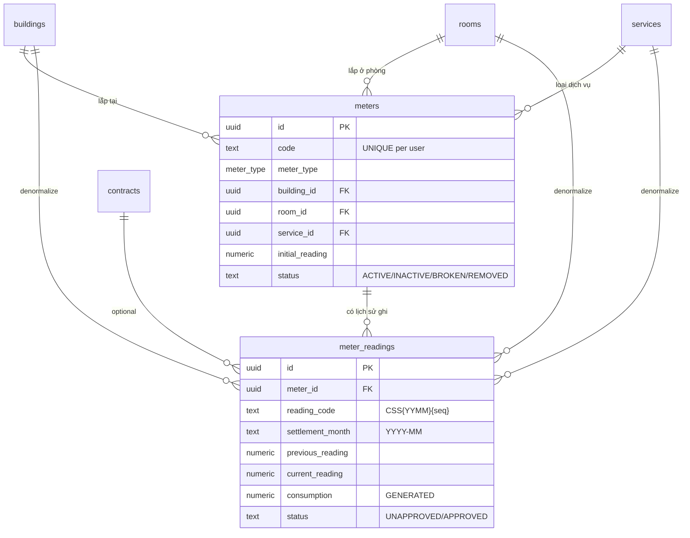
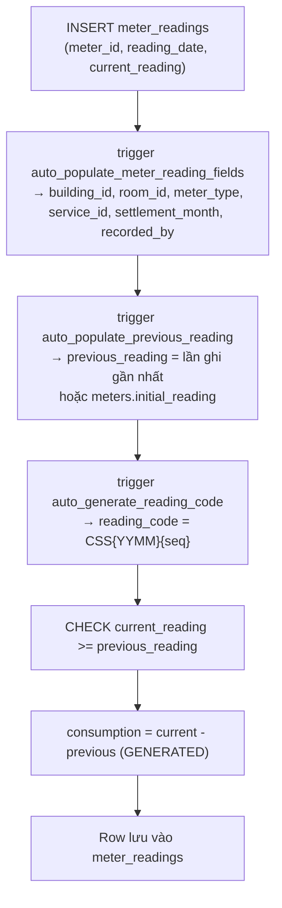
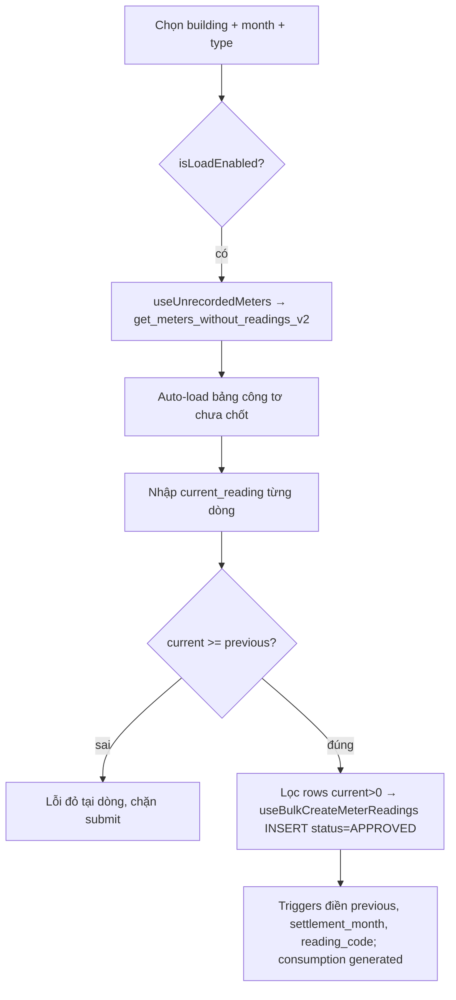

# Công tơ & Ghi chỉ số (Meters & Meter Readings)

> Domain quản lý **đồng hồ điện/nước/gas** gắn theo phòng và quy trình **ghi → (duyệt) → chốt chỉ số** để tính tiêu thụ, từ đó lên **hoá đơn tiền điện/nước** theo đơn giá đồng hồ.

---

## 1. Tổng quan & vai trò nghiệp vụ

Domain này là **cầu nối giữa hạ tầng vật lý (đồng hồ trong phòng) và doanh thu dịch vụ biến đổi theo mức dùng**. Nó nằm ở khúc giữa của vòng đời vận hành:

```
… HĐ (contract) → [Ghi chỉ số hằng tháng] → consumption → [Lên hoá đơn điện/nước] → thu tiền → báo cáo …
```

Hai thực thể trung tâm:

- **`meters`** — *Công tơ vật lý*: mỗi đồng hồ điện/nước/gas được lắp ở một phòng (`room_id`) trong một toà nhà (`building_id`), gắn với một `service` (Điện / Nước / Gas). Đây là **danh mục** (master data), quản lý ở trang Cài đặt.
- **`meter_readings`** — *Lần ghi chỉ số*: mỗi tháng người vận hành đọc đồng hồ, nhập `current_reading`. Hệ thống tự suy ra `previous_reading` (từ lần ghi trước hoặc `initial_reading`), và **`consumption = current − previous`** (cột generated). Mỗi bản ghi có trạng thái duyệt (`UNAPPROVED`/`APPROVED`).

Vai trò nghiệp vụ:

1. **Theo dõi tiêu thụ** điện/nước/gas theo phòng theo tháng (`settlement_month`).
2. **Cung cấp dữ liệu đầu vào cho hoá đơn**: chỉ những chỉ số **đã duyệt (APPROVED)** mới được chọn để dựng dòng hoá đơn dịch vụ có `pricing_type = DON_GIA_CO_DINH_DONG_HO` (đơn giá cố định theo đồng hồ). Số tiền dòng = `consumption × unit_price`.
3. **Phát hiện công tơ chưa chốt** trong tháng (`get_meters_without_readings_v2`) để nhắc người vận hành đi đọc số.

> Lưu ý về "duyệt": Mặc dù schema có đầy đủ workflow `UNAPPROVED → APPROVED` (RPC `approve_meter_reading`, `bulk_approve_*`), **frontend hiện tại chạy ở chế độ auto-approve**: hook `useCreateMeterReading`/`useBulkCreateMeterReadings` insert thẳng với `status='APPROVED'` (xem mục 4.7). Các helper `canEditReading`/`canDeleteReading` luôn trả `true`. Phần workflow duyệt vẫn tồn tại ở tầng DB/RPC như một "khả năng dự phòng".

---

## 2. Cấu trúc dữ liệu

### 2.1. Bảng `meters` — Công tơ

Nguồn: [`20250130000001_meter_reading_full_reimplementation.sql`](supabase/migrations/20250130000001_meter_reading_full_reimplementation.sql)

Mục đích: lưu **đồng hồ vật lý** lắp trong phòng. Là master data, mỗi `(user_id, code)` là duy nhất.

Cột chủ chốt (ý nghĩa nghiệp vụ):

| Cột | Ý nghĩa & ràng buộc |
|-----|----------------------|
| `code` | Mã công tơ (VD `CTD-201`, `CTN-201`). `NOT NULL`, `char_length > 0`, **UNIQUE theo `(user_id, code)`** → trùng mã trả lỗi PG `23505` ("Mã công tơ đã tồn tại"). |
| `meter_type` | Enum `meter_type` (`ELECTRICITY`/`WATER`/`GAS`/`OTHER`). UI chỉ cho chọn 3 loại đầu. |
| `name` | Tên hiển thị; **auto-sinh** nếu bỏ trống: `"{tên phòng} - {nhãn loại}"` (trigger `auto_generate_meter_name`). |
| `building_id` / `room_id` | Vị trí lắp đặt. `building_id` NOT NULL; `room_id` nullable (đồng hồ dùng chung). |
| `service_id` | Dịch vụ tương ứng (Điện/Nước/Gas). NOT NULL, `ON DELETE RESTRICT`. Frontend **tự resolve** từ `meter_type` → tên service (`resolveServiceId` trong [`useMeters.ts`](src/hooks/useMeters.ts)). |
| `initial_reading` | Chỉ số gốc lúc lắp đặt, default 0, CHECK `>= 0`. Dùng làm `previous_reading` cho lần ghi đầu tiên khi chưa có lịch sử. |
| `status` | TEXT, default `ACTIVE`, CHECK ∈ `ACTIVE/INACTIVE/BROKEN/REMOVED`. Chỉ `ACTIVE` mới xuất hiện trong "công tơ chưa chốt". |
| `installation_date`, `location_note`, `manufacturer`, `model`, `serial_number`, `notes` | Metadata bổ sung (form chỉ nhập `installation_date` + `location_note`). |
| `id`, `user_id`, `created_at`, `updated_at`, `deleted_at` | Khoá/audit chuẩn. `deleted_at` = soft-delete (mọi query lọc `IS NULL`). |

Quan hệ FK (đi ra):
- `building_id → buildings.id` (domain Toà nhà & Phòng), `ON DELETE CASCADE`
- `room_id → rooms.id`, `ON DELETE SET NULL`
- `service_id → services.id` (domain Dịch vụ & Giá), `ON DELETE RESTRICT`
- `user_id → auth.users.id`

Được tham chiếu bởi: `meter_readings.meter_id`.

### 2.2. Bảng `meter_readings` — Lần ghi chỉ số

Mục đích: mỗi dòng là **một lần đọc số** của một công tơ trong một tháng.

Cột chủ chốt:

| Cột | Ý nghĩa & ràng buộc |
|-----|----------------------|
| `meter_id` | Trỏ về công tơ. Nullable trên schema nhưng luôn được set khi tạo qua UI. `ON DELETE CASCADE`. |
| `reading_code` | Mã chỉ số duy nhất, format **`CSS{YYMM}{seq 5 chữ số}`** (VD `CSS250700001`). UNIQUE (partial index). Auto-sinh bởi trigger nếu bỏ trống. |
| `meter_type`, `building_id`, `room_id`, `service_id` | **Auto-populate từ `meter_id`** (trigger `auto_populate_meter_reading_fields`) — denormalize để query/filter nhanh không cần JOIN. |
| `settlement_month` | TEXT `YYYY-MM`. **Auto-set từ `reading_date`** (trigger). Là khoá nghiệp vụ để xác định "đã chốt tháng này chưa" và để chọn chỉ số khi lên hoá đơn. |
| `reading_date` | Ngày chốt, `NOT NULL`. |
| `previous_reading` | Chỉ số đầu, `NOT NULL` default 0. **Auto-populate** (trigger `auto_populate_previous_reading`): lấy `current_reading` của lần ghi gần nhất cùng `meter_id`, fallback `meters.initial_reading`, fallback 0. |
| `current_reading` | Chỉ số mới đọc được, `NOT NULL`. CHECK **`current_reading >= previous_reading`** (không cho tụt số). |
| `consumption` | **GENERATED ALWAYS AS (`current_reading - previous_reading`) STORED** — số tiêu thụ, không ghi tay được. |
| `status` | TEXT default `UNAPPROVED`, CHECK ∈ `UNAPPROVED/APPROVED`. (Thực tế frontend tạo thẳng `APPROVED`.) |
| `approved_by`, `approved_at` | Người/lúc duyệt. |
| `recorded_by` | Người ghi — **auto-set = `auth.uid()`** (trigger). |
| `contract_id` | Liên kết HĐ (legacy/optional), `ON DELETE CASCADE`. Không bắt buộc; chỉ số gắn theo phòng+tháng là chính. |
| `notes`, `meter_image_url` | Ghi chú + ảnh chụp mặt đồng hồ (lưu bucket private `meter-images`, hiển thị qua `StorageImage`/signed URL). |
| `id`, `user_id`, `created_at`, `updated_at`, `deleted_at` | Khoá/audit chuẩn. `deleted_at` = soft-delete. |

Enum dùng: `meter_type` (`ELECTRICITY/WATER/GAS/OTHER`).

Quan hệ FK (đi ra):
- `meter_id → meters.id`
- `contract_id → contracts.id` (domain Hợp đồng)
- `service_id → services.id` (domain Dịch vụ)
- `building_id → buildings.id`, `room_id → rooms.id` (domain Toà nhà & Phòng)
- `approved_by`, `recorded_by`, `user_id → auth.users.id`

---

## 3. Sơ đồ quan hệ dữ liệu



Luồng dữ liệu khi insert một `meter_reading` (chuỗi trigger BEFORE INSERT):



---

## 4. Quy tắc nghiệp vụ & tự động hoá

### 4.1. Trigger `auto_populate_meter_reading_fields` (BEFORE INSERT trên `meter_readings`)
Nguồn: [`20250130000003_meter_reading_triggers.sql`](supabase/migrations/20250130000003_meter_reading_triggers.sql).
- Từ `NEW.meter_id` → SELECT `meters` → gán `building_id`, `room_id`, `meter_type`, `service_id` vào row mới (denormalize).
- `settlement_month := TO_CHAR(reading_date, 'YYYY-MM')`.
- `recorded_by := auth.uid()`.
- **Invariant:** mọi reading luôn có vị trí + loại đồng nhất với công tơ tại thời điểm ghi; `settlement_month` luôn khớp tháng của `reading_date`.

### 4.2. Trigger `auto_populate_previous_reading` (BEFORE INSERT)
- Lấy `current_reading` của lần ghi **gần nhất** cùng `meter_id` (`ORDER BY reading_date DESC, created_at DESC LIMIT 1`, chỉ tính `deleted_at IS NULL`).
- Nếu chưa có lịch sử → dùng `meters.initial_reading`; nếu null → 0.
- **Invariant:** chuỗi chỉ số liền mạch — `previous_reading` của lần này = `current_reading` lần trước, không có khoảng hở.

### 4.3. Trigger `auto_generate_reading_code` (BEFORE INSERT)
- Bỏ qua nếu `reading_code` đã có giá trị.
- `prefix = 'CSS' || TO_CHAR(reading_date, 'YYMM')`; `seq = COUNT(*) + 1` các reading cùng `user_id` + cùng prefix; kết quả `prefix || LPAD(seq, 5, '0')`.
- **Lưu ý kỹ thuật:** sequence tính bằng `COUNT(*)+1`, không khoá hàng → về lý thuyết có thể đụng UNIQUE index `reading_code` nếu hai insert song song cùng prefix; trong import hàng loạt các row insert tuần tự trong vòng lặp nên thực tế an toàn.

### 4.4. Trigger `auto_generate_meter_name` (BEFORE INSERT trên `meters`)
- Bỏ qua nếu `name` đã có.
- Tra `rooms.name`, map nhãn (`ELECTRICITY→Điện`, `WATER→Nước`, `GAS→Gas`) → `name = "{room} - {nhãn}"` (không có phòng thì chỉ nhãn).

### 4.5. Trigger `updated_at` — dùng chung `update_updated_at_column()` cho cả 2 bảng (BEFORE UPDATE).

### 4.6. Cột generated `consumption`
- `consumption = current_reading - previous_reading` (STORED). **Không thể** ghi tay; mọi nơi (stats, hoá đơn) đọc trực tiếp.
- Kết hợp CHECK `current >= previous` ⇒ **invariant: `consumption >= 0`**.

### 4.7. RPC duyệt / tạo

| RPC | Security | Tác động |
|-----|----------|----------|
| `approve_meter_reading(p_reading_id)` | DEFINER | Set `status='APPROVED'`, `approved_by=auth.uid()`, `approved_at=NOW()`. RAISE nếu không tìm thấy / đã duyệt. |
| `bulk_approve_meter_readings(p_reading_ids[])` | DEFINER | Chỉ update các row đang `UNAPPROVED`; trả về số dòng đã duyệt. |
| `bulk_create_meter_readings(p_readings jsonb)` | DEFINER | Dùng cho **import Excel**. Mỗi phần tử `{meter_code, reading_date, current_reading, notes?}`: tra `meters` theo `code + auth.uid()`, INSERT (để các trigger tự điền). Trả mảng `{meter_code, reading_id, reading_code, success, error_message}` — **lỗi từng dòng được bắt riêng** (`EXCEPTION WHEN OTHERS`), 1 dòng hỏng không làm hỏng cả lô. |

Nguồn: [`20250130000004_meter_reading_rpc_functions.sql`](supabase/migrations/20250130000004_meter_reading_rpc_functions.sql).

> **Khác biệt thực tế giữa hook và RPC:** hook `useCreateMeterReading`/`useBulkCreateMeterReadings` **không** dùng `bulk_create_meter_readings`; chúng `INSERT` trực tiếp vào bảng với `status='APPROVED'`, `approved_by/approved_at` set ngay. RPC `bulk_create_meter_readings` chỉ được hook `useImportMeterReadings` (luồng Import) gọi và tạo row `UNAPPROVED`. Helper `createMeterReadingPayload` (pure) thì tạo payload `UNAPPROVED` — dùng cho test, không phải đường chạy thật.

### 4.8. RPC thống kê `get_meter_reading_stats(p_building_id?, p_month?)` (INVOKER)
- Đếm `total_readings`, `unapproved_count`, `approved_count` và SUM `consumption` theo từng loại (`electricity/water/gas_consumption`).
- Lọc theo `user_id = auth.uid()`, `deleted_at IS NULL`, optional building + month.
- Trả về 1 dòng; hook `useMeterReadingStats` map vào card thống kê.

### 4.9. RPC tìm công tơ chưa chốt

- **`get_meters_without_readings(p_user_id, …)`** (v1, INVOKER): trả các công tơ `ACTIVE` chưa có reading cho `p_month` (kèm `last_reading`, `last_reading_date`). Lọc theo building/room/meter_type tuỳ chọn.
- **`get_meters_without_readings_v2(p_building_id?, p_room_id?, p_meter_type?, p_month?)`** (DEFINER, RBAC) — bản frontend dùng. Nguồn: [`20260528000002_rbac_batch_c_rpc_v2.sql`](supabase/migrations/20260528000002_rbac_batch_c_rpc_v2.sql).
  - Không nhận `p_user_id`; thay vào đó: nếu có `building_id` → kiểm `can_access_building(building_id)` (RAISE nếu không có quyền) rồi lấy owner của building; nếu không có building → super_admin lấy owner đầu tiên, staff lấy owner đầu tiên trong `staff_assignments`.
  - Sau đó **delegate** xuống v1 với owner đã resolve.
  - Hook `useUnrecordedMeters` ([`useMeters.ts`](src/hooks/useMeters.ts)) gọi bản v2; field trả về dùng tên `code/name/meter_type` (khác v1 dùng `meter_code/meter_name/meter_type_value`).

### 4.10. RLS & cấp quyền
Nguồn RLS gốc: [`20250130000001_meter_reading_full_reimplementation.sql`](supabase/migrations/20250130000001_meter_reading_full_reimplementation.sql).
- Cả `meters` và `meter_readings` bật RLS với policy **`auth.uid() = user_id`** cho SELECT/INSERT/UPDATE/DELETE (meters SELECT thêm `deleted_at IS NULL`).
- Đây là **multi-tenant theo owner ở tầng bảng**: mỗi user chỉ thấy dữ liệu của mình. Mở rộng phân quyền theo toà nhà cho staff được áp ở tầng RPC v2 (qua `can_access_building`), không phải qua RLS của bảng meters.
- Hardening security: [`20260601000100_sec_contract_rpc_authz_and_anon_revoke.sql`](supabase/migrations/20260601000100_sec_contract_rpc_authz_and_anon_revoke.sql) `ALTER FUNCTION … SET search_path = public` cho `approve_meter_reading`, `bulk_approve_meter_readings`, `bulk_create_meter_readings` (chống "search_path mutable").

### 4.11. Views

- **`meter_readings_detailed`** — JOIN reading với `meters` (code/name), `buildings`, `rooms`, `services`, `auth.users` (email người duyệt + người ghi). Lọc `deleted_at IS NULL`, sort `reading_date DESC`. Là nguồn cho danh sách + filter trang Ghi chỉ số. Nguồn: [`20250130000002_meter_reading_views.sql`](supabase/migrations/20250130000002_meter_reading_views.sql).
- **`meters_with_latest_reading`** — JOIN `meters` với building/room/service + subquery `latest_reading`, `latest_reading_date`, `total_readings`. Là nguồn cho trang quản lý Công tơ.

---

## 5. Quy trình theo từng trang

### 5.1. Trang **Ghi chỉ số** — `/meter-readings`
File: [`MeterReadingsPage.tsx`](src/pages/meter-readings/MeterReadingsPage.tsx). Menu: *Tài chính → Ghi chỉ số*.

Mục đích: danh sách + thống kê + thêm/sửa/xoá/import chỉ số theo tháng.

Dữ liệu hiển thị:
- **Stats** (`MeterReadingStats` → hook `useMeterReadingStats` → RPC `get_meter_reading_stats`): 5 card — Công tơ chưa chốt (hiển thị `total_readings`), Chỉ số đã duyệt, chưa duyệt, Tổng tiêu thụ điện (kWh), nước (m³).
- **Danh sách** (`MeterReadingList` → hook `useMeterReadingsList` → view `meter_readings_detailed`), phân trang 20/trang qua `.range()`, lọc `building_id`/`room_id`/`meter_type`/`settlement_month`/`status`, sort `reading_date DESC`. Mỗi dòng: mã + badge trạng thái, công tơ, chỉ số đầu/cuối, **số tiêu thụ**, ngày chốt, người chốt.

Thao tác chính (từng bước):

**A. Thêm chỉ số** (nút "Thêm chỉ số" → `MeterReadingForm` chế độ tạo, [`MeterReadingForm.tsx`](src/components/meter-readings/MeterReadingForm.tsx)):
1. Chọn **Tòa nhà** (bắt buộc), **Phòng** (tuỳ chọn — mặc định "Tất cả phòng"), **Loại công tơ** (Điện/Nước), **Tháng chốt** (`YYYY-MM`), **Ngày chốt**.
2. Khi đủ điều kiện (`isLoadEnabled`: có building + month), form gọi `useUnrecordedMeters` → RPC `get_meters_without_readings_v2` và **auto-load** danh sách công tơ chưa chốt vào bảng (mỗi dòng có "Chỉ số đầu" = `last_reading`, ô nhập "Chỉ số mới", ghi chú, upload ảnh).
3. Nhập chỉ số mới cho từng đồng hồ. Validate client (`validateReadingValue`): `current_reading >= previous` → nếu sai hiện lỗi đỏ tại dòng, chặn submit.
4. Submit → lọc các dòng `current_reading > 0` → `useBulkCreateMeterReadings` **INSERT thẳng** với `status='APPROVED'`. Các trigger DB điền `previous_reading`, `settlement_month`, `reading_code`, `consumption`. Nếu không có dòng > 0 → toast "Vui lòng nhập ít nhất 1 chỉ số".



**B. Sửa chỉ số** (menu "Cập nhật" → form chế độ edit):
- Building/Phòng/Loại/Tháng **disabled** (chỉ sửa được `current_reading`, `reading_date`, `notes`, ảnh).
- Submit → `useUpdateMeterReading` UPDATE 1 row. (Lưu ý: `previous_reading`/`settlement_month` không re-tính khi sửa — vì trigger là BEFORE INSERT, không chạy lại trên UPDATE.)

**C. Xoá** (menu "Xoá" → AlertDialog xác nhận) → `useDeleteMeterReading` soft-delete (`deleted_at = now()`).

**D. Xoá hàng loạt** (`MeterReadingActions`, [`MeterReadingActions.tsx`](src/components/meter-readings/MeterReadingActions.tsx)): chọn nhiều dòng → "Xoá hàng loạt" → `useBulkDeleteMeterReadings` set `deleted_at` cho mảng id.

**E. Import Excel** (nút "Import" → `MeterReadingImportDialog`) → `useImportMeterReadings` → RPC `bulk_create_meter_readings` (tra công tơ theo `meter_code`, tạo row `UNAPPROVED`, trả kết quả từng dòng; toast tổng kết "X thành công, Y lỗi"). Validate trước bằng `validateImportRows`/`excelImportRowSchema`.

Edge case:
- Filter đổi → reset selection + về trang 1.
- Không có công tơ chưa chốt cho bộ lọc → toast "Không có công tơ chưa chốt…" + bảng rỗng.
- Tất cả query lỗi → hook trả mảng rỗng/`{data:[],totalCount:0}` (không crash UI).

### 5.2. Trang **Đồng hồ Công tơ** — `/settings/meters`
File: [`MetersPage.tsx`](src/pages/settings/MetersPage.tsx). Menu: *Cài đặt → Danh mục khác → Tài chính → Đồng hồ Công tơ*. (Route cũ `/settings/categories/meters` redirect về đây.)

Mục đích: quản lý danh mục đồng hồ.

Dữ liệu: `useMetersWithLatestReading` (view `meters_with_latest_reading`) → danh sách phẳng, **lọc client-side** theo building + meter_type (bằng `SearchableSelect` gõ-để-tìm). Mỗi dòng hiển thị kèm `latest_reading`, `latest_reading_date`, `total_readings`.

Thao tác (từng bước, qua `MeterForm` [`MeterForm.tsx`](src/components/meters/MeterForm.tsx)):

**A. Thêm công tơ:**
1. Nhập **Tòa nhà** (bắt buộc), **Phòng** (bắt buộc — phụ thuộc toà nhà), **Loại công tơ** (Điện/Nước/Gas), **Mã công tơ** (bắt buộc), + tuỳ chọn Chỉ số ban đầu, Ngày lắp đặt, Ghi chú vị trí. Validate bằng `meterFormSchema`.
2. Submit → `useCreateMeter`: lấy `auth.uid()`, **`resolveServiceId(meter_type)`** (tra `services` theo tên "Điện/Nước/Gas" → `service_id`; không thấy → toast lỗi & dừng), INSERT meters với `user_id` + `service_id`. Trigger `auto_generate_meter_name` điền `name` nếu trống.
3. Trùng mã (PG `23505`) → set lỗi field "Mã công tơ đã tồn tại".

**B. Sửa công tơ** → `useUpdateMeter` (nếu đổi `meter_type` thì re-resolve `service_id`).

**C. Xoá** → `useDeleteMeter` soft-delete (`deleted_at`).

Edge case: nếu hệ thống chưa có service "Điện/Nước/Gas" tương ứng thì không tạo được công tơ (ràng buộc `service_id NOT NULL`).

---

## 6. Liên kết sang domain khác (vào / ra)

**Vào (domain khác cung cấp cho meters/readings):**
- **Toà nhà & Phòng** (`buildings`, `rooms`): công tơ và chỉ số gắn `building_id`/`room_id`. Form lấy danh sách qua `useBuildings`/`useRooms`.
- **Dịch vụ & Giá** (`services`): mỗi công tơ phải map tới một service (Điện/Nước/Gas) qua `service_id`; frontend resolve theo tên service.
- **Hợp đồng** (`contracts`): `meter_readings.contract_id` (optional, legacy) cho phép gắn reading vào HĐ.
- **RBAC/Phân quyền** (`staff_assignments`, `can_access_building`, `is_super_admin`): RPC v2 `get_meters_without_readings_v2` dùng để xác định owner & quyền truy cập building cho staff.

**Ra (meters/readings cung cấp cho domain khác):**
- **Hoá đơn** (`invoices`/`invoice_items`): đây là liên kết quan trọng nhất. Khi dựng dòng hoá đơn cho dịch vụ `pricing_type = DON_GIA_CO_DINH_DONG_HO` (đơn giá cố định theo đồng hồ), người dùng chọn **chỉ số đã duyệt** của phòng+tháng qua `MeterReadingSelector` ([`MeterReadingSelector.tsx`](src/components/invoices/MeterReadingSelector.tsx)):
  - Query `useMeterReadingsList({room_id, month, status:'APPROVED', meter_type})` → lọc bằng `getApprovedReadingsForInvoice`.
  - Số tiền dòng = `calculateInvoiceAmount(consumption, unit_price)` = `consumption × unit_price`; mô tả dòng dạng `"Điện (prev → curr): {consumption} kWh"`.
  - Nếu **chưa có chỉ số đã duyệt** cho phòng/tháng → hiện nút "Chốt công tơ" điều hướng về `/meter-readings`.
  - `firstInvoiceBuilder.ts` đánh dấu `DON_GIA_CO_DINH_DONG_HO` (và `DON_GIA_BIEN_DONG`) là `METERED_PRICING` để biết dòng nào cần dữ liệu đồng hồ.

> Tóm tắt vị trí trong end-to-end: **HĐ ký xong → hằng tháng ghi chỉ số (domain này) → consumption đã duyệt → lên hoá đơn điện/nước → thu tiền → báo cáo doanh thu**.
