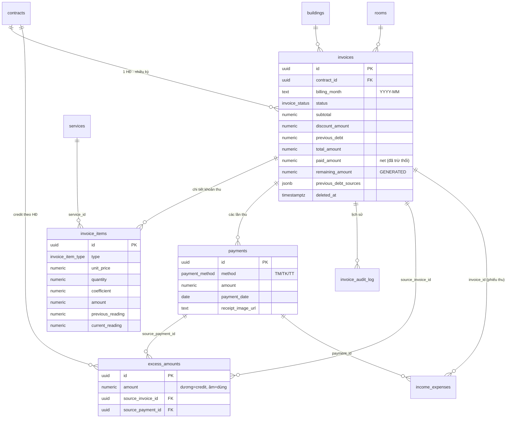
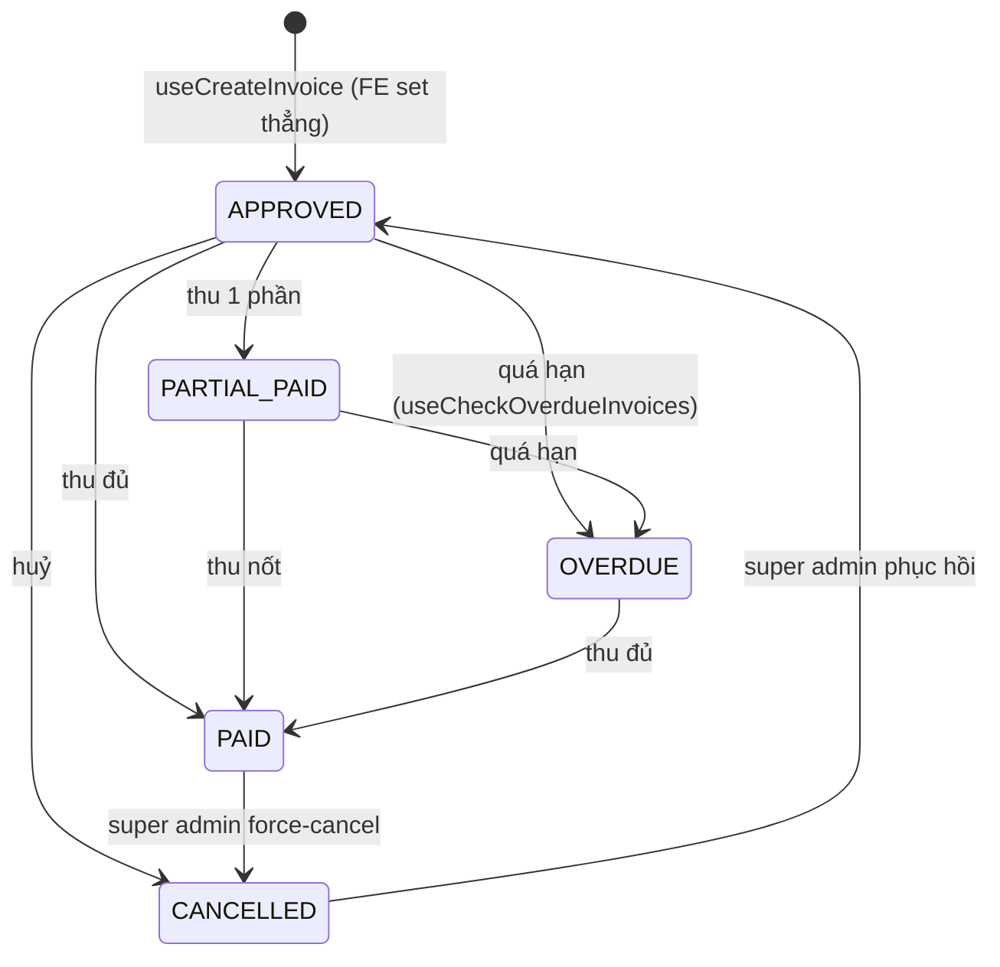
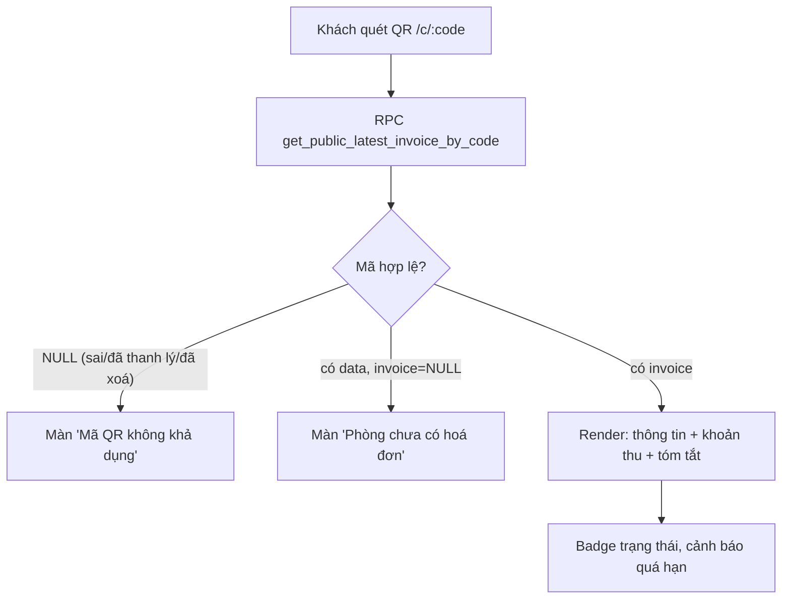
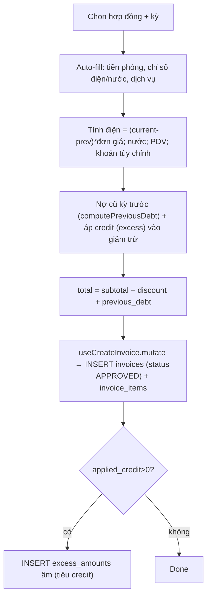

# Hoá đơn & Thu tiền hoá đơn (Invoices & Payments)

> Domain quản lý **hoá đơn** phát hành cho từng hợp đồng theo kỳ (billing_month), việc **ghi nhận thanh toán** (payments), và các cơ chế phụ trợ: tiền thừa (credit), tiền thối, làm tròn, lịch sử audit, và trang công khai để khách quét QR xem hoá đơn.

---

## 1. Tổng quan & vai trò nghiệp vụ

Hoá đơn là **mắt xích trung tâm** giữa hợp đồng/chỉ số và dòng tiền thực:

```text
Hợp đồng (rent_price, dịch vụ)  ─┐
Chỉ số điện/nước (meter)        ─┼─►  HOÁ ĐƠN (invoices + invoice_items)
Nợ cũ kỳ trước / cọc / credit   ─┘          │
                                            ▼  ghi nhận thanh toán
                                      PAYMENTS  ──►  income_expenses (phiếu thu)
                                            │              │
                                            ▼              ▼
                                  status PAID/PARTIAL   sổ quỹ / báo cáo
```

Vai trò chính:

- **Phát hành hoá đơn** cho từng hợp đồng theo từng tháng (`billing_month` dạng `YYYY-MM`). Mỗi hợp đồng chỉ có **1 hoá đơn / kỳ** (unique index).
- **Tính tổng tiền** = tạm tính (tiền phòng + điện + nước + dịch vụ + khoản tùy chỉnh) − giảm trừ + nợ cũ kỳ trước.
- **Ghi nhận thanh toán** nhiều phương thức (TM/TK/TT), nhiều phần (partial), tự cập nhật trạng thái và **đẩy sang Thu chi** (mỗi payment ⇒ 1 phiếu thu `income_expenses`).
- Xử lý **biên ngoài lề**: tiền thừa (excess/credit), tiền thối, làm tròn tiền thiếu < 10K, hoàn trả hoá đơn thanh lý (total âm).
- **Audit log** mọi thao tác trên invoice/item/payment.
- **Trang công khai** cho khách quét QR (`/c/:code`) xem hoá đơn mới nhất mà không cần đăng nhập.

Một điểm thiết kế quan trọng: dù DB còn nguyên trạng thái `DRAFT/PENDING_APPROVAL`, **luồng tạo hoá đơn ở FE mặc định set thẳng `APPROVED`** (xem [useCreateInvoice](src/hooks/useInvoices.ts)). Hoá đơn sinh ra là sẵn sàng thu tiền, không qua bước duyệt thủ công.

---

## 2. Cấu trúc dữ liệu

### 2.1. `invoices` — Hoá đơn

Mục đích: bản ghi hoá đơn của 1 hợp đồng cho 1 kỳ (`billing_month`).

Các cột chủ chốt:

- **Định danh & sở hữu**: `user_id` (owner/chủ tenant — scope RLS), `contract_id`, `building_id`, `room_id` (đều NOT NULL — hoá đơn luôn gắn đủ ngữ cảnh toà/phòng/hợp đồng). `invoice_number` (text, sinh tự động), `creator_name` (snapshot tên người tạo).
- **Kỳ & ngày**: `billing_month` (NOT NULL, regex `^\d{4}-\d{2}$`), `issue_date` (mặc định hôm nay), `due_date` (NOT NULL, ràng buộc `issue_date <= due_date`), `paid_date` (set khi PAID).
- **Trạng thái**: `status` (enum `invoice_status`, mặc định `DRAFT` ở DB nhưng FE set `APPROVED`).
- **Số tiền** (numeric):
  - `subtotal` — tạm tính từ các item (`Σ unit_price·quantity·coefficient`).
  - `discount_amount` — giảm trừ (mình "nợ" khách), kèm `discount_notes`.
  - `previous_debt` — nợ cũ kỳ trước (khách nợ mình) cộng vào tổng, kèm `previous_debt_sources` (jsonb — danh sách nguồn nợ: từ hoá đơn cũ / cọc, mỗi phần tử `{type, id, amount, label}`).
  - `total_amount` = `subtotal − discount_amount + previous_debt` (CHECK `>= 0`).
  - `prepaid_amount` — trả trước (ít dùng trong luồng hiện tại).
  - `paid_amount` — **đã thu net** (đã trừ tiền thối/hoàn trả), do trigger recompute tính lại; CHECK `>= 0`.
  - `remaining_amount` — cột **GENERATED** `total_amount − paid_amount` (FE thường tự tính lại từ 2 cột kia).
- **Cờ & duyệt**: `electricity_prev_overridden` (đánh dấu chỉ số điện đầu kỳ bị nhập tay), `approved_at`/`approved_by`, `template_id` (mẫu in, FK `document_templates`).
- **Soft-delete**: `deleted_at`. Mọi query đều `.is('deleted_at', null)`.

Enum dùng: `invoice_status`.

FK đi ra: `contract_id → contracts`, `building_id → buildings`, `room_id → rooms`, `template_id → document_templates`.
Được tham chiếu bởi: `invoice_items.invoice_id`, `payments.invoice_id`, `invoice_audit_log.invoice_id`, `excess_amounts.source_invoice_id`, **`income_expenses.invoice_id`** (liên kết mạnh sang domain Thu chi).

**Bất biến quan trọng**: unique partial index `idx_invoices_unique_contract_billing (contract_id, billing_month) WHERE deleted_at IS NULL` ⇒ không thể có 2 hoá đơn còn sống cho cùng hợp đồng + kỳ. Lỗi vi phạm được FE dịch thành thông báo thân thiện.

### 2.2. `invoice_items` — Dòng khoản thu

Mục đích: chi tiết từng khoản trong hoá đơn (tiền phòng, điện, nước, dịch vụ, khoản khác).

Cột chủ chốt: `type` (enum `invoice_item_type`), `description`, `unit_price`, `quantity`, `coefficient`, `amount` (= `unit_price·quantity·coefficient`). Với khoản công tơ: `previous_reading`/`current_reading` (chỉ số đầu/cuối) và `from_date`/`to_date` (kỳ áp dụng). `service_id` (FK `services`, nullable — khoản tùy chỉnh không gắn service). `sort_order` để hiển thị.

Enum dùng: `invoice_item_type` (RENT, SERVICE, PENALTY, DISCOUNT, OTHER).

FK: `invoice_id → invoices` (ON DELETE CASCADE), `service_id → services`.

### 2.3. `payments` — Phiếu thanh toán

Mục đích: mỗi lần khách trả tiền cho 1 hoá đơn.

Cột chủ chốt: `invoice_id`, `amount` (CHECK `> 0`), `payment_method` (enum `payment_method`: **TM/TK/TT**), `payment_date` (mặc định hôm nay), `receipt_number`, `receipt_image_url` (ảnh chứng từ, bucket private), `notes`, `user_id` (scope RLS — = owner của invoice).

Enum dùng: `payment_method` (TM = tiền mặt, TK = tài khoản/chuyển khoản, TT = thanh toán — **giữ nguyên mã, không dịch**).

FK: `invoice_id → invoices` (ON DELETE **RESTRICT** — không thể xoá hoá đơn còn payment trừ khi hard-delete payment trước).
Được tham chiếu bởi: `excess_amounts.source_payment_id`, **`income_expenses.payment_id`**.

### 2.4. `excess_amounts` — Tiền thừa / credit theo hợp đồng

Mục đích: sổ ledger credit của hợp đồng. **Dương = credit thêm** (khách trả thừa, hoặc giữ tiền thối làm credit). **Âm = credit đã dùng** (áp vào giảm trừ hoá đơn sau).

Cột chủ chốt: `contract_id`, `amount` (có dấu), `description`, `source_invoice_id`, `source_payment_id` (truy nguồn). Tổng credit khả dụng = `Σ amount` (bỏ qua row có `source_invoice` đã soft-delete — auto rollback khi huỷ HĐ, xem [useExcessAmount](src/hooks/useInvoices.ts)).

FK: `contract_id → contracts`, `source_invoice_id → invoices` (ON DELETE SET NULL), `source_payment_id → payments` (ON DELETE SET NULL).

### 2.5. `invoice_audit_log` — Lịch sử thay đổi

Mục đích: nhật ký field-level cho mọi INSERT/UPDATE/DELETE trên `invoices`, `invoice_items`, `payments`.

Cột chủ chốt: `invoice_id` (gom theo hoá đơn), `entity` (`'invoice' | 'item' | 'payment'`), `entity_id`, `action` (`INSERT/UPDATE/DELETE`), `actor_id`/`actor_name` (lấy từ `auth.uid()` + `profiles.full_name`), `before`/`after` (jsonb snapshot), `changed_fields` (mảng tên cột đã đổi).

FK: `invoice_id → invoices` (ON DELETE CASCADE).

### 2.6. `invoice_generation_settings` — Cấu hình sinh hoá đơn tự động

Mục đích: cấu hình per-user cho sinh hoá đơn định kỳ. Cột: `auto_generate_enabled`, `generation_day` (ngày trong tháng), `due_days` (số ngày hạn thanh toán), `include_previous_debt`, `auto_approve`. (Bảng cấu hình, hiện chủ yếu là khung — luồng sinh HĐ thực tế ở FE đi qua [useCreateInvoice](src/hooks/useInvoices.ts) (tạo thủ công 1 HĐ hoặc lặp hàng loạt trong `ExcelInvoiceDialog`); RPC `generate_invoices_for_building_v2` tồn tại nhưng FE chưa gọi.)

---

## 3. Sơ đồ quan hệ dữ liệu



---

## 4. Quy tắc nghiệp vụ & tự động hoá

### 4.1. Enum trạng thái hoá đơn (`invoice_status`)

`DRAFT → PENDING_APPROVAL → APPROVED → PAID / PARTIAL_PAID / OVERDUE → CANCELLED`

Thực tế vận hành chỉ dùng một tập con:



- **PAID/PARTIAL_PAID/OVERDUE** do trigger recompute tính từ tổng payments — không set tay.
- **OVERDUE** được set bởi `useCheckOverdueInvoices` (chạy 1 lần khi mở trang): quét các HĐ `APPROVED/PARTIAL_PAID` có `due_date < hôm nay` → set `OVERDUE`.
- **CANCELLED** là trạng thái "đã huỷ" (soft cancel — vẫn còn trong DB).

### 4.2. Trigger sinh số hoá đơn — `generate_invoice_number_v2`

`BEFORE INSERT ON invoices`: nếu `invoice_number IS NULL`, sinh `<prefix>-<YYYY>-<seq 5 số>` (prefix lấy từ `settings.invoice_number_format`, mặc định `INV`). Seq = đếm số HĐ của user trong năm + 1. (FE [useCreateInvoice](src/hooks/useInvoices.ts) cũng tự sinh số qua `generateInvoiceNumber` rồi truyền vào — trigger chỉ là fallback.)

### 4.3. Trigger recompute paid_amount/status — `recompute_invoice_for_id`

Đây là **trái tim** của domain. Phiên bản hiện hành (migration `20260530000002`) tính:

1. `v_paid = Σ payments.amount` của hoá đơn.
2. `v_refunded = Σ (unit_price·quantity)` của các item thuộc **phiếu chi EXPENSE loại "Tiền thối" APPROVED** gắn `invoice_id` này.
3. `paid_amount = v_paid − v_refunded` (net).
4. Suy ra status:
   - Nếu HĐ đang **CANCELLED** → chỉ cập nhật `paid_amount`, **giữ nguyên CANCELLED** (không "hồi sinh" — tránh đụng unique index khi thanh lý bỏ cọc giữ tiền đã thu).
   - **Làm tròn tiền thiếu**: nếu `total > 0`, `paid > 0`, và `(total − paid) < 10.000` → `PAID` (paid_amount giữ đúng số thực thu, KHÔNG bump lên total).
   - `paid >= total` → `PAID`.
   - `0 < paid < total` → `PARTIAL_PAID`.
   - `paid = 0` → `APPROVED`.

Trigger gọi hàm này:

- `trg_payments_recompute_invoice` — AFTER INSERT/UPDATE/DELETE trên `payments`.
- `trg_voucher_recompute_invoice` — AFTER INS/UPD/DEL trên `income_expenses` (để bắt phiếu chi tiền thối / hoàn trả gắn `invoice_id`).
- `trg_voucher_item_recompute_invoice` — AFTER INS/UPD/DEL trên `income_expense_items`.

**Bất biến**: `invoices.paid_amount` luôn = net thu (đã trừ thối/hoàn) — UI không cần tự trừ. `remaining_amount` (generated) = `total − paid`.

### 4.4. RPC ghi nhận thanh toán — `record_invoice_payment_v2`

Chữ ký: `(p_invoice_id, p_amount, p_payment_method, p_payment_date, p_notes, p_receipt_image_url) → json`.

- **RBAC**: lookup invoice kèm `can_do_on_building('invoices','edit', building_id)` (không nhận `p_user_id` — quyền theo toà, super_admin thấy đủ).
- INSERT payment (trigger `set_user_id_audit` tự điền `user_id = auth.uid()`).
- Tính `v_new_paid = paid + amount`; nếu `>= total` → status `PAID`, set `paid_date`; nếu thừa (`excess > 0`) → INSERT `excess_amounts` (credit cho contract). Ngược lại `PARTIAL_PAID`.
- Trả `{payment_id, new_paid_amount, new_status, excess_amount}`.

> **Lưu ý song trùng với trigger**: RPC tự UPDATE status, NHƯNG trigger `trg_payments_recompute_invoice` cũng chạy sau INSERT payment và sẽ tính lại theo logic net (gồm tiền thối). Kết quả cuối cùng do trigger quyết định (chạy sau).

Bản v1 `record_invoice_payment(p_user_id, ...)` đã được nâng quyền (migration `20260512000002:63-69`): cho gọi khi `user_id = p_user_id` **HOẶC** `is_super_admin()` / `is_admin()` / `staff_can('invoices','edit', user_id)` — tức owner / super_admin / admin / staff có quyền edit đều ghi nhận được. Luồng **bulk** ([useBulkRecordPayment](src/hooks/useBulkRecordPayment.ts)) vẫn **không** dùng RPC mà insert thẳng `payments` + `income_expenses` rồi dựa vào trigger recompute — lý do còn lại theo **comment lịch sử** trong `useBulkRecordPayment.ts` (khi đó RPC còn check `WHERE user_id = p_user_id` chỉ owner); comment chưa cập nhật theo bản RPC mới đã mở quyền.

### 4.5. RPC sinh hoá đơn hàng loạt — `generate_invoices_for_building_v2`

Chữ ký: `(p_building_id, p_billing_month, p_invoice_type='RENT') → json`. Kiểm `can_do_on_building('invoices','create', building_id)` rồi **delegate v1** `generate_invoices_for_building(owner_id, ...)`.

> **Lưu ý lệch tham số**: v1 chỉ chấp nhận `p_invoice_type` thuộc `{rent_only, service_only, both}` và **RAISE EXCEPTION** nếu khác (`20260530000000:175-177`) — item RENT khi `rent_only`/`both`, item SERVICE khi `service_only`/`both`. Trong khi đó v2 mặc định `p_invoice_type='RENT'` (giá trị KHÔNG nằm trong tập hợp lệ của v1) ⇒ gọi v2 với default sẽ làm v1 raise. Cần truyền đúng `rent_only/service_only/both` khi delegate (khả năng lỗi nếu để default).

V1 lặp qua mọi hợp đồng `ACTIVE` của toà, **bỏ qua** hợp đồng đã có HĐ cùng kỳ, tạo HĐ `status='APPROVED'` (set luôn `approved_at = NOW()`, `approved_by = p_user_id` — sửa bởi `20260510000003_invoice_default_approved.sql`) + item RENT (và item SERVICE từ `contract_services` khi `invoice_type` gồm service), cập nhật `subtotal/total_amount`. Trả `{created_count, skipped_contracts[]}`.

### 4.6. RPC thống kê — `get_invoice_statistics_v2`

Trả các tổng (theo filter area/building/room/billing_month/status/payment_status), RBAC qua `can_access_building`:

- `total_amount/total_paid/total_remaining/total_count`, `total_refunded`.
- Bóc tách theo loại: `rent_amount/electric_amount/water_amount/pdv_amount`.
- Thu theo phương thức: `payment_tm/payment_tk/payment_tt`, `total_collected`.
- `change_amount` (tiền thối — từ `income_expenses.change_amount > 0`), `deposit_collected` (cọc đã thu — IE INCOME có item `is_deposit`, tách riêng không trộn TM/TK/TT).

Dùng bởi [useInvoiceStatistics](src/hooks/useInvoices.ts) → component `InvoiceStatsSummary`.

### 4.7. Audit triggers — `_invoice_audit_invoices/_items/_payments`

3 trigger AFTER INS/UPD/DEL ghi vào `invoice_audit_log`. Helper `_diff_changed_fields` so 2 jsonb để liệt kê field đổi. Trên `invoices` **bỏ qua** `updated_at/paid_amount/remaining_amount` (giảm nhiễu từ trigger recompute); chỉ ghi UPDATE khi có field "thật" đổi.

### 4.8. RPC super admin huỷ cưỡng chế — `super_admin_force_cancel_invoice`

Cho super admin huỷ HĐ ở **mọi trạng thái** (kể cả đã thanh toán). Cơ chế: kiểm `is_super_admin()` → DELETE `excess_amounts` nguồn từ HĐ → **hard-delete payments** (bypass FK RESTRICT nhờ SECURITY DEFINER; trigger sẽ reset paid_amount) → UPDATE status = `CANCELLED`. HĐ vẫn trong DB, có thể phục hồi (`CANCELLED → APPROVED` qua [useRestoreInvoice](src/hooks/useInvoices.ts)) nhưng **payments không khôi phục**.

### 4.9. RPC công khai — `get_public_latest_invoice_by_code` / `_by_contract`

- `_by_code(p_code)`: resolve `contracts.public_code` (mã 6 ký tự base-57, sinh tự động qua trigger `set_contract_public_code`) → `contract_id` → gọi `_by_contract`.
- `_by_contract(p_contract_id)`: trả HĐ mới nhất (`status NOT IN (DRAFT, CANCELLED)`, sort theo `billing_month DESC`) dạng jsonb. Trả **NULL** nếu HĐ không tồn tại / đã xoá / hợp đồng `TERMINATED`. Không expose `notes/contract_id/user_id`.
- Grant `anon, authenticated` cho `_by_code`; `_by_contract` đã **REVOKE** khỏi PUBLIC/anon (chỉ gọi nội bộ qua `_by_code`).

### 4.10. RLS

Bản gốc (`20250601`) là policy `auth.uid() = user_id`. Đã được nâng cấp dần sang RBAC (staff theo toà): các RPC `*_v2` chạy SECURITY DEFINER + `can_do_on_building`/`can_access_building`; thống kê thấy đủ data trong scope (kể cả HĐ do staff khác tạo). `invoice_audit_log` chỉ cho đọc audit của HĐ thuộc `user_id` của mình.

---

## 5. Quy trình theo từng trang (page)

### 5.1. `InvoicesPage` — Danh sách hoá đơn

- **Route**: `/invoices`. File [InvoicesPage.tsx](src/pages/invoices/InvoicesPage.tsx).
- **Mục đích**: liệt kê, lọc, tìm kiếm, và thực hiện các thao tác hàng loạt trên hoá đơn.
- **Dữ liệu hiển thị**:
  - [useInvoices](src/hooks/useInvoices.ts)(filters, pagination) — list + count, select kèm contract/building/room/items/payments. Lọc theo `building_id/area_id/room_ids/status/payment_status/billing_month/date_range/search`; mặc định `view_status='active'` ẩn HĐ `CANCELLED`.
  - [useInvoiceStatistics](src/hooks/useInvoices.ts) → `InvoiceStatsSummary` (tổng tiền, đã thu, TM/TK/TT, thối, cọc...).
  - Phân quyền: `useMyPermissions` (`can(perms,'invoices', create/edit/delete/record_payment)`); staff bị **khoá `area_id`** theo khu vực phụ trách (`ctx.defaultAreaId`).

- **Thao tác theo bước**:
  1. **Mở trang** → `useCheckOverdueInvoices` chạy 1 lần (ref guard) → set HĐ quá hạn thành `OVERDUE` → invalidate list/stats.
  2. **Lọc / tìm** → cập nhật `filters`, reset về page 1, clear selection.
  3. **Tạo hoá đơn** (nút Add, cần quyền `create`) → mở `GenerateInvoiceDialog` (xem 5.5).
  4. **Excel / hàng loạt** → `ExcelInvoiceDialog`: tạo HĐ hàng loạt bằng cách lặp [useCreateInvoice](src/hooks/useInvoices.ts) (insert từng HĐ + items, đọc/đối chiếu qua `.from('invoices')`) — **không** gọi RPC bulk. RPC `generate_invoices_for_building_v2` hiện không được FE gọi ở đâu (chỉ khai báo trong `types.ts`).
  5. **Ghi nhận thanh toán** từng dòng → `handleRecordPayment` → mở `RecordPaymentDialog` **hoặc** `RecordRefundDialog` (chọn theo dấu: nếu `total < 0` hoặc `paid > total` → refund).
  6. **Thu hàng loạt** → `BulkRecordPaymentDialog` → [useBulkRecordPayment](src/hooks/useBulkRecordPayment.ts). Chỉ chọn được HĐ `paid_amount === 0`.
  7. **Sửa** (`canEdit` + `canEditInvoice`) → `EditInvoiceDialog` → [useUpdateInvoice](src/hooks/useInvoices.ts) (chặn nếu trạng thái không cho sửa).
  8. **Xoá** → [useDeleteInvoice](src/hooks/useInvoices.ts) (soft-delete, `canDeleteInvoice` check); bulk xoá chỉ `DRAFT`.
  9. **Super admin**: `onRestore` (CANCELLED→APPROVED), `onForceCancel` → `SuperAdminForceDeleteDialog` → [useForceCancelInvoice](src/hooks/useInvoices.ts).
  10. **Xem chi tiết / lịch sử / payments** → điều hướng `/invoices/:id` hoặc mở `InvoiceHistoryDialog` / `PaymentsSummaryDialog`.

- **Edge case**: area không có toà nào → list trả rỗng ngay (không query); lỗi unique `(contract_id, billing_month)` → toast thân thiện; `payment_status='unpaid'` loại cả `PAID` lẫn `PARTIAL_PAID`.

### 5.2. `InvoiceDetailPage` — Chi tiết hoá đơn

- **Route**: `/invoices/:id`. File [InvoiceDetailPage.tsx](src/pages/invoices/InvoiceDetailPage.tsx).
- **Mục đích**: xem đầy đủ 1 hoá đơn — thông tin, các khoản, lịch sử thanh toán, tóm tắt thu/thối, và các action.
- **Dữ liệu**:
  - [useInvoice](src/hooks/useInvoices.ts)(id) — HĐ + relations.
  - Query phụ `invoice-vouchers`: các `income_expenses` APPROVED gắn `invoice_id` (phiếu thu INCOME / phiếu chi thối EXPENSE) để hiển thị breakdown từng phiếu (tổng thu +, tổng thối −).
- **Thao tác**:
  - **Ghi nhận thanh toán / Hoàn trả khách** (cần `record_payment`, status `APPROVED/PARTIAL_PAID/OVERDUE`): nút đổi nhãn/màu theo `isRefund` (total<0 hoặc paid>total) → mở dialog tương ứng.
  - **In hoá đơn** → `PrintInvoiceDialog` (dẫn sang `InvoicePrintPage`).
  - **QR hợp đồng** → `ContractQRDialog` (dùng `contract.public_code`, ẩn nếu HĐ `TERMINATED`).
  - **Sửa** (nếu `canEditInvoice`), **Huỷ** (`DRAFT/APPROVED`), **Phục hồi** (super admin, `CANCELLED`).
- **Hiển thị tài chính**: "Đã thanh toán net" = `paid_amount`; "Còn lại" = `total − paid`; cảnh báo PAID / quá hạn. Ảnh chứng từ payment qua `StorageImage` (signed URL, bucket private).
- **Edge case**: id rỗng / không tìm thấy → màn lỗi với nút quay lại; HĐ quá hạn highlight đỏ.

### 5.3. `InvoicePrintPage` — Bản in hoá đơn

- **Route**: `/invoices/print/:id` (App.tsx:237). File [InvoicePrintPage.tsx](src/pages/invoices/InvoicePrintPage.tsx). (Lưu ý: `PrintInvoiceDialog` render HTML in inline qua `window.open`, **không** điều hướng route này.)
- **Mục đích**: render layout in/PDF theo `template_id` (mẫu `document_templates` loại `INVOICE`). Dữ liệu lấy từ cùng hook invoice + relations.

### 5.4. `PublicContractInvoicePage` — Trang công khai (khách quét QR)

- **Route**: `/c/:code` (mã ngắn). File [PublicContractInvoicePage.tsx](src/pages/public/PublicContractInvoicePage.tsx).
- **Mục đích**: cho khách (không đăng nhập) xem **hoá đơn mới nhất** của hợp đồng.
- **Dữ liệu**: `useQuery` gọi RPC `get_public_latest_invoice_by_code({p_code})`.
- **Luồng hiển thị**:



- **Đặc điểm**: item `RENT` luôn hiển thị "Tiền phòng"; tách phần `(...)` cuối description thành note (vd "Tiền điện (8794 → 9200)"); các dòng điều chỉnh (Giảm trừ, Nợ cũ kỳ trước) chèn trước "Tổng cộng" để cộng khớp. Responsive desktop (grid 4 cột) / mobile (2 cột).
- **Edge case**: error hoặc data null → màn lỗi; HĐ `PAID` → alert xanh; quá hạn + còn nợ → alert đỏ.

### 5.5. Dialog tạo hoá đơn — `GenerateInvoiceDialog` (thao tác cốt lõi của trang list)

File [GenerateInvoiceDialog.tsx](src/components/invoices/GenerateInvoiceDialog.tsx). Đây là luồng **tạo 1 hoá đơn thủ công** (khác RPC bulk).



- **Validate (zod)**: `contract_id` bắt buộc, `billing_month` regex `YYYY-MM`, ngày phát hành/hạn bắt buộc, số lượng item > 0, giá `>= 0`.
- **Edge case**: nút Tạo bị **disable** nếu hợp đồng đã có HĐ cùng kỳ (`existingInvoice`); chỉ chọn được hợp đồng đang hiệu lực (`isContractInEffect` — gồm ACTIVE & EXTENDED).

### 5.6. Dialog ghi nhận thanh toán — `RecordPaymentDialog`

File [RecordPaymentDialog.tsx](src/components/invoices/RecordPaymentDialog.tsx) → [useRecordPaymentRPC](src/hooks/useInvoicePayments.ts).

Mỗi sub-line (TM/TK/TT) gọi `record_invoice_payment_v2` rồi insert kèm **1 phiếu thu `income_expenses` INCOME** (gắn `invoice_id`, `payment_id`, `account_id`, `creator_name`). Xử lý 3 cơ chế đặc biệt, tất cả là **metadata audit không trừ số dư**:

- **Tiền thối** (`change_amount` + `change_account_id`): khấu trừ vào line TM (`amount = line − change`), ghi note "Thu X – Thối Y". Validate: chỉ áp TM, `change ≤ tổng TM`.
- **Giữ credit** (`keep_as_credit`): không khấu trừ, insert `excess_amounts` dương cho contract.
- **Làm tròn thiếu** (`rounding_amount` + `rounding_account_id`): residual < 10K, gắn lên line cuối; trigger DB tự mark `PAID`.

`RecordRefundDialog` ([useRecordRefundRPC](src/hooks/useInvoicePayments.ts)) dùng cho HĐ thanh lý **total âm**: tạo phiếu chi EXPENSE loại "Hoàn trả thanh lý" với marker `[Hoàn trả thanh lý]` trong notes.

> **Khác biệt cần lưu ý (có thể là regression)**: bản `recompute_invoice_for_id` hiện hành (`20260530000002:41-50`) chỉ trừ refund qua phiếu chi EXPENSE có `income_expense_type.name = 'Tiền thối'`; nó **KHÔNG còn nhận diện marker `[Hoàn trả thanh lý]`** (logic đọc marker cũ ở `20260510000014` đã bị bỏ ở `20260527000061`). Trong khi đó FE `useRecordRefundRPC` vẫn ghi marker `[Hoàn trả thanh lý]` theo logic cũ (loại phiếu chi tên `'Hoàn trả thanh lý'`, không phải `'Tiền thối'`) ⇒ với recompute hiện tại, refund kiểu này sẽ **không** được cộng/trừ vào `paid_amount`. Chưa rõ là cố ý — cần đối chiếu lại FE/DB.

### 5.7. `InvoiceHistoryDialog` — Lịch sử audit

[useInvoiceHistory](src/hooks/useInvoiceHistory.ts) đọc `invoice_audit_log` theo `invoice_id`, sort mới nhất trước; hiển thị diff `changed_fields` + actor + thời gian.

---

## 6. Liên kết sang domain khác (vào/ra)

**Đi RA (domain này phụ thuộc / ghi sang):**

- → **Thu chi (income_expenses)**: liên kết mạnh nhất. Mỗi payment ⇒ 1 phiếu thu INCOME (`income_expenses.invoice_id` + `payment_id`). Phiếu chi loại **"Tiền thối"** gắn `invoice_id` được trigger recompute đọc ngược để trừ vào `paid_amount` net (xem §4.3 — bản recompute hiện chỉ đọc loại `'Tiền thối'`; phiếu chi marker `[Hoàn trả thanh lý]` mà FE vẫn ghi thì recompute hiện KHÔNG còn nhận diện — xem ghi chú §5.6). Sổ quỹ (`accounts`) nhận tiền qua `account_id` của phiếu thu.
- → **Hợp đồng (contracts)**: hoá đơn luôn gắn `contract_id`; tạo HĐ chỉ cho hợp đồng đang hiệu lực; `previous_debt_sources` truy nguồn nợ từ HĐ cũ / cọc. `contracts.public_code` cấp link QR công khai.
- → **Toà nhà / Phòng (buildings/rooms)**: scope RBAC (`can_do_on_building`, `area_id`), `default_account_id_tt/tk` của toà gợi ý sổ quỹ khi thu.
- → **Chỉ số công tơ (meter_readings) & Dịch vụ (services/contract_services)**: nguồn dữ liệu auto-fill khoản điện/nước/dịch vụ khi tạo HĐ; `invoice_items.service_id → services`.
- → **Cọc (deposits / contract_terminations)**: nợ cũ có thể trừ cọc; thanh lý bỏ cọc giữ tiền đã thu khiến HĐ tháng đó CANCELLED nhưng vẫn còn payment (lý do recompute giữ CANCELLED).
- → **Mẫu in (document_templates)**: `template_id` cho bản in.

**Đi VÀO (domain khác đọc/tham chiếu hoá đơn):**

- ← **Thu chi**: phiếu thu/chi tham chiếu `invoice_id`/`payment_id`; báo cáo doanh thu, sổ quỹ cộng dồn từ các phiếu này.
- ← **Báo cáo / Dashboard**: thống kê công nợ, đã thu theo TM/TK/TT, cọc — qua `get_invoice_statistics_v2`.
- ← **Trang công khai**: khách quét QR (`/c/:code`) đọc hoá đơn mới nhất.
- ← **Thông báo (notifications)**: enum `notification_type` có `NEW_INVOICE`, `PAYMENT_REMINDER`, `OVERDUE_INVOICE` — kích hoạt theo trạng thái/hạn hoá đơn.
