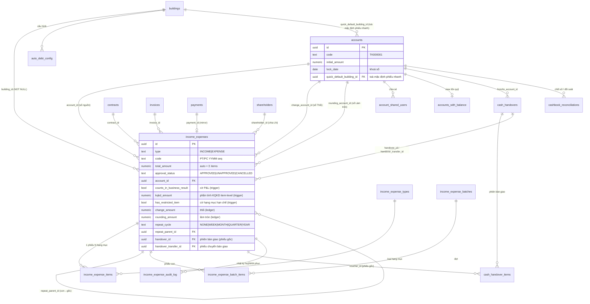
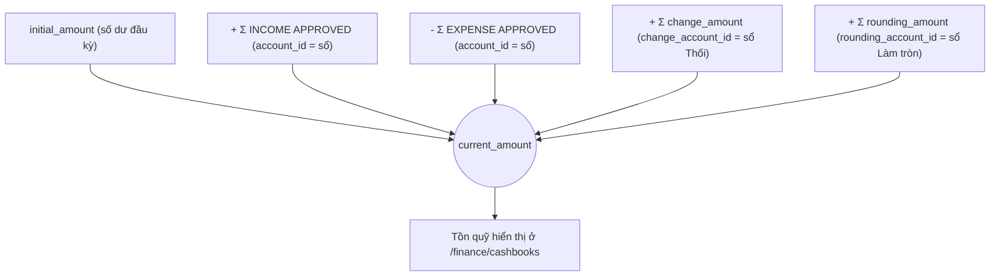
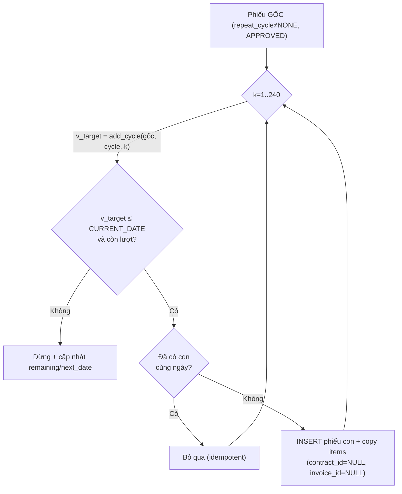
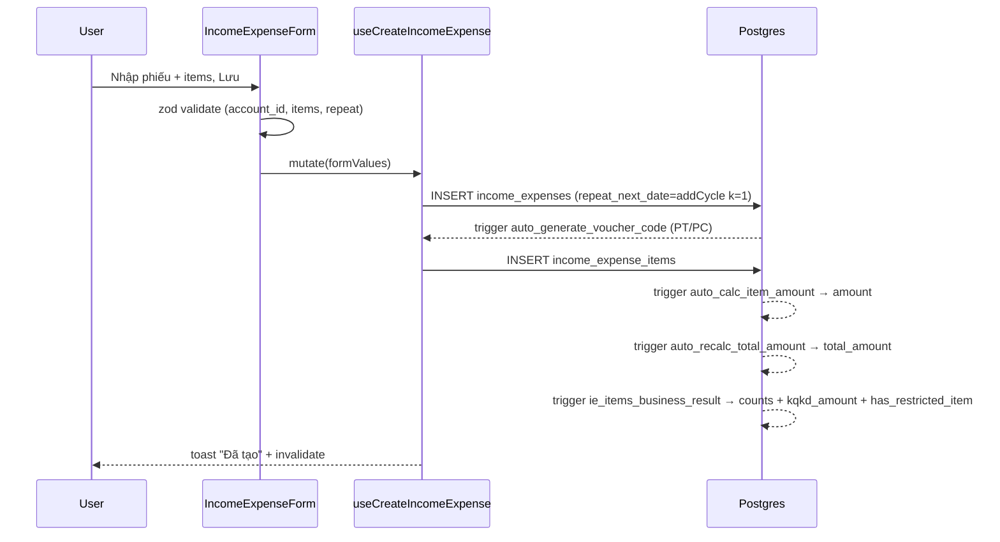

# Thu chi & Sổ quỹ (Income/Expenses · Accounts/Cashbooks)

> **Reviewed:** 2026-07-20. Thanh toán hoá đơn dùng writer atomic; approval canonical đã go-live, nhưng các flow batch/legacy khác trong domain vẫn phải đọc theo cảnh báo riêng.

> Domain trung tâm dòng tiền. Mọi tiền vào/ra hệ thống — thu HĐ, thanh toán hoá đơn,
> chi phí vận hành, hoàn/thối cọc, hoa hồng, chia lợi nhuận cổ đông — đều đáp xuống
> đây dưới dạng **phiếu thu/chi** (`income_expenses`) gắn vào một **sổ quỹ** (`accounts`).
> Số dư sổ quỹ (`accounts_with_balance.current_amount`) và mọi báo cáo lợi nhuận/dòng
> tiền đọc từ chính bảng này.

---

## 1. Tổng quan & vai trò nghiệp vụ

Hệ thống thu chi gồm 3 lớp dữ liệu:

1. **Phiếu thu/chi (`income_expenses`)** — chứng từ gốc. Mỗi phiếu có 1 `type` (`INCOME`/`EXPENSE`), gắn 1 toà nhà (`building_id` NOT NULL), tuỳ chọn gắn phòng/khách/HĐ/hoá đơn, và 1 **sổ quỹ** (`account_id`). `total_amount` **được tính tự động** = `SUM(items.amount)` qua trigger (không nhập tay).
2. **Hạng mục phiếu (`income_expense_items`)** — chi tiết từng dòng (loại × số lượng × đơn giá), có **kỳ áp dụng** `start_date`/`end_date`. Đây là nơi cấu hình hạch toán: **phần tiền** của item thuộc **loại cọc** (`income_expense_types.is_deposit = TRUE`) tự bị loại khỏi báo cáo Lợi nhuận (item-level qua `kqkd_amount` — phiếu TRỘN doanh thu + cọc chỉ tính phần không-cọc, §4.5).
3. **Sổ quỹ (`accounts`)** — ví/cashbook tiền mặt/ngân hàng/ví điện tử. Số dư = `initial_amount` + Σ thu APPROVED − Σ chi APPROVED + Σ thối + Σ làm tròn (view `accounts_with_balance`).

Các khái niệm phụ:

- **Phiếu tổng (batch)**: gộp N phiếu lẻ (mỗi hạng mục → 1 phiếu con) cho cùng 1 đợt thu/chi nhiều toà — `income_expense_batches` + junction `income_expense_batch_items`.
- **Phiếu lặp định kỳ (`repeat_*`)**: phiếu gốc tự đẻ phiếu con theo chu kỳ WEEK/MONTH/QUARTER/YEAR; có job pg_cron sinh hằng ngày.
- **Loại thu chi (`income_expense_types`)**: danh mục hạng mục, **per-user về dữ liệu** (mỗi owner có bộ riêng) nhưng **RLS đã mở cho mọi user authenticated** — xem §2.3. Có cờ `is_deposit`, nhóm `category`, cờ **`is_restricted`** (hạng mục HẠN CHẾ — ẩn thật bằng RLS RESTRICTIVE, §4.15) và cờ **`hide_in_report`** (hạng mục "đặc biệt" — cho phép ẩn dòng khỏi báo cáo Phân bổ LN, §4.16).
- **Mẫu in (`income_expense_templates`)** + **trang in A5** (`/income-expense/print/:id`).
- **Quyền "Mọi toà nhà"** (`income_expenses.all_buildings` trong JSONB permissions): cấp cho staff (vd kế toán) ghi thu chi cho MỌI toà của owner, gói gọn trong form thu chi — xem §4.13.
- **Tạo phiếu nhanh**: dialog nhập 1 dòng `(phòng) (tòa) (hạng mục) (ghi chú) (số tiền)` — xem §5.1.
- **Trang Thu tiền mặt mobile** (`/thu-tien`): lưới phòng theo toà + kỳ hoá đơn, thu đủ/thu một phần → tạo phiếu thu mirror vào domain này — xem §5.10.
- **Tiền thối** (`change_amount`/`change_account_id`) và **làm tròn tiền thiếu** (`rounding_amount`/`rounding_account_id`): ledger ghi nhận, **đã NET trong phiếu Thu**, không trừ thật khỏi số dư.
- **Gạch nợ tự động (`auto_debt_config`)**: cấu hình nhận diện chuyển khoản ngân hàng để tự gạch nợ (theo `bank_account` + `matching_rules`).
- **Sổ chia sẻ (`account_shared_users`)**: cho user khác thấy/ghi phiếu trên sổ không thuộc phạm vi RBAC toà nhà của họ.
- **Bàn giao tiền mặt (`cash_handovers` + `cash_handover_items`)**: quản lý/staff thu tiền hộ rồi bàn giao lại (cho chủ hoặc trong đội), xác nhận 2 phía; khi người nhận xác nhận, hệ thống sinh cặp phiếu chuyển nội bộ **1 phiếu CHI + 1 phiếu THU tổng** ngoài KQKD — xem §4.17 và HandoverSheet §5.10.
- **Đối soát / chốt số sổ (`cashbook_reconciliations`)** + 2 trang báo cáo `/reports/finance/ban-giao` (Bàn giao & đối soát) và `/reports/finance/thu-ban-giao` (Chu kỳ Thu → Bàn giao) — xem §5.11–§5.12.
- **Nhật ký thao tác phiếu (`income_expense_audit_log`)** + **khôi phục phiếu đã huỷ** (chỉ super admin, RPC `restore_income_expense`) — xem §4.18.

**Bất biến cốt lõi:**

- `total_amount` không bao giờ nhập tay — luôn = `SUM(items.amount)`; `items.amount` luôn = `quantity × unit_price` (đều do trigger).
- Chỉ phiếu `approval_status = 'APPROVED'` và `deleted_at IS NULL` mới đi vào số dư & báo cáo. Phiếu `CANCELLED`/`UNAPPROVED` không tính.
- Báo cáo Lợi nhuận/Phân bổ LN cộng **`kqkd_amount`** (phần tiền của phiếu được tính KQKD — **item-level**, do trigger tính, §4.5); `counts_in_business_result` vẫn tồn tại như cờ nhị phân cho filter/badge.
- `change_amount`/`rounding_amount` **không** trừ khỏi sổ tiền thật — chỉ cộng vào số dư của sổ ledger riêng (X Thối / Làm tròn).
- Phiếu nằm trong kỳ đã khoá sổ (`accounts.lock_date`) không được lập/sửa/xoá.

---

## 2. Cấu trúc dữ liệu

### 2.1 `income_expenses` — phiếu thu/chi (chứng từ gốc, ~48 cột)

Mục đích: chứng từ tiền vào/ra. Cột chủ chốt:

- **Phân loại & nhận diện**: `type` (`INCOME`/`EXPENSE`, text — KHÔNG phải enum), `code` (auto `PT{YYMM}{seq}` cho thu / `PC{YYMM}{seq}` cho chi, sinh per-user-per-month-per-type — **`YYMM` lấy theo THÁNG TẠO phiếu** `TO_CHAR(CURRENT_DATE,'YYMM')`, KHÔNG theo `voucher_date`: phiếu backdate tháng trước vẫn mang mã tháng hiện tại), `name`, `voucher_date` (ngày phát sinh — mọi báo cáo & số dư lấy theo cột này), `notes`.
- **Số tiền**: `total_amount` (auto = Σ items), `payer_name` (người nộp/nhận), `receive_bank_name`/`receive_bank_account` (TK nhận tiền in trên phiếu — KHÔNG phải FK sổ quỹ).
- **Sổ quỹ & gắn kết**: `account_id` → `accounts`, `building_id` (NOT NULL) → `buildings`, `room_id` → `rooms`, `tenant_id` → `tenants` (lưu ý: là bảng `tenants` legacy, KHÁC `customers`), `contract_id` → `contracts`, `invoice_id` → `invoices`, `payment_id` → `payments` (phiếu thu mirror từ thanh toán hoá đơn).
- **Trạng thái duyệt**: `approval_status` (text, mặc định `'APPROVED'` — phiếu tạo là duyệt ngay; giá trị khác: `UNAPPROVED` = nháp, `CANCELLED` = huỷ), `approved_by`/`approved_at`, `deleted_at` (soft delete), `creator_name`.
- **Hạch toán KQKD**: `business_result_accounting` (NULLABLE — `NULL` = tự động theo hạng mục cọc, `TRUE`/`FALSE` = override tay), `counts_in_business_result` (BOOLEAN NOT NULL — cờ nhị phân do trigger tính) và **`kqkd_amount`** (NUMERIC NOT NULL — **phần tiền của phiếu tính vào KQKD, item-level**, do trigger tính; báo cáo P&L cộng cột này — §4.5). Kèm **`has_restricted_item`** (BOOLEAN NOT NULL — cờ suy diễn "phiếu có ≥1 item thuộc hạng mục hạn chế", dùng cho RLS RESTRICTIVE §4.15).
- **Bàn giao tiền mặt**: `handover_id` → `cash_handovers` (phiếu GỐC đã vào phiên bàn giao — guard chặn sửa/xoá/hoàn tác) và `handover_transfer_id` → `cash_handovers` (đánh dấu phiếu CHUYỂN — cặp CHI/THU tổng do `confirm_cash_handover` sinh, §4.17).
- **Lương**: `salary_staff_id` → profiles (phiếu chi lương gắn nhân viên nhận lương — module Bảng lương, [17-luong-thuong.md](17-luong-thuong.md)).
- **Tiền thối / làm tròn** (metadata audit, KHÔNG đi vào balance trực tiếp của sổ nguồn): `change_amount` + `change_account_id` → sổ X Thối; `rounding_amount` + `rounding_account_id` → sổ "Làm tròn tiền thiếu".
- **Phiếu lặp** (`repeat_*`): `repeat_cycle` (`NONE`/`WEEK`/`MONTH`/`QUARTER`/`YEAR`), `repeat_infinity`, `repeat_count` (số phiếu CON sẽ sinh — gốc = kỳ #1), `repeat_remaining`, `repeat_next_date`, `repeat_parent_id` → `income_expenses` (self-FK, phiếu con trỏ về gốc).
- **Kiểm tra (verify)**: `verified_at`/`verified_by`/`verified_by_name`/`verified_note` — "đã kiểm" pháp lý nhẹ, độc lập với `approval_status`.
- **Cổ đông**: `shareholder_id` → `shareholders` (phiếu chi chia lợi nhuận cổ đông).

FK đi ra: `accounts` (×3: account_id, change_account_id, rounding_account_id), `buildings`, `rooms`, `tenants`, `contracts`, `invoices`, `payments`, `shareholders`, `cash_handovers` (×2: handover_id, handover_transfer_id), profiles (salary_staff_id), self (repeat_parent_id).
Được tham chiếu bởi: `income_expense_items`, `income_expense_batch_items`, `cash_handover_items.voucher_id`, `income_expense_audit_log`, và chính nó (repeat_parent_id).

### 2.2 `income_expense_items` — hạng mục phiếu (11 cột)

Mục đích: chi tiết từng dòng của phiếu. Cột chủ chốt: `income_expense_id` → phiếu, `income_expense_type_id` → loại, `quantity`/`unit_price`, `amount` (auto = qty × price), `description`, `notes` (có trong schema nhưng FE hiện **không dùng** — chỉ dùng `description`), **`start_date`/`end_date` = kỳ áp dụng** (dùng cho filter "lọc kỳ theo tháng" và accrual). FK ra: `income_expenses`, `income_expense_types`.

### 2.3 `income_expense_types` — loại/hạng mục thu chi (12 cột, per-user)

Mục đích: danh mục hạng mục. Cột chủ chốt: `name`, `type` (text `'income'`/`'expense'` — **chữ thường**, khác `income_expenses.type` viết HOA), `category` (nhóm gom để thống kê + ô lọc "Nhóm (Loại)" §5.1), `is_default`, **`is_deposit`** (TRUE = hạng mục cọc → phần item cọc bị loại khỏi P&L khi auto, §4.5), **`is_restricted`** (TRUE = hạng mục HẠN CHẾ — ẩn thật bằng RLS với người thiếu quyền, §4.15), **`hide_in_report`** (TRUE = hạng mục "đặc biệt" — người dùng có thể ẩn dòng khỏi báo cáo Phân bổ LN, §4.16), `user_id` (mỗi owner 1 bộ riêng → có nhiều row trùng `(name, type)` giữa các user). Được tham chiếu bởi `income_expense_items`.

> **RLS đã MỞ hoàn toàn** (migration `20260511000002_open_income_expense_types_access`): 1 policy `income_expense_types_authenticated_all` FOR ALL `USING (true) WITH CHECK (true)` — mọi user authenticated xem/tạo/sửa/xoá được hạng mục của **mọi** user (dictionary table dùng chung, theo yêu cầu boss). Hệ quả: user có thể gắn item vào `type_id` thuộc user khác. **Ngoại lệ từ `20260613000000`**: policy RESTRICTIVE `income_expense_types_restricted_select` AND chồng lên — hạng mục `is_restricted=TRUE` bị ẩn khỏi picker với người không có quyền `restricted_create`/`restricted_view` (và không phải người tạo/admin) — §4.15.
>
> FE xử lý trùng tên: [useIncomeExpenseTypes](src/hooks/useIncomeExpenseTypes.ts) đọc **toàn bộ rows mọi user** rồi **dedup client-side** theo `(lower(name), type)`, ưu tiên row của user hiện tại (để nút sửa thao tác đúng record của họ).
>
> Hệ quả của per-user data: khi lọc theo loại, FE phải **expand** id đã chọn sang mọi id "sibling" cùng `(name, type)` của user khác (xem `getVoucherIdsByItemTypes`), nếu không sẽ bỏ sót phiếu.

### 2.4 `income_expense_templates` — mẫu in (12 cột, per-user)

Mục đích: mẫu file in phiếu. Cột chủ chốt: `code` (auto `MT{YYMM}{seq}`), `name`, `template_file_url`, `is_default`, `is_income_template` (mẫu cho phiếu thu hay chi), `field_mappings` (jsonb ánh xạ field), `deleted_at`.

### 2.5 `income_expense_batches` + `income_expense_batch_items` — phiếu tổng

`income_expense_batches` (10 cột): metadata đợt — `name`, `type`, `payer_name`, `attachments`, `notes`, `user_id`. `income_expense_batch_items` (3 cột, junction): `batch_id` → batch, `income_expense_id` → phiếu con. Mỗi phiếu con là một `income_expenses` độc lập (1 hạng mục/phiếu); batch chỉ gom nhóm hiển thị.

### 2.6 `accounts` — sổ quỹ (17 cột)

Mục đích: ví tiền. Cột chủ chốt: `name`, `code` (auto `TK{6 số}`, unique), `bank_name`/`account_number`/`bank_account_holder`/`branch`, `description`, `is_default` (sổ mặc định — quyết định sổ nào được auto-pick khi user sở hữu **nhiều** sổ "…Thu", xem [cashAccount.ts](src/lib/cashAccount.ts) + §5.10), **`initial_amount`/`initial_date`** (số dư & ngày chốt đầu kỳ), **`lock_date`** (khoá sổ — chặn phiếu có `voucher_date ≤ lock_date`), `quick_default_building_id` → `buildings` (toà mặc định khi tạo phiếu nhanh), `user_id` (owner phụ trách sổ). FK ra: `buildings`. Được tham chiếu bởi: `income_expenses` (×3), `account_shared_users`, `buildings.default_account_id_tk/tt`.

> Cột `type` (`cash`/`bank`/`ewallet`) từng tồn tại nhưng **đã bị drop** (migration `20260514000051_drop_accounts_type`); code hiện không dùng.
>
> **Gotcha `quick_default_building_id`**: cột thêm ở `20260602000001` (kèm index partial `idx_accounts_quick_default_building`), nhưng view `accounts_with_balance` (bản cuối `20260527000004`, ra đời TRƯỚC) liệt kê cột tường minh nên **KHÔNG expose cột này**. Hệ luỵ: trang Sổ quỹ edit truyền row từ view vào [CashbookForm](src/components/cashbooks/CashbookForm.tsx) → default `account?.quick_default_building_id ?? null` luôn `null` → mỗi lần bấm Lưu khi sửa sổ là **ghi đè `null`, mất ngầm cấu hình** "Tòa nhà mặc định khi tạo phiếu nhanh" (xem §5.5).

### 2.7 `account_shared_users` — sổ chia sẻ (5 cột)

Mục đích: cho `user_id` xem/ghi phiếu trên `account_id` không thuộc RBAC toà nhà của họ. Cột: `account_id` → `accounts`, `user_id`, `created_by`. Dùng bởi 2 helper `is_account_owner` / `is_account_shared_with_me` trong RLS. UI quản lý danh sách nằm ngay trong form Sổ quỹ — khối "Người được phép sử dụng" của [CashbookForm](src/components/cashbooks/CashbookForm.tsx) (xem §5.5).

### 2.8 `auto_debt_config` — gạch nợ tự động (8 cột)

Mục đích: cấu hình nhận diện chuyển khoản → tự gạch nợ hoá đơn. Cột: `building_id` → `buildings`, `is_enabled`, `bank_account` (số TK đối soát), `matching_rules` (jsonb luật khớp), `user_id`. (Cấu hình; logic đối soát thực thi ở pipeline khác.)

### 2.9 `cash_handovers` + `cash_handover_items` — phiên bàn giao tiền

`cash_handovers` (migration `20260610130000` + các đợt nâng cấp §4.17): `code` (`BG{YYMM}{seq3}`), `giver_id`/`receiver_id` (+ snapshot tên), `from_account_id` (sổ NGUỒN), `to_account_id` (sổ nhận — chốt lúc confirm), `total_amount` (**NET** = `gross_amount` − `expense_amount` từ `20260701120000`), `voucher_count`, `status` (`PENDING`/`CONFIRMED`/`CANCELLED`), bộ cột yêu-cầu-huỷ 2 phía (`cancel_requested_by/reason/at`, `cancelled_by/at`), `transfer_expense_id`/`transfer_income_id` (legacy — era mới dùng `income_expenses.handover_transfer_id`).

`cash_handover_items`: snapshot từng phiếu gốc trong phiên (`voucher_id`, `amount`, `voucher_code`, `voucher_date`, `room_name`, `building_name`, `voucher_type` INCOME/EXPENSE) — để người nhận **đếm tiền theo danh sách** mà không cần quyền RLS tới phiếu gốc. Ghi CHỈ qua RPC SECURITY DEFINER (bảng không có policy ghi).

### 2.10 `cashbook_reconciliations` — đối soát / chốt số sổ (migration `20260701130000` + vá `...140000`)

"Chốt số" 1 sổ tại 1 ngày: `account_id`, `as_of_date`, **`system_balance`** (số dư hệ thống **TÍNH ĐẾN NGÀY `as_of`** — `voucher_date <= as_of`, gồm cả thối/làm tròn; KHÔNG phải `current_amount` hôm nay), `counted_balance` (số đếm/đối chiếu thực), `diff` (= counted − system), `status` (`PENDING`/`CONFIRMED`/`CANCELLED`), `proposed_by`/`counterparty_id`/`confirmed_by`. Dùng cho sổ CHUYỂN KHOẢN của chủ (vd tkHiep): tiền đã ở sổ chủ nên "chốt số" = đối soát, **không dịch tiền**. Ghi qua RPC `propose_reconciliation`/`confirm_reconciliation`; **đồng đội-không-phải-chủ đề xuất thì BẮT BUỘC chờ chủ sổ xác nhận** (không tự chốt hộ — chỉ chủ sổ/super admin được auto-CONFIRM 1 mình).

### 2.11 `income_expense_audit_log` — nhật ký thao tác phiếu (migration `20260630000004`)

Ghi mọi thao tác HUỶ/KHÔI PHỤC phiếu: `income_expense_id`, `action` (`CANCELLED`/`RESTORED`), `actor_id`/`actor_name`, `old_status`/`new_status`, `note`, `created_at`. RLS: super admin toàn quyền, chủ phiếu chỉ đọc nhật ký phiếu của mình; INSERT thực tế đi qua hàm SECURITY DEFINER (§4.18).

### Enum liên quan

- `payment_method`: **`TM` / `TK` / `TT` / `CT`** — GIỮ NGUYÊN mã, không dịch. (Dùng ở payments/hoá đơn; phiếu thu chi không có cột method riêng mà suy qua sổ quỹ/ngữ cảnh.) **`CT` (Cấn trừ)** thêm ở `20260619000001_payment_method_cantru`: bút toán đối-trừ-công-nợ (gạch nợ AR, KHÔNG phải tiền mặt) — chỉ RPC/hệ thống tự sinh (thanh lý move-out, bỏ cọc, trả lương gạch nợ tiền phòng §4.19), **không cho nhân viên chọn tay**; dashboard hoá đơn có thẻ "Cấn trừ" (`payment_ct`) riêng để không phồng ô TM.
- `income_expenses.type` và `income_expense_types.type` là **text tự do** (`INCOME`/`EXPENSE` viết HOA cho phiếu; `income`/`expense` chữ thường cho loại) — KHÔNG phải enum DB.
- `approval_status` cũng là text (`APPROVED`/`UNAPPROVED`/`CANCELLED`), không phải enum.

---

## 3. Sơ đồ quan hệ dữ liệu

Dòng tính số dư (view `accounts_with_balance`):

> View **bỏ qua RLS** (chạy quyền owner — xem §4.4): mọi user authenticated thấy số dư mọi sổ. Danh sách phiếu (bảng theo RLS) có thể "hẹp" hơn số dư — đây là chủ ý, được bù bằng policy `income_expenses_select_fund_member` (§4.9).

---

## 4. Quy tắc nghiệp vụ & tự động hoá

### 4.1 Trigger tự tính số tiền (migration `20250120000004`)

- `auto_generate_voucher_code` (BEFORE INSERT `income_expenses`): sinh `code` `PT/PC + YYMM + seq 3 số` theo user/tháng/type nếu trống.
- `auto_calc_item_amount` (BEFORE INS/UPD `income_expense_items`): `amount = quantity × unit_price`.
- `auto_recalc_total_amount` (AFTER INS/UPD/DEL `income_expense_items`): cập nhật `income_expenses.total_amount = SUM(items.amount)`. **Bất biến**: total luôn khớp tổng items.
- `generate_template_code` (BEFORE INSERT `income_expense_templates`): `MT + YYMM + seq`.

### 4.2 Duyệt / bỏ duyệt phiếu

- `approve_voucher(voucher_id)` (SECURITY DEFINER): set `APPROVED` + `approved_by=auth.uid()` + `approved_at=now()`, với phiếu **`user_id = auth.uid()` HOẶC caller là super admin** (`OR public.is_super_admin()` — bypass thêm ở migration `20260514000005_super_admin_bypass_rpcs_and_storage`). Dùng cho phiếu nháp (vd phiếu chi hoa hồng `UNAPPROVED` chờ thực chi).
- `unapprove_voucher(voucher_id)`: ngược lại (`UNAPPROVED`, clear approver) — cùng điều kiện chủ phiếu hoặc super admin.
- Mặc định mọi phiếu tạo qua form đã là `APPROVED` ngay → workflow duyệt thường chỉ chạm tới phiếu commission/nháp. Huỷ phiếu = set `CANCELLED` (`UPDATE` trực tiếp ở hook, kèm ghi nhật ký qua RPC `log_income_expense_action` — §4.18); khôi phục phiếu đã huỷ CHỈ qua RPC `restore_income_expense` (super admin, §4.18).

### 4.3 Khoá sổ (`income_expenses_check_lock`, migration `20260425000001`)

Trigger BEFORE INS/UPD/DEL: nếu sổ (`account_id`) có `lock_date` và `voucher_date ≤ lock_date` → `RAISE EXCEPTION`. Bảo vệ kỳ đã chốt sổ. (Lưu ý: RPC sinh phiếu lặp bọc EXCEPTION quanh bước này để 1 phiếu dính khoá không làm hỏng cả lượt.)

### 4.4 View tồn quỹ `accounts_with_balance` (mới nhất: `20260527000004`)

`current_amount = initial_amount + Σ(INCOME APPROVED) − Σ(EXPENSE APPROVED) + Σ(change_amount khi sổ = change_account_id) + Σ(rounding_amount khi sổ = rounding_account_id)`, đều lọc `approval_status='APPROVED' AND deleted_at IS NULL`.

Lịch sử `security_invoker` (quan trọng vì quyết định view có áp RLS hay không):

- Bản đầu (`20260425000001`) tạo view **không có** `security_invoker` → chạy quyền owner.
- Cờ được bật qua `ALTER VIEW ... SET (security_invoker = true)` ở `20260506000004` (và set lại ở `20260512000003`, `20260514000051`).
- Bản hiện tại (`20260527000004`) dùng `CREATE OR REPLACE VIEW` **không kèm** `WITH (security_invoker...)` → Postgres **reset reloptions** → view quay lại **chạy quyền owner, BỎ QUA RLS**: mọi user authenticated thấy số dư mọi sổ (by-design — danh sách phiếu thì vẫn theo RLS, xem §4.9).

Bản `20260527000004` liệt kê cột tường minh nên view **không expose** `quick_default_building_id` (cột thêm sau ở `20260602000001`) — xem gotcha ở §2.6. **Bất biến**: sổ "X Thối"/"Làm tròn" không bị âm vì chỉ cộng metadata thối/làm tròn, không có phiếu chi thật.

### 4.5 Hạch toán kết quả kinh doanh / KQKD (migration `20260531000001` → mở rộng `20260613000000` → **item-level `20260702120000`**)

`recompute_ie_business_result(p_ie_id)` (SECURITY DEFINER) giờ tính **3 cột dẫn xuất** trong 1 pass:

- `counts_in_business_result = COALESCE(business_result_accounting, NOT has_deposit_item)` — cờ nhị phân (giữ cho filter/badge), `has_deposit_item` = phiếu có ≥1 item thuộc loại `is_deposit=TRUE`.
- `has_restricted_item` = phiếu có ≥1 item thuộc loại `is_restricted=TRUE` (nuôi RLS RESTRICTIVE §4.15).
- **`kqkd_amount`** (⚠️ mới 2026-07-02, migration `20260702120000_kqkd_item_level` — **chưa commit** cùng loạt FE working-tree, đã chạy theo pattern apply-qua-Management-API): phần tiền của phiếu tính vào KQKD ở mức **HẠNG MỤC**:
  `kqkd_amount = CASE business_result_accounting WHEN TRUE THEN total_amount WHEN FALSE THEN 0 ELSE GREATEST(total_amount − Σ(items is_deposit), 0) END`.
  Phiếu thuần doanh thu → = total; thuần cọc → 0; **TRỘN → chỉ phần không-cọc**; phiếu không item → total.
- Trigger: `ie_items_business_result` (AFTER INS/UPD/DEL `income_expense_items`) và `ie_business_result` (AFTER INSERT hoặc **UPDATE OF `business_result_accounting`, `total_amount`** — mở rộng để bắt cả RPC ghi thẳng total không qua items). Recompute chỉ `UPDATE` các cột dẫn xuất → không đệ quy.
- **Hệ quả nghiệp vụ của item-level**: 1 lần thu hoá đơn tháng đầu GỘP CỌC = **ĐÚNG 1 phiếu thu** (chứng từ khớp giao dịch thực) — phần cọc là hạng mục `is_deposit` trên CÙNG phiếu, báo cáo tự loại qua `kqkd_amount`. **Hết cơ chế tách phiếu A2** (`allocateDepositPortion` trong [invoiceHelpers.ts](src/lib/invoiceHelpers.ts) vẫn dùng để chia PHÒNG-TRƯỚC-CỌC-SAU trong cùng phiếu, không còn tách 2 phiếu). Các nơi đếm cọc cũng đổi sang **Σ item cọc** thay vì total của phiếu-có-item-cọc: `recompute_contract_deposit_paid`, `get_deposit_breakdown_v2`, `deposit_collected` trong `get_invoice_statistics_v2`.
- **Quy ước cọc loại khỏi P&L**: THU "Tiền cọc"/"Cọc giữ phòng", CHI "Hoàn trả thanh lý"/"Hoàn cọc thanh lý" → `is_deposit=TRUE`. **Giữ trong P&L**: THU "Tiền cọc khách bỏ" (forfeit = doanh thu), CHI "Hoàn tiền phòng thừa" → `is_deposit=FALSE`.
- Báo cáo Lợi nhuận/fa_* cộng `SUM(kqkd_amount)` (lọc `kqkd_amount > 0`); trang Thu chi KHÔNG lọc (vẫn là sổ dòng tiền đầy đủ, gồm cả cọc).

> **Lịch sử rò cọc vào doanh thu** (đã vá): thu cọc qua `/thu-tien` bulk hoặc `previous_debt` từng làm `counts_in_business_result=TRUE` → cọc thành doanh thu Phân bổ LN (T5–T6/2026 rò ~10.3tr + 6.3tr, đã sửa từng case). Item-level `kqkd_amount` xử lý tận gốc lớp bug này: phiếu trộn tự loại phần cọc, không phụ thuộc người thu tách phiếu đúng.

### 4.6 Phiếu lặp định kỳ (migration `20260603000010` + cron `...011`)

- `add_cycle(anchor, cycle, k)`: ngày kỳ thứ k tính từ anchor, **neo ngày-trong-tháng chống drift** (31/01 → 28/02 → 31/03 → 30/04, không tụt vĩnh viễn về 28).
- `generate_recurring_vouchers(p_user_id)` (SECURITY DEFINER): với mỗi phiếu GỐC (`repeat_parent_id IS NULL`, `APPROVED`, `repeat_cycle<>'NONE'`, còn lượt), sinh phiếu con từ kỳ #2 trở đi tới `CURRENT_DATE`. Phiếu con: `contract_id=NULL`, `invoice_id=NULL` (đứng độc lập — tránh trigger cọc HĐ thổi phồng), copy items với kỳ = ngày con. **Idempotent** nhờ unique index `uniq_ie_repeat_child_date (repeat_parent_id, voucher_date)`. Cô lập lỗi từng con (EXCEPTION). Bookkeeping `repeat_remaining`/`repeat_next_date` derive từ số con thực tế.
- `generate_recurring_vouchers_v2()`: wrapper RBAC — gọi v1 cho từng owner caller có quyền (super_admin = tất cả; staff = các owner trong `staff_assignments`). FE dùng v2 (nút "Sinh phiếu lặp lại").
- `run_recurring_vouchers_job()` + pg_cron `recurring_vouchers_daily` (`0 18 * * *` UTC = 01:00 VN): gọi `generate_recurring_vouchers(NULL)` cho MỌI owner (không dùng v2 vì cron không có `auth.uid()`).

### 4.7 Verify (đã kiểm) — `verify_income_expense` (migration `20260528000009`)

Toggle "đã kiểm": nếu chưa kiểm → set `verified_*` với người + note; nếu đã kiểm → bỏ kiểm (chỉ chủ kiểm hoặc super admin). Caller phải có quyền xem phiếu (`is_super_admin`/`is_admin`/`can_access_building`/`is_account_shared_with_me`). Độc lập với `approval_status`.

> **Lệch với policy SELECT hiện tại**: check quyền trong RPC **thiếu nhánh `is_account_owner`** — policy `income_expenses_select_fund_member` (`20260601000001`, ra đời SAU RPC này) cho **chủ sổ** thấy phiếu ở toà ngoài RBAC, nhưng họ gọi verify sẽ bị `RAISE 'Không có quyền xem phiếu này'`.
>
> **Giới hạn UI**: nút "đánh dấu đã kiểm" + [IncomeExpenseVerifyDialog](src/components/income-expenses/IncomeExpenseVerifyDialog.tsx) **chỉ có ở desktop** — layout mobile của trang Thu chi không render dialog này (list mobile chỉ có `onView`).

### 4.8 Sửa nhanh — `update_income_expense_quick` (migration `20260527000005`)

Cho **chủ phiếu hoặc super admin** sửa 3 field non-financial trên phiếu đã ghi nhận: `account_id`, `attachments`, `notes`. KHÔNG động `total_amount`/items/type. Chặn nếu phiếu đã xoá hoặc không có quyền.

### 4.9 RLS & hàm phân quyền sổ (migration `20260516000005`, `20260601000001`)

- `is_account_owner(p_account_id)` / `is_account_shared_with_me(p_account_id)`: 2 helper SECURITY DEFINER phá đệ quy RLS giữa `accounts` ↔ `account_shared_users`.
- Policy `income_expenses_select_fund_member` (`20260601000001`): **chủ sổ + người được chia sẻ thấy MỌI phiếu của sổ** (phủ cả `account_id`, `change_account_id`, `rounding_account_id`), bất kể RBAC toà nhà → để danh sách khớp số dư (view bỏ qua RLS). Đây là chủ ý: số dư có thể "rộng" hơn quyền toà nhà. (Lưu ý: chủ sổ thấy phiếu qua nhánh này nhưng KHÔNG verify được — §4.7; và ô lọc sổ quỹ không OR `rounding_account_id` — §5.1.)
- Toàn cảnh stack policy trên `income_expenses`/`income_expense_items` (`20260527000054` + additive): **SELECT** = `is_super_admin` OR `is_admin` OR `can_access_building(building_id)`; **INSERT/UPDATE/DELETE** = `is_super_admin` OR `can_do_on_building('income_expenses', create/edit/delete, building_id)` — **UPDATE không kiểm `approval_status`** (phiếu APPROVED không bất biến ở tầng DB, xem §5.1 #2). Additive: `*_all_buildings` (chỉ phiếu `user_id = auth.uid()` + cờ all_buildings, §4.13), `select_fund_member` (theo SỔ QUỸ, ở trên), `income_expenses_insert_shared` (`20260516000005`, được GIỮ khi dọn legacy — người được chia sẻ sổ INSERT phiếu của mình lên sổ đó: `user_id = auth.uid()` + `is_account_shared_with_me(account_id)`), và `income_expenses_select_shareholder` (`20260603000001` — cổ đông thấy phiếu gắn `shareholder_id` của mình). **Trên các policy permissive này còn 1 lớp RESTRICTIVE** (AND với TẤT CẢ, kể cả admin_all): ẩn phiếu/item thuộc hạng mục HẠN CHẾ với người thiếu quyền — xem §4.15. (Đợt tối ưu 2026-07-02 đã wrap các hàm trong policy thành `(SELECT fn())` initplan — không đổi ngữ nghĩa.)

### 4.10 Tiền thối & làm tròn (migration `20260512000001`, `20260527000061`)

- `change_amount`/`change_account_id`: số thối lại khách khi thu tiền mặt — **đã NET trong phiếu Thu** (`total_amount` là số ròng), sổ X Thối chỉ là ledger audit, không trừ tiền thật.
- `rounding_amount`/`rounding_account_id`: tiền thiếu < 10.000đ được "tha" → hoá đơn vẫn `PAID` (`recompute_invoice_for_id` coi residual < 10K là đủ, `paid_amount` giữ số thực thu). Sổ "Làm tròn tiền thiếu" gom log; tạo DUY NHẤT 1 sổ thuộc owner chính, staff dùng chung qua RLS.

### 4.11 Seed loại hoa hồng (migration `20260510000021`)

`seed_commission_expense_types(p_user_id)`: tạo 2 loại chi "Hoa hồng môi giới" + "Thưởng nóng Sale" cho user (idempotent). Trigger `on_auth_user_created_seed_commission_types` auto-seed khi user mới signup.

### 4.12 Gạch nợ qua hoá đơn — `settle_previous_debt_sources` (migration `20260527000051`)

> Lưu ý phân biệt: đây là trigger trên **`invoices`** (nợ cũ `previous_debt_sources`), khác với `auto_debt_config` (đối soát chuyển khoản). Khi hoá đơn chuyển `PAID`: với mỗi source `type=invoice` → mark hoá đơn nguồn `PAID`; `type=deposit` → cộng `contracts.deposit_paid`. Liên quan domain Hoá đơn/HĐ, nêu ở đây vì cùng họ "debt".

### 4.13 Quyền "Mọi toà nhà" — `income_expenses.all_buildings` (migration `20260603000002` + thu hẹp `...003`)

Cấp cho staff (vd kế toán) khả năng **ghi thu chi cho MỌI toà của owner**, CHỈ trong phạm vi module Thu chi — toà/phòng ở các module khác (HĐ, cư dân, hoá đơn…) vẫn khoá theo toà quản lý.

- **Cờ quyền** nằm trong JSONB permissions (role hoặc per-staff): `{"income_expenses": {"all_buildings": true}}`.
- **2 helper SECURITY DEFINER**: `ie_all_buildings_scope(building)` (cờ all_buildings + building thuộc owner của caller — per-owner, staff đa-owner không bị lộ toà của owner khác) và `can_ie_all_buildings(action, building)` (như trên + có quyền `{action}` create/edit/delete).
- **8 policy ADDITIVE** trên `income_expenses` + `income_expense_items` (OR-merge với RBAC cũ). **Đã thu hẹp** ở `20260603000003`: mọi policy all_buildings đều thêm điều kiện **`user_id = auth.uid()`** — staff chỉ thấy/sửa được phiếu xuyên toà **do chính mình tạo** (đủ cho `.insert().select()` = RETURNING + sửa phiếu mình); KHÔNG mở quyền xem/sửa phiếu của người khác. Phiếu ở toà quản lý vẫn đầy đủ qua RBAC cũ.
- **2 RPC SECURITY DEFINER cấp dropdown TOÀ/PHÒNG riêng cho form thu chi**: `ie_form_buildings()` (kèm cờ `managed` — toà quản lý, FE xếp lên đầu) và `ie_form_rooms(_building_id)` (`NULL` → mọi phòng caller được chọn, dùng cho ô nhập nhanh). Hai RPC **không đụng** `buildings_select_rbac`/`rooms_select_rbac` → phạm vi "thấy mọi toà" gói gọn trong form. Revoke anon, chỉ authenticated gọi được.
- **FE**: hook [useIncomeExpenseFormScope](src/hooks/useIncomeExpenseFormScope.ts) (`useIncomeExpenseFormBuildings`/`useIncomeExpenseFormRooms`) dùng cho [IncomeExpenseForm](src/components/income-expenses/IncomeExpenseForm.tsx), [IncomeExpenseBatchForm](src/components/income-expenses/IncomeExpenseBatchForm.tsx), [IncomeExpenseQuickCreateDialog](src/components/income-expenses/IncomeExpenseQuickCreateDialog.tsx).
- **Ô lọc & list KHÔNG nới**: filter toà/phòng của trang Thu chi vẫn dùng `useBuildings`/`useRooms` (RLS thường) → staff all_buildings **không thấy** toà mở rộng trong ô lọc; list hiện phiếu xuyên toà (phiếu mình tạo) nhưng **tên toà hiển thị "—"** vì join `buildings` bị RLS chặn trả null. Đây là by-design.
- Import Excel cũng map toà qua `useBuildings` (RLS thường) — không qua RPC all_buildings.

### 4.14 RPC `ensure_room_deposit_type` (⚠️ WIP — migration `20260608100000` chưa commit)

SECURITY DEFINER get-or-create loại thu **"Tiền cọc"** của chính caller (tái dùng helper `_termination_ensure_type`) rồi **ép `is_deposit = TRUE`** — vì FE chỉ đọc `is_deposit` (set DB-side), `useCreateIncomeExpenseType` không bật được cờ này. Phục vụ "Tạo cọc nhanh" ([QuickDepositModal](src/pages/phong-trong/QuickDepositModal.tsx), untracked) ở trang công khai Phòng trống `/r/:token`: phiếu cọc tạo ra kích `recompute_room_reservation` → `rooms.status = RESERVED`. Revoke anon, chỉ authenticated. Khi commit cần cập nhật mục §6.

### 4.15 Hạng mục thu/chi HẠN CHẾ — `is_restricted` (migration `20260613000000`)

Ẩn hạng mục nhạy cảm (vd "Quản Lý") khỏi nhân viên thường — **chặn THẬT ở DB (RLS), không chỉ ẩn UI**. Cơ chế 3 tầng:

1. Cờ `income_expense_types.is_restricted` (chủ bật/tắt từng hạng mục).
2. Cột suy diễn `income_expenses.has_restricted_item` (trigger maintain, tính chung trong `recompute_ie_business_result` §4.5; đổi cờ trên 1 hạng mục → trigger `ie_type_restricted_recompute` recompute set-based mọi phiếu đang dùng nó).
3. 2 quyền JSONB module `income_expenses`: **`restricted_create`** (thấy & chọn hạng mục hạn chế khi TẠO phiếu) và **`restricted_view`** (thấy & sửa PHIẾU hạn chế trong bảng) + **RLS RESTRICTIVE** (AND lên mọi policy permissive) trên cả 3 bảng: `income_expenses` (SELECT/UPDATE/DELETE: `has_restricted_item=false OR user_id=auth.uid() OR can_view_restricted_ie()`), `income_expense_items` (theo phiếu cha qua helper `ie_item_restricted_visible` — né đệ quy RLS; INSERT chặn gắn item hạn chế nếu thiếu `can_create_restricted_ie()`), `income_expense_types` (ẩn khỏi picker nếu không có A/B/không phải người tạo).

Helper `can_view_restricted_ie()`/`can_create_restricted_ie()` PHẢI trả true cho super_admin/admin (vì RESTRICTIVE AND cả policy admin); người tạo luôn thấy phiếu của mình. Đã bật trên prod cho hạng mục "Quản Lý".

> ⚠️ **CAVEAT**: các RPC báo cáo P&L (`fa_*`, `monthly_building_profit`…) là SECURITY DEFINER **không lọc `has_restricted_item`** → số liệu phiếu hạn chế **vẫn lộ trong con số tổng** của báo cáo Lợi nhuận/Phân tích tài chính. "Ẩn thật" chỉ áp cho danh sách/tổng trang Thu chi.

### 4.16 Hạng mục "đặc biệt" ẩn khỏi báo cáo — `hide_in_report` (migration `20260627000002`)

Cờ `income_expense_types.hide_in_report` — khác hẳn `is_restricted`: **không đụng quyền/RLS**, chỉ là tuỳ chọn hiển thị FE. Dùng cho hạng mục kiểu "Tiền nhà" (trả chủ nhà) mà chủ không muốn thấy dòng trong báo cáo Phân bổ lợi nhuận:

- Toggle **"Ẩn hạng mục đặc biệt"** nằm trong popover **Cột** của trang Phân bổ LN ([ProfitDistributionReport](src/pages/reports/finance/ProfitDistributionReport.tsx), lưu per-user qua `useUiPrefBool("pd_hideSpecialTypes")`).
- **CHỈ ẩn DÒNG, giữ nguyên số TỔNG** (tổng thu/chi/LN không đổi — tránh hiểu nhầm "mất tiền").
- Khớp dòng theo **`type_id` HOẶC tên hạng mục** (DB có nhiều row trùng tên giữa các user — vd 2 "Tiền nhà").
- Bật/tắt cờ trên từng hạng mục: form inline ở [IncomeExpenseTypesPage](src/pages/settings/IncomeExpenseTypesPage.tsx) (checkbox trong `IncomeExpenseTypeForm` + `EditIncomeExpenseTypeDialog`).

### 4.17 Bàn giao tiền mặt — `create_cash_handover` / `confirm_cash_handover`

Tiến hoá qua 4 đợt: `20260610130000` (phiên 2 bước xác nhận) → `20260613100000` (batch) → **`20260619000001` gộp về 1 PHIẾU/bên** → **`20260701120000` NET-SWEEP** (bàn giao theo số dư ròng, e2b8c76).

**Luồng**: người giao chọn phiếu chưa bàn giao trong 1 sổ → `create_cash_handover(receiver, voucher_ids, note)` tạo phiên `PENDING` + snapshot `cash_handover_items` + gắn `income_expenses.handover_id` (guard `ie_handover_guard` chặn sửa/xoá/hoàn tác phiếu gốc) → người nhận đếm tiền theo danh sách → `confirm_cash_handover(handover_id, to_account_id?)` chuyển `CONFIRMED`. Huỷ cần **cả 2 bên** (1 bên yêu cầu, bên kia xác nhận — `confirm_cancel_handover` đảo cặp phiếu chuyển).

**Khi confirm** (từ `20260619000001`): tạo **ĐÚNG 1 phiếu CHI tổng** (sổ người giao) + **1 phiếu THU tổng** (sổ người nhận), mỗi phiếu mang **N hạng mục = N phiếu gốc** (loại thu/chi "Bàn giao tiền mặt"/"Nhận bàn giao tiền mặt", ngoài KQKD `business_result_accounting=FALSE`, toà = toà ảo Chung). Số dư: sổ giao về 0 (phiếu gốc +Σ, phiếu chuyển −Σ), sổ nhận +Σ; doanh thu chỉ đếm 1 lần ở phiếu gốc. Sổ nhận: truyền vào (phải của receiver) hoặc fallback sổ `"…Thu"` của receiver **ưu tiên `is_default`**.

- **NET-SWEEP** (`20260701120000`): 1 phiên gộp được **cả phiếu THU lẫn phiếu CHI** chưa bàn giao trong sổ — quản lý vừa thu vừa chi thì tiền thực cầm = số dư ròng (`total_amount = gross − expense`; mô hình cũ bó gross làm sổ âm). Phiếu chuyển mang **1 hạng mục GỘP = net** (CHECK `unit_price>=0` chặn item âm — chi tiết nằm ở notes + `cash_handover_items`). Kèm nới guard: được **nộp tiền cho CHỦ** (receiver ∈ super_admins) dù không cùng đội (`same_team`).
- **Chọn SỔ NGUỒN** (f1208e9): HandoverSheet cho chọn sổ muốn bàn giao (mặc định sổ "…Thu"; chọn được sổ ngân hàng "TK…" → **bật bàn giao chuyển khoản**, vd TKHIEP → TK939 của chủ — điều kiện: sổ nguồn phải đổi chủ về người giao, xem ghi chú 2026-07-01 đổi chủ TKHIEP sang NATHAN).
- **GOTCHA thứ tự trong `confirm_cash_handover`**: phải **gắn `handover_transfer_id` SAU khi nạp xong hạng mục** — trigger `auto_recalc_total_amount` cập nhật `total_amount` sau MỖI item, nếu phiếu đã bị `ie_handover_guard` khoá (`handover_transfer_id NOT NULL`) thì việc đổi total bị chặn `[HANDOVER_LOCKED]`.
- Phân biệt 2 cột đánh dấu: phiếu GỐC mang `handover_id` (khoá cứng); phiếu CHUYỂN mang `handover_transfer_id` — guard vẫn **cho phiếu THU chuyển đổi `handover_id`** để bàn giao tiếp lên cấp trên (chain); KHÔNG set `transfer_income_id` legacy vì sẽ chặn chain.

FE: [useCashHandovers](src/hooks/useCashHandovers.ts) + [HandoverSheet](src/components/thu-tien/HandoverSheet.tsx) (3 tab Bàn giao / Phiên chờ / Lịch sử — trong trang `/thu-tien`, §5.10).

### 4.18 Khôi phục phiếu đã huỷ + nhật ký thao tác (migration `20260630000004`, commit 0af18f1)

- `restore_income_expense(p_id)` (SECURITY DEFINER): **CHỈ super admin**. Đưa phiếu `CANCELLED` về `APPROVED`; nếu là phiếu THU mirror hoá đơn đã mất payment (huỷ phiếu xoá payment — §5.1 #4) → **tạo lại payment** (chặn trùng) để hoá đơn trở lại đã thu. Ghi nhật ký `RESTORED`.
- `log_income_expense_action(p_id, action, note)`: helper ghi nhật ký — FE gọi khi HUỶ phiếu (`useCancelIncomeExpense`), RPC restore tự ghi.
- `get_income_expense_history(p_id)`: đọc nhật ký 1 phiếu (SECURITY DEFINER, né RLS).
- UI: nút "Khôi phục phiếu (Super Admin)" trên phiếu CANCELLED + khối "Nhật ký thao tác" trong [IncomeExpenseDetailDialog](src/components/income-expenses/IncomeExpenseDetailDialog.tsx) (có cả bản mobile `IncomeExpenseDetailMobile`).

### 4.19 Trả lương tự gạch nợ tiền phòng — cấn trừ vào lương (commit 9a06751)

Trong module Bảng lương quản lý ([useSalaryPayout](src/hooks/useManagerSalary.ts), trang `/finance/salary` — chi tiết ở [17-luong-thuong.md](17-luong-thuong.md)): nhân viên ở phòng của hệ thống, khi trả lương có thể khấu trừ hoá đơn tiền phòng:

- Phiếu **CHI lương** (toà ảo Chung, `business_result_accounting=false`, gắn `salary_staff_id`) **TÁCH 2 dòng**: "Tiền thực nhận" + "Tiền phòng (khấu trừ) · HĐ …" ⇒ tổng phiếu chi = gross.
- Đồng thời tạo **1 payment `method='CT'`** (đọc lại `remaining_amount` tươi, cap ≤ còn nợ) đánh dấu hoá đơn phòng ĐÃ THU + **1 phiếu THU mirror** vào **CÙNG sổ quỹ** (`user_id` = chủ hoá đơn để khớp RLS, mirror pattern `useBulkRecordPayment`).
- Kết quả: sổ quỹ net = đúng tiền thực nhận (chi gross − thu tiền phòng); `salary_monthly.paid` chỉ cộng tiền thực nhận.

---

## 5. Quy trình theo từng trang

### 5.1 `/income-expense` — Thu chi (trang chính)

File: [IncomeExpensePage.tsx](src/pages/payments/IncomeExpensePage.tsx). Mục đích: danh sách + tạo/sửa/huỷ phiếu thu chi, thống kê tổng thu/chi/chênh lệch, phiếu tổng, sinh phiếu lặp.

**Dữ liệu hiển thị**: `useIncomeExpenses` (list phiếu lẻ), `useIncomeExpenseBatches` (phiếu tổng), `useIncomeExpenseStats` (3 card). Toolbar có 2 view mode: "Phiếu lẻ" / "Phiếu tổng".

**Deep-link**: trang nhận query `?account_id=xxx` (từ trang Sổ quỹ → "xem thu chi") → preload filter sổ quỹ rồi xoá query khỏi URL (`replace: true`) — filter chip vẫn hiển thị.

**Filter** (`IncomeExpenseFiltersBar` desktop / `IncomeExpenseFilterPanel` drawer): toà/phòng, sổ quỹ, type, khoảng `voucher_date`, `approval_status` (mặc định `ALL_ACTIVE` = APPROVED+UNAPPROVED, ẩn CANCELLED), loại hạng mục thu/chi (expand sibling), **Nhóm (Loại) hạng mục** (`type_category`), người tạo, `verified_status`, **kỳ áp dụng theo tháng** (`period_start/end_month` → overlap với item start/end), `amount_target`. Chi tiết:

- **Bộ lọc + search + viewMode GIỮ QUA F5** (commit 7fd2d3f): state qua `usePersistedState` sessionStorage key `"flt:income-expense:*"` — quy ước chung toàn app.
- **Toà = `BuildingFilterSelect`** (commit 3c3b7fa — ô lọc toà **phẳng, ĐƠN-chọn** toàn app, thay `BuildingMultiSelect` nhóm-theo-khu trước đó): state vẫn giữ shape mảng `filters.building_ids` nhưng chỉ 0/1 phần tử → hook `.in('building_id', ids)`. Nguồn toà của bar/panel/chips vẫn theo RLS thường — staff all_buildings KHÔNG thấy toà mở rộng ở đây (xem §4.13). `building_ids` nằm trong queryKey của `useIncomeExpenses` list/stats/batches; chip filter ([IncomeExpenseFilterChips](src/components/income-expenses/IncomeExpenseFilterChips.tsx)) hiện thẳng tên toà đã chọn. (`BuildingMultiSelect` chỉ còn cho scope/cấu hình, không dùng ở ô LỌC.)
- **Nhóm (Loại) hạng mục** (commit 2f0e6e9): lọc phiếu theo `income_expense_types.category` (vd "Lương", "Chia lợi nhuận") — lấy phiếu có ≥1 item thuộc hạng mục trong nhóm, match trực tiếp chuỗi category mọi user (không cần expand sibling); đi kèm ô Hạng mục thu/chi thì **GIAO** (phiếu vừa khớp hạng mục vừa thuộc nhóm). Dùng chung `_itemTypeFilter` inner-join trong [useIncomeExpenses](src/hooks/useIncomeExpenses.ts); dropdown SearchableSelect ở cả thanh lọc desktop lẫn drawer.
- **Phòng lọc gộp theo TÊN**: chọn 1 tên phòng → `room_ids` = mọi id phòng cùng tên xuyên toà.
- **Sổ quỹ**: OR `account_id` / `change_account_id` (bắt sổ Thối) — **KHÔNG OR `rounding_account_id`** → chọn sổ "Làm tròn tiền thiếu" ở ô lọc ra rỗng dù policy fund_member cho thấy phiếu; xem log làm tròn phải qua `/finance/refund-log` (§5.4).
- Drawer FilterPanel giữ draft local, chỉ commit khi bấm "Áp dụng".

**Lưu ý 3 card thống kê**: mặc định lọc `ALL_ACTIVE` nên **gồm cả phiếu NHÁP** (UNAPPROVED), trong khi tồn quỹ `accounts_with_balance` chỉ tính APPROVED → tổng thu/chi trên trang có thể lệch số dư sổ quỹ (không phải sai sót).

**Ô tìm kiếm thông minh** (`parseSearchInput`): gõ toàn số → lọc theo `total_amount` ±5.000đ; gõ chữ → search **server-side** trên name/code/tenant_name (xem Edge case bên dưới).

**Thao tác chính**:

1. *Tạo phiếu lẻ* → `IncomeExpenseForm` (zod `incomeExpenseFormSchema`) → `useCreateIncomeExpense`: INSERT phiếu (set `repeat_next_date = addCycle(voucher_date, cycle, 1)` nếu có lặp) → INSERT items → trigger tự tính total + code + KQKD. Validate: `account_id` bắt buộc, ≥1 item, item có start≤end, nếu chọn chu kỳ mà không vô hạn thì `repeat_count ≥ 1`. Dropdown toà/phòng lấy từ RPC `ie_form_buildings`/`ie_form_rooms` (§4.13). ⚠️ Không transaction: nếu INSERT items lỗi (vd `type_id` của user khác bị policy chặn), phiếu đã insert vẫn tồn tại với `total_amount = 0` (chỉ toast, không cleanup). Chi tiết form:
   - Ô `payer_name` đổi nhãn theo loại phiếu (commit 102c02b): phiếu THU = **"Người gửi"**, phiếu CHI = "Tên người nhận" — luôn cùng dòng với ô Ngày (cả desktop + mobile).
   - **Auto-gắn HĐ**: chọn phòng có đúng 1 HĐ ACTIVE → tự điền `contract_id`. **NGOẠI LỆ phiếu CỌC** (commit 2ebb066): HĐ active đã đóng **ĐỦ cọc** (`deposit_paid ≥ total_deposit`) → mặc định "-- Không gắn HĐ --" (cọc mới gần như chắc của khách KẾ TIẾP — để phiếu cọc mồ côi cho trigger DB tự link khi HĐ mới được tạo; gắn nhầm HĐ cũ làm phồng `deposit_paid` + form HĐ mới báo thiếu cọc — vụ PT2607014). HĐ active còn THIẾU cọc vẫn auto-gắn (thu bổ sung của chính khách đó); giá trị đã auto-gắn được tự gỡ khi user thêm item cọc sau, HĐ do user tự chọn thì tôn trọng. Xem thêm [04-coc-giu-cho.md](04-coc-giu-cho.md).
2. *Sửa phiếu* → `useUpdateIncomeExpense`: UPDATE phiếu + xoá toàn bộ items cũ + insert lại (trigger recompute total/KQKD). **"Chỉ sửa khi nháp" là gate Ở UI**, không phải RLS: `showFullEdit = isUnapproved || isAdmin` ([IncomeExpenseList](src/components/income-expenses/IncomeExpenseList.tsx) + [IncomeExpenseDetailDialog](src/components/income-expenses/IncomeExpenseDetailDialog.tsx)); policy `income_expenses_update_rbac` **không kiểm `approval_status`** (chỉ kiểm `is_super_admin()` OR `can_do_on_building('income_expenses','edit',building_id)`) → staff có quyền edit toà vẫn UPDATE được phiếu APPROVED qua API trực tiếp — chỉ trigger khoá sổ (`lock_date`, §4.3) chặn thật ở DB. Phiếu đã ghi nhận trên UI: creator (không phải admin) dùng *Sửa nhanh* (`useQuickUpdateIncomeExpense` → RPC 3 field, §4.8); admin/super admin mở full form.
3. *Duyệt* → `useApproveVoucher` (RPC `approve_voucher` — chủ phiếu hoặc super admin, §4.2) — confirm dialog "tính vào tồn quỹ".
4. *Huỷ* → `useCancelIncomeExpense`: set `CANCELLED` + **ghi nhật ký** qua RPC `log_income_expense_action` (§4.18); nếu là INCOME có `payment_id` (mirror thanh toán hoá đơn) → xoá luôn `payments` row để trigger recompute hoá đơn. Invalidate cả invoices/payments/stats. ⚠️ Chuỗi 2 bước **không atomic** (UPDATE phiếu rồi MỚI delete payment): nếu bước 2 fail, phiếu đã huỷ nhưng payment còn → hoá đơn vẫn PAID trong khi sổ quỹ mất khoản thu, không có rollback.
5. *Khôi phục phiếu đã huỷ* → nút trên phiếu `CANCELLED` trong DetailDialog (chỉ hiện với super admin) → RPC `restore_income_expense` (§4.18): về `APPROVED` + tái tạo payment nếu là phiếu thu mirror; khối "Nhật ký thao tác" (huỷ/khôi phục) hiển thị trong dialog chi tiết cả desktop lẫn mobile.
6. *Đánh dấu đã kiểm* → `useVerifyIncomeExpense` (RPC toggle) — **chỉ desktop** (§4.7).
7. *Sinh phiếu lặp lại* → `useGenerateRecurringVouchers` (RPC `generate_recurring_vouchers_v2`).
8. *Dừng lặp* → `useStopRecurring`: set `repeat_cycle='NONE'` + clear remaining/next_date (giữ con đã sinh).
9. *In* → điều hướng `/income-expense/print/:id`.
10. *Import Excel* (nút "Import", chỉ toolbar desktop) → [IncomeExpenseImportDialog](src/components/income-expenses/IncomeExpenseImportDialog.tsx) + `useImportIncomeExpenses`: mỗi dòng Excel = 1 phiếu + 1 item, validate bằng zod `excelImportRowSchema` ([incomeExpenseValidation.ts](src/lib/incomeExpenseValidation.ts)), map `building_name` trong file → `building_id` qua `useBuildings({includeVirtual:true})` (RLS thường). Insert **tuần tự per-row, không transaction** — đếm `successCount`/`failedCount`/`errors` từng dòng, dòng lỗi không rollback dòng đã vào.

**Tạo phiếu nhanh** (mở từ FAB mobile) → [IncomeExpenseQuickCreateDialog](src/components/income-expenses/IncomeExpenseQuickCreateDialog.tsx) + parser thuần [incomeExpenseQuickInput.ts](src/lib/incomeExpenseQuickInput.ts):

- Cú pháp 1 dòng: `(phòng) (tòa) (hạng mục) (ghi chú) (số tiền)` — vd `201 1392qt tiền điện tháng 5 200`.
- **Số tiền luôn ×1000** (`parseQuickAmount`): `200` hay `200k` đều = 200.000đ.
- Token phòng = `tn` → **phiếu cả toà** (`isBuildingWide`, không cần phòng).
- Hạng mục là chuỗi nhiều từ nên parser KHÔNG tự đoán ranh giới hạng-mục↔ghi-chú: dialog **khoá** hạng mục khi user chọn từ dropdown gợi ý (`lockedTypeId` + `categoryEndIndex`); chưa khoá thì `categorySearch` feed dropdown. Tạo hạng mục mới inline **bắt buộc chọn Nhóm** (category).
- **Tự chọn sổ quỹ**: theo `accounts.quick_default_building_id` khớp toà đã parse → fallback sổ `is_default` → sổ đầu tiên (đến khi user tự đổi).
- Submit → `useCreateIncomeExpense` với 1 item (qty 1 × amount), kỳ áp dụng = hôm nay. Toà/phòng từ RPC form scope (§4.13).

**Mobile** (`useIsMobile`): layout riêng — `IncomeExpenseStatsMobile`, `IncomeExpenseListMobile` (card, chỉ tap mở chi tiết), `IncomeExpenseFilterChips` (chip filter đang bật), `IncomeExpenseFilterPanel` dạng bottom-sheet, phân trang "Xem thêm", và `IncomeExpenseFAB` 4 hành động: tạo nhanh / phiếu thu / phiếu chi / phiếu tổng (⚠ `IncomeExpenseFAB`, `IncomeExpenseStatsMobile`, `IncomeExpenseListMobile` là dead code — không nơi nào import, đã xóa khỏi repo 02/09/2026; mô tả layout mobile đoạn này cần tái kiểm với UI thật). Mobile **không render** `IncomeExpenseVerifyDialog` (verify chỉ desktop).

**Edge case**: filter loại hạng mục phải expand sibling (per-user types) nếu không bỏ sót. **Search chữ giờ chạy SERVER-SIDE** (commit 9ad626d): `name`/`code` qua `ilike` trực tiếp; tên khách (bảng join) resolve trước `tenants.full_name ilike` → lấy `tenant_id` (limit 200) rồi OR `tenant_id.in.(...)` vào query; ký tự phá cú pháp `or()` của PostgREST (phẩy/ngoặc) bị strip. **`.range()` phân trang LUÔN áp dụng kể cả khi search** — hết cảnh "gõ 1 ký tự tải toàn bộ lịch sử về browser + đụng trần max-rows 1000". Sổ bị khoá → INSERT/UPDATE ném lỗi từ trigger.

### 5.2 Phiếu tổng (batch) — trong cùng trang `/income-expense`

`useCreateIncomeExpenseBatch`: INSERT 1 batch + N phiếu con (1 hạng mục/phiếu, denormalize metadata chung; mỗi item có building_id/room_id riêng → 1 hạng mục = 1 phiếu 1 toà, dropdown từ RPC form scope §4.13) + N items + N junction. Rollback best-effort: nếu lỗi giữa chừng → soft-delete phiếu con đã tạo + xoá batch (vẫn có khe hở nếu chính rollback fail).

`useCancelIncomeExpenseBatch` huỷ con 1 click (cascade xoá payment các phiếu INCOME mirror). ⚠️ Chỉ huỷ phiếu con **đang APPROVED** (`.eq('approval_status','APPROVED')`) — con UNAPPROVED (nháp) trong đợt **vẫn sống**, dù dialog xác nhận nói "Tất cả phiếu trong đợt sẽ được đánh dấu Đã huỷ". Cũng theo pattern update-rồi-mới-delete-payments (không atomic, như §5.1 #4).

`useUpdateBatchAccount` đổi sổ quỹ đồng loạt cho **TẤT CẢ** phiếu con (kể cả phiếu đã CANCELLED, không filter); đổi bằng **1 statement** `UPDATE ... IN (ids)` nên **all-or-nothing**: chỉ cần 1 phiếu con đụng trigger khoá sổ (sổ ĐÍCH có `lock_date` ≥ `voucher_date` của phiếu, §4.3) là cả lượt đổi sổ fail — không xảy ra đổi được một phần. Hiển thị qua `useIncomeExpenseBatches` (group theo junction, tổng hợp building_names/total/has_approved/all_cancelled, apply filter ở mức batch).

### 5.3 `/income-expense/print/:id` — In phiếu A5

File: [IncomeExpensePrintPage.tsx](src/pages/payments/IncomeExpensePrintPage.tsx). `useVoucherForPrint` fetch phiếu + items + join building/room/account; auto `window.print()` sau 500ms. Layout A5, hiển thị mã phiếu, người nộp/nhận, TK nhận, hạng mục, tổng tiền.

### 5.4 `/finance/refund-log` — Sổ ghi nhận tiền thối / làm tròn

File: [RefundLogPage.tsx](src/pages/payments/RefundLogPage.tsx). Nhận `?account_id=`. `detectMode`: tên sổ = "Làm tròn tiền thiếu" → mode `rounding` (lọc `rounding_account_id`, cộng `rounding_amount`); ngược lại mode `refund` (lọc `change_account_id`, cộng `change_amount`). 3 card: tổng / số phiếu / TB. List hiển thị cột tiền thối (hoặc làm tròn) thay total, có link sang hoá đơn. Filter kỳ: tháng này/trước/năm nay/custom.

> ⚠️ **Quy ước resolve sổ bằng TÊN (magic string)**: `detectMode` so đúng chuỗi `"Làm tròn tiền thiếu"`; trang Thu tiền (§5.10) cũng tìm sổ theo tên (`…Thu` / `Chung` / trùng tên toà / `"Làm tròn tiền thiếu"`). **Đổi tên các sổ này là gãy âm thầm** (hiển thị sai mode / thu vào nhầm sổ) — không đổi tên khi chưa rà các điểm so tên.

### 5.5 `/finance/cashbooks` — Sổ quỹ

File: [CashbooksPage.tsx](src/pages/settings/finance/CashbooksPage.tsx). `useAccountsWithBalance` (đọc view, JS-merge `owner_name` từ profiles). Thao tác: thêm/sửa (`useCreateAccount`/`useUpdateAccount` — chỉ admin đổi `user_id` phụ trách), xoá mềm (`useDeleteAccount`), **Chốt sổ & bàn giao quỹ** (nghi thức hai bên — xem dưới), xem chi tiết, "xem thu chi" → deep-link `/income-expense?account_id=` (§5.1).

> ⚠️ **ĐÃ THAY TỪ ĐỢT 6 (30/07/2026)**: nút "khoá/mở khoá" tay và cặp hook `useLockAccount`/`useUnlockAccount` **đã bị xoá**. Khoá kỳ giờ là *kết quả* của nghi thức chốt hai bên, không phải một nút bấm một mình:
>
> - người ĐANG GIỮ sổ đề nghị → [CloseCashbookDialog](src/components/cashbooks/CloseCashbookDialog.tsx) 3 bước (dọn rào → đếm tiền/đọc sao kê → gõ `CHOT SO`), gọi `propose_cashbook_closing_v1`;
> - người NHẬN ký → [ConfirmCashbookClosingDialog](src/components/cashbooks/ConfirmCashbookClosingDialog.tsx) qua hộp thư [CashbookClosingInbox](src/components/cashbooks/CashbookClosingInbox.tsx), gọi `confirm_cashbook_closing_v1`; lệch số thì tự lập phiếu `cashbook.closing.diff` ngoài KQKD;
> - nguồn sự thật ngày khoá là `app_private.cashbook_closures` (append-only), `accounts.lock_date` chỉ còn là cache đọc nhanh;
> - **không ai mở lại được** — `lock_cashbook_period_v1(p_unlock => true)` luôn ném `[CASHBOOK_CLOSED]` và đã bị REVOKE khỏi `authenticated`.
>
> **PA4 (31/07/2026)** thêm lực đẩy vận hành, không đổi nghi thức: thông báo họ **E6** (`E6a` nhắc chốt sau khi bàn giao được xác nhận · `E6b` gọi người ký · `E6c` gửi biên bản), deep-link `/finance/cashbooks?close=<id>` và `?confirm=<request_id>`, panel "còn N sổ chưa chốt tháng M" ở tab *Chốt LN tháng*, và RPC đọc `cashbook_closing_monthly_status_v1(p_organization_id, p_month)`. Người ký thứ hai: vai trò **Kế toán** (tạo sẵn, 0 người — chủ tự gán) + **Chủ sở hữu tổ chức**. Search theo name/code. Các mutation kiểm quyền qua RLS (`select("id")` rỗng → báo "không có quyền").

[CashbookForm](src/components/cashbooks/CashbookForm.tsx) gồm thêm:

- **"Tòa nhà mặc định khi tạo phiếu nhanh"** (`quick_default_building_id`, Select toà `useBuildings({includeVirtual:true})`) — dùng để Tạo phiếu nhanh tự chọn sổ theo toà (§5.1). ⚠️ **Bug đã biết**: trang edit truyền row từ view `accounts_with_balance` (view không expose cột này, §2.6/§4.4) → default form luôn `null` → **mỗi lần bấm Lưu khi sửa sổ là mất ngầm cấu hình toà→sổ**.
- **Khối "Người được phép sử dụng"** (sổ chia sẻ, §2.7) — [CashbookForm.tsx](../../src/components/cashbooks/CashbookForm.tsx). Quyền sửa danh sách: **owner của sổ hoặc admin**, VÀ phải có `cashbooks.share` (fallback legacy `cashbooks.edit`) — biến `canEditShared`.

  Cơ chế lưu danh sách **phụ thuộc access route của tổ chức sở hữu sổ**:
  - Org đã dùng route **canonical** (Finance V2) → dùng cặp vai trò **CUSTODIAN / KNOWER** qua `useCashbookAccessAdminV2`.
  - Còn lại (gồm mọi sổ MỚI chưa có org/id) → nhánh legacy.

  Hệ chia sẻ sổ đời đầu (`useAccountSharedUsers` / `useSyncAccountSharedUsers`) **đã bị xoá hẳn cả DB lẫn frontend** — đừng tìm lại hook đó.

### 5.6 `/settings/income-expense-types` — Loại thu chi

File: [IncomeExpenseTypesPage.tsx](src/pages/settings/IncomeExpenseTypesPage.tsx). CRUD `income_expense_types` (`useIncomeExpenseTypes` + create/update/delete). Form (zod `incomeExpenseTypeFormSchema` — [IncomeExpenseTypeForm](src/components/income-expense-types/IncomeExpenseTypeForm.tsx) inline + [EditIncomeExpenseTypeDialog](src/components/income-expense-types/EditIncomeExpenseTypeDialog.tsx)): name, type (Thu/Chi), **category bắt buộc** (combobox gõ-tạo-mới), description, is_default, cùng 2 cờ **`is_restricted`** (hạng mục hạn chế §4.15 — checkbox chỉ hiện/có hiệu lực với người có quyền quản lý hạn chế, `canManageRestricted`) và **`hide_in_report`** (hạng mục đặc biệt §4.16). Mỗi loại thuộc 1 user. Lưu ý form này KHÔNG có cờ `is_deposit` (cờ cọc set DB-side qua RPC/migration — §4.14).

### 5.7 `/settings/income-expense-templates` — Mẫu thu chi

File: [IncomeExpenseTemplatesPage.tsx](src/pages/settings/IncomeExpenseTemplatesPage.tsx). CRUD mẫu in + toggle default theo thu/chi (`useToggleDefaultTemplate`).

### 5.8 `/settings/categories/auto-debt` — Gạch nợ tự động

File: [AutoDebtPage.tsx](src/pages/settings/categories/AutoDebtPage.tsx). Dùng `CategoryCrudPage` generic. CRUD `auto_debt_config` (`bank_account`, `is_enabled`). Cấu hình đối soát chuyển khoản.

### 5.9 `/settings/categories/bank-accounts` — Tài khoản ngân hàng

File: [BankAccountsPage.tsx](src/pages/settings/categories/BankAccountsPage.tsx). Hiện là **PlaceholderPage** (chưa triển khai) — quản lý TK ngân hàng tách khỏi sổ quỹ.

### 5.10 `/thu-tien` — Thu tiền mặt mobile

File: [ThuTien.tsx](src/pages/ThuTien.tsx) + [src/components/thu-tien/](src/components/thu-tien/). Menu Tài chính → "Thu tiền". Route lazy-load, CSS cô lập (`thu-tien.css` scope `.tt-page`, font riêng — không kế thừa theme site). Trang mobile-first cho người đi thu tiền mặt từng phòng.

**UI**: chọn toà bằng `BuildingPills` (1-toà-active, từ `useBuildings()` RLS thường, mặc định toà đầu) + ô kỳ hoá đơn `billing_month` → **1 query hoá đơn/kỳ dùng chung** (commit 8190d18): `useThuTienInvoices(billing_month)` trong [useCollectionReport.ts](src/hooks/useCollectionReport.ts), queryKey `['invoices','thu-tien',month]` (root `invoices` giữ nguyên để mọi invalidate hiện có bắt được), select gọn cột — **đổi toà không refetch** (lọc toà client-side); mọi lọc còn lại cũng làm **client-side**: `TimeFilter` (tất cả / hôm nay / theo ngày — `DatePanel` 1 ngày hoặc khoảng), `StatusFilter` (chưa thu / đã thu / tất cả), `CollectSummaryBar` (đã thu / còn lại / số phòng). Lưới phòng `RoomCellGrid`: mỗi cell có nút **Thu đủ** (confirm dialog) và **Thu một phần** (drawer keypad `CollectDrawer`, điều hướng phòng trước/sau). `CollectionReport` = báo cáo thu (có thêm lựa chọn "Tất cả tòa"); menu trang còn có **[HandoverSheet](src/components/thu-tien/HandoverSheet.tsx) "Bàn giao tiền mặt"** (3 tab Bàn giao / Phiên chờ / Lịch sử, chọn được **SỔ NGUỒN** — mặc định sổ "…Thu", chọn sổ "TK…"/có bank_name để bàn giao chuyển khoản; luồng RPC ở §4.17) và link sang báo cáo `/reports/finance/thu-ban-giao` (§5.12).

**Quyền**: gate bằng `invoices.record_payment` (`useMyPermissions` + `can`) — không có quyền thì ẩn nút thu.

**Luồng thu** ([useQuickCollect](src/hooks/useQuickCollect.ts)): hỗ trợ **TM/TK/TT** (1-chạm mặc định TM; form nhiều dòng `lines` tách phương thức, cho thu dư → thối hoặc "nợ khách" `excess_amounts`) — bọc `useBulkRecordPayment` → adapter thử `record_invoice_payment_v4`, fallback có kiểm soát sang v3; mỗi sub-line ghi payment + voucher + item atomic với idempotency (`user_id` attribution = owner hoá đơn). Trigger/server tự cập nhật `paid_amount`/`status`; toàn batch vẫn có thể thành công một phần. Số tiền cap ≤ remaining.

- **Sổ quỹ nhận resolve theo PHƯƠNG THỨC** qua hàm thuần dùng chung [cashAccount.ts](src/lib/cashAccount.ts) (`resolveAccountIdForMethod` — cũng dùng cho `RecordPaymentDialog`): **TM** = sổ `"…Thu"` do CHÍNH user sở hữu (**nhiều sổ "…Thu" → ưu tiên `is_default`**, vd Tâm Thu = default, Huy Thu để dành user sau; không có default mới lấy sổ đầu A→Z) → sổ tên `"Chung"` → sổ **trùng tên toà**; **TK/TT** = `buildings.default_account_id_tk/tt` → sổ trùng tên toà. Không resolve được → `''` (UI disable chip / throw chặn insert `account_id` rỗng). Vẫn là quy ước theo TÊN (magic string — cảnh báo §5.4 còn nguyên hiệu lực).
- **Tiền thối**: sổ `"…Thối"` của chính user (`findOwnChangeAccount` — Hiển→Hiển Thối, Hiệp→Hiệp Thối).
- **Làm tròn tự động**: residual sau thu > 0 và < 10.000đ → đính `rounding_amount` + sổ `"Làm tròn tiền thiếu"` (tìm theo tên) lên phiếu → trigger mark hoá đơn `PAID` (§4.10).

### 5.11 `/reports/finance/ban-giao` — Báo cáo bàn giao & đối soát sổ (commit 0d40096, 2026-07-01)

File: [BanGiaoReport.tsx](src/pages/reports/finance/BanGiaoReport.tsx) + [useSettlementReport](src/hooks/useSettlementReport.ts). Quyền route `reports_finance.handover_report`; nút "Chốt số" thêm quyền `reports_finance.reconcile`. Cho CHỦ theo dõi theo TỪNG SỔ:

- RPC **`cashbook_settlement_report(p_from, p_to)`** (migration `20260701130000`): mỗi sổ — thu thực / chi thực trong kỳ (**loại phiếu chuyển bàn giao**) · đã bàn giao cho chủ · **CÒN PHẢI NỘP = số dư hiện tại của sổ** + danh sách phiên bàn giao trong kỳ (thu − chi = thực nộp) + lần chốt số gần nhất.
- **Chốt số / đối soát** (`cashbook_reconciliations`, §2.10): dùng cho sổ chuyển khoản của chủ (tkHiep) — "chốt số" = đối soát, không dịch tiền. `system_balance` snapshot **theo NGÀY `as_of`** (`voucher_date <= as_of` — vá `20260701140000`, trước đó lấy nhầm số dư hôm nay). Có thể chốt 1 mình (chỉ chủ sổ/super admin) hoặc 2 phía (đề xuất → xác nhận); **đồng đội-không-phải-chủ KHÔNG tự chốt hộ** — bắt buộc chờ chủ sổ xác nhận.

### 5.12 `/reports/finance/thu-ban-giao` — Chu kỳ Thu → Bàn giao (commit 27418f9, 2026-07-01)

File: [BanGiaoCycleReport.tsx](src/pages/reports/finance/BanGiaoCycleReport.tsx) + [useCollectionCycleReport](src/hooks/useCollectionCycleReport.ts). Quyền route `reports_finance.collection_cycle` (quản lý xem của CHÍNH MÌNH; xem người khác cần admin/super admin — vá 75a4919 cho Nathan/Joey vào được). RPC **`manager_collection_cycle_report(p_manager_id, p_from, p_to)`** (migration `20260701160000`): gắn tiền đã thu vào các **mốc bàn giao**; mỗi mốc chốt lại số **CHƯA THU point-in-time** trên toàn bộ hoá đơn của các toà quản lý phụ trách (phạm vi = `staff_assignments` building ∪ `area_buildings` LIVE; full-scope/super admin = mọi toà thật, bỏ toà ảo). "Đã thu"/"chưa thu" theo TOÀ (khớp công nợ hoá đơn); "đã bàn giao" = `cash_handovers` net (giver = quản lý). Có link vào từ trang `/thu-tien`. Danh mục trang báo cáo tài chính: xem [13-bao-cao-dashboard-thong-bao.md](13-bao-cao-dashboard-thong-bao.md).

---

## 6. Liên kết sang domain khác (vào / ra)

**Vào domain này (tiền đáp xuống thu chi):**

- **Hoá đơn / Thanh toán** (`payments` → `income_expenses.payment_id`, `invoice_id`): `RecordPaymentDialog`, bulk và `/thu-tien` cùng dùng `recordInvoicePaymentWithFallback` (v4 canonical → v3 coexistence). Một sub-line atomic gồm payment + phiếu thu + items + idempotency; bulk nhiều hoá đơn không phải một transaction. Hoàn tác payment ưu tiên `reverse_invoice_payment_v3` để giữ lịch sử; chỉ legacy paired flow mới xoá theo fallback được phân loại.
- **Hợp đồng / Thanh lý** (`contracts` → `contract_id`): phiếu cọc, hoa hồng (`useCreateCommissionVoucher` tạo phiếu chi UNAPPROVED khi ký HĐ, chờ duyệt qua `approve_voucher`), hoàn/thối cọc khi thanh lý (sổ "CỌC (giữ hộ khách)" + chuyển khoản nội bộ sang sổ vận hành). Thanh lý move-out/bỏ cọc **gạch nợ AR bằng payments `method='CT'`** (không phải tiền mặt) + phiếu thu cấn trừ vào sổ ảo **"Cấn trừ thanh lý (nội bộ)" (TK000055)**, ngoài KQKD — để không phồng ô thống kê TM (xem enum §2 + [16-thanh-ly-hop-dong.md](16-thanh-ly-hop-dong.md)).
- **Lương** ([17-luong-thuong.md](17-luong-thuong.md)): phiếu chi lương gắn `salary_staff_id` (toà ảo Chung, ngoài KQKD); trả lương có thể **tự gạch nợ tiền phòng** — phiếu chi 2 dòng + payment `CT` + phiếu thu mirror cùng sổ (§4.19).
- **Cọc** (`is_deposit` types + `is_deposit` items): phiếu thu cọc / hoàn cọc; nguồn deposit_remaining và phân biệt KQKD. Phiếu cọc giữ chỗ (kể cả UNAPPROVED) kích `recompute_room_reservation` → `rooms.status = RESERVED` (domain Phòng).
- **Phòng trống công khai `/r/:token`** (⚠️ WIP chưa commit): "Tạo cọc nhanh" (QuickDepositModal) sẽ tạo phiếu thu cọc qua RPC `ensure_room_deposit_type` (§4.14) — cửa ngõ mới tạo phiếu từ domain Phòng trống.
- **Cổ đông** (`shareholders` → `shareholder_id`): `useCreateProfitDistribution` tạo phiếu chi chia lợi nhuận (EXPENSE, `business_result_accounting=false`, toà ảo "Chung" — `buildings.is_virtual=true`, vì `building_id` NOT NULL nên mọi phiếu hệ thống đều phải có toà, dù là toà ảo).

**Ra domain khác (thu chi cấp dữ liệu cho):**

- **Báo cáo dòng tiền** (`useCashBook`/`useCashBookSummary`/`useCashFlowByDay`): đọc CANONICAL từ `income_expenses` APPROVED (KHÔNG cộng thêm payments/expenses để tránh double-count). **Số dư đầu kỳ** của `useCashBookSummary` từ 849fdc5 (2026-06-10) lấy qua RPC aggregate **`cashbook_opening_balance(p_before_date, p_building_id, p_account_id)`** ([20260610110000](supabase/migrations/20260610110000_perf_indexes_cashbook_rpc.sql)) — `SECURITY INVOKER` (đi qua RLS y hệt query FE cũ), trả 1 số thay vì kéo toàn bộ lịch sử phiếu trước `start_date` về client cộng tay; REVOKE anon, GRANT authenticated.
- **Báo cáo Lợi nhuận (P&L) / Phân tích tài chính**: cộng **`SUM(kqkd_amount)`** (item-level — phiếu trộn chỉ tính phần không-cọc, §4.5); `counts_in_business_result` chỉ còn là cờ filter/badge. Phiếu hạng mục hạn chế **vẫn vào số tổng** (caveat §4.15).
- **Cổ đông / chia lợi nhuận**: phiếu EXPENSE không-KQKD gắn `shareholder_id`.
- **Báo cáo bàn giao / đối soát** (`/reports/finance/ban-giao`, `/reports/finance/thu-ban-giao` — §5.11–§5.12, danh mục ở [13-bao-cao-dashboard-thong-bao.md](13-bao-cao-dashboard-thong-bao.md)): đọc `cash_handovers` + `cashbook_reconciliations` + số dư sổ để chốt "còn phải nộp" và chu kỳ thu→bàn giao của quản lý.
- **Sổ quỹ → Tồn quỹ**: view `accounts_with_balance` là nguồn số dư cho dashboard tài chính — view chạy quyền owner (bỏ RLS, §4.4) nên mọi user authenticated thấy số dư mọi sổ (by-design).
- **Buildings**: `buildings.default_account_id_tk/tt` chọn sổ mặc định khi thu HĐ; `accounts.quick_default_building_id` ánh xạ toà→sổ cho Tạo phiếu nhanh; toà ảo "Chung" (`is_virtual`) hạch toán chi phí không thuộc toà thật.
