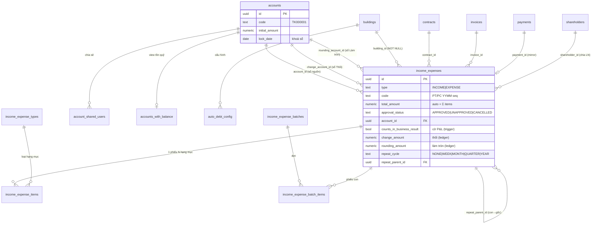
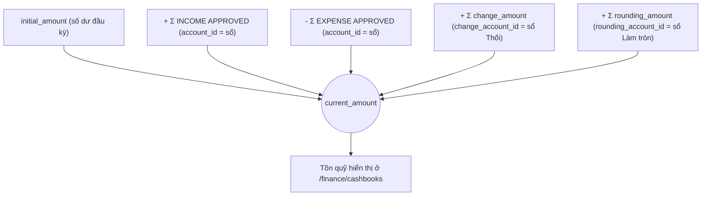
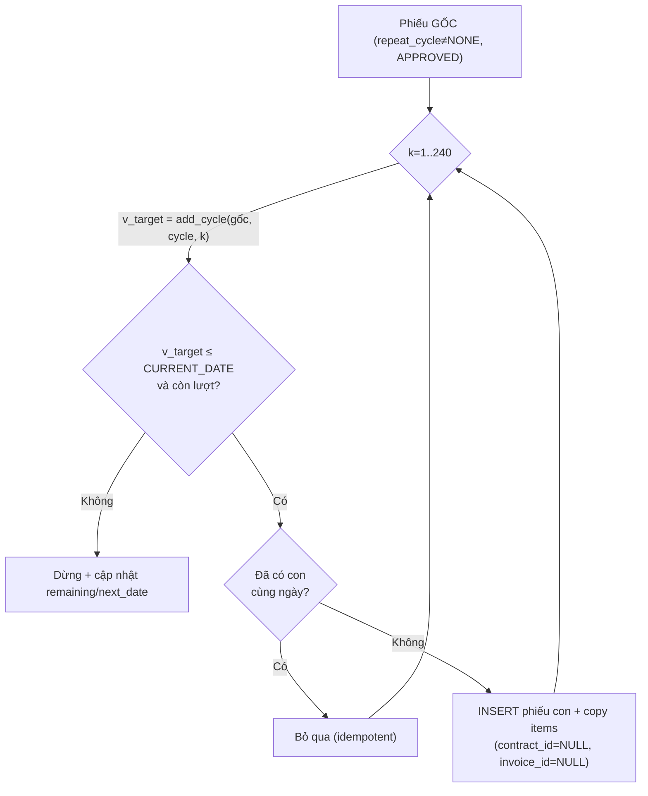
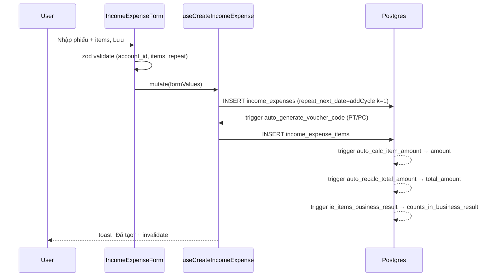

# Thu chi & Sổ quỹ (Income/Expenses · Accounts/Cashbooks)

> Domain trung tâm dòng tiền. Mọi tiền vào/ra hệ thống — thu HĐ, thanh toán hoá đơn,
> chi phí vận hành, hoàn/thối cọc, hoa hồng, chia lợi nhuận cổ đông — đều đáp xuống
> đây dưới dạng **phiếu thu/chi** (`income_expenses`) gắn vào một **sổ quỹ** (`accounts`).
> Số dư sổ quỹ (`accounts_with_balance.current_amount`) và mọi báo cáo lợi nhuận/dòng
> tiền đọc từ chính bảng này.

---

## 1. Tổng quan & vai trò nghiệp vụ

Hệ thống thu chi gồm 3 lớp dữ liệu:

1. **Phiếu thu/chi (`income_expenses`)** — chứng từ gốc. Mỗi phiếu có 1 `type` (`INCOME`/`EXPENSE`), gắn 1 toà nhà (`building_id` NOT NULL), tuỳ chọn gắn phòng/khách/HĐ/hoá đơn, và 1 **sổ quỹ** (`account_id`). `total_amount` **được tính tự động** = `SUM(items.amount)` qua trigger (không nhập tay).
2. **Hạng mục phiếu (`income_expense_items`)** — chi tiết từng dòng (loại × số lượng × đơn giá), có **kỳ áp dụng** `start_date`/`end_date`. Đây là nơi cấu hình hạch toán: nếu item thuộc một **loại cọc** (`income_expense_types.is_deposit = TRUE`) thì phiếu sẽ tự bị loại khỏi báo cáo Lợi nhuận.
3. **Sổ quỹ (`accounts`)** — ví/cashbook tiền mặt/ngân hàng/ví điện tử. Số dư = `initial_amount` + Σ thu APPROVED − Σ chi APPROVED + Σ thối + Σ làm tròn (view `accounts_with_balance`).

Các khái niệm phụ:

- **Phiếu tổng (batch)**: gộp N phiếu lẻ (mỗi hạng mục → 1 phiếu con) cho cùng 1 đợt thu/chi nhiều toà — `income_expense_batches` + junction `income_expense_batch_items`.
- **Phiếu lặp định kỳ (`repeat_*`)**: phiếu gốc tự đẻ phiếu con theo chu kỳ WEEK/MONTH/QUARTER/YEAR; có job pg_cron sinh hằng ngày.
- **Loại thu chi (`income_expense_types`)**: danh mục hạng mục, **per-user** (mỗi owner có bộ riêng), có cờ `is_deposit` và nhóm `category`.
- **Mẫu in (`income_expense_templates`)** + **trang in A5** (`/income-expense/print/:id`).
- **Tiền thối** (`change_amount`/`change_account_id`) và **làm tròn tiền thiếu** (`rounding_amount`/`rounding_account_id`): ledger ghi nhận, **đã NET trong phiếu Thu**, không trừ thật khỏi số dư.
- **Gạch nợ tự động (`auto_debt_config`)**: cấu hình nhận diện chuyển khoản ngân hàng để tự gạch nợ (theo `bank_account` + `matching_rules`).
- **Sổ chia sẻ (`account_shared_users`)**: cho user khác thấy/ghi phiếu trên sổ không thuộc phạm vi RBAC toà nhà của họ.

**Bất biến cốt lõi:**

- `total_amount` không bao giờ nhập tay — luôn = `SUM(items.amount)`; `items.amount` luôn = `quantity × unit_price` (đều do trigger).
- Chỉ phiếu `approval_status = 'APPROVED'` và `deleted_at IS NULL` mới đi vào số dư & báo cáo. Phiếu `CANCELLED`/`UNAPPROVED` không tính.
- `change_amount`/`rounding_amount` **không** trừ khỏi sổ tiền thật — chỉ cộng vào số dư của sổ ledger riêng (X Thối / Làm tròn).
- Phiếu nằm trong kỳ đã khoá sổ (`accounts.lock_date`) không được lập/sửa/xoá.

---

## 2. Cấu trúc dữ liệu

### 2.1 `income_expenses` — phiếu thu/chi (chứng từ gốc, 43 cột)

Mục đích: chứng từ tiền vào/ra. Cột chủ chốt:

- **Phân loại & nhận diện**: `type` (`INCOME`/`EXPENSE`, text — KHÔNG phải enum), `code` (auto `PT{YYMM}{seq}` cho thu / `PC{YYMM}{seq}` cho chi, sinh per-user-per-month-per-type), `name`, `voucher_date` (ngày phát sinh — mọi báo cáo & số dư lấy theo cột này), `notes`.
- **Số tiền**: `total_amount` (auto = Σ items), `payer_name` (người nộp/nhận), `receive_bank_name`/`receive_bank_account` (TK nhận tiền in trên phiếu — KHÔNG phải FK sổ quỹ).
- **Sổ quỹ & gắn kết**: `account_id` → `accounts`, `building_id` (NOT NULL) → `buildings`, `room_id` → `rooms`, `tenant_id` → `tenants` (lưu ý: là bảng `tenants` legacy, KHÁC `customers`), `contract_id` → `contracts`, `invoice_id` → `invoices`, `payment_id` → `payments` (phiếu thu mirror từ thanh toán hoá đơn).
- **Trạng thái duyệt**: `approval_status` (text, mặc định `'APPROVED'` — phiếu tạo là duyệt ngay; giá trị khác: `UNAPPROVED` = nháp, `CANCELLED` = huỷ), `approved_by`/`approved_at`, `deleted_at` (soft delete), `creator_name`.
- **Hạch toán KQKD**: `business_result_accounting` (NULLABLE — `NULL` = tự động theo hạng mục cọc, `TRUE`/`FALSE` = override tay) và `counts_in_business_result` (BOOLEAN NOT NULL — **cờ hiệu lực do trigger tính**, báo cáo Lợi nhuận lọc `= TRUE`).
- **Tiền thối / làm tròn** (metadata audit, KHÔNG đi vào balance trực tiếp của sổ nguồn): `change_amount` + `change_account_id` → sổ X Thối; `rounding_amount` + `rounding_account_id` → sổ "Làm tròn tiền thiếu".
- **Phiếu lặp** (`repeat_*`): `repeat_cycle` (`NONE`/`WEEK`/`MONTH`/`QUARTER`/`YEAR`), `repeat_infinity`, `repeat_count` (số phiếu CON sẽ sinh — gốc = kỳ #1), `repeat_remaining`, `repeat_next_date`, `repeat_parent_id` → `income_expenses` (self-FK, phiếu con trỏ về gốc).
- **Kiểm tra (verify)**: `verified_at`/`verified_by`/`verified_by_name`/`verified_note` — "đã kiểm" pháp lý nhẹ, độc lập với `approval_status`.
- **Cổ đông**: `shareholder_id` → `shareholders` (phiếu chi chia lợi nhuận cổ đông).

FK đi ra: `accounts` (×3: account_id, change_account_id, rounding_account_id), `buildings`, `rooms`, `tenants`, `contracts`, `invoices`, `payments`, `shareholders`, self (repeat_parent_id).
Được tham chiếu bởi: `income_expense_items`, `income_expense_batch_items`, và chính nó (repeat_parent_id).

### 2.2 `income_expense_items` — hạng mục phiếu (11 cột)

Mục đích: chi tiết từng dòng của phiếu. Cột chủ chốt: `income_expense_id` → phiếu, `income_expense_type_id` → loại, `quantity`/`unit_price`, `amount` (auto = qty × price), `description`, **`start_date`/`end_date` = kỳ áp dụng** (dùng cho filter "lọc kỳ theo tháng" và accrual). FK ra: `income_expenses`, `income_expense_types`.

### 2.3 `income_expense_types` — loại/hạng mục thu chi (10 cột, per-user)

Mục đích: danh mục hạng mục. Cột chủ chốt: `name`, `type` (text `'income'`/`'expense'` — **chữ thường**, khác `income_expenses.type` viết HOA), `category` (nhóm gom để thống kê), `is_default`, **`is_deposit`** (TRUE = hạng mục cọc → phiếu chứa nó bị loại khỏi P&L khi auto), `user_id` (mỗi owner 1 bộ riêng → có nhiều row trùng `(name, type)` giữa các user). Được tham chiếu bởi `income_expense_items`.

> Hệ quả của per-user: khi lọc theo loại, FE phải **expand** id đã chọn sang mọi id "sibling" cùng `(name, type)` của user khác (xem `getVoucherIdsByItemTypes`), nếu không sẽ bỏ sót phiếu.

### 2.4 `income_expense_templates` — mẫu in (12 cột, per-user)

Mục đích: mẫu file in phiếu. Cột chủ chốt: `code` (auto `MT{YYMM}{seq}`), `name`, `template_file_url`, `is_default`, `is_income_template` (mẫu cho phiếu thu hay chi), `field_mappings` (jsonb ánh xạ field), `deleted_at`.

### 2.5 `income_expense_batches` + `income_expense_batch_items` — phiếu tổng

`income_expense_batches` (10 cột): metadata đợt — `name`, `type`, `payer_name`, `attachments`, `notes`, `user_id`. `income_expense_batch_items` (3 cột, junction): `batch_id` → batch, `income_expense_id` → phiếu con. Mỗi phiếu con là một `income_expenses` độc lập (1 hạng mục/phiếu); batch chỉ gom nhóm hiển thị.

### 2.6 `accounts` — sổ quỹ (17 cột)

Mục đích: ví tiền. Cột chủ chốt: `name`, `code` (auto `TK{6 số}`, unique), `bank_name`/`account_number`/`bank_account_holder`/`branch`, `description`, `is_default`, **`initial_amount`/`initial_date`** (số dư & ngày chốt đầu kỳ), **`lock_date`** (khoá sổ — chặn phiếu có `voucher_date ≤ lock_date`), `quick_default_building_id` → `buildings` (toà mặc định khi tạo phiếu nhanh), `user_id` (owner phụ trách sổ). FK ra: `buildings`. Được tham chiếu bởi: `income_expenses` (×3), `account_shared_users`, `buildings.default_account_id_tk/tt`.

> Cột `type` (`cash`/`bank`/`ewallet`) từng tồn tại nhưng **đã bị drop** (migration `20260514000051_drop_accounts_type`); code hiện không dùng.

### 2.7 `account_shared_users` — sổ chia sẻ (5 cột)

Mục đích: cho `user_id` xem/ghi phiếu trên `account_id` không thuộc RBAC toà nhà của họ. Cột: `account_id` → `accounts`, `user_id`, `created_by`. Dùng bởi 2 helper `is_account_owner` / `is_account_shared_with_me` trong RLS.

### 2.8 `auto_debt_config` — gạch nợ tự động (8 cột)

Mục đích: cấu hình nhận diện chuyển khoản → tự gạch nợ hoá đơn. Cột: `building_id` → `buildings`, `is_enabled`, `bank_account` (số TK đối soát), `matching_rules` (jsonb luật khớp), `user_id`. (Cấu hình; logic đối soát thực thi ở pipeline khác.)

### Enum liên quan

- `payment_method`: **`TM` / `TK` / `TT`** — GIỮ NGUYÊN mã, không dịch. (Dùng ở payments/hoá đơn; phiếu thu chi không có cột method riêng mà suy qua sổ quỹ/ngữ cảnh.)
- `income_expenses.type` và `income_expense_types.type` là **text tự do** (`INCOME`/`EXPENSE` viết HOA cho phiếu; `income`/`expense` chữ thường cho loại) — KHÔNG phải enum DB.
- `approval_status` cũng là text (`APPROVED`/`UNAPPROVED`/`CANCELLED`), không phải enum.

---

## 3. Sơ đồ quan hệ dữ liệu

Dòng tính số dư (view `accounts_with_balance`):

---

## 4. Quy tắc nghiệp vụ & tự động hoá

### 4.1 Trigger tự tính số tiền (migration `20250120000004`)

- `auto_generate_voucher_code` (BEFORE INSERT `income_expenses`): sinh `code` `PT/PC + YYMM + seq 3 số` theo user/tháng/type nếu trống.
- `auto_calc_item_amount` (BEFORE INS/UPD `income_expense_items`): `amount = quantity × unit_price`.
- `auto_recalc_total_amount` (AFTER INS/UPD/DEL `income_expense_items`): cập nhật `income_expenses.total_amount = SUM(items.amount)`. **Bất biến**: total luôn khớp tổng items.
- `generate_template_code` (BEFORE INSERT `income_expense_templates`): `MT + YYMM + seq`.

### 4.2 Duyệt / bỏ duyệt phiếu

- `approve_voucher(voucher_id)` (SECURITY DEFINER): set `APPROVED` + `approved_by=auth.uid()` + `approved_at=now()`, **chỉ với phiếu `user_id = auth.uid()`**. Dùng cho phiếu nháp (vd phiếu chi hoa hồng `UNAPPROVED` chờ thực chi).
- `unapprove_voucher(voucher_id)`: ngược lại (`UNAPPROVED`, clear approver).
- Mặc định mọi phiếu tạo qua form đã là `APPROVED` ngay → workflow duyệt thường chỉ chạm tới phiếu commission/nháp. Huỷ phiếu = set `CANCELLED` (không gọi RPC, chỉ `UPDATE` trực tiếp ở hook).

### 4.3 Khoá sổ (`income_expenses_check_lock`, migration `20260425000001`)

Trigger BEFORE INS/UPD/DEL: nếu sổ (`account_id`) có `lock_date` và `voucher_date ≤ lock_date` → `RAISE EXCEPTION`. Bảo vệ kỳ đã chốt sổ. (Lưu ý: RPC sinh phiếu lặp bọc EXCEPTION quanh bước này để 1 phiếu dính khoá không làm hỏng cả lượt.)

### 4.4 View tồn quỹ `accounts_with_balance` (mới nhất: `20260527000004`)

`current_amount = initial_amount + Σ(INCOME APPROVED) − Σ(EXPENSE APPROVED) + Σ(change_amount khi sổ = change_account_id) + Σ(rounding_amount khi sổ = rounding_account_id)`, đều lọc `approval_status='APPROVED' AND deleted_at IS NULL`. View có `security_invoker = true` (áp RLS của caller) ở bản 1; bản hiện tại lọc trực tiếp. **Bất biến**: sổ "X Thối"/"Làm tròn" không bị âm vì chỉ cộng metadata thối/làm tròn, không có phiếu chi thật.

### 4.5 Hạch toán kết quả kinh doanh / KQKD (migration `20260531000001`)

- `recompute_ie_business_result(p_ie_id)`: `counts_in_business_result = COALESCE(business_result_accounting, NOT has_deposit_item)`, trong đó `has_deposit_item` = phiếu có ≥1 item thuộc loại `is_deposit=TRUE`.
- Trigger `ie_items_business_result` (AFTER INS/UPD/DEL `income_expense_items`) và `ie_business_result` (AFTER INSERT hoặc UPDATE OF `business_result_accounting`) gọi recompute. Vì trigger chỉ bắt cột override → việc recompute tự `UPDATE counts_in_business_result` không gây đệ quy.
- **Quy ước cọc loại khỏi P&L**: THU "Tiền cọc"/"Cọc giữ phòng", CHI "Hoàn trả thanh lý"/"Hoàn cọc thanh lý" → `is_deposit=TRUE`. **Giữ trong P&L**: THU "Tiền cọc khách bỏ" (forfeit = doanh thu), CHI "Hoàn tiền phòng thừa" → `is_deposit=FALSE`.
- Báo cáo Lợi nhuận lọc `counts_in_business_result = TRUE`; trang Thu chi KHÔNG lọc (vẫn là sổ dòng tiền đầy đủ, gồm cả cọc).

### 4.6 Phiếu lặp định kỳ (migration `20260603000010` + cron `...011`)

- `add_cycle(anchor, cycle, k)`: ngày kỳ thứ k tính từ anchor, **neo ngày-trong-tháng chống drift** (31/01 → 28/02 → 31/03 → 30/04, không tụt vĩnh viễn về 28).
- `generate_recurring_vouchers(p_user_id)` (SECURITY DEFINER): với mỗi phiếu GỐC (`repeat_parent_id IS NULL`, `APPROVED`, `repeat_cycle<>'NONE'`, còn lượt), sinh phiếu con từ kỳ #2 trở đi tới `CURRENT_DATE`. Phiếu con: `contract_id=NULL`, `invoice_id=NULL` (đứng độc lập — tránh trigger cọc HĐ thổi phồng), copy items với kỳ = ngày con. **Idempotent** nhờ unique index `uniq_ie_repeat_child_date (repeat_parent_id, voucher_date)`. Cô lập lỗi từng con (EXCEPTION). Bookkeeping `repeat_remaining`/`repeat_next_date` derive từ số con thực tế.
- `generate_recurring_vouchers_v2()`: wrapper RBAC — gọi v1 cho từng owner caller có quyền (super_admin = tất cả; staff = các owner trong `staff_assignments`). FE dùng v2 (nút "Sinh phiếu lặp lại").
- `run_recurring_vouchers_job()` + pg_cron `recurring_vouchers_daily` (`0 18 * * *` UTC = 01:00 VN): gọi `generate_recurring_vouchers(NULL)` cho MỌI owner (không dùng v2 vì cron không có `auth.uid()`).

### 4.7 Verify (đã kiểm) — `verify_income_expense` (migration `20260528000009`)

Toggle "đã kiểm": nếu chưa kiểm → set `verified_*` với người + note; nếu đã kiểm → bỏ kiểm (chỉ chủ kiểm hoặc super admin). Caller phải có quyền xem phiếu (`is_super_admin`/`is_admin`/`can_access_building`/`is_account_shared_with_me`). Độc lập với `approval_status`.

### 4.8 Sửa nhanh — `update_income_expense_quick` (migration `20260527000005`)

Cho **chủ phiếu hoặc super admin** sửa 3 field non-financial trên phiếu đã ghi nhận: `account_id`, `attachments`, `notes`. KHÔNG động `total_amount`/items/type. Chặn nếu phiếu đã xoá hoặc không có quyền.

### 4.9 RLS & hàm phân quyền sổ (migration `20260516000005`, `20260601000001`)

- `is_account_owner(p_account_id)` / `is_account_shared_with_me(p_account_id)`: 2 helper SECURITY DEFINER phá đệ quy RLS giữa `accounts` ↔ `account_shared_users`.
- Policy `income_expenses_select_fund_member`: **chủ sổ + người được chia sẻ thấy MỌI phiếu của sổ** (phủ cả `account_id`, `change_account_id`, `rounding_account_id`), bất kể RBAC toà nhà → để danh sách khớp số dư (view bỏ qua RLS). Đây là chủ ý: số dư có thể "rộng" hơn quyền toà nhà.

### 4.10 Tiền thối & làm tròn (migration `20260512000001`, `20260527000061`)

- `change_amount`/`change_account_id`: số thối lại khách khi thu tiền mặt — **đã NET trong phiếu Thu** (`total_amount` là số ròng), sổ X Thối chỉ là ledger audit, không trừ tiền thật.
- `rounding_amount`/`rounding_account_id`: tiền thiếu < 10.000đ được "tha" → hoá đơn vẫn `PAID` (`recompute_invoice_for_id` coi residual < 10K là đủ, `paid_amount` giữ số thực thu). Sổ "Làm tròn tiền thiếu" gom log; tạo DUY NHẤT 1 sổ thuộc owner chính, staff dùng chung qua RLS.

### 4.11 Seed loại hoa hồng (migration `20260510000021`)

`seed_commission_expense_types(p_user_id)`: tạo 2 loại chi "Hoa hồng môi giới" + "Thưởng nóng Sale" cho user (idempotent). Trigger `on_auth_user_created_seed_commission_types` auto-seed khi user mới signup.

### 4.12 Gạch nợ qua hoá đơn — `settle_previous_debt_sources` (migration `20260527000051`)

> Lưu ý phân biệt: đây là trigger trên **`invoices`** (nợ cũ `previous_debt_sources`), khác với `auto_debt_config` (đối soát chuyển khoản). Khi hoá đơn chuyển `PAID`: với mỗi source `type=invoice` → mark hoá đơn nguồn `PAID`; `type=deposit` → cộng `contracts.deposit_paid`. Liên quan domain Hoá đơn/HĐ, nêu ở đây vì cùng họ "debt".

---

## 5. Quy trình theo từng trang

### 5.1 `/income-expense` — Thu chi (trang chính)

File: [IncomeExpensePage.tsx](src/pages/payments/IncomeExpensePage.tsx). Mục đích: danh sách + tạo/sửa/huỷ phiếu thu chi, thống kê tổng thu/chi/chênh lệch, phiếu tổng, sinh phiếu lặp.

**Dữ liệu hiển thị**: `useIncomeExpenses` (list phiếu lẻ), `useIncomeExpenseBatches` (phiếu tổng), `useIncomeExpenseStats` (3 card). Toolbar có 2 view mode: "Phiếu lẻ" / "Phiếu tổng".

**Filter** (`IncomeExpenseFilters`): toà/khu/phòng, sổ quỹ (`account_id` — OR với `change_account_id` để bắt sổ Thối), type, khoảng `voucher_date`, `approval_status` (mặc định `ALL_ACTIVE` = APPROVED+UNAPPROVED, ẩn CANCELLED), loại hạng mục thu/chi (expand sibling), người tạo, `verified_status`, **kỳ áp dụng theo tháng** (`period_start/end_month` → overlap với item start/end), `amount_target`.

**Ô tìm kiếm thông minh** (`parseSearchInput`): gõ toàn số → lọc theo `total_amount` ±5.000đ; gõ chữ → search client-side trên name/code/tenant_name.

**Thao tác chính**:

1. *Tạo phiếu lẻ* → `IncomeExpenseForm` (zod `incomeExpenseFormSchema`) → `useCreateIncomeExpense`: INSERT phiếu (set `repeat_next_date = addCycle(voucher_date, cycle, 1)` nếu có lặp) → INSERT items → trigger tự tính total + code + KQKD. Validate: `account_id` bắt buộc, ≥1 item, item có start≤end, nếu chọn chu kỳ mà không vô hạn thì `repeat_count ≥ 1`.
2. *Sửa phiếu* → `useUpdateIncomeExpense`: chỉ chạy được khi UNAPPROVED (RLS); UPDATE phiếu + xoá toàn bộ items cũ + insert lại (trigger recompute total/KQKD). Phiếu đã APPROVED dùng *Sửa nhanh* (`useQuickUpdateIncomeExpense` → RPC 3 field) hoặc super admin.
3. *Duyệt* → `useApproveVoucher` (RPC `approve_voucher`) — confirm dialog "tính vào tồn quỹ".
4. *Huỷ* → `useCancelIncomeExpense`: set `CANCELLED`; nếu là INCOME có `payment_id` (mirror thanh toán hoá đơn) → xoá luôn `payments` row để trigger recompute hoá đơn. Invalidate cả invoices/payments/stats.
5. *Đánh dấu đã kiểm* → `useVerifyIncomeExpense` (RPC toggle).
6. *Sinh phiếu lặp lại* → `useGenerateRecurringVouchers` (RPC `generate_recurring_vouchers_v2`).
7. *Dừng lặp* → `useStopRecurring`: set `repeat_cycle='NONE'` + clear remaining/next_date (giữ con đã sinh).
8. *In* → điều hướng `/income-expense/print/:id`.

**Edge case**: filter loại hạng mục phải expand sibling (per-user types) nếu không bỏ sót; khi search bật → fetch toàn bộ rồi paginate client-side (vì tenant_name từ join). Sổ bị khoá → INSERT/UPDATE ném lỗi từ trigger.

### 5.2 Phiếu tổng (batch) — trong cùng trang `/income-expense`

`useCreateIncomeExpenseBatch`: INSERT 1 batch + N phiếu con (1 hạng mục/phiếu, denormalize metadata chung) + N items + N junction. Rollback best-effort: nếu lỗi giữa chừng → soft-delete phiếu con đã tạo + xoá batch. `useCancelIncomeExpenseBatch` huỷ tất cả con APPROVED 1 click (cascade xoá payment). `useUpdateBatchAccount` đổi sổ quỹ đồng loạt. Hiển thị qua `useIncomeExpenseBatches` (group theo junction, tổng hợp building_names/total/has_approved/all_cancelled, apply filter ở mức batch).

### 5.3 `/income-expense/print/:id` — In phiếu A5

File: [IncomeExpensePrintPage.tsx](src/pages/payments/IncomeExpensePrintPage.tsx). `useVoucherForPrint` fetch phiếu + items + join building/room/account; auto `window.print()` sau 500ms. Layout A5, hiển thị mã phiếu, người nộp/nhận, TK nhận, hạng mục, tổng tiền.

### 5.4 `/finance/refund-log` — Sổ ghi nhận tiền thối / làm tròn

File: [RefundLogPage.tsx](src/pages/payments/RefundLogPage.tsx). Nhận `?account_id=`. `detectMode`: tên sổ = "Làm tròn tiền thiếu" → mode `rounding` (lọc `rounding_account_id`, cộng `rounding_amount`); ngược lại mode `refund` (lọc `change_account_id`, cộng `change_amount`). 3 card: tổng / số phiếu / TB. List hiển thị cột tiền thối (hoặc làm tròn) thay total, có link sang hoá đơn. Filter kỳ: tháng này/trước/năm nay/custom.

### 5.5 `/finance/cashbooks` — Sổ quỹ

File: [CashbooksPage.tsx](src/pages/settings/finance/CashbooksPage.tsx). `useAccountsWithBalance` (đọc view, JS-merge `owner_name` từ profiles). Thao tác: thêm/sửa (`useCreateAccount`/`useUpdateAccount` — chỉ admin đổi `user_id` phụ trách), xoá mềm (`useDeleteAccount`), **khoá/mở khoá** (`useLockAccount`/`useUnlockAccount` set/clear `lock_date`), xem chi tiết. Search theo name/code. Các mutation kiểm quyền qua RLS (`select("id")` rỗng → báo "không có quyền").

### 5.6 `/settings/income-expense-types` — Loại thu chi

File: [IncomeExpenseTypesPage.tsx](src/pages/settings/IncomeExpenseTypesPage.tsx). CRUD `income_expense_types` (`useIncomeExpenseTypes` + create/update/delete). Form (zod `incomeExpenseTypeFormSchema`): name, type (Thu/Chi), **category bắt buộc** (combobox gõ-tạo-mới), description, is_default. Mỗi loại thuộc 1 user.

### 5.7 `/settings/income-expense-templates` — Mẫu thu chi

File: [IncomeExpenseTemplatesPage.tsx](src/pages/settings/IncomeExpenseTemplatesPage.tsx). CRUD mẫu in + toggle default theo thu/chi (`useToggleDefaultTemplate`).

### 5.8 `/settings/categories/auto-debt` — Gạch nợ tự động

File: [AutoDebtPage.tsx](src/pages/settings/categories/AutoDebtPage.tsx). Dùng `CategoryCrudPage` generic. CRUD `auto_debt_config` (`bank_account`, `is_enabled`). Cấu hình đối soát chuyển khoản.

### 5.9 `/settings/categories/bank-accounts` — Tài khoản ngân hàng

File: [BankAccountsPage.tsx](src/pages/settings/categories/BankAccountsPage.tsx). Hiện là **PlaceholderPage** (chưa triển khai) — quản lý TK ngân hàng tách khỏi sổ quỹ.

---

## 6. Liên kết sang domain khác (vào / ra)

**Vào domain này (tiền đáp xuống thu chi):**

- **Hoá đơn / Thanh toán** (`payments` → `income_expenses.payment_id`, `invoice_id`): mỗi thanh toán hoá đơn tạo phiếu thu mirror. Huỷ phiếu thu mirror → xoá payment → trigger recompute hoá đơn.
- **Hợp đồng** (`contracts` → `contract_id`): phiếu cọc, hoa hồng (`useCreateCommissionVoucher` tạo phiếu chi UNAPPROVED khi ký HĐ), hoàn/thối cọc khi thanh lý.
- **Cọc** (`is_deposit` types + `is_deposit` items): phiếu thu cọc / hoàn cọc; nguồn deposit_remaining và phân biệt KQKD.
- **Cổ đông** (`shareholders` → `shareholder_id`): `useCreateProfitDistribution` tạo phiếu chi chia lợi nhuận (EXPENSE, `business_result_accounting=false`, toà ảo "Chung").

**Ra domain khác (thu chi cấp dữ liệu cho):**

- **Báo cáo dòng tiền** (`useCashBook`/`useCashBookSummary`/`useCashFlowByDay`): đọc CANONICAL từ `income_expenses` APPROVED (KHÔNG cộng thêm payments/expenses để tránh double-count).
- **Báo cáo Lợi nhuận (P&L)**: lọc `counts_in_business_result = TRUE` (loại cọc & khoản override không-KQKD).
- **Cổ đông / chia lợi nhuận**: phiếu EXPENSE không-KQKD gắn `shareholder_id`.
- **Sổ quỹ → Tồn quỹ**: view `accounts_with_balance` là nguồn số dư cho dashboard tài chính.
- **Buildings**: `buildings.default_account_id_tk/tt` chọn sổ mặc định khi thu HĐ; toà ảo "Chung" (`is_virtual`) hạch toán chi phí không thuộc toà thật.
