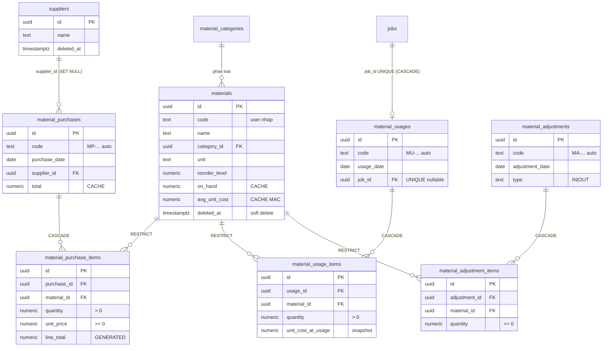
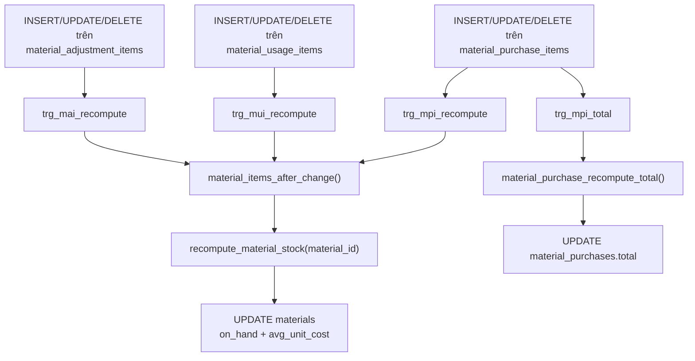
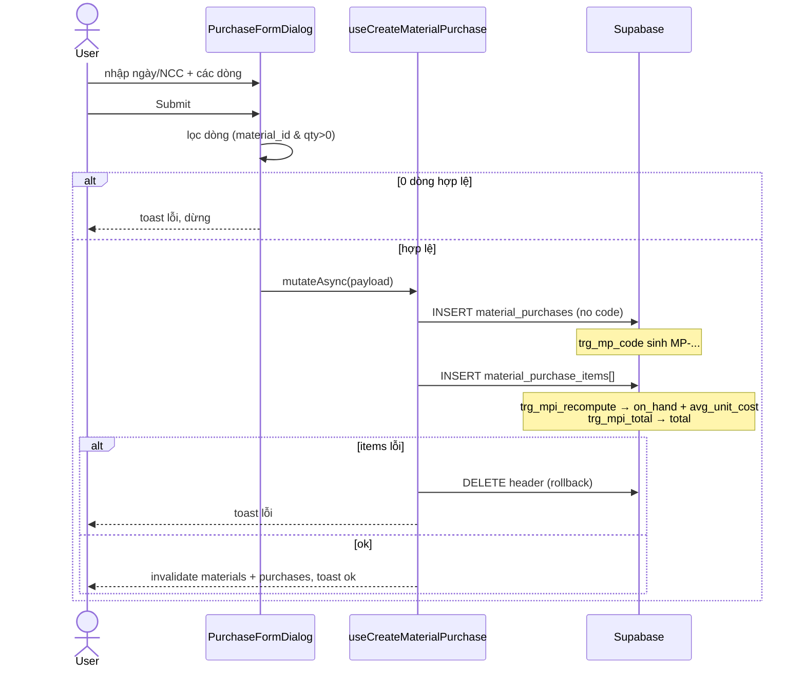
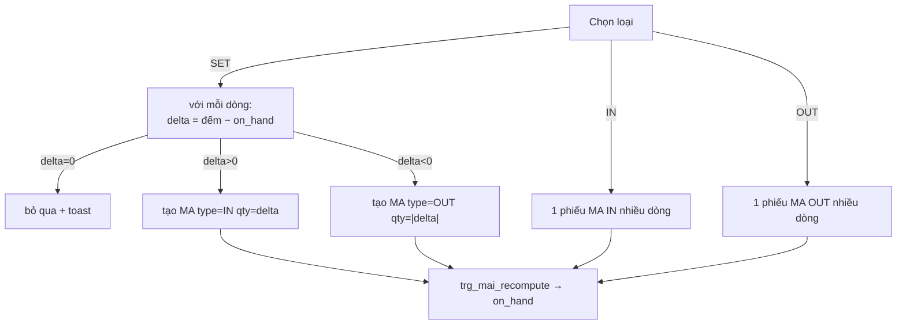

# Kho vật tư tiêu hao (Materials)

> Domain quản lý **vật tư tiêu hao** dùng cho công tác bảo trì/sửa chữa toà nhà
> (bóng đèn, vòi nước, ống nước, ron, keo…). Khác với domain **Tài sản (assets)**
> — vốn theo dõi thiết bị có giá trị, có khấu hao, gắn phòng — kho vật tư theo
> dõi **số lượng tồn** và **giá vốn trung bình**, cập nhật tự động khi nhập / xuất / kiểm kê.

Nguồn code chính:

- Page: [MaterialsPage.tsx](src/pages/materials/MaterialsPage.tsx) (hub 3+1 tab), [SuppliersPage.tsx](src/pages/settings/categories/SuppliersPage.tsx) (placeholder).
- Hooks: [useMaterials.ts](src/hooks/useMaterials.ts), [useMaterialCategories.ts](src/hooks/useMaterialCategories.ts), [useMaterialPurchases.ts](src/hooks/useMaterialPurchases.ts), [useMaterialUsages.ts](src/hooks/useMaterialUsages.ts), [useMaterialAdjustments.ts](src/hooks/useMaterialAdjustments.ts).
- Components: thư mục [src/components/materials/](src/components/materials/).
- Validation: [materialValidation.ts](src/lib/materialValidation.ts).
- Migration: [20260529000004_create_materials_inventory.sql](supabase/migrations/20260529000004_create_materials_inventory.sql).

---

## 1. Tổng quan & vai trò nghiệp vụ

Kho vật tư là **một kho chung duy nhất cho cả chuỗi** — không tách theo `building_id`,
không có khái niệm `warehouse_id`. Mọi toà nhà dùng chung một danh mục vật tư và một
con số tồn kho. Điều này được ghi rõ trong comment migration: *"1 kho chung cho cả chuỗi"*.

Vòng đời một vật tư xoay quanh **3 loại phiếu (movement)** tác động lên tồn kho:

| Loại phiếu | Bảng header / items | Hướng tồn | Mã sinh tự động | Nguồn phát sinh |
|---|---|---|---|---|
| **Nhập** (purchase) | `material_purchases` / `material_purchase_items` | **+** (cộng tồn, cập nhật giá vốn) | `MP-YYYYMMDD-NNNN` | Tab "Phiếu nhập" trên MaterialsPage |
| **Xuất** (usage) | `material_usages` / `material_usage_items` | **−** (trừ tồn) | `MU-YYYYMMDD-NNNN` | Gắn vào **phiếu công việc (job)** — tạo từ dialog "Chi tiết công việc" |
| **Điều chỉnh / kiểm kê** (adjustment) | `material_adjustments` / `material_adjustment_items` | **±** (IN cộng / OUT trừ) | `MA-YYYYMMDD-NNNN` | Tab "Kiểm kê" trên MaterialsPage |

Hai con số quan trọng nhất trên bảng `materials` — `on_hand` (tồn) và
`avg_unit_cost` (giá vốn trung bình, MAC — *moving average cost*) — **đều là cache**.
Chúng không được app ghi trực tiếp; mọi thay đổi đi qua các bảng `*_items` rồi
trigger tự tính lại (xem mục 4). Đây là **bất biến cốt lõi** của domain: app chỉ
ghi phiếu, không bao giờ `UPDATE materials.on_hand` thủ công.

Vai trò end-to-end: kho vật tư nằm ở nhánh **chi phí vận hành** của vòng đời.
Vật tư xuất ra gắn `job_id` → tính được **chi phí vật tư của từng phiếu công việc**
(qua `unit_cost_at_usage` snapshot), từ đó feed vào báo cáo chi phí bảo trì toà nhà.
Phiếu nhập gắn `supplier_id` → liên kết sang danh mục nhà cung cấp.

---

## 2. Cấu trúc dữ liệu

Tổng cộng **9 bảng**: 2 catalog + 3 cặp header/items giao dịch + bảng `suppliers` dùng chung.
Mọi bảng đều bật RLS qua `can_access_org_entity('materials', <action>)` (xem mục 4).

### 2.1. `material_categories` — Danh mục vật tư

Gom nhóm vật tư (Đèn, Vòi nước, Ống nước…). Phẳng, không phân cấp.

- `name` (NOT NULL, CHECK length > 0): tên danh mục.
- `description`: mô tả tuỳ chọn.
- `user_id`: **audit-only** (auth.uid() người tạo), không dùng cho RBAC.
- `id / created_at / updated_at`: chuẩn.
- Được tham chiếu bởi: `materials.category_id` (FK `ON DELETE SET NULL` → xoá danh mục thì vật tư về "không phân loại", không mất).

### 2.2. `materials` — Catalog vật tư (kèm cache tồn + giá vốn)

Bản ghi mỗi loại vật tư. Đây là **bảng trung tâm** của domain.

- `code`: mã vật tư (tuỳ chọn, **không** auto-gen — user tự nhập, vd `BD-LED-9W`). Khác với mã phiếu MP/MU/MA.
- `name` (NOT NULL): tên vật tư.
- `category_id` → `material_categories.id` (nullable).
- `unit` (NOT NULL, default `'cái'`): đơn vị tính (cái, m, kg…).
- `reorder_level` (NUMERIC, default 0): **ngưỡng cảnh báo**. UI hiện badge "Sắp hết" khi `on_hand <= reorder_level`.
- `on_hand` (NUMERIC, **cache**): tồn hiện tại = `SUM(nhập) − SUM(xuất) + SUM(adj_IN) − SUM(adj_OUT)`.
- `avg_unit_cost` (NUMERIC, **cache**): giá vốn trung bình (MAC) = `tổng tiền nhập / tổng SL nhập`. Lưu ý: **chỉ tính từ phiếu nhập**, không bị adjustment/usage làm lệch.
- `image_url`, `description`: tuỳ chọn.
- `deleted_at` (TIMESTAMPTZ, nullable): **soft delete**. Mọi query app lọc `.is('deleted_at', null)`.
- `user_id`: audit-only.
- FK đi ra: `category_id` → `material_categories`.
- Được tham chiếu bởi (FK `ON DELETE RESTRICT`): `material_purchase_items`, `material_usage_items`, `material_adjustment_items` — nghĩa là **không xoá cứng được** vật tư còn movement; đây là lý do app dùng soft delete.

### 2.3. `material_purchases` + `material_purchase_items` — Phiếu nhập

Header `material_purchases`:

- `code` (UNIQUE NOT NULL): auto-gen `MP-YYYYMMDD-NNNN`.
- `purchase_date` (DATE, default CURRENT_DATE): ngày nhập.
- `supplier_id` → `suppliers.id` (nullable, `ON DELETE SET NULL`): nhà cung cấp.
- `total` (NUMERIC, **cache**): tổng tiền = `SUM(line_total)` các dòng, cập nhật qua trigger.
- `notes`, `user_id` (audit), `id/created_at/updated_at`.

Items `material_purchase_items`:

- `purchase_id` → `material_purchases.id` (`ON DELETE CASCADE` → xoá phiếu xoá hết dòng).
- `material_id` → `materials.id` (`ON DELETE RESTRICT`).
- `quantity` (CHECK > 0), `unit_price` (CHECK ≥ 0).
- `line_total` (NUMERIC, **GENERATED ALWAYS AS `quantity * unit_price` STORED**) — cột tính sẵn ở DB, app không ghi.
- Không có `user_id` (RLS qua parent).

### 2.4. `material_usages` + `material_usage_items` — Phiếu xuất (gắn job)

Header `material_usages`:

- `code` (UNIQUE NOT NULL): auto-gen `MU-YYYYMMDD-NNNN`.
- `usage_date` (DATE, default CURRENT_DATE).
- `job_id` → `jobs.id` (nullable, `ON DELETE CASCADE`): **liên kết sang domain Công việc**. Có **UNIQUE partial index** `WHERE job_id IS NOT NULL` → **mỗi job nhiều nhất 1 phiếu xuất**.
- `notes`, `user_id` (audit), timestamps.

Items `material_usage_items`:

- `usage_id` → `material_usages.id` (CASCADE).
- `material_id` → `materials.id` (RESTRICT).
- `quantity` (CHECK > 0).
- `unit_cost_at_usage` (NUMERIC, default 0): **snapshot** `materials.avg_unit_cost` tại thời điểm xuất. Mục đích: tính chi phí vật tư của job **độc lập** với giá vốn thay đổi sau này. App tự gán giá trị này khi lưu (không phải trigger).

### 2.5. `material_adjustments` + `material_adjustment_items` — Kiểm kê / điều chỉnh

Header `material_adjustments`:

- `code` (UNIQUE NOT NULL): auto-gen `MA-YYYYMMDD-NNNN`.
- `adjustment_date` (DATE, default CURRENT_DATE).
- `type` (TEXT, **CHECK IN ('IN','OUT')**): hướng điều chỉnh. IN = cộng tồn, OUT = trừ tồn.
- `reason`: lý do (kiểm kê cuối tháng, hỏng, mất, tìm thấy thừa…).
- `user_id` (audit), `id/created_at`. **Không có `updated_at`** (phiếu kiểm kê không sửa, chỉ tạo/xoá).

Items `material_adjustment_items`:

- `adjustment_id` → `material_adjustments.id` (CASCADE).
- `material_id` → `materials.id` (RESTRICT).
- `quantity` (CHECK ≥ 0): số lượng delta (luôn dương; hướng do `type` của header quyết định).

> **Lưu ý về thao tác "SET"**: UI cho phép chọn loại `SET` (đặt lại tồn theo số kiểm
> đếm), nhưng ở **mức DB không có type `SET`** — chỉ IN/OUT. SET được hiện thực ở
> tầng app bằng cách tạo 1 phiếu IN hoặc OUT với `delta = target − current` (xem mục 4.4).

### 2.6. `suppliers` — Nhà cung cấp (dùng chung)

Danh mục nhà cung cấp, **dùng chung giữa Materials và Assets**.

- `name` (NOT NULL), `phone`, `email`, `address`.
- `deleted_at` (nullable): soft delete (app lọc `.is('deleted_at', null)`).
- `user_id` (audit), timestamps.
- Được tham chiếu bởi: `material_purchases.supplier_id` **và** `assets.supplier_id` → đây là điểm giao với domain Tài sản.

---

## 3. Sơ đồ quan hệ dữ liệu



Luồng cập nhật cache (tồn + giá vốn):



---

## 4. Quy tắc nghiệp vụ & tự động hoá

### 4.1. `recompute_material_stock(_material_id uuid)` — tính lại tồn + MAC

Hàm `SECURITY DEFINER` (void). Quét **toàn bộ movement** của 1 vật tư và ghi lại cache:

```text
on_hand       = SUM(purchase qty) − SUM(usage qty) + SUM(adj IN qty) − SUM(adj OUT qty)
avg_unit_cost = (SUM purchase line_total) / (SUM purchase qty)   -- nếu có nhập; 0 nếu chưa nhập
```

**Bất biến quan trọng:**

- `avg_unit_cost` **chỉ** tính từ `material_purchase_items` — usage và adjustment **không** ảnh hưởng giá vốn. Nghĩa là điều chỉnh tồn (kiểm kê) làm đổi `on_hand` nhưng giữ nguyên giá vốn.
- Hàm **tính lại từ đầu** (full recompute) mỗi lần, không cộng dồn incremental → tự đúng kể cả khi xoá/sửa phiếu cũ.

### 4.2. `material_items_after_change()` + 3 trigger recompute

Trigger function `AFTER INSERT/UPDATE/DELETE FOR EACH ROW`, gọi
`recompute_material_stock(COALESCE(NEW.material_id, OLD.material_id))`. Gắn trên cả 3 bảng items:

- `trg_mpi_recompute` trên `material_purchase_items`
- `trg_mui_recompute` trên `material_usage_items`
- `trg_mai_recompute` trên `material_adjustment_items`

→ Bất kỳ thay đổi dòng phiếu nào (kể cả xoá phiếu → CASCADE xoá items) đều kích hoạt tính lại tồn. Đây là lý do các dialog xoá phiếu nói *"tồn sẽ tự động tính lại"*.

### 4.3. `material_purchase_recompute_total()` — cập nhật `total` phiếu nhập

Trigger `trg_mpi_total` trên `material_purchase_items` (AFTER I/U/D). Set
`material_purchases.total = COALESCE(SUM(line_total), 0)` của các dòng cùng `purchase_id`.
→ `total` của phiếu nhập luôn khớp tổng dòng, app không tự tính.

### 4.4. Auto-gen mã phiếu — `set_material_{purchase,usage,adjustment}_code()`

3 trigger `BEFORE INSERT` (`trg_mp_code`, `trg_mu_code`, `trg_ma_code`). Nếu `code`
NULL/rỗng, sinh `MP-/MU-/MA-` + `YYYYMMDD` + số thứ tự 4 chữ số (`LPAD(... ,4,'0')`),
trong đó số thứ tự = `MAX(số hiện có cùng ngày) + 1`. App **không gửi `code`** khi tạo
phiếu → trigger lo.

> Đây là điểm khác biệt với `materials.code`: mã **vật tư** do user tự nhập (nullable, không auto), mã **phiếu** auto-gen và UNIQUE.

### 4.5. Audit & updated_at

- `set_user_id_from_auth` (BEFORE INSERT) gán `user_id = auth.uid()` cho mọi header (chỉ audit, không dùng cho quyền).
- `update_updated_at_column` (BEFORE UPDATE) trên các bảng có `updated_at`.

### 4.6. RLS — `can_access_org_entity('materials', <action>)`

Toàn bộ 8 bảng materials bật RLS. Mỗi bảng có policy SELECT/INSERT/UPDATE/DELETE
gọi `can_access_org_entity('materials','view'|'create'|'edit'|'delete')`, cộng
policy `is_admin()` / `is_super_admin()` ALL.

`can_access_org_entity(_resource, _action)` (SQL, SECURITY DEFINER, STABLE) trả true nếu:

- là super admin, **hoặc** admin, **hoặc**
- tồn tại `staff_assignments` của `auth.uid()` mà `permissions` (fallback `roles.permissions`) cho phép cặp `materials:action`.

Đây là quyền **org-level, KHÔNG scope theo building** (đúng tinh thần "1 kho chung").
Bảng items không có policy riêng theo parent — chúng cũng kiểm `materials` action trực tiếp
(view để select, create để insert, edit để update/delete dòng).

`suppliers` có RLS riêng (xem domain Cài đặt/danh mục) — không thuộc namespace `materials`.

---

## 5. Quy trình theo từng trang (page)

### 5.1. `MaterialsPage` — hub kho vật tư

- **Route**: `/materials`, `/materials/purchases`, `/materials/usages`, `/materials/adjustments` (cả 4 cùng render `MaterialsPage`, tab xác định theo `location.pathname`). Đăng ký trong [App.tsx](src/App.tsx) dòng 212-215.
- **Mục đích**: một trang 4 tab — Vật tư / Phiếu nhập / Phiếu xuất / Kiểm kê. Đổi tab = `navigate()` đổi URL (deep-link được).

#### Tab "Vật tư" — [MaterialsListContent.tsx](src/components/materials/MaterialsListContent.tsx)

- **Dữ liệu**: `useMaterials(filters)` (filter `search` lọc client-side theo tên/mã/mô tả, `categoryId`, `onlyLowStock`), `useMaterialCategories()`.
- **Hiển thị**: bảng Mã / Tên / Danh mục / Đơn vị / Tồn (qua `StockBadge`) / Giá vốn TB. Sub-tab "Tất cả" vs "Sắp hết" (đếm `on_hand <= reorder_level`). Panel "Danh mục" gập/mở để CRUD `material_categories`.
- **Thêm/Sửa vật tư** ([MaterialFormDialog](src/components/materials/MaterialFormDialog.tsx)): react-hook-form + `materialFormSchema`. Validate: `name` min 1, `unit` min 1, `reorder_level ≥ 0`, `category_id` phải là UUID hợp lệ hoặc null. `useCreateMaterial` / `useUpdateMaterial` insert/update vào `materials` (KHÔNG ghi `on_hand`/`avg_unit_cost` — để default/trigger lo).
- **Xoá vật tư**: `useSoftDeleteMaterial` chỉ set `deleted_at` → lịch sử phiếu giữ nguyên (vì FK RESTRICT chặn xoá cứng).
- **Danh mục** ([MaterialCategoryFormDialog](src/components/materials/MaterialCategoryFormDialog.tsx)): `useCreateMaterialCategory`/`useUpdateMaterialCategory`. **Xoá danh mục** (`useDeleteMaterialCategory`) check trước: nếu còn vật tư (chưa xoá) đang dùng → chặn, toast lỗi.
- **Edge case**: filter dropdown danh mục dùng `SearchableSelect` (combobox gõ-để-tìm) đúng convention; `StockBadge` phân 3 mức: Hết hàng (≤0, đỏ), Sắp hết (≤ ngưỡng, vàng), Còn (xám).

#### Tab "Phiếu nhập" — [MaterialPurchasesContent.tsx](src/components/materials/MaterialPurchasesContent.tsx)

- **Dữ liệu**: `useMaterialPurchases({from?, to?})` — join `supplier` + `items(+material)`, sort theo `purchase_date` desc. Bảng có hàng mở rộng (expand) xem chi tiết dòng.
- **Tạo phiếu nhập** ([MaterialPurchaseFormDialog](src/components/materials/MaterialPurchaseFormDialog.tsx)):
  1. Chọn ngày nhập, nhà cung cấp (Select thường — danh sách từ `suppliers` chưa xoá), nhập nhiều dòng (MaterialPicker + số lượng + đơn giá), thành tiền/tổng tính realtime.
  2. Submit → lọc dòng hợp lệ (`material_id` có + `quantity > 0`); nếu 0 dòng → toast lỗi "Cần ít nhất 1 dòng… SL > 0".
  3. `useCreateMaterialPurchase`: insert header (không gửi `code` → trigger sinh MP-…), rồi insert items. **Nếu insert items lỗi → rollback bằng cách xoá header** (không có transaction RPC, làm thủ công).
  4. Side-effect DB: mỗi item insert → `trg_mpi_recompute` cập nhật `on_hand`+`avg_unit_cost` của vật tư, `trg_mpi_total` cập nhật `total` phiếu.
- **Sửa phiếu** (`useUpdateMaterialPurchase`): update header rồi **xoá hết dòng cũ + insert lại** (replace) → trigger tự tính lại tồn cho cả vật tư cũ lẫn mới.
- **Xoá phiếu** (`useDeleteMaterialPurchase`): xoá header → CASCADE xoá items → trigger tính lại tồn.



#### Tab "Phiếu xuất" — [MaterialUsagesContent.tsx](src/components/materials/MaterialUsagesContent.tsx)

- **Read-only list**. Phiếu xuất **không tạo từ đây** — tạo từ phiếu công việc. Banner ghi rõ: *"Phiếu xuất tạo tự động khi staff khai báo vật tư trong phiếu công việc. Mỗi job nhiều nhất 1 phiếu xuất — sửa qua dialog Chi tiết công việc."*
- **Dữ liệu**: `useMaterialUsages()` — join `items(+material)` + `job(id,code,title)`. Mỗi hàng hiện mã MU, ngày, link tới job (`/tasks`), tổng SL, tổng chi phí (`Σ quantity × unit_cost_at_usage`). Expand xem dòng kèm "Giá vốn lúc xuất".
- **Tạo/sửa phiếu xuất** thực sự nằm ở [MaterialUsageSection](src/components/materials/MaterialUsageSection.tsx), nhúng trong [TaskDetailDialog](src/components/tasks/TaskDetailDialog.tsx):
  1. `useMaterialUsageByJob(jobId)` lấy phiếu hiện có của job (nếu có).
  2. User thêm dòng vật tư + số lượng ([MaterialUsageItemsEditor](src/components/materials/MaterialUsageItemsEditor.tsx)). Editor cảnh báo (viền vàng) khi `qty > on_hand + alreadyCounted` — **chỉ cảnh báo, không chặn** (cho phép xuất âm tồn).
  3. Lưu → `useUpsertJobMaterialUsage`: nếu job đã có phiếu → update header + **xoá hết item cũ** + insert lại (gán `unit_cost_at_usage = materials.avg_unit_cost` hiện tại); nếu chưa có & có item → tạo mới (trigger sinh MU-…); nếu xoá hết item của phiếu cũ → **xoá luôn header** (không để lại phiếu rỗng).
  4. Side-effect: trigger `trg_mui_recompute` trừ `on_hand`.
- **Edge case**: UNIQUE index `job_id` đảm bảo 1 job ↔ 1 phiếu xuất; xoá job → CASCADE xoá phiếu xuất → trigger cộng trả tồn.

#### Tab "Kiểm kê" — [MaterialAdjustmentsContent.tsx](src/components/materials/MaterialAdjustmentsContent.tsx)

- **Dữ liệu**: `useMaterialAdjustments()` — list + expand. Badge IN (xanh)/OUT (đỏ).
- **Tạo phiếu kiểm kê** ([MaterialAdjustmentFormDialog](src/components/materials/MaterialAdjustmentFormDialog.tsx)) — 3 chế độ ở UI:
  - **SET** (mặc định): nhập *tồn thực đếm được*. UI hiện delta = `target − current` realtime. Submit → với **mỗi** dòng gọi `useSetMaterialStock`: tính `delta`, nếu `delta = 0` bỏ qua (toast "đã khớp"), nếu khác thì tạo 1 phiếu adjustment `type = delta>0 ? 'IN' : 'OUT'` với `quantity = |delta|`. (Một phiếu MA / vật tư.)
  - **IN**: cộng thêm (tìm thấy thừa). Một phiếu MA chứa nhiều dòng.
  - **OUT**: trừ bớt (hỏng, mất).
  - `useCreateMaterialAdjustment` insert header (không gửi code) + items; lỗi items → rollback xoá header.
- **Xoá phiếu** (`useDeleteMaterialAdjustment`): CASCADE xoá items → trigger tính lại tồn.
- **Edge case**: không có nút "Sửa" phiếu kiểm kê (chỉ tạo/xoá — khớp việc bảng không có `updated_at`). SET với delta=0 không tạo phiếu rác.



### 5.2. `SuppliersPage` — Nhà cung cấp (placeholder)

- **Route**: `/settings/categories/suppliers` ([App.tsx](src/App.tsx) dòng 319).
- **Trạng thái hiện tại**: [SuppliersPage.tsx](src/pages/settings/categories/SuppliersPage.tsx) chỉ là `PlaceholderPage` ("Quản lý nhà cung cấp") — **chưa có UI CRUD**. Dữ liệu `suppliers` hiện được tạo/chọn gián tiếp: dropdown nhà cung cấp trong phiếu nhập đọc từ `suppliers` (qua `useSuppliersList` nội bộ trong [MaterialPurchaseFormDialog](src/components/materials/MaterialPurchaseFormDialog.tsx)), và bảng `assets` cũng tham chiếu. Việc thêm nhà cung cấp mới hiện làm ở nơi khác (domain Tài sản / seed), không phải tại trang này.

---

## 6. Liên kết sang domain khác (vào / ra)

| Hướng | Bảng/route nguồn | Bảng/route đích | Vì sao |
|---|---|---|---|
| **Ra → Công việc (Jobs)** | `material_usages.job_id` | `jobs.id` (`ON DELETE CASCADE`, UNIQUE per job) | Phiếu xuất gắn job để quy chi phí vật tư về từng công việc bảo trì. UI tạo/sửa xuất nằm trong [TaskDetailDialog](src/components/tasks/TaskDetailDialog.tsx) qua `MaterialUsageSection`, không phải trên MaterialsPage. |
| **Ra → Nhà cung cấp** | `material_purchases.supplier_id` | `suppliers.id` (`ON DELETE SET NULL`) | Ghi nguồn nhập. `suppliers` dùng chung với domain Tài sản. |
| **Vào ← Tài sản (Assets)** | `assets.supplier_id` | `suppliers.id` | Domain Tài sản chia sẻ cùng bảng `suppliers` → mọi thay đổi danh mục NCC ảnh hưởng cả hai. |
| **Ra → Chi phí / Báo cáo** | `material_usage_items.unit_cost_at_usage × quantity` | (tính toán) chi phí vật tư của job | Snapshot giá vốn cho phép tổng hợp chi phí bảo trì theo job/toà nhà mà không bị giá vốn về sau làm lệch. |
| **Quyền** | RLS mọi bảng materials | `can_access_org_entity('materials', …)` ([per_staff_permissions](supabase/migrations/20260529000001_per_staff_permissions.sql)) | Quyền org-level (không scope building) — đồng bộ mô hình RBAC chung của hệ thống. |

**Điểm cần lưu ý cho người tích hợp:**

- Không bao giờ `UPDATE materials.on_hand`/`avg_unit_cost` từ app — luôn đi qua bảng `*_items` để trigger tính. Đây là bất biến giữ cache đúng.
- Cho phép tồn âm: usage không chặn `qty > on_hand` (chỉ cảnh báo UI) → `on_hand` có thể âm nếu xuất vượt; báo cáo cần lường trước.
- `avg_unit_cost` không đổi khi kiểm kê/xuất; muốn thay đổi giá vốn phải qua phiếu **nhập**.
