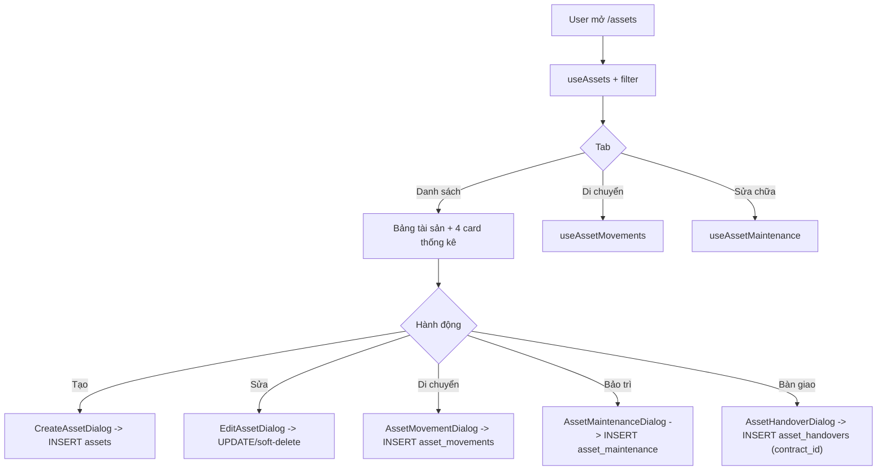

# Tài sản & Nội thất (Assets)

> Domain quản lý kho tài sản/nội thất của hệ thống CRM cho thuê: khai báo tài sản, gắn vào toà nhà/căn hộ, theo dõi tình trạng, ghi nhận di chuyển giữa các phòng/kho, lập phiếu bảo trì/sửa chữa, và lập biên bản bàn giao tài sản gắn với hợp đồng (HĐ).

## 1. Tổng quan & vai trò nghiệp vụ

Module Assets là **sổ kho tài sản cố định / nội thất** của chủ nhà. Mục tiêu nghiệp vụ:

- **Khai báo & định giá tài sản**: mỗi món (giường, tủ lạnh, máy lạnh…) là 1 dòng trong `assets`, có mã, loại (`asset_categories`), nhà cung cấp, giá mua, số lượng, tình trạng (`asset_condition`), và vị trí (toà nhà + căn hộ).
- **Theo dõi vòng đời tài sản**: tình trạng (Mới → Tốt → Khá → Kém → Hỏng) cập nhật thủ công; lịch sử **di chuyển** (`asset_movements`) và lịch sử **bảo trì** (`asset_maintenance`) là 2 sổ phụ ghi lại biến động.
- **Bàn giao theo hợp đồng**: `asset_handovers` là biên bản check-in/check-out gắn `contract_id` — đây là điểm **giao thoa với domain Hợp đồng**: khi khách nhận/trả căn hộ, hệ thống ghi nhận danh sách tài sản kèm tình trạng và chữ ký 2 bên.
- **Kho tài sản** (`asset_warehouses`): danh mục địa điểm lưu kho (có thể gắn toà nhà), dùng làm điểm xuất phát/đích khi tài sản chưa ở căn hộ nào.

Vị trí trong vòng đời tổng (lead → cọc → HĐ → chỉ số → hoá đơn → thu chi → báo cáo → lợi nhuận): Assets là **tài nguyên hỗ trợ vận hành**, không nằm trên trục dòng tiền chính. Nó nối vào vòng đời ở 2 điểm: (1) **HĐ** qua biên bản bàn giao tài sản, và (2) **chi phí** — giá mua tài sản và chi phí bảo trì là dữ liệu đầu vào cho phân tích chi phí vận hành (tuy hiện tại chưa tự sinh phiếu thu/chi từ các bảng này).

> Lưu ý quan trọng về kiến trúc: bảng `assets` **không có cột status/state về việc "đang cho thuê"**. Cột `condition` chỉ mô tả chất lượng vật lý (NEW/GOOD/FAIR/POOR/BROKEN), KHÔNG phải trạng thái thuê. Lịch sử trigger từng cố gán `IN_USE`/`AVAILABLE` vào `condition` nhưng đó là giá trị enum không hợp lệ → đã bị vô hiệu hoá (xem mục 4).

## 2. Cấu trúc dữ liệu

### 2.1 `assets` — Tài sản/nội thất

Bảng trung tâm của domain. Mỗi dòng là 1 món tài sản (hoặc 1 nhóm cùng loại với `quantity`).

- **`name`** (NOT NULL) — tên tài sản; **`code`** — mã tài sản **tự đặt/gõ tay** (không unique ở DB, hiển thị `font-mono` trong bảng).
  > Ghi chú hạ tầng bỏ không: DB đã seed `code_sequences` với `object_type = 'ASSET'` (prefix `TS`) và `'HANDOVER'` (prefix `BG`) kèm RPC `generate_next_code` ([`029_missing_features.sql`](supabase/migrations/029_missing_features.sql)) — nhưng FE **không gọi** (RPC chỉ xuất hiện trong [`types.ts`](src/integrations/supabase/types.ts), không caller nào trong `src/`). CreateAssetDialog vẫn để user gõ `code` tay.
- **`category_id`** → `asset_categories.id` — loại tài sản (bắt buộc ở form qua zod, nullable ở DB).
- **`supplier_id`** → `suppliers.id` — nhà cung cấp (domain Danh mục/Suppliers).
- **`purchase_date`** (date), **`purchase_price`** (numeric) — ngày mua & đơn giá. Giá trị tổng hiển thị = `purchase_price * quantity`.
- **`condition`** (`asset_condition`, default `GOOD`) — tình trạng vật lý. Enum: NEW/GOOD/FAIR/POOR/BROKEN.
- **`quantity`** (int, default 1) — số lượng.
- **`building_id`** → `buildings.id`, **`room_id`** → `rooms.id` — vị trí hiện tại (cả hai nullable; tài sản chưa gán vị trí coi như nằm kho/chung).
- **`images`** (jsonb, default `[]`) — mảng ảnh tài sản (không có UI upload trong các dialog hiện tại).
- **`description`** — mô tả.
- **`deleted_at`** — soft-delete; mọi query list đều `.is("deleted_at", null)`.
- id / user_id / created_at / updated_at — khoá + audit. `user_id` theo annotation RBAC là **audit-only** (quyền truy cập dựa trên `building_id` hoặc org-level, không phải `user_id`).

FK đi ra: `buildings`, `rooms`, `asset_categories`, `suppliers`.
Được tham chiếu bởi: `asset_movements.asset_id`, `asset_maintenance.asset_id`.

### 2.2 `asset_categories` — Loại tài sản

Danh mục phân loại tài sản (vd "Điện lạnh", "Nội thất gỗ"). Cột chủ chốt: **`name`** (NOT NULL), **`description`**. Là org-level entity (không gắn building). Được tham chiếu bởi `assets.category_id`.

### 2.3 `asset_movements` — Lịch sử di chuyển tài sản

Sổ ghi nhận mỗi lần tài sản chuyển từ phòng/kho này sang phòng/kho khác (append-only, không sửa/xoá trong UI).

- **`asset_id`** (NOT NULL) → `assets.id` — tài sản được di chuyển.
- **`from_room_id`** / **`to_room_id`** → `rooms.id` — phòng nguồn/đích (nullable).
- **`from_location`** / **`to_location`** (text) — nhãn vị trí dạng văn bản (snapshot tên phòng hoặc "Kho"), dùng khi nguồn/đích không phải 1 room cụ thể. Cách FE điền snapshot có quirk — xem chi tiết ở mục 5.1 bước 3.
- **`quantity`** (NOT NULL, CHECK > 0), **`movement_date`** (NOT NULL), **`reason`**.

FK đi ra: `assets`, `rooms` (×2). Không có FK đi vào.

> Ghi chú: di chuyển hiện chỉ ghi log lịch sử — **KHÔNG tự cập nhật `assets.room_id`** sang phòng đích. Vị trí "hiện tại" của tài sản vẫn phải sửa thủ công qua EditAssetDialog nếu muốn đồng bộ.

### 2.4 `asset_maintenance` — Phiếu bảo trì/sửa chữa

Mỗi dòng là 1 yêu cầu bảo trì/sửa chữa cho 1 tài sản.

- **`asset_id`** (NOT NULL) → `assets.id`.
- **`issue_description`** (NOT NULL) — mô tả công việc/sự cố.
- **`maintenance_date`** (NOT NULL), **`cost`** (numeric, CHECK `NULL OR >= 0`).
- **`assigned_to`** → `profiles.id` — người được phân công xử lý.
- **`status`** (text, default `PENDING`, CHECK in `PENDING/IN_PROGRESS/COMPLETED`) — đây là **text có CHECK constraint, KHÔNG phải enum DB**.
- **`notes`**.

FK đi ra: `assets`, `profiles`. Không có FK đi vào.

### 2.5 `asset_warehouses` — Kho tài sản

Danh mục địa điểm lưu kho. Cột: **`name`** (NOT NULL, CHECK độ dài > 0), **`location`** (text), **`building_id`** → `buildings.id` (nullable, ON DELETE CASCADE). Quản lý ở trang Settings → Kho tài sản.

> Lưu ý: `asset_warehouses` hiện **chưa được tham chiếu trực tiếp** bởi `assets`/`asset_movements` (movements dùng `room_id`/`location` text). Đây là danh mục đứng riêng, dùng cho mục đích khai báo/tham chiếu thủ công.
>
> Lưu ý 2: form Kho tài sản ([`WarehousesPage.tsx`](src/pages/settings/categories/WarehousesPage.tsx)) chỉ có 2 field `name` + `location` — **không có field gắn toà nhà**, nên `building_id` không thể set từ UI và mọi kho thực tế đều là org-level. Hook [`useAssetWarehouses.ts`](src/hooks/useAssetWarehouses.ts) có hỗ trợ tham số `buildingId` để filter nhưng caller duy nhất (WarehousesPage) không truyền. Hệ quả RLS xem mục 4.4.

### 2.6 `asset_handovers` — Biên bản bàn giao theo hợp đồng

Biên bản giao/nhận tài sản gắn với 1 HĐ — điểm giao thoa với domain Hợp đồng.

- **`contract_id`** (NOT NULL) → `contracts.id`.
- **`type`** (text, NOT NULL, CHECK in `CHECK_IN`/`CHECK_OUT`) — nhận căn hộ (vào) / trả căn hộ (ra).
- **`handover_date`** (NOT NULL).
- **`items`** (jsonb, NOT NULL) — danh sách tài sản bàn giao; cấu trúc dự kiến `[{ asset_id, quantity, condition, notes }, ...]` (theo comment migration [`006_asset_issue_tables.sql`](supabase/migrations/006_asset_issue_tables.sql)). Form hiện nhập **chuỗi JSON thô** qua 1 ô Input — chuỗi này được gửi nguyên dạng (`items: data.items as any`) nên PostgREST serialize thành **jsonb string scalar** (vd `"{\"items\":[]}"`), KHÔNG phải mảng/object jsonb. Cấu trúc mảng theo comment migration **không bao giờ được tạo ra từ UI** — consumer tương lai parse `items` dạng mảng sẽ vỡ với dữ liệu cũ.
- **`landlord_signature`** / **`tenant_signature`** (text) — URL ảnh chữ ký (chưa có UI ký trong dialog hiện tại).
- **`notes`**.

FK đi ra: `contracts`. Không có FK đi vào.

### 2.7 Index DB của domain

Migration [`006_asset_issue_tables.sql`](supabase/migrations/006_asset_issue_tables.sql) tạo bộ index khá đầy đủ:

- `assets`: `idx_assets_user_id` / `category_id` / `building_id` / `room_id` / `condition` / `deleted_at` + **GIN `idx_assets_search`** (full-text `to_tsvector('simple', code || name || description)`).
- `asset_movements`: `idx_asset_movements_user_id` / `asset_id` / `movement_date`.
- `asset_maintenance`: `idx_asset_maintenance_user_id` / `asset_id` / `status` / `maintenance_date`.
- `asset_handovers`: `idx_asset_handovers_user_id` / `contract_id` / `type` / `handover_date`.

> Đáng chú ý: GIN index `idx_assets_search` hiện **vô dụng** vì FE tìm kiếm client-side trên mảng đã tải về (xem mục 5.1); filter căn hộ cũng client-side dù DB có `idx_assets_room_id`.

## 3. Sơ đồ quan hệ dữ liệu

## 4. Quy tắc nghiệp vụ & tự động hoá

### 4.1 Enum `asset_condition`

`NEW, GOOD, FAIR, POOR, BROKEN` — chỉ phản ánh **chất lượng vật lý**. UI ánh xạ ở [`AssetsPage.tsx`](src/pages/assets/AssetsPage.tsx) (`CONDITION_CONFIG`): Mới / Tốt / Khá / Kém / Hỏng. Card thống kê gom "Tốt + Mới" và "Hỏng + Kém".

`status` của bảo trì (`PENDING/IN_PROGRESS/COMPLETED`) **không phải enum DB** mà là text + CHECK; UI ánh xạ ở `MAINTENANCE_STATUS_CONFIG`.

### 4.2 Trigger `update_asset_status_on_contract_change` — ĐÃ NO-OP

Đây là điểm cần nắm rõ vì lịch sử migration phức tạp:

- **Ban đầu** ([`008_triggers_functions.sql`](supabase/migrations/008_triggers_functions.sql)): trigger `AFTER INSERT OR UPDATE OF status ON contracts` cập nhật `rooms.status`/`beds.status` (tên hàm gây nhầm — thực ra động tới rooms/beds, không động tới assets).
- **Migration `20260528000006`** ([file](supabase/migrations/20260528000006_drop_beds_fix_triggers.sql)): sau khi drop `beds`, viết lại để khi HĐ ACTIVE thì `UPDATE assets SET condition='IN_USE'` và khi HĐ kết thúc thì `condition='AVAILABLE'`.
- **Lỗi**: `IN_USE`/`AVAILABLE` **không thuộc enum `asset_condition`** → ném `invalid input value for enum asset_condition`.
- **Sửa cuối cùng** ([`20260528000008_fix_asset_trigger_no_op.sql`](supabase/migrations/20260528000008_fix_asset_trigger_no_op.sql)): chuyển hàm thành **no-op** (`RETURN NEW`), giữ trigger để tránh DDL churn trên `contracts`.

→ **Invariant hiện tại**: thay đổi trạng thái HĐ **KHÔNG** tự động đổi gì trên `assets`. `assets.condition` chỉ do người dùng sửa thủ công.

### 4.3 Trigger gán `user_id` (audit) khi INSERT

Migration RBAC phase 5 ([`20260527000009_rbac_phase5_misc.sql`](supabase/migrations/20260527000009_rbac_phase5_misc.sql)) thêm các trigger `*_set_user_id_audit BEFORE INSERT` cho cả 6 bảng asset-domain — `assets`, `asset_warehouses`, `asset_handovers`, `asset_maintenance`, `asset_movements`, `asset_categories` — tự điền `user_id = auth.uid()` cho audit (dù hook FE cũng đã set `user_id` thủ công).

### 4.4 RLS — phân quyền theo RBAC (building-level vs org-level)

Bộ policy gốc ("Users can manage own…", chỉ `auth.uid() = user_id`) đã bị **drop** ở [`20260528000003_rbac_batch_f_drop_legacy.sql`](supabase/migrations/20260528000003_rbac_batch_f_drop_legacy.sql) và thay bằng policy RBAC trong phase 5:

- **`assets`** — quyền **lai building + org**, nhưng SELECT và write **khác nhau**:
  - **SELECT (view)**: super-admin **hoặc admin**, hoặc (có `building_id` và `can_access_building(building_id)` — chỉ cần quyền truy cập toà, không phải `can_do_on_building`), hoặc (`building_id IS NULL` và `can_access_org_entity('assets', 'view')`). SELECT thêm điều kiện `deleted_at IS NULL` ở tầng hook.
  - **INSERT/UPDATE/DELETE**: thân policy chỉ liệt kê `is_super_admin()` (không có `is_admin()` ở đầu), hoặc (có `building_id` và `can_do_on_building('assets', <action>, building_id)`), hoặc (`building_id IS NULL` và `can_access_org_entity('assets', <action>)`). **Nhưng về hiệu lực thì admin thường VẪN full-write**: bản hiện hành của cả `can_do_on_building()` lẫn `can_access_org_entity()` ([`20260529000001_per_staff_permissions.sql`](supabase/migrations/20260529000001_per_staff_permissions.sql)) đều có nhánh `OR public.is_admin()` ngay trong thân hàm → admin pass mọi nhánh write mà policy không cần gọi `is_admin()` trực tiếp. Kết luận: **super-admin VÀ admin đều ghi được đầy đủ** trên `assets`.
- **`asset_categories` / `asset_maintenance` / `asset_movements`** — thuần **org-level**: `can_access_org_entity('assets', <action>)` (dùng chung "entity" `assets`, KHÔNG scope theo toà).
- **`asset_warehouses`** — lai building + org nhưng dùng entity `'warehouses'` (`can_access_building` / `can_access_org_entity('warehouses', …)`). Vì UI không cho set `building_id` (mục 2.5), nhánh building của policy là **dead path** — thực tế mọi kho đều chạy nhánh org-level.
- **`asset_handovers`** — phân quyền theo toà của HĐ, nhưng SELECT và write **khác nhau**:
  - **SELECT**: `can_access_building(building_of_contract(contract_id))` — chỉ cần quyền **truy cập toà** (kể cả cổ đông của toà đó), KHÔNG kiểm entity `assets` hay action `view`.
  - **INSERT/UPDATE/DELETE**: `can_do_on_building('assets', <action>, building_of_contract(contract_id))`.
  - `building_of_contract()` suy `building_id` qua chain contract → room → building ([`20260527000053_rbac_helpers.sql`](supabase/migrations/20260527000053_rbac_helpers.sql)).

> Hệ quả: nhân viên được giao 1 toà nhà có thể thấy/sửa tài sản gắn toà đó; tài sản `building_id = NULL` thì phải có quyền org-level `assets`. Loại tài sản, di chuyển, bảo trì đều ở mức org (toàn tổ chức).
>
> **Lệch phạm vi giữa các tab cùng trang /assets**: vì `asset_movements`/`asset_maintenance` là org-level còn `assets` scope theo toà, nhân viên chỉ được giao 1 toà nhưng có quyền org `assets` sẽ xem được **TOÀN BỘ** lịch sử di chuyển/bảo trì của mọi toà, trong khi tab danh sách tài sản chỉ hiện toà mình được giao.

**Nhánh cổ đông (shareholders) — read-only theo toà có cổ phần** (migration [`20260603000002_shareholder_access_and_perms.sql`](supabase/migrations/20260603000002_shareholder_access_and_perms.sql)):

- `can_access_building()` được thêm nhánh `building_shareholders`: cổ đông (`shareholders.auth_user_id = caller`, chưa xoá) SELECT được dữ liệu của đúng các toà mình nắm cổ phần.
- `get_my_permissions()` cấp cho cổ đông bộ quyền read-only cố định, trong đó có `assets: {view}`.
- → Cổ đông **SELECT được `assets`** của các toà có cổ phần (qua nhánh `can_access_building` của policy SELECT), và cả **`asset_handovers`** của HĐ thuộc toà đó (vì SELECT handover chỉ cần `can_access_building`). KHÔNG xem được `asset_movements`/`asset_maintenance`/`asset_categories` (org-entity check fail vì cổ đông không có `staff_assignments`).

**Module quyền FE `asset_types` — mồ côi so với RLS**: ma trận quyền FE ([`permissions.ts`](src/lib/permissions.ts)) có module `asset_types` ("Loại tài sản") trong nhóm assets (cạnh `warehouses`, `suppliers`). Mapping cũ `asset_categories → 'asset_types'` ([`20260510000056_staff_write_rls.sql`](supabase/migrations/20260510000056_staff_write_rls.sql)) đã bị drop policy ở batch F ([`20260528000003`](supabase/migrations/20260528000003_rbac_batch_f_drop_legacy.sql)); policy hiện hành của `asset_categories` (phase 5) dùng entity `'assets'`. → **Tick/untick "Loại tài sản" trong role editor KHÔNG có hiệu lực gì** với quyền DB trên `asset_categories`.

**Template role hệ thống** ([`20260529000002_seed_system_role_templates.sql`](supabase/migrations/20260529000002_seed_system_role_templates.sql)): "Quản Lý Tòa" được seed full CRUD cho `assets`/`asset_types`/`warehouses`/`suppliers`; "Viewer" chỉ `assets: view`; "Partner" không có quyền assets nào.

### 4.5 Soft-delete

Xoá tài sản là soft-delete: `useDeleteAsset` chỉ `UPDATE assets SET deleted_at = now()` (xem [`useAssets.ts`](src/hooks/useAssets.ts)). Mọi danh sách lọc `deleted_at IS NULL`. Kho tài sản (`asset_warehouses`) thì **hard-delete** (`.delete()` trong [`useAssetWarehouses.ts`](src/hooks/useAssetWarehouses.ts)).

### 4.6 Cài đặt & hạ tầng có sẵn nhưng CHƯA được nối (dead settings/infra)

- **Toggle `contract_asset_inspection`** ("Kiểm kê tài sản khi ký/thanh lý") ở [`GeneralSettingsPage.tsx`](src/pages/settings/GeneralSettingsPage.tsx) — default `false` (seed từ [`20250101000012_add_settings_keys.sql`](supabase/migrations/20250101000012_add_settings_keys.sql), default FE ở [`useSettings.ts`](src/hooks/useSettings.ts)). **KHÔNG có flow nào đọc giá trị này** — bật/tắt không thay đổi hành vi gì khi ký/thanh lý HĐ.
- **Sinh mã tự động**: `code_sequences` đã seed `ASSET`/`TS` và `HANDOVER`/`BG` + RPC `generate_next_code` ([`029_missing_features.sql`](supabase/migrations/029_missing_features.sql)) nhưng FE không gọi (xem mục 2.1).
- **Hook chết trong [`useAssets.ts`](src/hooks/useAssets.ts)**: `useAsset` (fetch 1 tài sản), `useAssetHandovers` (list biên bản bàn giao), `useUpdateAssetMaintenance` (update phiếu bảo trì) — cả 3 được export nhưng **không page/component nào dùng**. Hệ quả nghiệp vụ:
  - **KHÔNG có UI nào liệt kê/xem lại biên bản bàn giao** đã tạo (chỉ có nút tạo ở /assets) — dữ liệu handover gần như write-only.
  - **KHÔNG có UI đổi trạng thái phiếu bảo trì** sau khi tạo — phiếu `PENDING` không bao giờ chuyển `IN_PROGRESS`/`COMPLETED` được từ UI.

## 5. Quy trình theo từng trang (page)

### 5.1 `/assets` — Trang Quản lý Tài sản (chính)

File: [`AssetsPage.tsx`](src/pages/assets/AssetsPage.tsx). Đây là page chính, gom toàn bộ thao tác của domain qua các dialog.

**Điều hướng & gate quyền**: entry sidebar "Tài sản" nằm trong nhóm **"Danh mục dữ liệu"** ([`Sidebar.tsx`](src/components/layout/Sidebar.tsx)), ngay cạnh "Kho vật tư" `/materials` (domain 09 — hoàn toàn tách biệt, đừng nhầm với `asset_warehouses`). Route `/assets` trong [`App.tsx`](src/App.tsx) chỉ bọc `ProtectedRoute` (auth-only), **không có FE permission-gate** — mọi chặn quyền dồn về RLS.

**Dữ liệu hiển thị**:
- `useAssets({category_id, building_id, condition})` — danh sách tài sản (join category/supplier/building/room), lọc server-side theo loại/toà/tình trạng; lọc theo **căn hộ** và **từ khoá** là client-side ở `filteredAssets`.
- `useAssetMovements()` — lịch sử di chuyển (tab 2).
- `useAssetMaintenance()` — lịch sử sửa chữa (tab 3).
- `useQuery(["asset-categories"])`, `useBuildings()`, `useRooms(buildingFilter)` — đổ dropdown filter (dùng `SearchableSelect` đúng quy ước repo).

4 card tổng hợp: Tổng số tài sản, Giá trị tổng (`Σ purchase_price*quantity`), Tốt/Mới, Hỏng/Kém — tính từ `filteredAssets`.

**Thao tác chính (theo từng bước)**:

1. **Tạo tài sản** (nút "Tạo tài sản" → [`CreateAssetDialog`](src/components/assets/CreateAssetDialog.tsx)):
   - Validate zod: `name` bắt buộc, `category_id` bắt buộc, `quantity >= 1`, `condition` ∈ enum, `purchase_price >= 0`. `code/supplier_id/building_id/room_id/purchase_date/description` optional.
   - Submit → `useCreateAsset` → `INSERT assets` kèm `user_id`. Các trường rỗng được map `|| null`.
   - onSuccess: invalidate `["assets"]`, toast, đóng dialog.
   - **Edge case**: building/room độc lập (form không lọc room theo building đã chọn — danh sách room đầy đủ); chọn room không khớp building sẽ tạo dữ liệu vị trí mâu thuẫn (không có guard).

2. **Sửa / Xoá tài sản** (nút "Sửa" mỗi dòng → [`EditAssetDialog`](src/components/assets/EditAssetDialog.tsx)):
   - `useUpdateAsset` cập nhật trực tiếp bảng; `useDeleteAsset` soft-delete (`deleted_at`).
   - **Edge case**: dropdown căn hộ lọc theo `asset.building_id` **GỐC** (`useRooms(asset.building_id)`), KHÔNG theo toà đang chọn trong form — biến `form.watch("building_id")` được khai báo nhưng **không dùng**. Đổi toà trong form rồi lưu vẫn giữ danh sách room của toà cũ → dễ lưu `room_id` thuộc toà khác với `building_id` (giống edge case ở bước 1, không có guard).

3. **Di chuyển** (nút "Di chuyển" → [`AssetMovementDialog`](src/components/assets/AssetMovementDialog.tsx)):
   - Validate: `asset_id` & `to_room_id` bắt buộc, `quantity >= 1`, `movement_date` bắt buộc; `from_room_id` optional.
   - Snapshot: `from_location` **LUÔN** = tên phòng hiện tại của tài sản (`selectedAsset?.room?.name`) — **bỏ qua `from_room_id` user chọn trong dropdown**; nếu user chọn phòng nguồn khác phòng hiện tại của asset thì `from_room_id` và `from_location` mâu thuẫn nhau. `to_location` = tên phòng đích (chỉ tên phòng, **không kèm tên toà**).
   - Dropdown phòng nguồn/đích đổ từ `useRooms()` toàn hệ thống (mọi toà user thấy qua RLS, label `building.name - room.name`), không lọc theo toà của tài sản đang chọn.
   - Submit → `useCreateAssetMovement` → `INSERT asset_movements`. **Không** cập nhật `assets.room_id`.
   - **Edge case**: chọn cùng phòng nguồn/đích không bị chặn; `quantity` di chuyển không kiểm tra so với tồn của tài sản và không trừ/cộng vào `assets.quantity`.

4. **Bảo trì** (nút "Bảo trì" → [`AssetMaintenanceDialog`](src/components/assets/AssetMaintenanceDialog.tsx)):
   - Validate: `asset_id` & `issue_description` & `maintenance_date` bắt buộc; `cost >= 0` optional; `status` ∈ PENDING/IN_PROGRESS/COMPLETED.
   - Dropdown "Phân công cho" hiện chỉ load **profile của chính user đang đăng nhập** (`.eq('id', user.id)`), nên thực tế chỉ tự gán mình.
   - Submit → `useCreateAssetMaintenance` → `INSERT asset_maintenance`.
   - **Phiếu bảo trì KHÔNG có vòng đời sau khi tạo**: tab "Lịch sử sửa chữa" chỉ render bảng đọc, không có nút đổi `status`; hook `useUpdateAssetMaintenance` có sẵn nhưng không nơi nào gọi (mục 4.6) → phiếu `PENDING` đóng băng vĩnh viễn từ UI.

5. **Biên bản bàn giao** (nút "Biên bản bàn giao" → [`AssetHandoverDialog`](src/components/assets/AssetHandoverDialog.tsx)):
   - Validate: `contract_id` bắt buộc (dropdown từ `useContracts`), `handover_type` ∈ CHECK_IN/CHECK_OUT, `handover_date` bắt buộc, `items` là chuỗi non-empty.
   - Dropdown HĐ liệt kê **mọi HĐ chưa xoá, mọi status** (kể cả đã thanh lý — [`useContracts.ts`](src/hooks/useContracts.ts) không filter status), label chỉ là `contract_number` (null → item trống), không hiện khách/phòng → dễ chọn nhầm HĐ.
   - Submit → `useCreateAssetHandover` → `INSERT asset_handovers` (map `handover_type` → cột `type`). **`items` được lưu nguyên dạng chuỗi nhập tay** (`items as any`) — chưa parse/validate JSON nên giá trị vào DB là **jsonb string scalar** chứ không phải mảng (mục 2.6); chưa có picker chọn tài sản; chữ ký landlord/tenant chưa có UI.
   - **Không có UI xem lại** biên bản đã tạo — `useAssetHandovers` không ai gọi (mục 4.6), trang /assets không có tab handover.

**Ghi chú hiệu năng đã biết của /assets** (mô tả hiện trạng, chưa phải lỗi chặn nghiệp vụ):

- 4 dialog (Create/Handover/Movement/Maintenance) được **mount vô điều kiện** ở cuối page (`open=false` vẫn mount) → mọi query bên trong bắn ngay khi vào `/assets`. Nặng nhất là `useContracts()` trong AssetHandoverDialog: kéo `CONTRACT_SELECT` khổng lồ (room/toà nhà + `contract_customers` full hồ sơ khách + `contract_services`…) cho **toàn bộ HĐ**, chỉ để đổ dropdown số HĐ.
- Bảng `assets` bị fetch **trùng 2 lần** do queryKey khác nhau: page dùng `["assets", {filters}]`, còn Movement/MaintenanceDialog gọi `useAssets()` không tham số → `["assets", undefined]`.
- Không phân trang/limit: `useAssets`/`useAssetMovements`/`useAssetMaintenance` kéo toàn bộ bảng về client; movements/maintenance fetch eager ngay cả khi đang ở tab Danh sách.
- Tìm kiếm tên/mã/loại và lọc căn hộ chạy **client-side**, bỏ phí GIN index `idx_assets_search` và `idx_assets_room_id` (mục 2.7).
- Các dropdown loại tài sản/nhà cung cấp dùng `select('*')` full row dù chỉ cần `id, name`; query loại tài sản lặp cùng queryFn ở 3 nơi (AssetsPage, CreateAssetDialog, EditAssetDialog), query nhà cung cấp lặp ở 2 dialog Create/Edit.

### 5.2 `/settings/categories/warehouses` — Kho tài sản

File: [`WarehousesPage.tsx`](src/pages/settings/categories/WarehousesPage.tsx). Dùng khung CRUD chung `CategoryCrudPage` với 2 cột (Tên kho, Vị trí) và 2 field (name bắt buộc, location textarea).

- Đọc: `useAssetWarehouses()`; Tạo/Sửa/Xoá: `useCreateAssetWarehouse` / `useUpdateAssetWarehouse` / `useDeleteAssetWarehouse` ([`useAssetWarehouses.ts`](src/hooks/useAssetWarehouses.ts)).
- Tạo tự gắn `user_id`; **xoá là hard-delete**.

### 5.3 `/apartments/:id` — tab "Tài sản trong căn hộ" (trang chi tiết căn hộ)

File: [`RoomDetailPage.tsx`](src/pages/rooms/RoomDetailPage.tsx) (route `/apartments/:id` trong [`App.tsx`](src/App.tsx)). Đây là touchpoint thứ hai hiển thị dữ liệu `assets`, nằm ngoài `/assets`:

- **Fetch**: query thẳng bảng `assets` bằng `useEffect + useState` thuần (KHÔNG qua `useAssets`, không cache react-query) — `select('id, name, code, condition, quantity, purchase_price, category_id')` theo `room_id = :id`, lọc `deleted_at IS NULL`, order theo `name`.
- **Render**: bảng 5 cột (Mã tài sản, Tên, Số lượng, Tình trạng, Giá trị). Cột "Giá trị" hiển thị `purchase_price` đơn lẻ (KHÔNG nhân `quantity` như card "Giá trị tổng" ở `/assets`).
- **Bug mapping enum tình trạng**: badge so sánh `condition === 'DAMAGED'` — giá trị **không tồn tại** trong enum `asset_condition` (NEW/GOOD/FAIR/POOR/BROKEN) nên nhánh "Hỏng"/destructive không bao giờ chạy; `FAIR` bị label "Bình thường" (lệch với "Khá" ở `/assets`); `NEW`/`POOR`/`BROKEN` rơi xuống hiển thị **mã enum thô**. Cùng 1 dữ liệu nhưng 2 trang hiển thị 2 kiểu — `CONDITION_CONFIG` chuẩn chỉ nằm cục bộ trong [`AssetsPage.tsx`](src/pages/assets/AssetsPage.tsx), chưa được tách ra module dùng chung.

### 5.4 Trang Settings còn lại — Placeholder (chưa triển khai)

- [`AssetTypesPage.tsx`](src/pages/settings/categories/AssetTypesPage.tsx) (`/settings/categories/asset-types`) — chỉ render `PlaceholderPage`. **Loại tài sản (`asset_categories`) hiện CHƯA có UI CRUD riêng** — chỉ được đọc để đổ dropdown trong CreateAssetDialog/filter. Muốn thêm loại phải insert trực tiếp DB.
- [`AssetMovementsPage.tsx`](src/pages/settings/categories/AssetMovementsPage.tsx) (`/settings/categories/asset-movements`) — placeholder; lịch sử di chuyển thực tế xem ở tab trong `/assets`.
- [`AssetMaintenancePage.tsx`](src/pages/settings/categories/AssetMaintenancePage.tsx) (`/settings/categories/asset-maintenance`) — placeholder; lịch sử bảo trì xem ở tab trong `/assets`.

> Đây là chi tiết dễ gây hiểu nhầm: 3 route Settings trên tồn tại trong [`App.tsx`](src/App.tsx) nhưng chỉ là khung rỗng. Toàn bộ nghiệp vụ thực sự nằm ở `/assets`.

## 6. Liên kết sang domain khác (vào/ra)

- **→ Hợp đồng (Contracts)**: `asset_handovers.contract_id` → `contracts.id`. AssetHandoverDialog load HĐ qua `useContracts`; RLS handover phân quyền theo `building_of_contract(contract_id)` (SELECT chỉ cần `can_access_building`, write mới cần `can_do_on_building('assets', …)` — mục 4.4). Trigger `update_asset_status_on_contract_change` bám trên `contracts` nhưng đã no-op (không còn ảnh hưởng). Domain này **không đọc `contracts.status`** nên không bị ảnh hưởng bởi thay đổi mô hình EXTENDED-bỏ/ACTIVE-only (2026-06-06).
  - **Cầu nối "ngầm" 1 — mã loop `{#ASSETS_TABLE}` trong biểu mẫu HĐ, hiện luôn rỗng**: [`contractTemplateCodes.ts`](src/lib/contractTemplateCodes.ts) liệt kê mã `{#ASSETS_TABLE}…{/ASSETS_TABLE}` ("Bảng tài sản") cho người soạn template; [`contractTemplateEngine.ts`](src/lib/contractTemplateEngine.ts) (`buildContractTemplateData`) nhận tham số `assets` (default `[]`) và build `ASSETS_TABLE`. Nhưng [`PrintContractDialog.tsx`](src/components/contracts/PrintContractDialog.tsx) gọi `buildContractTemplateData({ contract, vehicles })` — **KHÔNG fetch/truyền assets của phòng** → bảng tài sản trong bản in HĐ **luôn rỗng**.
  - **Cầu nối "ngầm" 2 — toggle `contract_asset_inspection`** trong Settings: dead setting, chưa flow nào tiêu thụ (mục 4.6).
- **→ Toà nhà / Căn hộ (Buildings/Rooms)**: `assets.building_id`/`room_id`, `asset_movements.from_room_id`/`to_room_id`, `asset_warehouses.building_id` đều trỏ sang domain bất động sản. Vị trí tài sản = nguồn dữ liệu cho biết món đồ nằm ở căn nào — nhưng **không có đồng bộ ngược**: di chuyển không update `assets.room_id` (mục 2.3). Trang chi tiết căn hộ `/apartments/:id` tự query `assets` theo `room_id` để render tab "Tài sản trong căn hộ" (mục 5.3, có bug mapping enum).
- **→ Nhà cung cấp (Suppliers/Danh mục)**: `assets.supplier_id` → `suppliers.id` — phục vụ truy nguồn mua sắm. `suppliers` nằm chung migration 006 và có module quyền `suppliers` riêng trong nhóm assets của [`permissions.ts`](src/lib/permissions.ts).
- **→ Nhân sự (Profiles/RBAC)**: `asset_maintenance.assigned_to` → `profiles.id` — người xử lý bảo trì (UI hiện chỉ tự gán mình — mục 5.1 bước 4). Toàn bộ quyền truy cập domain dựa trên hệ RBAC (`can_do_on_building`/`can_access_org_entity`/`is_admin`).
- **→ Cổ đông (Shareholders)**: từ 2026-06-03, cổ đông có quyền read-only `assets: view` và SELECT được `assets` + `asset_handovers` của đúng các toà mình có cổ phần (nhánh `building_shareholders` trong `can_access_building` — mục 4.4).
- **→ Chi phí / Báo cáo (gián tiếp)**: `assets.purchase_price` và `asset_maintenance.cost` là dữ liệu chi phí tài sản; hiện **chưa** có cơ chế tự sinh phiếu thu/chi (income_expenses) từ các bảng này — nếu cần đưa vào báo cáo lợi nhuận phải nhập phiếu chi thủ công ở domain Thu chi. Chưa có báo cáo nào đọc bảng `assets`.
- **→ Cài đặt (Settings/code_sequences)**: hạ tầng sinh mã `ASSET`/`TS`, `HANDOVER`/`BG` + RPC `generate_next_code` thuộc domain Cài đặt có sẵn cho assets nhưng FE chưa nối (mục 2.1, 4.6).
- **≠ Kho vật tư `/materials` (domain 09)**: là domain **hoàn toàn tách biệt** với `asset_warehouses` — sidebar đặt "Tài sản" (`/assets`) và "Kho vật tư" (`/materials`) cạnh nhau trong nhóm "Danh mục dữ liệu" nên rất dễ nhầm; vật tư tiêu hao quản lý ở domain 09, tài sản cố định/nội thất quản lý ở domain này.
