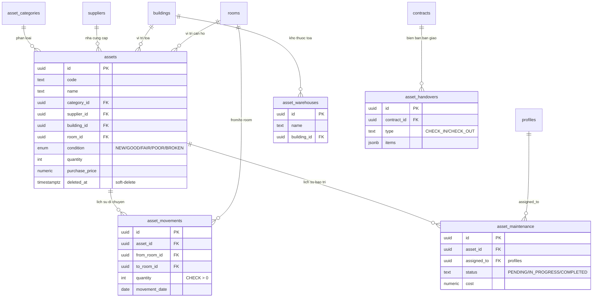
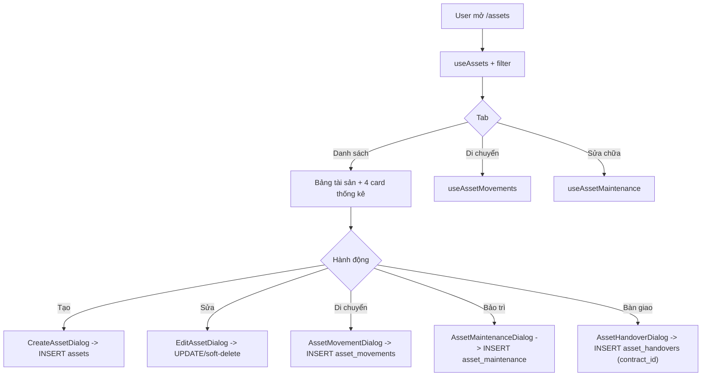

# Tài sản & Nội thất (Assets)

> Domain quản lý kho tài sản/nội thất của hệ thống CRM cho thuê: khai báo tài sản, gắn vào toà nhà/căn hộ, theo dõi tình trạng, ghi nhận di chuyển giữa các phòng/kho, lập phiếu bảo trì/sửa chữa, và lập biên bản bàn giao tài sản gắn với hợp đồng (HĐ).

## 1. Tổng quan & vai trò nghiệp vụ

Module Assets là **sổ kho tài sản cố định / nội thất** của chủ nhà. Mục tiêu nghiệp vụ:

- **Khai báo & định giá tài sản**: mỗi món (giường, tủ lạnh, máy lạnh…) là 1 dòng trong `assets`, có mã, loại (`asset_categories`), nhà cung cấp, giá mua, số lượng, tình trạng (`asset_condition`), và vị trí (toà nhà + căn hộ).
- **Theo dõi vòng đời tài sản**: tình trạng (Mới → Tốt → Khá → Kém → Hỏng) cập nhật thủ công; lịch sử **di chuyển** (`asset_movements`) và lịch sử **bảo trì** (`asset_maintenance`) là 2 sổ phụ ghi lại biến động.
- **Bàn giao theo hợp đồng**: `asset_handovers` là biên bản check-in/check-out gắn `contract_id` — đây là điểm **giao thoa với domain Hợp đồng**: khi khách nhận/trả căn hộ, hệ thống ghi nhận danh sách tài sản kèm tình trạng và chữ ký 2 bên.
- **Kho tài sản** (`asset_warehouses`): danh mục địa điểm lưu kho (có thể gắn toà nhà), dùng làm điểm xuất phát/đích khi tài sản chưa ở căn hộ nào.

Vị trí trong vòng đời tổng (lead → cọc → HĐ → chỉ số → hoá đơn → thu chi → báo cáo → lợi nhuận): Assets là **tài nguyên hỗ trợ vận hành**, không nằm trên trục dòng tiền chính. Nó nối vào vòng đời ở 2 điểm: (1) **HĐ** qua biên bản bàn giao tài sản, và (2) **chi phí** — giá mua tài sản và chi phí bảo trì là dữ liệu đầu vào cho phân tích chi phí vận hành (tuy hiện tại chưa tự sinh phiếu thu/chi từ các bảng này).

> Lưu ý quan trọng về kiến trúc: bảng `assets` **không có cột status/state về việc "đang cho thuê"**. Cột `condition` chỉ mô tả chất lượng vật lý (NEW/GOOD/FAIR/POOR/BROKEN), KHÔNG phải trạng thái thuê. Lịch sử trigger từng cố gán `IN_USE`/`AVAILABLE` vào `condition` nhưng đó là giá trị enum không hợp lệ → đã bị vô hiệu hoá (xem mục 4).

## 2. Cấu trúc dữ liệu

### 2.1 `assets` — Tài sản/nội thất

Bảng trung tâm của domain. Mỗi dòng là 1 món tài sản (hoặc 1 nhóm cùng loại với `quantity`).

- **`name`** (NOT NULL) — tên tài sản; **`code`** — mã tài sản tự đặt (không unique ở DB, hiển thị `font-mono` trong bảng).
- **`category_id`** → `asset_categories.id` — loại tài sản (bắt buộc ở form qua zod, nullable ở DB).
- **`supplier_id`** → `suppliers.id` — nhà cung cấp (domain Danh mục/Suppliers).
- **`purchase_date`** (date), **`purchase_price`** (numeric) — ngày mua & đơn giá. Giá trị tổng hiển thị = `purchase_price * quantity`.
- **`condition`** (`asset_condition`, default `GOOD`) — tình trạng vật lý. Enum: NEW/GOOD/FAIR/POOR/BROKEN.
- **`quantity`** (int, default 1) — số lượng.
- **`building_id`** → `buildings.id`, **`room_id`** → `rooms.id` — vị trí hiện tại (cả hai nullable; tài sản chưa gán vị trí coi như nằm kho/chung).
- **`images`** (jsonb, default `[]`) — mảng ảnh tài sản (không có UI upload trong các dialog hiện tại).
- **`description`** — mô tả.
- **`deleted_at`** — soft-delete; mọi query list đều `.is("deleted_at", null)`.
- id / user_id / created_at / updated_at — khoá + audit. `user_id` theo annotation RBAC là **audit-only** (quyền truy cập dựa trên `building_id` hoặc org-level, không phải `user_id`).

FK đi ra: `buildings`, `rooms`, `asset_categories`, `suppliers`.
Được tham chiếu bởi: `asset_movements.asset_id`, `asset_maintenance.asset_id`.

### 2.2 `asset_categories` — Loại tài sản

Danh mục phân loại tài sản (vd "Điện lạnh", "Nội thất gỗ"). Cột chủ chốt: **`name`** (NOT NULL), **`description`**. Là org-level entity (không gắn building). Được tham chiếu bởi `assets.category_id`.

### 2.3 `asset_movements` — Lịch sử di chuyển tài sản

Sổ ghi nhận mỗi lần tài sản chuyển từ phòng/kho này sang phòng/kho khác (append-only, không sửa/xoá trong UI).

- **`asset_id`** (NOT NULL) → `assets.id` — tài sản được di chuyển.
- **`from_room_id`** / **`to_room_id`** → `rooms.id` — phòng nguồn/đích (nullable).
- **`from_location`** / **`to_location`** (text) — nhãn vị trí dạng văn bản (snapshot tên phòng hoặc "Kho"), dùng khi nguồn/đích không phải 1 room cụ thể.
- **`quantity`** (NOT NULL, CHECK > 0), **`movement_date`** (NOT NULL), **`reason`**.

FK đi ra: `assets`, `rooms` (×2). Không có FK đi vào.

> Ghi chú: di chuyển hiện chỉ ghi log lịch sử — **KHÔNG tự cập nhật `assets.room_id`** sang phòng đích. Vị trí "hiện tại" của tài sản vẫn phải sửa thủ công qua EditAssetDialog nếu muốn đồng bộ.

### 2.4 `asset_maintenance` — Phiếu bảo trì/sửa chữa

Mỗi dòng là 1 yêu cầu bảo trì/sửa chữa cho 1 tài sản.

- **`asset_id`** (NOT NULL) → `assets.id`.
- **`issue_description`** (NOT NULL) — mô tả công việc/sự cố.
- **`maintenance_date`** (NOT NULL), **`cost`** (numeric, CHECK `NULL OR >= 0`).
- **`assigned_to`** → `profiles.id` — người được phân công xử lý.
- **`status`** (text, default `PENDING`, CHECK in `PENDING/IN_PROGRESS/COMPLETED`) — đây là **text có CHECK constraint, KHÔNG phải enum DB**.
- **`notes`**.

FK đi ra: `assets`, `profiles`. Không có FK đi vào.

### 2.5 `asset_warehouses` — Kho tài sản

Danh mục địa điểm lưu kho. Cột: **`name`** (NOT NULL, CHECK độ dài > 0), **`location`** (text), **`building_id`** → `buildings.id` (nullable, ON DELETE CASCADE). Quản lý ở trang Settings → Kho tài sản.

> Lưu ý: `asset_warehouses` hiện **chưa được tham chiếu trực tiếp** bởi `assets`/`asset_movements` (movements dùng `room_id`/`location` text). Đây là danh mục đứng riêng, dùng cho mục đích khai báo/tham chiếu thủ công.

### 2.6 `asset_handovers` — Biên bản bàn giao theo hợp đồng

Biên bản giao/nhận tài sản gắn với 1 HĐ — điểm giao thoa với domain Hợp đồng.

- **`contract_id`** (NOT NULL) → `contracts.id`.
- **`type`** (text, NOT NULL, CHECK in `CHECK_IN`/`CHECK_OUT`) — nhận căn hộ (vào) / trả căn hộ (ra).
- **`handover_date`** (NOT NULL).
- **`items`** (jsonb, NOT NULL) — danh sách tài sản bàn giao; cấu trúc dự kiến `[{ asset_id, quantity, condition, notes }, ...]` (theo comment migration). Form hiện nhập **chuỗi JSON thô**.
- **`landlord_signature`** / **`tenant_signature`** (text) — URL ảnh chữ ký (chưa có UI ký trong dialog hiện tại).
- **`notes`**.

FK đi ra: `contracts`. Không có FK đi vào.

## 3. Sơ đồ quan hệ dữ liệu

## 4. Quy tắc nghiệp vụ & tự động hoá

### 4.1 Enum `asset_condition`

`NEW, GOOD, FAIR, POOR, BROKEN` — chỉ phản ánh **chất lượng vật lý**. UI ánh xạ ở [`AssetsPage.tsx`](src/pages/assets/AssetsPage.tsx) (`CONDITION_CONFIG`): Mới / Tốt / Khá / Kém / Hỏng. Card thống kê gom "Tốt + Mới" và "Hỏng + Kém".

`status` của bảo trì (`PENDING/IN_PROGRESS/COMPLETED`) **không phải enum DB** mà là text + CHECK; UI ánh xạ ở `MAINTENANCE_STATUS_CONFIG`.

### 4.2 Trigger `update_asset_status_on_contract_change` — ĐÃ NO-OP

Đây là điểm cần nắm rõ vì lịch sử migration phức tạp:

- **Ban đầu** ([`008_triggers_functions.sql`](supabase/migrations/008_triggers_functions.sql)): trigger `AFTER INSERT OR UPDATE OF status ON contracts` cập nhật `rooms.status`/`beds.status` (tên hàm gây nhầm — thực ra động tới rooms/beds, không động tới assets).
- **Migration `20260528000006`** ([file](supabase/migrations/20260528000006_drop_beds_fix_triggers.sql)): sau khi drop `beds`, viết lại để khi HĐ ACTIVE thì `UPDATE assets SET condition='IN_USE'` và khi HĐ kết thúc thì `condition='AVAILABLE'`.
- **Lỗi**: `IN_USE`/`AVAILABLE` **không thuộc enum `asset_condition`** → ném `invalid input value for enum asset_condition`.
- **Sửa cuối cùng** ([`20260528000008_fix_asset_trigger_no_op.sql`](supabase/migrations/20260528000008_fix_asset_trigger_no_op.sql)): chuyển hàm thành **no-op** (`RETURN NEW`), giữ trigger để tránh DDL churn trên `contracts`.

→ **Invariant hiện tại**: thay đổi trạng thái HĐ **KHÔNG** tự động đổi gì trên `assets`. `assets.condition` chỉ do người dùng sửa thủ công.

### 4.3 Trigger gán `user_id` (audit) khi INSERT

Migration RBAC phase 5 ([`20260527000009_rbac_phase5_misc.sql`](supabase/migrations/20260527000009_rbac_phase5_misc.sql)) thêm các trigger `*_set_user_id_audit BEFORE INSERT` cho `asset_maintenance`, `asset_movements`, `asset_categories` — tự điền `user_id = auth.uid()` cho audit (dù hook FE cũng đã set `user_id` thủ công).

### 4.4 RLS — phân quyền theo RBAC (building-level vs org-level)

Bộ policy gốc ("Users can manage own…", chỉ `auth.uid() = user_id`) đã bị **drop** ở [`20260528000003_rbac_batch_f_drop_legacy.sql`](supabase/migrations/20260528000003_rbac_batch_f_drop_legacy.sql) và thay bằng policy RBAC trong phase 5:

- **`assets`** — quyền **lai building + org**: cho phép nếu super-admin/admin, hoặc (có `building_id` và `can_do_on_building('assets', <action>, building_id)`), hoặc (`building_id IS NULL` và `can_access_org_entity('assets', <action>)`). Áp dụng cho cả 4 hành động view/create/edit/delete; SELECT thêm điều kiện `deleted_at IS NULL` ở tầng hook.
- **`asset_categories` / `asset_maintenance` / `asset_movements`** — thuần **org-level**: `can_access_org_entity('assets', <action>)` (dùng chung "entity" `assets`).
- **`asset_warehouses`** — lai building + org nhưng dùng entity `'warehouses'` (`can_access_building` / `can_access_org_entity('warehouses', …)`).
- **`asset_handovers`** — phân quyền **theo toà của HĐ**: `can_do_on_building('assets', <action>, building_of_contract(contract_id))`.

> Hệ quả: nhân viên được giao 1 toà nhà có thể thấy/sửa tài sản gắn toà đó; tài sản `building_id = NULL` thì phải có quyền org-level `assets`. Loại tài sản, di chuyển, bảo trì đều ở mức org (toàn tổ chức).

### 4.5 Soft-delete

Xoá tài sản là soft-delete: `useDeleteAsset` chỉ `UPDATE assets SET deleted_at = now()` (xem [`useAssets.ts`](src/hooks/useAssets.ts)). Mọi danh sách lọc `deleted_at IS NULL`. Kho tài sản (`asset_warehouses`) thì **hard-delete** (`.delete()` trong [`useAssetWarehouses.ts`](src/hooks/useAssetWarehouses.ts)).

## 5. Quy trình theo từng trang (page)

### 5.1 `/assets` — Trang Quản lý Tài sản (chính)

File: [`AssetsPage.tsx`](src/pages/assets/AssetsPage.tsx). Đây là page chính, gom toàn bộ thao tác của domain qua các dialog.

**Dữ liệu hiển thị**:
- `useAssets({category_id, building_id, condition})` — danh sách tài sản (join category/supplier/building/room), lọc server-side theo loại/toà/tình trạng; lọc theo **căn hộ** và **từ khoá** là client-side ở `filteredAssets`.
- `useAssetMovements()` — lịch sử di chuyển (tab 2).
- `useAssetMaintenance()` — lịch sử sửa chữa (tab 3).
- `useQuery(["asset-categories"])`, `useBuildings()`, `useRooms(buildingFilter)` — đổ dropdown filter (dùng `SearchableSelect` đúng quy ước repo).

4 card tổng hợp: Tổng số tài sản, Giá trị tổng (`Σ purchase_price*quantity`), Tốt/Mới, Hỏng/Kém — tính từ `filteredAssets`.

**Thao tác chính (theo từng bước)**:

1. **Tạo tài sản** (nút "Tạo tài sản" → [`CreateAssetDialog`](src/components/assets/CreateAssetDialog.tsx)):
   - Validate zod: `name` bắt buộc, `category_id` bắt buộc, `quantity >= 1`, `condition` ∈ enum, `purchase_price >= 0`. `code/supplier_id/building_id/room_id/purchase_date/description` optional.
   - Submit → `useCreateAsset` → `INSERT assets` kèm `user_id`. Các trường rỗng được map `|| null`.
   - onSuccess: invalidate `["assets"]`, toast, đóng dialog.
   - **Edge case**: building/room độc lập (form không lọc room theo building đã chọn — danh sách room đầy đủ); chọn room không khớp building sẽ tạo dữ liệu vị trí mâu thuẫn (không có guard).

2. **Sửa / Xoá tài sản** (nút "Sửa" mỗi dòng → [`EditAssetDialog`](src/components/assets/EditAssetDialog.tsx)):
   - `useUpdateAsset` cập nhật trực tiếp bảng; `useDeleteAsset` soft-delete (`deleted_at`).

3. **Di chuyển** (nút "Di chuyển" → [`AssetMovementDialog`](src/components/assets/AssetMovementDialog.tsx)):
   - Validate: `asset_id` & `to_room_id` bắt buộc, `quantity >= 1`, `movement_date` bắt buộc; `from_room_id` optional.
   - Snapshot `from_location` = tên phòng hiện tại của tài sản, `to_location` = tên phòng đích → ghi vào movement (cho lịch sử đọc được kể cả khi phòng đổi tên).
   - Submit → `useCreateAssetMovement` → `INSERT asset_movements`. **Không** cập nhật `assets.room_id`.
   - **Edge case**: chọn cùng phòng nguồn/đích không bị chặn; `quantity` di chuyển không kiểm tra so với tồn của tài sản.

4. **Bảo trì** (nút "Bảo trì" → [`AssetMaintenanceDialog`](src/components/assets/AssetMaintenanceDialog.tsx)):
   - Validate: `asset_id` & `issue_description` & `maintenance_date` bắt buộc; `cost >= 0` optional; `status` ∈ PENDING/IN_PROGRESS/COMPLETED.
   - Dropdown "Phân công cho" hiện chỉ load **profile của chính user đang đăng nhập** (`.eq('id', user.id)`), nên thực tế chỉ tự gán mình.
   - Submit → `useCreateAssetMaintenance` → `INSERT asset_maintenance`.

5. **Biên bản bàn giao** (nút "Biên bản bàn giao" → [`AssetHandoverDialog`](src/components/assets/AssetHandoverDialog.tsx)):
   - Validate: `contract_id` bắt buộc (dropdown từ `useContracts`), `handover_type` ∈ CHECK_IN/CHECK_OUT, `handover_date` bắt buộc, `items` là chuỗi non-empty.
   - Submit → `useCreateAssetHandover` → `INSERT asset_handovers` (map `handover_type` → cột `type`). **`items` được lưu nguyên dạng chuỗi nhập tay** (`items as any`) — chưa parse/validate JSON, chưa picker chọn tài sản; chữ ký landlord/tenant chưa có UI.

### 5.2 `/settings/categories/warehouses` — Kho tài sản

File: [`WarehousesPage.tsx`](src/pages/settings/categories/WarehousesPage.tsx). Dùng khung CRUD chung `CategoryCrudPage` với 2 cột (Tên kho, Vị trí) và 2 field (name bắt buộc, location textarea).

- Đọc: `useAssetWarehouses()`; Tạo/Sửa/Xoá: `useCreateAssetWarehouse` / `useUpdateAssetWarehouse` / `useDeleteAssetWarehouse` ([`useAssetWarehouses.ts`](src/hooks/useAssetWarehouses.ts)).
- Tạo tự gắn `user_id`; **xoá là hard-delete**.

### 5.3 Trang Settings còn lại — Placeholder (chưa triển khai)

- [`AssetTypesPage.tsx`](src/pages/settings/categories/AssetTypesPage.tsx) (`/settings/categories/asset-types`) — chỉ render `PlaceholderPage`. **Loại tài sản (`asset_categories`) hiện CHƯA có UI CRUD riêng** — chỉ được đọc để đổ dropdown trong CreateAssetDialog/filter. Muốn thêm loại phải insert trực tiếp DB.
- [`AssetMovementsPage.tsx`](src/pages/settings/categories/AssetMovementsPage.tsx) (`/settings/categories/asset-movements`) — placeholder; lịch sử di chuyển thực tế xem ở tab trong `/assets`.
- [`AssetMaintenancePage.tsx`](src/pages/settings/categories/AssetMaintenancePage.tsx) (`/settings/categories/asset-maintenance`) — placeholder; lịch sử bảo trì xem ở tab trong `/assets`.

> Đây là chi tiết dễ gây hiểu nhầm: 3 route Settings trên tồn tại trong [`App.tsx`](src/App.tsx) nhưng chỉ là khung rỗng. Toàn bộ nghiệp vụ thực sự nằm ở `/assets`.

## 6. Liên kết sang domain khác (vào/ra)

- **→ Hợp đồng (Contracts)**: `asset_handovers.contract_id` → `contracts.id`. AssetHandoverDialog load HĐ qua `useContracts`; RLS handover phân quyền theo `building_of_contract(contract_id)`. Trigger `update_asset_status_on_contract_change` bám trên `contracts` nhưng đã no-op (không còn ảnh hưởng).
- **→ Toà nhà / Căn hộ (Buildings/Rooms)**: `assets.building_id`/`room_id`, `asset_movements.from_room_id`/`to_room_id`, `asset_warehouses.building_id` đều trỏ sang domain bất động sản. Vị trí tài sản = nguồn dữ liệu cho biết món đồ nằm ở căn nào.
- **→ Nhà cung cấp (Suppliers/Danh mục)**: `assets.supplier_id` → `suppliers.id` — phục vụ truy nguồn mua sắm.
- **→ Nhân sự (Profiles/RBAC)**: `asset_maintenance.assigned_to` → `profiles.id` — người xử lý bảo trì. Toàn bộ quyền truy cập domain dựa trên hệ RBAC (`can_do_on_building`/`can_access_org_entity`/`is_admin`).
- **→ Chi phí / Báo cáo (gián tiếp)**: `assets.purchase_price` và `asset_maintenance.cost` là dữ liệu chi phí tài sản; hiện **chưa** có cơ chế tự sinh phiếu thu/chi (income_expenses) từ các bảng này — nếu cần đưa vào báo cáo lợi nhuận phải nhập phiếu chi thủ công ở domain Thu chi.
