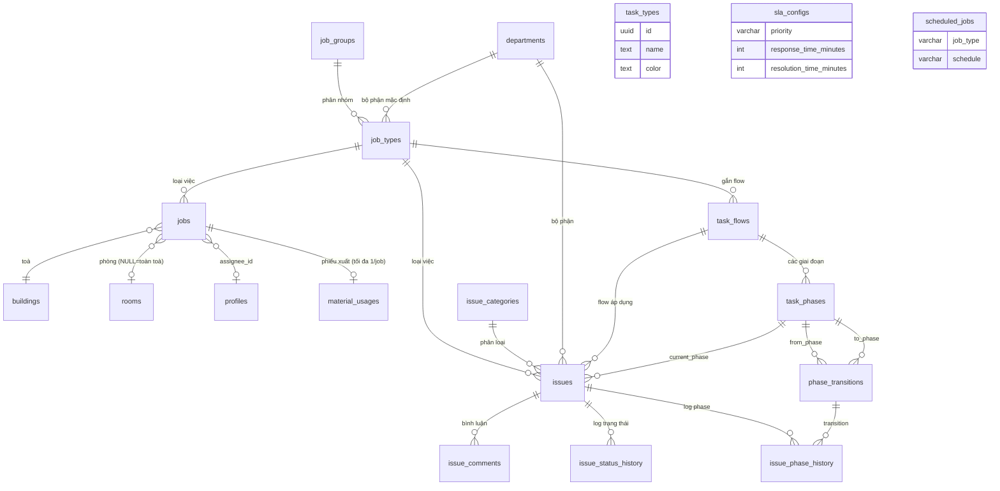
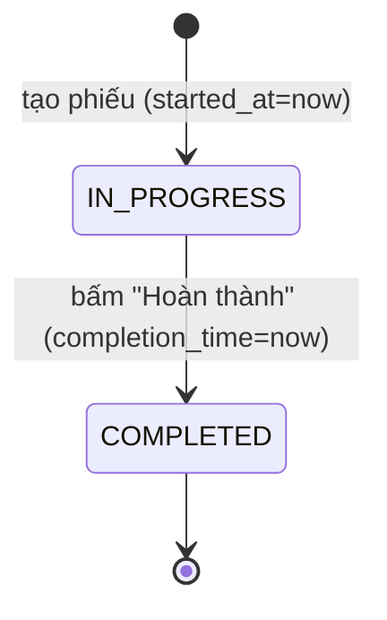
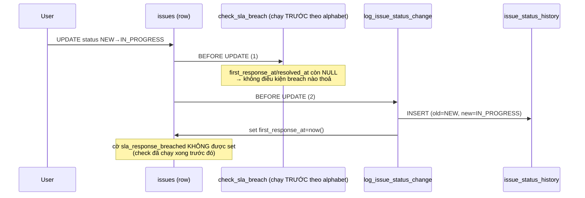
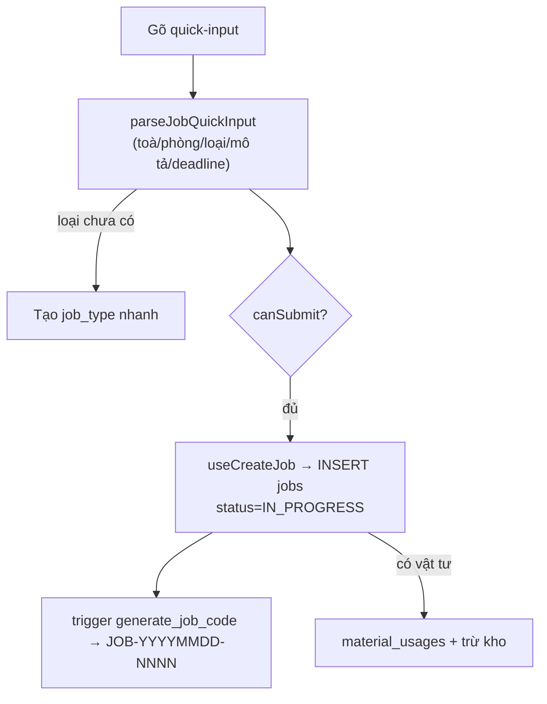

# Công việc · Sự cố · Quy trình (Jobs, Issues, Workflows)

## 1. Tổng quan & vai trò nghiệp vụ

Domain này quản lý **việc vận hành toà nhà** — từ một yêu cầu nhỏ ("phòng 201 sửa vòi nước") tới một sự cố lớn cần đi qua nhiều giai đoạn (tiếp nhận → xử lý → đánh giá → hoàn thành). Trong vòng đời tổng của CRM (lead → cọc → HĐ → chỉ số → hoá đơn → thu chi → báo cáo → lợi nhuận), domain này nằm ở khâu **vận hành sau khi khách đã thuê**: khách/nhân viên báo việc cần làm, hệ thống giao việc, theo dõi tiến độ, và khi làm xong có thể **trừ vật tư từ kho** (material_usages) — chi phí đó về sau chảy vào thu chi / báo cáo lợi nhuận.

Điểm cốt lõi: tồn tại **hai hệ song song, độc lập** trong cùng domain:

| | **jobs** (Công việc) | **issues** (Sự cố) |
|---|---|---|
| Bản chất | Phiếu việc vận hành đơn giản, vòng đời 2 trạng thái | Sự cố/ticket có workflow nhiều giai đoạn + SLA |
| Trạng thái | `IN_PROGRESS` / `COMPLETED` (text, CHECK) | enum `issue_status` (6 giá trị) + phase trong flow |
| UI hiện có | **Có** — `/tasks` (TaskManagementPage) | **Chưa có trang** quản lý; Dashboard đọc thống kê; 3 điểm điều hướng chết tới `/issues` (xem mục 5) |
| Mã phiếu | `JOB-YYYYMMDD-NNNN` (trigger `generate_job_code`) | **Không có** — bảng `issues` không có cột `code`; seed `code_sequences` (`ISSUE`, prefix `IS`) tồn tại nhưng không trigger/RPC nào gán mã cho issues |
| Workflow | Không (đã đơn giản hoá, bỏ nghiệm thu) | `task_flows → task_phases → phase_transitions` |
| SLA | Không | `sla_configs` + `set_issue_sla` / `check_sla_breach` |
| Lịch sử | `started_at`, `completion_time` trên chính phiếu | `issue_status_history`, `issue_phase_history`, `issue_comments` |

> **Trạng thái thực tế của codebase:** Hệ **jobs** đang chạy đầy đủ trên UI (`/tasks`). Hệ **issues** và toàn bộ máy workflow (`task_flows`, `task_phases`, `phase_transitions`, `sla_configs`, `scheduled_jobs`, `task_types`) đã có **schema + trigger + RLS** ở DB nhưng **chưa có trang quản trị** trong `src/`. Frontend chỉ chạm tới `issues` qua [useDashboard.ts](src/hooks/useDashboard.ts) (đếm sự cố chưa xử lý, cảnh báo khẩn >24h, feed "Hoạt động gần đây" 7 ngày) và chạm `departments` qua [useJobTypes.ts](src/hooks/useJobTypes.ts). Tài liệu này mô tả cả hai để phản ánh đúng dữ liệu thật.

Các bảng danh mục đi kèm: `job_types` (loại công việc — có default priority/deadline/department/auto-assign), `job_groups` (nhóm loại), `departments` (bộ phận), `issue_categories` (danh mục sự cố), `task_types` (danh mục loại đơn giản, tách riêng).

---

## 2. Cấu trúc dữ liệu

### 2.1. Hệ JOBS (công việc vận hành)

#### `jobs` — phiếu công việc
Mục đích: một việc vận hành cụ thể gắn với toà/phòng, giao cho người thực hiện, có hạn hoàn thành.

Cột chủ chốt:
- `code` (UNIQUE, NOT NULL) — mã `JOB-YYYYMMDD-NNNN`, **tự sinh** bởi trigger khi để trống.
- `title`, `description` — tiêu đề ghép `(loại) (mô tả)`; description lưu nguyên chuỗi quick-input.
- `building_id`, `room_id` — vị trí; `room_id` có thể NULL nếu là việc **toàn toà** (nhập `tn` ở ô phòng).
- `job_type_id` — loại công việc (FK `job_types`).
- `priority` (text, DEFAULT `NORMAL`, CHECK ∈ {`NORMAL`,`LOW`,`URGENT`}) — **lưu ý**: tập giá trị này KHÁC enum `issue_priority`. Form **tạo** ([TaskCreateDialog](src/components/tasks/TaskCreateDialog.tsx)) luôn gửi cứng `NORMAL`; form **sửa** ([TaskEditDialog](src/components/tasks/TaskEditDialog.tsx)) có Select "Mức độ ưu tiên" cho đổi giữa 3 mức, và [TaskFiltersPanel](src/components/tasks/TaskFiltersPanel.tsx) có ô lọc theo priority.
- `assignee_id` (FK `profiles`) **hoặc** `assignee_name` (text tự do) — giao cho user có hồ sơ, hoặc gõ tên tự do khi người đó chưa có account.
- `deadline` — hạn hoàn thành (mặc định: cuối ngày mai nếu không nhập).
- `status` (text, DEFAULT `IN_PROGRESS`, CHECK ∈ {`IN_PROGRESS`,`COMPLETED`}) — chỉ 2 trạng thái sau khi [đơn giản hoá vòng đời](supabase/migrations/20260516000053_jobs_simplify_status.sql).
- `started_at` — set = now() lúc tạo; `completion_time` — set khi bấm Hoàn thành.
- `visible_to_customer` (bool) — có cho khách thấy không.
- `attachments` (jsonb) — ảnh đính kèm; khi tạo lưu ảnh ban đầu, khi Hoàn thành ảnh "đã làm" được GỘP vào chính cột này (`useCompleteJob` ghi merged vào `attachments`). URL trỏ bucket `job-attachments` — bucket này đã chuyển **PRIVATE** ([20260601000200](supabase/migrations/20260601000200_sec_private_buckets.sql)): policy SELECT chỉ cho `authenticated`, FE hiển thị qua `StorageImage`/`useSignedUrl` ([TaskDetailDialog](src/components/tasks/TaskDetailDialog.tsx) dùng cả lightbox ảnh/PDF qua signed URL); URL public-legacy đã lưu trong DB vẫn được StorageImage quy đổi. Lưu ý: mảng merge khi Hoàn thành tính ở **client** ([TaskCompleteDialog](src/components/tasks/TaskCompleteDialog.tsx) gộp ảnh cũ trong props + ảnh mới) — nếu người khác vừa sửa attachments thì bản merge cũ sẽ đè mất.
- `completion_description` — **đang dùng tích cực** làm field "Ghi chú đánh giá": [TaskNotesDialog](src/components/tasks/TaskNotesDialog.tsx) ghi (patch `completion_description`), [TaskDetailDialog](src/components/tasks/TaskDetailDialog.tsx) hiển thị khi `COMPLETED`.
- `completion_attachments` và các cột `acceptance_result`, `customer_evaluation`, `customer_comments`, `accepted_at` — **di sản** của flow nghiệm thu cũ, hiện không còn dùng trên UI.
- id/created_at/updated_at: chuẩn. `user_id` = **người tạo phiếu** (cột audit), KHÔNG còn là khoá tenant/access control sau RBAC phase 5: [useCreateJob](src/hooks/useJobs.ts) gán `user_id` = auth user hiện tại (staff tạo phiếu thì là id của staff, không phải owner); trigger `jobs_set_user_id_audit` ([set_user_id_from_auth](supabase/migrations/20260527000006_rbac_phase2_trigger_auto_user_id.sql)) chỉ fill khi NULL — comment trong migration ghi rõ "dùng cho audit; không tham gia access control".

FK đi ra: `assignee_id→profiles`, `building_id→buildings`, `room_id→rooms`, `job_type_id→job_types`.
Được tham chiếu: `material_usages.job_id` — phiếu xuất vật tư gắn vào job (domain Vật tư/Kho).

> **Ghi chú lịch sử:** bảng `jobs` gốc ([20251121000001](supabase/migrations/20251121000001_create_jobs_table.sql)) từng có `bed_id` và `job_group_id` — cả hai đã bị **drop** ([20260516000001](supabase/migrations/20260516000001_jobs_drop_job_group_id.sql) bỏ `job_group_id` — loại việc chỉ còn qua `job_type_id`; [20260528000005](supabase/migrations/20260528000005_drop_beds.sql) bỏ `bed_id` cùng đợt bỏ bảng beds). Index hiện có: `user_id`/`status`/`building_id`/`assignee_id`/`created_at` — KHÔNG có index trên `room_id`/`job_type_id` dù filter server-side có dùng.

#### `job_types` — loại công việc (danh mục có cấu hình)
Mục đích: định nghĩa sẵn priority mặc định, các deadline (tính bằng **phút**), bộ phận xử lý, và cờ auto-assign.

Cột chủ chốt:
- `name`, `job_group_id` (FK `job_groups`), `description`.
- `default_priority` (enum **`issue_priority`**, DEFAULT `MEDIUM`) — chú ý dùng enum issue_priority, không phải tập của jobs.
- `customer_contact_deadline`, `acceptance_deadline`, `completion_deadline` (int phút, ≥0; 0 = không áp dụng) — khung thời gian liên hệ khách / bộ phận nhận việc / hoàn thành.
- `business_hours_only` (bool) — tính deadline theo giờ hành chính (9–18h) hay 24/7.
- `default_department_id` (FK `departments`) — bộ phận mặc định.
- `auto_assign` (bool) — cờ tự động giao việc (logic auto-assign chưa hiện diện trong code FE/trigger; là cấu hình dự phòng).
- `is_active`.

FK đi ra: `job_group_id→job_groups`, `default_department_id→departments`.
Được tham chiếu: `issues.job_type_id`, `jobs.job_type_id`, `task_flows.job_type_id`.

#### `job_groups` — nhóm loại công việc
`name`, `description`, `color`, `icon` (hiển thị UI). Được tham chiếu bởi `job_types.job_group_id`.

#### `task_types` — danh mục loại (đơn giản, độc lập)
Bảng danh mục riêng (`name`, `description`, `color`), **không có FK** tới jobs/issues. Là danh mục "Loại công việc" tách rời, tạo ở migration khác ([20250101000010](supabase/migrations/20250101000010_create_task_types_and_asset_warehouses.sql)). Lưu ý: trang `TaskTypesPage.tsx` (route `/settings/categories/task-types`) **không** quản lý bảng `task_types` này — nó quản lý `job_types` (xem mục 5.2). `task_types` là bảng danh mục cũ/song song.

### 2.2. Hệ ISSUES (sự cố + workflow + SLA)

#### `issues` — sự cố / ticket
Mục đích: theo dõi sự cố do khách thuê hoặc nhân viên báo, có phân loại, ưu tiên, SLA, và (tuỳ chọn) chạy theo workflow phase.

Cột chủ chốt:
- `title`, `description` (NOT NULL), `category_id` (FK `issue_categories`).
- `priority` (enum `issue_priority`, DEFAULT `MEDIUM`), `status` (enum `issue_status`, DEFAULT `NEW`).
- Vị trí: `building_id`, `room_id`, `contract_id`.
- Người báo: `reported_by_tenant_id` (FK `tenants`), `reported_by_staff_id` (FK `profiles`).
- Giao việc: `assigned_to` (FK `profiles`), `assigned_at`.
- Mốc thời gian: `due_date`, `resolved_at`, `closed_at`.
- Chi phí: `estimated_cost`, `actual_cost` (≥0).
- Đánh giá khách: `rating` (1–5), `feedback`.
- **Workflow** (thêm ở migration 016): `job_type_id`, `flow_id` (FK `task_flows`), `current_phase_id` (FK `task_phases`), `department_id` (FK `departments`).
- **SLA** (thêm ở migration 029): `sla_due_date`, `sla_response_time_minutes`, `sla_resolution_time_minutes`, `first_response_at`, `sla_breached`, `sla_response_breached`.
- `images`, `attachments` (jsonb).
- **Không có cột `code`** — sự cố không có mã phiếu (seed `code_sequences` object_type `ISSUE` tồn tại nhưng `generate_next_code()` không được gọi cho issues — xem mục 1).
- Index: các index đơn cột user_id/category/priority/status/building/room/assigned_to/created_at ([006_asset_issue_tables](supabase/migrations/006_asset_issue_tables.sql)) + job_type_id/flow_id/current_phase_id/department_id (thêm ở [016_job_workflow_tables](supabase/migrations/016_job_workflow_tables.sql)); ngoài ra có GIN full-text `idx_issues_search` trên `to_tsvector('simple', coalesce(title,'') || ' ' || coalesce(description,''))` — sẵn cho search toàn văn, chưa UI nào dùng.

FK được tham chiếu: `issue_comments.issue_id`, `issue_phase_history.issue_id`, `issue_status_history.issue_id`, `notifications.issue_id`.

#### `issue_categories` — danh mục sự cố
`name`, `description`, `color`, `icon`, `is_active`. Được tham chiếu bởi `issues.category_id`.

#### `issue_comments` — bình luận / cập nhật trên sự cố
`issue_id`, `user_id`, `comment` (NOT NULL), `images` (jsonb). RLS: policy phẳng `can_access_org_entity('tasks', …)` — KHÔNG check per-row theo issue (xem mục 4.6).

#### `issue_status_history` — nhật ký đổi trạng thái sự cố
`issue_id`, `old_status`/`new_status` (varchar), `changed_by`, `notes`. **Tự động ghi** bởi trigger `log_issue_status_change` mỗi khi `status` đổi.

#### `issue_phase_history` — nhật ký đi qua các giai đoạn (phase)
`issue_id`, `from_phase_id`/`to_phase_id` (FK `task_phases`), `transition_id` (FK `phase_transitions`), `user_id`, `entered_at`/`exited_at`/`duration_minutes`, `comment`, `attachments`. Là dấu vết kiểm toán cho máy workflow.

### 2.3. Máy WORKFLOW (định nghĩa quy trình)

#### `task_flows` — định nghĩa quy trình
`name`, `description`, `job_type_id` (gắn loại việc, optional), `is_active`, `is_default` (flow mặc định cho issue không chỉ định flow). Được tham chiếu: `issues.flow_id`, `task_phases.flow_id`.

#### `task_phases` — giai đoạn trong quy trình
Mục đích: từng bước của flow, có ràng buộc hành động và quyền.
- `flow_id` (FK `task_flows`, ON DELETE CASCADE), `name`, `sequence_order` (>0, UNIQUE theo flow).
- `phase_type` (text, CHECK ∈ {`START`,`PROCESS`,`REVIEW`,`COMPLETE`,`CANCEL`}).
- `auto_transition` + `transition_conditions` (jsonb) — tự chuyển khi đủ điều kiện.
- `time_limit` (phút) — thời hạn ở giai đoạn này.
- `require_comment` / `require_attachment` / `require_rating` — bắt buộc khi rời giai đoạn.
- `allowed_departments` (uuid[]) — bộ phận được xử lý phase.
- `notify_on_enter` + `notify_template_id` — gửi thông báo khi vào phase.
- `color`, `icon`.
Được tham chiếu: `issue_phase_history.from/to_phase_id`, `issues.current_phase_id`, `phase_transitions.from/to_phase_id`.

#### `phase_transitions` — chuyển dịch hợp lệ giữa hai phase
`from_phase_id` → `to_phase_id` (khác nhau, CHECK), `name` (vd "Approve"/"Reject"/"Forward"), `require_approval` + `approval_roles` (text[]), `actions` (jsonb hành động khi chuyển), `button_label`/`button_color`. Được tham chiếu bởi `issue_phase_history.transition_id`.

#### `sla_configs` — cấu hình SLA theo độ ưu tiên
`priority` (varchar: URGENT/HIGH/MEDIUM/LOW, UNIQUE theo user), `response_time_minutes` (thời gian phản hồi đầu), `resolution_time_minutes` (thời gian giải quyết), `is_active`. Seed mặc định: URGENT 30/240, HIGH 60/480, MEDIUM 240/1440, LOW 480/2880 (phút) — **lưu ý**: seed ([029_missing_features](supabase/migrations/029_missing_features.sql)) chỉ chèn cho các user **đã có issues** tại thời điểm chạy migration (`FROM (SELECT DISTINCT user_id FROM issues)`); user mới không có sla_configs, nên `set_issue_sla` để NULL toàn bộ SLA cho họ.

### 2.4. Danh mục & lập lịch dùng chung

#### `departments` — bộ phận
`code` (UNIQUE theo user), `name`, `description`, `manager_id` (FK `profiles`), `phone`, `email`, `is_active`. Được tham chiếu: `issues.department_id`, `job_types.default_department_id`.

#### `scheduled_jobs` — tác vụ lập lịch (cron-like)
`job_type` (varchar: `AUTO_INVOICE`/`OVERDUE_CHECK`/`SLA_CHECK`…), `schedule` (cron hoặc `DAILY`/`MONTHLY`), `last_run_at`/`next_run_at`, `is_active`, `config` (jsonb). Bảng cấu hình lịch dùng chung toàn hệ — **không chỉ riêng** domain công việc (vd dùng cho sinh hoá đơn tự động). Lưu ý phân biệt với tên hàm `run_recurring_vouchers_job()` thuộc domain Thu chi.

---

## 3. Sơ đồ quan hệ dữ liệu

Hai cụm node `task_types`, `sla_configs`, `scheduled_jobs` đứng tách (không FK trực tiếp tới jobs/issues) — `sla_configs` được match theo `priority`+`user_id` trong trigger, `task_types`/`scheduled_jobs` là danh mục/cấu hình độc lập.

---

## 4. Quy tắc nghiệp vụ & tự động hoá

### 4.1. `generate_job_code()` — trigger BEFORE INSERT trên `jobs`
Điều kiện kích hoạt: `WHEN (NEW.code IS NULL OR NEW.code = '')`. Sinh mã `JOB-YYYYMMDD-NNNN`, NNNN = (MAX số trong ngày) + 1, pad 4 chữ số.

Bản vá quan trọng ([20260527000001](supabase/migrations/20260527000001_fix_generate_job_code_rls.sql)):
- Chuyển sang **SECURITY DEFINER** + `SET search_path = public, pg_temp` để khi SELECT MAX(code) **không bị RLS lọc theo user_id của caller** — nếu không, staff tạo job đầu tiên sẽ tính ra `-0001` đã tồn tại của owner → lỗi UNIQUE (23505).
- Thêm `pg_advisory_xact_lock(hashtext('jobs_code:' || ngày))` để **serialize** việc cấp số trong cùng ngày, tránh race khi 2 INSERT đồng thời.

**Invariant:** mã job là duy nhất toàn bảng, đánh số liên tục trong ngày, không phụ thuộc tenant.

### 4.2. Vòng đời `jobs` đã đơn giản hoá
[Migration 20260516000053](supabase/migrations/20260516000053_jobs_simplify_status.sql) bỏ flow nghiệm thu:
- Default mới `IN_PROGRESS` (tạo phiếu vào thẳng "đang làm").
- CHECK chỉ cho 2 giá trị `IN_PROGRESS` / `COMPLETED`.
- Dữ liệu cũ migrate: `NOT_STARTED → IN_PROGRESS`; `PENDING_ACCEPTANCE/ACCEPTED/FAILED/OVERDUE → COMPLETED`.

"Trễ hẹn" (overdue) **không phải trạng thái DB** — tính ở client bởi `isOverdue()` trong [jobValidation.ts](src/lib/jobValidation.ts): phiếu chưa COMPLETED và `deadline < now`.

### 4.3. `set_issue_sla()` — trigger BEFORE INSERT trên `issues`
Khi tạo sự cố: tra `sla_configs` theo `user_id` + `priority::text` (active), rồi gán `sla_response_time_minutes`, `sla_resolution_time_minutes`, và `sla_due_date = created_at + resolution_time phút`. Nếu không có config khớp → để NULL (user tạo sau migration 029 không có seed config — xem mục 2.3).

### 4.4. `check_sla_breach()` — trigger BEFORE UPDATE trên `issues`
- Khi `first_response_at` lần đầu được set (OLD NULL → NEW có): nếu trễ hơn `created_at + response_time` → `sla_response_breached = TRUE`.
- Khi `resolved_at` lần đầu được set: nếu vượt `sla_due_date` → `sla_breached = TRUE`.

> **⚠️ Máy SLA hỏng ngầm do thứ tự trigger:** Postgres bắn các trigger BEFORE UPDATE cùng bảng theo thứ tự **alphabet tên trigger** — `trigger_check_sla_breach` ('c') chạy **TRƯỚC** `trigger_log_issue_status_change` ('l'). Khi client chỉ UPDATE `status`, lúc check chạy thì `first_response_at`/`resolved_at` vẫn NULL (trigger log chưa kịp set) → điều kiện "OLD NULL → NEW NOT NULL" không bao giờ thoả → cờ `sla_response_breached`/`sla_breached` **không bao giờ được tính** cho luồng đổi-status. Cờ breach chỉ hoạt động nếu client tự set `first_response_at`/`resolved_at` trong một UPDATE riêng. Hướng sửa khi cần: gộp logic check vào cuối `log_issue_status_change`, hoặc đổi tên trigger để check chạy sau (vd `zz_check_sla_breach`), hoặc chuyển check sang AFTER UPDATE.

### 4.5. `log_issue_status_change()` — trigger BEFORE UPDATE trên `issues`
Chỉ chạy khi `status` thực sự đổi (`IS DISTINCT FROM`). Tác động:
1. Ghi 1 dòng `issue_status_history` (old/new status, `changed_by = auth.uid()`).
2. Nếu chuyển sang `RESOLVED`/`CLOSED` (mà trước đó chưa) → set `resolved_at = now()`.
3. Nếu chuyển từ `NEW` sang `IN_PROGRESS`/`ASSIGNED` lần đầu → set `first_response_at = now()`.

**Invariant SLA (thực tế):** `first_response_at` và `resolved_at` được trigger đặt tự động theo luồng trạng thái; nhưng cờ breach **KHÔNG** được tính trong cùng câu UPDATE đó, vì `check_sla_breach` đã chạy xong trước khi các mốc này được set (xem cảnh báo mục 4.4).

### 4.6. RLS & phân quyền (RBAC theo toà — từ 2026-05-27/28)

Toàn bộ policy đời cũ (owner-only `auth.uid() = user_id` + hệ `*_staff_*` qua `staff_can`) trên jobs/issues/issue_comments/job_groups/job_types/task_flows/task_phases/phase_transitions đã bị **DROP sạch** ở [batch F](supabase/migrations/20260528000003_rbac_batch_f_drop_legacy.sql). Cơ chế hiện hành:

- **jobs & issues** — policy **hybrid theo toà** ([rbac_phase5_misc](supabase/migrations/20260527000009_rbac_phase5_misc.sql)):
  - SELECT (`jobs_select_rbac`/`issues_select_rbac`): `is_super_admin()`/`is_admin()` bypass; staff pass qua `can_access_building(building_id)` — có `staff_assignments` với `building_id` NULL (mọi toà) hoặc trùng toà ([rbac_helpers](supabase/migrations/20260527000053_rbac_helpers.sql)).
  - INSERT/UPDATE/DELETE: `can_do_on_building('tasks', action, building_id)` — check `COALESCE(staff_assignments.permissions, roles.permissions)` (override per-staff, [per_staff_permissions](supabase/migrations/20260529000001_per_staff_permissions.sql)).
  - Phiếu `building_id` NULL rơi về fallback `can_access_org_entity('tasks', action)` — không scope toà.
  - Hệ quả: ranh giới dữ liệu của domain này đi theo **toà nhà** (qua `staff_assignments.building_id`), không theo owner — staff được phân công toà thấy TẤT CẢ phiếu trong toà.
- **task_flows / task_phases / phase_transitions** → module **`task_types`** (KHÔNG phải `tasks`) qua `can_access_org_entity` phẳng — không còn EXISTS join về `task_flows.user_id`/owner ([batch A](supabase/migrations/20260528000001_rbac_batch_a_config_tables.sql)).
- **issue_comments / issue_phase_history / issue_status_history** → `can_access_org_entity('tasks', …)` phẳng, KHÔNG check per-row theo issue.
- **job_groups** → module `tasks`; **job_types** → module **`task_types`** (đều org-level, không theo toà).
- **sla_configs / scheduled_jobs** → module **`settings`**; **issue_categories** → module **`categories`** ([batch A](supabase/migrations/20260528000001_rbac_batch_a_config_tables.sql)) — trang quản trị tương lai cho SLA/lập lịch cần quyền `settings`, không phải `tasks`.
- **Trigger audit `set_user_id_from_auth`**: jobs, issues, issue_comments, job_groups, job_types, issue_categories, issue_*_history, task_flows, sla_configs, scheduled_jobs đều có trigger BEFORE INSERT `*_set_user_id_audit` tự gán `user_id = auth.uid()` khi NULL — chỉ phục vụ audit (ai tạo row), không tham gia access control.
- **Ma trận quyền UI** ([permissions.ts](src/lib/permissions.ts)): nhóm "Vận hành & Báo cáo" khai báo module `tasks` (nhãn "Công việc", quyền mở rộng `approve`) và `task_types` (nhãn "Loại công việc"). Quyền `approve` hiện **chưa được policy/UI nào tiêu thụ** — cấu hình dự phòng tương tự cờ `auto_assign`.

### 4.7. Liên kết vật tư (side-effect khi tạo job)
Khi tạo job kèm vật tư, FE gọi [useUpsertJobMaterialUsage](src/hooks/useMaterialUsages.ts) → tạo `material_usages` (gắn `job_id`) + items, **tự trừ kho** (trigger recompute tồn kho). Đây là cầu nối tới domain Vật tư/Kho và sau đó là chi phí. Hai ràng buộc quan trọng ([20260529000004](supabase/migrations/20260529000004_create_materials_inventory.sql)):
- **1 phiếu xuất / 1 job**: UNIQUE partial index `uq_material_usages_job` trên `job_id` (WHERE job_id IS NOT NULL) — vì vậy hook hoạt động kiểu "upsert": phiếu đã tồn tại thì update header + xoá toàn bộ items cũ rồi chèn lại (lưu items rỗng → xoá luôn header).
- **`job_id` ON DELETE CASCADE**: xoá job sẽ xoá luôn phiếu xuất + items; tồn kho được recompute lại qua trigger.

Lưu ý: tạo job + trừ kho **không nguyên tử** — job INSERT xong mới upsert vật tư; nếu bước vật tư lỗi thì chỉ toast cảnh báo, job vẫn tồn tại không có phiếu xuất (comment trong [TaskCreateDialog](src/components/tasks/TaskCreateDialog.tsx): "job đã tạo nên không rollback").

---

## 5. Quy trình theo từng trang (page)

### 5.1. `/tasks` — Quản lý công việc ([TaskManagementPage.tsx](src/pages/TaskManagementPage.tsx))

**Mục đích:** danh sách + tạo/sửa/hoàn thành/xoá công việc vận hành. Có layout riêng cho desktop (bảng) và mobile (card + FAB). Entry point: mục "Công việc" trên [Sidebar](src/components/layout/Sidebar.tsx) (nhóm vận hành). Page size: desktop 20, mobile 50 (`usePagination(isMobile ? 50 : 20)`); mobile dùng nút "Xem thêm →" thay vì pager.

**Dữ liệu hiển thị:**
- `useJobs(appliedFilters)` ([useJobs.ts](src/hooks/useJobs.ts)) — SELECT `jobs` + join `buildings`, `rooms`, `job_types`, `profiles` (assignee). Filter server-side theo building/room/job_type/priority/assignee/status/khoảng ngày. KHÔNG phân trang server-side (`.range()`) — toàn bộ phiếu khớp filter được tải về; hook nuốt lỗi và trả `[]` (lỗi mạng/RLS hiển thị như "không có dữ liệu", không vào error state của React Query).
- Sau đó lọc **client-side** nhiều tầng: tab (ALL/MINE/WATCHING) → status (IN_PROGRESS/COMPLETED) → search (title/code/assignee) → phân trang (`paginateJobs`).
- Ô lọc "Căn hộ" (toà) là SearchableSelect đơn-chọn theo scope RLS; ô lọc "Phòng" gộp phòng **cùng tên ở mọi toà** thành 1 lựa chọn (`uniqueRoomNames` → `roomIdsByName` → `.in('room_id', room_ids)`, ưu tiên hơn `room_id` đơn). Domain này KHÔNG có lọc theo khu vực (area).
- `TaskStatusStats` đếm theo trạng thái; bấm card lọc nhanh.

**Tab logic:** `MINE` = `assignee_id === me` (hoặc profile join); `WATCHING` = mọi phiếu KHÔNG giao cho mình. Với RLS building-scope hiện tại (mục 4.6), staff được phân công toà thấy TẤT CẢ phiếu trong toà → tab này thực chất là "phiếu của người khác", không phải cơ chế theo dõi thật; comment trong code ("staff thường chỉ thấy phiếu mình tạo/được giao") đã lỗi thời so với RLS mới.

**Mặc định:** `statusFilter = "IN_PROGRESS"` — vào trang chỉ thấy việc đang làm.

**Thao tác — Tạo công việc** ([TaskCreateDialog.tsx](src/components/tasks/TaskCreateDialog.tsx)):
1. User gõ **quick-input** 1 dòng: `(phòng) (tòa) (loại) (mô tả) [ngày]`. Ví dụ `201 1392qt sửa vòi nước 2`.
2. `parseJobQuickInput` ([jobQuickInput.ts](src/lib/jobQuickInput.ts)) phân tích realtime: match phòng/toà/loại theo tên (token `tn` ở ô phòng = việc toàn toà), tách mô tả, tính `deadline` (số = offset ngày; `17/5` = ngày cụ thể; bỏ trống = cuối ngày mai). Hiển thị preview xanh/đỏ từng phần.
3. Nếu loại công việc chưa tồn tại → nút "Tạo '<token>'" gọi `useCreateJobType` tạo nhanh `job_types`.
4. Ô "Người thực hiện": mặc định = chính mình; `resolveAssignee` khớp tên với `profiles` → set `assignee_id`, không khớp → `assignee_name` (text tự do).
5. (Tuỳ chọn) thêm vật tư qua `MaterialUsageItemsEditor`; thêm ảnh đính kèm — bucket `job-attachments` (PRIVATE, xem mục 2.1), upload tái dùng [AttachmentUpload](src/components/income-expenses/AttachmentUpload.tsx) của domain Thu chi.
6. `canSubmit` yêu cầu: có toà, có phòng **hoặc** toàn-toà, có loại, có mô tả, không lỗi cấu trúc.
7. Submit → `useCreateJob` INSERT `jobs` với `status=IN_PROGRESS`, `started_at=now`, `priority=NORMAL`, `user_id=auth user`. Trigger `generate_job_code` cấp mã. Nếu có vật tư → `upsertJobMaterials` tạo `material_usages` (không rollback job nếu vật tư lỗi).

**Thao tác — Hoàn thành** ([TaskCompleteDialog.tsx](src/components/tasks/TaskCompleteDialog.tsx)): chọn `completion_time` (mặc định now), thêm ảnh "đã làm" (gộp với ảnh cũ — merge tính ở client, xem lưu ý mục 2.1) → `useCompleteJob` UPDATE `status=COMPLETED`, `completion_time`, `attachments=merged`.

**Thao tác khác:** Xem chi tiết ([TaskDetailDialog](src/components/tasks/TaskDetailDialog.tsx) — ảnh qua StorageImage/signed URL, lightbox hỗ trợ cả PDF), Sửa ([TaskEditDialog](src/components/tasks/TaskEditDialog.tsx) → `useUpdateJob` patch — cho đổi cả priority; **không có ô `assignee_name`**: job đang gán tên tự do sẽ hiển thị "-- Chọn --" và patch không đụng `assignee_name` nên tên tự do cũ lơ lửng; nếu chọn profile thì cả `assignee_id` lẫn `assignee_name` cùng tồn tại), Ghi chú ([TaskNotesDialog](src/components/tasks/TaskNotesDialog.tsx) → patch `completion_description`), Xoá (`useDeleteJob` + AlertDialog xác nhận — CASCADE xoá luôn phiếu xuất vật tư, xem mục 4.7).

**Validate:** KHÔNG dùng zod/react-hook-form trong các dialog — validate thực tế là logic `canSubmit` thủ công trong TaskCreateDialog (parse quick-input phải đủ toà + phòng/toàn-toà + loại + mô tả) và check `title.trim()` trong TaskEditDialog. Các schema `jobCreateSchema`/`jobEditSchema`/`jobNotesSchema` cùng `isValidTransition`/`getAvailableActions`/`filterJobs` trong [jobValidation.ts](src/lib/jobValidation.ts) (và hook `useUpdateJobStatus` trong useJobs.ts) là **dead code** — không nơi nào import. Helpers thuần ĐANG dùng: `isOverdue`, `computeTaskStats`, `paginateJobs`, `getStatusLabel/Color`, `getPriorityLabel/Color`.

**Edge case:**
- Phòng để `tn` → `room_id = null`, hợp lệ (việc toàn toà — vẫn giữ `building_id` nên policy theo toà vẫn áp).
- Assignee gõ tên không có account → lưu vào `assignee_name`, vẫn tạo được.
- Các ô lọc trong panel (toà/phòng/loại/priority/assignee/status/khoảng ngày) là **server-side**; chỉ tab + status-card + search text + phân trang là client-side. Search chạy trên dữ liệu đã tải nên hoạt động cả trên `assignee_name` text.
- Bộ lọc "Đến ngày" hụt nguyên ngày cuối: `lte('created_at', 'YYYY-MM-DD')` so với timestamptz nghĩa là ≤ 00:00 của ngày đó → phiếu tạo trong chính ngày kết thúc bị loại (các trang thu chi không dính lỗi này vì lọc trên cột DATE `voucher_date`; trang này lọc trên timestamptz `created_at`).
- "Trễ hẹn" chỉ là nhãn tính ở client, không lưu DB.
- Mở TaskCreateDialog kéo nhiều dataset cùng lúc: buildings + toàn bộ rooms mọi toà (`useRooms()` không filter) + job_types phục vụ parser quick-input; toàn bộ materials cho editor vật tư (snapshot `avg_unit_cost`); profiles cho ô người thực hiện. Token toà khớp trên mọi toà RLS cho thấy; phòng chỉ match trong toà đã khớp.

### 5.2. `/settings/categories/task-types` — Loại công việc ([TaskTypesPage.tsx](src/pages/settings/categories/TaskTypesPage.tsx))

**Mục đích:** CRUD danh mục **`job_types`** (dù tên trang/route là "task-types"). Quản lý loại việc + cấu hình priority/deadline/bộ phận.

**Dữ liệu:**
- `useJobTypes` — SELECT `job_types` + join `job_groups`, `departments` (default_department).
- `useJobGroups` — danh sách nhóm; `useDepartments` — bộ phận active.

**Thao tác:**
1. "Thêm loại công việc" → `TaskTypeFormDialog` (form react-hook-form + zod `jobTypeFormSchema`).
2. Trường: `name`, `job_group_id` (bắt buộc, có thể **tạo nhóm mới** ngay qua `onCreateJobGroup → useCreateJobGroup`), `default_priority` (LOW/MEDIUM/HIGH/URGENT — enum issue_priority), 3 deadline (phút, ≥0), `business_hours_only`, `default_department_id` (bắt buộc).
3. Submit → `useCreateJobType`/`useUpdateJobType` (gắn `user_id`). Xoá → `useDeleteJobType` + xác nhận.

**Validate ([jobTypeValidation.ts](src/lib/jobTypeValidation.ts)):** name không rỗng; bắt buộc chọn nhóm và bộ phận; deadline số nguyên ≥0; priority enum 4 mức. `PRIORITY_LABELS` map sang nhãn tiếng Việt (Khẩn cấp/Cao/Bình thường/Thấp).

**Edge case:** nhóm bắt buộc nhưng cho phép tạo on-the-fly; tìm kiếm theo `name` client-side; phân trang 20/trang.

> **Các trang chưa tồn tại trong codebase:** quản lý `issues`, `task_flows`/`task_phases`/`phase_transitions` (thiết kế workflow), `sla_configs`, `scheduled_jobs`, `issue_categories`, `departments`. Schema + trigger đã sẵn sàng để xây UI sau. Hiện có **3 điểm điều hướng chết** trỏ tới route `/issues` chưa khai báo trong [App.tsx](src/App.tsx) (router của domain này chỉ có `/tasks` và `/settings/categories/task-types`) → user rơi vào NotFound (route `*`):
> 1. Dashboard ([useDashboard.ts](src/hooks/useDashboard.ts)) — link `/issues/:id` trên cảnh báo sự cố khẩn quá 24h.
> 2. [NotificationsPage](src/pages/NotificationsPage.tsx) — click thông báo có `issue_id` → `navigate('/issues/{id}')`.
> 3. [RoomDetailDialog](src/components/building-map/RoomDetailDialog.tsx) (sơ đồ toà nhà) — nút "Báo cáo công việc" → `navigate('/issues/create?room_id=…')`.

---

## 6. Liên kết sang domain khác (vào / ra)

**Đi RA (domain này phụ thuộc / tác động domain khác):**
- → **Vật tư / Kho:** `material_usages.job_id → jobs.id` (UNIQUE 1 phiếu/job, ON DELETE CASCADE — xem mục 4.7). Tạo job kèm vật tư sẽ tạo phiếu xuất + trừ kho (trigger recompute tồn + MAC); chi phí vật tư về sau vào báo cáo.
- → **Bất động sản (Buildings/Rooms):** `jobs.building_id/room_id`, `issues.building_id/room_id` — việc/sự cố luôn gắn vị trí; từ RBAC phase 5 đây còn là **trục phân quyền chính** (`can_access_building`/`can_do_on_building`) thay cho `user_id` — ranh giới dữ liệu đi theo toà, không theo owner (ảnh hưởng cả cách hiểu tab MINE/WATCHING ở mục 5.1).
- → **Người dùng/Nhân sự (profiles):** `jobs.assignee_id`, `issues.assigned_to`/`reported_by_staff_id`, `departments.manager_id` — giao việc, người báo, trưởng bộ phận. `useProfiles` SELECT bảng profiles không filter, dùng chung cho ô assignee + ô lọc — kết quả vẫn bị RLS profiles thu hẹp (staff thấy mình + owner của mình; owner thấy mình + staff của mình; admin/super-admin thấy hết).
- → **Khách thuê / HĐ:** `issues.reported_by_tenant_id → tenants`, `issues.contract_id → contracts` — sự cố do khách báo, gắn hợp đồng đang thuê. Chỉ tồn tại ở schema, FE chưa dùng.
- → **Thông báo:** `notifications.issue_id → issues` — [NotificationsPage](src/pages/NotificationsPage.tsx) có nhánh điều hướng `/issues/:id` nhưng route chưa tồn tại (dead link xuyên domain, xem mục 5); `task_phases.notify_template_id` trỏ `notification_templates` nhưng không có trigger gửi thật.

**Đi VÀO (domain khác đọc/dùng domain này):**
- ← **Dashboard / Báo cáo:** [useDashboard.ts](src/hooks/useDashboard.ts) đọc `issues` ở **3 chỗ**: đếm "sự cố chưa xử lý", cảnh báo "sự cố khẩn > 24h" (link `/issues/:id` — chết), và feed "Hoạt động gần đây" (recent issues 7 ngày, limit 5). Lưu ý: 2 query đếm/cảnh báo dùng `NOT IN (RESOLVED, CLOSED)` nên tính cả `CANCELLED` — số liệu phồng nếu có sự cố huỷ.
- ← **Sơ đồ toà nhà (building-map):** [RoomDetailDialog](src/components/building-map/RoomDetailDialog.tsx) có nút "Báo cáo công việc" trỏ `/issues/create?room_id=…` (route chết, xem mục 5).
- ← **RBAC / Phân quyền:** `jobs`/`issues` → module `tasks` theo TOÀ (hybrid `can_access_building`/`can_do_on_building`); `job_groups`/`issue_comments`/`issue_*_history` → `tasks` org-level; `job_types`/`task_flows`/`task_phases`/`phase_transitions` → module `task_types`; `sla_configs`/`scheduled_jobs` → module `settings`; `issue_categories` → module `categories` (chi tiết mục 4.6); admin/super-admin bypass. Hệ [staff_write_rls](supabase/migrations/20260510000056_staff_write_rls.sql) cũ đã bị drop ở batch F.
- ← **Thu chi (gián tiếp):** chi phí vật tư phát sinh từ job và `issues.actual_cost` là đầu vào tiềm năng cho chi phí vận hành → ảnh hưởng lợi nhuận.
- ← **Hạ tầng dùng chung:** upload ảnh đính kèm tái dùng [AttachmentUpload](src/components/income-expenses/AttachmentUpload.tsx) của domain Thu chi với bucket `job-attachments` (PRIVATE từ đợt [20260601000200](supabase/migrations/20260601000200_sec_private_buckets.sql), cùng cơ chế signed-URL với các bucket thu chi/CCCD); `usePagination`/`SearchableSelect` dùng chung toàn app.

**Lưu ý ranh giới:** hàm `run_recurring_vouchers_job()` và phần lớn `scheduled_jobs` thực chất phục vụ domain **Thu chi** (sinh phiếu định kỳ) / hoá đơn tự động, không phải logic của hệ jobs/issues — chỉ trùng chữ "job" trong tên. Về mặt quyền, `scheduled_jobs` + `sla_configs` cũng nằm trong module `settings` (batch A), không thuộc module `tasks`.
