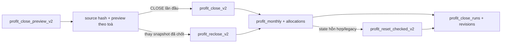

# Cổ đông, Profit Close V2 và ví cá nhân

> **Reviewed:** 2026-07-20
> Nguồn hiện hành: `src/components/shareholders/**`, `src/hooks/useShareholderProfit.ts`, `src/hooks/income-expenses/specialized.ts` và migrations `20260720210000`–`20260720223000`.

## 1. Phạm vi

Domain này trả lời bốn câu hỏi:

1. Lợi nhuận của từng toà trong tháng là bao nhiêu?
2. Sau lương điều hành và điều chỉnh có lý do, mỗi cổ đông được chia bao nhiêu?
3. Đã chi cho cổ đông/quản lý bao nhiêu, còn phải trả bao nhiêu?
4. User tự ghi chép ví cá nhân thế nào mà không lẫn với sổ quỹ doanh nghiệp?

Trang chính là `/reports/finance/profit-distribution` (`ProfitHubPage`). Cổ đông/quản lý được gắn tài khoản chỉ xem phần của mình; người có quyền quản trị thấy các tab Tổng quan, Chốt LN tháng và Cổ đông & tỷ lệ.

Trên desktop, các tab nhạy cảm **Chốt LN tháng**, **Cổ đông & tỷ lệ** và **Lương của tôi** bị ẩn mặc định; nhấp nhanh 3 lần vào icon xanh bên trái tiêu đề để hiện/ẩn. Bản mobile hiện không render tab chốt/cấu hình, nên thao tác quản trị phải mở bằng desktop hoặc chuyển trình duyệt sang chế độ desktop.

## 2. Bất biến hiện hành

- **Server tính nguồn:** client không gửi P&L, lương điều hành, tỷ lệ hay allocation cuối cùng. `profit_close_preview_v2` tự đọc nguồn accrual và cấu hình trong organization.
- **Chốt toàn tháng:** CLOSE/RECLOSE phải bao phủ mọi toà thật đang hoạt động trong organization. Không chốt lẻ vì quy tắc lương `TOTAL_GROUP` phụ thuộc cả nhóm.
- **Điều chỉnh minh bạch:** `adjusted_profit = computed_profit + adjustment_amount`. Điều chỉnh khác 0 bắt buộc lý do 8–500 ký tự và lưu người/thời điểm.
- **Chống nguồn đổi:** preview trả `source_hash`; close/reclose chỉ ghi nếu hash vẫn khớp. Dữ liệu đổi giữa xem trước và xác nhận trả conflict, không chốt mù.
- **Idempotency:** mỗi write dùng idempotency key; replay cùng payload trả kết quả cũ, tái dùng key cho payload khác bị từ chối.
- **Revision bất biến:** close, reclose, reset và baseline đều ghi `profit_close_runs` + `profit_close_revisions` append-only.
- **Không chia cho người ngừng hoạt động:** cổ đông/quản lý `is_active=false` hoặc `deleted_at` khác null không nhận allocation mới. Mapping cross-organization hoặc cấu hình sống thiếu organization fail closed.

## 3. Mô hình dữ liệu

### 3.1. Cổ đông và tỷ lệ

- `shareholders`: danh bạ cổ đông, `organization_id`, `auth_user_id`, `name`, `is_active`, `deleted_at`.
- `building_shareholders`: tỷ lệ của cổ đông theo toà. Tổng tỷ lệ active không được vượt 100 khi preview/chốt.
- `auth_user_id` cho phép self-view nhưng không mở quyền đọc dữ liệu vận hành khác.

### 3.2. Snapshot tháng

`profit_monthly` có một dòng cho mỗi `(building_id, period_month)` và lưu:

- `computed_profit`: lợi nhuận canonical từ nguồn accrual.
- `adjustment_amount`, `adjustment_reason`, `adjustment_by`, `adjustment_at`.
- `adjusted_profit`: `computed_profit + adjustment_amount`.
- `management_salary`: lương điều hành bị trừ trước khi chia.
- `source_revenue`, `source_expense`, `source_net_profit`, `source_hash`, `source_captured_at`.
- `status`, `is_stale`, `stale_reason`, `revision_number`, `locked_at/by`.

`profit_allocations` chụp phần cổ đông; `profit_manager_allocations` chụp phần lương điều hành. Hai bảng này là nguồn số đã chốt, không đọc lại tỷ lệ/quy tắc live cho kỳ LOCKED.

### 3.3. Audit close

- `profit_close_runs`: một record append-only cho mỗi operation `BASELINE`, `CLOSE`, `RECLOSE`, `RESET` hoặc `UNLOCK`, gồm request hash, source snapshot và result snapshot.
- `profit_close_revisions`: revision theo từng toà/tháng, giữ previous/current snapshot cùng allocations. `profit_monthly_id` cố ý không là FK để reset snapshot hiện tại không xoá lịch sử.

### 3.4. Lương điều hành

- `profit_managers`: danh bạ quản lý điều hành.
- `profit_manager_salaries`: quy tắc `FIXED|PERCENT` × `PER_BUILDING|TOTAL_GROUP`.
- `profit_manager_salary_buildings`: tập toà áp dụng.
- Chỉ manager và rule đang active, chưa xoá, đúng organization mới tham gia preview/chốt.

### 3.5. Ví cá nhân

`personal_transactions` là sổ thu/chi own-only của từng user. Nó không đi vào `income_expenses`, sổ quỹ, KQKD, Profit Close hay approval engine.

## 4. Luồng Profit Close V2

### 4.1. Preview

`profit_close_preview_v2(organization, month, building_ids?, adjustments?)`:

- xác thực organization và quyền;
- đọc tất cả toà thật đang hoạt động;
- đối chiếu hai nguồn accrual canonical;
- tính revenue, expense, net profit, điều chỉnh, lương điều hành và allocations;
- trả source hash toàn kỳ và hash theo toà;
- so snapshot hiện tại để đánh dấu `is_stale`/`stale_reason`.

UI chỉ gửi `adjustment_amount` có dấu và `adjustment_reason`; server tính phần còn lại.

### 4.2. Chốt lần đầu

`profit_close_v2` yêu cầu source hash preview và idempotency key. Trong transaction, server khoá nguồn cần thiết, kiểm hash, upsert mọi `profit_monthly`, thay allocations, tăng revision và ghi audit.

Lý do lần chốt đầu có thể dùng mặc định; điều chỉnh khác 0 vẫn phải có lý do riêng.

### 4.3. Chốt lại

`profit_reclose_v2` dùng khi toàn bộ toà của tháng đã LOCKED nhưng nguồn/cấu hình thay đổi. UI bắt buộc nhập lý do; server tạo revision mới và thay snapshot hiện tại sau khi source hash vẫn khớp.

Không cần mở khoá/xoá allocation bằng nhiều DML client như flow cũ.

### 4.4. Đặt lại tháng

Nếu tháng có trạng thái hỗn hợp, snapshot legacy ngoài phạm vi hoặc không thể reclose an toàn, UI dùng **Đặt lại tháng**.

`profit_reset_checked_v2` bắt buộc:

- lý do 8–1000 ký tự;
- `expected_state_hash` của toàn bộ snapshot/allocation hiện tại;
- danh sách chính xác `expected_snapshot_ids`;
- idempotency key.

Nếu snapshot đổi trước lúc reset, server trả conflict. Reset bỏ snapshot hiện tại nhưng lịch sử revision vẫn giữ để kiểm toán.

## 5. Chi lợi nhuận và lương điều hành

- `distribute_shareholder_profit_v1` tạo request chi lợi nhuận canonical với idempotency và đi qua approval engine.
- `manager_salary_payout_v1` làm tương tự cho lương điều hành, nhưng writer hiện yêu cầu operation `shareholder_profit.pay_manager` trong backend trong khi permission catalog/UI chưa expose action này. Nút hiện có thể hiện ra từ tab Tổng quan nhưng request sẽ bị backend từ chối nếu actor chưa được grant trực tiếp; đây là gap authorization cần xử lý riêng.
- Sau duyệt/post, phiếu chi nằm trên toà ảo `Chung`, gắn `shareholder_id` hoặc `profit_manager_id`, và `business_result_accounting=false` để không trừ ngược KQKD đã dùng làm nguồn chia.
- Tổng quan tính `Còn lại = allocation đã chốt − phiếu chi hợp lệ đã post/duyệt`.

Các adapter frontend vẫn có fallback coexistence được phân loại cho tới T7 drain; trạng thái 15/15 writer ON nằm ở [authorization/README.md](../authorization/README.md).

## 6. Quyền

| Action | Ý nghĩa |
|---|---|
| `shareholder_profit.view` | Xem báo cáo/phần được chia trong phạm vi cho phép |
| `shareholder_profit.lock` | Preview, close và reclose toàn kỳ |
| `shareholder_profit.unlock` | Xem state và reset/unlock theo guard |
| `shareholder_profit.distribute` | Lập request chi lợi nhuận |
| `shareholder_profit.pay_manager` | Backend operation dự kiến để lập request trả lương điều hành; **chưa có trong permission catalog/UI**, không coi là quyền đã cấp được từ màn Phân quyền |
| `shareholder_profit.manage_shareholders` | Quản lý cổ đông, tỷ lệ và cấu hình liên quan |

RPC/RLS kiểm organization và scope; ẩn/hiện tab ở frontend không phải lớp bảo vệ cuối.

## 7. Trang và hook chính

- `ProfitLockTab.tsx`: chọn organization/tháng, preview, điều chỉnh, close/reclose/reset.
- `useProfitCloseOrganizations`, `useProfitCloseState`, `useProfitClosePreview`, `useCloseProfitPeriod`, `useResetProfitPeriod`: client của RPC V2.
- `ProfitOverviewTab.tsx`: tổng allocation, đã chi và còn lại.
- `ShareConfigTab.tsx`: cổ đông, tỷ lệ và quản lý điều hành.
- `ShareholderSelfView.tsx`, `ProfitManagerSelfView.tsx`: self-view.
- `ProfitDistributeDialog.tsx`, `ManagerSalaryPayoutDialog.tsx`: tạo request chi tiền.

## 8. Kiểm tra khi thay đổi

1. Test preview và close/reclose với nguồn đổi giữa hai bước; phải conflict thay vì ghi.
2. Test idempotency replay và key reuse khác payload.
3. Test active/inactive/deleted shareholder/manager và cross-org mapping.
4. Test tháng hỗn hợp dùng reset guard với state hash/snapshot IDs.
5. Chạy test liên quan, `npm run typecheck:baseline` và `node scripts/reconcile-money.mjs [YYYY-MM]`.
6. Nếu migration đụng view, chạy `node scripts/check-view-invoker.mjs`.

Xem hướng dẫn thao tác: [Chia lợi nhuận](../huong-dan-su-dung/03-quan-ly-van-hanh/chia-loi-nhuan/).
