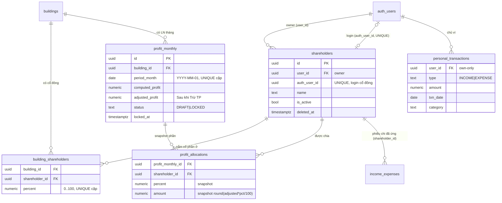
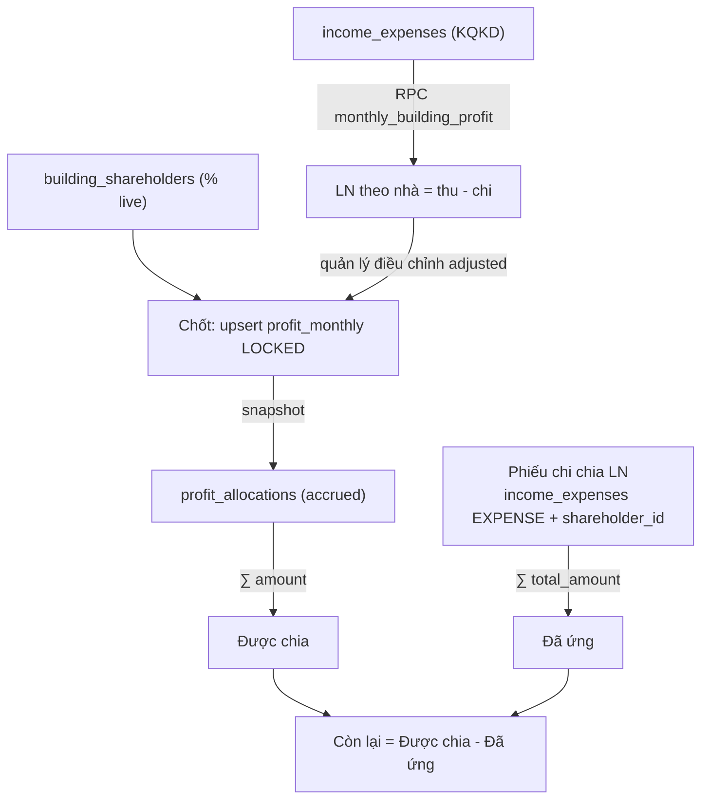
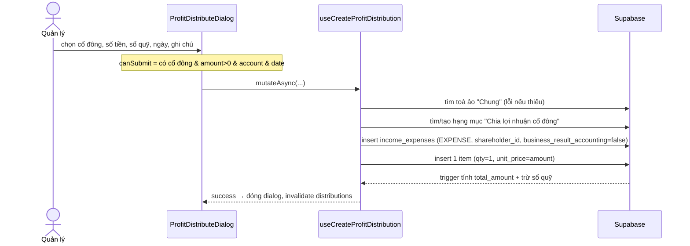

# Cổ đông · Chia lợi nhuận · Ví cá nhân

> Domain tài chính bậc cao: từ kết quả kinh doanh (KQKD) của từng toà nhà → chốt lợi nhuận tháng → phân bổ theo tỷ lệ cổ phần → chi tiền cho cổ đông → cổ đông tự theo dõi phần của mình. Bên cạnh đó là **ví thu chi cá nhân** — một sổ riêng tư của từng user, tách hoàn toàn khỏi sổ sách hệ thống.

Nguồn code chính:
- Page: [ShareholderProfitPage.tsx](src/pages/finance/ShareholderProfitPage.tsx), [PersonalWalletPage.tsx](src/pages/finance/PersonalWalletPage.tsx), [ProfitDistributionReport.tsx](src/pages/reports/finance/ProfitDistributionReport.tsx)
- Tab/Dialog: [ProfitOverviewTab.tsx](src/components/shareholders/ProfitOverviewTab.tsx), [ProfitLockTab.tsx](src/components/shareholders/ProfitLockTab.tsx), [ShareConfigTab.tsx](src/components/shareholders/ShareConfigTab.tsx), [ShareholderSelfView.tsx](src/components/shareholders/ShareholderSelfView.tsx), [ProfitDistributeDialog.tsx](src/components/shareholders/ProfitDistributeDialog.tsx), [ShareholderForm.tsx](src/components/shareholders/ShareholderForm.tsx), [PersonalTxnDialog.tsx](src/components/shareholders/PersonalTxnDialog.tsx)
- Hook: [useShareholders.ts](src/hooks/useShareholders.ts), [useShareholderProfit.ts](src/hooks/useShareholderProfit.ts), [usePersonalTransactions.ts](src/hooks/usePersonalTransactions.ts)
- Pure helper: [shareholderProfit.ts](src/lib/shareholderProfit.ts), [shareholderUtils.ts](src/components/shareholders/shareholderUtils.ts)
- Migration: [20260603000001_shareholder_profit_module.sql](supabase/migrations/20260603000001_shareholder_profit_module.sql), [20260603000002_shareholder_access_and_perms.sql](supabase/migrations/20260603000002_shareholder_access_and_perms.sql)

---

## 1. Tổng quan & vai trò nghiệp vụ

Hệ thống cho thuê BĐS này thường thuộc sở hữu chung của nhiều người góp vốn (cổ đông). Module này giải quyết câu hỏi: **"Toà nhà X tháng này lãi bao nhiêu, mỗi cổ đông được chia bao nhiêu, đã ứng bao nhiêu, còn nợ bao nhiêu?"**.

Luồng nghiệp vụ chính (3 lớp):

1. **Cấu hình cổ phần** — Quản lý khai báo danh sách **cổ đông** (`shareholders`) và **tỷ lệ % theo từng toà** (`building_shareholders`). Một cổ đông có thể nắm 30% toà A, 50% toà B, không nắm toà C. Mỗi cổ đông có thể được gắn 1 **tài khoản đăng nhập** (`auth_user_id`) để tự xem phần của mình.

2. **Chốt lợi nhuận tháng** — Hệ thống tự tính LN của mỗi toà trong tháng (RPC `monthly_building_profit` = thu KQKD − chi KQKD). Quản lý có thể **điều chỉnh** con số (trừ thêm chi phí ngoài sổ, "Sau khi Trừ TP") rồi **chốt-khoá** (`profit_monthly.status = LOCKED`). Tại thời điểm chốt, hệ thống **snapshot** phần của từng cổ đông vào `profit_allocations` — số đã chốt là bất biến (không đổi dù sau này sửa tỷ lệ).

3. **Chi tiền & theo dõi công nợ** — Khi trả tiền cho cổ đông, quản lý lập **phiếu chi chia LN** (một bản ghi `income_expenses` loại `EXPENSE`, gắn `shareholder_id`, hạch toán vào **toà ảo "Chung"**, **không tính KQKD**). Bảng theo cổ đông luôn cho biết: **Được chia** (∑ allocations) − **Đã ứng** (∑ phiếu chi gắn cổ đông) = **Còn lại**.

4. **Ví cá nhân** (`personal_transactions`) — Một sổ thu/chi **riêng tư của từng user**, không liên quan đến sổ quỹ/báo cáo hệ thống. Dùng để cổ đông/nhân viên tự ghi chép chi tiêu cá nhân (gồm cả khoản "Ứng công ty"). Trên ví cá nhân, nếu user là cổ đông, có thêm banner "Từ công ty: Được chia / Đã ứng / Còn lại được nhận".

**Mô hình quyền** (KHÔNG có role riêng cho cổ đông): module dùng 2 permission key `shareholder_profit` và `personal_finance` (xem [permissions.ts](src/lib/permissions.ts), nhóm "Cổ đông & Cá nhân"). Người có quyền `shareholder_profit:create/edit` là **quản lý** (thấy 3 tab quản trị); cổ đông thường chỉ có `view` → thấy **ShareholderSelfView** (chỉ phần của mình). RPC `get_my_permissions()` tự nhận diện cổ đông (`shareholders.auth_user_id = auth.uid()`) và cấp một **bộ quyền chỉ-xem cố định** + `shareholder_profit:view` + `personal_finance` full.

**Multi-tenant**: tất cả bảng đều có `user_id` = owner. RLS cho owner/admin full quyền; cổ đông chỉ thấy đúng phần mình qua hàm `current_shareholder_id()`.

---

## 2. Cấu trúc dữ liệu

### 2.1. `shareholders` — Cổ đông

Mục đích: danh bạ cổ đông của owner. Mỗi cổ đông có thể (tuỳ chọn) gắn 1 tài khoản đăng nhập để tự xem phần lợi nhuận.

Cột chủ chốt:
- `user_id` — owner sở hữu cổ đông này (FK `auth.users`). Là biên giới multi-tenant.
- `auth_user_id` — tài khoản đăng nhập gắn với cổ đông. **UNIQUE** (một user chỉ làm cổ đông của đúng một record), `ON DELETE SET NULL`. Là chìa khoá cho `current_shareholder_id()` và RLS self-view. Nếu NULL → cổ đông **không đăng nhập được** (UI hiển thị cảnh báo vàng).
- `name` — tên hiển thị (NOT NULL, CHECK độ dài > 0).
- `note`, `is_active` — ghi chú & cờ đang hoạt động.
- `deleted_at` — xoá mềm. Mọi query lọc `deleted_at IS NULL`.
- id / created_at / updated_at — chuẩn (trigger `set_shareholders_updated_at`).

FK đi ra: `user_id`, `auth_user_id` → `auth.users`.
Được tham chiếu bởi: `building_shareholders.shareholder_id`, `profit_allocations.shareholder_id`, **`income_expenses.shareholder_id`** (sang domain Thu/Chi).

### 2.2. `building_shareholders` — Tỷ lệ % theo toà

Mục đích: ma trận (toà × cổ đông) lưu **phần trăm cổ phần** của một cổ đông tại một toà cụ thể.

Cột chủ chốt:
- `building_id` (FK `buildings`), `shareholder_id` (FK `shareholders`) — `ON DELETE CASCADE` cả hai.
- `percent` — `NUMERIC(5,2)`, CHECK `0 ≤ percent ≤ 100`, default 0.
- **UNIQUE (building_id, shareholder_id)** — mỗi cặp toà-cổ đông chỉ một dòng. Hook dùng `onConflict: "building_id,shareholder_id"` để upsert.

Lưu ý nghiệp vụ: tổng % của một toà **không bị ràng buộc = 100%** ở DB. Phần trăm phần còn lại (nếu < 100%) ngầm hiểu là của owner — hệ thống không tạo allocation cho phần đó.

FK đi ra: `building_id` → `buildings` (domain Toà nhà), `shareholder_id` → `shareholders`.

### 2.3. `profit_monthly` — Chốt LN theo nhà/tháng

Mục đích: bản ghi "kết quả lợi nhuận của một toà trong một tháng" + trạng thái nháp/đã-khoá.

Cột chủ chốt:
- `building_id` (FK `buildings`), `period_month` — `DATE`, **luôn là ngày mùng 1** (`YYYY-MM-01`). **UNIQUE (building_id, period_month)** → mỗi toà mỗi tháng đúng một dòng.
- `computed_profit` — LN hệ thống tự tính (từ RPC, snapshot lúc chốt).
- `adjusted_profit` — LN **sau điều chỉnh** ("Sau khi Trừ TP" = trừ thêm chi phí ngoài sổ). Đây là số dùng để chia cho cổ đông.
- `status` — TEXT, CHECK `('DRAFT','LOCKED')`. (Không phải pg enum.) `DRAFT` = chưa khoá; `LOCKED` = đã chốt, có snapshot allocations.
- `locked_at`, `locked_by` (FK `auth.users`, `SET NULL`) — dấu vết khoá.
- `note` — ghi chú.

FK đi ra: `building_id` → `buildings`.
Được tham chiếu bởi: `profit_allocations.profit_monthly_id` (`ON DELETE CASCADE`).

### 2.4. `profit_allocations` — Snapshot phần mỗi cổ đông

Mục đích: tại thời điểm chốt một `profit_monthly`, ghi **bất biến** số tiền mỗi cổ đông được chia. Đây là nguồn sự thật cho cột "Được chia" (accrued).

Cột chủ chốt:
- `profit_monthly_id` (FK, CASCADE), `shareholder_id` (FK, CASCADE). **UNIQUE (profit_monthly_id, shareholder_id)**.
- `percent` — **snapshot** % cổ phần tại thời điểm chốt (không tham chiếu live `building_shareholders`).
- `amount` — **snapshot** số tiền = `round(adjusted_profit × percent / 100)`.

Bất biến: một khi `profit_monthly` còn `LOCKED`, các allocation con không bị động đến (kể cả khi sửa `building_shareholders`). Chỉ khi **mở khoá** (unlock) thì allocations bị xoá.

FK đi ra: `profit_monthly_id` → `profit_monthly`, `shareholder_id` → `shareholders`.

### 2.5. `personal_transactions` — Ví thu chi cá nhân

Mục đích: sổ thu/chi **riêng của từng user**, hoàn toàn tách biệt khỏi `income_expenses`/sổ quỹ/báo cáo hệ thống. Comment bảng ghi rõ điều này.

Cột chủ chốt:
- `user_id` — chủ ví (RLS own-only: chỉ chủ ví thấy/sửa).
- `type` — TEXT, CHECK `('INCOME','EXPENSE')`.
- `amount` — `NUMERIC(15,2)`, CHECK `≥ 0`.
- `txn_date` — ngày giao dịch (default `CURRENT_DATE`).
- `category` — danh mục tự do (UI gợi ý: Ăn uống, Nhà cửa, Cá nhân, **Ứng công ty**, Khác).
- `description`, `deleted_at` (xoá mềm).

Không có FK đi ra (ngoài `user_id`). Không bảng nào tham chiếu vào. **Cô lập hoàn toàn** — đây là điểm thiết kế cốt lõi.

> Lưu ý về enum: các trường trạng thái ở domain này (`profit_monthly.status`, `personal_transactions.type`) là **TEXT + CHECK constraint**, KHÔNG phải Postgres enum. Phía TS khai báo union type tương ứng (`"DRAFT" | "LOCKED"`, `"INCOME" | "EXPENSE"`).

---

## 3. Sơ đồ quan hệ dữ liệu

Luồng dữ liệu end-to-end:

---

## 4. Quy tắc nghiệp vụ & tự động hoá

### 4.1. RPC `monthly_building_profit(p_start, p_end, p_building_id)`

[Migration L129-186](supabase/migrations/20260603000001_shareholder_profit_module.sql). `SECURITY DEFINER`, GRANT cho `authenticated`.

- Xác định `v_owner` = user_id của super_admin đầu tiên (app single-org → mọi LN tính trên dữ liệu của owner).
- Trả về mỗi toà **thật** (`is_virtual = false`, `deleted_at IS NULL`): `total_income`, `total_expense`, `net_profit = income − expense`.
- Chỉ cộng các phiếu `income_expenses` thoả: `user_id = owner`, `approval_status = 'APPROVED'`, `deleted_at IS NULL`, `counts_in_business_result = true` (**chỉ khoản KQKD** → loại tiền cọc và các khoản override không-KQKD, gồm cả phiếu chia LN), `voucher_date BETWEEN p_start AND p_end`.
- `p_building_id` NULL → tất cả toà; có giá trị → lọc một toà.

Đây là số "LN tự tính" hiển thị ở tab Chốt LN. Vì lọc theo `counts_in_business_result`, **phiếu chi chia LN không tự trừ ngược vào LN** (tránh vòng lặp).

### 4.2. Chốt LN tháng — `useLockProfitMonth` (logic client-side)

[useShareholderProfit.ts L172-258](src/hooks/useShareholderProfit.ts). Không phải RPC — đây là chuỗi thao tác client (chạy dưới RLS owner/admin):

1. **Upsert `profit_monthly`** (`onConflict: building_id,period_month`) cho mỗi toà với `status='LOCKED'`, `computed_profit = net_profit`, `adjusted_profit = số đã điều chỉnh`, `locked_at/by = now/uid`.
2. Lấy `building_shareholders` (% **live** hiện tại) của các toà vừa chốt.
3. **Xoá hết `profit_allocations`** cũ của các `profit_monthly_id` này (re-snapshot sạch).
4. **Insert allocations mới**: với mỗi (toà, cổ đông) có %, `amount = Math.round(adjusted × percent / 100)`.

Bất biến quan trọng: snapshot lấy **% tại thời điểm chốt**. Sau khi chốt, đổi `building_shareholders` **không** ảnh hưởng allocation đã chốt (trừ khi unlock + chốt lại).

### 4.3. Mở khoá — `useUnlockProfitMonth`

[L261-282](src/hooks/useShareholderProfit.ts): xoá toàn bộ `profit_allocations` của `profit_monthly_id` đó rồi set `status='DRAFT'`, `locked_at/by=NULL`. Đưa toà-tháng về nháp; cổ đông mất quyền thấy tháng này (vì RLS self-select của `profit_monthly` dựa trên tồn tại allocation).

### 4.4. Chi lợi nhuận — `useCreateProfitDistribution`

[useIncomeExpenses.ts L757-872](src/hooks/useIncomeExpenses.ts). Tạo **một phiếu chi `income_expenses`** đại diện khoản "đã ứng/đã chia":

1. Tìm **toà ảo "Chung"** (`buildings.is_virtual=true, name='Chung'`) — nếu chưa có thì báo lỗi. Phiếu chia LN hạch toán vào toà ảo này (không gán cho toà thật → không méo báo cáo từng toà).
2. Tìm/tạo hạng mục chi **"Chia lợi nhuận cổ đông"** (`income_expense_types`, `type='expense'`, `category='Chia lợi nhuận'`).
3. Insert `income_expenses`: `type='EXPENSE'`, `building_id = Chung`, `account_id = sổ quỹ nguồn`, **`shareholder_id = cổ đông`**, **`business_result_accounting=false`** (không tính KQKD), `voucher_date`, `repeat_*=NONE`.
4. Insert 1 `income_expense_items` (qty=1, unit_price=amount) → trigger của domain Thu/Chi tự tính `total_amount` và trừ số dư sổ quỹ.

Vì `business_result_accounting=false`, phiếu này có `counts_in_business_result=false` → **không** bị RPC LN cộng lại → không tự trừ ngược lợi nhuận toà.

### 4.5. `current_shareholder_id()` + RLS

[Migration L118-126](supabase/migrations/20260603000001_shareholder_profit_module.sql): `SELECT id FROM shareholders WHERE auth_user_id = auth.uid() AND deleted_at IS NULL LIMIT 1`. Là nền tảng cho mọi policy self-view.

Tóm tắt RLS (L198-254):

| Bảng | Owner/Admin | Cổ đông (self) |
|---|---|---|
| `shareholders` | full (`user_id=uid` hoặc admin) | SELECT chính mình (`auth_user_id=uid`) |
| `building_shareholders` | full | SELECT dòng `shareholder_id=current_shareholder_id()` |
| `profit_monthly` | full | SELECT tháng **có allocation của mình** (EXISTS) |
| `profit_allocations` | full | SELECT `shareholder_id=current_shareholder_id()` |
| `personal_transactions` | — | **own-only** `user_id=uid` (kể cả owner) |
| `income_expenses` (thêm policy) | (policy hiện có) | SELECT phiếu `shareholder_id=current_shareholder_id()` |

Bất biến: cổ đông **chỉ thấy số của mình**, không thấy số cổ đông khác và không thấy LN toà mình không có cổ phần (vì `profit_monthly` self-select dựa trên tồn tại allocation của mình).

### 4.6. Quyền & `get_my_permissions()`

[Migration L39-111](supabase/migrations/20260603000002_shareholder_access_and_perms.sql):
- Super admin → `{"__superadmin": true}` (mọi quyền).
- Staff → permissions từ assignment đầu tiên.
- **Cổ đông** (kể cả không phải staff) → merge `v_sh_perms || v_perms`: bộ quyền **chỉ-xem cố định** cho hầu hết module + `shareholder_profit:view` + `personal_finance` full (view/create/edit/delete). Nếu vừa là staff vừa là cổ đông, quyền staff cho module trùng được giữ (ghi đè base).
- Chốt chặn lỗ hổng cũ: trước đây "không phải staff" rơi vào nhánh owner → superadmin bypass; nay cổ đông được phát hiện sớm và chỉ nhận quyền read-only.

`can_access_building()` được mở rộng thêm nhánh: cổ đông được đọc đúng các toà họ có trong `building_shareholders` (L15-36 migration 2) → chỉ thấy dữ liệu vận hành (HĐ, phòng, thu chi…) của toà mình.

FE helper `can(perms, module, action)` ([useMyPermissions.ts](src/hooks/useMyPermissions.ts)) chỉ gate UI; chia LN thành quản lý vs cổ đông qua `shareholder_profit:create|edit`.

### 4.7. Tổng hợp client — `computeShareholderSummary`

[shareholderProfit.ts](src/lib/shareholderProfit.ts) (pure, test được): với danh sách `allocations` (accrued) và `distributions` (paid), trả mỗi cổ đông `{ accrued, paid, remaining = accrued − paid }`. Đây là công thức công nợ cổ đông dùng chung cho cả tab Tổng quan, SelfView và banner Ví cá nhân.

---

## 5. Quy trình theo từng trang

### 5.1. `/finance/shareholder-profit` — Chia lợi nhuận cổ đông

[ShareholderProfitPage.tsx](src/pages/finance/ShareholderProfitPage.tsx). Route bọc `RequirePermission module="shareholder_profit" action="view"`. (Có redirect cũ `/reports/finance/shareholder-profit` → trang này.)

Phân nhánh ngay đầu:
- `isManager` = `__superadmin` **hoặc** `can(shareholder_profit, create|edit)` → render **3 tab quản trị**.
- Ngược lại, nếu `useMyShareholder()` trả về record → render **ShareholderSelfView**.
- Không phải cổ đông → thông báo "Bạn chưa được gán là cổ đông".

#### Tab "Tổng quan" — [ProfitOverviewTab.tsx](src/components/shareholders/ProfitOverviewTab.tsx)

Dữ liệu: `useShareholders`, `useBuildings`, `useProfitMonthly`, `useProfitAllocations`, `useShareholderDistributions`.

Hiển thị:
- 4 KPI luỹ kế: **Tổng LN đã chốt** (∑ `adjusted_profit` của các `profit_monthly` LOCKED), **Tổng được chia** (∑ allocations), **Đã ứng** (∑ distributions), **Còn phải trả** = chia − ứng.
- Biểu đồ LN theo tháng + cơ cấu LN theo nhà (lọc theo năm chọn, chỉ tháng LOCKED).
- **Ma trận Nhà × Tháng** (12 tháng × các toà có chốt trong năm) — giá trị là `adjusted_profit`.
- Bảng **Theo cổ đông (luỹ kế)**: Được chia / Đã ứng / Còn lại + nút **"Chi"** mở `ProfitDistributeDialog` với cổ đông đó.

Thao tác **Chi lợi nhuận** (nút "Chi lợi nhuận" hoặc "Chi" trên dòng cổ đông):

Validate/edge: số tiền > 0, phải chọn sổ quỹ và ngày; nếu thiếu toà ảo "Chung" → ném lỗi (cần seed toà ảo trước).

#### Tab "Chốt LN tháng" — [ProfitLockTab.tsx](src/components/shareholders/ProfitLockTab.tsx)

Dữ liệu: `useMonthlyBuildingProfit(start,end)` (RPC), `useProfitMonthly`, `useShareholders`, `useBuildingShareholders`.

Các bước:
1. Chọn tháng/năm → tính `period = YYYY-MM-01` và khoảng start/end của tháng (helper [shareholderUtils.ts](src/components/shareholders/shareholderUtils.ts)).
2. Bảng "LN theo nhà": mỗi toà hiển thị Doanh thu / Chi phí / **LN tự tính** (`net_profit` từ RPC) / ô **LN sau điều chỉnh** (`CurrencyInput`, mặc định = giá đã khoá nếu có, ngược lại = net_profit) / trạng thái (Đã chốt + nút mở khoá, hoặc Nháp).
3. Khối **Xem trước chia cho cổ đông**: tính live `∑ (adjusted_toà × %cổ đông / 100)` cho từng cổ đông (preview, chưa ghi).
4. Bấm **"Chốt tháng MM/YYYY"** → `useLockProfitMonth` (mục 4.2): upsert tất cả toà LOCKED + re-snapshot allocations.
5. Nút **mở khoá** (icon Unlock) trên dòng đã chốt → `useUnlockProfitMonth`.

Edge: nút Chốt disable khi đang chốt hoặc RPC trả rỗng (không có thu/chi tháng đó). Chốt lại tháng đã khoá là **idempotent** — xoá allocations cũ rồi tạo lại theo % và adjusted hiện tại.

#### Tab "Cổ đông & tỷ lệ" — [ShareConfigTab.tsx](src/components/shareholders/ShareConfigTab.tsx)

Dữ liệu: `useShareholders`, `useBuildings`, `useBuildingShareholders`, `useAdminUsers`.

Liệt kê thẻ mỗi cổ đông: tên, badge tài khoản gắn (xanh nếu có `auth_user_id` → hiện email/tên; vàng cảnh báo nếu chưa gán → không đăng nhập được), và các badge "Toà — %". Nút Sửa/Xoá. Xoá = soft-delete (`useDeleteShareholder`), cảnh báo giữ nguyên LN đã chốt & phiếu chi.

Thêm/Sửa qua [ShareholderForm.tsx](src/components/shareholders/ShareholderForm.tsx):
- Chọn **user** để gắn (`SearchableSelect`) — danh sách loại các user đã gắn cổ đông khác (vì `auth_user_id` UNIQUE). Khi chọn user, nếu tên trống → tự điền tên theo full_name/email.
- Tên (bắt buộc), ghi chú, switch Đang hoạt động.
- Khối **Toà nhà & tỷ lệ (%)**: nhiều dòng (toà + % 0..100), toà đã chọn bị loại khỏi dropdown dòng khác.
- `canSave = name không rỗng && có authUserId`.
- Lưu: nếu sửa → `useUpdateShareholder`; nếu thêm → `useCreateShareholder` (lấy `id` trả về); rồi luôn gọi `useSyncShareholderBuildings(id, validRows)` để đồng bộ tỷ lệ (xoá toà không còn, upsert toà mới/đổi %).

Edge: form **bắt buộc gắn user** (`canSave` cần authUserId) — nghĩa là không tạo được cổ đông "thuần ghi nhận" không login; tỷ lệ không ràng buộc tổng = 100%.

#### ShareholderSelfView (cổ đông xem phần mình) — [ShareholderSelfView.tsx](src/components/shareholders/ShareholderSelfView.tsx)

Render khi user là cổ đông nhưng không phải quản lý. Dùng `useProfitAllocations` + `useShareholderDistributions` (RLS đã cắt còn của riêng mình) + `computeShareholderSummary([me.id], …)`.

Hiển thị: 4 KPI (Được chia luỹ kế / Đã ứng / Còn lại / LN năm chọn), biểu đồ LN theo tháng & theo nhà, bảng "LN từng tháng/nhà" (tháng, nhà, %, được chia), bảng "Lịch sử đã ứng/đã lấy" (các phiếu chi gắn mình). Không có nút thao tác — read-only.

### 5.2. `/finance/personal-wallet` — Ví thu chi cá nhân

[PersonalWalletPage.tsx](src/pages/finance/PersonalWalletPage.tsx). Route bọc `RequirePermission module="personal_finance" action="view"`.

Dữ liệu: `usePersonalTransactions` (own-only). Nếu user là cổ đông, thêm banner "Từ công ty" dùng `useMyShareholder` + `useProfitAllocations` + `useShareholderDistributions` + `computeShareholderSummary` → Được chia / Đã ứng / **Còn lại được nhận**.

Hiển thị: 3 StatCard (Tổng thu / Tổng chi / Số dư — toàn bộ, không theo năm), biểu đồ thu-chi theo tháng & cơ cấu chi theo danh mục (lọc theo năm), bảng giao dịch năm chọn.

Thao tác Thêm/Sửa/Xoá qua [PersonalTxnDialog.tsx](src/components/shareholders/PersonalTxnDialog.tsx):
- Chọn loại Thu/Chi (nút toggle), số tiền (>0), ngày, danh mục (datalist gợi ý gồm "Ứng công ty"), mô tả.
- `canSubmit = amount > 0 && có ngày`.
- Thêm → `useCreatePersonalTransaction`; Sửa → `useUpdatePersonalTransaction`; Xoá (AlertDialog) → `useDeletePersonalTransaction` (soft-delete `deleted_at`).

Edge/đặc thù: ví **không ghi vào `income_expenses`**, không ảnh hưởng sổ quỹ/báo cáo. Danh mục "Ứng công ty" chỉ là nhãn cá nhân — không tự liên kết với phiếu chi chia LN của hệ thống (việc đối chiếu do người dùng tự làm qua banner "Còn lại được nhận").

### 5.3. `/reports/finance/profit-distribution` (và alias `/report/finance-by-month`) — Báo cáo Phân bổ lợi nhuận

[ProfitDistributionReport.tsx](src/pages/reports/finance/ProfitDistributionReport.tsx).

> Lưu ý: dù tên file/route là "profit-distribution", trang này thực chất là **báo cáo KQKD theo tháng** (Doanh thu / Chi phí / **Lợi nhuận = chênh lệch**) dựa trên `useIncomeExpenses` + `useIncomeExpenseStats` + `useAccrualMonthReport`. Nó **không** đọc `profit_monthly`/`profit_allocations` — đây là lớp "LN thô theo phiếu", khác với LN đã-chốt-snapshot của module cổ đông.

Bước:
1. Chọn tháng (MM-yyyy), khu vực/toà/phòng (`SearchableSelect`), loại Thu/Chi.
2. Toggle **"Hiện cả khoản không hạch toán KQKD (cọc…)"** → `pnlOnly`/`business_result_only`. Mặc định chỉ KQKD (loại cọc & khoản không-KQKD, gồm phiếu chia LN).
3. Toggle **"Phân bổ theo kỳ áp dụng"** (accrual) → chia đều tiền item ra các tháng trong kỳ áp dụng (`useAccrualMonthReport`); tắt thì ghi nhận theo `voucher_date`.
4. 3 thẻ tổng (Doanh thu / Chi phí / Lợi nhuận) + bảng phân trang theo chế độ.

Vai trò trong domain: cung cấp **góc nhìn LN theo phiếu/kỳ** để quản lý đối chiếu trước khi chốt LN ở tab "Chốt LN tháng" (nơi LN được khoá-snapshot và chia cho cổ đông).

---

## 6. Liên kết sang domain khác (vào / ra)

- **→ Thu/Chi (income_expenses)** — quan hệ cốt lõi 2 chiều:
  - *Ra (đọc)*: RPC `monthly_building_profit` đọc `income_expenses` (chỉ KQKD, APPROVED) để tính LN toà.
  - *Vào (ghi)*: phiếu chia LN là một `income_expenses` (`type=EXPENSE`, `shareholder_id`, `business_result_accounting=false`, toà ảo "Chung"). `income_expenses.shareholder_id` là FK trỏ về `shareholders`. Báo cáo Phân bổ LN cũng nằm trên `income_expenses`.
- **→ Toà nhà (buildings)** — `building_shareholders.building_id`, `profit_monthly.building_id` trỏ buildings; phiếu chia LN dùng **toà ảo "Chung"** (`is_virtual=true`). RPC LN chỉ tính toà thật.
- **→ Sổ quỹ / Accounts** — phiếu chia LN chọn `account_id` (sổ quỹ nguồn); insert item → trigger trừ số dư sổ quỹ (domain Sổ quỹ/Thu-Chi).
- **→ Auth & Người dùng (admin-create-user)** — `shareholders.auth_user_id` gắn tài khoản đăng nhập; `useCreateShareholderLogin` gọi edge function `admin-create-user` để tạo user mới rồi gán. `ShareholderForm`/`ShareConfigTab` dùng `useAdminUsers`.
- **→ Hệ thống quyền (permissions / RLS)** — module quyền `shareholder_profit` + `personal_finance` trong [permissions.ts](src/lib/permissions.ts); `get_my_permissions()` và `can_access_building()` mở rộng cho cổ đông (read-only + scope toà có cổ phần). Cổ đông nhờ đó thấy được dữ liệu vận hành (HĐ, phòng, chỉ số…) của đúng toà mình.
- **Cô lập có chủ ý**: `personal_transactions` **không** nối sang bất kỳ domain nào — không vào sổ quỹ, không vào báo cáo. Chỉ banner "Từ công ty" trên Ví cá nhân là đọc-một-chiều từ allocations/distributions để cổ đông tự đối chiếu.
