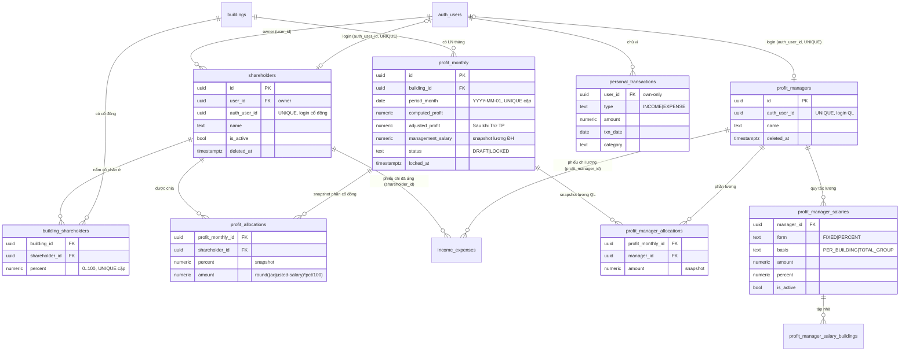
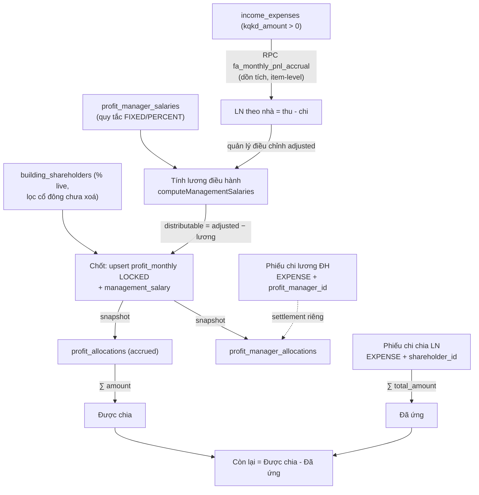
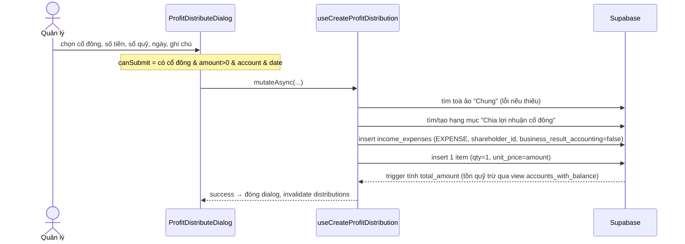

# Cổ đông · Chia lợi nhuận · Ví cá nhân

> Domain tài chính bậc cao: từ kết quả kinh doanh (KQKD) của từng toà nhà → chốt lợi nhuận tháng → phân bổ theo tỷ lệ cổ phần → chi tiền cho cổ đông → cổ đông tự theo dõi phần của mình. Bên cạnh đó là **ví thu chi cá nhân** — một sổ riêng tư của từng user, tách hoàn toàn khỏi sổ sách hệ thống.

Nguồn code chính:
- Page: [ProfitHubPage.tsx](src/pages/reports/finance/ProfitHubPage.tsx) (trang gộp `/reports/finance/profit-distribution` — từ 4b5aed3 thay `ShareholderProfitPage` đã xoá), [PersonalWalletPage.tsx](src/pages/finance/PersonalWalletPage.tsx), [ProfitDistributionReport.tsx](src/pages/reports/finance/ProfitDistributionReport.tsx) (nay là component nội dung 1 tab)
- Tab/Dialog: [ProfitOverviewTab.tsx](src/components/shareholders/ProfitOverviewTab.tsx), [ProfitLockTab.tsx](src/components/shareholders/ProfitLockTab.tsx), [ShareConfigTab.tsx](src/components/shareholders/ShareConfigTab.tsx), [ShareholderSelfView.tsx](src/components/shareholders/ShareholderSelfView.tsx), [ProfitManagerSelfView.tsx](src/components/shareholders/ProfitManagerSelfView.tsx), [ProfitDistributeDialog.tsx](src/components/shareholders/ProfitDistributeDialog.tsx), [ManagerSalaryPayoutDialog.tsx](src/components/shareholders/ManagerSalaryPayoutDialog.tsx), [ShareholderForm.tsx](src/components/shareholders/ShareholderForm.tsx), [ProfitManagerForm.tsx](src/components/shareholders/ProfitManagerForm.tsx), [PersonalTxnDialog.tsx](src/components/shareholders/PersonalTxnDialog.tsx)
- Hook: [useShareholders.ts](src/hooks/useShareholders.ts) (gồm `useMyShareBuildings`), [useShareholderProfit.ts](src/hooks/useShareholderProfit.ts), [useProfitManagers.ts](src/hooks/useProfitManagers.ts), [usePersonalTransactions.ts](src/hooks/usePersonalTransactions.ts)
- Pure helper: [shareholderProfit.ts](src/lib/shareholderProfit.ts), [managementSalary.ts](src/lib/managementSalary.ts), [shareholderUtils.ts](src/components/shareholders/shareholderUtils.ts)
- Migration: [20260603000001_shareholder_profit_module.sql](supabase/migrations/20260603000001_shareholder_profit_module.sql), [20260603000002_shareholder_access_and_perms.sql](supabase/migrations/20260603000002_shareholder_access_and_perms.sql), [20260629000020_profit_manager_salary.sql](supabase/migrations/20260629000020_profit_manager_salary.sql) (lương điều hành), [20260701170000_shareholder_scope_split.sql](supabase/migrations/20260701170000_shareholder_scope_split.sql) (tách quyền cổ đông), [20260702120000_kqkd_item_level.sql](supabase/migrations/20260702120000_kqkd_item_level.sql) (KQKD item-level — áp live, chưa commit)

---

## 1. Tổng quan & vai trò nghiệp vụ

Hệ thống cho thuê BĐS này thường thuộc sở hữu chung của nhiều người góp vốn (cổ đông). Module này giải quyết câu hỏi: **"Toà nhà X tháng này lãi bao nhiêu, mỗi cổ đông được chia bao nhiêu, đã ứng bao nhiêu, còn nợ bao nhiêu?"**.

Luồng nghiệp vụ chính (4 lớp — từ 653172f thêm lớp lương điều hành):

1. **Cấu hình cổ phần & lương điều hành** — Quản lý khai báo danh sách **cổ đông** (`shareholders`) và **tỷ lệ % theo từng toà** (`building_shareholders`). Một cổ đông có thể nắm 30% toà A, 50% toà B, không nắm toà C. Mỗi cổ đông có thể được gắn 1 **tài khoản đăng nhập** (`auth_user_id`) để tự xem phần của mình. Song song, khai báo **quản lý điều hành** (`profit_managers`) + **quy tắc lương** (`profit_manager_salaries`: `FIXED` tiền thực / `PERCENT` trên LN ròng × `PER_BUILDING` từng nhà / `TOTAL_GROUP` tổng nhóm nhà, kèm tập nhà `profit_manager_salary_buildings`).

2. **Chốt lợi nhuận tháng** — Hệ thống tính LN của mỗi toà trong tháng theo **số dồn tích** (RPC `fa_monthly_pnl_accrual` — cùng nguồn với báo cáo Phân bổ lợi nhuận, xem mục 4.1). Quản lý có thể **điều chỉnh** con số ("LN sau điều chỉnh") rồi **chốt-khoá** (`profit_monthly.status = LOCKED`). Tại thời điểm chốt: **lương điều hành được tính và TRỪ TRƯỚC** (snapshot vào `profit_monthly.management_salary` + `profit_manager_allocations`), rồi phần còn lại (**distributable = adjusted − lương điều hành**) mới chia theo % cổ đông, snapshot vào `profit_allocations` — số đã chốt là bất biến (không đổi dù sau này sửa tỷ lệ).

3. **Chi tiền & theo dõi công nợ** — Khi trả tiền cho cổ đông, quản lý lập **phiếu chi chia LN** (một bản ghi `income_expenses` loại `EXPENSE`, gắn `shareholder_id`, hạch toán vào **toà ảo "Chung"**, **không tính KQKD**). Trả lương điều hành cũng vậy: phiếu chi gắn `profit_manager_id`, toà ảo "Chung", không KQKD (đã trừ ở tầng phân bổ → không trừ kép). Bảng theo cổ đông/quản lý luôn cho biết: **Được chia** (∑ allocations) − **Đã ứng** (∑ phiếu chi gắn cổ đông/quản lý — điều kiện đếm ở mục 4.8) = **Còn lại**.

4. **Ví cá nhân** (`personal_transactions`) — Một sổ thu/chi **riêng tư của từng user**, không liên quan đến sổ quỹ/báo cáo hệ thống. Dùng để cổ đông/nhân viên tự ghi chép chi tiêu cá nhân (gồm cả khoản "Ứng công ty"). Trên ví cá nhân, nếu user là cổ đông, có thêm banner "Từ công ty: Được chia / Đã ứng / Còn lại được nhận".

**Mô hình quyền — TÁCH QUYỀN CỔ ĐÔNG (3cd0d90, 2026-07-02)**: module dùng 2 permission key `shareholder_profit` và `personal_finance` (catalog theo TRANG ở [permissionPages.ts](src/lib/permissionPages.ts): `shareholder_profit` có action chi tiết `view/lock/unlock/distribute/manage_shareholders/export`). Từ 3cd0d90, **cổ đông thuần (và quản-lý-LN thuần) chỉ còn ĐÚNG 1 quyền** `{shareholder_profit: {view}}` — `get_my_permissions()` KHÔNG còn phát bộ ~20 module chỉ-xem + `personal_finance` như trước; `can_access_building()` **BỎ nhánh cổ đông** (hết đọc 32 bảng vận hành của toà góp vốn). Dữ liệu trang LN tự giới hạn theo cổ phần qua RLS self của module (không đổi); **tên toà** hiển thị qua RPC mới `get_my_share_buildings()` thay vì mở bảng `buildings`. Ai kiêm nhân viên thì giữ nguyên quyền staff (merge `v_sh_perms || v_perms`, staff ghi đè).

**Multi-tenant**: tất cả bảng đều có cột `user_id`, nhưng code **không đảm bảo** `user_id` = owner — các hook ghi `user_id = auth.uid()` của **người thao tác**: [useLockProfitMonth](src/hooks/useShareholderProfit.ts) ghi `profit_monthly`/`profit_allocations` với uid người chốt; [useCreateShareholder / useSyncShareholderBuildings](src/hooks/useShareholders.ts) cũng vậy. Nếu một admin (không phải super_admin owner) thao tác, dòng dữ liệu mang `user_id` của admin đó — RLS `*_owner_all` (`user_id = uid` **hoặc** `is_admin()`/`is_super_admin()`) vẫn cho owner/admin thấy đủ nên thực tế single-org không lệch số, nhưng bất biến "user_id = owner" chỉ là quy ước, không được code ép. Cổ đông chỉ thấy đúng phần mình qua hàm `current_shareholder_id()`.

---

## 2. Cấu trúc dữ liệu

### 2.1. `shareholders` — Cổ đông

Mục đích: danh bạ cổ đông của owner. Mỗi cổ đông có thể (tuỳ chọn) gắn 1 tài khoản đăng nhập để tự xem phần lợi nhuận.

Cột chủ chốt:
- `user_id` — owner sở hữu cổ đông này (FK `auth.users`). Là biên giới multi-tenant.
- `auth_user_id` — tài khoản đăng nhập gắn với cổ đông. **UNIQUE** (một user chỉ làm cổ đông của đúng một record), `ON DELETE SET NULL`. Là chìa khoá cho `current_shareholder_id()` và RLS self-view. Nếu NULL → cổ đông **không đăng nhập được** (UI hiển thị cảnh báo vàng).
- `name` — tên hiển thị (NOT NULL, CHECK độ dài > 0).
- `note`, `is_active` — ghi chú & cờ đang hoạt động. **Lưu ý: `is_active` hiện không có hiệu lực nghiệp vụ** — chỉ là switch trong [ShareholderForm](src/components/shareholders/ShareholderForm.tsx), không query nào lọc theo nó: cổ đông inactive vẫn được snapshot allocations khi chốt, vẫn hiện trong bảng Tổng quan và vẫn chọn được trong dialog Chi LN.
- `deleted_at` — xoá mềm. Mọi query lọc `deleted_at IS NULL`.
- id / created_at / updated_at — chuẩn (trigger `set_shareholders_updated_at`).

FK đi ra: `user_id`, `auth_user_id` → `auth.users`.
Được tham chiếu bởi: `building_shareholders.shareholder_id`, `profit_allocations.shareholder_id`, **`income_expenses.shareholder_id`** (sang domain Thu/Chi).

### 2.2. `building_shareholders` — Tỷ lệ % theo toà

Mục đích: ma trận (toà × cổ đông) lưu **phần trăm cổ phần** của một cổ đông tại một toà cụ thể.

Cột chủ chốt:
- `building_id` (FK `buildings`), `shareholder_id` (FK `shareholders`) — `ON DELETE CASCADE` cả hai.
- `percent` — `NUMERIC(5,2)`, CHECK `0 ≤ percent ≤ 100`, default 0.
- **UNIQUE (building_id, shareholder_id)** — mỗi cặp toà-cổ đông chỉ một dòng. Hook dùng `onConflict: "building_id,shareholder_id"` để upsert.

Lưu ý nghiệp vụ: tổng % của một toà **không bị ràng buộc = 100%** ở DB. Phần trăm phần còn lại (nếu < 100%) ngầm hiểu là của owner — hệ thống không tạo allocation cho phần đó.

FK đi ra: `building_id` → `buildings` (domain Toà nhà), `shareholder_id` → `shareholders`.

### 2.3. `profit_monthly` — Chốt LN theo nhà/tháng

Mục đích: bản ghi "kết quả lợi nhuận của một toà trong một tháng" + trạng thái nháp/đã-khoá.

Cột chủ chốt:
- `building_id` (FK `buildings`), `period_month` — `DATE`, **luôn là ngày mùng 1** (`YYYY-MM-01`). **UNIQUE (building_id, period_month)** → mỗi toà mỗi tháng đúng một dòng.
- `computed_profit` — LN hệ thống tự tính (từ RPC, snapshot lúc chốt).
- `adjusted_profit` — LN **sau điều chỉnh** ("Sau khi Trừ TP" = trừ thêm chi phí ngoài sổ).
- `management_salary` — **snapshot tổng lương điều hành** trừ ở nhà/tháng này (từ 20260629000020, default 0). Số chia cho cổ đông là **distributable = adjusted_profit − management_salary**.
- `status` — TEXT, CHECK `('DRAFT','LOCKED')`. (Không phải pg enum.) `DRAFT` = chưa khoá; `LOCKED` = đã chốt, có snapshot allocations.
- `locked_at`, `locked_by` (FK `auth.users`, `SET NULL`) — dấu vết khoá.
- `note` — ghi chú.

FK đi ra: `building_id` → `buildings`.
Được tham chiếu bởi: `profit_allocations.profit_monthly_id` (`ON DELETE CASCADE`).

### 2.4. `profit_allocations` — Snapshot phần mỗi cổ đông

Mục đích: tại thời điểm chốt một `profit_monthly`, ghi **bất biến** số tiền mỗi cổ đông được chia. Đây là nguồn sự thật cho cột "Được chia" (accrued).

Cột chủ chốt:
- `profit_monthly_id` (FK, CASCADE), `shareholder_id` (FK, CASCADE). **UNIQUE (profit_monthly_id, shareholder_id)**.
- `percent` — **snapshot** % cổ phần tại thời điểm chốt (không tham chiếu live `building_shareholders`).
- `amount` — **snapshot** số tiền = `round((adjusted_profit − management_salary) × percent / 100)` — từ 653172f chia trên **distributable** (đã trừ lương điều hành), không còn trên adjusted thô.

Bất biến: một khi `profit_monthly` còn `LOCKED`, các allocation con không bị động đến (kể cả khi sửa `building_shareholders`). Chỉ khi **mở khoá** (unlock) thì allocations bị xoá.

FK đi ra: `profit_monthly_id` → `profit_monthly`, `shareholder_id` → `shareholders`.

### 2.5. `personal_transactions` — Ví thu chi cá nhân

Mục đích: sổ thu/chi **riêng của từng user**, hoàn toàn tách biệt khỏi `income_expenses`/sổ quỹ/báo cáo hệ thống. Comment bảng ghi rõ điều này.

Cột chủ chốt:
- `user_id` — chủ ví (RLS own-only: chỉ chủ ví thấy/sửa).
- `type` — TEXT, CHECK `('INCOME','EXPENSE')`.
- `amount` — `NUMERIC(15,2)`, CHECK `≥ 0`.
- `txn_date` — ngày giao dịch (default `CURRENT_DATE`).
- `category` — danh mục tự do (UI gợi ý: Ăn uống, Nhà cửa, Cá nhân, **Ứng công ty**, Khác).
- `description`, `deleted_at` (xoá mềm).

Không có FK đi ra (ngoài `user_id`). Không bảng nào tham chiếu vào. **Cô lập hoàn toàn** — đây là điểm thiết kế cốt lõi.

### 2.6. Cụm lương điều hành — `profit_managers` / `profit_manager_salaries` / `profit_manager_salary_buildings` / `profit_manager_allocations`

Migration [20260629000020_profit_manager_salary.sql](supabase/migrations/20260629000020_profit_manager_salary.sql) (653172f). **Khác hẳn** module "Bảng lương quản lý" `/finance/salary` (manager_salary_config / salary_staff_id — xem [17-luong-thuong.md](docs/he-thong/17-luong-thuong.md)): đây là khoản trả cho người **quản lý điều hành toà nhà góp vốn**, trừ khỏi LN trước khi chia cổ đông.

- **`profit_managers`** — danh bạ quản lý điều hành, cấu trúc mirror `shareholders`: `user_id` (owner), `auth_user_id` UNIQUE (tài khoản tự xem, `SET NULL`), `name`, `note`, `is_active`, `deleted_at` (xoá mềm).
- **`profit_manager_salaries`** — quy tắc lương của 1 quản lý: `form` CHECK `('FIXED','PERCENT')` (tiền thực / % trên LN ròng), `basis` CHECK `('PER_BUILDING','TOTAL_GROUP')` (tính từng nhà / trên tổng nhóm nhà), `amount` (≥0, cho FIXED), `percent` (0..100, cho PERCENT), `is_active`. Một quản lý có thể có nhiều quy tắc.
- **`profit_manager_salary_buildings`** — tập nhà áp dụng của 1 quy tắc. **UNIQUE (salary_id, building_id)**. Đây cũng là bảng mà `can_access_building()` + `get_invoice_statistics_v2` dùng cho **nhánh scope profit-manager** (quản lý điều hành đọc được toà mình quản).
- **`profit_manager_allocations`** — snapshot phần lương của mỗi quản lý tại mỗi `profit_monthly` khi chốt (mirror `profit_allocations`). **UNIQUE (profit_monthly_id, manager_id)**, CASCADE cả 2 FK.
- **`income_expenses.profit_manager_id`** — FK gắn phiếu chi trả lương điều hành (mirror `shareholder_id`; phiếu loại này đặt `business_result_accounting = false`).
- Helper **`current_profit_manager_id()`** — map `auth.uid()` → `profit_managers.id` (mirror `current_shareholder_id()`), nền cho các policy self-select.
- Migration seed sẵn hạng mục chi **"Lương điều hành"** (`category='Chia lợi nhuận'`) cho owner.

> Lưu ý về enum: các trường trạng thái ở domain này (`profit_monthly.status`, `personal_transactions.type`, `profit_manager_salaries.form/basis`) là **TEXT + CHECK constraint**, KHÔNG phải Postgres enum. Phía TS khai báo union type tương ứng (`"DRAFT" | "LOCKED"`, `"INCOME" | "EXPENSE"`, `"FIXED" | "PERCENT"`…).

---

## 3. Sơ đồ quan hệ dữ liệu



Luồng dữ liệu end-to-end:



---

## 4. Quy tắc nghiệp vụ & tự động hoá

### 4.1. Nguồn LN theo nhà: `fa_monthly_pnl_accrual` (RPC `monthly_building_profit` là legacy)

**FE không còn gọi `monthly_building_profit`.** Từ b188a4f, [useMonthlyBuildingProfit](src/hooks/useShareholderProfit.ts) gọi RPC **`fa_monthly_pnl_accrual(p_start_date, p_end_date, p_building_ids)`** (domain Phân tích tài chính — [20260626000000_fa_accrual_pnl.sql](supabase/migrations/20260626000000_fa_accrual_pnl.sql)) rồi gom client:

- Số **dồn tích (accrual)**, KHỚP báo cáo Phân bổ lợi nhuận: doanh thu phiếu gắn HĐ ghi theo `billing_month`, item có kỳ áp dụng chia đều ra từng tháng.
- `SECURITY DEFINER` nhưng **có kiểm scope**: CTE `allowed` lọc `can_access_building(b.id)` — hết lỗ hổng "ai đăng nhập cũng thấy LN mọi toà" của RPC cũ.
- **Không lọc `user_id`** → phiếu do nhân viên tạo vẫn được tính (hết lệch số so với thời monthly_building_profit).
- Từ [20260702120000_kqkd_item_level.sql](supabase/migrations/20260702120000_kqkd_item_level.sql): hạch toán KQKD ở **mức hạng mục** (xem 4.1b) — phiếu trộn (thu HĐ gộp cọc) chỉ đóng góp phần không-cọc.
- Hook FE `aggregateAccrualByBuilding` gom các dòng tháng × toà về 1 dòng/toà, **bỏ toà ảo** ("Chung" chứa phiếu chia LN), rồi **pad đủ mọi toà thật** (toà không phát sinh = 0/0/0) và sort theo tên.

Vì phiếu chia LN/lương điều hành có `business_result_accounting = false` (`kqkd_amount = 0`), chúng **không tự trừ ngược vào LN** (tránh vòng lặp).

⚠️ **RPC legacy `monthly_building_profit(p_start, p_end, p_building_id)`** ([migration gốc L129-186](supabase/migrations/20260603000001_shareholder_profit_module.sql), được redefine trong 20260702120000 sang `SUM(kqkd_amount)` cho nhất quán) **vẫn tồn tại trong DB** và vẫn mang 2 khuyết tật cũ: (1) lọc `user_id = owner` (super_admin đầu tiên) → **bỏ sót phiếu do nhân viên tạo** (`user_id = NV`) — đo 2026: hụt ~1,8 tỷ thu + 1,3 tỷ chi; (2) không kiểm quyền/scope (GRANT `authenticated`, không check `can_access_building`). Cả hai **không ảnh hưởng họ `fa_*`**. Đừng gọi lại RPC này ở code mới.

### 4.1b. KQKD item-level — cột `income_expenses.kqkd_amount` (20260702120000)

Bối cảnh: trước đây cờ `counts_in_business_result` nằm ở mức **cả phiếu**, nên khi thu hoá đơn tháng đầu **gộp cọc**, FE phải TÁCH 1 lần thu thành 2 phiếu (doanh thu + cọc) để cọc không lọt vào Phân bổ LN. Từ [20260702120000_kqkd_item_level.sql](supabase/migrations/20260702120000_kqkd_item_level.sql) (áp live, chưa commit): **1 lần thu = ĐÚNG 1 phiếu thu**, phần cọc là hạng mục `is_deposit` trên cùng phiếu, và báo cáo tự loại phần cọc qua cột dẫn xuất:

```text
kqkd_amount = CASE business_result_accounting
  WHEN TRUE  THEN total_amount                          -- ép tính cả phiếu
  WHEN FALSE THEN 0                                     -- ép loại cả phiếu
  ELSE GREATEST(total_amount − Σ(item is_deposit), 0)   -- tự động theo hạng mục
END
```

- Cột do **trigger maintain** (không nhập tay): `recompute_ie_business_result` (mở rộng bản 20260613000000, vẫn tính kèm `counts_in_business_result` + `has_restricted_item` cho tương thích badge/RLS) + trigger `ie_business_result` fire cả khi `total_amount` đổi trực tiếp. Backfill toàn bảng, tổng Phân bổ LN không đổi (dữ liệu cũ đều là phiếu "thuần").
- Báo cáo P&L cộng `SUM(kqkd_amount)` thay vì `total_amount × counts_in_business_result`: migration redefine `fa_monthly_pnl`, `fa_type_breakdown`, `fa_accrual_allocations` (nguồn của `fa_monthly_pnl_accrual`), và cả `monthly_building_profit` legacy.
- **Đồng bộ phía CỌC**: mọi chỗ trước coi "cọc = total_amount của phiếu có item cọc" đổi thành **Σ item cọc** — `recompute_contract_deposit_paid`, `get_deposit_breakdown_v2`, `deposit_collected` trong `get_invoice_statistics_v2` — nếu không phiếu trộn bị đếm thừa phần doanh thu vào cọc.
- FE đi kèm (chưa commit): [useInvoicePayments.ts](src/hooks/useInvoicePayments.ts) tạo **1 phiếu trộn** (`business_result_accounting: null` = tự động) với item cọc riêng; [allocateDepositPortion](src/lib/invoiceHelpers.ts) đổi quy ước tách phần cọc/doanh thu thành **PHÒNG-TRƯỚC, CỌC-SAU** (tiền thu phủ phần tiền phòng/DV còn thiếu trước, dư mới vào cọc — thêm tham số `collectibleTotal`); báo cáo Phân bổ LN đọc `r.kqkd_amount` từng phiếu ở chế độ ngày-phiếu.

### 4.2. Chốt LN tháng — `useLockProfitMonth` / `writeLockedMonth` (logic client-side)

[useShareholderProfit.ts](src/hooks/useShareholderProfit.ts) (hàm `writeLockedMonth` dùng chung cho chốt thủ công lẫn chốt-lại). Không phải RPC — đây là chuỗi thao tác client (chạy dưới RLS owner/admin):

0. **Tính lương điều hành trước** (`computeMonthManagementSalaries`): tải `profit_managers` chưa xoá + quy tắc `profit_manager_salaries` `is_active` (kèm tập nhà), rồi gọi helper thuần [computeManagementSalaries](src/lib/managementSalary.ts) với base = `adjusted_profit` từng nhà → khoản trừ mỗi nhà (`perBuilding`) + chi tiết theo quản lý (`perManager`).
1. **Upsert `profit_monthly`** (`onConflict: building_id,period_month`) cho mỗi toà với `status='LOCKED'`, `computed_profit`, `adjusted_profit`, **`management_salary` = khoản trừ nhà đó**, `locked_at/by = now/uid`.
2. Lấy `building_shareholders` (% **live**) của các toà vừa chốt + danh sách `shareholders` chưa xoá — **lọc bỏ cổ đông đã xoá mềm** (building_shareholders không bị xoá theo khi soft-delete cổ đông → không lọc sẽ tạo phân bổ "ma" làm phồng tổng, đã sửa ở d5ba4df).
3. **Xoá hết `profit_allocations` VÀ `profit_manager_allocations`** cũ của các `profit_monthly_id` này (re-snapshot sạch).
4. **Insert allocations cổ đông**: `amount = Math.round(distributable × percent / 100)` với **`distributable = adjusted − management_salary`**.
5. **Insert `profit_manager_allocations`**: phần lương từng quản lý/nhà (bỏ dòng amount = 0).

Bất biến quan trọng: snapshot lấy **% và quy tắc lương tại thời điểm chốt**. Sau khi chốt, đổi `building_shareholders`/quy tắc lương **không** ảnh hưởng allocation đã chốt (trừ khi unlock + chốt lại).

⚠️ Lưu ý vận hành (vì là chuỗi client, **không phải transaction**):
- ~7 round-trip tuần tự (tải quy tắc lương → upsert → select tỷ lệ → delete ×2 → insert ×2). Nếu lỗi/mất mạng giữa chừng (sau delete, trước insert), tháng vẫn `LOCKED` nhưng **không còn allocation nào** — cổ đông mất số "Được chia", KPI sai, và tháng đó biến mất khỏi SelfView (RLS self-select của `profit_monthly` dựa trên tồn tại allocation) mà không có cảnh báo nào.
- Nút Chốt luôn chốt **tất cả toà** trong bảng (rows = toàn bộ kết quả RPC) và re-snapshot allocations của **mọi toà** theo % live hiện tại — không có chốt theo từng toà. Mở khoá 1 toà để sửa rồi bấm chốt lại → các toà khác cũng bị xoá + snapshot lại; nếu `building_shareholders` đã đổi từ lần chốt trước, số "bất biến" của các toà không liên quan âm thầm thay đổi.

### 4.2b. Chốt lại hàng loạt — `useResyncLockedMonths`

Mới cùng 653172f: nút **"Chốt lại N tháng đã chốt"** ở tab Chốt LN. Quét mọi `profit_monthly` `LOCKED`, gom theo tháng, gọi lại `fa_monthly_pnl_accrual` từng tháng rồi `writeLockedMonth` lại đúng các toà đã chốt của tháng đó. Quy tắc giữ số tay: nếu trước đó user đã sửa `adjusted_profit ≠ computed_profit` thì **giữ nguyên adjusted**, ngược lại lấy số accrual mới. Dùng khi dữ liệu thu chi quá khứ thay đổi (backfill, sửa phiếu) để các tháng đã chốt khớp lại báo cáo Phân bổ LN.

### 4.3. Mở khoá — `useUnlockProfitMonth`

[useShareholderProfit.ts](src/hooks/useShareholderProfit.ts): xoá toàn bộ `profit_allocations` **và `profit_manager_allocations`** của `profit_monthly_id` đó rồi set `status='DRAFT'`, `management_salary=0`, `locked_at/by=NULL`. Đưa toà-tháng về nháp; cổ đông mất quyền thấy tháng này (vì RLS self-select của `profit_monthly` dựa trên tồn tại allocation).

### 4.4. Chi lợi nhuận — `useCreateProfitDistribution` (+ `useCreateManagerSalaryPayout`)

[useIncomeExpenses.ts](src/hooks/useIncomeExpenses.ts). Tạo **một phiếu chi `income_expenses`** đại diện khoản "đã ứng/đã chia":

1. Tìm **toà ảo "Chung"** (`buildings.is_virtual=true, name='Chung'`) — nếu chưa có thì báo lỗi. Phiếu chia LN hạch toán vào toà ảo này (không gán cho toà thật → không méo báo cáo từng toà).
2. Tìm/tạo hạng mục chi **"Chia lợi nhuận cổ đông"** (`income_expense_types`, `type='expense'`, `category='Chia lợi nhuận'`). Migration đã **seed sẵn** hạng mục này cho owner ([mục 9, migration 1](supabase/migrations/20260603000001_shareholder_profit_module.sql)) — nhánh tìm/tạo runtime chỉ là fallback.
3. Insert `income_expenses`: `type='EXPENSE'`, `building_id = Chung`, `account_id = sổ quỹ nguồn`, **`shareholder_id = cổ đông`**, **`business_result_accounting=false`** (không tính KQKD), `voucher_date`, `repeat_*=NONE`.
4. Insert 1 `income_expense_items` (qty=1, unit_price=amount) → trigger `auto_recalc_total_amount` của domain Thu/Chi tính lại `income_expenses.total_amount`. **Không có trigger nào ghi/trừ số dư sổ quỹ** — tồn quỹ là cột suy diễn của view `accounts_with_balance` (aggregate `income_expenses` theo `account_id` lúc query); phiếu chia LN làm số dư hiển thị giảm vì view tính lại, không phải vì có bút toán ghi sổ.

Vì `business_result_accounting=false`, phiếu này có `kqkd_amount = 0` (`counts_in_business_result=false`) → **không** bị RPC LN cộng lại → không tự trừ ngược lợi nhuận toà.

**Trả lương điều hành — `useCreateManagerSalaryPayout`** (cùng file, mirror hoàn toàn): phiếu `EXPENSE` gắn **`profit_manager_id`**, toà ảo "Chung", hạng mục **"Lương điều hành"** (`category='Chia lợi nhuận'`, tìm/tạo — migration đã seed), `business_result_accounting=false` (lương đã trừ ở tầng phân bổ → không trừ kép KQKD), 1 item qty=1. Mở từ nút "Chi lương điều hành" ([ManagerSalaryPayoutDialog](src/components/shareholders/ManagerSalaryPayoutDialog.tsx)) ở khu Lương điều hành của tab Tổng quan.

### 4.5. `current_shareholder_id()` + RLS

[Migration L118-126](supabase/migrations/20260603000001_shareholder_profit_module.sql): `SELECT id FROM shareholders WHERE auth_user_id = auth.uid() AND deleted_at IS NULL LIMIT 1`. Là nền tảng cho mọi policy self-view.

Tóm tắt RLS (migration 1 L198-254 + 20260629000020):

| Bảng | Owner/Admin | Cổ đông / Quản lý ĐH (self) |
|---|---|---|
| `shareholders` | full (`user_id=uid` hoặc admin) | SELECT chính mình (`auth_user_id=uid`) |
| `building_shareholders` | full | SELECT dòng `shareholder_id=current_shareholder_id()` |
| `profit_monthly` | full | SELECT tháng **có allocation của mình** (EXISTS — 2 policy OR: allocation cổ đông + allocation lương QL) |
| `profit_allocations` | full | SELECT `shareholder_id=current_shareholder_id()` |
| `profit_managers` | full | SELECT chính mình (`auth_user_id=uid`) |
| `profit_manager_salaries` / `_salary_buildings` | full | SELECT quy tắc/nhà của mình (`current_profit_manager_id()`) |
| `profit_manager_allocations` | full | SELECT `manager_id=current_profit_manager_id()` |
| `personal_transactions` | — | **own-only** `user_id=uid` (kể cả owner) |
| `income_expenses` (thêm policy) | (policy hiện có) | SELECT phiếu `shareholder_id=current_shareholder_id()` hoặc `profit_manager_id=current_profit_manager_id()` |

Bất biến: cổ đông/quản lý ĐH **chỉ thấy số của mình**, không thấy số người khác và không thấy LN toà mình không liên quan (vì `profit_monthly` self-select dựa trên tồn tại allocation của mình).

### 4.6. Quyền & `get_my_permissions()` — TÁCH QUYỀN CỔ ĐÔNG (3cd0d90)

Lịch sử 3 đợt: [20260603000002](supabase/migrations/20260603000002_shareholder_access_and_perms.sql) (cấp bộ ~20 module chỉ-xem + `personal_finance` full cho cổ đông) → [20260629000020](supabase/migrations/20260629000020_profit_manager_salary.sql) (thêm nhánh quản lý điều hành, mirror cổ đông) → **[20260701170000_shareholder_scope_split.sql](supabase/migrations/20260701170000_shareholder_scope_split.sql) (hiện hành, đảo mô hình)**:

- Super admin → `{"__superadmin": true}`; staff → permissions từ assignment đầu tiên (full-scope ưu tiên); owner thật (không staff/cổ đông/QL) → bypass superadmin (giữ hành vi cũ).
- **Cổ đông thuần / quản-lý-LN thuần → ĐÚNG 1 quyền `{shareholder_profit: {view: true}}`** — hết bộ ~20 module view, hết `personal_finance`. Muốn cho cổ đông xem thêm gì → thêm vào TRANG chia LN, không mở module khác (comment trong hàm ghi rõ). Kiêm nhân viên: `v_sh_perms || v_perms` (quyền staff ghi đè, vẫn có cửa trang LN).
- **`can_access_building()` BỎ nhánh cổ đông** (`building_shareholders`) — cổ đông hết đọc 32 bảng vận hành (HĐ, phòng, hoá đơn, thu chi…) của toà góp vốn; đồng thời **khôi phục nhánh khu vực** (`area_buildings`) bị rơi ở 20260629000020 (full-scope = `building_id IS NULL AND area_id IS NULL`); **giữ nhánh profit-manager** (`profit_manager_salary_buildings` — thuộc module lương). `get_invoice_statistics_v2` (bản inline hoá scope) được vá đồng bộ.
- **RPC mới `get_my_share_buildings()`** (SECURITY DEFINER, GRANT authenticated): trả id + tên các toà caller có cổ phần / hưởng lương LN — trang LN hiển thị TÊN TOÀ mà không cần quyền mở bảng `buildings`. FE: hook [useMyShareBuildings](src/hooks/useShareholders.ts), dùng trong `ShareholderSelfView` + `ProfitManagerSelfView`.
- Dữ liệu trang LN của cổ đông vẫn tự giới hạn qua RLS self (mục 4.5) — migration này không đụng.

FE gate bằng `canUse(perms, "shareholder_profit", action)` theo catalog [permissionPages.ts](src/lib/permissionPages.ts): action chi tiết `view / lock / unlock / distribute / manage_shareholders / export` (fallback về quyền gốc `edit`/`create` cho ma trận cũ). `isManager` của trang = `__superadmin` hoặc có `lock`/`distribute`/`manage_shareholders`.

⚠️ **Lệch pha quyền FE ↔ RLS**: staff (không phải admin) được tick action nâng cao của `shareholder_profit` (`lock`/`distribute`/`manage_shareholders`, hoặc `create`/`edit` gốc qua fallback) sẽ thấy các tab quản trị (`isManager = true`), nhưng RLS các bảng `profit_monthly`/`profit_allocations`/`shareholders`/`building_shareholders` chỉ cho ghi khi `user_id = uid` **hoặc** `is_admin()`/`is_super_admin()` — staff đó UPDATE dòng của owner bị RLS chặn (lỗi khó hiểu), còn INSERT mới lại pass `WITH CHECK` với `user_id` = chính họ → dữ liệu phân mảnh theo `user_id` của staff. Hiện chưa có policy `staff_can('shareholder_profit', …)` cho các bảng profit.

### 4.7. Tổng hợp client — `computeShareholderSummary`

[shareholderProfit.ts](src/lib/shareholderProfit.ts) (pure — test ở [shareholderProfit.test.ts](src/lib/__tests__/shareholderProfit.test.ts), 4 case: mặc định 0, cộng dồn/còn lại âm khi ứng vượt, id ngoài danh sách tự thêm row, NaN/undefined coi như 0): với `shareholderIds` (ds id cần báo cáo), `allocations` (accrued) và `distributions` (paid), trả map theo cổ đông `{ accrued, paid, remaining = accrued − paid }`; mọi id trong `shareholderIds` luôn có row (mặc định 0, kể cả cổ đông chưa có allocation). Đây là công thức công nợ cổ đông dùng chung cho tab Tổng quan, SelfView, banner Ví cá nhân — và được **tái dùng cho settlement lương điều hành** (map `manager_id` vào vị trí `shareholder_id`).

Helper thuần thứ hai: **`computeManagementSalaries(buildingBase, rules)`** ([managementSalary.ts](src/lib/managementSalary.ts), test vitest + fast-check ở [managementSalary.test.ts](src/lib/__tests__/managementSalary.test.ts)) — từ base LN từng nhà + danh sách quy tắc (`FIXED`/`PERCENT` × `PER_BUILDING`/`TOTAL_GROUP`) trả `perBuilding` (khoản trừ mỗi nhà) + `perManager` (chi tiết quản lý × nhà). Dùng ở cả preview tab Chốt LN lẫn lúc chốt thật.

### 4.8. Điều kiện đếm "Đã ứng" — `useShareholderDistributions`

[useShareholderProfit.ts](src/hooks/useShareholderProfit.ts): "Đã ứng" = ∑ `total_amount` của các phiếu `income_expenses` thoả **đủ 4 điều kiện**: `type = 'EXPENSE'`, `approval_status = 'APPROVED'`, `shareholder_id IS NOT NULL`, `deleted_at IS NULL`. (`useManagerSalaryPayouts` đếm "Đã trả" lương điều hành y hệt, thay `shareholder_id` bằng `profit_manager_id`.)

- Vì `income_expenses` mặc định `APPROVED` ngay khi tạo ([migration 20260426000002](supabase/migrations/20260426000002_thu_chi_remove_approval_add_cancel.sql)), phiếu chia LN được tính vào "Đã ứng" **tức thì**.
- Ngược lại, phiếu bị **huỷ duyệt (CANCELLED)** hoặc **xoá mềm** từ trang Thu chi sẽ **rơi khỏi "Đã ứng"** — module cổ đông không cảnh báo gì khi điều đó xảy ra (xem mục 6).

---

## 5. Quy trình theo từng trang

### 5.1. `/reports/finance/profit-distribution` — Trang gộp "Phân bổ & chia lợi nhuận" (ProfitHubPage)

[ProfitHubPage.tsx](src/pages/reports/finance/ProfitHubPage.tsx). Từ 4b5aed3 (2026-06-27), 2 trang lợi nhuận được **gộp thành 1 trang nhiều tab phẳng**; `ShareholderProfitPage.tsx` đã xoá. Route chỉ bọc `ProtectedRoute` — **gate theo quyền nằm bên trong** (tab nào hiện tuỳ quyền). Các URL cũ `/finance/shareholder-profit`, `/reports/finance/shareholder-profit`, `/report/finance-by-month` đều redirect về đây.

Tab hiển thị theo quyền của người xem:
- **"Phân bổ lợi nhuận"** (`canUse(reports_finance, profit_distribution)`) → nội dung báo cáo [ProfitDistributionReport](src/pages/reports/finance/ProfitDistributionReport.tsx) (mục 5.3).
- **"Tổng quan"** (isManager) / **"Chốt LN tháng"** (`shareholder_profit.lock`) / **"Cổ đông & tỷ lệ"** (`shareholder_profit.manage_shareholders`) → 3 tab quản trị chia LN. `isManager = __superadmin || lock || distribute || manage_shareholders`.
- **"Lương của tôi"** — thêm khi caller là quản lý điều hành (`useMyProfitManager`) → [ProfitManagerSelfView](src/components/shareholders/ProfitManagerSelfView.tsx).
- Không có tab nào nhưng là cổ đông/quản lý (`useMyShareholder`/`useMyProfitManager`) → render **ShareholderSelfView** / **ProfitManagerSelfView** trần. Không thuộc nhóm nào → "Bạn chưa được gán là cổ đông và không có quyền xem báo cáo này".

Điểm vào UI: Sidebar — cả mục "Chia lợi nhuận" (nhóm Tài chính) lẫn "Phân bổ lợi nhuận" (nhóm Báo cáo) đều trỏ về trang gộp; [FinanceReportsPage](src/pages/reports/FinanceReportsPage.tsx) có card "Chia lợi nhuận cổ đông" + "Phân bổ lợi nhuận".

Giới hạn chọn năm: các tab chia LN (Tổng quan, SelfView) và trang Ví cá nhân chỉ cho chọn 4 năm `[Y+1, Y, Y−1, Y−2]` quanh năm hiện tại — dữ liệu cũ hơn 2 năm vẫn trong DB nhưng không xem được **chi tiết theo năm** trên UI (các KPI/bảng luỹ kế vẫn cộng đủ toàn bộ lịch sử vì hook tải hết, xem ghi chú ở tab Tổng quan).

#### Tab "Tổng quan" — [ProfitOverviewTab.tsx](src/components/shareholders/ProfitOverviewTab.tsx)

Dữ liệu: `useShareholders`, `useBuildings`, `useProfitMonthly`, `useProfitAllocations`, `useShareholderDistributions` + (từ 653172f) `useProfitManagers`, `useProfitManagerAllocations`, `useManagerSalaryPayouts`.

Bộ lọc (d5ba4df): **năm + tháng + cổ đông** — chọn 1 cổ đông thì KPI "Được chia/Đã ứng/Còn phải trả", biểu đồ và ma trận đều thu về phần người đó.

Hiển thị:
- 4 KPI: **Tổng LN đã chốt (luỹ kế)** (∑ `adjusted_profit` các tháng LOCKED — chú thích "Trước chia cổ đông", KHÔNG theo bộ lọc cổ đông), **Được chia** (∑ allocations — theo cổ đông đang lọc), **Đã ứng / đã chia**, **Còn phải trả** = chia − ứng.
- Biểu đồ LN theo tháng + cơ cấu theo nhà và **Ma trận Nhà × Tháng**: từ d5ba4df lấy số từ **`profit_allocations` (số ĐƯỢC CHIA = distributable × %)**, không còn `adjusted_profit` thô của `profit_monthly` — tức đúng phần cổ đông, không phải LN doanh nghiệp.
- Bảng **Theo cổ đông (luỹ kế)**: Được chia / Đã ứng / Còn lại + nút **"Chi"** mở `ProfitDistributeDialog` với cổ đông đó.
- Biểu đồ bar ngang **"Còn lại theo cổ đông"**: `remaining` **luỹ kế**, không theo năm chọn; ẩn cổ đông remaining = 0.
- Khu **"Lương điều hành (luỹ kế)"** (hiện khi có `profit_managers`): bảng theo quản lý Được nhận (∑ `profit_manager_allocations`) / Đã trả (∑ phiếu chi gắn `profit_manager_id`) / Còn lại + nút **"Chi lương điều hành"** / "Chi" từng dòng mở [ManagerSalaryPayoutDialog](src/components/shareholders/ManagerSalaryPayoutDialog.tsx).

Lệch số do cổ đông xoá mềm **đã sửa** (d5ba4df): KPI/biểu đồ chỉ cộng allocations/distributions của cổ đông **còn hiệu lực** (`allocActive`/`distActive` lọc theo `shareholders.deleted_at IS NULL`) — phân bổ "ma" của cổ đông đã xoá không làm phồng tổng nữa (và từ 653172f, lúc chốt cũng không tạo allocation cho cổ đông đã xoá — xem 4.2 bước 2). Về kỹ thuật, các hook nguồn vẫn tải **toàn bộ lịch sử** (không filter năm server-side, không phân trang) rồi lọc client theo năm.

Thao tác **Chi lợi nhuận** (nút "Chi lợi nhuận" hoặc "Chi" trên dòng cổ đông):



Validate/edge: số tiền > 0, phải chọn cổ đông, sổ quỹ và ngày; nếu thiếu toà ảo "Chung" → ném lỗi (cần seed toà ảo trước). Dialog **không hiển thị "Còn lại"** của cổ đông đang chọn và **không cảnh báo khi số chi vượt** phần được chia — ứng vượt chỉ lộ ra sau đó qua số âm đỏ ở bảng Theo cổ đông; danh sách chọn cũng là **toàn bộ cổ đông** chưa xoá (kể cả `is_active = false`).

#### Tab "Chốt LN tháng" — [ProfitLockTab.tsx](src/components/shareholders/ProfitLockTab.tsx)

Dữ liệu: `useMonthlyBuildingProfit(start,end)` (**`fa_monthly_pnl_accrual` — số dồn tích khớp báo cáo Phân bổ LN**, xem 4.1), `useProfitMonthly`, `useShareholders`, `useBuildingShareholders`, quy tắc lương điều hành (preview qua `computeManagementSalaries`).

Các bước:
1. Chọn tháng/năm → tính `period = YYYY-MM-01` và khoảng start/end của tháng (helper [shareholderUtils.ts](src/components/shareholders/shareholderUtils.ts)).
2. Bảng "LN theo nhà": mỗi toà hiển thị Doanh thu / Chi phí / **LN tự tính** (`net_profit` dồn tích) / ô **LN sau điều chỉnh** (`CurrencyInput`) / **Lương điều hành** (preview theo quy tắc hiện hành) / **LN chia cổ đông** (= adjusted − lương, đỏ nếu âm) / trạng thái (Đã chốt + nút mở khoá, hoặc Nháp).
3. Khối **Lương điều hành tháng này** + **Xem trước chia cho cổ đông**: tính live theo distributable (preview, chưa ghi).
4. Bấm **"Chốt tháng MM/YYYY"** → `useLockProfitMonth` (mục 4.2): upsert tất cả toà LOCKED + snapshot `management_salary` + re-snapshot 2 loại allocations.
5. Nút **mở khoá** (icon Unlock) trên dòng đã chốt → `useUnlockProfitMonth`.
6. Nút **"Chốt lại N tháng đã chốt"** (kèm AlertDialog xác nhận) → `useResyncLockedMonths` (mục 4.2b): đồng bộ mọi tháng LOCKED theo số accrual mới, giữ các ô đã sửa tay.

Edge:
- Hook pad **đủ mọi toà thật** (toà không phát sinh = 0/0/0) → empty-state "Chưa có dữ liệu" gần như không bao giờ hiện, và **chốt được cả tháng tương lai/tháng hoàn toàn trống** (tạo `profit_monthly` LOCKED 0đ + allocations `amount = 0` — không lọc bỏ amount 0).
- Chốt lại tháng đã khoá xoá allocations cũ rồi tạo lại theo % và adjusted hiện tại — và vì nút Chốt áp cho **tất cả toà**, các toà khác đang LOCKED cũng bị re-snapshot theo % live (xem lưu ý mục 4.2).
- `useEffect` seed lại **toàn bộ** map `adjusted` mỗi khi kết quả RPC hoặc trạng thái khoá đổi (refetch nền, sau khi mở khoá 1 toà…) → giá trị "LN sau điều chỉnh" đang gõ dở ở các ô khác bị ghi đè về mặc định mà không báo.

#### Tab "Cổ đông & tỷ lệ" — [ShareConfigTab.tsx](src/components/shareholders/ShareConfigTab.tsx)

Dữ liệu: `useShareholders`, `useBuildings`, `useBuildingShareholders`, `useAdminUsers`.

Liệt kê thẻ mỗi cổ đông: tên, badge tài khoản gắn (xanh nếu có `auth_user_id` → hiện email/tên; vàng cảnh báo nếu chưa gán → không đăng nhập được), và các badge "Toà — %". Nút Sửa/Xoá. Xoá = soft-delete (`useDeleteShareholder`), cảnh báo giữ nguyên LN đã chốt & phiếu chi.

Từ 653172f, tab có thêm **card "Quản lý điều hành"**: liệt kê `profit_managers` + quy tắc lương; thêm/sửa qua [ProfitManagerForm](src/components/shareholders/ProfitManagerForm.tsx) (gắn user đăng nhập, khai quy tắc FIXED/PERCENT × PER_BUILDING/TOTAL_GROUP + chọn tập nhà — lưu ý tập nhà này đồng thời là **scope đọc** của quản lý qua nhánh profit-manager trong `can_access_building`, và form này vẫn dùng `BuildingMultiSelect` vì là cấu hình scope, không phải ô lọc).

Dữ liệu tỷ lệ: `useBuildingShareholders` tải **toàn bộ** bảng `building_shareholders` (`select *`) rồi group client theo `shareholder_id`; tên toà tra từ `useBuildings` (mặc định **ẩn toà ảo**). Email badge tra từ `useAdminUsers` (hook này tải toàn bộ profiles + super_admins + staff_assignments — khá nặng so với nhu cầu chỉ hiện email).

Thêm/Sửa qua [ShareholderForm.tsx](src/components/shareholders/ShareholderForm.tsx):
- Chọn **user** để gắn (`SearchableSelect`) — danh sách loại các user đã gắn cổ đông khác (vì `auth_user_id` UNIQUE). Khi chọn user, nếu tên trống → tự điền tên theo full_name/email.
- Tên (bắt buộc), ghi chú, switch Đang hoạt động.
- Khối **Toà nhà & tỷ lệ (%)**: nhiều dòng (toà + % 0..100), toà đã chọn bị loại khỏi dropdown dòng khác.
- `canSave = name không rỗng && có authUserId`.
- Lưu: nếu sửa → `useUpdateShareholder`; nếu thêm → `useCreateShareholder` (lấy `id` trả về); rồi luôn gọi `useSyncShareholderBuildings(id, validRows)` để đồng bộ tỷ lệ (xoá toà không còn, upsert toà mới/đổi %).

Edge: form **bắt buộc gắn user** (`canSave` cần authUserId) — nghĩa là không tạo được cổ đông "thuần ghi nhận" không login; tỷ lệ không ràng buộc tổng = 100% (DB chỉ CHECK 0..100 per-row, không ràng buộc tổng % một toà giữa nhiều cổ đông).

Hook chết (dead code — liệt kê để tránh suy nhầm flow): [useShareholders.ts](src/hooks/useShareholders.ts) còn 3 hook **không component nào dùng** — `useUpsertBuildingShare` / `useDeleteBuildingShare` (upsert/xoá từng ô tỷ lệ; flow thật chỉ đi qua `useSyncShareholderBuildings`) và `useCreateShareholderLogin` (gọi edge function `admin-create-user` để tạo user mới rồi gán; flow thật là tạo user thủ công ở **Quản trị → Người dùng** rồi quay lại gắn qua SearchableSelect — form có dòng hướng dẫn đúng như vậy).

#### ShareholderSelfView / ProfitManagerSelfView (tự xem phần mình)

[ShareholderSelfView.tsx](src/components/shareholders/ShareholderSelfView.tsx) — render khi user là cổ đông nhưng không phải quản lý. Dùng `useProfitAllocations` + `useShareholderDistributions` (RLS đã cắt còn của riêng mình) + `computeShareholderSummary([me.id], …)`. **Tên toà** tra qua `useMyShareBuildings` (RPC `get_my_share_buildings` — cổ đông thuần không còn quyền đọc bảng `buildings` sau 3cd0d90).

Hiển thị: 4 KPI (Được chia luỹ kế / Đã ứng / Còn lại / LN năm chọn), biểu đồ LN theo tháng & theo nhà, ma trận Nhà × Tháng, bảng "Lịch sử đã ứng/đã lấy" (các phiếu chi gắn mình). Bảng "LN từng tháng/nhà" cũ đã **ẩn** từ 4b5aed3 (trùng ma trận). Không có nút thao tác — read-only.

[ProfitManagerSelfView.tsx](src/components/shareholders/ProfitManagerSelfView.tsx) (tab "Lương của tôi") — mirror cho quản lý điều hành: đọc `profit_manager_allocations` + phiếu chi gắn `profit_manager_id` (RLS self), tên toà cũng qua `useMyShareBuildings`.

⚠️ Bảng "Lịch sử đã ứng/đã lấy" render **toàn bộ** kết quả `useShareholderDistributions`, không lọc `shareholder_id === me.id` phía client — với cổ đông thuần RLS đã cắt còn phiếu của mình, nhưng user vừa là **staff có quyền xem thu chi** (policy staff/all_buildings trên `income_expenses`) vừa là cổ đông sẽ thấy lẫn cả phiếu chia LN của cổ đông **khác** trong bảng này (4 KPI không bị ảnh hưởng vì chỉ đọc `summary[me.id]`).

### 5.2. `/finance/personal-wallet` — Ví thu chi cá nhân

[PersonalWalletPage.tsx](src/pages/finance/PersonalWalletPage.tsx). Route bọc `RequirePermission module="personal_finance" action="view"`.

⚠️ Từ 3cd0d90, **cổ đông thuần KHÔNG còn được tự cấp `personal_finance`** (trước đây `get_my_permissions()` phát full) — vai cổ đông giờ không vào được Ví cá nhân; cần thì cấp lại per-user qua phân quyền staff.

Dữ liệu: `usePersonalTransactions` (own-only). Nếu user là cổ đông, thêm banner "Từ công ty" dùng `useMyShareholder` + `useProfitAllocations` + `useShareholderDistributions` + `computeShareholderSummary` → Được chia / Đã ứng / **Còn lại được nhận**.

Lưu ý kỹ thuật: 2 query `useProfitAllocations` + `useShareholderDistributions` được bắn cho **mọi user** vào trang (không gate `enabled` theo `me`) — user không phải cổ đông vẫn query (RLS trả rỗng), còn staff có quyền xem thu chi sẽ kéo về toàn bộ phiếu chia LN không dùng đến. `usePersonalTransactions` cũng tải toàn bộ lịch sử ví rồi lọc client theo năm (giới hạn chọn `[Y+1 .. Y−2]` như mục 5.1).

Hiển thị: 3 StatCard (Tổng thu / Tổng chi / Số dư — toàn bộ, không theo năm), biểu đồ thu-chi theo tháng & cơ cấu chi theo danh mục (lọc theo năm), bảng giao dịch năm chọn.

Thao tác Thêm/Sửa/Xoá qua [PersonalTxnDialog.tsx](src/components/shareholders/PersonalTxnDialog.tsx):
- Chọn loại Thu/Chi (nút toggle), số tiền (>0), ngày, danh mục (datalist gợi ý gồm "Ứng công ty"), mô tả.
- `canSubmit = amount > 0 && có ngày`.
- Thêm → `useCreatePersonalTransaction`; Sửa → `useUpdatePersonalTransaction`; Xoá (AlertDialog) → `useDeletePersonalTransaction` (soft-delete `deleted_at`).

Edge/đặc thù: ví **không ghi vào `income_expenses`**, không ảnh hưởng sổ quỹ/báo cáo. Danh mục "Ứng công ty" chỉ là nhãn cá nhân — không tự liên kết với phiếu chi chia LN của hệ thống (việc đối chiếu do người dùng tự làm qua banner "Còn lại được nhận").

### 5.3. Tab "Phân bổ lợi nhuận" — nội dung báo cáo (trong ProfitHubPage)

[ProfitDistributionReport.tsx](src/pages/reports/finance/ProfitDistributionReport.tsx) — từ 4b5aed3 không còn là trang riêng: export component nội dung (bỏ MainLayout) dùng làm tab đầu của ProfitHubPage. Wrapper rẽ nhánh theo `usePhoneViewport()`: điện thoại → **[ProfitDistributionMobile.tsx](src/pages/reports/finance/ProfitDistributionMobile.tsx)** (26db09c — port từ claude.ai/design, dùng CHUNG hook/dữ liệu với desktop nên số khớp).

> Lưu ý: đây là **báo cáo KQKD theo tháng** (Doanh thu / Chi phí / **Lợi nhuận = chênh lệch**) dựa trên `useIncomeExpenses` + `useIncomeExpenseStats` + `useAccrualMonthReport`. Nó **không** đọc `profit_monthly`/`profit_allocations` — đây là lớp "LN thô theo phiếu/kỳ", khác với LN đã-chốt-snapshot; nhưng từ b188a4f **cùng nguồn số dồn tích** với tab Chốt LN (`fa_monthly_pnl_accrual`).

Bộ lọc & hiển thị (mọi filter đều **giữ qua F5** bằng `usePersistedState` key `flt:rpt-profit-dist:*` — 7fd2d3f):
1. Chọn tháng (MM-yyyy); toà = **`BuildingFilterSelect`** phẳng **đơn-chọn** (3c3b7fa thay `BuildingMultiSelect` ở ô LỌC; state giữ shape mảng 0/1 phần tử, `[] = tất cả`), gồm cả toà ảo "Chung" (`useBuildings({ includeVirtual: true })` — để soi phiếu chia LN); `building_ids` lọc `.in("building_id", ids)` server-side ở cả 3 hook. **Ô lọc phòng là dropdown chết** — chỉ có 1 option "Tất cả phòng".
2. Toggle **"Hiện cả khoản không hạch toán KQKD (cọc…)"** → `pnlOnly` (mặc định true). Ở chế độ ngày-phiếu, phần KQKD của từng phiếu lấy từ **`kqkd_amount`** (item-level — phiếu trộn thu HĐ gộp cọc chỉ tính phần không-cọc, item `is_deposit` bị ẩn/đánh dấu không-KQKD; xem 4.1b).
3. Toggle **"Phân bổ theo kỳ áp dụng"** (accrual) — **mặc định BẬT** (e37396f): chia đều tiền item ra các tháng trong kỳ (`useAccrualMonthReport`); tắt thì ghi nhận theo `voucher_date`.
4. 3 thẻ tổng (Doanh thu / Chi phí / Lợi nhuận) + **sổ phân bổ 2 cột Thu | Chi** (ab6b054…): dòng thu xếp theo phòng, các khoản thu cùng 1 hoá đơn gộp 1 dòng (nhấp đôi mở chi tiết), hoá đơn tháng đầu tô màu theo trạng thái thu/cọc, dòng "Trống phòng" + cảnh báo nền đỏ "phòng CÒN HĐ nhưng THIẾU hoá đơn" (d84fac9).
5. Popover **"Cột"**: ẩn/hiện cột + 3 toggle lưu server per-user qua `profiles.ui_preferences` ([useUiPrefBool](src/hooks/useUiPreferences.ts) — giữ qua F5/đa thiết bị): `pd_hideStatCards` (ẩn thẻ thống kê), `pd_hideTotals` (ẩn số tổng), `pd_hideSpecialTypes` (**"Ẩn hạng mục đặc biệt"** — hạng mục cắm cờ `income_expense_types.hide_in_report`, vd Tiền nhà; **chỉ ẩn DÒNG, giữ nguyên TỔNG**, khớp theo `type_id` HOẶC tên vì DB trùng tên).

Vai trò trong domain: cung cấp **góc nhìn LN theo phiếu/kỳ** để quản lý đối chiếu trước khi chốt LN ở tab "Chốt LN tháng" (nơi LN được khoá-snapshot, trừ lương điều hành rồi chia cho cổ đông).

---

## 6. Liên kết sang domain khác (vào / ra)

- **→ Thu/Chi (income_expenses)** — quan hệ cốt lõi 2 chiều:
  - *Ra (đọc)*: RPC `fa_monthly_pnl_accrual` (domain Phân tích tài chính — xem [doc 13 §5.8](docs/he-thong/13-bao-cao-dashboard-thong-bao.md)) đọc `income_expenses` (KQKD item-level qua `kqkd_amount`, APPROVED, mọi user) để tính LN toà cho tab Chốt LN.
  - *Vào (ghi)*: phiếu chia LN là một `income_expenses` (`type=EXPENSE`, `shareholder_id`, `business_result_accounting=false`, toà ảo "Chung"); phiếu lương điều hành tương tự với `profit_manager_id`. Cả 2 cột là FK trỏ về `shareholders`/`profit_managers`. Báo cáo Phân bổ LN cũng nằm trên `income_expenses`.
  - *Hệ quả*: phiếu chia LN/lương ĐH là phiếu thu chi bình thường → **xuất hiện và sửa/xoá được từ trang Thu chi**. `useUpdateIncomeExpense` không đụng `shareholder_id`/`profit_manager_id` nên sửa phiếu vẫn giữ gắn kết; nhưng **xoá mềm/huỷ duyệt từ trang Thu chi làm "Đã ứng"/"Đã trả" tụt** (điều kiện đếm ở mục 4.8) mà module cổ đông không cảnh báo gì.
- **→ Toà nhà (buildings)** — `building_shareholders.building_id`, `profit_monthly.building_id`, `profit_manager_salary_buildings.building_id` trỏ buildings; phiếu chia LN + lương ĐH dùng **toà ảo "Chung"** (`is_virtual=true`). LN chỉ tính toà thật (FE bỏ toà ảo khi gom accrual). Phụ thuộc **cứng** vào toà ảo `name='Chung'` — nếu domain Toà nhà đổi tên/xoá toà ảo này, chi LN/lương gãy ngay (throw). `building_shareholders`/`profit_monthly` đều `ON DELETE CASCADE` theo `buildings` → xoá **cứng** một toà sẽ kéo sập cả lịch sử chốt (hiện toà chỉ soft-delete nên an toàn).
- **→ Sổ quỹ / Accounts** — phiếu chia LN/lương ĐH chọn `account_id` (sổ quỹ nguồn). **Không có trigger ghi sổ** — số dư giảm vì view `accounts_with_balance` aggregate `income_expenses` theo `account_id` lúc query (domain Sổ quỹ tính cả phiếu thuộc toà ảo "Chung").
- **→ Auth & Người dùng** — `shareholders.auth_user_id`/`profit_managers.auth_user_id` gắn tài khoản đăng nhập. Flow thực tế: tạo user ở trang **Quản trị → Người dùng**, rồi quay lại gắn trong `ShareholderForm`/`ProfitManagerForm` (SearchableSelect; dùng `useAdminUsers`). Hook `useCreateShareholderLogin` (gọi edge function `admin-create-user` để tạo user mới rồi gán) tồn tại trong [useShareholders.ts](src/hooks/useShareholders.ts) nhưng là **dead code** — không component nào dùng.
- **→ Hệ thống quyền (permissions / RLS)** — catalog theo trang [permissionPages.ts](src/lib/permissionPages.ts) (`shareholder_profit` action chi tiết + `personal_finance`); từ 3cd0d90 `get_my_permissions()` chỉ phát `shareholder_profit:view` cho cổ đông/quản lý thuần và `can_access_building()` **không còn** nhánh cổ đông (chỉ còn nhánh profit-manager theo tập nhà hưởng lương) — cổ đông **không** thấy dữ liệu vận hành của toà góp vốn nữa; tên toà trang LN đi qua RPC `get_my_share_buildings` (mục 4.6).
- **Cô lập có chủ ý**: `personal_transactions` **không** nối sang bất kỳ domain nào — không vào sổ quỹ, không vào báo cáo. Chỉ banner "Từ công ty" trên Ví cá nhân là đọc-một-chiều từ allocations/distributions để cổ đông tự đối chiếu.
