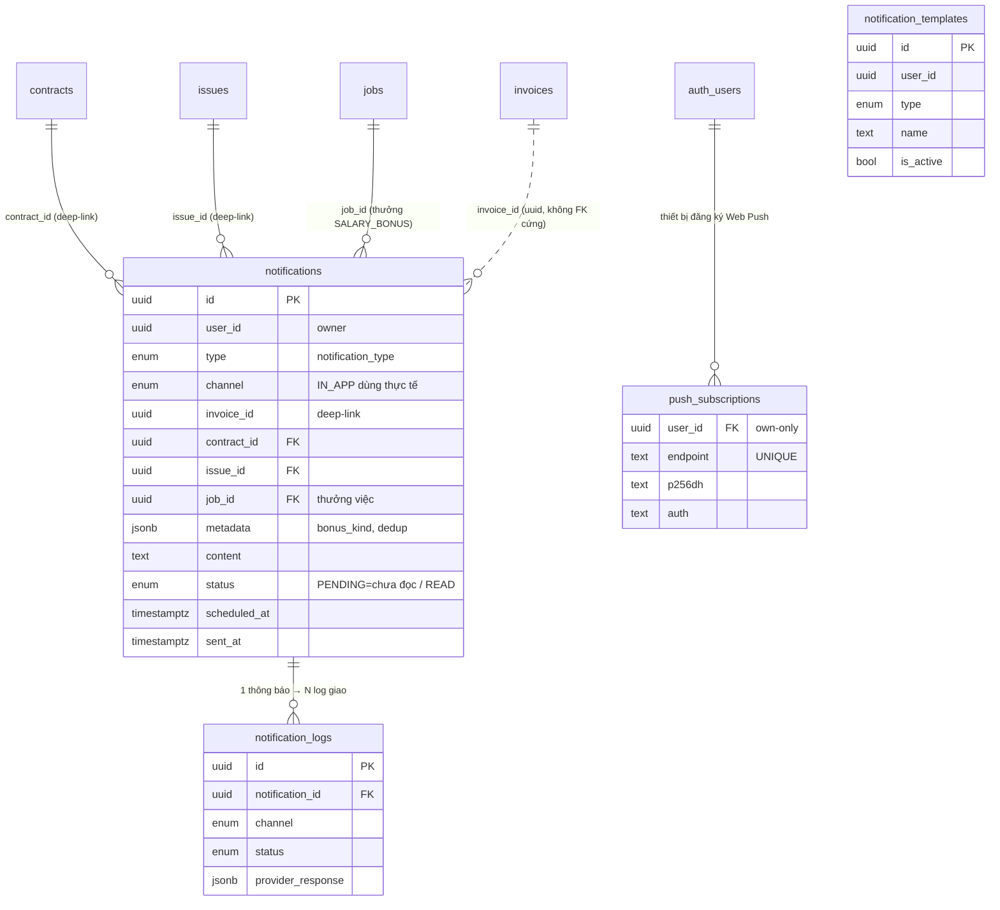
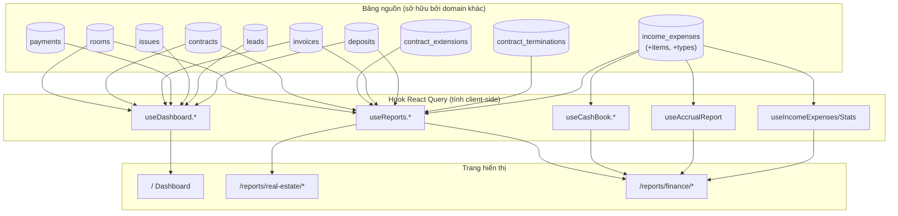
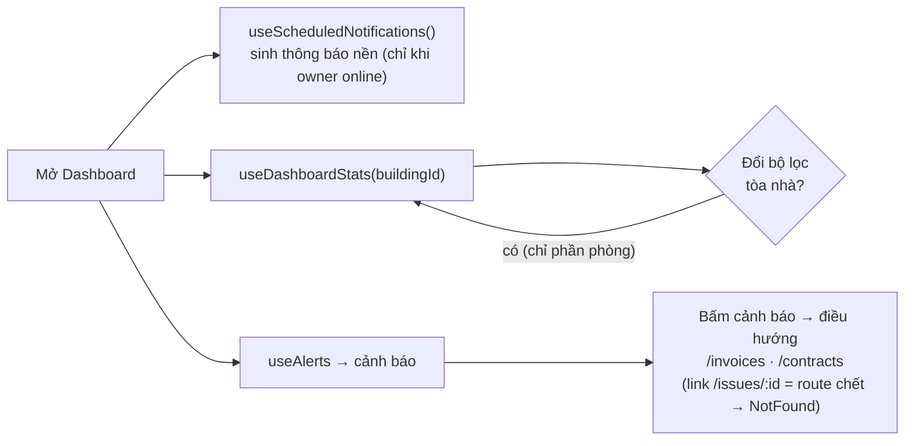
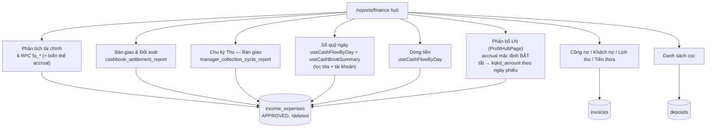

# Báo cáo · Dashboard · Thông báo

> Domain "tổng hợp & cảnh báo" của CRM. Phần lớn là **READ tổng hợp** dữ liệu từ
> các domain khác (HĐ, hoá đơn, thu chi, cọc, lead, công việc) để dựng KPI, biểu
> đồ, danh sách báo cáo; cộng thêm **4 bảng riêng** cho hệ thống thông báo
> (`notifications`, `notification_logs`, `notification_templates`,
> `push_subscriptions`) + các RPC báo cáo (`fa_*`, `cashbook_settlement_report`,
> `manager_collection_cycle_report`). Chốt theo code 2026-07-03.

## 1. Tổng quan & vai trò nghiệp vụ

Domain này gồm 3 nhóm chức năng tách biệt về dữ liệu nhưng cùng phục vụ mục tiêu
"nhìn nhanh — phản ứng kịp":

| Nhóm | Vai trò | Sở hữu bảng? |
|------|---------|--------------|
| **Dashboard** (`/`, [Dashboard.tsx](src/pages/Dashboard.tsx); trên điện thoại: `/dashboard` → [DashboardMobilePage](src/pages/DashboardMobilePage.tsx) qua [DashboardRoute](src/pages/home/DashboardRoute.tsx) rẽ `usePhoneViewport` — a3b5af4) | KPI tổng (số căn, lấp đầy, trống — **đã trừ phòng đã cọc**, doanh thu tháng, công nợ; không có card "Đã cọc" riêng, nhóm này chỉ hiện thành segment trên OccupancyChart), biểu đồ doanh thu/lấp đầy/công nợ, danh sách cảnh báo & hoạt động gần đây, khu thẻ "Báo cáo & Phân tích" | Không — đọc `rooms`/`contracts`/`payments`/`invoices`/`issues`/`leads`/`deposits` |
| **Báo cáo BĐS** (`/reports/real-estate/*`) | 8 báo cáo vận hành bất động sản: phòng trống, HĐ sắp hết hạn, lấp đầy, gia hạn/chuyển nhượng, khuyến mại, cho thuê mới, bỏ trả/thanh lý, tỉ lệ chi phí | Không — đọc `rooms`/`contracts`/`contract_extensions`/`income_expenses` |
| **Báo cáo Tài chính** (`/reports/finance/*`) | **12** báo cáo dòng tiền/công nợ (hub ghi "12 loại"): **Phân tích tài chính (§5.8)**, **Bàn giao tiền & Đối soát sổ (§5.9)**, **Chu kỳ Thu — Bàn giao (§5.10)**, sổ quỹ ngày, dòng tiền, phân bổ lợi nhuận (trang gộp ProfitHubPage — xem [doc 12](docs/he-thong/12-co-dong-loi-nhuan.md)), chia LN cổ đông (redirect vào trang gộp), công nợ HĐ mới, khách nợ, lịch thanh toán, tiền thừa, danh sách cọc | Không — đọc `income_expenses`/`invoices`/`payments`/`deposits` + RPC (`fa_*`, `cashbook_settlement_report`, `manager_collection_cycle_report`) |
| **Thông báo** (`/notifications`, chuông header; trên điện thoại rẽ sang [NotificationsMobilePage](src/pages/NotificationsMobilePage.tsx)) | Hàng đợi thông báo đa kênh (IN_APP + **Web Push PWA** đang chạy thật — §4.5); auto-sinh nhắc HĐ hết hạn, nhắc/quá hạn hoá đơn, thiếu cọc; thông báo thưởng việc `SALARY_BONUS` | **Có** — `notifications`, `notification_logs`, `notification_templates`, **`push_subscriptions`** |

**Điểm cốt lõi cần nhớ:**

- **Báo cáo = view-only, nhưng KHÔNG còn thuần client-side.** Nhóm báo cáo cũ
  vẫn tính trong hook React Query (`useReports`, `useDashboard`, `useCashBook`,
  `useAccrualReport`); từ 2026-06-11 trở đi các báo cáo mới chuyển tính toán
  xuống **RPC chuyên dụng** (`SECURITY DEFINER` + tự kiểm scope bằng
  `can_access_building()`, KHÔNG lọc `user_id` → tính đủ phiếu nhân viên tạo):
  họ `fa_*` (Phân tích tài chính, §5.8), `cashbook_opening_balance` (sổ quỹ),
  `cashbook_settlement_report` (§5.9), `manager_collection_cycle_report`
  (§5.10). Tính đúng/sai phụ thuộc query đúng bảng nguồn + RLS/scope.
- **Sổ quỹ/dòng tiền lấy 1 nguồn duy nhất** = `income_expenses` (canonical
  ledger). Mỗi payment hoá đơn đã có row mirror trong `income_expenses` → tuyệt
  đối **không** cộng thêm bảng `payments`/`expenses` (đã từng gây double-count,
  xem [useCashBook.ts](src/hooks/useCashBook.ts) dòng 16–18, 73–75).
- **EXTENDED đã ngưng dùng** (2026-06-06): mọi quét "HĐ đang hiệu lực" trong
  domain này chỉ còn `.in('status', ['ACTIVE'])`; "đã gia hạn" suy từ bảng
  `contract_extensions`, **không** từ status. Báo cáo gia hạn cũng đã chuyển
  nguồn theo (xem §5.4).
- **Phòng cọc giữ chỗ = bucket riêng.** `rooms.status='RESERVED'` (do
  `recompute_room_reservation` set từ phiếu cọc IE) **không** tính là trống và
  **không** tính là đã thuê — Dashboard stats, OccupancyChart, báo cáo lấp đầy
  và báo cáo phòng trống đều tách/loại nhóm "Đã cọc" này.
- **Thông báo chạy 2 kênh thật: IN_APP + Web Push PWA** (từ 2026-06-27, xem
  §4.5): service worker [public/sw.js](public/sw.js) + [push.ts](src/lib/push.ts)
  + edge function `send-push` + bảng `push_subscriptions`. Lưu ý kênh push đi
  **đường riêng** (edge fn đọc `push_subscriptions`), KHÔNG ghi row
  `notifications.channel='PUSH'`. Các kênh EMAIL/SMS/ZALO vẫn chỉ là khung enum
  + cột template; `notification_logs` chưa được ghi từ code app (chỉ có schema
  + RLS đọc).
- **Auto-sinh thông báo chạy ở client và scope theo OWNER**, không phải cron DB:
  hook [useScheduledNotifications](src/hooks/useScheduledNotifications.ts) gọi
  `runScheduledNotifications(userId)` khi mount Dashboard và lặp mỗi 6 giờ.
  Mọi query quét đều `.eq('user_id', userId)` của **user đang đăng nhập** →
  staff mở app sẽ không match HĐ/hoá đơn của employer (user_id = owner), tức
  thông báo chỉ được sinh khi **chính owner** online.

## 2. Cấu trúc dữ liệu

Chỉ domain Thông báo sở hữu bảng. Báo cáo/Dashboard tham chiếu bảng của domain
khác (mô tả ở §6).

### 2.1. `notifications` — hàng đợi thông báo

Mục đích: 1 dòng = 1 thông báo cần phát (đến nhiều người nhận, qua 1 kênh).

Cột chủ chốt:

- `user_id` (uuid, NOT NULL) — **owner sở hữu** thông báo (multi-tenant). Code
  app set = `auth.uid()` của owner khi insert.
- `type` (`notification_type`, NOT NULL) — phân loại nghiệp vụ (xem enum §2.4).
- `channel` (`notification_channel`, NOT NULL) — kênh phát. Thực tế chỉ
  `IN_APP` được tạo & hiển thị.
- `recipient_tenant_ids` / `recipient_emails` / `recipient_phones` (ARRAY) —
  danh sách người nhận theo từng kênh. Với IN_APP auto-sinh, các mảng này
  thường để trống (thông báo hiển thị cho chính owner/staff).
- `subject` (text) — tiêu đề ngắn; `content` (text, NOT NULL, CHECK độ dài > 0)
  — nội dung hiển thị.
- `invoice_id` / `contract_id` / `issue_id` (uuid) — **deep-link** tới thực thể
  liên quan; UI điều hướng theo thứ tự ưu tiên invoice → contract → issue
  (riêng nhánh issue hiện là link chết — xem §5.2).
- `job_id` (uuid, FK → `jobs`, CASCADE) + `metadata` (jsonb, default `{}`) —
  thêm từ [20260629000011_award_job_bonus.sql](supabase/migrations/20260629000011_award_job_bonus.sql)
  cho thông báo thưởng việc `SALARY_BONUS`: metadata chứa `bonus_kind`
  (`JOB`/`DAY_BONUS`), số tiền…; 2 **unique partial index** theo
  `(user_id, job_id)` và `(user_id, metadata->>'bonus_date')` làm chốt chống
  trùng thưởng (dedup ở DB — chặt hơn cơ chế query-rồi-insert của scheduler §4.2).
- `scheduled_at` (timestamptz) — thời điểm hẹn phát (cho kênh có lịch); auto-sinh
  IN_APP để null (phát ngay).
- `sent_at` (timestamptz), `status` (`notification_status`, default `PENDING`),
  `error_message` (text) — vòng đời phát/đọc/lỗi.
- `id`, `created_at` — chuẩn.

Lưu ý quan trọng: code dùng **`status` kiêm 2 ý nghĩa** với IN_APP —
`PENDING` = "chưa đọc", `READ` = "đã đọc" (xem
[useNotifications.ts](src/hooks/useNotifications.ts) dòng 99–107, 148–154). Không
có cờ `is_read` riêng.

FK đi ra: `contract_id → contracts.id`, `issue_id → issues.id`. (Cột `invoice_id`
là uuid nhưng **không** có ràng buộc FK cứng trong schema hiện tại.)
Được tham chiếu bởi: `notification_logs.notification_id`.

Index hiện có (từ [007_advanced_tables.sql](supabase/migrations/007_advanced_tables.sql)
dòng 257–262): `user_id`, `type`, `channel`, `status`, `scheduled_at`, `sent_at`.
**Chưa** có index trên `contract_id`/`invoice_id` — các query chống trùng của
scheduler (§4.2) chạy theo 2 cột này nên không tận dụng được index.

### 2.2. `notification_logs` — nhật ký phát theo từng người nhận

Mục đích: theo dõi trạng thái giao (delivery) của **mỗi recipient** của 1
notification (1 notification → N log). Phục vụ kênh ngoài (EMAIL/SMS/ZALO/PUSH).

Cột chủ chốt:

- `notification_id` (uuid, NOT NULL, FK → `notifications.id`, ON DELETE CASCADE).
- `recipient_id` / `recipient_email` / `recipient_phone` — định danh người nhận
  cụ thể của log này.
- `channel` (`notification_channel`, NOT NULL), `status` (`notification_status`,
  NOT NULL), `sent_at` (timestamptz).
- `error_message` (text), `provider_response` (jsonb) — payload trả về từ nhà
  cung cấp gửi (SMS/Zalo/email gateway).
- `id`, `created_at` — chuẩn.

Hiện trạng: **chưa được app ghi/đọc** trong mã nguồn front-end (chỉ có schema +
RLS). Là khung sẵn sàng cho worker gửi đa kênh tương lai.

### 2.3. `notification_templates` — mẫu thông báo đa kênh

Mục đích: mẫu nội dung tái sử dụng theo `type`, có biến thể cho từng kênh.

Cột chủ chốt:

- `user_id` (uuid, NOT NULL) — owner sở hữu template.
- `type` (`notification_type`, NOT NULL) — loại thông báo template áp dụng.
- `name` (text, NOT NULL, CHECK độ dài > 0) — tên template.
- Biến thể theo kênh: `email_subject`, `email_body`, `sms_content`,
  `zalo_template_id`, `push_title`, `push_body`.
- `is_active` (boolean, default true) — bật/tắt template.
- `id`, `created_at` — chuẩn.

Hiện trạng: **chưa có UI quản lý template** trong mã front-end; mọi nội dung
IN_APP auto-sinh được hard-code trong [notificationScheduler.ts](src/lib/notificationScheduler.ts)
và [invoiceHelpers.ts](src/lib/invoiceHelpers.ts) (helper `getNotificationContent()`
ở [useNotifications.ts](src/hooks/useNotifications.ts) dòng 285–335 cũng sinh
nội dung mẫu nhưng hiện là dead code — xem §6), **không** đọc từ bảng này.
Bảng là khung mở rộng.

### 2.3b. `push_subscriptions` — đăng ký Web Push theo thiết bị

[20260627000001_push_subscriptions.sql](supabase/migrations/20260627000001_push_subscriptions.sql).
Mỗi dòng = 1 subscription trình duyệt/thiết bị của 1 user: `user_id`,
`endpoint` (UNIQUE), khoá `p256dh`/`auth`, `user_agent`. RLS own-only (user
tự đăng ký/hủy); edge function `send-push` (service role) đọc bảng này để
bắn push tới **mọi thiết bị** của user đích, tự xoá subscription chết
(endpoint 404/410). Xem luồng ở §4.5.

### 2.4. Enum của domain

| Enum | Nhãn | Ghi chú dùng thực tế |
|------|------|----------------------|
| `notification_type` | `NEW_INVOICE, PAYMENT_REMINDER, OVERDUE_INVOICE, CONTRACT_EXPIRING, ISSUE_RESOLVED, GENERAL_ANNOUNCEMENT, CUSTOM, DEPOSIT_SHORTFALL, SALARY_BONUS` | Auto-sinh thực tế: `CONTRACT_EXPIRING`, `PAYMENT_REMINDER`, `OVERDUE_INVOICE`, `DEPOSIT_SHORTFALL` (scheduler §4.2) + `SALARY_BONUS` (RPC `award_job_bonus` khi hoàn thành việc có thưởng — §4.5, đã có trong type union của hook). `NEW_INVOICE`/`ISSUE_RESOLVED`/`GENERAL_ANNOUNCEMENT`/`CUSTOM` **hiện không được sinh từ đâu** — helper tạo có sẵn (`createInvoiceNotification`/`createPaymentConfirmationNotification` trong invoiceHelpers, `useCreateNotification`) nhưng đều không có call site (dead code, xem §6). `DEPOSIT_SHORTFALL` chưa nằm trong type union của hook lẫn danh sách nút lọc của trang `/notifications` nhưng đã được insert ở scheduler — rơi vào nhánh badge "Khác". |
| `notification_channel` | `IN_APP, EMAIL, SMS, ZALO, PUSH` | Chỉ `IN_APP` được tạo & hiển thị trong bảng `notifications`. Web Push **không dùng** nhãn `PUSH` của bảng này — đi đường riêng qua `push_subscriptions` + edge fn `send-push` (§4.5). EMAIL/SMS/ZALO là khung. |
| `notification_status` | `PENDING, SENT, FAILED, CANCELLED, READ` | Với IN_APP: `PENDING`=chưa đọc, `READ`=đã đọc. `SENT/FAILED/CANCELLED` dành cho kênh ngoài. |

## 3. Sơ đồ quan hệ dữ liệu

### 3.1. Bảng riêng của domain Thông báo

### 3.2. Luồng dữ liệu Báo cáo/Dashboard (đọc tổng hợp xuyên domain)

> Lưu ý cạnh `deposits → useDash`: Dashboard đọc `deposits` **gián tiếp** qua
> `<OperationsSummary>` (`useDeposits`, [OperationsSummary.tsx](src/components/dashboard/OperationsSummary.tsx)
> dòng 7, 85). Riêng cảnh báo thiếu cọc lại đọc `contracts.deposit_remaining`
> ([useDashboard.ts](src/hooks/useDashboard.ts) ~dòng 386–400), không phải bảng
> `deposits`. Cạnh `ie → useIE`: trang Phân bổ lợi nhuận **mặc định chạy chế độ
> dồn tích** (`useAccrualMonthReport`); tắt toggle mới rơi về
> `useIncomeExpenses`/`useIncomeExpenseStats` theo ngày phiếu (xem §5.5).
> Sơ đồ trên chưa vẽ nhánh RPC mới (`fa_*`, settlement/cycle — §5.8–§5.10).

## 4. Quy tắc nghiệp vụ & tự động hoá

Tự động hoá nằm ở 3 chỗ: (a) bộ sinh thông báo client-side (§4.2), (b) các
phép tổng hợp trong hook báo cáo (§4.3), (c) **kênh đẩy Web Push** — service
worker + edge function `send-push` (§4.5). Ngoài ra domain sở hữu các **RPC
báo cáo** `fa_*` / `cashbook_settlement_report` / `manager_collection_cycle_report`
(mô tả tại trang tương ứng §5.8–§5.10). Bảo vệ dữ liệu là RLS + scope
`can_access_building()` trong RPC.

### 4.1. RLS của các bảng thông báo

Định nghĩa gốc tại [007_advanced_tables.sql](supabase/migrations/007_advanced_tables.sql)
(dòng 211–313):

- `notifications` / `notification_templates`: policy `FOR ALL USING (user_id = auth.uid())`
  → owner toàn quyền trên dữ liệu của mình.
- `notification_logs`: chỉ `SELECT` qua subquery kiểm
  `notifications.user_id = auth.uid()` (xem được log của notification mình sở hữu).
- Mở rộng cho **staff** tại [20260510000056_staff_write_rls.sql](supabase/migrations/20260510000056_staff_write_rls.sql)
  (dòng 113): `notifications` được cấp policy `*_staff_insert/update/delete` dùng
  `staff_can('notifications','create'|'edit'|'delete', user_id)` → nhân viên có
  module quyền `notifications` thao tác được trên thông báo của employer.
- **Admin bypass** tại [20260506000002_admin_bypass_rls.sql](supabase/migrations/20260506000002_admin_bypass_rls.sql):
  cả 3 bảng (`notifications`, `notification_logs`, `notification_templates`)
  có policy `*_admin_all` `FOR ALL USING (is_admin())` → super_admin/admin
  đọc-ghi mọi thông báo xuyên tenant.
- Đợt cải tổ RBAC [20260527000009_rbac_phase5_misc.sql](supabase/migrations/20260527000009_rbac_phase5_misc.sql)
  (NHÓM D, dòng 319–322) **chủ ý không** thêm policy RBAC theo tòa cho
  `notifications` — thông báo mang tính cá nhân, giữ nguyên mô hình
  recipient-based `auth.uid() = user_id`.

**Invariant:** mọi thông báo phải gắn 1 `user_id` (owner). Staff thấy/sửa thông
báo của employer qua `staff_can`, không phải qua `user_id = auth.uid()`.

### 4.2. Bộ sinh thông báo tự động — `runScheduledNotifications`

Vị trí: [notificationScheduler.ts](src/lib/notificationScheduler.ts). Gọi từ
[useScheduledNotifications](src/hooks/useScheduledNotifications.ts) — chạy **ở
client** khi Dashboard mount + lặp **mỗi 6 giờ** (`setInterval`). Chạy song song
4 kiểm tra (`Promise.all`). **Mọi hàm đều quét dữ liệu với `.eq('user_id', userId)`**
(userId = user đang đăng nhập) → chỉ sinh thông báo khi chính owner mở app:

| Hàm | Quét gì | Ngưỡng / nhịp | Insert notification |
|-----|---------|---------------|---------------------|
| `checkContractExpiryReminders` | HĐ `ACTIVE` (chỉ ACTIVE — EXTENDED đã ngưng dùng), `daysUntilExpiry ∈ reminderDays` | mặc định `[30,15,7]` (đọc từ `settings` key `notification_config`) | `CONTRACT_EXPIRING`, gắn `contract_id` |
| `checkInvoicePaymentReminders` | Hoá đơn `APPROVED`/`PARTIAL_PAID`, `daysUntilDue ∈ reminderDays` | mặc định `[7,3,1]` | `PAYMENT_REMINDER`, gắn `invoice_id` (qua helper `createPaymentReminderNotification` trong [invoiceHelpers.ts](src/lib/invoiceHelpers.ts)) |
| `checkOverdueInvoices` | Hoá đơn `APPROVED`/`PARTIAL_PAID`, `due_date < now` | tần suất `DAILY`/`WEEKLY`/`NONE` (config) | `OVERDUE_INVOICE`, gắn `invoice_id` (qua helper `createOverdueNotification`) |
| `checkDepositTopupReminders` | HĐ `ACTIVE`, `deposit_remaining ≥ 10.000`, `deposit_debt_mode` null/`DEBT` | quá hẹn (`deposit_topup_due_date < today`) → 1 lần/ngày; chưa tới hẹn → 1 lần/tuần | `DEPOSIT_SHORTFALL`, gắn `contract_id` |

**Chống trùng (de-dup) — invariant quan trọng:**

- Nhắc HĐ hết hạn & nhắc thanh toán: trước khi insert, query notification cùng
  `contract_id`/`invoice_id` + cùng `type` có `created_at >= đầu ngày hôm nay`
  → nếu đã có thì bỏ qua (tối đa 1 lần/ngày/thực thể).
- Quá hạn hoá đơn & thiếu cọc: lấy notification gần nhất cùng type, so
  `daysSinceLastSent` với nhịp (1 ngày / 7 ngày) → throttle.

**Hạn chế đã biết của cơ chế chống trùng:**

- Scheduler chạy ở **mọi tab/thiết bị** đang mở Dashboard, không có khoá: dedupe
  là query-rồi-insert (không atomic) → 2 tab cùng chạy có thể insert trùng.
- Query dedupe ngày dùng `.maybeSingle()` — nếu đã trót trùng >1 row cùng ngày
  thì call trả error, biến `existing` falsy → insert tiếp, trùng tích lũy.
- N+1: mỗi hoá đơn/HĐ tới ngưỡng bắn 1 query dedupe riêng vào `notifications`
  (bảng chưa có index `contract_id`/`invoice_id`, xem §2.1).
- Hướng xử lý gợi ý: unique partial index `(contract_id, type, date(created_at))`
  hoặc chuyển sang pg_cron/Edge Function; thay `maybeSingle` bằng `limit(1)`.

**Lưu ý loại trừ thiếu cọc:** `checkDepositTopupReminders` **không** nhắc HĐ ở
chế độ `FIRST_INVOICE` (khoản cọc thu qua hoá đơn đầu) — vì đã có nhắc hoá đơn
quá hạn riêng, tránh nhắc 2 lần cùng 1 khoản. Điều kiện `.or('deposit_debt_mode.is.null,deposit_debt_mode.eq.DEBT')`.

> Hệ quả kiến trúc: vì scheduler chạy client và scope `user_id`, thông báo chỉ
> được sinh khi **chính owner** mở app (staff mở app không sinh được gì cho
> employer). Không có cron DB cho thông báo (khác với pg_cron sinh phiếu thu
> chi định kỳ ở domain Thu chi).

### 4.3. Quy tắc tổng hợp trong hook báo cáo (các invariant tính toán)

- **Sổ quỹ / dòng tiền — 1 nguồn `income_expenses`** ([useCashBook.ts](src/hooks/useCashBook.ts)):
  chỉ cộng `income_expenses` với `approval_status='APPROVED'` và `deleted_at IS NULL`.
  Số dư đầu kỳ = `Σ(INCOME) − Σ(EXPENSE)` của mọi phiếu `voucher_date < start_date`
  — từ 849fdc5 (2026-06-10) tính bằng RPC aggregate
  **`cashbook_opening_balance(p_before_date, p_building_id, p_account_id)`**
  ([20260610110000](supabase/migrations/20260610110000_perf_indexes_cashbook_rpc.sql),
  `SECURITY INVOKER` — qua RLS y hệt; trả 1 số thay vì kéo toàn bộ lịch sử phiếu
  về client). `useCashBookSummary`/`useCashFlowByDay` nhận thêm `options.building_id`
  và `options.account_id` — lọc server-side cả kỳ hiện tại lẫn số dư đầu kỳ.
  **Không** đọc `payments`/`expenses` (đã mirror → double-count).
- **Doanh thu Dashboard** ([useDashboard.ts](src/hooks/useDashboard.ts))
  lấy từ `payments.amount` theo `payment_date` trong tháng. (Khác với sổ quỹ —
  đây là số liệu nhanh cho card, có thể lệch với ledger.) Từ 849fdc5 **đã respect
  bộ lọc toà** (join `invoice:invoices!inner(building_id)` khi có `buildingId`).
- **Công nợ** = `Σ(total_amount − paid_amount)` của hoá đơn `APPROVED`/`PARTIAL_PAID`,
  `deleted_at IS NULL` — từ 849fdc5 lọc `.in('building_id', buildingIds)` theo
  bộ lọc toà (trước đây toàn hệ thống).
- **Lấp đầy**: phòng "đã thuê" = phòng có HĐ `ACTIVE` (chỉ ACTIVE, đếm
  `room_id`); phòng `RESERVED` (cọc giữ chỗ) tách thành bucket riêng
  `reservedRooms`; `availableRooms = totalRooms − occupied − reserved`.
  `getBuildingIds()` tin RLS cho phạm vi tòa nhà của staff/owner (không tự suy
  danh sách → tránh `totalRooms=0` mà `occupied>0`, dòng 50–62). Báo cáo lấp đầy
  (`useOccupancyReport`) còn tách thêm bucket `maintenance` theo từng tòa.
- **Gia hạn**: đếm từ bảng `contract_extensions` (status `APPROVED`/`COMPLETED`,
  join `contracts` chưa xoá) — **không** dựa status `EXTENDED`
  ([useReports.ts](src/hooks/useReports.ts) dòng 183–270).
- **Báo cáo accrual (P&L tháng)** ([useAccrualReport.ts](src/hooks/useAccrualReport.ts)):
  hạng mục có kỳ áp dụng `[start,end]` nhiều tháng → **chia đều** ra các tháng
  (`allocateAmountByMonth`); hạng mục null-period → ghi trọn vào tháng
  `voucher_date`. Invariant: `Σ` mọi phần qua mọi tháng của mọi item ==
  `Σ total_amount` của voucher. Filter toà: **`building_ids: string[]`** (nay từ
  `BuildingFilterSelect` đơn-chọn, shape mảng 0/1) `.in('building_id', ids)` trực tiếp — không round-trip;
  `area_id` legacy (map khu → `buildings.area_id` → `.in`) vẫn còn nhánh nhưng
  UI không set nữa. `building_ids` nằm trong queryKey — đổi chọn toà không trả
  cache cũ.
- **Tỉ lệ chi phí/doanh thu** ([useReports.ts](src/hooks/useReports.ts) `useExpenseRatioReport`):
  tử số = `Σ income_expense_items.amount` của phiếu `EXPENSE` `APPROVED` theo
  nhóm `income_expense_types.category`; mẫu số = `Σ income_expenses.total_amount`
  của phiếu `INCOME` `APPROVED` theo tháng `voucher_date` (doanh thu thực thu,
  **không** lấy `invoices.total_amount` để khỏi tính HĐ chưa thu). Lưu ý UI:
  card "Tổng doanh thu" trên trang ([ExpenseRatioReport.tsx](src/pages/reports/real-estate/ExpenseRatioReport.tsx)
  dòng 101–106) ghi mô tả "Doanh thu ghi nhận trên invoice đã duyệt" — mô tả
  **sai** so với nguồn thật (phiếu thu đã duyệt), số liệu vẫn đúng nguồn IE.
- **Tỉ lệ bỏ trả** (`useTerminationsReport`): mẫu số = số HĐ chưa xoá, `status ≠ DRAFT`;
  ngày hiệu lực lấy `actual_end_date ?? end_date` (lọc client-side để fallback).

### 4.4. Module quyền của domain — route ĐÃ gate theo từng trang (f528cd8)

Từ đợt cải tổ phân quyền theo TRANG (2026-06-11), catalog chuyển sang
[permissionPages.ts](src/lib/permissionPages.ts): mỗi báo cáo là 1 **feature key**
trong module `reports_real_estate` / `reports_finance` (vd
`reports_finance.analysis`, `daily_cashbook`, `cash_flow`,
`profit_distribution`, `debt`, `customer_debt`, `payment_schedule`,
`overpayment`, `deposits_report`, `handover_report`, `reconcile`,
`collection_cycle`; BĐS: `vacant_rooms`, `expiring`, `renewals_transfers`,
`occupancy`, `promotions`, `new_leases`, `terminations`, `expense_ratio`).

**Hiện trạng route trong [App.tsx](src/App.tsx): ĐÃ gate đầy đủ** — mọi route
`/reports/**` bọc `RequirePermission module=... action=...` theo đúng feature
key (kiểm bằng `canUse` có fallback về quyền gốc `view` cho ma trận cũ). Ngoại
lệ: `/reports/finance/profit-distribution` chỉ bọc `ProtectedRoute` vì
ProfitHubPage **tự gate từng tab bên trong** (xem [doc 12](docs/he-thong/12-co-dong-loi-nhuan.md));
`/reports/coverage` (dashboard chủ lương v5) bọc `AdminOnlyRoute`. Fallback
đặc biệt: `collection_cycle` fallback về **`invoices.record_payment`** (75a4919)
— người được thu tiền tự xem chu kỳ Thu→Bàn giao của MÌNH dù chủ tắt
`reports_finance.view` (không mở được các báo cáo tài chính khác).

### 4.5. Kênh thông báo đẩy — Web Push PWA (2026-06-27)

Đẩy thông báo lên **thanh trạng thái điện thoại/desktop** kể cả khi không mở
tab app. Hạ tầng 4 mảnh:

- **Service worker [public/sw.js](public/sw.js)** — nhận sự kiện `push`, hiện
  notification, click mở đúng `url` deep-link.
- **[src/lib/push.ts](src/lib/push.ts)** — phía client: đăng ký SW, xin quyền,
  subscribe PushManager rồi lưu vào bảng `push_subscriptions` (§2.3b). VAPID
  **public** key nhúng FE (override được qua `VITE_VAPID_PUBLIC_KEY`); có
  helper `isStandalone()`/`isIOS()` vì iOS chỉ cho push khi đã "Thêm vào màn
  hình chính".
- **Edge function [send-push](supabase/functions/send-push/index.ts)** — gửi
  thật bằng VAPID private key (chỉ nằm trong **Supabase secrets**:
  `VAPID_PUBLIC_KEY`/`VAPID_PRIVATE_KEY`/`VAPID_SUBJECT`). 2 chế độ theo
  caller: **service role** (worker Zalo, trigger nội bộ — tin `body.userId`,
  gửi cho user bất kỳ) vs **JWT user thường** (self-mode — chỉ gửi cho chính
  mình, chống spam người khác). Tự dọn subscription chết (404/410).
- **Bảng `push_subscriptions`** — RLS own-only.

Nguồn phát hiện có 2 luồng:

1. **Thưởng hoàn thành việc** ([salaryBonusNotify.ts](src/lib/salaryBonusNotify.ts),
   8576430): hoàn thành job có thưởng → RPC `award_job_bonus(p_job_id)`
   (SECURITY DEFINER, mirror `salary_work_ledger` + insert `notifications`
   type `SALARY_BONUS` có `job_id`/`metadata` dedup ở DB) → hiện popup
   [BonusToast](src/components/tasks/BonusToast.tsx) trong app + **self-push**
   qua `send-push` (JWT mode, deep-link `/finance/salary`). Mọi lỗi nuốt êm —
   không chặn UI hoàn thành việc. Chi tiết quy tắc thưởng: [doc 17](docs/he-thong/17-luong-thuong.md).
2. **Tin nhắn Zalo mới** — worker Zalo ([worker/index.js](worker/index.js) L71+)
   gọi `send-push` bằng service role khi có tin nhắn đến (fire & forget; đổi
   logic phải restart worker). Chi tiết: [doc 18](docs/he-thong/18-zalo-chat.md).

Lưu ý kiến trúc: Web Push **không đi qua** hàng đợi `notifications` với
`channel='PUSH'` — 2 hệ độc lập (IN_APP lưu bảng, push bắn thẳng theo
`push_subscriptions`); riêng luồng thưởng ghi CẢ notification IN_APP (để có
lịch sử + BonusToast) lẫn push.

## 5. Quy trình theo từng trang

### 5.1. Dashboard — `/`

[Dashboard.tsx](src/pages/Dashboard.tsx). Mục đích: màn hình mở đầu, KPI + biểu
đồ + cảnh báo + hoạt động + khu thẻ điều hướng báo cáo.

Dữ liệu hiển thị (hook trong [useDashboard.ts](src/hooks/useDashboard.ts)):

- `useDashboardStats(buildingId)` → 5 card: tổng căn, đang thuê (+ % lấp đầy),
  trống (đã trừ phòng `RESERVED`), doanh thu tháng (+ HĐ mới tháng), công nợ
  tổng (+ số việc chưa xử lý). Kết quả có thêm trường `reservedRooms`.
  `refetchInterval: 60s`.
- `useBuildings()` → bộ lọc tòa nhà (SearchableSelect, đúng quy ước combobox).
- `useVacantRoomsReport(buildingId)` → dialog "Danh sách phòng trống" khi bấm card
  Trống (hiển thị `days_vacant` tô màu theo ngưỡng 7/30 ngày; đã loại phòng
  `RESERVED`).
- `<OperationsSummary>` ([OperationsSummary.tsx](src/components/dashboard/OperationsSummary.tsx))
  → 3 widget kiểu iHome: tổng quan lead (`useLeads`), cọc (`useDeposits`), HĐ
  (`useContracts` + `isContractInEffect`). Chỉ phần HĐ lọc client-side theo
  `room.building_id`; lead/cọc là số toàn hệ thống.
- `<RevenueChart>`, `<OccupancyChart>` (`useRevenueChart`/`useOccupancyChart`),
  `<DebtChart>` → 3 biểu đồ. OccupancyChart có thêm segment **"Đã cọc"** khi
  có phòng `RESERVED`.
- `<AlertsList>` (`useAlerts`) → cảnh báo: hoá đơn quá hạn, HĐ sắp hết hạn (≤30
  ngày, chỉ `ACTIVE`), việc khẩn >24h, **thiếu cọc** (HĐ `ACTIVE`,
  `deposit_remaining ≥ 10.000`, loại mode `FIRST_INVOICE`); sắp xếp theo severity.
- `<RecentActivities>` (`useRecentActivities`) → HĐ/thu tiền/việc mới 7 ngày.
- Khu **"Báo cáo & Phân tích"**: 3 card điều hướng + dòng "Truy cập 19 loại
  báo cáo chuyên sâu". Card "Báo cáo BĐS" (8 loại → `/reports/real-estate`),
  card "Báo cáo Tài chính" ghi nhãn "8 loại báo cáo" — **nhãn sai**, hub thực
  tế nay có 12 (→ `/reports/finance`, §5.5), card "Báo cáo Công việc" (3 loại)
  link `/reports/tasks` — **route không tồn tại** trong App.tsx → rơi NotFound
  (module công việc đang xây lại). Các nhãn số này chưa được cập nhật theo
  hub mới.
- `useScheduledNotifications()` → kích hoạt bộ sinh thông báo (xem §4.2).
- `OnboardingWizard` hiển thị nếu chưa hoàn tất onboarding.

**Phạm vi thật của bộ lọc tòa nhà** (cập nhật 849fdc5, 2026-06-10 — doanh thu /
công nợ / revenue chart đã lọc thật):

| Widget | Lọc theo tòa? | Ghi chú |
|--------|---------------|---------|
| `useDashboardStats` — tổng căn / đang thuê / trống / đã cọc / % lấp đầy | ✅ server-side | `rooms.building_id` + join `rooms!inner` cho contracts |
| `useDashboardStats` — doanh thu tháng | ✅ (mới) | join `invoice:invoices!inner(building_id)` khi chọn tòa |
| `useDashboardStats` — công nợ tổng | ✅ (mới) | `.in('building_id', buildingIds)` |
| `useDashboardStats` — HĐ mới tháng, việc chưa xử lý | ❌ | vẫn **toàn hệ thống** dù đã chọn 1 tòa |
| `useRevenueChart` | ✅ (mới) | join `invoices!inner` lọc `building_id` |
| `useOccupancyChart` | ✅ | cùng pattern stats |
| `<OperationsSummary>` | một phần | chỉ HĐ lọc client-side; lead/cọc toàn hệ thống |
| `useVacantRoomsReport` (dialog Trống) | ✅ | `rooms .eq building_id` |
| `useAlerts`, `useRecentActivities` | ❌ | nhận param nhưng **không dùng** trong queryFn |
| `<DebtChart>` | ❌ | component không nhận `buildingId` ([DebtChart.tsx](src/components/dashboard/DebtChart.tsx)) |

→ Còn lệch: HĐ mới / việc chưa xử lý / cảnh báo / hoạt động gần đây **không đổi**
khi đổi bộ lọc tòa.

**Hiệu năng (849fdc5 + e4bea2f):** `useDashboardStats` chạy 7 truy vấn độc lập
bằng `Promise.all` (bản cũ await tuần tự — dồn ~7 round-trip latency mỗi chu kỳ
60s); `useRevenueChart` gom **1 query payments cả kỳ** rồi group tháng ở client
(bản cũ 12 query tuần tự, 1.5–2.5s mỗi lần mở Dashboard); 3 chart lazy-load để
first paint không chờ recharts (~340kB).

Thao tác chính: đổi bộ lọc tòa nhà → re-query các widget phần phòng (xem bảng
trên). Bấm card Trống → mở dialog → bấm dòng → điều hướng `/apartments/:roomId`.
Edge case: staff không có tòa nào hiển thị → RLS trả rỗng (đã xử lý để tránh số âm).

Cập nhật sau 2026-06-10:

- **Bản mobile**: route `/dashboard` ([DashboardRoute](src/pages/home/DashboardRoute.tsx))
  rẽ theo `usePhoneViewport` — điện thoại render [DashboardMobilePage](src/pages/DashboardMobilePage.tsx)
  (a3b5af4, thiết kế "Bảng tin" warm-neutral kiểu web-app, mở từ ô Bảng tin
  trên Home launcher; CSS scope riêng, lazy-load); desktop bị `Navigate` về `/`
  (Dashboard gốc).
- **Bộ lọc tòa giữ qua F5**: `usePersistedState('flt:dashboard:building')`
  (7fd2d3f — sessionStorage, quy ước key `flt:*` toàn app).
- **2 màn hình thuộc hệ lương v5** (không phải báo cáo tổng hợp của domain này
  nhưng nằm cạnh trong điều hướng — chi tiết xem [doc 17](docs/he-thong/17-luong-thuong.md)):
  - `/my-day` — [MyDayPage](src/pages/my-day/MyDayPage.tsx) "Ngày hôm nay của
    tôi" (44a27d4, salary v5 S3): màn trung tâm phía **nhân viên** — trạng thái
    ngày, tuyến việc gợi ý, việc đến hạn, tiến trình tiền "TẠM TÍNH"
    (gain-framing, không màu đỏ/chữ trừ); hook `useMyDaySummary`/`useMyMissions`.
  - `/reports/coverage` — [OwnerDashboardV5](src/pages/reports/OwnerDashboardV5.tsx)
    (e20af21, salary v5 S4+S5): dashboard **chủ** bọc `AdminOnlyRoute` — tab
    coverage/nghi án (máy flag, chủ kết án) + **kill-switch feature flags**
    (`settings.system_v5.feature_flags.v5_money`/`v5_coverage` — flags đang
    OFF, hệ cũ nguyên vẹn).

### 5.2. Trang Thông báo — `/notifications`

[NotificationsPage.tsx](src/pages/NotificationsPage.tsx). Mục đích: trung tâm
thông báo IN_APP đầy đủ. Trên điện thoại rẽ sang bản mobile "Bản tin"
[NotificationsMobilePage](src/pages/NotificationsMobilePage.tsx) (a3b5af4).
Type `SALARY_BONUS` (thưởng việc, §4.5) đã có trong union của hook.

Dữ liệu: `useNotifications()` (lấy **mọi** thông báo `channel='IN_APP'`, mới nhất
trước — query không `limit`, trang cũng không phân trang → bảng phình do
auto-sinh sẽ tải toàn bộ lịch sử). Mutation: `useMarkAsRead`, `useMarkAllAsRead`,
`useDeleteNotification`, `useDeleteAllRead`.

Thao tác theo từng bước:

1. Lọc client-side theo 2 chiều: tab **Tất cả / Chưa đọc** (`status !== 'READ'`)
   + nút lọc theo `type` (Hóa đơn mới, Nhắc thanh toán, Quá hạn, HĐ hết hạn,
   Công việc, Thông báo chung — danh sách hard-code **không có**
   `DEPOSIT_SHORTFALL`, nên thông báo thiếu cọc chỉ xem được ở tab "Tất cả" với
   badge "Khác").
2. Bấm 1 thông báo → `handleNotificationClick`: nếu chưa đọc → `useMarkAsRead`
   (set `status='READ'`); rồi điều hướng theo deep-link ưu tiên `invoice_id` →
   `contract_id` → `issue_id`. **Lưu ý:** nhánh `issue_id` navigate
   `/issues/:id` nhưng route này **không tồn tại** trong [App.tsx](src/App.tsx)
   → rơi NotFound (module công việc đang xây lại; cảnh báo việc khẩn ở
   AlertsList cũng dính link chết tương tự).
3. "Đánh dấu đã đọc" (toàn bộ) → `useMarkAllAsRead` (update mọi IN_APP chưa READ).
4. Xóa 1 thông báo (nút X) / "Xóa đã đọc" → `useDeleteNotification` /
   `useDeleteAllRead`.

Edge case: enum cũ có thể chưa có nhãn `READ` → `useUnreadNotificationsCount`
đếm theo `status='PENDING'` thay vì `!='READ'`. Type union trong hook chưa liệt
kê `DEPOSIT_SHORTFALL` (nhưng badge/màu rơi vào nhánh default "Khác").

### 5.3. Chuông thông báo (header) — `<NotificationBell>`

[NotificationBell.tsx](src/components/layout/NotificationBell.tsx). Badge đỏ =
`useUnreadNotificationsCount` (`PENDING`, IN_APP). Dropdown =
`useRecentNotifications(10)`. Cùng tập mutation như trang đầy đủ; bấm "Xem tất
cả" → `/notifications`. Lưu ý: deep-link `issue_id` tạm dừng điều hướng (TODO
comment — công việc đang xây lại); đây là cách xử lý **đúng** mà trang
`/notifications` và AlertsList chưa làm theo (vẫn navigate link chết).

### 5.4. Hub Báo cáo BĐS — `/reports/real-estate`

[RealEstateReportsPage.tsx](src/pages/reports/RealEstateReportsPage.tsx). Lưới 8
thẻ điều hướng (tĩnh, không gọi data). Các báo cáo con:

| Báo cáo | Route | Hook | Nguồn dữ liệu |
|---------|-------|------|---------------|
| Căn hộ trống | `/reports/real-estate/vacant` (+ `/vacant-rooms`) | `useVacantRoomsReport` | `rooms` − `contracts` `ACTIVE`; **loại** phòng `rooms.status='RESERVED'` (cọc giữ chỗ); `days_vacant` từ `contracts` TERMINATED/EXPIRED (`actual_end_date ?? end_date`) |
| Căn hộ sắp trống (HĐ sắp hết hạn) | `/reports/real-estate/expiring` (+ `/expiring-contracts`) | `useExpiringContractsReport(daysAhead)` | `contracts` `ACTIVE` `end_date ∈ [today, today+N]` (lọc tòa/tầng client-side) |
| Gia hạn / chuyển nhượng | `/reports/real-estate/renewals-transfers` | `useRenewalsTransfersReport` | Gia hạn = **`contract_extensions`** status `APPROVED`/`COMPLETED` (join `contracts` chưa xoá) — **không** dựa status `EXTENDED` (đã ngưng dùng); chuyển nhượng = `contracts` status `TRANSFERRED` |
| Tỉ lệ lấp đầy | `/reports/real-estate/occupancy-new` | `useOccupancyReport(buildingId)` + `useOccupancyTrend` | `rooms` + `contracts` `ACTIVE`; hook tách bucket `reserved` (Đã cọc) + `maintenance` theo tòa (nhóm theo **tên** tòa); trend 12 tháng. Lưu ý UI: cả 2 trang lấp đầy mới hiển thị card/cột "Bảo dưỡng", **chưa** hiển thị cột "Đã cọc" — reserved chỉ bị trừ khỏi số "trống" |
| Tỉ lệ lấp đầy (trang cũ) | `/reports/real-estate/occupancy` | `useOccupancyReport()` | [OccupancyReport.tsx](src/pages/reports/real-estate/OccupancyReport.tsx) — **khác** trang mới: không có filter tòa, không có trend 12 tháng |
| Khuyến mại | `/reports/real-estate/promotions` | `usePromotionsReport` | `contracts` có `discounts` (lọc tòa client-side) |
| Cho thuê mới | `/reports/real-estate/new-leases` | `useNewLeasesReport` | `contracts` theo `signed_date` (lọc tòa client-side) |
| Bỏ trả / thanh lý | `/reports/real-estate/terminations` | `useTerminationsReport` | `contracts` TERMINATED/EXPIRED + `contract_terminations` (lý do) |
| Tỉ lệ chi phí/DT | `/reports/real-estate/expense-ratio` | `useExpenseRatioReport` | `income_expenses` (+items, +types); lọc tòa **server-side** `.eq('building_id')`; dropdown tòa gồm cả tòa ảo (`useBuildings({includeVirtual:true})`) |

Mẫu thao tác chung: chọn bộ lọc (tòa/tầng/khoảng ngày) → hook re-query → bảng +
biểu đồ + nút xuất (ExportButtons). Mọi báo cáo có `is(deleted_at, null)`.
Lưu ý hiệu năng: nhiều hook (vacant/expiring/occupancy-trend/renewals/promotions/
new-leases/terminations) tải `contracts` **toàn hệ thống** rồi mới lọc tòa
client-side — chỉ phần `rooms` được lọc server-side.

### 5.5. Hub Báo cáo Tài chính — `/reports/finance`

[FinanceReportsPage.tsx](src/pages/reports/FinanceReportsPage.tsx). Lưới **12 thẻ**.
Báo cáo con:

| Báo cáo | Route | Hook | Nguồn dữ liệu & bộ lọc |
|---------|-------|------|------------------------|
| **Phân tích tài chính** (mới 2026-06-11) | `/reports/finance/analysis` (+ `/report/finance/analysis`) | `useFinancialAnalysis` (6 hook `useFa*`) | RPC họ `fa_*` — xem **§5.8** |
| **Bàn giao tiền & Đối soát sổ** (mới 2026-07-01) | `/reports/finance/ban-giao` | `useSettlementReport` + `useReconciliations` | RPC `cashbook_settlement_report` + bảng `cashbook_reconciliations` — xem **§5.9**, [doc 08](docs/he-thong/08-thu-chi-so-quy.md) |
| **Chu kỳ Thu — Bàn giao** (mới 2026-07-01) | `/reports/finance/thu-ban-giao` | `useCollectionCycleReport` | RPC `manager_collection_cycle_report` — xem **§5.10**, [doc 08](docs/he-thong/08-thu-chi-so-quy.md) |
| Sổ quỹ theo ngày | `/reports/finance/daily-cashbook` (+ `/cash-book`, alias legacy `/report/finance/cashbook`) | `useCashFlowByDay` + `useCashBookSummary` | `income_expenses` APPROVED (số dư đầu/cuối ngày; đầu kỳ qua RPC `cashbook_opening_balance`). Filter: tòa **đơn** (gồm tòa ảo — hook chưa hỗ trợ `building_ids`) + **tài khoản** (`account_id`, dropdown từ `useAccounts`) — cả hai lọc server-side |
| Dòng tiền | `/reports/finance/cash-flow` (+ alias legacy `/report/finance/cash-flow`) | `useCashFlowByDay` | `income_expenses` APPROVED → gom 12 tháng + 4 quý. Filter: năm + tòa (gồm tòa ảo) |
| Phân bổ lợi nhuận | `/reports/finance/profit-distribution` — từ 4b5aed3 là **trang gộp [ProfitHubPage](src/pages/reports/finance/ProfitHubPage.tsx)** (tab báo cáo + 3 tab chia LN cổ đông + tab Lương của tôi, gate theo quyền BÊN TRONG) | Tab báo cáo: `useIncomeExpenses` + `useIncomeExpenseStats` (ngày phiếu) hoặc `useAccrualMonthReport` — toggle **"Phân bổ theo kỳ áp dụng" mặc định BẬT** (e37396f) | `income_expenses` (+items). Chế độ ngày-phiếu đọc **`kqkd_amount`** (KQKD item-level — phiếu trộn gộp cọc chỉ tính phần không-cọc); toggle KQKD `pnlOnly` mặc định true; lọc tòa = `BuildingFilterSelect` **đơn-chọn phẳng** (gồm tòa ảo); mobile = `ProfitDistributionMobile`; toggle ẩn thẻ/tổng/hạng mục `hide_in_report` lưu `profiles.ui_preferences`. Chi tiết: **[doc 12 §5.3](docs/he-thong/12-co-dong-loi-nhuan.md)** |
| Chia LN cổ đông | `/finance/shareholder-profit` và `/reports/finance/shareholder-profit` đều **redirect** về trang gộp trên | (domain cổ đông) | → [doc 12](docs/he-thong/12-co-dong-loi-nhuan.md) |
| Công nợ HĐ mới | `/reports/finance/new-contract-debt` (+ `/debt`) | `useDebtReport` | `invoices` APPROVED/PARTIAL_PAID/OVERDUE + aging. **Không** có filter tòa/khu vực nào — chỉ dựa RLS |
| Khách nợ tiền | `/reports/finance/customer-debt` (+ alias legacy `/report/finance/debt` — ⚠️ KHÁC `/reports/finance/debt` vốn trỏ `DebtReport`) | `useCustomerDebtReport` | `invoices` gom theo khách (đại diện HĐ). Lọc tòa = `BuildingFilterSelect` đơn-chọn client-side theo `buildings.id`; cột "Khu vực" trong bảng vẫn luôn "—" (hook chỉ select `buildings(id,name)`, không có area) |
| Lịch thanh toán | `/reports/finance/payment-schedule` (+ alias legacy `/report/finance/billing-calendar`) | `usePaymentScheduleReport(365)` | **Gom theo PHÒNG**, không phải danh sách hoá đơn: mỗi phòng 1 dòng với "Đã lên hóa đơn đến ngày" = max(`billing_period_end ?? due_date`) của mọi hoá đơn từng phòng — nhưng cột `billing_period_end` **không tồn tại** trong schema `invoices` hiện tại nên thực tế luôn là `due_date` muộn nhất. Hook chỉ có `.lte('due_date', today+365)` — **không lọc status/deleted_at, không cận dưới** → tính cả hoá đơn nháp/huỷ/xoá mềm. Lọc tòa = `BuildingFilterSelect` đơn-chọn client-side TRƯỚC khi gộp phòng; dropdown phòng chỉ 1 option |
| Tiền thừa | `/reports/finance/overpayment` (+ alias legacy `/report/finance/prepaid`) | `useOverpaymentReport` | `invoices` `paid_amount > total_amount` (lọc overpaid ở JS sau khi tải mọi invoice `paid_amount>0`; **không** lọc `deleted_at`/status). Lọc tòa = `BuildingFilterSelect` đơn-chọn client-side |
| Danh sách cọc | `/reports/finance/deposits` | `useDepositsReport` | `deposits` (+tenant +room). Lọc tòa = `BuildingFilterSelect` đơn-chọn client-side; xem caveat kiến trúc cọc ở §5.6 |

Lưu ý: hub ghi nhãn "12 loại báo cáo" và route `/debt` ≡ `/new-contract-debt` cùng
trỏ `DebtReport` (aging 0-30/31-60/61-90/>90). `CashFlowReport` dùng
`useCashFlowByDay` (ledger). Trong [useReports.ts](src/hooks/useReports.ts) còn
**3 hook legacy chết** không có call site: `useCashBookReport` (đọc `payments` —
nguồn sai), `useCashFlowReport`, `useProfitDistributionReport` (đọc
`invoices.amount/amount_paid` + bảng `expenses` legacy — schema đã đổi) — chỉ là
di sản, không trang nào dùng.

### 5.6. Báo cáo chứa logic đáng lưu ý

- **DepositsReport** ([DepositsReport.tsx](src/pages/reports/finance/DepositsReport.tsx)):
  map `deposit_status` (PENDING/CONFIRMED/CONVERTED/REFUNDED/FORFEITED) sang nhãn
  Việt; nhóm "đang giữ" = PENDING+CONFIRMED, "đã vào HĐ" = CONVERTED. Lọc tòa
  bằng `BuildingFilterSelect` đơn-chọn theo `rooms.buildings.id` (hết lọc theo **tên** tòa).
  **Caveat kiến trúc:** báo cáo này phân loại theo `deposits.status` trong khi
  kiến trúc cọc hiện hành quy định nguồn sự thật = phiếu thu chi `is_deposit`
  (`deposit_remaining`) và hoàn/bỏ cọc đọc từ `contract_terminations`, **không**
  dùng `deposits.status` → số liệu có thể lệch với trang `/deposits`.
  (`<OperationsSummary>` trên Dashboard cũng đọc `deposits.status` tương tự.)
- **TerminationsReport** (`useTerminationsReport`): ghép `contract_terminations`
  để hiển thị lý do/loại chấm dứt; lọc khoảng ngày client-side với fallback
  `actual_end_date ?? end_date`. ⚠️ **Gotcha audit**: dòng báo cáo lấy từ
  `contracts`, nhưng `contract_terminations` hiện **chỉ có bản ghi FORFEIT**
  (bỏ cọc) — thanh lý **move-out NORMAL không được ghi audit** (RPC bỏ qua vì
  CHECK `refund_method` khi số ròng > 0) → các cột lý do/loại của move-out
  thường trống; muốn phân loại đủ phải sửa RPC thanh lý set `refund_method`
  hoặc suy từ phiếu thu chi. Xem [doc 16](docs/he-thong/16-thanh-ly-hop-dong.md).

### 5.7. Quy ước bộ lọc & hạn chế đã biết trên các trang báo cáo

Hiện trạng chung của bộ lọc trên các trang báo cáo (đặc biệt nhóm tài chính) —
ghi lại để tránh hiểu nhầm khi đọc số / để biết chỗ cần sửa:

- **Ô "Chọn khu vực" đã GỠ SẠCH** (9ad626d, 2026-06-10): 5 ô khu vực **chết**
  (DailyCashbook, PaymentSchedule, CustomerDebt, Overpayment, Deposits) đã bị
  xoá; ProfitDistribution lọc thật bằng `building_ids` xuống hook
  (server-side). DailyCashbook giữ ô tòa **đơn** + tài khoản (hooks
  `useCashFlowByDay`/`useCashBookSummary` chưa hỗ trợ `building_ids`).
- **Ô lọc tòa = `BuildingFilterSelect` phẳng ĐƠN-CHỌN toàn app** (3c3b7fa,
  2026-07-02): thay `BuildingMultiSelect` ở mọi Ô LỌC báo cáo (CustomerDebt,
  PaymentSchedule, Overpayment, Deposits, ProfitDistribution,
  FinancialAnalysis…) — không nhóm khu vực, không multi-chọn ở ô lọc;
  `BuildingMultiSelect` chỉ còn cho form **cấu hình scope** (StaffPage,
  ProfitManagerForm, ManageAreasDialog). State vẫn giữ shape mảng 0/1 phần tử
  (`[] = tất cả`) để tương thích tham số `building_ids` của hook.
- **Bộ lọc giữ qua F5** (7fd2d3f, 2026-07-02): mọi trang báo cáo dùng
  `usePersistedState` (sessionStorage, key `flt:*`) cho tháng/tòa/toggle…;
  URL param thắng giá trị khôi phục; KHÔNG persist dialog/selection/pagination.
- **Lọc tòa theo TÊN — đã sửa**: các trang trên so sánh `buildings.id`,
  hết rủi ro 2 tòa trùng tên lẫn dữ liệu.
- **Dropdown "Chọn phòng" chết**: PaymentSchedule/CustomerDebt/ProfitDistribution
  chỉ có đúng 1 option "Tất cả phòng" (ProfitDistribution có truyền `room_id`
  vào hook nhưng không bao giờ có giá trị khác `all`).
- **Phân trang client-side**: Deposits/Overpayment/CustomerDebt/PaymentSchedule/
  ProfitDistribution có page/pageSize (10/20/50/100) nhưng cắt mảng ở JS sau
  khi fetch-all — không phải phân trang DB.
- **Tòa ảo trong dropdown**: ExpenseRatio, CashFlow, DailyCashbook,
  ProfitDistribution gồm tòa ảo "Chung" (`useBuildings({ includeVirtual: true })`
  — ProfitDistribution map kết quả này vào `BuildingFilterSelect`); các trang
  invoice-based dùng nguồn mặc định của component (không có tòa ảo).
- **Hook thiếu điều kiện vệ sinh dữ liệu**: `usePaymentScheduleReport` không lọc
  `deleted_at`/status và không có cận dưới ngày (tải toàn bộ hoá đơn lịch sử);
  `useOverpaymentReport` không lọc `deleted_at`/CANCELLED → hoá đơn huỷ/xoá mềm
  có `paid_amount > total_amount` vẫn báo "tiền thừa cần hoàn".
- **Hiệu năng**: 849fdc5 đã sửa 2 điểm nóng — `useRevenueChart` 12 query tuần tự
  → **1 query cả kỳ** group tháng client-side; `useDashboardStats` 7 query
  tuần tự → **`Promise.all`**. Còn lại: `DebtChart` vẫn bắn 6 query `invoices`
  tuần tự; `useNotifications` select toàn bộ không limit. Migration
  [20260610110000](supabase/migrations/20260610110000_perf_indexes_cashbook_rpc.sql)
  thêm 6 index hỗ trợ pattern truy vấn list/report (created_at DESC cho
  invoices/contracts/customers, `ie_items(start_date,end_date)` partial,
  `invoices(building_id,billing_month)` partial, `income_expenses(voucher_date
  DESC)` partial) + RPC `cashbook_opening_balance`.

### 5.8. Phân tích tài chính — `/reports/finance/analysis` (2026-06-11, 1dd75d4)

[FinancialAnalysisReport.tsx](src/pages/reports/finance/FinancialAnalysisReport.tsx)
(+ alias `/report/finance/analysis`; components ở
[src/components/finance-analysis/](src/components/finance-analysis/OverviewTab.tsx)).
Quyền `reports_finance.analysis`. Đây là báo cáo đầu tiên chuyển hẳn tính toán
xuống DB — hook [useFinancialAnalysis.ts](src/hooks/useFinancialAnalysis.ts)
gọi **6 RPC `fa_*`** ([20260611140000_financial_analysis_rpcs.sql](supabase/migrations/20260611140000_financial_analysis_rpcs.sql)):

| RPC | Trả về |
|-----|--------|
| `fa_monthly_pnl` | P&L KQKD tháng × toà (doanh thu/chi phí/net — từ 20260702120000 cộng `kqkd_amount`) |
| `fa_type_breakdown` | Cơ cấu thu/chi theo tháng × hạng mục |
| `fa_occupancy_monthly` | Lấp đầy theo tháng (loại toà ảo) |
| `fa_lease_events` | Sự kiện HĐ: ký mới/gia hạn/kết thúc |
| `fa_invoice_collection` | Phát hành vs thực thu hoá đơn theo tháng |
| `fa_snapshot_kpis` | KPI thời điểm: trạng thái phòng, vacancy loss, ARPU, cọc đang giữ, **phải thu + tuổi nợ theo `due_date`** (not_due/1-30/31-60/61-90/>90 — độc lập status `OVERDUE` vốn chỉ set client-side) |

Đặc điểm chung của `fa_*` (đã ghi trong header migration): `SECURITY DEFINER`
+ CTE `allowed` lọc `can_access_building(b.id)` (scope 1 lần/toà, không
per-row); **KHÔNG lọc `user_id`** → phiếu nhân viên tạo vẫn tính; **toà ảo chỉ
xuất hiện trong pnl/breakdown** (cờ `is_virtual` để FE ẩn/hiện), các RPC vận
hành loại `is_virtual=false`; chỉ trả tháng/toà CÓ dữ liệu — FE tự scaffold
tháng trống.

UI: **5 tab** — Tổng quan (KPI + insights [InsightsPanel](src/components/finance-analysis/InsightsPanel.tsx))
· Doanh thu · Chi phí · Lợi nhuận · Vận hành. Bộ lọc: tháng neo + toà
(`BuildingFilterSelect`) + switch **"Dồn tích (theo kỳ áp dụng)"** (2bcf50b —
mặc định BẬT để khớp Phân bổ LN; bật thì gọi biến thể `fa_monthly_pnl_accrual`
/ `fa_type_breakdown_accrual` từ [20260626000000_fa_accrual_pnl.sql](supabase/migrations/20260626000000_fa_accrual_pnl.sql),
bung item theo kỳ áp dụng qua helper nội bộ `fa_accrual_allocations` — KHÔNG
grant cho authenticated). Cửa sổ dữ liệu **fetch 13 tháng** (`t13Start` =
cùng tháng năm trước → so YoY). Mọi filter persist key `flt:rpt-fin-analysis:*`.

### 5.9. Bàn giao tiền & Đối soát sổ — `/reports/finance/ban-giao` (2026-07-01, 0d40096)

[BanGiaoReport.tsx](src/pages/reports/finance/BanGiaoReport.tsx). Quyền
`reports_finance.handover_report` (thao tác chốt số cần thêm `reconcile`).
Chi tiết nghiệp vụ sổ quỹ/bàn giao: [doc 08](docs/he-thong/08-thu-chi-so-quy.md).

- Hook [useSettlementReport](src/hooks/useSettlementReport.ts) → RPC
  **`cashbook_settlement_report(p_from, p_to)`** ([20260701130000_cashbook_reconciliation_report.sql](supabase/migrations/20260701130000_cashbook_reconciliation_report.sql)):
  báo cáo theo **TỪNG SỔ** — thu/chi thực trong kỳ (loại phiếu chuyển nội bộ)
  · đã bàn giao cho chủ · **số dư hiện tại = CÒN PHẢI NỘP** + danh sách phiên
  bàn giao CONFIRMED + lần chốt gần nhất. `system_balance` tính theo NGÀY
  `as_of`.
- **Đối soát/chốt số**: bảng **`cashbook_reconciliations`** — chụp
  `system_balance` (snapshot `accounts_with_balance`) vs `counted_balance`
  (đếm/đối chiếu thực), `diff = counted − system`, status
  `PENDING/CONFIRMED/CANCELLED`. Ghi **chỉ qua 3 RPC** SECURITY DEFINER
  `propose_reconciliation` / `confirm_reconciliation` / `cancel_reconciliation`
  (hook [useReconciliations](src/hooks/useReconciliations.ts)): chủ tự chốt 1
  mình, hoặc người phụ trách đề xuất → chủ xác nhận (**đồng-đội-không-chủ
  không tự chốt hộ**). Dùng cho sổ CHUYỂN KHOẢN của chủ — "chốt số" = đối
  soát, KHÔNG dịch chuyển tiền.

### 5.10. Chu kỳ Thu — Bàn giao — `/reports/finance/thu-ban-giao` (2026-07-01, 27418f9)

[BanGiaoCycleReport.tsx](src/pages/reports/finance/BanGiaoCycleReport.tsx).
Quyền `reports_finance.collection_cycle` — fallback **`invoices.record_payment`**
(75a4919): quản lý thu tiền (Nathan/Joey) tự xem chu kỳ của MÌNH dù bị tắt
`reports_finance.view`; có nút vào trực tiếp từ `/thu-tien` (icon Repeat).

Hook [useCollectionCycleReport](src/hooks/useCollectionCycleReport.ts) → RPC
**`manager_collection_cycle_report(p_manager_id, p_from, p_to)`**
([20260701160000](supabase/migrations/20260701160000_manager_collection_cycle_report.sql)):
gắn tiền đã thu vào các **mốc bàn giao**, mỗi mốc chốt lại số **CHƯA THU
point-in-time** trên toàn bộ hoá đơn các toà quản lý phụ trách (phạm vi toà =
`staff_assignments` ∪ `area_buildings` live; full-scope/super admin = tất cả).
Trả `summary` (đã thu kỳ · đã bàn giao kỳ · chưa thu hiện tại · tổng đã lên
HĐ) + `buildings` (từng toà: tổng HĐ/đã thu/chưa thu/số HĐ chưa xong) +
`timeline` (mỗi mốc bàn giao: thu trong đoạn · net · chưa thu tại mốc + dòng
CURRENT). Guard trong RPC: `p_manager_id` NULL = chính mình; xem người khác
phải là admin/super admin. Xem thêm [doc 08](docs/he-thong/08-thu-chi-so-quy.md).

## 6. Liên kết sang domain khác (vào / ra)

**Ra (domain này đọc/điều hướng tới domain khác):**

- → **Hợp đồng**: hầu hết báo cáo BĐS + nhắc HĐ/thiếu cọc đọc `contracts`
  (status `ACTIVE`/`TERMINATED`/`EXPIRED`/`TRANSFERRED`, `deposit_remaining`,
  `deposit_topup_due_date`, `deposit_debt_mode`, `discounts`); báo cáo gia hạn
  đọc bảng `contract_extensions` (nhất quán với `useRenewedContracts` của
  domain HĐ sau khi EXTENDED ngưng dùng); deep-link `/contracts/:id`.
- → **Hoá đơn & Thanh toán**: công nợ/lịch thu/tiền thừa/sổ quỹ-dashboard đọc
  `invoices`/`payments`; deep-link `/invoices/:id`.
- → **Thu chi (income_expenses)**: sổ quỹ, dòng tiền, phân bổ LN (cả 2 chế độ),
  accrual, tỉ lệ chi phí — nguồn canonical ledger; là phụ thuộc lớn nhất của
  báo cáo tài chính. Riêng Dashboard "Doanh thu tháng" và RevenueChart vẫn đọc
  `payments` (số nhanh, có thể lệch ledger).
- → **Cọc (deposits / contract_terminations)**: báo cáo cọc, cảnh báo thiếu cọc,
  báo cáo thanh lý. Bucket phòng `RESERVED` (từ `recompute_room_reservation` của
  domain Cọc) thấm vào Dashboard stats / OccupancyChart / báo cáo phòng trống.
- → **Phòng/Tòa (rooms/buildings)**: phòng trống, lấp đầy, KPI Dashboard; tòa ảo
  "Chung" (cổ đông) lọt vào dropdown tòa của 3 báo cáo tài chính (Sổ quỹ ngày,
  Dòng tiền, Phân bổ LN) + báo cáo Tỉ lệ chi phí (hub BĐS) qua `includeVirtual`.
- → **Lead, Công việc (leads/issues)**: OperationsSummary + cảnh báo việc khẩn;
  `issues` chỉ còn được **đọc** (alerts, hoạt động gần đây, đếm chưa xử lý) —
  mọi deep-link `/issues/:id` và link `/reports/tasks` hiện **chết** (route
  không tồn tại, module công việc đang xây lại).
- → **Cài đặt (settings)**: scheduler đọc key `notification_config`
  (`contract_expiry_reminder_days`, `invoice_reminder_days`,
  `overdue_reminder_frequency`, `send_payment_confirmation`) để lấy ngưỡng/nhịp
  nhắc.
- → **Cổ đông**: thẻ "Chia LN cổ đông" (và URL cũ `/finance/shareholder-profit`)
  redirect về trang gộp `/reports/finance/profit-distribution` (ProfitHubPage —
  [doc 12](docs/he-thong/12-co-dong-loi-nhuan.md)).
- → **Sổ quỹ / Bàn giao tiền**: 2 báo cáo mới §5.9–§5.10 đọc `accounts` /
  `cash_handovers` / `cashbook_reconciliations` và RPC tương ứng — nghiệp vụ
  gốc ở [doc 08](docs/he-thong/08-thu-chi-so-quy.md).
- → **Lương thưởng (v5)**: BonusToast + push thưởng việc (§4.5), màn `/my-day`
  và dashboard chủ `/reports/coverage` (§5.1) — chi tiết ở
  [doc 17](docs/he-thong/17-luong-thuong.md).
- → **Zalo**: worker Zalo bắn Web Push khi có tin nhắn mới (qua edge fn
  `send-push`, service role) — [doc 18](docs/he-thong/18-zalo-chat.md).

**Vào (domain khác ghi/đọc bảng của domain này):**

- **Domain Lương thưởng ghi `notifications` qua RPC `award_job_bonus`**
  (SECURITY DEFINER, type `SALARY_BONUS` + `job_id`/`metadata` — §4.5): đây là
  đường tạo thông báo DUY NHẤT ngoài scheduler. Các đường tạo thủ công khác
  vẫn là **dead code** chưa có call site: `useCreateNotification` +
  `getNotificationContent()` ([useNotifications.ts](src/hooks/useNotifications.ts))
  và `createInvoiceNotification` (NEW_INVOICE — gate theo settings nhưng check
  **nhầm** key `send_payment_confirmation`) +
  `createPaymentConfirmationNotification` (CUSTOM) trong
  [invoiceHelpers.ts](src/lib/invoiceHelpers.ts). 2 helper
  `createPaymentReminderNotification`/`createOverdueNotification` còn sống —
  được chính scheduler của domain này gọi (§4.2).
- `notifications.contract_id`/`issue_id` là **FK cứng** vào `contracts`/`issues`
  → xoá HĐ/việc có ràng buộc; `invoice_id` chỉ là uuid (không FK).
- RLS thông báo dựa `staff_can('notifications', …)` từ domain Phân quyền/RBAC →
  nhân viên có module quyền thông báo của employer mới thao tác được; thêm
  policy admin bypass (`is_admin()`) cho cả 3 bảng (§4.1). Catalog quyền theo
  TRANG ([permissionPages.ts](src/lib/permissionPages.ts)) có feature key riêng
  cho từng báo cáo và **route `/reports/**` đã gate đầy đủ** bằng
  `RequirePermission` (§4.4).

**Cross-link tóm tắt:**
Báo cáo/Dashboard là tầng **đọc tổng hợp** ngồi trên gần như mọi domain vận hành;
Thông báo là tầng **đẩy cảnh báo** đứng cuối vòng đời (lead → cọc → HĐ → chỉ số →
hoá đơn → thu chi → **báo cáo/cảnh báo** → lợi nhuận).
