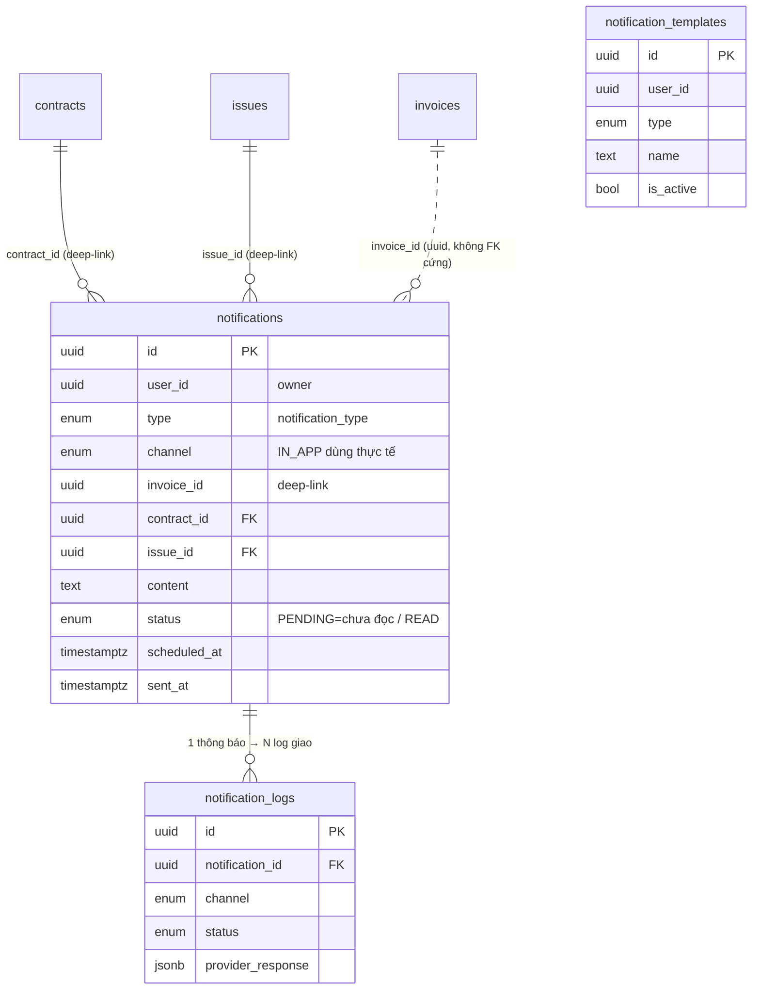
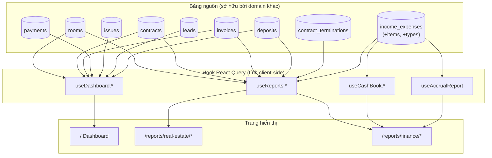
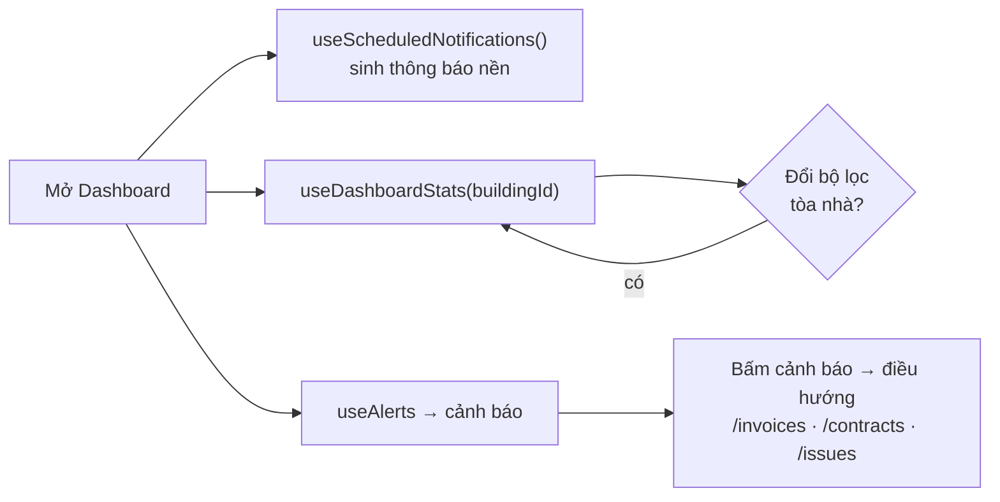
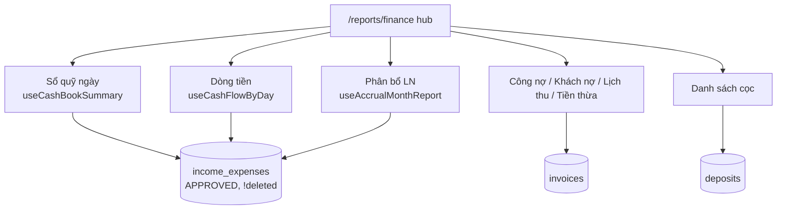

# Báo cáo · Dashboard · Thông báo

> Domain "tổng hợp & cảnh báo" của CRM. Phần lớn là **READ tổng hợp** dữ liệu từ
> các domain khác (HĐ, hoá đơn, thu chi, cọc, lead, công việc) để dựng KPI, biểu
> đồ, danh sách báo cáo; cộng thêm **3 bảng riêng** cho hệ thống thông báo
> (`notifications`, `notification_logs`, `notification_templates`).

## 1. Tổng quan & vai trò nghiệp vụ

Domain này gồm 3 nhóm chức năng tách biệt về dữ liệu nhưng cùng phục vụ mục tiêu
"nhìn nhanh — phản ứng kịp":

| Nhóm | Vai trò | Sở hữu bảng? |
|------|---------|--------------|
| **Dashboard** (`/`, [Dashboard.tsx](src/pages/Dashboard.tsx)) | KPI tổng (số căn, lấp đầy, doanh thu tháng, công nợ), biểu đồ doanh thu/lấp đầy/công nợ, danh sách cảnh báo & hoạt động gần đây | Không — đọc `rooms`/`contracts`/`payments`/`invoices`/`issues`/`leads`/`deposits` |
| **Báo cáo BĐS** (`/reports/real-estate/*`) | 8 báo cáo vận hành bất động sản: phòng trống, HĐ sắp hết hạn, lấp đầy, gia hạn/chuyển nhượng, khuyến mại, cho thuê mới, bỏ trả/thanh lý, tỉ lệ chi phí | Không — đọc `rooms`/`contracts`/`income_expenses` |
| **Báo cáo Tài chính** (`/reports/finance/*`) | 9 báo cáo dòng tiền/công nợ: sổ quỹ ngày, dòng tiền, phân bổ lợi nhuận, chia LN cổ đông, công nợ HĐ mới, khách nợ, lịch thanh toán, tiền thừa, danh sách cọc | Không — đọc `income_expenses`/`invoices`/`payments`/`deposits` |
| **Thông báo** (`/notifications`, chuông header) | Hàng đợi thông báo đa kênh (IN_APP đang dùng); auto-sinh nhắc HĐ hết hạn, nhắc/quá hạn hoá đơn, thiếu cọc | **Có** — `notifications`, `notification_logs`, `notification_templates` |

**Điểm cốt lõi cần nhớ:**

- **Báo cáo = view-only.** Không có RPC báo cáo riêng trong DB; mọi báo cáo được
  tính **client-side** trong hook React Query (`useReports`, `useDashboard`,
  `useCashBook`, `useAccrualReport`). Tính đúng/sai phụ thuộc vào việc query đúng
  bảng nguồn + RLS lọc dữ liệu theo quyền.
- **Sổ quỹ/dòng tiền lấy 1 nguồn duy nhất** = `income_expenses` (canonical
  ledger). Mỗi payment hoá đơn đã có row mirror trong `income_expenses` → tuyệt
  đối **không** cộng thêm bảng `payments`/`expenses` (đã từng gây double-count,
  xem [useCashBook.ts](src/hooks/useCashBook.ts) dòng 16–18, 73–75).
- **Thông báo hiện chỉ chạy kênh IN_APP.** Các kênh EMAIL/SMS/ZALO/PUSH có trong
  enum + cột template nhưng chưa có worker gửi thật; `notification_logs` chưa
  được ghi từ code app (chỉ có schema + RLS đọc).
- **Auto-sinh thông báo chạy ở client**, không phải cron DB: hook
  [useScheduledNotifications](src/hooks/useScheduledNotifications.ts) gọi
  `runScheduledNotifications(userId)` khi mount Dashboard và lặp mỗi 6 giờ.

## 2. Cấu trúc dữ liệu

Chỉ domain Thông báo sở hữu bảng. Báo cáo/Dashboard tham chiếu bảng của domain
khác (mô tả ở §6).

### 2.1. `notifications` — hàng đợi thông báo

Mục đích: 1 dòng = 1 thông báo cần phát (đến nhiều người nhận, qua 1 kênh).

Cột chủ chốt:

- `user_id` (uuid, NOT NULL) — **owner sở hữu** thông báo (multi-tenant). Code
  app set = `auth.uid()` của owner khi insert.
- `type` (`notification_type`, NOT NULL) — phân loại nghiệp vụ (xem enum §2.4).
- `channel` (`notification_channel`, NOT NULL) — kênh phát. Thực tế chỉ
  `IN_APP` được tạo & hiển thị.
- `recipient_tenant_ids` / `recipient_emails` / `recipient_phones` (ARRAY) —
  danh sách người nhận theo từng kênh. Với IN_APP auto-sinh, các mảng này
  thường để trống (thông báo hiển thị cho chính owner/staff).
- `subject` (text) — tiêu đề ngắn; `content` (text, NOT NULL, CHECK độ dài > 0)
  — nội dung hiển thị.
- `invoice_id` / `contract_id` / `issue_id` (uuid) — **deep-link** tới thực thể
  liên quan; UI điều hướng theo thứ tự ưu tiên invoice → contract → issue.
- `scheduled_at` (timestamptz) — thời điểm hẹn phát (cho kênh có lịch); auto-sinh
  IN_APP để null (phát ngay).
- `sent_at` (timestamptz), `status` (`notification_status`, default `PENDING`),
  `error_message` (text) — vòng đời phát/đọc/lỗi.
- `id`, `created_at` — chuẩn.

Lưu ý quan trọng: code dùng **`status` kiêm 2 ý nghĩa** với IN_APP —
`PENDING` = "chưa đọc", `READ` = "đã đọc" (xem
[useNotifications.ts](src/hooks/useNotifications.ts) dòng 99–107, 148–154). Không
có cờ `is_read` riêng.

FK đi ra: `contract_id → contracts.id`, `issue_id → issues.id`. (Cột `invoice_id`
là uuid nhưng **không** có ràng buộc FK cứng trong schema hiện tại.)
Được tham chiếu bởi: `notification_logs.notification_id`.

### 2.2. `notification_logs` — nhật ký phát theo từng người nhận

Mục đích: theo dõi trạng thái giao (delivery) của **mỗi recipient** của 1
notification (1 notification → N log). Phục vụ kênh ngoài (EMAIL/SMS/ZALO/PUSH).

Cột chủ chốt:

- `notification_id` (uuid, NOT NULL, FK → `notifications.id`, ON DELETE CASCADE).
- `recipient_id` / `recipient_email` / `recipient_phone` — định danh người nhận
  cụ thể của log này.
- `channel` (`notification_channel`, NOT NULL), `status` (`notification_status`,
  NOT NULL), `sent_at` (timestamptz).
- `error_message` (text), `provider_response` (jsonb) — payload trả về từ nhà
  cung cấp gửi (SMS/Zalo/email gateway).
- `id`, `created_at` — chuẩn.

Hiện trạng: **chưa được app ghi/đọc** trong mã nguồn front-end (chỉ có schema +
RLS). Là khung sẵn sàng cho worker gửi đa kênh tương lai.

### 2.3. `notification_templates` — mẫu thông báo đa kênh

Mục đích: mẫu nội dung tái sử dụng theo `type`, có biến thể cho từng kênh.

Cột chủ chốt:

- `user_id` (uuid, NOT NULL) — owner sở hữu template.
- `type` (`notification_type`, NOT NULL) — loại thông báo template áp dụng.
- `name` (text, NOT NULL, CHECK độ dài > 0) — tên template.
- Biến thể theo kênh: `email_subject`, `email_body`, `sms_content`,
  `zalo_template_id`, `push_title`, `push_body`.
- `is_active` (boolean, default true) — bật/tắt template.
- `id`, `created_at` — chuẩn.

Hiện trạng: **chưa có UI quản lý template** trong mã front-end; mọi nội dung
IN_APP auto-sinh được hard-code trong [notificationScheduler.ts](src/lib/notificationScheduler.ts)
và helper `getNotificationContent()` ([useNotifications.ts](src/hooks/useNotifications.ts) dòng 285–335),
**không** đọc từ bảng này. Bảng là khung mở rộng.

### 2.4. Enum của domain

| Enum | Nhãn | Ghi chú dùng thực tế |
|------|------|----------------------|
| `notification_type` | `NEW_INVOICE, PAYMENT_REMINDER, OVERDUE_INVOICE, CONTRACT_EXPIRING, ISSUE_RESOLVED, GENERAL_ANNOUNCEMENT, CUSTOM, DEPOSIT_SHORTFALL` | Auto-sinh thực tế: `CONTRACT_EXPIRING`, `PAYMENT_REMINDER`, `OVERDUE_INVOICE`, `DEPOSIT_SHORTFALL`. `NEW_INVOICE`/`ISSUE_RESOLVED`/`GENERAL_ANNOUNCEMENT`/`CUSTOM` dùng khi tạo thủ công. `DEPOSIT_SHORTFALL` chưa nằm trong type union của hook (dòng 7–14) nhưng đã được insert ở scheduler. |
| `notification_channel` | `IN_APP, EMAIL, SMS, ZALO, PUSH` | Chỉ `IN_APP` được tạo & hiển thị; còn lại là khung. |
| `notification_status` | `PENDING, SENT, FAILED, CANCELLED, READ` | Với IN_APP: `PENDING`=chưa đọc, `READ`=đã đọc. `SENT/FAILED/CANCELLED` dành cho kênh ngoài. |

## 3. Sơ đồ quan hệ dữ liệu

### 3.1. Bảng riêng của domain Thông báo

### 3.2. Luồng dữ liệu Báo cáo/Dashboard (đọc tổng hợp xuyên domain)

> Lưu ý cạnh `deposits → useDash`: Dashboard đọc `deposits` **gián tiếp** qua
> `<OperationsSummary>` (`useDeposits`, [OperationsSummary.tsx](src/components/dashboard/OperationsSummary.tsx)
> dòng 7, 85). Riêng cảnh báo thiếu cọc lại đọc `contracts.deposit_remaining`
> ([useDashboard.ts](src/hooks/useDashboard.ts) ~dòng 377), không phải bảng `deposits`.

## 4. Quy tắc nghiệp vụ & tự động hoá

Domain này **không có RPC/trigger DB riêng**. Tự động hoá nằm ở 2 chỗ: (a) bộ
sinh thông báo client-side, (b) các phép tổng hợp trong hook báo cáo. Bảo vệ
dữ liệu là RLS.

### 4.1. RLS của 3 bảng thông báo

Định nghĩa gốc tại [007_advanced_tables.sql](supabase/migrations/007_advanced_tables.sql)
(dòng 211–313):

- `notifications` / `notification_templates`: policy `FOR ALL USING (user_id = auth.uid())`
  → owner toàn quyền trên dữ liệu của mình.
- `notification_logs`: chỉ `SELECT` qua subquery kiểm
  `notifications.user_id = auth.uid()` (xem được log của notification mình sở hữu).
- Mở rộng cho **staff** tại [20260510000056_staff_write_rls.sql](supabase/migrations/20260510000056_staff_write_rls.sql)
  (dòng 113): `notifications` được cấp policy `*_staff_insert/update/delete` dùng
  `staff_can('notifications','create'|'edit'|'delete', user_id)` → nhân viên có
  module quyền `notifications` thao tác được trên thông báo của employer.

**Invariant:** mọi thông báo phải gắn 1 `user_id` (owner). Staff thấy/sửa thông
báo của employer qua `staff_can`, không phải qua `user_id = auth.uid()`.

### 4.2. Bộ sinh thông báo tự động — `runScheduledNotifications`

Vị trí: [notificationScheduler.ts](src/lib/notificationScheduler.ts). Gọi từ
[useScheduledNotifications](src/hooks/useScheduledNotifications.ts) — chạy **ở
client** khi Dashboard mount + lặp **mỗi 6 giờ** (`setInterval`). Chạy song song
4 kiểm tra (`Promise.all`):

| Hàm | Quét gì | Ngưỡng / nhịp | Insert notification |
|-----|---------|---------------|---------------------|
| `checkContractExpiryReminders` | HĐ `ACTIVE`/`EXTENDED`, `daysUntilExpiry ∈ reminderDays` | mặc định `[30,15,7]` (đọc từ `settings` key `notification_config`) | `CONTRACT_EXPIRING`, gắn `contract_id` |
| `checkInvoicePaymentReminders` | Hoá đơn `APPROVED`/`PARTIAL_PAID`, `daysUntilDue ∈ reminderDays` | mặc định `[7,3,1]` | `PAYMENT_REMINDER`, gắn `invoice_id` |
| `checkOverdueInvoices` | Hoá đơn `APPROVED`/`PARTIAL_PAID`, `due_date < now` | tần suất `DAILY`/`WEEKLY`/`NONE` (config) | `OVERDUE_INVOICE`, gắn `invoice_id` |
| `checkDepositTopupReminders` | HĐ `ACTIVE`/`EXTENDED`, `deposit_remaining ≥ 10.000`, `deposit_debt_mode` null/`DEBT` | quá hẹn (`deposit_topup_due_date < today`) → 1 lần/ngày; chưa tới hẹn → 1 lần/tuần | `DEPOSIT_SHORTFALL`, gắn `contract_id` |

**Chống trùng (de-dup) — invariant quan trọng:**

- Nhắc HĐ hết hạn & nhắc thanh toán: trước khi insert, query notification cùng
  `contract_id`/`invoice_id` + cùng `type` có `created_at >= đầu ngày hôm nay`
  → nếu đã có thì bỏ qua (tối đa 1 lần/ngày/thực thể).
- Quá hạn hoá đơn & thiếu cọc: lấy notification gần nhất cùng type, so
  `daysSinceLastSent` với nhịp (1 ngày / 7 ngày) → throttle.

**Lưu ý loại trừ thiếu cọc:** `checkDepositTopupReminders` **không** nhắc HĐ ở
chế độ `FIRST_INVOICE` (khoản cọc thu qua hoá đơn đầu) — vì đã có nhắc hoá đơn
quá hạn riêng, tránh nhắc 2 lần cùng 1 khoản. Điều kiện `.or('deposit_debt_mode.is.null,deposit_debt_mode.eq.DEBT')`.

> Hệ quả kiến trúc: vì scheduler chạy client, thông báo chỉ được sinh khi có
> user mở app. Không có cron DB cho thông báo (khác với pg_cron sinh phiếu thu
> chi định kỳ ở domain Thu chi).

### 4.3. Quy tắc tổng hợp trong hook báo cáo (các invariant tính toán)

- **Sổ quỹ / dòng tiền — 1 nguồn `income_expenses`** ([useCashBook.ts](src/hooks/useCashBook.ts)):
  chỉ cộng `income_expenses` với `approval_status='APPROVED'` và `deleted_at IS NULL`.
  Số dư đầu kỳ = `Σ(INCOME) − Σ(EXPENSE)` của mọi phiếu `voucher_date < start_date`.
  **Không** đọc `payments`/`expenses` (đã mirror → double-count).
- **Doanh thu Dashboard** ([useDashboard.ts](src/hooks/useDashboard.ts) dòng 104–110)
  lấy từ `payments.amount` theo `payment_date` trong tháng. (Khác với sổ quỹ —
  đây là số liệu nhanh cho card, có thể lệch với ledger.)
- **Công nợ** = `Σ(total_amount − paid_amount)` của hoá đơn `APPROVED`/`PARTIAL_PAID`,
  `deleted_at IS NULL`.
- **Lấp đầy**: phòng "đã thuê" = phòng có HĐ `ACTIVE`/`EXTENDED` (đếm
  `room_id`); `availableRooms = totalRooms − occupied`. `getBuildingIds()` tin
  RLS cho phạm vi tòa nhà của staff/owner (không tự suy danh sách → tránh
  `totalRooms=0` mà `occupied>0`, dòng 49–61).
- **Báo cáo accrual (P&L tháng)** ([useAccrualReport.ts](src/hooks/useAccrualReport.ts)):
  hạng mục có kỳ áp dụng `[start,end]` nhiều tháng → **chia đều** ra các tháng
  (`allocateAmountByMonth`); hạng mục null-period → ghi trọn vào tháng
  `voucher_date`. Invariant: `Σ` mọi phần qua mọi tháng của mọi item ==
  `Σ total_amount` của voucher.
- **Tỉ lệ chi phí/doanh thu** ([useReports.ts](src/hooks/useReports.ts) `useExpenseRatioReport`):
  tử số = `Σ income_expense_items.amount` của phiếu `EXPENSE` `APPROVED` theo
  nhóm `income_expense_types.category`; mẫu số = `Σ income_expenses.total_amount`
  của phiếu `INCOME` `APPROVED` theo tháng `voucher_date` (doanh thu thực thu,
  **không** lấy `invoices.total_amount` để khỏi tính HĐ chưa thu).
- **Tỉ lệ bỏ trả** (`useTerminationsReport`): mẫu số = số HĐ chưa xoá, `status ≠ DRAFT`;
  ngày hiệu lực lấy `actual_end_date ?? end_date` (lọc client-side để fallback).

## 5. Quy trình theo từng trang

### 5.1. Dashboard — `/`

[Dashboard.tsx](src/pages/Dashboard.tsx). Mục đích: màn hình mở đầu, KPI + biểu
đồ + cảnh báo + hoạt động.

Dữ liệu hiển thị (hook trong [useDashboard.ts](src/hooks/useDashboard.ts)):

- `useDashboardStats(buildingId)` → 5 card: tổng căn, đang thuê (+ % lấp đầy),
  trống, doanh thu tháng (+ HĐ mới tháng), công nợ tổng (+ số việc chưa xử lý).
  `refetchInterval: 60s`.
- `useBuildings()` → bộ lọc tòa nhà (SearchableSelect, đúng quy ước combobox).
- `useVacantRoomsReport(buildingId)` → dialog "Danh sách phòng trống" khi bấm card
  Trống (hiển thị `days_vacant` tô màu theo ngưỡng 7/30 ngày).
- `<OperationsSummary>` ([OperationsSummary.tsx](src/components/dashboard/OperationsSummary.tsx))
  → 3 widget kiểu iHome: tổng quan lead (`useLeads`), cọc (`useDeposits`), HĐ
  (`useContracts` + `isContractInEffect`).
- `<RevenueChart>`, `<OccupancyChart>` (`useRevenueChart`/`useOccupancyChart`),
  `<DebtChart>` → 3 biểu đồ.
- `<AlertsList>` (`useAlerts`) → cảnh báo: hoá đơn quá hạn, HĐ sắp hết hạn (≤30
  ngày), việc khẩn >24h, **thiếu cọc**; sắp xếp theo severity.
- `<RecentActivities>` (`useRecentActivities`) → HĐ/thu tiền/việc mới 7 ngày.
- `useScheduledNotifications()` → kích hoạt bộ sinh thông báo (xem §4.2).
- `OnboardingWizard` hiển thị nếu chưa hoàn tất onboarding.

Thao tác chính: đổi bộ lọc tòa nhà → mọi hook re-query theo `buildingId`. Bấm
card Trống → mở dialog → bấm dòng → điều hướng `/apartments/:roomId`. Edge case:
staff không có tòa nào hiển thị → RLS trả rỗng (đã xử lý để tránh số âm).

### 5.2. Trang Thông báo — `/notifications`

[NotificationsPage.tsx](src/pages/NotificationsPage.tsx). Mục đích: trung tâm
thông báo IN_APP đầy đủ.

Dữ liệu: `useNotifications()` (lấy mọi thông báo `channel='IN_APP'`, mới nhất
trước). Mutation: `useMarkAsRead`, `useMarkAllAsRead`, `useDeleteNotification`,
`useDeleteAllRead`.

Thao tác theo từng bước:

1. Lọc client-side theo 2 chiều: tab **Tất cả / Chưa đọc** (`status !== 'READ'`)
   + nút lọc theo `type` (Hóa đơn mới, Nhắc thanh toán, Quá hạn, HĐ hết hạn,
   Công việc, Thông báo chung).
2. Bấm 1 thông báo → `handleNotificationClick`: nếu chưa đọc → `useMarkAsRead`
   (set `status='READ'`); rồi điều hướng theo deep-link ưu tiên `invoice_id` →
   `contract_id` → `issue_id`.
3. "Đánh dấu đã đọc" (toàn bộ) → `useMarkAllAsRead` (update mọi IN_APP chưa READ).
4. Xóa 1 thông báo (nút X) / "Xóa đã đọc" → `useDeleteNotification` /
   `useDeleteAllRead`.

Edge case: enum cũ có thể chưa có nhãn `READ` → `useUnreadNotificationsCount`
đếm theo `status='PENDING'` thay vì `!='READ'`. Type union trong hook chưa liệt
kê `DEPOSIT_SHORTFALL` (nhưng badge/màu rơi vào nhánh default "Khác").

### 5.3. Chuông thông báo (header) — `<NotificationBell>`

[NotificationBell.tsx](src/components/layout/NotificationBell.tsx). Badge đỏ =
`useUnreadNotificationsCount` (`PENDING`, IN_APP). Dropdown =
`useRecentNotifications(10)`. Cùng tập mutation như trang đầy đủ; bấm "Xem tất
cả" → `/notifications`. Lưu ý: deep-link `issue_id` tạm dừng điều hướng (công
việc đang xây lại).

### 5.4. Hub Báo cáo BĐS — `/reports/real-estate`

[RealEstateReportsPage.tsx](src/pages/reports/RealEstateReportsPage.tsx). Lưới 8
thẻ điều hướng (tĩnh, không gọi data). Các báo cáo con:

| Báo cáo | Route | Hook | Nguồn dữ liệu |
|---------|-------|------|---------------|
| Căn hộ trống | `/reports/real-estate/vacant` (+ `/vacant-rooms`) | `useVacantRoomsReport` | `rooms` − `contracts` ACTIVE/EXTENDED; `days_vacant` từ `contracts` TERMINATED/EXPIRED (`actual_end_date ?? end_date`) |
| Căn hộ sắp trống (HĐ sắp hết hạn) | `/reports/real-estate/expiring` (+ `/expiring-contracts`) | `useExpiringContractsReport(daysAhead)` | `contracts` ACTIVE/EXTENDED `end_date ∈ [today, today+N]` |
| Gia hạn / chuyển nhượng | `/reports/real-estate/renewals-transfers` | `useRenewalsTransfersReport` | `contracts` status `EXTENDED`/`TRANSFERRED` |
| Tỉ lệ lấp đầy | `/reports/real-estate/occupancy-new` (+ `/occupancy`) | `useOccupancyReport` + `useOccupancyTrend` | `rooms` + `contracts` (theo tòa, trend 12 tháng) |
| Khuyến mại | `/reports/real-estate/promotions` | `usePromotionsReport` | `contracts` có `discounts` |
| Cho thuê mới | `/reports/real-estate/new-leases` | `useNewLeasesReport` | `contracts` theo `signed_date` |
| Bỏ trả / thanh lý | `/reports/real-estate/terminations` | `useTerminationsReport` | `contracts` TERMINATED/EXPIRED + `contract_terminations` (lý do) |
| Tỉ lệ chi phí/DT | `/reports/real-estate/expense-ratio` | `useExpenseRatioReport` | `income_expenses` (+items, +types) |

Mẫu thao tác chung: chọn bộ lọc (tòa/tầng/khoảng ngày) → hook re-query → bảng +
biểu đồ + nút xuất (ExportButtons). Mọi báo cáo có `is(deleted_at, null)`.

### 5.5. Hub Báo cáo Tài chính — `/reports/finance`

[FinanceReportsPage.tsx](src/pages/reports/FinanceReportsPage.tsx). Lưới 9 thẻ.
Báo cáo con:

| Báo cáo | Route | Hook | Nguồn dữ liệu |
|---------|-------|------|---------------|
| Sổ quỹ theo ngày | `/reports/finance/daily-cashbook` (+ `/cash-book`) | `useCashFlowByDay` + `useCashBookSummary` | `income_expenses` APPROVED (số dư đầu/cuối ngày) |
| Dòng tiền | `/reports/finance/cash-flow` | `useCashFlowByDay` | `income_expenses` APPROVED → gom 12 tháng + 4 quý |
| Phân bổ lợi nhuận | `/reports/finance/profit-distribution` | `useAccrualMonthReport` | `income_expense_items` + vouchers (accrual theo kỳ) |
| Chia LN cổ đông | `/finance/shareholder-profit` (thẻ link thẳng; redirect chỉ từ `/reports/finance/shareholder-profit`) | (domain cổ đông) | → domain Cổ đông |
| Công nợ HĐ mới | `/reports/finance/new-contract-debt` (+ `/debt`) | `useDebtReport` | `invoices` APPROVED/PARTIAL_PAID/OVERDUE + aging |
| Khách nợ tiền | `/reports/finance/customer-debt` | `useCustomerDebtReport` | `invoices` gom theo khách (đại diện HĐ) |
| Lịch thanh toán | `/reports/finance/payment-schedule` | `usePaymentScheduleReport(365)` | `invoices` `due_date ≤ today+N` |
| Tiền thừa | `/reports/finance/overpayment` | `useOverpaymentReport` | `invoices` `paid_amount > total_amount` |
| Danh sách cọc | `/reports/finance/deposits` | `useDepositsReport` | `deposits` (+tenant +room) |

Lưu ý: hub ghi nhãn "9 báo cáo" và route `/debt` ≡ `/new-contract-debt` cùng
trỏ `DebtReport` (aging 0-30/31-60/61-90/>90). `CashFlowReport` dùng
`useCashFlowByDay` (ledger), **không** dùng `useCashFlowReport` của
`useReports.ts` (hook đó còn nhưng đã bị thay).

### 5.6. Báo cáo chứa logic đáng lưu ý

- **DepositsReport** ([DepositsReport.tsx](src/pages/reports/finance/DepositsReport.tsx)):
  map `deposit_status` (PENDING/CONFIRMED/CONVERTED/REFUNDED/FORFEITED) sang nhãn
  Việt; nhóm "đang giữ" = PENDING+CONFIRMED, "đã vào HĐ" = CONVERTED. Lọc tòa
  theo **tên** tòa (so `rooms.buildings.name`).
- **TerminationsReport** (`useTerminationsReport`): ghép `contract_terminations`
  để hiển thị lý do/loại chấm dứt; lọc khoảng ngày client-side với fallback
  `actual_end_date ?? end_date`.

## 6. Liên kết sang domain khác (vào / ra)

**Ra (domain này đọc/điều hướng tới domain khác):**

- → **Hợp đồng**: hầu hết báo cáo BĐS + nhắc HĐ/thiếu cọc đọc `contracts`
  (status ACTIVE/EXTENDED/TERMINATED/EXPIRED, `deposit_remaining`,
  `deposit_topup_due_date`, `discounts`); deep-link `/contracts/:id`.
- → **Hoá đơn & Thanh toán**: công nợ/lịch thu/tiền thừa/sổ quỹ-dashboard đọc
  `invoices`/`payments`; deep-link `/invoices/:id`.
- → **Thu chi (income_expenses)**: sổ quỹ, dòng tiền, accrual, tỉ lệ chi phí —
  nguồn canonical ledger; là phụ thuộc lớn nhất của báo cáo tài chính.
- → **Cọc (deposits / contract_terminations)**: báo cáo cọc, cảnh báo thiếu cọc,
  báo cáo thanh lý.
- → **Phòng/Tòa (rooms/buildings)**: phòng trống, lấp đầy, KPI Dashboard.
- → **Lead, Công việc (leads/issues)**: OperationsSummary + cảnh báo việc khẩn;
  deep-link `/issues/:id` (tạm dừng).
- → **Cổ đông**: thẻ "Chia LN cổ đông" redirect `/finance/shareholder-profit`.

**Vào (domain khác ghi/đọc bảng của domain này):**

- Các domain nghiệp vụ có thể tạo `notifications` thủ công (vd thông báo HĐ mới)
  qua `useCreateNotification`; `getNotificationContent()` sinh nội dung mẫu.
- `notifications.contract_id`/`issue_id` là **FK cứng** vào `contracts`/`issues`
  → xoá HĐ/việc có ràng buộc; `invoice_id` chỉ là uuid (không FK).
- RLS thông báo dựa `staff_can('notifications', …)` từ domain Phân quyền/RBAC →
  nhân viên có module quyền thông báo của employer mới thao tác được.

**Cross-link tóm tắt:**
Báo cáo/Dashboard là tầng **đọc tổng hợp** ngồi trên gần như mọi domain vận hành;
Thông báo là tầng **đẩy cảnh báo** đứng cuối vòng đời (lead → cọc → HĐ → chỉ số →
hoá đơn → thu chi → **báo cáo/cảnh báo** → lợi nhuận).
